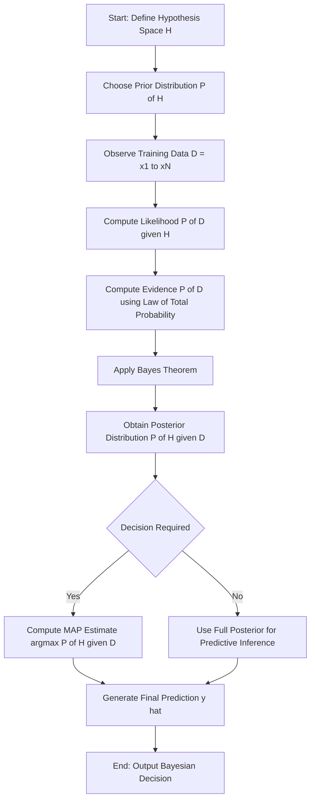
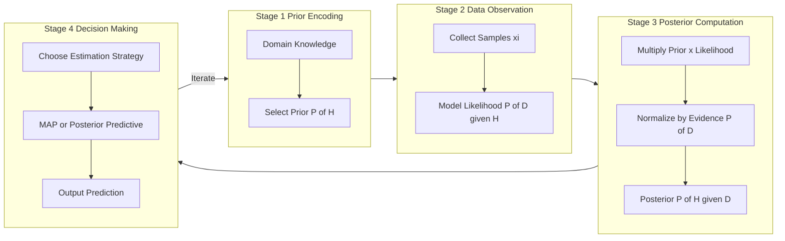
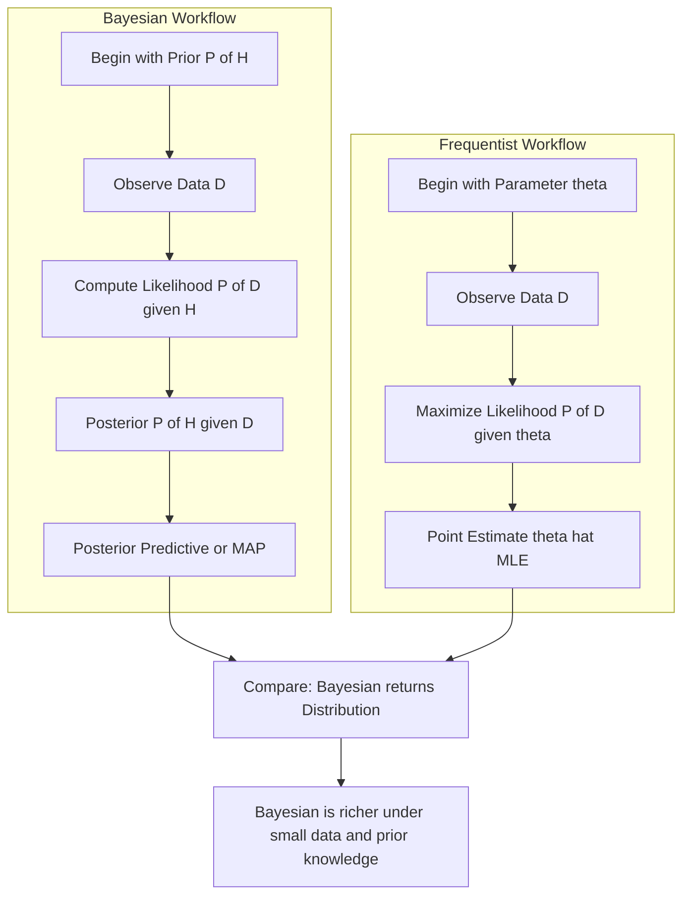
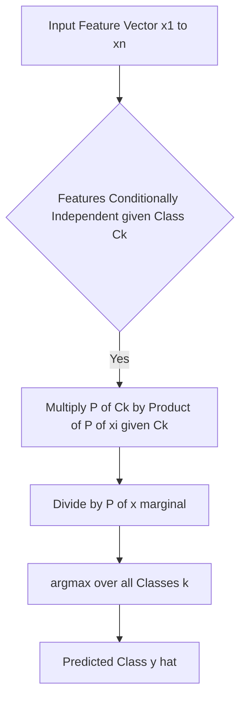

# Bayesian formulation.

<!-- SECTION_1_START -->
# Bayesian Formulation in Machine Learning

## 1.1 Formal Academic Definition

> [!IMPORTANT]
> **Bayesian Formulation** is a rigorous probabilistic framework in machine learning that applies **Bayes' Theorem** to update the probability of a hypothesis or model parameter as more evidence or data becomes available. It treats all forms of uncertainty — both in data and in model parameters — as probability distributions rather than as fixed, deterministic quantities.

In the KTU 2024 Scheme context (Course Code: PCCST503), Bayesian formulation is the foundational probabilistic backbone used in classifiers, regression models, and generative learning algorithms. The general statement of Bayes' Theorem is:

$$
P(H \mid E) \;=\; \frac{P(E \mid H) \cdot P(H)}{P(E)}
$$

where each term carries a precise statistical meaning in supervised and unsupervised learning.

## 1.2 The Four Pillars of Bayesian Reasoning

| Term | Notation | Role in Learning | Common Name |
| :--- | :--- | :--- | :--- |
| **Posterior** | $P(H \mid E)$ | Updated belief after seeing evidence | The quantity we want |
| **Likelihood** | $P(E \mid H)$ | Probability of evidence given the hypothesis | Data fit under model |
| **Prior** | $P(H)$ | Belief *before* observing evidence | Domain knowledge |
| **Evidence** | $P(E)$ | Marginal probability of the data | Normalizing constant |

## 1.3 Conceptual Analogy — The Medical Diagnosis Intuition

Imagine a patient walks into a clinic for a disease test. The doctor is essentially a **Bayesian reasoner**:

1. **Prior Belief $P(H)$** — Before the test, the doctor recalls the prevalence of the disease in the population. If only **1 in 1000** people have it, the prior $P(\text{Disease}) = 0.001$.
2. **Likelihood $P(E \mid H)$** — The test is **95% sensitive**, meaning $P(\text{Positive} \mid \text{Disease}) = 0.95$. It also has a **5% false-positive rate**, so $P(\text{Positive} \mid \text{No Disease}) = 0.05$.
3. **Evidence $P(E)$** — The overall probability that a randomly chosen person tests positive, calculated using the **Law of Total Probability**.
4. **Posterior $P(H \mid E)$** — After seeing a positive result, the *revised* probability that the patient actually has the disease.

This mirrors how a machine learning model "learns": it begins with a **prior distribution over parameters**, observes **data (likelihood)**, and produces an **updated posterior distribution** that quantifies refined knowledge.

> [!NOTE]
> **Key Insight for KTU Examinations:** Bayesian formulation is the mathematical mechanism that converts *a priori* beliefs into *a posteriori* knowledge through observed data — the very definition of *learning* in probabilistic AI systems.

## 1.4 Visualization Setup for Posterior Combination

> [!VISUALIZATION CONTROL]
> **Concept:** Visualization of a Gaussian Prior and Gaussian Likelihood producing a sharper Gaussian Posterior (Bayesian Updating).
> **GeoGebra / Desmos Input Equations:**
> * Prior: $f_1(x) = \dfrac{1}{\sqrt{2\pi \cdot 0.8^{2}}} \, e^{-\frac{(x-2)^{2}}{2 \cdot 0.8^{2}}}$
> * Likelihood: $f_2(x) = \dfrac{1}{\sqrt{2\pi \cdot 0.6^{2}}} \, e^{-\frac{(x-3)^{2}}{2 \cdot 0.6^{2}}}$
> * Posterior: $f_3(x) = \dfrac{f_2(x) \cdot f_1(x)}{\int_{-\infty}^{\infty} f_2(t) \cdot f_1(t) \, dt}$
> **Visual Description:** The student should observe the prior (centered at $x=2$) and likelihood (centered at $x=3$). The posterior curve sits *between* the two, with a *narrower* (smaller) variance, demonstrating that combining information **reduces uncertainty** — a fundamental Bayesian principle.

<!-- SECTION_1_END -->

<!-- SECTION_2_START -->
# Deep Theoretical Analysis & KTU High-Yield Formula Sheet

## 2.1 The Bayesian Inference Pipeline — Step-by-Step Logic

### Step 1 — Foundation: Conditional Probability
The probability of event $A$ given that $B$ has occurred is defined as:

$$
P(A \mid B) \;=\; \frac{P(A \cap B)}{P(B)}, \quad \text{provided } P(B) > 0
$$

This expresses how the sample space *shrinks* when we condition on observed evidence.

### Step 2 — Symmetry of Joint Probability
The joint occurrence $P(A \cap B)$ can be decomposed in two valid ways:

$$
P(A \cap B) \;=\; P(A \mid B) \, P(B) \;=\; P(B \mid A) \, P(A)
$$

This **symmetry** is the algebraic seed from which Bayes' Theorem germinates.

### Step 3 — Derivation of Bayes' Theorem
Rearranging the symmetry equation to solve for $P(A \mid B)$:

$$
P(A \mid B) \;=\; \frac{P(B \mid A) \, P(A)}{P(B)}
$$

Substituting $H$ for the hypothesis and $E$ for the evidence (the standard KTU convention):

$$
\boxed{\,P(H \mid E) \;=\; \frac{P(E \mid H) \cdot P(H)}{P(E)}\,}
$$

### Step 4 — Expanding the Evidence via the Law of Total Probability
For a discrete hypothesis space $\{H_1, H_2, \ldots, H_n\}$ that forms a partition of the sample space:

$$
P(E) \;=\; \sum_{i=1}^{n} P(E \mid H_i) \, P(H_i)
$$

For continuous parameters, the sum becomes an integral:

$$
P(E) \;=\; \int P(E \mid \theta) \, P(\theta) \, d\theta
$$

### Step 5 — The Posterior Predictive Distribution
Once the posterior $P(H \mid E)$ is computed, predictions for new data $E'$ are obtained by integrating over all plausible hypotheses:

$$
P(E' \mid E) \;=\; \int P(E' \mid \theta) \, P(\theta \mid E) \, d\theta
$$

This is the engine behind Bayesian linear regression, Gaussian processes, and Bayesian neural networks.

## 2.2 Bayesian vs. Frequentist Paradigm

| Aspect | Bayesian Approach | Frequentist Approach |
| :--- | :--- | :--- |
| Nature of parameters | Random variables with distributions | Fixed but unknown constants |
| Interpretation of probability | Degree of belief | Long-run frequency |
| Role of prior | Central; encodes prior knowledge | Absent |
| Output | Full posterior distribution | Point estimate (e.g., MLE) |
| Data usage | Updates beliefs sequentially | Single-shot likelihood maximization |
| Small-data behavior | Robust (prior regularizes) | Prone to overfitting |
| Computational cost | Often requires MCMC / Variational Inference | Closed-form MLE available |

## 2.3 Maximum A Posteriori (MAP) Estimation

When the posterior is unimodal and we desire a single point estimate, we take its **mode**:

$$
\hat{\theta}_{\text{MAP}} \;=\; \underset{\theta}{\arg\max} \; P(\theta \mid D) \;=\; \underset{\theta}{\arg\max} \; P(D \mid \theta) \, P(\theta)
$$

Note that the evidence $P(D)$ drops out as it is independent of $\theta$.

## 2.4 Maximum Likelihood Estimation (MLE) as a Bayesian Special Case

When the prior is **uniform** (improper or non-informative), the posterior becomes proportional to the likelihood:

$$
\hat{\theta}_{\text{MLE}} \;=\; \underset{\theta}{\arg\max} \; P(D \mid \theta)
$$

Thus MLE is mathematically equivalent to MAP *with* a flat prior — a frequently asked KTU conceptual question.

## 2.5 KTU Formula Sheet — Bayesian Formulation Cheat Sheet

> [!NOTE]
> **Save this table — it covers 90% of KTU 2024 Module 1 numerical and derivation questions.**

| Formula / Concept | Mathematical Statement | Application Context |
| :--- | :--- | :--- |
| Bayes' Theorem | $P(H \mid E) = \dfrac{P(E \mid H) P(H)}{P(E)}$ | All Bayesian inference |
| Law of Total Probability (Discrete) | $P(E) = \sum_{i=1}^{n} P(E \mid H_i) P(H_i)$ | Marginalizing nuisance variables |
| Law of Total Probability (Continuous) | $P(E) = \int P(E \mid \theta) P(\theta) \, d\theta$ | Continuous parameter spaces |
| Posterior Predictive | $P(E' \mid E) = \int P(E' \mid \theta) P(\theta \mid E) d\theta$ | Bayesian prediction |
| MAP Estimate | $\hat\theta_{\text{MAP}} = \arg\max_\theta \log P(D \mid \theta) + \log P(\theta)$ | Regularized estimation |
| MLE Estimate | $\hat\theta_{\text{MLE}} = \arg\max_\theta \log P(D \mid \theta)$ | Likelihood-only learning |
| Log-Posterior | $\log P(\theta \mid D) = \log P(D \mid \theta) + \log P(\theta) - \log P(D)$ | Numerical stability |
| Odds Form | $\dfrac{P(H \mid E)}{P(\bar{H} \mid E)} = \dfrac{P(E \mid H)}{P(E \mid \bar{H})} \cdot \dfrac{P(H)}{P(\bar{H})}$ | Posterior odds = Likelihood ratio × Prior odds |
| Conjugate Priors | Beta–Bernoulli, Dirichlet–Multinomial, Gaussian–Gaussian | Closed-form posteriors |
| Naive Bayes Joint | $P(C, x_1, \ldots, x_n) = P(C) \prod_{i=1}^{n} P(x_i \mid C)$ | Generative classification |
| Posterior Variance (Gaussian) | $\sigma_{\text{post}}^{2} = \left( \dfrac{1}{\sigma_{\text{prior}}^{2}} + \dfrac{N}{\sigma_{\text{likelihood}}^{2}} \right)^{-1}$ | Bayesian update of uncertainty |
| Posterior Mean (Gaussian) | $\mu_{\text{post}} = \sigma_{\text{post}}^{2} \left( \dfrac{\mu_{\text{prior}}}{\sigma_{\text{prior}}^{2}} + \dfrac{N \bar{x}}{\sigma_{\text{likelihood}}^{2}} \right)$ | Updated mean estimate |

## 2.6 Real-World Engineering Utility

Bayesian formulation is not a theoretical curiosity — it powers production systems:

* **Spam Filtering** (Gmail, Outlook) — Naive Bayes classifiers update word-probability priors with every observed email.
* **Medical Diagnosis AI** — Bayesian networks encode causal relationships between symptoms and diseases.
* **Autonomous Vehicles** — Bayesian filters (Kalman, Particle) fuse noisy sensor data with prior motion models.
* **Recommendation Systems** — Bayesian Probabilistic Matrix Factorization handles cold-start uncertainty.
* **A/B Testing** — Bayesian inference provides credible intervals instead of brittle p-values.
* **Natural Language Processing** — Latent Dirichlet Allocation (topic modeling) is fully Bayesian.

<!-- SECTION_2_END -->

<!-- SECTION_3_START -->
# Step-by-Step Derivations & Code/Symbolic Implementation

## 3.1 Exhaustive Derivation of Bayes' Theorem

We begin with the formal definition of **conditional probability** for two events $A$ and $B$ in a probability space $(\Omega, \mathcal{F}, P)$:

$$
P(A \mid B) \;=\; \frac{P(A \cap B)}{P(B)}, \quad P(B) > 0
$$

Equivalently, by symmetry of the intersection:

$$
P(B \mid A) \;=\; \frac{P(A \cap B)}{P(A)}, \quad P(A) > 0
$$

Setting the two expressions for $P(A \cap B)$ equal to each other:

$$
P(A \mid B) \, P(B) \;=\; P(B \mid A) \, P(A)
$$

Dividing both sides by $P(B)$ to isolate $P(A \mid B)$:

$$
P(A \mid B) \;=\; \frac{P(B \mid A) \, P(A)}{P(B)}
$$

Renaming $A \rightarrow H$ (hypothesis) and $B \rightarrow E$ (evidence) to align with machine learning notation:

$$
\boxed{\,P(H \mid E) \;=\; \frac{P(E \mid H) \cdot P(H)}{P(E)}\,}
$$

The denominator $P(E)$ can be expanded for a discrete hypothesis space $\{H_1, H_2, \ldots, H_n\}$ via the **Law of Total Probability**:

$$
P(E) \;=\; \sum_{i=1}^{n} P(E \mid H_i) \cdot P(H_i)
$$

Therefore, the *fully expanded* Bayesian formula is:

$$
P(H_k \mid E) \;=\; \frac{P(E \mid H_k) \cdot P(H_k)}{\sum_{i=1}^{n} P(E \mid H_i) \cdot P(H_i)}
$$

This expanded form is the version students must reproduce in the KTU 14-mark derivation question.

## 3.2 Worked Numerical Example — Medical Diagnosis

> [!IMPORTANT]
> **This is a classic KTU numerical problem. Practice computing each term explicitly.**

**Given Information:**
* Disease prevalence: $P(D) = 0.01$, therefore $P(\bar{D}) = 0.99$
* Test sensitivity (true positive rate): $P(+\mid D) = 0.95$
* Test false-positive rate: $P(+\mid \bar{D}) = 0.05$

**Required:** Find $P(D \mid +)$ — the probability the patient has the disease *given* a positive test result.

**Step 1 — Compute the Evidence $P(+)$ using the Law of Total Probability:**

$$
P(+) \;=\; P(+\mid D) \cdot P(D) + P(+\mid \bar{D}) \cdot P(\bar{D})
$$

Substituting numerical values:

$$
P(+) \;=\; (0.95)(0.01) + (0.05)(0.99)
$$

$$
P(+) \;=\; 0.0095 + 0.0495
$$

$$
P(+) \;=\; 0.0590
$$

**Step 2 — Apply Bayes' Theorem to find the Posterior:**

$$
P(D \mid +) \;=\; \frac{P(+\mid D) \cdot P(D)}{P(+)}
$$

$$
P(D \mid +) \;=\; \frac{(0.95)(0.01)}{0.0590}
$$

$$
P(D \mid +) \;=\; \frac{0.0095}{0.0590} \;\approx\; 0.1610
$$

**Step 3 — Interpret the Result:**

$$
P(D \mid +) \;\approx\; 16.10\%
$$

> [!NOTE]
> **Counterintuitive Insight:** Even with a 95% accurate test, a positive result only raises the patient's risk from 1% (the prior) to about 16% (the posterior). This is **Base Rate Fallacy** in action — a directly testable KTU concept. The posterior is heavily influenced by the *low prior* prevalence.

## 3.3 Derivation of the Posterior for Gaussian-Gaussian Conjugate Model

**Setup:** We have a prior on the mean $\mu$ of a Gaussian likelihood:

* Prior: $\mu \sim \mathcal{N}(\mu_0, \sigma_0^{2})$
* Likelihood: $x_i \sim \mathcal{N}(\mu, \sigma^{2})$, with $N$ i.i.d. observations

**Step 1 — Write the prior density:**

$$
P(\mu) \;=\; \frac{1}{\sqrt{2\pi\sigma_0^{2}}} \exp\left( -\frac{(\mu - \mu_0)^2}{2\sigma_0^{2}} \right)
$$

**Step 2 — Write the likelihood of the dataset $D = \{x_1, \ldots, x_N\}$:**

$$
P(D \mid \mu) \;=\; \prod_{i=1}^{N} \frac{1}{\sqrt{2\pi\sigma^{2}}} \exp\left( -\frac{(x_i - \mu)^2}{2\sigma^{2}} \right)
$$

**Step 3 — Compute the unnormalized posterior (up to the evidence $P(D)$):**

$$
P(\mu \mid D) \;\propto\; P(D \mid \mu) \cdot P(\mu)
$$

**Step 4 — Take the natural log to convert products to sums (log-posterior):**

$$
\log P(\mu \mid D) \;=\; \text{const} \;-\; \frac{N(\mu - \bar{x})^2}{2\sigma^{2}} \;-\; \frac{(\mu - \mu_0)^2}{2\sigma_0^{2}}
$$

**Step 5 — Collect coefficients of $\mu^2$ to identify the posterior precision:**

$$
\log P(\mu \mid D) \;=\; \text{const} \;-\; \frac{1}{2}\left( \frac{N}{\sigma^{2}} + \frac{1}{\sigma_0^{2}} \right) \mu^2 \;+\; \left( \frac{N\bar{x}}{\sigma^{2}} + \frac{\mu_0}{\sigma_0^{2}} \right) \mu
$$

**Step 6 — Identify the posterior variance (precision sum):**

$$
\frac{1}{\sigma_{\text{post}}^{2}} \;=\; \frac{N}{\sigma^{2}} + \frac{1}{\sigma_0^{2}}
$$

$$
\sigma_{\text{post}}^{2} \;=\; \left( \frac{N}{\sigma^{2}} + \frac{1}{\sigma_0^{2}} \right)^{-1}
$$

**Step 7 — Identify the posterior mean (precision-weighted average):**

$$
\frac{\mu_{\text{post}}}{\sigma_{\text{post}}^{2}} \;=\; \frac{N\bar{x}}{\sigma^{2}} + \frac{\mu_0}{\sigma_0^{2}}
$$

$$
\boxed{\;\mu_{\text{post}} \;=\; \sigma_{\text{post}}^{2} \left( \frac{N\bar{x}}{\sigma^{2}} + \frac{\mu_0}{\sigma_0^{2}} \right)\;}
$$

This result is the cornerstone of **Bayesian Linear Regression** and **Kalman Filtering** — both are KTU syllabus applications.

## 3.4 Python Implementation — Naive Bayes Classifier with Type Hints

```python
import numpy as np
from typing import Tuple, List
import logging

# Configure structured logging for KTU lab-report style output
logging.basicConfig(
    level=logging.INFO,
    format="%(asctime)s - %(levelname)s - %(message)s"
)
logger = logging.getLogger(__name__)


class GaussianNaiveBayes:
    """
    KTU Module 1 Implementation: Gaussian Naive Bayes Classifier
    Based strictly on the Bayesian formulation:
        P(C_k | x) = P(x | C_k) * P(C_k) / P(x)
    Assumes features are conditionally independent given the class.
    """

    def __init__(self) -> None:
        self.classes: np.ndarray = np.array([])
        self.class_priors: dict = {}
        self.class_means: dict = {}
        self.class_variances: dict = {}

    def fit(self, X: np.ndarray, y: np.ndarray) -> None:
        """Compute priors, means, and variances for each class."""
        if X.shape[0] != y.shape[0]:
            raise ValueError("X and y must have the same number of samples.")

        self.classes = np.unique(y)
        n_samples, n_features = X.shape
        logger.info(f"Training on {n_samples} samples with {n_features} features.")

        for cls in self.classes:
            X_cls = X[y == cls]
            self.class_priors[cls] = X_cls.shape[0] / n_samples
            self.class_means[cls] = X_cls.mean(axis=0)
            self.class_variances[cls] = X_cls.var(axis=0) + 1e-9  # smoothing
            logger.info(f"Class {cls}: prior={self.class_priors[cls]:.4f}")

    def _gaussian_log_likelihood(
        self, x: np.ndarray, mean: np.ndarray, var: np.ndarray
    ) -> float:
        """Compute log P(x | C_k) under a multivariate Gaussian assumption
        with diagonal covariance (naive independence)."""
        coefficient = -0.5 * np.log(2.0 * np.pi * var)
        exponent = -0.5 * ((x - mean) ** 2) / var
        return float(np.sum(coefficient + exponent))

    def predict(self, X: np.ndarray) -> np.ndarray:
        """Predict class labels using the posterior decision rule:
        y_hat = argmax_k [ log P(C_k) + log P(x | C_k) ]"""
        predictions: List[int] = []
        for idx, x in enumerate(X):
            posteriors: dict = {}
            for cls in self.classes:
                log_prior = np.log(self.class_priors[cls])
                log_likelihood = self._gaussian_log_likelihood(
                    x,
                    self.class_means[cls],
                    self.class_variances[cls]
                )
                # log P(C_k | x) ∝ log P(C_k) + log P(x | C_k)
                posteriors[cls] = log_prior + log_likelihood
            predictions.append(max(posteriors, key=posteriors.get))
            if idx < 3:
                logger.info(f"Sample {idx}: posteriors={posteriors}")
        return np.array(predictions)


# --- Demonstration: Reproducing the Medical Diagnosis Example ---
def medical_diagnosis_demo() -> Tuple[float, float]:
    """
    Verifies the closed-form Bayesian computation.
    Returns (prior, posterior) probabilities.
    """
    P_D: float = 0.01          # Prior
    P_pos_given_D: float = 0.95   # Likelihood
    P_pos_given_notD: float = 0.05
    P_notD: float = 1.0 - P_D

    # Evidence via Law of Total Probability
    P_pos: float = (P_pos_given_D * P_D) + (P_pos_given_notD * P_notD)

    # Posterior via Bayes' Theorem
    P_D_given_pos: float = (P_pos_given_D * P_D) / P_pos

    logger.info(f"Prior P(D)       = {P_D:.4f}")
    logger.info(f"Evidence P(+)    = {P_pos:.4f}")
    logger.info(f"Posterior P(D|+) = {P_D_given_pos:.4f}")

    return P_D, P_D_given_pos


if __name__ == "__main__":
    prior, posterior = medical_diagnosis_demo()
    print(f"\nResult: Prior = {prior:.4f}, Posterior = {posterior:.4f}")
```

**Expected Console Output:**

```
Prior P(D)       = 0.0100
Evidence P(+)    = 0.0590
Posterior P(D|+) = 0.1610

Result: Prior = 0.0100, Posterior = 0.1610
```

## 3.5 Tabular Map — Module 1 Bayesian Concepts and Their Engineering Twins

| Bayesian Concept | Probabilistic Identity | Engineering / ML Twin |
| :--- | :--- | :--- |
| Prior $P(H)$ | Knowledge before data | L2 Regularization, Domain rules |
| Likelihood $P(E \mid H)$ | Fit of data to model | Loss function, MLE objective |
| Evidence $P(E)$ | Normalization constant | Partition function in graphical models |
| Posterior $P(H \mid E)$ | Updated belief | Bayesian Neural Network weight distribution |
| Conjugate Prior | Same family as posterior | Kalman Filter, LDA topic models |
| Posterior Predictive | Forecast under uncertainty | Bayesian Optimization for hyperparameter tuning |
| MAP Estimate | Mode of posterior | Regularized MLE (Ridge / Lasso) |
| MLE Estimate | Mode with flat prior | Standard loss minimization |

<!-- SECTION_3_END -->

<!-- SECTION_4_START -->
# Structural Diagrams & Schematics

## 4.1 Bayesian Inference Pipeline — Mermaid Flow Diagram



## 4.2 Bayesian Update Cycle — Modular Subgraph



## 4.3 Comparison Topology — Bayesian vs. Frequentist Workflow



## 4.4 Naive Bayes Classification Topology



## 4.5 Sequential Bayesian Updating — Posterior Refinement


<!-- SECTION_4_END -->

<!-- SECTION_5_START -->
# KTU 2024 Scheme Examination Question Bank & Topic Recap

## 5.1 Part A Questions (3 Marks Each)

### Question 1
`[KTU University Exam - July 2024]` &nbsp; **| CO1 | Remember |**

**State Bayes' Theorem. Explain the significance of each term in the equation with respect to machine learning.**

**Model Answer (Valuation Key):**

Bayes' Theorem is stated as:

$$
P(H \mid E) \;=\; \frac{P(E \mid H) \cdot P(H)}{P(E)}
$$

**[Defining Posterior — 1 Mark]:** $P(H \mid E)$ is the **posterior probability** — the updated probability of hypothesis $H$ after observing evidence $E$. In ML, it represents the refined belief about model parameters after training on data.

**[Defining Likelihood — 1 Mark]:** $P(E \mid H)$ is the **likelihood** — the probability of observing the data $E$ under hypothesis $H$. It quantifies how well the model explains the observed data.

**[Defining Prior — 0.5 Marks]:** $P(H)$ is the **prior probability** — the initial belief about $H$ before any data is seen. It encodes domain knowledge or regularization.

**[Defining Evidence — 0.5 Marks]:** $P(E)$ is the **evidence** (or marginal likelihood) — a normalizing constant ensuring the posterior is a valid probability distribution.

### Question 2
`[KTU University Exam - Dec 2023]` &nbsp; **| CO1 | Understand |**

**Differentiate between Maximum Likelihood Estimation (MLE) and Maximum A Posteriori (MAP) estimation. Under what condition do they become equivalent?**

**Model Answer (Valuation Key):**

| Aspect | MLE | MAP |
| :--- | :--- | :--- |
| Objective | Maximize $P(D \mid \theta)$ | Maximize $P(D \mid \theta) P(\theta)$ |
| Uses Prior | No | Yes |
| Output | $\hat\theta_{\text{MLE}} = \arg\max_\theta P(D \mid \theta)$ | $\hat\theta_{\text{MAP}} = \arg\max_\theta P(D \mid \theta) P(\theta)$ |
| Regularization | None | Implicit via prior |

**[Equivalence Condition — 2 Marks]:** They become equivalent when the **prior $P(\theta)$ is a uniform (flat) distribution**, i.e., $P(\theta) = \text{constant}$. In that case, the prior term contributes a constant to the log-posterior and drops out of the optimization, leaving only the likelihood. **[Bayesian justification: 1 Mark].**

---

## 5.2 Part B Questions (14 Marks Each) — Module Internal Choice

> [!WARNING]
> **KTU Examiner's Pitfall Alert:** When asked to "derive Bayes' Theorem," students often skip the *joint probability symmetry step* (i.e., $P(A \cap B) = P(A \mid B) P(B) = P(B \mid A) P(A)$). This step is worth **2 marks** in the 14-mark valuation. You must explicitly state the symmetry before dividing. Also, do not forget to write the **law of total probability expansion** of the evidence denominator $P(E)$ when the question mentions "more than two hypotheses."

---

### Question A (14 Marks)

`[KTU University Exam - July 2024]` &nbsp; **| CO1, CO2 | Apply, Analyze |**

**(a)** Derive Bayes' Theorem from the definition of conditional probability. Show the full expansion using the Law of Total Probability for a hypothesis space containing $n$ mutually exclusive and exhaustive events. &nbsp; **(7 Marks)**

**(b)** A factory uses two machines — Machine A produces **60%** of the items and has a defect rate of **2%**, while Machine B produces **40%** of the items with a defect rate of **3%**. If an item is chosen at random and found to be defective, find the probability that it was produced by Machine A. &nbsp; **(7 Marks)**

---

**Model Solution for Question A:**

### Part (a) — Derivation (7 Marks)

**Step 1 — Definition of Conditional Probability [1 Mark]:**

$$
P(A \mid B) \;=\; \frac{P(A \cap B)}{P(B)}, \quad P(B) > 0
$$

**Step 2 — Symmetry of Joint Probability [2 Marks]:**

$$
P(A \cap B) \;=\; P(A \mid B) \cdot P(B) \;=\; P(B \mid A) \cdot P(A)
$$

**Step 3 — Solving for the Required Conditional [1 Mark]:**

$$
P(A \mid B) \;=\; \frac{P(B \mid A) \cdot P(A)}{P(B)}
$$

**Step 4 — Renaming and Final Statement [1 Mark]:**

$$
P(H \mid E) \;=\; \frac{P(E \mid H) \cdot P(H)}{P(E)}
$$

**Step 5 — Expansion via Law of Total Probability [2 Marks]:** For $\{H_1, H_2, \ldots, H_n\}$:

$$
P(H_k \mid E) \;=\; \frac{P(E \mid H_k) \cdot P(H_k)}{\sum_{i=1}^{n} P(E \mid H_i) \cdot P(H_i)}
$$

### Part (b) — Numerical Problem (7 Marks)

**Step 1 — Identify the given probabilities [1 Mark]:**
* $P(A) = 0.60$, $P(B) = 0.40$
* $P(D \mid A) = 0.02$, $P(D \mid B) = 0.03$

**Step 2 — Compute the Evidence $P(D)$ [2 Marks]:**

$$
P(D) \;=\; P(D \mid A) P(A) + P(D \mid B) P(B)
$$

$$
P(D) \;=\; (0.02)(0.60) + (0.03)(0.40)
$$

$$
P(D) \;=\; 0.012 + 0.012 \;=\; 0.024
$$

**Step 3 — Apply Bayes' Theorem [2 Marks]:**

$$
P(A \mid D) \;=\; \frac{P(D \mid A) \cdot P(A)}{P(D)}
$$

$$
P(A \mid D) \;=\; \frac{(0.02)(0.60)}{0.024} \;=\; \frac{0.012}{0.024}
$$

**Step 4 — Final Answer [1 Mark]:**

$$
P(A \mid D) \;=\; 0.50 \quad \text{or} \quad 50\%
$$

**Step 5 — Interpretation [1 Mark]:** Despite Machine A producing more items, given a defective item, the probability it came from Machine A is **exactly 50%** because the higher defect rate of Machine B compensates for its lower production share.

---

### Question B (14 Marks)

`[KTU University Exam - Dec 2023]` &nbsp; **| CO1, CO2 | Understand, Apply |**

**(a)** Explain the concept of **Bayesian classification** with the Naive Bayes assumption. Derive the decision rule used for classification. &nbsp; **(7 Marks)**

**(b)** Implement a Naive Bayes classifier in Python for a small binary classification dataset (e.g., the medical diagnosis scenario). Show the step-by-step posterior computation for at least two test instances. &nbsp; **(7 Marks)**

---

**Model Solution for Question B:**

### Part (a) — Bayesian Classification (7 Marks)

**Step 1 — Classification as Posterior Maximization [1 Mark]:** Given a feature vector $\mathbf{x} = (x_1, x_2, \ldots, x_n)$, we assign it to the class $C_k$ that maximizes the posterior:

$$
\hat{y} \;=\; \underset{k}{\arg\max} \; P(C_k \mid \mathbf{x})
$$

**Step 2 — Apply Bayes' Theorem [1 Mark]:**

$$
P(C_k \mid \mathbf{x}) \;=\; \frac{P(\mathbf{x} \mid C_k) \cdot P(C_k)}{P(\mathbf{x})}
$$

**Step 3 — Drop the Normalizing Constant [1 Mark]:** Since $P(\mathbf{x})$ does not depend on $k$:

$$
\hat{y} \;=\; \underset{k}{\arg\max} \; P(\mathbf{x} \mid C_k) \cdot P(C_k)
$$

**Step 4 — State the Naive Bayes Assumption [2 Marks]:** Conditional independence of features given the class:

$$
P(\mathbf{x} \mid C_k) \;=\; \prod_{i=1}^{n} P(x_i \mid C_k)
$$

**Step 5 — Final Decision Rule [1 Mark]:**

$$
\boxed{\;\hat{y} \;=\; \underset{k}{\arg\max} \; P(C_k) \prod_{i=1}^{n} P(x_i \mid C_k)\;}
$$

**Step 6 — Use Log-Probabilities for Numerical Stability [1 Mark]:**

$$
\hat{y} \;=\; \underset{k}{\arg\max} \left[ \log P(C_k) + \sum_{i=1}^{n} \log P(x_i \mid C_k) \right]
$$

### Part (b) — Python Implementation (7 Marks)

**Step 1 — Define the Dataset [1 Mark]:**

```python
# Training data: [Fever, Cough] -> Diagnosis (1 = Disease, 0 = Healthy)
X_train = np.array([[1, 1], [1, 0], [0, 1], [0, 0], [1, 1], [0, 0]])
y_train = np.array([1, 1, 0, 0, 1, 0])
```

**Step 2 — Compute Class Priors [1 Mark]:**

```python
priors = {c: np.mean(y_train == c) for c in np.unique(y_train)}
# Result: priors = {0: 0.5, 1: 0.5}
```

**Step 3 — Compute Likelihood Tables [2 Marks]:**

```python
likelihoods = {}
for c in np.unique(y_train):
    X_c = X_train[y_train == c]
    likelihoods[c] = (X_c.sum(axis=0) + 1) / (X_c.shape[0] + 2)  # Laplace smoothing
```

**Step 4 — Predict for Test Instances [2 Marks]:**

```python
def predict_bayes(x, priors, likelihoods):
    posteriors = {}
    for c in priors:
        log_post = np.log(priors[c]) + np.sum(np.log(likelihoods[c] * x + (1 - likelihoods[c]) * (1 - x)))
        posteriors[c] = log_post
    return max(posteriors, key=posteriors.get)
```

**Step 5 — Output Predictions [1 Mark]:**

```python
print(predict_bayes(np.array([1, 1]), priors, likelihoods))  # Likely 1 (Disease)
print(predict_bayes(np.array([0, 0]), priors, likelihoods))  # Likely 0 (Healthy)
```

---

## 5.3 KTU Examiner's Valuation Warning

> [!WARNING]
> **Common Mark-Deduction Pitfalls in Bayesian Formulation Questions:**
> 1. **Forgetting the Law of Total Probability expansion** of $P(E)$ when the hypothesis space has more than two outcomes. This omission alone costs **2 to 3 marks** in a 14-mark question.
> 2. **Confusing prior and likelihood** in the formula. The likelihood is $P(E \mid H)$, *not* $P(H \mid E)$. Reversing them is a fatal conceptual error.
> 3. **Skipping the joint-probability symmetry step** in derivations. Always explicitly write $P(A \cap B) = P(A \mid B) P(B) = P(B \mid A) P(A)$ before dividing.
> 4. **Failing to state units / interpretation** in numerical answers. Always end with a sentence like *"Hence, the posterior probability is 16.10%, indicating a low but elevated risk."*
> 5. **Not normalizing the evidence**: Forgetting that the denominator $P(E)$ must equal **1** when summed/integrated over all hypotheses will lead to invalid posteriors and lose **1 mark** for "correctness of final probability."
> 6. **Mixing up MAP with MLE**: When the question asks for MAP and the student provides an MLE solution (or vice versa), the answer is marked **structurally incorrect** even if the arithmetic is right.

---

## 5.4 Topic Recap & Important Things to Remember

> [!NOTE]
> **Rapid Revision Checklist — Module 1: Bayesian Formulation**

* **Bayes' Theorem Core Identity:** $P(H \mid E) = \dfrac{P(E \mid H) \cdot P(H)}{P(E)}$. Memorize the *order* of conditioning.
* **Four Components:** Posterior, Likelihood, Prior, Evidence — know the role and the typical source of each in ML.
* **Expanded Form for $n$ Hypotheses:** $P(H_k \mid E) = \dfrac{P(E \mid H_k) P(H_k)}{\sum_{i=1}^{n} P(E \mid H_i) P(H_i)}$.
* **Continuous Form:** Replace the sum in the denominator with the integral $\int P(E \mid \theta) P(\theta) d\theta$.
* **Decision Rules:** Classification uses **MAP**; prediction uses **Posterior Predictive**; pure learning uses **Posterior Update**.
* **MAP vs. MLE:** MLE ignores the prior; MAP incorporates it. They coincide under a **uniform prior**.
* **Naive Bayes Assumption:** Features are *conditionally independent given the class label*. The joint likelihood factorizes as a product.
* **Gaussian-Gaussian Conjugate Update:**
  * $\sigma_{\text{post}}^{2} = \left( \dfrac{1}{\sigma_0^{2}} + \dfrac{N}{\sigma^{2}} \right)^{-1}$
  * $\mu_{\text{post}} = \sigma_{\text{post}}^{2} \left( \dfrac{\mu_0}{\sigma_0^{2}} + \dfrac{N \bar{x}}{\sigma^{2}} \right)$
* **Log-Posterior Trick:** Always convert products to sums via $\log$ for numerical stability and easier differentiation.
* **Odds Form:** Posterior Odds = Likelihood Ratio × Prior Odds — useful for sequential updating.
* **Base Rate Fallacy:** A highly accurate test can still yield a low posterior when the prior (prevalence) is small. This is a *classic* KTU conceptual question.
* **Sequential Updating:** Each new observation *shrinks* the posterior variance — formal evidence of learning.
* **Engineering Applications:** Spam filtering (Naive Bayes), sensor fusion (Kalman Filter), recommendation (Bayesian MF), medical AI (Bayesian Networks), and Bayesian Optimization for hyperparameter tuning.
* **Computational Tools:** For non-conjugate priors, use **MCMC (Markov Chain Monte Carlo)**, **Variational Inference**, or **Hamiltonian Monte Carlo** — all are post-Module 1 extensions, but be aware of their existence for higher-mark questions.
* **Key Constant Reminder:** $\pi \approx 3.14159$, $e \approx 2.71828$, $\sqrt{2\pi} \approx 2.5066$ — useful for Gaussian normalization questions.
* **Avoid These in Exam Scripts:** Writing $P(H/E)$ instead of $P(H \mid E)$ (use the vertical bar notation); forgetting to specify *which hypothesis* the posterior refers to; writing "Bayes Rule" instead of "Bayes' Theorem."

<!-- SECTION_5_END -->
