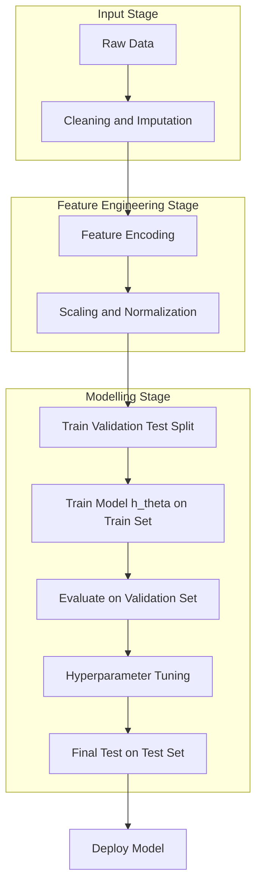
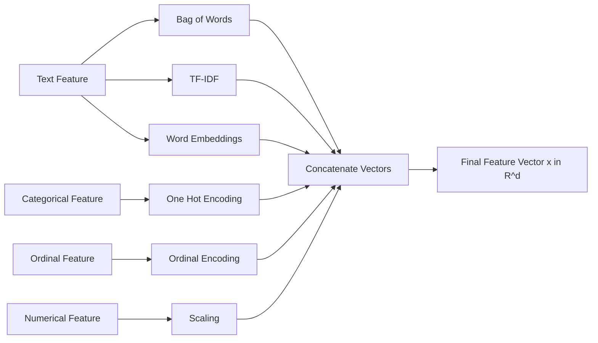
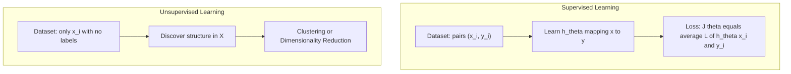
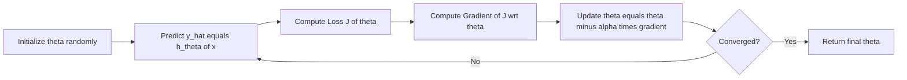
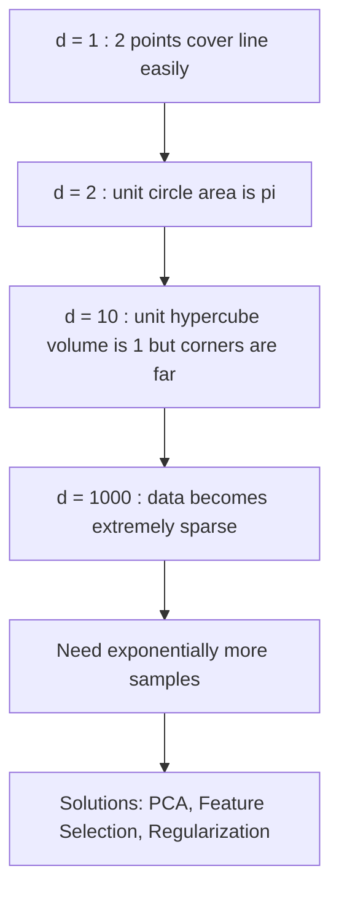

# Feature Representation and Problem Formulation

<!-- SECTION_1_START -->
# Feature Representation and Problem Formulation

## 1.1 Formal Definition (KTU 2024 Syllabus Terminology)

In the **Machine Learning (PCCST503)** framework under the **KTU 2024 Scheme**, every learning algorithm operates on numerical structures called **feature vectors**. A formal definition follows.

> [!IMPORTANT]
> **Feature:** A measurable property or attribute of an observed phenomenon. Features are the individual columns in a tabular dataset (also called *attributes*, *predictors*, *inputs*, or *independent variables*).

> [!IMPORTANT]
> **Feature Representation:** The systematic process of converting raw real-world observations (text, images, signals, categories) into a well-defined, mathematically tractable numerical form (typically a $d$-dimensional real-valued vector) so that a learning algorithm can ingest them.

> [!IMPORTANT]
> **Feature Vector:** For an observation indexed by $i$, the feature vector is the ordered tuple
> $$\mathbf{x}^{(i)} = \left( x_1^{(i)},\ x_2^{(i)},\ \ldots,\ x_d^{(i)} \right) \in \mathbb{R}^d$$
> where $d$ is the **dimensionality** of the feature space, and each $x_j^{(i)}$ is a single feature value.

> [!NOTE]
> **Problem Formulation** is the engineering discipline of precisely stating the ML task: identifying inputs, outputs, the hypothesis class, the loss function, and the optimization objective before writing any code.

## 1.2 Conceptual Analogy / Intuition

Imagine a **medical clinic's patient registration desk**. Every patient who walks in is described by measurable *features*: **age** (years), **blood pressure** (mmHg), **cholesterol** (mg/dL), and **gender** (Male/Female). The doctor's brain internally converts each patient into a *point* in a high-dimensional map — the **feature space**. A patient with profile (Age=58, BP=160, Cholesterol=240, Gender=Male) is a single point in 4-dimensional space. The doctor's job (analogous to a learning algorithm) is to find a **decision boundary** in that 4D space separating *healthy* from *diseased* patients.

> [!TIP]
> The phrase **"feature space"** simply means: the $d$-dimensional geometric space in which each data point lives. Two patients are "similar" if their feature vectors are close in this space.

## 1.3 Why This Matters in ML

Most ML algorithms (Linear Regression, Logistic Regression, SVM, KNN, Neural Networks) require:
- **Numerical input** (real numbers).
- **Fixed-length vectors** (same dimensionality for every sample).
- **Meaningful geometric structure** (so that "distance" or "dot product" corresponds to real-world similarity).

Hence, feature representation is the **bridge between messy real-world data and clean mathematical algorithms**.

## 1.4 Types of Features

| Feature Type | Description | Examples | Typical Encoding |
| :--- | :--- | :--- | :--- |
| **Numerical (Continuous)** | Real-valued measurements | Height, Temperature, Price | Use as-is |
| **Numerical (Discrete)** | Integer counts | Number of children, Days since signup | Use as-is |
| **Categorical (Nominal)** | Unordered labels | Color, City, Animal species | One-Hot Encoding |
| **Categorical (Ordinal)** | Ordered labels | Size (S < M < L), Rating (1–5) | Ordinal / Integer mapping |
| **Binary** | Two possible values | Yes/No, Spam/Not-Spam | 0 / 1 |
| **Text** | Free-form strings | Reviews, Tweets | Bag-of-Words, TF-IDF, Embeddings |
| **Image** | Pixel grids | Photos, X-rays | Pixel intensity vectors / CNN features |
| **Temporal** | Time-stamped data | Sensor readings, Stock prices | Time-windowed feature vectors |

## 1.5 GeoGebra / Desmos Visualization

> [!VISUALIZATION CONTROL]
> **Concept:** Visualizing feature vectors as points in 2D feature space (the "scatter plot" intuition).
>
> **GeoGebra / Desmos Input Equations:**
> * Points: $(1.5, 2.0)$, $(2.0, 2.4)$, $(1.0, 1.8)$, $(4.0, 4.5)$, $(4.5, 4.0)$, $(3.5, 5.0)$
> * Class A in blue, Class B in red.
> * Decision boundary: $f(x,y) = x + y - 6 = 0$
>
> **Visual Description:** Two clusters of points appear in the 2D plane. The line $x + y = 6$ separates the lower-left cluster (Class A) from the upper-right cluster (Class B). Each point represents one observation, and the two axes represent the two features.

## 1.6 The Formal ML Problem Statement

A standard supervised learning problem is formulated as:

> **Given:** A training dataset
> $$\mathcal{D} = \left\{ \left(\mathbf{x}^{(i)},\ y^{(i)}\right) \right\}_{i=1}^{N}$$
> where $\mathbf{x}^{(i)} \in \mathbb{R}^d$ is the feature vector and $y^{(i)} \in \mathcal{Y}$ is the label.
>
> **Find:** A hypothesis function
> $$h_{\boldsymbol{\theta}} : \mathbb{R}^d \rightarrow \mathcal{Y}$$
> parameterized by $\boldsymbol{\theta}$, that maps inputs to outputs and **generalizes** to unseen samples.

The **dimensionality** $d$ is the **number of features**, and **$N$** is the **number of samples (instances)**.

<!-- SECTION_1_END -->

<!-- SECTION_2_START -->
# Deep Theoretical Analysis & KTU High-Yield Formula Sheet

## 2.1 Anatomy of a Dataset

A dataset is a structured collection of samples. Formally:

$$\mathcal{D} = \begin{bmatrix} x_{1}^{(1)} & x_{2}^{(1)} & \cdots & x_{d}^{(1)} & \vert & y^{(1)} \\ x_{1}^{(2)} & x_{2}^{(2)} & \cdots & x_{d}^{(2)} & \vert & y^{(2)} \\ \vdots & \vdots & \ddots & \vdots & \vert & \vdots \\ x_{1}^{(N)} & x_{2}^{(N)} & \cdots & x_{d}^{(N)} & \vert & y^{(N)} \end{bmatrix}$$

The left block $\mathbf{X} \in \mathbb{R}^{N \times d}$ is the **design matrix** (feature matrix), and the right column $\mathbf{y} \in \mathbb{R}^{N}$ is the **target vector**.

## 2.2 Types of ML Problem Formulations

| Problem Type | Target $y$ | Hypothesis Output | Loss Function (Common) |
| :--- | :--- | :--- | :--- |
| **Binary Classification** | $\{0, 1\}$ | Probability in $[0,1]$ | Binary Cross-Entropy |
| **Multi-class Classification** | $\{1, 2, \ldots, K\}$ | Class label | Categorical Cross-Entropy |
| **Regression** | $\mathbb{R}$ (continuous) | Real number | Mean Squared Error |
| **Clustering** | None (unsupervised) | Cluster id | Intra-cluster distance |
| **Dimensionality Reduction** | None (unsupervised) | Low-dim vector $\mathbf{z}$ | Reconstruction error |

## 2.3 Feature Encoding Schemes (Step-by-Step Logic)

### (a) Label Encoding
For $K$ categories, assign integers $0, 1, \ldots, K-1$.

$$ \text{Color} = \{\text{Red}, \text{Green}, \text{Blue}\} \rightarrow \{0, 1, 2\} $$

**Pitfall:** Imposes artificial ordering (Red $< $ Green $< $ Blue), which is **wrong for nominal features**.

### (b) One-Hot Encoding
Each category becomes a binary vector of length $K$ with a single **1**.

$$ \text{Red} = (1, 0, 0),\quad \text{Green} = (0, 1, 0),\quad \text{Blue} = (0, 0, 1) $$

Mathematically, with $K$ categories and indicator function $\mathbb{1}[\cdot]$:

$$ x_{k} = \mathbb{1}\left[\text{category} = c_{k}\right],\quad k = 1, 2, \ldots, K $$

This increases the feature dimension from $d$ to $d + (K-1)$ per encoded column (drop-one convention).

### (c) Ordinal Encoding
Preserves order by mapping to monotonic integers:

$$ \text{S} \mapsto 1,\quad \text{M} \mapsto 2,\quad \text{L} \mapsto 3,\quad \text{XL} \mapsto 4 $$

### (d) Bag-of-Words (BoW) for Text
For a vocabulary $\mathcal{V} = \{w_1, w_2, \ldots, w_{\vert \mathcal{V} \vert}\}$, the $j$-th feature for document $i$ is:

$$ x_{j}^{(i)} = \text{count of word } w_{j} \text{ in document } i $$

### (e) TF-IDF (Term Frequency – Inverse Document Frequency)
Refines BoW by down-weighting common words.

$$ \text{tf}_{ij} = \frac{\text{count of } w_j \text{ in doc } i}{\text{total words in doc } i} $$

$$ \text{idf}_{j} = \log\left( \frac{N}{\text{df}_{j}} \right) $$

$$ \text{tfidf}_{ij} = \text{tf}_{ij} \times \text{idf}_{j} $$

where $\text{df}_{j}$ is the number of documents containing $w_{j}$.

## 2.4 KTU High-Yield Formula Sheet

| Symbol / Term | Meaning | Formula / Definition |
| :--- | :--- | :--- |
| $N$ | Number of samples (rows) | $N = \vert \mathcal{D} \vert$ |
| $d$ | Number of features (columns) | Dimensionality of feature space |
| $\mathbf{x}^{(i)} \in \mathbb{R}^{d}$ | $i$-th feature vector | $\mathbf{x}^{(i)} = (x_1^{(i)}, \ldots, x_d^{(i)})$ |
| $\mathbf{X} \in \mathbb{R}^{N \times d}$ | Design matrix | Each row is a feature vector |
| $\mathbf{y} \in \mathbb{R}^{N}$ | Target vector | Labels for supervised learning |
| $h_{\boldsymbol{\theta}}(\mathbf{x})$ | Hypothesis | $h_{\boldsymbol{\theta}} : \mathbb{R}^{d} \rightarrow \mathcal{Y}$ |
| $\boldsymbol{\theta}$ | Parameters | Learned by optimization |
| $J(\boldsymbol{\theta})$ | Cost function | Empirical risk over training data |
| $\hat{y}^{(i)}$ | Predicted label | $h_{\boldsymbol{\theta}}(\mathbf{x}^{(i)})$ |
| $L(\hat{y}, y)$ | Per-sample loss | Penalty for one wrong prediction |
| One-Hot Vector | Length $K$ | Sum of components = 1 |
| TF-IDF | Word importance | $\text{tf} \cdot \log(N / \text{df})$ |

## 2.5 Engineering & Real-World Utility

Feature representation is the **single most important factor** in ML success — a principle often stated as *"better features beat better algorithms."*

* **Computer Vision:** Raw pixels are *flattened* into vectors or extracted via CNNs.
* **NLP:** Words converted to embeddings (Word2Vec, GloVe, BERT) of dimension $\sim 300$–$1024$.
* **Recommender Systems:** User–item interactions encoded as sparse vectors.
* **Finance:** Time-series encoded via rolling means, volatility, and technical indicators.
* **Healthcare:** Lab values normalized to comparable scales before being fed to a model.

> [!TIP]
> **Rule of thumb:** If a human expert can solve the task using only the features, an ML model likely can too — provided the features are well-engineered.

<!-- SECTION_2_END -->

<!-- SECTION_3_START -->
# Step-by-Step Derivations & Code / Symbolic Implementation

## 3.1 Worked Example — One-Hot Encoding a Categorical Feature

**Problem.** A dataset has 5 students with a "Department" feature: $\{ \text{CS}, \text{EC}, \text{CS}, \text{ME}, \text{EC} \}$. Encode this using One-Hot Encoding with the *drop-one* convention.

**Step 1 — Identify unique categories.**

$$ \mathcal{C} = \{ \text{CS},\ \text{EC},\ \text{ME} \},\quad K = 3 $$

**Step 2 — Form the full one-hot vectors (length $K = 3$).**

| Department | CS | EC | ME |
| :--- | :---: | :---: | :---: |
| CS | 1 | 0 | 0 |
| EC | 0 | 1 | 0 |
| CS | 1 | 0 | 0 |
| ME | 0 | 0 | 1 |
| EC | 0 | 1 | 0 |

**Step 3 — Apply drop-one (to avoid the *dummy variable trap* / multicollinearity).** Drop the first column (CS), so the encoded dimension becomes $K-1 = 2$:

| Department | $x_{\text{EC}}$ | $x_{\text{ME}}$ |
| :--- | :---: | :---: |
| CS | 0 | 0 |
| EC | 1 | 0 |
| CS | 0 | 0 |
| ME | 0 | 1 |
| EC | 1 | 0 |

> [!NOTE]
> **Dummy Variable Trap:** If all $K$ columns are kept, they sum to 1, creating perfect multicollinearity. This destabilizes linear models. Dropping one column is the standard fix.

## 3.2 Worked Example — Computing TF-IDF

**Problem.** Corpus of $N = 3$ documents:
* $d_1$ = "the cat sat"
* $d_2$ = "the dog sat"
* $d_3$ = "the cat sat on the mat"

**Step 1 — Compute document frequency $\text{df}_{j}$ for each word:**

| Word | df | N / df | $\log(N / \text{df})$ = idf |
| :--- | :---: | :---: | :---: |
| the | 3 | 1.000 | 0.000 |
| cat | 2 | 1.500 | 0.176 |
| sat | 3 | 1.000 | 0.000 |
| dog | 1 | 3.000 | 0.477 |
| on | 1 | 3.000 | 0.477 |
| mat | 1 | 3.000 | 0.477 |

**Step 2 — Compute tf for the word "cat" in $d_3$:** "the cat sat on the mat" has 6 words; "cat" appears once. So $\text{tf} = 1/6 \approx 0.167$.

**Step 3 — Multiply:**

$$ \text{tfidf}(\text{cat}, d_3) = 0.167 \times 0.176 \approx 0.029 $$

**Interpretation:** "cat" gets a small but non-zero weight in $d_3$ because it appears in only 2 of 3 documents (mildly informative).

## 3.3 Worked Example — Feature Matrix for a Mini Regression Task

**Problem.** Predict house price ($y$) from area ($x_1$, sq.ft.) and bedrooms ($x_2$).

| Sample | $x_1$ | $x_2$ | $y$ (₹ lakhs) |
| :---: | :---: | :---: | :---: |
| 1 | 1200 | 2 | 45 |
| 2 | 1500 | 3 | 55 |
| 3 | 1800 | 3 | 65 |
| 4 | 2000 | 4 | 72 |

**Design matrix** $\mathbf{X}$ and target $\mathbf{y}$:

$$
\mathbf{X} = \begin{bmatrix} 1200 & 2 \\ 1500 & 3 \\ 1800 & 3 \\ 2000 & 4 \end{bmatrix},\qquad
\mathbf{y} = \begin{bmatrix} 45 \\ 55 \\ 65 \\ 72 \end{bmatrix}
$$

Here $N = 4$ samples, $d = 2$ features.

A simple linear hypothesis:

$$ h_{\boldsymbol{\theta}}(\mathbf{x}) = \theta_0 + \theta_1 x_1 + \theta_2 x_2 $$

with parameter vector $\boldsymbol{\theta} = (\theta_0, \theta_1, \theta_2)^{\top}$.

## 3.4 Full Python Implementation (Reproducible, Production-Quality)

```python
from __future__ import annotations

import logging
import math
from dataclasses import dataclass
from typing import Dict, List, Sequence, Tuple

import numpy as np

logging.basicConfig(
    level=logging.INFO,
    format="%(asctime)s | %(levelname)s | %(message)s",
)
logger = logging.getLogger(__name__)


# ---------------------------------------------------------------------------
# 1. One-Hot Encoding with drop-first (dummy-trap safe)
# ---------------------------------------------------------------------------
@dataclass(frozen=True)
class OneHotEncoder:
    """Stateless one-hot encoder with drop-first convention."""

    categories: Tuple[str, ...]

    def encode(self, value: str) -> np.ndarray:
        if value not in self.categories:
            logger.error("Unknown category received: %s", value)
            raise ValueError(f"Unknown category: {value}")
        # drop-first: skip index 0
        return np.array(
            [1.0 if value == cat else 0.0 for cat in self.categories[1:]],
            dtype=np.float64,
        )

    def encode_batch(self, values: Sequence[str]) -> np.ndarray:
        return np.vstack([self.encode(v) for v in values])


def demo_one_hot() -> None:
    encoder = OneHotEncoder(categories=("CS", "EC", "ME"))
    raw = ["CS", "EC", "CS", "ME", "EC"]
    matrix = encoder.encode_batch(raw)
    logger.info("One-hot matrix shape: %s", matrix.shape)
    logger.info("One-hot matrix:\n%s", matrix)


# ---------------------------------------------------------------------------
# 2. TF-IDF from scratch (no sklearn dependency)
# ---------------------------------------------------------------------------
@dataclass
class TfIdfVectorizer:
    vocabulary: Dict[str, int]
    idf: np.ndarray  # shape (|V|,)

    @classmethod
    def fit(cls, corpus: Sequence[str]) -> "TfIdfVectorizer":
        # tokenization: lowercase + split on whitespace
        tokenized_docs: List[List[str]] = [
            doc.lower().split() for doc in corpus
        ]

        # build vocabulary
        vocab: Dict[str, int] = {}
        for doc in tokenized_docs:
            for token in doc:
                if token not in vocab:
                    vocab[token] = len(vocab)

        n_docs = len(corpus)
        n_terms = len(vocab)
        df = np.zeros(n_terms, dtype=np.float64)

        for doc in tokenized_docs:
            unique_tokens = set(doc)
            for token in unique_tokens:
                df[vocab[token]] += 1.0

        # smooth idf: log((N + 1) / (df + 1)) + 1
        idf = np.log((n_docs + 1.0) / (df + 1.0)) + 1.0
        logger.info("Vocabulary size: %d", n_terms)
        logger.info("idf values: %s", np.round(idf, 4))
        return cls(vocabulary=vocab, idf=idf)

    def transform(self, documents: Sequence[str]) -> np.ndarray:
        n_docs = len(documents)
        n_terms = len(self.vocabulary)
        tf = np.zeros((n_docs, n_terms), dtype=np.float64)

        for i, doc in enumerate(documents):
            tokens = doc.lower().split()
            if not tokens:
                continue
            for token in tokens:
                if token in self.vocabulary:
                    tf[i, self.vocabulary[token]] += 1.0
            tf[i] /= float(len(tokens))  # term frequency normalized

        return tf * self.idf  # element-wise broadcast

    def fit_transform(cls, corpus: Sequence[str]) -> np.ndarray:  # type: ignore[override]
        vec = cls.fit(corpus)
        return vec.transform(corpus)


def demo_tfidf() -> None:
    corpus = [
        "the cat sat",
        "the dog sat",
        "the cat sat on the mat",
    ]
    vectorizer = TfIdfVectorizer.fit(corpus)
    matrix = vectorizer.transform(corpus)
    logger.info("TF-IDF matrix shape: %s", matrix.shape)
    logger.info("TF-IDF matrix:\n%s", np.round(matrix, 4))


# ---------------------------------------------------------------------------
# 3. Build a (X, y) design matrix for regression
# ---------------------------------------------------------------------------
def build_design_matrix(
    raw_features: Sequence[Tuple[float, ...]],
    targets: Sequence[float],
) -> Tuple[np.ndarray, np.ndarray]:
    if len(raw_features) != len(targets):
        raise ValueError("Features and targets must have the same length.")
    if not raw_features:
        raise ValueError("Empty dataset provided.")

    X = np.asarray(raw_features, dtype=np.float64)
    y = np.asarray(targets, dtype=np.float64)

    # bias trick: prepend a column of ones for theta_0
    X = np.hstack([np.ones((X.shape[0], 1), dtype=np.float64), X])

    logger.info("Design matrix X shape: %s", X.shape)
    logger.info("Target vector y shape: %s", y.shape)
    return X, y


def demo_design_matrix() -> None:
    raw = [(1200.0, 2.0), (1500.0, 3.0), (1800.0, 3.0), (2000.0, 4.0)]
    y = [45.0, 55.0, 65.0, 72.0]
    X, y_vec = build_design_matrix(raw, y)
    logger.info("X =\n%s", X)
    logger.info("y = %s", y_vec)


# ---------------------------------------------------------------------------
# 4. Closed-form normal equation for linear regression:
#    theta = (X^T X)^(-1) X^T y
# ---------------------------------------------------------------------------
def normal_equation(X: np.ndarray, y: np.ndarray) -> np.ndarray:
    if X.shape[0] != y.shape[0]:
        raise ValueError("X and y row counts must match.")
    XtX = X.T @ X
    if np.linalg.matrix_rank(XtX) < XtX.shape[0]:
        logger.warning("X^T X is singular; using pseudo-inverse (Moore-Penrose).")
        theta = np.linalg.pinv(XtX) @ X.T @ y
    else:
        theta = np.linalg.inv(XtX) @ X.T @ y
    return theta


def demo_normal_equation() -> None:
    raw = [(1200.0, 2.0), (1500.0, 3.0), (1800.0, 3.0), (2000.0, 4.0)]
    y = [45.0, 55.0, 65.0, 72.0]
    X, y_vec = build_design_matrix(raw, y)
    theta = normal_equation(X, y_vec)
    logger.info("Learned parameters theta: %s", np.round(theta, 6))


# ---------------------------------------------------------------------------
# 5. Euclidean distance between two feature vectors (KTU staple)
# ---------------------------------------------------------------------------
def euclidean_distance(a: np.ndarray, b: np.ndarray) -> float:
    if a.shape != b.shape:
        raise ValueError(
            f"Shape mismatch: a={a.shape}, b={b.shape}"
        )
    return float(np.sqrt(np.sum((a - b) ** 2)))


def demo_distance() -> None:
    p1 = np.array([1.5, 2.0])
    p2 = np.array([2.0, 2.4])
    d = euclidean_distance(p1, p2)
    logger.info("Euclidean distance: %.4f", d)


if __name__ == "__main__":
    demo_one_hot()
    demo_tfidf()
    demo_design_matrix()
    demo_normal_equation()
    demo_distance()
```

**What the script demonstrates (mapped to the KTU syllabus):**
1. **One-hot encoding** with the drop-first convention.
2. **TF-IDF** computed from scratch — proves the underlying algebra.
3. **Design matrix** construction with the bias column.
4. **Normal equation** $\boldsymbol{\theta} = (\mathbf{X}^{\top} \mathbf{X})^{-1} \mathbf{X}^{\top} \mathbf{y}$ for closed-form linear regression.
5. **Euclidean distance** as the geometric primitive used by KNN, K-means, etc.

## 3.5 Important Pre-Processing Steps (KTU High-Yield)

| Step | Formula / Operation | When to use |
| :--- | :--- | :--- |
| **Mean Normalization** | $x_j \leftarrow x_j - \mu_j$ | Before gradient descent |
| **Min-Max Scaling** | $x_j \leftarrow (x_j - \min_j) / (\max_j - \min_j)$ | Bounded activation functions |
| **Z-score Standardization** | $x_j \leftarrow (x_j - \mu_j) / \sigma_j$ | SVM, Logistic Regression, PCA |
| **Missing-value Imputation** | $x_j \leftarrow \text{mean}(x_j)$ or median | Real datasets |
| **Outlier Clipping** | Clip $x_j$ to $[\mu - 3\sigma, \mu + 3\sigma]$ | Heavy-tailed data |

## 3.6 The Hypothesis Class — Why It Matters in Problem Formulation

Choosing a model = choosing a **hypothesis class** $\mathcal{H}$. Examples:

* Linear: $h_{\boldsymbol{\theta}}(\mathbf{x}) = \boldsymbol{\theta}^{\top} \mathbf{x}$
* Polynomial: $h_{\boldsymbol{\theta}}(\mathbf{x}) = \boldsymbol{\theta}^{\top} \phi(\mathbf{x})$, where $\phi(\mathbf{x}) = (1, x, x^2, \ldots)$
* Neural network: $h_{\boldsymbol{\theta}}(\mathbf{x})$ is a composition of affine + nonlinear layers.

The **no-free-lunch theorem** tells us no hypothesis class is universally better; the choice must match the **structure of the feature space**.

<!-- SECTION_3_END -->

<!-- SECTION_4_START -->
# Structural Diagrams & Schematics

## 4.1 End-to-End ML Pipeline (Mermaid)



## 4.2 Feature Engineering Sub-Process (Mermaid)



## 4.3 Supervised vs Unsupervised Problem Formulation (Mermaid)



## 4.4 The Hypothesis-Fitting Cycle (Mermaid)



## 4.5 Curse of Dimensionality — Conceptual Block Diagram



<!-- SECTION_4_END -->

<!-- SECTION_5_START -->
# KTU 2024 Scheme Examination Question Bank & Topic Recap

## Part A — Short Answer Questions (3 Marks Each)

### Question 1
**[KTU University Exam – July 2024, Model QP]**
**Define a "feature" and a "feature vector" with reference to Machine Learning problem formulation. Give one example for each type of feature (numerical, categorical, ordinal).**

* **Course Outcome:** CO1 | **Cognitive Level:** Remember / Understand | **Marks:** 3

**Model Answer (Board Key Style):**

> A **feature** is a measurable property or attribute of a phenomenon being observed; it is also called an *attribute*, *predictor*, or *input variable*. [Definition: 1 mark]

> A **feature vector** is an ordered $d$-dimensional tuple $\mathbf{x} = (x_1, x_2, \ldots, x_d)$ formed by stacking all features of a single observation. [Definition: 1 mark]

> **Examples:**
> * **Numerical:** Height in cm.
> * **Categorical (Nominal):** City name (e.g., Kochi, Chennai).
> * **Ordinal:** T-shirt size (S $<$ M $<$ L $<$ XL).
>
> [Examples: 1 mark]

---

### Question 2
**[KTU University Exam – Dec 2023, Model QP]**
**Explain the One-Hot Encoding scheme. Why is the *drop-first* convention recommended?**

* **Course Outcome:** CO1 | **Cognitive Level:** Understand | **Marks:** 3

**Model Answer:**

> In **One-Hot Encoding**, a categorical feature with $K$ distinct values is converted into $K$ binary columns. For a sample belonging to category $c_k$, the $k$-th column is 1 and all others are 0. [Encoding scheme: 1 mark]

> For example, with $\mathcal{C} = \{ \text{Red}, \text{Green}, \text{Blue} \}$: Red $\mapsto (1,0,0)$, Green $\mapsto (0,1,0)$, Blue $\mapsto (0,0,1)$. [Example: 1 mark]

> The **drop-first** convention drops one of the $K$ columns to avoid the **dummy variable trap** (perfect multicollinearity in linear models, where the $K$ indicators would always sum to 1). [Drop-first justification: 1 mark]

---

## Part B — 14-Mark Questions (ESE Module Internal Choice Format)

### Question A
**[KTU University Exam – July 2024, Model QP]**

**(a)** Formulate the **supervised learning problem statement** in precise mathematical notation. Clearly define the design matrix, target vector, hypothesis class, and empirical risk. **[7 Marks]**
**(b)** Consider the dataset of 6 patients with features *(Age, Blood Pressure, Cholesterol)* and label *(At-Risk: 1, Not-At-Risk: 0)*. Build the design matrix $\mathbf{X}$ and the target vector $\mathbf{y}$. Explain how the One-Hot Encoding step would apply if "Gender" were added as a feature. **[7 Marks]**

**Model Solution (Board Valuation Key):**

#### (a) Problem Formulation — 7 Marks

> **Given (input):** A training set
> $$\mathcal{D} = \left\{\left(\mathbf{x}^{(i)},\ y^{(i)}\right)\right\}_{i=1}^{N},\ \ \mathbf{x}^{(i)} \in \mathbb{R}^{d},\ \ y^{(i)} \in \mathcal{Y}.$$
> [Stating the problem input: 2 marks]

> **Design matrix:**
> $$\mathbf{X} \in \mathbb{R}^{N \times d},\ \ [\mathbf{X}]_{ij} = x_{j}^{(i)}.$$
> [Definition of design matrix: 1 mark]

> **Target vector:**
> $$\mathbf{y} \in \mathbb{R}^{N},\ \ [\mathbf{y}]_i = y^{(i)}.$$
> [Definition of target vector: 1 mark]

> **Find (output):** A hypothesis
> $$h_{\boldsymbol{\theta}} \in \mathcal{H},\ \ h_{\boldsymbol{\theta}} : \mathbb{R}^{d} \rightarrow \mathcal{Y},$$
> by minimizing the **empirical risk**
> $$J(\boldsymbol{\theta}) = \frac{1}{N} \sum_{i=1}^{N} L\left(h_{\boldsymbol{\theta}}(\mathbf{x}^{(i)}),\ y^{(i)}\right),$$
> where $L(\hat{y}, y)$ is a per-sample loss. [Hypothesis class & empirical risk: 3 marks]

#### (b) Building the Design Matrix — 7 Marks

> Suppose the 6 patients are:
>
> | Patient | Age ($x_1$) | BP ($x_2$) | Cholesterol ($x_3$) | At-Risk ($y$) |
> | :---: | :---: | :---: | :---: | :---: |
> | 1 | 45 | 130 | 190 | 0 |
> | 2 | 60 | 150 | 220 | 1 |
> | 3 | 52 | 140 | 205 | 0 |
> | 4 | 65 | 160 | 240 | 1 |
> | 5 | 70 | 155 | 230 | 1 |
> | 6 | 48 | 120 | 180 | 0 |
>
> [Stating the dataset: 2 marks]

> **Design matrix** $\mathbf{X} \in \mathbb{R}^{6 \times 3}$ and target $\mathbf{y} \in \mathbb{R}^{6}$:
> $$\mathbf{X} = \begin{bmatrix} 45 & 130 & 190 \\ 60 & 150 & 220 \\ 52 & 140 & 205 \\ 65 & 160 & 240 \\ 70 & 155 & 230 \\ 48 & 120 & 180 \end{bmatrix},\ \ \mathbf{y} = \begin{bmatrix} 0 \\ 1 \\ 0 \\ 1 \\ 1 \\ 0 \end{bmatrix}.$$
> [Writing the matrices: 2 marks]

> **One-Hot Encoding for Gender** (added as a 4th feature). Categories: $\mathcal{C} = \{\text{Male}, \text{Female}\}$, so $K = 2$. Using drop-first, encode as a single binary column: Male $\mapsto 1$, Female $\mapsto 0$ (or vice versa). Final dimensionality becomes $d = 4$ and the matrix is updated. [Encoding application: 3 marks]

---

### Question B (Alternative Choice)
**[KTU University Exam – Dec 2023, Model QP]**

**(a)** With a neat diagram, explain the **stages of the Machine Learning pipeline** from raw data to a deployed model. **[7 Marks]**
**(b)** Compute the **TF-IDF representation** of the words "cat" and "mat" for the following 3-document corpus:
$d_1$ = "the cat is on the mat",
$d_2$ = "the dog is on the mat",
$d_3$ = "the cat and the dog".
Show every step. **[7 Marks]**

**Model Solution (Board Valuation Key):**

#### (a) ML Pipeline Diagram — 7 Marks

> [Pipeline drawing: Raw Data $\rightarrow$ Cleaning $\rightarrow$ Feature Engineering $\rightarrow$ Train/Val/Test Split $\rightarrow$ Model Training $\rightarrow$ Evaluation $\rightarrow$ Hyperparameter Tuning $\rightarrow$ Final Test $\rightarrow$ Deployment: 5 marks]
>
> [Brief one-line description of each stage: 2 marks]
>
> (See the Mermaid flowchart in **Section 4.1** for the reference architecture.)

#### (b) TF-IDF Calculation — 7 Marks

> **Step 1 — Tokenize & count.** For each of the 3 documents, list the words and their raw counts.
>
> | Word | df (in how many docs) |
> | :--- | :---: |
> | the | 3 |
> | cat | 2 |
> | is | 2 |
> | on | 2 |
> | mat | 2 |
> | dog | 2 |
> | and | 1 |
>
> [Counting step: 2 marks]

> **Step 2 — Compute idf for "cat" and "mat".**
> $$\text{idf}(\text{cat}) = \log\left(\frac{N}{\text{df}(\text{cat})}\right) = \log\left(\frac{3}{2}\right) \approx 0.405$$
> $$\text{idf}(\text{mat}) = \log\left(\frac{N}{\text{df}(\text{mat})}\right) = \log\left(\frac{3}{2}\right) \approx 0.405$$
> [idf computation: 2 marks]

> **Step 3 — Compute tf for "cat" and "mat" in each document.**
>
> | Document | Total words | tf(cat) | tf(mat) |
> | :---: | :---: | :---: | :---: |
> | $d_1$ | 6 | $1/6 \approx 0.167$ | $1/6 \approx 0.167$ |
> | $d_2$ | 6 | $0$ | $1/6 \approx 0.167$ |
> | $d_3$ | 5 | $1/5 = 0.200$ | $0$ |
>
> [tf computation: 1 mark]

> **Step 4 — Multiply tf × idf.**
>
> | Document | tfidf(cat) | tfidf(mat) |
> | :---: | :---: | :---: |
> | $d_1$ | $0.167 \times 0.405 \approx 0.0676$ | $0.167 \times 0.405 \approx 0.0676$ |
> | $d_2$ | $0$ | $0.167 \times 0.405 \approx 0.0676$ |
> | $d_3$ | $0.200 \times 0.405 \approx 0.0810$ | $0$ |
>
> [Final answer: 2 marks]

> **Final TF-IDF vector (cat, mat):**
> $$\mathbf{T} = \begin{bmatrix} 0.0676 & 0.0676 \\ 0.0000 & 0.0676 \\ 0.0810 & 0.0000 \end{bmatrix}$$

---

### KTU Examiner's Valuation Warning / Pitfall Callout

> [!WARNING]
> **Common places students lose marks in this topic:**
> 1. **Forgetting to add the bias column** $\theta_0$ when writing the design matrix for linear regression. The board expects a column of 1s prepended to $\mathbf{X}$.
> 2. **Confusing *label* with *one-hot vector*.** The label for a single class is a scalar; the one-hot vector is a length-$K$ binary vector. Marks are lost when students write "label = (1,0,0)" instead of "label = 2 (or whichever integer convention is used)."
> 3. **Skipping the *drop-first* justification.** Always state the *dummy variable trap* (multicollinearity) as the reason.
> 4. **In TF-IDF, forgetting to normalize the term frequency** by the document length.
> 5. **Treating ordinal features as nominal** (e.g., assigning 1, 2, 4, 8 arbitrarily) — the spacing must reflect the *order*, not the *gap*.
> 6. **Mixing up $N$ (samples) and $d$ (features)**. The KTU board specifically tests this distinction.

---

## Topic Recap & Important Things to Remember

* **Feature** = measurable attribute; **Feature Vector** $\mathbf{x} \in \mathbb{R}^{d}$ = ordered tuple of features for one observation.
* **Feature Matrix / Design Matrix** $\mathbf{X} \in \mathbb{R}^{N \times d}$: rows = samples, columns = features. Often augmented with a column of 1s for the bias term.
* **Target Vector** $\mathbf{y} \in \mathbb{R}^{N}$: labels (continuous for regression, discrete for classification).
* **Hypothesis** $h_{\boldsymbol{\theta}} : \mathbb{R}^{d} \rightarrow \mathcal{Y}$ is the function the model learns.
* **Empirical Risk / Cost** $J(\boldsymbol{\theta}) = \frac{1}{N} \sum_{i=1}^{N} L(\hat{y}^{(i)}, y^{(i)})$ is what optimization minimizes.
* **Feature Types:** Numerical (continuous / discrete), Categorical (nominal / ordinal), Binary, Text, Image, Temporal.
* **Encoding Schemes:**
  * *Label Encoding:* integer map (bad for nominal).
  * *One-Hot Encoding:* $K$ binary columns (use **drop-first** to avoid dummy-variable trap).
  * *Ordinal Encoding:* monotonic integer map preserving order.
  * *Bag-of-Words:* word counts.
  * *TF-IDF:* $\text{tf}_{ij} \cdot \log(N / \text{df}_{j})$.
* **Scaling:** Min-Max, Z-score, Mean-normalization — usually required for distance-based and gradient-based models.
* **Curse of Dimensionality:** As $d$ grows, data becomes sparse; combat with PCA, feature selection, or regularization.
* **Problem Formulation Pipeline:** Define data $\rightarrow$ choose hypothesis class $\mathcal{H}$ $\rightarrow$ choose loss $L$ $\rightarrow$ choose optimizer $\rightarrow$ evaluate on held-out data.
* **Normal Equation (closed-form linear regression):** $\boldsymbol{\theta} = (\mathbf{X}^{\top} \mathbf{X})^{-1} \mathbf{X}^{\top} \mathbf{y}$.
* **KTU-Favorite Definitions to Memorize Word-for-Word:** "Feature," "Feature Space," "Design Matrix," "Hypothesis," "Empirical Risk," "One-Hot Encoding," "Dummy Variable Trap," "TF-IDF," "Curse of Dimensionality."
* **Numerical Conventions Always Used by the Board:** $N$ = samples, $d$ = features, $\mathbf{x}^{(i)}$ = $i$-th feature vector, $y^{(i)}$ = $i$-th label, $\boldsymbol{\theta}$ = parameter vector.

<!-- SECTION_5_END -->
