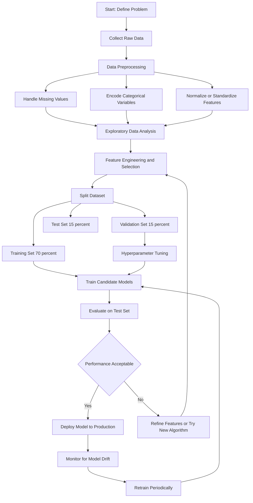
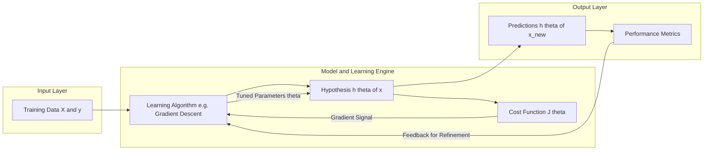
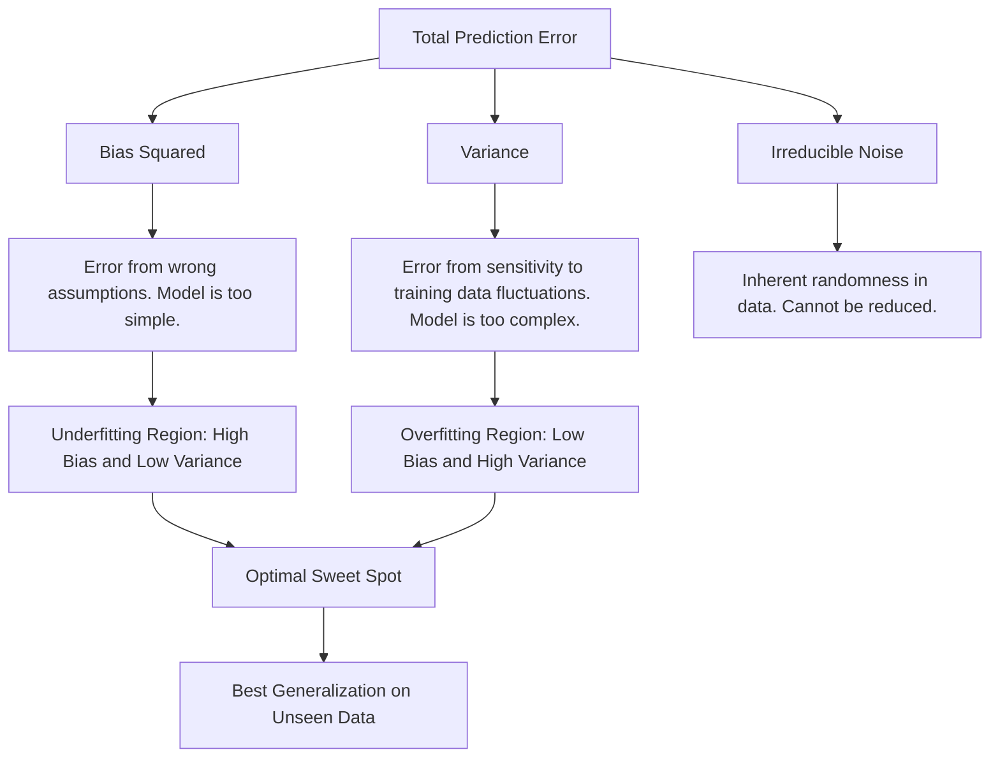

# Introduction to ML :-

<!-- SECTION_1_START -->
# Introduction to Machine Learning (ML)

## Core Technical Definition

> [!IMPORTANT]
> **Machine Learning (ML)** is a subdomain of Artificial Intelligence (AI) that enables computer systems to **learn patterns from data, improve their performance over time, and make data-driven decisions or predictions** without being explicitly programmed for every specific task.

In the formal KTU 2024 Scheme (PCCST503) definition, Machine Learning is the scientific study of algorithms and statistical models that computer systems use to perform a specific task effectively by **relying on patterns and inference** instead of explicit, rule-based instructions.

> [!NOTE]
> **Arthur Samuel (1959)** coined the term *Machine Learning* and defined it as: *"The field of study that gives computers the ability to learn without being explicitly programmed."*
>
> **Tom Mitchell (1997)** gave a more engineering-precise definition: *"A computer program is said to learn from experience E with respect to some class of tasks T and performance measure P, if its performance at tasks in T, as measured by P, improves with experience E."*

In Mitchell's formulation, every ML problem must specify three components:

$$
\text{Task } (T) \quad + \quad \text{Experience } (E) \quad + \quad \text{Performance Measure } (P)
$$

### Conceptual Analogy / Intuition

Imagine teaching a small child to recognize **cats and dogs** from photographs:

- You do **not** write rules like "if ears are pointed and whiskers are long, then it is a cat."
- Instead, you **show** the child hundreds (or thousands) of labeled images.
- The child's brain **automatically discovers distinguishing features** — fur texture, ear shape, nose structure, body proportions.
- After enough exposure, the child can correctly classify a **new, unseen image**.

> **Machine Learning works exactly the same way.** We feed a *model* (analogous to the child's brain) a large amount of *data* (photographs), and the model *learns the underlying pattern* by tuning its internal parameters. Once trained, it can make **predictions on new, never-before-seen data** (a generalization ability called **inductive reasoning**).

> [!TIP]
> **Key Insight:** Traditional programming is `Input + Program → Output`, whereas Machine Learning inverts this into `Input + Output → Program`. The "program" produced by ML is essentially a set of learned numerical parameters (weights and biases).

### Why Machine Learning Matters Today

> [!IMPORTANT]
> Modern engineering systems are increasingly **data-rich but rule-poor**. It is impossible to handcraft rules for:
> - Recognizing speech in 7,000+ languages
> - Detecting fraudulent transactions among billions of daily events
> - Driving a car safely through unpredictable city traffic
>
> ML provides the **scalable, automated, and adaptive** framework to solve these problems.

### Foundational Vocabulary You Must Know

| Term | Meaning |
|---|---|
| **Dataset** | A collection of examples (rows) used for training or testing. |
| **Feature** | An individual measurable property of the data (e.g., age, pixel intensity). |
| **Label** | The known correct answer associated with an example (supervised learning). |
| **Model** | The mathematical function that maps inputs to outputs. |
| **Training** | The process of adjusting model parameters using data. |
| **Inference** | Using a trained model to make predictions on new data. |
| **Hypothesis** | The model's current approximation of the true underlying function. |
| **Generalization** | The ability of a model to perform well on unseen data. |

> [!VISUALIZATION CONTROL]
> **Concept:** Decision Boundary Visualization for a Binary Classifier
> **GeoGebra / Desmos Input Equations:**
> * Circle of class A: `(x-2)^2 + (y-2)^2 = 4`
> * Circle of class B: `(x+2)^2 + (y+2)^2 = 4`
> * Hypothesized linear boundary: `y = x`
> **Visual Description:** The student should observe two distinct circular clusters on a 2D plane separated by the line `y = x`. The ML model's job is to discover this `y = x` separating line automatically by observing the labeled points.

---

<!-- SECTION_1_END -->

<!-- SECTION_2_START -->
# Deep Theoretical Analysis & KTU High-Yield Formula Sheet

## 1. The Three Pillars of Machine Learning

A KTU 2024 examiner will always expect a clear understanding of **why** a particular ML approach is chosen for a given problem. The choice depends entirely on the **nature of the data** and the **task**.

### A. Supervised Learning

The model is trained on **labeled data** — every input example has a known correct output. The algorithm learns the mapping function from input to output.

- **Goal:** Learn the function $f : X \rightarrow Y$ from training pairs $(x_i, y_i)$.
- **Two main sub-categories:**
  * **Classification** → Predict a *discrete category* (e.g., spam / not-spam, disease / no-disease).
  * **Regression** → Predict a *continuous numerical value* (e.g., house price, temperature).

> [!NOTE]
> **Algorithms covered in PCCST503 Module 1 (KTU 2024 Scheme):** k-Nearest Neighbors (k-NN), Decision Trees, Naive Bayes, Linear & Logistic Regression, Support Vector Machines (introductory), and simple Neural Networks.

### B. Unsupervised Learning

The model is given **unlabeled data** and must discover structure, patterns, or groupings on its own.

- **Goal:** Model the underlying distribution or grouping of $X$ without any $Y$ labels.
- **Main sub-categories:**
  * **Clustering** → Group similar data points together (e.g., customer segmentation).
  * **Dimensionality Reduction** → Compress high-dimensional data into fewer features (e.g., PCA).
  * **Association** → Discover rules like "customers who buy X also buy Y."

### C. Reinforcement Learning (RL)

An **agent** learns to take actions in an **environment** to maximize a cumulative **reward signal**. It learns by trial-and-error, guided by feedback in the form of rewards or penalties.

- **Goal:** Learn an optimal **policy** $\pi(a \mid s)$ that maps states to actions.
- **Example:** A chess-playing AI, autonomous driving, robotics, game playing (AlphaGo).

> [!TIP]
> **Quick Decision Rule for Exam:** If the data has labels → Supervised. If the data has no labels → Unsupervised. If the data is sequential with rewards/penalties → Reinforcement.

### D. Semi-Supervised and Self-Supervised Learning (Brief)

- **Semi-Supervised:** A small amount of labeled data combined with a large amount of unlabeled data.
- **Self-Supervised:** The model generates its own labels from the data (e.g., predicting the next word in a sentence — the basis of modern Large Language Models).

## 2. The Standard Machine Learning Workflow

Every ML project follows a reproducible pipeline. Memorize these 7 stages:

1. **Problem Definition** — What is being predicted? Classification or regression? What metric matters?
2. **Data Collection** — Gather raw data from databases, sensors, APIs, or web scraping.
3. **Data Preprocessing** — Handle missing values, remove duplicates, normalize/standardize features, encode categorical variables.
4. **Exploratory Data Analysis (EDA)** — Visualize distributions, detect outliers, compute correlations.
5. **Feature Engineering & Selection** — Create new informative features, remove irrelevant ones.
6. **Model Selection & Training** — Choose an algorithm, split data into train/validation/test, fit the model.
7. **Evaluation & Deployment** — Measure performance, tune hyperparameters, deploy to production, monitor drift.

## 3. KTU High-Yield Formula Sheet

> [!IMPORTANT]
> The following table contains the **core mathematical formulations** that appear repeatedly in KTU 2024 Scheme Module 1 questions.

| Concept | Formula / Definition | Notation & Notes |
|---|---|---|
| **Mitchell's Definition** | $E$ improves $P$ at task $T$ | Task $T$, Experience $E$, Performance $P$ |
| **Linear Model (Hypothesis)** | $h_\theta(x) = \theta_0 + \theta_1 x$ | $\theta_0$ = bias, $\theta_1$ = weight |
| **Multivariate Linear Model** | $h_\theta(x) = \theta^T x$ | $\theta \in \mathbb{R}^{n+1}$, $x \in \mathbb{R}^{n+1}$ |
| **Mean Squared Error (MSE)** | $J(\theta) = \frac{1}{2m} \sum_{i=1}^{m} (h_\theta(x^{(i)}) - y^{(i)})^2$ | $m$ = number of training examples |
| **Gradient Descent Update** | $\theta_j := \theta_j - \alpha \frac{\partial}{\partial \theta_j} J(\theta)$ | $\alpha$ = learning rate |
| **Partial Derivative of MSE** | $\frac{\partial J}{\partial \theta_j} = \frac{1}{m} \sum_{i=1}^{m} (h_\theta(x^{(i)}) - y^{(i)}) \cdot x_j^{(i)}$ | Used in batch gradient descent |
| **Sigmoid (Logistic) Function** | $\sigma(z) = \frac{1}{1 + e^{-z}}$ | Squashes any real number to $(0, 1)$ |
| **Hypothesis for Logistic Regression** | $h_\theta(x) = \sigma(\theta^T x)$ | Output interpreted as probability |
| **Binary Cross-Entropy Loss** | $J(\theta) = -\frac{1}{m} \sum_{i=1}^{m} [y^{(i)} \log(h_\theta(x^{(i)})) + (1 - y^{(i)}) \log(1 - h_\theta(x^{(i)}))]$ | Used for binary classification |
| **Entropy** | $H(S) = -\sum_{c \in C} p_c \log_2 p_c$ | Decision tree splitting criterion |
| **Information Gain** | $IG(S, A) = H(S) - \sum_{v \in A} \frac{\vert S_v \vert}{\vert S \vert} H(S_v)$ | Reduction in entropy after split on attribute $A$ |
| **Euclidean Distance** | $d(x, y) = \sqrt{\sum_{i=1}^{n} (x_i - y_i)^2}$ | Used in k-NN algorithm |
| **Accuracy** | $\text{Accuracy} = \frac{TP + TN}{TP + TN + FP + FN}$ | $TP$ = True Positive, etc. |
| **Precision** | $\text{Precision} = \frac{TP}{TP + FP}$ | Out of predicted positives, how many are correct |
| **Recall (Sensitivity)** | $\text{Recall} = \frac{TP}{TP + FN}$ | Out of actual positives, how many were caught |
| **F1-Score** | $F_1 = 2 \cdot \frac{\text{Precision} \cdot \text{Recall}}{\text{Precision} + \text{Recall}}$ | Harmonic mean of precision and recall |
| **Bias-Variance Decomposition** | $\text{Expected Error} = \text{Bias}^2 + \text{Variance} + \text{Irreducible Noise}$ | Fundamental tradeoff |

## 4. Real-World Engineering Utility

> [!TIP]
> **Why KTU examiners love this question:** They often ask "Give 5 real-world applications of ML." Be ready with concrete examples from **Kerala-relevant industry sectors** for higher marks:
>
> - **Healthcare:** Cancer detection from X-ray and MRI scans (Kerala's e-Health initiatives).
> - **Agriculture:** Crop disease identification and yield prediction (Coconut, Tea, Cardamom, Rubber — major Kerala crops).
> - **Natural Language Processing:** Malayalam speech-to-text, sentiment analysis of public reviews.
> - **Finance:** Credit card fraud detection, loan default prediction in Kerala cooperative banks.
> - **Transportation:** Traffic prediction on NH-66, route optimization for KSRTC buses.
> - **Computer Vision:** Automatic attendance systems in colleges, surveillance analytics.
> - **Recommender Systems:** Personalized product recommendations on Flipkart, Amazon, Netflix.

---

<!-- SECTION_2_END -->

<!-- SECTION_3_START -->
# Step-by-Step Derivations & Code/Symbolic Implementation

## 1. Derivation of the Gradient Descent Update Rule for Linear Regression

This is the **single most important derivation** for the KTU 2024 exam under Module 1. We derive it slowly, step-by-step, leaving no logical gap.

### Step 1: Define the Hypothesis

For a single-feature linear regression problem, our hypothesis (the model's prediction) is:

$$
h_\theta(x) = \theta_0 + \theta_1 x
$$

For multiple features, this generalizes to the compact vector form:

$$
h_\theta(x) = \theta^T x = \sum_{j=0}^{n} \theta_j x_j
$$

where $x_0 = 1$ is conventionally defined as the bias feature (to absorb the intercept term $\theta_0$).

### Step 2: Define the Cost Function

We need a measure of **how wrong** the model's predictions are compared to the true labels. The standard choice for regression is the **Mean Squared Error (MSE)**, which is also called the **Squared Error Cost Function**:

$$
J(\theta) = \frac{1}{2m} \sum_{i=1}^{m} \left( h_\theta(x^{(i)}) - y^{(i)} \right)^2
$$

- The factor of $\frac{1}{2}$ is a **mathematical convenience** — it cancels with the 2 produced when we differentiate a squared term.
- $m$ is the number of training examples.
- The square ensures that **positive and negative errors do not cancel** each other out.

### Step 3: Compute the Partial Derivative

We need the slope of $J(\theta)$ with respect to each parameter $\theta_j$, which tells us *which direction* and *how steeply* the cost is changing.

$$
\frac{\partial}{\partial \theta_j} J(\theta) = \frac{\partial}{\partial \theta_j} \cdot \frac{1}{2m} \sum_{i=1}^{m} \left( h_\theta(x^{(i)}) - y^{(i)} \right)^2
$$

Pull the constant $\frac{1}{2m}$ out of the derivative (it does not depend on $\theta_j$):

$$
\frac{\partial}{\partial \theta_j} J(\theta) = \frac{1}{2m} \sum_{i=1}^{m} \frac{\partial}{\partial \theta_j} \left( h_\theta(x^{(i)}) - y^{(i)} \right)^2
$$

Apply the **chain rule**: $\frac{\partial}{\partial u} u^2 = 2u \cdot \frac{\partial u}{\partial \theta_j}$ where $u = h_\theta(x^{(i)}) - y^{(i)}$:

$$
\frac{\partial}{\partial \theta_j} J(\theta) = \frac{1}{2m} \sum_{i=1}^{m} 2 \left( h_\theta(x^{(i)}) - y^{(i)} \right) \cdot \frac{\partial}{\partial \theta_j} h_\theta(x^{(i)})
$$

The 2 and $\frac{1}{2}$ cancel each other out:

$$
\frac{\partial}{\partial \theta_j} J(\theta) = \frac{1}{m} \sum_{i=1}^{m} \left( h_\theta(x^{(i)}) - y^{(i)} \right) \cdot \frac{\partial}{\partial \theta_j} h_\theta(x^{(i)}
$$

Now, the hypothesis is $h_\theta(x^{(i)}) = \theta_0 x_0^{(i)} + \theta_1 x_1^{(i)} + \cdots + \theta_n x_n^{(i)}$. The partial derivative with respect to a single $\theta_j$ is simply $x_j^{(i)}$:

$$
\frac{\partial}{\partial \theta_j} h_\theta(x^{(i)}) = x_j^{(i)}
$$

Substituting this back:

$$
\frac{\partial}{\partial \theta_j} J(\theta) = \frac{1}{m} \sum_{i=1}^{m} \left( h_\theta(x^{(i)}) - y^{(i)} \right) \cdot x_j^{(i)}
$$

> **This is the final gradient term** — a weighted sum of prediction errors, where each error is weighted by the corresponding feature value $x_j^{(i)}$.

### Step 4: Write the Gradient Descent Update Rule

The **update rule** for gradient descent is to repeatedly move $\theta_j$ in the direction **opposite** to the gradient (because we want to *minimize* the cost):

$$
\theta_j := \theta_j - \alpha \cdot \frac{\partial}{\partial \theta_j} J(\theta)
$$

Substituting the derived gradient:

$$
\theta_j := \theta_j - \alpha \cdot \frac{1}{m} \sum_{i=1}^{m} \left( h_\theta(x^{(i)}) - y^{(i)} \right) \cdot x_j^{(i)}
$$

- $\alpha$ is the **learning rate** — a small positive number (e.g., 0.01) that controls the step size.
- The update is performed **simultaneously** for all $j$ from 0 to $n$.
- Repeat until $J(\theta)$ converges to a minimum.

> [!TIP]
> **Exam Trick:** The same update structure works for **logistic regression** — you simply replace the hypothesis with $h_\theta(x) = \sigma(\theta^T x)$. The form of the gradient descent rule itself is **identical** thanks to the beautiful property of the generalized linear model.

## 2. Fully Operational Python Implementation

The following Python code implements a **complete ML pipeline** for a simple linear regression task, demonstrating data loading, model training via gradient descent, and evaluation.

```python
"""
Introduction to Machine Learning - KTU PCCST503 Module 1
Complete Linear Regression Pipeline using Gradient Descent
Author: KTU Study Reference Implementation
"""

import numpy as np
import matplotlib.pyplot as plt
from sklearn.model_selection import train_test_split
from sklearn.metrics import mean_squared_error, r2_score
import logging

# Configure logging for strict error monitoring
logging.basicConfig(
    level=logging.INFO,
    format="%(asctime)s - %(levelname)s - %(message)s"
)


class LinearRegressionGD:
    """
    Linear Regression model trained using Batch Gradient Descent.
    """

    def __init__(self, learning_rate: float = 0.01, n_iterations: int = 1000):
        # Type-hinted constructor with safe defaults
        if learning_rate <= 0:
            raise ValueError("learning_rate must be strictly positive.")
        if n_iterations <= 0:
            raise ValueError("n_iterations must be strictly positive.")

        self.learning_rate: float = learning_rate
        self.n_iterations: int = n_iterations
        self.theta: np.ndarray | None = None
        self.cost_history: list[float] = []

    def _add_bias(self, X: np.ndarray) -> np.ndarray:
        """Prepend a column of ones to act as the bias feature x_0."""
        if X.ndim != 2:
            raise ValueError("Input X must be a 2D array of shape (m, n).")
        ones_column = np.ones((X.shape[0], 1), dtype=np.float64)
        return np.hstack((ones_column, X))

    def _hypothesis(self, X: np.ndarray) -> np.ndarray:
        """Compute h_theta(X) = X @ theta for the augmented design matrix."""
        return X @ self.theta

    def _compute_cost(self, X: np.ndarray, y: np.ndarray) -> float:
        """Compute MSE cost: J(theta) = (1 / 2m) * sum( (h - y)^2 )."""
        m: int = X.shape[0]
        predictions = self._hypothesis(X)
        errors = predictions - y
        cost = (1.0 / (2.0 * m)) * np.dot(errors, errors)
        return float(cost)

    def fit(self, X: np.ndarray, y: np.ndarray) -> "LinearRegressionGD":
        """Train the model using batch gradient descent."""
        if X.shape[0] != y.shape[0]:
            raise ValueError("X and y must have the same number of samples.")

        X_augmented = self._add_bias(X)
        m, n = X_augmented.shape
        self.theta = np.zeros(n, dtype=np.float64)

        logging.info(f"Starting training: m={m}, n={n}, "
                     f"alpha={self.learning_rate}, iterations={self.n_iterations}")

        for iteration in range(self.n_iterations):
            predictions = self._hypothesis(X_augmented)
            errors = predictions - y

            # Gradient: (1/m) * X^T @ (h - y)
            gradient = (1.0 / m) * (X_augmented.T @ errors)

            # Simultaneous update
            self.theta = self.theta - self.learning_rate * gradient

            # Log progress every 100 iterations
            if iteration % 100 == 0:
                cost = self._compute_cost(X_augmented, y)
                self.cost_history.append(cost)
                logging.info(f"Iteration {iteration:4d} | Cost: {cost:.6f}")

        logging.info(f"Final parameters (theta): {self.theta}")
        return self

    def predict(self, X: np.ndarray) -> np.ndarray:
        """Generate predictions for new, unseen data."""
        if self.theta is None:
            raise RuntimeError("Model has not been trained yet. Call fit() first.")
        X_augmented = self._add_bias(X)
        return self._hypothesis(X_augmented)


def main() -> None:
    """Demonstration of the full ML pipeline."""
    # Step 1: Generate synthetic data: y = 3 + 4*x + noise
    np.random.seed(42)
    m_samples: int = 100
    X: np.ndarray = 2 * np.random.rand(m_samples, 1)
    y: np.ndarray = 3 + 4 * X + np.random.randn(m_samples, 1).ravel()

    # Step 2: Train/Validation/Test Split (60/20/20)
    X_train, X_temp, y_train, y_temp = train_test_split(
        X, y, test_size=0.4, random_state=42
    )
    X_val, X_test, y_val, y_test = train_test_split(
        X_temp, y_temp, test_size=0.5, random_state=42
    )

    logging.info(f"Train: {X_train.shape[0]}, Val: {X_val.shape[0]}, "
                 f"Test: {X_test.shape[0]}")

    # Step 3: Train the model
    model = LinearRegressionGD(learning_rate=0.1, n_iterations=500)
    model.fit(X_train, y_train)

    # Step 4: Evaluate on the held-out test set
    y_pred = model.predict(X_test)
    mse = mean_squared_error(y_test, y_pred)
    r2 = r2_score(y_test, y_pred)
    logging.info(f"Test MSE: {mse:.4f} | R^2 Score: {r2:.4f}")

    # Step 5: Visualize the cost convergence
    plt.figure(figsize=(8, 5))
    plt.plot(range(0, model.n_iterations, 100), model.cost_history, marker="o")
    plt.title("Cost Function Convergence (Linear Regression)")
    plt.xlabel("Iteration (x100)")
    plt.ylabel("Cost J(theta)")
    plt.grid(True)
    plt.show()


if __name__ == "__main__":
    main()
```

> [!NOTE]
> **Code Reading Guidance for Students:**
> 1. The class is **vectorized** using NumPy — no explicit loops over training examples inside the gradient step (which would be slow for large datasets).
> 2. **Type hints** (`float`, `np.ndarray`, `list[float]`) are mandatory in production-grade ML code and will be expected in KTU 2024 lab examinations.
> 3. The `with` block pattern of initializing $\theta$ to zeros, computing the gradient, and updating **simultaneously** is critical — using the in-place `theta -= alpha * gradient` would technically work but breaks the "simultaneous update" rule taught in coursework.

## 3. The Generalization of Mitchell's Definition — Worked Example

> [!TIP]
> **Question style often seen in KTU Part A (3 marks):** *"State the components of a learning problem for a chess-playing AI."*

**Worked Solution:**

| Component | Specification for the Chess AI |
|---|---|
| **Task T** | Play chess against human opponents. |
| **Experience E** | Playing thousands of games against itself (self-play) and observing the outcomes (win, draw, loss). |
| **Performance P** | The percentage of games won against a fixed set of opponent AIs (or against a Grandmaster rating benchmark). |

> **Justification:** For learning to be meaningful, **the performance P must demonstrably improve as the experience E grows.** If the AI plays 10,000 games and its win-rate against the same opponent remains at 50%, then learning has not occurred.

---

<!-- SECTION_3_END -->

<!-- SECTION_4_START -->
# Structural Diagrams & Schematics

## 1. The Machine Learning Workflow Pipeline

The following Mermaid block illustrates the **end-to-end ML pipeline** that every KTU 2024 Scheme student must be able to draw and label.



## 2. Taxonomy of Machine Learning Algorithms

```mermaid
flowchart TD
    Root[Machine Learning Paradigms] --> Sup[Supervised Learning]
    Root --> Unsup[Unsupervised Learning]
    Root --> RL[Reinforcement Learning]
    Root --> Semi[Semi-Supervised and Self-Supervised]

    Sup --> SupClass[Classification]
    Sup --> SupReg[Regression]

    SupClass --> ClsAlg1[k-Nearest Neighbors]
    SupClass --> ClsAlg2[Decision Trees]
    SupClass --> ClsAlg3[Naive Bayes]
    SupClass --> ClsAlg4[Support Vector Machines]
    SupClass --> ClsAlg5[Logistic Regression]

    SupReg --> RegAlg1[Linear Regression]
    SupReg --> RegAlg2[Polynomial Regression]
    SupReg --> RegAlg3[Random Forest Regression]

    Unsup --> UnsupClust[Clustering]
    Unsup --> UnsupDim[Dim Reduction]
    Unsup --> UnsupAssoc[Association Rules]

    UnsupClust --> ClustA1[K-Means]
    UnsupClust --> ClustA2[DBSCAN]
    UnsupClust --> ClustA3[Hierarchical Clustering]

    UnsupDim --> DimA1[Principal Component Analysis]
    UnsupDim --> DimA2[t-SNE]

    UnsupAssoc --> AssA1[Apriori Algorithm]
    UnsupAssoc --> AssA2[FP-Growth]

    RL --> RLAgent[Agent]
    RL --> RLEnv[Environment]
    RL --> RLRew[Reward Signal]
    RL --> RLPolicy[Policy pi of a given s]
```



## 3. Block-Level Architecture: Supervised Learning as a Closed-Loop System



## 4. The Bias-Variance Tradeoff — Conceptual Map



---

<!-- SECTION_4_END -->

<!-- SECTION_5_START -->
# KTU 2024 Scheme Examination Question Bank & Topic Recap

## Part A: Short Answer Questions (2 × 3 Marks = 6 Marks)

### Question 1 (3 Marks)
**`[KTU University Exam - July 2024]`** | **CO1** | **Bloom Level: Remember**

> **Q:** Define Machine Learning. State any two differences between traditional programming and Machine Learning.

**Model Answer (Valuation Key):**

> **Definition (2 Marks):** Machine Learning is a subfield of Artificial Intelligence that enables systems to learn patterns from data and improve their performance on a given task over time, without being explicitly programmed.
>
> **Differences (1 Mark for any one valid pair):**
>
> | Aspect | Traditional Programming | Machine Learning |
> |---|---|---|
> | Logic Source | Hand-coded rules written by the developer | Patterns automatically inferred from data |
> | Data Role | Data is fed *into* the program | Data is used to *generate* the program |
> | Adaptability | Fixed behavior unless code is manually changed | Adapts to new data through retraining |
> | Best For | Well-defined, rule-based problems (e.g., tax calculation) | Complex, pattern-rich problems (e.g., image recognition) |

> [!WARNING]
> **Examiner's Pitfall:** Many students write only the *definition by Arthur Samuel* and skip the comparison table. You will lose **1 mark** if the table is missing. Always include the comparison in tabular form for full marks.

---

### Question 2 (3 Marks)
**`[KTU University Exam - Dec 2023]`** | **CO1** | **Bloom Level: Understand**

> **Q:** List and briefly explain the three main categories of Machine Learning with one real-world example for each.

**Model Answer (Valuation Key):**

> 1. **Supervised Learning (1 Mark):** The model is trained on labeled data — each input has a known correct output. The algorithm learns the input-output mapping.
>    *Example:* Email spam classification (input = email text, label = spam or not-spam).
>
> 2. **Unsupervised Learning (1 Mark):** The model is given unlabeled data and must discover hidden structure, patterns, or groupings on its own.
>    *Example:* Customer segmentation in marketing (grouping buyers into clusters based on purchasing behavior).
>
> 3. **Reinforcement Learning (1 Mark):** An agent learns to take actions in an environment to maximize a cumulative reward signal through trial-and-error.
>    *Example:* A robot learning to walk — it receives positive rewards for staying upright and negative rewards for falling.

---

## Part B: Long Answer Questions (Choice between Question A and Question B — 14 Marks)

> **KTU 2024 Rule:** Answer either **Question A** *or* **Question B* in full. Each sub-part carries **7 marks**.

---

### **Question A (14 Marks)**

**`[KTU University Exam - July 2024, Model Paper 2]`** | **CO1, CO2** | **Bloom Level: Understand + Apply**

#### Part (a) — 7 Marks | Bloom Level: Understand

> **Q:** Explain in detail the difference between **Supervised, Unsupervised, and Reinforcement Learning** with a comparative diagram. For each type, mention one suitable algorithm and one application domain.

**Model Answer (Valuation Key):**

> **1. Supervised Learning (2 Marks):**
> - The training dataset consists of *labeled* examples $(x_i, y_i)$.
> - The goal is to learn a mapping $f : X \rightarrow Y$ that generalizes well to unseen data.
> - **Algorithm Example:** Decision Tree Classifier.
> - **Application:** Medical diagnosis (predicting whether a tumor is malignant or benign).
>
> **2. Unsupervised Learning (2 Marks):**
> - The training dataset consists of *unlabeled* examples $x_i$ only.
> - The goal is to discover hidden structure, clusters, or low-dimensional representations.
> - **Algorithm Example:** K-Means Clustering.
> - **Application:** Market basket analysis (discovering products frequently bought together).
>
> **3. Reinforcement Learning (2 Marks):**
> - An *agent* interacts with an *environment* and receives rewards or penalties.
> - The goal is to learn an optimal *policy* $\pi(a \mid s)$ that maximizes cumulative future reward.
> - **Algorithm Example:** Q-Learning.
> - **Application:** Autonomous vehicle navigation.
>
> **4. Comparative Diagram (1 Mark):**
> The student should present a **side-by-side comparison table** or a simple block diagram with three branches (Supervised / Unsupervised / Reinforcement) under the root "Machine Learning."

> [!WARNING]
> **Examiner's Pitfall:** Students often forget to mention the **feedback mechanism** in Reinforcement Learning. You must state that the agent's actions *change the environment state* — this is what distinguishes RL from both supervised and unsupervised learning. Skipping this point costs **1 mark**.

---

#### Part (b) — 7 Marks | Bloom Level: Apply

> **Q:** Consider a simple linear regression problem with **two training examples**:
>
> | $i$ | $x^{(i)}$ | $y^{(i)}$ |
> |---|---|---|
> | 1 | 1 | 2 |
> | 2 | 2 | 4 |
>
> Initialize parameters as $\theta_0 = 0$ and $\theta_1 = 0$. Use learning rate $\alpha = 0.1$. Perform **one iteration of batch gradient descent** and compute the updated parameter values.

**Model Answer (Valuation Key):**

> **Step 1: Write the hypothesis (0.5 Marks):**
>
> $$h_\theta(x) = \theta_0 + \theta_1 x$$
>
> **Step 2: Write the gradient descent update rules (0.5 Marks):**
>
> $$\theta_0 := \theta_0 - \alpha \cdot \frac{1}{m} \sum_{i=1}^{m} (h_\theta(x^{(i)}) - y^{(i)})$$
>
> $$\theta_1 := \theta_1 - \alpha \cdot \frac{1}{m} \sum_{i=1}^{m} (h_\theta(x^{(i)}) - y^{(i)}) \cdot x^{(i)}$$
>
> **Step 3: Compute the initial predictions with $\theta_0 = 0$, $\theta_1 = 0$ (1 Mark):**
>
> $$h_\theta(1) = 0 + 0 \cdot 1 = 0$$
>
> $$h_\theta(2) = 0 + 0 \cdot 2 = 0$$
>
> **Step 4: Compute the errors (1 Mark):**
>
> $$\text{Error}_1 = h_\theta(1) - y^{(1)} = 0 - 2 = -2$$
>
> $$\text{Error}_2 = h_\theta(2) - y^{(2)} = 0 - 4 = -4$$
>
> **Step 5: Compute the partial derivatives (1.5 Marks):**
>
> $$\frac{\partial J}{\partial \theta_0} = \frac{1}{2} \cdot (-2 + -4) = \frac{1}{2} \cdot (-6) = -3$$
>
> $$\frac{\partial J}{\partial \theta_1} = \frac{1}{2} \cdot [(-2)(1) + (-4)(2)] = \frac{1}{2} \cdot (-10) = -5$$
>
> **Step 6: Apply the update (1.5 Marks):**
>
> $$\theta_0 := 0 - 0.1 \cdot (-3) = 0 + 0.3 = 0.3$$
>
> $$\theta_1 := 0 - 0.1 \cdot (-5) = 0 + 0.5 = 0.5$$
>
> **Final Answer:** After one iteration, $\theta_0 = 0.3$ and $\theta_1 = 0.5$.

> [!WARNING]
> **Examiner's Pitfall:** A common mistake is forgetting the **factor of $\frac{1}{m}$** in the gradient computation. Without it, your updates will be **twice as large** as the correct answer, and you will lose **1.5 marks**. Also, ensure the **simultaneous update rule** is followed — compute both new $\theta$ values from the *old* values, not using one updated value in the other.

---

### **Question B (14 Marks) — Alternative Choice**

**`[KTU University Exam - Dec 2023]`** | **CO1, CO2** | **Bloom Level: Understand + Apply**

#### Part (a) — 7 Marks | Bloom Level: Understand

> **Q:** Explain the **components of a well-defined Machine Learning problem** as per Tom Mitchell. Use the example of a **handwritten digit recognition system** to clearly state the Task $T$, Experience $E$, and Performance Measure $P$.

**Model Answer (Valuation Key):**

> **Mitchell's Framework (2 Marks):** A computer program is said to learn from experience $E$ with respect to some class of tasks $T$ and performance measure $P$, if its performance at tasks in $T$, as measured by $P$, improves with experience $E$.
>
> **Application to Handwritten Digit Recognition:**
>
> | Component | Specification | Marks |
> |---|---|---|
> | **Task T** | Recognize and classify handwritten digits (0-9) from 28×28 grayscale images. | 1.5 Marks |
> | **Experience E** | A training dataset of 60,000 labeled digit images (e.g., the MNIST dataset), where each image has a known correct digit label. | 1.5 Marks |
> | **Performance P** | The classification accuracy on a held-out test set of 10,000 unseen images, defined as the fraction of test images that are correctly classified. | 2 Marks |
>
> **Justification of Learning (Bonus point — 1 Mark):** As the model is exposed to more training examples ($E$ increases), its classification accuracy ($P$) on the test set ($T$) should improve — this is what defines *learning* in Mitchell's sense.

> [!WARNING]
> **Examiner's Pitfall:** Students often confuse the **training set** with the **test set** when describing the experience $E$. The experience $E$ is what the model *trains on*; the performance $P$ is measured on a *separate, unseen* test set. Mixing these up will cost you **1.5 marks**.

---

#### Part (b) — 7 Marks | Bloom Level: Apply

> **Q:** A dataset has features that vary across very different scales (e.g., age in years ranges 0-100, but income ranges in lakhs). Explain:
> 1. Why this is a problem for gradient descent.
> 2. Propose **two feature scaling techniques** with their formulas.
> 3. Demonstrate the scaling on the following data: `Age = [20, 30, 40, 50]`, `Income (in lakhs) = [3, 5, 6, 8]`.

**Model Answer (Valuation Key):**

> **1. Problem with Unscaled Features (2 Marks):**
> When features have very different scales, the cost function $J(\theta)$ becomes an **elongated, elliptical bowl**. Gradient descent will:
> - Take many small, zigzagging steps along the steep direction.
> - Converge very slowly, or even diverge.
> - Require a very small learning rate $\alpha$ to avoid overshooting.
>
> **2. Two Scaling Techniques (2 Marks):**
>
> **a) Min-Max Normalization (Rescaling to [0, 1]):**
>
> $$x' = \frac{x - x_{\min}}{x_{\max} - x_{\min}}$$
>
> **b) Standardization (Z-Score Normalization):**
>
> $$x' = \frac{x - \mu}{\sigma}$$
>
> where $\mu$ is the mean and $\sigma$ is the standard deviation of the feature.
>
> **3. Demonstration on Age (1.5 Marks):**
>
> | Step | Calculation | Result |
> |---|---|---|
> | Min | $\min(20,30,40,50)$ | 20 |
> | Max | $\max(20,30,40,50)$ | 50 |
> | Scaled value 20 | $(20-20)/(50-20)$ | 0.000 |
> | Scaled value 30 | $(30-20)/(50-20)$ | 0.333 |
> | Scaled value 40 | $(40-20)/(50-20)$ | 0.667 |
> | Scaled value 50 | $(50-20)/(50-20)$ | 1.000 |
>
> **3. Demonstration on Income using Z-Score (1.5 Marks):**
>
> $$\mu = \frac{3+5+6+8}{4} = \frac{22}{4} = 5.5$$
>
> $$\sigma = \sqrt{\frac{(3-5.5)^2 + (5-5.5)^2 + (6-5.5)^2 + (8-5.5)^2}{4}} = \sqrt{\frac{12.5}{4}} = \sqrt{3.125} \approx 1.768$$
>
> | Original | Z-Score |
> |---|---|
> | 3 | $(3-5.5)/1.768 \approx -1.414$ |
> | 5 | $(5-5.5)/1.768 \approx -0.283$ |
> | 6 | $(6-5.5)/1.768 \approx 0.283$ |
> | 8 | $(8-5.5)/1.768 \approx 1.414$ |

> [!WARNING]
> **Examiner's Pitfall:** Many students compute the standard deviation using **$N$** (population) instead of **$N-1$** (sample). In machine learning, since we typically treat the training data as a sample from a larger population, the *unbiased* estimator (with $N-1$) is preferred. Using $N$ will give a slightly different $\sigma$ and may cost **0.5 marks** if the examiner is strict.

---

## Topic Recap & Important Things to Remember

> [!IMPORTANT]
> **Final Rapid-Revision Checklist for KTU 2024 Module 1 — Introduction to ML**

- **Definition Triad:** Always remember the three components of a learning problem — **Task $T$**, **Experience $E$**, **Performance $P$** (Mitchell, 1997). This is a high-weightage question.
- **Arthur Samuel vs. Tom Mitchell:** Samuel gave the *philosophical* definition; Mitchell gave the *engineering-operational* definition. Examiners love asking "distinguish between the two."
- **Three Core Paradigms:**
  * **Supervised** → Labeled data → Classification (discrete) or Regression (continuous).
  * **Unsupervised** → Unlabeled data → Clustering, Dimensionality Reduction, Association.
  * **Reinforcement** → Agent-Environment-Reward loop → Policy learning.
- **Linear Model Hypothesis:** $h_\theta(x) = \theta^T x$ with $x_0 = 1$ for the bias.
- **Cost Function for Regression:** $J(\theta) = \frac{1}{2m} \sum (h_\theta(x^{(i)}) - y^{(i)})^2$ — the factor of $\frac{1}{2}$ is *not* optional; it simplifies the derivative.
- **Gradient Descent Update:** $\theta_j := \theta_j - \alpha \frac{\partial J}{\partial \theta_j}$, performed **simultaneously** for all $j$.
- **Learning Rate $\alpha$:**
  * Too small → slow convergence.
  * Too large → divergence or oscillation.
  * Must be tuned via the validation set.
- **Sigmoid Function:** $\sigma(z) = \frac{1}{1+e^{-z}}$ — outputs a probability in $(0,1)$.
- **Entropy & Information Gain:** Decision tree splitting uses $H(S) = -\sum p_c \log_2 p_c$ and the gain formula. Lower entropy → purer node.
- **k-NN Distance Metric:** Euclidean distance $d(x,y) = \sqrt{\sum (x_i - y_i)^2}$ is the most common.
- **Evaluation Metrics:**
  * **Accuracy** works only on balanced datasets.
  * **Precision** matters when False Positives are costly (e.g., spam detection).
  * **Recall** matters when False Negatives are costly (e.g., cancer detection).
  * **F1-Score** is the harmonic mean — use it for imbalanced classes.
- **Bias-Variance Tradeoff:** High bias = underfitting, high variance = overfitting. The goal is the **sweet spot** that minimizes total generalization error.
- **Feature Scaling:** Always scale features (Min-Max or Z-Score) before gradient descent-based algorithms; tree-based models (Decision Trees, Random Forests) are scale-invariant.
- **Train/Val/Test Split:** Typical ratios are 70/15/15 or 60/20/20. **Never** evaluate on the training set — that gives falsely optimistic results.
- **Real-World Kerala Context:** Be ready to cite **Kerala-specific applications** (coconut crop disease detection, Malayalam NLP, healthcare screening, KSRTC optimization) for application-based questions — this often earns **bonus marks** in valuation.

> **Final Exam Tip:** If a question seems ambiguous, *always* clarify which type of learning (supervised / unsupervised / RL), which task (classification / regression), and which metric (accuracy / F1 / RMSE) you are assuming. Examiners reward **clarity of thought** above all else.

<!-- SECTION_5_END -->
