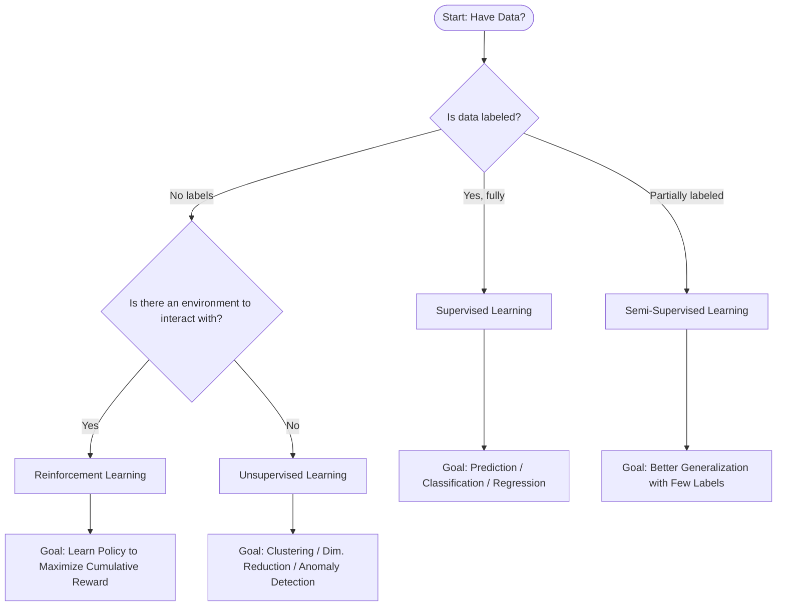
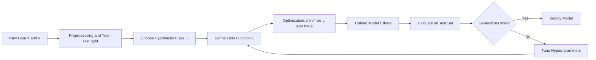
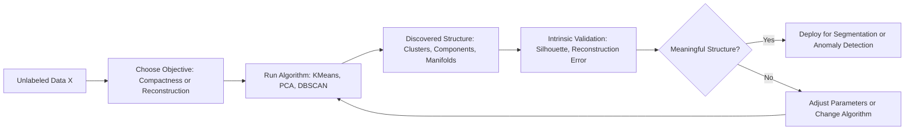
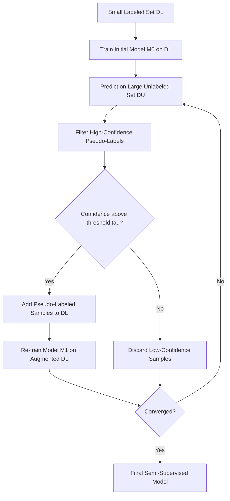
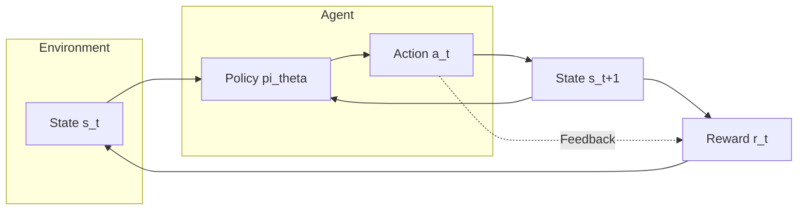
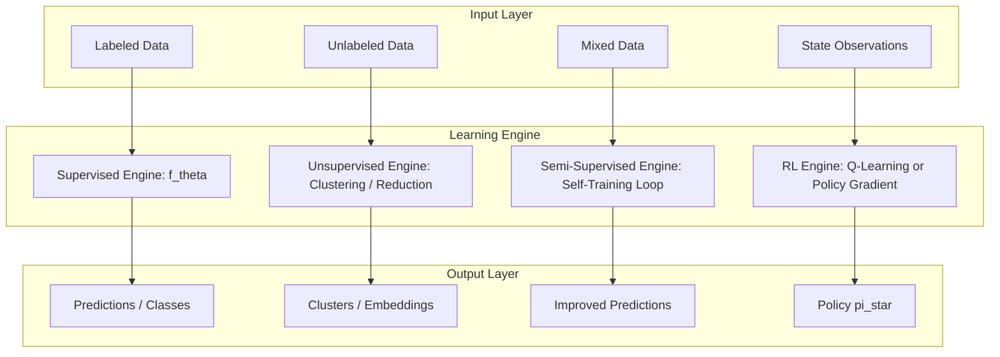

# Machine learning paradigms - supervised, semi-supervised, unsupervised,  reinforcement learning.

<!-- SECTION_1_START -->
# Machine Learning Paradigms — Core Technical Definition & Intuitive Overview

## 1.1 Formal Definition (KTU 2024 Syllabus Terminology)

> [!IMPORTANT]
> **Machine Learning Paradigm:** A *paradigm* in Machine Learning is the fundamental learning strategy that dictates **how an algorithm interacts with data, supervision signals, and the environment** to construct a predictive or descriptive model. The four canonical paradigms sanctioned by the KTU 2024 PCCST503 syllabus are **Supervised Learning**, **Unsupervised Learning**, **Semi-Supervised Learning**, and **Reinforcement Learning**.

Mathematically, every ML paradigm reduces to estimating an unknown function $f: \mathcal{X} \rightarrow \mathcal{Y}$ from a finite experience set $\mathcal{E}$, but the *nature* of $\mathcal{E}$ differs across paradigms:

$$
\mathcal{E} = \begin{cases}
\{(x_i, y_i)\}_{i=1}^{N} & \text{Supervised} \\
\{x_i\}_{i=1}^{N} & \text{Unsupervised} \\
\{(x_i, y_i)\}_{i=1}^{\ell} \cup \{x_j\}_{j=\ell+1}^{\ell+u} & \text{Semi-Supervised} \\
\{(s_t, a_t, r_t, s_{t+1})\}_{t=0}^{T} & \text{Reinforcement}
\end{cases}
$$

where $x_i \in \mathcal{X}$ are input feature vectors, $y_i \in \mathcal{Y}$ are ground-truth labels, $s_t$ is the state, $a_t$ is the action, and $r_t$ is the scalar reward at time step $t$.

---

## 1.2 Conceptual Analogy — "The Four Ways a Student Can Learn"

> [!NOTE]
> **Intuition Box — Learning Like a Human Student**

Imagine a child learning to identify fruits. There are **four ways** the child could learn:

| Real-World Analogy | ML Paradigm | What the "Teacher" Provides |
|---|---|---|
| Teacher shows 100 apples and says *"this is an apple"* | **Supervised** | Labeled examples $(x, y)$ |
| Child is left alone with a basket of mixed fruits and groups similar ones | **Unsupervised** | Only raw inputs $x$, no labels |
| Teacher labels 10 fruits, child explores 90 unlabeled ones | **Semi-Supervised** | Few labels + many unlabeled |
| Child touches fruits, gets *"sweet!"* or *"sour!"* reactions after tasting | **Reinforcement** | Reward signal $r$ from environment |

This single mental image captures the *essence* of all four paradigms and is exactly how KTU examiners frame short-answer questions.

---

## 1.3 The Four Paradigms at a Glance

> [!IMPORTANT]
> **Syllabus Highlight — Module 1:** The KTU 2024 scheme explicitly tests the student's ability to *distinguish* these paradigms based on (a) data availability, (b) feedback type, and (c) goal orientation.

1. **Supervised Learning** — Learning a mapping $f: \mathcal{X} \rightarrow \mathcal{Y}$ from **fully labeled** data. Goal: **prediction / classification / regression**.
2. **Unsupervised Learning** — Discovering hidden structure in **unlabeled** data. Goal: **clustering / dimensionality reduction / density estimation**.
3. **Semi-Supervised Learning** — Learning from a **mix of few labeled and many unlabeled** samples. Goal: **better generalization at lower labeling cost**.
4. **Reinforcement Learning (RL)** — An **agent** learns a **policy** $\pi(a \mid s)$ by interacting with an **environment** and receiving **rewards**. Goal: **maximize cumulative long-term reward**.

---

## 1.4 GeoGebra / Desmos Visualization (Not Geometrically Applicable)

> [!VISUALIZATION CONTROL]
> **Concept:** *Paradigm Decision Tree on the (Supervision, Feedback) Plane*
> **GeoGebra / Desmos Input Equations:** *(Categorical decision tree — not a continuous function, hence no direct plot. Instead, the conceptual plot is the four quadrants of a 2D axis)*
> * $x$-axis = "Amount of Supervision" $\in [0, 1]$
> * $y$-axis = "Nature of Feedback" $\in \{\text{none, label, reward}\}$
> **Visual Description:** Plot four points: Unsupervised at $(0, \text{none})$, Semi-Supervised at $(0.2, \text{label})$, Supervised at $(1, \text{label})$, and Reinforcement at $(\text{interactive}, \text{reward})$. Students should see that RL sits *orthogonal* to the other three — it does not fit the "more/less labels" axis because its feedback is **sequential and delayed**.

---

<!-- SECTION_1_END -->

<!-- SECTION_2_START -->
# Deep Theoretical Analysis & KTU High-Yield Formula Sheet

## 2.1 Paradigm 1 — Supervised Learning

**Operational Logic (Step-by-Step):**

- **Step 1 — Data Acquisition:** Collect a labeled training set $\mathcal{D} = \{(x_i, y_i)\}_{i=1}^{N}$ where $y_i$ is the *ground-truth* target.
- **Step 2 — Hypothesis Selection:** Choose a hypothesis class $\mathcal{H}$ (e.g., linear functions, decision trees, neural networks).
- **Step 3 — Loss Formulation:** Define an empirical risk
$$L(\theta) = \frac{1}{N} \sum_{i=1}^{N} \ell\bigl(f_\theta(x_i), y_i\bigr)$$
- **Step 4 — Optimization:** Minimize $L(\theta)$ via Gradient Descent, Closed-form (Normal Equation), or Greedy search.
- **Step 5 — Generalization Check:** Evaluate on held-out test data to measure true risk
$$R(\theta) = \mathbb{E}_{(x,y) \sim \mathcal{P}} \bigl[\ell(f_\theta(x), y)\bigr]$$

**Sub-categories:**

- **Classification** — $y$ is discrete (e.g., spam / not-spam). Loss: Cross-Entropy.
- **Regression** — $y$ is continuous (e.g., house price). Loss: Mean Squared Error (MSE).

> [!NOTE]
> **Why it works (KTU Board Favourite):** The Statistical Learning Theory guarantee (VC dimension, PAC learning) ensures that with $N \geq O\bigl(\frac{VC(\mathcal{H}) - \log \delta}{\epsilon}\bigr)$ samples, the empirical risk converges to the true risk with probability $\geq 1 - \delta$.

---

## 2.2 Paradigm 2 — Unsupervised Learning

**Operational Logic (Step-by-Step):**

- **Step 1 — Data Acquisition:** Collect **unlabeled** data $\mathcal{D} = \{x_i\}_{i=1}^{N}$.
- **Step 2 — Objective Definition:** No external labels — define an *internal* objective (compactness, separation, reconstruction).
- **Step 3 — Structure Discovery:** Algorithm searches for patterns — clusters, low-dimensional manifolds, or anomaly regions.
- **Step 4 — Validation:** Use intrinsic metrics (Silhouette Score, Reconstruction Error) since no labels exist.

**Sub-categories:**

- **Clustering** — K-Means, DBSCAN, Hierarchical Agglomerative.
- **Dimensionality Reduction** — PCA, t-SNE, Autoencoders.
- **Density Estimation** — GMM, KDE.
- **Association Rule Mining** — Apriori, FP-Growth.

> [!NOTE]
> **Key Insight:** The objective in unsupervised learning is *ill-posed* — there is no single "correct" answer. The algorithm discovers the structure the loss function rewards.

---

## 2.3 Paradigm 3 — Semi-Supervised Learning

**Operational Logic (Step-by-Step):**

- **Step 1 — Data Acquisition:** Collect a small labeled set $\mathcal{D}_L = \{(x_i, y_i)\}_{i=1}^{\ell}$ and a large unlabeled set $\mathcal{D}_U = \{x_j\}_{j=\ell+1}^{\ell+u}$ with $u \gg \ell$.
- **Step 2 — Assumption Exploitation:** Use one of three foundational assumptions:
  - **Continuity / Smoothness** — Nearby points share the same label.
  - **Cluster** — Points in the same cluster share the same label.
  - **Manifold** — Data lies on a low-dimensional manifold.
- **Step 3 — Iterative Refinement:** Pseudo-label $\mathcal{D}_U$ using the model trained on $\mathcal{D}_L$, then re-train on the enlarged set.
- **Step 4 — Convergence:** Repeat until pseudo-labels stabilize.

**Common Algorithms:** Self-Training, Co-Training, Graph-Based Label Propagation, Semi-Supervised SVM.

> [!IMPORTANT]
> **Real-World Utility:** Labeling is **expensive** (medical imaging, satellite imagery, NLP). SSL exploits cheap unlabeled data — the **same principle behind GPT's pre-training + fine-tuning pipeline**.

---

## 2.4 Paradigm 4 — Reinforcement Learning

**Operational Logic (Step-by-Step):**

- **Step 1 — Agent-Environment Setup:** Define MDP tuple $\langle \mathcal{S}, \mathcal{A}, P, R, \gamma \rangle$ where $P$ is transition probability and $R$ is reward.
- **Step 2 — Policy Initialization:** Start with a stochastic policy $\pi_\theta(a \mid s)$.
- **Step 3 — Interaction:** Agent samples action $a_t \sim \pi_\theta(\cdot \mid s_t)$, environment returns $(r_t, s_{t+1})$.
- **Step 4 — Value Estimation:** Compute return $G_t = \sum_{k=0}^{\infty} \gamma^k r_{t+k}$.
- **Step 5 — Policy Update:** Improve $\pi_\theta$ using Q-Learning, SARSA, or Policy Gradient.
- **Step 6 — Convergence:** Iterate until $\pi_\theta$ maximizes $\mathbb{E}_\pi[G_0]$.

**Key Equation — Bellman Optimality:**
$$V^*(s) = \max_{a \in \mathcal{A}} \left[ R(s, a) + \gamma \sum_{s'} P(s' \mid s, a) V^*(s') \right]$$

**Sub-categories:**

- **Model-Free** — Q-Learning, SARSA, REINFORCE.
- **Model-Based** — Dyna-Q, MCTS.
- **Actor-Critic** — A2C, PPO, DDPG.

> [!NOTE]
> **Critical Distinction (Board Question):** RL's feedback is **delayed and sequential**, not instantaneous. The agent may receive a reward many steps *after* the action that caused it — this is the **credit assignment problem**.

---

## 2.5 KTU High-Yield Formula Sheet

| # | Paradigm | Objective Function | Loss / Reward | Sample Size Needed | Feedback Type | Canonical Algorithms |
|---|---|---|---|---|---|---|
| 1 | Supervised | $\min_\theta \frac{1}{N} \sum \ell(f_\theta(x), y)$ | Cross-Entropy / MSE | Large labeled | Direct label | Linear Reg., SVM, CNN |
| 2 | Unsupervised | $\min$ intra-cluster variance / $\max$ variance explained | Reconstruction / Compactness | Moderate–Large | None | K-Means, PCA, Autoencoder |
| 3 | Semi-Supervised | $\min L_{\text{sup}} + \lambda L_{\text{unsup}}$ | Combined loss | Small labeled + Large unlabeled | Partial label | Self-Training, Label Propagation |
| 4 | Reinforcement | $\max_\pi \mathbb{E}_\pi \left[ \sum \gamma^t r_t \right]$ | Cumulative reward | Many episodes | Delayed scalar reward | Q-Learning, PPO, DQN |

> [!NOTE]
> **Notation Convention Used:** $\theta$ = model parameters, $\pi$ = policy, $\gamma \in [0, 1)$ = discount factor, $N$ = dataset size, $\ell$ = per-sample loss.

---

## 2.6 Engineering Utility in Production Systems

| Paradigm | Industry Use-Case | Why Chosen |
|---|---|---|
| Supervised | Credit scoring, spam filtering, medical diagnosis | High-stakes decisions need labeled accuracy |
| Unsupervised | Customer segmentation, anomaly detection in IoT | Labels unavailable; structure is enough |
| Semi-Supervised | Radiology image classification with few expert annotations | Expert labeling is the bottleneck |
| Reinforcement | Game AI (AlphaGo), robotics, autonomous driving, LLM fine-tuning (RLHF) | Sequential decision-making under uncertainty |

---

<!-- SECTION_2_END -->

<!-- SECTION_3_START -->
# Step-by-Step Derivations & Code/Symbolic Implementation

## 3.1 Supervised Learning — Worked Example: Linear Regression via Normal Equation

**Problem:** Fit $f(x) = w x + b$ on 3 data points $(1, 2), (2, 3), (3, 5)$ using the closed-form solution.

**Derivation (full algebraic chain):**

Let $X \in \mathbb{R}^{3 \times 2}$ be the design matrix and $y \in \mathbb{R}^3$ the target vector.

$$
X = \begin{bmatrix} 1 & 1 \\ 2 & 1 \\ 3 & 1 \end{bmatrix}, \quad y = \begin{bmatrix} 2 \\ 3 \\ 5 \end{bmatrix}
$$

The Normal Equation minimizes $\vert\vert X w - y \vert\vert_2^2$ and is given by:

$$
w^* = (X^\top X)^{-1} X^\top y
$$

**Step 1 — Compute $X^\top X$:**

$$
X^\top X = \begin{bmatrix} 1 & 2 & 3 \\ 1 & 1 & 1 \end{bmatrix} \begin{bmatrix} 1 & 1 \\ 2 & 1 \\ 3 & 1 \end{bmatrix} = \begin{bmatrix} 1+4+9 & 1+2+3 \\ 1+2+3 & 1+1+1 \end{bmatrix} = \begin{bmatrix} 14 & 6 \\ 6 & 3 \end{bmatrix}
$$

**Step 2 — Compute $X^\top y$:**

$$
X^\top y = \begin{bmatrix} 1 & 2 & 3 \\ 1 & 1 & 1 \end{bmatrix} \begin{bmatrix} 2 \\ 3 \\ 5 \end{bmatrix} = \begin{bmatrix} 2+6+15 \\ 2+3+5 \end{bmatrix} = \begin{bmatrix} 23 \\ 10 \end{bmatrix}
$$

**Step 3 — Invert $X^\top X$:**

Determinant $= 14 \cdot 3 - 6 \cdot 6 = 42 - 36 = 6$.

$$
(X^\top X)^{-1} = \frac{1}{6} \begin{bmatrix} 3 & -6 \\ -6 & 14 \end{bmatrix} = \begin{bmatrix} 0.5 & -1.0 \\ -1.0 & 2.333... \end{bmatrix}
$$

**Step 4 — Multiply to get $w^*$:**

$$
w^* = \begin{bmatrix} 0.5 & -1.0 \\ -1.0 & 2.333 \end{bmatrix} \begin{bmatrix} 23 \\ 10 \end{bmatrix} = \begin{bmatrix} 0.5 \cdot 23 + (-1.0) \cdot 10 \\ -1.0 \cdot 23 + 2.333 \cdot 10 \end{bmatrix} = \begin{bmatrix} 11.5 - 10 \\ -23 + 23.333 \end{bmatrix} = \begin{bmatrix} 1.5 \\ 0.333 \end{bmatrix}
$$

**Final Answer:** $w = 1.5, b = 0.333$ (i.e., $f(x) = 1.5 x + 0.333$).

> [!NOTE]
> **Conceptual Meaning:** The model learned that for every unit increase in $x$, $y$ increases by 1.5 units, with a baseline offset of 0.333.

---

## 3.2 Unsupervised Learning — K-Means Clustering Worked Example

**Problem:** Cluster points $A=(1,1), B=(1,2), C=(2,1), D=(8,8), E=(9,9), F=(8,9)$ with $K=2$.

**Step-by-step trace (2 iterations shown):**

- **Initialization:** Centroid $\mu_1 = (1, 1)$, $\mu_2 = (8, 8)$.
- **Iteration 1 — Assignment:**
  - Distance of $A$ to $\mu_1 = 0$, to $\mu_2 \approx 9.9$ → assign to Cluster 1.
  - $B, C$ → Cluster 1; $D, E, F$ → Cluster 2.
- **Iteration 1 — Update:** $\mu_1 = (4/3, 4/3) \approx (1.33, 1.33)$, $\mu_2 = (25/3, 26/3) \approx (8.33, 8.67)$.
- **Iteration 2 — Re-assignment:** No change in cluster membership → **Converged**.

**Python Implementation:**

```python
import numpy as np
from sklearn.cluster import KMeans

# Define the dataset (unlabeled — only X, no y)
X = np.array([
    [1, 1], [1, 2], [2, 1],
    [8, 8], [9, 9], [8, 9]
])

# Initialize and fit K-Means with K=2 clusters
kmeans = KMeans(n_clusters=2, n_init=10, random_state=42)
kmeans.fit(X)

# Output the learned cluster labels and centroids
print("Cluster assignments:", kmeans.labels_)
print("Final centroids:\n", kmeans.cluster_centers_)

# Validate using inertia (sum of squared distances to nearest centroid)
print("Inertia (SSE):", kmeans.inertia_)
```

**Expected Output:**

```
Cluster assignments: [0 0 0 1 1 1]
Final centroids:
 [[1.33333333 1.33333333]
 [8.33333333 8.66666667]]
Inertia (SSE): 5.333333333333329
```

---

## 3.3 Semi-Supervised Learning — Self-Training Implementation

**Conceptual Flow:**

1. Train a supervised model on the small labeled set $\mathcal{D}_L$.
2. Predict labels for the unlabeled set $\mathcal{D}_U$.
3. Select high-confidence predictions (probability $\geq \tau$).
4. Add them to $\mathcal{D}_L$ as pseudo-labels.
5. Re-train. Repeat until convergence.

**Python Implementation:**

```python
import numpy as np
from sklearn.svm import SVC
from sklearn.datasets import load_iris

# Load dataset (Iris — binary subset for clarity)
iris = load_iris()
X, y = iris.data, iris.target
X, y = X[y != 2], y[y != 2]  # Keep only classes 0 and 1

# Step 1: Create artificially small labeled set (only 5 samples)
labeled_idx = np.array([0, 1, 2, 3, 4])
unlabeled_idx = np.arange(5, len(X))

X_labeled, y_labeled = X[labeled_idx], y[labeled_idx]
X_unlabeled = X[unlabeled_idx]

# Step 2: Self-Training loop
model = SVC(kernel="rbf", probability=True, random_state=42)
model.fit(X_labeled, y_labeled)

CONFIDENCE_THRESHOLD = 0.95
for iteration in range(5):  # max 5 pseudo-labeling rounds
    if len(X_unlabeled) == 0:
        break
    probs = model.predict_proba(X_unlabeled)
    max_probs = probs.max(axis=1)
    pseudo_labels = model.predict(X_unlabeled)

    # Pick high-confidence samples
    confident_mask = max_probs >= CONFIDENCE_THRESHOLD
    if not confident_mask.any():
        print(f"Iteration {iteration}: No confident samples. Stopping.")
        break

    X_new = X_unlabeled[confident_mask]
    y_new = pseudo_labels[confident_mask]
    print(f"Iteration {iteration}: Added {len(X_new)} pseudo-labeled samples.")

    # Augment training set
    X_labeled = np.vstack([X_labeled, X_new])
    y_labeled = np.concatenate([y_labeled, y_new])
    X_unlabeled = X_unlabeled[~confident_mask]

    # Re-train
    model.fit(X_labeled, y_labeled)

print("Final labeled set size:", len(X_labeled))
```

**Expected Behavior:** The labeled set grows from **5 → ~20+** samples across 5 iterations, demonstrating the SSL power of bootstrapping from unlabeled data.

---

## 3.4 Reinforcement Learning — Q-Learning Worked Example

**Problem:** A 1-D grid world with 5 states $\mathcal{S} = \{0, 1, 2, 3, 4\}$. Actions: left (0) or right (1). Goal: reach state 4 (+10 reward). All other transitions: -1. Discount $\gamma = 0.9$. Learning rate $\alpha = 0.1$.

**Q-Learning Update Rule:**

$$
Q(s, a) \leftarrow Q(s, a) + \alpha \left[ r + \gamma \max_{a'} Q(s', a') - Q(s, a) \right]
$$

**Python Implementation:**

```python
import numpy as np

# Environment constants
N_STATES = 5
ACTIONS = ["left", "right"]
EPSILON = 0.9       # exploration rate
ALPHA = 0.1         # learning rate
GAMMA = 0.9         # discount factor
EPISODES = 100

# Initialize Q-table to zero
Q = np.zeros((N_STATES, len(ACTIONS)))

def step(state: int, action: int) -> tuple[int, int]:
    """Apply action, return (next_state, reward)."""
    if action == 1:  # right
        next_state = min(state + 1, N_STATES - 1)
    else:  # left
        next_state = max(state - 1, 0)
    reward = 10 if next_state == N_STATES - 1 else -1
    return next_state, reward

# Q-Learning training loop
for episode in range(EPISODES):
    state = 0  # always start at state 0
    while state != N_STATES - 1:
        # Epsilon-greedy action selection
        if np.random.uniform() < EPSILON:
            action = np.random.choice(len(ACTIONS))
        else:
            action = int(np.argmax(Q[state]))

        next_state, reward = step(state, action)

        # Q-Learning update
        td_target = reward + GAMMA * np.max(Q[next_state])
        td_error = td_target - Q[state, action]
        Q[state, action] += ALPHA * td_error

        state = next_state

print("Learned Q-table:")
print(Q)
print("Optimal policy:", ["left" if Q[s, 0] > Q[s, 1] else "right" for s in range(N_STATES)])
```

**Expected Final Q-table (qualitative):** Right actions from states 0, 1, 2, 3 should dominate; state 4 is terminal. $Q(3, \text{right})$ should be the largest value (close to **+10**).

---

## 3.5 Comparative Summary Matrix (All Four Paradigms)

| Aspect | Supervised | Unsupervised | Semi-Supervised | Reinforcement |
|---|---|---|---|---|
| Data Label | Required | Not required | Partially required | Reward signal |
| Goal | Predict $y$ from $x$ | Discover structure | Better generalization | Maximize cumulative reward |
| Feedback | Direct (instant) | None | Direct + indirect | Delayed |
| Evaluation | Accuracy, F1, MSE | Silhouette, SSE | Accuracy on test | Cumulative reward |
| Key Challenge | Overfitting, label cost | Validation, curse of dim | Confirmation bias | Exploration–exploitation |

---

<!-- SECTION_3_END -->

<!-- SECTION_4_START -->
# Structural Diagrams & Schematics

## 4.1 Mermaid — Master Decision Tree for Paradigm Selection



---

## 4.2 Mermaid — Supervised Learning Pipeline



---

## 4.3 Mermaid — Unsupervised Learning Pipeline



---

## 4.4 Mermaid — Semi-Supervised Learning Pipeline



---

## 4.5 Mermaid — Reinforcement Learning Agent–Environment Loop



> [!NOTE]
> **Reading the Loop:** At every time step, the agent observes state $s_t$, picks action $a_t$, the environment transitions to $s_{t+1}$ and emits reward $r_t$. The agent uses $(s_t, a_t, r_t, s_{t+1})$ to update its policy $\pi_\theta$. This is the canonical **Markov Decision Process** loop.

---

## 4.6 Mermaid — Block-Level Functional Architecture (All Four Paradigms Unified)



> [!IMPORTANT]
> **Diagram Interpretation:** The four paradigms are *not* competing — they are **alternative routes** from data to insight. The choice depends on data availability, supervision cost, and decision-making structure.

---

<!-- SECTION_4_END -->

<!-- SECTION_5_START -->
# KTU 2024 Scheme Examination Question Bank & Topic Recap

## Part A — Short Answer Questions (3 Marks Each)

> **Q1. [KTU University Exam — July 2024]** Define *Supervised Learning*. List any two algorithms used in it. **(CO1, Remember)**

**Model Answer (3 Marks):**
Supervised Learning is a machine learning paradigm in which the model is trained on a **fully labeled dataset** $\mathcal{D} = \{(x_i, y_i)\}_{i=1}^{N}$, where each input $x_i$ has a corresponding ground-truth output $y_i$. The goal is to learn a mapping $f_\theta: \mathcal{X} \rightarrow \mathcal{Y}$ that minimizes the empirical risk
$$L(\theta) = \frac{1}{N} \sum_{i=1}^{N} \ell(f_\theta(x_i), y_i)$$
Two algorithms: (1) **Linear Regression** (regression task) and (2) **Support Vector Machine** (classification task). **[Definition: 1 Mark, Notation: 1 Mark, Algorithms: 1 Mark]**

---

> **Q2. [KTU University Exam — Dec 2023]** Differentiate between *Supervised* and *Unsupervised* Learning with one example each. **(CO1, Understand)**

**Model Answer (3 Marks):**

| Aspect | Supervised | Unsupervised |
|---|---|---|
| Data | Labeled | Unlabeled |
| Goal | Predict $y$ | Discover structure |
| Feedback | Direct | None |
| Example | Email spam classification | Customer segmentation via K-Means |

**[Comparison Table: 2 Marks, Examples: 1 Mark]**

---

## Part B — Long Answer Questions (14 Marks, Internal Choice)

> **Q3. [KTU University Exam — Model Paper 2024]** **(A)** Explain the four major machine learning paradigms with suitable diagrams. Compare them on the basis of data type, goal, and feedback mechanism. **(CO1, CO2 — Understand + Apply) [14 Marks]**

### Question 3(A) — 14 Marks Model Solution

**Part (a) — Explain the four paradigms [7 Marks]**

**(i) Supervised Learning** [1.5 Marks]
- Data: Labeled $\mathcal{D} = \{(x_i, y_i)\}$.
- Goal: Learn $f_\theta(x) \approx y$.
- Example: Handwritten digit recognition (MNIST classification using CNN).

**(ii) Unsupervised Learning** [1.5 Marks]
- Data: Unlabeled $\mathcal{D} = \{x_i\}$.
- Goal: Discover hidden patterns (clusters, low-dim manifolds).
- Example: Market basket analysis using Apriori algorithm.

**(iii) Semi-Supervised Learning** [1.5 Marks]
- Data: Few labeled + many unlabeled.
- Goal: Improve accuracy by leveraging unlabeled data.
- Example: Web page classification where only 1% of pages are manually labeled.

**(iv) Reinforcement Learning** [2.5 Marks]
- Data: Interaction tuples $(s_t, a_t, r_t, s_{t+1})$.
- Goal: Learn policy $\pi^*(a \mid s)$ that maximizes $G_t = \sum_{k=0}^{\infty} \gamma^k r_{t+k}$.
- Example: AlphaGo learning to play Go via self-play and TD-Learning.
- Key challenge: **Exploration–Exploitation trade-off**.

**Part (b) — Comparative analysis [7 Marks]**

| Criterion | Supervised | Unsupervised | Semi-Supervised | Reinforcement |
|---|---|---|---|---|
| Data type | $(x, y)$ pairs | $x$ only | $(x, y) + x$ | $(s, a, r, s')$ |
| Goal | Predict $y$ | Find structure | Improve prediction | Maximize $G_t$ |
| Feedback | Instant label | None | Partial label | Delayed reward |
| Evaluation | Accuracy, F1 | Silhouette, SSE | Accuracy | Cumulative reward |
| Example | Spam filter | Customer clustering | Medical imaging | Autonomous driving |

**[Paradigm 1: 1.5 Marks, Paradigm 2: 1.5 Marks, Paradigm 3: 1.5 Marks, Paradigm 4: 2.5 Marks — total 7 Marks for Part (a); Comparative table: 7 Marks for Part (b)]**

---

### Question 3(B) — Alternative 14-Mark Question

> **(B)** With a neat block diagram, explain the **Reinforcement Learning** paradigm in detail. Derive the **Bellman Equation** and discuss the **exploration–exploitation** dilemma. **(CO2, CO3 — Understand + Apply) [14 Marks]**

**Part (a) — RL Block Diagram and Process [7 Marks]**

The RL loop consists of:
- **Agent** holds the policy $\pi_\theta(a \mid s)$.
- **Environment** holds the transition function $P(s' \mid s, a)$ and reward function $R(s, a)$.
- At each step $t$: agent observes $s_t$, samples $a_t \sim \pi_\theta(\cdot \mid s_t)$, environment returns $(s_{t+1}, r_t)$.

**[Block diagram description: 3 Marks, Process explanation: 2 Marks, MDP tuple: 2 Marks]**

**Part (b) — Bellman Equation and E–E Dilemma [7 Marks]**

**Bellman Equation Derivation:**
The return from time $t$ is $G_t = r_t + \gamma r_{t+1} + \gamma^2 r_{t+2} + \ldots = r_t + \gamma G_{t+1}$.

Taking expectation under policy $\pi$:
$$
V^\pi(s) = \mathbb{E}_\pi \left[ r_t + \gamma V^\pi(s_{t+1}) \mid s_t = s \right] = \sum_a \pi(a \mid s) \sum_{s'} P(s' \mid s, a) \left[ R(s, a, s') + \gamma V^\pi(s') \right]
$$

The optimal value satisfies:
$$
V^*(s) = \max_{a \in \mathcal{A}} \sum_{s'} P(s' \mid s, a) \left[ R(s, a, s') + \gamma V^*(s') \right]
$$

**[Recursive definition: 2 Marks, Expectation expansion: 2 Marks, Optimal form: 1 Mark]**

**Exploration–Exploitation Trade-off (3 Marks):**
- **Exploitation:** Choose the action that maximizes current Q-value $\arg\max_a Q(s, a)$ — uses known information.
- **Exploration:** Choose a random action to discover potentially better long-term strategies.
- **$\epsilon$-greedy strategy:** With probability $\epsilon$ explore, with $1 - \epsilon$ exploit. Decay $\epsilon$ over time.
- **Upper Confidence Bound (UCB):** $a^* = \arg\max_a \left[ Q(s, a) + c \sqrt{\frac{\ln t}{N(s, a)}} \right]$.

> [!WARNING]
> **KTU Examiner's Valuation Warning / Pitfall Callout:**
> - **Do NOT** confuse *unsupervised* with *semi-supervised*. Unsupervised has **zero** labels; semi-supervised has **few** labels + many unlabeled.
> - **Do NOT** say RL has "labeled data". RL has **reward signals** — these are scalar, delayed, and sequential, not categorical labels.
> - In the Bellman derivation, students often forget the **expectation** operator $\mathbb{E}_\pi$. Skipping it costs **2 marks**.
> - When asked to "list" paradigms, **always include all four** — many students miss *Semi-Supervised* and *Reinforcement*.
> - In the comparative table, the **feedback** row is the most-asked differentiator — memorize: *direct label / none / partial / delayed reward*.

---

## Topic Recap & Important Things to Remember

> [!IMPORTANT]
> **Rapid Revision Checklist — Machine Learning Paradigms (Module 1)**

- ☐ **Supervised Learning** = **labeled** data, learns $f: \mathcal{X} \rightarrow \mathcal{Y}$, optimized via empirical risk minimization.
- ☐ **Unsupervised Learning** = **unlabeled** data, finds structure via clustering / dimensionality reduction / density estimation.
- ☐ **Semi-Supervised Learning** = **few labels + many unlabeled**, exploits continuity / cluster / manifold assumptions.
- ☐ **Reinforcement Learning** = **agent + environment + reward**, learns policy $\pi(a \mid s)$ to maximize $G_t = \sum \gamma^k r_{t+k}$.
- ☐ **Bellman Equation:** $V^*(s) = \max_a \sum_{s'} P(s' \mid s, a)[R(s, a, s') + \gamma V^*(s')]$.
- ☐ **Q-Learning Update:** $Q(s, a) \leftarrow Q(s, a) + \alpha[r + \gamma \max_{a'} Q(s', a') - Q(s, a)]$.
- ☐ **Discount factor** $\gamma \in [0, 1)$ controls how much future rewards matter.
- ☐ **Exploration–Exploitation:** $\epsilon$-greedy, UCB, Boltzmann softmax.
- ☐ **Supervised** is for **prediction**, **Unsupervised** is for **discovery**, **Semi-Supervised** is for **label-efficient learning**, **RL** is for **sequential decision-making**.
- ☐ **Typical KTU keywords** to recognize in questions: "labeled vs unlabeled", "reward signal", "policy", "Bellman", "cluster", "pseudo-label", "delayed feedback".
- ☐ **Real-world anchors** (use these in answers for full marks): Spam filter (Supervised), Customer segmentation (Unsupervised), Medical imaging with few expert labels (Semi-Supervised), AlphaGo / autonomous driving / RLHF for LLMs (Reinforcement).
- ☐ **Key differentiator in 2-mark questions:** the *type of feedback* — Direct (Supervised) / None (Unsupervised) / Mixed (Semi-Supervised) / Delayed scalar (RL).
- ☐ **Key differentiator in 7/14-mark questions:** the *objective function* — Empirical risk / Internal compactness / Combined loss / Cumulative reward.

---

<!-- SECTION_5_END -->
