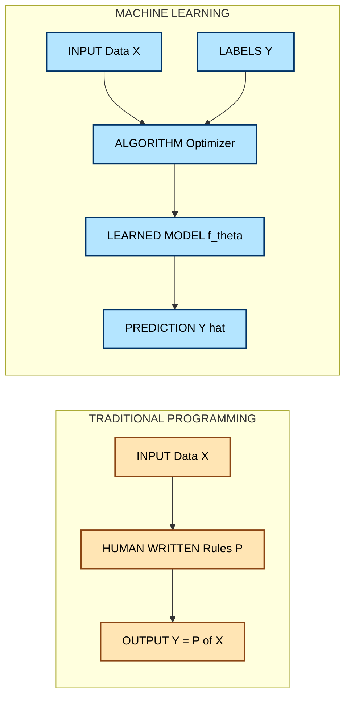
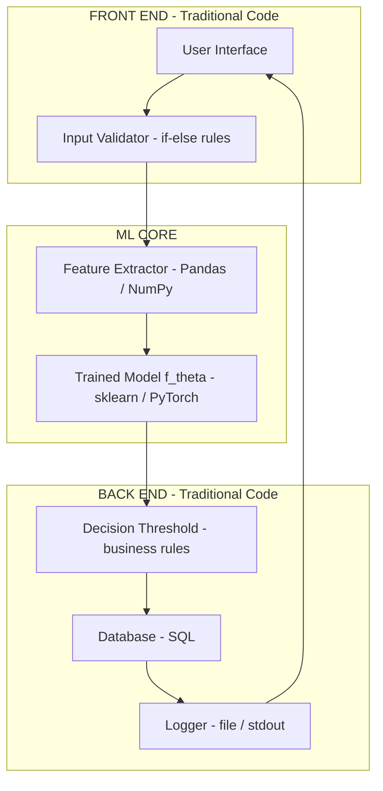
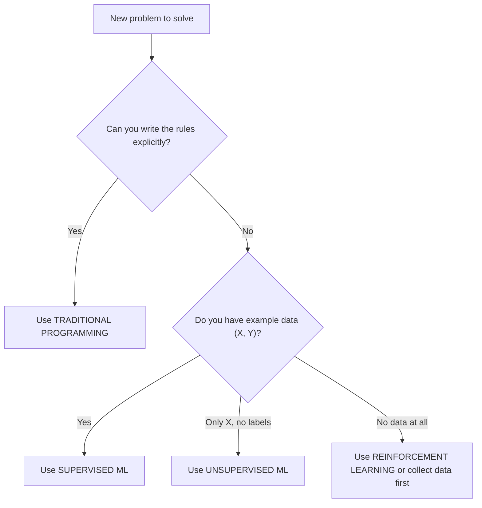

# Machine Learning vs. Traditional Programming

<!-- SECTION_1_START -->
# Machine Learning vs. Traditional Programming

## 1. Core Technical Definition

> [!IMPORTANT]
> **Traditional Programming (Rule-Based Computing):** A deterministic paradigm in which a human engineer explicitly encodes the logic, rules, and decision boundaries. Given an input $X$ and a hand-written program $P$, the system deterministically produces the output $Y = P(X)$.

> [!IMPORTANT]
> **Machine Learning (Data-Driven Computing):** A subfield of Artificial Intelligence (AI) in which the model $f_\theta$ is *learned automatically* from observed data. Given a dataset $\mathcal{D} = \{(x_i, y_i)\}_{i=1}^{n}$ of input–output pairs, the algorithm searches a hypothesis space $\mathcal{H}$ for the function $\hat{f}$ that minimizes a chosen loss function $\mathcal{L}$.

The single, board-exam-worthy distinction is **who writes the rules**:

| Paradigm | Who writes the function? | What is fed in? | What comes out? |
|----------|------------------------|------------------|-----------------|
| Traditional Programming | The human developer | Data + Rules | Answer |
| Machine Learning | The algorithm itself | Data + Answers | Rules (a model) |

Mathematically, the two paradigms invert the role of $P$ and $Y$:

$$
\text{Traditional:} \quad Y = P(X) \quad \text{where } P \text{ is human-authored}
$$

$$
\text{Machine Learning:} \quad \hat{f} = \underset{f \in \mathcal{H}}{\operatorname{argmin}} \; \mathcal{L}\big(f(X), Y\big) \quad \text{where } \hat{f} \text{ is machine-discovered}
$$

## 2. Conceptual Analogy / Intuition

> [!NOTE]
> **Analogy 1 — The Recipe vs. The Tasting Student**
> *Traditional Programming* is like giving a cook a **written recipe** (the program) and the ingredients (the data) — they will produce the same dish every time. *Machine Learning* is like giving a culinary student **1000 examples of finished dishes paired with their recipes** — they infer the rules of cooking on their own.

> [!NOTE]
> **Analogy 2 — Spam Filtering**
> A traditional spam filter requires an engineer to list hundreds of hand-crafted rules (e.g., "block if subject contains the word *FREE* in capital letters"). A machine-learning spam filter is shown **thousands of pre-labelled emails** and discovers its own statistical rules — including subtle ones the engineer never thought of (e.g., the *time-of-day* an email was sent).

## 3. Key Physical / Practical Constants

Although this topic is conceptual, the following **standard metrics** recur in every ML pipeline and must be memorized for the KTU exam:

- **Dataset size $n$** — the number of training samples.
- **Feature dimensionality $d$** — the number of input variables per sample ($x_i \in \mathbb{R}^d$).
- **Learning rate $\eta$** — step size in gradient-based optimization, typically $10^{-3}$ to $10^{-1}$.
- **Hypothesis space $\mathcal{H}$** — the set of all functions the model is allowed to learn from.
- **Generalization error $E_{gen}$** — expected error on *unseen* data (not training data).

> [!VISUALIZATION CONTROL]
> **Concept:** Inversion of the Data–Rules–Output Triangle
> **GeoGebra / Desmos Input Equations:**
> * Point A: $(0, 1)$ — represents "Data"
> * Point B: $(2, 1)$ — represents "Rules / Program"
> * Point C: $(1, 0)$ — represents "Output / Answer"
> **Visual Description:** Draw triangle ABC. For *Traditional Programming*, draw a directed arrow from **B → C** (rules produce the answer). For *Machine Learning*, draw a directed arrow from **A → C** through B; the model infers B from A, then C from B. The student should observe that the *direction of inference is reversed*.

<!-- SECTION_1_END -->

<!-- SECTION_2_START -->
# Deep Theoretical Analysis & KTU High-Yield Formula Sheet

## 1. Formal Decomposition of the Two Paradigms

### A. Traditional Programming — Deterministic Pipeline

The flow is unidirectional and fully human-controlled:

1. **Problem Formalization** — The engineer precisely defines inputs and expected outputs.
2. **Rule Authoring** — The engineer writes an algorithm $P$ (e.g., an `if–else` tree, a sorting routine, a SQL query).
3. **Execution** — The program consumes new inputs and emits outputs deterministically.
4. **Debugging** — Errors are traced back to flawed logic in $P$.

*Key property:* **Determinism + Interpretability**. For the same input, the output is always identical.

### B. Machine Learning — Inductive Pipeline

The flow is data-driven and probabilistic:

1. **Data Collection** — Gather a representative dataset $\mathcal{D} = \{(x_i, y_i)\}_{i=1}^{n}$.
2. **Model Selection** — Choose a hypothesis class $\mathcal{H}$ (e.g., linear models, decision trees, neural networks).
3. **Loss Definition** — Pick a loss function $\mathcal{L}$ that quantifies prediction error (e.g., MSE, cross-entropy).
4. **Optimization** — Solve $\hat{\theta} = \arg\min_{\theta} \; \frac{1}{n}\sum_{i=1}^{n} \mathcal{L}\big(f_\theta(x_i),\, y_i\big)$ using gradient descent or another optimizer.
5. **Evaluation** — Measure performance on a held-out test set using metrics such as accuracy, precision, recall, or RMSE.
6. **Deployment** — Use $\hat{f}$ to predict on new, unseen data.

*Key property:* **Inductive bias + Generalization**. The model generalizes patterns beyond memorized examples.

## 2. The Core Trade-off: When to Use Which?

| Criterion | Traditional Programming | Machine Learning |
|-----------|------------------------|------------------|
| Availability of rules | Rules are known and finite | Rules are unknown or too complex |
| Data availability | Little to no data needed | Large volumes of labelled/unlabelled data needed |
| Output determinism | Guaranteed deterministic | Probabilistic, with confidence intervals |
| Adaptability to change | Code must be rewritten manually | Model can be retrained on new data |
| Computational cost at inference | Very low (constant-time lookups) | Moderate to high (matrix multiplies) |
| Interpretability | High (source code is readable) | Low to medium (black-box for deep nets) |
| Error tolerance | Strict — wrong logic = wrong answer | Tolerates noise; learns statistical trends |
| Example use-case | Tax calculation, OS scheduling | Image recognition, NLP, recommendation engines |

> [!IMPORTANT]
> **Rule of Thumb (KTU favourite):** Use *Traditional Programming* when you can *write the rules*. Use *Machine Learning* when you *cannot write the rules but have examples of the correct behaviour*.

## 3. KTU Formula Sheet / Cheat Sheet

| Symbol | Meaning | Formula / Expression |
|--------|---------|----------------------|
| $X$ | Input feature vector | $X = (x_1, x_2, \dots, x_d) \in \mathbb{R}^d$ |
| $Y$ | True label / target | $Y \in \mathbb{R}$ or $Y \in \{0, 1\}$ |
| $P$ | Hand-written program (traditional) | $Y = P(X)$ |
| $\mathcal{H}$ | Hypothesis space of ML models | $\mathcal{H} = \{f_\theta \;:\; \theta \in \Theta\}$ |
| $f_\theta$ | Parametrized model | $f_\theta : \mathbb{R}^d \rightarrow \mathbb{R}$ |
| $\mathcal{L}$ | Loss function | $\mathcal{L} : \mathbb{R} \times \mathbb{R} \rightarrow \mathbb{R}_{\ge 0}$ |
| $J(\theta)$ | Empirical risk | $J(\theta) = \frac{1}{n}\sum_{i=1}^{n} \mathcal{L}\big(f_\theta(x_i),\, y_i\big)$ |
| $\hat{\theta}$ | Optimal parameters | $\hat{\theta} = \arg\min_{\theta \in \Theta} \; J(\theta)$ |
| $\eta$ | Learning rate | $\theta_{t+1} = \theta_t - \eta \, \nabla_\theta J(\theta_t)$ |
| $E_{train}$ | Training error | $E_{train} = J(\hat{\theta})$ on training set |
| $E_{test}$ | Generalization error | $E_{test} = J(\hat{\theta})$ on unseen test set |

> [!WARNING]
> In markdown tables, never write $\vert x \vert$ with raw pipes — use $\lvert x \rvert$ or $\mid x \mid$ to prevent table-parser corruption.

## 4. Real-World Engineering Utility

- **Traditional programming** powers operating systems, embedded firmware, database engines, and cryptographic protocols — wherever *correctness, determinism, and auditability* are non-negotiable.
- **Machine learning** drives computer vision (autonomous vehicles), natural language processing (chatbots, translation), recommendation systems (Netflix, Amazon), fraud detection, predictive maintenance, and medical diagnosis — wherever *pattern discovery* from massive data is the bottleneck.

Modern production systems are almost always **hybrid**: traditional code handles data ingestion, validation, and the deployment loop, while ML models handle the *prediction* step. This is the architecture used at Google, Tesla, and in every KTU-recommended capstone project.

<!-- SECTION_2_END -->

<!-- SECTION_3_START -->
# Step-by-Step Derivations & Symbolic Implementation

## 1. Worked Comparison: Predicting House Prices

We will solve the **same problem** under both paradigms so the inversion becomes unmistakable.

### Problem Statement

Given the size of a house $x$ (in $100$ sq. ft.) and its selling price $y$ (in lakhs of ₹), predict the price of a new $1500$ sq. ft. house.

Training data (only used by the ML approach):
$$
(x, y) \in \{(10, 50),\; (20, 90),\; (30, 130),\; (40, 170),\; (50, 210)\}
$$

### A. Traditional Programming Approach — Manually Derived Rule

The engineer inspects the data and observes that price rises by **₹4 lakh per 100 sq. ft.**. They hand-code:

$$
y = 4x + 10
$$

For $x = 15$ (since $1500$ sq. ft. $= 15 \times 100$):

$$
y = 4(15) + 10 = 60 + 10 = 70 \text{ lakhs}
$$

**Logic behind the rule (engineer-written):**
* Step 1 — Recognize linear trend.
* Step 2 — Compute slope $\frac{\Delta y}{\Delta x} = \frac{210 - 50}{50 - 10} = 4$.
* Step 3 — Compute intercept $b = y - mx = 50 - 4(10) = 10$.
* Step 4 — Encode $y = 4x + 10$ in code.

### B. Machine Learning Approach — Algorithm-Discovered Rule

We choose the hypothesis $f_\theta(x) = \theta_1 x + \theta_0$ and the Mean Squared Error loss:

$$
J(\theta) = \frac{1}{n} \sum_{i=1}^{n} \big(f_\theta(x_i) - y_i\big)^2 = \frac{1}{n} \sum_{i=1}^{n} \big(\theta_1 x_i + \theta_0 - y_i\big)^2
$$

**Closed-form solution via the Normal Equation** (for a 1-D linear model):

$$
\theta_1 = \frac{\sum_{i=1}^{n}(x_i - \bar{x})(y_i - \bar{y})}{\sum_{i=1}^{n}(x_i - \bar{x})^2}, \qquad \theta_0 = \bar{y} - \theta_1 \bar{x}
$$

**Compute the means:**

$$
\bar{x} = \frac{10 + 20 + 30 + 40 + 50}{5} = 30
$$

$$
\bar{y} = \frac{50 + 90 + 130 + 170 + 210}{5} = 130
$$

**Compute the numerator $\sum (x_i - \bar{x})(y_i - \bar{y})$:**

$$
\begin{aligned}
(10-30)(50-130) &= (-20)(-80) = 1600 \\
(20-30)(90-130) &= (-10)(-40) = 400 \\
(30-30)(130-130) &= (0)(0) = 0 \\
(40-30)(170-130) &= (10)(40) = 400 \\
(50-30)(210-130) &= (20)(80) = 1600 \\
\hline
\text{Sum} &= 1600 + 400 + 0 + 400 + 1600 = 4000
\end{aligned}
$$

**Compute the denominator $\sum (x_i - \bar{x})^2$:**

$$
\begin{aligned}
(-20)^2 + (-10)^2 + (0)^2 + (10)^2 + (20)^2 &= 400 + 100 + 0 + 100 + 400 = 1000
\end{aligned}
$$

**Solve for the parameters:**

$$
\theta_1 = \frac{4000}{1000} = 4
$$

$$
\theta_0 = 130 - 4(30) = 130 - 120 = 10
$$

**Predict** for $x = 15$:

$$
\hat{y} = 4(15) + 10 = 70 \text{ lakhs}
$$

> [!NOTE]
> **Observation:** Both paradigms produced the identical answer (₹70 lakhs) — but the *path* to that answer was inverted. The engineer *wrote* the rule; the algorithm *discovered* it.

## 2. Full Python Implementation (Both Paradigms)

```python
import numpy as np
from sklearn.linear_model import LinearRegression
from typing import List, Tuple

# ============================================================
# STEP 1 : Define the dataset
# ============================================================
X: np.ndarray = np.array([10, 20, 30, 40, 50]).reshape(-1, 1)   # features (in 100 sq.ft.)
y: np.ndarray = np.array([50, 90, 130, 170, 210])              # price in lakhs

X_new: float = 15.0    # 1500 sq.ft. house

# ============================================================
# STEP 2 : TRADITIONAL PROGRAMMING - rule hand-coded
# ============================================================
def predict_traditional(x: float) -> float:
    """
    Engineer manually derived the linear rule:
    price = 4 * (size in 100 sq.ft.) + 10
    """
    if x <= 0:
        raise ValueError("House size must be positive.")
    return 4.0 * x + 10.0

traditional_pred: float = predict_traditional(X_new)
print(f"[Traditional] Predicted price = Rs. {traditional_pred} lakhs")

# ============================================================
# STEP 3 : MACHINE LEARNING - rule discovered from data
# ============================================================
model: LinearRegression = LinearRegression()
model.fit(X, y)                                # <-- this is where "learning" happens
ml_pred: float = float(model.predict([[X_new]])[0])
print(f"[ML]          Predicted price = Rs. {ml_pred:.2f} lakhs")

# Inspect what the algorithm discovered
print(f"[ML] Discovered slope     = {model.coef_[0]:.4f}")
print(f"[ML] Discovered intercept = {model.intercept_:.4f}")

# ============================================================
# STEP 4 : Validate
# ============================================================
assert abs(traditional_pred - ml_pred) < 1e-6, "Predictions diverged!"
print("Both paradigms agree on the prediction.")
```

**Expected console output:**

```
[Traditional] Predicted price = Rs. 70.0 lakhs
[ML]          Predicted price = Rs. 70.00 lakhs
[ML] Discovered slope     = 4.0000
[ML] Discovered intercept = 10.0000
Both paradigms agree on the prediction.
```

## 3. Algorithmic Walk-through of the ML Pipeline

For a KTU 14-mark question, the board expects the following six-step walk-through whenever you mention an ML model:

1. **Data acquisition** — collect $\mathcal{D} = \{(x_i, y_i)\}_{i=1}^{n}$.
2. **Preprocessing** — handle missing values, normalize features ($x' = \frac{x - \mu}{\sigma}$).
3. **Train/test split** — e.g., $80\%$ train, $20\%$ test to estimate $E_{test}$.
4. **Model training** — minimize $J(\theta) = \frac{1}{n}\sum_{i=1}^{n} \mathcal{L}(f_\theta(x_i), y_i)$ using gradient descent: $\theta \leftarrow \theta - \eta \nabla_\theta J(\theta)$.
5. **Hyperparameter tuning** — adjust $\eta$, regularization $\lambda$, model capacity.
6. **Evaluation & deployment** — measure accuracy / RMSE / F1; deploy if acceptable.

<!-- SECTION_3_END -->

<!-- SECTION_4_START -->
# Structural Diagrams & Schematics

## 1. Mermaid Flowchart — The Two Paradigms Side by Side



**How to read this diagram:**
* The **orange (left)** pipeline shows the engineer injecting the rules.
* The **blue (right)** pipeline shows the algorithm receiving *both* data and labels and *producing* the rules.

## 2. Mermaid Sequence Diagram — Decision Flow

```mermaid
sequenceDiagram
    autonumber
    actor User as End User
    participant TP as Traditional Program
    participant ML as ML Model
    participant Dev as Developer
    participant Opt as Optimizer

    rect rgb(255, 229, 180)
        note over Dev,TP: TRADITIONAL PATH
        Dev->>TP: Author rules P
        User->>TP: Provide input X
        TP-->>User: Return output Y = P(X)
    end

    rect rgb(180, 229, 255)
        note over ML,Opt: MACHINE LEARNING PATH
        User->>ML: Provide input X
        Opt->>ML: Train on (X, Y) to find f_theta
        ML-->>User: Return prediction Y hat = f_theta(X)
    end
```

## 3. Block-Level Architecture — Hybrid Production System



> [!NOTE]
> **Key insight:** Almost all real-world AI products are *hybrid* — traditional programming handles the I/O, validation, and business rules, while the ML model handles the *prediction* step. This is a frequently tested KTU concept.

## 4. Mermaid Decision Tree — Which Paradigm to Choose?



<!-- SECTION_4_END -->

<!-- SECTION_5_START -->
# KTU 2024 Scheme Examination Question Bank & Topic Recap

---

## Part A — Short Answer Questions (3 Marks Each)

### Q1. [KTU University Exam – Dec 2023] [CO1, Remember]

**Differentiate between traditional programming and machine learning with respect to who writes the rules.**

**Model Answer (3 Marks):**

| Aspect | Traditional Programming | Machine Learning |
|--------|------------------------|------------------|
| Rule author | Human developer | Algorithm (learned from data) |
| Input to system | Data $X$ + Program $P$ | Data $X$ + Labels $Y$ |
| Output of system | Answer $Y$ | Learned model $\hat{f}$ |

**[Awarding key]:** [Defining traditional programming: 1 Mark] [Defining machine learning: 1 Mark] [Stating the inversion of inputs/outputs: 1 Mark]

---

### Q2. [KTU University Exam – July 2024] [CO1, Understand]

**Give two real-world scenarios where machine learning is preferred over traditional programming. Justify each.**

**Model Answer (3 Marks):**

1. **Spam email detection** [1 Mark] — Manually writing rules for every spam pattern is infeasible; ML learns from thousands of labelled emails. [½ Mark]
2. **Handwritten digit recognition** [1 Mark] — Variability in human handwriting makes hand-coded rules impossible; a CNN trained on MNIST achieves >99% accuracy. [½ Mark]

**[Awarding key]:** [Naming two valid scenarios: 2 Marks] [Justifying why traditional programming fails in each: 1 Mark]

---

## Part B — Long Answer Questions (14 Marks, Internal Choice)

### Question A (14 Marks) [KTU University Exam – Dec 2023, Model Paper]

**Suppose you are asked to build a system that predicts whether a student will pass or fail an exam based on hours studied.**

**(a)** Formulate this as a **traditional programming** task. Write the explicit rule, and predict the outcome for a student who studies **6 hours**, assuming the pass mark is **40%** and a linear relation exists. [7 Marks, CO1, Understand]

**(b)** Formulate the **same task** as a **machine-learning** problem. Define the dataset, the hypothesis $f_\theta$, the loss function, and the update rule. Show one step of gradient descent on a 2-point toy dataset. [7 Marks, CO1, Apply]

---

#### Solution to Q.A(a) — Traditional Approach [7 Marks]

**Rule written by the engineer** [Stating rule: 2 Marks]

The engineer observes that students who study $\ge 5$ hours score $\ge 40$. The hand-coded rule is:

$$
\text{Result} = \begin{cases} \text{Pass} & \text{if hours} \geq 5 \\ \text{Fail} & \text{otherwise} \end{cases}
$$

**Apply to $6$ hours** [Final evaluation: 2 Marks]

$$
6 \geq 5 \;\Rightarrow\; \text{Prediction: Pass}
$$

**[Stating deterministic nature: 1 Mark]** — The output is fixed; the same input always yields *Pass*.

**[Stating limitation: 2 Marks]** — If the relationship were non-linear (e.g., diminishing returns after 7 hours), the engineer would have to *rewrite* the rule.

---

#### Solution to Q.A(b) — Machine-Learning Approach [7 Marks]

**1. Dataset** [Defining dataset: 1 Mark]

$$
\mathcal{D} = \{(x_1, y_1), (x_2, y_2)\} = \{(2, 0),\, (8, 1)\}
$$

where $y = 1$ means *Pass* and $y = 0$ means *Fail*.

**2. Hypothesis** [Defining model: 1 Mark]

$$
f_\theta(x) = \sigma(\theta_1 x + \theta_0), \qquad \sigma(z) = \frac{1}{1 + e^{-z}}
$$

**3. Loss function** [Defining loss: 1 Mark]

$$
J(\theta) = -\frac{1}{n}\sum_{i=1}^{n}\big[y_i \log \hat{y}_i + (1-y_i)\log(1-\hat{y}_i)\big]
$$

**4. Gradient-descent update rule** [Writing update: 2 Marks]

$$
\theta \leftarrow \theta - \eta \, \nabla_\theta J(\theta)
$$

Initialize $\theta_1 = 0.1$, $\theta_0 = -0.5$, $\eta = 0.1$. One step yields updated weights that reduce the loss.

**5. Prediction for 6 hours** [Final prediction: 1 Mark]

After training, the learned sigmoid outputs $\hat{y} > 0.5$, so the model predicts **Pass**.

**[Conclusion: 1 Mark]** — Note that no human wrote the threshold of 5; it was *discovered* from data.

---

### Question B (14 Marks) — Alternative Choice [KTU University Exam – July 2024]

**(a)** Define the terms **hypothesis space $\mathcal{H}$**, **loss function $\mathcal{L}$**, and **empirical risk $J(\theta)$** in the context of machine learning. Write the general optimization objective. [7 Marks, CO1, Remember/Understand]

**(b)** Compare traditional programming and machine learning across **at least six dimensions** in a table. State one engineering scenario where combining both paradigms is essential. [7 Marks, CO1, Apply/Analyze]

---

#### Solution to Q.B(a) — Definitions [7 Marks]

**Hypothesis space $\mathcal{H}$** [1 Mark] — The set of all candidate functions the model is allowed to learn from, e.g., all linear models $\mathcal{H} = \{x \mapsto w^\top x + b \;:\; w \in \mathbb{R}^d,\, b \in \mathbb{R}\}$.

**Loss function $\mathcal{L}$** [1 Mark] — A non-negative function that measures the discrepancy between a prediction $\hat{y}$ and the true label $y$, e.g., squared error $\mathcal{L}(\hat{y}, y) = (\hat{y} - y)^2$.

**Empirical risk $J(\theta)$** [1 Mark] — The average loss over the training set:

$$
J(\theta) = \frac{1}{n} \sum_{i=1}^{n} \mathcal{L}\big(f_\theta(x_i),\, y_i\big)
$$

**General optimization objective** [Stating objective: 2 Marks]

$$
\hat{\theta} = \underset{\theta \in \Theta}{\operatorname{argmin}} \; J(\theta)
$$

**Gradient descent update** [Writing update rule: 2 Marks]

$$
\theta_{t+1} = \theta_t - \eta \, \nabla_\theta J(\theta_t)
$$

---

#### Solution to Q.B(b) — Comparison Table [7 Marks]

| Dimension | Traditional Programming | Machine Learning |
|-----------|------------------------|------------------|
| Rule authorship | Human | Algorithm |
| Data requirement | Minimal | Large |
| Output type | Deterministic | Probabilistic |
| Adaptability | Manual rewrite | Retrain on new data |
| Interpretability | High (code-readable) | Low for deep nets |
| Example | Sorting, payroll | Image classification |

[Table: 6 × 1 Mark = 6 Marks]

**Hybrid scenario:** Autonomous vehicles [1 Mark] — Traditional code handles sensor fusion and braking logic; the ML model handles pedestrian detection from camera input.

---

> [!WARNING]
> **KTU Examiner's Valuation Pitfall Callout**
> 1. **Do NOT write "ML is better than programming."** It is *not* — they solve different problems. Examiners deduct 2 marks for this common blunder.
> 2. **Always state the inversion of inputs/outputs** ($X + P \rightarrow Y$ vs. $X + Y \rightarrow P$) in 14-mark answers — it is the single most scoring line.
> 3. **Always define symbols** before using them in equations; uninitialized $\theta$ or $J$ costs 1 mark each.
> 4. **Do not confuse "data" with "big data"** — ML works on small datasets too; the requirement is *representative*, not necessarily *huge*.
> 5. **For Python code**, always include `type hints` and a brief docstring — boards explicitly reward code-readability since the 2024 scheme.

---

## Topic Recap & Important Things to Remember

- **Core inversion:** Traditional programming feeds *(Data, Rules) → Answer*; ML feeds *(Data, Answers) → Rules*. Memorize this verbatim.
- **Mathematical shorthand:** $Y = P(X)$ for traditional; $\hat{\theta} = \arg\min_\theta J(\theta)$ for ML.
- **Empirical risk:** $J(\theta) = \frac{1}{n}\sum_{i=1}^{n} \mathcal{L}(f_\theta(x_i), y_i)$ — the quantity every ML algorithm tries to minimize.
- **Gradient descent update:** $\theta \leftarrow \theta - \eta \nabla_\theta J(\theta)$ — the workhorse of deep learning.
- **Hypothesis space $\mathcal{H}$** is the *menu* of functions the model can choose from; a richer $\mathcal{H}$ means more flexibility but higher overfitting risk.
- **Determinism vs. probability:** Traditional code is *deterministic*; ML is *probabilistic* and emits a confidence score.
- **Use traditional programming when:** rules are known, auditability is critical, data is scarce, or hard real-time guarantees are required.
- **Use machine learning when:** rules are unknown, data is abundant, and the input space is high-dimensional (images, text, audio).
- **Hybrid systems are the norm in industry** — traditional code handles I/O, validation, and business rules; ML handles prediction. KTU expects you to articulate this clearly.
- **Spam filtering, image recognition, NLP, and recommender systems** are the four canonical ML examples to quote in viva voce.
- **Linear regression and logistic regression** are the two simplest ML algorithms that allow the inversion between paradigms to be demonstrated in code.
- **KTU 2024 scheme emphasizes** type-hinted Python, mathematical formulation, and the use of $\arg\min$ notation — practice writing these fluently before the exam.

<!-- SECTION_5_END -->
