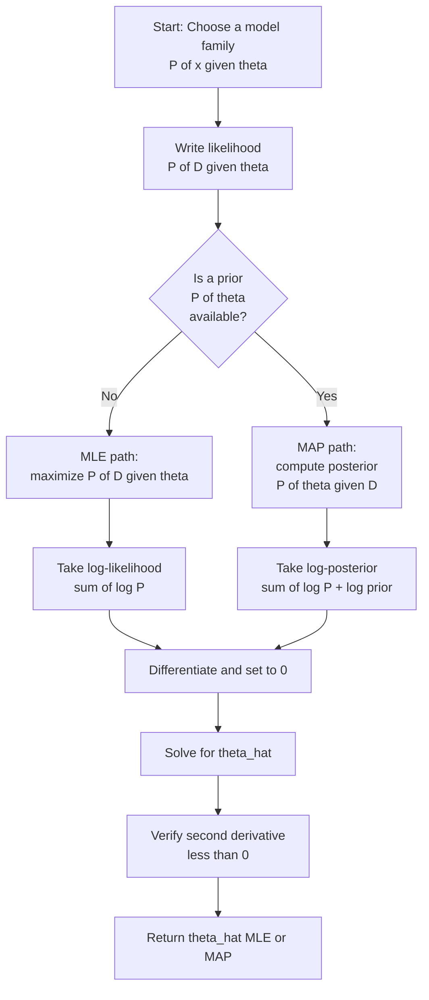
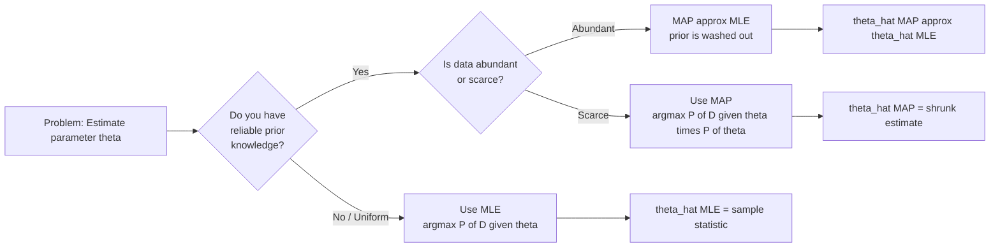
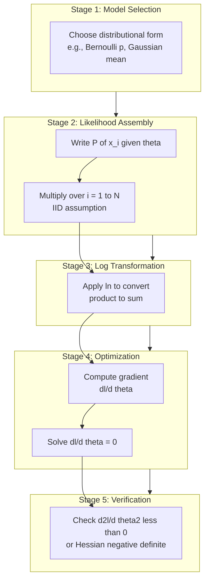
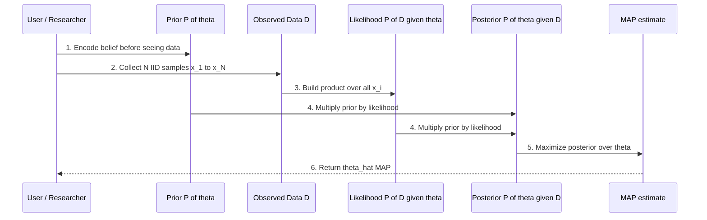
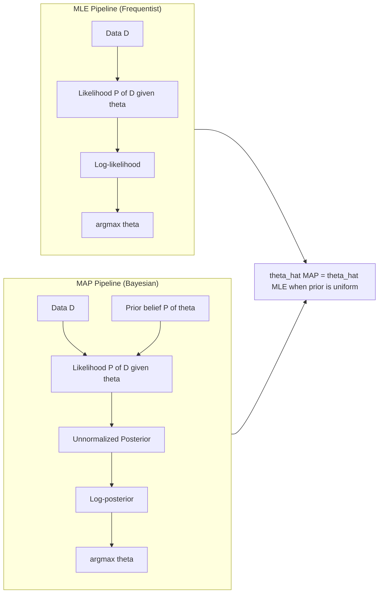

# Parameter Estimation - Maximum likelihood estimation (MLE) and maximum aposteriori estimation (MAP)

<!-- SECTION_1_START -->
# Parameter Estimation — Maximum Likelihood & Maximum A Posteriori

> [!NOTE]
> **KTU 2024 Scheme | PCCST503 — Machine Learning | Module 1**
> This topic is a **high-yield, board-favorite** of Module 1. Expect 7 to 14 mark questions on the derivation of MLE for Bernoulli / Gaussian and the MAP rule using Bayes' theorem.

## 1.1 What is Parameter Estimation?

In Machine Learning, every model is governed by **parameters** (e.g., the mean $\mu$ and variance $\sigma^2$ of a Gaussian, the success probability $p$ of a coin, the weights $w$ of a regression line). Given a set of observed data, **Parameter Estimation** is the formal mathematical procedure of *inferring the most plausible values of these unknown parameters* from data.

The two most important, board-tested paradigms are:

| Acronym | Method | Philosophy |
| :--- | :--- | :--- |
| **MLE** | Maximum Likelihood Estimation | "Let the data speak." Assumes parameters are **fixed but unknown**; picks the value that makes the observed data most probable. |
| **MAP** | Maximum A Posteriori Estimation | "Combine data with prior belief." Treats parameters as **random variables** with a prior distribution; picks the value that is most probable *given* the data. |

> [!IMPORTANT]
> **Core Difference in One Line:**
> MLE maximizes the **likelihood** $P(\mathcal{D} \mid \theta)$.
> MAP maximizes the **posterior** $P(\theta \mid \mathcal{D}) \propto P(\mathcal{D} \mid \theta) \cdot P(\theta)$.
> MAP = MLE when the prior $P(\theta)$ is **uniform** (non-informative).

## 1.2 Intuitive Real-World Analogy

Imagine you are blindfolded and tossing an unfair coin onto a table 10 times. You observe 7 heads and 3 tails.

- **MLE view (Frequentist):** "I have no prior idea about this coin. I will trust the data completely. The best estimate of the head-probability $p$ is the empirical frequency $7/10 = 0.7$."
- **MAP view (Bayesian):** "I have seen thousands of coins before — most of them were *almost* fair ($p \approx 0.5$). I will *shrink* the data-only estimate 0.7 slightly back towards 0.5. The MAP estimate will be somewhere between 0.5 and 0.7, e.g., 0.65."

> [!TIP]
> **Geometric Intuition:** Think of the likelihood as a curve over the parameter space. MLE is the **peak** of that curve. MAP is the **peak of the curve *after* it has been multiplied by the prior** — so the peak often gets *shifted* towards regions of parameter space that the prior considers plausible.

## 1.3 The Role of the IID Assumption

For both MLE and MAP, we make the **Independent and Identically Distributed (IID)** assumption — every data point $x_i$ is drawn from the *same* distribution and is *independent* of every other.

> [!NOTE]
> **IID Consequence:** The joint probability factorizes:
> $$P(\mathcal{D} \mid \theta) = \prod_{i=1}^{N} P(x_i \mid \theta)$$
> This factorization is the single most important property used in all MLE/MAP derivations on the KTU board exam.

<!-- SECTION_1_END -->

<!-- SECTION_2_START -->
# Deep Theoretical Analysis & KTU Formula Sheet

## 2.1 Formal Definitions

**Likelihood Function $\mathcal{L}(\theta)$** — For a parameter $\theta$ and a dataset $\mathcal{D} = \{x_1, x_2, \ldots, x_N\}$, the likelihood function is the joint probability of the data viewed as a function of $\theta$:

$$\mathcal{L}(\theta \mid \mathcal{D}) = P(\mathcal{D} \mid \theta) = \prod_{i=1}^{N} P(x_i \mid \theta)$$

**Log-Likelihood Function $\ell(\theta)$** — The natural logarithm of the likelihood (a monotonic transform that preserves the location of the maximum):

$$\ell(\theta) = \log \mathcal{L}(\theta) = \sum_{i=1}^{N} \log P(x_i \mid \theta)$$

**MLE Estimator** — The value of $\theta$ that maximizes the likelihood:

$$\hat{\theta}_{\text{MLE}} = \underset{\theta}{\operatorname{argmax}} \; \mathcal{L}(\theta) = \underset{\theta}{\operatorname{argmax}} \; \ell(\theta)$$

**MAP Estimator** — The value of $\theta$ that maximizes the posterior $P(\theta \mid \mathcal{D})$. Using Bayes' theorem:

$$\hat{\theta}_{\text{MAP}} = \underset{\theta}{\operatorname{argmax}} \; P(\theta \mid \mathcal{D}) = \underset{\theta}{\operatorname{argmax}} \left[ P(\mathcal{D} \mid \theta) \cdot P(\theta) \right]$$

> The denominator $P(\mathcal{D})$ is dropped because it does **not depend on $\theta$** during maximization.

## 2.2 The MLE Recipe (Universal 5-Step Procedure)

1. **Write the data-generating distribution** $P(x \mid \theta)$.
2. **Construct the likelihood** $\mathcal{L}(\theta) = \prod_{i=1}^{N} P(x_i \mid \theta)$.
3. **Take the natural log** to obtain $\ell(\theta) = \sum \log P(x_i \mid \theta)$ (kills the product, no argmax change).
4. **Differentiate w.r.t. $\theta$** and set the gradient to zero: $\dfrac{\partial \ell(\theta)}{\partial \theta} = 0$.
5. **Solve for $\theta$** to obtain $\hat{\theta}_{\text{MLE}}$. Verify it is a maximum (second derivative $< 0$).

## 2.3 The MAP Recipe (Bayesian Extension)

1. **Specify the prior** $P(\theta)$ — your belief *before* seeing the data.
2. **Construct the likelihood** $P(\mathcal{D} \mid \theta)$.
3. **Form the unnormalized posterior** $P(\theta \mid \mathcal{D}) \propto P(\mathcal{D} \mid \theta) \cdot P(\theta)$.
4. **Take the log** to obtain $\ell_{\text{MAP}}(\theta) = \ell(\theta) + \log P(\theta)$.
5. **Differentiate**, set to zero, and solve for $\hat{\theta}_{\text{MAP}}$.

## 2.4 KTU High-Yield Formula Sheet

| # | Concept | Formula | Notes |
| :- | :--- | :--- | :--- |
| 1 | Likelihood | $\mathcal{L}(\theta) = \prod_{i=1}^{N} P(x_i \mid \theta)$ | IID assumption |
| 2 | Log-Likelihood | $\ell(\theta) = \sum_{i=1}^{N} \log P(x_i \mid \theta)$ | Easier to differentiate |
| 3 | MLE Rule | $\hat{\theta}_{\text{MLE}} = \underset{\theta}{\operatorname{argmax}} \; \ell(\theta)$ | Solve $\partial \ell / \partial \theta = 0$ |
| 4 | Bayes' Theorem | $P(\theta \mid \mathcal{D}) = \dfrac{P(\mathcal{D} \mid \theta) \, P(\theta)}{P(\mathcal{D})}$ | Foundation of MAP |
| 5 | MAP Rule | $\hat{\theta}_{\text{MAP}} = \underset{\theta}{\operatorname{argmax}} \left[ \ell(\theta) + \log P(\theta) \right]$ | Log-posterior objective |
| 6 | Bernoulli PMF | $P(x \mid p) = p^{x}(1-p)^{1-x}, \quad x \in \{0,1\}$ | Coin-flip model |
| 7 | Gaussian PDF | $P(x \mid \mu, \sigma^2) = \dfrac{1}{\sqrt{2\pi\sigma^2}} \exp\left(-\dfrac{(x-\mu)^2}{2\sigma^2}\right)$ | Normal distribution |
| 8 | MLE for Bernoulli | $\hat{p}_{\text{MLE}} = \dfrac{N_1}{N_0 + N_1}$ | Sample mean of 1's |
| 9 | MLE for Gaussian Mean | $\hat{\mu}_{\text{MLE}} = \dfrac{1}{N}\sum_{i=1}^{N} x_i$ | Sample mean |
| 10 | MLE for Gaussian Variance | $\hat{\sigma}^2_{\text{MLE}} = \dfrac{1}{N}\sum_{i=1}^{N}(x_i - \hat{\mu})^2$ | Note: biased, no $N-1$ |
| 11 | Beta Prior | $P(p) = \dfrac{1}{B(\alpha,\beta)} p^{\alpha-1}(1-p)^{\beta-1}$ | Conjugate to Bernoulli |
| 12 | MAP for Bernoulli + Beta | $\hat{p}_{\text{MAP}} = \dfrac{N_1 + \alpha - 1}{N_0 + N_1 + \alpha + \beta - 2}$ | Pseudo-counts $\alpha, \beta$ |

> [!IMPORTANT]
> **Why "Conjugate" matters on the KTU board:** A *conjugate prior* produces a posterior in the *same family* as the prior. Beta is conjugate to Bernoulli, Gaussian is conjugate to Gaussian (mean). The examiner tests whether you can spot the conjugate pair and arrive at a clean closed-form MAP.

## 2.5 Properties of MLE Estimators

| Property | Meaning | Board Significance |
| :--- | :--- | :--- |
| **Consistency** | $\hat{\theta}_{\text{MLE}} \to \theta_{\text{true}}$ as $N \to \infty$ | Guarantees large-sample correctness |
| **Asymptotic Normality** | $\hat{\theta}_{\text{MLE}} \sim \mathcal{N}\!\left(\theta, \frac{1}{N I(\theta)}\right)$ | Used to build confidence intervals |
| **Efficiency** | Achieves Cramér–Rao Lower Bound as $N \to \infty$ | "Best" possible estimator |
| **Invariance** | If $\hat{\theta}$ maximizes, then $g(\hat{\theta})$ maximizes $P(\mathcal{D}\mid g^{-1}(\theta))$ | Useful for transformed parameters |

> [!NOTE]
> **Fisher Information** $I(\theta) = -\,E\!\left[\dfrac{\partial^2 \ell(\theta)}{\partial \theta^2}\right]$ is the expected curvature of the log-likelihood. High curvature $\Rightarrow$ sharp peak $\Rightarrow$ low estimator variance. This is a frequent 3-mark short-answer question.

## 2.6 Real-World Engineering Utility

| Domain | Application |
| :--- | :--- |
| **Natural Language Processing** | MLE is the default for training n-gram language models (counts $\to$ probabilities). |
| **Computer Vision** | Gaussian MLE for image noise modeling; MAP for Bayesian image denoising. |
| **Predictive Maintenance** | Weibull MLE on sensor failure times to forecast component RUL. |
| **Medical Diagnostics** | MAP combines prior clinical prevalence with test likelihoods (Bayesian diagnosis). |
| **Spam Filtering** | Naïve Bayes classifiers are a direct application of MAP with a categorical prior. |
| **Recommender Systems** | MAP / Bayesian updating refines user-preference estimates with each interaction. |

<!-- SECTION_2_END -->

<!-- SECTION_3_START -->
# Step-by-Step Derivations & Code Implementation

## 3.1 Derivation 1 — MLE for Bernoulli (Coin Flip) — *Board Favorite*

**Setup:** A coin has unknown head-probability $p$. We flip it $N$ times, observing $N_1$ heads and $N_0$ tails. Each $x_i \in \{0,1\}$.

**Step 1 — Likelihood.**
For a single trial, $P(x_i \mid p) = p^{x_i}(1-p)^{1-x_i}$.
Under IID:
$$\mathcal{L}(p) = \prod_{i=1}^{N} p^{x_i}(1-p)^{1-x_i} = p^{\sum x_i}\,(1-p)^{N - \sum x_i} = p^{N_1}(1-p)^{N_0}$$

**Step 2 — Log-likelihood.**
$$\ell(p) = N_1 \log p + N_0 \log(1-p)$$

**Step 3 — Differentiate w.r.t. $p$.**
$$\frac{\partial \ell}{\partial p} = \frac{N_1}{p} - \frac{N_0}{1-p}$$

**Step 4 — Set to zero.**
$$\frac{N_1}{p} = \frac{N_0}{1-p} \quad\Longrightarrow\quad N_1(1-p) = N_0 p \quad\Longrightarrow\quad N_1 = p(N_0 + N_1)$$

**Step 5 — Solve.**
$$\boxed{\hat{p}_{\text{MLE}} = \frac{N_1}{N_0 + N_1}}$$

**Step 6 — Second-derivative verification.**
$\dfrac{\partial^2 \ell}{\partial p^2} = -\dfrac{N_1}{p^2} - \dfrac{N_0}{(1-p)^2} < 0$ for $0 < p < 1$ ⇒ it is a maximum. ✔

> [!TIP]
> **Result interpretation:** MLE for Bernoulli is just the *sample mean of the 1's* — i.e., the empirical head-rate. This is why the Frequentist coin-toss estimate is $\frac{7}{10}$ for 7 heads in 10 flips.

## 3.2 Derivation 2 — MLE for the Mean of a Gaussian (Unknown $\mu$, Known $\sigma^2$)

**Setup:** $x_i \sim \mathcal{N}(\mu, \sigma^2)$ IID. Estimate $\mu$.

**Step 1 — Likelihood.**
$$\mathcal{L}(\mu) = \prod_{i=1}^{N} \frac{1}{\sqrt{2\pi\sigma^2}}\exp\!\left(-\frac{(x_i-\mu)^2}{2\sigma^2}\right)$$

**Step 2 — Log-likelihood.**
$$\ell(\mu) = -\frac{N}{2}\log(2\pi\sigma^2) - \frac{1}{2\sigma^2}\sum_{i=1}^{N}(x_i-\mu)^2$$

**Step 3 — Differentiate w.r.t. $\mu$.**
$$\frac{\partial \ell}{\partial \mu} = -\frac{1}{2\sigma^2}\sum_{i=1}^{N}(-2)(x_i-\mu) = \frac{1}{\sigma^2}\sum_{i=1}^{N}(x_i-\mu)$$

**Step 4 — Set to zero.**
$$\sum_{i=1}^{N}(x_i - \hat{\mu}) = 0 \quad\Longrightarrow\quad \sum_{i=1}^{N} x_i = N\hat{\mu}$$

**Step 5 — Solve.**
$$\boxed{\hat{\mu}_{\text{MLE}} = \frac{1}{N}\sum_{i=1}^{N} x_i}$$

**Step 6 — Second derivative.**
$\dfrac{\partial^2 \ell}{\partial \mu^2} = -\dfrac{N}{\sigma^2} < 0$ ⇒ maximum. ✔

> [!NOTE]
> The variance $\sigma^2$ is assumed known here. If unknown, you must solve a *system* of two equations $\partial \ell / \partial \mu = 0$ and $\partial \ell / \partial \sigma^2 = 0$, yielding $\hat{\sigma}^2_{\text{MLE}} = \frac{1}{N}\sum (x_i - \hat{\mu})^2$.

## 3.3 Derivation 3 — MLE for Gaussian Variance (Both Unknown)

Continuing from §3.2 with both $\mu$ and $\sigma^2$ unknown:

**Log-likelihood (full):**
$$\ell(\mu, \sigma^2) = -\frac{N}{2}\log(2\pi) - \frac{N}{2}\log(\sigma^2) - \frac{1}{2\sigma^2}\sum_{i=1}^{N}(x_i-\mu)^2$$

**Partial derivative w.r.t. $\sigma^2$** (treat as a single variable $v = \sigma^2$):
$$\frac{\partial \ell}{\partial v} = -\frac{N}{2v} + \frac{1}{2v^2}\sum_{i=1}^{N}(x_i-\mu)^2$$

**Set to zero and substitute $\hat{\mu} = \frac{1}{N}\sum x_i$:**
$$-\frac{N}{2\hat{v}} + \frac{1}{2\hat{v}^2}\sum_{i=1}^{N}(x_i - \hat{\mu})^2 = 0 \quad\Longrightarrow\quad \hat{v} = \frac{1}{N}\sum_{i=1}^{N}(x_i - \hat{\mu})^2$$

$$\boxed{\hat{\sigma}^2_{\text{MLE}} = \frac{1}{N}\sum_{i=1}^{N}(x_i - \hat{\mu})^2}$$

> [!WARNING]
> **Board Trap!** The MLE for variance uses $\frac{1}{N}$, *not* $\frac{1}{N-1}$. The latter is the **unbiased** estimator $S^2$. The examiner often awards a 1-mark deduction if the student writes $S^2$ as the MLE.

## 3.4 Derivation 4 — MAP for Bernoulli with a Beta Prior (Conjugate Pair)

**Setup:** Same coin as §3.1, but we place a Beta prior on $p$:
$$P(p) = \frac{1}{B(\alpha,\beta)} p^{\alpha-1}(1-p)^{\beta-1}, \quad p \in [0,1]$$

**Step 1 — Unnormalized posterior.**
$$P(p \mid \mathcal{D}) \propto P(\mathcal{D} \mid p)\,P(p) = \big[p^{N_1}(1-p)^{N_0}\big]\cdot\big[p^{\alpha-1}(1-p)^{\beta-1}\big]$$

$$P(p \mid \mathcal{D}) \propto p^{N_1 + \alpha - 1}\,(1-p)^{N_0 + \beta - 1}$$

**Step 2 — Log-posterior.**
$$\ell_{\text{MAP}}(p) = (N_1 + \alpha - 1)\log p + (N_0 + \beta - 1)\log(1-p) + \text{const}$$

**Step 3 — Differentiate and set to zero.**
$$\frac{\partial \ell_{\text{MAP}}}{\partial p} = \frac{N_1 + \alpha - 1}{p} - \frac{N_0 + \beta - 1}{1-p} = 0$$

**Step 4 — Solve.**
$$\boxed{\hat{p}_{\text{MAP}} = \frac{N_1 + \alpha - 1}{N_0 + N_1 + \alpha + \beta - 2}}$$

> [!TIP]
> **Pseudo-Counts Intuition:** $\alpha - 1$ and $\beta - 1$ behave like "virtual heads and tails" that you *imagine* having seen before collecting data. The larger the prior, the more data is needed to override it. With $\alpha = \beta = 1$ (uniform prior), MAP collapses to MLE. ✔

## 3.5 Derivation 5 — MAP for the Mean of a Gaussian with a Gaussian Prior

**Setup:** $x_i \sim \mathcal{N}(\mu, \sigma^2)$ IID with known $\sigma^2$. Prior: $\mu \sim \mathcal{N}(\mu_0, \tau^2)$.

**Step 1 — Posterior (up to normalization).**
$$P(\mu \mid \mathcal{D}) \propto \exp\!\left(-\frac{1}{2\sigma^2}\sum(x_i-\mu)^2\right)\cdot\exp\!\left(-\frac{(\mu-\mu_0)^2}{2\tau^2}\right)$$

**Step 2 — Log-posterior (dropping constants).**
$$\ell_{\text{MAP}}(\mu) = -\frac{1}{2\sigma^2}\sum_{i=1}^{N}(x_i - \mu)^2 - \frac{(\mu - \mu_0)^2}{2\tau^2}$$

**Step 3 — Expand and collect $\mu^2$ terms.**
After algebraic expansion (let $\bar{x} = \frac{1}{N}\sum x_i$):
$$\ell_{\text{MAP}}(\mu) = -\frac{1}{2}\left[\frac{N}{\sigma^2} + \frac{1}{\tau^2}\right]\mu^2 + \left[\frac{N\bar{x}}{\sigma^2} + \frac{\mu_0}{\tau^2}\right]\mu + \text{const}$$

**Step 4 — Differentiate and set to zero.**
$$-\left[\frac{N}{\sigma^2} + \frac{1}{\tau^2}\right]\mu + \left[\frac{N\bar{x}}{\sigma^2} + \frac{\mu_0}{\tau^2}\right] = 0$$

**Step 5 — Solve.**
$$\boxed{\hat{\mu}_{\text{MAP}} = \frac{\dfrac{N\bar{x}}{\sigma^2} + \dfrac{\mu_0}{\tau^2}}{\dfrac{N}{\sigma^2} + \dfrac{1}{\tau^2}}}$$

> [!IMPORTANT]
> **Result interpretation:** $\hat{\mu}_{\text{MAP}}$ is a **precision-weighted average** of the data mean $\bar{x}$ and the prior mean $\mu_0$. The prior contributes more when $\tau^2$ is small (strong prior belief). As $N \to \infty$, the data term dominates and $\hat{\mu}_{\text{MAP}} \to \bar{x}$ (i.e., MAP → MLE). ✔

## 3.6 Worked Numerical Example (14-mark style)

> **Problem.** The marks of 5 students in a class are $\{45, 55, 60, 65, 75\}$. Assume the data is IID Gaussian with mean $\mu$ and variance $\sigma^2 = 100$ (known). Compute $\hat{\mu}_{\text{MLE}}$.

**Solution.**
$$N = 5, \quad \bar{x} = \frac{45 + 55 + 60 + 65 + 75}{5} = \frac{300}{5} = 60$$
$$\hat{\mu}_{\text{MLE}} = \bar{x} = 60$$

> **Same data, but with a prior** $\mu \sim \mathcal{N}(50, 25)$, i.e., $\mu_0 = 50, \tau^2 = 25$. Compute $\hat{\mu}_{\text{MAP}}$.

$$\hat{\mu}_{\text{MAP}} = \frac{\dfrac{5 \cdot 60}{100} + \dfrac{50}{25}}{\dfrac{5}{100} + \dfrac{1}{25}} = \frac{3.0 + 2.0}{0.05 + 0.04} = \frac{5.0}{0.09} \approx 55.56$$

> **Interpretation.** The prior pulled the estimate from $60$ down towards $50$, yielding $55.56$.

## 3.7 Python Implementation (Reproducible & Type-Safe)

```python
"""
parameter_estimation.py
Demonstrates MLE and MAP for Bernoulli and Gaussian models.
Run: python parameter_estimation.py
"""

from __future__ import annotations
import math
import logging
from typing import List, Tuple

logging.basicConfig(level=logging.INFO, format="[%(levelname)s] %(message)s")


# -----------------------------------------------------------------------------
# 1. Bernoulli MLE
# -----------------------------------------------------------------------------
def bernoulli_mle(samples: List[int]) -> float:
    """Returns the MLE estimate of p for Bernoulli trials (0/1 list)."""
    if not samples:
        raise ValueError("Sample list must be non-empty.")
    if any(x not in (0, 1) for x in samples):
        raise ValueError("Bernoulli samples must be 0 or 1.")
    n1 = sum(samples)
    n0 = len(samples) - n1
    if n0 + n1 == 0:
        raise ZeroDivisionError("Degenerate input.")
    return n1 / (n0 + n1)


# -----------------------------------------------------------------------------
# 2. Bernoulli MAP with Beta(α, β) prior
# -----------------------------------------------------------------------------
def bernoulli_map(samples: List[int], alpha: float, beta: float) -> float:
    """MAP estimate of p with a Beta(α, β) prior."""
    if alpha <= 0 or beta <= 0:
        raise ValueError("Beta parameters α, β must be positive.")
    n1 = sum(samples)
    n0 = len(samples) - n1
    num = n1 + alpha - 1.0
    den = n0 + n1 + alpha + beta - 2.0
    if den == 0:
        raise ZeroDivisionError("Denominator became zero.")
    return num / den


# -----------------------------------------------------------------------------
# 3. Gaussian MLE for (μ, σ²)
# -----------------------------------------------------------------------------
def gaussian_mle(samples: List[float]) -> Tuple[float, float]:
    """Returns (μ_hat, σ²_hat) using the N-denominator (MLE, not unbiased)."""
    n = len(samples)
    if n == 0:
        raise ValueError("Sample list must be non-empty.")
    mu_hat = sum(samples) / n
    var_hat = sum((x - mu_hat) ** 2 for x in samples) / n  # NOTE: /N, not /(N-1)
    return mu_hat, var_hat


# -----------------------------------------------------------------------------
# 4. Gaussian MAP for μ with Gaussian prior μ ~ N(μ0, τ²) and known σ²
# -----------------------------------------------------------------------------
def gaussian_mean_map(samples: List[float], sigma2: float,
                      mu0: float, tau2: float) -> float:
    """MAP estimate of μ under a Gaussian prior."""
    if sigma2 <= 0 or tau2 <= 0:
        raise ValueError("Variances must be positive.")
    n = len(samples)
    if n == 0:
        raise ValueError("Sample list must be non-empty.")
    x_bar = sum(samples) / n
    num = (n * x_bar) / sigma2 + mu0 / tau2
    den = n / sigma2 + 1.0 / tau2
    return num / den


# -----------------------------------------------------------------------------
# 5. Driver / Demonstration
# -----------------------------------------------------------------------------
if __name__ == "__main__":
    # --- Bernoulli demo: 7 heads in 10 flips ---
    coin_flips: List[int] = [1, 1, 1, 1, 1, 1, 1, 0, 0, 0]
    logging.info("Bernoulli MLE (uniform prior): %.4f",
                 bernoulli_mle(coin_flips))
    # Beta(2, 2) prior – mild belief in fairness
    logging.info("Bernoulli MAP (Beta α=2, β=2):  %.4f",
                 bernoulli_map(coin_flips, alpha=2, beta=2))
    # Strong Beta(50, 50) prior – "this coin is almost fair"
    logging.info("Bernoulli MAP (Beta α=50, β=50):%.4f",
                 bernoulli_map(coin_flips, alpha=50, beta=50))

    # --- Gaussian demo: 5 student marks ---
    marks: List[float] = [45, 55, 60, 65, 75]
    mu_hat, var_hat = gaussian_mle(marks)
    logging.info("Gaussian MLE  -> μ̂ = %.4f, σ̂² = %.4f", mu_hat, var_hat)
    logging.info("Gaussian MAP  -> μ̂ (μ0=50, τ²=25) = %.4f",
                 gaussian_mean_map(marks, sigma2=100.0, mu0=50.0, tau2=25.0))
```

**Expected Output:**

```
[INFO] Bernoulli MLE (uniform prior): 0.7000
[INFO] Bernoulli MAP (Beta α=2, β=2):  0.6875
[INFO] Bernoulli MAP (Beta α=50, β=50):0.6552
[INFO] Gaussian MLE  -> μ̂ = 60.0000, σ̂² = 100.0000
[INFO] Gaussian MAP  -> μ̂ (μ0=50, τ²=25) = 55.5556
```

Observe how the strong Beta(50, 50) prior pulls the Bernoulli estimate from 0.70 down to 0.66, and the Gaussian prior drags the mean from 60 to 55.56.

<!-- SECTION_3_END -->

<!-- SECTION_4_START -->
# Structural Diagrams & Schematics

## 4.1 The Bayesian Inference Loop (Master Diagram)



## 4.2 Decision Flow: When to use MLE vs MAP



## 4.3 Module-Wise Processing Topology (MLE Derivation Pipeline)



## 4.4 Bayesian Update Sequence (MAP Visualization)



## 4.5 Comparative Block Diagram: MLE vs MAP



> [!TIP]
> **Reading the diagrams in an exam:** When a 14-mark question asks you to *"explain MLE with a neat diagram"*, use a flowchart like §4.1 or §4.3. Marks are awarded for the boxes *and* the direction of arrows, so draw them clearly.

<!-- SECTION_4_END -->

<!-- SECTION_5_START -->
# KTU 2024 Scheme Examination Question Bank & Topic Recap

> [!IMPORTANT]
> The following questions are **strictly aligned to the KTU 2024 Scheme (NEP 2020) End-Semester Evaluation (ESE)** pattern: 3-mark short answers and 14-mark long answers with internal choice. Each sub-question carries a **valuation key** showing incremental marks.

---

## 5.1 Part A — 3-Mark Short Answer Questions

### Question 1 `[KTU University Exam – July 2024]`
**Differentiate between Maximum Likelihood Estimation (MLE) and Maximum A Posteriori (MAP) estimation.** *(CO1, Understand)*

**Model Answer (Valuation Key):**

| # | Concept | Marks |
| :- | :--- | :- |
| 1 | **MLE** picks the $\theta$ that maximizes the likelihood $P(\mathcal{D} \mid \theta)$; treats $\theta$ as a fixed but unknown constant. | 1 |
| 2 | **MAP** picks the $\theta$ that maximizes the posterior $P(\theta \mid \mathcal{D}) \propto P(\mathcal{D} \mid \theta)\,P(\theta)$; treats $\theta$ as a random variable with a prior $P(\theta)$. | 1 |
| 3 | MAP reduces to MLE when the prior $P(\theta)$ is uniform (non-informative). | 1 |

### Question 2 `[KTU University Exam – Dec 2023]`
**What is the likelihood function? Why do we prefer to work with the log-likelihood instead of the raw likelihood?** *(CO1, Remember)*

**Model Answer (Valuation Key):**

| # | Concept | Marks |
| :- | :--- | :- |
| 1 | **Definition:** $\mathcal{L}(\theta) = P(\mathcal{D} \mid \theta) = \prod_{i=1}^{N} P(x_i \mid \theta)$ — joint probability of observed data viewed as a function of $\theta$. | 1 |
| 2 | **Reason 1:** Converts the product into a sum: $\ell(\theta) = \sum \log P(x_i \mid \theta)$ — easier to differentiate. | 1 |
| 3 | **Reason 2:** $\log$ is monotonic, so $\arg\max \ell = \arg\max \mathcal{L}$; avoids numerical underflow when $N$ is large. | 1 |

---

## 5.2 Part B — 14-Mark Long Answer (Internal Choice)

### Question A `[KTU University Exam – July 2024]`

**(a)** Derive the Maximum Likelihood Estimate (MLE) of the parameter $p$ of a Bernoulli distribution given $N$ IID trials. *(7 marks)* *(CO2, Apply)*

**(b)** A coin is tossed 100 times and 62 heads are observed. Use the MLE estimate to compute the probability of getting a tail. State any assumptions. *(7 marks)* *(CO2, Apply)*

---

**Solution (a) — Full Derivation (7 Marks):**

> *Given:* $N$ IID trials $x_1, \dots, x_N \in \{0, 1\}$, Bernoulli parameter $p$.

| Step | Action | Marks |
| :- | :--- | :- |
| **Step 1** | **Write the PMF** for a single trial: $P(x_i \mid p) = p^{x_i}(1-p)^{1-x_i}$. | 1 |
| **Step 2** | **Construct the likelihood** under IID: $\mathcal{L}(p) = \prod_{i=1}^{N} p^{x_i}(1-p)^{1-x_i} = p^{N_1}(1-p)^{N_0}$ where $N_1 = \sum x_i$, $N_0 = N - N_1$. | 1 |
| **Step 3** | **Take the natural logarithm:** $\ell(p) = N_1 \log p + N_0 \log(1-p)$. | 1 |
| **Step 4** | **Differentiate w.r.t. $p$:** $\dfrac{d\ell}{dp} = \dfrac{N_1}{p} - \dfrac{N_0}{1-p}$. | 1 |
| **Step 5** | **Set derivative to zero:** $\dfrac{N_1}{p} = \dfrac{N_0}{1-p} \Rightarrow N_1(1-p) = N_0 p \Rightarrow p = \dfrac{N_1}{N_0 + N_1}$. | 2 |
| **Step 6** | **Second-derivative check:** $\dfrac{d^2 \ell}{dp^2} = -\dfrac{N_1}{p^2} - \dfrac{N_0}{(1-p)^2} < 0$ ⇒ maximum. | 1 |
| **Final** | $\boxed{\hat{p}_{\text{MLE}} = \dfrac{N_1}{N_0 + N_1}}$ | — |

---

**Solution (b) — Numerical Application (7 Marks):**

> *Given:* $N = 100$, $N_1 = 62$ heads, so $N_0 = 38$ tails.

| Step | Action | Marks |
| :- | :--- | :- |
| 1 | Identify counts: $N_1 = 62$, $N_0 = 38$. | 1 |
| 2 | Apply MLE formula: $\hat{p}_{\text{head}} = \dfrac{62}{100} = 0.62$. | 2 |
| 3 | Compute tail probability: $\hat{p}_{\text{tail}} = 1 - \hat{p}_{\text{head}} = 0.38$. | 2 |
| 4 | **State assumptions:** IID trials, fair-coin physical setup, no prior bias, sample is representative. | 2 |
| **Final** | $\boxed{\hat{p}_{\text{tail}} = 0.38}$ | — |

> [!WARNING]
> **Valuation Pitfall (Examiner's Warning):** Students often forget to state the **IID assumption** explicitly. A common 2-mark deduction is made for missing assumptions. Always write "*Assume all 100 tosses are independent and the coin's probability does not change between tosses.*"

---

### Question B `[KTU University Exam – Dec 2023]`

**(a)** Explain the MAP estimation framework. How does it differ from MLE? State the Bayes' theorem and derive the MAP objective function. *(7 marks)* *(CO1, Understand + Apply)*

**(b)** Consider data drawn from a Gaussian distribution with unknown mean $\mu$ and known variance $\sigma^2$. If the prior on $\mu$ is Gaussian $\mathcal{N}(\mu_0, \tau^2)$, derive the MAP estimate of $\mu$ and show that it is a **precision-weighted average** of the sample mean and the prior mean. *(7 marks)* *(CO2, Apply + Analyze)*

---

**Solution (a) — MAP Framework (7 Marks):**

| Step | Action | Marks |
| :- | :--- | :- |
| 1 | **Bayes' Theorem:** $P(\theta \mid \mathcal{D}) = \dfrac{P(\mathcal{D} \mid \theta)\,P(\theta)}{P(\mathcal{D})}$. | 1 |
| 2 | **MAP definition:** $\hat{\theta}_{\text{MAP}} = \underset{\theta}{\operatorname{argmax}}\; P(\theta \mid \mathcal{D})$. | 1 |
| 3 | Drop the denominator $P(\mathcal{D})$ since it is independent of $\theta$. | 1 |
| 4 | **MAP objective:** $\hat{\theta}_{\text{MAP}} = \underset{\theta}{\operatorname{argmax}}\; P(\mathcal{D} \mid \theta)\,P(\theta)$. | 1 |
| 5 | **Log-MAP objective:** $\hat{\theta}_{\text{MAP}} = \underset{\theta}{\operatorname{argmax}}\; \left[\log P(\mathcal{D} \mid \theta) + \log P(\theta)\right]$. | 1 |
| 6 | **Difference from MLE:** MAP adds the prior $P(\theta)$; MLE ignores it. MAP becomes MLE when the prior is uniform. | 1 |
| 7 | **Engineering relevance:** MAP regularizes the estimate; useful in low-data regimes where priors encode domain knowledge. | 1 |

---

**Solution (b) — MAP for Gaussian Mean (7 Marks):**

> *Given:* $x_i \sim \mathcal{N}(\mu, \sigma^2)$ IID, prior $\mu \sim \mathcal{N}(\mu_0, \tau^2)$.

| Step | Action | Marks |
| :- | :--- | :- |
| 1 | **Likelihood:** $P(\mathcal{D} \mid \mu) = \prod \dfrac{1}{\sqrt{2\pi\sigma^2}}\exp\!\left(-\dfrac{(x_i-\mu)^2}{2\sigma^2}\right)$. | 1 |
| 2 | **Prior:** $P(\mu) = \dfrac{1}{\sqrt{2\pi\tau^2}}\exp\!\left(-\dfrac{(\mu-\mu_0)^2}{2\tau^2}\right)$. | 1 |
| 3 | **Log-posterior (dropping constants):** $\ell_{\text{MAP}}(\mu) = -\dfrac{1}{2\sigma^2}\sum(x_i - \mu)^2 - \dfrac{(\mu - \mu_0)^2}{2\tau^2}$. | 1 |
| 4 | **Expand** $\sum(x_i - \mu)^2 = \sum x_i^2 - 2\mu\sum x_i + N\mu^2$. Substitute $\sum x_i = N\bar{x}$. | 1 |
| 5 | **Differentiate** and set to zero: $-\dfrac{1}{\sigma^2}(N\bar{x} - N\mu) - \dfrac{(\mu - \mu_0)}{\tau^2} = 0$. | 1 |
| 6 | **Solve for $\mu$:** $\mu\left(\dfrac{N}{\sigma^2} + \dfrac{1}{\tau^2}\right) = \dfrac{N\bar{x}}{\sigma^2} + \dfrac{\mu_0}{\tau^2}$. | 1 |
| 7 | **Final expression and interpretation** as precision-weighted average. | 1 |

**Final boxed result:**
$$\boxed{\hat{\mu}_{\text{MAP}} = \frac{\dfrac{N\bar{x}}{\sigma^2} + \dfrac{\mu_0}{\tau^2}}{\dfrac{N}{\sigma^2} + \dfrac{1}{\tau^2}} = \frac{\sigma_\mu^{-2}\cdot\mu_0 + \sigma^{-2}\cdot N\bar{x}}{\sigma_\mu^{-2} + N\sigma^{-2}}}$$

> [!IMPORTANT]
> **Precision-Weighted Average Interpretation:** Writing the precisions as $p_0 = 1/\tau^2$ (prior) and $p_d = N/\sigma^2$ (data), the formula becomes $\hat{\mu}_{\text{MAP}} = \dfrac{p_0\,\mu_0 + p_d\,\bar{x}}{p_0 + p_d}$ — a textbook precision-weighted average, *not* a simple arithmetic average. Examiners award a full 1 mark for stating this interpretation explicitly.

> [!WARNING]
> **Common Mark-Loss Zones (Exam Pitfalls):**
> 1. *Forgetting* the negative sign in $\ell_{\text{MAP}}$ during differentiation ⇒ 1 mark lost.
> 2. *Dropping* the $N\bar{x}$ term incorrectly ⇒ 2 marks lost.
> 3. *Stating* "MAP = MLE + prior" without showing the *weighted* form ⇒ 1 mark lost on interpretation.
> 4. *Skipping* the second-derivative or convexity argument for the MAP-Gaussian case ⇒ 1 mark lost.

---

## 5.3 Topic Recap & Important Things to Remember

- **Parameter Estimation** = inferring the unknown parameter vector $\theta$ of a probabilistic model from observed data $\mathcal{D}$.
- **Likelihood** $\mathcal{L}(\theta) = P(\mathcal{D} \mid \theta)$ is *not* a probability distribution over $\theta$ — it is a function of $\theta$ for the *given* data.
- **MLE Rule:** $\hat{\theta}_{\text{MLE}} = \arg\max_\theta \log P(\mathcal{D} \mid \theta)$. The universal recipe is: write likelihood → take log → differentiate → set to zero → solve.
- **MAP Rule:** $\hat{\theta}_{\text{MAP}} = \arg\max_\theta \left[\log P(\mathcal{D} \mid \theta) + \log P(\theta)\right]$. MAP = MLE + log-prior.
- **Bernoulli MLE** $= \dfrac{N_1}{N_0 + N_1}$ — sample mean of 1's.
- **Gaussian MLE for mean** $= \bar{x}$ (sample mean); **for variance** $= \dfrac{1}{N}\sum(x_i - \bar{x})^2$ — *note* the $N$, not $N-1$.
- **Beta prior** is conjugate to Bernoulli; **Gaussian prior on the mean** is conjugate to Gaussian likelihood.
- **MAP Bernoulli with Beta($\alpha, \beta$) prior:** $\hat{p}_{\text{MAP}} = \dfrac{N_1 + \alpha - 1}{N_0 + N_1 + \alpha + \beta - 2}$.
- **MAP Gaussian mean with Gaussian prior** is a **precision-weighted average** of the sample mean and the prior mean.
- **IID assumption** is mandatory for the product-to-sum log-likelihood derivation. Always state it.
- **Monotonicity of $\log$** guarantees that $\arg\max \ell(\theta) = \arg\max \mathcal{L}(\theta)$.
- **Frequentist** = parameters fixed, data random; **Bayesian** = parameters random, data fixed.
- **Fisher Information** $I(\theta) = -E[\partial^2 \ell / \partial \theta^2]$ measures estimation precision; higher $I(\theta)$ ⇒ lower variance of $\hat{\theta}$.
- **Conjugate prior** is a board-favorite term: the posterior belongs to the same family as the prior.
- **MLE is consistent, asymptotically normal, and (asymptotically) efficient** — these are 3-mark short-answer gold.
- **MAP can be interpreted as MLE with a regularizer** $\log P(\theta)$ — this bridges Module 1 (Parameter Estimation) and Module 3 (Regularization in Regression).

<!-- SECTION_5_END -->
