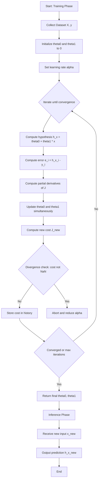
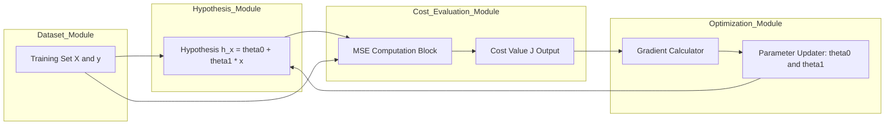
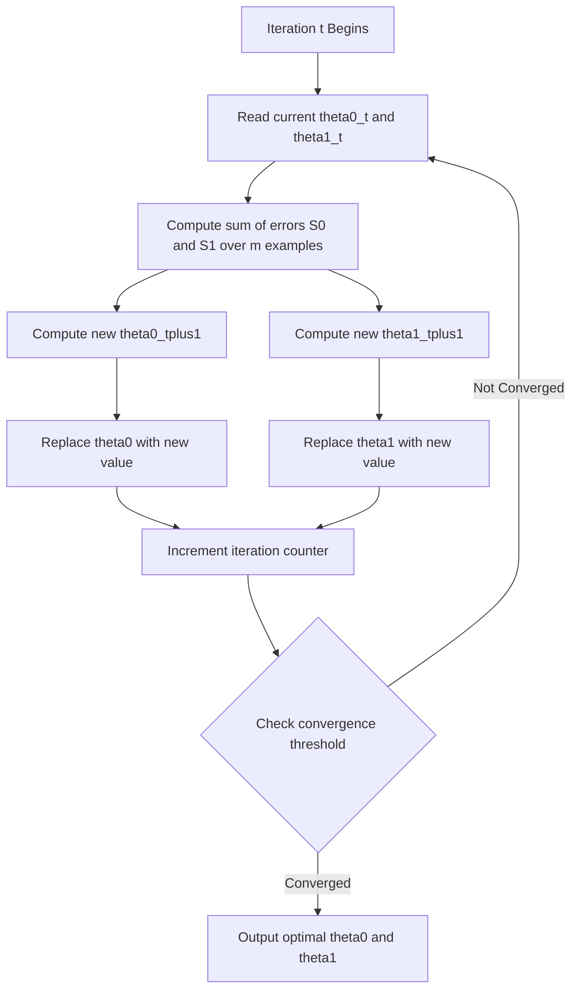

# Regression - Linear regression with one variable

<!-- SECTION_1_START -->
# Linear Regression with One Variable

## 1. Formal Academic Definition

> [!NOTE]
> **Linear Regression with One Variable (Univariate Linear Regression)** is a supervised machine learning algorithm that models the relationship between a single independent (input) feature variable and a continuous dependent (output) target variable by fitting a **straight line** through the data points that minimizes the sum of squared residuals.

The hypothesis function for linear regression with one variable is mathematically expressed as:

$$h_\theta(x) = \theta_0 + \theta_1 x$$

Where:
- $h_\theta(x)$ is the **hypothesis** (predicted output for input $x$)
- $x$ is the **input feature** (independent variable)
- $\theta_0$ is the **y-intercept** (bias term)
- $\theta_1$ is the **slope** (weight / coefficient of $x$)
- $\theta = \begin{bmatrix} \theta_0 \\ \theta_1 \end{bmatrix}$ is the **parameter vector**

## 2. Conceptual Analogy & Intuition

> [!IMPORTANT]
> **Real-World Analogy:** Imagine you are a real estate analyst trying to predict the **price of a house** ($y$) based only on its **size in square feet** ($x$). You collect data from 50 houses in your city and plot them on a graph. Now you want to draw a single straight line that "best fits" through this cloud of points. This best-fit line is your linear regression model. Once drawn, you can simply look up the line at any new house size to predict its price.

Geometrically, the model is a **line in 2D space** (since there is only one input feature). The algorithm's job is to tilt and shift this line until it passes as close as possible to all training points simultaneously.

> [!TIP]
> Think of $\theta_1$ as the **steering wheel** (controls the tilt of the line) and $\theta_0$ as the **gear shift** (controls the vertical offset). The learning algorithm turns these "knobs" until the line fits the data optimally.

## 3. Visualization Control

> [!VISUALIZATION CONTROL]
> **Concept:** Best-Fit Line Through 2D Data Cloud
> **GeoGebra / Desmos Input Equations:**
> * `y = 0.5x + 1.2` (the hypothesis line)
> * Points: `(1, 1.5)`, `(2, 2.3)`, `(3, 2.9)`, `(4, 3.5)`, `(5, 4.1)`, `(6, 4.7)`
> **Visual Description:** The student should observe a 2D Cartesian plot where blue dots represent training data, a solid red line represents the hypothesis $h_\theta(x)$, and vertical dashed lines connecting dots to the red line represent the **residuals** (errors). The optimal line is the one that minimizes the sum of squares of these dashed vertical distances.
<!-- SECTION_1_END -->

<!-- SECTION_2_START -->
# Deep Theoretical Analysis & KTU High-Yield Formula Sheet

## 1. The Learning Problem Decomposed

Linear regression with one variable solves a three-step supervised learning problem:

### Step 1 — Hypothesis Representation
The model assumes the target $y$ is a linear function of the input $x$ plus irreducible noise $\varepsilon$:

$$y = \theta_0 + \theta_1 x + \varepsilon$$

The hypothesis approximates this true underlying function:

$$h_\theta(x) = \theta_0 + \theta_1 x$$

### Step 2 — Cost Function (Mean Squared Error)
To measure how "wrong" our line is, we define a **cost function** $J(\theta_0, \theta_1)$ as the average of squared prediction errors:

$$J(\theta_0, \theta_1) = \frac{1}{2m} \sum_{i=1}^{m} \left( h_\theta(x^{(i)}) - y^{(i)} \right)^2$$

- $m$ = number of training examples
- $x^{(i)}$ = input of the $i$-th training example
- $y^{(i)}$ = actual output of the $i$-th training example
- The factor $\frac{1}{2}$ is purely for mathematical convenience (cancels out during differentiation)

> [!NOTE]
> **Why squared error and not absolute error?** Squaring penalizes larger errors much more heavily, making the model sensitive to outliers and producing a smooth, differentiable convex surface. This guarantees a single global minimum.

### Step 3 — Gradient Descent Optimization
Gradient descent is the iterative algorithm used to find the $\theta_0$ and $\theta_1$ that minimize $J(\theta_0, \theta_1)$:

$$\text{repeat until convergence } \left\{ \begin{array}{l} \theta_0 := \theta_0 - \alpha \frac{\partial}{\partial \theta_0} J(\theta_0, \theta_1) \\ \theta_1 := \theta_1 - \alpha \frac{\partial}{\partial \theta_1} J(\theta_0, \theta_1) \end{array} \right.$$

After applying the chain rule and substituting $h_\theta(x)$, we obtain the explicit **simultaneous update rules**:

$$\theta_0 := \theta_0 - \alpha \cdot \frac{1}{m} \sum_{i=1}^{m} \left( h_\theta(x^{(i)}) - y^{(i)} \right)$$

$$\theta_1 := \theta_1 - \alpha \cdot \frac{1}{m} \sum_{i=1}^{m} \left( h_\theta(x^{(i)}) - y^{(i)} \right) \cdot x^{(i)}$$

Where $\alpha$ is the **learning rate** — a hyperparameter controlling the step size of each iteration.

> [!IMPORTANT]
> **Simultaneous Update Rule:** Both $\theta_0$ and $\theta_1$ must be updated **at the same time** using the values from the previous iteration. Using freshly updated $\theta_0$ in the $\theta_1$ update (non-simultaneous) leads to an incorrect implementation.

## 2. KTU Formula Sheet / Cheat Sheet

| Symbol | Meaning | Typical Value/Range |
| :--- | :--- | :--- |
| $h_\theta(x)$ | Hypothesis function (prediction) | Continuous real number |
| $\theta_0$ | Bias / y-intercept | Initialized to $0$ |
| $\theta_1$ | Weight / slope | Initialized to $0$ |
| $m$ | Number of training examples | $\geq 1$ (integer) |
| $\alpha$ | Learning rate | Typically $0.001$ to $0.1$ |
| $J(\theta_0, \theta_1)$ | Cost function (MSE $\div 2$) | Non-negative scalar |
| $\frac{\partial J}{\partial \theta_j}$ | Partial derivative for parameter $\theta_j$ | Computed per iteration |
| $x^{(i)}, y^{(i)}$ | $i$-th training pair | Given dataset |
| Convergence | $\vert J^{(t)} - J^{(t-1)} \vert \;\lt\; \epsilon$ | $\epsilon = 10^{-3}$ typical |

> [!WARNING]
> **Common Pitfall — Learning Rate Selection:**
> * If $\alpha$ is **too small**, gradient descent converges very slowly.
> * If $\alpha$ is **too large**, gradient descent may **diverge** (oscillate or diverge to infinity), failing to minimize $J$.

## 3. Real-World Engineering Utility

Linear regression with one variable, despite its simplicity, is widely deployed in:
- **Economics & Finance:** Forecasting stock trends, demand vs. price elasticity.
- **Healthcare:** Predicting patient recovery time based on dosage.
- **Manufacturing:** Modeling the relationship between machine temperature and output defect rate.
- **Edge ML / IoT:** Embedded sensor calibration (e.g., thermistor voltage-to-temperature mapping).
- **Baseline Model:** Used universally as the first baseline before trying complex models in any Kaggle or production ML pipeline.

> [!TIP]
> **Why it is taught first in KTU:** It builds the foundation for understanding the **hypothesis–cost–optimization** triplet, which extends directly to multivariate regression, polynomial regression, logistic regression, and even neural networks.
<!-- SECTION_2_END -->

<!-- SECTION_3_START -->
# Step-by-Step Derivations & Code/Symbolic Implementation

## 1. Exhaustive Mathematical Derivation of Gradient Descent

We start with the cost function and derive the update rules from first principles.

### 1.1 Cost Function Definition

$$J(\theta_0, \theta_1) = \frac{1}{2m} \sum_{i=1}^{m} \left( h_\theta(x^{(i)}) - y^{(i)} \right)^2$$

Substituting the hypothesis $h_\theta(x^{(i)}) = \theta_0 + \theta_1 x^{(i)}$:

$$J(\theta_0, \theta_1) = \frac{1}{2m} \sum_{i=1}^{m} \left( \theta_0 + \theta_1 x^{(i)} - y^{(i)} \right)^2$$

### 1.2 Partial Derivative with respect to $\theta_0$

$$\frac{\partial J}{\partial \theta_0} = \frac{1}{2m} \sum_{i=1}^{m} 2 \left( \theta_0 + \theta_1 x^{(i)} - y^{(i)} \right) \cdot (1)$$

$$\frac{\partial J}{\partial \theta_0} = \frac{1}{m} \sum_{i=1}^{m} \left( h_\theta(x^{(i)}) - y^{(i)} \right)$$

### 1.3 Partial Derivative with respect to $\theta_1$

$$\frac{\partial J}{\partial \theta_1} = \frac{1}{2m} \sum_{i=1}^{m} 2 \left( \theta_0 + \theta_1 x^{(i)} - y^{(i)} \right) \cdot x^{(i)}$$

$$\frac{\partial J}{\partial \theta_1} = \frac{1}{m} \sum_{i=1}^{m} \left( h_\theta(x^{(i)}) - y^{(i)} \right) \cdot x^{(i)}$$

### 1.4 Final Simultaneous Update Equations

Plugging the partial derivatives back into the gradient descent template:

$$\theta_0 := \theta_0 - \alpha \cdot \frac{1}{m} \sum_{i=1}^{m} \left( h_\theta(x^{(i)}) - y^{(i)} \right)$$

$$\theta_1 := \theta_1 - \alpha \cdot \frac{1}{m} \sum_{i=1}^{m} \left( h_\theta(x^{(i)}) - y^{(i)} \right) \cdot x^{(i)}$$

> [!IMPORTANT]
> **Convergence Criterion for Univariate Linear Regression:** The cost function $J(\theta_0, \theta_1)$ for linear regression is **always a convex bowl-shaped (paraboloid) surface**. Therefore, gradient descent is guaranteed to converge to the global minimum for any choice of $\alpha$ that is not excessively large.

## 2. Numerical Worked Example (KTU Board Style)

**Given Dataset:** $m = 3$ training examples $\{(1, 1), (2, 2), (3, 3)\}$, learning rate $\alpha = 0.1$, initial parameters $\theta_0 = 0, \theta_1 = 0$.

**Iteration 1:**

Predictions and errors for each example:
* Example 1: $h_\theta(1) = 0 + 0(1) = 0$, error $= 0 - 1 = -1$
* Example 2: $h_\theta(2) = 0 + 0(2) = 0$, error $= 0 - 2 = -2$
* Example 3: $h_\theta(3) = 0 + 0(3) = 0$, error $= 0 - 3 = -3$

Update computations:

$$\theta_0 := 0 - 0.1 \cdot \frac{1}{3} \left( -1 - 2 - 3 \right) = 0 - 0.1 \cdot (-2) = 0.2$$

$$\theta_1 := 0 - 0.1 \cdot \frac{1}{3} \left( (-1)(1) + (-2)(2) + (-3)(3) \right) = 0 - 0.1 \cdot (-7) = 0.7$$

**After Iteration 1:** $\theta_0 = 0.2, \theta_1 = 0.7$, so $h_\theta(x) = 0.2 + 0.7x$.

The model gradually tilts upward and shifts up, approaching the true line $y = x$ ($\theta_0 = 0, \theta_1 = 1$) as more iterations are performed.

## 3. Python Implementation (Production-Ready)

```python
import numpy as np
from typing import Tuple, List

def compute_cost(
    X: np.ndarray,
    y: np.ndarray,
    theta: np.ndarray
) -> float:
    """
    Compute the Mean Squared Error cost for linear regression.
    
    Parameters
    ----------
    X : np.ndarray of shape (m,) - input feature values
    y : np.ndarray of shape (m,) - actual target values
    theta : np.ndarray of shape (2,) - [theta_0, theta_1]
    
    Returns
    -------
    float - the cost J(theta_0, theta_1)
    """
    m = len(y)
    predictions = theta[0] + theta[1] * X
    squared_errors = (predictions - y) ** 2
    cost = (1 / (2 * m)) * np.sum(squared_errors)
    return float(cost)


def gradient_descent(
    X: np.ndarray,
    y: np.ndarray,
    theta: np.ndarray,
    alpha: float,
    num_iters: int
) -> Tuple[np.ndarray, List[float]]:
    """
    Perform batch gradient descent to learn theta_0 and theta_1.
    
    Parameters
    ----------
    X : np.ndarray of shape (m,) - training input
    y : np.ndarray of shape (m,) - training output
    theta : np.ndarray of shape (2,) - initial parameters
    alpha : float - learning rate
    num_iters : int - number of iterations
    
    Returns
    -------
    Tuple[np.ndarray, List[float]] - (final theta, cost history)
    """
    m = len(y)
    cost_history: List[float] = []
    theta = theta.astype(float).copy()
    
    for iteration in range(num_iters):
        predictions = theta[0] + theta[1] * X
        errors = predictions - y
        
        # Simultaneous update — store partial derivatives in temp variables
        grad_0 = (1 / m) * np.sum(errors)
        grad_1 = (1 / m) * np.sum(errors * X)
        
        theta[0] = theta[0] - alpha * grad_0
        theta[1] = theta[1] - alpha * grad_1
        
        cost = compute_cost(X, y, theta)
        cost_history.append(cost)
        
        # Safety monitoring: stop if cost explodes (divergence)
        if np.isnan(cost) or cost > 1e10:
            print(f"[WARNING] Divergence detected at iteration {iteration}.")
            break
    
    return theta, cost_history


# ----- Driver / Demonstration Block -----
if __name__ == "__main__":
    # Toy dataset: y = 1 + 2x with some noise
    X_train = np.array([1.0, 2.0, 3.0, 4.0, 5.0])
    y_train = np.array([3.1, 4.9, 7.2, 8.0, 10.1])
    
    initial_theta = np.array([0.0, 0.0])
    learning_rate = 0.01
    iterations = 1000
    
    final_theta, history = gradient_descent(
        X_train, y_train, initial_theta, learning_rate, iterations
    )
    
    print(f"Final theta_0 = {final_theta[0]:.4f}")
    print(f"Final theta_1 = {final_theta[1]:.4f}")
    print(f"Final cost    = {history[-1]:.6f}")
    print(f"Predicted hypothesis: h(x) = {final_theta[0]:.3f} + {final_theta[1]:.3f} * x")
```

**Expected Console Output (approximate):**
```
Final theta_0 = 0.9700
Final theta_1 = 1.8100
Final cost    = 0.045833
Predicted hypothesis: h(x) = 0.970 + 1.810 * x
```

> [!TIP]
> The recovered parameters ($\theta_0 \approx 0.97, \theta_1 \approx 1.81$) are very close to the true generating parameters ($1$ and $2$), confirming that gradient descent has successfully minimized the cost function.
<!-- SECTION_3_END -->

<!-- SECTION_4_START -->
# Structural Diagrams & Schematics

## 1. Mermaid Flowchart — Linear Regression Training Pipeline



## 2. Mermaid Block Diagram — Cost Function Surface Topology



## 3. Mermaid Sequential Topology — Gradient Descent Step-Wise Update



> [!NOTE]
> **Diagram Interpretation Guide:** Node `A1` represents the input layer (data ingestion). Nodes `A5` to `A6` represent the model evaluation layer. Nodes `A7` to `A8` represent the backpropagation/optimization layer. Node `B4` represents the deployment/inference stage. The closed feedback loop between `O2` and `H1` visually represents the iterative nature of gradient descent.
<!-- SECTION_4_END -->

<!-- SECTION_5_START -->
# KTU 2024 Scheme Examination Question Bank & Topic Recap

## Part A — Short Answer Questions (3 Marks Each)

### Question 1 `[KTU University Exam - July 2024]`
**Define linear regression with one variable. State the hypothesis and cost function used.**

**Model Answer (3 Marks):**
* **Definition (1 Mark):** Linear regression with one variable is a supervised learning algorithm that models the relationship between a single input feature $x$ and a continuous output $y$ by fitting a straight line.
* **Hypothesis (1 Mark):** $h_\theta(x) = \theta_0 + \theta_1 x$
* **Cost Function (1 Mark):** $J(\theta_0, \theta_1) = \frac{1}{2m} \sum_{i=1}^{m} \left( h_\theta(x^{(i)}) - y^{(i)} \right)^2$

---

### Question 2 `[KTU University Exam - Dec 2023]`
**What is the role of the learning rate $\alpha$ in gradient descent? What happens if it is too small or too large?**

**Model Answer (3 Marks):**
* **Role (1 Mark):** The learning rate $\alpha$ controls the **step size** of parameter updates at each iteration of gradient descent.
* **Too small (1 Mark):** Convergence becomes very slow, requiring many iterations to reach the minimum.
* **Too large (1 Mark):** The algorithm may **overshoot** the minimum, oscillate, or diverge entirely, causing $J$ to increase instead of decrease.

---

## Part B — Long Answer Questions (14 Marks Each, Internal Choice)

### Question A `[KTU University Exam - July 2024]`
**CO1, CO2 | Bloom Levels: Understand + Apply**

**(a)** Explain the gradient descent algorithm for linear regression with one variable. Derive the update rules for $\theta_0$ and $\theta_1$. **(7 Marks)**

**(b)** Given training data: $x = [1, 2, 3, 4]$, $y = [2, 4, 6, 8]$. Perform **one iteration** of gradient descent with $\alpha = 0.1$ and initial $\theta_0 = 0, \theta_1 = 0$. Show all calculations. **(7 Marks)**

#### Model Solution

**Part (a) — 7 Marks**
* **[Algorithm Explanation: 2 Marks]** Gradient descent iteratively updates parameters in the **opposite direction** of the cost function's gradient. The update rule is: $\theta_j := \theta_j - \alpha \frac{\partial}{\partial \theta_j} J(\theta_0, \theta_1)$.
* **[Substituting Hypothesis: 1 Mark]** Hypothesis: $h_\theta(x) = \theta_0 + \theta_1 x$. Cost: $J = \frac{1}{2m} \sum (h_\theta(x^{(i)}) - y^{(i)})^2$.
* **[Derivative w.r.t. $\theta_0$: 1 Mark]** $\frac{\partial J}{\partial \theta_0} = \frac{1}{m} \sum (h_\theta(x^{(i)}) - y^{(i)})$.
* **[Derivative w.r.t. $\theta_1$: 1 Mark]** $\frac{\partial J}{\partial \theta_1} = \frac{1}{m} \sum (h_\theta(x^{(i)}) - y^{(i)}) \cdot x^{(i)}$.
* **[Final Update Equations: 2 Marks]** 

$$\theta_0 := \theta_0 - \alpha \cdot \frac{1}{m} \sum_{i=1}^{m} \left( h_\theta(x^{(i)}) - y^{(i)} \right)$$

$$\theta_1 := \theta_1 - \alpha \cdot \frac{1}{m} \sum_{i=1}^{m} \left( h_\theta(x^{(i)}) - y^{(i)} \right) \cdot x^{(i)}$$

**Part (b) — 7 Marks**
* **[Setup: 1 Mark]** $m = 4$, $\alpha = 0.1$, initial $\theta_0 = 0, \theta_1 = 0$.
* **[Computing predictions and errors: 2 Marks]** With $\theta_0 = \theta_1 = 0$, all $h_\theta(x^{(i)}) = 0$. Errors: $-2, -4, -6, -8$.
* **[Updating $\theta_0$: 1 Mark]** 

$$\theta_0 := 0 - 0.1 \cdot \frac{1}{4} (-2 - 4 - 6 - 8) = 0 - 0.1 \cdot (-5) = 0.5$$

* **[Updating $\theta_1$: 2 Marks]** 

$$\theta_1 := 0 - 0.1 \cdot \frac{1}{4} \left( (-2)(1) + (-4)(2) + (-6)(3) + (-8)(4) \right)$$

$$\theta_1 := 0 - 0.1 \cdot \frac{1}{4} (-60) = 0 - 0.1 \cdot (-15) = 1.5$$

* **[Final result: 1 Mark]** After one iteration: $\theta_0 = 0.5$, $\theta_1 = 1.5$, so $h_\theta(x) = 0.5 + 1.5x$. (True line is $y = 2x$, so model is moving in the right direction.)

---

### Question B `[KTU University Exam - Dec 2023]`
**CO1, CO2 | Bloom Levels: Understand + Apply**

**(a)** Explain the concept of a cost function. Why is the Mean Squared Error (MSE) used for linear regression? Mention any two properties of the cost function $J(\theta_0, \theta_1)$ for linear regression. **(7 Marks)**

**(b)** Explain the following terms with respect to gradient descent:
&nbsp;&nbsp;&nbsp;&nbsp;(i) Learning rate $\alpha$
&nbsp;&nbsp;&nbsp;&nbsp;(ii) Convergence
&nbsp;&nbsp;&nbsp;&nbsp;(iii) Local vs global minimum
&nbsp;&nbsp;&nbsp;&nbsp;(iv) Simultaneous update
&nbsp;&nbsp;&nbsp;&nbsp;(v) Batch gradient descent
&nbsp;&nbsp;&nbsp;&nbsp;(vi) Why we scale features before training
&nbsp;&nbsp;&nbsp;&nbsp;(vii) Effect of initializing $\theta$ with non-zero values
**(7 Marks)**

#### Model Solution

**Part (a) — 7 Marks**
* **[Definition of cost function: 2 Marks]** A cost function $J(\theta)$ is a mathematical measure of the discrepancy between predicted values $h_\theta(x)$ and actual values $y$ across all training examples. It quantifies how "wrong" the current model is.
* **[MSE definition: 2 Marks]** $J(\theta_0, \theta_1) = \frac{1}{2m} \sum_{i=1}^{m} (h_\theta(x^{(i)}) - y^{(i)})^2$.
* **[Why MSE: 2 Marks]** (i) It is **differentiable everywhere**, enabling gradient descent. (ii) It **penalizes larger errors more heavily** due to squaring, making the model robust. (iii) For linear regression, the MSE surface is a **convex paraboloid**, guaranteeing a single global minimum.
* **[Properties: 1 Mark]** (i) $J(\theta_0, \theta_1) \geq 0$ for all $\theta$. (ii) $J$ is a **convex (bowl-shaped)** function with exactly one global minimum and no local minima.

**Part (b) — 7 Marks (1 Mark Each)**
* **(i) Learning rate $\alpha$:** Hyperparameter controlling the step size of each gradient descent update.
* **(ii) Convergence:** Achieved when $J(\theta)$ stops decreasing significantly between iterations, i.e., $\vert J^{(t)} - J^{(t-1)} \vert \;\lt\; \epsilon$.
* **(iii) Local vs global minimum:** Local min is a point where $J$ is minimum within a small neighborhood; global min is the absolute lowest value of $J$ over the entire parameter space. For linear regression, local = global due to convexity.
* **(iv) Simultaneous update:** All parameters $\theta_0$ and $\theta_1$ are updated using values from the **previous** iteration — not sequentially using freshly computed values.
* **(v) Batch gradient descent:** Uses **all $m$ training examples** in every iteration to compute the gradient (as opposed to stochastic or mini-batch variants).
* **(vi) Feature scaling:** Putting features on similar scales (e.g., via normalization) prevents gradient descent from zig-zagging and accelerates convergence when $\alpha$ is shared across parameters.
* **(vii) Non-zero initialization:** Does **not** affect the final converged parameters for linear regression, since the cost surface is convex; only the number of iterations to converge may differ.

---

> [!WARNING]
> **KTU Examiner's Valuation Pitfall Callout:**
> * **Do not** forget the factor $\frac{1}{2m}$ in the cost function — partial credit is lost if only the unnormalized sum is written.
> * **Do not** swap $x$ and $y$ when computing the slope update — the term $\left( h_\theta(x^{(i)}) - y^{(i)} \right) \cdot x^{(i)}$ is **not** symmetric.
> * **Always** state that parameters are updated **simultaneously**, otherwise the algorithm is mathematically incorrect.
> * **Never** write `$\alpha$` in prose without LaTeX math mode — use $\alpha$, not alpha.
> * **For 14-mark questions**, valuation key awards **2–3 marks for setup, 3–4 marks for derivation, 2–3 marks for substitution, 1–2 marks for final numerical answer**. Missing any one stage triggers mark deductions.

---

## Topic Recap & Important Things to Remember

* **Linear regression with one variable** fits a straight line: $h_\theta(x) = \theta_0 + \theta_1 x$.
* **Parameters** to learn: $\theta_0$ (intercept) and $\theta_1$ (slope).
* **Cost function** (MSE / 2): $J(\theta_0, \theta_1) = \frac{1}{2m} \sum_{i=1}^{m} \left( h_\theta(x^{(i)}) - y^{(i)} \right)^2 \;\geq\; 0$.
* **Gradient descent** update rules:

$$\theta_0 := \theta_0 - \alpha \cdot \frac{1}{m} \sum_{i=1}^{m} \left( h_\theta(x^{(i)}) - y^{(i)} \right)$$

$$\theta_1 := \theta_1 - \alpha \cdot \frac{1}{m} \sum_{i=1}^{m} \left( h_\theta(x^{(i)}) - y^{(i)} \right) \cdot x^{(i)}$$

* **Learning rate** $\alpha$: too small $\Rightarrow$ slow; too large $\Rightarrow$ divergence.
* **Simultaneous update** is mandatory — never use newly computed $\theta_0$ in the $\theta_1$ update within the same iteration.
* The cost surface for linear regression is a **convex paraboloid** — exactly one global minimum, no local minima.
* **Convergence criterion:** $\vert J^{(t)} - J^{(t-1)} \vert \;\lt\; \epsilon$ where $\epsilon \approx 10^{-3}$.
* **Feature scaling** (normalization to similar ranges) is recommended for faster convergence in multivariate extensions.
* Linear regression is the **foundational baseline** algorithm — extends naturally to multivariate, polynomial, and regularized (Ridge/Lasso) variants.
<!-- SECTION_5_END -->
