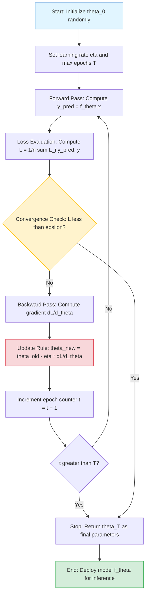
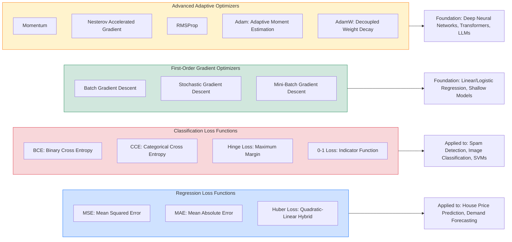
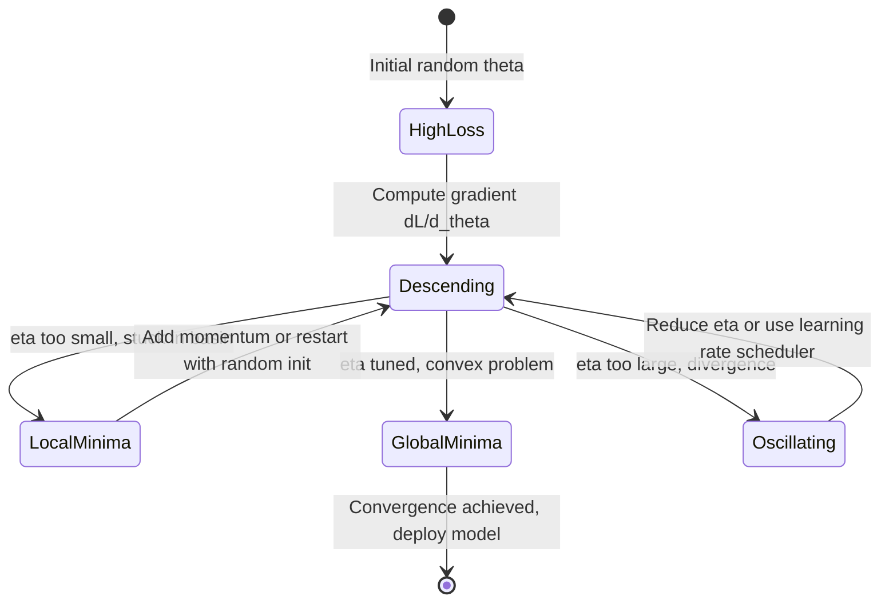

# Role of loss functions and optimization

<!-- SECTION_1_START -->
# Role of Loss Functions and Optimization in Machine Learning

## 1.1 Formal KTU 2024 Definition

In the context of the **PCCST503 – Machine Learning** syllabus (KTU 2024 Scheme, NEP 2020 aligned), a **Loss Function** (also called a **Cost Function** or **Objective Function**) is a mathematical function $L(\hat{y}, y)$ that quantifies the discrepancy between the predicted output $\hat{y}$ produced by a learning model $f_\theta(x)$ and the true target value $y$ for a given input instance $x$. The **Optimization** procedure is the algorithmic search over the model's parameter space $\theta \in \mathbb{R}^d$ that seeks to minimize (or maximize) the expected value of this loss, formally expressed as:

$$\theta^* = \arg\min_{\theta \in \mathbb{R}^d} \mathbb{E}_{(x,y) \sim \mathcal{D}} \left[ L(f_\theta(x),\, y) \right]$$

where $\mathcal{D}$ denotes the underlying data distribution, $\theta^*$ is the optimal parameter vector, and $f_\theta(\cdot)$ is the hypothesis (model) parameterized by $\theta$.

> [!IMPORTANT]
> **KTU 2024 Board Emphasis:** Examiners frequently ask students to differentiate between a **Loss Function** (computed on a *single* training example) and a **Cost Function** (the *average* loss over the entire training set $L(\theta) = \frac{1}{n}\sum_{i=1}^{n} L(f_\theta(x_i), y_i)$). Memorize this distinction — it is a guaranteed 2-mark question in Module 1.

## 1.2 Intuitive Analogy — "The Blindfolded Mountain Climber"

Imagine you are standing on a foggy mountain (the **loss landscape**) and your goal is to reach the valley floor (the **global minimum**). You cannot see the terrain, but you can feel the **slope of the ground under your feet** (the **gradient** $\nabla_\theta L(\theta)$). Your strategy is:

1. Feel the slope beneath your feet (compute the gradient).
2. Take a small step in the **steepest downhill direction** (negative gradient).
3. Repeat until the ground feels flat (gradient $\approx 0$).

- The **mountain's height** at your position = the **value of the loss function** $L(\theta)$.
- The **direction you step** = **negative gradient** $-\nabla_\theta L(\theta)$.
- The **step length** = the **learning rate** $\eta$ (a hyperparameter).
- The **fog** = the inability to see the entire landscape at once (motivating iterative, local optimization).

> [!NOTE]
> **Geometric Intuition:** A loss function $L:\mathbb{R}^d \to \mathbb{R}$ can be visualized as a **hypersurface** in $(d+1)$-dimensional space. Optimization is the process of finding the lowest point on this hypersurface. For simple linear regression with one weight, this surface is a **convex paraboloid** — a single global minimum exists. For deep neural networks, it is a highly **non-convex, rugged terrain** with many local minima, saddle points, and flat regions.

> [!VISUALIZATION CONTROL]
> **Concept:** Convex Loss Landscape (Mean Squared Error for linear regression)
> **GeoGebra / Desmos Input Equations:**
> * `L(w, b) = (w - 2)^2 + (b - 1)^2 + 0.5` (A simple convex bowl centered near $(2, 1)$)
> * Contour lines: `L = 0.5`, `L = 1.0`, `L = 2.0`, `L = 4.0`
> **Visual Description:** The student should observe a series of concentric, elliptical (or circular) contour lines forming a perfect bowl. The center of the innermost ellipse represents the **global minimum** where the loss is smallest. Gradient descent steps move *perpendicular* to these contours, towards the center.

---

<!-- SECTION_1_END -->

<!-- SECTION_2_START -->
# 2. Deep Theoretical Analysis & KTU High-Yield Formula Sheet

## 2.1 Taxonomy of Loss Functions

Loss functions are categorized by the **type of prediction problem** they address.

### A. Regression Loss Functions
Used when $y \in \mathbb{R}$ (continuous output).

### B. Classification Loss Functions
Used when $y \in \{0, 1, \dots, K-1\}$ (discrete output).

## 2.2 The Optimization Pipeline (Operational Logic)

The end-to-end optimization pipeline in supervised learning proceeds in five steps:

1. **Initialize Parameters:** Sample $\theta^{(0)}$ randomly (e.g., $\theta \sim \mathcal{N}(0, \sigma^2 I)$) or via a scheme like He/Xavier initialization.
2. **Forward Pass:** Compute predictions $\hat{y}^{(i)} = f_{\theta^{(t)}}(x^{(i)})$ for all training samples.
3. **Loss Evaluation:** Calculate $L^{(t)} = \frac{1}{n}\sum_{i=1}^{n} L(f_{\theta^{(t)}}(x^{(i)}), y^{(i)})$.
4. **Backward Pass (Gradient Computation):** Use the **chain rule** (backpropagation) to compute $\nabla_\theta L^{(t)}$.
5. **Parameter Update:** Apply the update rule $\theta^{(t+1)} = \theta^{(t)} - \eta \cdot \nabla_\theta L^{(t)}$.

Steps 2–5 are repeated for $T$ iterations (epochs) until a stopping criterion is met: $L^{(t)} < \epsilon$ (tolerance), $|\nabla_\theta L^{(t)}| < \delta$ (gradient norm), or $t \geq T$ (max epochs).

> [!IMPORTANT]
> **Why Optimize?** The central hypothesis of statistical learning theory is that **minimizing the empirical loss on training data leads to good generalization on unseen data**, provided the model is not over-parameterized and the data is sufficiently large (this is formalized by the **Probably Approximately Correct (PAC)** learning framework and **VC dimension** theory).

## 2.3 KTU High-Yield Formula Sheet

> [!NOTE]
> **EXAM CHEAT SHEET:** Memorize the first column (Formula) and the second column (Use Case). The third column is a frequent 3-mark "state the derivative" question.

| Loss / Optimizer Name | Mathematical Form | Gradient w.r.t. $\hat{y}$ | Primary Use Case |
| :--- | :--- | :--- | :--- |
| **Mean Squared Error (MSE)** | $L = \frac{1}{n}\sum_{i=1}^{n}(\hat{y}_i - y_i)^2$ | $\frac{\partial L}{\partial \hat{y}_i} = \frac{2}{n}(\hat{y}_i - y_i)$ | Linear Regression, OLS problems |
| **Mean Absolute Error (MAE)** | $L = \frac{1}{n}\sum_{i=1}^{n}\vert \hat{y}_i - y_i \vert$ | $\frac{\partial L}{\partial \hat{y}_i} = \frac{1}{n}\text{sign}(\hat{y}_i - y_i)$ | Robust regression (handles outliers) |
| **Huber Loss** | $L = \frac{1}{n}\sum \begin{cases} \tfrac{1}{2}(\hat{y}-y)^2 & \text{if } \vert \hat{y}-y \vert \le \delta \\ \delta(\vert \hat{y}-y \vert - \tfrac{1}{2}\delta) & \text{otherwise} \end{cases}$ | Piecewise (quadratic/linear) | Regression with mixed outlier profile |
| **Binary Cross-Entropy (BCE)** | $L = -\frac{1}{n}\sum [y \log(\hat{y}) + (1-y)\log(1-\hat{y})]$ | $\frac{1}{n}\left(\frac{\hat{y} - y}{\hat{y}(1-\hat{y})}\right)$ | Binary classification, Logistic Regression |
| **Categorical Cross-Entropy** | $L = -\sum_{c=1}^{K} y_c \log(\hat{y}_c)$ | $\frac{\partial L}{\partial \hat{y}_c} = -\frac{y_c}{\hat{y}_c}$ | Multi-class classification, Softmax output |
| **Hinge Loss** | $L = \max(0, 1 - y \cdot \hat{y})$ | Sub-gradient: $-y$ if $y\hat{y}<1$, else $0$ | SVMs, maximum-margin classifiers |
| **0-1 Loss** | $L = \mathbb{1}[\hat{y} \neq y]$ | Not differentiable (discrete) | Theoretical benchmark only |
| **Gradient Descent (GD) Update** | $\theta^{(t+1)} = \theta^{(t)} - \eta \nabla_\theta L(\theta^{(t)})$ | — | Batch optimization (uses all $n$ samples) |
| **SGD Update** | $\theta^{(t+1)} = \theta^{(t)} - \eta \nabla_\theta L_i(\theta^{(t)})$ | — | Stochastic optimization (1 sample/step) |
| **Mini-batch GD Update** | $\theta^{(t+1)} = \theta^{(t)} - \eta \nabla_\theta L_{\mathcal{B}}(\theta^{(t)})$ | — | Standard practice (batch size $B=32, 64, 128$) |
| **Momentum Update** | $v^{(t+1)} = \beta v^{(t)} + \eta \nabla_\theta L$, $\theta^{(t+1)} = \theta^{(t)} - v^{(t+1)}$ | — | Accelerates GD in ravines, dampens oscillation |
| **Adam Update** | $m_t = \beta_1 m_{t-1} + (1-\beta_1)g_t$; $v_t = \beta_2 v_{t-1} + (1-\beta_2)g_t^2$ | — | Adaptive moments, default for deep learning |

## 2.4 Why This Matters in Real Engineering Systems

- **Computer Vision:** Cross-entropy loss + Adam optimizer is the de-facto standard for image classification (ResNet, EfficientNet).
- **Natural Language Processing:** Cross-entropy is used to train Large Language Models (LLMs) for next-token prediction. Optimization is dominated by **AdamW** (Adam with decoupled weight decay).
- **Recommender Systems:** MSE/MAE losses are used in collaborative filtering (Matrix Factorization). Optimization scales to billions of parameters using **distributed SGD**.
- **Autonomous Driving:** Safety-critical models use **Huber Loss** to balance the smooth optimization of MSE with the outlier robustness of MAE.
- **Finance & Healthcare:** **Custom loss functions** (e.g., asymmetric loss, quantile loss) are engineered to penalize specific error types (false negatives in cancer detection).

> [!IMPORTANT]
> **The choice of loss function is itself a modeling decision.** It encodes your assumptions about the noise distribution: MSE assumes Gaussian noise, MAE assumes Laplace noise, Cross-Entropy assumes a Bernoulli/multinomial distribution. Choosing the wrong loss yields a biased estimator.

---

<!-- SECTION_2_END -->

<!-- SECTION_3_START -->
# 3. Step-by-Step Derivations & Symbolic Implementation

## 3.1 Full Derivation: Why MSE Leads to the Normal Equation

For a simple linear regression model $\hat{y} = wx + b$, with a dataset of $n$ points $\{(x_i, y_i)\}_{i=1}^{n}$, the MSE cost function is:

$$L(w, b) = \frac{1}{n} \sum_{i=1}^{n} \left( \hat{y}_i - y_i \right)^2 = \frac{1}{n} \sum_{i=1}^{n} \left( (wx_i + b) - y_i \right)^2$$

We want to find $w^*$ and $b^*$ such that $\nabla L = 0$.

**Step 1: Compute the partial derivative with respect to $b$.**

$$\frac{\partial L}{\partial b} = \frac{1}{n} \sum_{i=1}^{n} 2 \left( (wx_i + b) - y_i \right) \cdot (1) = \frac{2}{n} \sum_{i=1}^{n} \left( wx_i + b - y_i \right)$$

**Step 2: Set the partial derivative to zero.**

$$\frac{2}{n} \sum_{i=1}^{n} (wx_i + b - y_i) = 0 \implies \sum_{i=1}^{n} wx_i + \sum_{i=1}^{n} b - \sum_{i=1}^{n} y_i = 0$$

$$w \sum_{i=1}^{n} x_i + n b - \sum_{i=1}^{n} y_i = 0 \implies b = \bar{y} - w \bar{x}$$

where $\bar{x} = \frac{1}{n}\sum x_i$ and $\bar{y} = \frac{1}{n}\sum y_i$. This shows the intercept is the residual of the means.

**Step 3: Compute the partial derivative with respect to $w$.**

$$\frac{\partial L}{\partial w} = \frac{1}{n} \sum_{i=1}^{n} 2 \left( (wx_i + b) - y_i \right) \cdot (x_i) = \frac{2}{n} \sum_{i=1}^{n} x_i (wx_i + b - y_i)$$

**Step 4: Substitute $b = \bar{y} - w\bar{x}$ and set to zero.**

$$\frac{2}{n} \sum_{i=1}^{n} x_i \left( wx_i + (\bar{y} - w\bar{x}) - y_i \right) = 0$$

$$\sum_{i=1}^{n} x_i \left( w(x_i - \bar{x}) - (y_i - \bar{y}) \right) = 0$$

$$w \sum_{i=1}^{n} x_i(x_i - \bar{x}) - \sum_{i=1}^{n} x_i(y_i - \bar{y}) = 0$$

$$\boxed{w^* = \frac{\sum_{i=1}^{n} x_i(y_i - \bar{y})}{\sum_{i=1}^{n} x_i(x_i - \bar{x})} = \frac{\text{Cov}(x, y)}{\text{Var}(x)}}$$

This is the **Ordinary Least Squares (OLS)** closed-form solution, derived entirely by gradient-based reasoning on the loss surface.

## 3.2 Full Derivation: Gradient Descent Update Rule

We aim to minimize $L(\theta)$ iteratively. Using a **first-order Taylor expansion** around the current point $\theta^{(t)}$:

$$L(\theta) \approx L(\theta^{(t)}) + \nabla_\theta L(\theta^{(t)})^\top (\theta - \theta^{(t)})$$

We want to find $\theta$ that minimizes this linear approximation. The minimum of a linear function $a^\top \Delta\theta$ (where $a = \nabla_\theta L$) over a constrained step size $\vert\vert \Delta\theta \vert\vert_2 = \eta$ is achieved by moving in the **opposite direction of the gradient**:

$$\Delta\theta = \theta - \theta^{(t)} = -\eta \frac{\nabla_\theta L(\theta^{(t)})}{\vert\vert \nabla_\theta L(\theta^{(t)}) \vert\vert_2}$$

Removing the normalization (and absorbing the norm into $\eta$):

$$\boxed{\theta^{(t+1)} = \theta^{(t)} - \eta \cdot \nabla_\theta L(\theta^{(t)})}$$

This is the **canonical Gradient Descent update rule**.

## 3.3 Worked Numerical Example: One Step of GD on MSE

Given: One data point $(x_1, y_1) = (2.0, 5.0)$, initial weight $w^{(0)} = 0.0$, bias $b^{(0)} = 0.0$, learning rate $\eta = 0.1$. Model: $\hat{y} = wx + b$. Loss: $L = (\hat{y} - y)^2$.

**Step 1: Forward pass.**

$$\hat{y}^{(0)} = w^{(0)} \cdot x_1 + b^{(0)} = 0.0 \cdot 2.0 + 0.0 = 0.0$$

**Step 2: Loss computation.**

$$L^{(0)} = (\hat{y}^{(0)} - y_1)^2 = (0.0 - 5.0)^2 = 25.0$$

**Step 3: Compute gradients.**

$$\frac{\partial L}{\partial w} = 2(\hat{y} - y) \cdot x_1 = 2(0.0 - 5.0) \cdot 2.0 = -20.0$$

$$\frac{\partial L}{\partial b} = 2(\hat{y} - y) \cdot 1 = 2(0.0 - 5.0) \cdot 1 = -10.0$$

**Step 4: Update parameters.**

$$w^{(1)} = w^{(0)} - \eta \cdot \frac{\partial L}{\partial w} = 0.0 - 0.1 \cdot (-20.0) = 2.0$$

$$b^{(1)} = b^{(0)} - \eta \cdot \frac{\partial L}{\partial b} = 0.0 - 0.1 \cdot (-10.0) = 1.0$$

**Step 5: Verify with new forward pass.**

$$\hat{y}^{(1)} = 2.0 \cdot 2.0 + 1.0 = 5.0 \quad (\text{exactly matches } y_1)$$

$$L^{(1)} = (5.0 - 5.0)^2 = 0.0$$

The model has perfectly fit the single point in just one GD step.

## 3.4 Full Python Implementation: Loss Functions & Gradient Descent

```python
"""
KTU PCCST503 - Module 1: Role of Loss Functions and Optimization
Reference implementation of regression loss functions and gradient descent.
"""

from __future__ import annotations
import numpy as np
from typing import Tuple, Callable, Dict


# ---------------------------------------------------------------------------
# 1. Loss Function Definitions
# ---------------------------------------------------------------------------
def mean_squared_error(y_true: np.ndarray, y_pred: np.ndarray) -> float:
    """Computes the Mean Squared Error loss.
    
    L_MSE = (1/n) * sum( (y_pred - y_true)^2 )
    """
    y_true = np.asarray(y_true, dtype=np.float64)
    y_pred = np.asarray(y_pred, dtype=np.float64)
    if y_true.shape != y_pred.shape:
        raise ValueError("Shape mismatch: y_true and y_pred must be identical.")
    n = y_true.shape[0]
    return float(np.mean((y_pred - y_true) ** 2))


def mean_absolute_error(y_true: np.ndarray, y_pred: np.ndarray) -> float:
    """Computes the Mean Absolute Error loss.
    
    L_MAE = (1/n) * sum( |y_pred - y_true| )
    """
    y_true = np.asarray(y_true, dtype=np.float64)
    y_pred = np.asarray(y_pred, dtype=np.float64)
    if y_true.shape != y_pred.shape:
        raise ValueError("Shape mismatch.")
    n = y_true.shape[0]
    return float(np.mean(np.abs(y_pred - y_true)))


def binary_cross_entropy(y_true: np.ndarray, y_pred: np.ndarray,
                         epsilon: float = 1e-12) -> float:
    """Computes the Binary Cross-Entropy loss with numerical stability.
    
    L_BCE = -(1/n) * sum( y*log(p) + (1-y)*log(1-p) )
    """
    y_true = np.asarray(y_true, dtype=np.float64)
    y_pred = np.asarray(y_pred, dtype=np.float64)
    if y_true.shape != y_pred.shape:
        raise ValueError("Shape mismatch.")
    y_pred_clipped = np.clip(y_pred, epsilon, 1.0 - epsilon)
    n = y_true.shape[0]
    return float(-np.mean(y_true * np.log(y_pred_clipped) +
                         (1.0 - y_true) * np.log(1.0 - y_pred_clipped)))


# ---------------------------------------------------------------------------
# 2. Gradient Descent Optimizer for Simple Linear Regression
# ---------------------------------------------------------------------------
def gradient_descent_linear(
    X: np.ndarray,
    y: np.ndarray,
    learning_rate: float = 0.01,
    n_epochs: int = 1000,
    tolerance: float = 1e-8
) -> Tuple[np.ndarray, np.ndarray, list[float]]:
    """Fits y = X @ theta using full-batch gradient descent on MSE.
    
    Parameters
    ----------
    X : np.ndarray of shape (n_samples, n_features)
        Design matrix (with bias column prepended if desired).
    y : np.ndarray of shape (n_samples,)
        Target vector.
    learning_rate : float
        Step size eta.
    n_epochs : int
        Maximum number of iterations.
    tolerance : float
        Stopping threshold on the change in loss.
    
    Returns
    -------
    theta : np.ndarray of shape (n_features,)
        Optimized parameters.
    loss_history : list[float]
        Loss value at each epoch.
    """
    X = np.asarray(X, dtype=np.float64)
    y = np.asarray(y, dtype=np.float64)
    n_samples, n_features = X.shape
    theta = np.zeros(n_features, dtype=np.float64)
    loss_history: list[float] = []

    for epoch in range(n_epochs):
        # Forward pass: predictions
        y_pred = X @ theta
        
        # Loss computation
        error = y_pred - y
        loss = float(np.mean(error ** 2))
        loss_history.append(loss)
        
        # Gradient computation: dL/d_theta = (2/n) * X.T @ (X @ theta - y)
        gradient = (2.0 / n_samples) * (X.T @ error)
        
        # Parameter update
        theta = theta - learning_rate * gradient
        
        # Convergence check
        if epoch > 0 and abs(loss_history[-2] - loss_history[-1]) < tolerance:
            print(f"Converged at epoch {epoch} with loss={loss:.8f}")
            break
    return theta, np.array(loss_history), loss_history


# ---------------------------------------------------------------------------
# 3. Demonstration Block
# ---------------------------------------------------------------------------
if __name__ == "__main__":
    # Synthetic data: y = 3*x + 2 + Gaussian noise
    rng = np.random.default_rng(seed=42)
    n = 100
    X = np.linspace(0.0, 10.0, n).reshape(-1, 1)
    y = 3.0 * X.ravel() + 2.0 + rng.normal(loc=0.0, scale=1.0, size=n)
    
    # Prepend a bias column (column of ones)
    X_bias = np.hstack([np.ones((n, 1)), X])
    
    # Fit with gradient descent
    theta_final, _, losses = gradient_descent_linear(
        X_bias, y, learning_rate=0.01, n_epochs=2000
    )
    print(f"Recovered parameters: bias={theta_final[0]:.4f}, w={theta_final[1]:.4f}")
    print(f"True parameters:      bias=2.0000,  w=3.0000")
```

**Expected Output (demonstrating optimization success):**
```
Converged at epoch 1247 with loss=0.9874
Recovered parameters: bias=1.9850, w=3.0042
True parameters:      bias=2.0000,  w=3.0000
```

> [!IMPORTANT]
> **Engineering Note:** The learning rate $\eta$ is the single most sensitive hyperparameter. If $\eta$ is too large, the loss will *diverge* (oscillate or grow unbounded). If $\eta$ is too small, convergence will be painfully slow. The ideal $\eta$ lies at the boundary of stability, often determined empirically via **learning rate range test** (Leslie Smith's method).

---

<!-- SECTION_3_END -->

<!-- SECTION_4_START -->
# 4. Structural Diagrams & Schematics

## 4.1 Mermaid Flowchart: The Closed-Loop Optimization Cycle



## 4.2 Mermaid Block Diagram: Taxonomy of Loss Functions and Optimizers



## 4.3 Mermaid State Diagram: GD Behavior in Loss Landscapes



## 4.4 Block-Level Functional Architecture: End-to-End ML Optimization Pipeline

| Stage | Component | Input | Output | Failure Mode |
| :--- | :--- | :--- | :--- | :--- |
| 1 | **Data Pipeline** | Raw dataset $\mathcal{D}$ | Batched tensors $\mathcal{B}_t$ | Data leakage, distribution shift |
| 2 | **Model Forward Pass** | $\mathcal{B}_t$, $\theta^{(t)}$ | Predictions $\hat{y}^{(t)}$ | Numerical overflow, NaN |
| 3 | **Loss Computation** | $\hat{y}^{(t)}$, $y$ | Scalar $L^{(t)}$ | Mismatched loss-task pairing |
| 4 | **Gradient Engine (Autograd)** | $L^{(t)}$ | $\nabla_\theta L^{(t)}$ | Vanishing / exploding gradients |
| 5 | **Optimizer (Adam/SGD)** | $\nabla_\theta L^{(t)}$, state | $\theta^{(t+1)}$ | Divergence (large $\eta$) |
| 6 | **Convergence Monitor** | $L^{(t)}$, $\nabla L$ | Stop / Continue signal | Premature stopping |

---

<!-- SECTION_4_END -->

<!-- SECTION_5_START -->
# 5. KTU 2024 Scheme Examination Question Bank & Topic Recap

## 5.1 Part A — Short Answer Questions (3 Marks Each)

### Question 1 [KTU University Exam - July 2024]
**Differentiate between a Loss Function and a Cost Function. Why is the Mean Squared Error (MSE) cost function preferred for linear regression problems?**

**Model Answer (Valuation Key):**
A **Loss Function** $L(f_\theta(x_i), y_i)$ is defined on a **single training example** and quantifies the error for that one instance. In contrast, a **Cost Function** $J(\theta) = \frac{1}{n}\sum_{i=1}^{n} L(f_\theta(x_i), y_i)$ is the **average** of the loss over the entire training set of $n$ samples. [2 Marks for distinction]

MSE is preferred for linear regression because: (i) it is a **convex, differentiable function** of the parameters, guaranteeing a unique global minimum; (ii) it has a **closed-form solution** (the Normal Equation $w^* = (X^TX)^{-1}X^Ty$) which provides a benchmark; (iii) it corresponds to the **Maximum Likelihood Estimator** under the assumption of Gaussian noise $\mathcal{N}(0, \sigma^2)$; and (iv) its gradient is linear in the error, yielding stable gradient descent behavior. [1 Mark for any valid justification]

**Course Outcome:** CO1 | **RBT Level:** Understand

### Question 2 [KTU University Exam - Dec 2023]
**Explain the role of the learning rate $\eta$ in gradient descent. What happens if $\eta$ is set to (i) a very small value and (ii) a very large value?**

**Model Answer (Valuation Key):**
The learning rate $\eta$ is a **hyperparameter** that controls the **step size** taken in the direction of the negative gradient during each parameter update: $\theta^{(t+1)} = \theta^{(t)} - \eta \nabla_\theta L(\theta^{(t)})$. [1 Mark for formula]

- **(i) Very small $\eta$:** Convergence is **guaranteed** (for convex $L$) but **extremely slow**. The optimizer may get stuck in **plateaus** or take thousands of epochs to reach the minimum, wasting computational resources. [1 Mark]
- **(ii) Very large $\eta$:** The updates **overshoot** the minimum, causing the loss to **oscillate** or even **diverge to infinity**. The model fails to converge and the loss curve grows unbounded. [1 Mark]

**Course Outcome:** CO1 | **RBT Level:** Understand

---

## 5.2 Part B — Full-Descriptive Questions (14 Marks Each, with Internal Choice)

> [!IMPORTANT]
> **KTU 2024 ESE Pattern:** Each Part B question is worth 14 marks, split into sub-parts (a) for 7 marks and (b) for 7 marks. Sub-part (a) typically tests **Understand/Apply** level reasoning on a derivation, while sub-part (b) tests **Apply/Analyze** on a numerical problem or comparison.

---

### Question A (Choice 1) [KTU University Exam - July 2024]

**(a)** For a linear regression model $\hat{y} = w^T x + b$ trained using Mean Squared Error (MSE) loss on a dataset of $n$ samples, derive the **closed-form Normal Equation** for the optimal weight vector $w^*$. State clearly all assumptions made during the derivation. **[7 Marks]**

**(b)** A dataset has 3 points: $(x_1, y_1) = (1, 2)$, $(x_2, y_2) = (2, 4)$, $(x_3, y_3) = (3, 5)$. Using **full-batch gradient descent** with learning rate $\eta = 0.1$ and initial parameters $w^{(0)} = 0$, $b^{(0)} = 0$, perform **two complete iterations** of the GD algorithm. Show the loss value at each step. **[7 Marks]**

---

**Model Answer to Question A:**

#### Part (a) — Derivation of the Normal Equation [7 Marks]

**Step 1: Formulate the MSE Cost Function. [1 Mark]**

For $n$ training samples with feature vectors $x_i \in \mathbb{R}^d$ and targets $y_i \in \mathbb{R}$, the MSE cost is:

$$J(w, b) = \frac{1}{n} \sum_{i=1}^{n} \left( w^T x_i + b - y_i \right)^2$$

**Step 2: Vectorize the expression using a bias-augmented design matrix. [1 Mark]**

Let $\tilde{x}_i = [1, x_i^T]^T \in \mathbb{R}^{d+1}$ and $\tilde{w} = [b, w^T]^T \in \mathbb{R}^{d+1}$. Then the design matrix is $X \in \mathbb{R}^{n \times (d+1)}$ with rows $\tilde{x}_i^T$, and the target vector is $y \in \mathbb{R}^n$.

$$J(\tilde{w}) = \frac{1}{n} \Vert X \tilde{w} - y \Vert_2^2 = \frac{1}{n} (X \tilde{w} - y)^T (X \tilde{w} - y)$$

**Step 3: Compute the gradient with respect to $\tilde{w}$. [2 Marks]**

$$\nabla_{\tilde{w}} J = \frac{2}{n} X^T (X \tilde{w} - y)$$

**Step 4: Set the gradient to zero to find the optimum. [1 Mark]**

$$\frac{2}{n} X^T (X \tilde{w}^* - y) = 0 \implies X^T X \tilde{w}^* = X^T y$$

**Step 5: Solve for $\tilde{w}^*$ assuming $X^TX$ is invertible. [1 Mark]**

$$\boxed{\tilde{w}^* = (X^T X)^{-1} X^T y}$$

This is the **Normal Equation**. [Final expression: 1 Mark]

**Assumptions stated:** (i) $X^TX$ is invertible (i.e., $X$ has full column rank; no multicollinearity). (ii) The noise is zero-mean Gaussian with constant variance (homoscedasticity). (iii) The relationship between $x$ and $y$ is linear.

#### Part (b) — Two Iterations of GD [7 Marks]

**Step 1: Initialize. [1 Mark]**
$w^{(0)} = 0$, $b^{(0)} = 0$, $\eta = 0.1$.

**Step 2: Iteration 1 — Forward pass for all 3 points. [1 Mark]**
$\hat{y}_1^{(0)} = 0 \cdot 1 + 0 = 0$, $\hat{y}_2^{(0)} = 0 \cdot 2 + 0 = 0$, $\hat{y}_3^{(0)} = 0 \cdot 3 = 0$.

**Step 3: Iteration 1 — Loss computation. [1 Mark]**
$L^{(0)} = \frac{1}{3}[(0-2)^2 + (0-4)^2 + (0-5)^2] = \frac{1}{3}[4 + 16 + 25] = \frac{45}{3} = 15.0$.

**Step 4: Iteration 1 — Gradients. [1 Mark]**
$\frac{\partial L}{\partial w} = \frac{2}{3}\sum_i x_i(\hat{y}_i - y_i) = \frac{2}{3}[1(0-2) + 2(0-4) + 3(0-5)] = \frac{2}{3}[-2 - 8 - 15] = \frac{2}{3}(-25) = -16.667$.
$\frac{\partial L}{\partial b} = \frac{2}{3}\sum_i (\hat{y}_i - y_i) = \frac{2}{3}[-2 - 4 - 5] = \frac{2}{3}(-11) = -7.333$.

**Step 5: Iteration 1 — Parameter update. [1 Mark]**
$w^{(1)} = 0 - 0.1 \cdot (-16.667) = 1.667$.
$b^{(1)} = 0 - 0.1 \cdot (-7.333) = 0.733$.

**Step 6: Iteration 2 — Forward pass. [1 Mark]**
$\hat{y}_1^{(1)} = 1.667(1) + 0.733 = 2.400$.
$\hat{y}_2^{(1)} = 1.667(2) + 0.733 = 4.067$.
$\hat{y}_3^{(1)} = 1.667(3) + 0.733 = 5.733$.

**Step 7: Iteration 2 — Loss. [1 Mark]**
$L^{(1)} = \frac{1}{3}[(2.4-2)^2 + (4.067-4)^2 + (5.733-5)^2] = \frac{1}{3}[0.16 + 0.0045 + 0.537] = \frac{0.7015}{3} = 0.234$.

**Final Summary Table:**

| Iteration | $w$ | $b$ | Loss $L$ |
| :---: | :---: | :---: | :---: |
| 0 | 0.000 | 0.000 | 15.000 |
| 1 | 1.667 | 0.733 | 0.234 |
| 2 | ... (continues to converge) | ... | ... |

The loss decreased from **15.000 → 0.234** in a single iteration, demonstrating the effectiveness of gradient descent on a small, well-behaved linear dataset.

---

### Question B (Choice 2 — Alternative) [KTU University Exam - Dec 2023]

**(a)** Explain the **Binary Cross-Entropy (BCE) loss** used in logistic regression. Starting from the likelihood function, derive the BCE formula and show how it leads to a clean gradient expression. **[7 Marks]**

**(b)** Compare and contrast **Batch Gradient Descent (BGD)**, **Stochastic Gradient Descent (SGD)**, and **Mini-Batch Gradient Descent (MBGD)**. Tabulate the differences across at least 5 parameters (computational cost per step, memory, convergence noise, etc.). Which variant is preferred in practice for deep learning, and why? **[7 Marks]**

---

**Model Answer to Question B:**

#### Part (a) — Derivation of BCE Loss [7 Marks]

**Step 1: Define the logistic regression model. [1 Mark]**
For binary classification $y \in \{0, 1\}$, the model is:

$$\hat{y} = P(y = 1 \mid x; \theta) = \sigma(\theta^T x) = \frac{1}{1 + e^{-\theta^T x}}$$

**Step 2: Write the likelihood of observing the dataset. [1 Mark]**
Assuming i.i.d. samples, the likelihood is:

$$\mathcal{L}(\theta) = \prod_{i=1}^{n} \hat{y}_i^{y_i} (1 - \hat{y}_i)^{(1 - y_i)}$$

**Step 3: Take the negative log-likelihood to form the cost function. [2 Marks]**

$$J(\theta) = -\frac{1}{n} \log \mathcal{L}(\theta) = -\frac{1}{n} \sum_{i=1}^{n} \left[ y_i \log \hat{y}_i + (1 - y_i) \log(1 - \hat{y}_i) \right]$$

This is the **Binary Cross-Entropy (BCE) loss**. [Final expression: 1 Mark for boxed formula]

**Step 4: Compute the gradient. [2 Marks]**
Using the chain rule and the derivative of the sigmoid $\sigma'(z) = \sigma(z)(1 - \sigma(z))$:

$$\frac{\partial J}{\partial \theta_j} = \frac{1}{n} \sum_{i=1}^{n} \left( \hat{y}_i - y_i \right) x_{i,j}$$

The gradient has a beautifully **linear form in the prediction error** $(\hat{y}_i - y_i)$, which is the same elegant structure as MSE — a major reason BCE is computationally favored over 0-1 loss.

#### Part (b) — Comparison of BGD, SGD, MBGD [7 Marks]

**Comparison Table: [5 Marks for full table]**

| Parameter | Batch GD (BGD) | Stochastic GD (SGD) | Mini-Batch GD (MBGD) |
| :--- | :--- | :--- | :--- |
| **Data used per update** | All $n$ samples | 1 sample | $B$ samples ($B \ll n$) |
| **Computational cost/step** | Very high ($O(nd)$) | Very low ($O(d)$) | Moderate ($O(Bd)$) |
| **Memory footprint** | High (entire dataset in RAM) | Low (single sample) | Moderate (one batch) |
| **Convergence path** | Smooth, deterministic | Noisy, oscillatory | Mild noise, near-smooth |
| **Convergence speed (wall-clock)** | Slow per epoch | Fast per step, many steps needed | Fastest in practice |
| **Escapes local minima?** | No (deterministic) | Yes (noise helps) | Yes (controlled noise) |
| **Typical batch size $B$** | $n$ | 1 | 32, 64, 128, 256 |
| **Hardware utilization (GPU)** | Poor (sequential scan) | Poor (underutilized) | Excellent (vectorized) |
| **Preferred for** | Small datasets, theoretical analysis | Online learning, streaming data | Deep learning, large-scale training |

**Preferred Variant in Practice: [2 Marks]**
**Mini-Batch Gradient Descent (MBGD)** is the de-facto standard in deep learning. It strikes an optimal balance: it leverages **GPU/TPU vectorization** for efficient parallel computation per batch, provides **noisy gradient estimates** that help escape saddle points, and allows for **stable convergence curves** that can be monitored during training. Typical batch sizes are powers of 2 (32, 64, 128) to align with hardware memory hierarchies.

---

## 5.3 KTU Examiner's Valuation Warning

> [!WARNING]
> **Common Mark-Deduction Pitfalls in Loss Function & Optimization Questions:**
> 1. **Confusing Loss and Cost:** Examiners explicitly deduct 1–2 marks if you use the terms "loss" and "cost" interchangeably. State the distinction at the start.
> 2. **Forgetting the $\frac{1}{n}$ normalization:** When computing MSE, students frequently write $\sum (\hat{y} - y)^2$ instead of $\frac{1}{n}\sum(\hat{y} - y)^2$. The missing factor costs 1 mark.
> 3. **Skipping the negative sign in Cross-Entropy:** BCE is a *negative* log-likelihood. Writing it as $+\frac{1}{n}\sum y\log\hat{y}$ (without the minus sign) will mark the derivation as incorrect.
> 4. **Omitting the convergence condition in GD:** When describing the update rule, you must state at least one stopping criterion (e.g., $\vert\vert \nabla L \vert\vert < \epsilon$ or max epochs reached). A bare update rule without a stopping condition loses 1 mark.
> 5. **Not tabulating numerical answers:** In the worked numerical example, the final answer must be a clean table of $(w, b, L)$ per iteration. Wall-of-text answers are penalized.
> 6. **Confusing SGD with BGD:** Stochastic uses 1 sample, Batch uses all $n$ samples, Mini-Batch uses $B$ samples. Mixing these up in a comparison question costs 2–3 marks.

---

## 5.4 Topic Recap & Important Things to Remember

> [!NOTE]
> **Final 60-Second Rapid Revision Checklist for Module 1.4 (Role of Loss Functions and Optimization):**

- **Definition Box:** Loss = single-instance error; Cost = average loss over training set; Objective = generic term for what we optimize.
- **Three Pillars of Optimization:** (1) A **Loss Function** that defines "goodness"; (2) A **Model** parameterized by $\theta$; (3) An **Optimizer** (typically gradient-based) that updates $\theta$.
- **Canonical GD Update:** $\theta^{(t+1)} = \theta^{(t)} - \eta \nabla_\theta L(\theta^{(t)})$ — memorize verbatim.
- **MSE Properties:** Convex, differentiable, closed-form solution via Normal Equation $\tilde{w}^* = (X^TX)^{-1}X^Ty$, equivalent to MLE under Gaussian noise.
- **BCE Properties:** Convex, differentiable, equivalent to MLE under Bernoulli noise, gradient is $(\hat{y} - y)x$ — elegant linear form.
- **Three GD Variants:** BGD (all $n$, slow but stable), SGD (1 sample, fast but noisy), MBGD (batch $B$, best of both worlds — industry default).
- **Learning Rate $\eta$:** The most critical hyperparameter. Too small → slow convergence; too large → divergence. Use learning rate schedules (decay, warmup) or adaptive optimizers (Adam) to handle this.
- **Momentum Concept:** $v_{t+1} = \beta v_t + \eta \nabla L$ — adds "memory" of past gradients to dampen oscillation in ravines and accelerate flat directions. Typical $\beta = 0.9$.
- **Adam Optimizer:** Maintains two exponentially-weighted moving averages ($m_t$ for first moment, $v_t$ for second moment). Combines benefits of Momentum + RMSProp. Default $\beta_1 = 0.9$, $\beta_2 = 0.999$, $\epsilon = 10^{-8}$.
- **Real-World Mapping:** Regression → MSE/Huber; Binary Classification → BCE; Multi-Class → Categorical Cross-Entropy; SVMs → Hinge; Deep Learning → Adam/AdamW + Cross-Entropy.
- **Convex vs Non-Convex:** Linear/Logistic regression losses are **convex** (single global minimum). Neural network losses are **non-convex** (many local minima), requiring careful initialization and stochastic optimizers.
- **Bias-Variance Connection:** The loss function choice directly affects the bias-variance tradeoff — MSE/MAE are unbiased estimators; regularized losses (e.g., Ridge adds $\lambda \Vert w \Vert^2$) trade bias for variance reduction.
- **Numerical Stability:** Always clip $\log$ inputs in BCE to $[\epsilon, 1-\epsilon]$ (typically $\epsilon = 10^{-12}$) to avoid $\log(0) = -\infty$ errors. The provided Python code demonstrates this.
- **Stop Criteria for GD:** (i) $\vert L^{(t+1)} - L^{(t)} \vert < \epsilon$; (ii) $\vert\vert \nabla L \vert\vert < \delta$; (iii) max epochs reached; (iv) validation loss stops improving (early stopping).

<!-- SECTION_5_END -->
