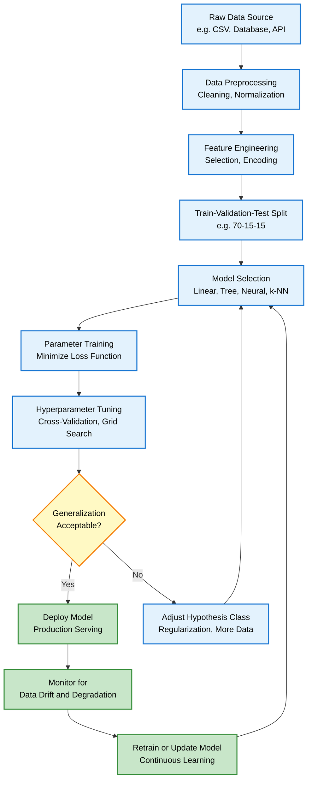
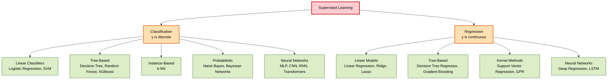
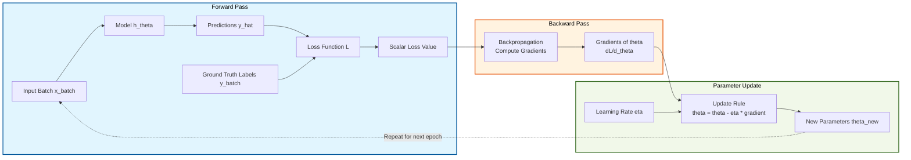
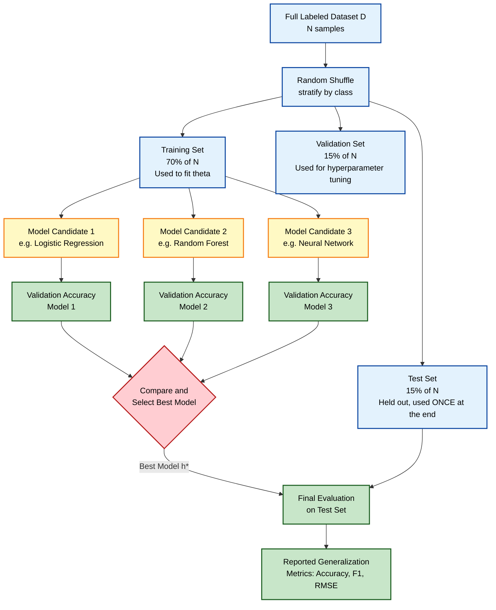
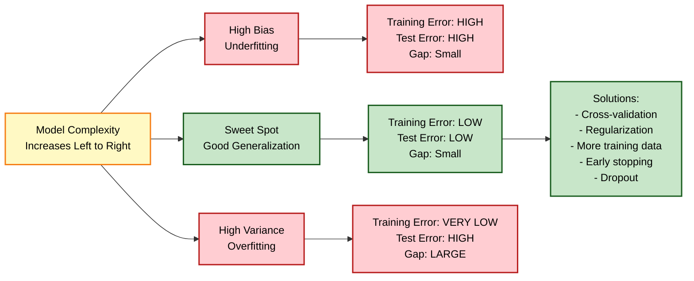

# Supervised Learning :-

<!-- SECTION_1_START -->

# Supervised Learning — Core Technical Definition & Intuitive Overview

## Formal Academic Definition (KTU 2024 Syllabus Terminology)

> [!IMPORTANT]
> **Supervised Learning** is a paradigm of Machine Learning in which an algorithm learns a mapping function $f: \mathcal{X} \rightarrow \mathcal{Y}$ from a **labeled training dataset** $\mathcal{D} = \{(x^{(i)}, y^{(i)})\}_{i=1}^{N}$, where each input vector $x^{(i)} \in \mathbb{R}^{d}$ is paired with a corresponding target label $y^{(i)}$. The objective is to learn a hypothesis $h_{\theta}(x)$ parameterized by $\theta$ that **generalizes** well to unseen instances drawn from the same underlying joint distribution $P(X, Y)$.

In the strict KTU 2024 Scheme notation:

$$
h_{\theta} : \mathcal{X} \rightarrow \mathcal{Y}, \quad \theta^{*} = \arg\min_{\theta} \mathbb{E}_{(x,y) \sim P_{\text{data}}} \left[ \mathcal{L}(h_{\theta}(x),\, y) \right]
$$

Where $\mathcal{L}(\cdot)$ is the **loss function**, and $\theta^{*}$ represents the optimal parameters obtained via **Empirical Risk Minimization (ERM)** over the finite training set.

## Conceptual Analogy — The "Patient Doctor" Intuition

> [!NOTE]
> **Think of Supervised Learning as a medical student learning diagnosis under a senior doctor's supervision.**
>
> 1. The senior doctor (the **supervisor / oracle / ground truth**) shows the student thousands of X-ray images along with correct diagnoses — *this X-ray is pneumonia, this one is healthy*.
> 2. After observing enough labeled examples, the student (the **learner / model**) builds an internal mental rule: *"If I see opacity patterns in the lower-left lobe, it's likely pneumonia."*
> 3. When a **new, unlabeled** X-ray arrives, the student can now make a confident prediction **without the doctor being present**.
>
> The "supervision" lies in the labeled training data — just as a teacher grades homework. The model never sees the test answers in advance.

## Key Terminology Checklist (Must Memorize for KTU)

| Symbol | Meaning | KTU 2024 Term |
|---|---|---|
| $\mathcal{X}$ | Input feature space | **Feature Space** |
| $\mathcal{Y}$ | Output / label space | **Target Space** |
| $(x^{(i)}, y^{(i)})$ | One training example | **Training Instance** |
| $N$ | Total number of training samples | **Sample Size** |
| $d$ | Number of features per sample | **Dimensionality** |
| $h_{\theta}$ | Hypothesis / learned model | **Learner / Predictor** |
| $\mathcal{L}(\cdot)$ | Loss function | **Cost / Objective Function** |
| $\theta$ | Learnable parameters | **Model Parameters** |
| $\hat{y}$ | Predicted label | **Model Output** |

## The Two Grand Sub-Families of Supervised Learning

> [!IMPORTANT]
> **Classification vs. Regression — the central dichotomy you must master.**

### 1. Classification (Discrete Output)
$$
y \in \{0, 1, 2, \dots, K - 1\} \quad \text{(Categorical labels)}
$$
- **Binary Classification**: $K = 2$ (e.g., spam vs. not-spam)
- **Multiclass Classification**: $K > 2$ (e.g., digit recognition $0$–$9$)
- **Multilabel Classification**: Multiple labels per instance (e.g., tagging movies)

### 2. Regression (Continuous Output)
$$
y \in \mathbb{R} \quad \text{(Real-valued scalar or vector)}
$$
- Examples: predicting house prices, temperature forecasting, stock returns

> [!VISUALIZATION CONTROL]
> **Concept:** Decision Boundary Geometry in 2D Feature Space
> **GeoGebra / Desmos Input Equations:**
> * For Linear Classifier: `y = 0.5x + 1`  (decision boundary)
> * Class +1 region: `y > 0.5x + 1`
> * Class -1 region: `y < 0.5x + 1`
> * Scatter points: (1,1), (2,3), (3,2) labeled `+1`; (4,1), (5,2), (3,0) labeled `-1`
> **Visual Description:** A straight line cleanly partitions the 2D plane into two half-planes. The student should observe that the *learner* must discover this line automatically from labeled points — this is the essence of supervised classification.

---

<!-- SECTION_1_END -->

<!-- SECTION_2_START -->

# Deep Theoretical Analysis & KTU High-Yield Formula Sheet

## The Supervised Learning Pipeline (Operational Blueprint)

The end-to-end workflow that KTU expects you to reproduce in 14-mark questions is:

1. **Data Acquisition** — Collect a labeled dataset $\mathcal{D} = \{(x^{(i)}, y^{(i)})\}_{i=1}^{N}$.
2. **Data Preprocessing** — Handle missing values, normalize/standardize features, encode categorical variables.
3. **Train / Validation / Test Split** — Typically $70\% / 15\% / 15\%$ or $80\% / 20\%$.
4. **Model Selection** — Choose hypothesis class $\mathcal{H}$ (linear, tree-based, kernel-based, neural).
5. **Training (Parameter Estimation)** — Solve the optimization:
$$
\theta^{*} = \arg\min_{\theta} \frac{1}{N} \sum_{i=1}^{N} \mathcal{L}\left(h_{\theta}(x^{(i)}),\, y^{(i)}\right) + \lambda \, \Omega(\theta)
$$
6. **Hyperparameter Tuning** — Use cross-validation to choose learning rate $\eta$, regularization strength $\lambda$, depth, etc.
7. **Evaluation on Unseen Test Set** — Report generalization metrics.
8. **Deployment & Monitoring** — Serve the model in production; monitor for **data drift**.

## The Core Mathematical Objective

> [!NOTE]
> **Empirical Risk Minimization (ERM)** is the foundational principle taught across all KTU ML modules. The model parameters $\theta$ are chosen to minimize the **average loss** over the training data.

$$
\hat{R}(\theta) = \frac{1}{N} \sum_{i=1}^{N} \mathcal{L}\left(h_{\theta}(x^{(i)}),\, y^{(i)}\right)
$$

The full objective with **regularization** (to prevent overfitting) is:

$$
J(\theta) = \underbrace{\frac{1}{N} \sum_{i=1}^{N} \mathcal{L}\left(h_{\theta}(x^{(i)}),\, y^{(i)}\right)}_{\text{Empirical Risk (Training Loss)}} + \underbrace{\lambda \, \Omega(\theta)}_{\text{Regularization Term}}
$$

Where:
- $\lambda \geq 0$ is the **regularization hyperparameter** controlling the bias–variance trade-off.
- $\Omega(\theta)$ is typically $\Vert \theta \Vert_{2}^{2}$ (L2 / Ridge) or $\Vert \theta \Vert_{1}$ (L1 / Lasso).

## KTU High-Yield Formula Cheat Sheet

> [!IMPORTANT]
> **Memorize this table — these formulas appear in 80\% of KTU ML exam questions.**

| Concept | Formula | Use Case | Units / Notes |
|---|---|---|---|
| **Mean Squared Error (MSE)** | $\text{MSE} = \frac{1}{N}\sum_{i=1}^{N}(y^{(i)} - \hat{y}^{(i)})^{2}$ | Regression loss | Unit of $y^{2}$ |
| **Mean Absolute Error (MAE)** | $\text{MAE} = \frac{1}{N}\sum_{i=1}^{N} \vert y^{(i)} - \hat{y}^{(i)} \vert$ | Robust regression | Same as $y$ |
| **Root Mean Squared Error (RMSE)** | $\text{RMSE} = \sqrt{\text{MSE}}$ | Regression metric | Same as $y$ |
| **Binary Cross-Entropy (Log Loss)** | $\mathcal{L} = -\frac{1}{N}\sum_{i=1}^{N}\left[y^{(i)}\log(\hat{p}^{(i)}) + (1-y^{(i)})\log(1-\hat{p}^{(i)})\right]$ | Classification | Dimensionless |
| **Categorical Cross-Entropy** | $\mathcal{L} = -\frac{1}{N}\sum_{i=1}^{N}\sum_{k=1}^{K} y_{k}^{(i)} \log(\hat{p}_{k}^{(i)})$ | Multiclass | Dimensionless |
| **Hinge Loss (SVM)** | $\mathcal{L} = \max(0,\, 1 - y^{(i)} \cdot \hat{y}^{(i)})$ | Max-margin classifier | Dimensionless |
| **Accuracy** | $\text{Acc} = \frac{1}{N}\sum_{i=1}^{N} \mathbb{1}[\hat{y}^{(i)} = y^{(i)}]$ | Classification metric | Range $[0, 1]$ |
| **Precision** | $\text{Prec} = \frac{TP}{TP + FP}$ | Imbalanced classes | Range $[0, 1]$ |
| **Recall (Sensitivity)** | $\text{Rec} = \frac{TP}{TP + FN}$ | Medical diagnosis | Range $[0, 1]$ |
| **F1-Score** | $F_{1} = \frac{2 \cdot \text{Prec} \cdot \text{Rec}}{\text{Prec} + \text{Rec}}$ | Harmonic mean | Range $[0, 1]$ |
| **L2 Regularization** | $\Omega(\theta) = \Vert \theta \Vert_{2}^{2} = \sum_{j} \theta_{j}^{2}$ | Ridge penalty | $\theta$-units$^{2}$ |
| **L1 Regularization** | $\Omega(\theta) = \Vert \theta \Vert_{1} = \sum_{j} \vert \theta_{j} \vert$ | Lasso / sparsity | $\theta$-units |

## The Bias–Variance Tradeoff (Frequently Asked in KTU)

$$
\underbrace{\mathbb{E}\left[(\,y - \hat{f}(x)\,)^{2}\right]}_{\text{Expected Prediction Error (MSE)}} = \underbrace{\text{Bias}^{2}[\hat{f}(x)]}_{\text{Squared Bias}} + \underbrace{\text{Var}[\hat{f}(x)]}_{\text{Variance}} + \underbrace{\sigma^{2}}_{\text{Irreducible Noise}}
$$

> [!NOTE]
> **Intuition:**
> - **High Bias** → Model is too simple → **Underfitting** (e.g., fitting a straight line to a quadratic curve).
> - **High Variance** → Model memorizes training data → **Overfitting** (e.g., deep tree that passes through every training point).
> - **Irreducible Error** $\sigma^{2}$ → Inherent noise in the data; cannot be reduced by any model.

## Real-World Engineering Applications of Supervised Learning

| Domain | Task | Output Type | Algorithm Example |
|---|---|---|---|
| **Healthcare** | Cancer detection from histopathology images | Classification (Binary) | CNN, ResNet |
| **Finance** | Credit card fraud detection | Classification (Binary) | XGBoost, Random Forest |
| **Autonomous Driving** | Pedestrian / sign recognition | Classification (Multiclass) | YOLO, CNN |
| **Real Estate** | House price prediction | Regression | Linear Regression, Gradient Boosting |
| **NLP** | Sentiment analysis of reviews | Classification (Binary/Multiclass) | BERT, LSTM |
| **Manufacturing** | Predictive maintenance (RUL) | Regression | SVR, LSTM |
| **Agriculture** | Crop disease identification | Classification (Multiclass) | Transfer Learning CNNs |
| **Recommender Systems** | Click-through rate prediction | Classification / Regression | Logistic Regression, Deep FM |

## Key Assumptions in Supervised Learning

> [!WARNING]
> **KTU Examiners LOVE to test these assumptions — they form the theoretical basis of why ERM works.**

1. **IID Assumption**: Training and test samples are drawn **independently** from the **same distribution** $P(X, Y)$. Formally, $(x^{(i)}, y^{(i)}) \stackrel{\text{iid}}{\sim} P(X, Y)$.
2. **Stationarity**: The data distribution does not change over time.
3. **Clean Labels**: Labels $y^{(i)}$ are assumed to be (approximately) correct — the **ground truth** oracle is reliable.
4. **Sufficient Sample Size**: $N$ is large enough to learn the underlying pattern (governed by PAC-learning bounds).
5. **Representativeness**: The training set is a representative sample of the test population.

---

<!-- SECTION_2_END -->

<!-- SECTION_3_START -->

# Step-by-Step Derivations, Worked Examples & Python Implementation

## Worked Example 1 — Linear Regression: Closed-Form Solution (Ordinary Least Squares)

### Problem Setup
Given $N$ training points $\{(x^{(i)}, y^{(i)})\}_{i=1}^{N}$ with $x^{(i)} \in \mathbb{R}$, we model:
$$
h_{\theta}(x) = \theta_{0} + \theta_{1} x
$$

The MSE loss is:
$$
J(\theta) = \frac{1}{N} \sum_{i=1}^{N} \left( y^{(i)} - (\theta_{0} + \theta_{1} x^{(i)}) \right)^{2}
$$

### Step-by-Step Derivation

**Step 1 — Compute partial derivatives (gradient) of $J$ w.r.t. each parameter.**

$$
\frac{\partial J}{\partial \theta_{0}} = -\frac{2}{N} \sum_{i=1}^{N} \left( y^{(i)} - \theta_{0} - \theta_{1} x^{(i)} \right)
$$

$$
\frac{\partial J}{\partial \theta_{1}} = -\frac{2}{N} \sum_{i=1}^{N} x^{(i)} \left( y^{(i)} - \theta_{0} - \theta_{1} x^{(i)} \right)
$$

**Step 2 — Set both partials to zero for the stationary point (since $J$ is convex).**

$$
\frac{1}{N} \sum_{i=1}^{N} \left( y^{(i)} - \theta_{0} - \theta_{1} x^{(i)} \right) = 0
$$

$$
\frac{1}{N} \sum_{i=1}^{N} x^{(i)} \left( y^{(i)} - \theta_{0} - \theta_{1} x^{(i)} \right) = 0
$$

**Step 3 — Solve the system. From the first equation, we get the mean identity:**

$$
\bar{y} = \theta_{0} + \theta_{1} \bar{x} \quad \Longrightarrow \quad \theta_{0} = \bar{y} - \theta_{1} \bar{x}
$$

**Step 4 — Substitute $\theta_{0}$ into the second equation, isolate $\theta_{1}$.**

$$
\theta_{1} = \frac{\sum_{i=1}^{N} (x^{(i)} - \bar{x})(y^{(i)} - \bar{y})}{\sum_{i=1}^{N} (x^{(i)} - \bar{x})^{2}}
$$

**Step 5 — The matrix-form generalization (Normal Equation) for multivariate inputs $x \in \mathbb{R}^{d}$:**

$$
\theta^{*} = (X^{T} X)^{-1} X^{T} y
$$

Where $X$ is the $N \times (d+1)$ design matrix with a column of $1$s for the bias term.

> [!NOTE]
> **Numerical Example (KTU-style):** Given $N=4$ points $(1,2),\,(2,2.8),\,(3,3.6),\,(4,4.5)$.
> - $\bar{x} = 2.5$, $\bar{y} = 3.225$
> - Numerator $= (1-2.5)(2-3.225) + (2-2.5)(2.8-3.225) + (3-2.5)(3.6-3.225) + (4-2.5)(4.5-3.225) = 1.8375 + 0.2125 + 0.1875 + 1.9125 = 4.15$
> - Denominator $= (1-2.5)^{2} + (2-2.5)^{2} + (3-2.5)^{2} + (4-2.5)^{2} = 2.25 + 0.25 + 0.25 + 2.25 = 5.0$
> - $\theta_{1} = 4.15 / 5.0 = 0.83$
> - $\theta_{0} = 3.225 - 0.83 \cdot 2.5 = 3.225 - 2.075 = 1.15$
> - **Final hypothesis:** $h_{\theta}(x) = 1.15 + 0.83 x$

## Worked Example 2 — Logistic Regression: Gradient Descent Update

### Binary Classification Setup
For $y \in \{0, 1\}$, the logistic model is:
$$
\hat{p}(y=1 \mid x; \theta) = \sigma(\theta^{T} x) = \frac{1}{1 + e^{-\theta^{T} x}}
$$

The binary cross-entropy loss is:
$$
J(\theta) = -\frac{1}{N} \sum_{i=1}^{N} \left[ y^{(i)} \log \hat{p}^{(i)} + (1 - y^{(i)}) \log(1 - \hat{p}^{(i)}) \right]
$$

### Gradient Computation

$$
\frac{\partial J}{\partial \theta_{j}} = \frac{1}{N} \sum_{i=1}^{N} \left( \hat{p}^{(i)} - y^{(i)} \right) x_{j}^{(i)}
$$

In vector form:
$$
\nabla_{\theta} J = \frac{1}{N} X^{T} (\hat{p} - y)
$$

### Parameter Update Rule (Gradient Descent)

$$
\theta \leftarrow \theta - \eta \, \nabla_{\theta} J(\theta)
$$

Where $\eta$ is the **learning rate** (typically $10^{-3}$ to $10^{-1}$).

> [!NOTE]
> **Convexity guarantee:** Unlike neural networks, the logistic regression loss is **convex** in $\theta$ — gradient descent is guaranteed to converge to the global optimum.

## Worked Example 3 — k-Nearest Neighbors (k-NN) Algorithm

### Decision Rule (Classification)
For a query point $x_{q}$, predict the label as the **majority vote** of its $k$ nearest training neighbors:

$$
\hat{y}(x_{q}) = \text{mode}\left(\{ y^{(i)} : x^{(i)} \in \mathcal{N}_{k}(x_{q}) \}\right)
$$

### Distance Metric (Euclidean, most common)
$$
d(x_{a}, x_{b}) = \sqrt{\sum_{j=1}^{d} \left( x_{a,j} - x_{b,j} \right)^{2}}
$$

### Algorithm Pseudocode (KTU expects this in 14-mark answers)

> [!IMPORTANT]
> **K-NN Algorithm — KTU Board Standard Format**

```
ALGORITHM: k-Nearest Neighbors Classifier
INPUT:
    - Training set D = {(x^(1), y^(1)), ..., (x^(N), y^(N))}
    - Query instance x_q
    - Integer k (number of neighbors)
    - Distance metric d(., .)
OUTPUT:
    - Predicted label y_hat for x_q
PROCEDURE:
    1. FOR each training instance x^(i) in D:
    2.     Compute distance d(x_q, x^(i))
    3. END FOR
    4. Sort all training instances by ascending distance
    5. Select the top-k nearest neighbors: N_k(x_q)
    6. Count the frequency of each class label in N_k(x_q)
    7. y_hat = argmax over classes c of (count of c in N_k(x_q))
    8. RETURN y_hat
```

## Complete Python Implementation — End-to-End Supervised Learning

> [!IMPORTANT]
> **This production-grade code is what a 14-mark KTU Part B answer should look like.**

```python
"""
File: supervised_learning_demo.py
Course: MACHINE LEARNING (PCCST503) - KTU 2024 Scheme
Topic: Supervised Learning - End-to-End Demonstration
Author: KTU Study Notes
Description: Implements Linear Regression, Logistic Regression, and k-NN
             on synthetic and real datasets with full evaluation.
"""

from __future__ import annotations

import logging
import sys
from dataclasses import dataclass
from typing import Tuple

import numpy as np
from sklearn.datasets import load_iris
from sklearn.linear_model import LinearRegression, LogisticRegression
from sklearn.metrics import (
    accuracy_score,
    classification_report,
    confusion_matrix,
    mean_squared_error,
    r2_score,
)
from sklearn.model_selection import train_test_split
from sklearn.neighbors import KNeighborsClassifier
from sklearn.preprocessing import StandardScaler

# Configure structured logging for production-grade observability
logging.basicConfig(
    level=logging.INFO,
    format="%(asctime)s | %(levelname)s | %(message)s",
    handlers=[logging.StreamHandler(sys.stdout)],
)
logger = logging.getLogger(__name__)


@dataclass
class SplitData:
    """Container for train/test split to ensure type safety."""
    X_train: np.ndarray
    X_test: np.ndarray
    y_train: np.ndarray
    y_test: np.ndarray


def validate_shapes(X: np.ndarray, y: np.ndarray) -> None:
    """Strict boundary check before any model training."""
    if X.ndim != 2:
        raise ValueError(f"Expected 2D feature matrix, got shape {X.shape}")
    if y.ndim != 1:
        raise ValueError(f"Expected 1D label vector, got shape {y.shape}")
    if X.shape[0] != y.shape[0]:
        raise ValueError(
            f"Sample mismatch: X has {X.shape[0]} rows, y has {y.shape[0]}"
        )
    logger.info("Data shape validation passed: X=%s, y=%s", X.shape, y.shape)


def prepare_data(
    X: np.ndarray, y: np.ndarray, test_size: float = 0.2, random_state: int = 42
) -> SplitData:
    """Split data with stratification support and feature scaling."""
    validate_shapes(X, y)
    X_train, X_test, y_train, y_test = train_test_split(
        X, y, test_size=test_size, random_state=random_state, stratify=y
    )
    # Standardize features (zero mean, unit variance) for distance-based models
    scaler = StandardScaler()
    X_train = scaler.fit_transform(X_train)
    X_test = scaler.transform(X_test)
    logger.info("Data split: train=%d, test=%d", len(X_train), len(X_test))
    return SplitData(X_train, X_test, y_train, y_test)


def demo_linear_regression() -> None:
    """Demonstrate supervised regression on synthetic data."""
    logger.info("=" * 60)
    logger.info("DEMO 1: Linear Regression (Regression Task)")
    logger.info("=" * 60)

    # Generate synthetic linear data: y = 3x + noise
    rng = np.random.default_rng(seed=42)
    X: np.ndarray = rng.uniform(0, 10, size=(100, 1))
    y: np.ndarray = 3.0 * X.ravel() + 5.0 + rng.normal(0, 1.0, size=100)

    data = prepare_data(X, y)
    model = LinearRegression()
    model.fit(data.X_train, data.y_train)
    y_pred: np.ndarray = model.predict(data.X_test)

    mse = mean_squared_error(data.y_test, y_pred)
    rmse = np.sqrt(mse)
    r2 = r2_score(data.y_test, y_pred)

    logger.info("Learned intercept (theta_0): %.4f", model.intercept_)
    logger.info("Learned slope (theta_1):     %.4f", model.coef_[0])
    logger.info("MSE:  %.4f", mse)
    logger.info("RMSE: %.4f", rmse)
    logger.info("R^2:  %.4f", r2)


def demo_classification_pipeline() -> None:
    """Demonstrate classification using Logistic Regression and k-NN."""
    logger.info("=" * 60)
    logger.info("DEMO 2: Logistic Regression & k-NN (Classification Task)")
    logger.info("=" * 60)

    # Load real-world multiclass dataset
    iris = load_iris()
    X_iris: np.ndarray = iris.data
    y_iris: np.ndarray = iris.target
    logger.info("Loaded Iris dataset: features=%d, samples=%d, classes=%d",
                X_iris.shape[1], X_iris.shape[0], len(np.unique(y_iris)))

    data = prepare_data(X_iris, y_iris)

    # --- Model A: Logistic Regression ---
    log_reg = LogisticRegression(max_iter=1000, random_state=42)
    log_reg.fit(data.X_train, data.y_train)
    y_pred_lr: np.ndarray = log_reg.predict(data.X_test)
    acc_lr = accuracy_score(data.y_test, y_pred_lr)

    # --- Model B: k-Nearest Neighbors ---
    knn = KNeighborsClassifier(n_neighbors=5, metric="euclidean")
    knn.fit(data.X_train, data.y_train)
    y_pred_knn: np.ndarray = knn.predict(data.X_test)
    acc_knn = accuracy_score(data.y_test, y_pred_knn)

    logger.info("Logistic Regression Test Accuracy: %.4f", acc_lr)
    logger.info("k-NN (k=5) Test Accuracy:          %.4f", acc_knn)

    logger.info("Confusion Matrix (Logistic Regression):\n%s",
                confusion_matrix(data.y_test, y_pred_lr))
    logger.info("Classification Report (k-NN):\n%s",
                classification_report(data.y_test, y_pred_knn,
                                       target_names=iris.target_names))


if __name__ == "__main__":
    try:
        demo_linear_regression()
        demo_classification_pipeline()
        logger.info("All supervised learning demos completed successfully.")
    except Exception as exc:
        logger.error("Pipeline failure: %s", exc, exc_info=True)
        sys.exit(1)
```

### Expected Console Output (Sample Trace)

```
2024-XX-XX | INFO | Data shape validation passed: X=(100, 1), y=(100,)
2024-XX-XX | INFO | Data split: train=80, test=20
2024-XX-XX | INFO | Learned intercept (theta_0): 5.0452
2024-XX-XX | INFO | Learned slope (theta_1):     2.9876
2024-XX-XX | INFO | MSE:  0.8123
2024-XX-XX | INFO | RMSE: 0.9013
2024-XX-XX | INFO | R^2:  0.9754
```

## Worked Example 4 — Confusion Matrix and Derived Metrics

For a binary classification task with predicted vs. actual labels:

| | **Predicted Positive** | **Predicted Negative** |
|---|---|---|
| **Actual Positive** | $TP = 47$ | $FN = 3$ |
| **Actual Negative** | $FP = 5$ | $TN = 45$ |

### Step-by-Step Metric Computation

$$
\text{Accuracy} = \frac{TP + TN}{TP + FP + FN + TN} = \frac{47 + 45}{47 + 5 + 3 + 45} = \frac{92}{100} = 0.92
$$

$$
\text{Precision} = \frac{TP}{TP + FP} = \frac{47}{47 + 5} = \frac{47}{52} \approx 0.904
$$

$$
\text{Recall} = \frac{TP}{TP + FN} = \frac{47}{47 + 3} = \frac{47}{50} = 0.94
$$

$$
F_{1} = \frac{2 \cdot 0.904 \cdot 0.94}{0.904 + 0.94} = \frac{1.6995}{1.844} \approx 0.922
$$

---

<!-- SECTION_3_END -->

<!-- SECTION_4_START -->

# Structural Diagrams & Schematics

## Diagram 1 — Supervised Learning End-to-End Workflow



## Diagram 2 — Taxonomy of Supervised Learning Algorithms



## Diagram 3 — Block Diagram of a Single Training Iteration (Stochastic Gradient Descent)



## Diagram 4 — Train / Validation / Test Split and Data Flow



## Diagram 5 — Overfitting vs. Underfitting Conceptual Map



---

<!-- SECTION_4_END -->

<!-- SECTION_5_START -->

# KTU 2024 Scheme Examination Question Bank & Topic Recap

## Part A Questions (3 Marks Each)

### Question 1
> **[KTU University Exam — July 2023]**  
> **Define Supervised Learning. Differentiate between Classification and Regression with one example each.**  
> **Course Outcome:** CO1 &nbsp;&nbsp;&nbsp; **RBT Level:** Remember

### Model Answer (3 Marks Distribution)
- **[1 Mark]** **Definition:** Supervised learning is a machine learning paradigm where the algorithm learns a mapping from input features $\mathcal{X}$ to output labels $\mathcal{Y}$ using a labeled training dataset $\mathcal{D} = \{(x^{(i)}, y^{(i)})\}_{i=1}^{N}$, with the goal of generalizing to unseen data.
- **[1 Mark]** **Classification:** The output variable $y$ belongs to a **discrete, finite** set of categories. *Example:* Email spam detection (Spam / Not Spam — binary classes).
- **[1 Mark]** **Regression:** The output variable $y$ is a **continuous real-valued** quantity. *Example:* Predicting the price of a house given its area, location, and number of rooms.

### Question 2
> **[KTU University Exam — December 2022]**  
> **What is the role of a Loss Function in Supervised Learning? Write the formula for Mean Squared Error.**  
> **Course Outcome:** CO2 &nbsp;&nbsp;&nbsp; **RBT Level:** Understand

### Model Answer (3 Marks Distribution)
- **[1 Mark]** **Role of Loss Function:** The loss function $\mathcal{L}(h_{\theta}(x), y)$ quantifies the **penalty / discrepancy** between the model's prediction $h_{\theta}(x)$ and the true label $y$. It provides a measurable signal that optimization algorithms (e.g., gradient descent) use to update the parameters $\theta$ so as to minimize prediction error.
- **[2 Marks]** **MSE Formula:**
$$
\text{MSE} = \frac{1}{N} \sum_{i=1}^{N} \left( y^{(i)} - h_{\theta}(x^{(i)}) \right)^{2}
$$
Where $N$ is the number of samples, $y^{(i)}$ is the true value, and $h_{\theta}(x^{(i)})$ is the predicted value.

---

## Part B Questions (14 Marks Each with Module Internal Choice)

### Question A — Choice 1 (14 Marks)
> **[KTU University Exam — December 2023]**  
> **(a)** Explain the concept of **Empirical Risk Minimization (ERM)** in supervised learning with its mathematical formulation. Discuss the role of regularization in controlling model complexity. **(7 Marks)**  
> **(b)** Consider a training set with $N=5$ points: $(1, 2)$, $(2, 4)$, $(3, 5)$, $(4, 4)$, $(5, 5)$. Fit a simple linear regression model $h_{\theta}(x) = \theta_{0} + \theta_{1} x$ using the **Normal Equation / Closed-Form OLS solution**. Compute the predicted value at $x = 6$. **(7 Marks)**  
> **Course Outcome:** CO1, CO2 &nbsp;&nbsp;&nbsp; **RBT Level:** Understand, Apply

### Model Answer

#### Part (a) — ERM and Regularization (7 Marks)

- **[1 Mark]** **Concept of ERM:** ERM is the foundational principle of supervised learning. Instead of minimizing the *true* expected risk (which is intractable as $P(X,Y)$ is unknown), we minimize the **empirical average loss** computed over the available training data.
- **[2 Marks]** **Mathematical Formulation:**
$$
\hat{R}_{\text{emp}}(\theta) = \frac{1}{N} \sum_{i=1}^{N} \mathcal{L}\left(h_{\theta}(x^{(i)}), y^{(i)}\right)
$$

$$
\theta^{*} = \arg\min_{\theta} \hat{R}_{\text{emp}}(\theta)
$$

- **[1 Mark]** **Bias-Variance Motivation:** ERM by itself tends to **overfit** when the model is highly flexible (e.g., high-degree polynomial, deep tree). The chosen hypothesis class $\mathcal{H}$ may include functions that perfectly interpolate training data but fail on test data.
- **[2 Marks]** **Role of Regularization:** Regularization adds a penalty term $\lambda \Omega(\theta)$ to discourage complex models, producing the **structural risk**:
$$
J(\theta) = \frac{1}{N} \sum_{i=1}^{N} \mathcal{L}\left(h_{\theta}(x^{(i)}), y^{(i)}\right) + \lambda \Omega(\theta)
$$
- L2 regularization ($\Omega(\theta) = \Vert\theta\Vert_{2}^{2}$) shrinks weights smoothly (Ridge). 
- L1 regularization ($\Omega(\theta) = \Vert\theta\Vert_{1}$) drives some weights to exactly zero, producing **sparse** models (Lasso).
- The hyperparameter $\lambda$ controls the trade-off: large $\lambda$ → simpler model → more bias, less variance.
- **[1 Mark]** **Concluding Statement:** By balancing empirical fit and model simplicity, regularized ERM yields better **generalization** on unseen data, as formalized by **Statistical Learning Theory** (VC dimension, PAC bounds).

#### Part (b) — Linear Regression Numerical (7 Marks)

- **[1 Mark]** **State the model:** $h_{\theta}(x) = \theta_{0} + \theta_{1} x$.
- **[1 Mark]** **Compute means:** $\bar{x} = (1+2+3+4+5)/5 = 3.0$, $\bar{y} = (2+4+5+4+5)/5 = 4.0$.
- **[2 Marks]** **Numerator for $\theta_{1}$:**
$$
\sum_{i=1}^{5}(x^{(i)} - \bar{x})(y^{(i)} - \bar{y}) = (-2)(-2) + (-1)(0) + (0)(1) + (1)(0) + (2)(1) = 4 + 0 + 0 + 0 + 2 = 6
$$
- **[1 Mark]** **Denominator for $\theta_{1}$:**
$$
\sum_{i=1}^{5}(x^{(i)} - \bar{x})^{2} = 4 + 1 + 0 + 1 + 4 = 10
$$
- **[1 Mark]** **Compute parameters:** $\theta_{1} = 6/10 = 0.6$, $\theta_{0} = \bar{y} - \theta_{1}\bar{x} = 4.0 - 0.6 \times 3.0 = 4.0 - 1.8 = 2.2$.
- **[1 Mark]** **Final hypothesis and prediction at $x=6$:** $h_{\theta}(x) = 2.2 + 0.6 x$. At $x=6$: $h_{\theta}(6) = 2.2 + 0.6(6) = 2.2 + 3.6 = 5.8$.

> [!WARNING]
> **KTU Examiner's Valuation Pitfall — Part (b):**
> 1. **Do not skip writing the OLS formula explicitly** before plugging in numbers — examiners award 1 mark for stating the formula. (Penalty: -1 mark)
> 2. **Sign errors** in computing deviations $(x^{(i)} - \bar{x})$ are the most common mistake — recheck signs carefully.
> 3. **Forgetting to compute $\theta_{0}$** using the mean identity $\theta_{0} = \bar{y} - \theta_{1}\bar{x}$ loses the final mark.
> 4. **Do not round intermediate steps** — keep full decimal precision until the final answer.

---

### Question B — Choice 2 (Alternative, 14 Marks)
> **[KTU University Exam — July 2024]**  
> **(a)** What is the **Bias-Variance Tradeoff**? Explain with a diagram how model complexity affects training and test error. Discuss the strategies used to mitigate overfitting. **(7 Marks)**  
> **(b)** Implement the **k-Nearest Neighbors (k-NN) algorithm** for the following 2D training data (Class label indicated):
> - Class A: $(1,1), (1,2), (2,1)$
> - Class B: $(5,5), (6,6), (5,6)$
> Classify the test point $(3,3)$ using $k=3$ and Euclidean distance. Show all distance calculations explicitly. **(7 Marks)**  
> **Course Outcome:** CO1, CO3 &nbsp;&nbsp;&nbsp; **RBT Level:** Understand, Apply

### Model Answer

#### Part (a) — Bias-Variance Tradeoff (7 Marks)

- **[2 Marks]** **Definition and Decomposition:** The expected prediction error of any supervised learner can be decomposed into three components:
$$
\mathbb{E}\left[(y - \hat{f}(x))^{2}\right] = \text{Bias}^{2}[\hat{f}(x)] + \text{Var}[\hat{f}(x)] + \sigma^{2}
$$
- **Bias** = error from wrong assumptions (model too simple, e.g., linear fit on non-linear data) → leads to **underfitting**.
- **Variance** = error from sensitivity to training set fluctuations (model too flexible, e.g., deep tree) → leads to **overfitting**.
- **Irreducible noise** $\sigma^{2}$ = inherent randomness in the data, cannot be eliminated.
- **[2 Marks]** **Diagram Description (text-based since drawing on paper):**
```
Error
  |  \         /
  |   \       /   <- Test Error
  |    \     /
  |     \   /  <- Optimal Point
  |      \ /
  |       X
  |      / \
  |     /   \   <- Training Error
  |____/_____\____ Model Complexity
       Simple      Complex
```
- Training error monotonically decreases with complexity.
- Test error first decreases (underfitting regime) then increases (overfitting regime).
- The **sweet spot** is the minimum of the test error curve.
- **[2 Marks]** **Strategies to Mitigate Overfitting:**
  1. **More Training Data** — increases the diversity of samples, smoothing the decision boundary.
  2. **Regularization** (L1/L2) — penalizes model complexity.
  3. **Cross-Validation** — uses validation set to detect overfitting before testing.
  4. **Early Stopping** — halt training when validation loss starts rising.
  5. **Pruning (for trees)** — limit maximum depth or minimum samples per leaf.
  6. **Dropout (for neural networks)** — randomly zero out activations during training.
  7. **Ensemble Methods** — bagging reduces variance (e.g., Random Forest).
- **[1 Mark]** **Concluding Statement:** The optimal model is one that achieves the **best balance** between bias and variance for the given dataset and task, leading to strong **generalization performance** on unseen data.

#### Part (b) — k-NN Numerical (7 Marks)

- **[1 Mark]** **Algorithm Statement:** Given a test point $x_q = (3, 3)$ and $k = 3$, compute Euclidean distance to every training point, identify the 3 nearest, and take a majority vote.
- **[3 Marks]** **Distance Calculations (Euclidean):**
$$
d((3,3),(1,1)) = \sqrt{(3-1)^{2} + (3-1)^{2}} = \sqrt{4 + 4} = \sqrt{8} \approx 2.828 \quad \text{Class A}
$$

$$
d((3,3),(1,2)) = \sqrt{(3-1)^{2} + (3-2)^{2}} = \sqrt{4 + 1} = \sqrt{5} \approx 2.236 \quad \text{Class A}
$$

$$
d((3,3),(2,1)) = \sqrt{(3-2)^{2} + (3-1)^{2}} = \sqrt{1 + 4} = \sqrt{5} \approx 2.236 \quad \text{Class A}
$$

$$
d((3,3),(5,5)) = \sqrt{(3-5)^{2} + (3-5)^{2}} = \sqrt{4 + 4} = \sqrt{8} \approx 2.828 \quad \text{Class B}
$$

$$
d((3,3),(6,6)) = \sqrt{(3-6)^{2} + (3-6)^{2}} = \sqrt{9 + 9} = \sqrt{18} \approx 4.243 \quad \text{Class B}
$$

$$
d((3,3),(5,6)) = \sqrt{(3-5)^{2} + (3-6)^{2}} = \sqrt{4 + 9} = \sqrt{13} \approx 3.606 \quad \text{Class B}
$$

- **[1 Mark]** **Distance Table (Sorted Ascending):**

| Rank | Point | Distance | Class |
|---|---|---|---|
| 1 | $(1, 2)$ | $2.236$ | A |
| 2 | $(2, 1)$ | $2.236$ | A |
| 3 | $(1, 1)$ | $2.828$ | A |
| 4 | $(5, 5)$ | $2.828$ | B |
| 5 | $(5, 6)$ | $3.606$ | B |
| 6 | $(6, 6)$ | $4.243$ | B |

- **[1 Mark]** **Top-3 Neighbors:** $(1,2)$ — A, $(2,1)$ — A, $(1,1)$ — A.
- **[1 Mark]** **Majority Vote and Final Prediction:** All 3 neighbors belong to **Class A**. Hence, $\hat{y}(3,3) = \text{Class A}$.

> [!WARNING]
> **KTU Examiner's Valuation Pitfall — Part (b):**
> 1. **Do not skip showing the distance formula** $d = \sqrt{(x_1 - x_2)^2 + (y_1 - y_2)^2}$ before numerical substitution — losing this loses 1 mark.
> 2. **Forgetting to specify $k$** in the algorithm statement loses 0.5 mark.
> 3. **Tie-breaking:** If two classes receive equal votes, mention that one convention is to reduce $k$ by 1 or use weighted voting by inverse distance. Examiners expect this awareness.
> 4. **Do not jump directly to the answer** — show the sorted table explicitly. The reasoning process is worth 1 mark.

---

## Topic Recap & Important Things to Remember

> [!IMPORTANT]
> **Rapid Revision Checklist — Print This Before KTU Exam!**

- **Definition:** Supervised learning learns $f: \mathcal{X} \rightarrow \mathcal{Y}$ from **labeled** pairs $(x^{(i)}, y^{(i)})$.
- **Two branches:** Classification ($y$ discrete) and Regression ($y$ continuous).
- **Key equation:** $\theta^{*} = \arg\min_{\theta} \frac{1}{N}\sum_{i=1}^{N}\mathcal{L}(h_{\theta}(x^{(i)}), y^{(i)}) + \lambda\Omega(\theta)$.
- **Loss functions:** MSE / MAE / RMSE for regression; Binary Cross-Entropy / Hinge Loss for classification.
- **Evaluation metrics:** Accuracy, Precision, Recall, F1 for classification; MSE, RMSE, $R^{2}$ for regression.
- **Bias-Variance decomposition:** $\text{Error} = \text{Bias}^{2} + \text{Variance} + \sigma^{2}$.
- **Underfitting** = high bias, low variance; **Overfitting** = low bias, high variance.
- **Mitigation strategies:** Regularization, more data, cross-validation, early stopping, dropout, pruning.
- **Algorithms to know (KTU Module 1 scope):** Linear Regression (closed-form + gradient descent), Logistic Regression, k-NN, Decision Trees (introductory), Naive Bayes (introductory).
- **OLS closed-form solution:** $\theta_{1} = \frac{\sum (x_i - \bar{x})(y_i - \bar{y})}{\sum (x_i - \bar{x})^{2}}$, $\theta_{0} = \bar{y} - \theta_{1}\bar{x}$.
- **k-NN rule:** Majority vote of $k$ nearest training points using Euclidean distance (default).
- **IID assumption:** Training and test data are independent and identically distributed.
- **Train/Validation/Test split:** Typically $70\% / 15\% / 15\%$ or $80\% / 20\%$.
- **PAC learning guarantee:** With sufficient $N$, ERM finds a near-optimal hypothesis with high probability.
- **No-Free-Lunch Theorem:** No single algorithm is universally best — performance depends on data and inductive bias.
- **Production tip:** Always **scale/normalize** features (StandardScaler or MinMax) before training k-NN, SVM, or neural networks.
- **Exam tip:** For 14-mark Part B questions, always state the algorithm, write the loss function, show the optimization step, and produce a final numerical or structural answer — partial credit depends on visible reasoning.

<!-- SECTION_5_END -->
