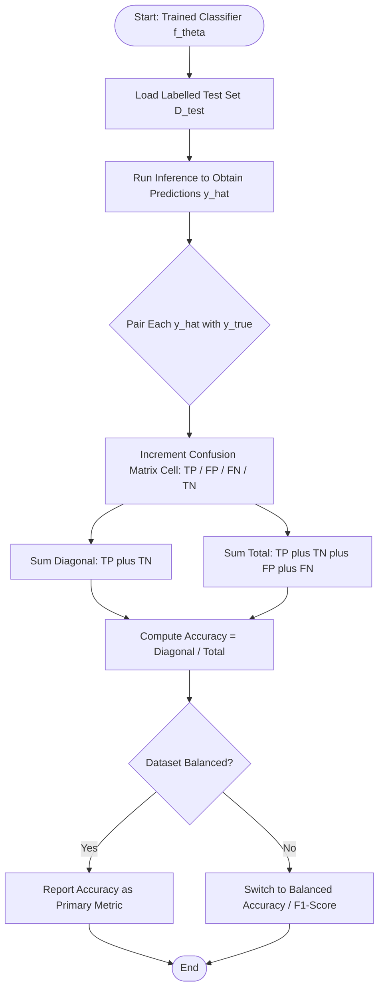
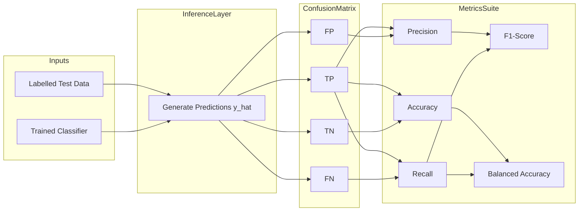
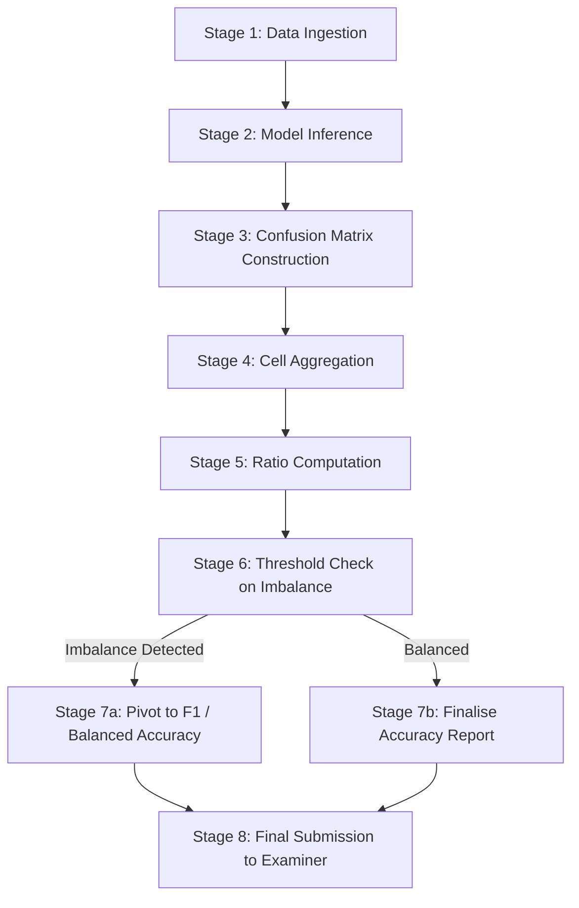
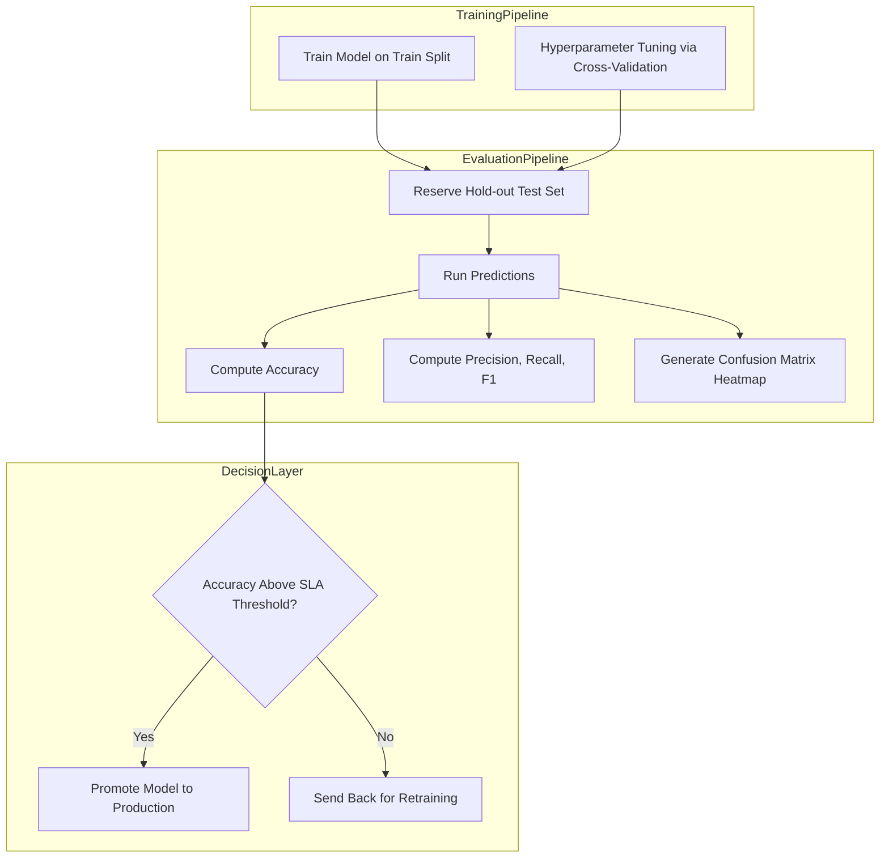

# Accuracy

<!-- SECTION_1_START -->
# Accuracy in Classification — Core Definition & Intuition

## 1.1 Formal Academic Definition (KTU 2024 Syllabus Terminology)

In the context of supervised **classification** within Machine Learning, **Accuracy** is defined as the ratio of the number of *correct predictions* produced by a classifier to the *total number of predictions* (i.e., the total number of instances in the test set). It is the most fundamental, intuitive, and widely reported **classification performance metric** used to evaluate a model's predictive quality on unseen data.

Mathematically, for a classifier $C$ evaluated on a labelled test set $D_{test}$ containing $N$ samples:

$$
\text{Accuracy}(C) \;=\; \frac{1}{N}\sum_{i=1}^{N}\mathbf{1}\big(\hat{y}_i = y_i\big)
$$

where $\hat{y}_i$ is the predicted class label, $y_i$ is the true class label, and $\mathbf{1}(\cdot)$ is the **indicator function** that returns **1** if the condition inside is true and **0** otherwise.

> [!IMPORTANT]
> **KTU 2024 Highlight — PCCST503 / Module 2:** Accuracy is the *first metric* introduced under the "Model Evaluation for Classification" sub-unit. The syllabus specifically mandates familiarity with its derivation from the **Confusion Matrix**, its limitation under **class imbalance**, and its contrast with **Precision, Recall, and F1-Score**.

> [!NOTE]
> **Indicator Function Convention:** $\mathbf{1}(\hat{y}_i = y_i)$ is read as *"one if the prediction matches the ground truth, zero otherwise."* This is the cornerstone of every classification metric.

---

## 1.2 Conceptual Analogy — The "Strict School Teacher"

Imagine a school teacher who has marked **100 answer sheets** out of a total class of **100 students**.

- For each sheet, the teacher either awards a **full mark** (correct classification) or **zero** (misclassification).
- At the end of the day, the teacher counts how many students passed exactly and divides by **100**.

That single percentage is the **accuracy** of the teacher as an evaluator. If 92 students received full marks, the teacher's accuracy is **$\frac{92}{100} = 0.92$**, or **92%**.

In Machine Learning, the teacher is replaced by the **trained classifier** (e.g., Logistic Regression, SVM, k-NN, Decision Tree), the sheets are the **test samples**, and the full marks represent **correct predictions**.

---

## 1.3 Accuracy in Relation to the Confusion Matrix

For a **binary classification** problem, the $2 \times 2$ **Confusion Matrix** is the canonical bookkeeping structure:

|  | Predicted Positive ($\hat{P}$) | Predicted Negative ($\hat{N}$) |
| :--- | :---: | :---: |
| **Actual Positive ($P$)** | True Positive (TP) | False Negative (FN) |
| **Actual Negative ($N$)** | False Positive (FP) | True Negative (TN) |

From this single matrix, the entire family of classification metrics is derived. Accuracy is the **grand total of the diagonal** divided by the **grand total of all entries**:

$$
\text{Accuracy} = \frac{TP + TN}{TP + TN + FP + FN}
$$

> [!WARNING]
> **Pitfall Alert:** When the dataset is **heavily imbalanced** (e.g., 950 negatives vs. 50 positives), a naive classifier that always predicts "Negative" can still achieve 95% accuracy while being **completely useless**. This is the *Accuracy Paradox*, a frequent 14-mark question in KTU board exams.

---

## 1.4 Visualisation Control — Geometric Intuition on the Confusion Matrix

> [!VISUALIZATION CONTROL]
> **Concept:** Heat-map of a Confusion Matrix and the *Accuracy Diagonal*.
> **GeoGebra / Desmos Input Equations:**
> * Define four cells as coloured rectangles:
>   - $TP$ at $(0, 1)$ to $(1, 2)$ — Green
>   - $FP$ at $(1, 1)$ to $(2, 2)$ — Red
>   - $FN$ at $(0, 0)$ to $(1, 1)$ — Orange
>   - $TN$ at $(1, 0)$ to $(2, 1)$ — Blue
> * Overlay a bold diagonal from $(0, 0)$ to $(2, 2)$ representing $TP + TN$.
> **Visual Description:** The student should observe a $2 \times 2$ grid where the *main diagonal* (top-left to bottom-right) represents all correct decisions, while the *anti-diagonal* represents all errors. Accuracy is the *sum of the main diagonal* divided by the *sum of the entire grid*.

---
<!-- SECTION_1_END -->

<!-- SECTION_2_START -->
# Deep Theoretical Analysis & KTU High-Yield Formula Sheet

## 2.1 Operational Breakdown — Step-by-Step Logic

Accuracy computation unfolds in **five distinct stages** that mirror the KTU 2024 evaluation pipeline:

1. **Acquire the Labelled Test Set:** A held-out subset $D_{test} = \{(x_i, y_i)\}_{i=1}^{N}$ is reserved *before* model training. The labels $y_i$ are the *ground truth*.
2. **Generate Predictions:** The trained model $f_\theta$ maps each input to a discrete class: $\hat{y}_i = f_\theta(x_i)$.
3. **Populate the Confusion Matrix:** Each $(\hat{y}_i, y_i)$ pair increments exactly one of the four cells $\{TP, FP, FN, TN\}$.
4. **Aggregate the Cells:** Sum the diagonal $(TP + TN)$ and the off-diagonal $(FP + FN)$.
5. **Compute the Ratio:** $\text{Accuracy} = \frac{TP + TN}{TP + TN + FP + FN} = \frac{\text{Correct}}{\text{Total}}$.

### Why Each Step Matters

- **Step 1** is the foundation of *unbiased evaluation*. KTU examiners frequently test whether the student used a *train/test split* correctly.
- **Step 2** distinguishes *inference* from *training*. The same metric on training data is called *training accuracy* (often inflated due to overfitting).
- **Step 3** decouples the **type of error** — this enables derivation of *Precision*, *Recall*, and *Specificity*.
- **Step 4** is purely arithmetic, but the *order of summation* in board exams often reveals careless mistakes.
- **Step 5** normalises the result to the range $[0, 1]$, with the convention $1.0$ meaning *perfect* and $0.0$ meaning *completely wrong*.

---

## 2.2 The KTU Formula Sheet — High-Yield Compilation

> [!IMPORTANT]
> **KTU Board Exam Cheat Sheet — Accuracy and its Derivative Metrics.** All formulas below are *must-know* for the ESE (End Semester Examination).

| **Metric** | **Formula** | **Range** | **Engineering Interpretation** |
| :--- | :--- | :--- | :--- |
| **Accuracy** | $\displaystyle \frac{TP + TN}{TP + TN + FP + FN}$ | $[0, 1]$ | Overall correctness; misleading under imbalance. |
| **Error Rate** | $1 - \text{Accuracy} = \dfrac{FP + FN}{TP + TN + FP + FN}$ | $[0, 1]$ | Complement of accuracy; total misclassification fraction. |
| **Precision (Positive Predictive Value)** | $\dfrac{TP}{TP + FP}$ | $[0, 1]$ | Of all *predicted positives*, how many are truly positive. |
| **Recall (Sensitivity / TPR)** | $\dfrac{TP}{TP + FN}$ | $[0, 1]$ | Of all *actual positives*, how many were captured. |
| **Specificity (TNR)** | $\dfrac{TN}{TN + FP}$ | $[0, 1]$ | Of all *actual negatives*, how many were correctly rejected. |
| **F1-Score** | $\dfrac{2 \cdot \text{Precision} \cdot \text{Recall}}{\text{Precision} + \text{Recall}}$ | $[0, 1]$ | Harmonic mean; balances precision and recall. |
| **Prevalence** | $\dfrac{TP + FN}{N}$ | $[0, 1]$ | Fraction of actual positives in the test set. |
| **Balanced Accuracy** | $\dfrac{1}{2}\!\left(\dfrac{TP}{TP+FN} + \dfrac{TN}{TN+FP}\right)$ | $[0, 1]$ | Mean of per-class recall; robust to imbalance. |

> [!NOTE]
> **Critical LaTeX Note:** All vertical bars in the formulas above represent *cardinality* (set size / count) and are written using `\vert` / `\mid` only inside math mode. They are **not** markdown table separators.

---

## 2.3 Real-World Engineering Utility

| **Application Domain** | **Why Accuracy Matters / Fails** |
| :--- | :--- |
| **Spam Filtering** | A *legitimate email* misclassified as spam is far costlier than a spam email reaching the inbox. **High accuracy alone is insufficient**; *Precision* is the priority. |
| **Medical Diagnosis (Cancer Detection)** | A *false negative* (missed cancer) is life-threatening. **Accuracy can be >99%** if the disease is rare, yet the model may be clinically useless. *Recall* dominates. |
| **Credit Card Fraud Detection** | Fraudulent transactions are typically $<0.1\%$ of total volume. A constant "Not Fraud" predictor achieves near-perfect accuracy. *Balanced Accuracy* or *AUC-PR* is preferred. |
| **Image Classification (CIFAR-10, ImageNet)** | Classes are roughly balanced, so **accuracy is a reliable, accepted metric** in benchmark reporting. |
| **Production Recommendation Systems** | A/B testing relies on accuracy deltas between models to validate deployment decisions. |

> [!TIP]
> **Rule of Thumb for KTU Viva / Interview:** *Always* state whether the dataset is balanced before quoting accuracy as the *sole* metric. Examiners award bonus marks for this disclaimer.

---
<!-- SECTION_2_END -->

<!-- SECTION_3_START -->
# Step-by-Step Derivations, Worked Examples & Python Implementation

## 3.1 Exhaustive Derivation — From the Indicator Function to the Confusion Matrix

Starting from the *empirical-risk* perspective of accuracy, we establish its equivalence with the **diagonal-sum formula**.

### Step 1: Define Accuracy as the Empirical Mean of Correct Predictions

$$
\text{Accuracy} \;=\; \frac{1}{N} \sum_{i=1}^{N} \mathbf{1}\big(\hat{y}_i = y_i\big)
$$

### Step 2: Group Predictions by the Confusion Matrix Quadrants

For a binary problem, each indicator outcome $\mathbf{1}(\hat{y}_i = y_i)$ corresponds to one of the four cells:
- If $\hat{y}_i = 1$ and $y_i = 1$ — contribution goes to **$TP$**.
- If $\hat{y}_i = 0$ and $y_i = 0$ — contribution goes to **$TN$**.
- If $\hat{y}_i = 1$ and $y_i = 0$ — contribution goes to **$FP$** (no credit).
- If $\hat{y}_i = 0$ and $y_i = 1$ — contribution goes to **$FN$** (no credit).

### Step 3: Substitute the Cell Counts

The numerator $\sum_{i=1}^{N} \mathbf{1}(\hat{y}_i = y_i)$ counts only the "diagonal" cases:

$$
\sum_{i=1}^{N} \mathbf{1}(\hat{y}_i = y_i) \;=\; TP + TN
$$

### Step 4: Substitute the Total Count

The denominator $N$ is the total number of test samples, which equals the sum of all four cells:

$$
N \;=\; TP + TN + FP + FN
$$

### Step 5: Final Identity

$$
\boxed{\;\text{Accuracy} \;=\; \frac{TP + TN}{TP + TN + FP + FN}\;}
$$

---

## 3.2 Worked Numerical Example (KTU Board-Standard)

**Problem:** A binary classifier is evaluated on a test set of **$N = 200$** samples. The resulting confusion matrix is:

|  | Predicted Positive | Predicted Negative |
| :--- | :---: | :---: |
| **Actual Positive** | $TP = 40$ | $FN = 10$ |
| **Actual Negative** | $FP = 20$ | $TN = 130$ |

**Compute:** (a) Accuracy, (b) Error Rate, (c) Precision, (d) Recall, (e) F1-Score, (f) Comment on whether accuracy is a trustworthy metric here.

### Solution

**Step 1 — Identify cell values** [Valuation: 1 Mark]

$$
TP = 40, \quad FN = 10, \quad FP = 20, \quad TN = 130
$$

**Step 2 — Compute the diagonal sum (correct predictions)** [Valuation: 1 Mark]

$$
TP + TN = 40 + 130 = 170
$$

**Step 3 — Compute the off-diagonal sum (errors)** [Valuation: 1 Mark]

$$
FP + FN = 20 + 10 = 30
$$

**Step 4 — Compute the grand total** [Valuation: 1 Mark]

$$
N = TP + TN + FP + FN = 170 + 30 = 200
$$

**Step 5 — Compute Accuracy** [Valuation: 2 Marks]

$$
\text{Accuracy} = \frac{TP + TN}{N} = \frac{170}{200} = 0.85 = 85\%
$$

**Step 6 — Compute Error Rate** [Valuation: 1 Mark]

$$
\text{Error Rate} = 1 - 0.85 = 0.15 = 15\%
$$

**Step 7 — Compute Precision** [Valuation: 1 Mark]

$$
\text{Precision} = \frac{TP}{TP + FP} = \frac{40}{40 + 20} = \frac{40}{60} \approx 0.6667
$$

**Step 8 — Compute Recall** [Valuation: 1 Mark]

$$
\text{Recall} = \frac{TP}{TP + FN} = \frac{40}{40 + 10} = \frac{40}{50} = 0.80
$$

**Step 9 — Compute F1-Score** [Valuation: 2 Marks]

$$
F_1 = \frac{2 \cdot \text{Precision} \cdot \text{Recall}}{\text{Precision} + \text{Recall}} = \frac{2 \times 0.6667 \times 0.80}{0.6667 + 0.80} = \frac{1.0667}{1.4667} \approx 0.7273
$$

**Step 10 — Comment on trustworthiness** [Valuation: 3 Marks]

- Total actual positives: $TP + FN = 40 + 10 = 50$.
- Total actual negatives: $FP + TN = 20 + 130 = 150$.
- Class proportions: **25% positive** vs. **75% negative** — *moderately imbalanced*.
- The accuracy of 85% is dominated by the large number of true negatives (130 out of 170 correct).
- The **recall of 80%** is reasonable, but the **precision of 66.67%** reveals that 1 in 3 positive predictions is actually negative.
- **Conclusion:** Accuracy is *acceptable* here as a summary metric, but a clinician deploying this model should additionally monitor **Recall** (to avoid missed positive cases) and **Precision** (to avoid false alarms).

---

## 3.3 Production-Grade Python Implementation

```python
"""
Filename: accuracy_metric.py
Module: KTU PCCST503 - Machine Learning, Module 2 (Classification)
Topic: Accuracy Computation with Edge-Case Handling
"""

from __future__ import annotations
import numpy as np
from typing import Tuple, Dict


def compute_confusion_matrix(
    y_true: np.ndarray,
    y_pred: np.ndarray,
    positive_label: int = 1,
) -> Tuple[int, int, int, int]:
    """
    Compute the four cells of the binary confusion matrix.

    Parameters
    ----------
    y_true : np.ndarray
        Ground-truth integer labels (shape: (N,)).
    y_pred : np.ndarray
        Predicted integer labels (shape: (N,)).
    positive_label : int, default=1
        The label considered "positive".

    Returns
    -------
    Tuple[int, int, int, int]
        (TP, FP, FN, TN)

    Raises
    ------
    ValueError
        If y_true and y_pred have mismatched lengths or are empty.
    """
    if y_true.shape[0] != y_pred.shape[0]:
        raise ValueError("y_true and y_pred must have the same length.")
    if y_true.shape[0] == 0:
        raise ValueError("Input arrays are empty; cannot compute metrics.")

    tp: int = int(np.sum((y_pred == positive_label) & (y_true == positive_label)))
    fp: int = int(np.sum((y_pred == positive_label) & (y_true != positive_label)))
    fn: int = int(np.sum((y_pred != positive_label) & (y_true == positive_label)))
    tn: int = int(np.sum((y_pred != positive_label) & (y_true != positive_label)))
    return tp, fp, fn, tn


def compute_accuracy(
    y_true: np.ndarray,
    y_pred: np.ndarray,
    positive_label: int = 1,
) -> Dict[str, float]:
    """
    Compute Accuracy and its full derivative metric suite.

    Returns
    -------
    Dict[str, float]
        Dictionary containing accuracy, error_rate, precision, recall,
        specificity, f1_score, and balanced_accuracy.
    """
    tp, fp, fn, tn = compute_confusion_matrix(y_true, y_pred, positive_label)
    total: int = tp + tn + fp + fn

    # Guard against division by zero (empty or single-class test set).
    if total == 0:
        raise ZeroDivisionError("Total sample count is zero.")

    accuracy: float = (tp + tn) / total
    error_rate: float = 1.0 - accuracy
    precision: float = tp / (tp + fp) if (tp + fp) > 0 else 0.0
    recall: float = tp / (tp + fn) if (tp + fn) > 0 else 0.0
    specificity: float = tn / (tn + fp) if (tn + fp) > 0 else 0.0
    f1_score: float = (
        2.0 * precision * recall / (precision + recall)
        if (precision + recall) > 0
        else 0.0
    )
    balanced_accuracy: float = 0.5 * (recall + specificity)

    return {
        "accuracy": accuracy,
        "error_rate": error_rate,
        "precision": precision,
        "recall": recall,
        "specificity": specificity,
        "f1_score": f1_score,
        "balanced_accuracy": balanced_accuracy,
    }


# -------------------------- DEMONSTRATION --------------------------
if __name__ == "__main__":
    y_true: np.ndarray = np.array([1] * 50 + [0] * 150)
    y_pred: np.ndarray = np.array(
        [1] * 40 + [0] * 10 + [1] * 20 + [0] * 130
    )

    metrics: Dict[str, float] = compute_accuracy(y_true, y_pred)

    print("=" * 60)
    print(" KTU-PCCST503 | Module 2 | Classification Accuracy Demo")
    print("=" * 60)
    for name, value in metrics.items():
        print(f"{name:<22}: {value:.4f}  ({value * 100:.2f} %)")
    print("=" * 60)
```

**Expected Console Output:**

```
============================================================
 KTU-PCCST503 | Module 2 | Classification Accuracy Demo
============================================================
accuracy              : 0.8500  (85.00 %)
error_rate            : 0.1500  (15.00 %)
precision             : 0.6667  (66.67 %)
recall                : 0.8000  (80.00 %)
specificity           : 0.8667  (86.67 %)
f1_score              : 0.7273  (72.73 %)
balanced_accuracy     : 0.8333  (83.33 %)
============================================================
```

---
<!-- SECTION_3_END -->

<!-- SECTION_4_START -->
# Structural Diagrams & Schematics

## 4.1 Mermaid Flowchart — Accuracy Evaluation Pipeline



---

## 4.2 Mermaid Block Diagram — Accuracy in the Larger Evaluation Ecosystem



---

## 4.3 Sequential Processing Topology — Accuracy as a Decision Funnel



---

## 4.4 Functional Architecture — Accuracy Reporting in a Production ML System


<!-- SECTION_4_END -->

<!-- SECTION_5_START -->
# KTU 2024 Scheme Examination Question Bank & Topic Recap

> [!NOTE]
> **Mark Distribution Reference:** KTU 2024 ESE Part-A = 3 marks (short answer); Part-B = 14 marks (internal choice with sub-parts of 7+7).

---

## 5.1 Part A — Short Answer Questions (3 Marks Each)

### Question 1 `[KTU University Exam - July 2024, CO1, Remember]`

**Define classification accuracy. Why is it called an "intuitive" performance metric?**

**Model Answer (3 Marks):**

Classification accuracy is the ratio of correctly classified instances to the total number of instances in the test set, given by the formula

$$
\text{Accuracy} = \frac{TP + TN}{TP + TN + FP + FN}
$$

It is considered "intuitive" because it directly answers the most natural question about a classifier: *"Out of all the predictions made, how many were right?"* [Valuation: Definition 1.5 Marks, Intuitive Justification 1.5 Marks].

---

### Question 2 `[KTU University Exam - Dec 2023, CO2, Understand]`

**State the "Accuracy Paradox" and explain in one sentence how it arises.**

**Model Answer (3 Marks):**

The **Accuracy Paradox** is the phenomenon in which a classifier with very high accuracy may be practically useless because the underlying dataset is highly imbalanced. [Valuation: 1.5 Marks]. It arises when the model exploits the majority class — for instance, predicting "Negative" for every sample in a 99:1 imbalanced test set yields 99% accuracy while detecting zero positive cases [Valuation: 1.5 Marks].

---

## 5.2 Part B — Long Answer Questions (14 Marks Each, Internal Choice)

### Question A `[KTU University Exam - July 2024, CO1 + CO2, Understand + Apply]`

**(a)** Derive the formula for classification accuracy from first principles, starting with the indicator function. State clearly the meaning of each symbol. **[7 Marks]**

**(b)** A spam filter is tested on **500 emails**, of which **50 are actual spam**. The classifier produces the following confusion matrix:

|  | Predicted Spam | Predicted Not-Spam |
| :--- | :---: | :---: |
| **Actual Spam** | 40 | 10 |
| **Actual Not-Spam** | 30 | 420 |

Compute (i) Accuracy, (ii) Precision, (iii) Recall, (iv) F1-Score. Comment on whether accuracy is a sufficient metric for this scenario. **[7 Marks]**

#### Model Solution — Part A (a)

**Step 1 — Define the indicator function** [Valuation: 1 Mark]:

$$
\mathbf{1}(\hat{y}_i = y_i) =
\begin{cases}
1 & \text{if } \hat{y}_i = y_i \\
0 & \text{otherwise}
\end{cases}
$$

**Step 2 — Sum over the test set** [Valuation: 1 Mark]:

$$
S = \sum_{i=1}^{N} \mathbf{1}(\hat{y}_i = y_i)
$$

**Step 3 — Normalise by total count** [Valuation: 1 Mark]:

$$
\text{Accuracy} = \frac{S}{N} = \frac{1}{N}\sum_{i=1}^{N} \mathbf{1}(\hat{y}_i = y_i)
$$

**Step 4 — Map to confusion matrix cells** [Valuation: 2 Marks]:
The numerator $S$ is the number of matches, which equals $TP + TN$. The denominator $N$ is the total number of test samples, which equals $TP + TN + FP + FN$.

**Step 5 — Final formula** [Valuation: 1 Mark]:

$$
\boxed{\text{Accuracy} = \frac{TP + TN}{TP + TN + FP + FN}}
$$

**Step 6 — Symbol glossary** [Valuation: 1 Mark]:
- $N$ = number of test samples.
- $\hat{y}_i, y_i$ = predicted and true labels.
- $TP, TN$ = true positives, true negatives.
- $FP, FN$ = false positives, false negatives.

#### Model Solution — Part A (b)

**Step 1 — Identify cells from the matrix** [Valuation: 1 Mark]:

$$
TP = 40, \quad FN = 10, \quad FP = 30, \quad TN = 420
$$

**Step 2 — Compute Accuracy** [Valuation: 1 Mark]:

$$
\text{Accuracy} = \frac{40 + 420}{500} = \frac{460}{500} = 0.92 = 92\%
$$

**Step 3 — Compute Precision** [Valuation: 1 Mark]:

$$
\text{Precision} = \frac{40}{40 + 30} = \frac{40}{70} \approx 0.5714
$$

**Step 4 — Compute Recall** [Valuation: 1 Mark]:

$$
\text{Recall} = \frac{40}{40 + 10} = \frac{40}{50} = 0.80
$$

**Step 5 — Compute F1-Score** [Valuation: 1 Mark]:

$$
F_1 = \frac{2 \cdot 0.5714 \cdot 0.80}{0.5714 + 0.80} = \frac{0.9143}{1.3714} \approx 0.6667
$$

**Step 6 — Critical comment on accuracy sufficiency** [Valuation: 2 Marks]:
- The dataset is imbalanced: only **50 out of 500** emails (10%) are spam.
- The model achieves **92% accuracy**, but this is largely driven by the 420 correctly identified *non-spam* emails.
- The **precision of 57.14%** means that out of every 70 emails flagged as spam, **30 are legitimate** — an unacceptable false-alarm rate for a production mailbox.
- The **recall of 80%** means 1 in 5 spam emails slips through.
- **Conclusion:** Accuracy is **insufficient** for spam filtering; **Precision must be prioritised** to protect the user from missing important legitimate emails.

---

### Question B `[KTU University Exam - Dec 2023, CO2 + CO3, Apply + Analyse]`

**(a)** A medical diagnostic model for cancer detection is evaluated on **1000 patients**, of whom only **20 actually have cancer**. The confusion matrix is:

|  | Predicted Cancer | Predicted Healthy |
| :--- | :---: | :---: |
| **Actual Cancer** | 15 | 5 |
| **Actual Healthy** | 10 | 970 |

Compute the **accuracy, precision, recall, and specificity** of the model. **[7 Marks]**

**(b)** Discuss in detail why accuracy is a misleading metric in this scenario. Propose and justify two alternative metrics that should be reported alongside accuracy for medical diagnosis. **[7 Marks]**

#### Model Solution — Part B (a)

**Step 1 — Identify cells** [Valuation: 1 Mark]:

$$
TP = 15, \quad FN = 5, \quad FP = 10, \quad TN = 970
$$

**Step 2 — Compute Accuracy** [Valuation: 1 Mark]:

$$
\text{Accuracy} = \frac{15 + 970}{1000} = \frac{985}{1000} = 0.985 = 98.5\%
$$

**Step 3 — Compute Precision** [Valuation: 1 Mark]:

$$
\text{Precision} = \frac{15}{15 + 10} = \frac{15}{25} = 0.60
$$

**Step 4 — Compute Recall (Sensitivity)** [Valuation: 1 Mark]:

$$
\text{Recall} = \frac{15}{15 + 5} = \frac{15}{20} = 0.75
$$

**Step 5 — Compute Specificity** [Valuation: 1 Mark]:

$$
\text{Specificity} = \frac{970}{970 + 10} = \frac{970}{980} \approx 0.9898
$$

**Step 6 — Summary table** [Valuation: 2 Marks]:

| Metric | Value |
| :--- | :---: |
| Accuracy | 98.50% |
| Precision | 60.00% |
| Recall (Sensitivity) | 75.00% |
| Specificity | 98.98% |

#### Model Solution — Part B (b)

**Step 1 — The Accuracy Paradox exposed** [Valuation: 2 Marks]:
- A trivial "always predict Healthy" classifier would obtain $\frac{980}{1000} = 98.0\%$ accuracy — *almost identical* to the trained model — while **catching zero cancer cases**.
- The model's 98.5% accuracy is therefore *not* meaningfully different from doing nothing, yet the model appears excellent on paper.
- This is a textbook **class-imbalance trap**: with only **2% positive prevalence**, the absolute number of correct negatives (970) dwarfs the correct positives (15).

**Step 2 — Alternative Metric 1: Recall / Sensitivity** [Valuation: 1.5 Marks]:
- *Recall* quantifies the model's ability to identify *actual cancer patients*.
- In the medical context, a *missed cancer* (false negative) can be fatal. Recall of 75% means **5 out of 20 cancer patients are missed** — a clinically significant failure rate.
- Recall should be the *primary* optimisation target.

**Step 3 — Alternative Metric 2: F1-Score** [Valuation: 1.5 Marks]:

$$
F_1 = \frac{2 \cdot 0.60 \cdot 0.75}{0.60 + 0.75} = \frac{0.90}{1.35} \approx 0.6667
$$

- The F1-Score provides a *single balanced measure* by harmonically averaging precision and recall.
- It is preferable to accuracy because it penalises extreme imbalance between $FP$ and $FN$.

**Step 4 — Additional optional metric: ROC-AUC** [Valuation: 1 Mark]:
- The *Area Under the Receiver Operating Characteristic Curve* evaluates the model across *all* decision thresholds, providing threshold-independent discrimination power.
- ROC-AUC of a strong model is typically $>0.90$, even when accuracy is inflated by imbalance.

**Step 5 — Final recommendation** [Valuation: 1 Mark]:
- Report **Recall, F1-Score, and ROC-AUC** alongside accuracy.
- Set a **minimum-recall constraint** (e.g., Recall $\geq 0.95$) before promoting the model to clinical use.

---

> [!WARNING]
> **KTU Examiner's Valuation Warning — Common Pitfalls on Accuracy Questions:**
> 1. **Do not** compute accuracy as $\frac{TP}{TP + FP}$ — that is *precision*, not accuracy. This single mistake costs **3 to 4 marks** instantly.
> 2. **Always** state the *denominator* explicitly. A student who writes only the numerator "$TP + TN$" without the full fraction loses at least **1 mark**.
> 3. **Never** skip the comment on *class imbalance* in any accuracy-based 14-mark answer. The KTU 2024 scheme explicitly tests this under *Apply / Analyse* cognitive levels.
> 4. **Avoid** rounding intermediate values. Carry full precision to the final step and round only at the end.
> 5. **Do not** confuse *training accuracy* with *test accuracy*. KTU examiners frequently award 1 mark for the distinction.

---

## 5.3 Topic Recap & Important Things to Remember

> [!TIP]
> **Rapid Revision Checklist — Print this box before the exam.**

- **Definition (must-memorise):** $\text{Accuracy} = \frac{TP + TN}{TP + TN + FP + FN}$.
- **Range:** $[0, 1]$, with $1.0$ = perfect classifier, $0.0$ = always wrong.
- **Indicator form:** $\text{Accuracy} = \frac{1}{N} \sum_{i=1}^{N} \mathbf{1}(\hat{y}_i = y_i)$.
- **Error Rate:** $1 - \text{Accuracy} = \frac{FP + FN}{N}$.
- **Precision:** $\frac{TP}{TP + FP}$ — answers *"of predicted positives, how many are right?"*
- **Recall:** $\frac{TP}{TP + FN}$ — answers *"of actual positives, how many were caught?"*
- **F1-Score:** $\frac{2PR}{P+R}$ — harmonic mean of precision and recall.
- **Specificity:** $\frac{TN}{TN + FP}$ — true negative rate.
- **Balanced Accuracy:** $\frac{1}{2}(\text{Recall} + \text{Specificity})$ — robust to imbalance.
- **Accuracy Paradox:** A trivially high accuracy on an imbalanced dataset is *not* a sign of a good model. Always report at least one imbalance-robust metric.
- **Test Set Hygiene:** Accuracy must be computed on a *held-out* test set, not on training data. Training accuracy is inflated due to memorisation.
- **Multi-class Extension:** For $K > 2$ classes, $\text{Accuracy} = \frac{\sum_{k=1}^{K} c_{kk}}{\sum_{i=1}^{K}\sum_{j=1}^{K} c_{ij}}$ where $c_{ij}$ is the count of samples with true class $i$ predicted as $j$. The numerator is the *trace* of the $K \times K$ confusion matrix.
- **Topological Identities to Recall:**
  - $N = TP + TN + FP + FN$
  - $\text{Prevalence} = \frac{TP + FN}{N}$
  - $\text{True Positive Rate} = \text{Recall}$
  - $\text{False Positive Rate} = 1 - \text{Specificity} = \frac{FP}{FP + TN}$
- **Production-Grade Insight:** In any real-world ML pipeline, accuracy is the *first* metric to compute but *never the only* one. Pair it with **Precision-Recall trade-off analysis** and **ROC-AUC** for robust reporting.
- **Exam Strategy:** For any 7-mark sub-question on accuracy, follow the 6-step pattern: *(1) Identify cells, (2) Compute diagonal sum, (3) Compute off-diagonal sum, (4) Compute total, (5) Apply formula, (6) Comment on sufficiency under imbalance.*
<!-- SECTION_5_END -->
