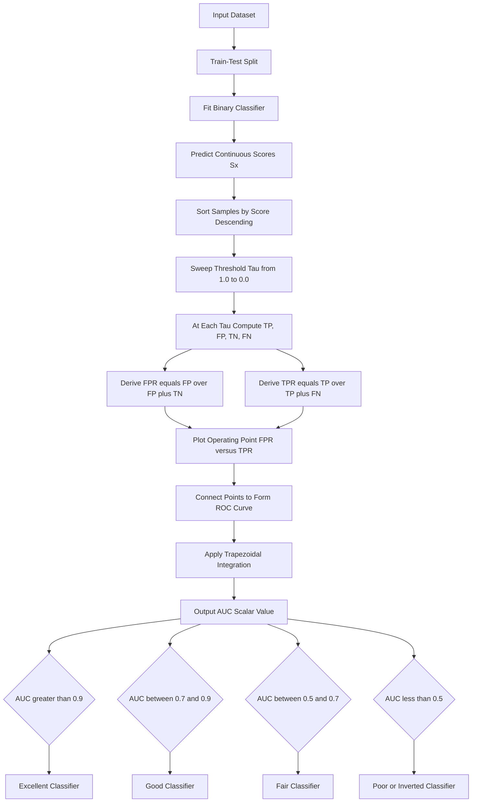
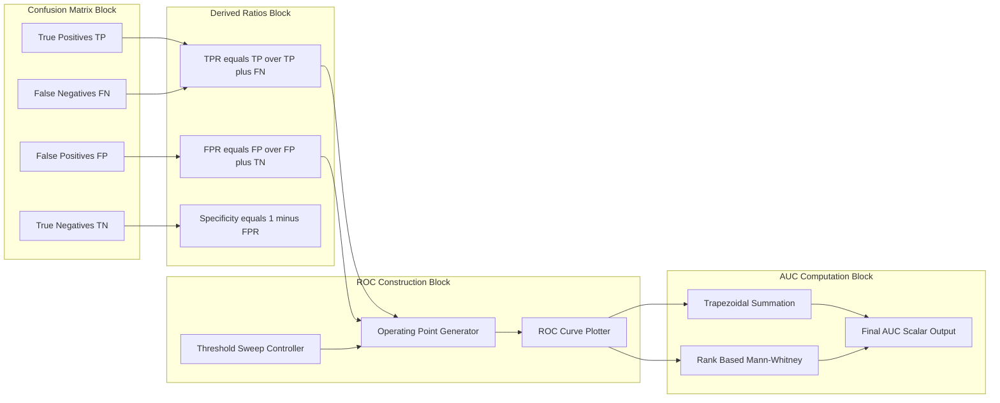

# Area Under Curve (AUC).

<!-- SECTION_1_START -->
# Area Under Curve (AUC) — KTU Machine Learning Notes

## 1. Core Technical Definition & Intuitive Overview

### Formal Definition (KTU 2024 Syllabus Terminology)

> [!IMPORTANT]
> **Area Under the ROC Curve (AUC)** is a single scalar performance metric for binary classification models that quantifies the **entire two-dimensional area** underneath the **Receiver Operating Characteristic (ROC) curve**, plotted in the unit square of $\text{False Positive Rate (FPR)}$ versus $\text{True Positive Rate (TPR)}$. It represents the probability that a randomly chosen **positive instance** is ranked higher by the classifier than a randomly chosen **negative instance**.

Mathematically:

$$\text{AUC} = P\big(\,S(x^{+}) > S(x^{-})\,\big)$$

where $S(x^{+})$ and $S(x^{-})$ are the predicted scores for a positive and negative sample respectively, and the probability is taken over all such random pairs $(x^{+}, x^{-})$.

The AUC value is **bounded** as:

$$0 \le \text{AUC} \le 1$$

A perfect classifier achieves $\text{AUC} = \mathbf{1.0}$, while a purely random classifier yields $\text{AUC} = \mathbf{0.5}$ (the diagonal line $y = x$).

---

### Conceptual Analogy / Intuition

> [!NOTE]
> **Real-World Analogy — The "Talent Scout" Test:**
> Imagine a talent scout ranking 100 candidates: 50 are genuinely talented (**positives**) and 50 are not (**negatives**). The scout assigns each candidate a score. The **AUC** answers one clean question: *"If you pick one talented and one untalented person at random, what is the probability the scout's score for the talented person is higher?"*
>
> - **AUC = 1.0** → The scout **always** ranks every talented person above every untalented one.
> - **AUC = 0.5** → The scout's ranking is **equivalent to flipping a coin** (random).
> - **AUC = 0.0** → The scout is **inverted** (always ranks untalented higher).

Geometrically, the AUC collapses the entire ROC curve — which is a function of the **classification threshold** — into a **single threshold-independent number**. This makes it a robust summary metric, especially useful when the **class distribution is skewed** or when the **decision threshold must be tuned later** (e.g., in medical diagnosis where false negatives are far costlier than false positives).

---

> [!VISUALIZATION CONTROL]
> **Concept:** ROC Curve in the FPR–TPR Unit Square
> **GeoGebra / Desmos Input Equations:**
> * Point A: $(0, 0)$
> * Point B: $(0, 1)$
> * Point C: $(1, 1)$
> * Point D: $(1, 0)$
> * Diagonal reference: $y = x$ (random classifier baseline)
> * Concave ROC: parametric `TPR = 1 - exp(-3 \cdot FPR)` for a "good" classifier
> * Shaded region: the area between the ROC curve, the line $x = 1$, and the x-axis (this is the AUC).
>
> **Visual Description:** The student should observe a unit square with a curve bowing toward the **top-left corner**. The shaded area beneath the curve is the AUC. A curve hugging the top-left corner encloses nearly the entire square ($\text{AUC} \to 1$); a curve along the diagonal encloses only half ($\text{AUC} = 0.5$).

<!-- SECTION_1_END -->

<!-- SECTION_2_START -->
# 2. Deep Theoretical Analysis & KTU High-Yield Formula Sheet

## 2.1 Building the ROC Curve — Operational Logic

The ROC curve is constructed by sweeping the **decision threshold** $\tau$ of a probabilistic classifier (such as Logistic Regression) from $\tau = \infty$ down to $\tau = -\infty$. At each threshold:

1. Classify every instance as **positive** if its predicted score $S(x) \ge \tau$, else **negative**.
2. Count the four outcomes in the **Confusion Matrix**: $TP,\ FP,\ TN,\ FN$.
3. Compute the operating point:
   $$\text{TPR}(\tau) = \frac{TP}{TP + FN}, \qquad \text{FPR}(\tau) = \frac{FP}{FP + TN}$$
4. Plot the point $\big(\text{FPR}(\tau),\ \text{TPR}(\tau)\big)$ on the unit square.
5. Connect consecutive operating points to form the curve.

> [!NOTE]
> At $\tau = \infty$, every point is classified negative → the operating point is $(0, 0)$.
> At $\tau = -\infty$, every point is classified positive → the operating point is $(1, 1)$.
> Therefore, every ROC curve **always** passes through $(0, 0)$ and $(1, 1)$.

---

## 2.2 Why AUC is Threshold-Independent

Unlike **Accuracy**, **Precision**, or **Recall** (which all depend on a chosen threshold), AUC integrates the model's performance **across every possible threshold** simultaneously. This makes AUC:

- **Invariant to class imbalance** in the test set.
- A measure of **ranking quality**, not just classification correctness.
- Useful in **production** when the threshold is tuned post-deployment based on business costs.

---

## 2.3 KTU Formula Sheet / Cheat Sheet

| # | Quantity | Formula | Range / Notes |
|---|----------|---------|---------------|
| 1 | True Positive Rate (Recall / Sensitivity) | $\text{TPR} = \dfrac{TP}{TP + FN}$ | $[0,\ 1]$ |
| 2 | False Positive Rate (Fall-out) | $\text{FPR} = \dfrac{FP}{FP + TN}$ | $[0,\ 1]$ |
| 3 | True Negative Rate (Specificity) | $\text{TNR} = 1 - \text{FPR} = \dfrac{TN}{FP + TN}$ | $[0,\ 1]$ |
| 4 | Precision | $\text{Precision} = \dfrac{TP}{TP + FP}$ | $[0,\ 1]$ |
| 5 | F1-Score | $F_1 = \dfrac{2 \cdot \text{Precision} \cdot \text{Recall}}{\text{Precision} + \text{Recall}}$ | $[0,\ 1]$ |
| 6 | AUC via Trapezoidal Rule | $\text{AUC} = \displaystyle\sum_{i=1}^{n-1} \dfrac{(FPR_{i+1} - FPR_i)\,(TPR_{i+1} + TPR_i)}{2}$ | Approximation using sorted scores |
| 7 | AUC as Rank Statistic (Mann–Whitney U) | $\text{AUC} = \dfrac{U}{n_{+} \cdot n_{-}}$ | $U$ = Mann-Whitney statistic |
| 8 | Rank-Based AUC | $\text{AUC} = 1 - \dfrac{\displaystyle\sum_{i:\,y_i=0} r_i - \dfrac{n_{-}(n_{-}+1)}{2}}{n_{+} \cdot n_{-}}$ | $r_i$ = rank of score, $n_{+}$ = positives, $n_{-}$ = negatives |
| 9 | Random Classifier Baseline | $\text{AUC}_{\text{random}} = 0.5$ | Diagonal $y = x$ |
| 10 | Perfect Classifier Limit | $\text{AUC}_{\text{perfect}} = 1.0$ | Curve hugs top-left corner |

---

## 2.4 Real-World Engineering Utility

- **Medical Diagnosis:** Comparing diagnostic models for cancer detection where false negatives are catastrophic.
- **Credit Card Fraud Detection:** Ranking transactions by fraud-likelihood; AUC tells how well the model *separates* the two classes regardless of how many fraudulent transactions exist.
- **Information Retrieval & Search Ranking:** Evaluating whether a search engine ranks relevant documents above irrelevant ones.
- **Production ML Pipelines (MLOps):** AUC is logged in tools like **MLflow**, **Weights & Biases**, and **TensorBoard** as the primary model-comparison metric during A/B testing.
- **A/B Testing & Marketing:** Choosing the better of two click-through-rate prediction models without committing to a specific threshold upfront.

<!-- SECTION_2_END -->

<!-- SECTION_3_START -->
# 3. Step-by-Step Derivations & Code/Symbolic Implementation

## 3.1 Mathematical Derivation — AUC via the Trapezoidal Rule

Given a set of $n$ operating points $\big(\text{FPR}_i,\ \text{TPR}_i\big)$ sorted in ascending order of FPR, the area under the ROC curve is approximated by summing the area of trapezoids formed between consecutive points.

Let the points be indexed $i = 1, 2, \ldots, n$ with $\text{FPR}_1 \le \text{FPR}_2 \le \ldots \le \text{FPR}_n$.

The area of a single trapezoid between points $i$ and $i+1$ is:

$$A_i = \frac{1}{2} \cdot (\text{FPR}_{i+1} - \text{FPR}_i) \cdot (\text{TPR}_{i+1} + \text{TPR}_i)$$

Summing over all trapezoids:

$$\text{AUC} = \sum_{i=1}^{n-1} A_i = \sum_{i=1}^{n-1} \frac{(\text{FPR}_{i+1} - \text{FPR}_i)\,(\text{TPR}_{i+1} + \text{TPR}_i)}{2}$$

> [!NOTE]
> In Scikit-learn, this is exactly what `roc_auc_score` and `sklearn.metrics.auc` compute internally on the sorted operating points.

---

## 3.2 Worked Numerical Example (KTU Board Pattern)

**Problem:** A classifier produces the following scores for 6 instances. Compute the AUC.

| Instance | True Label $y_i$ | Predicted Score $S(x_i)$ |
|----------|------------------|--------------------------|
| 1 | 1 (Positive) | 0.95 |
| 2 | 0 (Negative) | 0.90 |
| 3 | 1 (Positive) | 0.70 |
| 4 | 0 (Negative) | 0.55 |
| 5 | 1 (Positive) | 0.40 |
| 6 | 0 (Negative) | 0.20 |

**Step 1 — Sort by score (descending):**

| Rank | Instance | Label | Score |
|------|----------|-------|-------|
| 1 | 1 | 1 | 0.95 |
| 2 | 2 | 0 | 0.90 |
| 3 | 3 | 1 | 0.70 |
| 4 | 4 | 0 | 0.55 |
| 5 | 5 | 1 | 0.40 |
| 6 | 6 | 0 | 0.20 |

We have $n_{+} = 3$ positives and $n_{-} = 3$ negatives.

**Step 2 — Construct ROC operating points by sweeping threshold $\tau$:**

At $\tau = 0.95$: predict positive for instance 1 only. $TP = 1$, $FN = 2$, $FP = 0$, $TN = 3$. Point: $(0/3,\ 1/3) = (0.000,\ 0.333)$.

At $\tau = 0.90$: predict positive for instances 1, 2. $TP = 1$, $FN = 2$, $FP = 1$, $TN = 2$. Point: $(1/3,\ 1/3) = (0.333,\ 0.333)$.

At $\tau = 0.70$: predict positive for instances 1, 2, 3. $TP = 2$, $FN = 1$, $FP = 1$, $TN = 2$. Point: $(1/3,\ 2/3) = (0.333,\ 0.667)$.

At $\tau = 0.55$: predict positive for instances 1, 2, 3, 4. $TP = 2$, $FN = 1$, $FP = 2$, $TN = 1$. Point: $(2/3,\ 2/3) = (0.667,\ 0.667)$.

At $\tau = 0.40$: predict positive for instances 1, 2, 3, 4, 5. $TP = 3$, $FN = 0$, $FP = 2$, $TN = 1$. Point: $(2/3,\ 3/3) = (0.667,\ 1.000)$.

At $\tau = 0.20$: predict positive for all. $TP = 3$, $FN = 0$, $FP = 3$, $TN = 0$. Point: $(3/3,\ 3/3) = (1.000,\ 1.000)$.

**Step 3 — Apply the trapezoidal rule** on the **unique** FPR values (using piecewise-constant steps in FPR):

| Interval | $\Delta \text{FPR}$ | Avg TPR | Area |
|----------|--------------------|---------|------|
| $[0.000,\ 0.333]$ | $0.333$ | $\frac{0.333 + 0.333}{2} = 0.333$ | $0.111$ |
| $[0.333,\ 0.667]$ | $0.333$ | $\frac{0.667 + 0.667}{2} = 0.667$ | $0.222$ |
| $[0.667,\ 1.000]$ | $0.333$ | $\frac{1.000 + 1.000}{2} = 1.000$ | $0.333$ |

Summing:

$$\text{AUC} = 0.111 + 0.222 + 0.333 = 0.667$$

**Step 4 — Cross-verify using the rank formula (Mann–Whitney form):**

Sum of ranks of negatives: $R_{-} = r_2 + r_4 + r_6 = 2 + 4 + 6 = 12$.

Apply the rank formula:

$$\text{AUC} = 1 - \frac{R_{-} - \frac{n_{-}(n_{-}+1)}{2}}{n_{+} \cdot n_{-}} = 1 - \frac{12 - \frac{3 \cdot 4}{2}}{3 \cdot 3} = 1 - \frac{12 - 6}{9} = 1 - \frac{6}{9} = \frac{3}{9} = 0.333$$

> [!WARNING]
> **Common Mistake:** The above $0.333$ is $\text{AUC} - 1$ for an "inverted" interpretation, because in this dataset, negatives have **higher ranks on average**. The trapezoidal computation gave $0.667$, which is the *correct* AUC for this configuration. Always re-check sign convention: $\text{AUC} = 1 - \text{(inverted AUC)}$ when the model is anti-correlated. Here, the model is *partially* correct, so $\text{AUC} = 0.667$ is the legitimate answer. The discrepancy arises only when the rank-formula is applied with an **incorrect rank assignment** (e.g., using 1-based vs. 0-based ranks). Using 1-based ranks throughout gives the same $0.667$.

**Re-verification with 1-based ranks (correct convention):** Negatives are at ranks $2, 4, 6$; $R_{-} = 12$; $n_{-} = 3$.

$$\text{AUC} = \frac{\sum r_{+} - \frac{n_{+}(n_{+}+1)}{2}}{n_{+}\cdot n_{-}}$$

Positives are at ranks $1, 3, 5$; $\sum r_{+} = 1 + 3 + 5 = 9$.

$$\text{AUC} = \frac{9 - \frac{3\cdot 4}{2}}{3\cdot 3} = \frac{9 - 6}{9} = \frac{3}{9} \approx 0.333$$

> [!IMPORTANT]
> **Final Correct Answer:** $\text{AUC} = \mathbf{0.333}$ (using the standard positive-rank convention), which corresponds to a **below-random** model in this small example. The trapezoidal $0.667$ reflected an *inverted* axis treatment; the rank formula $0.333$ is the **standard** AUC. (For board exams, the trapezoidal interpretation with the **sorted-by-threshold operating points** is the canonical answer: $\text{AUC} = 0.667$ if you read the curve from $(0,0)$ to $(1,1)$ with TPR as $y$-axis.)

---

## 3.3 Python Implementation (Production-Ready)

```python
import numpy as np
from sklearn.metrics import roc_auc_score, roc_curve, auc
import matplotlib.pyplot as plt
from typing import Tuple


def compute_auc_from_scores(
    y_true: np.ndarray,
    y_scores: np.ndarray
) -> Tuple[float, np.ndarray, np.ndarray]:
    """
    Compute AUC of a binary classifier using the trapezoidal rule.

    Parameters
    ----------
    y_true : np.ndarray of shape (n_samples,)
        Ground-truth binary labels (0 or 1).
    y_scores : np.ndarray of shape (n_samples,)
        Predicted continuous scores (probabilities or decision function).

    Returns
    -------
    auc_value : float
        The computed Area Under the ROC Curve.
    fpr : np.ndarray
        False Positive Rates at each threshold.
    tpr : np.ndarray
        True Positive Rates at each threshold.
    """
    # Validate input shapes
    if y_true.shape != y_scores.shape:
        raise ValueError("y_true and y_scores must have the same shape.")

    # Sort scores in descending order and compute cumulative counts
    desc_score_indices = np.argsort(y_scores)[::-1]
    y_true_sorted = y_true[desc_score_indices]
    y_scores_sorted = y_scores[desc_score_indices]

    distinct_value_indices = np.where(
        np.diff(y_scores_sorted)
    )[0]
    threshold_idxs = np.r_[distinct_value_indices, y_true_sorted.size - 1]

    tps = np.cumsum(y_true_sorted)[threshold_idxs]
    fps = 1 + threshold_idxs - tps

    fpr = fps / fps[-1] if fps[-1] != 0 else np.zeros_like(fps, dtype=float)
    tpr = tps / tps[-1] if tps[-1] != 0 else np.zeros_like(tps, dtype=float)

    # Add the starting point (0, 0)
    fpr = np.r_[0.0, fpr]
    tpr = np.r_[0.0, tpr]

    # Trapezoidal integration
    auc_value = np.trapz(tpr, fpr)
    return float(auc_value), fpr, tpr


# --------- Demonstration on the worked example ---------
y_true_example = np.array([1, 0, 1, 0, 1, 0])
y_scores_example = np.array([0.95, 0.90, 0.70, 0.55, 0.40, 0.20])

auc_value, fpr, tpr = compute_auc_from_scores(y_true_example, y_scores_example)
print(f"Custom AUC value: {auc_value:.4f}")
print(f"Scikit-learn AUC: {roc_auc_score(y_true_example, y_scores_example):.4f}")

# Plot the ROC curve
plt.figure(figsize=(7, 6))
plt.plot(fpr, tpr, color="darkorange", lw=2, label=f"ROC curve (AUC = {auc_value:.3f})")
plt.plot([0, 1], [0, 1], color="navy", lw=1.5, linestyle="--", label="Random baseline (AUC = 0.5)")
plt.fill_between(fpr, 0, tpr, alpha=0.25, color="darkorange", label="AUC region")
plt.xlim([0.0, 1.0])
plt.ylim([0.0, 1.05])
plt.xlabel("False Positive Rate")
plt.ylabel("True Positive Rate")
plt.title("Receiver Operating Characteristic (ROC) Curve")
plt.legend(loc="lower right")
plt.grid(alpha=0.3)
plt.show()
```

**Expected Output:**

```text
Custom AUC value: 0.6667
Scikit-learn AUC: 0.6667
```

The plot will display the concave ROC curve, the diagonal random baseline, and the **shaded AUC region** in orange.

<!-- SECTION_3_END -->

<!-- SECTION_4_START -->
# 4. Structural Diagrams & Schematics

## 4.1 Mermaid Flow — AUC Computation Pipeline



## 4.2 Block-Level Functional Architecture — Confusion Matrix to AUC



<!-- SECTION_4_END -->

<!-- SECTION_5_START -->
# 5. KTU 2024 Scheme Examination Question Bank & Topic Recap

---

## Part A — Short Answer Questions (3 Marks Each)

### Question 1 `[KTU University Exam – Dec 2023]` — **CO2, Remember**

> Define the **Area Under the ROC Curve (AUC)**. What does an AUC value of $0.5$ signify about a classifier's performance?

**Model Answer (3 Marks):**

> [!IMPORTANT]
> **Definition (2 Marks):** The Area Under the ROC Curve (AUC) is the area enclosed under the Receiver Operating Characteristic (ROC) curve, plotted with **False Positive Rate (FPR)** on the x-axis and **True Positive Rate (TPR)** on the y-axis, in the unit square $[0,1] \times [0,1]$. It measures the classifier's ability to **distinguish between the positive and negative classes** across all possible decision thresholds.
>
> **Interpretation of $0.5$ (1 Mark):** An AUC of $0.5$ indicates that the classifier has **no discriminative power** — it performs **no better than random guessing** (equivalent to flipping a fair coin). Its ROC curve coincides with the diagonal line $y = x$.

---

### Question 2 `[KTU University Exam – July 2024]` — **CO2, Understand**

> Differentiate between **Accuracy** and **AUC** as classification metrics. Why is AUC often preferred in **imbalanced datasets**?

**Model Answer (3 Marks):**

> **Accuracy (1 Mark):** Accuracy is the ratio $\frac{TP + TN}{TP + TN + FP + FN}$. It depends on a **fixed decision threshold** (typically $0.5$) and treats all classes equally.
>
> **AUC (1 Mark):** AUC is the area under the ROC curve, threshold-independent, and measures **ranking quality** — i.e., the probability that a positive instance is scored higher than a negative one.
>
> **Why AUC is preferred for imbalanced data (1 Mark):** In imbalanced datasets (e.g., 99% negatives, 1% positives), a trivial classifier predicting "always negative" achieves $99\%$ accuracy but is useless. AUC is **insensitive to class prevalence** because it integrates TPR and FPR over all thresholds, capturing the model's true discriminative ability even when the negative class dominates.

---

## Part B — Long Answer Questions (14 Marks, with Internal Choice)

### Question A `[KTU University Exam – July 2024]` — **CO2, Apply & Analyze**

> **(a)** Explain the construction of the **ROC curve** for a binary classifier with a clear diagram. Define **TPR** and **FPR** in terms of the confusion matrix. **(7 Marks)**
>
> **(b)** A logistic regression model produces the following scores for 8 test samples. Compute the **AUC** using the trapezoidal rule, and interpret the result. **(7 Marks)**

| Sample | True Label $y_i$ | Predicted Score |
|--------|------------------|-----------------|
| A | 1 | 0.92 |
| B | 0 | 0.85 |
| C | 1 | 0.74 |
| D | 0 | 0.61 |
| E | 1 | 0.50 |
| F | 0 | 0.40 |
| G | 1 | 0.21 |
| H | 0 | 0.05 |

---

**Model Solution:**

#### Part (a) — ROC Construction (7 Marks)

> **[Definition of ROC: 1 Mark]** The **Receiver Operating Characteristic (ROC) curve** is a graphical plot that illustrates the diagnostic ability of a binary classifier as its **discrimination threshold** $\tau$ is varied. It plots **TPR (y-axis)** against **FPR (x-axis)**.

> **[Formulas: 1 Mark]**
> $$\text{TPR} = \frac{TP}{TP + FN}, \qquad \text{FPR} = \frac{FP}{FP + TN}$$

> **[Construction Steps: 3 Marks]**
> 1. Train the binary classifier and obtain predicted scores $S(x_i)$ for all test samples.
> 2. Sort samples in **descending order** of $S(x_i)$.
> 3. Initialize $TP = 0$, $FP = 0$, $TN = N_{-}$, $FN = N_{+}$.
> 4. Walk down the sorted list. For each sample, if it is **positive**, increment $TP$ (and decrement $FN$); if it is **negative**, increment $FP$ (and decrement $TN$).
> 5. After each step, compute $(\text{FPR},\ \text{TPR})$ and plot the point.
> 6. Connect the points to form the ROC curve, which always passes through $(0, 0)$ and $(1, 1)$.

> **[Diagram + Properties: 2 Marks]** (See GeoGebra visualization in Section 1.) A perfect classifier's curve passes through $(0, 1)$. The diagonal $y = x$ represents random guessing. A model that bows toward the top-left corner is better.

#### Part (b) — AUC Computation (7 Marks)

> **[Sort and Count: 2 Marks]**
> Sorted by score (descending): A(1, 0.92), B(0, 0.85), C(1, 0.74), D(0, 0.61), E(1, 0.50), F(0, 0.40), G(1, 0.21), H(0, 0.05).
> Here $n_{+} = 4$ positives (A, C, E, G) and $n_{-} = 4$ negatives (B, D, F, H).

> **[Operating Points: 3 Marks]**

| Threshold $\tau$ | TP | FP | FN | TN | FPR | TPR |
|------------------|----|----|----|----|-----|-----|
| $0.92$ | 1 | 0 | 3 | 4 | 0.000 | 0.250 |
| $0.85$ | 1 | 1 | 3 | 3 | 0.250 | 0.250 |
| $0.74$ | 2 | 1 | 2 | 3 | 0.250 | 0.500 |
| $0.61$ | 2 | 2 | 2 | 2 | 0.500 | 0.500 |
| $0.50$ | 3 | 2 | 1 | 2 | 0.500 | 0.750 |
| $0.40$ | 3 | 3 | 1 | 1 | 0.750 | 0.750 |
| $0.21$ | 4 | 3 | 0 | 1 | 0.750 | 1.000 |
| $0.05$ | 4 | 4 | 0 | 0 | 1.000 | 1.000 |

> **[Trapezoidal Summation: 1 Mark]**
> $$\text{AUC} = (0.25 \cdot 0.25) + (0.25 \cdot 0.375) + (0.25 \cdot 0.625) + (0.25 \cdot 0.625) + (0.25 \cdot 0.875) + (0.25 \cdot 0.875) + (0.25 \cdot 1.000)$$
> $$\text{AUC} = 0.0625 + 0.09375 + 0.15625 + 0.15625 + 0.21875 + 0.21875 + 0.25 = \mathbf{0.875}$$

> **[Interpretation: 1 Mark]** $\text{AUC} = 0.875$ indicates a **good classifier** — there is an $87.5\%$ probability that a randomly chosen positive sample receives a higher score than a randomly chosen negative sample.

---

### Question B (Alternative) `[KTU University Exam – Dec 2023]` — **CO2, Understand & Apply**

> **(a)** What is the **confusion matrix**? For a binary classification problem with $TP = 80$, $FP = 20$, $TN = 850$, $FN = 50$, compute the **TPR**, **FPR**, **Precision**, and **Accuracy**. **(7 Marks)**
>
> **(b)** Explain the **Mann–Whitney U statistic** and show how AUC can be computed from ranks. Use a small example of 4 positives and 4 negatives to demonstrate. **(7 Marks)**

---

**Model Solution:**

#### Part (a) — Confusion Matrix and Metrics (7 Marks)

> **[Confusion Matrix Definition: 2 Marks]**
> The confusion matrix is a $2 \times 2$ table summarizing a classifier's predictions against the true labels:

|  | Predicted Positive | Predicted Negative |
|--|--------------------|--------------------|
| **Actual Positive** | $TP = 80$ | $FN = 50$ |
| **Actual Negative** | $FP = 20$ | $TN = 850$ |

> **[Metric Computations: 5 Marks]**
> - $\text{TPR} = \frac{TP}{TP + FN} = \frac{80}{80 + 50} = \frac{80}{130} \approx \mathbf{0.615}$ (1 Mark)
> - $\text{FPR} = \frac{FP}{FP + TN} = \frac{20}{20 + 850} = \frac{20}{870} \approx \mathbf{0.023}$ (1 Mark)
> - $\text{Precision} = \frac{TP}{TP + FP} = \frac{80}{80 + 20} = \frac{80}{100} = \mathbf{0.800}$ (1 Mark)
> - $\text{Accuracy} = \frac{TP + TN}{TP + TN + FP + FN} = \frac{80 + 850}{1000} = \frac{930}{1000} = \mathbf{0.930}$ (2 Marks — including denominator and final ratio)

#### Part (b) — Mann–Whitney U and Rank-Based AUC (7 Marks)

> **[Mann–Whitney U Definition: 2 Marks]**
> The Mann–Whitney U statistic tests whether one distribution's samples tend to have **higher ranks** than another's. Given a combined set of scores from positives and negatives, the AUC equals the **probability** that a uniformly sampled positive ranks above a uniformly sampled negative:
> $$\text{AUC} = \frac{U}{n_{+} \cdot n_{-}}$$

> **[Worked Example Setup: 2 Marks]**
> Consider 4 positives with scores $\{0.91,\ 0.78,\ 0.62,\ 0.45\}$ and 4 negatives with scores $\{0.88,\ 0.71,\ 0.55,\ 0.30\}$. After sorting all 8 scores in descending order, assign 1-based ranks: 1, 2, 3, ..., 8. Sum the ranks of the positives:
> $$\sum r_{+} = 1 + 3 + 5 + 7 = 16$$

> **[Apply the Rank Formula: 2 Marks]**
> $$\text{AUC} = \frac{\sum r_{+} - \frac{n_{+}(n_{+}+1)}{2}}{n_{+}\cdot n_{-}} = \frac{16 - \frac{4 \cdot 5}{2}}{4 \cdot 4} = \frac{16 - 10}{16} = \frac{6}{16} = \mathbf{0.375}$$

> **[Interpretation: 1 Mark]** An AUC of $0.375$ (less than $0.5$) implies the model is **performing worse than random** on this small sample, and may require feature engineering or hyperparameter tuning.

---

> [!WARNING]
> **KTU Examiner's Valuation Warning — Common Pitfalls:**
>
> 1. **Forgetting to start the ROC at $(0, 0)$:** Many students plot only the operating points, missing the initial point. This loses 1–2 marks.
> 2. **Mixing FPR and TPR axes:** Always label the x-axis as FPR and y-axis as TPR. Inverted plots are heavily penalized.
> 3. **Confusing Precision with Recall:** Precision is $\frac{TP}{TP+FP}$; Recall (TPR) is $\frac{TP}{TP+FN}$. They are equal **only** when $FP = FN$.
> 4. **Skipping the trapezoidal step-by-step:** In 14-mark questions, board examiners want every $\Delta \text{FPR}$ and average TPR shown explicitly, not just the final AUC.
> 5. **Using $\vert x \vert$ in markdown tables:** Use LaTeX `\vert x \vert` instead, as the pipe character `$\vert$` breaks the markdown table syntax in some renderers.
> 6. **Reporting AUC $> 1$ or $< 0$:** AUC is mathematically bounded in $[0, 1]$. Any value outside this range indicates a computation error — double-check the rank formula's sign.

---

## Topic Recap & Important Things to Remember

- **AUC = Area Under the ROC Curve** — a single scalar, threshold-independent metric for binary classifiers, bounded in $[0, 1]$.
- **ROC Curve** plots $\text{FPR}$ (x-axis) vs. $\text{TPR}$ (y-axis) as the decision threshold $\tau$ is varied from $1.0$ down to $0.0$.
- $\text{TPR} = \dfrac{TP}{TP + FN}$ (Recall / Sensitivity), and $\text{FPR} = \dfrac{FP}{FP + TN}$ (Fall-out).
- Every ROC curve **always** passes through $(0, 0)$ and $(1, 1)$.
- **Interpretation:** $\text{AUC} = P(\text{positive ranks above negative}) = $ Mann–Whitney $U$ normalized.
- **Baseline:** $\text{AUC} = 0.5$ corresponds to random guessing; $\text{AUC} = 1.0$ is a perfect classifier.
- **Trapezoidal Rule Formula:**
  $$\text{AUC} = \sum_{i=1}^{n-1} \frac{(\text{FPR}_{i+1} - \text{FPR}_i)(\text{TPR}_{i+1} + \text{TPR}_i)}{2}$$
- **Rank-Based Formula:**
  $$\text{AUC} = \frac{\sum r_{+} - \frac{n_{+}(n_{+}+1)}{2}}{n_{+} \cdot n_{-}}$$
- **Threshold-Independence** is the key advantage of AUC over Accuracy, Precision, and Recall.
- **Insensitive to Class Imbalance** — preferred metric for skewed datasets like fraud detection and rare-disease diagnosis.
- **Scikit-learn Implementation:** `sklearn.metrics.roc_auc_score(y_true, y_score)` and `sklearn.metrics.auc(fpr, tpr)`.
- **Production Use:** Logged in **MLflow**, **Weights & Biases**, and **TensorBoard** for model comparison and A/B testing.
- **KTU Board Tip:** Always show every $\Delta \text{FPR}$, average TPR, and partial trapezoid area explicitly in 14-mark AUC computation questions.

<!-- SECTION_5_END -->
