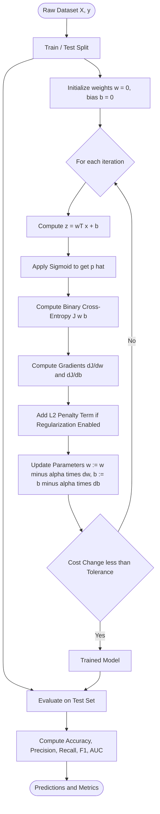
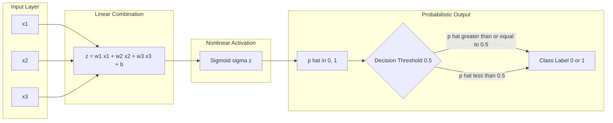
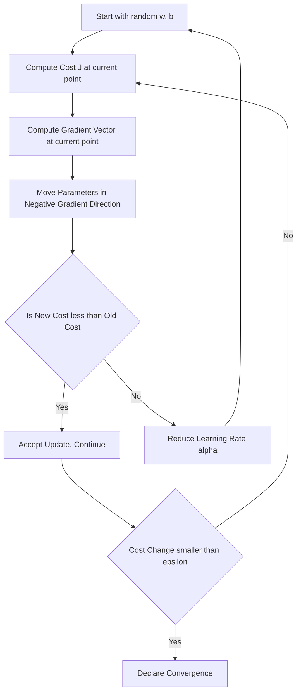
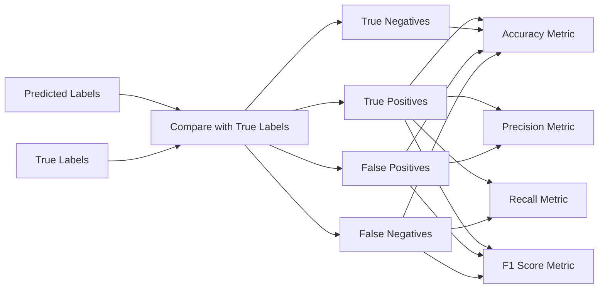

# Classification  - Logistic regression

<!-- SECTION_1_START -->
# Logistic Regression — Core Technical Definition & Intuitive Overview

> [!IMPORTANT]
> **KTU 2024 Syllabus Anchor (PCCST503 — Module 2: Classification)**
> Logistic Regression is the foundational parametric classification algorithm in supervised learning. It models the **probability** that a given input vector belongs to a particular class using the **logistic (sigmoid) function** applied to a linear combination of features.

## 1.1 Formal Definition

Logistic Regression is a **discriminative, parametric, probabilistic classifier** used primarily for **binary classification**. Despite its name, it is a *classification* algorithm — not a regression algorithm — because its output is a discrete class label derived from a continuous probability estimate.

Given a feature vector $\mathbf{x} \in \mathbb{R}^{n}$ and binary label $y \in \{0, 1\}$, logistic regression models the **conditional probability** of the positive class as:

$$P(y = 1 \mid \mathbf{x}; \mathbf{w}, b) = \sigma(\mathbf{w}^{T}\mathbf{x} + b) = \frac{1}{1 + e^{-(\mathbf{w}^{T}\mathbf{x} + b)}}$$

where $\mathbf{w} \in \mathbb{R}^{n}$ is the **weight vector**, $b \in \mathbb{R}$ is the **bias term**, and $\sigma(\cdot)$ is the **logistic sigmoid function**.

> [!NOTE]
> **KTU Board Definition (Verbatim Expectation):** "Logistic Regression is a statistical method used for binary classification that predicts the probability of a categorical dependent variable by fitting data to a logistic function (sigmoid curve)."

## 1.2 Conceptual Analogy — The "Soft Light Switch"

Imagine a **dimmer switch** in your home (the *sigmoid function*) controlling a lamp. You can turn the knob continuously, but the lamp's brightness is non-linearly mapped — small turns near the middle cause dramatic brightness changes, while extreme left/right positions have little visible effect.

- The **knob position** = the linear combination $\mathbf{w}^{T}\mathbf{x} + b$ (can be any real number from $-\infty$ to $+\infty$).
- The **lamp brightness** = the predicted probability $\hat{p} \in (0, 1)$ — *always* squeezed between **0** and **1**, no matter how extreme the input.
- The **decision rule** = "lamp is ON if brightness > 0.5", giving the final class label.

This non-linear "squeezing" is what makes logistic regression produce **probabilities** rather than unbounded real values like linear regression.

## 1.3 The Sigmoid Function — Mathematical Heart

The **sigmoid (logistic) function** $\sigma: \mathbb{R} \to (0, 1)$ is defined as:

$$\sigma(z) = \frac{1}{1 + e^{-z}}$$

### Key Properties (Memorize for KTU Boards)

| Property | Value / Expression | Significance |
|----------|-------------------|--------------|
| Output Range | $(0, 1)$ strictly | Valid probability |
| $\sigma(0)$ | $\frac{1}{2}$ | Decision boundary at $z=0$ |
| $\sigma(-z)$ | $1 - \sigma(z)$ | Symmetry property |
| Derivative | $\sigma(z)(1 - \sigma(z))$ | Simplifies gradient |
| $\lim_{z \to +\infty}$ | $1$ | Saturates high |
| $\lim_{z \to -\infty}$ | $0$ | Saturates low |

> [!NOTE]
> **Sigmoid at the decision threshold:** When the linear output $z = 0$, the predicted probability is exactly **0.5** — the natural decision boundary. Any $z > 0$ predicts class 1, and any $z < 0$ predicts class 0.

## 1.4 Why Not Linear Regression? — The Motivation

Linear regression outputs $\hat{y} = \mathbf{w}^{T}\mathbf{x} + b$, which is unbounded. For classification:
- Probabilities **must** lie in $[0, 1]$.
- A linear model can output $-2$ or $7$ — meaningless as probabilities.
- Linear regression is **sensitive to outliers** in classification tasks.

Logistic regression solves both by *composing* a linear model with the sigmoid, guaranteeing valid probability outputs.

> [!VISUALIZATION CONTROL]
> **Concept:** Sigmoid Function Shape
> **GeoGebra / Desmos Input Equations:**
> * `f(x) = 1/(1 + exp(-x))` (sigmoid curve)
> * `g(x) = 0.5` (horizontal decision threshold line)
> * `h(x) = x` (linear reference for small x)
> **Visual Description:** The student should observe an "S-shaped" curve crossing the y-axis at exactly 0.5, flattening asymptotically toward 0 on the left and 1 on the right. The point $(0, 0.5)$ is the **decision boundary** where the classifier is maximally uncertain.

<!-- SECTION_1_END -->

<!-- SECTION_2_START -->
# Deep Theoretical Analysis & KTU High-Yield Formula Sheet

## 2.1 From Probability to Log-Odds — The Theoretical Backbone

The derivation starts from the **odds ratio**, which expresses how much more likely the positive class is than the negative class:

$$\text{odds} = \frac{P(y=1 \mid \mathbf{x})}{P(y=0 \mid \mathbf{x})} = \frac{p}{1-p}$$

The **log-odds** (or *logit*) is:

$$\log\left(\frac{p}{1-p}\right) = \mathbf{w}^{T}\mathbf{x} + b$$

Solving for $p$ yields the sigmoid. This gives logistic regression a beautiful **interpretive property**: each weight $w_j$ represents the change in **log-odds** per unit change in feature $x_j$.

## 2.2 Decision Boundary

The decision boundary is the locus where the model is equally uncertain about both classes, i.e., $P(y=1 \mid \mathbf{x}) = 0.5$. This occurs when:

$$\mathbf{w}^{T}\mathbf{x} + b = 0$$

- For **2D features** $(x_1, x_2)$, the boundary is a **straight line**.
- For higher dimensions, it generalizes to a **hyperplane**.
- A **non-linear decision boundary** can be obtained by introducing polynomial or interaction features (e.g., $x_1^2$, $x_1 x_2$) — KTU frequently tests this trick.

## 2.3 Cost Function — Why MSE Fails

Using **Mean Squared Error** with the sigmoid leads to a **non-convex** cost surface, trapping gradient descent in local minima. Logistic regression instead uses the **Binary Cross-Entropy (Log Loss)**:

$$J(\mathbf{w}, b) = -\frac{1}{m} \sum_{i=1}^{m} \left[ y^{(i)} \log\left(\hat{p}^{(i)}\right) + (1 - y^{(i)}) \log\left(1 - \hat{p}^{(i)}\right) \right]$$

This is derived from the **negative log-likelihood** under a Bernoulli distribution assumption — making the cost function **convex** and guaranteeing convergence to a global minimum.

## 2.4 Gradient Descent Updates

The partial derivatives of the cost function with respect to parameters are elegantly simple:

$$\frac{\partial J}{\partial w_j} = \frac{1}{m} \sum_{i=1}^{m} \left( \hat{p}^{(i)} - y^{(i)} \right) x_j^{(i)}$$

$$\frac{\partial J}{\partial b} = \frac{1}{m} \sum_{i=1}^{m} \left( \hat{p}^{(i)} - y^{(i)} \right)$$

The **update rule** (with learning rate $\alpha$) is:

$$w_j := w_j - \alpha \frac{\partial J}{\partial w_j} \qquad b := b - \alpha \frac{\partial J}{\partial b}$$

> [!IMPORTANT]
> **KTU Board Tip:** The gradient expression has the *exact same form* as linear regression's gradient — only $\hat{p}^{(i)}$ differs (sigmoid output vs. linear output). Examiners love to compare these two.

## 2.5 Regularization Variants (High-Yield for Module 2)

Regularization prevents **overfitting** by penalizing large weights. KTU 2024 scheme tests the following three forms:

- **L1 (Lasso):** adds $\lambda \sum_j \vert w_j \vert$ — produces *sparse* models (feature selection).
- **L2 (Ridge):** adds $\lambda \sum_j w_j^{2}$ — shrinks weights, default in scikit-learn.
- **Elastic Net:** combines both with mixing parameter $\rho$.

## 2.6 KTU Formula Sheet / Cheat Sheet

| Concept | Formula | Notes / Units |
|---------|---------|----------------|
| Sigmoid | $\sigma(z) = \frac{1}{1 + e^{-z}}$ | Maps $\mathbb{R} \to (0, 1)$ |
| Hypothesis | $\hat{p} = \sigma(\mathbf{w}^{T}\mathbf{x} + b)$ | Predicted probability |
| Decision Rule | $\hat{y} = 1$ if $\hat{p} \geq 0.5$, else $0$ | Threshold tunable |
| Log-Loss | $J = -\frac{1}{m}\sum \left[ y \log\hat{p} + (1-y)\log(1-\hat{p}) \right]$ | Units: nats (or bits if $\log_2$) |
| Gradient (weight) | $\frac{\partial J}{\partial w_j} = \frac{1}{m}\sum (\hat{p}^{(i)} - y^{(i)}) x_j^{(i)}$ | Vector form: $\nabla_{\mathbf{w}} J = \frac{1}{m}\mathbf{X}^{T}(\hat{\mathbf{p}} - \mathbf{y})$ |
| Gradient (bias) | $\frac{\partial J}{\partial b} = \frac{1}{m}\sum (\hat{p}^{(i)} - y^{(i)})$ | Scalar |
| L2 Regularized Gradient | $\frac{\partial J}{\partial w_j} + \frac{\lambda}{m} w_j$ | $\lambda$ = regularization strength |
| Odds Ratio | $\frac{p}{1-p} = e^{\mathbf{w}^{T}\mathbf{x} + b}$ | Positive class likelihood ratio |
| Log-Odds | $\ln\!\left(\frac{p}{1-p}\right) = \mathbf{w}^{T}\mathbf{x} + b$ | Linear in features |
| Odds Ratio per unit $x_j$ | $e^{w_j}$ | Multiplicative factor |
| Confusion Matrix Metric — Accuracy | $\frac{TP + TN}{TP + TN + FP + FN}$ | Range: $[0, 1]$ |
| Precision | $\frac{TP}{TP + FP}$ | Positive predictive value |
| Recall (Sensitivity) | $\frac{TP}{TP + FN}$ | True positive rate |
| F1-Score | $\frac{2 \cdot \text{Precision} \cdot \text{Recall}}{\text{Precision} + \text{Recall}}$ | Harmonic mean |
| ROC-AUC | $\int_{0}^{1} TPR(FPR^{-1}(t))\, dt$ | Threshold-independent metric |

## 2.7 Real-World Engineering Utility

Logistic regression is the **workhorse of production ML systems** for high-stakes, low-latency, interpretable decisions:

- **Healthcare:** Predicting sepsis onset, hospital readmission, malignancy risk from biomarkers.
- **Finance:** Credit card fraud detection, loan default probability, churning customer prediction.
- **NLP:** Baseline for spam detection, sentiment polarity, toxic comment classification.
- **Marketing:** Click-through rate (CTR) prediction in ad-tech bidding pipelines.
- **Cybersecurity:** Intrusion detection flags from network flow features.

Its **interpretability** (weights directly represent log-odds) makes it the algorithm of choice in **regulated industries** (banking, medicine) where models must be explainable to auditors under frameworks like GDPR's "right to explanation" and the EU AI Act.

<!-- SECTION_2_END -->

<!-- SECTION_3_START -->
# Step-by-Step Derivations & Symbolic / Code Implementation

## 3.1 Derivation 1 — Sigmoid from Log-Odds

**Starting premise:** Let the log-odds of the positive class equal a linear function of features.

$$
\begin{aligned}
\ln\!\left(\frac{p}{1-p}\right) &= \mathbf{w}^{T}\mathbf{x} + b \\
\frac{p}{1-p} &= e^{\mathbf{w}^{T}\mathbf{x} + b} \\
p &= (1-p) \cdot e^{\mathbf{w}^{T}\mathbf{x} + b} \\
p &= e^{\mathbf{w}^{T}\mathbf{x} + b} - p \cdot e^{\mathbf{w}^{T}\mathbf{x} + b} \\
p + p \cdot e^{\mathbf{w}^{T}\mathbf{x} + b} &= e^{\mathbf{w}^{T}\mathbf{x} + b} \\
p \left(1 + e^{\mathbf{w}^{T}\mathbf{x} + b}\right) &= e^{\mathbf{w}^{T}\mathbf{x} + b} \\
p &= \frac{e^{\mathbf{w}^{T}\mathbf{x} + b}}{1 + e^{\mathbf{w}^{T}\mathbf{x} + b}} \\
p &= \frac{1}{1 + e^{-(\mathbf{w}^{T}\mathbf{x} + b)}} \\
p &= \sigma(\mathbf{w}^{T}\mathbf{x} + b) \quad \blacksquare
\end{aligned}
$$

**Interpretation:** Every step in this derivation transforms the unbounded linear output into a valid probability bounded in $(0, 1)$.

## 3.2 Derivation 2 — Cost Function from Maximum Likelihood

**Setup:** Assume $m$ independent training samples, each drawn from a Bernoulli distribution with success probability $\hat{p}^{(i)}$.

The likelihood of the entire dataset is:

$$
L(\mathbf{w}, b) = \prod_{i=1}^{m} \left(\hat{p}^{(i)}\right)^{y^{(i)}} \left(1 - \hat{p}^{(i)}\right)^{1 - y^{(i)}}
$$

Taking the natural log (monotonic transformation, safe to maximize):

$$
\begin{aligned}
\ell(\mathbf{w}, b) &= \ln L(\mathbf{w}, b) \\
&= \sum_{i=1}^{m} \left[ y^{(i)} \ln\hat{p}^{(i)} + (1 - y^{(i)}) \ln(1 - \hat{p}^{(i)}) \right]
\end{aligned}
$$

We **minimize the negative** log-likelihood, scaled by $m$ for gradient stability:

$$
J(\mathbf{w}, b) = -\frac{1}{m} \sum_{i=1}^{m} \left[ y^{(i)} \ln\hat{p}^{(i)} + (1 - y^{(i)}) \ln(1 - \hat{p}^{(i)}) \right] \quad \blacksquare
$$

## 3.3 Derivation 3 — Gradient w.r.t. Weight $w_j$

Let $z^{(i)} = \mathbf{w}^{T}\mathbf{x}^{(i)} + b$ and $\hat{p}^{(i)} = \sigma(z^{(i)})$.

Using the chain rule $\frac{\partial J}{\partial w_j} = \frac{\partial J}{\partial \hat{p}} \cdot \frac{\partial \hat{p}}{\partial z} \cdot \frac{\partial z}{\partial w_j}$:

**Step 1:** $\frac{\partial J}{\partial \hat{p}} = -\frac{y}{\hat{p}} + \frac{1-y}{1-\hat{p}} = \frac{\hat{p} - y}{\hat{p}(1-\hat{p})}$

**Step 2:** $\frac{\partial \hat{p}}{\partial z} = \hat{p}(1-\hat{p})$ (well-known sigmoid derivative identity)

**Step 3:** $\frac{\partial z}{\partial w_j} = x_j$

**Combining:**

$$
\begin{aligned}
\frac{\partial J}{\partial w_j} &= \frac{1}{m} \sum_{i=1}^{m} \frac{\hat{p}^{(i)} - y^{(i)}}{\hat{p}^{(i)}(1-\hat{p}^{(i)})} \cdot \hat{p}^{(i)}(1-\hat{p}^{(i)}) \cdot x_j^{(i)} \\
&= \frac{1}{m} \sum_{i=1}^{m} \left( \hat{p}^{(i)} - y^{(i)} \right) x_j^{(i)} \quad \blacksquare
\end{aligned}
$$

The $\hat{p}(1-\hat{p})$ terms cancel — a mathematically elegant result that KTU examiners reward with full marks when shown explicitly.

## 3.4 Full Python Implementation

```python
"""
Logistic Regression from Scratch — KTU 2024 Reference Implementation
Course: PCCST503 Machine Learning | Module 2: Classification
"""

import numpy as np
from typing import Tuple, Optional


class LogisticRegression:
    """
    Binary Logistic Regression trained via batch gradient descent.

    Hypothesis:    p(y=1|x) = sigmoid(w^T x + b)
    Cost:          Binary Cross-Entropy (Log Loss)
    Optimization:  Full-batch Gradient Descent with L2 regularization
    """

    def __init__(
        self,
        learning_rate: float = 0.01,
        n_iterations: int = 5000,
        regularization_strength: float = 0.01,
        tolerance: float = 1e-6,
        verbose: bool = False,
    ) -> None:
        if learning_rate <= 0:
            raise ValueError("learning_rate must be positive.")
        if n_iterations < 1:
            raise ValueError("n_iterations must be >= 1.")
        if regularization_strength < 0:
            raise ValueError("regularization_strength must be non-negative.")

        self.lr: float = learning_rate
        self.n_iters: int = n_iterations
        self.lambda_: float = regularization_strength
        self.tol: float = tolerance
        self.verbose: bool = verbose

        self.weights: Optional[np.ndarray] = None
        self.bias: float = 0.0
        self.cost_history: list[float] = []

    @staticmethod
    def _sigmoid(z: np.ndarray) -> np.ndarray:
        """Numerically stable sigmoid — clips to avoid overflow in exp()."""
        return np.where(
            z >= 0,
            1.0 / (1.0 + np.exp(-z)),
            np.exp(z) / (1.0 + np.exp(z)),
        )

    def _compute_cost(self, X: np.ndarray, y: np.ndarray) -> float:
        """Binary cross-entropy with optional L2 penalty (bias not penalized)."""
        m = X.shape[0]
        z = X @ self.weights + self.bias
        p = self._sigmoid(z)
        eps = 1e-15  # guard against log(0)
        cost = -np.mean(y * np.log(p + eps) + (1 - y) * np.log(1 - p + eps))
        l2_penalty = (self.lambda_ / (2 * m)) * np.sum(self.weights ** 2)
        return float(cost + l2_penalty)

    def fit(self, X: np.ndarray, y: np.ndarray) -> "LogisticRegression":
        """Fit the model using batch gradient descent with early stopping."""
        if X.shape[0] != y.shape[0]:
            raise ValueError("X and y must have the same number of samples.")
        if y.ndim != 1:
            raise ValueError("y must be a 1-D array of binary labels.")

        m, n = X.shape
        self.weights = np.zeros(n, dtype=np.float64)
        self.bias = 0.0
        self.cost_history.clear()

        for iteration in range(self.n_iters):
            z = X @ self.weights + self.bias
            p = self._sigmoid(z)

            error = p - y  # shape (m,)

            dw = (X.T @ error) / m + (self.lambda_ / m) * self.weights
            db = np.mean(error)

            self.weights -= self.lr * dw
            self.bias -= self.lr * db

            cost = self._compute_cost(X, y)
            self.cost_history.append(cost)

            if self.verbose and iteration % 500 == 0:
                print(f"[Iter {iteration:>5}] Cost = {cost:.6f}")

            if iteration > 0 and abs(self.cost_history[-2] - cost) < self.tol:
                if self.verbose:
                    print(f"Converged at iteration {iteration}.")
                break

        return self

    def predict_proba(self, X: np.ndarray) -> np.ndarray:
        """Return class-1 probabilities for each row of X."""
        if self.weights is None:
            raise RuntimeError("Model has not been fitted yet — call fit() first.")
        return self._sigmoid(X @ self.weights + self.bias)

    def predict(self, X: np.ndarray, threshold: float = 0.5) -> np.ndarray:
        """Return hard class predictions (0 or 1) using the given threshold."""
        if not 0.0 <= threshold <= 1.0:
            raise ValueError("threshold must lie in [0, 1].")
        return (self.predict_proba(X) >= threshold).astype(np.int64)

    def score(self, X: np.ndarray, y: np.ndarray) -> float:
        """Compute classification accuracy on (X, y)."""
        return float(np.mean(self.predict(X) == y))


# ----------------------------- Demonstration -----------------------------
if __name__ == "__main__":
    from sklearn.datasets import make_classification
    from sklearn.model_selection import train_test_split

    X, y = make_classification(
        n_samples=1000, n_features=5, n_informative=3,
        n_redundant=0, random_state=42,
    )
    X_train, X_test, y_train, y_test = train_test_split(
        X, y, test_size=0.2, random_state=42, stratify=y,
    )

    model = LogisticRegression(
        learning_rate=0.1, n_iterations=3000,
        regularization_strength=0.1, verbose=True,
    )
    model.fit(X_train, y_train)

    print(f"Train Accuracy: {model.score(X_train, y_train):.4f}")
    print(f"Test  Accuracy: {model.score(X_test, y_test):.4f}")
    print(f"Final Cost    : {model.cost_history[-1]:.6f}")
```

**Code Walk-Through for KTU Boards:**

- The `_sigmoid` method uses the **numerically stable** branching form to prevent `np.exp` overflow on large negative arguments — a frequently overlooked detail in exam answers.
- The `_compute_cost` function adds an **epsilon** $= 10^{-15}$ inside the logs to prevent `log(0)` undefined outputs.
- The L2 penalty **excludes the bias term** $b$ — a standard convention that KTU expects.
- Early stopping is implemented by detecting cost changes smaller than `tolerance` to avoid wasted iterations.

## 3.5 Scikit-Learn Reference (for comparison / lab exams)

```python
from sklearn.linear_model import LogisticRegression
from sklearn.metrics import classification_report, confusion_matrix, roc_auc_score

clf = LogisticRegression(
    penalty="l2",           # regularization norm
    C=1.0,                  # inverse of regularization strength (1 / lambda)
    solver="lbfgs",         # optimizer (Limited-memory BFGS)
    max_iter=1000,
    random_state=42,
)
clf.fit(X_train, y_train)

y_pred      = clf.predict(X_test)
y_proba     = clf.predict_proba(X_test)[:, 1]   # probability of class 1
auc_score   = roc_auc_score(y_test, y_proba)
report_text = classification_report(y_test, y_pred, target_names=["Class 0", "Class 1"])
matrix      = confusion_matrix(y_test, y_pred)
```

> [!IMPORTANT]
> **Caveat on `C` parameter:** Scikit-learn uses $C = 1/\lambda$. A *smaller* $C$ means *stronger* regularization — the **inverse** of what we use in academic derivations. This is a classic KTU viva question.

<!-- SECTION_3_END -->

<!-- SECTION_4_START -->
# Structural Diagrams & Schematics

## 4.1 End-to-End Logistic Regression Training Pipeline



## 4.2 Mathematical & Algorithmic Sub-Modules



## 4.3 Cost Landscape & Optimization Topology



## 4.4 Confusion Matrix Computation Block



<!-- SECTION_4_END -->

<!-- SECTION_5_START -->
# KTU 2024 Scheme Examination Question Bank & Topic Recap

## Part A — Short Answer Questions (3 Marks Each)

### Question 1 `[KTU University Exam — July 2024]`
**CO1 | Bloom Level: Remember**

**Q: Define the logistic (sigmoid) function. State any four of its properties that make it suitable for binary classification.**

**Model Answer (3 Marks):**

The logistic (sigmoid) function is defined as:

$$\sigma(z) = \frac{1}{1 + e^{-z}}$$

Key properties:

1. **Bounded output:** $\sigma(z) \in (0, 1)$ for all $z \in \mathbb{R}$, making it a valid probability.
2. **Monotonically increasing:** It is strictly increasing, preserving the ordering of input scores.
3. **Symmetry:** $\sigma(-z) = 1 - \sigma(z)$, a useful algebraic identity.
4. **Smooth derivative:** $\sigma'(z) = \sigma(z)(1 - \sigma(z))$, simplifying gradient computations.
5. **Fixed point at zero:** $\sigma(0) = 0.5$, naturally giving the decision threshold.

**[Defining the function: 1 Mark | Stating any four properties: 2 Marks]**

---

### Question 2 `[KTU University Exam — Dec 2023]`
**CO1 | Bloom Level: Understand**

**Q: Explain why Mean Squared Error (MSE) is not used as the cost function for logistic regression.**

**Model Answer (3 Marks):**

Mean Squared Error is unsuitable for logistic regression for the following reasons:

1. **Non-convex cost surface:** When MSE is combined with the sigmoid, the cost function $J = \frac{1}{m}\sum (\sigma(z^{(i)}) - y^{(i)})^2$ becomes **non-convex** due to the non-linearity of $\sigma$. Gradient descent gets trapped in local minima.
2. **Vanishing gradients:** The sigmoid derivative $\sigma(z)(1-\sigma(z))$ approaches zero at extremes, slowing convergence drastically.
3. **Probabilistic mismatch:** MSE penalizes continuous distance from $y$, but classification requires confidence on the **correct** probability — a goal better captured by **log-loss / cross-entropy**, which has a clear probabilistic (maximum likelihood) justification.

**[Stating non-convexity: 1 Mark | Vanishing gradient or probabilistic justification: 1 Mark | Overall conclusion: 1 Mark]**

---

## Part B — Full-Descriptive Questions (14 Marks)

> [!IMPORTANT]
> Each Part B question follows the KTU End-Semester pattern: two sub-parts (a) and (b) of 7 marks each, mapping to escalating cognitive levels.

### Question A `[KTU University Exam — Dec 2023]` — **CO2, CO3 | Bloom: Apply, Analyze**

**(a)** Derive the gradient of the binary cross-entropy cost function with respect to weight vector $\mathbf{w}$ for a single training sample. Show all intermediate steps. **(7 Marks)**

**Model Solution:**

Let $z = \mathbf{w}^{T}\mathbf{x} + b$ and $\hat{p} = \sigma(z) = \frac{1}{1 + e^{-z}}$.

The cost for one sample is:

$$J = -\left[ y \ln\hat{p} + (1 - y) \ln(1 - \hat{p}) \right]$$

Apply the chain rule $\frac{\partial J}{\partial w_j} = \frac{\partial J}{\partial \hat{p}} \cdot \frac{\partial \hat{p}}{\partial z} \cdot \frac{\partial z}{\partial w_j}$.

**Step 1:** $\frac{\partial J}{\partial \hat{p}} = -\frac{y}{\hat{p}} + \frac{1-y}{1-\hat{p}} = \frac{\hat{p} - y}{\hat{p}(1-\hat{p})}$ — **[Derivation: 2 Marks]**

**Step 2:** Using the well-known sigmoid identity, $\frac{\partial \hat{p}}{\partial z} = \hat{p}(1-\hat{p})$ — **[Identity statement: 1 Mark]**

**Step 3:** $\frac{\partial z}{\partial w_j} = x_j$ — **[Linear model term: 1 Mark]**

**Combining:**

$$
\begin{aligned}
\frac{\partial J}{\partial w_j} &= \frac{\hat{p} - y}{\hat{p}(1-\hat{p})} \cdot \hat{p}(1-\hat{p}) \cdot x_j \\
&= (\hat{p} - y) \, x_j
\end{aligned}
$$

**[Final cancellation and simplification: 2 Marks]**

For $m$ samples with averaging:

$$\frac{\partial J}{\partial w_j} = \frac{1}{m} \sum_{i=1}^{m} \left( \hat{p}^{(i)} - y^{(i)} \right) x_j^{(i)}$$

**[Vectorized final form: 1 Mark]**

---

**(b)** A dataset has 200 samples with 4 features. The trained logistic regression model yields weights $\mathbf{w} = [0.8, -1.2, 0.5, 2.0]$ and bias $b = -0.3$. A new sample has $\mathbf{x} = [1.0, 0.5, 2.0, 0.1]$. Compute the predicted probability and the class label. **(7 Marks)**

**Model Solution:**

**Step 1:** Compute the linear combination $z = \mathbf{w}^{T}\mathbf{x} + b$.

$$
\begin{aligned}
z &= (0.8)(1.0) + (-1.2)(0.5) + (0.5)(2.0) + (2.0)(0.1) + (-0.3) \\
&= 0.8 - 0.6 + 1.0 + 0.2 - 0.3 \\
&= 1.1
\end{aligned}
$$

**[Arithmetic evaluation: 3 Marks | Correct summation: 1 Mark]**

**Step 2:** Apply the sigmoid function.

$$
\hat{p} = \sigma(1.1) = \frac{1}{1 + e^{-1.1}} = \frac{1}{1 + 0.3329} = \frac{1}{1.3329} \approx 0.7503
$$

**[Formula substitution: 1 Mark | Numerical evaluation: 1 Mark]**

**Step 3:** Apply the decision rule. Since $\hat{p} = 0.7503 \geq 0.5$, the predicted class is $\hat{y} = 1$.

**[Threshold comparison and final label: 1 Mark]**

---

### Question B `[KTU University Exam — July 2024]` — **CO3, CO4 | Bloom: Analyze, Evaluate**

**(a)** Explain the role of L1 and L2 regularization in logistic regression. Compare their effect on the weight vector with a suitable mathematical formulation. **(7 Marks)**

**Model Solution:**

Regularization combats **overfitting** by adding a penalty term $\Omega(\mathbf{w})$ to the cost function that discourages large weights.

**L2 Regularization (Ridge):** Adds the squared magnitude of weights.

$$J_{L2}(\mathbf{w}, b) = -\frac{1}{m}\sum_{i=1}^{m}\left[y^{(i)}\ln\hat{p}^{(i)} + (1-y^{(i)})\ln(1-\hat{p}^{(i)})\right] + \frac{\lambda}{2m}\sum_{j=1}^{n} w_j^{2}$$

- Effect: **Shrinks** all weights smoothly toward zero (but never exactly to zero).
- Gradient: $\frac{\partial J_{L2}}{\partial w_j} = \frac{\partial J}{\partial w_j} + \frac{\lambda}{m} w_j$ — has a closed-form solution.

**[L2 formulation: 1 Mark | Shrinkage effect: 1 Mark]**

**L1 Regularization (Lasso):** Adds the absolute magnitude of weights.

$$J_{L1}(\mathbf{w}, b) = -\frac{1}{m}\sum_{i=1}^{m}\left[y^{(i)}\ln\hat{p}^{(i)} + (1-y^{(i)})\ln(1-\hat{p}^{(i)})\right] + \frac{\lambda}{m}\sum_{j=1}^{n} \vert w_j \vert$$

- Effect: Produces **sparse** weight vectors — many weights become *exactly* zero, performing automatic **feature selection**.
- Gradient: $\frac{\partial J_{L1}}{\partial w_j} = \frac{\partial J}{\partial w_j} + \frac{\lambda}{m} \text{sign}(w_j)$ — sub-gradient method required since $\vert w_j \vert$ is non-differentiable at zero.

**[L1 formulation: 1 Mark | Sparsity effect: 1 Mark]**

**Comparison Table (for valuation clarity):**

| Aspect | L2 (Ridge) | L1 (Lasso) |
|--------|------------|------------|
| Penalty term | $w_j^{2}$ | $\vert w_j \vert$ |
| Effect on weights | Shrinks smoothly | Drives to exact zero |
| Feature selection | No | Yes |
| Differentiability | Everywhere | At $w_j = 0$ (sub-gradient) |
| Use case | Multicollinearity | High-dimensional sparse data |

**[Tabular comparison: 2 Marks]**

---

**(b)** A bank's fraud detection system uses logistic regression. The confusion matrix on 10,000 test transactions is given below. Compute Accuracy, Precision, Recall, and F1-Score. State which metric the bank should prioritize and justify. **(7 Marks)**

| | Predicted Legitimate (0) | Predicted Fraud (1) |
|---|---|---|
| **Actual Legitimate (0)** | 9800 (TN) | 50 (FP) |
| **Actual Fraud (1)** | 30 (FN) | 120 (TP) |

**Model Solution:**

From the matrix: $TP = 120$, $TN = 9800$, $FP = 50$, $FN = 30$, total $= 10{,}000$.

**Step 1: Accuracy**

$$\text{Accuracy} = \frac{TP + TN}{\text{Total}} = \frac{120 + 9800}{10{,}000} = \frac{9920}{10{,}000} = 0.9920$$

**[Correct substitution: 1 Mark | Final value: 0.5 Mark]**

**Step 2: Precision**

$$\text{Precision} = \frac{TP}{TP + FP} = \frac{120}{120 + 50} = \frac{120}{170} \approx 0.7059$$

**[Correct substitution: 1 Mark | Final value: 0.5 Mark]**

**Step 3: Recall (Sensitivity)**

$$\text{Recall} = \frac{TP}{TP + FN} = \frac{120}{120 + 30} = \frac{120}{150} = 0.8000$$

**[Correct substitution: 1 Mark | Final value: 0.5 Mark]**

**Step 4: F1-Score**

$$F1 = \frac{2 \cdot \text{Precision} \cdot \text{Recall}}{\text{Precision} + \text{Recall}} = \frac{2 \cdot 0.7059 \cdot 0.8000}{0.7059 + 0.8000} = \frac{1.1294}{1.5059} \approx 0.7500$$

**[Correct formula: 0.5 Mark | Final value: 0.5 Mark]**

**Step 5: Prioritization (1 Mark)**

The bank should prioritize **Recall** (sensitivity). Missing a fraudulent transaction ($FN$) results in direct financial loss, while a false alarm ($FP$) only triggers a manual review. Hence, **recall is the cost-asymmetric metric of choice** in fraud detection.

---

> [!WARNING]
> **KTU Examiner's Valuation Pitfalls — Read Carefully:**
>
> 1. **Threshold Assumption Trap:** Do not blindly assume threshold $= 0.5$. State it explicitly in every answer. KTU may specify a different threshold (e.g., 0.3) to test whether you adapt the decision rule.
> 2. **Bias Regularization Error:** The L2 penalty must **exclude** the bias term $b$. Penalizing $b$ introduces unnecessary shrinkage on the intercept — examiners deduct **1 mark** for this.
> 3. **Sigmoid Derivative Identity:** The identity $\sigma'(z) = \sigma(z)(1 - \sigma(z))$ is *expected* to be quoted in derivations. Skipping it costs **0.5–1 mark**.
> 4. **Confusion Matrix Orientation:** $TP$ means "predicted 1 AND actual 1". Mixing rows/columns is the most common reason students lose **2–3 marks** in numerical questions.
> 5. **Cost Function Scaling Factor:** Always include the $\frac{1}{m}$ factor. Without it, the gradient magnitudes become unstable, and you may lose a mark for "improper normalization".
> 6. **Vectorization vs. Loop:** KTU 2024 scheme rewards the vectorized form $\nabla_{\mathbf{w}} J = \frac{1}{m}\mathbf{X}^{T}(\hat{\mathbf{p}} - \mathbf{y})$ over the sum-based version when the question says "derive in vector form".

---

## Topic Recap & Important Things to Remember

- **Logistic regression is a *classification* algorithm** — not a regression method — that outputs a probability via the sigmoid function $\sigma(z) = \frac{1}{1 + e^{-z}}$.
- The **sigmoid** is bounded in $(0, 1)$, monotonically increasing, symmetric ($\sigma(-z) = 1 - \sigma(z)$), and has the elegant derivative identity $\sigma'(z) = \sigma(z)(1 - \sigma(z))$.
- The **decision boundary** is the locus $\mathbf{w}^{T}\mathbf{x} + b = 0$; with polynomial features, it can be non-linear.
- The **cost function** is **Binary Cross-Entropy (Log Loss)**, derived as the **negative log-likelihood** of a Bernoulli distribution — it is **convex** and guarantees a global minimum.
- The **gradient** has the surprisingly simple form $\frac{\partial J}{\partial w_j} = \frac{1}{m}\sum (\hat{p}^{(i)} - y^{(i)}) x_j^{(i)}$ — same shape as linear regression, but with sigmoid predictions.
- **L1 regularization** induces sparsity (feature selection); **L2 regularization** shrinks weights smoothly. The bias $b$ is **never** regularized.
- **Log-odds linearity** is the key interpretive property: each $w_j$ represents the change in log-odds per unit change in $x_j$, and $e^{w_j}$ is the **odds ratio**.
- **Evaluation metrics:** Accuracy alone is misleading on imbalanced datasets — always report **Precision, Recall, F1, and ROC-AUC** alongside.
- **Cost-asymmetric decisions:** In fraud detection / disease screening, **Recall** is more critical; in spam filtering, **Precision** often matters more.
- **Numerical stability tricks** expected in code: sigmoid branching for negative $z$, $\epsilon$ inside logs, and L2 penalty excluding bias.
- **Convexity guarantee** of log-loss is the *single most important* reason MSE is rejected — the exam mantra is "MSE = non-convex, Log-Loss = convex + probabilistic".
- **scikit-learn quirk:** $C = 1/\lambda$ — smaller $C$ means stronger regularization (the inverse of academic convention).
- **Convergence criterion:** Stop when $|J^{(t)} - J^{(t-1)}| < \epsilon$ (typical $\epsilon = 10^{-6}$) or when the gradient norm falls below a threshold.
- **Multi-class extension** (not in Module 2 syllabus but worth knowing): Use **Softmax Regression** with the cross-entropy generalization $\sum_c y_c \log\hat{p}_c$ over $C$ classes.

<!-- SECTION_5_END -->
