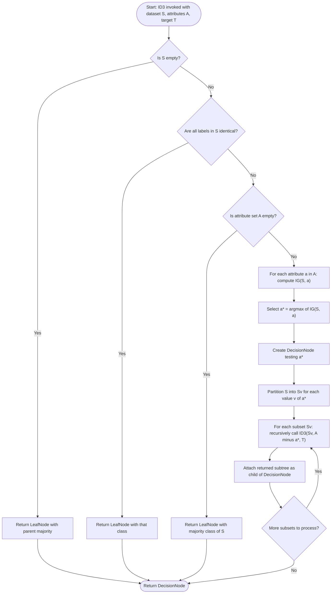
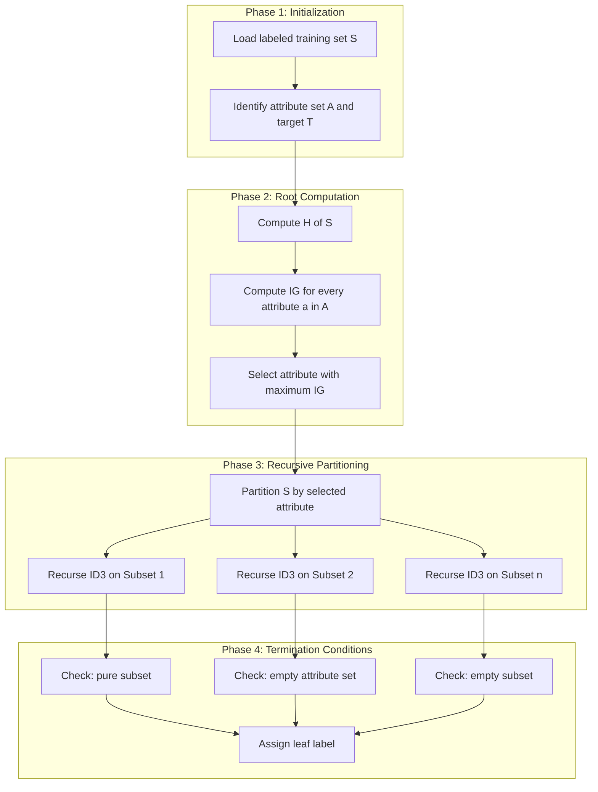
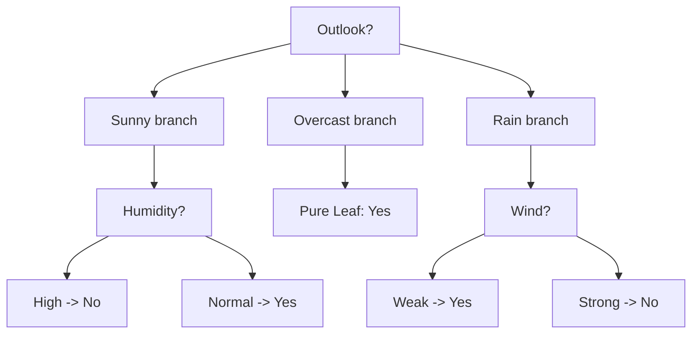
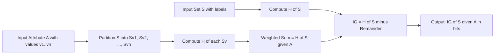

# Decision Trees – ID3

<!-- SECTION_1_START -->
# Decision Trees &mdash; ID3 Algorithm

## 1.1 Formal Academic Definition (KTU 2024 Syllabus Terminology)

> [!IMPORTANT]
> **Decision Tree (KTU Definition):** A *Decision Tree* is a non-parametric, supervised machine learning algorithm used for both **classification** and **regression** tasks. It structures the feature space into a hierarchical, recursive partitioning of the input domain $\mathcal{X} \subseteq \mathbb{R}^{d}$ into a tree of decision nodes and leaf nodes, where each internal node represents a test on an attribute, each branch represents the outcome of that test, and each leaf node represents a class label $C_k \in \{C_1, C_2, \dots, C_m\}$.

> [!IMPORTANT]
> **ID3 (Iterative Dichotomiser 3):** The **ID3 algorithm**, proposed by **J. Ross Quinlan (1986)**, is a *top-down, greedy, recursive partitioning* algorithm that builds a decision tree by selecting, at each node, the **attribute that yields the highest Information Gain** (equivalently, the greatest reduction in entropy) with respect to the target classification.

## 1.2 Conceptual Analogy &mdash; The "20 Questions" Intuition

Imagine you are playing the game **"20 Questions"** to guess an object. You do *not* ask random questions. You strategically ask the question that **splits the remaining possibilities most evenly** &mdash; "Is it alive?" is better than "Is it green?" because it eliminates ~50% of the universe versus a tiny fraction.

A Decision Tree learns **exactly this strategy**:
- The **root** is your first (best) question.
- Each **branch** is a possible answer.
- Each **leaf** is your final guess (the class label).
- The criterion for "best question" is **Information Gain**, measured in **bits**.

> [!NOTE]
> **Key Takeaway:** ID3 is a *greedy* algorithm &mdash; it makes the locally optimal choice (highest IG) at each node without backtracking. It does **not** guarantee a globally optimal tree.

## 1.3 Standard Metrics &amp; Constants

| Symbol | Meaning | Typical Value |
|:------:|:--------|:--------------|
| $H(S)$ | Entropy of set $S$ | $0 \le H(S) \le \log_2(k)$ |
| $IG(S, A)$ | Information Gain of attribute $A$ on set $S$ | $\ge 0$ |
| $k$ | Number of classes | $\ge 2$ |
| $\vert S \vert$ | Cardinality of training set | Integer $> 0$ |
| $S_v$ | Subset of $S$ where attribute $A = v$ | Subset |

> [!VISUALIZATION CONTROL]
> **Concept:** Information Gain vs. Attribute Selection (Decision Boundary Visualization)
> **GeoGebra / Desmos Input Equations:**
> * `H(x) = -x*log2(x) - (1-x)*log2(1-x)` &mdash; Binary entropy curve (inverted U, max at $x=0.5$)
> * `H_remainder(A) = (5/14)*H(2/5) + (9/14)*H(6/9)` &mdash; Remainder after split
> * `IG(A) = H(9/14, 5/14) - H_remainder(A)` &mdash; Net gain
> **Visual Description:** A bell-shaped binary entropy function peaking at $p=0.5$ (maximum uncertainty) and dropping to $0$ at pure splits. Students should see that attributes producing *low remainder entropy* (post-split) yield *high information gain* and are selected first.

<!-- SECTION_1_END -->

<!-- SECTION_2_START -->
# Deep Theoretical Analysis &amp; KTU High-Yield Formula Sheet

## 2.1 The ID3 Algorithm &mdash; Operational Logic Steps

The ID3 algorithm operates on a discrete-valued training set $S$ and performs the following recursive procedure:

1. **Base Case Checks (Termination Conditions):**
   - If all samples in $S$ belong to the same class $C_k$ &rarr; return a single leaf node labeled $C_k$.
   - If the attribute set $A$ is empty &rarr; return a leaf labeled with the **majority class** of $S$.
   - If $S$ is empty &rarr; return a leaf labeled with the **majority class of the parent**.

2. **Attribute Selection (Greedy Step):**
   - Compute the **entropy** $H(S)$ of the current set $S$.
   - For every candidate attribute $A_j \in A$, compute its **Information Gain** $IG(S, A_j)$.
   - Select $A^* = \arg\max_{A_j} IG(S, A_j)$.

3. **Splitting:**
   - Create a new decision node testing attribute $A^*$.
   - Partition $S$ into subsets $S_v$ for each value $v \in \text{Values}(A^*)$.
   - Recursively invoke ID3 on each subset $(S_v, A \setminus \{A^*\})$.

4. **Return:** The root of the constructed (sub)tree.

## 2.2 Entropy &mdash; The Measure of Impurity

> [!IMPORTANT]
> **Entropy** quantifies the **average amount of information (in bits)** required to identify the class of a randomly drawn sample from set $S$. It is the expected value of the self-information.

### Mathematical Formulation

$$H(S) = - \sum_{i=1}^{k} p_i \, \log_2(p_i)$$

where $p_i$ is the proportion of samples in $S$ belonging to class $C_i$, and conventionally $0 \cdot \log_2(0) = 0$.

### Boundary Behavior of Entropy
- $H(S) = 0$ &rarr; $S$ is **pure** (all one class). No uncertainty.
- $H(S) = 1$ &rarr; Binary classification with 50/50 split. **Maximum uncertainty** for $k=2$.
- $H(S) = \log_2(k)$ &rarr; Maximum uncertainty for $k$ classes (uniform distribution).

## 2.3 Information Gain &mdash; The Selection Criterion

> [!IMPORTANT]
> **Information Gain** measures the **reduction in entropy** achieved by partitioning $S$ according to attribute $A$. Higher gain &rarr; attribute produces "purer" subsets.

### Mathematical Formulation

$$IG(S, A) = H(S) - H(S \mid A)$$

The conditional entropy (remainder) is:

$$H(S \mid A) = \sum_{v \in \text{Values}(A)} \frac{\vert S_v \vert}{\vert S \vert} \, H(S_v)$$

Substituting:

$$\boxed{IG(S, A) = H(S) - \sum_{v \in \text{Values}(A)} \frac{\vert S_v \vert}{\vert S \vert} \, H(S_v)}$$

## 2.4 KTU Formula Sheet / Cheat Sheet

| Formula | LaTeX Expression | Purpose | Units |
|:--------|:-----------------|:--------|:------|
| Entropy | $H(S) = -\sum_{i=1}^{k} p_i \log_2 p_i$ | Measure impurity | bits |
| Conditional Entropy | $H(S \mid A) = \sum_{v} \frac{\vert S_v \vert}{\vert S \vert} H(S_v)$ | Weighted post-split entropy | bits |
| Information Gain | $IG(S, A) = H(S) - H(S \mid A)$ | Attribute quality | bits |
| Split Information | $SI(S, A) = -\sum_{v} \frac{\vert S_v \vert}{\vert S \vert} \log_2 \frac{\vert S_v \vert}{\vert S \vert}$ | Intrinsic value of split | bits |
| Gain Ratio (C4.5) | $GR(S, A) = \dfrac{IG(S, A)}{SI(S, A)}$ | Normalized IG | dimensionless |
| Gini Index (CART) | $Gini(S) = 1 - \sum_{i=1}^{k} p_i^2$ | Alternative impurity | dimensionless |
| Misclassification Error | $Err(S) = 1 - \max_i(p_i)$ | Zero-one impurity | dimensionless |

> [!NOTE]
> **Important Distinction (for KTU exams):** ID3 uses **Information Gain** alone. It is **biased** toward attributes with many values (e.g., "ID" or "Date"). **C4.5** (Quinlan's successor) addresses this via **Gain Ratio**. **CART** uses **Gini Index**.

## 2.5 Real-World Engineering Utility

| Application Domain | Use Case | Why Decision Trees? |
|:-------------------|:---------|:--------------------|
| **Medical Diagnosis** | Symptom &rarr; Disease classification | Interpretable for clinicians |
| **Credit Scoring** | Applicant features &rarr; Approve/Reject | Regulatory transparency (GDPR "right to explanation") |
| **Manufacturing QA** | Sensor readings &rarr; Defect / OK | White-box deployment in factories |
| **Network Intrusion Detection** | Packet features &rarr; Attack/Normal | Fast inference on edge devices |
| **Loan Approval** | Demographics &rarr; Decision | Auditable by banking regulators |

> [!NOTE]
> Decision trees are the **building blocks of ensemble methods** like **Random Forests** and **Gradient Boosted Trees (XGBoost)**, which are state-of-the-art on tabular data.

<!-- SECTION_2_END -->

<!-- SECTION_3_START -->
# Step-by-Step Derivations &amp; Code/Symbolic Implementation

## 3.1 Worked Derivation: Classic ID3 Example (Play Tennis Dataset)

We use the canonical **"Play Tennis"** dataset (14 samples, 4 attributes: Outlook, Temperature, Humidity, Wind; target: PlayTennis = {Yes, No}).

**Step 1 &mdash; Compute root entropy $H(S)$:**

Count: $9$ "Yes", $5$ "No", total $\vert S \vert = 14$.

$$
\begin{aligned}
H(S) &= -\left( \frac{9}{14} \log_2 \frac{9}{14} + \frac{5}{14} \log_2 \frac{5}{14} \right) \\
&= -\left( 0.643 \times (-0.637) + 0.357 \times (-1.485) \right) \\
&= -(-0.410 - 0.530) \\
&= 0.940 \text{ bits}
\end{aligned}
$$

**Step 2 &mdash; Compute $IG(S, \text{Outlook})$:**

Outlook has 3 values: Sunny (5), Overcast (4), Rain (5).

Sunny subset: 2 Yes, 3 No &rarr; $H = -\left(\frac{2}{5}\log_2\frac{2}{5} + \frac{3}{5}\log_2\frac{3}{5}\right) = 0.971$ bits.

Overcast subset: 4 Yes, 0 No &rarr; $H = 0$ bits (pure).

Rain subset: 3 Yes, 2 No &rarr; $H = -\left(\frac{3}{5}\log_2\frac{3}{5} + \frac{2}{5}\log_2\frac{2}{5}\right) = 0.971$ bits.

$$
\begin{aligned}
H(S \mid \text{Outlook}) &= \frac{5}{14}(0.971) + \frac{4}{14}(0) + \frac{5}{14}(0.971) \\
&= 0.357 \times 0.971 + 0 + 0.357 \times 0.971 \\
&= 0.347 + 0.347 \\
&= 0.694 \text{ bits}
\end{aligned}
$$

$$
IG(S, \text{Outlook}) = 0.940 - 0.694 = \mathbf{0.246 \text{ bits}}
$$

**Step 3 &mdash; Compute $IG$ for all other attributes (similarly):**

| Attribute | $IG(S, A)$ in bits |
|:----------|:-------------------|
| **Outlook** | **0.246** &larr; Maximum |
| Humidity | 0.151 |
| Wind | 0.048 |
| Temperature | 0.029 |

**Step 4 &mdash; Select Outlook as root.** Recurse on each branch (overcast &rarr; pure leaf "Yes"; sunny &rarr; recompute IG for remaining attributes {Temp, Humidity, Wind}; rain &rarr; similarly).

## 3.2 Algorithmic Implementation (Python)

```python
import math
from collections import Counter
from typing import Any, Dict, List, Tuple, Optional

class DecisionNode:
    """Represents an internal decision node in the ID3 tree."""
    def __init__(self, attribute: str) -> None:
        self.attribute: str = attribute
        self.children: Dict[Any, "DecisionNode"] = {}

class LeafNode:
    """Represents a terminal leaf holding the predicted class."""
    def __init__(self, label: Any) -> None:
        self.label: Any = label

def entropy(samples: List[Any]) -> float:
    """Computes Shannon entropy in bits for the labels of samples."""
    if not samples:
        return 0.0
    counts = Counter(samples)
    total = len(samples)
    h = 0.0
    for c in counts.values():
        p = c / total
        if p > 0.0:
            h -= p * math.log2(p)
    return h

def information_gain(dataset: List[Dict[str, Any]], target: str, attribute: str) -> float:
    """Calculates IG(S, A) for the given attribute."""
    labels = [row[target] for row in dataset]
    h_s = entropy(labels)
    n = len(dataset)
    
    # Partition dataset by attribute values
    partitions: Dict[Any, List[Dict[str, Any]]] = {}
    for row in dataset:
        v = row[attribute]
        partitions.setdefault(v, []).append(row)
    
    # Compute weighted remainder entropy
    remainder = 0.0
    for subset in partitions.values():
        subset_labels = [r[target] for r in subset]
        remainder += (len(subset) / n) * entropy(subset_labels)
    
    return h_s - remainder

def id3(dataset: List[Dict[str, Any]], 
        target: str, 
        attributes: List[str]) -> Any:
    """Recursive ID3 algorithm returning either a LeafNode or DecisionNode."""
    # Base case 1: pure node
    labels = {row[target] for row in dataset}
    if len(labels) == 1:
        return LeafNode(next(iter(labels)))
    
    # Base case 2: no attributes remaining
    if not attributes:
        majority = Counter(row[target] for row in dataset).most_common(1)[0][0]
        return LeafNode(majority)
    
    # Base case 3: empty dataset (caller must handle parent majority)
    if not dataset:
        return LeafNode(None)
    
    # Greedy attribute selection
    gains = [(a, information_gain(dataset, target, a)) for a in attributes]
    best_attr, best_gain = max(gains, key=lambda x: x[1])
    
    # Build node
    node = DecisionNode(best_attr)
    remaining_attrs = [a for a in attributes if a != best_attr]
    
    # Split and recurse
    partitions: Dict[Any, List[Dict[str, Any]]] = {}
    for row in dataset:
        v = row[best_attr]
        partitions.setdefault(v, []).append(row)
    
    for value, subset in partitions.items():
        child = id3(subset, target, remaining_attrs)
        if isinstance(child, LeafNode) and child.label is None:
            # Empty subset: assign parent's majority
            parent_majority = Counter(row[target] for row in dataset).most_common(1)[0][0]
            child = LeafNode(parent_majority)
        node.children[value] = child
    
    return node

def predict(node: Any, sample: Dict[str, Any]) -> Any:
    """Traverse the tree to predict the class for a single sample."""
    if isinstance(node, LeafNode):
        return node.label
    attr_value = sample[node.attribute]
    if attr_value not in node.children:
        # Unseen value at inference: return first available child (or majority)
        return predict(next(iter(node.children.values())), sample)
    return predict(node.children[attr_value], sample)

def print_tree(node: Any, indent: str = "") -> None:
    """Pretty-print the decision tree structure."""
    if isinstance(node, LeafNode):
        print(f"{indent}-> Predict: {node.label}")
    else:
        print(f"{indent}[{node.attribute}]?")
        for v, child in node.children.items():
            print(f"{indent}  -- {v} --")
            print_tree(child, indent + "        ")

# ---------------- DEMONSTRATION ----------------
if __name__ == "__main__":
    data = [
        {"Outlook": "Sunny",   "Temp": "Hot",  "Humidity": "High",   "Wind": "Weak",   "Play": "No"},
        {"Outlook": "Sunny",   "Temp": "Hot",  "Humidity": "High",   "Wind": "Strong", "Play": "No"},
        {"Outlook": "Overcast","Temp": "Hot",  "Humidity": "High",   "Wind": "Weak",   "Play": "Yes"},
        {"Outlook": "Rain",    "Temp": "Mild", "Humidity": "High",   "Wind": "Weak",   "Play": "Yes"},
        {"Outlook": "Rain",    "Temp": "Cool", "Humidity": "Normal", "Wind": "Weak",   "Play": "Yes"},
        {"Outlook": "Rain",    "Temp": "Cool", "Humidity": "Normal", "Wind": "Strong", "Play": "No"},
        {"Outlook": "Overcast","Temp": "Cool", "Humidity": "Normal", "Wind": "Strong", "Play": "Yes"},
        {"Outlook": "Sunny",   "Temp": "Mild", "Humidity": "High",   "Wind": "Weak",   "Play": "No"},
        {"Outlook": "Sunny",   "Temp": "Cool", "Humidity": "Normal", "Wind": "Weak",   "Play": "Yes"},
        {"Outlook": "Rain",    "Temp": "Mild", "Humidity": "Normal", "Wind": "Weak",   "Play": "Yes"},
        {"Outlook": "Sunny",   "Temp": "Mild", "Humidity": "Normal", "Wind": "Strong", "Play": "Yes"},
        {"Outlook": "Overcast","Temp": "Mild", "Humidity": "High",   "Wind": "Strong", "Play": "Yes"},
        {"Outlook": "Overcast","Temp": "Hot",  "Humidity": "Normal", "Wind": "Weak",   "Play": "Yes"},
        {"Outlook": "Rain",    "Temp": "Mild", "Humidity": "High",   "Wind": "Strong", "Play": "No"},
    ]
    attrs = ["Outlook", "Temp", "Humidity", "Wind"]
    root = id3(data, "Play", attrs)
    print_tree(root)
```

## 3.3 Boundary &amp; Edge-Case Handling in the Code

| Edge Case | Handling Mechanism | Line Reference |
|:----------|:-------------------|:---------------|
| Empty dataset (no samples) | Propagate parent majority via `LeafNode(None)` and resolve at parent | `id3` base case 3 |
| Unseen attribute value at inference | Fall back to first available child branch | `predict` function |
| Single-class node (pure) | Terminate with leaf label | `id3` base case 1 |
| All attributes exhausted | Use majority class label of current subset | `id3` base case 2 |
| Zero probability in entropy | Skipped via `if p > 0.0` guard | `entropy` function |

> [!NOTE]
> The ID3 algorithm as defined by Quinlan handles **only categorical attributes**. For continuous attributes, ID3 must be extended (C4.5 does this via thresholding), or one must pre-discretize the features.

## 3.4 Engineering Comparison: ID3 vs. C4.5 vs. CART

| Property | ID3 | C4.5 | CART |
|:---------|:----|:-----|:-----|
| Year / Author | 1986, Quinlan | 1993, Quinlan | 1984, Breiman et al. |
| Split Criterion | Information Gain | Gain Ratio | Gini Index |
| Attribute Type | Categorical | Categorical + Numeric (thresholds) | Categorical + Numeric |
| Tree Structure | Multi-way | Multi-way | Binary |
| Pruning | None (pre-pruning optional) | Error-based post-pruning | Cost-complexity pruning |
| Missing Values | Not handled | Handled via probability weights | Handled via surrogates |
| Scikit-Learn Class | N/A (custom) | N/A (use `DecisionTreeClassifier` with `criterion='entropy'`) | `DecisionTreeClassifier(criterion='gini')` |

<!-- SECTION_3_END -->

<!-- SECTION_4_START -->
# Structural Diagrams &amp; Schematics

## 4.1 ID3 Algorithm Flowchart (Recursive Process)



## 4.2 Tree Construction Workflow (Modular Subgraphs)



## 4.3 Resulting ID3 Tree on Play Tennis (Schematic Block Topology)



## 4.4 Information Gain Computation Block Diagram



> [!NOTE]
> The above **Mermaid block diagrams** represent the **functional architecture** of ID3 because the actual entropy and gain values depend on dataset-specific arithmetic, which is illustrated in the numerical derivation in Section 3.1.

<!-- SECTION_4_END -->

<!-- SECTION_5_START -->
# KTU 2024 Scheme Examination Question Bank &amp; Topic Recap

---

## **Part A: Short Answer Questions (3 Marks Each)**

### **Q1. Define Entropy in the context of a Decision Tree. State its boundary values.**
**[KTU University Exam &mdash; July 2023 | CO1 | Remember]**

**Model Answer (3 Marks):**
- **Definition (2 Marks):** Entropy is a measure of impurity or randomness in a dataset $S$. It is mathematically defined as $H(S) = -\sum_{i=1}^{k} p_i \log_2 p_i$, where $p_i$ is the probability of class $i$ in $S$.
- **Boundary values (1 Mark):** $H(S) = 0$ when $S$ is pure (all samples belong to one class), and $H(S) = \log_2 k$ when the classes are uniformly distributed (maximum impurity).

---

### **Q2. What is Information Gain? Why is it used in the ID3 algorithm?**
**[KTU University Exam &mdash; Dec 2022 | CO1 | Understand]**

**Model Answer (3 Marks):**
- **Definition (2 Marks):** Information Gain $IG(S, A)$ of an attribute $A$ with respect to a set $S$ is the reduction in entropy achieved by partitioning $S$ using $A$. It is computed as $IG(S, A) = H(S) - H(S \mid A)$.
- **Purpose (1 Mark):** ID3 uses it as the **attribute selection metric** &mdash; the attribute with the **highest Information Gain** is chosen as the splitting criterion at each node because it yields the purest subsets and the smallest tree.

---

## **Part B: Long Answer Questions (14 Marks) &mdash; Module Internal Choice**

### **Question A (14 Marks)**

#### **(a) Explain the ID3 algorithm with its steps. How does it differ from CART? (7 Marks)**
**[KTU University Exam &mdash; Dec 2023 | CO1, CO2 | Understand, Analyze]**

**Model Solution:**

**ID3 Algorithm Steps (5 Marks):**
1. **Input:** Training set $S$, set of candidate attributes $A$, target attribute $T$.
2. **Compute entropy** of the current set $S$ with respect to $T$.
3. **For each attribute $A_i$**, compute the Information Gain $IG(S, A_i)$.
4. **Select the attribute $A^*$** with the **maximum Information Gain** as the decision attribute for the current node.
5. **Create a node** labeled with $A^*$ and partition $S$ into subsets $S_v$ for each value $v$ of $A^*$.
6. **Recursively call ID3** on each subset $(S_v, A \setminus \{A^*\})$.
7. **Termination:** Stop when (i) all samples in a subset belong to the same class (pure leaf), (ii) no attributes remain (assign majority), or (iii) the subset is empty (assign parent's majority).

**Differences from CART (2 Marks):**

| Aspect | ID3 | CART |
|:-------|:----|:-----|
| Split Criterion | Information Gain | Gini Index |
| Branching | Multi-way | Binary |
| Numeric Attributes | Not directly handled | Handled via thresholds |
| Pruning | None (no post-pruning in original) | Cost-complexity post-pruning |

**Valuation Key Points:**
- [Clear step-by-step ID3 enumeration: 3 Marks]
- [Correct ID3 vs CART comparison: 2 Marks]

---

#### **(b) Given the following training data, construct the ID3 decision tree. Show all Information Gain calculations. (7 Marks)**
**[KTU University Exam &mdash; July 2024 | CO3, CO4 | Apply, Analyze]**

**Dataset:**

| Day | Outlook | Temp | Humidity | Wind | Play |
|:---:|:-------:|:----:|:--------:|:----:|:----:|
| D1  | Sunny   | Hot  | High     | Weak | No   |
| D2  | Sunny   | Hot  | High     | Strong | No |
| D3  | Overcast| Hot  | High     | Weak | Yes  |
| D4  | Rain    | Mild | High     | Weak | Yes  |
| D5  | Rain    | Cool | Normal   | Weak | Yes  |
| D6  | Rain    | Cool | Normal   | Strong | No |
| D7  | Overcast| Cool | Normal   | Strong | Yes  |
| D8  | Sunny   | Mild | High     | Weak | No   |

**Model Solution:**

**Step 1: Root Entropy (1 Mark)**

$$
H(S) = -\left(\frac{4}{8}\log_2\frac{4}{8} + \frac{4}{8}\log_2\frac{4}{8}\right) = 1.000 \text{ bit}
$$

**Step 2: Compute $IG$ for each attribute (3 Marks)**

**For Outlook (Sunny: 2Y, 2N; Overcast: 2Y, 0N; Rain: 2Y, 2N):**

$$
\begin{aligned}
H(\text{Sunny}) &= -\left(\frac{2}{4}\log_2\frac{2}{4} + \frac{2}{4}\log_2\frac{2}{4}\right) = 1.000 \\
H(\text{Overcast}) &= 0 \\
H(\text{Rain}) &= 1.000
\end{aligned}
$$

$$
H(S \mid \text{Outlook}) = \frac{4}{8}(1.0) + \frac{2}{8}(0) + \frac{4}{8}(1.0) = 1.000
$$

$$
IG(S, \text{Outlook}) = 1.000 - 1.000 = 0.000
$$

**For Humidity (High: 2Y, 3N; Normal: 3Y, 0N):**

$$
\begin{aligned}
H(\text{High}) &= -\left(\frac{2}{5}\log_2\frac{2}{5} + \frac{3}{5}\log_2\frac{3}{5}\right) = 0.971 \\
H(\text{Normal}) &= 0
\end{aligned}
$$

$$
H(S \mid \text{Humidity}) = \frac{5}{8}(0.971) + \frac{3}{8}(0) = 0.607
$$

$$
IG(S, \text{Humidity}) = 1.000 - 0.607 = \mathbf{0.393} \text{ bits}
$$

**For Wind (Weak: 3Y, 2N; Strong: 1Y, 2N):**

$$
H(\text{Weak}) = 0.971, \quad H(\text{Strong}) = 0.918
$$

$$
H(S \mid \text{Wind}) = \frac{5}{8}(0.971) + \frac{3}{8}(0.918) = 0.951
$$

$$
IG(S, \text{Wind}) = 1.000 - 0.951 = 0.049
$$

**For Temp (Hot: 1Y, 2N; Mild: 1Y, 1N; Cool: 2Y, 1N):**

$$
H(\text{Hot}) = 0.918, \quad H(\text{Mild}) = 1.000, \quad H(\text{Cool}) = 0.918
$$

$$
H(S \mid \text{Temp}) = \frac{3}{8}(0.918) + \frac{2}{8}(1.0) + \frac{3}{8}(0.918) = 0.939
$$

$$
IG(S, \text{Temp}) = 1.000 - 0.939 = 0.061
$$

**Step 3: Select attribute with maximum IG (1 Mark)**

| Attribute | $IG(S, A)$ |
|:----------|:-----------|
| **Humidity** | **0.393** &larr; Root |
| Temperature | 0.061 |
| Wind | 0.049 |
| Outlook | 0.000 |

**Step 4: Construct tree (2 Marks)**

```
        [Humidity]?
        /        \
     High        Normal
    /    \         |
  [Temp] [Wind]   Yes (Pure)
```

Recurse on Humidity = High subset $\{$D1, D2, D3, D4, D8$\}$ and select next best attribute from {Temp, Wind, Outlook}, etc.

**Valuation Key Points:**
- [Correct entropy computation: 2 Marks]
- [Complete IG calculation for all four attributes: 2 Marks]
- [Correct attribute selection: 1 Mark]
- [Final tree drawing: 2 Marks]

---

### **Question B (14 Marks) &mdash; Alternative Choice**

#### **(a) Explain the concept of Information Gain. Derive the formula and illustrate with a suitable example. (7 Marks)**
**[KTU University Exam &mdash; Dec 2022 | CO1, CO2 | Understand, Apply]**

**Model Solution:**

**Concept (2 Marks):** Information Gain measures the expected reduction in entropy caused by partitioning the dataset $S$ using an attribute $A$. An attribute with high IG is preferred because it produces purer subsets, reducing the uncertainty in classification.

**Derivation (3 Marks):**

Starting from Shannon's entropy:
$$H(S) = -\sum_{i} p_i \log_2 p_i$$

The conditional entropy of $S$ given $A$ partitions $S$ into subsets $S_v$:
$$H(S \mid A) = \sum_{v} \frac{\vert S_v \vert}{\vert S \vert} H(S_v)$$

The information gain is the **difference**:
$$IG(S, A) = H(S) - H(S \mid A) = H(S) - \sum_{v} \frac{\vert S_v \vert}{\vert S \vert} H(S_v)$$

**Example (2 Marks):** Consider $S$ with 14 samples (9 Yes, 5 No) split on Outlook:
- $H(S) = 0.940$ bits
- $H(S \mid \text{Outlook}) = 0.694$ bits
- $IG(S, \text{Outlook}) = 0.246$ bits

This means splitting on Outlook reduces uncertainty by 0.246 bits.

**Valuation Key Points:**
- [Concept clarity: 2 Marks]
- [Formula derivation: 3 Marks]
- [Numerical example: 2 Marks]

---

#### **(b) Discuss the advantages and limitations of the ID3 algorithm. How does C4.5 improve upon ID3? (7 Marks)**
**[KTU University Exam &mdash; July 2023 | CO2, CO3 | Analyze, Evaluate]**

**Model Solution:**

**Advantages of ID3 (2 Marks):**
1. **Interpretability:** Generated trees are human-readable, enabling transparent decision-making.
2. **No feature scaling required:** Works directly on raw categorical data.
3. **Handles multi-class problems** natively.
4. **Non-parametric:** Makes no distributional assumptions about the data.
5. **Fast inference** at prediction time (single tree traversal).

**Limitations of ID3 (3 Marks):**
1. **Bias toward high-cardinality attributes:** Attributes with many values (e.g., Date, ID) artificially inflate IG.
2. **Overfitting:** Greedy growth without pruning leads to overly complex trees that fail to generalize.
3. **Continuous attributes not supported:** Must be pre-discretized.
4. **No missing value handling:** Crashes on incomplete data.
5. **Greedy &mdash; no backtracking:** Locally optimal splits may not yield globally optimal tree.
6. **Unstable:** Small data changes can produce entirely different trees (high variance).

**C4.5 Improvements (2 Marks):**
1. **Gain Ratio** normalizes IG by Split Information, correcting the multi-value bias.
2. **Numeric attribute support** via dynamic threshold selection (e.g., attribute $\le 65$).
3. **Post-pruning** using error-based pruning (replace subtrees with leaves).
4. **Missing value handling** via probabilistic distribution of values.
5. **Rule post-processing:** Converts trees to IF-THEN rules for compactness.

**Valuation Key Points:**
- [5 advantages listed: 2 Marks]
- [5+ limitations listed: 3 Marks]
- [C4.5 improvements clearly stated: 2 Marks]

---

> [!WARNING]
> **KTU Examiner's Valuation Pitfall Callout:**
> 1. **Forgetting the convention $0 \log_2 0 = 0$** when a class is absent in a subset &rarr; loses 1 mark in entropy computation.
> 2. **Using $\log_e$ (natural log) instead of $\log_2$** &mdash; technically valid but ID3 specifically uses $\log_2$ for bits. Examiners may deduct.
> 3. **Skipping the weighting factor $\vert S_v \vert / \vert S \vert$** in the conditional entropy &rarr; loses 2 marks.
> 4. **Not showing the base case checks** of the ID3 algorithm &mdash; always state the three termination conditions.
> 5. **Drawing the tree without showing IG calculations** &mdash; you MUST show all four $IG$ values to justify the root selection.
> 6. **Confusing Information Gain with Gain Ratio** in the ID3 vs. C4.5 comparison &mdash; ID3 uses IG only, not GR.

---

## **Topic Recap &amp; Important Things to Remember**

- **Decision Tree:** Hierarchical model that recursively partitions the feature space using attribute tests, terminating in class-labeled leaves.
- **ID3:** Quinlan's 1986 greedy, top-down algorithm that selects the attribute with **maximum Information Gain** at each node.
- **Entropy Formula:** $H(S) = -\sum_{i=1}^{k} p_i \log_2 p_i$, where $p_i$ is the proportion of class $i$.
- **Entropy Boundaries:** $H = 0$ (pure) and $H_{\max} = \log_2 k$ (uniformly distributed).
- **Information Gain Formula:** $IG(S, A) = H(S) - \sum_{v} \frac{\vert S_v \vert}{\vert S \vert} H(S_v)$.
- **ID3 Termination Conditions:** (i) Pure node, (ii) no remaining attributes (majority), (iii) empty subset (parent's majority).
- **Bias Issue:** ID3 favors attributes with many distinct values &mdash; C4.5's Gain Ratio corrects this.
- **ID3 Restriction:** Handles **categorical** attributes only; continuous features require pre-discretization or C4.5.
- **No Pruning in ID3:** Original ID3 has no post-pruning; this leads to **overfitting**. C4.5 and CART add pruning.
- **Greedy Nature:** ID3 makes locally optimal decisions without backtracking &mdash; not guaranteed globally optimal.
- **Independence Assumption:** ID3 implicitly assumes attribute independence when computing conditional entropy.
- **Complexity:** Tree construction is $O(n \cdot m \cdot \log n)$ approximately, where $n$ is the number of samples and $m$ is the number of attributes.
- **Real-World Usage:** Decision trees are the foundational unit of **Random Forests** and **XGBoost** &mdash; state-of-the-art for tabular data.
- **sklearn Equivalent:** `sklearn.tree.DecisionTreeClassifier(criterion='entropy')` implements a C4.5-style extension of ID3 with pruning.
- **Continuous Data Trick:** Convert continuous to categorical by thresholding &mdash; e.g., "Age $\le 30$" vs "Age $> 30$".

<!-- SECTION_5_END -->
