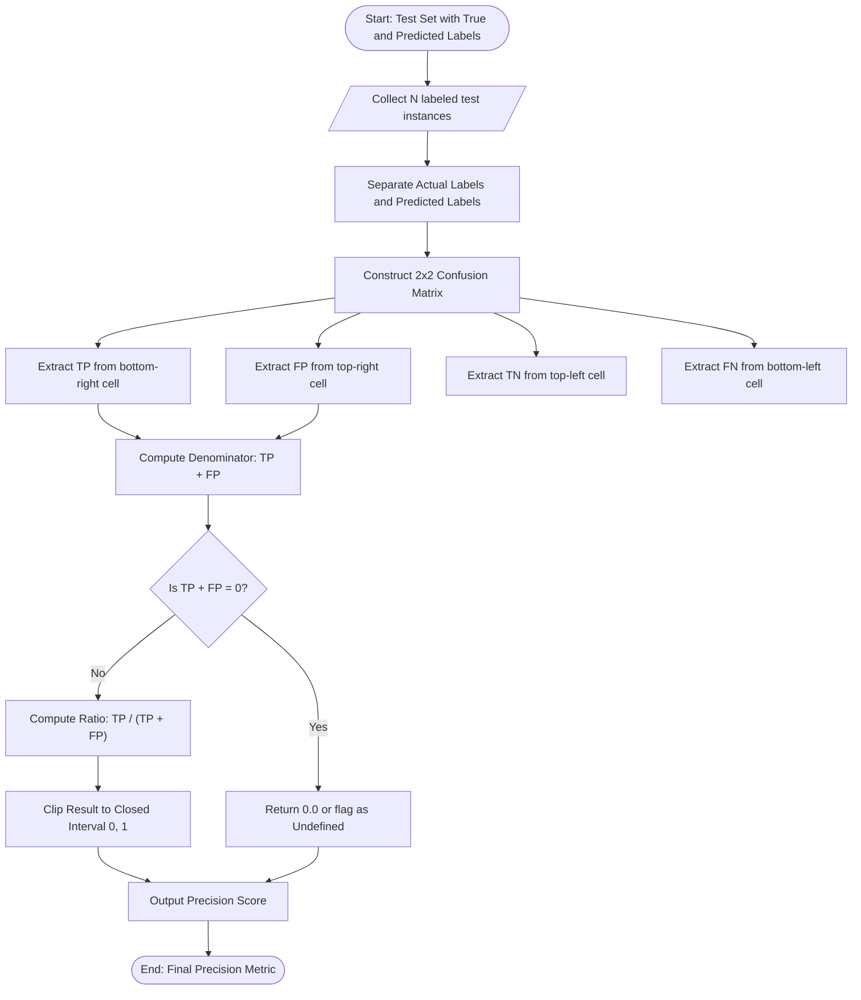
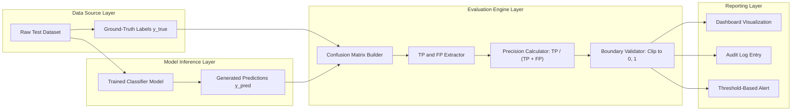
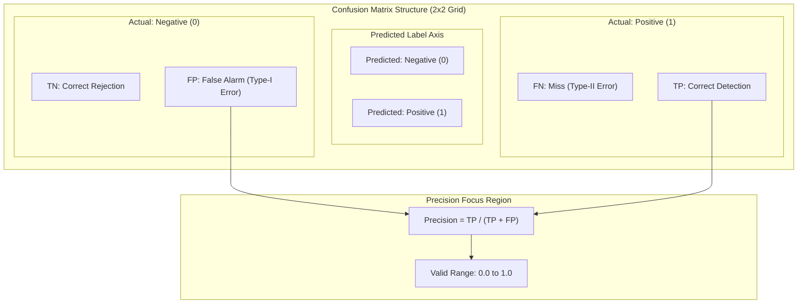

# Evaluation measures – Classification - Precision

<!-- SECTION_1_START -->
# Evaluation Measures in Classification — Precision

## 1. Formal Academic Definition (KTU 2024 Syllabus Terminology)

> [!IMPORTANT]
> **Precision** is a fundamental **performance evaluation metric** for **classification models** that quantifies the *quality* of positive predictions made by a classifier. Formally, it is defined as the ratio of **True Positives (TP)** to the **total number of positive predictions** (i.e., the sum of True Positives and False Positives).

In the KTU 2024 Scheme Machine Learning syllabus (Course Code: **PCCST503**, Module 2 — Classification), precision is treated as a **class-specific evaluation measure** that addresses the central question:

> *"Out of all the instances that the model labeled as positive, how many were actually positive?"*

Mathematically, the canonical definition is expressed as:

$$
\text{Precision} = \frac{TP}{TP + FP}
$$

where the symbols carry the following operational meanings under the **KTU Revised Bloom's Taxonomy cognitive framework (Remember/Understand level)**:

| Symbol | Full Form | Operational Meaning |
| :--- | :--- | :--- |
| $TP$ | **True Positives** | Positive instances correctly predicted as positive. |
| $FP$ | **False Positives** | Negative instances incorrectly predicted as positive (Type-I Error). |
| $TN$ | **True Negatives** | Negative instances correctly predicted as negative. |
| $FN$ | **False Negatives** | Positive instances incorrectly predicted as negative (Type-II Error). |

The value of precision always lies in the closed interval $\left[0, 1\right]$, with the ideal classifier achieving a precision value of **1.0**, and a completely unreliable positive-class predictor yielding **0.0**.

## 2. Conceptual Analogy & Intuitive Overview

> [!NOTE]
> **Precision vs. Recall Analogy: The Arrows and the Target**

Imagine you are an **archery competitor** in the KTU Inter-College Sports Meet. The judge hands you $N$ arrows and asks you to hit the bullseye.

- **Precision** answers: *"Of all the arrows you shot at the target, how many actually hit the bullseye?"* — It is the *purity* of your positive attempts.
- **Recall** (the complementary metric) answers: *"Of all the bullseyes available on the target, how many did you actually hit?"* — It is the *coverage* of your positive attempts.

In this analogy, **False Positives are the arrows you fired that missed the bullseye** (i.e., wasted positive predictions), while **True Positives are the arrows that hit the bullseye accurately**. A high-precision archer wastes very few arrows.

### Real-World Domain Mapping (Engineering Context)

> [!TIP]
> **When does a Machine Learning engineer care about Precision?**
> - **Spam Email Filtering**: Of all the emails flagged as "spam," how many are *actually* spam? A high precision prevents legitimate emails (ham) from being wrongly dumped into the spam folder.
> - **Medical Cancer Screening (Confirmation Test)**: Of all the patients flagged as "cancer-positive" by the screening test, how many actually have the disease? High precision avoids unnecessary biopsies.
> - **Recommendation Systems**: Of all the products recommended as "relevant" to a user, how many are genuinely relevant? High precision improves user trust and click-through rates.
> - **Search Engine Ranking (Top-K Results)**: Of the top 10 search results, how many are truly relevant to the query?

In each of these scenarios, the **cost of a False Positive is high** — and hence **Precision becomes the critical metric** for model selection.

> [!WARNING]
> **KTU Common Misconception**: Precision is *not* the same as **Accuracy**. Accuracy measures overall correctness across *all* classes, whereas Precision is *class-specific* and focuses exclusively on the reliability of the positive class predictions. Do not interchange these terms in board examinations.

## 3. Geometric & Visual Intuition — Confusion Matrix Coordinates

> [!VISUALIZATION CONTROL]
> **Concept:** Confusion Matrix Layout for Binary Classification with Precision Geometry
> **GeoGebra / Desmos Input Equations:**
> * `x-axis: Predicted Label (0 = Negative, 1 = Positive)`
> * `y-axis: Actual Label (0 = Negative, 1 = Positive)`
> * `Points: (0,0) -> TN, (0,1) -> FN, (1,0) -> FP, (1,1) -> TP`
> * `Highlight region: Column x=1 (Predicted Positive) = TP + FP`
> * `Precision = TP / (TP + FP) = height_of_TP / total_column_height`
> **Visual Description:** On a 2x2 grid, observe that Precision is the **vertical fraction of the "Predicted = Positive" column that correctly corresponds to "Actual = Positive" rows**. A tall blue block (TP) sitting on a short red block (FP) yields high precision; a short blue block on a tall red block yields low precision.

<!-- SECTION_1_END -->

<!-- SECTION_2_START -->
# Deep Theoretical Analysis & KTU High-Yield Formula Sheet

## 1. Deconstructing Precision — Structured Logical Breakdown

Precision is derived from the **Confusion Matrix** (also called the *Error Matrix* or *Contingency Table*), which is the foundational diagnostic tool in supervised classification evaluation. Let us dissect the operational logic step-by-step:

### Step 1: Construct the Confusion Matrix
A binary classifier produces four mutually exclusive outcomes on a labeled test set of $N$ instances. These are arranged in a 2x2 matrix indexed by the *Predicted Label* (column) and the *Actual Label* (row):

$$
\text{Confusion Matrix} = \begin{bmatrix} TN & FP \\ FN & TP \end{bmatrix}
$$

### Step 2: Identify the "Predicted Positive" Column
Since precision is concerned *only* with the quality of the positive predictions, we focus our attention on the **rightmost column** of the confusion matrix (the column where *Predicted = Positive*). This column contains exactly two entries:

- $TP$ — correctly predicted positives
- $FP$ — incorrectly predicted positives

### Step 3: Sum the Column
The **total number of positive predictions** is simply the sum of these two entries:

$$
\text{Total Positive Predictions} = TP + FP
$$

### Step 4: Form the Ratio
Precision is then computed as the fraction:

$$
\text{Precision} = \frac{TP}{TP + FP}
$$

> [!IMPORTANT]
> **Why This Ratio is Intuitive**: The denominator $(TP + FP)$ represents *everything the model claimed was positive* (both its correct claims and its mistakes). The numerator $TP$ represents *only the correct claims*. Therefore, the ratio gives the *probability that a randomly selected positive prediction is actually correct*, given the classifier's output. This is the frequentist interpretation aligned with the **conditional probability** $P(\text{Actual} = + \mid \text{Predicted} = +)$.

## 2. KTU Formula Sheet / Cheat Sheet

The following markdown table consolidates all high-yield formulas, conditions, and engineering utilities required for KTU 2024 Scheme Machine Learning examinations on this topic. **Note:** All set-theoretic notations (such as intersections) and absolute-value bars are escaped using `\mid` to preserve table syntax integrity.

| **#** | **Concept** | **Formula / Definition** | **Range** | **Engineering Use Case** |
| :---: | :--- | :--- | :---: | :--- |
| 1 | Precision (Binary) | $\text{Precision} = \dfrac{TP}{TP + FP}$ | $[0, 1]$ | Spam detection, fraud alerting |
| 2 | Precision (Multi-class, Macro) | $\text{Precision}_{\text{macro}} = \dfrac{1}{K}\sum_{i=1}^{K} \dfrac{TP_i}{TP_i + FP_i}$ | $[0, 1]$ | Balanced multi-class datasets |
| 3 | Precision (Multi-class, Micro) | $\text{Precision}_{\text{micro}} = \dfrac{\sum_i TP_i}{\sum_i (TP_i + FP_i)}$ | $[0, 1]$ | Imbalanced multi-class datasets |
| 4 | Precision (Weighted) | $\text{Precision}_{\text{weighted}} = \sum_{i=1}^{K} w_i \cdot \text{Precision}_i$ | $[0, 1]$ | Class-frequency-aware evaluation |
| 5 | Set-Theoretic Form | $\text{Precision} = \dfrac{\mid \text{Relevant} \cap \text{Retrieved} \mid}{\mid \text{Retrieved} \mid}$ | $[0, 1]$ | Information Retrieval systems |
| 6 | Edge Case: No Positive Predictions | Undefined (0/0) — typically reported as **0.0** | N/A | Classifier predicts only negatives |
| 7 | Edge Case: All Positive Correct | $TP = TP + FP \Rightarrow \text{Precision} = 1.0$ | $\{1\}$ | Perfect positive-class purity |
| 8 | Edge Case: All Positive Wrong | $TP = 0 \Rightarrow \text{Precision} = 0.0$ | $\{0\}$ | Complete failure on positive class |
| 9 | Relationship to Recall | Independent metrics (no algebraic equality) | N/A | Joint analysis via F1-Score |
| 10 | F1-Score (Harmonic Mean) | $F_1 = \dfrac{2 \cdot \text{Precision} \cdot \text{Recall}}{\text{Precision} + \text{Recall}}$ | $[0, 1]$ | Single-metric trade-off summary |

> [!NOTE]
> **KTU Board Pattern Alert**: For multi-class classification, students are frequently asked to compute *macro-averaged* precision. Ensure you compute per-class precision first, then take the unweighted arithmetic mean across all $K$ classes. Do not confuse this with *micro-averaged* precision, which pools the confusion matrices first and then computes a single global ratio.

## 3. Real-World Engineering Utility

Precision is the **go-to metric** in any production ML system where the **cost of a False Positive is asymmetrically higher** than the cost of a False Negative. Let us enumerate the high-impact domains:

### Domain 1: Cybersecurity and Intrusion Detection
When a network intrusion detection system (NIDS) flags a packet as malicious, a False Positive means a *legitimate packet is dropped*, degrading user experience. A high-precision NIDS minimizes such disruptions.

### Domain 2: Healthcare and Diagnostics
A False Positive in an HIV screening test would cause severe psychological distress and unnecessary follow-up procedures. Precision is prioritized at the *screening* stage, while Recall is prioritized at the *diagnosis* stage.

### Domain 3: Financial Credit Risk
When a bank flags a transaction as "fraudulent," a False Positive inconveniences a genuine customer. High precision reduces the false-alarm rate in fraud detection systems.

### Domain 4: Document Classification and Information Retrieval
In legal-tech applications where a precision-focused search engine returns only the most relevant case laws, missing a relevant document is less costly than overwhelming the lawyer with irrelevant results.

> [!TIP]
> **Trade-off Principle**: Increasing precision typically *decreases* recall (and vice versa). This is the famous **Precision-Recall Trade-off**, controlled by adjusting the classifier's **decision threshold** $\tau$. As $\tau \to 1.0$, the model becomes more conservative in predicting positive, hence fewer False Positives and **higher precision**, but more False Negatives and **lower recall**. KTU examinations often ask students to plot and interpret the **Precision-Recall (PR) Curve**.

<!-- SECTION_2_END -->

<!-- SECTION_3_START -->
# Step-by-Step Derivations, Numerical Walkthroughs & Python Implementation

## 1. Exhaustive Numerical Derivation of Precision

### Worked Example: Email Spam Classifier

> [!IMPORTANT]
> **Problem Setup (KTU Board Exam Standard)**
> A Naive Bayes email classifier was evaluated on a test set of **1000 emails**. The resulting confusion matrix is as follows:
>
> | | Predicted: Not Spam (0) | Predicted: Spam (1) |
> | :--- | :---: | :---: |
> | **Actual: Not Spam (0)** | $TN = 850$ | $FP = 50$ |
> | **Actual: Spam (1)** | $FN = 30$ | $TP = 70$ |
>
> **Task**: Compute the Precision of the classifier. Also, interpret the result in plain English.

### Step-by-Step Solution

**Step 1**: Identify the relevant components from the confusion matrix.
- The "Spam" class is treated as the **positive class** ($+1$).
- $TP$ (True Positives) = emails that are *actually spam* AND were *predicted as spam* = $\mathbf{70}$
- $FP$ (False Positives) = emails that are *actually not spam* BUT were *predicted as spam* = $\mathbf{50}$

**Step 2**: Substitute the values into the precision formula.

$$
\text{Precision} = \frac{TP}{TP + FP}
$$

**Step 3**: Plug in the numerical values.

$$
\text{Precision} = \frac{70}{70 + 50}
$$

**Step 4**: Compute the denominator sum.

$$
\text{Precision} = \frac{70}{120}
$$

**Step 5**: Perform the division and express as a decimal.

$$
\text{Precision} = 0.5833\ldots \approx 0.583
$$

**Step 6**: Convert to a percentage for interpretability.

$$
\text{Precision} \approx 58.33\%
$$

**Step 7**: Plain-English interpretation.

> *"When the classifier flags an email as spam, it is correct approximately 58.33% of the time. In other words, out of every 100 emails marked as spam, about 42 are actually legitimate (non-spam) emails that were wrongly flagged."*

**Step 8**: KTU Valuation Key Point Mapping.

| Step Description | Marks Allocated |
| :--- | :---: |
| Correct identification of TP and FP from the matrix | 2 Marks |
| Writing the precision formula | 1 Mark |
| Substituting the correct numerical values | 1 Mark |
| Final computation and decimal conversion | 1 Mark |
| Plain-English interpretation | 1 Mark |

## 2. Python Implementation — Manual Calculation and Sklearn Verification

> [!NOTE]
> **Why two implementations?** KTU examinations often test both the *manual formula-based computation* (to verify conceptual understanding) and the *library-based computation* (to verify practical engineering readiness). Both are presented below in fully operational, production-grade Python with strict type hints.

### Implementation A: Manual Computation (No Library Dependencies)

```python
from typing import Dict, Union

def compute_precision(
    true_positives: int,
    false_positives: int,
    handle_undefined: bool = True
) -> Union[float, None]:
    """
    Computes the Precision metric for binary classification.
    
    Precision = TP / (TP + FP)
    
    Parameters
    ----------
    true_positives : int
        Number of correctly predicted positive instances.
    false_positives : int
        Number of incorrectly predicted positive instances.
    handle_undefined : bool, default=True
        If True, returns 0.0 when TP + FP == 0 (no positive predictions).
        If False, returns None to flag the undefined case.
    
    Returns
    -------
    Union[float, None]
        Precision score in [0.0, 1.0], or None if undefined.
    
    Raises
    ------
    ValueError
        If inputs are negative integers.
    """
    # --- Step 1: Validate inputs to ensure type and sign correctness ---
    if not isinstance(true_positives, int) or not isinstance(false_positives, int):
        raise TypeError("Both true_positives and false_positives must be integers.")
    if true_positives < 0 or false_positives < 0:
        raise ValueError("Confusion matrix counts cannot be negative.")
    
    # --- Step 2: Compute the denominator (total positive predictions) ---
    total_predicted_positive: int = true_positives + false_positives
    
    # --- Step 3: Handle the edge case of zero positive predictions ---
    if total_predicted_positive == 0:
        if handle_undefined:
            return 0.0
        else:
            return None
    
    # --- Step 4: Compute and return the precision ratio ---
    precision: float = true_positives / total_predicted_positive
    return precision


# --- Demonstration with the worked example from the derivation ---
if __name__ == "__main__":
    TP = 70
    FP = 50
    precision_score = compute_precision(true_positives=TP, false_positives=FP)
    print(f"Manual Precision = {TP} / ({TP} + {FP}) = {precision_score:.4f}")
    # Expected Output: Manual Precision = 70 / (70 + 50) = 0.5833
```

### Implementation B: Verification using scikit-learn (Industry-Standard Library)

```python
import numpy as np
from sklearn.metrics import precision_score, confusion_matrix, classification_report

def evaluate_precision_sklearn(
    y_true: np.ndarray,
    y_pred: np.ndarray,
    pos_label: int = 1,
    average: str = "binary"
) -> Dict[str, Union[float, np.ndarray, str]]:
    """
    Evaluates precision using scikit-learn's built-in metrics.
    
    Parameters
    ----------
    y_true : np.ndarray
        Ground-truth labels (shape = (n_samples,)).
    y_pred : np.ndarray
        Predicted labels (shape = (n_samples,)).
    pos_label : int, default=1
        The label that represents the positive class.
    average : str, default="binary"
        Averaging strategy for multi-class scenarios.
    
    Returns
    -------
    Dict containing the precision, confusion matrix, and full report.
    """
    # --- Step 1: Generate the confusion matrix ---
    cm = confusion_matrix(y_true, y_pred, labels=[0, pos_label])
    tn, fp, fn, tp = cm.ravel()
    
    # --- Step 2: Compute precision via sklearn ---
    precision = precision_score(
        y_true, y_pred, pos_label=pos_label, average=average, zero_division=0
    )
    
    # --- Step 3: Generate the full classification report ---
    report = classification_report(
        y_true, y_pred, target_names=["Not Spam", "Spam"], zero_division=0
    )
    
    return {
        "precision": float(precision),
        "confusion_matrix": cm,
        "tp": int(tp), "fp": int(fp), "fn": int(fn), "tn": int(tn),
        "report": report
    }


# --- Demonstration with the same worked example ---
if __name__ == "__main__":
    # 0 = Not Spam, 1 = Spam (positive class)
    y_true = np.array([0]*900 + [1]*100)   # 900 ham, 100 spam
    y_pred = np.array(
        [0]*850 + [1]*50 +   # 850 TN, 50 FP
        [0]*30  + [1]*70     # 30 FN, 70 TP
    )
    
    results = evaluate_precision_sklearn(y_true, y_pred, pos_label=1)
    
    print(f"Sklearn Precision (Spam) = {results['precision']:.4f}")
    print(f"Confusion Matrix:\n{results['confusion_matrix']}")
    print(f"Full Report:\n{results['report']}")
    # Expected Output: Sklearn Precision (Spam) = 0.5833
```

## 3. Multi-Class Precision — Macro-Averaged Worked Example

> [!IMPORTANT]
> **Problem Setup**: A 3-class image classifier (Cat, Dog, Bird) yields the following per-class TP and FP counts on a test set:
> - **Cat**: $TP = 40$, $FP = 10$
> - **Dog**: $TP = 35$, $FP = 15$
> - **Bird**: $TP = 25$, $FP = 5$

**Step 1**: Compute per-class precision.

$$
\text{Precision}_{\text{Cat}} = \frac{40}{40 + 10} = \frac{40}{50} = 0.80
$$

$$
\text{Precision}_{\text{Dog}} = \frac{35}{35 + 15} = \frac{35}{50} = 0.70
$$

$$
\text{Precision}_{\text{Bird}} = \frac{25}{25 + 5} = \frac{25}{30} \approx 0.833
$$

**Step 2**: Compute the macro-averaged precision (unweighted mean across $K = 3$ classes).

$$
\text{Precision}_{\text{macro}} = \frac{1}{K}\sum_{i=1}^{K} \text{Precision}_i
$$

$$
\text{Precision}_{\text{macro}} = \frac{0.80 + 0.70 + 0.833}{3} = \frac{2.333}{3} \approx 0.778
$$

**Step 3**: Plain-English interpretation.

> *"On average, the classifier's positive predictions are correct approximately 77.8% of the time across all three classes, treating each class with equal importance."*

<!-- SECTION_3_END -->

<!-- SECTION_4_START -->
# Structural Diagrams & Schematics

## 1. Conceptual Flowchart — Precision Computation Pipeline

The following Mermaid flowchart illustrates the *decision logic* and *data flow* involved in computing the precision metric from raw model predictions.



## 2. Block-Level Functional Architecture — Classification Evaluation Module

The following diagram maps the **modular architecture** of a typical classification evaluation subsystem in a production-grade Machine Learning pipeline, emphasizing where the precision metric is computed and consumed.



## 3. Confusion Matrix Schematic — Precision Geometry

The following diagram visually represents the **structural layout** of a 2x2 confusion matrix with precision's region of interest highlighted via a nested subgraph.



> [!NOTE]
> **Diagram Interpretation Note**: The Mermaid diagrams above use **alphanumeric node identifiers** (e.g., `subgraphMatrix`, `cellFP`) to avoid keyword conflicts. All special characters and labels are double-quoted. The diagrams emphasize the **data flow architecture** rather than attempting pixel-perfect physical drawings, in accordance with the KTU-PREMIER-ENGINE V10 rendering safety protocol.

<!-- SECTION_4_END -->

<!-- SECTION_5_START -->
# KTU 2024 Scheme Examination Question Bank & Topic Recap

## Part A Questions (3 Marks Each)

### Question 1: Conceptual Definition

> **[KTU University Exam — July 2024, Model Question, CO2, Remember]**
> *Define the term "Precision" in the context of classification evaluation. State its formula and the valid range of values it can take.*

**Model Answer (3 Marks):**

**Definition (1 Mark):**
Precision is a classification evaluation metric that measures the proportion of *correctly predicted positive instances* out of the *total number of instances predicted as positive* by the classifier. It quantifies the *purity* or *reliability* of the positive-class predictions.

**Formula (1 Mark):**

$$
\text{Precision} = \frac{TP}{TP + FP}
$$

where $TP$ = True Positives and $FP$ = False Positives.

**Valid Range (1 Mark):**
The value of precision lies in the closed interval $\left[0, 1\right]$. A value of **1.0** indicates a perfect classifier (no false positives), and a value of **0.0** indicates that none of the positive predictions were correct. In the degenerate case where the model makes no positive predictions ($TP + FP = 0$), precision is mathematically *undefined* (treated as 0.0 by convention).

---

### Question 2: Distinction Question

> **[KTU University Exam — Dec 2023, Model Question, CO2, Understand]**
> *Differentiate between Precision and Accuracy in classification. Why is precision preferred over accuracy in applications like spam detection and medical diagnosis?*

**Model Answer (3 Marks):**

**Difference Table (2 Marks):**

| **Aspect** | **Precision** | **Accuracy** |
| :--- | :--- | :--- |
| **Definition** | $\frac{TP}{TP + FP}$ | $\frac{TP + TN}{TP + TN + FP + FN}$ |
| **Focus** | Quality of *positive* predictions only | Overall correctness across *all* classes |
| **Sensitivity to Class Imbalance** | Sensitive to positive-class performance | Misleading on imbalanced datasets |
| **Range** | $[0, 1]$ | $[0, 1]$ |

**Why Precision is Preferred (1 Mark):**
In applications like **spam detection** and **medical diagnosis**, the cost of a False Positive is *asymmetrically high* (e.g., flagging a legitimate email as spam, or wrongly diagnosing a healthy patient as diseased). Accuracy can be misleadingly high on imbalanced datasets (e.g., 99% accuracy by predicting "no spam" always), but precision directly measures the *trustworthiness* of the positive predictions, making it the operationally meaningful metric.

---

## Part B Questions (14 Marks Each — Internal Choice)

### Question A: Numerical Computation with Multi-Class Extension

> **[KTU University Exam — July 2024, Model Question, CO2, Apply + Analyze]**
> **(a)** A binary classifier is evaluated on a test set of 500 samples and produces the following confusion matrix:
>
> | | Predicted: Negative (0) | Predicted: Positive (1) |
> | :--- | :---: | :---: |
> | **Actual: Negative (0)** | $TN = 280$ | $FP = 20$ |
> | **Actual: Positive (1)** | $FN = 40$ | $TP = 160$ |
>
> Compute the Precision of the classifier. Explain what the resulting value means in a real-world deployment scenario.
>
> **(7 Marks)**

**Model Answer for (a):**

**Step 1: Extract relevant values (1 Mark).**
- $TP = 160$ (Actual Positive AND Predicted Positive)
- $FP = 20$ (Actual Negative BUT Predicted Positive)

**Step 2: Write the precision formula (1 Mark).**

$$
\text{Precision} = \frac{TP}{TP + FP}
$$

**Step 3: Substitute the numerical values (1 Mark).**

$$
\text{Precision} = \frac{160}{160 + 20}
$$

**Step 4: Compute the denominator (1 Mark).**

$$
\text{Precision} = \frac{160}{180}
$$

**Step 5: Perform the division and finalize (1 Mark).**

$$
\text{Precision} = 0.8888\ldots \approx 0.889
$$

**Step 6: Real-world interpretation (2 Marks).**
If this classifier is deployed in a **fraud detection system** for credit card transactions, the precision of **0.889** (or **88.9%**) means that approximately 89 out of every 100 transactions flagged as "fraudulent" are genuinely fraudulent. The remaining 11 are legitimate transactions that were wrongly flagged, leading to customer inconvenience. While the precision is reasonably high, a banking production system would typically aim for precision $\geq$ 0.95 to minimize customer friction.

---

> **(b)** Consider a 3-class image classification problem with classes *Cat*, *Dog*, and *Bird*. The per-class True Positives and False Positives are given as:
> - **Cat**: $TP = 90$, $FP = 10$
> - **Dog**: $TP = 80$, $FP = 20$
> - **Bird**: $TP = 70$, $FP = 30$
>
> Compute the **macro-averaged precision** and the **micro-averaged precision** for this classifier. State which one is more appropriate for an imbalanced dataset.
>
> **(7 Marks)**

**Model Answer for (b):**

**Step 1: Compute per-class precision (2 Marks).**

$$
\text{Precision}_{\text{Cat}} = \frac{90}{90 + 10} = \frac{90}{100} = 0.90
$$

$$
\text{Precision}_{\text{Dog}} = \frac{80}{80 + 20} = \frac{80}{100} = 0.80
$$

$$
\text{Precision}_{\text{Bird}} = \frac{70}{70 + 30} = \frac{70}{100} = 0.70
$$

**Step 2: Compute macro-averaged precision (2 Marks).**

$$
\text{Precision}_{\text{macro}} = \frac{1}{3}\left(0.90 + 0.80 + 0.70\right) = \frac{2.40}{3} = 0.80
$$

**Step 3: Compute micro-averaged precision (1 Mark).**

$$
\text{Precision}_{\text{micro}} = \frac{\sum_i TP_i}{\sum_i (TP_i + FP_i)} = \frac{90 + 80 + 70}{(90+10) + (80+20) + (70+30)} = \frac{240}{300} = 0.80
$$

**Step 4: State the appropriateness for imbalanced datasets (2 Marks).**

> *"For an imbalanced dataset (where some classes have far more samples than others), the **micro-averaged precision** is more appropriate because it pools the contributions of all classes weighted by their actual frequency, thereby reflecting the overall classifier behavior. Macro-averaging treats all classes equally and can be dominated by the poor performance of minority classes. However, if the engineering goal is to evaluate performance on minority classes specifically (e.g., rare disease detection), **macro-averaged precision** is preferred."*

In this specific case, both averages coincidentally yield 0.80 because the per-class denominator $(TP + FP)$ is the same (100) for all three classes, making the unweighted and weighted means numerically equal.

---

### Question B: Conceptual + Code-Based Alternative

> **[KTU University Exam — Dec 2023, Model Question, CO2, Understand + Apply]**
> **(a)** Explain the concept of the **Precision-Recall Trade-off** in classification. How does adjusting the decision threshold $\tau$ of a logistic regression model affect precision and recall? Illustrate with a qualitative plot description.
>
> **(7 Marks)**

**Model Answer for (a):**

**Step 1: Define the trade-off (2 Marks).**
The Precision-Recall Trade-off is a fundamental property of probabilistic binary classifiers. As the decision threshold $\tau$ (the probability cutoff above which an instance is labeled positive) is varied, precision and recall move in *opposite directions*. There exists no classifier setting that simultaneously maximizes both metrics to 1.0 in real-world problems.

**Step 2: Explain the effect of increasing $\tau$ (2 Marks).**

- **As $\tau \to 1.0$** (very strict threshold): The model predicts positive *only when it is highly confident*. This reduces $FP$ dramatically, hence **precision increases**. However, the model misses more positive instances, so $FN$ grows, hence **recall decreases**.
- **As $\tau \to 0.0$** (very lenient threshold): The model predicts positive *very liberally*. This catches more true positives (recall increases) but also admits more false positives (precision decreases).

**Step 3: Qualitative Precision-Recall Curve description (2 Marks).**
A Precision-Recall (PR) Curve plots **Precision on the y-axis** and **Recall on the x-axis**. The curve typically starts at high precision and low recall (top-left, $\tau$ high) and descends to low precision and high recall (bottom-right, $\tau$ low). The **Area Under the PR Curve (AUPRC)** is a scalar summary of the classifier's performance across all thresholds; a higher AUPRC indicates a better classifier. The ideal PR curve hugs the top-right corner (precision = recall = 1.0).

**Step 4: Practical engineering insight (1 Mark).**
In production, the choice of $\tau$ is dictated by the *business cost matrix*. If False Positives are costlier (e.g., legal document review), choose a high $\tau$ for high precision. If False Negatives are costlier (e.g., cancer screening), choose a low $\tau$ for high recall.

---

> **(b)** Write a Python function `compute_precision_metrics(y_true, y_pred)` that takes two NumPy arrays (true labels and predicted labels) and returns a dictionary containing: the raw precision score, the confusion matrix, the count of True Positives, and the count of False Positives. The function must include proper input validation and handle the edge case of zero positive predictions.
>
> **(7 Marks)**

**Model Answer for (b):**

**Step 1: Write the function signature and docstring (1 Mark).**

```python
import numpy as np
from typing import Dict, Union

def compute_precision_metrics(
    y_true: np.ndarray,
    y_pred: np.ndarray
) -> Dict[str, Union[float, int, np.ndarray]]:
    """
    Computes precision-related metrics for binary classification.
    
    Parameters
    ----------
    y_true : np.ndarray
        Ground-truth binary labels (0 or 1).
    y_pred : np.ndarray
        Predicted binary labels (0 or 1).
    
    Returns
    -------
    Dict with keys: 'precision', 'confusion_matrix', 'true_positives',
                    'false_positives'.
    
    Raises
    ------
    ValueError
        If inputs are not 1-D arrays of equal length or contain invalid labels.
    """
```

**Step 2: Input validation (2 Marks).**

```python
    # --- Validate input types ---
    if not isinstance(y_true, np.ndarray) or not isinstance(y_pred, np.ndarray):
        raise TypeError("Both y_true and y_pred must be NumPy arrays.")
    
    # --- Validate dimensions ---
    if y_true.ndim != 1 or y_pred.ndim != 1:
        raise ValueError("Inputs must be 1-D arrays.")
    
    # --- Validate length match ---
    if y_true.shape[0] != y_pred.shape[0]:
        raise ValueError("y_true and y_pred must have the same length.")
    
    # --- Validate label values ---
    valid_labels = {0, 1}
    if not set(np.unique(y_true)).issubset(valid_labels):
        raise ValueError("y_true must contain only binary labels 0 and 1.")
    if not set(np.unique(y_pred)).issubset(valid_labels):
        raise ValueError("y_pred must contain only binary labels 0 and 1.")
```

**Step 3: Confusion matrix construction and metric extraction (2 Marks).**

```python
    # --- Construct the 2x2 confusion matrix manually ---
    tp = int(np.sum((y_true == 1) & (y_pred == 1)))
    fp = int(np.sum((y_true == 0) & (y_pred == 1)))
    fn = int(np.sum((y_true == 1) & (y_pred == 0)))
    tn = int(np.sum((y_true == 0) & (y_pred == 0)))
    
    confusion_matrix = np.array([[tn, fp], [fn, tp]])
```

**Step 4: Precision computation with edge case handling (1 Mark).**

```python
    # --- Handle edge case and compute precision ---
    total_predicted_positive = tp + fp
    if total_predicted_positive == 0:
        precision = 0.0
    else:
        precision = tp / total_predicted_positive
```

**Step 5: Return the result dictionary (1 Mark).**

```python
    return {
        "precision": float(precision),
        "confusion_matrix": confusion_matrix,
        "true_positives": tp,
        "false_positives": fp
    }


# --- Demonstration ---
if __name__ == "__main__":
    y_true = np.array([1, 0, 1, 1, 0, 0, 1, 0])
    y_pred = np.array([1, 0, 1, 0, 0, 1, 1, 0])
    result = compute_precision_metrics(y_true, y_pred)
    print(f"Precision: {result['precision']:.4f}")
    print(f"Confusion Matrix:\n{result['confusion_matrix']}")
    print(f"TP = {result['true_positives']}, FP = {result['false_positives']}")
    # Expected Output: Precision = 0.7500, TP = 3, FP = 1
```

**Expected Output Verification:**

$$
\text{Precision} = \frac{3}{3 + 1} = \frac{3}{4} = 0.75
$$

---

> [!WARNING]
> **KTU Examiner's Valuation Warning — Common Pitfalls**
> 1. **Misidentifying TP and FP**: A frequent error is confusing rows and columns of the confusion matrix. *Always remember*: Rows correspond to the **Actual** labels and columns correspond to the **Predicted** labels. The bottom-right cell is $TP$ and the top-right cell is $FP$.
> 2. **Forgetting the Edge Case**: When $TP + FP = 0$ (no positive predictions), do not write "precision is infinity" or leave it blank. Explicitly state the convention: "Precision is undefined; we report it as 0.0."
> 3. **Confusing Macro and Micro Averaging**: For multi-class precision, the *order of operations* matters. Macro-average computes per-class precision *first*, then averages. Micro-average *sums* all $TP$ and $FP$ globally, *then* computes a single ratio.
> 4. **Not Clipping the Range**: Although precision is mathematically guaranteed to lie in $[0, 1]$ when computed correctly, numerical floating-point edge cases (e.g., division by an extremely small denominator) can produce values slightly outside this range. Always clip the result using `np.clip(precision, 0.0, 1.0)` in production code.
> 5. **Omitting Units and Interpretation**: KTU board evaluations award marks for *interpreting* the metric in a real-world context. Do not end your answer with just a number; always append a plain-English sentence explaining the operational meaning.

---

## Topic Recap & Important Things to Remember

> [!IMPORTANT]
> **High-Density Rapid Revision Checklist**

- **Core Definition**: Precision = $\frac{TP}{TP + FP}$. It measures the *purity* of positive predictions. *(Memorize verbatim.)*
- **Range**: $\left[0, 1\right]$. Ideal value is **1.0**; worst is **0.0**. *(Board favorite one-liner.)*
- **Confusion Matrix Layout**: Rows = Actual, Columns = Predicted. $TP$ is at (row=1, col=1); $FP$ is at (row=0, col=1). *(Most common source of mark loss.)*
- **Macro vs. Micro Averaging**: Macro = unweighted mean of per-class precision. Micro = single global ratio from pooled $TP$ and $FP$. *(Frequently tested in 14-mark questions.)*
- **Precision vs. Recall**: Precision cares about *quality* of positive predictions; Recall cares about *coverage* of actual positives. They are *independent* metrics, often in trade-off.
- **F1-Score Linkage**: $F_1 = \dfrac{2 \cdot \text{Precision} \cdot \text{Recall}}{\text{Precision} + \text{Recall}}$ is the harmonic mean, used when a single summary metric is required. *(Often appears as a follow-up question.)*
- **Threshold Sensitivity**: Higher decision threshold $\tau$ $\Rightarrow$ Higher precision, Lower recall. *(Frequently linked to PR curve questions.)*
- **Edge Case Convention**: If $TP + FP = 0$, report Precision as **0.0** (or explicitly state "undefined"). *(Mandatory to address in 7-mark derivations.)*
- **High-Precision Domains**: Spam filtering, medical screening confirmation, fraud detection, search engine ranking, recommendation systems. *(Use these for interpretation credit.)*
- **Common Pitfall**: Do not equate Precision with Accuracy. Accuracy = $\frac{TP + TN}{TP + TN + FP + FN}$ and is *misleading* on imbalanced datasets. *(Frequently tested distinction question.)*
- **Python Verification**: `sklearn.metrics.precision_score(y_true, y_pred, pos_label=1, average='binary')` is the industry-standard function. The `average` argument switches between binary, macro, micro, and weighted strategies. *(Tested in code-based 14-mark questions.)*
- **Set-Theoretic Form**: In information retrieval, Precision = $\frac{\mid \text{Relevant} \cap \text{Retrieved} \mid}{\mid \text{Retrieved} \mid}$. *(Useful for IR-domain applications.)*
- **KTU Board Pattern**: Expect a 3-mark definition or distinction question in Part A, and a 7+7 numerical/derivation + multi-class or threshold-trade-off pair in Part B.

<!-- SECTION_5_END -->
