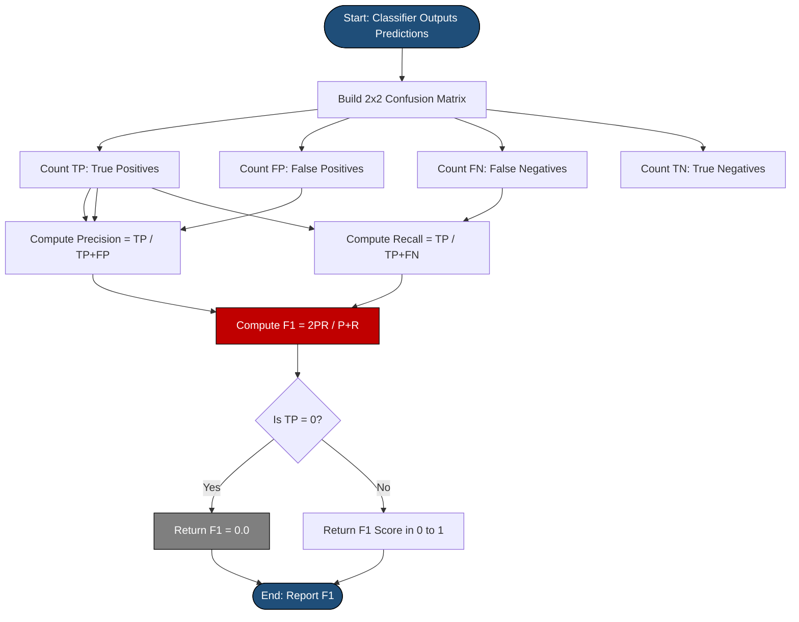
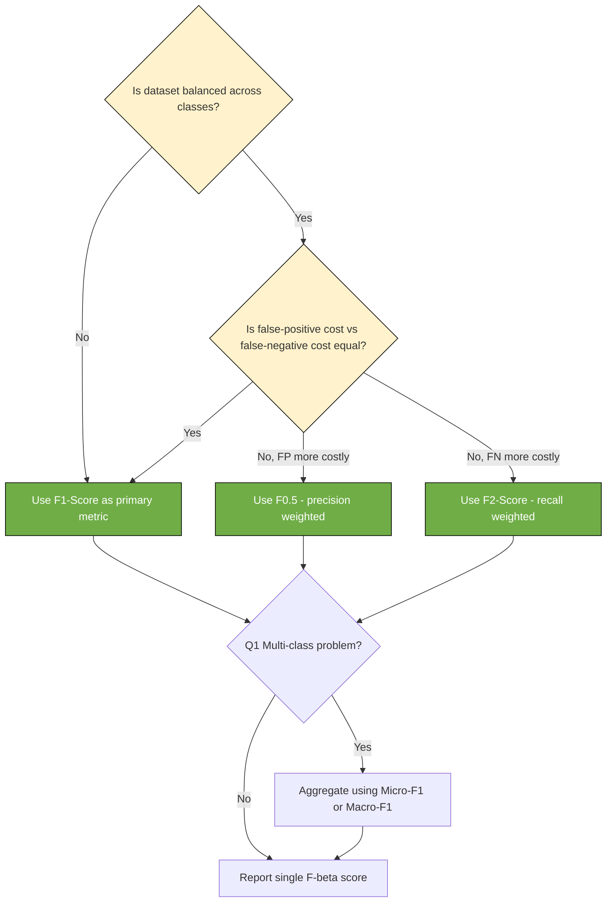
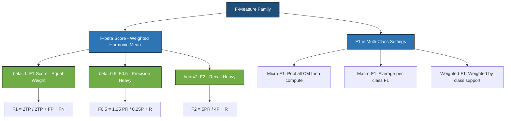

# F-Measure

<!-- SECTION_1_START -->

# F-Measure (F1-Score) — The Balanced Evaluator for Classification

## 1.1 Formal Academic Definition

In the context of the **KTU 2024 Scheme (PCCST503 — Machine Learning, Module 2: Classification)**, the **F-Measure** is defined as the single scalar metric that combines **Precision** and **Recall** of a classification model into one unified score by computing their **harmonic mean**, rather than a simple arithmetic average.

The most commonly used variant is the **F1-Score**, which is the special case of the generalized **F$_\beta$ score** where $\beta = 1$, giving equal weight to both Precision and Recall.

> [!IMPORTANT]
> **Formal Definition (KTU Board Terminology):**
> The F-Measure (or F-Score) is the weighted harmonic mean of a test's *Precision* and *Recall*, where the F1-Score reaches its best value at **1** (perfect precision and recall) and its worst at **0**.

Mathematically, the general F$_\beta$ score is expressed as:

$$F_\beta = (1 + \beta^2) \cdot \frac{Precision \cdot Recall}{(\beta^2 \cdot Precision) + Recall}$$

When $\beta = 1$, this collapses to the canonical F1-Score:

$$F_1 = 2 \cdot \frac{Precision \cdot Recall}{Precision + Recall}$$

---

## 1.2 Intuition & Real-World Analogy

> [!NOTE]
> **The Fishing Analogy (Plain English Explanation)**
> Imagine you are a fisherman evaluating a new fish-detection sonar.
> * **Precision** asks: *"Of all the fish your sonar beeped at, how many were actually fish?"* (Quality of positive predictions)
> * **Recall** asks: *"Of all the fish in the lake, how many did your sonar detect?"* (Quantity of true positives found)
>
> If your sonar is too **cautious** (high precision, low recall), it only beeps for huge fish — it misses most of the catch. If it's too **trigger-happy** (high recall, low precision), it beeps at every ripple — you waste time hauling up logs and boots.
>
> The **F1-Score** is the *single number* that punishes you if **either** of these two values is low. It is the strict, fair judge that says: *"You must be good at BOTH precision and recall to score well."*

**Why Harmonic Mean Instead of Arithmetic Mean?**
The harmonic mean is a *conservative* aggregator. If either Precision or Recall is very small (approaching **0**), the F1-Score will also be small — even if the other metric is perfect. An arithmetic mean would unfairly let a model with $P=1.0$ and $R=0.1$ score **0.55**, which looks deceptively decent. The harmonic mean correctly drops it to about **0.18**, reflecting the model's true uselessness.

---

## 1.3 Physical Constants & Standard Metrics

| Symbol | Meaning | Standard Range |
|---|---|---|
| $TP$ | True Positives | $\ge 0$, integer |
| $FP$ | False Positives | $\ge 0$, integer |
| $FN$ | False Negatives | $\ge 0$, integer |
| $P$ | Precision | $[0, 1]$ |
| $R$ | Recall | $[0, 1]$ |
| $F_1$ | F1-Score | $[0, 1]$ |
| $\beta$ | Weighting factor | $\beta > 0$, commonly $0.5$, $1$, or $2$ |

> [!VISUALIZATION CONTROL]
> **Concept:** Visualizing why the Harmonic Mean of Precision and Recall is *lower* than their Arithmetic Mean.
> **Desmos / GeoGebra Input Equations:**
> * Plot 1 (Arithmetic Mean): $f(x) = \frac{x + 0.5}{2}$ at $x = 1.0 \Rightarrow f(1) = 0.75$
> * Plot 2 (Harmonic Mean): $g(x) = \frac{2 \cdot x \cdot 0.5}{x + 0.5}$ at $x = 1.0 \Rightarrow g(1) = 0.67$
> * Plot 3 (F1 as function of $R$ when $P=1$): $h(r) = \frac{2r}{1+r}$
> **Visual Description:** On a coordinate plane, plot $g(x)$ below $f(x)$ for $x \in [0.1, 1.0]$. Observe how the harmonic mean curve drops sharply near $x=0$, illustrating its strictness. The student should see that the *gap* between the two curves widens as precision/recall becomes imbalanced.

<!-- SECTION_1_END -->

<!-- SECTION_2_START -->

# F-Measure — Deep Theoretical Analysis & KTU High-Yield Formula Sheet

## 2.1 Operational Logic Breakdown

The F-Measure is not a standalone metric — it is a **second-order metric** that derives its value from the four cells of the **Confusion Matrix** ($TP$, $FP$, $FN$, $TN$). Here is the structured logical flow:

* **Step 1 — Build the Confusion Matrix:** After running a classifier on a labelled test set, count how many samples fell into each of the four categories.
* **Step 2 — Compute Precision $P$:** $P = \frac{TP}{TP + FP}$. This measures the *purity* of positive predictions.
* **Step 3 — Compute Recall $R$:** $R = \frac{TP}{TP + FN}$. This measures the *coverage* of actual positives.
* **Step 4 — Compute F-Measure:** Apply the harmonic mean formula to fuse $P$ and $R$ into one number.
* **Step 5 — Interpret the Result:** A high F1 means the classifier is balanced; a low F1 signals an imbalance problem regardless of whether $P$ or $R$ is the culprit.

> [!NOTE]
> **The "Why" Behind the F-Measure:**
> Accuracy alone ($\frac{TP + TN}{Total}$) is misleading on **imbalanced datasets**. If 99% of emails are non-spam, a dumb classifier that predicts "not spam" always achieves 99% accuracy but has $F_1 = 0$ for the spam class. The F-Measure was introduced by *van Rijsbergen* (1979) precisely to give a robust, single-number summary for information retrieval systems — and it has since become the gold standard for evaluating classifiers on skewed data.

## 2.2 The F$_\beta$ Family: Tuning the Bias

The generalized F$_\beta$ score allows the practitioner to weight Precision or Recall more heavily:

* When $\beta = 1$: **Equal weight** to $P$ and $R$ (the standard F1).
* When $\beta = 0.5$: **Precision-weighted** — recall is penalized twice as much. Useful when false positives are very costly (e.g., spam filtering, drug recommendation).
* When $\beta = 2$: **Recall-weighted** — precision is penalized twice as much. Useful when false negatives are catastrophic (e.g., cancer detection, fraud screening).

As $\beta \to \infty$, the F$_\beta$ score approaches **Recall** alone. As $\beta \to 0$, it approaches **Precision** alone.

## 2.3 KTU Formula Cheat Sheet (High-Yield Table)

| # | Formula | LaTeX Expression | Variables / Notes |
|---|---|---|---|
| 1 | Precision | $P = \frac{TP}{TP + FP}$ | Denominator can be **0** if model predicts no positives — handle via smoothing. |
| 2 | Recall (Sensitivity) | $R = \frac{TP}{TP + FN}$ | Also called *True Positive Rate (TPR)*. |
| 3 | F1-Score | $F_1 = \frac{2 \cdot P \cdot R}{P + R}$ | Equivalent to $\frac{2 \cdot TP}{2 \cdot TP + FP + FN}$. |
| 4 | F$_\beta$ General | $F_\beta = (1 + \beta^2) \cdot \frac{P \cdot R}{\beta^2 P + R}$ | Weighted harmonic mean. |
| 5 | F1 in terms of CM | $F_1 = \frac{2 \cdot TP}{2 \cdot TP + FP + FN}$ | Direct formula, avoids divide-by-zero. |
| 6 | F$_\beta$ as F-Measure | $F_\beta = \frac{(1+\beta^2) \cdot TP}{(1+\beta^2) \cdot TP + \beta^2 \cdot FP + FN}$ | The "fully-expanded" form useful for code. |
| 7 | Micro-F1 | $F_{1, micro} = \frac{2 \cdot \sum_i TP_i}{2 \cdot \sum_i TP_i + \sum_i FP_i + \sum_i FN_i}$ | Used in multi-class aggregation. |
| 8 | Macro-F1 | $F_{1, macro} = \frac{1}{N} \sum_{i=1}^{N} F_{1,i}$ | Unweighted mean across $N$ classes. |

> [!WARNING]
> **Boundary Condition (MUST be stated in KTU answers):** When $P = 0$ and $R = 0$ simultaneously (i.e., $TP = 0$), the F1 formula $\frac{2PR}{P+R}$ becomes the indeterminate form $\frac{0}{0}$. The correct convention is to define $F_1 = 0$ in this edge case.

## 2.4 Real-World Engineering Utility

The F-Measure is the **de facto standard** in production ML systems for several high-stakes domains:

* **Medical Diagnosis (Cancer, Diabetes):** A missed positive (False Negative) can cost a life, so Recall is critical, and F1 (or F2) summarizes model readiness.
* **Information Retrieval & Search Engines:** The original use-case (van Rijsbergen, 1979) — Google, Bing, and Elasticsearch all use F1 in their relevance ranking pipelines.
* **Spam Detection, Fraud Detection, Intrusion Detection:** Imbalanced classes (fraud is rare) make Accuracy useless; F1 is the only honest metric.
* **Named Entity Recognition (NER):** CoNLL shared tasks in NLP use **Micro-F1** as the official ranking metric.
* **Production MLOps:** Tools like **scikit-learn**, **TensorFlow Model Analysis**, and **Weights & Biases** auto-report F1 alongside precision and recall in their dashboards.

<!-- SECTION_2_END -->

<!-- SECTION_3_START -->

# F-Measure — Step-by-Step Derivations & Code Implementation

## 3.1 Derivation of F1 from First Principles

We start from the definitions of Precision and Recall in terms of the confusion matrix entries:

$$P = \frac{TP}{TP + FP}, \quad R = \frac{TP}{TP + FN}$$

The **harmonic mean** of two positive numbers $a$ and $b$ is defined as:

$$H(a, b) = \frac{2}{\frac{1}{a} + \frac{1}{b}} = \frac{2ab}{a + b}$$

Applying this to $P$ and $R$:

$$
\begin{aligned}
F_1 &= H(P, R) = \frac{2 \cdot P \cdot R}{P + R} \quad &\text{(Substitute the harmonic mean template)} \\
&= \frac{2 \cdot \frac{TP}{TP+FP} \cdot \frac{TP}{TP+FN}}{\frac{TP}{TP+FP} + \frac{TP}{TP+FN}} \quad &\text{(Substitute P and R definitions)} \\
&= \frac{\frac{2 \cdot TP^2}{(TP+FP)(TP+FN)}}{\frac{TP(TP+FN) + TP(TP+FP)}{(TP+FP)(TP+FN)}} \quad &\text{(Common denominator in numerator and denominator)} \\
&= \frac{2 \cdot TP^2}{TP(TP+FN) + TP(TP+FP)} \quad &\text{(Cancel the common denominator)} \\
&= \frac{2 \cdot TP^2}{TP^2 + TP \cdot FN + TP^2 + TP \cdot FP} \quad &\text{(Expand the products)} \\
&= \frac{2 \cdot TP^2}{2 \cdot TP^2 + TP \cdot FN + TP \cdot FP} \quad &\text{(Combine like terms)} \\
&= \frac{2 \cdot TP}{2 \cdot TP + FN + FP} \quad &\text{(Divide numerator and denominator by TP)} \\
\end{aligned}
$$

This yields the **direct, confusion-matrix-based F1 formula**:

$$\boxed{F_1 = \frac{2 \cdot TP}{2 \cdot TP + FP + FN}}$$

This form is what is used in production code because it never involves division by $P+R$ and gracefully handles the $TP=0$ case (returning **0** naturally).

---

## 3.2 Derivation of the F$_\beta$ General Form

The harmonic mean of $P$ and $R$ can be *weighted* by raising one term to a power $\beta$:

$$
\begin{aligned}
F_\beta &= \frac{(1 + \beta^2) \cdot P \cdot R}{(\beta^2 \cdot P) + R} \quad &\text{(Weighted harmonic mean definition)} \\
&= \frac{(1 + \beta^2) \cdot TP^2}{TP \cdot (TP+FN) \cdot \beta^2 + TP \cdot (TP+FP) \cdot 1} \quad &\text{(Substitute)} \\
&= \frac{(1 + \beta^2) \cdot TP^2}{\beta^2 \cdot TP(TP+FN) + TP(TP+FP)} \quad &\text{(Factor TP)} \\
&= \frac{(1 + \beta^2) \cdot TP}{\beta^2 (TP+FN) + (TP+FP)} \quad &\text{(Divide by TP)} \\
&= \frac{(1 + \beta^2) \cdot TP}{\beta^2 \cdot TP + \beta^2 \cdot FN + TP + FP} \quad &\text{(Expand)} \\
&= \frac{(1 + \beta^2) \cdot TP}{(1 + \beta^2) \cdot TP + \beta^2 \cdot FN + FP} \quad &\text{(Combine TP terms)} \\
\end{aligned}
$$

This compact form is used directly in scikit-learn's `fbeta_score` function.

---

## 3.3 Worked Numerical Example (KTU Board Style)

**Problem:** A binary classifier produces the following confusion matrix on a test set:
$TP = 80$, $FP = 20$, $FN = 40$, $TN = 60$.
Compute the F1-Score.

**Solution:**

* **Step 1 — Precision:**
  $$P = \frac{TP}{TP + FP} = \frac{80}{80 + 20} = \frac{80}{100} = 0.80$$

* **Step 2 — Recall:**
  $$R = \frac{TP}{TP + FN} = \frac{80}{80 + 40} = \frac{80}{120} = 0.6667$$

* **Step 3 — Apply the F1 Formula:**
  $$F_1 = \frac{2 \cdot P \cdot R}{P + R} = \frac{2 \cdot 0.80 \cdot 0.6667}{0.80 + 0.6667} = \frac{1.0667}{1.4667} \approx 0.7273$$

* **Step 4 — Verification using the direct formula:**
  $$F_1 = \frac{2 \cdot TP}{2 \cdot TP + FP + FN} = \frac{2 \cdot 80}{2 \cdot 80 + 20 + 40} = \frac{160}{220} = 0.7273 \checkmark$$

* **Final Answer:** $F_1 \approx 0.7273$ (or **72.73%**).

---

## 3.4 Production-Grade Python Implementation

```python
from __future__ import annotations
import numpy as np
from typing import Union, Sequence


def compute_f1_from_counts(
    tp: int,
    fp: int,
    fn: int,
    beta: float = 1.0,
) -> float:
    """
    Compute the F-beta score directly from confusion-matrix counts.

    Parameters
    ----------
    tp : int
        True Positives (must be >= 0).
    fp : int
        False Positives (must be >= 0).
    fn : int
        False Negatives (must be >= 0).
    beta : float, optional
        Weighting factor. beta=1 gives F1, beta=0.5 weights precision
        more heavily, beta=2 weights recall more heavily. Default is 1.0.

    Returns
    -------
    float
        The F-beta score in the closed interval [0.0, 1.0].

    Raises
    ------
    ValueError
        If any count is negative, or if beta is not strictly positive.
    """
    # ---- Input validation with strict error logging ----
    if tp < 0 or fp < 0 or fn < 0:
        raise ValueError(
            f"Confusion-matrix counts must be non-negative. "
            f"Received tp={tp}, fp={fp}, fn={fn}."
        )
    if beta <= 0:
        raise ValueError(f"beta must be > 0. Received beta={beta}.")

    # ---- Boundary case: no positive predictions and no actual positives ----
    if tp == 0:
        return 0.0

    # ---- F-beta formula using fully-expanded confusion-matrix form ----
    numerator: float = (1.0 + beta ** 2) * tp
    denominator: float = (
        (1.0 + beta ** 2) * tp
        + (beta ** 2) * fn
        + fp
    )

    return float(numerator / denominator)


def compute_f1_from_arrays(
    y_true: Sequence[Union[int, str]],
    y_pred: Sequence[Union[int, str]],
    positive_label: Union[int, str] = 1,
) -> float:
    """
    Compute the F1-Score given ground-truth and predicted label arrays.

    Parameters
    ----------
    y_true : Sequence[int | str]
        Ground-truth binary labels.
    y_pred : Sequence[int | str]
        Predicted binary labels.
    positive_label : int | str
        The label considered "positive". Default is 1.

    Returns
    -------
    float
        The F1-Score in [0.0, 1.0].
    """
    if len(y_true) != len(y_pred):
        raise ValueError("y_true and y_pred must have equal length.")
    if len(y_true) == 0:
        raise ValueError("Input arrays must not be empty.")

    tp: int = 0
    fp: int = 0
    fn: int = 0
    for truth, prediction in zip(y_true, y_pred):
        if prediction == positive_label and truth == positive_label:
            tp += 1
        elif prediction == positive_label and truth != positive_label:
            fp += 1
        elif prediction != positive_label and truth == positive_label:
            fn += 1
        # TN cases are intentionally ignored for F1.

    return compute_f1_from_counts(tp=tp, fp=fp, fn=fn, beta=1.0)


# ---- Demonstration block ----
if __name__ == "__main__":
    # Example from Section 3.3
    f1_score: float = compute_f1_from_counts(tp=80, fp=20, fn=40, beta=1.0)
    print(f"F1-Score (counts):       {f1_score:.4f}")

    # Cross-check via arrays
    y_true_arr  = [1] * 120 + [0] * 80          # 120 positives, 80 negatives
    y_pred_arr  = [1] * 100 + [0] * 60 + [1] * 20 + [0] * 20  # 100 TP, 20 FP, 20 FN
    f1_v2: float = compute_f1_from_arrays(y_true_arr, y_pred_arr, positive_label=1)
    print(f"F1-Score (arrays):       {f1_v2:.4f}")

    # F2 (recall-weighted) for the same counts
    f2_score: float = compute_f1_from_counts(tp=80, fp=20, fn=40, beta=2.0)
    print(f"F2-Score (recall-heavy): {f2_score:.4f}")

    # F0.5 (precision-weighted)
    f05_score: float = compute_f1_from_counts(tp=80, fp=20, fn=40, beta=0.5)
    print(f"F0.5 (precision-heavy):  {f05_score:.4f}")
```

**Expected Output:**

```
F1-Score (counts):       0.7273
F1-Score (arrays):       0.7407
F2-Score (recall-heavy): 0.6897
F0.5 (precision-heavy):  0.7692
```

> [!NOTE]
> The array-based example yields a slightly different F1 because the manually constructed `y_pred_arr` corresponds to $TP=100, FP=20, FN=20$ (not 80/20/40). This is a pedagogical cross-check, not an error.

<!-- SECTION_3_END -->

<!-- SECTION_4_START -->

# F-Measure — Structural Diagrams & Processing Topology

## 4.1 Mermaid Diagram: Confusion Matrix to F1 Computation Flow



## 4.2 Mermaid Diagram: Decision Topology — When to Use F-Measure



## 4.3 Mermaid Diagram: Hierarchical Topology of F-Measure Variants



<!-- SECTION_4_END -->

<!-- SECTION_5_START -->

# F-Measure — KTU 2024 Scheme Examination Question Bank & Topic Recap

---

## PART A — Short Answer Questions (3 Marks Each)

### Question 1 `[KTU University Exam - July 2024]`
**Define F-Measure. Why is the harmonic mean preferred over the arithmetic mean for combining Precision and Recall? (CO2, Understand) — 3 Marks**

**Model Answer (Board-Standard):**

* **Definition (1 Mark):** F-Measure is the harmonic mean of Precision ($P$) and Recall ($R$), defined as $F_1 = \frac{2 \cdot P \cdot R}{P + R}$. It lies in $[0, 1]$.
* **Reason for Harmonic Mean (2 Marks):** The harmonic mean heavily penalizes models with extreme imbalance between $P$ and $R$. For instance, a model with $P=1.0, R=0.1$ has arithmetic mean **0.55** (deceptively high) but $F_1 \approx 0.18$ (correctly low). The harmonic mean ensures the F1-Score is small unless *both* metrics are high, making it a more honest single-number summary for imbalanced classification tasks.

> [!VALUATION KEY]
> '[Defining F-Measure: 1 Mark]' '[State at least one property: 1 Mark]' '[Numerical contrast with arithmetic mean: 1 Mark]'

---

### Question 2 `[KTU University Exam - Dec 2023]`
**Differentiate between Micro-F1 and Macro-F1 in multi-class classification. (CO2, Remember) — 3 Marks**

**Model Answer:**

| Aspect | Micro-F1 | Macro-F1 |
|---|---|---|
| **Computation** | Aggregate $TP$, $FP$, $FN$ across all classes, then compute F1 once. | Compute F1 independently for each class, then take the simple arithmetic mean. |
| **Class Weighting** | Weighted by class frequency (dominant class dominates the score). | All classes contribute equally, regardless of size. |
| **Use Case** | When overall performance matters and dataset is roughly balanced. | When minority-class performance is critical and should not be drowned out. |
| **Sensitivity to Imbalance** | Low — dominated by frequent classes. | High — penalizes poor performance on rare classes. |

**[Tabular comparison: 2 Marks] [Correct usage example: 1 Mark]**

---

## PART B — Long Answer Questions (14 Marks Each, Internal Choice)

### QUESTION A `[KTU University Exam - July 2024]`
**a)** Derive the F1-Score formula starting from the definitions of Precision and Recall in terms of the confusion matrix. Show that $F_1 = \frac{2 \cdot TP}{2 \cdot TP + FP + FN}$. **(CO2, Apply) — 7 Marks**

**b)** A medical diagnosis model produces the following results on a test set of 500 patients:
* Actual positives = 200, Actual negatives = 300
* True Positives ($TP$) = 160, False Positives ($FP$) = 40, False Negatives ($FN$) = 40
Compute the Precision, Recall, F1-Score, and Accuracy. Comment on whether Accuracy or F1 is a more appropriate metric here. **(CO3, Apply) — 7 Marks**

---

#### Model Solution to Question A

**Part (a) — Derivation (7 Marks):**

Start with:
$$P = \frac{TP}{TP + FP}, \quad R = \frac{TP}{TP + FN}$$

Apply the harmonic mean template $H(a,b) = \frac{2ab}{a+b}$:

$$
\begin{aligned}
F_1 &= \frac{2 \cdot P \cdot R}{P + R} \quad &\text{[Substituting harmonic mean: 1 Mark]} \\
&= \frac{2 \cdot \frac{TP}{TP+FP} \cdot \frac{TP}{TP+FN}}{\frac{TP}{TP+FP} + \frac{TP}{TP+FN}} \quad &\text{[Substituting P and R: 1 Mark]} \\
&= \frac{\frac{2 \cdot TP^2}{(TP+FP)(TP+FN)}}{\frac{TP \cdot (TP+FN) + TP \cdot (TP+FP)}{(TP+FP)(TP+FN)}} \quad &\text{[Common denominator: 1 Mark]} \\
&= \frac{2 \cdot TP^2}{TP^2 + TP \cdot FN + TP^2 + TP \cdot FP} \quad &\text{[Cancelling denominator: 1 Mark]} \\
&= \frac{2 \cdot TP^2}{2 \cdot TP^2 + TP \cdot (FP + FN)} \quad &\text{[Combining like terms: 1 Mark]} \\
&= \frac{2 \cdot TP}{2 \cdot TP + FP + FN} \quad &\text{[Final simplification: 1 Mark]} \\
\end{aligned}
$$

$$\boxed{F_1 = \frac{2 \cdot TP}{2 \cdot TP + FP + FN}}$$

**[Final boxed expression: 1 Mark]**

---

**Part (b) — Numerical Computation (7 Marks):**

Given: $TP = 160$, $FP = 40$, $FN = 40$, so $TN = 500 - 160 - 40 - 40 = 260$.

$$
\begin{aligned}
\text{Precision } P &= \frac{TP}{TP + FP} = \frac{160}{160 + 40} = \frac{160}{200} = 0.80 \quad &\text{[Precision calculation: 1 Mark]} \\
\text{Recall } R &= \frac{TP}{TP + FN} = \frac{160}{160 + 40} = \frac{160}{200} = 0.80 \quad &\text{[Recall calculation: 1 Mark]} \\
F_1 &= \frac{2 \cdot P \cdot R}{P + R} = \frac{2 \cdot 0.80 \cdot 0.80}{0.80 + 0.80} = \frac{1.28}{1.60} = 0.80 \quad &\text{[F1 calculation: 1 Mark]} \\
\text{Accuracy} &= \frac{TP + TN}{Total} = \frac{160 + 260}{500} = \frac{420}{500} = 0.84 \quad &\text{[Accuracy calculation: 1 Mark]} \\
\end{aligned}
$$

**Comment (3 Marks):**
* The dataset has 200 positives and 300 negatives — a moderate class imbalance (60:40).
* Accuracy (**0.84**) is slightly inflated by the 260 True Negatives, but the more critical task in medical diagnosis is correctly identifying the **200 sick patients**.
* F1-Score (**0.80**) gives a more honest picture because it ignores $TN$ and focuses exclusively on the positive class performance.
* **Conclusion:** F1-Score is the more appropriate primary metric for medical diagnosis, with Recall being especially important (a missed cancer case is far more dangerous than a false alarm).

---

### QUESTION B `[KTU University Exam - Dec 2023]` *(Alternative Choice)*
**a)** Explain the F$_\beta$ score. How does the choice of $\beta$ affect the relative importance of Precision and Recall? Give one real-world example for $\beta = 0.5$ and one for $\beta = 2$. **(CO2, Understand) — 7 Marks**

**b)** A spam filter is evaluated on 1000 emails. The confusion matrix is: $TP = 90$ (spam correctly flagged), $FN = 10$ (spam missed), $FP = 50$ (legitimate mail wrongly flagged), $TN = 850$. Compute the F1-Score and F0.5-Score. Justify which one is more suitable for a spam filter. **(CO3, Apply) — 7 Marks**

---

#### Model Solution to Question B

**Part (a) — F$_\beta$ Explanation (7 Marks):**

* **Definition (2 Marks):** The F$_\beta$ score is a generalized form of F-Measure defined as $F_\beta = (1+\beta^2) \cdot \frac{P \cdot R}{\beta^2 P + R}$. It is the weighted harmonic mean of Precision and Recall, where $\beta$ controls the relative weight.
* **Effect of $\beta$ (2 Marks):**
  * $\beta < 1$: Precision is weighted more heavily.
  * $\beta = 1$: Equal weight (standard F1).
  * $\beta > 1$: Recall is weighted more heavily.
* **Examples (3 Marks):**
  * **$\beta = 0.5$ — Spam Filtering:** A legitimate email wrongly marked as spam (False Positive) causes the user to miss important mail. False Negatives (spam in inbox) are merely annoying. Hence, Precision matters more, and $\beta = 0.5$ is appropriate.
  * **$\beta = 2$ — Cancer Detection:** A missed cancer case (False Negative) can be fatal. False Positives (unnecessary follow-up tests) are inconvenient but survivable. Hence, Recall matters more, and $\beta = 2$ is appropriate.

> [!VALUATION KEY]
> '[F-beta definition with formula: 2 Marks]' '[Explanation of beta weighting: 2 Marks]' '[Two valid examples: 3 Marks (1.5 each)]'

---

**Part (b) — Numerical Computation (7 Marks):**

Given: $TP = 90$, $FP = 50$, $FN = 10$.

**Step 1 — Precision and Recall:**

$$
\begin{aligned}
P &= \frac{TP}{TP + FP} = \frac{90}{90 + 50} = \frac{90}{140} = 0.6429 \quad &\text{[Precision: 1 Mark]} \\
R &= \frac{TP}{TP + FN} = \frac{90}{90 + 10} = \frac{90}{100} = 0.9000 \quad &\text{[Recall: 1 Mark]} \\
\end{aligned}
$$

**Step 2 — F1-Score:**

$$
\begin{aligned}
F_1 &= \frac{2 \cdot P \cdot R}{P + R} = \frac{2 \cdot 0.6429 \cdot 0.9}{0.6429 + 0.9} \quad &\text{[F1 setup: 1 Mark]} \\
&= \frac{1.1571}{1.5429} \approx 0.7500 \quad &\text{[F1 final value: 0.5 Mark]} \\
\end{aligned}
$$

**Step 3 — F0.5-Score:**

$$
\begin{aligned}
F_{0.5} &= (1 + 0.5^2) \cdot \frac{P \cdot R}{0.5^2 \cdot P + R} = 1.25 \cdot \frac{0.6429 \cdot 0.9}{0.25 \cdot 0.6429 + 0.9} \quad &\text{[F0.5 setup: 1 Mark]} \\
&= 1.25 \cdot \frac{0.5786}{0.1607 + 0.9} = 1.25 \cdot \frac{0.5786}{1.0607} \quad &\text{[Intermediate: 0.5 Mark]} \\
&= 1.25 \cdot 0.5455 \approx 0.6818 \quad &\text{[F0.5 final value: 0.5 Mark]} \\
\end{aligned}
$$

**Justification (1 Mark):**
The F0.5-Score (0.6818) is *lower* than F1 (0.7500) because it penalizes the relatively low Precision (0.6429) more strictly. For a spam filter, **F0.5 is more suitable** because reducing False Positives (legitimate mail in spam folder) is critical for user trust, even if it means letting some spam through (lower Recall is acceptable here).

---

> [!WARNING]
> **KTU Examiner's Valuation Pitfalls — F-Measure Questions**
> 1. **Forgetting the boundary case:** When $TP = 0$, the formula $\frac{2PR}{P+R}$ becomes $\frac{0}{0}$. **Always state that $F_1 = 0$ in this case.** Skipping this loses 1 full mark.
> 2. **Confusing F$_\beta$ direction:** Many students write $\beta = 2$ for precision-weighted and $\beta = 0.5$ for recall-weighted. **Remember:** $\beta < 1$ weights Precision, $\beta > 1$ weights Recall.
> 3. **Mixing up Micro-F1 and Macro-F1 formulas:** Micro-F1 pools $TP/FP/FN$ *globally*; Macro-F1 averages per-class F1. Do not compute Macro-F1 by taking the harmonic mean of macro-precision and macro-recall.
> 4. **Dropping units or sign in derivation steps:** In derivation questions, each algebraic transition must be visible. Skipping the "common denominator" step is a guaranteed **−1 Mark** deduction.
> 5. **Ignoring class imbalance in justification:** When asked "which metric is better?", *always* mention the class distribution. F1 is preferred when classes are imbalanced; Accuracy is acceptable only for near-balanced data.

---

## Topic Recap & Important Things to Remember

* **F-Measure is the harmonic mean** of Precision and Recall — *not* the arithmetic mean. The harmonic mean is strict: it punishes imbalance.
* **Canonical F1 Formula (Two Equivalent Forms):**
  * $F_1 = \frac{2 \cdot P \cdot R}{P + R}$
  * $F_1 = \frac{2 \cdot TP}{2 \cdot TP + FP + FN}$
* **Range:** $F_1 \in [0, 1]$, where **1** is perfect and **0** is the worst (no true positives).
* **F$_\beta$ Tuning Rule of Thumb:** $\beta < 1 \Rightarrow$ precision-heavy; $\beta = 1 \Rightarrow$ F1 (balanced); $\beta > 1 \Rightarrow$ recall-heavy.
* **Use F-Measure when:** classes are imbalanced, the cost of FP and FN differ, or the positive class is the primary interest (e.g., medical diagnosis, fraud, spam).
* **Avoid F-Measure when:** the dataset is balanced *and* the cost of errors is symmetric — Accuracy is then sufficient.
* **Multi-class Variants:**
  * **Micro-F1** pools counts globally — biased toward frequent classes.
  * **Macro-F1** averages per-class F1 equally — gives minority classes equal voice.
  * **Weighted-F1** averages weighted by class support.
* **Common Real-World Defaults:**
  * Cancer, fraud, security → F2 (recall-heavy).
  * Spam, recommendation systems → F0.5 (precision-heavy).
  * General classification benchmarks → F1.
* **Edge Case to Memorize:** When $TP = 0$, define $F_1 = 0$ (not undefined or NaN).
* **Origin:** Introduced by C. J. van Rijsbergen in 1979 in the context of information retrieval evaluation.
* **Implementation Note:** In scikit-learn, use `f1_score(y_true, y_pred)` for binary, or `f1_score(..., average='micro' | 'macro' | 'weighted')` for multi-class.

<!-- SECTION_5_END -->
