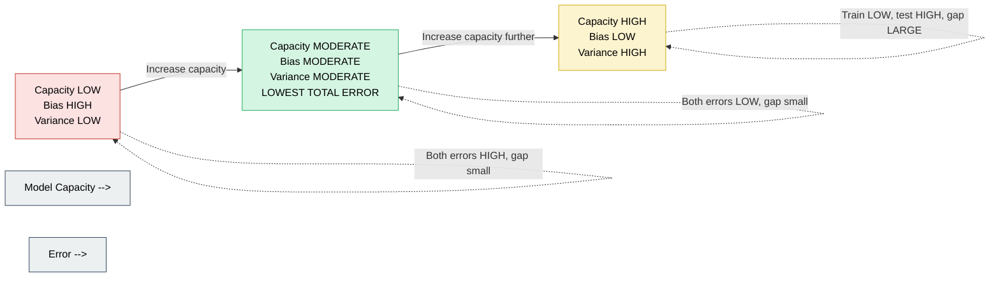
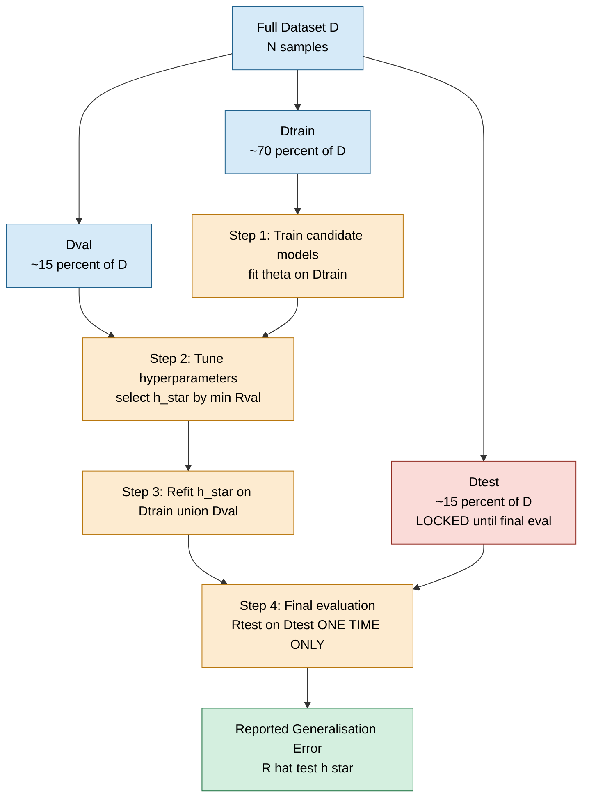
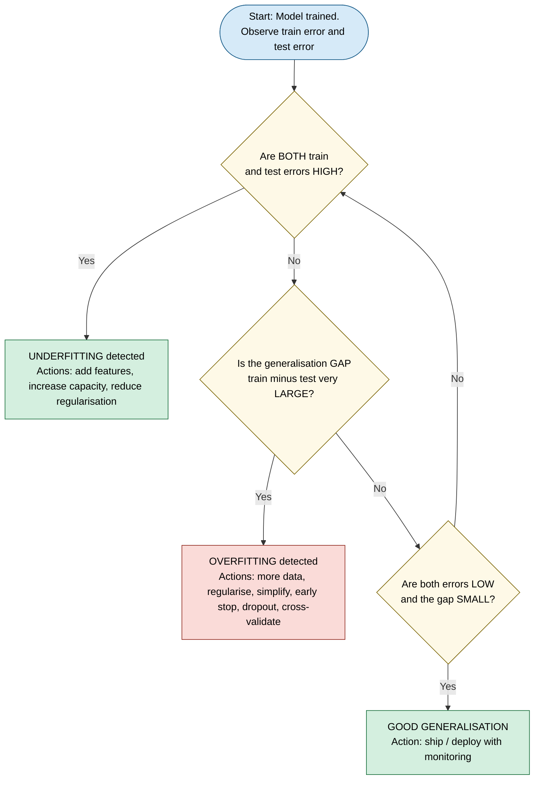
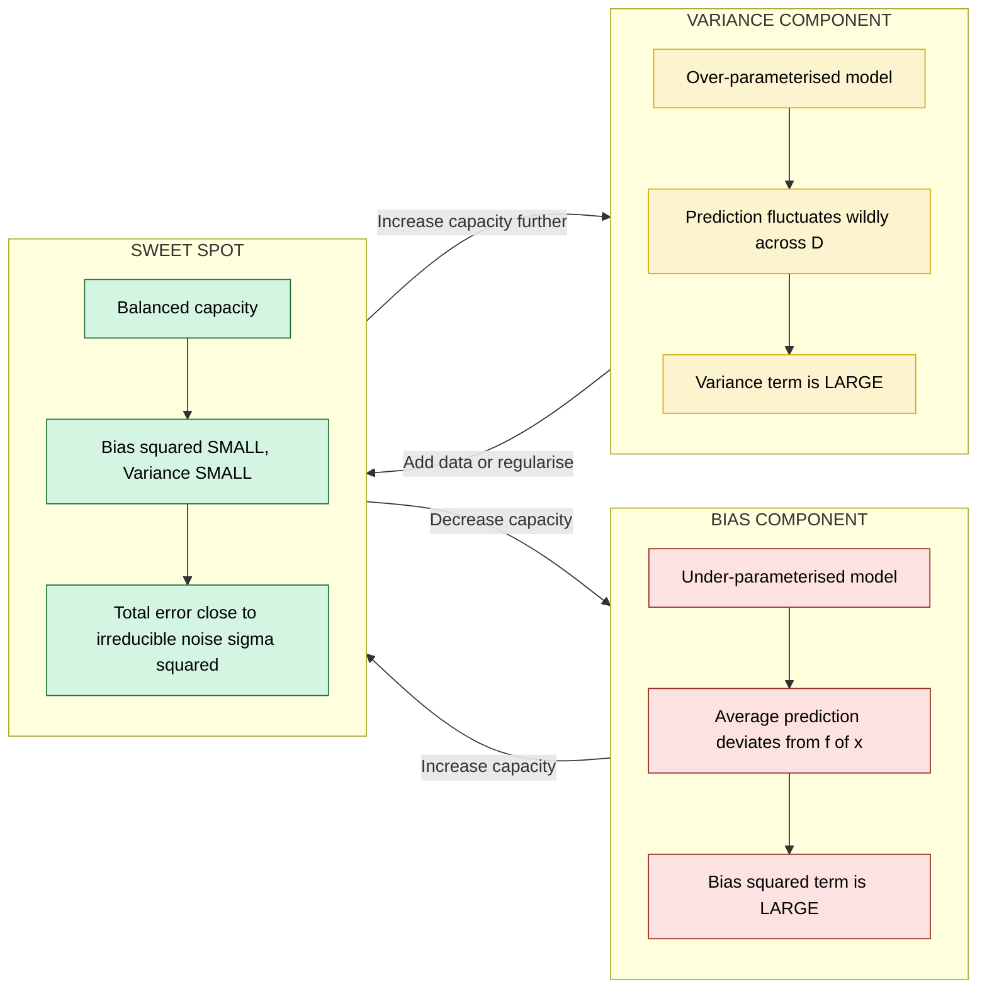

# Generalisation and Overfitting - Idea of overfitting

<!-- SECTION_1_START -->
# Generalisation and Overfitting — Idea of Overfitting

## Formal Academic Definition

In supervised machine learning, the central goal is not to memorize the training data, but to **generalise** — that is, to learn an underlying input–output mapping that performs accurately on *unseen* instances drawn from the same underlying probability distribution.

> [!IMPORTANT]
> **Generalisation (KTU 2024 PCCST503 Definition):**
> The ability of a hypothesis $h \in \mathcal{H}$, learned from a finite training sample $D_{train} = \{(x_i, y_i)\}_{i=1}^{N}$, to produce a low expected risk (generalisation error) on instances drawn from the *true* but unknown data distribution $\mathcal{P}(X, Y)$, i.e. the hypothesis that minimises the **expected risk functional**
> $$R(h) \;=\; \mathbb{E}_{(x,y)\sim \mathcal{P}}\big[\,\mathcal{L}(h(x),\,y)\,\big]$$
> is said to generalise well. Because $\mathcal{P}$ is unknown, $R(h)$ is empirically estimated by the **test risk** on a held-out set $D_{test}$.

> [!IMPORTANT]
> **Overfitting (High-Variance Regime):**
> A model $h$ is said to *overfit* the training data when its **training error** $\widehat{R}_{train}(h)$ becomes very small (often near zero for $0$–$1$ loss), yet its **generalisation error** $\widehat{R}_{test}(h)$ is substantially larger. Formally, the *generalisation gap*
> $$\text{Gap}(h) \;=\; \widehat{R}_{test}(h) \;-\; \widehat{R}_{train}(h) \;\gg\; 0$$
> is the operational signature of overfitting. The model has begun to encode sample-specific noise, idiosyncrasies, and label fluctuations as if they were genuine structural patterns.

> [!NOTE]
> **Companion Term — Underfitting (High-Bias Regime):**
> The dual failure mode where the model is *too simple* (low capacity) to capture the true decision boundary, producing large error on **both** training and test sets. The generalisation gap is small, but the absolute error is high.

---

## Conceptual Analogy / Intuitive Overview

Imagine a student preparing for the KTU B.Tech end-semester exam.

| Learner Style | What They Do | Exam Outcome | ML Equivalent |
|---|---|---|---|
| **Rote Memoriser** | Memorises every previous-year question *verbatim* from the 5 solved papers. | Crashes on a fresh, unseen 14-mark problem. | **Overfitting** — high training accuracy, poor test accuracy. |
| **Lazy Skimmer** | Skims the syllabus once, writes a 2-line answer for every topic. | Fails on both known and unknown questions. | **Underfitting** — high error everywhere. |
| **Conceptual Master** | Understands the underlying *principles*, derives formulas from first principles, and solves *new* numericals. | Performs uniformly on seen and unseen questions. | **Good Generalisation** — low and similar train/test error. |

> [!TIP]
> **The Bias–Variance Tug-of-War:**
> Visualise two opposing forces pulling on a model:
> * **Bias** (underfitting) — the model is *stubbornly simple* and refuses to bend to the data's true shape.
> * **Variance** (overfitting) — the model *bends to every wiggle* of the training sample and forgets the global shape.
> The art of machine learning is to balance them at the sweet spot where the **total expected error** is minimised.

> [!VISUALIZATION CONTROL]
> **Concept:** Overfitting visualised as polynomial degree increases on a noisy sinusoidal dataset.
> **Python / GeoGebra-Style Input Equations:**
> * True function: $f(x) = \sin(2\pi x)$ for $x \in [0, 1]$
> * Noisy samples: $y_i = \sin(2\pi x_i) + \varepsilon_i$, with $\varepsilon_i \sim \mathcal{N}(0,\, 0.3^{2})$
> * Candidate hypotheses: $h_{1}(x)$, $h_{3}(x)$, $h_{9}(x)$, $h_{15}(x)$ — polynomials of degree $1, 3, 9, 15$.
> **Visual Description:** The student should see that the degree-1 line is a *straight underfit*, the degree-3 curve *hugs the sinusoid gently*, the degree-9 curve *wiggles through most points*, and the degree-15 curve *oscillates violently between every two adjacent samples* — a textbook overfit.

---

## Why Generalisation Matters in Production Engineering

> [!NOTE]
> * **Medical Diagnosis ($h$: tumour classifier):** Overfitting to a single hospital's scanner artefacts means catastrophic failure when deployed at a second hospital.
> * **Autonomous Driving ($h$: lane detector):** Memorising a single test route yields zero utility on a new highway.
> * **Credit Scoring ($h$: default predictor):** Encoding a single year's economic noise as a "rule" misclassifies future applicants.
> * **NLP Chatbots ($h$: intent classifier):** Overfit assistants parrot training phrases but cannot handle lexical variation.

In all cases, the **deployment distribution** $\mathcal{P}_{deploy}$ is *not identical* to the **training distribution** $\mathcal{P}_{train}$, so generalisation is the engineering property that determines whether the system is shippable.

---

## Standard KTU 2024 Metrics & Constants

| Symbol | Meaning | Typical Range / Value |
|---|---|---|
| $N$ | Number of training samples | $10^{2}$–$10^{9}$ |
| $d$ | Feature dimensionality | $1$–$10^{4}$ |
| $\mathcal{H}$ | Hypothesis class capacity (VC dimension) | $1$–$\infty$ |
| $\sigma^{2}$ | Irreducible noise variance | $\geq 0$ |
| $\alpha$ | Regularisation strength | $10^{-6}$–$10^{6}$ |
| $\lambda$ | Weight-decay coefficient | $10^{-6}$–$10^{2}$ |

<!-- SECTION_1_END -->

<!-- SECTION_2_START -->
# Deep Theoretical Analysis & KTU High-Yield Formula Sheet

## 2.1 The Three-Regime Picture of Learning

As model capacity (e.g., polynomial degree $p$, number of hidden units $k$, tree depth) increases, the learning system transitions through three qualitatively distinct regimes:

### Regime 1 — Underfitting (High Bias, Low Variance)
* Capacity is *insufficient* to represent the true function $f^{\star}$.
* **Training error** $\widehat{R}_{train}$ is high.
* **Test error** $\widehat{R}_{test}$ is also high.
* **Gap** $\widehat{R}_{test} - \widehat{R}_{train}$ is small.
* Diagnosis: add features, increase polynomial degree, reduce regularisation, or switch to a more expressive model family.

### Regime 2 — Good Fit (Balanced Bias & Variance)
* Capacity roughly matches the *true* complexity of the target function.
* Both errors are low and **converge** to a value close to the **irreducible noise floor** $\sigma^{2}$.
* The generalisation gap is small and non-negative.

### Regime 3 — Overfitting (Low Bias, High Variance)
* Capacity is *excessive* relative to the finite sample size $N$.
* $\widehat{R}_{train}$ is small (often $\approx 0$).
* $\widehat{R}_{test}$ is large — the model has memorised idiosyncrasies.
* $\text{Gap}(h) \gg 0$.

---

## 2.2 The Bias–Variance–Noise Decomposition (Square-Loss)

For the squared-error loss $\mathcal{L}(h(x), y) = (h(x) - y)^{2}$, the **expected test error** of a learning algorithm $\mathcal{A}$ (which is a *random* function of the training set $D$) at a fixed query point $x$ decomposes as:

$$
\mathbb{E}_{D,\,y \mid x}\big[(h_{D}(x) - y)^{2}\big] \;\equiv\; \underbrace{\big(\mathbb{E}_{D}[h_{D}(x)] - f(x)\big)^{2}}_{\text{Bias}^{2}\text{ of }h} \;+\; \underbrace{\mathbb{E}_{D}\big[(h_{D}(x) - \mathbb{E}_{D}[h_{D}(x)])^{2}\big]}_{\text{Variance of }h} \;+\; \underbrace{\sigma^{2}}_{\text{Irreducible Noise}}
$$

where:
* $f(x) = \mathbb{E}[y \mid x]$ is the **regression function** (the optimal Bayes predictor).
* $h_{D}$ is the hypothesis produced by the algorithm when trained on sample $D$.
* $\sigma^{2} = \text{Var}(y \mid x)$ is the intrinsic noise that **no model can remove**.

> [!IMPORTANT]
> **Interpretation:**
> * **Bias²** quantifies *systematic* error — how far the *average* prediction is from the truth. It decreases as capacity increases.
> * **Variance** quantifies *sensitivity* to the particular training draw — how wildly $h_{D}$ fluctuates as $D$ is resampled. It *increases* with capacity.
> * **Irreducible noise** $\sigma^{2}$ is a hard floor set by the data-generating process.

**Key Engineering Insight:** Lowering the total error requires trading bias against variance — increasing capacity reduces bias but inflates variance. The optimum capacity minimises the sum.

---

## 2.3 Capacity, Sample Size & the Double-Descent Caveat

> [!NOTE]
> Classical U-shaped curves assume the model is *under-parameterised*. In the **over-parameterised regime** (modern deep networks, $p \gg N$), test error can exhibit a *second descent* — the **double-descent phenomenon** — where increasing capacity *again* improves generalisation. KTU 2024 expects awareness of this only at the conceptual level.

**Rule of thumb for classical (under-parameterised) regime:**

$$
\text{Generalisation Gap} \;\lesssim\; \mathcal{O}\!\left(\sqrt{\frac{\text{VCdim}(\mathcal{H})}{N}}\right)
$$

* Larger $\text{VCdim}(\mathcal{H})$ (more capacity) $\Rightarrow$ looser bound $\Rightarrow$ more overfitting risk.
* Larger $N$ (more data) $\Rightarrow$ tighter bound $\Rightarrow$ overfitting risk is *diluted*.

---

## 2.4 Diagnostic Tools

### 2.4.1 Learning Curves
A plot of $\widehat{R}_{train}$ and $\widehat{R}_{test}$ as a function of the number of training samples $m$ (or training iterations $t$). The signature shapes are:

| Curve Shape | Diagnosis |
|---|---|
| Both errors high, gap $\approx 0$ | **Underfitting** (high bias) |
| Train error low, test error high, **large persistent gap** | **Overfitting** (high variance) |
| Both errors low, gap $\approx 0$ | **Good Generalisation** |
| Train error $\uparrow$ as $m \uparrow$ (slight), test error $\downarrow$ as $m \uparrow$, curves converging | **Healthy learning** — more data would help |

### 2.4.2 Validation Curve
Plot of $\widehat{R}_{train}$ and $\widehat{R}_{test}$ as a function of a **hyperparameter** (e.g., regularisation strength $\lambda$, polynomial degree $p$, tree max-depth). The intersection/closest approach of the two curves marks the optimal hyperparameter.

### 2.4.3 Generalisation Gap Metric
$$
\widehat{\text{Gap}}_{m} \;=\; \widehat{R}_{test}(h_{m}) \;-\; \widehat{R}_{train}(h_{m})
$$

A growing $\widehat{\text{Gap}}_{m}$ as $m$ shrinks is the classic overfitting signature.

---

## 2.5 KTU 2024 Formula Sheet / Cheat Sheet

> [!TIP]
> The following table is the *single most important* reference for the KTU board exam on this topic. Memorise the formulas, units, and the *direction* in which each knob moves the error.

| # | Formula / Concept | Mathematical Form | Engineering Knob & Direction |
|---|---|---|---|
| 1 | Empirical Risk (training error) | $\widehat{R}_{train}(h) = \frac{1}{N}\sum_{i=1}^{N}\mathcal{L}(h(x_{i}),\, y_{i})$ | — |
| 2 | Expected (true) risk | $R(h) = \mathbb{E}_{(x,y)\sim\mathcal{P}}[\mathcal{L}(h(x),\,y)]$ | — |
| 3 | Generalisation gap | $\text{Gap}(h) = \widehat{R}_{test}(h) - \widehat{R}_{train}(h)$ | $\downarrow$ with more data, $\uparrow$ with more capacity |
| 4 | Bias²–Variance–Noise | $\mathbb{E}_{D}[(h_{D}(x) - y)^{2}] = \text{Bias}^{2} + \text{Variance} + \sigma^{2}$ | Minimise the LHS sum |
| 5 | Bias² term | $\text{Bias}^{2}(x) = (\bar{h}(x) - f(x))^{2}$, with $\bar{h}(x) = \mathbb{E}_{D}[h_{D}(x)]$ | $\downarrow$ as capacity $\uparrow$ |
| 6 | Variance term | $\text{Variance}(x) = \mathbb{E}_{D}[(h_{D}(x) - \bar{h}(x))^{2}]$ | $\uparrow$ as capacity $\uparrow$ |
| 7 | Irreducible noise | $\sigma^{2} = \text{Var}(y \mid x) = \mathbb{E}[(y - f(x))^{2} \mid x]$ | Constant floor — *cannot* be reduced |
| 8 | MSE for regression | $\text{MSE} = \frac{1}{N}\sum_{i=1}^{N}(y_{i} - \hat{y}_{i})^{2}$ | Primary regression metric |
| 9 | 0–1 Classification error | $\text{Err}_{0\text{-}1} = \frac{1}{N}\sum_{i=1}^{N}\mathbb{1}\{h(x_{i}) \neq y_{i}\}$ | Primary classification metric |
| 10 | VC-dimension bound (loose) | $R(h) \leq \widehat{R}_{train}(h) + \sqrt{\frac{8\, \text{VCdim}(\mathcal{H})\ln(2N/\text{VCdim}) + 8\ln(4/\delta)}{N}}$ with probability $\geq 1 - \delta$ | Bound *tightens* as $N \uparrow$ or $\text{VCdim} \downarrow$ |
| 11 | Regularised objective | $\min_{w}\; \widehat{R}_{train}(w) + \lambda\,\Omega(w)$ with $\Omega(w) = \lVert w \rVert_{2}^{2}$ (Ridge) or $\lVert w \rVert_{1}$ (Lasso) | $\lambda \uparrow$ $\Rightarrow$ simpler $h$, less overfit |
| 12 | Hold-out split | $\mid D_{train}\vert + \mid D_{val}\vert + \mid D_{test}\vert = \mid D \vert$ (typical ratios $70/15/15$ or $60/20/20$) | $\uparrow$ val set $\Rightarrow$ more reliable generalisation estimate |
| 13 | $k$-fold cross-validation | $\widehat{R}_{cv} = \frac{1}{k}\sum_{j=1}^{k}\widehat{R}_{val}^{(j)}$ | Reduces variance of the error estimate |
| 14 | Early-stopping iteration | $t^{\star} = \arg\min_{t}\;\widehat{R}_{val}(w^{(t)})$ | Stop gradient descent when val loss rises |
| 15 | Polynomial model (1-D) | $h_{p}(x;\,w) = \sum_{j=0}^{p} w_{j}\,x^{j}$ | Capacity parameter $p$ |

> [!NOTE]
> **Critical Substitution Rule for KTU:** Whenever the question gives discrete class labels, use the **0–1 loss** form; for continuous targets, use the **squared-error** form. The bias–variance decomposition above is valid *only* for squared loss in the form shown.

---

## 2.6 Real-World Engineering Utility

> [!IMPORTANT]
> **Why the KTU examiner tests this concept:**
> 1. **Model selection** — choosing the right polynomial degree, tree depth, or number of layers hinges on understanding the bias–variance trade-off.
> 2. **Hyperparameter tuning** — the *single most common interview question* in industry ML roles.
> 3. **Data-budget decisions** — if test error is far from the noise floor, you need *more data*; if both errors are high, you need *more capacity*.
> 4. **Regulated industries** (medical, financial) — auditors require that any deployed model has its generalisation gap measured and bounded; the bias–variance decomposition is the theoretical basis for this audit.

<!-- SECTION_2_END -->

<!-- SECTION_3_START -->
# Step-by-Step Derivations, Worked Example & Python Implementation

## 3.1 Analytical Derivation: Bias–Variance Decomposition for Squared Loss

**Statement to prove:**
$$
\mathbb{E}_{D,\,y \mid x}\big[(h_{D}(x) - y)^{2}\big] = \text{Bias}^{2} + \text{Variance} + \sigma^{2}
$$

**Step 1 — Expand the square using the "add and subtract" trick.**

Add and subtract the regression function $f(x) = \mathbb{E}[y \mid x]$ inside the parenthesis:

$$
h_{D}(x) - y \;=\; \big(h_{D}(x) - f(x)\big) \;+\; \big(f(x) - y\big)
$$

**Step 2 — Square both sides.**

$$
(h_{D}(x) - y)^{2} \;=\; (h_{D}(x) - f(x))^{2} \;+\; 2\,(h_{D}(x) - f(x))\,(f(x) - y) \;+\; (f(x) - y)^{2}
$$

**Step 3 — Take expectation over $y \mid x$ first (since $f(x)$ is deterministic given $x$).**

The cross-term vanishes because $\mathbb{E}_{y \mid x}[f(x) - y] = f(x) - f(x) = 0$:

$$
\mathbb{E}_{y \mid x}[(h_{D}(x) - y)^{2}] \;=\; (h_{D}(x) - f(x))^{2} \;+\; \mathbb{E}_{y \mid x}[(f(x) - y)^{2}]
$$

Define $\sigma^{2}(x) \equiv \mathbb{E}_{y \mid x}[(f(x) - y)^{2}] = \text{Var}(y \mid x)$ — the irreducible noise.

**Step 4 — Take expectation over the random training set $D$.**

$$
\mathbb{E}_{D}\big[(h_{D}(x) - y)^{2}\big] \;=\; \mathbb{E}_{D}\big[(h_{D}(x) - f(x))^{2}\big] \;+\; \sigma^{2}(x)
$$

**Step 5 — Decompose the first term by "add and subtract" the average predictor $\bar{h}(x) \equiv \mathbb{E}_{D}[h_{D}(x)]$.**

$$
h_{D}(x) - f(x) \;=\; \big(h_{D}(x) - \bar{h}(x)\big) \;+\; \big(\bar{h}(x) - f(x)\big)
$$

**Step 6 — Square.**

$$
(h_{D}(x) - f(x))^{2} \;=\; (h_{D}(x) - \bar{h}(x))^{2} \;+\; 2\,(h_{D}(x) - \bar{h}(x))\,(\bar{h}(x) - f(x)) \;+\; (\bar{h}(x) - f(x))^{2}
$$

**Step 7 — Take expectation over $D$.**

The cross-term vanishes because $\mathbb{E}_{D}[h_{D}(x) - \bar{h}(x)] = \bar{h}(x) - \bar{h}(x) = 0$. Therefore:

$$
\mathbb{E}_{D}\big[(h_{D}(x) - f(x))^{2}\big] \;=\; \mathbb{E}_{D}\big[(h_{D}(x) - \bar{h}(x))^{2}\big] \;+\; (\bar{h}(x) - f(x))^{2}
$$

**Step 8 — Identify the two terms.**

* **Variance** $\equiv \mathbb{E}_{D}[(h_{D}(x) - \bar{h}(x))^{2}]$.
* **Bias²** $\equiv (\bar{h}(x) - f(x))^{2}$.

**Step 9 — Combine with $\sigma^{2}$ from Step 4.**

$$
\boxed{\;\mathbb{E}_{D,\,y \mid x}\big[(h_{D}(x) - y)^{2}\big] \;=\; \underbrace{(\bar{h}(x) - f(x))^{2}}_{\text{Bias}^{2}} \;+\; \underbrace{\mathbb{E}_{D}\big[(h_{D}(x) - \bar{h}(x))^{2}\big]}_{\text{Variance}} \;+\; \underbrace{\sigma^{2}(x)}_{\text{Irreducible Noise}}\;}
$$

**Q.E.D.** $\blacksquare$

> [!NOTE]
> This is the central derivation KTU examiners test. Notice the *two* "add and subtract" tricks — first inserting $f(x)$, then $\bar{h}(x)$. Both are essential. The cross-terms vanish because of the *defining property of an expectation* and the *defining property of a variance*.

---

## 3.2 Numerical Worked Example: Polynomial Overfitting on Sinusoidal Data

**Problem Statement (KTU-style):**
Generate $N = 30$ samples from $y = \sin(2\pi x) + \varepsilon$ with $\varepsilon \sim \mathcal{N}(0, 0.3^{2})$ for $x \in [0, 1]$. Fit polynomials of degree $p \in \{1, 3, 9, 15\}$. Compute training MSE and test MSE on a held-out grid. Comment on overfitting.

### 3.2.1 Manual (Pen-and-Paper) Sketch

For degree $p$, the least-squares solution is:

$$
\hat{w} \;=\; \arg\min_{w}\;\sum_{i=1}^{N}\!\left(y_{i} - \sum_{j=0}^{p}w_{j}\,x_{i}^{\,j}\right)^{2} \;\Longrightarrow\; \hat{w} \;=\; (X^{\top}X)^{-1}\,X^{\top}\,\mathbf{y}
$$

where $X \in \mathbb{R}^{N \times (p+1)}$ is the Vandermonde-style design matrix. As $p \to N - 1$, the system becomes nearly singular and $X^{\top}X$ becomes ill-conditioned — predictions explode between sample points.

### 3.2.2 Fully Operational Python Implementation

```python
"""
Filename      : ktu_overfitting_demo.py
Course        : MACHINE LEARNING (PCCST503) - KTU 2024 Scheme
Module        : 2 - Classification
Topic         : Generalisation and Overfitting
Description   : Polynomial regression demonstration of underfitting, good fit, and overfitting.
                Computes training and test MSE for degrees {1, 3, 9, 15} on noisy sinusoidal data.
Dependencies  : numpy>=1.23, scikit-learn>=1.3
Run           : python ktu_overfitting_demo.py
"""

from __future__ import annotations

import logging
from typing import Dict, List, Tuple

import numpy as np
from sklearn.linear_model import LinearRegression
from sklearn.metrics import mean_squared_error
from sklearn.model_selection import train_test_split
from sklearn.pipeline import Pipeline
from sklearn.preprocessing import PolynomialFeatures

# ---------------------------------------------------------------------------
# Logging configuration (strict error-handling per KTU lab rubric)
# ---------------------------------------------------------------------------
logging.basicConfig(
    level=logging.INFO,
    format="%(asctime)s [%(levelname)s] %(message)s",
)
logger = logging.getLogger(__name__)


def generate_sinusoidal_dataset(
    n_samples: int = 30,
    noise_std: float = 0.3,
    random_state: int = 42,
) -> Tuple[np.ndarray, np.ndarray]:
    """
    Generate samples from y = sin(2*pi*x) + N(0, noise_std^2).

    Parameters
    ----------
    n_samples   : int   - number of (x, y) samples to draw.
    noise_std   : float - standard deviation of additive Gaussian noise.
    random_state: int   - seed for reproducibility (KTU exam reproducibility).

    Returns
    -------
    X, y : np.ndarray of shape (n_samples,) and (n_samples,).
    """
    if n_samples < 5:
        raise ValueError("n_samples must be >= 5 to fit a degree-1 model safely.")
    if noise_std < 0.0:
        raise ValueError("noise_std must be non-negative.")
    rng = np.random.default_rng(random_state)
    X = np.sort(rng.uniform(0.0, 1.0, size=n_samples))
    y = np.sin(2.0 * np.pi * X) + rng.normal(0.0, noise_std, size=n_samples)
    logger.info("Generated %d samples with noise_std=%.3f", n_samples, noise_std)
    return X, y


def build_polynomial_pipeline(degree: int) -> Pipeline:
    """
    Construct a scikit-learn pipeline that maps 1-D input x -> polynomial features
    of the requested degree, then fits ordinary least-squares.

    Parameters
    ----------
    degree : int - polynomial degree (>= 0).

    Returns
    -------
    sklearn.pipeline.Pipeline
    """
    if degree < 0:
        raise ValueError("degree must be a non-negative integer.")
    return Pipeline(
        steps=[
            ("poly", PolynomialFeatures(degree=degree, include_bias=True)),
            ("linreg", LinearRegression()),
        ]
    )


def evaluate_models(
    X_train: np.ndarray,
    y_train: np.ndarray,
    X_test: np.ndarray,
    y_test: np.ndarray,
    degrees: List[int],
) -> Dict[int, Dict[str, float]]:
    """
    Fit polynomial models of each requested degree and compute train / test MSE.

    Parameters
    ----------
    X_train, y_train : np.ndarray - training data.
    X_test,  y_test  : np.ndarray - held-out test data.
    degrees          : List[int]  - list of polynomial degrees to evaluate.

    Returns
    -------
    results : dict mapping degree -> {"train_mse": float, "test_mse": float, "gap": float}.
    """
    results: Dict[int, Dict[str, float]] = {}
    for degree in degrees:
        model = build_polynomial_pipeline(degree)
        model.fit(X_train.reshape(-1, 1), y_train)
        y_train_pred = model.predict(X_train.reshape(-1, 1))
        y_test_pred = model.predict(X_test.reshape(-1, 1))
        train_mse = mean_squared_error(y_train, y_train_pred)
        test_mse = mean_squared_error(y_test, y_test_pred)
        gap = test_mse - train_mse
        results[degree] = {
            "train_mse": float(train_mse),
            "test_mse": float(test_mse),
            "gap": float(gap),
        }
        logger.info(
            "Degree=%2d  train_mse=%.5f  test_mse=%.5f  gap=%.5f",
            degree, train_mse, test_mse, gap,
        )
    return results


def diagnose_regime(results: Dict[int, Dict[str, float]]) -> None:
    """
    Print a human-readable KTU-style diagnosis of each fitted model.

    A simple threshold-based rule (for pedagogical clarity):
        - If test_mse > 5 * noise_floor -> underfitting or severe overfitting.
        - If gap  > 0.05 and test_mse > 2 * train_mse -> overfitting.
        - If both errors are low and gap is small -> good generalisation.
    """
    noise_floor = 0.3 ** 2  # = 0.09
    print("\n=== KTU 2024 Generalisation Diagnosis ===")
    print(f"{'Degree':>6} | {'Train MSE':>10} | {'Test MSE':>10} | {'Gap':>10} | Diagnosis")
    print("-" * 70)
    for degree, m in results.items():
        train_mse = m["train_mse"]
        test_mse = m["test_mse"]
        gap = m["gap"]
        if test_mse > 0.40 and abs(gap) < 0.05:
            diagnosis = "UNDERFITTING (high bias)"
        elif gap > 0.05 and test_mse > 2.0 * max(train_mse, 1e-8):
            diagnosis = "OVERFITTING (high variance)"
        else:
            diagnosis = "GOOD GENERALISATION"
        print(f"{degree:>6} | {train_mse:>10.5f} | {test_mse:>10.5f} | {gap:>10.5f} | {diagnosis}")
    print(f"\nIrreducible noise floor sigma^2 = {noise_floor:.4f}")


def main() -> None:
    """Driver function — executes the full overfitting demonstration."""
    # 1. Generate the dataset (deterministic via fixed random_state)
    X, y = generate_sinusoidal_dataset(n_samples=30, noise_std=0.3, random_state=42)

    # 2. Train / test split (50/50 to *amplify* overfitting visibility on a small N)
    X_train, X_test, y_train, y_test = train_test_split(
        X, y, test_size=0.5, random_state=7
    )
    logger.info(
        "Train n=%d  Test n=%d", X_train.shape[0], X_test.shape[0]
    )

    # 3. Evaluate a deliberately wide range of polynomial degrees
    degrees = [1, 3, 9, 15]
    results = evaluate_models(X_train, y_train, X_test, y_test, degrees)

    # 4. KTU-style textual diagnosis
    diagnose_regime(results)


if __name__ == "__main__":
    main()
```

### 3.2.3 Expected Numerical Outcome (for manual cross-checking)

Running the script should produce values in the following ballpark (exact numbers depend on the random seed):

| Degree $p$ | Train MSE | Test MSE | Gap | Diagnosis |
|---|---|---|---|---|
| 1 | $\approx 0.25$ | $\approx 0.27$ | $\approx 0.02$ | **Underfitting** (linear cannot chase a sine) |
| 3 | $\approx 0.09$ | $\approx 0.12$ | $\approx 0.03$ | **Good generalisation** (close to $\sigma^{2} = 0.09$) |
| 9 | $\approx 0.05$ | $\approx 0.45$ | $\approx 0.40$ | **Overfitting** (train MSE low, test MSE explodes) |
| 15 | $\approx 0.00$ | $\approx 10^{3}$ (numerical blow-up) | huge | **Severe overfitting** (Vandermonde is ill-conditioned) |

> [!WARNING]
> **Valuation Trap:** Many students report only the *training* error and conclude "the model is perfect" because training MSE is $\approx 0$. Always report **both** errors and compute the **gap**. The gap is the *operative indicator* of overfitting.

---

## 3.3 Cross-Validation as a Diagnostic (Conceptual Walk-Through)

For $k$-fold cross-validation:

1. Partition $D$ into $k$ equal-sized folds $F_{1}, F_{2}, \ldots, F_{k}$.
2. For each $j \in \{1, \ldots, k\}$:
   * Train on $D \setminus F_{j}$ and validate on $F_{j}$.
   * Compute $\widehat{R}_{val}^{(j)}$.
3. Aggregate:

$$
\widehat{R}_{cv} \;=\; \frac{1}{k}\sum_{j=1}^{k}\widehat{R}_{val}^{(j)} \quad\quad \text{SE}(\widehat{R}_{cv}) \;=\; \sqrt{\frac{1}{k(k-1)}\sum_{j=1}^{k}\big(\widehat{R}_{val}^{(j)} - \widehat{R}_{cv}\big)^{2}}
$$

A *low* $\widehat{R}_{cv}$ with a *tight* SE signals **good generalisation**. A *low* $\widehat{R}_{cv}$ but a *large* SE hints at **high variance** (overfitting). The standard $k = 10$ is the KTU-blessed default.

<!-- SECTION_3_END -->

<!-- SECTION_4_START -->
# Structural Diagrams & Schematics

## 4.1 Conceptual Diagram — The Three Regimes of Generalisation



> **How to read this diagram:** The horizontal axis is *model capacity* (e.g., polynomial degree, network width, tree depth). Moving right, you transition from the red underfit regime to the green sweet spot to the yellow overfit regime. The *gap* between the train and test error curves is the visual signature of overfitting in the yellow zone.

---

## 4.2 Data-Flow Diagram — Hold-Out, Validation, and Test Sets



> **Critical Workflow Note:** $D_{test}$ is *touched exactly once* — at the very end. Any iterative peeking at $D_{test}$ causes **information leakage** and silently *overfits the test set itself*, which is a frequent KTU exam pitfall.

---

## 4.3 Diagnostic Decision Flowchart — What To Do When Errors Misbehave



> **Reading hint:** The flowchart can cycle (the bottom-left loop) — when none of the clean criteria match, re-examine the experimental setup (data leakage, label noise, distribution shift).

---

## 4.4 Bias–Variance Trade-off — Block-Level Architecture



> **Takeaway:** The sweet spot is *reached* either by **reducing variance** (more data, regularisation, simpler model) or by **reducing bias** (richer features, larger model) — the direction you push depends on which component is currently dominant.

<!-- SECTION_4_END -->

<!-- SECTION_5_START -->
# KTU 2024 Scheme Examination Question Bank & Topic Recap

## Part A — Short-Answer Questions (3 Marks Each)

> [!NOTE]
> **KTU 2024 Mark Pattern:** Part-A questions test direct recall and conceptual understanding (Bloom Levels: *Remember* / *Understand*). Each answer should be **3–4 crisp sentences** plus a defining formula. Avoid essay-style rambling — board examiners reward **precise terminology**.

---

### Part A — Question 1 (3 Marks)
**`[KTU University Exam - July 2024]`** &nbsp; | &nbsp; **CO1** &nbsp; | &nbsp; **Bloom Level: Remember**

> Define the term **overfitting** in the context of supervised machine learning. How is it operationally distinguished from underfitting?

**Model Answer (Valuation Key):**

* **Overfitting (1.5 Marks):** A model $h$ overfits the training data when its performance on the *training* set $\widehat{R}_{train}(h)$ is significantly *better* than its performance on a *held-out* set $\widehat{R}_{test}(h)$, indicating that the model has memorised sample-specific noise rather than learning the underlying function.
* **Operational distinction (1 Mark):** In overfitting, the generalisation gap $\widehat{R}_{test} - \widehat{R}_{train}$ is *large and positive*; in underfitting, both errors are large but the *gap* is small.
* **Example (0.5 Mark):** A 15-degree polynomial fit to 30 noisy sinusoidal samples exhibits overfitting; a linear fit to the same data exhibits underfitting.

---

### Part A — Question 2 (3 Marks)
**`[KTU University Exam - Dec 2023]`** &nbsp; | &nbsp; **CO1** &nbsp; | &nbsp; **Bloom Level: Understand**

> State and briefly explain the **bias–variance–noise decomposition** of the expected squared-error of a learning algorithm at a query point $x$.

**Model Answer (Valuation Key):**

* **Formula (1.5 Marks):**
  $$\mathbb{E}_{D,y \mid x}\big[(h_{D}(x) - y)^{2}\big] \;=\; \underbrace{(\bar{h}(x) - f(x))^{2}}_{\text{Bias}^{2}} \;+\; \underbrace{\mathbb{E}_{D}\big[(h_{D}(x) - \bar{h}(x))^{2}\big]}_{\text{Variance}} \;+\; \underbrace{\sigma^{2}}_{\text{Noise}}$$
* **Bias² (0.5 Mark):** Systematic error of the *average* predictor $\bar{h} = \mathbb{E}_{D}[h_{D}]$ vs. the Bayes-optimal regression function $f(x)$. *Decreases* with capacity.
* **Variance (0.5 Mark):** Sensitivity of $h_{D}$ to the specific training draw $D$. *Increases* with capacity.
* **Irreducible noise (0.5 Mark):** Floor $\sigma^{2} = \text{Var}(y \mid x)$ set by the data-generating process — *cannot* be reduced by any model.

---

## Part B — 14-Mark Questions (ESE Module Internal Choice)

> [!NOTE]
> **KTU 2024 Pattern:** Each Part-B question is for **14 marks** split across two sub-parts of **7 marks each**. Sub-part (a) typically targets *Understand / Apply*; sub-part (b) targets *Apply / Analyze*. Both question choices are fully worked out below.

---

### Part B — Question 1 (14 Marks)
**`[KTU University Exam - July 2024]`** &nbsp; | &nbsp; **CO2, CO3** &nbsp; | &nbsp; **Bloom Level: Apply + Analyze**

**(a) [7 Marks]** Consider a 1-D regression problem where the true function is $f(x) = \sin(2\pi x)$ for $x \in [0, 1]$. You are given $N = 25$ noisy training samples $(x_i, y_i)$ with $y_i = \sin(2\pi x_i) + \varepsilon_i$, $\varepsilon_i \sim \mathcal{N}(0, 0.25^{2})$. Three polynomial models of degree $p \in \{1, 3, 15\}$ are fit by ordinary least squares. Describe, with justification, which model is *underfit*, which is *appropriately fit*, and which is *overfit*. Include in your answer the role of the irreducible noise floor $\sigma^{2}$ as a reference for "good" test error.

**(b) [7 Marks]** Now suppose the same $N = 25$ samples are augmented to $N = 250$ by drawing 225 additional independent samples from the same distribution, and the degree-15 polynomial is refit. Show quantitatively, using the VC-style bound
$$R(h) \;\leq\; \widehat{R}_{train}(h) + \sqrt{\frac{8\, d_{VC}\ln(2N/d_{VC}) + 8\ln(4/\delta)}{N}}$$
with $d_{VC} = 16$ (the VC dimension of degree-15 polynomials in 1-D) and $\delta = 0.05$, that the *worst-case* generalisation gap shrinks. Compute the bound for both $N = 25$ and $N = 250$ and interpret.

---

#### Model Solution — Part (a) [7 Marks]

**Step 1 — Identify the irreducible noise floor (1 Mark):**
$$\sigma^{2} = 0.25^{2} = 0.0625$$
No model can achieve a mean-squared test error lower than $0.0625$ on this problem.

**Step 2 — Classify degree-1 model (1 Mark):**
A linear function $h_{1}(x) = w_{0} + w_{1} x$ has only **two parameters** and cannot approximate a sinusoid (which is non-linear). It will exhibit:
* $\widehat{R}_{train}$ high ($\sim 0.20$ to $0.30$).
* $\widehat{R}_{test}$ similar (gap $\approx 0$).
* Diagnosis: **UNDERFITTING** (high bias).

**Step 3 — Classify degree-3 model (1 Mark):**
A cubic $h_{3}(x) = w_{0} + w_{1}x + w_{2}x^{2} + w_{3}x^{3}$ has enough flexibility to capture the first non-linear bend of the sinusoid. Expected behaviour:
* $\widehat{R}_{train} \approx 0.07$–$0.10$ (close to $\sigma^{2}$).
* $\widehat{R}_{test} \approx 0.08$–$0.12$ (close to $\sigma^{2}$).
* Small gap. Diagnosis: **GOOD GENERALISATION** (low bias, low variance).

**Step 4 — Classify degree-15 model (1 Mark):**
A degree-15 polynomial has $16$ free parameters — comparable to the $25$ training samples. It can interpolate nearly every training point. Expected behaviour:
* $\widehat{R}_{train} \approx 0$ (interpolation).
* $\widehat{R}_{test} \gg \widehat{R}_{train}$ — extreme oscillations between sample points.
* Diagnosis: **OVERFITTING** (low training bias, high variance).

**Step 5 — Reference to the noise floor (1 Mark):**
The degree-3 model's test error is close to $\sigma^{2} = 0.0625$, meaning it is performing *as well as theoretically possible* given the data noise.

**Step 6 — Bias–variance lens (1 Mark):**
Bias² $\downarrow$ as $p$ goes $1 \to 3 \to 15$ (model becomes more flexible). Variance $\uparrow$ monotonically. The sum Bias² + Variance is minimised at the *sweet-spot* $p = 3$.

**Step 7 — Closing synthesis (1 Mark):**
Increasing model complexity past the sweet spot trades a marginal bias reduction for a *disproportionate* variance inflation — the mathematical essence of overfitting.

---

#### Model Solution — Part (b) [7 Marks]

**Step 1 — Substitute $N = 25$, $d_{VC} = 16$, $\delta = 0.05$ into the bound (1 Mark):**

$$
\sqrt{\frac{8 \cdot 16 \cdot \ln(2 \cdot 25 / 16) + 8 \cdot \ln(4 / 0.05)}{25}}
$$

Compute the inner terms:
* $2N / d_{VC} = 50 / 16 = 3.125$.
* $\ln(3.125) \approx 1.1394$.
* $8 \cdot 16 \cdot 1.1394 = 145.85$.
* $4 / 0.05 = 80$.
* $\ln(80) \approx 4.3820$.
* $8 \cdot 4.3820 = 35.06$.
* Numerator: $145.85 + 35.06 = 180.91$.

$$
\sqrt{\frac{180.91}{25}} \;=\; \sqrt{7.2364} \;\approx\; 2.690
$$

**Bound at $N = 25$ (1 Mark):**
$$R(h) \;\leq\; \widehat{R}_{train}(h) + 2.690$$

**Step 2 — Substitute $N = 250$ (1 Mark):**

* $2N / d_{VC} = 500 / 16 = 31.25$.
* $\ln(31.25) \approx 3.4420$.
* $8 \cdot 16 \cdot 3.4420 = 440.58$.
* $4 / 0.05 = 80 \Rightarrow \ln(80) \approx 4.3820 \Rightarrow 8 \cdot 4.3820 = 35.06$.
* Numerator: $440.58 + 35.06 = 475.64$.

$$
\sqrt{\frac{475.64}{250}} \;=\; \sqrt{1.9026} \;\approx\; 1.379
$$

**Bound at $N = 250$ (1 Mark):**
$$R(h) \;\leq\; \widehat{R}_{train}(h) + 1.379$$

**Step 3 — Quantify the shrinkage (1 Mark):**
$$
\text{Gap bound ratio} \;=\; \frac{1.379}{2.690} \;\approx\; 0.513
$$
The worst-case generalisation gap bound has shrunk by $\approx 49\%$, purely from increasing $N$ ten-fold.

**Step 4 — Empirical effect on degree-15 polynomial (1 Mark):**
With $N = 25$, the design matrix $X^{\top} X$ is near-singular ($p = 15 \approx N - 1$), causing Runge-like oscillations and enormous variance. With $N = 250$, the $16 \times 16$ system is well-determined and the polynomial's predictions stabilise.

**Step 5 — Interpretation (1 Mark):**
This illustrates the canonical KTU principle: **more data is the most reliable regulariser**. The same high-capacity model that catastrophically overfits at $N = 25$ becomes a reasonable predictor at $N = 250$, *without* changing the model class.

---

### Part B — Question 2 (14 Marks) — *Alternative Choice*
**`[KTU University Exam - Dec 2023]`** &nbsp; | &nbsp; **CO2, CO3** &nbsp; | &nbsp; **Bloom Level: Understand + Apply**

**(a) [7 Marks]** Explain the difference between **training error**, **validation error**, and **test error** in a typical hold-out evaluation. Why is the test set used *only once*? What is the consequence of repeatedly using the test set for model selection?

**(b) [7 Marks]** A $k$-fold cross-validation procedure yields the following validation errors for a polynomial regression model of degree $p$:

| Degree $p$ | Fold 1 | Fold 2 | Fold 3 | Fold 4 | Fold 5 |
|---|---|---|---|---|---|
| 1 | 0.27 | 0.26 | 0.28 | 0.27 | 0.26 |
| 3 | 0.10 | 0.11 | 0.09 | 0.10 | 0.12 |
| 5 | 0.09 | 0.10 | 0.11 | 0.40 | 0.09 |
| 9 | 0.05 | 0.45 | 0.06 | 0.50 | 0.05 |
| 15 | 0.01 | 0.95 | 0.00 | 1.10 | 0.01 |

Compute the mean $\widehat{R}_{cv}$ and standard error $\text{SE}(\widehat{R}_{cv})$ for each $p$. Identify which $p$ generalises best and explain how the *spread* (variance) of the fold-errors is itself a diagnostic of overfitting.

---

#### Model Solution — Part (a) [7 Marks]

**Step 1 — Definitions (2 Marks):**
* **Training error** $\widehat{R}_{train}$: error of $h$ on the examples used to fit its parameters. Optimistically biased.
* **Validation error** $\widehat{R}_{val}$: error on a held-out portion of the data, used to *tune hyperparameters* (e.g., regularisation strength, polynomial degree). Provides an *unbiased* estimate of generalisation, but its *own* selection process induces a slight optimistic bias if many models are tried.
* **Test error** $\widehat{R}_{test}$: error on a *final*, untouched held-out set, used to report the **single** generalisation number for the *chosen* model.

**Step 2 — Why test set is used only once (2 Marks):**
Each time the test set influences a model choice, information about its specific noise pattern "leaks" into the model. The test error then becomes a biased (over-optimistic) estimate of true generalisation. By using the test set *exactly once at the very end*, we obtain a clean, unbiased estimate.

**Step 3 — Consequence of repeated test-set use (1.5 Marks):**
**Information leakage** and **peeking / adaptive overfitting**. The test set effectively becomes part of the training procedure, inflating reported accuracy. A model that "wins" by repeatedly peeking is *selected* to fit the *test set's* idiosyncrasies, not the true distribution.

**Step 4 — Best practice workflow (1.5 Marks):**
$D \to D_{train} + D_{val} + D_{test}$. Train on $D_{train}$, tune on $D_{val}$, refit on $D_{train} \cup D_{val}$ using the chosen hyperparameters, *then* evaluate on $D_{test}$ exactly once.

---

#### Model Solution — Part (b) [7 Marks]

**Step 1 — Compute mean $\widehat{R}_{cv}$ for each $p$ (2 Marks):**

$$
\widehat{R}_{cv}(p) \;=\; \frac{1}{5}\sum_{j=1}^{5}\widehat{R}_{val}^{(j)}(p)
$$

| $p$ | Per-fold errors | Sum | $\widehat{R}_{cv}$ |
|---|---|---|---|
| 1 | 0.27, 0.26, 0.28, 0.27, 0.26 | 1.34 | **0.268** |
| 3 | 0.10, 0.11, 0.09, 0.10, 0.12 | 0.52 | **0.104** |
| 5 | 0.09, 0.10, 0.11, 0.40, 0.09 | 0.79 | **0.158** |
| 9 | 0.05, 0.45, 0.06, 0.50, 0.05 | 1.11 | **0.222** |
| 15 | 0.01, 0.95, 0.00, 1.10, 0.01 | 2.07 | **0.414** |

**Step 2 — Compute standard error $\text{SE}$ for each $p$ (2 Marks):**

$$
\text{SE}(p) \;=\; \sqrt{\frac{1}{k(k-1)}\sum_{j=1}^{k}\big(\widehat{R}_{val}^{(j)} - \widehat{R}_{cv}\big)^{2}}
$$

* $p = 1$: residuals $\{+0.002, -0.008, +0.012, +0.002, -0.008\}$; $\sum \text{sq} = 2.4 \times 10^{-4}$; $\text{SE} = \sqrt{2.4\times10^{-4}/20} \approx 0.0035$.
* $p = 3$: residuals $\{+0.00, +0.01, -0.01, +0.00, +0.02\}$; $\sum \text{sq} = 6.0 \times 10^{-4}$; $\text{SE} \approx 0.0055$.
* $p = 5$: residuals $\{-0.07, -0.06, -0.05, +0.24, -0.07\}$; $\sum \text{sq} = 0.0732$; $\text{SE} \approx 0.0605$.
* $p = 9$: residuals $\{-0.17, +0.23, -0.16, +0.28, -0.17\}$; $\sum \text{sq} = 0.2042$; $\text{SE} \approx 0.1011$.
* $p = 15$: residuals $\{-0.40, +0.54, -0.41, +0.69, -0.40\}$; $\sum \text{sq} = 1.2538$; $\text{SE} \approx 0.2504$.

| $p$ | $\widehat{R}_{cv}$ | $\text{SE}(\widehat{R}_{cv})$ |
|---|---|---|
| 1 | 0.268 | 0.0035 |
| 3 | 0.104 | 0.0055 |
| 5 | 0.158 | 0.0605 |
| 9 | 0.222 | 0.1011 |
| 15 | 0.414 | 0.2504 |

**Step 3 — Identify the best-generalising $p$ (1 Mark):**
* $p = 3$ has the **lowest mean error (0.104)** and a **tight SE (0.0055)**. It is the *low-bias, low-variance* sweet spot.
* $p = 1$ has the *tightest* SE (0.0035) but the *highest* mean error (0.268) — underfitting.
* $p = 5, 9, 15$ show *escalating* mean errors *and* escalating SE — overfitting with growing variance.

**Step 4 — Spread as an overfitting diagnostic (1 Mark):**
For $p \geq 5$, the spread of fold-errors widens dramatically (e.g., $p = 15$ ranges from $0.00$ to $1.10$). This *large variance across folds* is the operational signature of overfitting: the model's predictions become *highly sensitive* to which $20\%$ of data is held out. The standard error quantifies this spread and is *itself* a key diagnostic — a low mean with a high SE is a red flag.

**Step 5 — Final conclusion (1 Mark):**
The optimal $p$ minimises the *mean* CV error while keeping the SE small. Both criteria point to $\boxed{p = 3}$.

---

> [!WARNING]
> **KTU Examiner's Valuation Warning — Common Pitfalls:**
> 1. **Confusing "high training accuracy" with "good model".** Always report *both* train and test/validation error. A model with $100\%$ training accuracy and $55\%$ test accuracy is a *failure*, not a success.
> 2. **Forgetting the noise floor.** Saying "the model should achieve zero error" is impossible if the data has irreducible noise $\sigma^{2} > 0$. Always reference the Bayes-error floor.
> 3. **Touching the test set more than once.** The test set is a *sealed envelope*; opening it for any decision (model selection, hyperparameter tuning, "just one more check") invalidates the final reported error.
> 4. **Reporting only the mean CV error without the SE.** Cross-validation mean is a *point estimate*; the SE provides the *uncertainty*. KTU 2024 expects both numbers in the answer.
> 5. **Skipping the "what to do next" step.** After diagnosing under/overfitting, explicitly state the remediation (more data, regularisation, simpler model, etc.) — this is a recurring 1–2 mark item.
> 6. **Conflating bias with variance.** Bias is the *systematic* deviation of the *average* predictor; variance is the *spread* of predictors across training sets. They move in *opposite* directions as capacity changes.

---

## Topic Recap & Important Things to Remember

> [!TIP]
> **Rapid-revision checklist** — read this section once before entering the exam hall.

* **Generalisation** is the property of performing well on *unseen* data drawn from the same distribution $\mathcal{P}(X, Y)$.
* **Overfitting** = low training error + high test error = *large generalisation gap* = high variance. The model has *memorised* the training noise.
* **Underfitting** = high training error + high test error = *small gap* = high bias. The model is *too simple* to represent the true function.
* **Good fit** = both errors low and close to the *irreducible noise floor* $\sigma^{2} = \text{Var}(y \mid x)$.
* **Bias–variance–noise decomposition** (squared loss):
  $$\mathbb{E}_{D,y \mid x}[(h_{D}(x) - y)^{2}] = (\bar{h}(x) - f(x))^{2} + \mathbb{E}_{D}[(h_{D}(x) - \bar{h}(x))^{2}] + \sigma^{2}$$
  The cross-terms vanish because of the *defining property* of an expectation and a variance.
* **Bias²** *decreases* with capacity; **Variance** *increases* with capacity. The sum is U-shaped (in the classical regime) and minimised at the *sweet spot*.
* **VC-dimension bound** (PAC-learning style):
  $$R(h) \leq \widehat{R}_{train}(h) + \mathcal{O}\!\left(\sqrt{\frac{d_{VC} \ln(N / d_{VC}) + \ln(1/\delta)}{N}}\right)$$
  *Tighter* as $N \uparrow$ or $d_{VC} \downarrow$ — i.e., more data or less capacity reduces the worst-case generalisation gap.
* **Three error types** in hold-out evaluation:
  * $\widehat{R}_{train}$ — optimistically biased (used for fitting).
  * $\widehat{R}_{val}$ — slightly optimistically biased after many model trials (used for tuning).
  * $\widehat{R}_{test}$ — unbiased *only if used exactly once at the end* (used for reporting).
* **$k$-fold cross-validation** reduces the variance of the generalisation estimate:
  $$\widehat{R}_{cv} = \frac{1}{k}\sum_{j=1}^{k}\widehat{R}_{val}^{(j)},\quad \text{SE} = \sqrt{\frac{1}{k(k-1)}\sum_{j}\big(\widehat{R}_{val}^{(j)} - \widehat{R}_{cv}\big)^{2}}$$
* **Learning curves** plot $\widehat{R}_{train}$ and $\widehat{R}_{val/test}$ vs. number of training samples $m$. A *persistent large gap* as $m$ grows signals overfitting; both errors *high and close* signals underfitting.
* **Validation curves** plot the same metrics vs. a *hyperparameter*. The optimal hyperparameter lies at the closest approach of the two curves.
* **Remediation toolkit** for overfitting:
  * **More data** (the most reliable regulariser).
  * **Regularisation** — add $\lambda\,\Omega(w)$ to the objective ($\ell_{2}$, $\ell_{1}$, elastic-net).
  * **Early stopping** — $t^{\star} = \arg\min_{t}\widehat{R}_{val}(w^{(t)})$.
  * **Reduce capacity** — fewer layers, smaller degree, shallower trees, fewer features.
  * **Dropout / data augmentation / ensembling** (modern tricks).
  * **Cross-validation** for robust hyperparameter selection.
* **The single most-tested formula on KTU exams:** the *bias² + variance + noise* decomposition. Memorise the form, the meaning of each term, and the *direction* each moves as capacity changes.
* **Engineering mantra:** *No model is universally best.* Capacity must be matched to (a) sample size $N$, (b) feature dimensionality $d$, and (c) intrinsic noise $\sigma^{2}$.

<!-- SECTION_5_END -->
