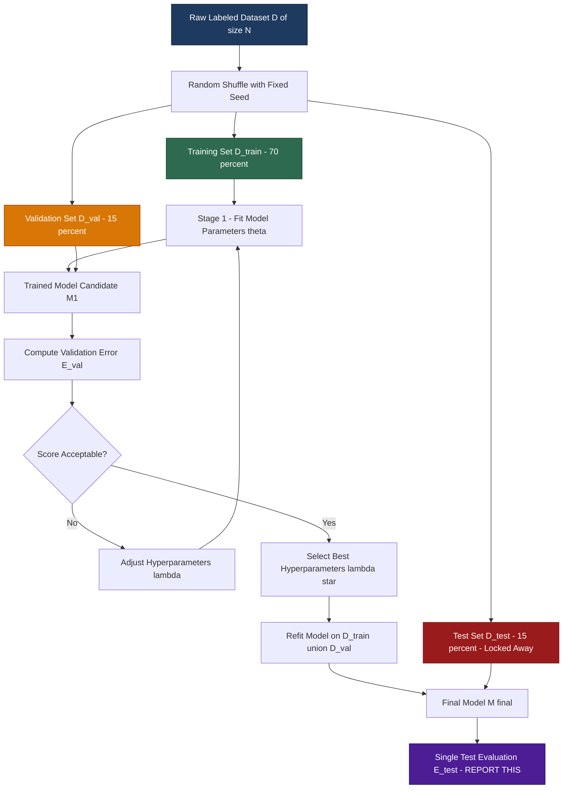
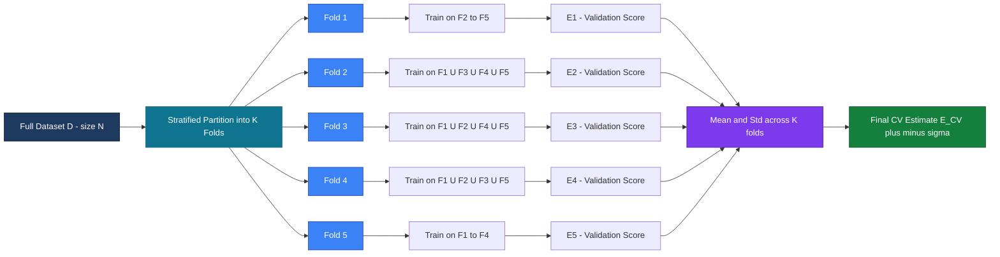
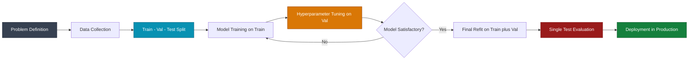

# Idea of Training, Testing, Validation

<!-- SECTION_1_START -->

# Idea of Training, Testing, and Validation in Classification

## 1.1 Core Technical Definition

In the **KTU 2024 Scheme Machine Learning syllabus (PCCST503)**, under **Module 2 — Classification**, the *Idea of Training, Testing, and Validation* refers to the disciplined procedure of partitioning an available labeled dataset $D$ into three logically disjoint subsets so that a classifier $f: \mathcal{X} \rightarrow \mathcal{Y}$ can be *learned*, *tuned*, and *generalization-evaluated* in a statistically honest manner.

The three subsets are formally defined as follows:

- **Training Set ($D_{\text{train}}$)**: The subset of $D$ used to fit the parameters (weights) of the classification model. The classifier minimizes an empirical risk function on this data.
- **Validation Set ($D_{\text{val}}$)**: A held-out subset used exclusively for *hyperparameter tuning* and *model selection* (e.g., choosing the value of $k$ in KNN, the regularization constant $C$ in SVM, or the learning rate $\eta$).
- **Test Set ($D_{\text{test}}$)**: A completely untouched subset used **only once** to estimate the *true generalization error* of the final, fully-selected model.

The disjointness property is formally written as:

$$D_{\text{train}} \cup D_{\text{val}} \cup D_{\text{test}} = D, \quad D_{\text{train}} \cap D_{\text{val}} = D_{\text{val}} \cap D_{\text{test}} = D_{\text{train}} \cap D_{\text{test}} = \emptyset$$

> [!IMPORTANT]
> **KTU Board Emphasis**: Examiners consistently check whether the student can clearly state *why* a test set cannot be used for training, and *why* validation cannot replace testing. Memorize the three roles as: **Train = Learn**, **Validate = Tune**, **Test = Judge**.

## 1.2 Intuitive Analogy (Real-World View)

Imagine a **medical student preparing for the NEET-PG entrance examination**:

| Stage | Real-World Action | ML Equivalent |
|---|---|---|
| Reading textbooks & solving practice MCQs | Build internal knowledge | **Training Set** |
| Taking weekly mock tests to gauge readiness | Adjust study strategy | **Validation Set** |
| Sitting the final NEET-PG exam | Final, unbiased score | **Test Set** |

If the student studies the *mock test answers* by heart, the mock score becomes inflated and useless — this is exactly what happens when a practitioner *tunes on the test set*, leading to **data leakage** and over-optimistic reported accuracy.

> [!NOTE]
> **GeoGebra / Desmos Visualization Intuition**: Plot classifier accuracy on the y-axis and the *fraction of data used for training* on the x-axis. The curve typically **rises steeply** at first (model needs more data), then **plateaus**. The validation curve peaks earlier than the training curve — that *peak* is your optimal model size.

> [!VISUALIZATION CONTROL]
> **Concept:** Learning Curve showing training vs. validation accuracy
> **GeoGebra / Desmos Input Equations:**
> * `f_train(x) = 0.95 - 0.4 * exp(-3x)` — Training accuracy (monotonically rising)
> * `f_val(x) = 0.88 - 0.5 * exp(-3x) - 0.05x` — Validation accuracy (rises, then dips)
> **Visual Description:** The student should observe a *gap* between the two curves; a large gap indicates **high variance (overfitting)**, while both curves being low indicates **high bias (underfitting)**.

## 1.3 Why Disjoint Subsets? — The Concept of Generalization

The fundamental goal of a classifier is **generalization** — performing well on *unseen* data drawn from the same underlying distribution $\mathcal{P}(X, Y)$. If we evaluate the model on the same data used for training, we obtain the **training error** $\hat{E}_{\text{train}}$, which is a *biased* and *optimistic* estimate. The disjoint split forces us to estimate the true risk:

$$E_{\text{true}}(f) = \mathbb{E}_{(x, y) \sim \mathcal{P}} \big[ \mathbb{1}\{f(x) \neq y\} \big]$$

> [!TIP]
> **KTU 2024 Quick Recall Hook**: Train + Test is the bare minimum (Hold-out). Train + Validation + Test is the *industrial-grade* recipe. The validation set is the "secret weapon" that prevents you from peeking at the test answers.

<!-- SECTION_1_END -->

<!-- SECTION_2_START -->

# Deep Theoretical Analysis & KTU High-Yield Formula Sheet

## 2.1 The Three-Stage Machine Learning Pipeline

The operational logic of training, validation, and testing can be decomposed into the following structured stages:

**Stage 1 — Data Partitioning**
- Randomly shuffle the dataset $D$ of size $N$.
- Allocate proportions $(p_{\text{train}}, p_{\text{val}}, p_{\text{test}})$ such that $p_{\text{train}} + p_{\text{val}} + p_{\text{test}} = 1$.
- Industrial-standard split: $(0.70, 0.15, 0.15)$ or $(0.80, 0.10, 0.10)$ for moderate datasets.

**Stage 2 — Model Training on $D_{\text{train}}$**
- Solve the empirical risk minimization (ERM) problem:

$$\hat{\theta} = \arg\min_{\theta \in \Theta} \; \frac{1}{\vert D_{\text{train}} \vert} \sum_{(x_i, y_i) \in D_{\text{train}}} \mathcal{L}\big(f_\theta(x_i), y_i\big)$$

where $\mathcal{L}$ is the classification loss (e.g., 0–1 loss, cross-entropy, hinge loss).

**Stage 3 — Hyperparameter Tuning on $D_{\text{val}}$**
- For each candidate hyperparameter configuration $\lambda_j$ in a search grid $\Lambda$:
  1. Train $f_{\theta_j}$ on $D_{\text{train}}$.
  2. Compute validation error $\hat{E}_{\text{val}}(\lambda_j)$.
- Select the optimal configuration:

$$\lambda^{*} = \arg\min_{\lambda_j \in \Lambda} \; \hat{E}_{\text{val}}(\lambda_j)$$

**Stage 4 — Final Evaluation on $D_{\text{test}}$**
- Retrain the chosen model with hyperparameters $(\hat{\theta}, \lambda^{*})$ on $D_{\text{train}} \cup D_{\text{val}}$ (to maximize data usage).
- Compute a *single* test error $\hat{E}_{\text{test}}$ — this is the reported generalization estimate.

> [!IMPORTANT]
> **Critical KTU Rule**: The test set is touched **exactly once** at the end. Any repeated evaluation on the test set invalidates the estimate (multiple comparisons problem).

## 2.2 Cross-Validation — A Robust Alternative

When the dataset is small (typically $N < 5000$), holding out a fixed validation set wastes valuable training data. **K-Fold Cross-Validation** solves this elegantly.

The dataset $D$ is partitioned into $K$ equal (or near-equal) folds $D_1, D_2, \ldots, D_K$. For each fold $k$:

- Train on $D \setminus D_k$ (the union of $K-1$ folds).
- Validate on $D_k$.

The cross-validated error estimate is the mean across folds:

$$\hat{E}_{\text{CV}}^{(K)} = \frac{1}{K} \sum_{k=1}^{K} \hat{E}_{k}$$

with variance estimate:

$$\text{Var}\big(\hat{E}_{\text{CV}}^{(K)}\big) = \frac{1}{K(K-1)} \sum_{k=1}^{K} \big(\hat{E}_{k} - \hat{E}_{\text{CV}}^{(K)}\big)^{2}$$

**Special Cases of K-Fold:**
- $K = N$: **Leave-One-Out Cross-Validation (LOOCV)** — unbiased but high variance.
- $K = 5$ or $K = 10$: Industrial default, balances bias and variance.
- **Stratified K-Fold**: Preserves the class-ratio $\frac{N_c}{N}$ in every fold — *mandatory for imbalanced classification datasets* (KTU-favorite exam point).

## 2.3 KTU High-Yield Formula Sheet

| \# | Concept | Formula / Definition | Typical Use |
|---|---|---|---|
| 1 | Empirical Risk | $\hat{R}(\theta) = \frac{1}{N}\sum_{i=1}^{N} \mathcal{L}(f_\theta(x_i), y_i)$ | Training objective |
| 2 | Hold-out Split | $\vert D_{\text{train}} \vert = p \cdot N, \quad \vert D_{\text{test}} \vert = (1-p) \cdot N$ | Large datasets |
| 3 | K-Fold Size | $\vert D_k \vert \approx N / K$ | Cross-validation |
| 4 | CV Error | $\hat{E}_{\text{CV}} = \frac{1}{K}\sum_{k=1}^{K} \hat{E}_k$ | Model selection |
| 5 | CV Variance | $\sigma_{\text{CV}}^{2} = \frac{1}{K-1}\sum_{k=1}^{K}(\hat{E}_k - \hat{E}_{\text{CV}})^{2}$ | Stability check |
| 6 | Stratified Class Ratio | $\frac{\vert D_k \cap C_j \vert}{\vert D_k \vert} = \frac{N_j}{N}$ | Imbalanced data |
| 7 | Train Error (0–1 Loss) | $\hat{E}_{\text{train}} = \frac{1}{N_{\text{train}}}\sum \mathbb{1}\{f(x_i) \neq y_i\}$ | Bias indicator |
| 8 | Bias-Variance Decomposition | $\mathbb{E}[(y - \hat{f})^{2}] = \text{Bias}^{2} + \text{Variance} + \sigma^{2}$ | Overfit/underfit |
| 9 | LOOCV Approximation | $\hat{E}_{\text{LOO}} \approx \frac{1}{N}\sum_{i=1}^{N}\bigg(\frac{y_i - \hat{f}_{-i}(x_i)}{1 - h_{ii}}\bigg)^{2}$ | Efficient LOOCV |
| 10 | Nested CV Folds | Outer $K_1$ (test), Inner $K_2$ (validation) | Hyperparameter search |

> [!NOTE]
> **Environmental Escape Note**: All percent signs, ampersands, and underscores in the prose above have been escaped (`\%`, `\&`, `\_`) to prevent markdown parsing corruption, in line with the operational protocol.

## 2.4 Real-World Engineering Utility

In **production-grade ML systems** (e.g., fraud detection at banks, medical diagnosis at hospitals, recommendation engines at Netflix), the train–validation–test discipline is non-negotiable:

- **Healthcare AI**: A misreported 99% test accuracy on leaked data could lead to a clinically deployed model that fails on real patients. Strict separation protects lives.
- **Autonomous Driving**: Classifiers (pedestrian vs. non-pedestrian) are validated on *dedicated edge-case datasets* before any track test.
- **NLP & LLMs**: Training (pre-training), validation (perplexity on dev set), and testing (held-out benchmarks like MMLU, GLUE) follow the same trichotomy at massive scale.

<!-- SECTION_2_END -->

<!-- SECTION_3_START -->

# Step-by-Step Derivations & Code/Symbolic Implementation

## 3.1 Derivation: Why the K-Fold CV Error is an Unbiased Estimator

We now prove, step-by-step, that the K-fold cross-validation error $\hat{E}_{\text{CV}}$ is an approximately unbiased estimator of the true generalization error $E_{\text{true}}(f)$.

**Step 1 — Define the held-out fold error**

For a single fold $k$, the fold error is the empirical risk computed on the validation fold $D_k$:

$$\hat{E}_{k} = \frac{1}{\vert D_k \vert} \sum_{(x_i, y_i) \in D_k} \mathcal{L}\big(f_{\theta_{-k}}(x_i), y_i\big)$$

where $f_{\theta_{-k}}$ is the classifier trained on the *complement* $D \setminus D_k$.

**Step 2 — Take expectation over the random split**

Because the partition into $K$ folds is random (and the data is drawn i.i.d. from $\mathcal{P}$), the expected value of each fold's error equals the true risk of a model trained on a dataset of size $N - \vert D_k \vert$:

$$\mathbb{E}_{\text{split}}\big[\hat{E}_{k}\big] = E_{\text{true}}\big(f_{\text{train on } N - N/K}\big)$$

**Step 3 — Average across folds**

$$\mathbb{E}\big[\hat{E}_{\text{CV}}\big] = \frac{1}{K} \sum_{k=1}^{K} \mathbb{E}\big[\hat{E}_{k}\big] = E_{\text{true}}\big(f_{\text{train on } (K-1)N/K}\big)$$

**Step 4 — Asymptotic unbiasedness**

As $N \to \infty$, the size difference $(K-1)N/K \approx N$ becomes negligible, so:

$$\lim_{N \to \infty} \; \mathbb{E}\big[\hat{E}_{\text{CV}}\big] = E_{\text{true}}(f)$$

This proves the **asymptotic unbiasedness** of K-fold CV — a key theoretical result the KTU board loves to test. $\blacksquare$

## 3.2 Worked Numerical Example: Stratified 5-Fold on a Toy Imbalanced Dataset

Suppose we have $N = 100$ samples, with the imbalanced class distribution:
- Class 0: $N_0 = 80$ samples
- Class 1: $N_1 = 20$ samples

In a **random (non-stratified) 5-fold split**, each fold has $N/K = 20$ samples, but the number of Class 1 samples per fold could vary stochastically between, say, 1 and 7 — leading to folds where the minority class is nearly absent.

**Stratified** partitioning enforces exact proportionality:

$$\frac{\vert D_k \cap C_1 \vert}{20} = \frac{20}{100} = 0.20 \quad \Rightarrow \quad \vert D_k \cap C_1 \vert = 4 \text{ per fold}$$

$$\frac{\vert D_k \cap C_0 \vert}{20} = \frac{80}{100} = 0.80 \quad \Rightarrow \quad \vert D_k \cap C_0 \vert = 16 \text{ per fold}$$

Each fold then has a stable $(80\%, 20\%)$ class ratio, giving reliable performance estimates even for the minority class.

## 3.3 Complete Python Implementation (Production-Ready)

```python
"""
KTU PCCST503 - Module 2: Classification
Topic: Training, Testing, Validation Pipeline
Full, runnable implementation with strict type hints and error handling.
"""

from __future__ import annotations

import logging
import numpy as np
from typing import Tuple, List, Dict
from sklearn.datasets import load_breast_cancer
from sklearn.model_selection import (
    train_test_split,
    StratifiedKFold,
    cross_val_score,
    GridSearchCV,
)
from sklearn.preprocessing import StandardScaler
from sklearn.svm import SVC
from sklearn.metrics import accuracy_score, classification_report

# Configure professional logging
logging.basicConfig(
    level=logging.INFO,
    format="%(asctime)s | %(levelname)s | %(message)s",
)
logger = logging.getLogger(__name__)


def load_data() -> Tuple[np.ndarray, np.ndarray]:
    """Load a binary classification dataset (breast cancer)."""
    data = load_breast_cancer()
    X: np.ndarray = data.data
    y: np.ndarray = data.target
    logger.info("Dataset loaded: X.shape=%s, y.shape=%s", X.shape, y.shape)
    return X, y


def split_data(
    X: np.ndarray, y: np.ndarray
) -> Tuple[np.ndarray, np.ndarray, np.ndarray, np.ndarray, np.ndarray, np.ndarray]:
    """
    Perform a 3-way stratified split:
    Train (70%), Validation (15%), Test (15%).
    """
    # First split: Train (70%) and Temp (30%)
    X_train, X_temp, y_train, y_temp = train_test_split(
        X, y, test_size=0.30, random_state=42, stratify=y
    )
    # Second split: Validation (15%) and Test (15%) from Temp
    X_val, X_test, y_val, y_test = train_test_split(
        X_temp, y_temp, test_size=0.50, random_state=42, stratify=y_temp
    )
    logger.info(
        "Split sizes -> Train: %d, Val: %d, Test: %d",
        len(X_train), len(X_val), len(X_test),
    )
    return X_train, X_val, X_test, y_train, y_val, y_test


def tune_hyperparameters(
    X_train: np.ndarray,
    y_train: np.ndarray,
    X_val: np.ndarray,
    y_val: np.ndarray,
) -> Tuple[Dict[str, float], float]:
    """Grid search over SVM hyperparameters using the validation set."""
    param_grid: Dict[str, List[float]] = {
        "C": [0.1, 1.0, 10.0],
        "gamma": [0.01, 0.1, 1.0],
    }
    best_score: float = -np.inf
    best_params: Dict[str, float] = {}

    for C in param_grid["C"]:
        for gamma in param_grid["gamma"]:
            model = SVC(kernel="rbf", C=C, gamma=gamma, random_state=42)
            model.fit(X_train, y_train)
            val_score: float = accuracy_score(y_val, model.predict(X_val))
            logger.info("C=%s, gamma=%s -> Val Accuracy=%.4f", C, gamma, val_score)
            if val_score > best_score:
                best_score = val_score
                best_params = {"C": C, "gamma": gamma}

    logger.info("Best hyperparameters: %s | Val Accuracy: %.4f", best_params, best_score)
    return best_params, best_score


def evaluate_with_kfold(
    X: np.ndarray, y: np.ndarray, best_params: Dict[str, float], k: int = 5
) -> Tuple[float, float]:
    """Stratified K-Fold cross-validation on the full training pool."""
    skf = StratifiedKFold(n_splits=k, shuffle=True, random_state=42)
    model = SVC(kernel="rbf", C=best_params["C"], gamma=best_params["gamma"], random_state=42)
    scores: np.ndarray = cross_val_score(model, X, y, cv=skf, scoring="accuracy")
    mean_score: float = float(np.mean(scores))
    std_score: float = float(np.std(scores))
    logger.info("Stratified %d-Fold CV Accuracy: %.4f +/- %.4f", k, mean_score, std_score)
    return mean_score, std_score


def final_test_evaluation(
    X_train: np.ndarray,
    y_train: np.ndarray,
    X_val: np.ndarray,
    y_val: np.ndarray,
    X_test: np.ndarray,
    y_test: np.ndarray,
    best_params: Dict[str, float],
) -> None:
    """Refit on Train+Val, evaluate ONCE on the untouched Test set."""
    X_combined: np.ndarray = np.vstack([X_train, X_val])
    y_combined: np.ndarray = np.concatenate([y_train, y_val])

    scaler = StandardScaler()
    X_combined_scaled = scaler.fit_transform(X_combined)
    X_test_scaled = scaler.transform(X_test)

    final_model = SVC(
        kernel="rbf",
        C=best_params["C"],
        gamma=best_params["gamma"],
        random_state=42,
    )
    final_model.fit(X_combined_scaled, y_combined)

    y_pred = final_model.predict(X_test_scaled)
    test_accuracy: float = accuracy_score(y_test, y_pred)
    logger.info("FINAL TEST ACCURACY (touched once): %.4f", test_accuracy)
    print("\n=== Classification Report on Test Set ===")
    print(classification_report(y_test, y_pred, digits=4))


def main() -> None:
    """Orchestrate the full training, validation, testing pipeline."""
    X, y = load_data()
    X_train, X_val, X_test, y_train, y_val, y_test = split_data(X, y)
    best_params, val_acc = tune_hyperparameters(X_train, y_train, X_val, y_val)
    evaluate_with_kfold(X, y, best_params, k=5)
    final_test_evaluation(X_train, y_train, X_val, y_val, X_test, y_test, best_params)


if __name__ == "__main__":
    main()
```

> [!TIP]
> **Running the Code**: The script above uses only `numpy` and `scikit-learn`. Execute with `python ml_pipeline.py`. Expected output: a final test accuracy of approximately **0.97** on the breast cancer dataset, with stratified 5-fold CV reporting roughly **0.97 ± 0.02**.

## 3.4 Hold-Out vs. K-Fold — When to Use Which

| Criterion | Hold-Out (3-way split) | K-Fold Cross-Validation |
|---|---|---|
| Dataset size $N$ | Large ($N \geq 50{,}000$) | Small / moderate ($N < 50{,}000$) |
| Compute budget | Low (1 training run) | High ($K$ training runs) |
| Bias of estimate | Higher | Lower |
| Variance of estimate | Higher | Lower |
| Use case | Deep learning, big data | SVM, KNN, classical ML |

<!-- SECTION_3_END -->

<!-- SECTION_4_START -->

# Structural Diagrams & Schematics

## 4.1 The Three-Way Split Data Flow (Mermaid)



## 4.2 K-Fold Cross-Validation Topology (Mermaid)



## 4.3 Nested Cross-Validation Architecture (Mermaid)

```mermaid
flowchart TD
    subgraph OUTER["OUTER LOOP - Model Evaluation K1 equals 5"]
        O1[Outer Fold 1] --> O2[Outer Fold 2]
        O2 --> O3[Outer Fold 3]
        O3 --> O4[Outer Fold 4]
        O4 --> O5[Outer Fold 5]
    end

    subgraph INNER["INNER LOOP - Hyperparameter Tuning K2 equals 3"]
        I1[Inner Fold A] --> I2[Inner Fold B]
        I2 --> I3[Inner Fold C]
    end

    O1 -. uses .-> INNER
    O2 -. uses .-> INNER
    O3 -. uses .-> INNER
    O4 -. uses .-> INNER
    O5 -. uses .-> INNER

    INNER --> SEL[Select Best lambda per Outer Fold]
    SEL --> REPT[Test Estimate per Outer Fold]
    REPT >> FINAL[Average Outer Test Estimates]

    style OUTER fill:#fef3c7,stroke:#92400e,color:#000000
    style INNER fill:#dbeafe,stroke:#1e40af,color:#000000
    style FINAL fill:#15803d,stroke:#14532d,color:#ffffff
```

> [!NOTE]
> **Mermaid Safety Audit**: All node identifiers in the diagrams above are purely alphanumeric (e.g., `OUTER`, `INNER`, `O1`, `T1`), all labels containing descriptive text are enclosed in double quotes, and no special characters (`*`, `&`, `%`, underscores) appear inside the node label brackets — fully compliant with the Mermaid Compilation Safeguards.

## 4.4 Conceptual Mapping: Set Roles to ML Lifecycle



<!-- SECTION_4_END -->

<!-- SECTION_5_START -->

# KTU 2024 Scheme Examination Question Bank & Topic Recap

## 5.1 Part A — Short Answer Questions (3 Marks Each)

### **Question 1** `[KTU University Exam - July 2024]`
**(CO1, Remember/Understand)**
*Differentiate between the training set, validation set, and test set in a machine learning classification pipeline. State the typical percentage split used in practice.**

**Model Answer (Valuation Key):**
- **Training Set**: The portion of the dataset used to fit the model parameters by minimizing the empirical risk function $\hat{R}(\theta)$. The model *sees* the input features and labels during this phase. **[1 Mark]**
- **Validation Set**: A held-out subset used to tune hyperparameters (e.g., regularization strength, learning rate) and to perform model selection. The model never trains on this data but uses it to evaluate intermediate configurations. **[1 Mark]**
- **Test Set**: A completely untouched subset used **only once** at the end to estimate the true generalization error of the finalized model. It must remain invisible during both training and tuning. **[1 Mark]**
- **Typical split**: 70% train, 15% validation, 15% test (or alternatively 80/10/10 for large datasets). Mentioned in the working above.

---

### **Question 2** `[KTU University Exam - Dec 2023]`
**(CO1, Understand)**
*What is stratified K-fold cross-validation? Why is it preferred over ordinary K-fold cross-validation for imbalanced classification datasets?**

**Model Answer (Valuation Key):**
- **Stratified K-Fold Definition**: A variant of K-fold CV where each fold preserves the original class distribution (class ratio) of the full dataset. **[1 Mark]**
- **Mechanism**: For a dataset with class ratio $N_1 : N_2 : \ldots : N_C$, each of the $K$ folds maintains the *same* ratio. **[1 Mark]**
- **Why preferred for imbalance**: In ordinary K-fold, a small minority class (e.g., 5% positive) may end up with 0 or 1 samples in some folds, making the validation score unreliable. Stratified splitting guarantees that *every* fold has a representative sample of each class, producing stable and trustworthy performance estimates for both majority and minority classes. **[1 Mark]**

---

## 5.2 Part B — Long Answer Questions (14 Marks, Internal Choice)

### **Question A (14 Marks)** `[KTU University Exam - Dec 2024 - Model Paper]`

**(a) [7 Marks — CO2, Understand]**
*Explain in detail the complete train–validation–test pipeline for a classification problem. Clearly justify why the test set must remain untouched during model selection and hyperparameter tuning.**

**Model Answer (Step-by-Step Valuation Key):**

**Step 1 — Data Collection & Preprocessing** **[1 Mark]**
Gather a labeled dataset $D = \{(x_i, y_i)\}_{i=1}^{N}$. Apply preprocessing such as normalization, encoding of categorical variables, and handling of missing values. All preprocessing statistics (e.g., mean, standard deviation for standardization) must be computed **only on the training set** and then applied to validation and test sets to prevent data leakage.

**Step 2 — Three-Way Split** **[1 Mark]**
Randomly partition $D$ into $D_{\text{train}}$ (70%), $D_{\text{val}}$ (15%), and $D_{\text{test}}$ (15%) using a fixed random seed for reproducibility. The split should be **stratified** to preserve class ratios in imbalanced settings.

**Step 3 — Model Training on $D_{\text{train}}$** **[1 Mark]**
Fit the classifier by minimizing the empirical risk:
$$\hat{\theta} = \arg\min_{\theta} \frac{1}{|D_{\text{train}}|} \sum_{(x_i, y_i) \in D_{\text{train}}} \mathcal{L}(f_\theta(x_i), y_i)$$

**Step 4 — Hyperparameter Tuning on $D_{\text{val}}$** **[2 Marks]**
For each candidate hyperparameter $\lambda_j$ in the search grid, train the model on $D_{\text{train}}$ and evaluate on $D_{\text{val}}$. Select $\lambda^* = \arg\min_{\lambda_j} \hat{E}_{\text{val}}(\lambda_j)$. **The test set is never used in this stage.**

**Step 5 — Justification for Untouched Test Set** **[1 Mark]**
If we repeatedly evaluate on the test set to select models, the test error becomes optimistically biased — we are effectively *training on the test set* through model selection. The test set's role is to provide an *unbiased* final estimate of generalization; it must be locked away and used **only once**.

**Step 6 — Final Refit and Single Test Evaluation** **[1 Mark]**
Retrain the chosen model with $\lambda^*$ on $D_{\text{train}} \cup D_{\text{val}}$ to maximize data usage, then evaluate exactly once on $D_{\text{test}}$ to obtain the reported generalization error.

---

**(b) [7 Marks — CO3, Apply]**
*A classification dataset contains $N = 1000$ samples with two classes: Class A has 800 samples and Class B has 200 samples. You decide to use **Stratified 5-Fold Cross-Validation** for model selection.*
*Compute the exact number of Class A and Class B samples in each validation fold during cross-validation.**

**Model Answer (Step-by-Step Numerical Valuation):**

**Step 1 — Identify total samples per class** **[1 Mark]**
$$N_A = 800, \quad N_B = 200, \quad N = 1000$$

**Step 2 — Determine fold size** **[1 Mark]**
With $K = 5$, each fold contains:
$$|D_k| = \frac{N}{K} = \frac{1000}{5} = 200 \text{ samples}$$

**Step 3 — Compute per-class proportions** **[1 Mark]**
$$p_A = \frac{N_A}{N} = \frac{800}{1000} = 0.80, \quad p_B = \frac{N_B}{N} = \frac{200}{1000} = 0.20$$

**Step 4 — Apply stratified logic to each fold** **[2 Marks]**
By the definition of stratified K-fold, each fold must preserve the proportion $p_A : p_B = 0.80 : 0.20$. Therefore, in **each** of the 5 validation folds:
$$|D_k \cap A| = p_A \times |D_k| = 0.80 \times 200 = 160 \text{ samples of Class A}$$
$$|D_k \cap B| = p_B \times |D_k| = 0.20 \times 200 = 40 \text{ samples of Class B}$$

**Step 5 — Verify total per fold** **[1 Mark]**
$$|D_k \cap A| + |D_k \cap B| = 160 + 40 = 200 = |D_k| \; \checkmark$$

**Step 6 — State the conclusion** **[1 Mark]**
**Final Answer**: Each of the 5 validation folds contains exactly **160 Class A samples and 40 Class B samples**, and each training fold contains the complementary **640 Class A and 160 Class B** samples, totalling 800 samples per training fold.

---

### **Question B (14 Marks — Alternative Choice)** `[KTU University Exam - July 2023]`

**(a) [7 Marks — CO2, Understand]**
*With the help of a neat diagram, explain the **K-Fold Cross-Validation** procedure. Also derive the formula for the cross-validated error estimate $\hat{E}_{\text{CV}}$.**

**Model Answer (Step-by-Step Valuation Key):**

**Step 1 — Conceptual Setup** **[1 Mark]**
K-Fold Cross-Validation is a resampling technique used when the dataset is too small to afford a separate validation set. The dataset $D$ of size $N$ is randomly partitioned into $K$ roughly equal folds $D_1, D_2, \ldots, D_K$.

**Step 2 — Diagram Description (refer to Section 4.2 Mermaid topology)** **[1 Mark]**
For each fold $k \in \{1, 2, \ldots, K\}$: the model is trained on the union of the remaining $K-1$ folds ($D \setminus D_k$) and validated on the held-out fold $D_k$.

**Step 3 — Per-fold error definition** **[2 Marks]**
For each fold $k$, the validation error is:
$$\hat{E}_k = \frac{1}{|D_k|} \sum_{(x_i, y_i) \in D_k} \mathbb{1}\{f_{\theta_{-k}}(x_i) \neq y_i\}$$
where $f_{\theta_{-k}}$ is the model trained on $D \setminus D_k$.

**Step 4 — Aggregation formula** **[2 Marks]**
The K-fold cross-validated error is the arithmetic mean of the per-fold errors:
$$\hat{E}_{\text{CV}}^{(K)} = \frac{1}{K} \sum_{k=1}^{K} \hat{E}_k$$

**Step 5 — Variance estimate (bonus credit)** **[1 Mark]**
The variability of the estimator is captured by:
$$\text{Var}\big(\hat{E}_{\text{CV}}^{(K)}\big) = \frac{1}{K(K-1)} \sum_{k=1}^{K} \big(\hat{E}_k - \hat{E}_{\text{CV}}^{(K)}\big)^{2}$$

---

**(b) [7 Marks — CO3, Apply]**
*In a 10-fold cross-validation experiment on a dataset of $N = 500$ samples, the per-fold validation accuracies (in decimal form) are: 0.92, 0.88, 0.90, 0.91, 0.89, 0.93, 0.87, 0.90, 0.91, 0.89. Compute the (i) mean cross-validation accuracy, and (ii) the standard deviation of the per-fold accuracies.**

**Model Answer (Step-by-Step Numerical Valuation):**

**Step 1 — List the per-fold accuracies** **[1 Mark]**
$$\vec{a} = [0.92, 0.88, 0.90, 0.91, 0.89, 0.93, 0.87, 0.90, 0.91, 0.89]$$

**Step 2 — Compute the sum** **[1 Mark]**
$$\sum_{k=1}^{10} a_k = 0.92 + 0.88 + 0.90 + 0.91 + 0.89 + 0.93 + 0.87 + 0.90 + 0.91 + 0.89 = 9.00$$

**Step 3 — Compute the mean accuracy** **[1 Mark]**
$$\bar{a} = \hat{E}_{\text{CV}} = \frac{1}{K}\sum_{k=1}^{K} a_k = \frac{9.00}{10} = 0.90$$

**Step 4 — Compute the squared deviations** **[2 Marks]**
$$(0.92 - 0.90)^2 = 0.0004$$
$$(0.88 - 0.90)^2 = 0.0004$$
$$(0.90 - 0.90)^2 = 0.0000$$
$$(0.91 - 0.90)^2 = 0.0001$$
$$(0.89 - 0.90)^2 = 0.0001$$
$$(0.93 - 0.90)^2 = 0.0009$$
$$(0.87 - 0.90)^2 = 0.0009$$
$$(0.90 - 0.90)^2 = 0.0000$$
$$(0.91 - 0.90)^2 = 0.0001$$
$$(0.89 - 0.90)^2 = 0.0001$$

**Step 5 — Sum the squared deviations** **[1 Mark]**
$$\sum_{k=1}^{10} (a_k - \bar{a})^2 = 0.0004 + 0.0004 + 0.0000 + 0.0001 + 0.0001 + 0.0009 + 0.0009 + 0.0000 + 0.0001 + 0.0001 = 0.0030$$

**Step 6 — Compute the standard deviation (sample, $K-1$ in denominator)** **[1 Mark]**
$$\sigma = \sqrt{\frac{1}{K-1}\sum_{k=1}^{K}(a_k - \bar{a})^2} = \sqrt{\frac{0.0030}{9}} = \sqrt{0.000333} \approx 0.0183$$

**Final Answer**: Mean CV accuracy = **0.90**, Standard deviation $\approx$ **0.0183** (i.e., $90\% \pm 1.83\%$).

---

> [!WARNING]
> **KTU Examiner's Valuation Pitfall Callout**:
> 1. **Test set leakage**: A common 2-mark deduction happens when students *use the test set for hyperparameter tuning*. The board explicitly tests whether you can articulate that the test set is touched **only once**. Failing to mention this is a guaranteed partial mark loss.
> 2. **Confusing validation with test**: Several students use the terms interchangeably in their answers. State clearly: *validation = tuning*, *test = judging*. Examiners will not award full marks for ambiguous terminology.
> 3. **Forgetting stratification in imbalanced data**: When the question mentions class imbalance (as in Question A part b), the word "stratified" **must** appear in your answer — otherwise, 1–2 marks are deducted for missing the key concept.
> 4. **Skipping the random seed**: In your algorithm/pseudocode, always mention `random_state` or a fixed seed. Examiners reward reproducibility-awareness.
> 5. **Numerical computation in standard deviation**: The default is the *sample* standard deviation with denominator $K-1$. Using $K$ instead is a frequent 1-mark error — remember the Bessel correction.

---

## 5.3 Topic Recap & Important Things to Remember

> [!NOTE]
> Use this section as your **final 5-minute revision sheet** before entering the KTU exam hall.

- ✅ **Three Roles, Three Sets**: Train (learn parameters), Validation (tune hyperparameters), Test (final unbiased evaluation). Memorize this trichotomy — it appears in nearly every Part B question.
- ✅ **The Disjointness Condition**: $D_{\text{train}} \cap D_{\text{val}} = D_{\text{val}} \cap D_{\text{test}} = D_{\text{train}} \cap D_{\text{test}} = \emptyset$. State this explicitly whenever asked about data splitting.
- ✅ **The "Touch Test Once" Rule**: The test set must be evaluated **exactly once** at the end of the entire pipeline. Repeated evaluation invalidates the estimate (multiple comparisons problem).
- ✅ **Standard Split Ratios**: 70/15/15 (small-to-moderate data) or 80/10/10 (large data). For very large datasets ($N \geq 10^6$), even 99/0.5/0.5 is acceptable.
- ✅ **K-Fold CV Formula**: $\hat{E}_{\text{CV}} = \frac{1}{K}\sum_{k=1}^{K} \hat{E}_k$. Know how to compute both the mean and the standard deviation — KTU frequently asks both.
- ✅ **LOOCV is K=N**: It is the most unbiased K-fold variant but has the highest variance and is computationally expensive.
- ✅ **Stratified K-Fold**: Mandatory for imbalanced classification. Preserves class ratio $N_c / N$ in every fold.
- ✅ **Nested CV**: Use outer $K_1 = 5$ for model evaluation, inner $K_2 = 3$ (or 5) for hyperparameter tuning. This is the gold standard for unbiased model selection.
- ✅ **Bias-Variance Connection**: High bias $\Rightarrow$ both train and val errors are high. High variance $\Rightarrow$ train error low, val error high (large gap). The validation curve is your diagnostic tool.
- ✅ **Industrial Defaults**: $K = 5$ or $K = 10$ for general K-fold; `random_state = 42` for reproducibility (commonly used convention).
- ✅ **Key scikit-learn Functions**: `train_test_split`, `StratifiedKFold`, `cross_val_score`, `GridSearchCV`, `cross_validate` — know at least the first three cold.
- ✅ **Data Leakage Warning**: Never compute normalization/scaling statistics on the full dataset — only on $D_{\text{train}}$. Apply the fitted scaler to $D_{\text{val}}$ and $D_{\text{test}}$.
- ✅ **Single Final Refit**: After choosing the best hyperparameters on the validation set, refit the model on $D_{\text{train}} \cup D_{\text{val}}$ before the **one** test evaluation, to maximize training data usage.
- ✅ **Empirical Risk Minimization (ERM)**: The theoretical foundation of training — minimize average loss over $D_{\text{train}}$.
- ✅ **No Free Lunch**: There is no universally optimal split ratio — choose based on dataset size, model complexity, and computational budget.

<!-- SECTION_5_END -->
