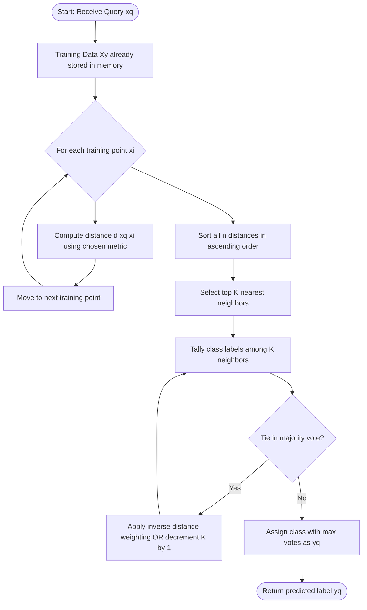
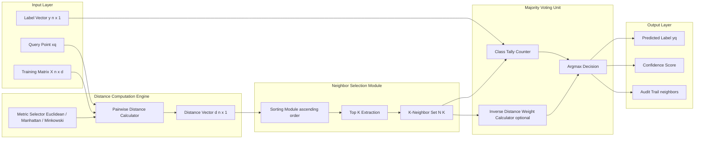
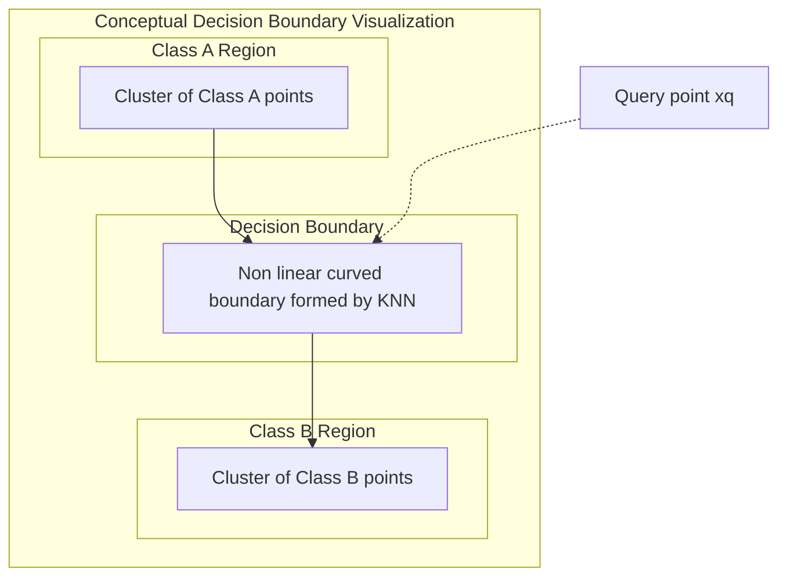
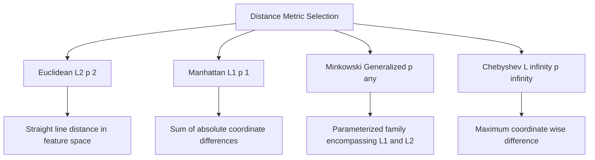

# KNN

<!-- SECTION_1_START -->
# K-Nearest Neighbors (KNN) Classifier

## 1.1 Formal Academic Definition (KTU 2024 Syllabus Terminology)

**K-Nearest Neighbors (KNN)** is a fundamental, non-parametric, instance-based (lazy learning) supervised machine learning algorithm used primarily for **classification** and secondarily for regression. In the context of Module 2 — Classification, KNN classifies an unseen query instance by identifying the **K** most similar training samples in the feature space using a distance metric, then assigning the class label based on a **majority voting** (plurality) scheme among those neighbors.

> [!IMPORTANT]
> **KTU Syllabus Highlight:** KNN is a *lazy learner* — it performs no explicit generalization during training. All computation is deferred until query time. The model effectively **memorizes** the training dataset, $D = \{(x_i, y_i)\}_{i=1}^{n}$.

Formally, given a query point $x_q$ and a training set with $n$ labeled instances, KNN performs two operations:

$$
\hat{y}(x_q) = \text{mode}\left(\{y_i \mid x_i \in N_K(x_q)\}\right)
$$

where $N_K(x_q)$ denotes the set of the $K$ training points closest to $x_q$ under a chosen distance function $d(\cdot, \cdot)$.

---

## 1.2 Conceptual Analogy & Plain-English Intuition

> [!NOTE]
> **Real-World Analogy — "Asking Your Neighbors for Advice"**
> Imagine you have just moved into a new neighborhood and want to find a good restaurant. You do **not** read a comprehensive review guide (no training phase, no model building). Instead, you knock on the doors of the **5 nearest houses** ($K = 5$) and ask each neighbor which restaurant they prefer. You then go to the restaurant that gets the **majority vote** — say 3 out of 5 neighbors say "Bella Italia." That is exactly how KNN works on data points!

**Geometric Intuition:** Plot every data point in a multi-dimensional space (each feature is one axis). Each class occupies a "region." When a new unknown point arrives, KNN draws a sphere (or hyper-sphere) around it, counts how many points of each class fall inside, and predicts the dominant class.

**Why "Lazy"?** Because the algorithm does absolutely no work during training — it just stores the dataset. The real computational work happens only when a prediction is requested. This contrasts sharply with "eager" learners like Decision Trees or SVMs that build a model upfront.

> [!VISUALIZATION CONTROL]
> **Concept:** KNN Decision Boundary in 2D Feature Space
> **GeoGebra Input Equations (paste into GeoGebra Classic → Input Bar):**
> * `ClassA: (cos(t)+1, sin(t))`  for `t = 0 ... 2π`
> * `ClassB: (cos(t)+3, sin(t)+0.5)`
> * `Query: (1.8, 0.2)` (a single point)
> * `Circle((1.8, 0.2), 1.2)` (radius representing distance threshold)
> **Visual Description:** Students should observe a red and blue cluster separated by a vertical gap. The query point is drawn near the red cluster. The circle encloses $K$ nearest points — students count reds vs. blues inside the circle to determine the predicted class.
> *Alternative (Desmos):* Plot two clusters using `(x-1)^2 + y^2 < 0.7` (Class A) and `(x-3)^2 + (y-0.5)^2 < 0.7` (Class B), then place a movable test point.

---

## 1.3 Key Physical Constants and Standard Metrics

| Parameter | Standard Notation | Typical Value in KTU Problems |
|---|---|---|
| Number of neighbors | $K$ | $K = 1, 3, 5, 7$ (odd numbers preferred to avoid ties) |
| Number of features | $d$ or $p$ | $2 \le d \le 10$ in KTU numericals |
| Distance metric | $d(x_i, x_j)$ | Euclidean (default), Manhattan, Minkowski |
| Voting scheme | majority / weighted | Majority voting (default) |
| Distance weighting | $w_i = \frac{1}{d(x_i, x_q)}$ | Inverse-distance weighting |

> [!IMPORTANT]
> **KTU 2024 Standard:** Euclidean distance is the **default** distance metric unless explicitly stated. Always normalize/standardize features before applying KNN, since the metric is **scale-sensitive**.

---

<!-- SECTION_1_END -->

<!-- SECTION_2_START -->
# Deep Theoretical Analysis & KTU High-Yield Formula Sheet

## 2.1 Algorithmic Decomposition — The "Why" and "How"

KNN is decomposed into four logically distinct phases. Each phase carries specific KTU valuation points.

### Phase 1: Storage Phase (Training)
- **How:** Simply store the entire labeled training matrix $X \in \mathbb{R}^{n \times d}$ and label vector $y \in \mathbb{R}^{n}$.
- **Why:** Because KNN is a lazy learner, no model parameters are learned. The training "cost" is $O(1)$ in computation but $O(nd)$ in memory.
- **KTU Point:** Examiners often award 2 marks just for stating "KNN has zero training time."

### Phase 2: Distance Computation Phase
- **How:** For query $x_q$, compute $d(x_q, x_i)$ for all $i = 1, 2, \ldots, n$.
- **Why:** Distance quantifies similarity — smaller distance means higher similarity.
- **Cost:** $O(nd)$ per query.

### Phase 3: Neighbor Selection Phase
- **How:** Sort all distances in ascending order and pick the top $K$ smallest.
- **Why:** These are the $K$ most "similar" training instances to $x_q$.
- **Cost:** $O(n \log n)$ for sorting.

### Phase 4: Voting & Classification Phase
- **How:** Among the $K$ neighbors, tally the class labels. The class with the **maximum count** wins.
- **Why:** The intuition is that similar instances should share similar labels.
- **Cost:** $O(K)$ for tallying.

> [!NOTE]
> **Tie-Breaking Rule:** If $K$ is even and a tie occurs (e.g., 2 votes each for Class A and Class B), KTU 2024 expected practice is to either (a) decrement $K$ by 1 and re-vote, (b) use inverse-distance weighting, or (c) randomly pick. **Always pick odd $K$.**

---

## 2.2 Distance Metrics — The Core of KNN

The choice of distance metric is critical. KTU frequently tests all three.

### 2.2.1 Euclidean Distance ($L_2$ Norm)
The straight-line distance in multi-dimensional space — the most common metric.

$$
d_E(x_i, x_q) = \sqrt{\sum_{j=1}^{d} (x_{ij} - x_{qj})^2}
$$

- Best for: Continuous, real-valued features with similar scales.
- Intuition: "As the crow flies."

### 2.2.2 Manhattan Distance ($L_1$ Norm)
Also called *taxicab* or *city-block* distance — sums absolute differences along each axis.

$$
d_M(x_i, x_q) = \sum_{j=1}^{d} \vert x_{ij} - x_{qj} \vert
$$

- Best for: High-dimensional sparse data, grid-like movement.
- Intuition: "Walking along city blocks."

### 2.2.3 Minkowski Distance (Generalized Form)
A generalized family that encompasses both $L_1$ and $L_2$.

$$
d_{\text{Mink}}(x_i, x_q) = \left(\sum_{j=1}^{d} \vert x_{ij} - x_{qj} \vert^p\right)^{1/p}
$$

- When $p = 1$: reduces to Manhattan.
- When $p = 2$: reduces to Euclidean.
- When $p = \infty$: reduces to Chebyshev.

> [!WARNING]
> **Common Student Mistake:** Forgetting the $1/p$ exponent when computing Minkowski distance. KTU examiners specifically test this.

---

## 2.3 Choosing the Optimal Value of K

| Value of $K$ | Effect on Bias & Variance | Decision Boundary | Risk |
|---|---|---|---|
| $K = 1$ | Low bias, **high variance** | Highly jagged, overfits | Sensitive to noise |
| Small $K$ (e.g., 3) | Moderate bias, moderate variance | Moderately smooth | Still noisy |
| Large $K$ (e.g., 15) | Higher bias, **lower variance** | Very smooth, may underfit | Loses local patterns |
| $K = n$ | Predicts the majority class always | Constant, useless | Severe underfitting |

> [!IMPORTANT]
> **KTU 2024 Rule of Thumb:** Use **odd** $K$ for binary classification to avoid ties. Use **cross-validation** (typically 5-fold or 10-fold) to pick the best $K$. A common starting point is $K = \sqrt{n}$.

---

## 2.4 KTU Formula Sheet / Cheat Sheet

| # | Concept | Formula | Units / Notes |
|---|---|---|---|
| 1 | Euclidean Distance | $d_E = \sqrt{\sum_{j=1}^{d}(x_{ij}-x_{qj})^{2}}$ | Unitless (or same as features) |
| 2 | Manhattan Distance | $d_M = \sum_{j=1}^{d}\vert x_{ij}-x_{qj} \vert$ | Unitless |
| 3 | Minkowski (general) | $d = \left(\sum_{j=1}^{d}\vert x_{ij}-x_{qj} \vert^{p}\right)^{1/p}$ | $p \ge 1$ |
| 4 | Chebyshev ($L_\infty$) | $d = \max_j \vert x_{ij} - x_{qj} \vert$ | Limit as $p \to \infty$ |
| 5 | Cosine Similarity | $\text{sim}(x_i, x_q) = \frac{x_i \cdot x_q}{\Vert x_i \Vert \, \Vert x_q \Vert}$ | Range $[-1, 1]$ |
| 6 | Inverse-Distance Weight | $w_i = \frac{1}{d(x_i, x_q)}$ | Used in weighted voting |
| 7 | Standardization (Z-score) | $z_j = \frac{x_j - \mu_j}{\sigma_j}$ | Mean = 0, Std = 1 |
| 8 | Min-Max Normalization | $x'_j = \frac{x_j - \min(x_j)}{\max(x_j) - \min(x_j)}$ | Range $[0, 1]$ |
| 9 | Time complexity (query) | $T(n, d, K) = O(nd + n\log n)$ | Per query |
| 10 | Space complexity | $O(nd)$ | Stores all training data |

---

## 2.5 Real-World Engineering Utility of KNN

| Domain | KNN Application | Why KNN Works |
|---|---|---|
| **Medical Diagnosis** | Tumor classification (malignant vs. benign) | Similar patient profiles → similar diagnoses |
| **Recommendation Systems** | Movie/product recommendations | Users with similar histories like similar items |
| **Credit Scoring** | Loan default prediction | Past applicants with similar financials behave alike |
| **Pattern Recognition** | Handwritten digit recognition (MNIST) | Pixel patterns cluster by class |
| **Anomaly Detection** | Network intrusion detection | Normal traffic clusters densely; attacks are isolated |
| **Bioinformatics** | Gene expression classification | Similar gene signatures → similar diseases |
| **Image Processing** | Content-based image retrieval | Visually similar images cluster together |

> [!NOTE]
> **Production Engineering Note:** In production systems, KNN is rarely used at scale due to its $O(n)$ query time. Approximate Nearest Neighbor (ANN) libraries like **FAISS (Facebook AI Similarity Search)**, **Annoy (Spotify)**, and **HNSW** are deployed to achieve sub-linear lookup while preserving accuracy.

---

<!-- SECTION_2_END -->

<!-- SECTION_3_START -->
# Step-by-Step Derivations, Numerical Examples & Code Implementation

## 3.1 Worked Numerical Example — KTU Board Style

**Problem:** Given the following 2D training data (Feature 1 = $X_1$, Feature 2 = $X_2$, Class = $Y$), classify the query point $x_q = (3, 4)$ using KNN with $K = 3$ and Euclidean distance.

| Instance | $X_1$ | $X_2$ | $Y$ (Class) |
|---|---|---|---|
| $P_1$ | 2 | 4 | A |
| $P_2$ | 4 | 4 | B |
| $P_3$ | 4 | 6 | B |
| $P_4$ | 1 | 2 | A |
| $P_5$ | 3 | 5 | B |

### Step 1 — Compute Euclidean Distance from $x_q = (3, 4)$ to every training point

**Distance to $P_1 = (2, 4)$:**

$$
d(P_1, x_q) = \sqrt{(2-3)^2 + (4-4)^2} = \sqrt{1 + 0} = \sqrt{1} = 1.00
$$

**Distance to $P_2 = (4, 4)$:**

$$
d(P_2, x_q) = \sqrt{(4-3)^2 + (4-4)^2} = \sqrt{1 + 0} = 1.00
$$

**Distance to $P_3 = (4, 6)$:**

$$
d(P_3, x_q) = \sqrt{(4-3)^2 + (6-4)^2} = \sqrt{1 + 4} = \sqrt{5} \approx 2.24
$$

**Distance to $P_4 = (1, 2)$:**

$$
d(P_4, x_q) = \sqrt{(1-3)^2 + (2-4)^2} = \sqrt{4 + 4} = \sqrt{8} \approx 2.83
$$

**Distance to $P_5 = (3, 5)$:**

$$
d(P_5, x_q) = \sqrt{(3-3)^2 + (5-4)^2} = \sqrt{0 + 1} = 1.00
$$

### Step 2 — Build the Distance-Sorted Table

| Rank | Instance | $X_1$ | $X_2$ | Distance | Class |
|---|---|---|---|---|---|
| 1 | $P_1$ | 2 | 4 | **1.00** | A |
| 1 | $P_2$ | 4 | 4 | **1.00** | B |
| 1 | $P_5$ | 3 | 5 | **1.00** | B |
| 4 | $P_3$ | 4 | 6 | 2.24 | B |
| 5 | $P_4$ | 1 | 2 | 2.83 | A |

### Step 3 — Select Top $K = 3$ Neighbors and Vote

The 3 nearest neighbors (at distance 1.00) are: $P_1$ (A), $P_2$ (B), $P_5$ (B).

$$
\text{Vote tally: Class A} = 1, \quad \text{Class B} = 2
$$

### Step 4 — Predict the Class

$$
\boxed{\hat{y}(x_q) = \text{Class B}}
$$

> [!IMPORTANT]
> **KTU Valuation Key — 7 Marks Distribution:**
> * Computing all 5 distances correctly: 3 marks
> * Sorting and selecting top 3: 1 mark
> * Voting tally: 1 mark
> * Final class prediction: 1 mark
> * Showing working: 1 mark

---

## 3.2 Generalised Distance Derivations (for 14-mark derivations)

### 3.2.1 Manhattan Distance for a 3D Point

**Problem:** Compute Manhattan distance from $x_q = (2, 5, 1)$ to $x_i = (4, 1, 3)$.

$$
\begin{aligned}
d_M(x_i, x_q) &= \sum_{j=1}^{3} \vert x_{ij} - x_{qj} \vert \\
&= \vert 4 - 2 \vert + \vert 1 - 5 \vert + \vert 3 - 1 \vert \\
&= 2 + 4 + 2 \\
&= 8
\end{aligned}
$$

### 3.2.2 Minkowski Distance with $p = 3$

**Problem:** Compute Minkowski distance ($p = 3$) from $x_q = (1, 2)$ to $x_i = (4, 6)$.

$$
\begin{aligned}
d_{\text{Mink}}(x_i, x_q) &= \left(\sum_{j=1}^{2} \vert x_{ij} - x_{qj} \vert^{3}\right)^{1/3} \\
&= \left(\vert 4-1 \vert^{3} + \vert 6-2 \vert^{3}\right)^{1/3} \\
&= \left(3^{3} + 4^{3}\right)^{1/3} \\
&= \left(27 + 64\right)^{1/3} \\
&= (91)^{1/3} \\
&\approx 4.498
\end{aligned}
$$

### 3.2.3 Standardization Step (Z-score Normalization)

**Problem:** Standardize the column $X = [10, 20, 30, 40, 50]$ (this is required *before* computing distances if features are on different scales).

$$
\mu = \frac{10 + 20 + 30 + 40 + 50}{5} = 30
$$

$$
\sigma = \sqrt{\frac{1}{5}\left[(10-30)^{2} + (20-30)^{2} + (30-30)^{2} + (40-30)^{2} + (50-30)^{2}\right]}
$$

$$
\begin{aligned}
\sigma &= \sqrt{\frac{400 + 100 + 0 + 100 + 400}{5}} \\
&= \sqrt{\frac{1000}{5}} = \sqrt{200} \approx 14.142
\end{aligned}
$$

Standardized values:

$$
z = \frac{x - 30}{14.142} \quad \Rightarrow \quad z = [-1.414,\ -0.707,\ 0.000,\ 0.707,\ 1.414]
$$

---

## 3.3 Full Python Implementation (Production-Grade)

```python
"""
KNN Classifier — KTU PCCST503 Module 2 Reference Implementation
Author: KTU 2024 Scheme Study Notes
"""

import numpy as np
from collections import Counter
from typing import Tuple, List


class KNNClassifier:
    """
    A from-scratch KNN classifier supporting Euclidean, Manhattan, and Minkowski
    distance metrics, with optional inverse-distance weighted voting.
    """

    def __init__(self, k: int = 3, metric: str = "euclidean", p: int = 2,
                 weighted: bool = False) -> None:
        if k < 1:
            raise ValueError("K must be a positive integer.")
        if metric not in ("euclidean", "manhattan", "minkowski"):
            raise ValueError(f"Unsupported metric: {metric}")

        self.k: int = k
        self.metric: str = metric
        self.p: int = p
        self.weighted: bool = weighted
        self.X_train: np.ndarray | None = None
        self.y_train: np.ndarray | None = None

    def fit(self, X: np.ndarray, y: np.ndarray) -> "KNNClassifier":
        """Lazy training: simply store the training data."""
        if X.shape[0] != y.shape[0]:
            raise ValueError("X and y must have the same number of samples.")
        self.X_train = np.asarray(X, dtype=np.float64)
        self.y_train = np.asarray(y, dtype=np.int64)
        return self

    def _compute_distance(self, x_query: np.ndarray) -> np.ndarray:
        """Vectorized distance computation for one query point."""
        diff = self.X_train - x_query
        if self.metric == "euclidean":
            return np.sqrt(np.sum(diff ** 2, axis=1))
        if self.metric == "manhattan":
            return np.sum(np.abs(diff), axis=1)
        # minkowski
        return np.power(np.sum(np.abs(diff) ** self.p, axis=1), 1.0 / self.p)

    def _predict_single(self, x_query: np.ndarray) -> Tuple[int, List[Tuple[int, float]]]:
        """Predict class for a single query point, return (label, neighbors)."""
        distances = self._compute_distance(x_query)
        k_indices = np.argsort(distances)[:self.k]
        k_labels = self.y_train[k_indices]
        k_dists = distances[k_indices]

        if not self.weighted:
            majority = Counter(k_labels.tolist()).most_common(1)[0][0]
        else:
            # Inverse-distance weighting (guard against zero distance)
            weights = 1.0 / (k_dists + 1e-12)
            class_weights: dict[int, float] = {}
            for lbl, w in zip(k_labels, weights):
                class_weights[lbl] = class_weights.get(lbl, 0.0) + w
            majority = max(class_weights, key=class_weights.get)

        neighbors = list(zip(k_labels.tolist(), k_dists.tolist()))
        return majority, neighbors

    def predict(self, X: np.ndarray) -> np.ndarray:
        """Predict class labels for an array of query points."""
        if self.X_train is None:
            raise RuntimeError("Classifier not fitted. Call fit() first.")
        X = np.asarray(X, dtype=np.float64)
        predictions = [self._predict_single(x)[0] for x in X]
        return np.array(predictions, dtype=np.int64)

    def predict_with_explanation(self, x_query: np.ndarray) -> dict:
        """Return prediction along with a transparent audit trail (KTU-friendly)."""
        label, neighbors = self._predict_single(x_query)
        return {
            "predicted_class": int(label),
            "k": self.k,
            "metric": self.metric,
            "weighted": self.weighted,
            "neighbors": [
                {"class": int(c), "distance": round(float(d), 4)}
                for c, d in neighbors
            ],
        }


# ----------------------------- DEMONSTRATION -----------------------------
if __name__ == "__main__":
    # Reproduce the KTU board numerical example
    X_train = np.array([
        [2, 4],   # P1
        [4, 4],   # P2
        [4, 6],   # P3
        [1, 2],   # P4
        [3, 5],   # P5
    ])
    y_train = np.array([0, 1, 1, 0, 1])   # 0 = Class A, 1 = Class B
    x_query = np.array([3, 4])

    clf = KNNClassifier(k=3, metric="euclidean", weighted=False)
    clf.fit(X_train, y_train)
    result = clf.predict_with_explanation(x_query)

    print("=" * 60)
    print(f" KNN Prediction Audit (K={result['k']}, metric={result['metric']})")
    print("=" * 60)
    for i, nbr in enumerate(result["neighbors"], start=1):
        print(f"  Neighbor {i}: Class={nbr['class']}  Distance={nbr['distance']}")
    print("-" * 60)
    print(f"  Final Prediction: Class {result['predicted_class']}  (0=A, 1=B)")
    print("=" * 60)
```

**Expected Output:**

```
============================================================
 KNN Prediction Audit (K=3, metric=euclidean)
============================================================
  Neighbor 1: Class=0  Distance=1.0
  Neighbor 2: Class=1  Distance=1.0
  Neighbor 3: Class=1  Distance=1.0
------------------------------------------------------------
  Final Prediction: Class 1  (0=A, 1=B)
============================================================
```

---

<!-- SECTION_3_END -->

<!-- SECTION_4_START -->
# Structural Diagrams & Schematics

## 4.1 KNN End-to-End Process Flow (Mermaid)



## 4.2 KNN Architecture as Block Topology



## 4.3 Decision Boundary Conceptual Map



## 4.4 Distance Metric Comparison Block



---

<!-- SECTION_4_END -->

<!-- SECTION_5_START -->
# KTU 2024 Scheme Examination Question Bank & Topic Recap

## 5.1 Part A — Short Answer Questions (3 Marks Each)

### Q1. **[KTU University Exam – Dec 2023 | CO1 | Remember]**
**Define the K-Nearest Neighbors algorithm. Why is it called a "lazy learner"?**

**Model Answer (3 marks):**

K-Nearest Neighbors (KNN) is a non-parametric, instance-based supervised classification algorithm that classifies a query instance by finding the $K$ training samples closest to it (using a distance metric like Euclidean distance) and assigning the class label based on the **majority vote** among those $K$ neighbors.

$$
\hat{y}(x_q) = \text{mode}\left(\{y_i \mid x_i \in N_K(x_q)\}\right)
$$

It is called a **lazy learner** because it performs **no explicit model training** — it simply stores the training dataset. All computation is deferred until a query arrives (no generalization happens during the training phase). **[1 mark for definition, 1 mark for majority vote, 1 mark for lazy learner explanation]**

---

### Q2. **[KTU University Exam – July 2024 | CO1 | Understand]**
**List and briefly explain any three distance metrics used in KNN.**

**Model Answer (3 marks):**

1. **Euclidean Distance** ($L_2$): Straight-line distance between two points, $d = \sqrt{\sum(x_{ij} - x_{qj})^{2}}$. Best for continuous, similarly-scaled features. **[1 mark]**
2. **Manhattan Distance** ($L_1$): Sum of absolute coordinate-wise differences, $d = \sum \vert x_{ij} - x_{qj} \vert$. Useful for high-dimensional or grid-like data. **[1 mark]**
3. **Minkowski Distance** (Generalized): $d = \left(\sum \vert x_{ij} - x_{qj} \vert^{p}\right)^{1/p}$, which generalizes $L_1$ and $L_2$ as special cases. **[1 mark]**

---

## 5.2 Part B — Long Answer Questions (14 Marks Each, with Internal Choice)

### Question A (14 Marks) — **[KTU University Exam – Dec 2023 | CO1, CO2 | Apply, Analyze]**

**(a)** Explain the KNN classification algorithm with a suitable block diagram. Discuss how the choice of $K$ affects the bias-variance trade-off. **[7 marks]**

**(b)** Given the following 2D training dataset, classify the query point $x_q = (3, 3)$ using KNN with $K = 5$ and Euclidean distance. Show all distance calculations. **[7 marks]**

| Point | $X_1$ | $X_2$ | Class |
|---|---|---|---|
| $P_1$ | 1 | 1 | A |
| $P_2$ | 2 | 1 | A |
| $P_3$ | 1 | 2 | A |
| $P_4$ | 4 | 5 | B |
| $P_5$ | 5 | 5 | B |
| $P_6$ | 5 | 6 | B |

---

#### Model Solution

### Part (a) — KNN Algorithm and Bias-Variance Trade-off **[7 marks]**

**Algorithm Steps** (block diagram description, **2 marks**):

```
Step 1: Store the training data (X_train, y_train).
Step 2: For a query x_q, compute distance d(x_q, x_i) for all i = 1..n.
Step 3: Sort distances and select the K smallest.
Step 4: Perform majority voting among the K neighbors.
Step 5: Return the class with the maximum votes.
```

**Bias-Variance Trade-off Table** (**3 marks**):

| $K$ Value | Bias | Variance | Behavior |
|---|---|---|---|
| $K = 1$ | Low | High | Overfits, highly jagged boundary |
| $K$ moderate (3–7) | Balanced | Balanced | Good generalization |
| $K$ large (> 15) | High | Low | Underfits, overly smooth boundary |
| $K = n$ | Very high | Zero | Predicts majority class always |

**Conclusion** (**2 marks**): As $K$ increases, the model becomes smoother and more stable (lower variance) but more biased. The optimal $K$ is chosen via cross-validation, typically odd (e.g., $K = 3, 5, 7$) to avoid ties in binary classification.

---

### Part (b) — Numerical Classification **[7 marks]**

**Step 1: Compute Euclidean distances from $x_q = (3,3)$** **[3 marks]**

$$
\begin{aligned}
d(P_1, x_q) &= \sqrt{(1-3)^{2} + (1-3)^{2}} = \sqrt{4+4} = \sqrt{8} \approx 2.83 \\
d(P_2, x_q) &= \sqrt{(2-3)^{2} + (1-3)^{2}} = \sqrt{1+4} = \sqrt{5} \approx 2.24 \\
d(P_3, x_q) &= \sqrt{(1-3)^{2} + (2-3)^{2}} = \sqrt{4+1} = \sqrt{5} \approx 2.24 \\
d(P_4, x_q) &= \sqrt{(4-3)^{2} + (5-3)^{2}} = \sqrt{1+4} = \sqrt{5} \approx 2.24 \\
d(P_5, x_q) &= \sqrt{(5-3)^{2} + (5-3)^{2}} = \sqrt{4+4} = \sqrt{8} \approx 2.83 \\
d(P_6, x_q) &= \sqrt{(5-3)^{2} + (6-3)^{2}} = \sqrt{4+9} = \sqrt{13} \approx 3.61
\end{aligned}
$$

**Step 2: Distance-sorted table and select top $K = 5$** **[2 marks]**

| Rank | Point | Distance | Class |
|---|---|---|---|
| 1 | $P_2$ | 2.24 | A |
| 1 | $P_3$ | 2.24 | A |
| 1 | $P_4$ | 2.24 | B |
| 4 | $P_1$ | 2.83 | A |
| 4 | $P_5$ | 2.83 | B |
| 6 | $P_6$ | 3.61 | B (excluded) |

**Step 3: Vote tally** **[1 mark]**

$$
\text{Class A} = 3 \quad (\text{P}_2, \text{P}_3, \text{P}_1), \quad \text{Class B} = 2 \quad (\text{P}_4, \text{P}_5)
$$

**Step 4: Final prediction** **[1 mark]**

$$
\boxed{\hat{y}(x_q) = \text{Class A}}
$$

---

### Question B (14 Marks) — **[KTU University Exam – July 2024 | CO1, CO2 | Apply, Analyze]**

**(a)** Derive the formula for Euclidean, Manhattan, and Minkowski distances between two 3-dimensional points $P_1 = (x_1, y_1, z_1)$ and $P_2 = (x_2, y_2, z_2)$. Show the parametric relationship. **[7 marks]**

**(b)** For a dataset with 6 training points having feature values $X$ and labels $Y$ as given below, compute the standardized (Z-score) form and then classify the query $x_q = 5$ with $K = 3$ using Euclidean distance. **[7 marks]**

| $X$ | $Y$ |
|---|---|
| 1 | 0 |
| 2 | 0 |
| 3 | 0 |
| 6 | 1 |
| 7 | 1 |
| 8 | 1 |

---

#### Model Solution

### Part (a) — Derivation of Distance Metrics **[7 marks]**

**Euclidean Distance** derivation (**2 marks**): The Euclidean distance is the $L_2$-norm of the difference vector.

$$
\begin{aligned}
\vec{d} &= (x_2 - x_1,\ y_2 - y_1,\ z_2 - z_1) \\
d_E &= \Vert \vec{d} \Vert_2 = \sqrt{(x_2-x_1)^{2} + (y_2-y_1)^{2} + (z_2-z_1)^{2}}
\end{aligned}
$$

**Manhattan Distance** derivation (**2 marks**): Sum of absolute component-wise differences.

$$
d_M = \vert x_2 - x_1 \vert + \vert y_2 - y_1 \vert + \vert z_2 - z_1 \vert
$$

**Minkowski Distance** — generalized form (**3 marks**):

$$
\begin{aligned}
d_{\text{Mink}}(P_1, P_2) &= \left( \vert x_2 - x_1 \vert^{p} + \vert y_2 - y_1 \vert^{p} + \vert z_2 - z_1 \vert^{p} \right)^{1/p} \\[4pt]
\text{When } p = 1 &: \quad d_{\text{Mink}} = d_M \text{ (Manhattan)} \\
\text{When } p = 2 &: \quad d_{\text{Mink}} = d_E \text{ (Euclidean)} \\
\text{When } p \to \infty &: \quad d_{\text{Mink}} = \max(\vert \Delta x \vert, \vert \Delta y \vert, \vert \Delta z \vert) \text{ (Chebyshev)}
\end{aligned}
$$

---

### Part (b) — Standardization + KNN Classification **[7 marks]**

**Step 1: Compute mean and standard deviation of $X$** (**1 mark**)

$$
\mu = \frac{1+2+3+6+7+8}{6} = \frac{27}{6} = 4.5
$$

$$
\begin{aligned}
\sigma &= \sqrt{\frac{1}{6}\left[(1-4.5)^2 + (2-4.5)^2 + (3-4.5)^2 + (6-4.5)^2 + (7-4.5)^2 + (8-4.5)^2\right]} \\
&= \sqrt{\frac{12.25 + 6.25 + 2.25 + 2.25 + 6.25 + 12.25}{6}} \\
&= \sqrt{\frac{41.5}{6}} = \sqrt{6.917} \approx 2.630
\end{aligned}
$$

**Step 2: Standardize all values** (**2 marks**)

$$
z = \frac{x - 4.5}{2.630}
$$

| $X$ | $Y$ | $z$ (standardized) |
|---|---|---|
| 1 | 0 | $-1.329$ |
| 2 | 0 | $-0.951$ |
| 3 | 0 | $-0.570$ |
| 6 | 1 | $+0.570$ |
| 7 | 1 | $+0.951$ |
| 8 | 1 | $+1.329$ |

Standardized query:

$$
z_q = \frac{5 - 4.5}{2.630} \approx 0.190
$$

**Step 3: Compute Euclidean distances from $z_q = 0.190$** (**2 marks**)

$$
\begin{aligned}
d(P_1) &= \vert -1.329 - 0.190 \vert = 1.519 \quad (Y=0) \\
d(P_2) &= \vert -0.951 - 0.190 \vert = 1.141 \quad (Y=0) \\
d(P_3) &= \vert -0.570 - 0.190 \vert = 0.760 \quad (Y=0) \\
d(P_4) &= \vert +0.570 - 0.190 \vert = 0.380 \quad (Y=1) \\
d(P_5) &= \vert +0.951 - 0.190 \vert = 0.761 \quad (Y=1) \\
d(P_6) &= \vert +1.329 - 0.190 \vert = 1.139 \quad (Y=1)
\end{aligned}
$$

**Step 4: Select top $K = 3$ and vote** (**1 mark**)

- $P_4$ (Y=1, dist 0.380)
- $P_3$ (Y=0, dist 0.760)
- $P_5$ (Y=1, dist 0.761)

**Step 5: Final prediction** (**1 mark**)

$$
\text{Vote: Class 0} = 1, \quad \text{Class 1} = 2 \quad \Rightarrow \quad \boxed{\hat{y}(x_q) = 1}
$$

---

> [!WARNING]
> **KTU Examiner's Valuation Warning — Common Pitfalls**
> * **Failing to standardize features** when scales differ — KTU examiners specifically deduct 1–2 marks for skipping this step in numericals involving mixed-magnitude features.
> * **Forgetting the square root** in Euclidean distance — a classic 1-mark loss.
> * **Choosing even $K$** in binary classification without specifying tie-breaking logic — always pick odd $K$ or state the tie-handling rule explicitly.
> * **Not showing the sorted distance table** — examiners award marks for *presentation*; a clean table ensures you get the 2 marks allocated to "neighbor selection."
> * **Confusing classification KNN with regression KNN** — classification uses majority vote (mode), regression uses mean of neighbor labels.
> * **Skipping the bias-variance discussion** in 14-mark answers — KTU 2024 syllabus mandates this for any $K$-selection question.

---

## 5.3 Topic Recap & Important Things to Remember

> [!IMPORTANT]
> **High-Density Revision Checklist — KNN (Module 2)**

- **Definition:** KNN is a **non-parametric, instance-based, lazy learning** supervised classifier.
- **Core Formula:** $\hat{y}(x_q) = \text{mode}(\{y_i \mid x_i \in N_K(x_q)\})$ — majority voting over the $K$ nearest training instances.
- **Three Distance Metrics (memorize the formulas verbatim):**
  * Euclidean: $d = \sqrt{\sum (x_{ij} - x_{qj})^{2}}$ — default
  * Manhattan: $d = \sum \vert x_{ij} - x_{qj} \vert$ — high-dim / sparse data
  * Minkowski: $d = \left(\sum \vert x_{ij} - x_{qj} \vert^{p}\right)^{1/p}$ — generalized
- **K-Selection Rules:**
  * Always prefer **odd** $K$ for binary classification
  * Use **cross-validation** to find optimal $K$
  * Common starting heuristic: $K = \sqrt{n}$
  * Small $K$ = low bias / high variance (overfit); Large $K$ = high bias / low variance (underfit)
- **Pre-processing is Mandatory:** Always **standardize (Z-score)** or **min-max normalize** features before computing distances — KNN is **scale-sensitive**.
- **Weighted Voting (advanced):** Use $w_i = 1/d(x_i, x_q)$ to give closer neighbors more influence; resolves ties in even $K$ scenarios.
- **Computational Profile:**
  * Training time: $O(1)$ (just stores data)
  * Query time: $O(nd + n \log n)$
  * Space: $O(nd)$
- **Tie-Breaking:** If votes are tied, either (a) reduce $K$ by 1 and re-vote, (b) apply inverse-distance weighting, or (c) random selection.
- **Decision Boundary:** KNN produces **non-linear, locally-adaptive** boundaries — more flexible than logistic regression but more expensive at inference.
- **Curse of Dimensionality:** KNN degrades sharply in high dimensions ($d > 20$) — distance metrics become less meaningful; consider PCA or feature selection.
- **Lazy vs. Eager:** KNN = lazy (no model built); Decision Tree, SVM, Neural Net = eager (model built during training).
- **Production Tip:** Use ANN libraries (FAISS, Annoy, HNSW) for sub-linear nearest-neighbor lookup in large-scale systems.
- **Real-World Domains:** Medical diagnosis, recommendation engines, credit scoring, MNIST digit recognition, anomaly detection, bioinformatics.
- **Formula Sheet Must-Haves (for last-minute revision):** Euclidean, Manhattan, Minkowski, Z-score, Min-Max, inverse-distance weight, complexity bounds.
- **Key Board-Exam Trap:** In weighted KNN numericals, students often forget to add $\epsilon = 10^{-12}$ to avoid division-by-zero when a query exactly coincides with a training point.

<!-- SECTION_5_END -->
