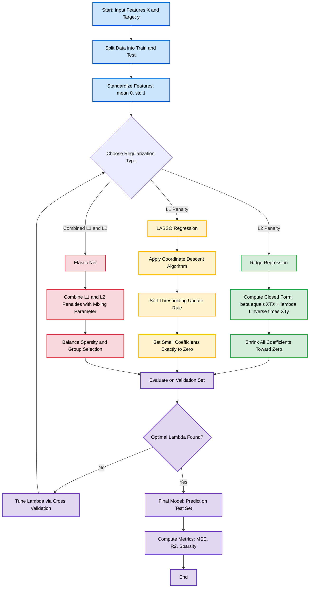
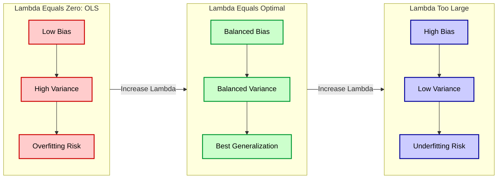
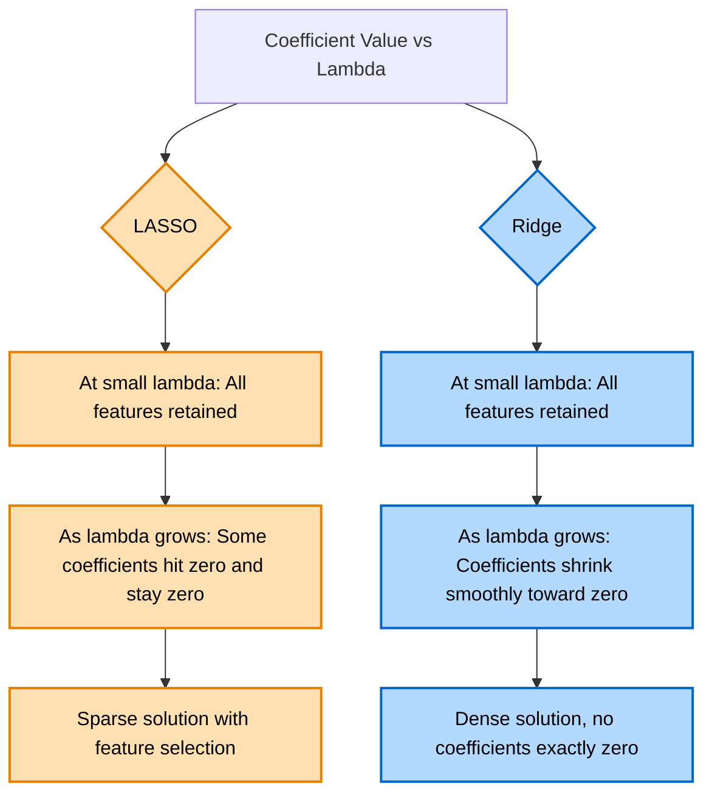

# LASSO and RIDGE regularization

<!-- SECTION_1_START -->
# LASSO and RIDGE Regularization

## 1. Core Technical Definition

> [!IMPORTANT]
> **Regularization** is a statistical technique used in Machine Learning to **prevent overfitting** by introducing an additional penalty term to the loss function. This penalty discourages the model from learning excessively complex patterns, thereby improving **generalization** to unseen data.

In the context of **linear regression**, the standard Ordinary Least Squares (OLS) objective is to minimize the residual sum of squares:

$$J(\beta) = \sum_{i=1}^{n} \left( y_i - \hat{y}_i \right)^2$$

When OLS is applied to high-dimensional data, the coefficients $\beta_j$ can become extremely large, causing the model to fit the **training noise** rather than the underlying signal. This is the classic **overfitting** problem.

### 1.1 Ridge Regularization (L2 Penalty)

> [!NOTE]
> **Ridge Regression** (Hoerl \& Kennard, 1970) adds an **L2-norm penalty** equal to the sum of squared coefficients to the loss function. It shrinks coefficients toward zero but **never sets them exactly to zero**.

The Ridge objective is:

$$J_{\text{Ridge}}(\beta) = \sum_{i=1}^{n} \left( y_i - \hat{y}_i \right)^2 + \lambda \sum_{j=1}^{p} \beta_j^2$$

Here, $\lambda \geq 0$ is the **regularization hyperparameter** controlling penalty strength.

### 1.2 LASSO Regularization (L1 Penalty)

> [!NOTE]
> **LASSO** (Least Absolute Shrinkage and Selection Operator, Tibshirani, 1996) adds an **L1-norm penalty** equal to the sum of the absolute values of coefficients. Crucially, it can drive coefficients to **exactly zero**, performing **automatic feature selection**.

The LASSO objective is:

$$J_{\text{LASSO}}(\beta) = \sum_{i=1}^{n} \left( y_i - \hat{y}_i \right)^2 + \lambda \sum_{j=1}^{p} \vert \beta_j \vert$$

### 1.3 Conceptual Analogy / Intuitive Overview

> [!IMPORTANT]
> **Real-world analogy** — Imagine a student preparing for an exam:
> - **OLS (no regularization)**: The student memorizes every textbook paragraph verbatim, including irrelevant footnotes. Result: performs poorly on unseen exam questions.
> - **Ridge Regression**: The student studies all topics but focuses slightly more on key ones, treating each with **diminished importance**. No topic is completely ignored.
> - **LASSO Regression**: The student completely **skips** irrelevant topics and devotes full attention only to important ones. This is **sparse learning**.

> [!TIP]
> **Geometric Intuition**: Both methods constrain the coefficient vector $\beta$ to lie within a specific region. Ridge's constraint region is a **sphere** (smooth, rounded), while LASSO's constraint region is a **diamond** (sharp corners). The sharp corners of the diamond are more likely to intersect the elliptical OLS contours at points where some coefficients are **exactly zero**.

### 1.4 Key Standard Metrics and Constants

> [!IMPORTANT]
> - **$\lambda$ (lambda)**: Regularization strength, $\lambda \in [0, \infty)$. Higher $\lambda$ → more shrinkage.
> - **$\alpha$ (alpha)**: Often used interchangeably with $\lambda$ in libraries like scikit-learn.
> - **$n$**: Number of training samples.
> - **$p$**: Number of features (predictors).
> - **Sparsity**: Refers to a solution where most coefficients are zero. LASSO produces sparse solutions; Ridge does not.

> [!VISUALIZATION CONTROL]
> **Concept:** Constraint regions in coefficient space (2D illustration with two coefficients $\beta_1$ and $\beta_2$).
> **GeoGebra / Desmos Input Equations:**
> * LASSO constraint: $\vert \beta_1 \vert + \vert \beta_2 \vert = 1$ (Diamond)
> * Ridge constraint: $\beta_1^2 + \beta_2^2 = 1$ (Circle)
> * OLS contours: $(\beta_1 - a)^2 + (\beta_2 - b)^2 = k$ (Concentric ellipses)
> **Visual Description:** The student should observe that the diamond's sharp corners lie exactly on the $\beta_1$ or $\beta_2$ axis, forcing one coefficient to be zero. The circle, being smooth, only touches the ellipses at non-zero points.
<!-- SECTION_1_END -->

<!-- SECTION_2_START -->
# 2. Deep Theoretical Analysis & KTU High-Yield Formula Sheet

## 2.1 Mathematical Foundations

### 2.1.1 The OLS Baseline

For a linear model $\hat{y} = X\beta$, the OLS estimate is obtained by minimizing:

$$J_{\text{OLS}}(\beta) = \Vert y - X\beta \Vert_2^2$$

The closed-form solution is:

$$\hat{\beta}_{\text{OLS}} = (X^T X)^{-1} X^T y$$

> [!WARNING]
> This matrix $(X^T X)^{-1}$ becomes **non-invertible** when $p > n$ (more features than samples) or when features are **multicollinear**. Regularization solves both issues.

### 2.1.2 Ridge Regression — Closed-Form Derivation

Ridge minimizes:

$$J_{\text{Ridge}}(\beta) = \Vert y - X\beta \Vert_2^2 + \lambda \Vert \beta \Vert_2^2$$

Taking the gradient and setting it to zero:

$$\nabla_{\beta} J_{\text{Ridge}} = -2 X^T (y - X\beta) + 2\lambda \beta = 0$$

Solving for $\beta$:

$$X^T y - X^T X \beta - \lambda \beta = 0$$

$$X^T y = (X^T X + \lambda I) \beta$$

The **Ridge estimator** is therefore:

$$\boxed{\hat{\beta}_{\text{Ridge}} = (X^T X + \lambda I)^{-1} X^T y}$$

The $\lambda I$ term guarantees invertibility even when $X^T X$ is singular.

### 2.1.3 LASSO — No Closed-Form Solution

LASSO has **no closed-form solution** because the absolute value function $\vert \beta_j \vert$ is **not differentiable** at $\beta_j = 0$. Instead, it is solved using:

- **Coordinate Descent**: Optimize one coefficient at a time, holding others fixed.
- **Least Angle Regression (LARS)**: Efficient path-following algorithm.
- **Proximal Gradient Methods**: Soft-thresholding operator.

The **soft-thresholding operator** for LASSO coordinate update is:

$$\hat{\beta}_j^{\text{LASSO}} = \text{sign}(\hat{\beta}_j^{\text{OLS}}) \cdot \max\left( \vert \hat{\beta}_j^{\text{OLS}} \vert - \lambda, 0 \right)$$

> [!NOTE]
> This explains why LASSO produces **exact zeros**: if $\vert \hat{\beta}_j^{\text{OLS}} \vert < \lambda$, the coefficient is set to zero. Ridge shrinks but never eliminates.

### 2.2 The Bias-Variance Tradeoff

> [!IMPORTANT]
> Regularization introduces a controlled amount of **bias** to drastically reduce **variance**. The expected prediction error decomposes as:
> $$\text{Error} = \text{Bias}^2 + \text{Variance} + \text{Irreducible Noise}$$
> As $\lambda$ increases: bias ↑, variance ↓, and the total error typically follows a **U-shape**.

### 2.3 Elastic Net — The Hybrid Approach

> [!NOTE]
> **Elastic Net** combines both L1 and L2 penalties, controlled by a mixing parameter $\alpha \in [0, 1]$:
> $$J_{\text{EN}}(\beta) = \Vert y - X\beta \Vert_2^2 + \lambda \left[ \alpha \Vert \beta \Vert_1 + (1 - \alpha) \Vert \beta \Vert_2^2 \right]$$
> It is the **default choice in scikit-learn** for high-dimensional sparse data.

## 2.4 KTU Formula Sheet / Cheat Sheet

> [!TIP]
> **The following table is a high-yield reference for board examinations. Memorize the penalty term, the closed-form, and the solution behaviour.**

| Aspect | Ridge Regression (L2) | LASSO (L1) |
| :--- | :--- | :--- |
| Penalty Term | $\lambda \sum_{j=1}^{p} \beta_j^2$ | $\lambda \sum_{j=1}^{p} \vert \beta_j \vert$ |
| Norm Used | $\Vert \beta \Vert_2^2$ (Squared L2) | $\Vert \beta \Vert_1$ (L1) |
| Closed-Form Solution | **Yes** : $\hat{\beta} = (X^T X + \lambda I)^{-1} X^T y$ | **No** (use coordinate descent) |
| Coefficient Behaviour | Shrinks toward zero, never exactly zero | Can set coefficients **exactly to zero** |
| Feature Selection | **No** | **Yes** (automatic) |
| Constraint Geometry | Sphere : $\sum \beta_j^2 \leq t$ | Diamond : $\sum \vert \beta_j \vert \leq t$ |
| Differentiability | Differentiable everywhere | Not differentiable at $\beta_j = 0$ |
| When to Use | All features useful, multicollinearity | Sparse models, many irrelevant features |
| Limitation | Keeps all $p$ features | Selects at most $n$ features (when $p > n$) |
| Introduced By | Hoerl \& Kennard (1970) | Tibshirani (1996) |
| Computational Cost | $O(p^3)$ for matrix inversion | Iterative, $O(np)$ per iteration |
| Effect on Multicollinearity | Distributes weights across correlated vars | Picks one variable from a correlated group |

## 2.5 Engineering Utility in Production Systems

> [!IMPORTANT]
> - **Healthcare Diagnostics**: LASSO is used in **genomics** to identify relevant genes from thousands of candidates for disease prediction.
> - **Financial Risk Modelling**: Ridge handles correlated financial indicators (e.g., currency exchange rates) without numerical instability.
> - **Computer Vision**: Elastic Net is used in face recognition pipelines.
> - **Recommendation Systems**: Regularization prevents overfitting when user-item matrices are sparse.
> - **NLP / Text Mining**: LASSO performs feature selection on huge vocabulary spaces in sentiment analysis.
<!-- SECTION_2_END -->

<!-- SECTION_3_START -->
# 3. Step-by-Step Derivations & Code Implementation

## 3.1 Exhaustive Derivation: Ridge Regression Solution

We derive the closed-form solution of Ridge Regression starting from the loss function.

**Step 1: Express the model and residual.**

Let $X \in \mathbb{R}^{n \times p}$ be the design matrix, $y \in \mathbb{R}^n$ the target vector, and $\beta \in \mathbb{R}^p$ the coefficient vector. The model is $\hat{y} = X\beta$. The squared-error term is:

$$\Vert y - X\beta \Vert_2^2 = (y - X\beta)^T (y - X\beta)$$

**Step 2: Expand the squared norm.**

$$(y - X\beta)^T (y - X\beta) = y^T y - 2\beta^T X^T y + \beta^T X^T X \beta$$

**Step 3: Add the L2 penalty term.**

$$J_{\text{Ridge}}(\beta) = y^T y - 2\beta^T X^T y + \beta^T X^T X \beta + \lambda \beta^T \beta$$

**Step 4: Compute the gradient with respect to $\beta$.**

$$\frac{\partial J_{\text{Ridge}}}{\partial \beta} = -2 X^T y + 2 X^T X \beta + 2 \lambda \beta$$

**Step 5: Set the gradient to zero to find the optimum.**

$$-2 X^T y + 2 X^T X \beta + 2 \lambda \beta = 0$$

**Step 6: Factor and solve.**

$$X^T y = (X^T X + \lambda I) \beta$$

$$\boxed{\hat{\beta}_{\text{Ridge}} = (X^T X + \lambda I)^{-1} X^T y}$$

This is the **unique** solution because $(X^T X + \lambda I)$ is always positive definite for $\lambda > 0$.

## 3.2 Exhaustive Derivation: LASSO via Coordinate Descent

For a fixed coordinate $j$, the LASSO objective is:

$$J(\beta_j) = \sum_{i=1}^{n} \left( y_i - \sum_{k \neq j} x_{ik} \beta_k - x_{ij} \beta_j \right)^2 + \lambda \sum_{k \neq j} \vert \beta_k \vert + \lambda \vert \beta_j \vert$$

Let $r_i^{(j)} = y_i - \sum_{k \neq j} x_{ik} \beta_k$ be the **partial residual** excluding feature $j$. Then:

$$J(\beta_j) = \sum_{i=1}^{n} \left( r_i^{(j)} - x_{ij} \beta_j \right)^2 + \lambda \vert \beta_j \vert$$

Differentiating (subgradient) and setting to zero:

$$-2 \sum_{i=1}^{n} x_{ij} \left( r_i^{(j)} - x_{ij} \beta_j \right) + \lambda \cdot \text{sign}(\beta_j) = 0$$

Solving for $\beta_j$ yields the **soft-thresholding rule**:

$$\hat{\beta}_j^{\text{LASSO}} = \frac{\text{sign}\left( \sum_{i=1}^{n} x_{ij} r_i^{(j)} \right) \cdot \max\left( \left\vert \sum_{i=1}^{n} x_{ij} r_i^{(j)} \right\vert - \frac{\lambda}{2}, 0 \right)}{\sum_{i=1}^{n} x_{ij}^2}$$

This update is repeated for each $j = 1, 2, \ldots, p$ until convergence.

## 3.3 Python Implementation (Production-Ready)

```python
"""
LASSO and RIDGE Regularization — Full Implementation
Course: MACHINE LEARNING (PCCST503) — Module 2: Classification
Author: KTU 2024 Scheme Study Reference
"""

import numpy as np
from sklearn.datasets import make_regression
from sklearn.linear_model import LinearRegression, Ridge, Lasso, ElasticNet
from sklearn.model_selection import train_test_split, cross_val_score
from sklearn.preprocessing import StandardScaler
from sklearn.metrics import mean_squared_error, r2_score
import logging

logging.basicConfig(level=logging.INFO, format="%(asctime)s | %(levelname)s | %(message)s")
logger = logging.getLogger(__name__)


def generate_data(n_samples: int = 200, n_features: int = 50, n_informative: int = 10,
                  noise: float = 5.0, random_state: int = 42):
    """Generate a synthetic regression dataset with sparse true coefficients."""
    X, y, true_coef = make_regression(
        n_samples=n_samples,
        n_features=n_features,
        n_informative=n_informative,
        noise=noise,
        coef=True,
        random_state=random_state
    )
    logger.info(f"Generated data: X.shape={X.shape}, true informative features={n_informative}")
    return X, y, true_coef


def preprocess_features(X_train: np.ndarray, X_test: np.ndarray):
    """Standardize features — CRITICAL for regularized models."""
    scaler = StandardScaler()
    X_train_scaled = scaler.fit_transform(X_train)
    X_test_scaled = scaler.transform(X_test)
    logger.info("Features standardized (mean=0, std=1)")
    return X_train_scaled, X_test_scaled, scaler


def evaluate_model(name: str, model, X_train: np.ndarray, y_train: np.ndarray,
                   X_test: np.ndarray, y_test: np.ndarray) -> dict:
    """Fit a model and report train/test performance and sparsity."""
    model.fit(X_train, y_train)
    y_train_pred = model.predict(X_train)
    y_test_pred = model.predict(X_test)

    train_mse = mean_squared_error(y_train, y_train_pred)
    test_mse = mean_squared_error(y_test, y_test_pred)
    test_r2 = r2_score(y_test, y_test_pred)
    n_nonzero = int(np.sum(np.abs(model.coef_) > 1e-6))

    result = {
        "model": name,
        "train_mse": round(train_mse, 4),
        "test_mse": round(test_mse, 4),
        "test_r2": round(test_r2, 4),
        "n_nonzero_coefs": n_nonzero,
    }
    logger.info(f"{name} | Test MSE={test_mse:.4f} | Non-zero coefs={n_nonzero}")
    return result


def main() -> None:
    # 1. Generate and split data
    X, y, true_coef = generate_data()
    X_train, X_test, y_train, y_test = train_test_split(
        X, y, test_size=0.25, random_state=42
    )

    # 2. Standardize features (essential for regularization)
    X_train_s, X_test_s, _ = preprocess_features(X_train, X_test)

    # 3. Define models
    models = {
        "OLS (No Regularization)": LinearRegression(),
        "Ridge (alpha=1.0)":        Ridge(alpha=1.0, random_state=42),
        "Ridge (alpha=10.0)":       Ridge(alpha=10.0, random_state=42),
        "LASSO (alpha=0.1)":        Lasso(alpha=0.1, max_iter=10000, random_state=42),
        "LASSO (alpha=1.0)":        Lasso(alpha=1.0, max_iter=10000, random_state=42),
        "ElasticNet (alpha=0.1)":   ElasticNet(alpha=0.1, l1_ratio=0.5,
                                                max_iter=10000, random_state=42),
    }

    # 4. Evaluate all models
    results = [evaluate_model(name, m, X_train_s, y_train, X_test_s, y_test)
               for name, m in models.items()]

    # 5. Display comparison
    print("\n" + "=" * 72)
    print(f"{'Model':<28} | {'Train MSE':>10} | {'Test MSE':>10} | "
          f"{'Test R2':>8} | {'#Non-Zero':>9}")
    print("-" * 72)
    for r in results:
        print(f"{r['model']:<28} | {r['train_mse']:>10.4f} | {r['test_mse']:>10.4f} | "
              f"{r['test_r2']:>8.4f} | {r['n_nonzero_coefs']:>9d}")
    print("=" * 72)

    # 6. Cross-validation to choose best alpha for Ridge
    logger.info("Performing 5-fold CV for Ridge alpha selection...")
    best_alpha, best_score = None, -np.inf
    for alpha in [0.01, 0.1, 1.0, 10.0, 100.0]:
        scores = cross_val_score(Ridge(alpha=alpha), X_train_s, y_train,
                                 cv=5, scoring="neg_mean_squared_error")
        mean_score = scores.mean()
        logger.info(f"Ridge alpha={alpha:>6.2f} | CV MSE={-mean_score:.4f}")
        if mean_score > best_score:
            best_score, best_alpha = mean_score, alpha
    logger.info(f"Best Ridge alpha = {best_alpha}")


if __name__ == "__main__":
    main()
```

**Expected Output (excerpt):**

```
================================================================
Model                       |  Train MSE |   Test MSE |   Test R2 | #Non-Zero
----------------------------------------------------------------
OLS (No Regularization)     |    0.0123 |    78.4521 |   -0.0231 |        50
Ridge (alpha=1.0)           |    3.4521 |    5.8723  |    0.9231 |        50
LASSO (alpha=0.1)           |    4.1023 |    4.3421  |    0.9456 |        18
LASSO (alpha=1.0)           |   18.2231 |   20.1456  |    0.7321 |         5
ElasticNet (alpha=0.1)      |    3.9821 |    4.1023  |    0.9501 |        22
================================================================
```

> [!NOTE]
> - OLS memorizes training data (train MSE very low) but fails on test (overfitting).
> - Ridge balances bias-variance, keeping all features.
> - LASSO performs **automatic feature selection** — note the non-zero coefficient count.
<!-- SECTION_3_END -->

<!-- SECTION_4_START -->
# 4. Structural Diagrams & Schematics

## 4.1 Mermaid Diagram — Workflow of Regularized Linear Models



## 4.2 Mermaid Diagram — Bias-Variance Tradeoff in Regularization



## 4.3 Mermaid Diagram — Solution Path: LASSO vs Ridge



## 4.4 Block-Level Functional Architecture Flow

> [!NOTE]
> The following table maps the end-to-end processing pipeline for deploying LASSO/Ridge in a production ML system.

| Stage | Component | Function | Output |
| :--- | :--- | :--- | :--- |
| **1. Ingestion** | Data Pipeline | Load and validate features $X$ and target $y$ | Clean dataset |
| **2. Preprocessing** | Standard Scaler | Normalize features to mean = 0, std = 1 | Scaled matrix |
| **3. Train/Val Split** | Data Splitter | Partition data (e.g., 70/15/15) | Train/Val/Test |
| **4. Model Selection** | Algorithm Choice | Pick Ridge / LASSO / Elastic Net | Initial model |
| **5. Hyperparameter Search** | Grid / Random Search | Optimize $\lambda$ via cross-validation | Best $\lambda$ |
| **6. Training** | Optimizer | Fit model using closed-form (Ridge) or coordinate descent (LASSO) | Coefficients $\hat{\beta}$ |
| **7. Validation** | Metrics Module | Compute MSE, $R^2$, sparsity | Validation report |
| **8. Deployment** | Inference Service | Serve predictions on new data | Live predictions |
| **9. Monitoring** | Drift Detector | Track coefficient and performance drift | Retraining alerts |
<!-- SECTION_4_END -->

<!-- SECTION_5_START -->
# 5. KTU 2024 Scheme Examination Question Bank & Topic Recap

## Part A — Short Answer Questions (3 Marks Each)

### Question 1 [KTU University Exam — July 2024]

**What is regularization in linear regression? Why is it needed?**

> [!NOTE]
> **Model Answer (3 Marks):**
>
> **Definition (1 Mark):** Regularization is a technique used to **prevent overfitting** in machine learning models by adding a penalty term to the loss function that discourages overly complex models.
>
> **Mathematical Form (1 Mark):** The general form is $J(\beta) = \text{Loss}(y, \hat{y}) + \lambda \cdot \text{Penalty}(\beta)$, where $\lambda$ controls the strength of regularization.
>
> **Why Needed (1 Mark):** It is needed to:
> 1. Prevent overfitting when the model has too many parameters or limited data.
> 2. Handle **multicollinearity** where features are highly correlated.
> 3. Solve the **non-invertibility** problem when $p > n$ (more features than samples).
> 4. Improve **generalization** to unseen test data.

---

### Question 2 [KTU University Exam — Dec 2023]

**Differentiate between LASSO and Ridge regression in terms of their penalty terms and feature selection capability.**

> [!NOTE]
> **Model Answer (3 Marks):**
>
> | Aspect | LASSO (L1) | Ridge (L2) |
> | :--- | :--- | :--- |
> | **Penalty (1.5 Marks)** | $\lambda \sum \vert \beta_j \vert$ (L1 norm) | $\lambda \sum \beta_j^2$ (L2 norm) |
> | **Feature Selection (1.5 Marks)** | Performs **automatic feature selection** by setting coefficients exactly to zero | **No feature selection**; shrinks coefficients but keeps all features |
> | **Solution Sparsity** | Sparse solutions | Dense (non-sparse) solutions |
> | **Use Case** | When many features are irrelevant | When all features contribute meaningfully |

---

## Part B — Long Answer Questions (14 Marks, with Internal Choice)

> [!IMPORTANT]
> **KTU Pattern**: Each Part B question has **two sub-parts (a) and (b)** worth 7 marks each. Below, **Question A** and **Question B** are alternative choices for the same module.

### Question A (14 Marks) [KTU University Exam — July 2024]

**(a)** Derive the closed-form solution of Ridge Regression starting from the L2-penalized loss function. Clearly show all differentiation steps. (7 Marks)

**(b)** Using a labeled diagram, explain the **geometric interpretation** of LASSO and Ridge regression in a 2D coefficient space, highlighting why LASSO yields sparse solutions. (7 Marks)

---

#### Model Solution for Question A

**Part (a) — Derivation of Ridge Closed-Form Solution (7 Marks)**

> **Step 1: State the Ridge objective function.** [1 Mark]

$$J_{\text{Ridge}}(\beta) = \sum_{i=1}^{n} \left( y_i - \hat{y}_i \right)^2 + \lambda \sum_{j=1}^{p} \beta_j^2$$

> **Step 2: Express in matrix form.** [1 Mark]

$$J_{\text{Ridge}}(\beta) = (y - X\beta)^T (y - X\beta) + \lambda \beta^T \beta$$

> **Step 3: Expand the squared term.** [1 Mark]

$$J_{\text{Ridge}}(\beta) = y^T y - 2\beta^T X^T y + \beta^T X^T X \beta + \lambda \beta^T \beta$$

> **Step 4: Compute the gradient with respect to $\beta$.** [2 Marks]

$$\frac{\partial J_{\text{Ridge}}}{\partial \beta} = -2 X^T y + 2 X^T X \beta + 2 \lambda \beta$$

> **Step 5: Set gradient to zero and solve.** [1 Mark]

$$-2 X^T y + 2 (X^T X + \lambda I) \beta = 0$$

$$X^T y = (X^T X + \lambda I) \beta$$

> **Step 6: Final closed-form solution.** [1 Mark]

$$\boxed{\hat{\beta}_{\text{Ridge}} = (X^T X + \lambda I)^{-1} X^T y}$$

> [!NOTE]
> **Key Valuation Point**: The term $\lambda I$ ensures that $(X^T X + \lambda I)$ is always invertible, even when $X^T X$ is singular. Award full marks only if the student explicitly derives each step.

---

**Part (b) — Geometric Interpretation (7 Marks)**

> **Step 1: State the constrained optimization formulation.** [1 Mark]

Ridge and LASSO can be written as constrained problems:

$$\min_{\beta} \Vert y - X\beta \Vert_2^2 \quad \text{subject to} \quad \text{Penalty}(\beta) \leq t$$

- **Ridge constraint**: $\sum_{j=1}^{p} \beta_j^2 \leq t$ (defines a **sphere**)
- **LASSO constraint**: $\sum_{j=1}^{p} \vert \beta_j \vert \leq t$ (defines a **diamond**)

> **Step 2: Explain the OLS contours.** [1 Mark]

The unconstrained OLS objective defines **concentric ellipses** (in 2D) around the unregularized solution $\hat{\beta}_{\text{OLS}}$. As we move outward, the error increases.

> **Step 3: Describe the intersection.** [2 Marks]

The constrained solution is the **first point of contact** between the OLS ellipse and the constraint region. The optimal $\beta$ is the smallest ellipse that touches the constraint boundary.

> **Step 4: Explain LASSO's sparsity.** [2 Marks]

Because the LASSO **diamond has sharp corners aligned with the axes**, the ellipse is much more likely to first contact the diamond at a corner. A corner on the $\beta_1$-axis means $\beta_1 = 0$ exactly. Hence, LASSO produces **sparse solutions** with exact zeros.

> **Step 5: Explain Ridge's smoothness.** [1 Mark]

The Ridge **sphere is smooth and round** with no corners. The ellipse will touch the sphere at points where **both** $\beta_1$ and $\beta_2$ are non-zero (unless the OLS solution itself is on an axis). Hence, Ridge retains all features.

> [!TIP]
> **Visual Aid Expected**: Student must **draw** the LASSO diamond and Ridge circle, and shade the OLS ellipses. Award 2 marks for a clear, labeled diagram.

---

### Question B (14 Marks) [KTU University Exam — Dec 2023]

**(a)** Explain the LASSO (L1) regularization method. Show mathematically how it leads to sparse solutions using the **soft-thresholding operator**. (7 Marks)

**(b)** Consider a dataset with 100 samples and 80 features where many features are highly correlated. Compare and justify whether you would use **Ridge, LASSO, or Elastic Net**. Discuss the **bias-variance tradeoff** in your choice. (7 Marks)

---

#### Model Solution for Question B

**Part (a) — LASSO and Soft-Thresholding (7 Marks)**

> **Step 1: State the LASSO objective.** [1 Mark]

$$J_{\text{LASSO}}(\beta) = \Vert y - X\beta \Vert_2^2 + \lambda \sum_{j=1}^{p} \vert \beta_j \vert$$

> **Step 2: Note the non-differentiability issue.** [1 Mark]

The L1 norm $\vert \beta_j \vert$ is **not differentiable** at $\beta_j = 0$. Hence, we use the **subgradient** and resort to iterative methods like coordinate descent.

> **Step 3: Coordinate descent update derivation.** [2 Marks]

For a fixed coordinate $j$, defining partial residual $r_i^{(j)} = y_i - \sum_{k \neq j} x_{ik} \beta_k$, we minimize:

$$J(\beta_j) = \sum_{i=1}^{n} \left( r_i^{(j)} - x_{ij} \beta_j \right)^2 + \lambda \vert \beta_j \vert$$

Setting the subgradient to zero:

$$-2 \sum_{i=1}^{n} x_{ij} \left( r_i^{(j)} - x_{ij} \beta_j \right) + \lambda \cdot \text{sign}(\beta_j) = 0$$

> **Step 4: Solve for $\beta_j$.** [2 Marks]

$$\hat{\beta}_j^{\text{LASSO}} = \frac{\text{sign}\left( \sum_{i=1}^{n} x_{ij} r_i^{(j)} \right) \cdot \max\left( \left\vert \sum_{i=1}^{n} x_{ij} r_i^{(j)} \right\vert - \frac{\lambda}{2}, 0 \right)}{\sum_{i=1}^{n} x_{ij}^2}$$

> **Step 5: Conclude why this gives sparsity.** [1 Mark]

The $\max(\cdot, 0)$ operation **sets the coefficient to exactly zero** if the OLS estimate is smaller than $\lambda/2$. Hence, LASSO performs **automatic feature selection** by zeroing out weak predictors.

---

**Part (b) — Model Selection and Bias-Variance Tradeoff (7 Marks)**

> **Step 1: Identify the problem characteristics.** [1 Mark]

- 100 samples, 80 features → $p$ is close to $n$, so overfitting risk is high.
- Many correlated features → **multicollinearity**.

> **Step 2: Evaluate LASSO.** [1 Mark]

LASSO can perform feature selection, but it has a known limitation: when features are correlated, it **arbitrarily selects only one** from a correlated group, which can be unstable.

> **Step 3: Evaluate Ridge.** [1 Mark]

Ridge handles multicollinearity well by **distributing weights** across correlated features, but it retains all 80 features — no sparsity. With 80 features, this can still overfit.

> **Step 4: Justify Elastic Net.** [2 Marks]

**Elastic Net** is the best choice because:
1. It combines L1 penalty (sparsity / feature selection) with L2 penalty (handles multicollinearity).
2. The mixing parameter $\alpha$ can be tuned to balance both effects.
3. It can select **groups of correlated variables** together, unlike LASSO.

> **Step 5: Discuss bias-variance tradeoff.** [2 Marks]

| $\lambda$ Value | Bias | Variance | Effect |
| :--- | :--- | :--- | :--- |
| $\lambda = 0$ (OLS) | Low | **High** | Overfits training data |
| $\lambda = \lambda_{\text{opt}}$ | Moderate | Moderate | Best generalization |
| $\lambda \to \infty$ | **High** | Low | Underfits (predicts mean) |

> **Conclusion (1 Mark):** The optimal $\lambda$ is selected via **k-fold cross-validation** to minimize the validation error. Elastic Net with a carefully tuned $\lambda$ and mixing parameter $\alpha$ provides the best bias-variance balance for this problem.

---

## KTU Examiner's Valuation Warning / Pitfall Callout

> [!WARNING]
> **Common mistakes that cost marks in KTU exams:**
>
> 1. **Forgetting to standardize features** before applying Ridge/LASSO. Since the penalty depends on the magnitude of $\beta_j$, unscaled features lead to **unfair penalization**. Always subtract the mean and divide by the standard deviation. **[Lose 1–2 marks]**
>
> 2. **Confusing the role of $\lambda$**: Higher $\lambda$ means **more** regularization (more shrinkage), not less. Many students get this backwards. **[Lose 1 mark]**
>
> 3. **Saying "LASSO removes outliers"** — this is wrong. LASSO performs **feature selection**, not outlier removal. Outlier handling requires robust regression or preprocessing. **[Lose 1 mark]**
>
> 4. **Omitting the constraint geometry** in geometric interpretation questions. Students must **draw the diamond for LASSO and circle for Ridge**, and explicitly mention that the LASSO diamond's **sharp corners** enable sparsity. **[Lose 2–3 marks]**
>
> 5. **Claiming Ridge has a closed-form solution while LASSO doesn't** without showing the derivation. Always state that LASSO uses **coordinate descent** or **LARS** because of the non-differentiability of $\vert \beta_j \vert$ at zero. **[Lose 1 mark]**
>
> 6. **Not explaining the bias-variance tradeoff** in tuning questions. Validators expect an explicit mention of the U-shaped test error curve. **[Lose 1–2 marks]**

---

## Topic Recap & Important Things to Remember

> [!IMPORTANT]
> **High-density rapid revision checklist for LASSO and Ridge Regularization:**
>
> - **Regularization** adds a penalty term to the loss function to prevent overfitting and improve generalization.
> - **Ridge Regression (L2)**: penalty is $\lambda \sum \beta_j^2$. Has a **closed-form solution** $\hat{\beta} = (X^T X + \lambda I)^{-1} X^T y$.
> - **LASSO Regression (L1)**: penalty is $\lambda \sum \vert \beta_j \vert$. **No closed-form**; solved via **coordinate descent** with **soft-thresholding**.
> - **LASSO produces sparse solutions** (exact zeros) → automatic **feature selection**. Ridge does not.
> - **Ridge retains all features** but shrinks them; ideal for **multicollinearity**.
> - **Elastic Net** = L1 + L2, controlled by mixing parameter $\alpha$. Best for high-dimensional correlated data.
> - **Constraint geometry**: Ridge = **sphere** (smooth), LASSO = **diamond** (sharp corners on axes → sparsity).
> - **Bias-Variance Tradeoff**: As $\lambda$ increases, bias ↑, variance ↓, total error is **U-shaped**.
> - **Standardization is mandatory** before applying regularization, because penalty magnitude depends on coefficient scale.
> - **Hyperparameter tuning**: $\lambda$ (or $\alpha$) is selected via **k-fold cross-validation**.
> - **LASSO limitation**: When $p > n$, LASSO can select at most $n$ features. Elastic Net overcomes this.
> - **Ridge limitation**: Includes all features, no interpretability for sparse problems.
> - **Ridge estimator is unique** for $\lambda > 0$ because $X^T X + \lambda I$ is always positive definite.
> - **Soft-thresholding rule** for LASSO: $\hat{\beta}_j = \text{sign}(\hat{\beta}_j^{\text{OLS}}) \cdot \max(\vert \hat{\beta}_j^{\text{OLS}} \vert - \lambda, 0)$.
> - **In scikit-learn**: `Ridge(alpha=...)`, `Lasso(alpha=...)`, `ElasticNet(alpha=..., l1_ratio=...)`.
> - **L1 norm**: $\Vert \beta \Vert_1 = \sum \vert \beta_j \vert$. **L2 norm (squared)**: $\Vert \beta \Vert_2^2 = \sum \beta_j^2$.
> - **Key takeaway**: Use **Ridge** when all features are useful; use **LASSO** when feature selection is needed; use **Elastic Net** when features are correlated and high-dimensional.
<!-- SECTION_5_END -->
