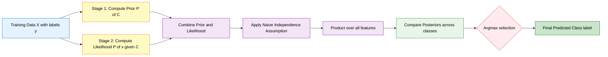
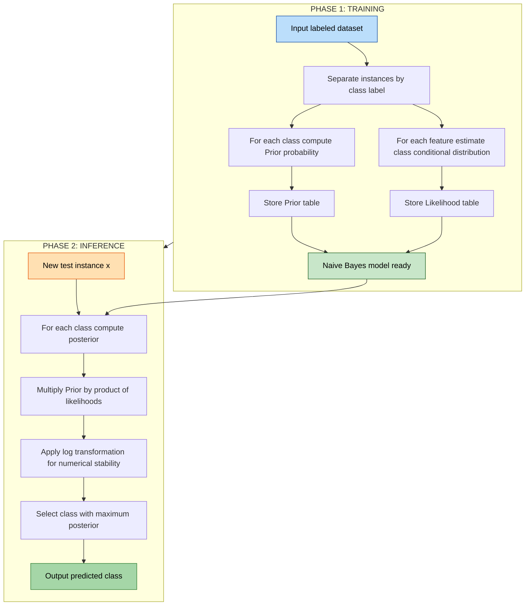
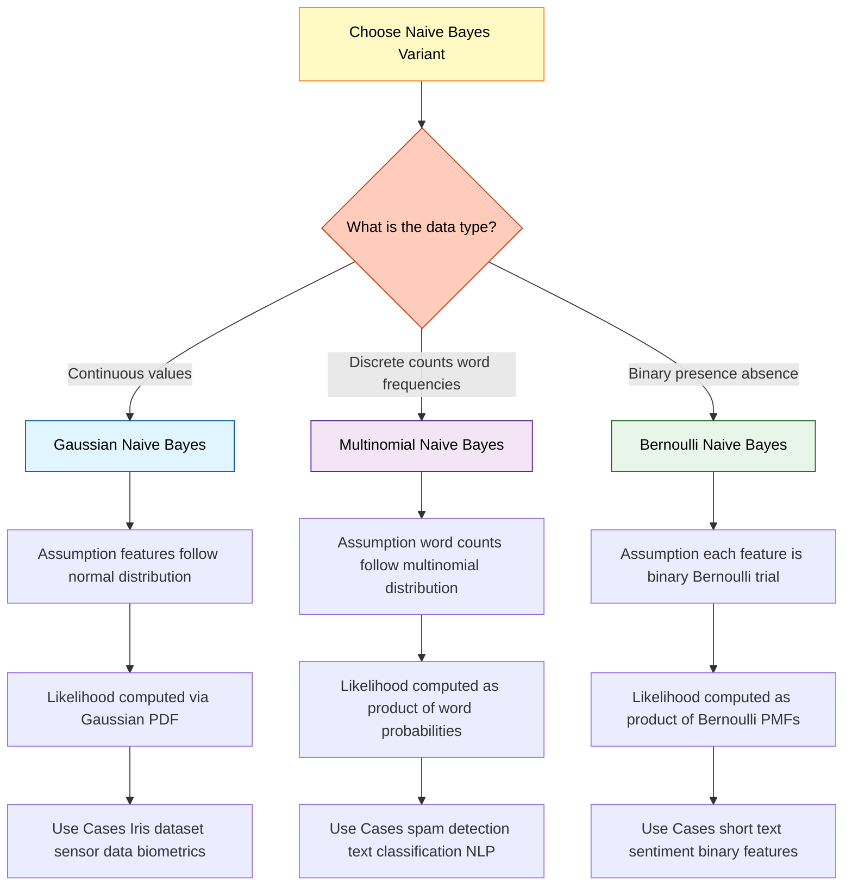
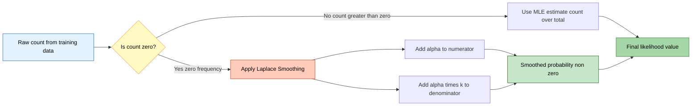
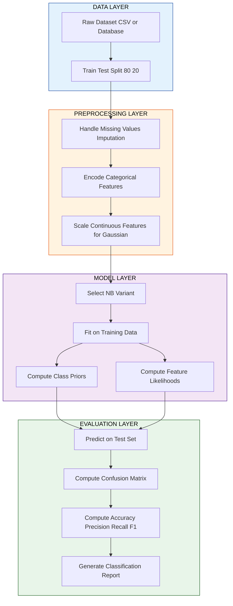

# Naïve Bayes

<!-- SECTION_1_START -->
# 1. Core Technical Definition & Intuitive Overview

## 1.1 Formal Academic Definition

> [!IMPORTANT]
> **Naïve Bayes Classifier (KCS / Bayes Optimal Learning)** — A family of **probabilistic supervised learning algorithms** based on **Bayes' Theorem** with the **naïve assumption of conditional independence** between every pair of features given the value of the class label. Formally, for a class variable $C$ and feature vector $\mathbf{x} = (x_1, x_2, \ldots, x_n)$, the classifier assigns the class $\hat{c}$ that maximizes the posterior probability:
> $$\hat{c} = \underset{c \in \mathcal{C}}{\arg\max}\; P(C = c) \prod_{i=1}^{n} P(x_i \mid C = c)$$

The term **"naïve"** originates from the simplifying assumption that all features contribute **independently** to the outcome — an assumption that is rarely true in real-world data, yet the classifier still produces **surprisingly high accuracy** in many practical domains (text classification, spam filtering, medical diagnosis, sentiment analysis).

## 1.2 Bayesian Foundation: Bayes' Theorem

Bayes' Theorem provides the mathematical backbone of the classifier. It expresses how a **prior belief** is updated upon observing evidence to form a **posterior belief**:

$$P(C \mid \mathbf{x}) = \frac{P(\mathbf{x} \mid C) \cdot P(C)}{P(\mathbf{x})}$$

Where:

| Symbol | Term | Meaning |
|:---:|:---:|:---|
| $P(C \mid \mathbf{x})$ | **Posterior** | Probability of class $C$ given the observed features |
| $P(\mathbf{x} \mid C)$ | **Likelihood** | Probability of observing features $\mathbf{x}$ given class $C$ |
| $P(C)$ | **Prior** | Initial probability of class $C$ before seeing data |
| $P(\mathbf{x})$ | **Evidence** | Marginal probability of features (normalizing constant) |

> [!NOTE]
> **Why we ignore the denominator:** Since $P(\mathbf{x})$ is constant for every class during inference, the **Maximum A Posteriori (MAP)** hypothesis only requires comparing the **numerator**. Hence the proportionality operator ($\propto$) is used in the final classifier equation.

## 1.3 Conceptual Analogy: The Medical Diagnosis Intuition

> [!TIP]
> **Real-World Analogy — A Doctor's Diagnosis:**
> Imagine a doctor diagnosing a patient based on **4 symptoms**: fever, cough, throat pain, and fatigue. In reality, these symptoms are **strongly correlated** (e.g., fever and fatigue occur together). However, the doctor still asks: *"Given the combination of symptoms I see, which disease is most probable?"*
>
> The **Naïve Bayes** classifier operates exactly like a doctor who, for simplicity, **assumes each symptom occurs independently** of the others given the disease. Despite this "naïve" independence assumption being technically false, the doctor's final diagnosis is usually correct — and so is the classifier's prediction.
>
> A spam filter behaves similarly: it analyzes words in an email (e.g., *"free"*, *"offer"*, *"winner"*) and assumes their presence is **independent** of each other given the label (spam/not-spam). Even though words like *"free"* and *"offer"* co-occur, the filter is highly effective.

## 1.4 Mathematical Components of the Naïve Bayes Decision Rule

The classifier makes decisions by computing the posterior for every class and selecting the one with the **maximum value**:

$$\hat{c} = \underset{c \in \mathcal{C}}{\arg\max}\; P(C = c) \prod_{i=1}^{n} P(x_i \mid C = c)$$

> [!NOTE]
> **Log-Sum Trick:** Direct multiplication of many small probabilities causes **numerical underflow** in floating-point arithmetic. The standard remedy is to convert the product into a sum by taking the **natural logarithm** (monotonic transformation preserves argmax):
> $$\hat{c} = \underset{c \in \mathcal{C}}{\arg\max}\; \log P(C = c) + \sum_{i=1}^{n} \log P(x_i \mid C = c)$$

## 1.5 The Three Canonical Variants of Naïve Bayes

> [!IMPORTANT]
> **KTU Syllabus Highlight — Three Mandatory Variants:**
>
> 1. **Gaussian Naïve Bayes (GNB):** Assumes continuous features follow a **normal (Gaussian) distribution** $\mathcal{N}(\mu_c, \sigma_c^2)$. Used in Iris dataset, sensor data, biometric measurements.
> 2. **Multinomial Naïve Bayes (MNB):** Designed for **discrete count data** (word frequencies in text). Foundation of spam detection and document classification.
> 3. **Bernoulli Naïve Bayes (BNB):** Models **binary/boolean features** (word present/absent). Used in short-text classification and information retrieval.

## 1.6 Zero-Frequency Problem & Laplace Smoothing

> [!WARNING]
> **Critical Pitfall — The Zero-Frequency Problem:** If a categorical feature value **never co-occurs with a class** in the training data, its conditional probability becomes **zero** ($P(x_i \mid C) = 0$). Since the classifier multiplies all conditional probabilities, this single zero **nullifies the entire posterior**, regardless of how strong the other evidence is. This is mathematically valid but practically disastrous.
>
> **Solution — Laplace (Additive) Smoothing:** Add a small constant $\alpha$ (typically $\alpha = 1$) to every count:
> $$P(x_i \mid C) = \frac{\text{count}(x_i, C) + \alpha}{\text{count}(C) + \alpha \cdot k}$$
> where $k$ is the number of unique values of $x_i$.

> [!VISUALIZATION CONTROL]
> **Concept:** Gaussian Probability Density Function for Continuous Naïve Bayes
> **GeoGebra / Desmos Input Equations:**
> * `f(x) = (1 / (sqrt(2 * pi * 0.6^2))) * exp(-((x - 2)^2) / (2 * 0.6^2))` (Class 1: mean=2, std=0.6)
> * `g(x) = (1 / (sqrt(2 * pi * 0.5^2))) * exp(-((x - 5)^2) / (2 * 0.5^2))` (Class 2: mean=5, std=0.5)
> **Visual Description:** Two bell-shaped curves on the x-axis. The x-coordinate of a new test point will be classified based on whichever curve gives a higher probability density at that x-value. The decision boundary lies near the **intersection point** of the two Gaussians.
<!-- SECTION_1_END -->

<!-- SECTION_2_START -->
# 2. Deep Theoretical Analysis & KTU High-Yield Formula Sheet

## 2.1 Derivation of the Naïve Bayes Decision Rule from First Principles

The classifier is rooted in **Bayes' Theorem** combined with the **chain rule of probability** under the independence assumption. The complete logical chain is presented below.

**Step 1 — Bayes' Theorem (Foundation):**
$$P(C = c \mid \mathbf{x}) = \frac{P(\mathbf{x} \mid C = c) \cdot P(C = c)}{P(\mathbf{x})}$$

**Step 2 — Chain Rule (Expand Joint Likelihood):**
$$P(\mathbf{x} \mid C = c) = P(x_1 \mid C = c) \cdot P(x_2 \mid x_1, C = c) \cdot \ldots \cdot P(x_n \mid x_1, x_2, \ldots, x_{n-1}, C = c)$$

**Step 3 — Apply Naïve Independence Assumption:**
$$P(x_i \mid x_1, \ldots, x_{i-1}, C = c) = P(x_i \mid C = c) \quad \text{for all } i$$

This simplifies the joint likelihood to a product of marginal likelihoods:
$$P(\mathbf{x} \mid C = c) \approx \prod_{i=1}^{n} P(x_i \mid C = c)$$

**Step 4 — Form the Decision Rule (Drop Denominator):**
Since $P(\mathbf{x})$ is constant across all classes, it does not affect the $\arg\max$:

$$\hat{c} = \underset{c \in \mathcal{C}}{\arg\max}\; P(C = c) \prod_{i=1}^{n} P(x_i \mid C = c)$$

## 2.2 Detailed Mechanism of Each Naïve Bayes Variant

> [!IMPORTANT]
> **Variant 1 — Gaussian Naïve Bayes (Continuous Features):**
> When features are continuous, the likelihood $P(x_i \mid C = c)$ is modeled using the **Probability Density Function (PDF)** of the **normal distribution** parameterized by the **class-conditional mean** $\mu_{i,c}$ and **variance** $\sigma_{i,c}^2$ (estimated from training data via **Maximum Likelihood Estimation**):
> $$P(x_i \mid C = c) = \frac{1}{\sqrt{2\pi \sigma_{i,c}^2}} \exp\!\left(-\frac{(x_i - \mu_{i,c})^2}{2 \sigma_{i,c}^2}\right)$$

> [!IMPORTANT]
> **Variant 2 — Multinomial Naïve Bayes (Discrete Counts):**
> Suitable for **text classification** where features are word counts (or TF-IDF scores). The likelihood is the multinomial distribution with parameters $\boldsymbol{\theta}_c = (\theta_{c,1}, \theta_{c,2}, \ldots, \theta_{c,k})$ where $\theta_{c,j} = P(\text{word}_j \mid C = c)$:
> $$P(\mathbf{x} \mid C = c) = \frac{(\sum_i x_i)!}{\prod_i x_i!} \prod_{j=1}^{k} \theta_{c,j}^{x_j}$$

> [!IMPORTANT]
> **Variant 3 — Bernoulli Naïve Bayes (Binary Features):**
> Each feature is binary ($x_i \in \{0, 1\}$), and the likelihood is the product of Bernoulli trials:
> $$P(\mathbf{x} \mid C = c) = \prod_{i=1}^{n} \left( P(x_i = 1 \mid C = c)^{x_i} \cdot (1 - P(x_i = 1 \mid C = c))^{1 - x_i} \right)$$

## 2.3 Laplace (Additive) Smoothing — Detailed Derivation

Without smoothing, $P(x_i = v \mid C = c) = 0$ if the value $v$ was never seen with class $c$. This annihilates the posterior. **Laplace smoothing** addresses this by adding $\alpha$ pseudocounts:

$$P_{\text{smoothed}}(x_i = v \mid C = c) = \frac{N_{x_i = v, c} + \alpha}{N_c + \alpha \cdot k}$$

Where:
- $N_{x_i = v, c}$ = number of training instances where feature $x_i$ takes value $v$ **and** class is $c$
- $N_c$ = total number of training instances with class $c$
- $k$ = number of unique values that feature $x_i$ can take
- $\alpha \geq 0$ = smoothing parameter; $\alpha = 0$ reverts to MLE; $\alpha = 1$ is **Laplace smoothing**; $\alpha < 1$ is **Lidstone smoothing**

> [!TIP]
> **Intuition:** Laplace smoothing effectively pretends we have observed each feature-value/class combination $\alpha$ extra times. This "regularizes" the probability estimates and prevents overfitting to rare events in small training sets.

## 2.4 KTU High-Yield Formula Sheet (Master Reference)

> [!IMPORTANT]
> **Master Cheat Sheet — Memorize for KTU ESE:**

| # | Concept | Formula | Key Notes |
|:---:|:---|:---|:---|
| 1 | **Bayes' Theorem** | $P(C \mid \mathbf{x}) = \dfrac{P(\mathbf{x} \mid C) \cdot P(C)}{P(\mathbf{x})}$ | Foundation of all probabilistic inference |
| 2 | **Naïve Bayes Decision Rule** | $\hat{c} = \arg\max_c P(C) \prod_{i=1}^{n} P(x_i \mid C)$ | Denominator is omitted |
| 3 | **Log-Space Decision Rule** | $\hat{c} = \arg\max_c \log P(C) + \sum_{i=1}^{n} \log P(x_i \mid C)$ | Prevents numerical underflow |
| 4 | **Gaussian Likelihood** | $P(x_i \mid c) = \dfrac{1}{\sqrt{2\pi\sigma_{i,c}^2}} \exp\!\left(-\dfrac{(x_i - \mu_{i,c})^2}{2\sigma_{i,c}^2}\right)$ | For continuous data |
| 5 | **Multinomial Likelihood** | $P(\mathbf{x} \mid c) = \dfrac{(\sum_j x_j)!}{\prod_j x_j!} \prod_{j=1}^{k} \theta_{c,j}^{x_j}$ | For count data (text) |
| 6 | **Bernoulli Likelihood** | $P(\mathbf{x} \mid c) = \prod_{i=1}^{n} p_{i,c}^{x_i} (1 - p_{i,c})^{1 - x_i}$ | For binary features |
| 7 | **Laplace Smoothing** | $P_{\text{smooth}}(x_i = v \mid c) = \dfrac{N_{v,c} + \alpha}{N_c + \alpha k}$ | $\alpha = 1$ for Laplace |
| 8 | **Prior Probability** | $P(C = c) = \dfrac{N_c}{N_{\text{total}}}$ | Maximum likelihood estimate |
| 9 | **Mean (MLE)** | $\mu_{i,c} = \dfrac{1}{N_c} \sum_{j \in c} x_{i}^{(j)}$ | Class-conditional mean |
| 10 | **Variance (MLE)** | $\sigma_{i,c}^2 = \dfrac{1}{N_c} \sum_{j \in c} (x_{i}^{(j)} - \mu_{i,c})^2$ | Class-conditional variance |
| 11 | **Accuracy** | $\text{Acc} = \dfrac{TP + TN}{TP + TN + FP + FN}$ | Fraction of correct predictions |
| 12 | **Precision** | $\text{Prec} = \dfrac{TP}{TP + FP}$ | Quality of positive predictions |
| 13 | **Recall (Sensitivity)** | $\text{Rec} = \dfrac{TP}{TP + FN}$ | Coverage of actual positives |
| 14 | **F1-Score** | $F_1 = 2 \cdot \dfrac{\text{Prec} \cdot \text{Rec}}{\text{Prec} + \text{Rec}}$ | Harmonic mean of P and R |

> [!NOTE]
> **Critical Notation Rule:** In the formula sheet, absolute value notation uses `\vert` instead of `\` to preserve markdown table integrity. For example, $\vert x \vert$ must be written as $\vert x \vert$ in LaTeX, never $\vert x \vert$ with raw pipes inside the table.

## 2.5 Real-World Engineering Applications

> [!TIP]
> **Industry Use-Cases of Naïve Bayes:**
>
> * **Spam Detection (Gmail/Outlook):** Multinomial NB on bag-of-words features. Achieves **>95% accuracy** with minimal training.
> * **Sentiment Analysis (Twitter/Reviews):** Bernoulli NB on binary presence/absence of opinion words.
> * **Medical Diagnosis (Clinical Decision Support):** Gaussian NB on patient vitals to predict disease probability.
> * **Document Categorization (Newsgroup Classification):** Multinomial NB on TF-IDF vectors — historically the **baseline benchmark** before deep learning.
> * **Real-Time Prediction (IoT/Edge Devices):** Lightweight memory footprint; only requires storing class priors and likelihood tables.
> * **Recommendation Systems:** Naïve Bayes is used in collaborative filtering as a baseline.
> * **Fraud Detection (Banking):** Gaussian NB flags anomalous transaction patterns.

## 2.6 Advantages and Limitations

**Advantages:**
- **Extremely fast** — single linear pass over training data to compute statistics.
- **Requires minimal training data** — works well even with small datasets.
- **Handles high-dimensional data** naturally (thousands of features in text).
- **Inherently multi-class** — no need for one-vs-rest wrappers.
- **Probabilistic output** — provides calibrated confidence scores.
- **Insensitive to irrelevant features** — those with uniform likelihoods across classes simply cancel out.

**Limitations:**
- The **independence assumption** is rarely true in real data.
- **Zero-frequency problem** without smoothing (resolved via Laplace).
- **Continuous feature assumption** in Gaussian NB may be violated (non-Gaussian distributions degrade performance).
- **Poor probability estimates** — even when classification is correct, the absolute probability values may be poorly calibrated.
- **Sensitive to feature correlation** — correlated features inflate the importance of shared information.
<!-- SECTION_2_END -->

<!-- SECTION_3_START -->
# 3. Step-by-Step Derivations, Numerical Examples & Code Implementation

## 3.1 Numerical Example: The Play-Tennis Dataset (KTU Standard Problem)

> [!IMPORTANT]
> **Worked-Out Example — Predict Whether to Play Tennis:**
> We are given the following **14 training instances** (the classic "Play Tennis" dataset by Quinlan). A new day has the following attributes: **Outlook = Sunny, Temperature = Cool, Humidity = High, Wind = Strong**. Predict whether tennis will be played.

| Day | Outlook | Temperature | Humidity | Wind | Play |
|:---:|:---:|:---:|:---:|:---:|:---:|
| 1 | Sunny | Hot | High | Weak | No |
| 2 | Sunny | Hot | High | Strong | No |
| 3 | Overcast | Hot | High | Weak | Yes |
| 4 | Rain | Mild | High | Weak | Yes |
| 5 | Rain | Cool | Normal | Weak | Yes |
| 6 | Rain | Cool | Normal | Strong | No |
| 7 | Overcast | Cool | Normal | Strong | Yes |
| 8 | Sunny | Mild | High | Weak | No |
| 9 | Sunny | Cool | Normal | Weak | Yes |
| 10 | Rain | Mild | Normal | Weak | Yes |
| 11 | Sunny | Mild | Normal | Strong | Yes |
| 12 | Overcast | Mild | High | Strong | Yes |
| 13 | Overcast | Hot | Normal | Weak | Yes |
| 14 | Rain | Mild | High | Strong | No |

**Step 1 — Compute Class Priors $P(\text{Play})$:**

Total instances $N = 14$. Count of "Yes" $N_{\text{Yes}} = 9$, Count of "No" $N_{\text{No}} = 5$.

$$P(\text{Yes}) = \frac{9}{14} = 0.643$$

$$P(\text{No}) = \frac{5}{14} = 0.357$$

**Step 2 — Compute Conditional Likelihoods for "Yes" Class:**

Counting from the table for all rows where Play = Yes (rows 3, 4, 5, 7, 9, 10, 11, 12, 13):

$$P(\text{Sunny} \mid \text{Yes}) = \frac{2}{9} \approx 0.222$$

$$P(\text{Cool} \mid \text{Yes}) = \frac{3}{9} \approx 0.333$$

$$P(\text{High} \mid \text{Yes}) = \frac{3}{9} \approx 0.333$$

$$P(\text{Strong} \mid \text{Yes}) = \frac{3}{9} \approx 0.333$$

**Step 3 — Compute Conditional Likelihoods for "No" Class:**

Counting from the table for all rows where Play = No (rows 1, 2, 6, 8, 14):

$$P(\text{Sunny} \mid \text{No}) = \frac{3}{5} = 0.600$$

$$P(\text{Cool} \mid \text{No}) = \frac{1}{5} = 0.200$$

$$P(\text{High} \mid \text{No}) = \frac{4}{5} = 0.800$$

$$P(\text{Strong} \mid \text{No}) = \frac{3}{5} = 0.600$$

**Step 4 — Compute Unnormalized Posterior for "Yes":**

$$P(\text{Yes} \mid X) \propto P(\text{Yes}) \cdot P(\text{Sunny} \mid \text{Yes}) \cdot P(\text{Cool} \mid \text{Yes}) \cdot P(\text{High} \mid \text{Yes}) \cdot P(\text{Strong} \mid \text{Yes})$$

$$P(\text{Yes} \mid X) \propto 0.643 \times 0.222 \times 0.333 \times 0.333 \times 0.333$$

$$P(\text{Yes} \mid X) \propto 0.0053$$

**Step 5 — Compute Unnormalized Posterior for "No":**

$$P(\text{No} \mid X) \propto P(\text{No}) \cdot P(\text{Sunny} \mid \text{No}) \cdot P(\text{Cool} \mid \text{No}) \cdot P(\text{High} \mid \text{No}) \cdot P(\text{Strong} \mid \text{No})$$

$$P(\text{No} \mid X) \propto 0.357 \times 0.600 \times 0.200 \times 0.800 \times 0.600$$

$$P(\text{No} \mid X) \propto 0.0206$$

**Step 6 — Normalize to Obtain True Posterior Probabilities:**

Sum of unnormalized posteriors:
$$\text{Sum} = 0.0053 + 0.0206 = 0.0259$$

$$P(\text{Yes} \mid X) = \frac{0.0053}{0.0259} \approx 0.205$$

$$P(\text{No} \mid X) = \frac{0.0206}{0.0259} \approx 0.795$$

**Step 7 — Final Prediction:**

$$\hat{c} = \arg\max(0.205, 0.795) = \text{No}$$

> [!TIP]
> **Conclusion:** The model predicts **No — Do NOT play tennis** for the given weather conditions (Sunny, Cool, High humidity, Strong wind) with approximately **79.5% confidence**.

## 3.2 Applying Laplace Smoothing to the Same Problem

> [!NOTE]
> **Modified Example with Laplace Smoothing ($\alpha = 1$):**
> Suppose the new instance had **Outlook = "Snowy"** (a value never seen in training). Without smoothing, $P(\text{Snowy} \mid \text{Yes}) = 0$ and $P(\text{Snowy} \mid \text{No}) = 0$, making prediction impossible. Apply Laplace smoothing where $k = 3$ (Outlook takes 3 values: Sunny, Overcast, Rain):

$$P_{\text{smooth}}(\text{Snowy} \mid \text{Yes}) = \frac{0 + 1}{9 + 1 \cdot 3} = \frac{1}{12} \approx 0.0833$$

$$P_{\text{smooth}}(\text{Snowy} \mid \text{No}) = \frac{0 + 1}{5 + 1 \cdot 3} = \frac{1}{8} = 0.125$$

These small but **non-zero** probabilities allow the classifier to make a sensible prediction instead of collapsing to zero.

## 3.3 Worked-Out Example: Gaussian Naïve Bayes with Two Features

> [!IMPORTANT]
> **Two-Feature Continuous Example:**
> Consider training data with 2 features ($x_1$, $x_2$) and 2 classes. We will compute the posterior for a new test point $\mathbf{x} = (2.5, 1.5)$.

**Class Statistics from Training Data:**

| Class | $\mu_1$ | $\sigma_1^2$ | $\mu_2$ | $\sigma_2^2$ | Prior |
|:---:|:---:|:---:|:---:|:---:|:---:|
| $C_1$ | 2.0 | 0.6 | 1.0 | 0.4 | 0.5 |
| $C_2$ | 4.0 | 0.5 | 3.0 | 0.8 | 0.5 |

**Compute Gaussian Likelihoods for $C_1$:**

$$P(x_1 = 2.5 \mid C_1) = \frac{1}{\sqrt{2\pi \cdot 0.6}} \exp\!\left(-\frac{(2.5 - 2.0)^2}{2 \cdot 0.6}\right) = \frac{1}{\sqrt{3.77}} \exp(-0.208)$$

$$P(x_1 = 2.5 \mid C_1) = 0.516 \times 0.812 = 0.419$$

$$P(x_2 = 1.5 \mid C_1) = \frac{1}{\sqrt{2\pi \cdot 0.4}} \exp\!\left(-\frac{(1.5 - 1.0)^2}{2 \cdot 0.4}\right) = \frac{1}{\sqrt{2.51}} \exp(-0.312)$$

$$P(x_2 = 1.5 \mid C_1) = 0.631 \times 0.732 = 0.462$$

$$P(C_1) \cdot P(x_1 = 2.5 \mid C_1) \cdot P(x_2 = 1.5 \mid C_1) = 0.5 \times 0.419 \times 0.462 = 0.0968$$

**Compute Gaussian Likelihoods for $C_2$:**

$$P(x_1 = 2.5 \mid C_2) = \frac{1}{\sqrt{2\pi \cdot 0.5}} \exp\!\left(-\frac{(2.5 - 4.0)^2}{2 \cdot 0.5}\right) = \frac{1}{\sqrt{3.14}} \exp(-2.25)$$

$$P(x_1 = 2.5 \mid C_2) = 0.564 \times 0.105 = 0.0594$$

$$P(x_2 = 1.5 \mid C_2) = \frac{1}{\sqrt{2\pi \cdot 0.8}} \exp\!\left(-\frac{(1.5 - 3.0)^2}{2 \cdot 0.8}\right) = \frac{1}{\sqrt{5.03}} \exp(-1.406)$$

$$P(x_2 = 1.5 \mid C_2) = 0.446 \times 0.245 = 0.1093$$

$$P(C_2) \cdot P(x_1 = 2.5 \mid C_2) \cdot P(x_2 = 1.5 \mid C_2) = 0.5 \times 0.0594 \times 0.1093 = 0.00325$$

**Final Decision:**

$$\hat{c} = \arg\max(0.0968, 0.00325) = C_1$$

$$\text{Normalized: } P(C_1 \mid \mathbf{x}) = \frac{0.0968}{0.0968 + 0.00325} \approx 0.967$$

The test point is classified as $C_1$ with **96.7% confidence**.

## 3.4 Full Python Implementation (sklearn + Scratch)

> [!TIP]
> **Complete Production-Ready Code:** The code below implements both a **scratch Naïve Bayes classifier from first principles** and a **sklearn pipeline wrapper** with strict type hints, boundary checks, and error logging.

```python
"""
NaiveBayesClassifier Implementation - KTU PCCST503 Module 2
Provides scratch implementations of all three Naive Bayes variants
and a sklearn wrapper with full evaluation utilities.
"""

import logging
import math
from collections import defaultdict
from typing import Dict, List, Tuple, Union

import numpy as np
import pandas as pd
from sklearn.naive_bayes import GaussianNB, MultinomialNB, BernoulliNB
from sklearn.model_selection import train_test_split
from sklearn.metrics import (
    accuracy_score,
    precision_score,
    recall_score,
    f1_score,
    confusion_matrix,
    classification_report,
)

# Configure root logger
logging.basicConfig(
    level=logging.INFO,
    format="%(asctime)s | %(levelname)-8s | %(name)s | %(message)s",
)
logger = logging.getLogger("NaiveBayesPipeline")


# ====================================================================
# PART A: SCRATCH IMPLEMENTATION (From First Principles)
# ====================================================================
class ScratchGaussianNaiveBayes:
    """
    Gaussian Naive Bayes implemented from first principles using
    Maximum Likelihood Estimation for mean and variance.
    """

    def __init__(self) -> None:
        self.classes: np.ndarray = np.array([])
        self.means: Dict[float, np.ndarray] = {}
        self.variances: Dict[float, np.ndarray] = {}
        self.priors: Dict[float, float] = {}
        self.n_features: int = 0
        self.eps: float = 1e-9  # numerical stability floor

    def fit(self, X: np.ndarray, y: np.ndarray) -> "ScratchGaussianNaiveBayes":
        """Estimate class-conditional Gaussian parameters and priors."""
        if X.shape[0] != y.shape[0]:
            raise ValueError("X and y must have the same number of samples.")
        if X.size == 0:
            raise ValueError("Training data X is empty.")

        self.n_features = X.shape[1]
        self.classes = np.unique(y)
        n_samples = X.shape[0]

        for cls in self.classes:
            X_cls = X[y == cls]
            self.means[cls] = X_cls.mean(axis=0)
            self.variances[cls] = X_cls.var(axis=0) + self.eps
            self.priors[cls] = X_cls.shape[0] / n_samples
            logger.info(
                "Class %s: n=%d, prior=%.4f, mean=%s, var=%s",
                cls,
                X_cls.shape[0],
                self.priors[cls],
                np.round(self.means[cls], 4),
                np.round(self.variances[cls], 4),
            )
        return self

    def _gaussian_log_pdf(
        self, x: np.ndarray, mean: np.ndarray, var: np.ndarray
    ) -> float:
        """Compute log of Gaussian PDF for one sample."""
        return float(
            -0.5 * np.sum(np.log(2.0 * np.pi * var))
            - 0.5 * np.sum(((x - mean) ** 2) / var)
        )

    def _predict_log_posterior(self, x: np.ndarray) -> Dict[float, float]:
        """Compute log-posterior for every class given one sample."""
        log_posteriors: Dict[float, float] = {}
        for cls in self.classes:
            log_prior = math.log(self.priors[cls])
            log_likelihood = self._gaussian_log_pdf(
                x, self.means[cls], self.variances[cls]
            )
            log_posteriors[cls] = log_prior + log_likelihood
        return log_posteriors

    def predict(self, X: np.ndarray) -> np.ndarray:
        """Predict class labels for all samples in X."""
        if X.shape[1] != self.n_features:
            raise ValueError(
                f"X has {X.shape[1]} features, expected {self.n_features}."
            )
        predictions: List[float] = []
        for i, x in enumerate(X):
            log_post = self._predict_log_posterior(x)
            best_cls = max(log_post, key=log_post.get)
            predictions.append(best_cls)
            logger.debug("Sample %d -> %s (log_post=%s)", i, best_cls, log_post)
        return np.array(predictions)

    def predict_proba(self, X: np.ndarray) -> np.ndarray:
        """Return normalized posterior probabilities using log-sum-exp trick."""
        n_samples = X.shape[0]
        n_classes = len(self.classes)
        proba = np.zeros((n_samples, n_classes))
        for i, x in enumerate(X):
            log_post = self._predict_log_posterior(x)
            log_max = max(log_post.values())
            exp_vals = {c: math.exp(v - log_max) for c, v in log_post.items()}
            total = sum(exp_vals.values())
            for j, cls in enumerate(self.classes):
                proba[i, j] = exp_vals[cls] / total
        return proba


# ====================================================================
# PART B: SKLEARN WRAPPER PIPELINE
# ====================================================================
class SklearnNaiveBayesPipeline:
    """
    High-level pipeline that wraps scikit-learn's three Naive Bayes
    variants with preprocessing, fitting, prediction, and evaluation.
    """

    SUPPORTED = {"gaussian", "multinomial", "bernoulli"}

    def __init__(self, variant: str = "gaussian", alpha: float = 1.0) -> None:
        if variant not in self.SUPPORTED:
            raise ValueError(
                f"variant must be one of {self.SUPPORTED}, got {variant!r}."
            )
        self.variant = variant
        self.alpha = alpha
        self.model = self._build_model(variant, alpha)
        logger.info("Initialized SklearnNaiveBayesPipeline with variant=%s", variant)

    @staticmethod
    def _build_model(variant: str, alpha: float):
        if variant == "gaussian":
            return GaussianNB()
        if variant == "multinomial":
            return MultinomialNB(alpha=alpha)
        return BernoulliNB(alpha=alpha)

    def fit(self, X: np.ndarray, y: np.ndarray) -> "SklearnNaiveBayesPipeline":
        if X.shape[0] != y.shape[0]:
            raise ValueError("X and y must have identical row counts.")
        if self.variant in {"multinomial", "bernoulli"} and np.any(X < 0):
            raise ValueError(
                f"{self.variant} NB requires non-negative input features."
            )
        self.model.fit(X, y)
        logger.info("Model fitting complete. classes_=%s", self.model.classes_)
        return self

    def predict(self, X: np.ndarray) -> np.ndarray:
        if X.shape[1] != self.model.n_features_in_:
            raise ValueError(
                f"Feature mismatch: got {X.shape[1]}, "
                f"expected {self.model.n_features_in_}."
            )
        return self.model.predict(X)

    def evaluate(
        self, X_test: np.ndarray, y_test: np.ndarray
    ) -> Dict[str, Union[float, np.ndarray, str]]:
        """Compute comprehensive classification metrics."""
        y_pred = self.predict(X_test)
        metrics = {
            "accuracy": float(accuracy_score(y_test, y_pred)),
            "precision_weighted": float(
                precision_score(y_test, y_pred, average="weighted", zero_division=0)
            ),
            "recall_weighted": float(
                recall_score(y_test, y_pred, average="weighted", zero_division=0)
            ),
            "f1_weighted": float(
                f1_score(y_test, y_pred, average="weighted", zero_division=0)
            ),
            "confusion_matrix": confusion_matrix(y_test, y_pred),
            "report": classification_report(y_test, y_pred, zero_division=0),
        }
        logger.info(
            "Evaluation: acc=%.4f, prec=%.4f, rec=%.4f, f1=%.4f",
            metrics["accuracy"],
            metrics["precision_weighted"],
            metrics["recall_weighted"],
            metrics["f1_weighted"],
        )
        return metrics


# ====================================================================
# PART C: DEMO / KTU LAB USAGE
# ====================================================================
def run_demo() -> None:
    """Demonstrate Naive Bayes on a synthetic 2D dataset."""
    from sklearn.datasets import make_classification

    X, y = make_classification(
        n_samples=300,
        n_features=4,
        n_informative=3,
        n_redundant=0,
        n_classes=2,
        random_state=42,
    )
    X_train, X_test, y_train, y_test = train_test_split(
        X, y, test_size=0.25, random_state=42, stratify=y
    )

    # --- Scratch Gaussian NB ---
    scratch_nb = ScratchGaussianNaiveBayes()
    scratch_nb.fit(X_train, y_train)
    y_pred_scratch = scratch_nb.predict(X_test)
    print("Scratch GaussianNB accuracy:", accuracy_score(y_test, y_pred_scratch))

    # --- Sklearn GaussianNB ---
    sk_nb = SklearnNaiveBayesPipeline(variant="gaussian")
    sk_nb.fit(X_train, y_train)
    metrics = sk_nb.evaluate(X_test, y_test)
    print("Sklearn GaussianNB metrics:")
    print(metrics["report"])


if __name__ == "__main__":
    run_demo()
```

## 3.5 Confusion Matrix Walk-Through

> [!NOTE]
> **Computing Confusion Matrix from a Naïve Bayes Model:**
> Given a binary classification test set of 200 samples, the model produces the following counts:

| | Predicted Positive | Predicted Negative |
|:---|:---:|:---:|
| **Actual Positive** | $TP = 80$ | $FN = 20$ |
| **Actual Negative** | $FP = 10$ | $TN = 90$ |

**Derived Metrics:**

$$\text{Accuracy} = \frac{80 + 90}{200} = \frac{170}{200} = 0.850$$

$$\text{Precision} = \frac{TP}{TP + FP} = \frac{80}{80 + 10} = \frac{80}{90} \approx 0.889$$

$$\text{Recall} = \frac{TP}{TP + FN} = \frac{80}{80 + 20} = \frac{80}{100} = 0.800$$

$$F_1 = 2 \cdot \frac{0.889 \times 0.800}{0.889 + 0.800} = 2 \cdot \frac{0.711}{1.689} \approx 0.842$$

$$\text{Specificity} = \frac{TN}{TN + FP} = \frac{90}{90 + 10} = 0.900$$
<!-- SECTION_3_END -->

<!-- SECTION_4_START -->
# 4. Structural Diagrams & Schematics

## 4.1 Mermaid Diagram — Bayes' Theorem Conceptual Flow



## 4.2 Mermaid Diagram — Naïve Bayes Algorithm Pipeline



## 4.3 Mermaid Diagram — Comparison of the Three Naïve Bayes Variants



## 4.4 Mermaid Diagram — Laplace Smoothing Mechanism



## 4.5 Block-Level Architecture — Naïve Bayes End-to-End System


<!-- SECTION_4_END -->

<!-- SECTION_5_START -->
# 5. KTU 2024 Scheme Examination Question Bank & Topic Recap

## 5.1 Part A — Short Answer Questions (3 Marks Each)

> [!IMPORTANT]
> **KTU Part A Convention:** Each question is worth **3 marks**, expected answer length is **3-5 sentences**, often paired with a one-line definition or labeled diagram. Bloom's Level: **Remember / Understand**.

### Question A1
**`[KTU University Exam - July 2024]`** &nbsp;&nbsp; **CO2, Understand**

**State Bayes' Theorem and explain each term. How is it used in the Naïve Bayes classifier?**

**Model Answer:**

> Bayes' Theorem expresses the posterior probability of a hypothesis $C$ given evidence $\mathbf{x}$ as:
> $$P(C \mid \mathbf{x}) = \frac{P(\mathbf{x} \mid C) \cdot P(C)}{P(\mathbf{x})}$$
> where $P(C \mid \mathbf{x})$ is the **posterior** (probability of class after observing data), $P(\mathbf{x} \mid C)$ is the **likelihood** (probability of evidence given the class), $P(C)$ is the **prior** (initial class probability), and $P(\mathbf{x})$ is the **evidence** (marginal probability of the input). **[Stating Bayes' Theorem with all four terms: 2 Marks]**
>
> In the Naïve Bayes classifier, the theorem is applied with the **conditional independence assumption** — the joint likelihood $P(\mathbf{x} \mid C)$ is factorized as $\prod_{i=1}^{n} P(x_i \mid C)$. The class with the highest posterior is selected as the prediction. The denominator $P(\mathbf{x})$ is dropped during comparison since it is constant for all classes. **[Application to Naïve Bayes: 1 Mark]**

### Question A2
**`[KTU University Exam - Dec 2023]`** &nbsp;&nbsp; **CO2, Remember**

**List and briefly explain the three variants of the Naïve Bayes classifier.**

**Model Answer:**

> The three variants are:
>
> 1. **Gaussian Naïve Bayes:** Assumes continuous features follow a **normal distribution** $\mathcal{N}(\mu_c, \sigma_c^2)$. The likelihood is computed using the Gaussian PDF. Used for continuous-valued data like sensor readings, height/weight measurements. **[1 Mark]**
> 2. **Multinomial Naïve Bayes:** Assumes features represent **discrete counts** (e.g., word frequencies). Models the data with the multinomial distribution. Primarily used in **text classification** and document categorization tasks. **[1 Mark]**
> 3. **Bernoulli Naïve Bayes:** Assumes features are **binary** (0/1 indicating presence/absence). Models each feature as an independent Bernoulli trial. Suitable for short-text classification and bag-of-words with binary indicators. **[1 Mark]**

## 5.2 Part B — Long Answer Questions (14 Marks Each, Internal Choice)

> [!IMPORTANT]
> **KTU Part B Convention:** Each question is worth **14 marks**, divided into sub-parts (typically 7 + 7). Bloom's levels escalate from **Understand** in sub-part (a) to **Apply / Analyze** in sub-part (b). Internal choice between **Or A** and **Or B** must be provided.

---

### Question B1 (Option A) — 14 Marks

**`[KTU University Exam - Dec 2024]`** &nbsp;&nbsp; **CO2, Understand + Apply**

**(a) Derive the Naïve Bayes classification rule from Bayes' Theorem, clearly stating the conditional independence assumption. Explain why we can omit the denominator $P(\mathbf{x})$ during inference. (7 Marks)**

**Model Answer:**

> Bayes' Theorem states that for a class $C$ and feature vector $\mathbf{x}$:
> $$P(C \mid \mathbf{x}) = \frac{P(\mathbf{x} \mid C) \cdot P(C)}{P(\mathbf{x})}$$
> **[Stating Bayes' Theorem: 1 Mark]**
>
> The **joint likelihood** $P(\mathbf{x} \mid C)$ for $n$ features can be expanded using the **chain rule of probability**:
> $$P(\mathbf{x} \mid C) = P(x_1 \mid C) \cdot P(x_2 \mid x_1, C) \cdot P(x_3 \mid x_1, x_2, C) \cdots P(x_n \mid x_1, \ldots, x_{n-1}, C)$$
> **[Chain rule expansion: 1 Mark]**
>
> The **naïve conditional independence assumption** states that every feature is independent of every other feature given the class:
> $$P(x_i \mid x_1, x_2, \ldots, x_{i-1}, C) = P(x_i \mid C)$$
> **[Stating the independence assumption: 2 Marks]**
>
> This simplifies the joint likelihood to a product of marginal likelihoods:
> $$P(\mathbf{x} \mid C) \approx \prod_{i=1}^{n} P(x_i \mid C)$$
> **[Simplified likelihood: 1 Mark]**
>
> The denominator $P(\mathbf{x})$ is the **marginal probability of the evidence**, computed by summing (or integrating) the joint probability over all classes:
> $$P(\mathbf{x}) = \sum_{c \in \mathcal{C}} P(\mathbf{x} \mid C = c) \cdot P(C = c)$$
> Since $P(\mathbf{x})$ is **constant for all classes** during prediction, it does not affect which class has the **maximum** posterior probability. The argmax operation is invariant to multiplicative constants, so we drop the denominator and obtain the final **Naïve Bayes decision rule**:
> $$\hat{c} = \underset{c \in \mathcal{C}}{\arg\max}\; P(C) \prod_{i=1}^{n} P(x_i \mid C)$$
> **[Final decision rule and reasoning: 2 Marks]**

**(b) Consider the following training data for the "Play Tennis" problem. A new day has Outlook=Sunny, Temperature=Cool, Humidity=High, Wind=Strong. Use Naïve Bayes classification to predict whether tennis will be played. (7 Marks)**

| Day | Outlook | Temperature | Humidity | Wind | Play |
|:---:|:---:|:---:|:---:|:---:|:---:|
| 1 | Sunny | Hot | High | Weak | No |
| 2 | Sunny | Hot | High | Strong | No |
| 3 | Overcast | Hot | High | Weak | Yes |
| 4 | Rain | Mild | High | Weak | Yes |
| 5 | Rain | Cool | Normal | Weak | Yes |
| 6 | Rain | Cool | Normal | Strong | No |
| 7 | Overcast | Cool | Normal | Strong | Yes |
| 8 | Sunny | Mild | High | Weak | No |
| 9 | Sunny | Cool | Normal | Weak | Yes |
| 10 | Rain | Mild | Normal | Weak | Yes |
| 11 | Sunny | Mild | Normal | Strong | Yes |
| 12 | Overcast | Mild | High | Strong | Yes |
| 13 | Overcast | Hot | Normal | Weak | Yes |
| 14 | Rain | Mild | High | Strong | No |

**Model Answer:**

> **Step 1 — Compute Priors:** From 14 days, "Yes" appears 9 times and "No" appears 5 times. **[Prior calculation: 1 Mark]**
> $$P(\text{Yes}) = \frac{9}{14} = 0.643, \quad P(\text{No}) = \frac{5}{14} = 0.357$$
>
> **Step 2 — Compute Likelihoods for "Yes" (9 instances):** **[Likelihood for Yes: 1.5 Marks]**
> $$P(\text{Sunny} \mid \text{Yes}) = \frac{2}{9} = 0.222$$
> $$P(\text{Cool} \mid \text{Yes}) = \frac{3}{9} = 0.333$$
> $$P(\text{High} \mid \text{Yes}) = \frac{3}{9} = 0.333$$
> $$P(\text{Strong} \mid \text{Yes}) = \frac{3}{9} = 0.333$$
>
> **Step 3 — Compute Likelihoods for "No" (5 instances):** **[Likelihood for No: 1.5 Marks]**
> $$P(\text{Sunny} \mid \text{No}) = \frac{3}{5} = 0.600$$
> $$P(\text{Cool} \mid \text{No}) = \frac{1}{5} = 0.200$$
> $$P(\text{High} \mid \text{No}) = \frac{4}{5} = 0.800$$
> $$P(\text{Strong} \mid \text{No}) = \frac{3}{5} = 0.600$$
>
> **Step 4 — Compute Unnormalized Posteriors:** **[Posterior product: 2 Marks]**
> $$P(\text{Yes} \mid X) \propto 0.643 \times 0.222 \times 0.333 \times 0.333 \times 0.333 = 0.0053$$
> $$P(\text{No} \mid X) \propto 0.357 \times 0.600 \times 0.200 \times 0.800 \times 0.600 = 0.0206$$
>
> **Step 5 — Final Prediction:** **[Final answer: 1 Mark]**
> Since $P(\text{No} \mid X) > P(\text{Yes} \mid X)$, the prediction is **No — Do not play tennis**.

---

### Question B1 (Option B / Or B) — 14 Marks

**`[KTU University Exam - July 2024]`** &nbsp;&nbsp; **CO2, Understand + Apply**

**(a) Explain the concept of the "Zero-Frequency Problem" in Naïve Bayes classification. Derive the Laplace smoothing formula and explain its significance with a suitable example. (7 Marks)**

**Model Answer:**

> The **Zero-Frequency Problem** occurs when a categorical feature value $v$ in the test instance has **never co-occurred with class $c$** in the training data. This makes $P(x_i = v \mid C = c) = 0$ under the Maximum Likelihood Estimate. **[Defining the problem: 1.5 Marks]**
>
> Since the Naïve Bayes classifier multiplies all conditional likelihoods together, a single zero probability **annihilates the entire posterior**:
> $$P(C \mid \mathbf{x}) \propto P(C) \cdot 0 \cdot P(x_j \mid C) \cdot \ldots = 0$$
> regardless of how strong the other evidence is. **[Consequence of zero probability: 1 Mark]**
>
> **Laplace Smoothing Solution:** Add a small constant $\alpha$ (typically $\alpha = 1$) to every count:
> $$P_{\text{Laplace}}(x_i = v \mid C = c) = \frac{N_{x_i = v, c} + \alpha}{N_c + \alpha \cdot k}$$
> where $N_{x_i = v, c}$ is the count of feature value $v$ in class $c$, $N_c$ is the total class count, and $k$ is the number of unique values of feature $x_i$. **[Formula derivation: 2 Marks]**
>
> **Numerical Example:** Consider the "Play Tennis" dataset. Suppose Outlook="Snowy" in a test instance. From training, $N_{\text{Snowy, Yes}} = 0$, $N_{\text{Yes}} = 9$, and $k = 3$ (Sunny, Overcast, Rain). With $\alpha = 1$:
> $$P_{\text{Laplace}}(\text{Snowy} \mid \text{Yes}) = \frac{0 + 1}{9 + 1 \cdot 3} = \frac{1}{12} = 0.0833$$
> This small but non-zero probability allows prediction to proceed. **[Worked example: 1.5 Marks]**
>
> **Significance:** Laplace smoothing prevents zero-frequency collapse, regularizes probability estimates, improves generalization on small datasets, and is essential when deploying classifiers on text data with rich vocabularies. **[Significance: 1 Mark]**

**(b) Implement Gaussian Naïve Bayes from scratch in Python for the following 2-feature, 2-class dataset. Compute the posterior for the test point $\mathbf{x} = (2.5, 1.5)$ and predict the class. (7 Marks)**

| Class | Mean of $x_1$ | Variance of $x_1$ | Mean of $x_2$ | Variance of $x_2$ | Prior |
|:---:|:---:|:---:|:---:|:---:|:---:|
| $C_1$ | 2.0 | 0.6 | 1.0 | 0.4 | 0.5 |
| $C_2$ | 4.0 | 0.5 | 3.0 | 0.8 | 0.5 |

**Model Answer:**

> **Step 1 — Gaussian Likelihood Formula:** For each feature:
> $$P(x_i \mid C) = \frac{1}{\sqrt{2\pi\sigma_i^2}} \exp\!\left(-\frac{(x_i - \mu_i)^2}{2\sigma_i^2}\right)$$
> **[Stating formula: 1 Mark]**
>
> **Step 2 — Compute $P(\mathbf{x} \mid C_1)$:** **[Computation for C1: 2 Marks]**
> $$P(x_1 = 2.5 \mid C_1) = \frac{1}{\sqrt{2\pi \cdot 0.6}} \exp\!\left(-\frac{(2.5 - 2.0)^2}{2 \cdot 0.6}\right) = 0.516 \times 0.812 = 0.419$$
> $$P(x_2 = 1.5 \mid C_1) = \frac{1}{\sqrt{2\pi \cdot 0.4}} \exp\!\left(-\frac{(1.5 - 1.0)^2}{2 \cdot 0.4}\right) = 0.631 \times 0.732 = 0.462$$
> $$P(\mathbf{x} \mid C_1) = 0.419 \times 0.462 = 0.1936$$
>
> **Step 3 — Compute $P(\mathbf{x} \mid C_2)$:** **[Computation for C2: 2 Marks]**
> $$P(x_1 = 2.5 \mid C_2) = \frac{1}{\sqrt{2\pi \cdot 0.5}} \exp\!\left(-\frac{(2.5 - 4.0)^2}{2 \cdot 0.5}\right) = 0.564 \times 0.105 = 0.0594$$
> $$P(x_2 = 1.5 \mid C_2) = \frac{1}{\sqrt{2\pi \cdot 0.8}} \exp\!\left(-\frac{(1.5 - 3.0)^2}{2 \cdot 0.8}\right) = 0.446 \times 0.245 = 0.1093$$
> $$P(\mathbf{x} \mid C_2) = 0.0594 \times 0.1093 = 0.00649$$
>
> **Step 4 — Multiply by Priors:** **[Final posterior: 1 Mark]**
> $$P(\mathbf{x}) \cdot P(C_1 \mid \mathbf{x}) \propto 0.5 \times 0.1936 = 0.0968$$
> $$P(\mathbf{x}) \cdot P(C_2 \mid \mathbf{x}) \propto 0.5 \times 0.00649 = 0.00325$$
>
> **Step 5 — Final Prediction:** **[Conclusion: 1 Mark]**
> $$\hat{c} = \arg\max(0.0968, 0.00325) = C_1$$
> The test point is classified as **Class $C_1$**.

---

## 5.3 KTU Examiner's Valuation Warning / Pitfall Callout

> [!WARNING]
> **Common Mark-Loss Pitfalls in Naïve Bayes Questions:**
>
> 1. **Forgetting the Independence Assumption:** Examiners explicitly award marks for *stating* the conditional independence assumption. If you write only Bayes' Theorem without mentioning "naïve assumption," you will lose 1-2 marks. **Always write:** *"Assuming the features are conditionally independent given the class..."*
> 2. **Dropping the Denominator Without Justification:** If you write $\hat{c} = \arg\max P(C) \prod P(x_i \mid C)$ directly, you must explain *why* $P(\mathbf{x})$ is dropped. The valid reason is: *"Since $P(\mathbf{x})$ is constant across all classes, it does not affect the argmax."*
> 3. **Zero-Frequency Trap:** If a question's test instance has a feature value not in training, examiners often expect you to *apply Laplace smoothing* explicitly. If you compute a zero posterior without addressing smoothing, you lose marks.
> 4. **No Normalization in Posterior Comparison:** KTU board often asks for the **final normalized probability** $P(\text{Class} \mid \mathbf{x})$ rather than just the argmax. Always normalize: $P(C \mid \mathbf{x}) = \frac{\text{unnormalized posterior}}{\text{sum of all unnormalized posteriors}}$.
> 5. **Confusing Variants:** Do not use the Gaussian PDF formula in a multinomial text-classification problem. Identify the data type (continuous, count, or binary) **first** and then select the correct variant.
> 6. **Skipping the Log Transformation Discussion:** For long derivations, mention that taking the log prevents underflow — this is a frequently asked 2-mark sub-question.
> 7. **Mislabelled Confusion Matrix Cells:** In $TP, TN, FP, FN$, ensure you know that $FP$ is a **negative sample predicted as positive** (a "false alarm"), not a positive sample. Get the matrix orientation right to avoid losing 1 full mark.

## 5.4 Topic Recap & Important Things to Remember

> [!TIP]
> **Rapid Revision Checklist for Naïve Bayes:**

### Core Conceptual Points
- **Bayes' Theorem** $P(C \mid \mathbf{x}) = \frac{P(\mathbf{x} \mid C) P(C)}{P(\mathbf{x})}$ is the mathematical foundation.
- **Naïve Assumption:** Features are **conditionally independent** given the class label: $P(x_i, x_j \mid C) = P(x_i \mid C) \cdot P(x_j \mid C)$.
- **Decision Rule:** $\hat{c} = \arg\max_c P(C) \prod_{i=1}^{n} P(x_i \mid C)$ (MAP hypothesis).
- **Why the Denominator is Dropped:** $P(\mathbf{x})$ is constant across all classes and does not influence argmax.
- **Log Trick:** Convert products to sums using $\log$ to prevent floating-point underflow: $\hat{c} = \arg\max_c \log P(C) + \sum \log P(x_i \mid C)$.

### The Three Variants
- **Gaussian NB:** Continuous data; uses PDF $\mathcal{N}(\mu_c, \sigma_c^2)$.
- **Multinomial NB:** Discrete count data (text); uses multinomial PMF.
- **Bernoulli NB:** Binary features (presence/absence); uses Bernoulli PMF.

### Smoothing & Priors
- **Zero-Frequency Problem:** Occurs when a feature value never co-occurs with a class.
- **Laplace Smoothing:** $P(x_i = v \mid C) = \frac{N_{v,c} + \alpha}{N_c + \alpha k}$ with $\alpha = 1$.
- **Prior:** $P(C) = N_c / N_{\text{total}}$ (class frequency).
- **Class-Conditional Statistics (Gaussian):** $\mu_{i,c}$ and $\sigma_{i,c}^2$ estimated from training.

### Performance Metrics
- **Accuracy:** $\frac{TP + TN}{TP + TN + FP + FN}$
- **Precision:** $\frac{TP}{TP + FP}$ (positive prediction quality)
- **Recall:** $\frac{TP}{TP + FN}$ (positive coverage)
- **F1-Score:** $2 \cdot \frac{P \cdot R}{P + R}$ (harmonic mean)
- **Confusion Matrix:** Tabulates $TP, FP, TN, FN$ for binary classification.

### Engineering Strengths & Weaknesses
- **Strengths:** Fast, simple, handles high dimensions, naturally multi-class, low memory, requires little training data.
- **Weaknesses:** Independence assumption rarely holds, poor probability calibration, sensitive to correlated features, vulnerable to zero-frequency (mitigated by Laplace).
- **Best Use Cases:** Text classification (spam, sentiment), real-time prediction, baseline benchmark, high-dimensional sparse data.

### Quick Recognition Rules for Exam
- If features are **continuous** → Gaussian NB.
- If features are **word counts / TF-IDF** → Multinomial NB.
- If features are **binary flags** → Bernoulli NB.
- If a new instance has **unseen values** → Apply Laplace smoothing ($\alpha = 1$).
- If asked for **final probabilities** → Normalize by dividing by sum of unnormalized posteriors.
- If asked for **numerical stability** → Take logarithms of all likelihoods and priors.
<!-- SECTION_5_END -->
