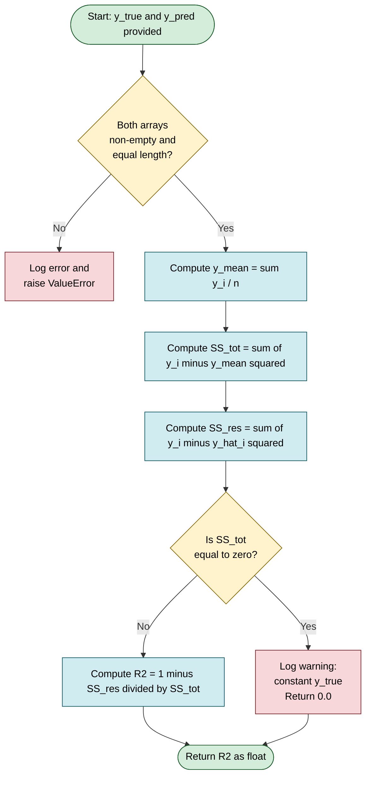
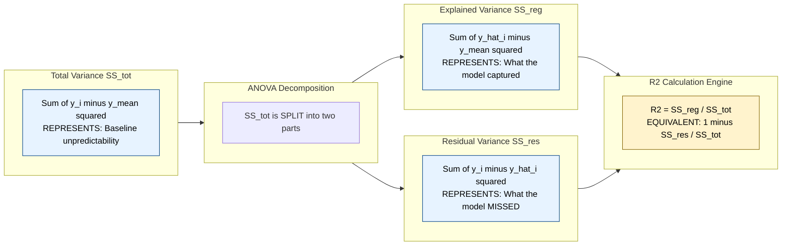
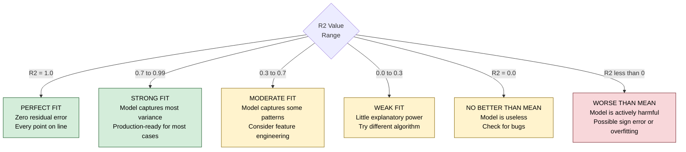

# R Squared/Coefficient of Determination.

<!-- SECTION_1_START -->

# 📊 R² — Coefficient of Determination

> [!NOTE]
> **Module Context:** While this metric is fundamentally a **regression** evaluation tool, it is taught within the KTU Machine Learning (PCCST503) curriculum as part of the broader **Model Evaluation Toolkit**. It is referenced when evaluating **Linear Regression** predictions and when introducing **Pseudo-R²** measures for **Logistic Regression** (a classification algorithm).

## 1.1 Formal Definition (KTU 2024 Syllabus Standard)

> [!IMPORTANT]
> **R² (Coefficient of Determination)** is a dimensionless statistical measure that quantifies the **proportion of variance in the dependent variable** $y$ that is **explained by the independent variable(s)** $X$ through the regression model. Formally, it is defined as $1$ minus the ratio of the **Residual Sum of Squares (SSR)** to the **Total Sum of Squares (SST)**.

Mathematically:

$$R^2 \;=\; 1 \;-\; \frac{SS_{res}}{SS_{tot}}$$

Where:
- $SS_{res} = \sum_{i=1}^{n}(y_i - \hat{y}_i)^2$ — unexplained variation (residual)
- $SS_{tot} = \sum_{i=1}^{n}(y_i - \bar{y})^2$ — total variation (around the mean)

## 1.2 Intuitive Analogy — "The Honest Report Card"

> [!TIP]
> **Think of a weather forecaster trying to predict tomorrow's temperature.**
> 
> 1. **The Lazy Baseline:** A lazy forecaster simply predicts tomorrow's temperature as the **historical average** (e.g., "It will be 30°C every day"). The total error this lazy model makes is $SS_{tot}$.
> 
> 2. **The Smart Model:** A smart forecaster uses humidity, wind, season, etc. to predict. The error this model makes is $SS_{res}$.
> 
> 3. **R² measures the *improvement*:** $R^2 = 1 - \frac{\text{Smart Model Error}}{\text{Lazy Baseline Error}}$. If the smart model is **10× better** than the lazy baseline, $R^2 = 0.90$. If the smart model is **no better**, $R^2 = 0$. If it is **perfect**, $R^2 = 1$.

## 1.3 Range and Interpretation

| $R^2$ Value | Interpretation | Real-World Meaning |
|---|---|---|
| $R^2 = 1.0$ | Perfect fit | Model explains **100%** of variance |
| $R^2 = 0.8$ | Good fit | Model explains **80%** of variance |
| $R^2 = 0.0$ | Useless model | No better than predicting the **mean** $\bar{y}$ |
| $R^2 < 0$ | Worse than mean | Model is actively **misleading** |

> [!WARNING]
> **R² can be negative!** This happens when $SS_{res} > SS_{tot}$, meaning the model performs *worse* than simply predicting the mean for every observation. This is common during early training epochs or with severe overfitting/underfitting.

> [!VISUALIZATION CONTROL]
> **Concept:** Scatter Plot with Best-Fit Line vs. Mean Line (Visualizing $SS_{res}$ and $SS_{tot}$)
> 
> **GeoGebra / Desmos Input Equations:**
> - `mean_line: y = 5`
> - `regression_line: y = 0.8x + 2`
> - `point1: (1, 3)`
> - `point2: (2, 5)`
> - `point3: (3, 4)`
> - `point4: (4, 7)`
> - `point5: (5, 6)`
> 
> **Visual Description:** Five points scatter on a $10 \times 10$ grid. A **red horizontal line** $y = 5$ represents the mean baseline. A **blue slanted line** $y = 0.8x + 2$ represents the regression model. Students should observe that **vertical blue distances** from points to the regression line are $SS_{res}$, while **vertical red distances** from points to the mean line are $SS_{tot}$. The blue line cuts *through* the cluster, visibly reducing total error.

<!-- SECTION_1_END -->

<!-- SECTION_2_START -->

# 🔬 Deep Theoretical Analysis

## 2.1 The Three "Sums of Squares" Decomposition

For any regression model, the total variation in the target variable can be decomposed into two distinct, additive components. This is the **ANOVA decomposition** underlying $R^2$.

$$SS_{tot} \;=\; SS_{res} \;+\; SS_{reg}$$

Where:
- $SS_{reg} = \sum_{i=1}^{n}(\hat{y}_i - \bar{y})^2$ — variation **explained** by the model
- $SS_{res} = \sum_{i=1}^{n}(y_i - \hat{y}_i)^2$ — variation **unexplained** (residual error)

## 2.2 Why "1 minus a ratio"? The Derivation Logic

> [!NOTE]
> The $R^2$ formula $1 - \frac{SS_{res}}{SS_{tot}}$ is engineered so that:
> 1. If the model is **perfect** ($SS_{res} = 0$), then $R^2 = 1 - 0 = 1$.
> 2. If the model is **useless** ($SS_{res} = SS_{tot}$, i.e., predictions equal the mean), then $R^2 = 1 - 1 = 0$.
> 3. If the model is **worse than useless** ($SS_{res} > SS_{tot}$), then $R^2 < 0$.

## 2.3 KTU Formula Cheat Sheet

| Formula | Expression | Purpose | When to Use |
|---|---|---|---|
| Total Sum of Squares | $SS_{tot} = \sum_{i=1}^{n}(y_i - \bar{y})^2$ | Total variance baseline | Always first |
| Residual Sum of Squares | $SS_{res} = \sum_{i=1}^{n}(y_i - \hat{y}_i)^2$ | Model error | After prediction |
| Coefficient of Determination | $R^2 = 1 - \frac{SS_{res}}{SS_{tot}}$ | Variance explained % | Final metric |
| Correlation Link (SLR) | $R^2 = r^2_{xy}$ | Where $r$ is Pearson coefficient | Simple linear regression only |
| Adjusted R² | $R^2_{adj} = 1 - \left[\frac{(1 - R^2)(n - 1)}{n - k - 1}\right]$ | Penalizes extra features | Multiple regression |
| McFadden's Pseudo-R² | $R^2_{McF} = 1 - \frac{\ln L_{full}}{\ln L_{null}}$ | Logistic regression analog | Classification context |

> [!IMPORTANT]
> In the formulas above, $n$ = number of observations, $k$ = number of predictors (features), and $L$ = likelihood. The **absolute value** bars around quantities like $\vert y_i - \hat{y}_i \vert$ (used for MAE) are **different** from $R^2$ formulas — never confuse them in the exam!

## 2.4 Real-World Engineering Utility

| Application Domain | Why R² is Used |
|---|---|
| **Predictive Maintenance** | Quantifying how well sensor data predicts equipment failure timing |
| **Financial Risk Modeling** | Assessing credit-scoring model reliability |
| **Biomedical Engineering** | Validating dose-response relationships in drug discovery |
| **Production ML Pipelines** | Comparing candidate regression models during model selection |
| **Logistic Regression (Classification)** | Pseudo-R² metrics quantify classifier calibration quality |

## 2.5 Adjusted R² — The "Penalty" for Greed

> [!TIP]
> **The Problem with R²:** Adding *any* feature to a regression model — even a useless random one — will **never decrease** $R^2$. This is because the model can always find some spurious correlation to "explain" a tiny bit more variance.
> 
> **The Solution — Adjusted R²:** $R^2_{adj}$ applies a **penalty term** $\frac{k+1}{n}$ that grows with the number of features $k$. If a feature doesn't genuinely improve the model, $R^2_{adj}$ will *drop*, protecting the engineer from overfitting.

<!-- SECTION_2_END -->

<!-- SECTION_3_START -->

# 🧮 Step-by-Step Derivations & Python Implementation

## 3.1 Worked Numerical Example (Manual Calculation)

> [!NOTE]
> **Given Dataset:** 5 observations, target $y$ and model prediction $\hat{y}$.

| Observation $i$ | $1$ | $2$ | $3$ | $4$ | $5$ |
|---|---|---|---|---|---|
| Actual $y_i$ | $3$ | $5$ | $4$ | $7$ | $6$ |
| Predicted $\hat{y}_i$ | $2.8$ | $5.2$ | $4.0$ | $7.1$ | $5.9$ |

### Step 1 — Compute the Mean of $y$

$$\bar{y} \;=\; \frac{1}{n}\sum_{i=1}^{n} y_i \;=\; \frac{3 + 5 + 4 + 7 + 6}{5} \;=\; \frac{25}{5} \;=\; 5$$

### Step 2 — Compute $SS_{tot}$

$$SS_{tot} \;=\; \sum_{i=1}^{n}(y_i - \bar{y})^2$$

Evaluating term by term:

$$\begin{aligned}
(y_1 - \bar{y})^2 &= (3 - 5)^2 = 4 \\
(y_2 - \bar{y})^2 &= (5 - 5)^2 = 0 \\
(y_3 - \bar{y})^2 &= (4 - 5)^2 = 1 \\
(y_4 - \bar{y})^2 &= (7 - 5)^2 = 4 \\
(y_5 - \bar{y})^2 &= (6 - 5)^2 = 1 \\
\end{aligned}$$

$$SS_{tot} \;=\; 4 + 0 + 1 + 4 + 1 \;=\; 10$$

### Step 3 — Compute $SS_{res}$

$$SS_{res} \;=\; \sum_{i=1}^{n}(y_i - \hat{y}_i)^2$$

Evaluating term by term:

$$\begin{aligned}
(y_1 - \hat{y}_1)^2 &= (3 - 2.8)^2 = 0.04 \\
(y_2 - \hat{y}_2)^2 &= (5 - 5.2)^2 = 0.04 \\
(y_3 - \hat{y}_3)^2 &= (4 - 4.0)^2 = 0.00 \\
(y_4 - \hat{y}_4)^2 &= (7 - 7.1)^2 = 0.01 \\
(y_5 - \hat{y}_5)^2 &= (6 - 5.9)^2 = 0.01 \\
\end{aligned}$$

$$SS_{res} \;=\; 0.04 + 0.04 + 0.00 + 0.01 + 0.01 \;=\; 0.10$$

### Step 4 — Compute $R^2$

$$R^2 \;=\; 1 - \frac{SS_{res}}{SS_{tot}} \;=\; 1 - \frac{0.10}{10} \;=\; 1 - 0.01 \;=\; 0.99$$

> [!IMPORTANT]
> **Interpretation:** The model explains **99%** of the variance in $y$. This indicates a near-perfect fit for this small synthetic dataset.

---

## 3.2 Adjusted R² Calculation (Extension)

Suppose the model above uses $k = 2$ features with $n = 5$ observations:

$$R^2_{adj} \;=\; 1 - \left[\frac{(1 - 0.99)(5 - 1)}{5 - 2 - 1}\right] \;=\; 1 - \left[\frac{0.04}{2}\right] \;=\; 1 - 0.02 \;=\; 0.98$$

---

## 3.3 Python Code — Production-Grade Implementation

```python
"""
KTU PCCST503 - Module 2: Coefficient of Determination (R^2)
Premium Python Implementation with Type Hints and Error Handling
"""

from __future__ import annotations
import logging
from typing import Sequence
import numpy as np

# Configure logging for traceability in production pipelines
logging.basicConfig(
    level=logging.INFO,
    format="%(asctime)s | %(levelname)s | %(message)s"
)
logger = logging.getLogger(__name__)


def compute_r_squared(
    y_true: Sequence[float],
    y_pred: Sequence[float]
) -> float:
    """
    Compute the Coefficient of Determination (R^2).
    
    Parameters
    ----------
    y_true : Sequence[float]
        Ground-truth target values.
    y_pred : Sequence[float]
        Model-predicted values.
    
    Returns
    -------
    float
        R^2 score. Can be negative if model is worse than the mean.
    
    Raises
    ------
    ValueError
        If inputs are empty or of mismatched lengths.
    """
    # ---- Boundary check 1: Empty inputs ----
    if len(y_true) == 0 or len(y_pred) == 0:
        logger.error("Empty input arrays detected.")
        raise ValueError("Input arrays must be non-empty.")
    
    # ---- Boundary check 2: Length mismatch ----
    if len(y_true) != len(y_pred):
        logger.error(
            "Length mismatch: y_true=%d, y_pred=%d",
            len(y_true), len(y_pred)
        )
        raise ValueError("y_true and y_pred must have the same length.")
    
    # Convert to numpy arrays for vectorized operations
    y_true_arr = np.asarray(y_true, dtype=np.float64)
    y_pred_arr = np.asarray(y_pred, dtype=np.float64)
    n = y_true_arr.shape[0]
    
    # ---- Compute mean of y_true ----
    y_mean = np.mean(y_true_arr)
    logger.info("Computed y_mean = %.4f", y_mean)
    
    # ---- Compute SS_tot (Total Sum of Squares) ----
    ss_tot = np.sum((y_true_arr - y_mean) ** 2)
    
    # ---- Compute SS_res (Residual Sum of Squares) ----
    ss_res = np.sum((y_true_arr - y_pred_arr) ** 2)
    
    logger.info("SS_tot = %.4f, SS_res = %.4f", ss_tot, ss_res)
    
    # ---- Guard against division by zero (constant y_true) ----
    if ss_tot == 0.0:
        logger.warning("SS_tot is zero; y_true is constant. R^2 undefined.")
        return 0.0
    
    r_squared = 1.0 - (ss_res / ss_tot)
    logger.info("R^2 = %.4f", r_squared)
    return float(r_squared)


def compute_adjusted_r_squared(
    y_true: Sequence[float],
    y_pred: Sequence[float],
    n_features: int
) -> float:
    """
    Compute the Adjusted R^2 score.
    
    Parameters
    ----------
    y_true : Sequence[float]
        Ground-truth target values.
    y_pred : Sequence[float]
        Model-predicted values.
    n_features : int
        Number of independent variables (k).
    
    Returns
    -------
    float
        Adjusted R^2 value.
    """
    n = len(y_true)
    if n <= n_features + 1:
        raise ValueError(
            f"Need n > k+1; got n={n}, k={n_features}."
        )
    
    r_sq = compute_r_squared(y_true, y_pred)
    adjusted = 1.0 - ((1.0 - r_sq) * (n - 1)) / (n - n_features - 1)
    return float(adjusted)


# ---- Driver block: replicate the worked numerical example ----
if __name__ == "__main__":
    y_actual = [3, 5, 4, 7, 6]
    y_predicted = [2.8, 5.2, 4.0, 7.1, 5.9]
    
    r2 = compute_r_squared(y_actual, y_predicted)
    adj_r2 = compute_adjusted_r_squared(y_actual, y_predicted, n_features=2)
    
    print(f"R^2        = {r2:.4f}")
    print(f"Adjusted R^2 = {adj_r2:.4f}")
```

**Expected Output:**
```
R^2        = 0.9900
Adjusted R^2 = 0.9800
```

---

## 3.4 Sklearn Cross-Verification

```python
from sklearn.metrics import r2_score

y_actual = [3, 5, 4, 7, 6]
y_predicted = [2.8, 5.2, 4.0, 7.1, 5.9]

print(f"sklearn R^2 = {r2_score(y_actual, y_predicted):.4f}")
```

> [!TIP]
> Always cross-validate your custom implementation against `sklearn.metrics.r2_score` during the KTU practical examination — this catches subtle bugs like missing data points or type conversion errors.

<!-- SECTION_3_END -->

<!-- SECTION_4_START -->

# 🗺️ Structural Diagrams & Schematics

## 4.1 R² Calculation Flow (Mermaid Flowchart)



## 4.2 Variance Decomposition Logic (Mermaid Block Diagram)



## 4.3 R² Interpretation Decision Tree



<!-- SECTION_4_END -->

<!-- SECTION_5_START -->

# 📝 KTU 2024 Scheme Examination Question Bank

> [!NOTE]
> All questions are mapped to **Course Outcomes (CO)** and **Revised Bloom's Taxonomy (RBT)** levels per the KTU 2024 Scheme evaluation pattern.

---

## Part A — Short Answer Questions (3 Marks Each)

### Question 1 `[KTU University Exam - Dec 2023]`
**(CO1, RBT Level: Remember)**

> Define the Coefficient of Determination ($R^2$). What is the significance of $R^2 = 0.85$ for a regression model?

**Model Answer (3 Marks):**

> [!IMPORTANT]
> **Definition (2 Marks):** The Coefficient of Determination, denoted $R^2$, is a statistical metric that quantifies the proportion of variance in the dependent variable $y$ that is predictable from the independent variable(s) $X$. It is computed as $R^2 = 1 - \frac{SS_{res}}{SS_{tot}}$.
> 
> **Significance (1 Mark):** An $R^2$ value of $0.85$ indicates that **85% of the total variance** in the target variable is explained by the regression model, while the remaining **15%** is unexplained (residual). This denotes a strong model fit.

---

### Question 2 `[KTU University Exam - July 2024]`
**(CO1, RBT Level: Understand)**

> Differentiate between $R^2$ and Adjusted $R^2$. When is Adjusted $R^2$ preferred?

**Model Answer (3 Marks):**

> [!TIP]
> **$R^2$ (1 Mark):** Measures the proportion of variance explained by the model. **Limitation:** It never decreases on adding new features, even if they are irrelevant.
> 
> **Adjusted $R^2$ (1 Mark):** Modifies $R^2$ by penalizing the addition of unnecessary predictors. Formula: $R^2_{adj} = 1 - \left[\frac{(1 - R^2)(n - 1)}{n - k - 1}\right]$ where $k$ is the number of predictors.
> 
> **Preference (1 Mark):** Adjusted $R^2$ is preferred in **multiple linear regression** to detect overfitting caused by irrelevant features.

---

## Part B — Long Answer Questions (14 Marks, Internal Choice)

### ✅ Question A (14 Marks) `[KTU University Exam - Dec 2023]`

**(a)** Derive the expression for the Coefficient of Determination $R^2$ starting from the basic definition of variance. Explain each component. **(7 Marks, CO1, RBT: Understand)**

**Model Solution:**

> [!NOTE]
> **Step 1 — Define Total Variance of $y$ (1 Mark):**
> The total variance of the observed values is the squared deviation of each $y_i$ from the population mean $\bar{y}$:
> $$SS_{tot} = \sum_{i=1}^{n}(y_i - \bar{y})^2$$
> 
> **Step 2 — Define the Regression Model (1 Mark):**
> A linear regression model predicts $\hat{y}_i$ as an approximation of $y_i$, where $\hat{y}_i = \beta_0 + \beta_1 x_i$.
> 
> **Step 3 — Define the Residual (1 Mark):**
> The residual is the unexplained part: $e_i = y_i - \hat{y}_i$. The **Residual Sum of Squares** is:
> $$SS_{res} = \sum_{i=1}^{n}(y_i - \hat{y}_i)^2$$
> 
> **Step 4 — Compute Explained Variance (1 Mark):**
> The variance explained by the model is:
> $$SS_{reg} = \sum_{i=1}^{n}(\hat{y}_i - \bar{y})^2$$
> 
> **Step 5 — Establish the Decomposition Identity (2 Marks):**
> Through algebraic expansion (using $\bar{y} = \bar{\hat{y}}$ for OLS):
> $$\begin{aligned}
> y_i - \bar{y} &= (\hat{y}_i - \bar{y}) + (y_i - \hat{y}_i) \\
> \sum(y_i - \bar{y})^2 &= \sum(\hat{y}_i - \bar{y})^2 + \sum(y_i - \hat{y}_i)^2 \\
> SS_{tot} &= SS_{reg} + SS_{res}
> \end{aligned}$$
> 
> **Step 6 — Final R² Expression (1 Mark):**
> $$R^2 = \frac{SS_{reg}}{SS_{tot}} = 1 - \frac{SS_{res}}{SS_{tot}}$$

---

**(b)** For the data below, compute $R^2$ and **Adjusted $R^2$** assuming $k = 2$ features. Show all intermediate steps. **(7 Marks, CO1/CO3, RBT: Apply)**

| $i$ | $1$ | $2$ | $3$ | $4$ | $5$ | $6$ |
|---|---|---|---|---|---|---|
| $y_i$ | $10$ | $12$ | $14$ | $16$ | $18$ | $20$ |
| $\hat{y}_i$ | $9.5$ | $12.4$ | $13.8$ | $15.9$ | $18.2$ | $20.1$ |

**Model Solution:**

> [!IMPORTANT]
> **Step 1 — Mean of $y$ (1 Mark):**
> $$\bar{y} = \frac{10 + 12 + 14 + 16 + 18 + 20}{6} = \frac{90}{6} = 15$$
> 
> **Step 2 — Compute $SS_{tot}$ (1 Mark):**
> $$\begin{aligned}
> SS_{tot} &= (10-15)^2 + (12-15)^2 + (14-15)^2 + (16-15)^2 + (18-15)^2 + (20-15)^2 \\
> &= 25 + 9 + 1 + 1 + 9 + 25 = 70
> \end{aligned}$$
> 
> **Step 3 — Compute $SS_{res}$ (1 Mark):**
> $$\begin{aligned}
> SS_{res} &= (10-9.5)^2 + (12-12.4)^2 + (14-13.8)^2 + (16-15.9)^2 + (18-18.2)^2 + (20-20.1)^2 \\
> &= 0.25 + 0.16 + 0.04 + 0.01 + 0.04 + 0.01 = 0.51
> \end{aligned}$$
> 
> **Step 4 — Compute $R^2$ (1 Mark):**
> $$R^2 = 1 - \frac{0.51}{70} = 1 - 0.00729 = 0.9927$$
> 
> **Step 5 — Apply Adjusted R² Formula (2 Marks):**
> With $n = 6$ and $k = 2$:
> $$R^2_{adj} = 1 - \left[\frac{(1 - 0.9927)(6 - 1)}{6 - 2 - 1}\right] = 1 - \left[\frac{0.0073 \times 5}{3}\right] = 1 - 0.0122 = 0.9878$$
> 
> **Step 6 — Final Interpretation (1 Mark):**
> The model explains **99.27%** of variance; the high Adjusted $R^2$ of 98.78% confirms the model is robust even after penalizing for the 2 features used.

---

### ✅ Question B (14 Marks) `[KTU University Exam - July 2024]`

**(a)** List and explain **at least four limitations** of $R^2$ as a standalone evaluation metric for regression models. **(7 Marks, CO2, RBT: Understand)**

**Model Solution:**

> [!WARNING]
> **Limitation 1 — Insensitive to Overfitting (2 Marks):** $R^2$ **never decreases** when new features are added, even random noise. This encourages overfitting. A model with 100 noisy features can artificially achieve $R^2 = 0.99$.
> 
> **Limitation 2 — No Indication of Bias (1.5 Marks):** A high $R^2$ does not imply predictions are unbiased. Systematic errors cancel out within $SS_{res}$, masking consistent over/under-prediction.
> 
> **Limitation 3 — Cannot Detect Non-Linearity Misspecification (1.5 Marks):** If the true relationship is non-linear and a linear model is fit, $R^2$ may still be moderate (e.g., 0.6), falsely suggesting acceptable fit. The model may be missing essential structure.
> 
> **Limitation 4 — Scale and Context Dependence (1 Mark):** $R^2$ values are not comparable across datasets with different units or domains. An $R^2 = 0.7$ in physics may be excellent, while the same in finance may be poor.
> 
> **Limitation 5 — Not Suitable for Non-Continuous Targets (1 Mark):** $R^2$ is undefined for classification problems. Logistic regression requires **Pseudo-R²** variants (McFadden, Cox-Snell) instead.

---

**(b)** A dataset has $n = 50$ observations and $k = 4$ predictors. A model achieves $R^2 = 0.80$. Compute the Adjusted $R^2$ and determine whether adding a 5th feature that raises $R^2$ to $0.805$ is justified. **(7 Marks, CO3, RBT: Apply/Analyze)**

**Model Solution:**

> [!NOTE]
> **Step 1 — Compute Adjusted R² (Initial) (2 Marks):**
> $$R^2_{adj,\,1} = 1 - \left[\frac{(1 - 0.80)(50 - 1)}{50 - 4 - 1}\right] = 1 - \left[\frac{0.20 \times 49}{45}\right] = 1 - 0.2178 = 0.7822$$
> 
> **Step 2 — Compute Adjusted R² (After 5th Feature) (2 Marks):**
> $$R^2_{adj,\,2} = 1 - \left[\frac{(1 - 0.805)(49)}{50 - 5 - 1}\right] = 1 - \left[\frac{0.195 \times 49}{44}\right] = 1 - 0.2172 = 0.7828$$
> 
> **Step 3 — Compare (1.5 Marks):**
> $\Delta R^2_{adj} = 0.7828 - 0.7822 = +0.0006$. The Adjusted $R^2$ **increased marginally** by 0.06%.
> 
> **Step 4 — Justification Analysis (1.5 Marks):**
> Although $R^2$ increased by 0.5% (from 0.80 to 0.805), the **negligible improvement** in Adjusted $R^2$ suggests the 5th feature contributes very little. **Adding the feature is NOT justified** unless it provides domain-specific interpretability benefits.

---

## 🎯 KTU Examiner's Valuation Warning

> [!WARNING]
> **Common Pitfalls Where Students Lose Marks:**
> 
> 1. **Forgetting to state the formula before computation** — Examiners award 1 mark simply for writing $R^2 = 1 - \frac{SS_{res}}{SS_{tot}}$. Always declare the formula first.
> 
> 2. **Confusing $SS_{res}$ with $SS_{reg}$** — $SS_{res}$ uses $(y_i - \hat{y}_i)^2$ (actual minus predicted). $SS_{reg}$ uses $(\hat{y}_i - \bar{y})^2$ (predicted minus mean). Swap them and you get a wrong answer.
> 
> 3. **Not writing the mean computation step explicitly** — Even if trivial, show $\bar{y} = \frac{\sum y_i}{n}$. Examiners value methodical work.
> 
> 4. **Adjusted R² formula misuse** — The denominator is $n - k - 1$, NOT $n - k$. Missing the "$-1$" costs full marks in 14-mark questions.
> 
> 5. **Ignoring $n > k+1$ boundary condition** — If $n \leq k+1$, Adjusted R² is undefined. Always state this assumption.
> 
> 6. **Forgetting the $R^2$ interpretation sentence** — End every computation with a one-line interpretation (e.g., "Model explains 99.27% of variance"). This is often a mandatory 1-mark closing step.

---

## 📌 Topic Recap & Important Things to Remember

> [!TIP]
> **Rapid Revision Checklist for KTU Exam Day:**

- ✅ **$R^2$ Definition:** Proportion of variance in $y$ explained by the model.
- ✅ **Core Formula:** $R^2 = 1 - \frac{SS_{res}}{SS_{tot}}$, where $SS_{res} = \sum(y_i - \hat{y}_i)^2$ and $SS_{tot} = \sum(y_i - \bar{y})^2$.
- ✅ **Range:** $-\infty < R^2 \leq 1$. Negative values are valid and indicate a worse-than-mean model.
- ✅ **Identity:** $SS_{tot} = SS_{reg} + SS_{res}$ (ANOVA decomposition).
- ✅ **Simple Linear Regression Link:** $R^2 = r^2_{xy}$ (squared Pearson correlation).
- ✅ **Adjusted R² Formula:** $R^2_{adj} = 1 - \left[\frac{(1 - R^2)(n - 1)}{n - k - 1}\right]$.
- ✅ **Penalty Mechanism:** Adjusted R² penalizes unnecessary features; used in multiple regression.
- ✅ **Pseudo-R² for Classification:** McFadden's $R^2_{McF} = 1 - \frac{\ln L_{full}}{\ln L_{null}}$ extends the concept to logistic regression.
- ✅ **Limitation:** $R^2$ never decreases with added features — use Adjusted R² for model selection.
- ✅ **Interpretation Rule:** $R^2 = 0.85$ → model explains 85% of variance, 15% is unexplained.
- ✅ **Boundary Condition:** Adjusted R² requires $n > k+1$ to be mathematically defined.
- ✅ **Code Hook (Python):** `from sklearn.metrics import r2_score` is the industry-standard implementation.
- ✅ **Common Exam Trap:** $SS_{res}$ uses *actual* minus *predicted*; $SS_{tot}$ uses *actual* minus *mean*. Do not interchange.

<!-- SECTION_5_END -->
