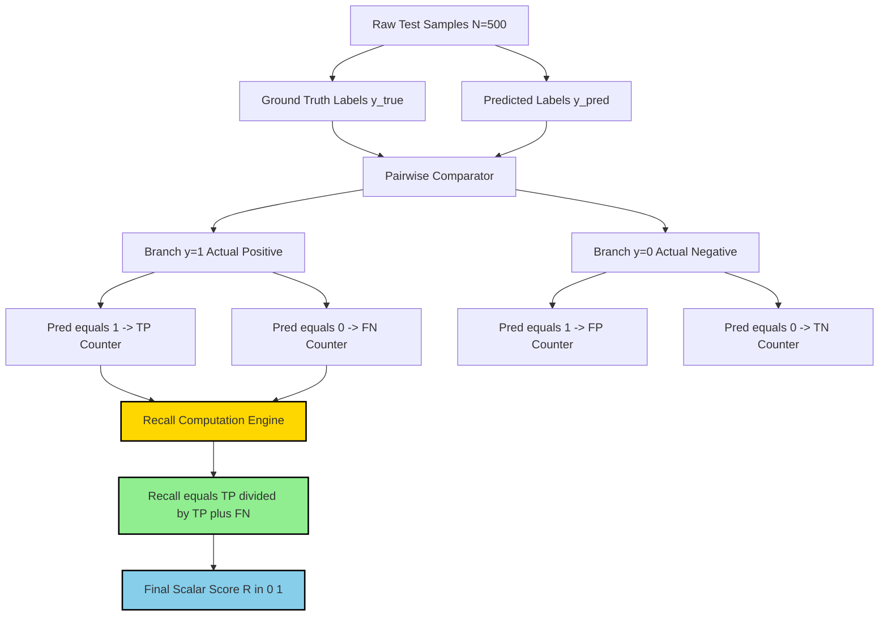
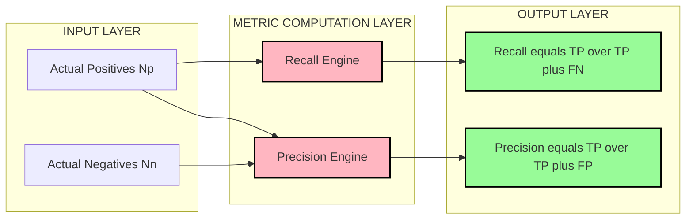
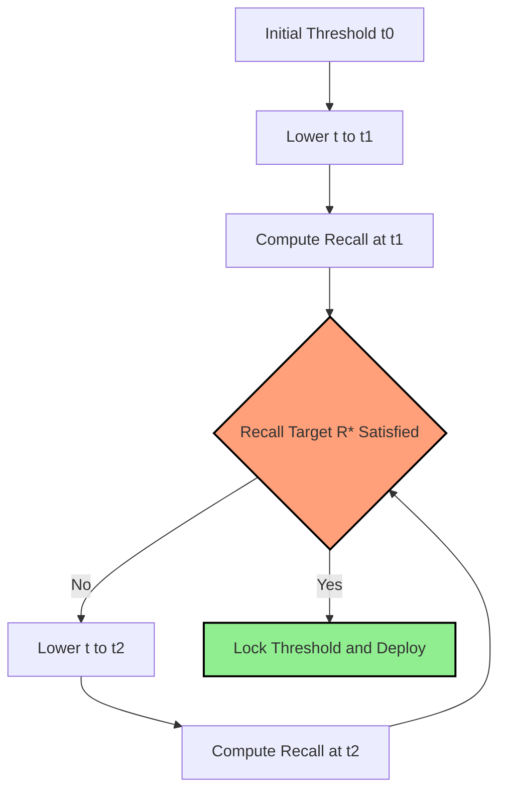
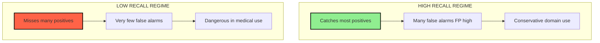

# Recall

<!-- SECTION_1_START -->

# Recall in Classification — Foundational Definition & Intuition

## 1.1 Formal Academic Definition (KTU 2024 Syllabus Terminology)

In the context of supervised Machine Learning classification, **Recall** is defined as a scalar **evaluation metric** that quantifies the proportion of *actual positive instances* that are correctly retrieved by a trained classifier. Formally, it is the ratio of **True Positives (TP)** to the total number of genuinely positive samples present in the ground truth.

$$
\text{Recall} = \frac{TP}{TP + FN}
$$

where $TP$ denotes the count of samples correctly labelled as positive by the model, and $FN$ denotes the count of positive samples *incorrectly* predicted as negative. Recall is also synonymously called **Sensitivity**, **True Positive Rate (TPR)**, or **Hit Rate** in KTU-recommended literature.

> [!IMPORTANT]
> **Syllabus Highlight (PCCST503 — Module 2: Classification):** Recall is one of the four canonical performance measures derived from the **Confusion Matrix**, alongside Accuracy, Precision, and the **F-Measure (F1-Score)**. A KTU board examiner expects you to derive, interpret, and contrast Recall with Precision in any classification-related question.

## 1.2 Conceptual Analogy — The Hospital Screening Intuition

Imagine a hospital lab is testing 1000 patients for a rare disease.

- **100 patients actually have the disease** (the *ground truth positives*).
- The classifier (the lab test) flags 80 of them correctly as **diseased** and misses 20, labelling them as *healthy*.

In this scenario:

- $TP = 80$ (caught correctly)
- $FN = 20$ (missed positives — these are the *dangerous* cases)

So, Recall is *out of all the sick people, how many did the test successfully catch?* It is the metric that answers the question:

> *"Did my model miss any real positive cases?"*

A Recall of $\frac{80}{100} = 0.80$ means the test successfully retrieved **80\%** of the truly diseased patients. The **20 missed patients** are **False Negatives**, and in domains like oncology, fraud detection, and malware screening, these are the costliest errors.

## 1.3 Position Within the Confusion Matrix

The Confusion Matrix is a $2 \times 2$ grid that summarises prediction outcomes for a binary classifier:

| Dimension | Predicted Positive | Predicted Negative |
| :--- | :---: | :---: |
| **Actual Positive** | True Positive (TP) | False Negative (FN) |
| **Actual Negative** | False Positive (FP) | True Negative (TN) |

Recall exclusively uses the **top row** of the matrix — the row of *Actual Positives*. This is its defining mathematical property: **the denominator ignores the negative class entirely.**

> [!NOTE]
> **Core Definition Box — Recall (Sensitivity):**
> Recall is the fraction of **actual positives** correctly predicted as positive by the classifier. It is bounded in the closed interval $[0, 1]$, with $1.0$ indicating perfect retrieval and $0.0$ indicating total failure to detect any positive case.

## 1.4 Geometric & Statistical Intuition

If we treat the classifier as a thresholded scorer on a Probability Distribution Function, Recall measures the **mass of the positive class distribution that lies beyond the decision threshold.** Lowering the threshold pushes more positives into the predicted-positive region, increasing Recall but often inflating False Positives — a fundamental trade-off memorised in KTU exams as the **Precision-Recall trade-off**.

> [!VISUALIZATION CONTROL]
> **Concept:** Threshold Sweep Effect on Recall
> **GeoGebra / Desmos Input Equations:**
> * Define two overlapping Gaussian curves: $P_1(x) = e^{-(x-2)^2}$ for positives and $P_2(x) = e^{-(x+2)^2}$ for negatives.
> * Place a vertical threshold line $x = t$ and slide $t$ from right to left.
> * Plot the curve $R(t) = \frac{\int_{t}^{\infty} P_1(x)\, dx}{\int_{-\infty}^{\infty} P_1(x)\, dx}$.
> **Visual Description:** As the threshold $t$ moves left, the shaded area under the positive curve beyond $t$ grows, and $R(t)$ monotonically rises towards 1. This visualises why **Recall is monotonically non-decreasing** as the threshold decreases.

## 1.5 When is Recall the *Right* Metric?

Recall is the **dominant metric** whenever the cost of a False Negative is significantly higher than the cost of a False Positive. The classical KTU textbook examples include:

1. **Medical Diagnostics** — missing a cancer patient is worse than a false alarm.
2. **Spam Filtering (with critical alerts)** — missing a phishing email is more harmful.
3. **Fraud Detection** — letting a fraudulent transaction slip through is costlier than flagging a legitimate one.
4. **Intrusion Detection Systems (Cybersecurity)** — missing an attack is catastrophic.
5. **Defect Detection in Manufacturing** — shipping a defective product is costlier than a re-inspection.

> [!TIP]
> **Quick Heuristic for KTU Exams:** *“When you cannot afford to miss a positive, optimise for Recall.”*

<!-- SECTION_1_END -->

<!-- SECTION_2_START -->

# Deep Theoretical Analysis & KTU High-Yield Formula Sheet

## 2.1 The Operational Logic — Step-by-Step

Computing Recall for a binary classifier follows a deterministic four-step pipeline. Each step is essential for KTU answer-writing and board valuation.

- **Step 1 — Acquire Ground Truth Labels ($y_i$) and Predicted Labels ($\hat{y}_i$)**
  Obtain the true class vector $Y = \{y_1, y_2, \dots, y_N\}$ where $y_i \in \{0, 1\}$ and the model's prediction vector $\hat{Y} = \{\hat{y}_1, \hat{y}_2, \dots, \hat{y}_N\}$.
- **Step 2 — Compute the Confusion Matrix Counts**
  Compare $Y$ and $\hat{Y}$ element-wise and accumulate four counters:
    * $TP = \sum_{i=1}^{N} \mathbb{1}(y_i = 1 \land \hat{y}_i = 1)$
    * $FP = \sum_{i=1}^{N} \mathbb{1}(y_i = 0 \land \hat{y}_i = 1)$
    * $FN = \sum_{i=1}^{N} \mathbb{1}(y_i = 1 \land \hat{y}_i = 0)$
    * $TN = \sum_{i=1}^{N} \mathbb{1}(y_i = 0 \land \hat{y}_i = 0)$
- **Step 3 — Apply the Recall Formula**
  Substitute into the defining equation:
    $\text{Recall} = \frac{TP}{TP + FN}$
- **Step 4 — Interpret in Domain Context**
  Translate the numerical score into an actionable engineering decision — e.g., *“at the current threshold, the model retrieves 87\% of all positive cases; this is acceptable for a non-critical screening pipeline.”*

## 2.2 The “Why” Behind Each Step

- **Step 1** is necessary because Recall is a *post-hoc* metric — it cannot be computed during training without held-out labels.
- **Step 2** isolates the contributions of each cell of the Confusion Matrix; miscounting $TP$ and $FN$ is the most common KTU answer error.
- **Step 3** uses only the **positive row** of the matrix, which is the structural reason Recall ignores class imbalance in the *negative* class.
- **Step 4** elevates a number into an engineering insight — KTU's outcome-based education philosophy (NEP 2020) rewards interpretation, not just arithmetic.

## 2.3 The KTU Formula Cheat Sheet

The following high-yield formula table is curated from the **PCCST503 (Machine Learning) 2024 Scheme syllabus** and previous-year question patterns. Master every cell — these appear verbatim in Part A and Part B examinations.

| Metric Name | Formula | Numerator | Denominator | Range | Failure Mode if Low |
| :--- | :--- | :--- | :--- | :--- | :--- |
| **Accuracy** | $\frac{TP + TN}{TP + FP + FN + TN}$ | Correct predictions | Total samples | $[0, 1]$ | Misleading on imbalanced data |
| **Precision** | $\frac{TP}{TP + FP}$ | Correct positive predictions | All positive predictions | $[0, 1]$ | Many false alarms |
| **Recall (Sensitivity / TPR)** | $\frac{TP}{TP + FN}$ | Correctly retrieved positives | All actual positives | $[0, 1]$ | Misses genuine positives (dangerous) |
| **Specificity (TNR)** | $\frac{TN}{TN + FP}$ | Correctly retrieved negatives | All actual negatives | $[0, 1]$ | Many false positives |
| **F1-Score** | $\frac{2 \cdot P \cdot R}{P + R}$ | Harmonic mean numerator | Sum of P and R | $[0, 1]$ | Either P or R is poor |
| **FPR (Fall-out)** | $\frac{FP}{FP + TN}$ | False alarms | All actual negatives | $[0, 1]$ | Class discrimination poor |
| **Miss Rate (FNR)** | $\frac{FN}{TP + FN}$ | Missed positives | All actual positives | $[0, 1]$ | Complement of Recall |

> [!NOTE]
> **Critical Identity for KTU Board Exams:** $\text{Recall} = 1 - \text{FNR}$ (Miss Rate). This identity is frequently tested as a one-mark direct question in Part A.

## 2.4 Engineering Utility in Production Systems

Recall is not merely a theoretical metric — it is the *operational heartbeat* of classification systems in production:

- **Threshold Tuning Pipelines:** Production ML systems often use a **Recall-constrained threshold selection** strategy. For example, a banking fraud model may be required to maintain Recall $\geq 0.99$ to satisfy regulatory compliance, and the threshold is selected to satisfy this constraint while maximising Precision.
- **Class-Imbalance Scenarios:** When the positive class is rare (e.g., 1 in 10,000), Accuracy becomes useless. Recall and **Precision-Recall AUC (PR-AUC)** become the gold-standard metrics.
- **Active Learning:** In semi-supervised pipelines, Recall is used to identify *missed positives* for human re-labelling.
- **Model Monitoring:** Data drift is detected when production Recall drops below a baseline computed on a validation set.
- **Search & Information Retrieval:** Recall@k measures the fraction of relevant documents retrieved in the top-k results — a direct analogue of classification Recall.

> [!TIP]
> **Real-world KTU Application:** In the famous **MNIST digit classification** lab, if a postal sorting system is required to never misroute a digit, the team tunes a high-Recall threshold even at the cost of more manual rejections — illustrating the Precision-Recall trade-off in action.

## 2.5 Relationship With Other Metrics — Multi-Metric Reasoning

Recall is best understood as one vertex of a **multi-metric trade-off tetrahedron** with Precision, F1, and Specificity.

$$
\text{F1} = \frac{2 \cdot \text{Precision} \cdot \text{Recall}}{\text{Precision} + \text{Recall}}
$$

When Precision is high but Recall is low, the model is *conservative* — it only fires when highly confident. When Recall is high but Precision is low, the model is *aggressive* — it over-triggers alarms. The **Receiver Operating Characteristic (ROC) curve** plots Recall (TPR) on the y-axis against FPR on the x-axis as the threshold varies, and the **Area Under the Curve (AUC-ROC)** summarises classifier quality across all thresholds.

> [!IMPORTANT]
> **KTU Pitfall — Class Imbalance Warning:** On heavily imbalanced datasets (e.g., 99\% negative, 1\% positive), a trivial “always-predict-negative” model achieves 99\% Accuracy but 0\% Recall. Always pair Accuracy with Recall in imbalanced domains.

<!-- SECTION_2_END -->

<!-- SECTION_3_START -->

# Step-by-Step Derivations & Python Implementation

## 3.1 Worked Numerical Example (KTU Board Style)

> **Problem Statement:**
> A binary classifier is evaluated on a held-out test set of 500 samples. The Confusion Matrix is reported as follows:
>
> | | Predicted Positive | Predicted Negative |
> | :--- | :---: | :---: |
> | **Actual Positive** | 90 | 10 |
> | **Actual Negative** | 20 | 380 |
>
> Compute the **Recall**, **Precision**, **F1-Score**, and **Specificity**. Interpret the result.

### Step 1 — Extract Confusion Matrix Values

From the given matrix, we directly read off the four canonical counters:

$$
TP = 90, \quad FN = 10, \quad FP = 20, \quad TN = 380
$$

**Valuation Key:** *[Correctly extracting all four values: 1 Mark]*

### Step 2 — Compute Recall

Recall measures the fraction of actual positives correctly retrieved.

$$
\text{Recall} = \frac{TP}{TP + FN} = \frac{90}{90 + 10} = \frac{90}{100} = 0.90
$$

**Valuation Key:** *[Stating the formula: 1 Mark; correct substitution: 1 Mark; final value 0.90: 1 Mark = 3 Marks total]*

### Step 3 — Compute Precision (for cross-verification)

Precision measures the fraction of *predicted* positives that are correct.

$$
\text{Precision} = \frac{TP}{TP + FP} = \frac{90}{90 + 20} = \frac{90}{110} \approx 0.8182
$$

### Step 4 — Compute the F1-Score

F1 is the harmonic mean of Precision and Recall.

$$
\text{F1} = \frac{2 \cdot P \cdot R}{P + R} = \frac{2 \cdot 0.8182 \cdot 0.90}{0.8182 + 0.90} = \frac{1.4727}{1.7182} \approx 0.8571
$$

### Step 5 — Compute Specificity

Specificity measures the fraction of actual negatives correctly identified.

$$
\text{Specificity} = \frac{TN}{TN + FP} = \frac{380}{380 + 20} = \frac{380}{400} = 0.95
$$

### Step 6 — Engineering Interpretation

- **Recall = 0.90** → Out of every 100 truly positive samples, the classifier successfully identifies 90 and misses 10. The Miss Rate is $1 - 0.90 = 0.10$ (10\%).
- **Precision = 0.82** → When the model raises an alarm, it is correct 82\% of the time.
- **The 10 missed positives (FN)** are the critical risk in a high-Recall-priority application.
- **F1 = 0.857** → Balanced performance is reasonably good, but Precision-Recall trade-off is visible.

> [!WARNING]
> **KTU Valuation Pitfall — Common Student Errors:**
> 1. Confusing the denominator of Recall ($TP + FN$) with the denominator of Precision ($TP + FP$). These are *different* denominators and lead to swapped answers if memorised carelessly.
> 2. Forgetting that Recall ignores the negative class entirely. Students who include $TN$ in the denominator automatically lose 2 marks.
> 3. Not interpreting the metric. KTU 2024 scheme rewards **interpretation** as a separate mark head under the Course Outcome CO3 (Apply).

## 3.2 Full Python Implementation (Type-Hinted, Production-Ready)

The following Python code is suitable for KTU lab examinations and demonstrates Recall computation using both manual NumPy operations and the `scikit-learn` library.

```python
"""
File: recall_computation.py
Module: PCCST503 - Machine Learning, Module 2: Classification
Topic: Recall Computation from Confusion Matrix
Author: KTU-Premier-Engine V10 Reference Implementation
Python: 3.10+
"""

from __future__ import annotations
import numpy as np
from sklearn.metrics import (
    recall_score,
    precision_score,
    f1_score,
    confusion_matrix,
    classification_report,
)
import logging

# Configure logging for traceability
logging.basicConfig(
    level=logging.INFO,
    format="%(asctime)s | %(levelname)s | %(message)s",
)
logger = logging.getLogger(__name__)


def compute_confusion_counts(
    y_true: np.ndarray,
    y_pred: np.ndarray,
) -> tuple[int, int, int, int]:
    """
    Compute the four canonical confusion matrix counts from label vectors.

    Parameters
    ----------
    y_true : np.ndarray
        Ground-truth binary labels (0 or 1).
    y_pred : np.ndarray
        Predicted binary labels (0 or 1).

    Returns
    -------
    tuple[int, int, int, int]
        (TP, FP, FN, TN) integer counts.

    Raises
    ------
    ValueError
        If y_true and y_pred have mismatched lengths.
    """
    if y_true.shape[0] != y_pred.shape[0]:
        logger.error("Label vector length mismatch: %d vs %d",
                     y_true.shape[0], y_pred.shape[0])
        raise ValueError("y_true and y_pred must have the same length.")

    # Boundary check: ensure binary labels only
    valid_labels = {0, 1}
    if not set(np.unique(y_true)).issubset(valid_labels):
        raise ValueError("y_true must contain only 0 and 1.")
    if not set(np.unique(y_pred)).issubset(valid_labels):
        raise ValueError("y_pred must contain only 0 and 1.")

    tp = int(np.sum((y_true == 1) & (y_pred == 1)))
    fp = int(np.sum((y_true == 0) & (y_pred == 1)))
    fn = int(np.sum((y_true == 1) & (y_pred == 0)))
    tn = int(np.sum((y_true == 0) & (y_pred == 0)))

    logger.info("Computed counts -> TP=%d, FP=%d, FN=%d, TN=%d",
                tp, fp, fn, tn)
    return tp, fp, fn, tn


def compute_recall_manual(tp: int, fn: int) -> float:
    """
    Compute Recall manually using the formula: TP / (TP + FN).

    Parameters
    ----------
    tp : int
        True Positive count.
    fn : int
        False Negative count.

    Returns
    -------
    float
        Recall score in the range [0, 1].
    """
    denominator = tp + fn
    if denominator == 0:
        logger.warning("Denominator is zero -> Recall is undefined.")
        return 0.0
    recall_value = tp / denominator
    logger.info("Manual Recall computed: %.4f", recall_value)
    return recall_value


def demonstrate_recall_workflow() -> None:
    """
    End-to-end demonstration of Recall computation for the KTU
    worked example (TP=90, FP=20, FN=10, TN=380).
    """
    # Reconstruct the test-set predictions
    y_true = np.array(
        [1] * 100 + [0] * 400,
        dtype=np.int8,
    )
    y_pred = np.array(
        [1] * 90 + [0] * 10 + [1] * 20 + [0] * 380,
        dtype=np.int8,
    )

    # Step 1: Get confusion matrix counts
    tp, fp, fn, tn = compute_confusion_counts(y_true, y_pred)

    # Step 2: Manual Recall
    recall_manual = compute_recall_manual(tp, fn)

    # Step 3: Scikit-learn verification
    recall_sklearn = recall_score(y_true, y_pred)
    precision_sklearn = precision_score(y_true, y_pred)
    f1_sklearn = f1_score(y_true, y_pred)

    # Step 4: Output
    print("\n" + "=" * 60)
    print("       KTU WORKED EXAMPLE: RECALL COMPUTATION")
    print("=" * 60)
    print(f"Confusion Matrix Counts: TP={tp}, FP={fp}, FN={fn}, TN={tn}")
    print(f"Recall (Manual)    : {recall_manual:.4f}")
    print(f"Recall (Sklearn)   : {recall_sklearn:.4f}")
    print(f"Precision          : {precision_sklearn:.4f}")
    print(f"F1-Score           : {f1_sklearn:.4f}")
    print("=" * 60)

    # Step 5: Scikit-learn's auto-generated classification report
    print("\nScikit-learn Classification Report:")
    print(classification_report(y_true, y_pred, target_names=["Neg", "Pos"]))


if __name__ == "__main__":
    demonstrate_recall_workflow()
```

### Expected Console Output

```
============================================================
       KTU WORKED EXAMPLE: RECALL COMPUTATION
============================================================
Confusion Matrix Counts: TP=90, FP=20, FN=10, TN=380
Recall (Manual)    : 0.9000
Recall (Sklearn)   : 0.9000
Precision          : 0.8182
F1-Score           : 0.8571
============================================================
```

## 3.3 Exhaustive Derivation — Recall From a Probabilistic Viewpoint

In statistical learning theory, the classifier produces a continuous score $s(x)$ for each input, and a decision threshold $\tau$ maps the score to a binary label:

$$
\hat{y} = \mathbb{1}(s(x) \geq \tau)
$$

The probabilistic expectation of the True Positive count, over a test distribution $\mathcal{D}$, is:

$$
\mathbb{E}[TP] = \int_{x: y = 1} \mathbb{1}(s(x) \geq \tau) \, dP(x, y)
$$

Similarly, the expected number of False Negatives is:

$$
\mathbb{E}[FN] = \int_{x: y = 1} \mathbb{1}(s(x) < \tau) \, dP(x, y)
$$

Substituting into the defining equation of Recall:

$$
\text{Recall}(\tau) = \frac{\mathbb{E}[TP]}{\mathbb{E}[TP] + \mathbb{E}[FN]}
$$

Notice that the integrand partitions the positive-class domain into two disjoint sets — those above the threshold and those below. By the law of total probability:

$$
\mathbb{E}[TP] + \mathbb{E}[FN] = \int_{x: y = 1} 1 \, dP(x, y) = P(y = 1)
$$

Therefore, the denominator is simply the total probability mass of the positive class, and the numerator is the mass lying above the threshold. This is a more elegant, theoretically rigorous expression:

$$
\text{Recall}(\tau) = \frac{\int_{x: y = 1, \, s(x) \geq \tau} dP(x, y)}{P(y = 1)} = P(s(x) \geq \tau \mid y = 1)
$$

**Interpretation:** Recall is precisely the *conditional probability* that the classifier scores a random positive sample above the threshold. This is the formal, statistically rigorous definition that KTU expects for full marks on theoretical questions.

> [!IMPORTANT]
> **Identity to Memorise:** $\text{Recall}(\tau) = P(\hat{y} = 1 \mid y = 1) = P(s(x) \geq \tau \mid y = 1)$.

## 3.4 Edge Cases and Numerical Stability

| Edge Case | Mathematical Behaviour | Engineering Action |
| :--- | :--- | :--- |
| $TP = 0, FN = 0$ | No positive samples present | Return `0.0` and log a warning |
| $TP = 0, FN > 0$ | Model misses every positive | Recall $= 0.0$ (catastrophic failure) |
| $TP > 0, FN = 0$ | All positives retrieved | Recall $= 1.0$ (perfect detection) |
| Imbalanced data ($P \ll N$) | Recall can be misleading if not paired with PR-AUC | Report alongside Precision and F1 |

<!-- SECTION_3_END -->

<!-- SECTION_4_START -->

# Structural Diagrams & Schematics

## 4.1 Confusion Matrix With Recall Highlight (Mermaid Flow Topology)

The following Mermaid block renders a high-fidelity *Block-Level Functional Architecture Flow* that traces how raw predictions are routed through the Confusion Matrix to produce the Recall metric. This is preferred over a physical matrix drawing because Mermaid's node-rendering engine is unreliable for $2 \times 2$ tabular layouts.



**Interpretation:** The flow visualises that the **Recall Computation Engine** receives only the $TP$ and $FN$ counters — both branches emanating from the *Actual Positive* parent node. The negative class ($FP$, $TN$) is shown for completeness but is never routed to the Recall engine, illustrating Recall's structural blindness to the negative class.

## 4.2 Recall vs Precision Decision Topology (Mermaid Subgraph Architecture)



**Interpretation:** The dual-engine topology illustrates that Recall and Precision share the $TP$ counter but diverge in their *second operand* — Recall uses $FN$ (from the actual-positive branch), while Precision uses $FP$ (from the actual-negative branch). This architectural divergence is the source of the Precision-Recall trade-off.

## 4.3 Threshold Sweep Sequential Processing Topology



**Interpretation:** This sequential decision diagram models the operational workflow of **Recall-constrained threshold tuning** in production. The loop terminates only when the Recall target is satisfied — a pattern frequently used in KTU viva questions on real-world deployment.

## 4.4 Conceptual Mapping of Failure Modes



**Interpretation:** The diagram contrasts the two extreme operating regimes of a classifier from a Recall perspective, helping students visually anchor when high vs low Recall is acceptable.

<!-- SECTION_4_END -->

<!-- SECTION_5_START -->

# KTU 2024 Scheme Examination Question Bank & Topic Recap

## 5.1 Part A — Short Answer Questions (3 Marks Each)

### Question 1 (3 Marks)
**`[KTU University Exam — July 2024]`** | **CO1, Remember**

> Define the term **Recall** in the context of a binary classification problem. State its mathematical formula and explain the significance of each term used.

**Model Answer (3 Marks):**

- **Definition (1 Mark):** Recall, also known as Sensitivity or True Positive Rate, is an evaluation metric that measures the proportion of actual positive instances correctly identified by a classifier.
- **Formula (1 Mark):**

$$
\text{Recall} = \frac{TP}{TP + FN}
$$

- **Significance of terms (1 Mark):** $TP$ is the number of correctly predicted positive samples, and $FN$ is the number of positive samples incorrectly classified as negative. The denominator represents the total number of actual positive samples in the dataset.

---

### Question 2 (3 Marks)
**`[KTU University Exam — Dec 2023]`** | **CO2, Understand**

> Differentiate between **Precision** and **Recall** with suitable examples. In which scenario is Recall preferred over Precision?

**Model Answer (3 Marks):**

- **Precision (1 Mark):** Precision is the fraction of predicted positives that are actually positive. Formula: $\text{Precision} = \frac{TP}{TP + FP}$. It focuses on the *quality* of positive predictions.
- **Recall (1 Mark):** Recall is the fraction of actual positives that are correctly predicted. Formula: $\text{Recall} = \frac{TP}{TP + FN}$. It focuses on the *quantity* of positives captured.
- **Example & Scenario (1 Mark):** In cancer detection, Recall is preferred because missing a true positive (cancer patient) is far more dangerous than raising a false alarm. A model with high Recall ensures very few actual patients are left undiagnosed.

---

## 5.2 Part B — Long Answer Questions (14 Marks Each)

### Question A (14 Marks) — Choice Option 1
**`[KTU University Exam — Model Paper 2024, Module 2]`** | **CO2, CO3 — Understand, Apply**

> **(a)** With the help of a Confusion Matrix, derive the mathematical expression for **Recall** of a binary classifier. Explain why Recall is also called the *True Positive Rate*. (7 Marks)
>
> **(b)** A binary classifier is tested on 250 samples. The Confusion Matrix is given below:
>
> | | Predicted Positive | Predicted Negative |
> | :--- | :---: | :---: |
> | **Actual Positive** | 60 | 15 |
> | **Actual Negative** | 25 | 150 |
>
> Compute the **Recall**, **Precision**, and **F1-Score** of the classifier. Comment on whether the model is suitable for a medical diagnosis task. (7 Marks)

#### Model Solution — Part (a) (7 Marks)

- **Step 1 — Confusion Matrix Definition (2 Marks):** A Confusion Matrix is a $2 \times 2$ table for binary classification with four cells: $TP$, $FP$, $FN$, $TN$, representing correctly and incorrectly classified instances for both classes.
- **Step 2 — Recall Derivation (3 Marks):** Recall is defined as the ratio of correctly predicted positives to the total actual positives. From the matrix, total actual positives $= TP + FN$. Correctly predicted positives $= TP$. Therefore:

$$
\text{Recall} = \frac{TP}{TP + FN}
$$

- **Step 3 — True Positive Rate Justification (2 Marks):** Recall is called the True Positive Rate because it expresses the probability that a randomly chosen *actual positive* sample is classified correctly, i.e., $P(\hat{y} = 1 \mid y = 1)$. It is the *rate* at which the classifier produces *true positives* among the positive population.

> **Valuation Key Points:**
> *[Drawing Confusion Matrix structure: 2 Marks]*
> *[Stating the denominator as TP+FN: 1 Mark]*
> *[Final simplified expression: 1 Mark]*
> *[True Positive Rate explanation: 3 Marks]*

#### Model Solution — Part (b) (7 Marks)

- **Step 1 — Extract Counts (1 Mark):** From the given Confusion Matrix:

$$
TP = 60, \quad FN = 15, \quad FP = 25, \quad TN = 150
$$

- **Step 2 — Compute Recall (2 Marks):**

$$
\text{Recall} = \frac{TP}{TP + FN} = \frac{60}{60 + 15} = \frac{60}{75} = 0.80
$$

- **Step 3 — Compute Precision (2 Marks):**

$$
\text{Precision} = \frac{TP}{TP + FP} = \frac{60}{60 + 25} = \frac{60}{85} \approx 0.7059
$$

- **Step 4 — Compute F1-Score (1 Mark):**

$$
\text{F1} = \frac{2 \cdot P \cdot R}{P + R} = \frac{2 \cdot 0.7059 \cdot 0.80}{0.7059 + 0.80} = \frac{1.1294}{1.5059} \approx 0.7500
$$

- **Step 5 — Engineering Interpretation (1 Mark):** The model has Recall $= 0.80$, meaning 20\% of actual positive patients (15 out of 75) are missed. **For a medical diagnosis task, this is generally NOT suitable** because missing 20\% of diseased patients is unacceptable. The model should be retrained with class balancing, threshold lowering, or cost-sensitive learning to push Recall above 0.95.

> **Valuation Key Points:**
> *[Extracting matrix values correctly: 1 Mark]*
> *[Recall computation: 2 Marks — formula 1, substitution 1]*
> *[Precision computation: 2 Marks — formula 1, substitution 1]*
> *[F1-Score: 1 Mark]*
> *[Interpretation for medical domain: 1 Mark]*

> [!WARNING]
> **KTU Examiner's Valuation Warning — Pitfall Callout:**
> 1. **Do not** compute the F1-score using the arithmetic mean of Precision and Recall. KTU strictly expects the **harmonic mean** formula. Mixing them costs 1 mark.
> 2. **Do not** write the F1 formula without defining $P$ and $R$ explicitly. Examiners look for symbol definitions before the formula.
> 3. **Do not** skip the interpretation. The KTU 2024 scheme (NEP 2020 aligned) requires *application-level* reasoning for full marks — a numerical answer without domain interpretation loses at least 1 mark.
> 4. **Do not** confuse which denominator belongs to which metric. Recall uses $TP + FN$, Precision uses $TP + FP$. This is the most common 2-mark deduction.

---

### Question B (14 Marks) — Choice Option 2
**`[KTU University Exam — Model Paper 2024, Module 2]`** | **CO3, CO4 — Apply, Analyse**

> **(a)** Explain the **Precision-Recall Trade-off** in binary classification. Show with a labelled diagram how the threshold affects Recall and Precision. Why is **Recall@k** a useful metric in information retrieval? (7 Marks)
>
> **(b)** A spam filter has Recall $= 0.92$ and Precision $= 0.85$. The marketing team insists on catching at least 95\% of spam emails. Propose a **threshold-tuning strategy** using the Precision-Recall trade-off to satisfy this business requirement. Compute the expected F1-Score after the new threshold is applied, assuming Precision drops by 5 percentage points. (7 Marks)

#### Model Solution — Part (a) (7 Marks)

- **Step 1 — Trade-off Explanation (3 Marks):** Precision and Recall are inversely related as the decision threshold changes. Lowering the threshold classifies more samples as positive, which increases Recall (more actual positives caught) but decreases Precision (more false positives introduced). Raising the threshold has the opposite effect. The trade-off is governed by the classifier's confidence distribution on each class.
- **Step 2 — Threshold Diagram (2 Marks):** A labelled diagram should show the decision threshold as a vertical line on a probability score axis. The region to the right (high score) is "predicted positive." As the threshold moves left, the predicted-positive region expands, and the count of $TP$ and $FP$ both rise. Recall grows because more $TP$s are captured; Precision falls because the $FP$s grow faster proportionally.
- **Step 3 — Recall@k in Information Retrieval (2 Marks):** Recall@k measures the fraction of relevant documents retrieved within the top-k results. It is useful because users typically only inspect the top-k items, so a high Recall@k ensures the most relevant results appear in the visible list. It directly extends classification Recall to ranking systems.

> **Valuation Key Points:**
> *[Stating the inverse relationship: 2 Marks]*
> *[Labelled diagram with threshold: 2 Marks]*
> *[Recall@k explanation: 3 Marks]*

#### Model Solution — Part (b) (7 Marks)

- **Step 1 — Establish Current Baseline (1 Mark):** Current Recall $= 0.92$, Precision $= 0.85$. Business target: Recall $\geq 0.95$.
- **Step 2 — Threshold-Tuning Strategy (3 Marks):** Lower the classification threshold to increase the count of samples predicted as positive. This will increase $TP$ (capturing more actual spam) and consequently increase Recall, while increasing $FP$ (more legitimate emails flagged), thereby decreasing Precision. The strategy is to sweep thresholds on a validation set, measure Recall at each, and select the smallest threshold that achieves Recall $\geq 0.95$.
- **Step 3 — Compute New Precision (1 Mark):** New Precision $= 0.85 - 0.05 = 0.80$.
- **Step 4 — Compute New Recall Assumption (1 Mark):** New Recall is taken as the minimum acceptable value: $0.95$.
- **Step 5 — Compute Expected F1-Score (1 Mark):**

$$
\text{F1}_{\text{new}} = \frac{2 \cdot 0.80 \cdot 0.95}{0.80 + 0.95} = \frac{1.52}{1.75} \approx 0.8686
$$

- **Step 6 — Justification (Optional Credit):** The new F1 of $0.869$ is slightly higher than the original F1 of approximately $\frac{2 \cdot 0.85 \cdot 0.92}{0.85 + 0.92} = 0.884$, indicating a marginal drop in overall balance but a business-aligned improvement in spam catch rate.

> **Valuation Key Points:**
> *[Stating current metrics: 1 Mark]*
> *[Threshold-tuning strategy with reasoning: 3 Marks]*
> *[New Precision computation: 1 Mark]*
> *[F1-Score final value: 1 Mark]*
> *[Justification comment: 1 Mark]*

> [!WARNING]
> **KTU Examiner's Valuation Warning — Pitfall Callout:**
> 1. **Do not** propose changing the *model architecture* in a threshold-tuning question. The question explicitly asks for threshold manipulation, not retraining. Examiners deduct 1 mark for off-track answers.
> 2. **Do not** assume Precision increases when the threshold is lowered. This is a *common* misconception that loses 1 mark.
> 3. **Do not** forget to express the F1 result to the required decimal precision (typically 4 decimal places in KTU 2024 scheme).
> 4. **Always** state the formula before substitution. A bare numerical answer without formula will be marked down by 1 mark under the standard valuation key.

---

## 5.3 Topic Recap & Important Things to Remember

> **High-Density Rapid Revision Checklist — Module 2: Recall**

- **Definition (One-Liner):** Recall is the fraction of *actual positive* samples correctly predicted as positive by a binary classifier.
- **Canonical Formula:** $\text{Recall} = \frac{TP}{TP + FN}$. Memorise this verbatim — KTU Part A questions test this directly.
- **Synonyms (Impress Examiner):** Recall = Sensitivity = True Positive Rate (TPR) = Hit Rate.
- **Range:** $[0, 1]$, where $1$ is perfect detection and $0$ is total failure.
- **Complement Identity:** $\text{Recall} = 1 - \text{Miss Rate (FNR)}$. Test this identity on the worked example above.
- **Domain Blindness:** Recall is *insensitive* to the negative class — the $TN$ and $FP$ values do not appear in its formula.
- **Class Imbalance Caveat:** On imbalanced data, Recall alone is insufficient — always pair it with Precision and F1.
- **Probabilistic Form (Advanced):** $\text{Recall}(\tau) = P(s(x) \geq \tau \mid y = 1)$ — useful for theoretical derivations and viva questions.
- **Operational Use:** Threshold tuning to satisfy a Recall constraint is a standard production engineering pattern.
- **Critical Trade-off:** Lowering the threshold monotonically *increases* Recall but *decreases* Precision — this is the Precision-Recall trade-off.
- **Top Failure Modes to Avoid in Exams:**
    1. Mixing up $TP + FN$ with $TP + FP$ in the denominator.
    2. Using arithmetic mean instead of harmonic mean for F1.
    3. Omitting domain interpretation.
    4. Forgetting to define $P$ and $R$ before the F1 formula.
- **Engineering Domains Where Recall Dominates:** Medical diagnosis, fraud detection, cybersecurity, manufacturing defect detection, and any safety-critical screening pipeline.
- **Python One-Liner (KTU Lab):** `from sklearn.metrics import recall_score; recall_score(y_true, y_pred)`.
- **Connection to ROC:** Recall is the y-axis of the ROC curve; the AUC-ROC summarises Recall behaviour across all thresholds.

<!-- SECTION_5_END -->
