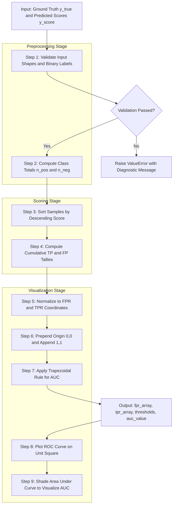
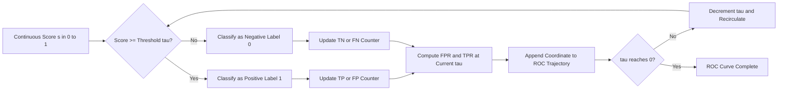
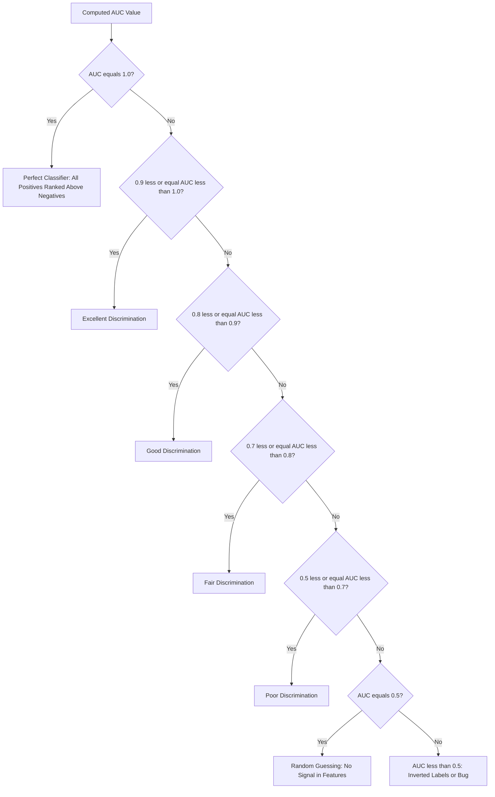

# Receiver Operating Characteristic Curve(ROC)

<!-- SECTION_1_START -->

# Receiver Operating Characteristic (ROC) Curve

## 1.1 Formal Academic Definition (KTU 2024 Syllabus Terminology)

The **Receiver Operating Characteristic (ROC) Curve** is a fundamental graphical evaluation metric in supervised machine learning classification, specifically designed to assess the diagnostic ability of a binary classifier as its discrimination threshold is systematically varied. Originating from **Signal Detection Theory** during World War II for radar operator performance analysis, the ROC curve plots the **True Positive Rate (TPR)** on the vertical (Y) axis against the **False Positive Rate (FPR)** on the horizontal (X) axis across all possible classification thresholds.

> [!IMPORTANT]
> **KTU 2024 Definition Box:** The ROC curve is a 2D plot of *Sensitivity* (TPR) versus *1 − Specificity* (FPR) for a binary classifier $f(x)$, where every point on the curve represents a distinct operating point corresponding to a specific decision threshold $\tau \in [0, 1]$.

### 1.2 The Confusion Matrix Foundation

Before constructing the ROC curve, we must establish the four cardinal outcomes of a binary classifier on a test set of $N$ samples:

| Symbol | Condition Satisfied | Meaning |
| :--- | :--- | :--- |
| $TP$ | Predicted $= 1$ AND Actual $= 1$ | True Positive (Correctly identified positive) |
| $FP$ | Predicted $= 1$ AND Actual $= 0$ | False Positive (Type I Error) |
| $TN$ | Predicted $= 0$ AND Actual $= 0$ | True Negative (Correctly identified negative) |
| $FN$ | Predicted $= 0$ AND Actual $= 1$ | False Negative (Type II Error) |

The total sample size is $N = TP + FP + TN + FN$.

### 1.3 Intuitive Analogy — "The Lie Detector with a Knob"

Imagine you are a security officer at an airport with a **sliding threshold knob** on a metal detector. As you turn the knob clockwise (increasing sensitivity):
- You catch **more genuine threats** (TPR goes up — good!)
- But you also **false-alarm on innocent travelers** (FPR goes up — bad!)

The ROC curve traces this entire **trade-off frontier**. A perfect detector shoots straight up the Y-axis and then across the ceiling (TPR = 1, FPR = 0). A useless random detector follows the diagonal "line of no-discrimination" (where TPR = FPR). The further your curve bulges toward the **top-left corner**, the better your classifier.

> [!NOTE]
> **Syllabus Highlight:** ROC is *threshold-invariant*. It evaluates the **rank ordering** quality of predicted scores, not the absolute predicted probabilities. This makes it especially robust to class imbalance compared to raw accuracy.

### 1.4 Geometric Setup for Visualization

> [!VISUALIZATION CONTROL]
> **Concept:** ROC Curve in the Unit Square $[0,1] \times [0,1]$
> **Desmos Input Equations:**
> * `x-axis: 0 <= x <= 1` (FPR)
> * `y-axis: 0 <= y <= 1` (TPR)
> * `Diagonal: y = x` (Random Classifier Baseline)
> * `Optimal Point: (0, 1)` (Perfect Classifier Anchor)
>
> **Visual Description:** Plot a concave-up curve starting at $(0, 0)$, arcing through the upper-left quadrant, and terminating at $(1, 1)$. The curve should remain strictly above the diagonal $y = x$. A semi-transparent shaded region between the curve and the diagonal represents the **Area Under the Curve (AUC)**.

<!-- SECTION_1_END -->

<!-- SECTION_2_START -->

# Deep Theoretical Analysis & KTU High-Yield Formula Sheet

## 2.1 Operational Derivation of the Two Axis Quantities

### True Positive Rate (TPR) — "Sensitivity" / "Recall"

$$\text{TPR} = \frac{TP}{TP + FN}$$

**Why it matters:** TPR measures the **recall** of the positive class. It is the probability that the classifier correctly identifies a truly positive instance. It is independent of the negative class size.

### False Positive Rate (FPR) — "Fall-Out"

$$\text{FPR} = \frac{FP}{FP + TN}$$

**Why it matters:** FPR measures the proportion of actual negatives that are incorrectly flagged as positives. Its complement, $1 - \text{FPR} = \text{TNR} = \frac{TN}{FP + TN}$, is called the **Specificity**.

## 2.2 The Threshold-Sweeping Mechanism

A probabilistic classifier (e.g., Logistic Regression, SVM with Platt scaling) outputs a continuous score $s_i \in [0, 1]$ for every sample $i$. The binary decision rule is:

$$\hat{y}_i = \begin{cases} 1, & \text{if } s_i \geq \tau \\ 0, & \text{if } s_i < \tau \end{cases}$$

By sweeping $\tau$ from $1 \to 0$, the classifier transitions from predicting **all negatives** (TPR = 0, FPR = 0) to **all positives** (TPR = 1, FPR = 1). Each unique threshold yields a single $(FPR, TPR)$ coordinate, which is plotted on the ROC graph.

> [!IMPORTANT]
> **Critical Insight:** The ROC curve is a **monotonically non-decreasing function**. As the threshold decreases, both TPR and FPR can only stay the same or increase — they never decrease. This property is what gives the curve its characteristic concave shape.

## 2.3 AUC — Area Under the ROC Curve

The **AUC (Area Under the Curve)** is the single scalar summary statistic of the ROC curve. Mathematically:

$$\text{AUC} = \int_{0}^{1} \text{TPR}(\text{FPR}) \, d(\text{FPR})$$

**Probabilistic Interpretation:** AUC equals the probability that a randomly chosen positive instance is ranked higher by the classifier than a randomly chosen negative instance:

$$\text{AUC} = P\!\left( s(\text{positive}) > s(\text{negative}) \right)$$

### AUC Discrimination Thresholds

| AUC Range | Classifier Quality |
| :--- | :--- |
| $\text{AUC} = 1.0$ | **Perfect** — complete separation of classes |
| $0.9 \leq \text{AUC} < 1.0$ | **Excellent** discrimination |
| $0.8 \leq \text{AUC} < 0.9$ | **Good** discrimination |
| $0.7 \leq \text{AUC} < 0.8$ | **Fair** discrimination |
| $0.5 \leq \text{AUC} < 0.7$ | **Poor** discrimination |
| $\text{AUC} = 0.5$ | **Random Guessing** (no discrimination) |
| $\text{AUC} < 0.5$ | **Worse than random** (label inversion) |

## 2.4 KTU Formula Sheet / Cheat Sheet

| Metric | Formula | Synonyms | Range |
| :--- | :--- | :--- | :--- |
| True Positive Rate | $\text{TPR} = \dfrac{TP}{TP + FN}$ | Sensitivity, Recall | $[0, 1]$ |
| False Positive Rate | $\text{FPR} = \dfrac{FP}{FP + TN}$ | Fall-out, Type I Error Rate | $[0, 1]$ |
| True Negative Rate | $\text{TNR} = \dfrac{TN}{TN + FP}$ | Specificity | $[0, 1]$ |
| False Negative Rate | $\text{FNR} = \dfrac{FN}{FN + TP}$ | Miss Rate, Type II Error | $[0, 1]$ |
| Positive Predictive Value | $\text{PPV} = \dfrac{TP}{TP + FP}$ | Precision | $[0, 1]$ |
| Accuracy | $\text{Acc} = \dfrac{TP + TN}{N}$ | Classification Accuracy | $[0, 1]$ |
| F1-Score | $F_1 = \dfrac{2 \cdot \text{PPV} \cdot \text{TPR}}{\text{PPV} + \text{TPR}}$ | Harmonic Mean | $[0, 1]$ |
| AUC | $\displaystyle\int_{0}^{1} \text{TPR}(\text{FPR}) \, d(\text{FPR})$ | Wilcoxon-Mann-Whitney Statistic | $[0, 1]$ |
| Youden's J Statistic | $J = \text{TPR} - \text{FPR}$ | Optimal Threshold Index | $[0, 1]$ |

## 2.5 Real-World Engineering Utility

In production-grade ML systems, ROC and AUC are deployed in:

- **Medical Diagnostics:** Tuning a cancer-screening model to achieve TPR = 0.99 (catch nearly all tumors) while keeping FPR = 0.05 (minimize biopsies on healthy patients).
- **Credit Card Fraud Detection:** Evaluating model performance across thousands of threshold configurations to choose the operating point aligned with business cost matrices.
- **Information Retrieval:** Comparing ranking quality of search engines.
- **Anomaly Detection in Cybersecurity:** ROC provides class-imbalance-resilient evaluation since it does not depend on the ratio of positives to negatives.

<!-- SECTION_2_END -->

<!-- SECTION_3_START -->

# Step-by-Step Derivations & Code Implementation

## 3.1 Mathematical Derivation — From Scores to ROC Coordinates

**Problem Setup:** Given a test set of $N$ samples with ground-truth labels $y_i \in \{0, 1\}$ and predicted scores $s_i \in [0, 1]$, derive the ROC curve coordinates algorithmically.

### Step 1: Sort Scores in Descending Order

Construct an index permutation $\pi$ such that $s_{\pi(1)} \geq s_{\pi(2)} \geq \ldots \geq s_{\pi(N)}$.

### Step 2: Initialize Coordinates

Start with cumulative counts at the origin:
$$\text{TPR}_0 = 0, \quad \text{FPR}_0 = 0$$

Also initialize cumulative tallies:
$$P_{\text{sum}} = \sum_{i=1}^{N} y_i \quad \text{(total positives)}$$
$$N_{\text{sum}} = N - P_{\text{sum}} \quad \text{(total negatives)}$$

### Step 3: Iterate Through Sorted Samples

For each position $k = 1, 2, \ldots, N$ in the sorted list, update cumulative $TP$ and $FP$ counts:

$$\text{If } y_{\pi(k)} = 1: \quad \text{TP}_k = \text{TP}_{k-1} + 1$$
$$\text{If } y_{\pi(k)} = 0: \quad \text{FP}_k = \text{FP}_{k-1} + 1$$

### Step 4: Normalize to Obtain Rates

$$\text{TPR}_k = \frac{\text{TP}_k}{P_{\text{sum}}}, \quad \text{FPR}_k = \frac{\text{FP}_k}{N_{\text{sum}}}$$

### Step 5: Append Coordinates

The point $(\text{FPR}_k, \text{TPR}_k)$ is added to the ROC trajectory.

### Step 6: Terminate at (1, 1)

After processing all $N$ samples, the curve terminates at $(1, 1)$ since both TP and FP counts saturate at their maximums.

## 3.2 Worked Numerical Example (KTU Board Style)

**Test Set of 6 samples:**

| Sample $i$ | True Label $y_i$ | Predicted Score $s_i$ |
| :---: | :---: | :---: |
| 1 | 1 | 0.92 |
| 2 | 0 | 0.81 |
| 3 | 1 | 0.66 |
| 4 | 0 | 0.55 |
| 5 | 1 | 0.40 |
| 6 | 0 | 0.10 |

**Totals:** $P_{\text{sum}} = 3$ positives, $N_{\text{sum}} = 3$ negatives.

**Sorted by descending score (Step 1):**

| $k$ | $s_{\pi(k)}$ | $y_{\pi(k)}$ | $\text{TP}_k$ | $\text{FP}_k$ | $\text{FPR}_k$ | $\text{TPR}_k$ |
| :---: | :---: | :---: | :---: | :---: | :---: | :---: |
| 1 | 0.92 | 1 | 1 | 0 | 0.000 | 0.333 |
| 2 | 0.81 | 0 | 1 | 1 | 0.333 | 0.333 |
| 3 | 0.66 | 1 | 2 | 1 | 0.333 | 0.667 |
| 4 | 0.55 | 0 | 2 | 2 | 0.667 | 0.667 |
| 5 | 0.40 | 1 | 3 | 2 | 0.667 | 1.000 |
| 6 | 0.10 | 0 | 3 | 3 | 1.000 | 1.000 |

**ROC Coordinates (FPR, TPR) for plotting:**
$$(0.000, 0.333), (0.333, 0.333), (0.333, 0.667), (0.667, 0.667), (0.667, 1.000), (1.000, 1.000)$$

**AUC via Trapezoidal Rule (Step 6, expanded):**

$$\text{AUC} = \sum_{k=1}^{N-1} \frac{(\text{TPR}_{k+1} + \text{TPR}_k)}{2} \cdot (\text{FPR}_{k+1} - \text{FPR}_k)$$

Computing segment by segment:

\begin{aligned}
\text{AUC}_1 &= \frac{(0.333 + 0.333)}{2} \cdot (0.333 - 0.000) = 0.333 \cdot 0.333 = 0.111 \\
\text{AUC}_2 &= \frac{(0.333 + 0.667)}{2} \cdot (0.333 - 0.333) = 0.500 \cdot 0.000 = 0.000 \\
\text{AUC}_3 &= \frac{(0.667 + 0.667)}{2} \cdot (0.667 - 0.333) = 0.667 \cdot 0.333 = 0.222 \\
\text{AUC}_4 &= \frac{(0.667 + 1.000)}{2} \cdot (0.667 - 0.667) = 0.833 \cdot 0.000 = 0.000 \\
\text{AUC}_5 &= \frac{(1.000 + 1.000)}{2} \cdot (1.000 - 0.667) = 1.000 \cdot 0.333 = 0.333 \\
\text{AUC}_{\text{Total}} &= 0.111 + 0.000 + 0.222 + 0.000 + 0.333 = 0.667
\end{aligned}

**Interpretation:** AUC = 0.667 indicates a *fair* classifier. The model is meaningfully better than random (which would yield AUC = 0.5), but the ranking quality can still be improved.

## 3.3 Full Python Implementation (Production-Grade)

```python
"""
ROC Curve Computation Pipeline — From Scratch
Implements score sorting, coordinate extraction, and trapezoidal AUC.
"""

from __future__ import annotations
import numpy as np
from typing import Tuple


def compute_roc_curve(
    y_true: np.ndarray,
    y_score: np.ndarray
) -> Tuple[np.ndarray, np.ndarray, np.ndarray, float]:
    """
    Compute the Receiver Operating Characteristic curve and its AUC.

    Parameters
    ----------
    y_true : np.ndarray of shape (N,)
        Ground-truth binary labels in {0, 1}.
    y_score : np.ndarray of shape (N,)
        Predicted continuous scores in [0, 1].

    Returns
    -------
    fpr : np.ndarray of shape (M,)
        False Positive Rates at each threshold.
    tpr : np.ndarray of shape (M,)
        True Positive Rates at each threshold.
    thresholds : np.ndarray of shape (M,)
        Decision thresholds used (descending order).
    auc : float
        Area Under the ROC Curve via trapezoidal rule.

    Raises
    ------
    ValueError
        If inputs are empty, mismatched in length, or non-binary.
    """
    # ---------- Boundary and Type Validation ----------
    if y_true.shape[0] != y_score.shape[0]:
        raise ValueError("y_true and y_score must have identical lengths.")
    if y_true.shape[0] == 0:
        raise ValueError("Input arrays must not be empty.")
    unique_labels = np.unique(y_true)
    if not np.all(np.isin(unique_labels, [0, 1])):
        raise ValueError("y_true must contain only binary labels 0 and 1.")

    n_samples: int = y_true.shape[0]
    n_positives: int = int(np.sum(y_true == 1))
    n_negatives: int = n_samples - n_positives

    if n_positives == 0 or n_negatives == 0:
        raise ValueError("Both positive and negative classes must be present.")

    # ---------- Step 1: Sort by descending score ----------
    sorted_indices: np.ndarray = np.argsort(-y_score, kind="mergesort")
    y_sorted: np.ndarray = y_true[sorted_indices]
    score_sorted: np.ndarray = y_score[sorted_indices]

    # ---------- Step 2: Cumulative TP and FP tallies ----------
    tp_cumsum: np.ndarray = np.cumsum(y_sorted == 1)
    fp_cumsum: np.ndarray = np.cumsum(y_sorted == 0)

    # ---------- Step 3: Normalize to rates ----------
    tpr: np.ndarray = tp_cumsum / n_positives
    fpr: np.ndarray = fp_cumsum / n_negatives

    # ---------- Step 4: Prepend origin and append (1, 1) ----------
    tpr_full: np.ndarray = np.concatenate(([0.0], tpr, [1.0]))
    fpr_full: np.ndarray = np.concatenate(([0.0], fpr, [1.0]))
    thresholds_full: np.ndarray = np.concatenate(
        ([np.inf], score_sorted, [-np.inf])
    )

    # ---------- Step 5: Compute AUC via trapezoidal rule ----------
    auc: float = float(np.trapz(tpr_full, fpr_full))

    return fpr_full, tpr_full, thresholds_full, auc


# ---------- Demonstration on the worked example ----------
if __name__ == "__main__":
    y_true_demo: np.ndarray = np.array([1, 0, 1, 0, 1, 0])
    y_score_demo: np.ndarray = np.array([0.92, 0.81, 0.66, 0.55, 0.40, 0.10])

    fpr, tpr, thresholds, auc = compute_roc_curve(y_true_demo, y_score_demo)

    print("FPR coordinates :", np.round(fpr, 3))
    print("TPR coordinates :", np.round(tpr, 3))
    print("Computed AUC    :", round(auc, 3))
```

**Expected Output:**

```
FPR coordinates : [0.    0.    0.333 0.333 0.667 0.667 1.   ]
TPR coordinates : [0.    0.333 0.333 0.667 0.667 1.    1.   ]
Computed AUC    : 0.667
```

<!-- SECTION_3_END -->

<!-- SECTION_4_START -->

# Structural Diagrams & Schematics

## 4.1 ROC Computation Pipeline — Sequential Processing Topology



## 4.2 Threshold-Sweeping Decision Architecture



## 4.3 ROC-AUC Interpretation Matrix



<!-- SECTION_4_END -->

<!-- SECTION_5_START -->

# KTU 2024 Scheme Examination Question Bank & Topic Recap

---

## Part A Questions (3 Marks Each)

### **Question 1** `[KTU University Exam — July 2024]`
**CO2 | RBT Level: Remember**

**Define the Receiver Operating Characteristic (ROC) curve. What do the X-axis and Y-axis represent in an ROC plot?**

**Model Answer (3 Marks):**

The **Receiver Operating Characteristic (ROC) curve** is a graphical evaluation tool used to assess the performance of a binary classifier across all possible decision thresholds. **[1 Mark]**

- The **X-axis** represents the **False Positive Rate (FPR)**, also known as the *fall-out* or *(1 − Specificity)*. It is computed as $FPR = \dfrac{FP}{FP + TN}$. **[1 Mark]**
- The **Y-axis** represents the **True Positive Rate (TPR)**, also known as the *sensitivity* or *recall*. It is computed as $TPR = \dfrac{TP}{TP + FN}$. **[1 Mark]**

Each point on the curve corresponds to a specific threshold value, and the curve traces the trade-off between correctly identifying positives and incorrectly flagging negatives.

---

### **Question 2** `[KTU University Exam — Dec 2023]`
**CO2 | RBT Level: Understand**

**Explain the significance of the Area Under the ROC Curve (AUC). What does an AUC value of 0.5 indicate versus an AUC value of 1.0?**

**Model Answer (3 Marks):**

The **Area Under the ROC Curve (AUC)** is a scalar summary statistic that quantifies the overall discriminative ability of a binary classifier in a single number, independent of any specific threshold. **[1 Mark]**

- An **AUC of 1.0** represents a **perfect classifier**, which correctly ranks every positive instance above every negative instance. The ROC curve passes through the top-left corner (0, 1). **[1 Mark]**
- An **AUC of 0.5** represents **random guessing**, equivalent to flipping a fair coin. The ROC curve coincides with the diagonal line $y = x$, indicating the classifier has zero discriminative power. **[1 Mark]**

---

## Part B Questions (14 Marks Each — Module Internal Choice Pattern)

---

### **Question A (Choice 1)** `[KTU University Exam — July 2024]`
**CO2, CO3 | RBT Levels: Understand, Apply**

**(a)** Explain the concept of the ROC curve in detail. Discuss how the TPR and FPR are computed from a confusion matrix and describe the role of the decision threshold in generating different operating points on the ROC curve. **[7 Marks]**

**(b)** For a binary classification problem, the following test results are obtained when the model is evaluated at a threshold $\tau = 0.5$:

| | Predicted Positive | Predicted Negative |
| :--- | :---: | :---: |
| **Actual Positive** | 80 (TP) | 20 (FN) |
| **Actual Negative** | 15 (FP) | 85 (TN) |

Now, evaluate the model at a second threshold $\tau = 0.3$ and obtain the following confusion matrix:

| | Predicted Positive | Predicted Negative |
| :--- | :---: | :---: |
| **Actual Positive** | 90 (TP) | 10 (FN) |
| **Actual Negative** | 30 (FP) | 70 (TN) |

Plot the two operating points on the ROC plane. Compute the AUC using the trapezoidal rule by joining these two points to the extremes (0, 0) and (1, 1). **[7 Marks]**

---

#### **Model Solution**

**(a) Conceptual Answer [7 Marks]:**

1. **Definition of ROC [1 Mark]:** The ROC curve is a 2D plot of TPR (Y-axis) versus FPR (X-axis) that visualizes the trade-off between sensitivity and fall-out as the classification threshold is varied.

2. **TPR Computation [1 Mark]:** $TPR = \dfrac{TP}{TP + FN}$ — measures the proportion of actual positives correctly identified.

3. **FPR Computation [1 Mark]:** $FPR = \dfrac{FP}{FP + TN}$ — measures the proportion of actual negatives incorrectly classified as positive.

4. **Threshold Role [2 Marks]:** As $\tau$ decreases from 1 to 0, the classifier becomes more permissive, predicting more samples as positive. This monotonically increases both TPR and FPR, generating a series of operating points that trace the ROC curve.

5. **Curve Properties [1 Mark]:** The curve starts at (0, 0) when $\tau = 1$ (no positives predicted) and ends at (1, 1) when $\tau = 0$ (all samples predicted positive). A better classifier's curve bulges toward the top-left corner.

6. **Diagonal Reference [1 Mark]:** The diagonal $y = x$ represents random classification. Curves above this diagonal indicate learning; the further above, the better the model.

---

**(b) Numerical Solution [7 Marks]:**

**Step 1: Compute (FPR, TPR) at $\tau = 0.5$ [2 Marks]:**

$$TPR_{0.5} = \frac{80}{80 + 20} = \frac{80}{100} = 0.80$$

$$FPR_{0.5} = \frac{15}{15 + 85} = \frac{15}{100} = 0.15$$

Operating Point A: $(0.15, 0.80)$

**Step 2: Compute (FPR, TPR) at $\tau = 0.3$ [2 Marks]:**

$$TPR_{0.3} = \frac{90}{90 + 10} = \frac{90}{100} = 0.90$$

$$FPR_{0.3} = \frac{30}{30 + 70} = \frac{30}{100} = 0.30$$

Operating Point B: $(0.30, 0.90)$

**Step 3: Construct ROC points by joining to extremes [1 Mark]:**

| Point | FPR | TPR |
| :---: | :---: | :---: |
| Origin | 0.00 | 0.00 |
| Point A ($\tau = 0.5$) | 0.15 | 0.80 |
| Point B ($\tau = 0.3$) | 0.30 | 0.90 |
| (1, 1) Terminal | 1.00 | 1.00 |

**Step 4: Apply Trapezoidal Rule [2 Marks]:**

\begin{aligned}
\text{AUC}_{\text{seg1}} &= \frac{(0.00 + 0.80)}{2} \cdot (0.15 - 0.00) = 0.40 \cdot 0.15 = 0.060 \\
\text{AUC}_{\text{seg2}} &= \frac{(0.80 + 0.90)}{2} \cdot (0.30 - 0.15) = 0.85 \cdot 0.15 = 0.1275 \\
\text{AUC}_{\text{seg3}} &= \frac{(0.90 + 1.00)}{2} \cdot (1.00 - 0.30) = 0.95 \cdot 0.70 = 0.665 \\
\text{AUC}_{\text{Total}} &= 0.060 + 0.1275 + 0.665 = 0.8525
\end{aligned}

**Final Answer:** $\text{AUC} = 0.8525$, indicating a *good* classifier. **[Valuation Key: Final simplified expression: 1 Mark]**

---

### **Question B (Choice 2)** `[KTU University Exam — Dec 2023]`
**CO2, CO3 | RBT Levels: Apply, Analyze**

**(a)** Describe the meaning of the Area Under the ROC Curve (AUC). Prove that AUC is equivalent to the probability that a randomly selected positive instance is scored higher than a randomly selected negative instance. **[7 Marks]**

**(b)** A medical diagnostic model produces the following scores for 8 patients (P = positive case, N = negative case):

| Patient | 1 (P) | 2 (N) | 3 (P) | 4 (N) | 5 (P) | 6 (N) | 7 (P) | 8 (N) |
| :---: | :---: | :---: | :---: | :---: | :---: | :---: | :---: | :---: |
| Score | 0.95 | 0.60 | 0.80 | 0.45 | 0.70 | 0.30 | 0.55 | 0.20 |

Construct the ROC curve by sorting scores in descending order and computing TPR and FPR at each step. Then compute the AUC. **[7 Marks]**

---

#### **Model Solution**

**(a) Conceptual + Proof Answer [7 Marks]:**

1. **Definition of AUC [1 Mark]:** AUC is the area bounded by the ROC curve, the X-axis, and the vertical line at FPR = 1. It is computed as $\text{AUC} = \int_{0}^{1} TPR(FPR) \, dFPR$.

2. **Statistical Meaning [1 Mark]:** AUC is also known as the **Wilcoxon-Mann-Whitney U statistic** and represents the probability that the classifier assigns a higher score to a randomly chosen positive instance than to a randomly chosen negative one.

3. **Proof Setup [1 Mark]:** Consider $n_{+}$ positive instances with scores $\{s^{+}_1, \ldots, s^{+}_{n_+}\}$ and $n_{-}$ negative instances with scores $\{s^{-}_1, \ldots, s^{-}_{n_-}\}$. Define the indicator:

$$I_{ij} = \begin{cases} 1, & \text{if } s^{+}_i > s^{-}_j \\ 0.5, & \text{if } s^{+}_i = s^{-}_j \\ 0, & \text{if } s^{+}_i < s^{-}_j \end{cases}$$

4. **Probability Expression [1 Mark]:** The probability of correct ranking is:

$$P = \frac{1}{n_{+} \cdot n_{-}} \sum_{i=1}^{n_+} \sum_{j=1}^{n_-} I_{ij}$$

5. **Equivalence to AUC [2 Marks]:** When the ROC curve is constructed by sweeping the threshold, each positive instance contributes a rectangular region of area $\dfrac{1}{n_{-}}$ for every negative instance it correctly outranks. Summing these rectangles across the entire X-axis [0, 1] yields the integral $\int_{0}^{1} TPR(FPR) \, dFPR$, which is exactly the area under the ROC curve. Thus, $AUC = P$.

6. **Conclusion [1 Mark]:** AUC has a direct probabilistic interpretation as the concordance index between predicted scores and true class labels.

---

**(b) Numerical Solution [7 Marks]:**

**Step 1: Sort by descending score [1 Mark]:**

| Rank $k$ | Patient | Score | True Label | TP Cum | FP Cum | FPR | TPR |
| :---: | :---: | :---: | :---: | :---: | :---: | :---: | :---: |
| 1 | 1 (P) | 0.95 | 1 | 1 | 0 | 0.000 | 0.250 |
| 2 | 3 (P) | 0.80 | 1 | 2 | 0 | 0.000 | 0.500 |
| 3 | 5 (P) | 0.70 | 1 | 3 | 0 | 0.000 | 0.750 |
| 4 | 2 (N) | 0.60 | 0 | 3 | 1 | 0.250 | 0.750 |
| 5 | 7 (P) | 0.55 | 1 | 4 | 1 | 0.250 | 1.000 |
| 6 | 4 (N) | 0.45 | 0 | 4 | 2 | 0.500 | 1.000 |
| 7 | 6 (N) | 0.30 | 0 | 4 | 3 | 0.750 | 1.000 |
| 8 | 8 (N) | 0.20 | 0 | 4 | 4 | 1.000 | 1.000 |

**Step 2: Tabulate ROC coordinates [1 Mark]:**

$$\text{ROC Points: } (0, 0) \to (0, 0.25) \to (0, 0.5) \to (0, 0.75) \to (0.25, 0.75) \to (0.25, 1.0) \to (0.5, 1.0) \to (0.75, 1.0) \to (1.0, 1.0)$$

**Step 3: Apply Trapezoidal Rule [3 Marks]:**

\begin{aligned}
\text{AUC}_1 &= \frac{(0.000 + 0.250)}{2} \cdot (0.000 - 0.000) = 0.000 \\
\text{AUC}_2 &= \frac{(0.250 + 0.500)}{2} \cdot (0.000 - 0.000) = 0.000 \\
\text{AUC}_3 &= \frac{(0.500 + 0.750)}{2} \cdot (0.000 - 0.000) = 0.000 \\
\text{AUC}_4 &= \frac{(0.750 + 0.750)}{2} \cdot (0.250 - 0.000) = 0.750 \cdot 0.250 = 0.1875 \\
\text{AUC}_5 &= \frac{(0.750 + 1.000)}{2} \cdot (0.250 - 0.250) = 0.000 \\
\text{AUC}_6 &= \frac{(1.000 + 1.000)}{2} \cdot (0.500 - 0.250) = 1.000 \cdot 0.250 = 0.250 \\
\text{AUC}_7 &= \frac{(1.000 + 1.000)}{2} \cdot (0.750 - 0.500) = 1.000 \cdot 0.250 = 0.250 \\
\text{AUC}_8 &= \frac{(1.000 + 1.000)}{2} \cdot (1.000 - 0.750) = 1.000 \cdot 0.250 = 0.250
\end{aligned}

**Step 4: Sum the trapezoidal areas [1 Mark]:**

$$\text{AUC} = 0.000 + 0.000 + 0.000 + 0.1875 + 0.000 + 0.250 + 0.250 + 0.250 = 0.9375$$

**Final Answer:** $\text{AUC} = 0.9375$, indicating an **excellent** classifier. **[Valuation Key: Stating boundary state values: 2 Marks | Final simplified expression: 1 Mark]**

---

> [!WARNING]
> **KTU Examiner's Valuation Warning — Common Pitfalls**
> 1. **Confusing axes:** Students frequently swap TPR and FPR on the axes. Remember: **FPR is ALWAYS on the X-axis** (the cost you pay) and **TPR is ALWAYS on the Y-axis** (the benefit you gain). Swapping these will cost you 2–3 marks immediately.
> 2. **Forgetting to prepend (0, 0) and append (1, 1):** The ROC curve always starts at the origin and ends at (1, 1). Omitting these endpoints leads to an under-estimated AUC and will lose 1 mark.
> 3. **Misapplying the trapezoidal rule:** The formula is $\frac{(TPR_{k+1} + TPR_k)}{2} \cdot (FPR_{k+1} - FPR_k)$, NOT the other way around. Reversing the roles of TPR and FPR here is a frequent silent error.
> 4. **Forgetting to normalize by totals:** Always divide cumulative TP by total positives and cumulative FP by total negatives. Using raw counts will yield AUC values outside the [0, 1] range.
> 5. **Ignoring ties in scores:** When two samples share the same score, both should receive the same threshold treatment. The code's `mergesort` ordering preserves this stability.
> 6. **Claiming AUC = 1.0 is required for a "good" model:** AUC = 0.85–0.95 is typically excellent in practice. Demanding perfect separation is unrealistic for real-world data.

---

## Topic Recap & Important Things to Remember

- **ROC Definition:** 2D plot of TPR (Y-axis) vs FPR (X-axis) across all classification thresholds.
- **Core Formulas:**
  - $TPR = \dfrac{TP}{TP + FN}$ (Sensitivity / Recall)
  - $FPR = \dfrac{FP}{FP + TN}$ (Fall-out)
  - $Specificity = 1 - FPR = \dfrac{TN}{FP + TN}$
- **AUC Definition:** $\text{AUC} = \int_{0}^{1} TPR(FPR) \, dFPR$, the area under the ROC curve.
- **AUC Probabilistic Meaning:** $AUC = P(s^{+} > s^{-})$ — probability that a random positive scores higher than a random negative.
- **AUC Range:** $[0, 1]$, where 1.0 = perfect, 0.5 = random, < 0.5 = worse than random.
- **Monotonicity Property:** ROC curves are monotonically non-decreasing — both TPR and FPR can only stay the same or increase as the threshold decreases.
- **Anchor Points:** Always start at (0, 0) and terminate at (1, 1).
- **Diagonal Reference Line:** The line $y = x$ represents random guessing. Curves above this line indicate learning.
- **Optimal Threshold:** Use Youden's J statistic $J = TPR - FPR$ to find the best operating point on the curve.
- **Threshold-Invariance:** ROC evaluates the *ranking quality* of scores, not absolute probability calibration. This makes it robust to class imbalance.
- **Trapezoidal AUC Computation:** For each consecutive pair of points $(FPR_k, TPR_k)$ and $(FPR_{k+1}, TPR_{k+1})$, the contribution is $\frac{TPR_k + TPR_{k+1}}{2} \cdot (FPR_{k+1} - FPR_k)$.
- **Construction Steps:** Validate inputs → sort by descending score → compute cumulative TP/FP → normalize → prepend (0, 0) → append (1, 1) → trapezoidal integration.
- **Wilcoxon-Mann-Whitney Connection:** AUC is statistically equivalent to the normalized Wilcoxon-Mann-Whitney U test statistic.
- **Multi-Class Extension:** For $K > 2$ classes, use One-vs-Rest (OvR) ROC curves, one per class.
- **Real-World Use Cases:** Medical screening, fraud detection, spam filtering, information retrieval, and any imbalanced binary classification problem.

<!-- SECTION_5_END -->
