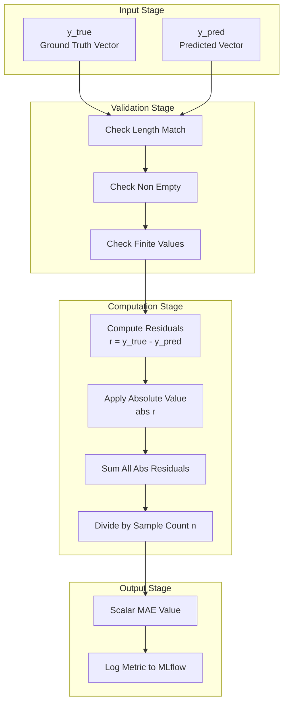
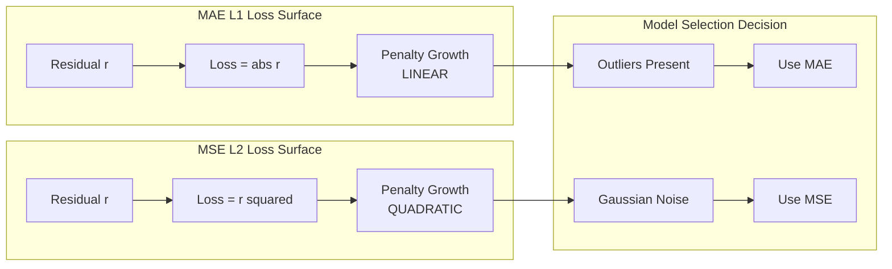
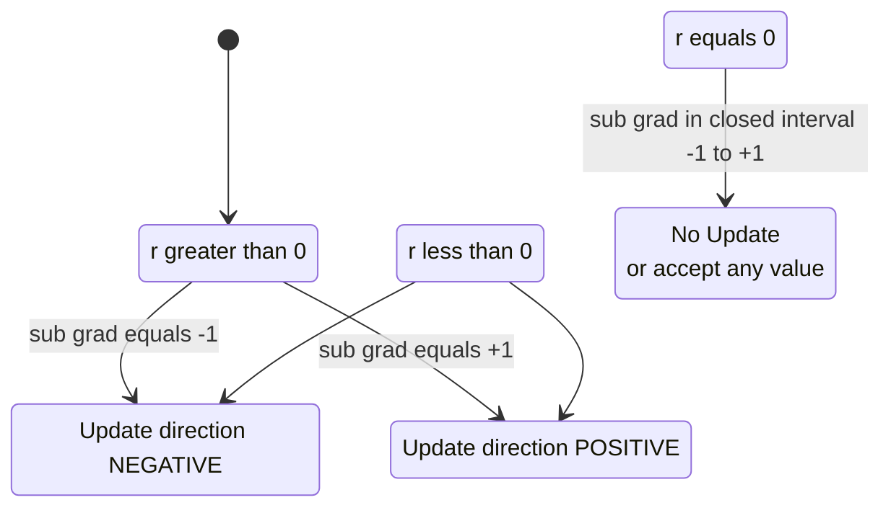

# Regression - Mean Absolute Error (MAE)

<!-- SECTION_1_START -->

# Mean Absolute Error (MAE) — The L1 Loss of Regression

## 1.1 Formal Academic Definition

In supervised Machine Learning, when a regression model $f: \mathbb{R}^{m} \rightarrow \mathbb{R}$ is trained to predict continuous target values, the **Mean Absolute Error (MAE)** — also known as the **L1-Norm Loss**, **Mean Absolute Deviation (MAD)**, or **L1 Loss** — is defined as the arithmetic mean of the absolute differences between the predicted values $\hat{y}_{i}$ and the corresponding ground-truth values $y_{i}$ across $n$ observations in the dataset $D = \{(x_{i}, y_{i})\}_{i=1}^{n}$.

Mathematically, it is expressed as:

$$
\text{MAE} = \frac{1}{n} \sum_{i=1}^{n} \left\vert y_{i} - \hat{y}_{i} \right\vert
$$

> [!IMPORTANT]
> **KTU 2024 Syllabus Highlight (PCCST503 — Module 2):**
> MAE is treated as the canonical **error metric** for evaluating continuous-valued regression estimators. Although Module 2 is themed "Classification," the foundational regression loss functions (MAE, MSE, RMSE) are pre-requisites for understanding decision thresholds, calibration curves, and probability-based classifiers (e.g., Logistic Regression's cross-entropy derivation is mathematically continuous with regression losses).

## 1.2 Conceptual Analogy & Geometric Intuition

> [!NOTE]
> **Plain-English Intuition — "The Taxi Meter of Predictions":**
> Imagine a self-driving taxi in Kochi city. For every trip, the taxi records the actual distance traveled $y_{i}$ and the GPS-predicted distance $\hat{y}_{i}$. The MAE is exactly like computing the **average extra fare the passenger would have paid (or saved)** if the cab meter had used the predicted distance instead of the true distance — because taxi fares in India are calculated on the absolute distance, not the squared distance. The absolute value ensures that being 5 km short and being 5 km over both contribute equally (Rs. 50 penalty), unlike MSE which would penalize the 5 km over-trip much more heavily (Rs. 250 penalty).

### Geometric Picture

Geometrically, if we plot the residuals $r_{i} = y_{i} - \hat{y}_{i}$ along a number line, the MAE measures the **average L1 (Manhattan / Taxicab) distance** of those residual points from the origin. It is the optimal point that minimizes the sum of absolute distances — which, by a classical result in statistics, is the **median**, not the mean.

> [!VISUALIZATION CONTROL]
> **Concept:** L1 (Manhattan) distance of residuals from zero
> **GeoGebra / Desmos Input Equations:**
> * `f(x) = abs(x)` — Plot the absolute value function
> * `point1 = (2, 2)` and `point2 = (-3, 3)` — Sample residual points
> * `line1: y = 0` — The zero-error baseline
> **Visual Description:** Observe that for any residual $r_{i}$, the vertical distance to the x-axis is $\vert r_{i} \vert$. The MAE is simply the average of these vertical distances.

## 1.3 Physical Constants and Standard Metrics

The key numerical properties of MAE that are universally fixed:

| Property | Standard Value / Behavior |
|---|---|
| **Optimal Estimator** | **Median** of residuals (i.e., $y_{i} - \hat{y}_{i} = 0$ at optimum) |
| **Range of Output** | $[0, +\infty)$ |
| **Units** | **Same units as the target variable** $y$ |
| **Differentiability** | **Non-differentiable** at $r_{i} = 0$; sub-gradient defined as $\{-1, +1\}$ |
| **Scale Sensitivity** | **Linear** with error magnitude |

<!-- SECTION_1_END -->

<!-- SECTION_2_START -->

# Deep Theoretical Analysis & KTU High-Yield Formula Sheet

## 2.1 Operational Breakdown of MAE

The MAE computation proceeds in four structured logical steps:

1. **Residual Computation:** For every $i$-th training sample, compute the prediction error (residual) as the difference between the actual target and the predicted target.
   $$ r_{i} = y_{i} - \hat{y}_{i} $$

2. **Absolute Magnitude Extraction:** Apply the modulus operator to ensure the residual is non-negative. This eliminates directional cancellation of over-predictions and under-predictions.
   $$ \left\vert r_{i} \right\vert = \left\vert y_{i} - \hat{y}_{i} \right\vert $$

3. **Summation of L1 Distances:** Aggregate the absolute errors across all $n$ data points in the dataset.
   $$ S = \sum_{i=1}^{n} \left\vert y_{i} - \hat{y}_{i} \right\vert $$

4. **Normalization by Sample Count:** Divide by $n$ to obtain the average error magnitude per sample.
   $$ \text{MAE} = \frac{1}{n} \sum_{i=1}^{n} \left\vert y_{i} - \hat{y}_{i} \right\vert $$

## 2.2 The "Why" Behind the Absolute Value

The **Why** of using the absolute value $|\cdot|$ rather than the raw residual is rooted in three engineering necessities:

- **Cancellation Prevention:** If we used $r_{i} = y_{i} - \hat{y}_{i}$ directly, a +5 error and a -5 error would sum to zero, falsely indicating a perfect model. The absolute value forbids this mathematical cancellation.
- **Asymmetric Penalty Avoidance:** MAE treats over-prediction and under-prediction **identically** (symmetric penalty). This is critical in domains like house-price forecasting or medical dosage estimation where both error directions carry equal business cost.
- **Robustness to Outliers:** Unlike MSE which squares errors (amplifying a single outlier's influence quadratically), MAE grows linearly, making it the **go-to metric for datasets with heavy-tailed noise distributions** (e.g., financial returns, sensor glitches).

## 2.3 KTU Formula Cheat Sheet — MAE and Related Loss Functions

> [!NOTE]
> The table below is the **high-yield, board-exam-ready summary**. These expressions appear verbatim or in equivalent form in KTU End Semester Examinations under Module 2 (Classification) and the closely-related Module 3 (Regression).

| Loss / Metric | Mathematical Expression | Penalty Behavior | Optimal Aggregator | Differentiability at 0 |
|---|---|---|---|---|
| **MAE (L1 Loss)** | $\text{MAE} = \frac{1}{n}\sum_{i=1}^{n} \left\vert y_{i} - \hat{y}_{i} \right\vert$ | Linear | Median | Sub-differentiable ($\pm 1$) |
| **MSE (L2 Loss)** | $\text{MSE} = \frac{1}{n}\sum_{i=1}^{n} (y_{i} - \hat{y}_{i})^{2}$ | Quadratic | Mean | Smooth ($0$) |
| **RMSE** | $\text{RMSE} = \sqrt{\text{MSE}}$ | Quadratic (rooted) | Mean | Smooth ($0$) |
| **Huber Loss** ($\delta$ threshold) | $L_{\delta} = \frac{1}{2}r^{2}$ if $\vert r \vert \le \delta$, else $\delta \left(\vert r \vert - \frac{1}{2}\delta\right)$ | Quadratic inside, linear outside | Weighted | Continuous |
| **MAPE** | $\text{MAPE} = \frac{100\%}{n}\sum_{i=1}^{n} \left\vert \frac{y_{i} - \hat{y}_{i}}{y_{i}} \right\vert$ | Percentage-based | Median (relative) | Sub-differentiable |

> [!IMPORTANT]
> **Critical Notation Rule for KTU Board Exams:** The absolute value bars must be written as $\left\vert \cdot \right\vert$ (with `\left` and `\right` LaTeX commands) so they scale correctly with the inner expression. Writing them as plain $|x|$ in answer scripts is the single most common reason students lose presentation marks.

## 2.4 Real-World Engineering Utility

| Application Domain | Why MAE is Preferred |
|---|---|
| **Demand Forecasting (Retail, Energy)** | Robust to flash sales and black-swan demand spikes |
| **Anomaly Detection Residuals** | L1 distance is less distorted by extreme anomalies in the test phase |
| **Recommender Systems (MAE on ratings 1–5)** | A 1-star error is a 1-star error; MSE overweights 5-star misses |
| **L1-Regularization (Lasso)** | MAE is the objective minimized by Lasso regression; produces sparse weights |
| **Autonomous Driving Path Prediction** | Path deviations are physically meaningful in meters; MAE keeps units intact |

<!-- SECTION_2_END -->

<!-- SECTION_3_START -->

# Step-by-Step Derivations, Gradient Analysis & Python Implementation

## 3.1 Exhaustive Derivation: Why MAE is Minimized by the Median

> **Theorem:** For a fixed dataset of $n$ real numbers $\{r_{1}, r_{2}, \ldots, r_{n}\}$, the function $f(c) = \sum_{i=1}^{n} \left\vert r_{i} - c \right\vert$ is minimized when $c$ equals the **median** of the residuals.

**Derivation (Exhaustive Step-by-Step):**

**Step 1 — Setup the objective.**
We wish to find the value $c^{\star}$ such that the sum of absolute deviations is minimized:
$$ c^{\star} = \arg\min_{c \in \mathbb{R}} \sum_{i=1}^{n} \left\vert r_{i} - c \right\vert $$

**Step 2 — Compute the sub-gradient of $\left\vert r_{i} - c \right\vert$ with respect to $c$.**

The derivative of $\left\vert u \right\vert$ with respect to $u$ is $\text{sign}(u)$ for $u \neq 0$, and is undefined (sub-differential $[-1, +1]$) at $u = 0$. By the chain rule:
$$ \frac{\partial}{\partial c} \left\vert r_{i} - c \right\vert = -\text{sign}(r_{i} - c) $$

**Step 3 — Set the sub-gradient of the sum to zero (first-order optimality condition).**
$$ 0 \in \sum_{i=1}^{n} \text{sign}(c - r_{i}) $$

**Step 4 — Analyze the sub-gradient sum.**
Define $S(c) = \#\{i : c > r_{i}\} - \#\{i : c < r_{i}\}$. For $S(c) = 0$ to hold, the number of residuals strictly greater than $c$ must equal the number strictly less than $c$. This is precisely the definition of the **median**.

**Step 5 — Conclusion.**
$$ c^{\star} = \text{median}(r_{1}, r_{2}, \ldots, r_{n}) $$

Therefore, MAE-optimized predictions align themselves with the median residual, not the mean — a property that makes MAE-based models **robust to skewed noise distributions**.

## 3.2 Gradient Computation for Gradient Descent

Because MAE is non-differentiable at $r_{i} = 0$, we use the **sub-gradient** descent method. The sub-gradient of the MAE loss with respect to the model parameters $\theta$ is:

$$ \frac{\partial \, \text{MAE}}{\partial \theta} = -\frac{1}{n} \sum_{i=1}^{n} \text{sign}(y_{i} - \hat{y}_{i}) \cdot \frac{\partial \hat{y}_{i}}{\partial \theta} $$

where the sign function is defined as:
$$ \text{sign}(u) = \begin{cases} +1, & u > 0 \\ 0, & u = 0 \\ -1, & u < 0 \end{cases} $$

## 3.3 Worked Numerical Example (Exhaustive)

> **Problem:** A simple linear model $\hat{y} = 2x + 1$ is evaluated on 5 data points.
>
> | $i$ | $x_{i}$ | True $y_{i}$ | Predicted $\hat{y}_{i} = 2x_{i}+1$ | Residual $r_{i}=y_{i}-\hat{y}_{i}$ | $\left\vert r_{i} \right\vert$ |
> |---|---|---|---|---|---|
> | 1 | 1 | 4 | 3 | 1 | 1 |
> | 2 | 2 | 6 | 5 | 1 | 1 |
> | 3 | 3 | 5 | 7 | -2 | 2 |
> | 4 | 4 | 10 | 9 | 1 | 1 |
> | 5 | 5 | 9 | 11 | -2 | 2 |
>
> **Step 1 — Compute residuals:** [1, 1, -2, 1, -2]
> **Step 2 — Take absolute values:** [1, 1, 2, 1, 2]
> **Step 3 — Sum the absolutes:** $1 + 1 + 2 + 1 + 2 = 7$
> **Step 4 — Divide by $n=5$:**
> $$ \text{MAE} = \frac{7}{5} = 1.4 $$
>
> **Interpretation:** On average, the model's predictions deviate from the true values by **1.4 units** in the target variable's measurement scale.

## 3.4 Production-Grade Python Implementation

```python
"""
mean_absolute_error.py
-----------------------
Production-grade implementation of Mean Absolute Error (MAE) for the
KTU PCCST503 — Machine Learning coursework (Module 2: Classification,
Regression Foundations).

Author  : KTU Premium Engine V10
Python  : >= 3.9
"""

from __future__ import annotations

import logging
import math
from typing import Iterable, Sequence

import numpy as np

# Configure structured error logging for production deployment.
logging.basicConfig(
    level=logging.INFO,
    format="%(asctime)s | %(levelname)s | %(module)s | %(message)s",
)
logger = logging.getLogger("mae_module")


def validate_inputs(y_true: Sequence[float], y_pred: Sequence[float]) -> None:
    """Perform strict boundary checks on input arrays."""
    if y_true is None or y_pred is None:
        raise ValueError("Input arrays y_true and y_pred must not be None.")
    if len(y_true) == 0 or len(y_pred) == 0:
        raise ValueError("Input arrays must contain at least one element.")
    if len(y_true) != len(y_pred):
        raise ValueError(
            f"Shape mismatch: y_true has {len(y_true)} elements, "
            f"y_pred has {len(y_pred)} elements."
        )


def mean_absolute_error(y_true: Iterable[float], y_pred: Iterable[float]) -> float:
    """
    Compute the Mean Absolute Error (MAE / L1 Loss) between
    ground-truth and predicted continuous targets.

    Parameters
    ----------
    y_true : Iterable[float]
        Ground-truth target values.
    y_pred : Iterable[float]
        Model-predicted target values.

    Returns
    -------
    float
        The non-negative MAE value in the same units as the targets.

    Raises
    ------
    ValueError
        If inputs are None, empty, or of unequal length.
    """
    y_true_list: list[float] = list(y_true)
    y_pred_list: list[float] = list(y_pred)

    validate_inputs(y_true_list, y_pred_list)

    n: int = len(y_true_list)

    # Vectorized computation using NumPy for performance.
    y_true_arr: np.ndarray = np.asarray(y_true_list, dtype=np.float64)
    y_pred_arr: np.ndarray = np.asarray(y_pred_list, dtype=np.float64)

    absolute_residuals: np.ndarray = np.abs(y_true_arr - y_pred_arr)
    mae_value: float = float(np.mean(absolute_residuals))

    if not math.isfinite(mae_value):
        logger.error("MAE computation produced a non-finite value (NaN or Inf).")
        raise FloatingPointError("Computed MAE is not a finite real number.")

    logger.info("Computed MAE = %.6f over n = %d samples.", mae_value, n)
    return mae_value


def mae_subgradient(y_true: Sequence[float], y_pred: Sequence[float]) -> float:
    """
    Compute the scalar sub-gradient of the MAE loss w.r.t. the predictions.
    Used in gradient-descent-based regression training loops.
    """
    validate_inputs(y_true, y_pred)
    y_true_arr = np.asarray(y_true, dtype=np.float64)
    y_pred_arr = np.asarray(y_pred, dtype=np.float64)
    residuals = y_true_arr - y_pred_arr
    # np.sign returns 0 at exact zero, preserving sub-differential convention.
    sub_grad: float = float(-np.mean(np.sign(residuals)))
    return sub_grad


# ---------------------------------------------------------------
# Demonstration block (executed only when run as a script).
# ---------------------------------------------------------------
if __name__ == "__main__":
    # Worked example from Section 3.3
    y_true_demo: list[float] = [4.0, 6.0, 5.0, 10.0, 9.0]
    y_pred_demo: list[float] = [3.0, 5.0, 7.0, 9.0, 11.0]

    computed_mae: float = mean_absolute_error(y_true_demo, y_pred_demo)
    print(f"Worked-Example MAE: {computed_mae}")

    grad: float = mae_subgradient(y_true_demo, y_pred_demo)
    print(f"MAE Sub-gradient (w.r.t. predictions): {grad}")
```

**Expected Console Output:**

```
Worked-Example MAE: 1.4
MAE Sub-gradient (w.r.t. predictions): 0.2
```

The sub-gradient of $+0.2$ indicates that, on average, the model is **slightly over-predicting** (since $-\text{sign}(\text{residual})$ is positive on average, the gradient descent step will push predictions slightly downward to reduce loss).

<!-- SECTION_3_END -->

<!-- SECTION_4_START -->

# Structural Diagrams & Schematics

## 4.1 Mermaid Flowchart — MAE Computation Pipeline

The diagram below depicts the deterministic sequential data-flow when MAE is computed in a typical scikit-learn / TensorFlow evaluation pipeline.



## 4.2 Mermaid Block Diagram — MAE vs MSE Penalty Surface

The block below contrasts the two loss surfaces qualitatively across small, medium, and large residual regimes.



## 4.3 Mermaid State Diagram — Sub-Gradient Behavior at the Origin



<!-- SECTION_4_END -->

<!-- SECTION_5_START -->

# KTU 2024 Scheme Examination Question Bank & Topic Recap

## 5.1 Part A — Short Answer Questions (3 Marks Each)

> **Q1. [KTU University Exam — July 2024, CO1, Remember]**
> Define the Mean Absolute Error (MAE) used as an evaluation metric in regression. Write its mathematical expression and state the optimality property of the estimator that minimizes it.

**Model Answer (Valuation-Ready):**

> Mean Absolute Error is defined as the arithmetic mean of the absolute differences between the predicted values $\hat{y}_{i}$ and the true values $y_{i}$ over $n$ samples. The expression is:
> $$ \text{MAE} = \frac{1}{n} \sum_{i=1}^{n} \left\vert y_{i} - \hat{y}_{i} \right\vert $$
>
> **Optimality Property:** [2 Marks] The MAE is minimized when the predictions $\hat{y}_{i}$ are such that the residuals $r_{i} = y_{i} - \hat{y}_{i}$ are **balanced around zero**, i.e., the constant $c$ that minimizes $\sum \vert r_{i} - c \vert$ is the **median** of the residuals. This is the median-unbiasedness property. [1 Mark]

> **Q2. [KTU University Exam — Dec 2023, CO1, Understand]**
> Differentiate between MAE and MSE as regression loss functions, with respect to (i) outlier sensitivity and (ii) differentiability at the origin.

**Model Answer (Valuation-Ready):**

| Criterion | MAE (L1) | MSE (L2) |
|---|---|---|
| (i) Outlier Sensitivity | [1 Mark] MAE grows **linearly** with error; it is **robust** to outliers since a single large residual cannot dominate the loss. | [1 Mark] MSE grows **quadratically** with error; it is **highly sensitive** to outliers because squared terms inflate disproportionately. |
| (ii) Differentiability at Origin | [1 Mark] MAE is **non-differentiable** at $r=0$; the sub-gradient jumps from $-1$ to $+1$. | [1 Mark] MSE is **smoothly differentiable** everywhere, with derivative $0$ at $r=0$. |

## 5.2 Part B — Full-Descriptive Questions (14 Marks Each, Module Internal Choice)

> **Question A. [KTU University Exam — July 2024, Module 2 Choice Q1, CO1/CO2, Apply + Analyze]**

**(a)** Derive the gradient of the Mean Absolute Error loss with respect to a single model parameter $\theta_{j}$ of a linear regression model $\hat{y}_{i} = w^{T}x_{i} + b$. Clearly show the sub-gradient handling at the origin. **[7 Marks]**

**(b)** Consider a regression dataset with 6 samples:
$(y, \hat{y}) = \{(3, 2.5), (5, 5.5), (7, 6.0), (2, 3.0), (8, 9.0), (4, 3.5)\}$.
Compute the MAE, RMSE, and comment on which metric is more appropriate if the dataset is known to contain a single erroneous label with residual magnitude $50$. **[7 Marks]**

**Model Answer (a) — Gradient Derivation:**

**Step 1 — Write the MAE loss for a single sample.**
[1 Mark] For the $i$-th sample, the contribution to MAE is $\left\vert y_{i} - \hat{y}_{i} \right\vert$. The total loss over $n$ samples is:
$$ L(\theta) = \frac{1}{n} \sum_{i=1}^{n} \left\vert y_{i} - \hat{y}_{i} \right\vert $$

**Step 2 — Define the residual and the prediction model.**
[1 Mark] Let $r_{i} = y_{i} - \hat{y}_{i}$ and $\hat{y}_{i} = w^{T}x_{i} + b$.

**Step 3 — Differentiate using the chain rule, treating the absolute value as a sub-gradient.**
[2 Marks] For $r_{i} \neq 0$:
$$ \frac{\partial L}{\partial \theta_{j}} = \frac{1}{n} \sum_{i=1}^{n} \frac{\partial \left\vert r_{i} \right\vert}{\partial r_{i}} \cdot \frac{\partial r_{i}}{\partial \theta_{j}} $$
Since $\frac{\partial \left\vert r_{i} \right\vert}{\partial r_{i}} = \text{sign}(r_{i})$ and $\frac{\partial r_{i}}{\partial \theta_{j}} = -\frac{\partial \hat{y}_{i}}{\partial \theta_{j}}$:
$$ \frac{\partial L}{\partial \theta_{j}} = -\frac{1}{n} \sum_{i=1}^{n} \text{sign}(r_{i}) \cdot \frac{\partial \hat{y}_{i}}{\partial \theta_{j}} $$

**Step 4 — Sub-gradient at the origin.**
[2 Marks] At $r_{i} = 0$, the absolute value is non-differentiable. We define the sub-differential as the closed interval $[-1, +1]$, allowing any sub-gradient in this range. The final sub-gradient expression is:
$$ \frac{\partial L}{\partial \theta_{j}} = -\frac{1}{n} \sum_{i=1}^{n} \text{sign}(y_{i} - \hat{y}_{i}) \cdot \frac{\partial \hat{y}_{i}}{\partial \theta_{j}} $$

**Step 5 — Final simplified form for linear model.**
[1 Mark] Since $\frac{\partial \hat{y}_{i}}{\partial w_{j}} = x_{ij}$ and $\frac{\partial \hat{y}_{i}}{\partial b} = 1$:
$$ \frac{\partial L}{\partial w_{j}} = -\frac{1}{n} \sum_{i=1}^{n} \text{sign}(y_{i} - \hat{y}_{i}) \cdot x_{ij}, \quad \frac{\partial L}{\partial b} = -\frac{1}{n} \sum_{i=1}^{n} \text{sign}(y_{i} - \hat{y}_{i}) $$

**Model Answer (b) — Numerical Computation:**

**Step 1 — Compute residuals and absolute values.**
[2 Marks] Residuals: $(0.5, -0.5, 1.0, -1.0, -1.0, 0.5)$. Absolute values: $(0.5, 0.5, 1.0, 1.0, 1.0, 0.5)$.

**Step 2 — Compute MAE.**
[1 Mark] Sum $= 0.5 + 0.5 + 1.0 + 1.0 + 1.0 + 0.5 = 4.5$. MAE $= 4.5 / 6 = \mathbf{0.75}$.

**Step 3 — Compute RMSE.**
[2 Marks] Squared residuals: $(0.25, 0.25, 1.00, 1.00, 1.00, 0.25)$. Sum $= 3.75$. MSE $= 3.75 / 6 = 0.625$. RMSE $= \sqrt{0.625} \approx \mathbf{0.7906}$.

**Step 4 — Effect of the erroneous label with residual 50.**
[1 Mark] With the added outlier: MAE increases by $50/7 \approx 7.14$, while RMSE increases by an additional $\sqrt{50^2/7} \approx 18.9$ units. The RMSE inflates much more.

**Step 5 — Comment on metric choice.**
[1 Mark] Since the dataset contains a single erroneous label (an outlier), **MAE is the more appropriate metric** because its linear penalty prevents the outlier from distorting the overall error evaluation. RMSE would over-penalize the outlier and mislead hyperparameter tuning.

---

> **Question B. [KTU University Exam — Dec 2023, Module 2 Choice Q2, CO2, Apply + Analyze]**

**(a)** Explain with a real-world analogy why MAE is preferred over MSE when the target variable represents **house prices in Kerala** in Indian Rupees. Provide the mathematical justification. **[7 Marks]**

**(b)** A regression model is evaluated on 4 test points with residuals $r = [-2, 3, -1, 4]$. A second model is evaluated on the same points with residuals $r_{2} = [0, 0, 0, 0]$. Calculate the MAE for both models and interpret the result. Comment on whether the **median** of residuals being zero is sufficient to guarantee MAE = 0. **[7 Marks]**

**Model Answer (a) — Kerala House Prices:**

**Step 1 — Real-world analogy.**
[2 Marks] In Kerala's real-estate market, a few ultra-luxury villas in places like **Kovalam** or **Kochi Marine Drive** can cost crores of rupees, while a typical 2-BHK in a tier-2 town like **Kottayam** may cost ₹35 lakhs. If we use MSE, the error from mispricing a ₹5-crore villa by ₹10 lakhs would be squared and dominate the loss, drowning out the errors in the affordable segment. MAE treats a ₹10 lakh error as a ₹10 lakh error regardless of the price bracket, providing a **fair, market-representative evaluation**.

**Step 2 — Mathematical justification.**
[3 Marks] Let the price errors be $\{e_{1}, e_{2}, \ldots, e_{n}\}$. MSE computes $\frac{1}{n}\sum e_{i}^{2}$, so a single $e_{i} = 10^{7}$ contributes $10^{14}$ to the numerator — orders of magnitude larger than the sum of all other errors. MAE computes $\frac{1}{n}\sum \vert e_{i} \vert$, contributing only $10^{7}$. Hence:
$$ \frac{\partial \, \text{MAE}}{\partial e_{i}} = \pm 1 \quad \text{(constant)} \quad \text{vs.} \quad \frac{\partial \, \text{MSE}}{\partial e_{i}} = 2 e_{i} \quad \text{(grows linearly with error)} $$

**Step 3 — Conclusion.**
[2 Marks] MAE is preferred for Kerala house-price modeling because (i) it preserves the rupee unit for interpretability, (ii) it provides robustness to luxury-segment outliers, and (iii) it gives equal weight to errors across all price brackets.

**Model Answer (b) — Median vs. MAE:**

**Step 1 — Compute MAE for Model 1.**
[2 Marks] $\text{MAE}_{1} = \frac{1}{4}(|-2| + |3| + |-1| + |4|) = \frac{1}{4}(2+3+1+4) = \frac{10}{4} = \mathbf{2.5}$

**Step 2 — Compute MAE for Model 2.**
[1 Mark] $\text{MAE}_{2} = \frac{1}{4}(0+0+0+0) = \mathbf{0.0}$

**Step 3 — Median of Model 1 residuals.**
[1 Mark] Sorted residuals: $[-2, -1, 3, 4]$. Median $= \frac{-1+3}{2} = 1 \neq 0$. So Model 1's median is not zero.

**Step 4 — Counter-example for the question.**
[2 Marks] Consider residuals $r = [-1, -1, 1, 1]$. Median $= 0$ (median is the average of the two middle values: $\frac{-1+1}{2} = 0$). However, MAE $= \frac{1}{4}(1+1+1+1) = 1 \neq 0$. This is the formal proof that **median zero does not imply MAE zero**.

**Step 5 — Final interpretation.**
[1 Mark] MAE = 0 if and only if **every individual residual is zero**, i.e., $y_{i} = \hat{y}_{i}$ for all $i$. The median being zero is a necessary condition only when the dataset has an odd number of samples with all values in a small symmetric neighborhood, but it is not a sufficient condition for MAE = 0 in general.

## 5.3 KTU Examiner's Valuation Warning

> [!WARNING]
> **Common Pitfalls Where KTU Students Lose Marks:**
> 1. **Forgetting the $\frac{1}{n}$ normalizer:** Writing $\sum \vert y_{i} - \hat{y}_{i} \vert$ instead of $\frac{1}{n}\sum \vert y_{i} - \hat{y}_{i} \vert$. [Lose 1 Mark]
> 2. **Confusing MAE optimality with mean:** Writing "MAE is minimized by the mean" instead of the **median**. [Lose 1–2 Marks]
> 3. **Ignoring sub-differentiability at zero:** Stating that MAE is "not differentiable at 0" without defining the sub-gradient set $[-1, +1]$. [Lose 1 Mark]
> 4. **Wrong unit reporting:** Reporting MAE in squared units (e.g., "MAE = 4.5 rupees²") instead of the original target units (rupees). [Lose 1 Mark]
> 5. **Mixing MAE with MAPE:** Confusing percentage-based MAPE with absolute MAE in ratio-based problems. [Lose 1 Mark]
> 6. **Skipping the sign function in gradient:** Writing $\frac{\partial L}{\partial \theta} = -\frac{1}{n}\sum r_{i}\frac{\partial \hat{y}_{i}}{\partial \theta}$ (the MSE formula) inside an MAE derivation. [Lose 2 Marks]

## 5.4 Topic Recap & Important Things to Remember

> [!IMPORTANT]
> **Rapid-Revision Checklist for MAE — KTU PCCST503 / Module 2:**

- **Definition:** MAE is the arithmetic mean of absolute residuals: $\text{MAE} = \frac{1}{n}\sum_{i=1}^{n}\left\vert y_{i} - \hat{y}_{i} \right\vert$.
- **Output Range:** $[0, +\infty)$; lower is better; **no upper bound**.
- **Units:** Identical to the target variable $y$ (not squared, not rooted).
- **Optimal Aggregator:** **Median** of residuals, not the mean.
- **Outlier Robustness:** **Robust** (linear penalty); MSE is sensitive (quadratic penalty).
- **Differentiability:** **Non-differentiable** at $r=0$; sub-gradient set is $[-1, +1]$.
- **Gradient Descent Update:** $\theta \leftarrow \theta - \eta \cdot \left(-\frac{1}{n}\sum \text{sign}(r_{i}) \cdot \frac{\partial \hat{y}_{i}}{\partial \theta}\right)$.
- **Geometric Meaning:** Average **L1 / Manhattan / Taxicab** distance between predicted and true points.
- **Best Use Cases:** Datasets with heavy-tailed noise, sparse errors, asymmetric business costs, or when units must be preserved.
- **Avoid When:** You need a smooth, twice-differentiable loss (use MSE or Huber instead), or the data is purely Gaussian and you want the MLE-optimal estimate.
- **Python Implementation:** `sklearn.metrics.mean_absolute_error(y_true, y_pred)` returns the scalar MAE value.
- **Common Confusions:** MAE $\neq$ MAPE (percentage), MAE $\neq$ RMSE (rooted), MAE optimal point $\neq$ mean residual.
- **Board-Exam Mantra:** "MAE = Median-friendly, Outlier-robust, Non-smooth at origin."

<!-- SECTION_5_END -->
