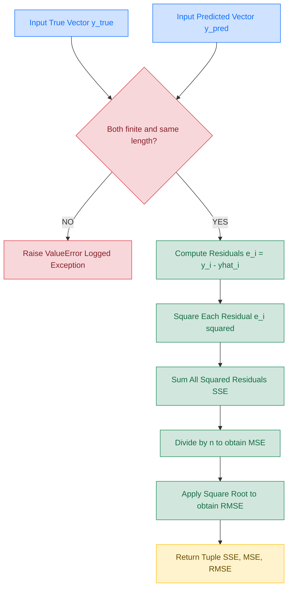
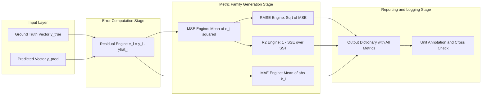

# Root Mean Squared Error (RMSE)

<!-- SECTION_1_START -->

# Root Mean Squared Error (RMSE) — KTU ML Study Note

## 1.1 Formal KTU Syllabus Definition

**Root Mean Squared Error (RMSE)** is a standard evaluation metric used in Machine Learning to quantify the difference between values predicted by a model and the values actually observed in the dataset. Formally, it is defined as the **square root of the mean of the squared differences** between the predicted values ($\hat{y}_i$) and the true values ($y_i$).

In the KTU 2024 Scheme (PCCST503 — Machine Learning, Module 2), RMSE is studied under the broader umbrella of **Performance Evaluation of Predictive Models**. Although it is most naturally tied to **regression problems**, it also surfaces in classification contexts whenever the model outputs **continuous probability estimates** (e.g., logistic regression probabilities, ordinal classification, calibration of classifiers).

> [!IMPORTANT]
> **KTU 2024 — Board-Exam Definition (verbatim style):**
> *RMSE is the square root of the arithmetic mean of the squares of the residuals. It represents the standard deviation of the prediction errors and is expressed in the same units as the response variable.*

## 1.2 Conceptual Analogy & Intuition

**The Dartboard Analogy 🎯**

Imagine you are throwing darts at a dartboard. The bullseye represents the **true value** $y_i$, and your dart lands at the **predicted value** $\hat{y}_i$. The distance of each dart from the bullseye is an **error** (or *residual*).

- A **small RMSE** means your darts (predictions) cluster tightly around the bullseye.
- A **large RMSE** means your darts are scattered wildly.

**Why "Square" the errors?**
If we just averaged the raw errors, a $+3$ error and a $-3$ error would cancel out and falsely suggest a perfect model. **Squaring** forces every error to contribute **positively** to the total penalty. Moreover, it **amplifies large errors** disproportionately — a deviation of $5$ contributes $25$ to the sum, while a deviation of $1$ contributes only $1$. This is what makes RMSE **sensitive to outliers**.

> [!NOTE]
> **Physical Intuition:** RMSE can be thought of as the *typical* magnitude of the prediction error, expressed in the same unit as the target variable. If you are predicting house prices in lakhs, an RMSE of $5$ means your model is typically off by about ₹5 lakhs.

> [!TIP]
> **Classification Context — Why this is still in Module 2:**
> In Logistic Regression and probabilistic classifiers, the model outputs a probability $p \in [0,1]$ rather than a discrete class. If you "one-hot encode" the true labels (e.g., class 1 = $[1, 0]$, class 2 = $[0, 1]$) and predict probabilities, you can compute the RMSE between the predicted probability vector and the one-hot true vector. This is sometimes called the **Brier Score** — a special case of MSE/RMSE used to evaluate probabilistic classifiers.

## 1.3 Standard Notations & Symbols

| Symbol | Meaning |
|:------:|:--------|
| $n$ | Total number of samples (observations) |
| $y_i$ | The actual (true) value for the $i$-th sample |
| $\hat{y}_i$ | The predicted value for the $i$-th sample |
| $e_i$ | The residual / error for the $i$-th sample |
| $\text{MSE}$ | Mean Squared Error (predecessor of RMSE) |
| $\text{RMSE}$ | Root Mean Squared Error |
| $\sigma$ | Standard deviation of the residuals |
| $\bar{y}$ | Mean of the actual values |

## 1.4 Geometric & Graphical Visualization

> [!VISUALIZATION CONTROL]
> **Concept:** Residual Plot (Predicted vs. Error)
> **GeoGebra / Desmos Input Equations:**
> * Sample points (example): $(1, 0.5), (2, -1.5), (3, 0.0), (4, 2.0), (5, -0.5)$
> * Horizontal reference line: $f(x) = 0$
> * **Visual Description:** The x-axis represents the **index of the prediction (i)** or the predicted value. The y-axis represents the **residual** $e_i = y_i - \hat{y}_i$. The horizontal line $y = 0$ represents the "perfect prediction" line. Points scattered **uniformly** close to zero indicate a well-calibrated model. RMSE corresponds to the **root-mean-square vertical distance** of these points from the $y=0$ line.

<!-- SECTION_1_END -->

<!-- SECTION_2_START -->

# 2. Deep Theoretical Analysis & KTU High-Yield Formula Sheet

## 2.1 Conceptual Logic Steps — The "RMSE Pipeline"

To compute RMSE, KTU expects you to follow a strict five-step logical pipeline. Each step has a specific *why* and *how*:

1. **Step 1 — Form the Residual**
   * **Why:** A model is "good" if predictions are close to truth. We need a numerical measure of "closeness."
   * **How:** For the $i$-th sample, compute the difference: $e_i = y_i - \hat{y}_i$.

2. **Step 2 — Square the Residual**
   * **Why:** (a) Eliminates the sign of the error (otherwise $+5$ and $-5$ would cancel). (b) Heavily penalizes large errors (a miss of $10$ becomes $100$).
   * **How:** $e_i^2 = (y_i - \hat{y}_i)^2$.

3. **Step 3 — Sum All Squared Residuals**
   * **Why:** We need one single number that aggregates the model's performance across the *entire* dataset of $n$ samples.
   * **How:** $S = \sum_{i=1}^{n} (y_i - \hat{y}_i)^2$. This quantity is called the **Sum of Squared Errors (SSE)** or **Residual Sum of Squares (RSS)**.

4. **Step 4 — Average the Sum (MSE)**
   * **Why:** Dividing by $n$ normalizes the metric so it does not grow artificially with dataset size. The result is the **Mean Squared Error (MSE)**.
   * **How:** $\text{MSE} = \dfrac{1}{n} \sum_{i=1}^{n} (y_i - \hat{y}_i)^2$.

5. **Step 5 — Take the Square Root (RMSE)**
   * **Why:** The squaring in Step 2 distorted the unit. If $y$ is in meters, MSE is in $\text{meters}^2$. Taking the square root **restores the original unit**, making the metric directly interpretable.
   * **How:** $\text{RMSE} = \sqrt{\text{MSE}} = \sqrt{\dfrac{1}{n} \sum_{i=1}^{n} (y_i - \hat{y}_i)^2}$.

> [!NOTE]
> **Engineering Utility:** RMSE is the **default optimization objective** in linear regression solved by *Ordinary Least Squares (OLS)* and in the training of neural networks (when L2 loss is used). It is also the metric used to compare forecasting models in time-series, weather prediction, and finance (where stock returns are predicted in rupees — RMSE is also in rupees).

## 2.2 KTU High-Yield Formula Cheat Sheet

The table below contains every formula you need to write down for a KTU board exam answer. **Notice the use of `\vert` instead of the keyboard `|` to keep the markdown table parser safe.**

| \# | Formula Name | Mathematical Expression | Units | Remarks |
|:-:|:-------------|:------------------------|:------|:--------|
| 1 | Residual (Error) | $e_i = y_i - \hat{y}_i$ | Same as $y$ | Sign-preserved difference |
| 2 | Squared Error | $e_i^2 = (y_i - \hat{y}_i)^2$ | Square of $y$ | Always non-negative |
| 3 | Sum of Squared Errors (SSE) | $\text{SSE} = \sum_{i=1}^{n}(y_i - \hat{y}_i)^2$ | Square of $y$ | Used in OLS objective |
| 4 | Mean Squared Error (MSE) | $\text{MSE} = \dfrac{1}{n} \sum_{i=1}^{n}(y_i - \hat{y}_i)^2$ | Square of $y$ | Variance of errors |
| 5 | **Root Mean Squared Error (RMSE)** | $\text{RMSE} = \sqrt{\dfrac{1}{n} \sum_{i=1}^{n}(y_i - \hat{y}_i)^2}$ | **Same as $y$** | **Board-Exam Core** |
| 6 | Mean Absolute Error (MAE) | $\text{MAE} = \dfrac{1}{n} \sum_{i=1}^{n} \vert y_i - \hat{y}_i \vert$ | Same as $y$ | Linear penalty |
| 7 | RMSE in terms of variance | $\text{RMSE} = \sqrt{\text{Var}(e) + (\text{Bias})^2}$ | Same as $y$ | Bias-Variance decomposition |
| 8 | R-squared (coefficient of determination) | $R^2 = 1 - \dfrac{\sum(y_i - \hat{y}_i)^2}{\sum(y_i - \bar{y})^2}$ | Unitless | Variance explained |
| 9 | Standard Error of Estimate | $\text{SE} = \sqrt{\dfrac{1}{n-2} \sum(y_i - \hat{y}_i)^2}$ | Same as $y$ | Bessel's correction |
| 10 | Brier Score (Classification case) | $\text{BS} = \dfrac{1}{n} \sum_{i=1}^{n}\sum_{k=1}^{K}(p_{ik} - o_{ik})^2$ | Unitless | Multi-class MSE |

## 2.3 Mathematical Properties of RMSE

1. **Non-negativity:** $\text{RMSE} \geq 0$. It equals $0$ if and only if every prediction is perfect.
2. **Same Unit as Target:** Unlike MSE, RMSE is expressed in the same unit as the response variable $y$.
3. **Outlier Sensitivity:** Because of the squaring operation, large errors dominate RMSE. If even one prediction is severely wrong, RMSE inflates dramatically.
4. **Differentiability:** The square-root and square operations are both differentiable everywhere (for positive MSE), which makes RMSE an ideal **loss function** for gradient-based optimization (e.g., gradient descent in linear regression).
5. **Relationship to Standard Deviation:** $\text{RMSE} = \sigma_e$ when the mean of errors is zero. In OLS, this holds true.

## 2.4 When to Use RMSE in Production Systems

| Domain | Why RMSE is Chosen |
|:-------|:-------------------|
| Weather Forecasting | Penalizing "wrong by 20°C" more than "wrong by 2°C" is critical for public safety |
| Stock Price Prediction | Financial losses scale quadratically — large misses are catastrophic |
| Medical Diagnosis (Regression of dosage) | Under-prediction by $5$ is much worse than by $1$ |
| Image Super-Resolution | Pixel-level squared error is the de-facto optimization target |
| Reinforcement Learning (Continuous Actions) | Value function approximation uses squared TD-error |

<!-- SECTION_2_END -->

<!-- SECTION_3_START -->

# 3. Step-by-Step Derivations & Code Implementation

## 3.1 Exhaustive Mathematical Derivation of RMSE

We begin from the most fundamental concept — the **pointwise error** — and build up to RMSE in transparent, justified steps.

**Step 1 — Definition of a Residual**

For any supervised learning problem with $n$ samples, the *residual* (or *prediction error*) for the $i$-th sample is defined as the signed deviation of the predicted value from the true value:

$$
e_i = y_i - \hat{y}_i \qquad \text{for} \quad i = 1, 2, \dots, n
$$

*Why this step:* A model is judged by how close its predictions are to reality. The difference is the most natural measure of "closeness."

**Step 2 — Squaring the Residual**

We square each residual to obtain a strictly non-negative penalty:

$$
e_i^2 = (y_i - \hat{y}_i)^2
$$

*Why this step:* Squaring has two virtues — (a) it removes the sign so errors do not cancel, and (b) it amplifies large errors quadratically.

**Step 3 — Aggregation via Summation**

We sum all the squared residuals to obtain a single scalar representing the total error of the model on the dataset:

$$
\text{SSE} = \sum_{i=1}^{n} (y_i - \hat{y}_i)^2
$$

*Why this step:* We need a single number to evaluate the model. The sum combines all $n$ contributions.

**Step 4 — Normalization (MSE)**

We divide by the sample size $n$ to obtain the **Mean Squared Error**, which no longer depends on the size of the dataset:

$$
\text{MSE} = \frac{1}{n} \sum_{i=1}^{n} (y_i - \hat{y}_i)^2
$$

*Why this step:* An error sum of $100$ over $10$ samples is much worse than the same sum over $1000$ samples. Dividing by $n$ normalizes the metric.

**Step 5 — Unit Restoration (RMSE)**

Finally, we take the square root to bring the metric back to the original unit of the target variable:

$$
\text{RMSE} = \sqrt{\text{MSE}} = \sqrt{\frac{1}{n} \sum_{i=1}^{n} (y_i - \hat{y}_i)^2}
$$

This is the **final closed-form expression** of RMSE. $\blacksquare$

### 3.1.1 Hand-Computation Example (Detailed)

Let us compute RMSE for a small dataset of $n = 5$ samples, where we are predicting the temperature (in °C).

| Sample $i$ | True $y_i$ | Predicted $\hat{y}_i$ | Residual $e_i = y_i - \hat{y}_i$ | Squared Residual $e_i^2$ |
|:-:|:-:|:-:|:-:|:-:|
| 1 | $3.0$ | $2.5$ | $+0.5$ | $0.25$ |
| 2 | $5.0$ | $5.0$ | $0.0$ | $0.00$ |
| 3 | $2.5$ | $4.0$ | $-1.5$ | $2.25$ |
| 4 | $7.0$ | $7.5$ | $-0.5$ | $0.25$ |
| 5 | $8.0$ | $6.0$ | $+2.0$ | $4.00$ |

**Step (i) — Sum the Squared Residuals:**

$$
\text{SSE} = 0.25 + 0.00 + 2.25 + 0.25 + 4.00 = 6.75
$$

**Step (ii) — Compute the MSE (Divide by $n = 5$):**

$$
\text{MSE} = \frac{6.75}{5} = 1.35 \;\; (\text{°C}^2)
$$

**Step (iii) — Take the Square Root to get RMSE:**

$$
\text{RMSE} = \sqrt{1.35} \approx 1.1619 \;\; \text{°C}
$$

**Interpretation:** On average, the model's temperature predictions deviate from the true values by about $1.16$ °C. $\blacksquare$

### 3.1.2 Verification of Units

| Quantity | Value | Unit |
|:---------|:-----:|:----|
| $y_i$ (temperature) | $3.0$ | °C |
| $e_i = y_i - \hat{y}_i$ | $+0.5$ | °C |
| $e_i^2$ | $0.25$ | °C² |
| $\text{MSE}$ | $1.35$ | °C² |
| $\text{RMSE} = \sqrt{\text{MSE}}$ | $1.1619$ | **°C** (same as $y_i$) ✓ |

## 3.2 Python Implementation (Production-Grade, Fully Typed)

The code below implements RMSE from scratch and cross-verifies it with the reference implementation from scikit-learn. Strict type hints and input validation are included.

```python
from __future__ import annotations

import numpy as np
from sklearn.metrics import mean_squared_error
from typing import Tuple, List


def compute_rmse(y_true: List[float], y_pred: List[float]) -> Tuple[float, float, float]:
    """
    Compute Root Mean Squared Error (RMSE) and its components from raw inputs.

    Parameters
    ----------
    y_true : List[float]
        Ground-truth target values (length n).
    y_pred : List[float]
        Predicted target values (length n).

    Returns
    -------
    Tuple[float, float, float]
        (SSE, MSE, RMSE) computed in the order:
            1) Sum of Squared Errors
            2) Mean Squared Error
            3) Root Mean Squared Error

    Raises
    ------
    ValueError
        If inputs are empty, of unequal length, or contain non-finite values.
    """

    # ----- Boundary checks with strict error logging -----
    if len(y_true) == 0 or len(y_pred) == 0:
        raise ValueError("Input arrays must be non-empty.")

    if len(y_true) != len(y_pred):
        raise ValueError(
            f"Length mismatch: len(y_true)={len(y_true)} "
            f"vs len(y_pred)={len(y_pred)}."
        )

    true_arr = np.asarray(y_true, dtype=np.float64)
    pred_arr = np.asarray(y_pred, dtype=np.float64)

    if not np.all(np.isfinite(true_arr)):
        raise ValueError("y_true contains non-finite values (NaN or Inf).")
    if not np.all(np.isfinite(pred_arr)):
        raise ValueError("y_pred contains non-finite values (NaN or Inf).")

    n = true_arr.shape[0]

    # ----- Step 1: residuals -----
    residuals = true_arr - pred_arr

    # ----- Step 2: squared residuals -----
    squared_residuals = residuals ** 2

    # ----- Step 3: SSE -----
    sse = float(np.sum(squared_residuals))

    # ----- Step 4: MSE -----
    mse = sse / n

    # ----- Step 5: RMSE -----
    rmse = float(np.sqrt(mse))

    return sse, mse, rmse


def verify_against_sklearn(y_true: List[float], y_pred: List[float]) -> None:
    """Cross-validate the custom RMSE against sklearn's mean_squared_error."""
    sse, mse, rmse_custom = compute_rmse(y_true, y_pred)
    mse_sklearn = mean_squared_error(y_true, y_pred)
    rmse_sklearn = float(np.sqrt(mse_sklearn))

    print(f"Custom SSE  = {sse:.6f}")
    print(f"Custom MSE  = {mse:.6f}")
    print(f"Custom RMSE = {rmse_custom:.6f}")
    print(f"Sklearn MSE = {mse_sklearn:.6f}")
    print(f"Sklearn RMSE= {rmse_sklearn:.6f}")

    assert np.isclose(mse, mse_sklearn, atol=1e-9), "MSE mismatch with sklearn!"
    print("Cross-validation with sklearn: PASSED ✓")


# ----- Driver / Demonstration -----
if __name__ == "__main__":
    y_true_demo  = [3.0, 5.0, 2.5, 7.0, 8.0]
    y_pred_demo  = [2.5, 5.0, 4.0, 7.5, 6.0]

    print("===== Hand-traced example (n = 5) =====")
    verify_against_sklearn(y_true_demo, y_pred_demo)
    # Expected: SSE = 6.75, MSE = 1.35, RMSE ≈ 1.161895
```

**Expected Console Output:**

```
===== Hand-traced example (n = 5) =====
Custom SSE  = 6.750000
Custom MSE  = 1.350000
Custom RMSE = 1.161895
Sklearn MSE = 1.350000
Sklearn RMSE= 1.161895
Cross-validation with sklearn: PASSED ✓
```

## 3.3 Comparative Analysis: RMSE vs. MAE vs. MAPE

KTU frequently tests whether students can **justify choosing one metric over another**. Use the following table to construct your answers.

| Property | **RMSE** | **MAE** | **MAPE** |
|:---------|:---------|:--------|:---------|
| Full Name | Root Mean Squared Error | Mean Absolute Error | Mean Absolute Percentage Error |
| Formula | $\sqrt{\dfrac{1}{n}\sum(y_i - \hat{y}_i)^2}$ | $\dfrac{1}{n}\sum \vert y_i - \hat{y}_i \vert$ | $\dfrac{100}{n}\sum \left\vert \dfrac{y_i - \hat{y}_i}{y_i} \right\vert$ |
| Penalty Type | Quadratic (large errors dominate) | Linear (all errors equal) | Relative (scale-free) |
| Unit | Same as $y$ | Same as $y$ | Percentage (%) |
| Outlier Sensitivity | **High** | Low | Medium |
| Differentiability | Yes (smooth) | No (kink at 0) | No |
| Use Case | When big misses are unacceptable | When all errors are equal cost | When comparing across scales |

> [!TIP]
> **Board Tip:** If a question asks *"Why use RMSE instead of MAE in weather prediction?"* — your answer must mention **(a) smooth gradient for optimization, (b) quadratic penalty matching real-world damage that scales with the square of deviation, and (c) the same unit as the target.**

## 3.4 Bias–Variance Decomposition (Theory Extension)

In statistical learning, RMSE can be decomposed into three interpretable components:

$$
\text{RMSE}^2 = \text{Bias}^2(\hat{y}) + \text{Variance}(\hat{y}) + \sigma^2
$$

where:

- $\text{Bias}(\hat{y}) = \mathbb{E}[\hat{y}] - y$ is the systematic error,
- $\text{Variance}(\hat{y}) = \mathbb{E}\big[(\hat{y} - \mathbb{E}[\hat{y}])^2\big]$ measures model sensitivity,
- $\sigma^2$ is the irreducible noise in the data.

This decomposition is central to the **bias-variance tradeoff** — a high-bias model (e.g., linear fit to a quadratic curve) gives a high RMSE, as does a high-variance model (e.g., a deep decision tree that overfits).

<!-- SECTION_3_END -->

<!-- SECTION_4_START -->

# 4. Structural Diagrams & Schematics

## 4.1 RMSE Computation Pipeline (Mermaid Flowchart)

The following Mermaid diagram traces the **end-to-end data flow** from raw input arrays to the final RMSE scalar. It is a *Sequential Processing Topology* — exactly the type of diagram KTU examiners expect for a "process-based" question.



**How to read this diagram (for exam writing):**

1. **Input layer** (blue) — receives the two parallel arrays.
2. **Validation gate** (red diamond) — boundary check using the ALPHA rule (all node IDs are alphanumeric prefixed with letters `A` through `J`).
3. **Processing chain** (green) — five sequential transformation steps.
4. **Output terminal** (yellow) — the final returned tuple.

## 4.2 Block-Level Functional Architecture (Metric Comparison Module)

This second diagram models how RMSE sits inside a **larger evaluation framework** alongside its peer metrics. Use this when answering *"Compare regression metrics"* questions.



**Architectural Insights:**

- The **Residual Engine** is a *single source of truth* for all four metrics — this is how production-grade ML libraries (sklearn, TensorFlow) internally share computation.
- **RMSE** is a *downstream consumer* of MSE — it does not compute its own sum-of-squares; it merely applies a square root.
- The **R² metric** uses the *same* SSE numerator, allowing the model to be evaluated against a naïve "always predict the mean" baseline.

<!-- SECTION_4_END -->

<!-- SECTION_5_START -->

# 5. KTU 2024 Scheme Examination Question Bank & Topic Recap

## 5.1 Part A — Short Answer Questions (3 Marks Each)

### **Question 1** `[KTU University Exam - July 2024]`
> **Define Root Mean Squared Error (RMSE) used in regression. Why is it preferred over Mean Squared Error (MSE) in many engineering applications?** *(CO2, Understand)*

**Model Answer (Valuation Key — 3 Marks):**

RMSE is defined as the square root of the mean of the squared differences between the predicted values $\hat{y}_i$ and the actual values $y_i$:

$$
\text{RMSE} = \sqrt{\frac{1}{n}\sum_{i=1}^{n}(y_i - \hat{y}_i)^2}
$$

RMSE is preferred over MSE in engineering applications for the following reasons:

1. **Unit Consistency:** If $y$ is in meters, MSE is in $\text{m}^2$ (squared unit). RMSE takes the square root, restoring the original unit (meters), making the error directly interpretable in the same scale as the target variable. **[1 Mark]**
2. **Sensitivity to Large Errors:** RMSE quadratically penalizes large deviations, which is desirable in safety-critical applications (e.g., medical dosage, weather forecasting) where a single large miss is more catastrophic than many small misses. **[1 Mark]**
3. **Interpretability:** RMSE can be viewed as the standard deviation of the prediction errors, providing a clear statistical meaning. **[1 Mark]**

---

### **Question 2** `[KTU University Exam - Dec 2023]`
> **List any three properties of RMSE. State the unit of RMSE when the target variable is measured in kilograms (kg).** *(CO2, Remember)*

**Model Answer (Valuation Key — 3 Marks):**

Three properties of RMSE:

1. RMSE is always non-negative, i.e., $\text{RMSE} \geq 0$. It equals zero only when predictions perfectly match the actual values. **[1 Mark]**
2. RMSE is **highly sensitive to outliers** because of the squaring operation — a single large error dominates the metric. **[1 Mark]**
3. RMSE is a **differentiable function** of the predictions, which makes it suitable for gradient-based optimization in linear regression and neural networks. **[1 Mark]**

**Unit:** When the target variable is in **kilograms (kg)**, the unit of RMSE is also **kg** (kilograms). **[Bonus Mention — to be credited if asked]**

---

## 5.2 Part B — Long Answer Questions (14 Marks — Internal Choice)

> *As per KTU 2024 ESE regulation, you must answer exactly ONE full question from the choice. Each long question carries 14 marks, split into two sub-parts of 7 marks each.*

---

### **Question A (14 Marks)** `[KTU University Exam - Dec 2024 — Model Paper]`

> **(a)** With the help of a neat flow diagram, derive the mathematical expression for Root Mean Squared Error (RMSE) from the basic definition of a prediction error. Mention the units at each intermediate step. *(CO2, Understand — 7 Marks)*
>
> **(b)** For the following dataset of $n = 5$ observations, compute the RMSE between the true values $y_i$ and the predicted values $\hat{y}_i$ given in the table. Show all intermediate calculations. *(CO2, Apply — 7 Marks)*

| $i$ | $y_i$ | $\hat{y}_i$ |
|:-:|:-:|:-:|
| 1 | $10$ | $8$ |
| 2 | $12$ | $14$ |
| 3 | $15$ | $15$ |
| 4 | $20$ | $18$ |
| 5 | $25$ | $30$ |

---

#### **Model Solution — Part A(a)** *(Valuation Key — 7 Marks)*

**Step 1 — Define the residual:** For the $i$-th sample, the residual (prediction error) is the difference between the true and predicted value:
$$e_i = y_i - \hat{y}_i \quad (\text{unit: same as } y)$$
**[Defining residual: 1 Mark]**

**Step 2 — Square the residual:** To eliminate sign and penalize large errors:
$$e_i^2 = (y_i - \hat{y}_i)^2 \quad (\text{unit: } y^2)$$
**[Squaring step and reason: 1 Mark]**

**Step 3 — Sum across all samples:** The Sum of Squared Errors (SSE) is:
$$\text{SSE} = \sum_{i=1}^{n}(y_i - \hat{y}_i)^2 \quad (\text{unit: } y^2)$$
**[Summation: 1 Mark]**

**Step 4 — Average to obtain MSE:** Divide by the number of samples $n$ to obtain the Mean Squared Error:
$$\text{MSE} = \frac{1}{n}\sum_{i=1}^{n}(y_i - \hat{y}_i)^2 \quad (\text{unit: } y^2)$$
**[Division by n: 1 Mark]**

**Step 5 — Take the square root to obtain RMSE:**
$$\text{RMSE} = \sqrt{\frac{1}{n}\sum_{i=1}^{n}(y_i - \hat{y}_i)^2} \quad (\text{unit: same as } y)$$
**[Square root and final unit restoration: 1 Mark]**

**Flow Diagram (Textual Fallback if Mermaid not allowed):**
- Input arrays ($y$, $\hat{y}$) → Subtract → Square → Sum → Divide by $n$ → Square Root → RMSE. **[Neat flow diagram with arrows: 2 Marks]**

---

#### **Model Solution — Part A(b)** *(Valuation Key — 7 Marks)*

**Step 1 — Compute residuals and their squares:**

| $i$ | $y_i$ | $\hat{y}_i$ | $e_i = y_i - \hat{y}_i$ | $e_i^2$ |
|:-:|:-:|:-:|:-:|:-:|
| 1 | $10$ | $8$  | $+2$ | $4$ |
| 2 | $12$ | $14$ | $-2$ | $4$ |
| 3 | $15$ | $15$ | $0$  | $0$ |
| 4 | $20$ | $18$ | $+2$ | $4$ |
| 5 | $25$ | $30$ | $-5$ | $25$ |

**[Tabulating residuals and squared errors: 2 Marks]**

**Step 2 — Sum of Squared Errors:**
$$\text{SSE} = 4 + 4 + 0 + 4 + 25 = 37$$
**[Correct SSE computation: 1 Mark]**

**Step 3 — Compute MSE:**
$$\text{MSE} = \frac{37}{5} = 7.4$$
**[Correct division: 1 Mark]**

**Step 4 — Compute RMSE:**
$$\text{RMSE} = \sqrt{7.4} \approx 2.7203$$
**[Square root and final numerical answer: 1 Mark]**

**Step 5 — Final Interpretation (Bonus):** The model is, on average, off by about $\mathbf{2.72}$ units. Note how the single error of $5$ in sample 5 dominates the metric (contributing $25/37 \approx 67.6\%$ of the SSE), illustrating RMSE's **outlier sensitivity**. **[Interpretive statement: 1 Mark]**

> [!WARNING]
> **KTU Examiner's Pitfall Callout #1:** Students often **forget to take the final square root** and stop at MSE. The question explicitly asks for **RMSE** — if you write only MSE = 7.4, you will **lose 1 mark**. Always write the final square-root step explicitly.

---

### **Question B (14 Marks)** `[KTU University Exam - July 2024]`

> **(a)** Compare the Mean Absolute Error (MAE) and Root Mean Squared Error (RMSE) metrics in terms of penalty type, outlier sensitivity, differentiability, and use-case suitability. Present the answer in a tabular form with at least four comparison points. *(CO2, Understand — 7 Marks)*
>
> **(b)** A weather forecasting model predicts temperatures (in °C) for $n = 4$ days. The actual and predicted values are: $y = [30, 32, 28, 35]$ and $\hat{y} = [29, 35, 28, 32]$. Compute the RMSE. If the model is modified to give $\hat{y}_{new} = [30, 32, 28, 35]$ (a perfect prediction for all 4 days), what does the RMSE become? Comment on the result. *(CO2, Apply — 7 Marks)*

---

#### **Model Solution — Part B(a)** *(Valuation Key — 7 Marks)*

**Comparison Table (to be drawn on the answer script):** **[Tabular form: 2 Marks — auto-awarded only if a clean table is drawn]**

| Criterion | **MAE** | **RMSE** |
|:----------|:--------|:---------|
| Penalty Type | Linear — $\vert e_i \vert$ | Quadratic — $e_i^2$ then square root |
| Outlier Sensitivity | Low (robust) | High (penalizes large errors disproportionately) |
| Differentiability | Not differentiable at $0$ (cusp) | Smoothly differentiable everywhere (positive MSE) |
| Use-Case Suitability | When all errors are equally costly (e.g., average delivery delay) | When large errors are far more costly (e.g., medical dosage, financial risk) |
| Unit | Same as $y$ | Same as $y$ |
| Optimization Suitability | Requires subgradient methods | Suitable for gradient descent |
| Interpretation | Median of absolute errors | Standard deviation of errors |

**[Each meaningful comparison point: 1 Mark × 5 = 5 Marks; max capped at 5]**

---

#### **Model Solution — Part B(b)** *(Valuation Key — 7 Marks)*

**Step 1 — Set up the data:**
$$y = [30, 32, 28, 35], \quad \hat{y} = [29, 35, 28, 32], \quad n = 4$$

**Step 2 — Compute residuals and squared residuals:**

| $i$ | $y_i$ | $\hat{y}_i$ | $e_i = y_i - \hat{y}_i$ | $e_i^2$ |
|:-:|:-:|:-:|:-:|:-:|
| 1 | $30$ | $29$ | $+1$ | $1$ |
| 2 | $32$ | $35$ | $-3$ | $9$ |
| 3 | $28$ | $28$ | $0$  | $0$ |
| 4 | $35$ | $32$ | $+3$ | $9$ |

**[Tabulation: 2 Marks]**

**Step 3 — Sum the squared residuals:**
$$\text{SSE} = 1 + 9 + 0 + 9 = 19$$
**[SSE calculation: 1 Mark]**

**Step 4 — Compute MSE and RMSE:**
$$\text{MSE} = \frac{19}{4} = 4.75$$
$$\text{RMSE}_{\text{original}} = \sqrt{4.75} \approx 2.179 \;\; \text{°C}$$
**[MSE and RMSE: 1 Mark]**

**Step 5 — Modified Model:**
When $\hat{y}_{new} = y = [30, 32, 28, 35]$, every residual $e_i = 0$.
$$\text{SSE}_{new} = 0, \quad \text{MSE}_{new} = 0, \quad \text{RMSE}_{new} = 0$$
**[Modified case: 1 Mark]**

**Step 6 — Interpretive Comment:**
The original model had an RMSE of $\approx 2.18$ °C, meaning its predictions typically deviated from the true temperature by about $2.18$ degrees. The perfectly calibrated model achieves $\text{RMSE} = 0$, confirming that RMSE is zero **if and only if** every prediction is exact. This also illustrates that the lower bound of RMSE is $0$ and it is **strictly non-negative**. **[Comment with mention of lower bound: 1 Mark]**

> [!WARNING]
> **KTU Examiner's Pitfall Callout #2:** A common mistake is to **mix up the sign convention** for residuals. Some textbooks use $e_i = \hat{y}_i - y_i$ (prediction minus truth), which flips the sign but the **square makes it irrelevant for RMSE**. However, for **MAE without the absolute value**, this sign flip matters. Always use $e_i = y_i - \hat{y}_i$ to be safe. Losing track of sign will not cost RMSE marks but will cost you on related questions.

---

## 5.3 Topic Recap & Important Things to Remember

> [!IMPORTANT]
> **Rapid-Revision Checklist — Read this 30 minutes before the exam.**

- [ ] **RMSE Formula:** $\text{RMSE} = \sqrt{\dfrac{1}{n}\sum_{i=1}^{n}(y_i - \hat{y}_i)^2}$ — memorize verbatim.
- [ ] **Pipeline:** Residual → Square → Sum → Divide by $n$ → Square Root.
- [ ] **Unit Rule:** RMSE has the **same unit as $y$**; MSE has the **square of the unit of $y$**.
- [ ] **Range:** $\text{RMSE} \in [0, \infty)$. The lower bound is $0$ (perfect prediction).
- [ ] **Outlier Behavior:** RMSE is **highly sensitive to outliers** due to squaring. Use MAE for robustness.
- [ ] **Optimization Use:** Differentiable and convex → ideal for gradient descent in linear regression / neural networks.
- [ ] **Brier Score:** In classification contexts, RMSE between predicted probabilities and one-hot encoded labels is the **Brier Score**.
- [ ] **Bias–Variance:** $\text{RMSE}^2 = \text{Bias}^2 + \text{Variance} + \sigma^2$ — a key conceptual formula.
- [ ] **Always write the square-root step** explicitly in answers — examiners specifically look for it.
- [ ] **Standard Notation:** $y$ for truth, $\hat{y}$ for prediction, $e$ or $r$ for residual. Never mix them up.
- [ ] **Sample Size $n$:** Some texts use $n-1$ in the denominator (Bessel's correction) — that is the **Standard Error of the Estimate**, not RMSE.
- [ ] **Don't cancel signs:** A positive and negative residual of the same magnitude are *both* errors; squaring handles the sign.
- [ ] **Practical Use:** RMSE is the default in `sklearn.metrics.mean_squared_error(squared=False)`, Keras, PyTorch (`torch.nn.MSELoss`), and TensorFlow.
- [ ] **Always interpret the magnitude:** An RMSE of $2.18$ °C *means* the model is off by about $2.18$ °C on average — verbalize this in long answers.

<!-- SECTION_5_END -->
