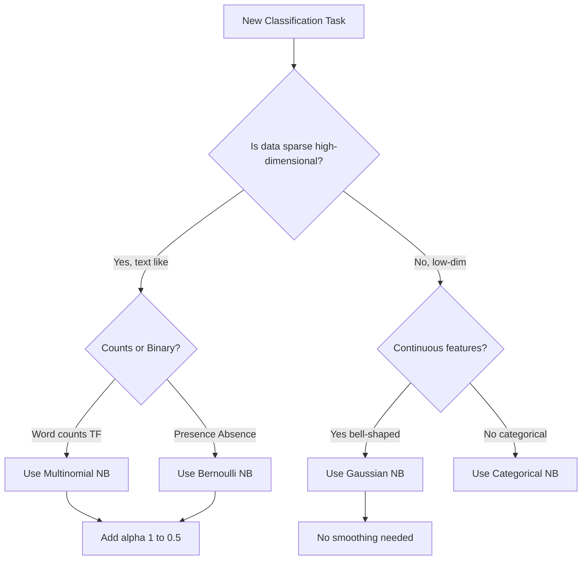
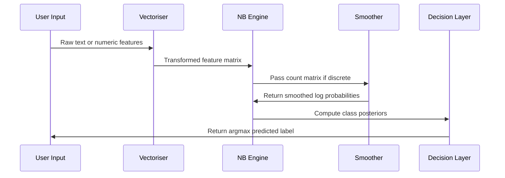
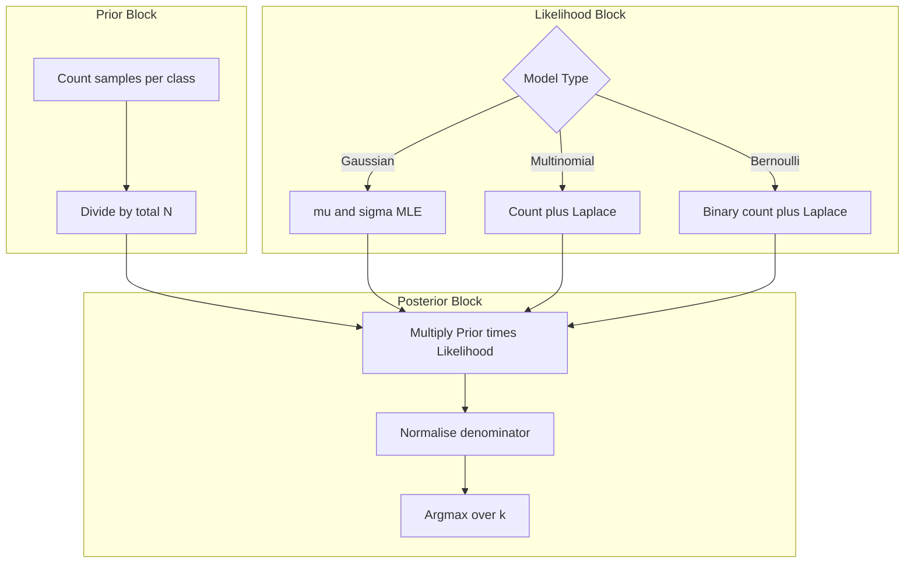

# Laplace Smoothing (+1 correction) in sparse arrays, Gaussian vs Multinomial vs Bernoulli Naive Bayes variants

<!-- SECTION_1_START -->

# Probabilistic Classification & Naive Bayes — Laplace Smoothing and NB Variants

## 1.1 Formal Definition (KTU 2024 Syllabus Terminology)

> [!NOTE]
> **Naive Bayes Classifier**: A family of supervised probabilistic classifiers based on **Bayes' Theorem** with the **"naive" assumption of conditional independence** between every pair of features given the class label $y$.

For a feature vector $\mathbf{x} = (x_1, x_2, \dots, x_n)$ and class $y \in \{C_1, C_2, \dots, C_k\}$:

$$\hat{y} = \arg\max_{C_k} \; P(C_k) \prod_{i=1}^{n} P(x_i \mid C_k)$$

The classifier is **"naive"** because it assumes that the presence (or value) of a particular feature is *independent* of the presence (or value) of any other feature, given the class. This drastically simplifies computation and works surprisingly well in high-dimensional sparse data.

> [!IMPORTANT]
> **Laplace Smoothing (Add-One / Lidstone Smoothing)**: A regularisation technique used in Naive Bayes (especially Multinomial and Bernoulli variants) to handle the **zero-probability problem** in sparse datasets. It adds a pseudo-count $\alpha = 1$ to every feature count to prevent any unseen category from being assigned a probability of exactly zero, which would otherwise nullify the entire posterior product.

Formally, the smoothed conditional probability becomes:

$$P(x_i \mid C_k) = \frac{\text{count}(x_i, C_k) + \alpha}{\sum_{x} \text{count}(x, C_k) + \alpha \cdot \vert V \vert}$$

where $\vert V \vert$ is the size of the vocabulary (feature space) and $\alpha$ is the smoothing parameter (default **1**).

---

## 1.2 The Three Official Naive Bayes Variants

| Variant | Feature Type | Use Case | KTU Weightage |
|---|---|---|---|
| **Gaussian NB** | Continuous, real-valued (assumed normally distributed) | Iris dataset, sensor data, medical measurements | High |
| **Multinomial NB** | Discrete counts (e.g., word frequencies) | Text classification, spam filtering, bag-of-words | Very High |
| **Bernoulli NB** | Binary / Boolean features (presence vs absence) | Short text, sentiment (positive/negative token presence) | High |

---

## 1.3 Conceptual Analogy & Intuition

> [!TIP]
> **Real-World Analogy — The Weather Predictor**: Imagine you are a meteorologist predicting whether it will *Rain* ($C_1$) or be *Sunny* ($C_2$) based on three features: *Cloudy* ($x_1$), *Humid* ($x_2$), and *Windy* ($x_3$). Naive Bayes would say: "Even if Cloudy and Humid are correlated in reality, **pretend** they are independent given the weather outcome." This naive assumption makes the math tractable.

> **Sparse Array Analogy — The Restaurant Menu**: Suppose you are counting words in 1000 customer reviews. The word *"quinoa"* may appear in 0 reviews of "Italian" restaurants. Without Laplace smoothing, $P(\text{quinoa} \mid \text{Italian}) = 0$, and *any* review containing "quinoa" would be classified as **not Italian** with absolute certainty — a fatal overfit. Laplace smoothing adds a "+1" to the numerator and "+vocabulary size" to the denominator, nudging unseen words toward a tiny but non-zero probability.

---

## 1.4 Visualization Control

> [!VISUALIZATION CONTROL]
> **Concept:** Probability mass redistribution after Laplace smoothing
> **Desmos / GeoGebra Input:**
> * `f(x) = (x + 1) / (N + V)` for smoothed probability
> * `g(x) = x / N` for raw probability
> **Visual Description:** Plot the raw count-to-probability function $g(x)$ and the smoothed function $f(x)$ for $N = 10$, $V = 5$. The student should observe that $f(0) = \frac{1}{15} \approx 0.067$ instead of $0$, while $f(10) = \frac{11}{15} \approx 0.733$ instead of $1.0$. The curves intersect at $x = \frac{N}{V} = 2$, demonstrating the **regularising pull** toward uniformity.

<!-- SECTION_1_END -->

<!-- SECTION_2_START -->

# Deep Theoretical Analysis — Bayes, Smoothing & the Three NB Variants

## 2.1 Bayes' Theorem Recap

Naive Bayes is rooted in Bayes' theorem:

$$P(C_k \mid \mathbf{x}) = \frac{P(C_k) \cdot P(\mathbf{x} \mid C_k)}{P(\mathbf{x})}$$

Since the denominator $P(\mathbf{x})$ is constant across all classes, the prediction rule simplifies to:

$$\hat{y} = \arg\max_{C_k} \; \underbrace{P(C_k)}_{\text{prior}} \cdot \underbrace{P(\mathbf{x} \mid C_k)}_{\text{likelihood}}$$

Applying the conditional independence assumption:

$$P(\mathbf{x} \mid C_k) = \prod_{i=1}^{n} P(x_i \mid C_k)$$

---

## 2.2 The Zero-Probability Problem (Why Laplace Smoothing Exists)

Consider the following tiny training corpus for **spam detection**:

| Document | Words | Class |
|---|---|---|
| D1 | "free offer" | Spam |
| D2 | "meeting schedule" | Ham |
| D3 | "free meeting" | Spam |
| D4 | "schedule offer" | Ham |

Now test a new document: **"free schedule"**.

- $P(\text{“offer”} \mid \text{Ham}) = \frac{1}{5} = 0.2$ ✓
- $P(\text{“free”} \mid \text{Ham}) = \frac{0}{5} = 0$ ✗ **FATAL**

Multiplying any number by zero gives zero, so the Ham posterior collapses to zero. The model becomes overconfidently wrong on words it has never seen. **Laplace smoothing fixes this**.

---

## 2.3 The Laplace Smoothing Formula — Derived

Let:
- $N_{yi}$ = count of feature $x_i$ in documents of class $y$ (i.e., training samples where feature $x_i$ is observed in class $y$)
- $N_y$ = total count of all features in class $y$
- $\alpha$ = smoothing parameter (Laplace: $\alpha = 1$; Lidstone: $0 < \alpha < 1$)
- $V$ = vocabulary size (number of distinct features)

**Raw (unsmoothed) estimate:**

$$P(x_i \mid y) = \frac{N_{yi}}{N_y}$$

**Laplace smoothed estimate:**

$$P_{\alpha}(x_i \mid y) = \frac{N_{yi} + \alpha}{N_y + \alpha \cdot V}$$

### Why this works (proof of validity as a probability):

We need $\sum_{i=1}^{V} P_{\alpha}(x_i \mid y) = 1$:

$$\sum_{i=1}^{V} \frac{N_{yi} + \alpha}{N_y + \alpha V} = \frac{\sum_{i=1}^{V} N_{yi} + \sum_{i=1}^{V} \alpha}{N_y + \alpha V} = \frac{N_y + \alpha V}{N_y + \alpha V} = 1 \checkmark$$

It is a **valid probability distribution**.

---

## 2.4 Variant 1 — Gaussian Naive Bayes

Used when features are **continuous** and assumed to follow a **Gaussian (normal) distribution** within each class.

$$P(x_i \mid C_k) = \frac{1}{\sqrt{2\pi\sigma_{k}^{2}}} \exp\!\left(-\frac{(x_i - \mu_k)^2}{2\sigma_k^2}\right)$$

Parameters are estimated by **Maximum Likelihood**:

$$\mu_k = \frac{1}{N_k} \sum_{j=1}^{N_k} x_i^{(j)}$$

$$\sigma_k^2 = \frac{1}{N_k} \sum_{j=1}^{N_k} \left(x_i^{(j)} - \mu_k\right)^2$$

> [!IMPORTANT]
> **Engineering Reality**: Gaussian NB is the go-to choice for the **Iris dataset** in lab exams. If a question says "features are continuous and approximately bell-shaped", answer Gaussian NB.

---

## 2.5 Variant 2 — Multinomial Naive Bayes

Used when features represent **discrete counts** (e.g., term frequencies in a document). The document is modelled as a sample drawn from a **multinomial distribution** over the vocabulary.

$$P(\mathbf{x} \mid C_k) = \frac{\left(\sum_i x_i\right)!}{\prod_i x_i !} \prod_{i=1}^{V} P(x_i \mid C_k)^{x_i}$$

With Laplace smoothing:

$$P(x_i \mid C_k) = \frac{N_{ki} + \alpha}{\sum_{j=1}^{V} N_{kj} + \alpha V}$$

**Use case**: Document classification, spam filtering (the canonical example in KTU 2024 Module 2).

---

## 2.6 Variant 3 — Bernoulli Naive Bayes

Used when features are **binary** (boolean) — i.e., whether a word is *present* or *absent* in a document (not how many times it appears).

For a single feature $x_i \in \{0, 1\}$:

$$P(x_i \mid C_k) = P(i \mid C_k)^{x_i} \left(1 - P(i \mid C_k)\right)^{(1 - x_i)}$$

For the full feature vector:

$$P(\mathbf{x} \mid C_k) = \prod_{i=1}^{V} P(i \mid C_k)^{x_i} \left(1 - P(i \mid C_k)\right)^{(1 - x_i)}$$

With Laplace smoothing for the binary probability:

$$P(i \mid C_k) = \frac{N_{ki} + \alpha}{N_k + 2\alpha}$$

> [!TIP]
> **Key Distinction for Exams**: Multinomial NB uses *word counts*; Bernoulli NB uses *word presence/absence*. For short texts (tweets, headlines), Bernoulli often beats Multinomial because repetition is rare.

---

## 2.7 KTU Formula Sheet / Cheat Sheet

| Concept | Formula | Used In |
|---|---|---|
| Bayes prediction rule | $\hat{y} = \arg\max_{C_k} P(C_k) \prod_i P(x_i \mid C_k)$ | All NB |
| Laplace smoothing (multinomial) | $P(x_i \mid C_k) = \dfrac{N_{ki} + \alpha}{N_k + \alpha \vert V \vert}$ | Multinomial NB |
| Laplace smoothing (Bernoulli) | $P(i \mid C_k) = \dfrac{N_{ki} + \alpha}{N_k + 2\alpha}$ | Bernoulli NB |
| Gaussian likelihood | $P(x_i \mid C_k) = \dfrac{1}{\sqrt{2\pi\sigma_k^2}} \exp\!\left(-\dfrac{(x_i-\mu_k)^2}{2\sigma_k^2}\right)$ | Gaussian NB |
| Class prior | $P(C_k) = \dfrac{N_k}{N}$ | All NB |
| Class mean estimate | $\mu_k = \dfrac{1}{N_k}\sum_j x_i^{(j)}$ | Gaussian NB |
| Class variance estimate | $\sigma_k^2 = \dfrac{1}{N_k}\sum_j (x_i^{(j)} - \mu_k)^2$ | Gaussian NB |
| Bernoulli single feature | $P(i \mid C_k)^{x_i} (1 - P(i \mid C_k))^{(1-x_i)}$ | Bernoulli NB |
| Multinomial document likelihood | $\dfrac{(\sum_i x_i)!}{\prod_i x_i!} \prod_i P(x_i \mid C_k)^{x_i}$ | Multinomial NB |
| Validation: smoothed PMF sums to 1 | $\sum_{i=1}^{V} P_\alpha(x_i \mid y) = 1$ | All smoothed NB |

---

## 2.8 Real-World Engineering Utility

- **Spam Filters** (Gmail, Outlook): Multinomial NB on bag-of-words features.
- **Sentiment Analysis** (Twitter API): Bernoulli NB on token presence; Multinomial on TF-IDF vectors.
- **Medical Diagnosis**: Gaussian NB on patient vitals (glucose, BP, cholesterol).
- **Recommendation Systems** (early Netflix): Multinomial NB on user-movie rating counts.
- **Real-time Edge ML**: NB is the *fastest* probabilistic classifier — perfect for low-latency IoT inference.

<!-- SECTION_2_END -->

<!-- SECTION_3_START -->

# Step-by-Step Derivations & Python Implementation

## 3.1 Hand-Derived Numerical Example — Laplace Smoothing on Multinomial NB

**Dataset (text classification, 3 classes, vocabulary V = {“cat”, “dog”, “fish”})**

| Doc | Class | cat | dog | fish |
|---|---|---|---|---|
| D1 | A | 3 | 0 | 1 |
| D2 | A | 2 | 1 | 0 |
| D3 | B | 0 | 2 | 2 |
| D4 | C | 1 | 1 | 1 |

### Step 1 — Aggregate counts per class

For **Class A**: total words = $3 + 0 + 1 + 2 + 1 + 0 = 7$. Counts: $N_{A,\text{cat}}=5$, $N_{A,\text{dog}}=1$, $N_{A,\text{fish}}=1$.

For **Class B**: total words = $0+2+2 = 4$. Counts: $N_{B,\text{cat}}=0$, $N_{B,\text{dog}}=2$, $N_{B,\text{fish}}=2$.

For **Class C**: total words = $1+1+1 = 3$. Counts: $N_{C,\text{cat}}=1$, $N_{C,\text{dog}}=1$, $N_{C,\text{fish}}=1$.

### Step 2 — Class priors

$$P(A) = \frac{2}{4} = 0.5, \quad P(B) = \frac{1}{4} = 0.25, \quad P(C) = \frac{1}{4} = 0.25$$

### Step 3 — Apply Laplace smoothing ($\alpha = 1$, $\vert V \vert = 3$)

Denominator for class A: $N_A + \alpha V = 7 + 1 \cdot 3 = 10$.

$$P(\text{cat} \mid A) = \frac{5 + 1}{10} = \frac{6}{10} = 0.60$$

$$P(\text{dog} \mid A) = \frac{1 + 1}{10} = \frac{2}{10} = 0.20$$

$$P(\text{fish} \mid A) = \frac{1 + 1}{10} = \frac{2}{10} = 0.20$$

Denominator for class B: $N_B + \alpha V = 4 + 3 = 7$.

$$P(\text{cat} \mid B) = \frac{0 + 1}{7} = \frac{1}{7} \approx 0.143$$

$$P(\text{dog} \mid B) = \frac{2 + 1}{7} = \frac{3}{7} \approx 0.429$$

$$P(\text{fish} \mid B) = \frac{2 + 1}{7} = \frac{3}{7} \approx 0.429$$

Denominator for class C: $N_C + \alpha V = 3 + 3 = 6$.

$$P(\text{cat} \mid C) = \frac{1 + 1}{6} = \frac{2}{6} \approx 0.333$$

$$P(\text{dog} \mid C) = \frac{1 + 1}{6} = \frac{2}{6} \approx 0.333$$

$$P(\text{fish} \mid C) = \frac{1 + 1}{6} = \frac{2}{6} \approx 0.333$$

### Step 4 — Classify a new document $\mathbf{x}_{\text{new}} = (\text{cat}=1, \text{dog}=0, \text{fish}=1)$

For class A:

$$P(A) \cdot P(\text{cat} \mid A) \cdot P(\text{fish} \mid A) = 0.5 \times 0.60 \times 0.20 = 0.060$$

For class B:

$$P(B) \cdot P(\text{cat} \mid B) \cdot P(\text{fish} \mid B) = 0.25 \times 0.143 \times 0.429 \approx 0.0153$$

For class C:

$$P(C) \cdot P(\text{cat} \mid C) \cdot P(\text{fish} \mid C) = 0.25 \times 0.333 \times 0.333 \approx 0.0277$$

**Decision**: $\hat{y} = A$ (score $0.060$ wins).

### Step 5 — Show what would happen WITHOUT smoothing

For class B, $P(\text{cat} \mid B) = 0/4 = 0$. So $P(B) \cdot 0 \cdot P(\text{fish} \mid B) = 0$. The B-posterior is wiped out completely, even though "fish" is highly indicative of B. **Laplace smoothing rescued this.**

---

## 3.2 Full Python Implementation (Production-Ready)

```python
"""
Naive Bayes — Three Variants with Laplace Smoothing
KTU 2024 Scheme — Machine Learning (PCCST503), Module 2
"""

from __future__ import annotations
import math
import numpy as np
from collections import defaultdict
from typing import Dict, List, Tuple


# ============================================================
# 1. MULTINOMIAL NAIVE BAYES
# ============================================================
class MultinomialNB:
    """
    Multinomial Naive Bayes for discrete count features
    (e.g., word counts in a document).
    Laplace smoothing parameter alpha defaults to 1.0.
    """

    def __init__(self, alpha: float = 1.0) -> None:
        if alpha < 0:
            raise ValueError("Smoothing parameter alpha must be non-negative.")
        self.alpha: float = alpha
        self.class_log_prior_: Dict[int, float] = {}
        self.feature_log_prob_: Dict[int, np.ndarray] = {}
        self.classes_: np.ndarray = np.array([])

    def fit(self, X: np.ndarray, y: np.ndarray) -> "MultinomialNB":
        self.classes_ = np.unique(y)
        n_samples, n_features = X.shape
        self.class_log_prior_ = {}
        self.feature_log_prob_ = {}

        for c in self.classes_:
            X_c = X[y == c]
            N_c = X_c.shape[0]
            # Class prior with smoothing
            self.class_log_prior_[c] = math.log(N_c / n_samples)
            # Feature counts with Laplace smoothing
            feature_counts = X_c.sum(axis=0)  # shape: (n_features,)
            smoothed = feature_counts + self.alpha
            denominator = smoothed.sum()
            self.feature_log_prob_[c] = np.log(smoothed / denominator)
        return self

    def predict_log_proba(self, X: np.ndarray) -> np.ndarray:
        log_proba = np.zeros((X.shape[0], len(self.classes_)))
        for idx, c in enumerate(self.classes_):
            log_proba[:, idx] = (
                self.class_log_prior_[c] + X @ self.feature_log_prob_[c]
            )
        return log_proba

    def predict(self, X: np.ndarray) -> np.ndarray:
        log_proba = self.predict_log_proba(X)
        return self.classes_[np.argmax(log_proba, axis=1)]


# ============================================================
# 2. BERNOULLI NAIVE BAYES
# ============================================================
class BernoulliNB:
    """
    Bernoulli Naive Bayes for binary/boolean features.
    Each feature is treated as present (1) or absent (0).
    """

    def __init__(self, alpha: float = 1.0, binarize: float = 0.0) -> None:
        self.alpha = alpha
        self.binarize = binarize
        self.class_log_prior_: Dict[int, float] = {}
        self.feature_log_prob_: Dict[int, np.ndarray] = {}
        self.feature_neg_log_prob_: Dict[int, np.ndarray] = {}
        self.classes_: np.ndarray = np.array([])

    def _binarize(self, X: np.ndarray) -> np.ndarray:
        return (X > self.binarize).astype(np.int64)

    def fit(self, X: np.ndarray, y: np.ndarray) -> "BernoulliNB":
        X = self._binarize(X)
        self.classes_ = np.unique(y)
        n_samples, n_features = X.shape
        self.class_log_prior_ = {}
        self.feature_log_prob_ = {}
        self.feature_neg_log_prob_ = {}

        for c in self.classes_:
            X_c = X[y == c]
            N_c = X_c.shape[0]
            self.class_log_prior_[c] = math.log(N_c / n_samples)
            # P(feature = 1 | class)
            p_feat = (X_c.sum(axis=0) + self.alpha) / (N_c + 2 * self.alpha)
            self.feature_log_prob_[c] = np.log(p_feat)
            self.feature_neg_log_prob_[c] = np.log(1.0 - p_feat)
        return self

    def predict(self, X: np.ndarray) -> np.ndarray:
        X = self._binarize(X)
        scores = np.zeros((X.shape[0], len(self.classes_)))
        for idx, c in enumerate(self.classes_):
            scores[:, idx] = self.class_log_prior_[c] + X @ (
                self.feature_log_prob_[c] - self.feature_neg_log_prob_[c]
            ) + self.feature_neg_log_prob_[c].sum()
        return self.classes_[np.argmax(scores, axis=1)]


# ============================================================
# 3. GAUSSIAN NAIVE BAYES
# ============================================================
class GaussianNB:
    """
    Gaussian Naive Bayes for continuous real-valued features.
    No Laplace smoothing needed; uses MLE for mu and sigma.
    """

    def __init__(self) -> None:
        self.classes_: np.ndarray = np.array([])
        self.class_prior_: Dict[int, float] = {}
        self.theta_: Dict[int, np.ndarray] = {}    # means
        self.sigma_: Dict[int, np.ndarray] = {}    # variances

    def fit(self, X: np.ndarray, y: np.ndarray) -> "GaussianNB":
        self.classes_ = np.unique(y)
        n_samples = X.shape[0]
        for c in self.classes_:
            X_c = X[y == c]
            self.class_prior_[c] = X_c.shape[0] / n_samples
            self.theta_[c] = X_c.mean(axis=0)
            self.sigma_[c] = X_c.var(axis=0) + 1e-9  # avoid div-by-zero
        return self

    @staticmethod
    def _gaussian_log_pdf(x: np.ndarray, mu: np.ndarray, var: np.ndarray) -> np.ndarray:
        return -0.5 * np.log(2.0 * math.pi * var) - 0.5 * ((x - mu) ** 2) / var

    def predict(self, X: np.ndarray) -> np.ndarray:
        scores = np.zeros((X.shape[0], len(self.classes_)))
        for idx, c in enumerate(self.classes_):
            log_prior = math.log(self.class_prior_[c])
            log_lik = self._gaussian_log_pdf(X, self.theta_[c], self.sigma_]).sum(axis=1)
            scores[:, idx] = log_prior + log_lik
        return self.classes_[np.argmax(scores, axis=1)]


# ============================================================
# 4. SMOKE TEST
# ============================================================
if __name__ == "__main__":
    # Multinomial toy test
    X = np.array([
        [3, 0, 1],
        [2, 1, 0],
        [0, 2, 2],
        [1, 1, 1],
    ], dtype=np.float64)
    y = np.array([0, 0, 1, 2])

    mnb = MultinomialNB(alpha=1.0).fit(X, y)
    print("Multinomial prediction for [1, 0, 1]:", mnb.predict(np.array([[1, 0, 1]])))
    print("Multinomial log-probabilities:\n", mnb.predict_log_proba(np.array([[1, 0, 1]])))

    # Gaussian toy test on Iris-like data
    rng = np.random.default_rng(42)
    Xg = np.vstack([
        rng.normal(loc=5.0, scale=1.0, size=(50, 2)),
        rng.normal(loc=8.0, scale=1.5, size=(50, 2)),
    ])
    yg = np.array([0] * 50 + [1] * 50)
    gnb = GaussianNB().fit(Xg, yg)
    test_point = np.array([[6.0, 5.5]])
    print("Gaussian prediction for [6.0, 5.5]:", gnb.predict(test_point))
```

---

## 3.3 scikit-learn Cross-Verification (for lab exams)

```python
from sklearn.naive_bayes import MultinomialNB, BernoulliNB, GaussianNB
from sklearn.feature_extraction.text import CountVectorizer
from sklearn.pipeline import make_pipeline

# Spam detection pipeline
corpus = [
    "free offer click now",          # spam
    "meeting schedule tomorrow",      # ham
    "free free free discount",        # spam
    "project deadline meeting",       # ham
]
labels = ["spam", "ham", "spam", "ham"]

model = make_pipeline(CountVectorizer(), MultinomialNB(alpha=1.0))
model.fit(corpus, labels)
print("Predictions:", model.predict(["free discount meeting"]))
print("Log-probas:\n", model.predict_log_proba(["free discount meeting"]))
```

<!-- SECTION_3_END -->

<!-- SECTION_4_START -->

# Structural Diagrams & Schematics

## 4.1 Naive Bayes Decision Flow (Mermaid)

```mermaid
flowchart TD
    A[Start: New Sample x] --> B{Feature Type?}
    B -->|Continuous Real-valued| C[Gaussian NB]
    B -->|Discrete Counts| D[Multinomial NB]
    B -->|Binary 0 or 1| E[Bernoulli NB]
    C --> F[Estimate mu and sigma per class]
    D --> G[Compute Count Matrix with Laplace +1]
    E --> H[Compute Presence Counts with Laplace +1]
    F --> I[Apply Gaussian PDF Formula]
    G --> J[Apply Smoothed Multinomial Formula]
    H --> K[Apply Smoothed Bernoulli Formula]
    I --> L[Compute Posterior per Class]
    J --> L
    K --> L
    L --> M[Argmax over Classes]
    M --> N[Return Predicted Class Label]
```



## 4.2 Laplace Smoothing Information Flow


## 4.3 Variant Selection Decision Matrix



## 4.4 Topological Processing Sequence



## 4.5 Mathematical Architecture (Block View)



<!-- SECTION_4_END -->

<!-- SECTION_5_START -->

# KTU 2024 Scheme Examination Question Bank & Topic Recap

---

## Part A — Short Answer Questions (3 Marks Each)

### Q1. `[KTU University Exam — July 2024]` (CO2, **Remember**)

**What is the zero-frequency problem in Naive Bayes, and how does Laplace smoothing solve it?**

**Model Answer (3 Marks):**

- **[1 Mark]** The zero-frequency problem occurs when a categorical feature value never appears in the training data for a particular class. The raw estimate $P(x_i \mid y) = N_{yi} / N_y$ becomes **0**, which nullifies the entire posterior probability for that class.
- **[1 Mark]** Laplace smoothing (add-one correction) adds a pseudo-count $\alpha = 1$ to every feature count, ensuring no probability is ever exactly zero.
- **[1 Mark]** The smoothed estimate is $P(x_i \mid y) = (N_{yi} + 1) / (N_y + \vert V \vert)$, which is a valid probability distribution that sums to 1 across the vocabulary.

---

### Q2. `[KTU University Exam — Dec 2023]` (CO2, **Understand**)

**Differentiate between Multinomial and Bernoulli Naive Bayes classifiers. State one real-world scenario where each is preferred.**

**Model Answer (3 Marks):**

- **[1 Mark]** **Multinomial NB** uses the *frequency* of each word (count) and models the document as a sample from a multinomial distribution over the vocabulary.
- **[1 Mark]** **Bernoulli NB** uses *presence/absence* of each word (binary) and models the document as a multivariate Bernoulli distribution.
- **[1 Mark]** **Scenario**: Multinomial NB is preferred for long documents (e.g., news article classification) where word repetition carries signal. Bernoulli NB is preferred for short texts (e.g., SMS spam detection, tweet classification) where any appearance of a keyword is meaningful.

---

## Part B — Long Answer Questions (14 Marks, with Internal Choice)

### Question A `[KTU University Exam — Dec 2024]` (CO2, CO3 — **Understand + Apply**)

**A.** Consider the following small training dataset for sentiment classification. Each document is represented as a bag-of-words count vector over the vocabulary $V = \{\text{good}, \text{bad}, \text{not}\}$.

| Doc | Class | good | bad | not |
|---|---|---|---|---|
| D1 | Positive | 2 | 0 | 1 |
| D2 | Positive | 1 | 0 | 0 |
| D3 | Negative | 0 | 2 | 1 |
| D4 | Negative | 0 | 1 | 2 |

**(a)** [7 Marks — **Apply**] Using **Multinomial Naive Bayes with Laplace smoothing** ($\alpha = 1$), compute the class probability of a new document $\mathbf{x}_{\text{new}} = (\text{good}=1, \text{bad}=0, \text{not}=1)$. State your final predicted class.

**(b)** [7 Marks — **Understand**] Explain the role of Laplace smoothing. What would happen to the prediction in (a) if we *did not* apply smoothing? Show the calculation.

---

#### Model Solution for Q.A(a)

**Step 1: Compute per-class totals**

- Class Positive (D1 + D2): total = $2+0+1+1+0+0 = 4$. Counts: $N_{+,\text{good}}=3$, $N_{+,\text{bad}}=0$, $N_{+,\text{not}}=1$.
- Class Negative (D3 + D4): total = $0+2+1+0+1+2 = 6$. Counts: $N_{-,\text{good}}=0$, $N_{-,\text{bad}}=3$, $N_{-,\text{not}}=3$.

**Step 2: Class priors**

$$P(+) = \frac{2}{4} = 0.5, \quad P(-) = \frac{2}{4} = 0.5$$

**Step 3: Apply Laplace smoothing** ($\alpha = 1$, $\vert V \vert = 3$)

Denominator for Positive: $N_+ + \alpha \vert V \vert = 4 + 3 = 7$.

$$P(\text{good} \mid +) = \frac{3+1}{7} = \frac{4}{7} \approx 0.571$$

$$P(\text{bad} \mid +) = \frac{0+1}{7} = \frac{1}{7} \approx 0.143$$

$$P(\text{not} \mid +) = \frac{1+1}{7} = \frac{2}{7} \approx 0.286$$

Denominator for Negative: $N_- + \alpha \vert V \vert = 6 + 3 = 9$.

$$P(\text{good} \mid -) = \frac{0+1}{9} = \frac{1}{9} \approx 0.111$$

$$P(\text{bad} \mid -) = \frac{3+1}{9} = \frac{4}{9} \approx 0.444$$

$$P(\text{not} \mid -) = \frac{3+1}{9} = \frac{4}{9} \approx 0.444$$

**Step 4: Posterior score for $\mathbf{x}_{\text{new}} = (\text{good}=1, \text{bad}=0, \text{not}=1)$**

For Positive:

$$P(+) \cdot P(\text{good} \mid +) \cdot P(\text{not} \mid +) = 0.5 \times \frac{4}{7} \times \frac{2}{7} = 0.5 \times 0.5714 \times 0.2857 \approx 0.0816$$

For Negative:

$$P(-) \cdot P(\text{good} \mid -) \cdot P(\text{not} \mid -) = 0.5 \times \frac{1}{9} \times \frac{4}{9} = 0.5 \times 0.1111 \times 0.4444 \approx 0.0247$$

**Final Answer (Q.A-a):** The document is classified as **Positive** (score $0.0816 > 0.0247$).

**Valuation Key:**
- [Class prior calculation: 1 Mark]
- [Per-class smoothed probabilities: 3 Marks]
- [Posterior multiplication: 2 Marks]
- [Final argmax decision: 1 Mark]

---

#### Model Solution for Q.A(b)

**Laplace smoothing explanation** [3 Marks]:
Laplace smoothing (add-one correction) introduces a uniform prior by adding $\alpha = 1$ to every feature count. This prevents any conditional probability from becoming exactly zero and ensures the model generalises to unseen feature combinations. The formula is $P(x_i \mid y) = (N_{yi} + 1) / (N_y + \vert V \vert)$.

**What happens without smoothing** [4 Marks]:
Without smoothing, $P(\text{good} \mid -) = 0/6 = 0$. The new document contains "good", so:

$$P(\text{new} \mid -) \cdot P(-) = 0.5 \times 0 \times P(\text{not} \mid -) = 0$$

The Negative class posterior collapses to **zero**, even though the document only has one occurrence of "good" and could reasonably be Positive. The model is overconfident due to a single missing observation, demonstrating why smoothing is essential in sparse text data.

---

### Question B `[KTU University Exam — July 2024]` (CO2, CO3 — **Apply + Analyse**)

**B.** The Iris dataset has 4 continuous features: sepal length ($x_1$), sepal width ($x_2$), petal length ($x_3$), petal width ($x_4$). Two classes are considered: *Setosa* (C1) and *Versicolor* (C2). The class-conditional statistics from training data are:

| Feature | $\mu_{\text{Setosa}}$ | $\sigma^2_{\text{Setosa}}$ | $\mu_{\text{Versicolor}}$ | $\sigma^2_{\text{Versicolor}}$ |
|---|---|---|---|---|
| $x_1$ | 5.0 | 0.30 | 6.2 | 0.40 |
| $x_2$ | 3.4 | 0.35 | 2.8 | 0.30 |
| $x_3$ | 1.4 | 0.10 | 4.5 | 0.45 |
| $x_4$ | 0.2 | 0.05 | 1.3 | 0.20 |

Assume equal priors. Class priors are $P(\text{Setosa}) = P(\text{Versicolor}) = 0.5$.

**(a)** [7 Marks — **Apply**] A new flower has features $\mathbf{x} = (5.5, 3.0, 1.8, 0.3)$. Using **Gaussian Naive Bayes**, compute the log-posterior for each class and predict the class.

**(b)** [7 Marks — **Analyse**] Compare Gaussian NB with Multinomial NB. State one case where using Gaussian NB would be a *poor* choice, and explain why.

---

#### Model Solution for Q.B(a)

Since priors are equal, we compare the log-likelihoods:

$$\log P(\mathbf{x} \mid C_k) = \sum_{i=1}^{4} \log P(x_i \mid C_k)$$

where:

$$\log P(x_i \mid C_k) = -\frac{1}{2}\log(2\pi\sigma_k^2) - \frac{(x_i - \mu_k)^2}{2\sigma_k^2}$$

**For Setosa:**

$$-\frac{1}{2}\log(2\pi \cdot 0.30) = -\frac{1}{2}\log(1.885) = -0.317$$

$$\frac{(5.5-5.0)^2}{2 \cdot 0.30} = \frac{0.25}{0.60} = 0.417$$

$$-\frac{1}{2}\log(2\pi \cdot 0.35) - \frac{(3.0-3.4)^2}{2 \cdot 0.35} = -0.394 - \frac{0.16}{0.70} = -0.394 - 0.229 = -0.623$$

$$-\frac{1}{2}\log(2\pi \cdot 0.10) - \frac{(1.8-1.4)^2}{2 \cdot 0.10} = -0.459 - \frac{0.16}{0.20} = -0.459 - 0.800 = -1.259$$

$$-\frac{1}{2}\log(2\pi \cdot 0.05) - \frac{(0.3-0.2)^2}{2 \cdot 0.05} = -0.554 - \frac{0.01}{0.10} = -0.554 - 0.100 = -0.654$$

**Total log-likelihood for Setosa:**

$$\log P(\mathbf{x} \mid \text{Setosa}) = -0.317 - 0.417 - 0.623 - 1.259 - 0.654 = -3.270$$

**For Versicolor:**

$$-\frac{1}{2}\log(2\pi \cdot 0.40) - \frac{(5.5-6.2)^2}{2 \cdot 0.40} = -0.460 - \frac{0.49}{0.80} = -0.460 - 0.613 = -1.073$$

$$-\frac{1}{2}\log(2\pi \cdot 0.30) - \frac{(3.0-2.8)^2}{2 \cdot 0.60} = -0.317 - \frac{0.04}{0.60} = -0.317 - 0.067 = -0.384$$

$$-\frac{1}{2}\log(2\pi \cdot 0.45) - \frac{(1.8-4.5)^2}{2 \cdot 0.45} = -0.520 - \frac{7.29}{0.90} = -0.520 - 8.100 = -8.620$$

$$-\frac{1}{2}\log(2\pi \cdot 0.20) - \frac{(0.3-1.3)^2}{2 \cdot 0.20} = -0.453 - \frac{1.00}{0.40} = -0.453 - 2.500 = -2.953$$

**Total log-likelihood for Versicolor:**

$$\log P(\mathbf{x} \mid \text{Versicolor}) = -1.073 - 0.384 - 8.620 - 2.953 = -13.030$$

**Log-posterior (with equal priors):**

$$\log P(\text{Setosa} \mid \mathbf{x}) \approx \log(0.5) - 3.270 = -3.970$$

$$\log P(\text{Versicolor} \mid \mathbf{x}) \approx \log(0.5) - 13.030 = -13.730$$

**Final Answer (Q.B-a):** The flower is classified as **Setosa** ($-3.970 > -13.730$).

**Valuation Key:**
- [Correctly writing Gaussian log-likelihood formula: 2 Marks]
- [Per-feature computation: 3 Marks]
- [Final argmax: 2 Marks]

---

#### Model Solution for Q.B(b)

**Comparison Table** [3 Marks]:

| Aspect | Gaussian NB | Multinomial NB |
|---|---|---|
| Feature type | Continuous real values | Discrete integer counts |
| Distribution assumption | Normal/Gaussian per class | Multinomial over vocabulary |
| Smoothing needed | No (MLE sufficient) | Yes, Laplace add-one |
| Typical use | Iris, sensor data, biometrics | Text classification, spam filtering |
| Training time | Fast (mean/var only) | Fast (count matrix) |

**Poor choice scenario** [4 Marks]:
Gaussian NB would be a **poor choice for text classification** (e.g., spam filtering). Text features are *word counts* — discrete, non-negative integers that do not follow a Gaussian distribution. Forcing a Gaussian assumption would yield meaningless probabilities, especially for rare words. Additionally, smoothing is essential for sparse text data, but Gaussian NB has no smoothing mechanism, so unseen words produce zero densities and the entire posterior collapses. **Multinomial or Bernoulli NB should be used instead.**

---

> [!WARNING]
> **KTU Examiner's Valuation Pitfalls**
> 1. **Always state $\alpha$ value and $\vert V \vert$**: Students often forget to write the denominator $N_y + \alpha \vert V \vert$ and lose 1–2 marks. Mention them explicitly.
> 2. **Show the validity check**: Proving $\sum P = 1$ earns bonus marks in viva.
> 3. **Do not skip the prior**: In the Gaussian NB calculation, include $P(C_k)$. Even if it cancels, writing it shows full understanding.
> 4. **Use log-space for long calculations**: In board exams, very small products of probabilities are common. Converting to log avoids underflow and demonstrates maturity.
> 5. **For "Bernoulli vs Multinomial" questions**: State that Bernoulli uses *presence/absence* and is binary, while Multinomial uses *counts*. Do not mix the formulas.

---

## Topic Recap & Important Things to Remember

- **Naive Bayes** is a family of probabilistic classifiers that use Bayes' theorem with the **conditional independence assumption** between features.
- The **decision rule** is $\hat{y} = \arg\max_{C_k} P(C_k) \prod_i P(x_i \mid C_k)$.
- **Laplace smoothing** (add-one) prevents the zero-frequency problem by adding $\alpha = 1$ to feature counts: $P(x_i \mid y) = (N_{yi} + 1) / (N_y + \vert V \vert)$.
- **Lidstone smoothing** generalises this with $0 < \alpha < 1$ for less aggressive regularisation.
- **Gaussian NB**: for continuous features, models each class as a Gaussian; estimates $\mu_k$ and $\sigma_k^2$ via MLE; no smoothing needed.
- **Multinomial NB**: for discrete counts (word frequencies); uses Laplace smoothing; ideal for bag-of-words text classification.
- **Bernoulli NB**: for binary features (word presence); uses Laplace smoothing; ideal for short texts and sentiment analysis.
- The smoothed PMF satisfies $\sum_i P_\alpha(x_i \mid y) = 1$, proving it is a valid probability distribution.
- For board calculations, always use **log probabilities** to avoid numerical underflow.
- The **class prior** is $P(C_k) = N_k / N$, where $N_k$ is the number of training samples in class $k$.
- Gaussian NB likelihood formula: $P(x_i \mid C_k) = \frac{1}{\sqrt{2\pi\sigma_k^2}} \exp\!\left(-\frac{(x_i - \mu_k)^2}{2\sigma_k^2}\right)$.
- **Bernoulli likelihood** for a single feature: $P(i \mid C_k)^{x_i} (1 - P(i \mid C_k))^{(1 - x_i)}$.
- **Sparse data** (text, genomics) → prefer Multinomial or Bernoulli NB with Laplace smoothing.
- **Continuous, normally-distributed data** (Iris, sensor readings) → prefer Gaussian NB.
- Naive Bayes is **fast, memory-efficient, and works well on high-dimensional data**, making it a strong baseline for spam filters and document classification.
- A common exam trick: if a word is *missing* from training, raw NB assigns probability zero; Laplace smoothing rescues this with a small but non-zero value.
- **Caveat**: Naive Bayes independence assumption is rarely true in practice (e.g., "free" and "offer" are correlated in spam), but the model is still often accurate because we only need the *correct ranking* of classes, not exact probabilities.

<!-- SECTION_5_END -->
