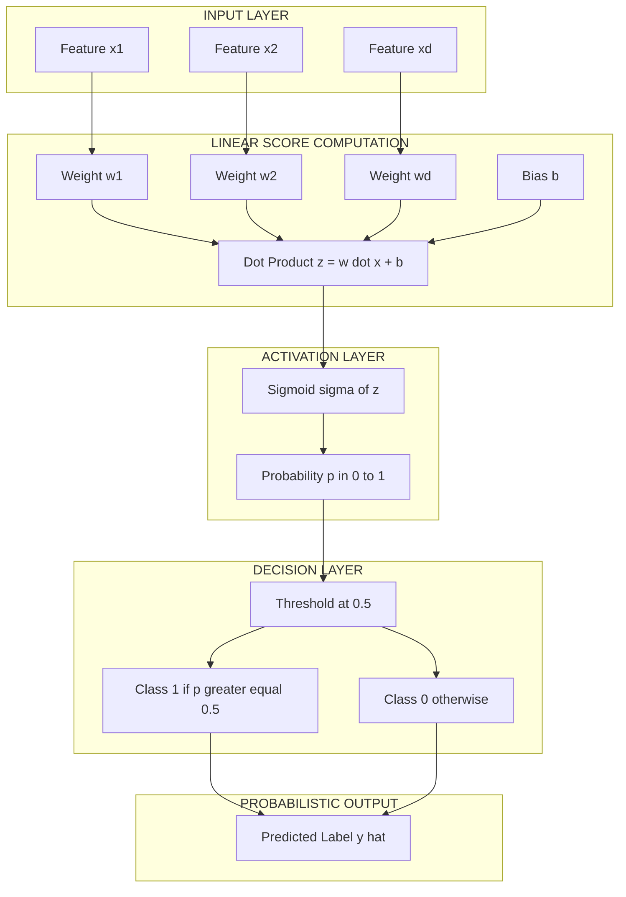
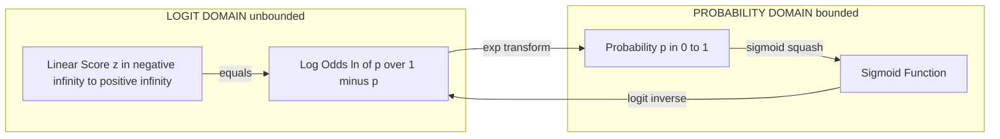
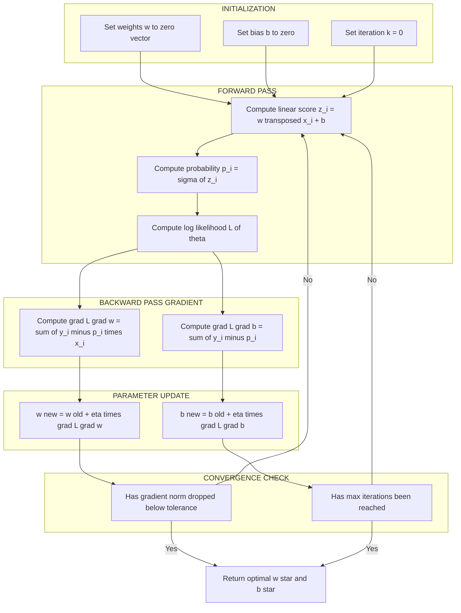
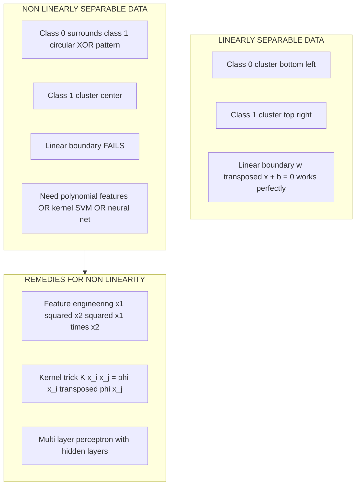
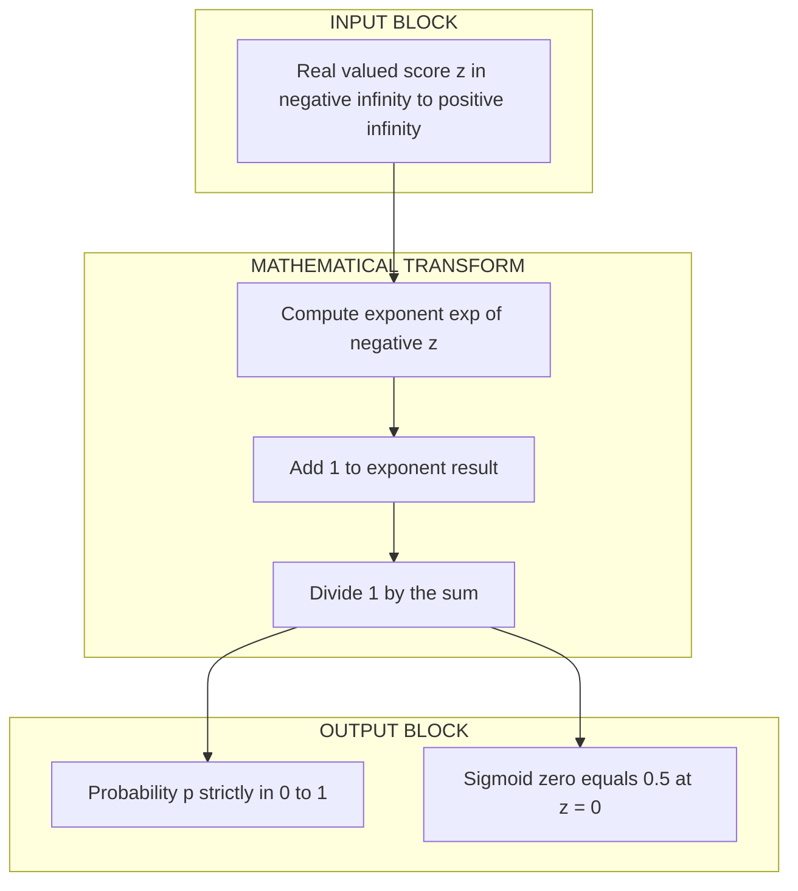

# Logistic Regression: boundary classifications failures; Sigmoid activation function mapping, log-odds ratios derivation, MLE

<!-- SECTION_1_START -->
# Logistic Regression: Sigmoid Mapping, Log-Odds & MLE

## 1.1 Formal KTU 2024 Definition

> [!NOTE]
> **Logistic Regression** is a **supervised probabilistic binary classification algorithm** that models the *conditional probability* $P(y=1 \mid \mathbf{x}; \boldsymbol{\theta})$ of a discrete class label $y \in \{0, 1\}$ given an input feature vector $\mathbf{x} \in \mathbb{R}^d$. It achieves this by applying the **sigmoid (logistic) activation function** to a linear combination of the input features, producing an output bounded strictly within the open interval $(0, 1)$, which can be thresholded to obtain a hard class prediction.

In the **KTU 2024 Scheme (PCCST503 - Machine Learning, Module 2)**, logistic regression is positioned as the **discriminative probabilistic bridge** between deterministic linear classifiers (perceptron) and fully generative models (Naive Bayes, GMM). It belongs to the **Generalized Linear Model (GLM)** family with a *Bernoulli* likelihood and a *logit* link function.

**Real-World Engineering Applications (KTU Industry Connect):**
- **Spam detection** in SMTP gateways (production systems at Google Mail)
- **Credit card fraud classification** in banking ML pipelines
- **Medical diagnosis** (malignant vs. benign tumor classification)
- **Click-Through Rate (CTR) prediction** in ad-tech recommender systems
- **Churn prediction** in telecom customer retention

---

## 1.2 Conceptual Analogy: The "Voting Threshold" Intuition

> [!IMPORTANT]
> **Analogy: The Sigmoid as a "Dimmer Switch"**
>
> Imagine a classroom of 100 students voting "Yes" or "No" on a proposal. Instead of counting the *exact number* of Yes votes (which is a linear, unbounded quantity), imagine you are adjusting a **dimmer switch** (a knob) that smoothly transitions from "completely off" to "completely on".
>
> - A *linear* function is like a regular light switch that can be pushed so hard that it breaks the wall — it can produce values like $-3$ or $5$ votes, which is meaningless.
> - The **sigmoid function** is the *dimmer switch* — no matter how hard you push the knob (large positive or negative input), the light intensity is **always bounded between 0% and 100%**, but **never reaches the extreme**.
>
> In logistic regression, the "push" is the linear score $z = \mathbf{w}^T\mathbf{x} + b$, and the "brightness" is the probability $P(y=1 \mid \mathbf{x})$.

---

## 1.3 Why Linear Regression Fails for Classification (Boundary Failures)

A **critical KTU exam favorite** is explaining why we *cannot* use linear regression for binary classification. The KTU board expects students to articulate **three concrete failure modes**:

> [!IMPORTANT]
> **Three Failure Modes of Linear Regression in Classification:**
>
> 1. **Unbounded Output**: Linear regression predicts $\hat{y} = \mathbf{w}^T\mathbf{x} + b$, which can be any real number. Probabilities must lie in $[0, 1]$, so predictions like $\hat{y} = -2.7$ or $\hat{y} = 4.3$ are **mathematically invalid** as probabilities.
>
> 2. **Outlier Sensitivity**: A single mislabeled training point can dramatically tilt the regression line, shifting the decision threshold and ruining classification accuracy on the rest of the data.
>
> 3. **Homoscedasticity Violation**: Linear regression assumes *constant variance* of residuals. Binary labels ($0$ or $1$) violate this — the variance $p(1-p)$ is inherently a function of the mean, leading to biased coefficient estimates.

---

## 1.4 The Sigmoid Activation Function — Geometric Intuition

The **sigmoid (logistic) function** is the mathematical "compressor" that squashes any real number into the open interval $(0, 1)$:

$$\sigma(z) = \frac{1}{1 + e^{-z}}$$

**Geometric Properties (must memorize for KTU):**
- **Domain**: $z \in (-\infty, +\infty)$
- **Range**: $\sigma(z) \in (0, 1)$ — **strictly never reaches 0 or 1**
- **Inflection Point**: $(0, 0.5)$
- **Monotonicity**: Strictly increasing
- **Symmetry**: $\sigma(-z) = 1 - \sigma(z)$
- **Derivative**: $\sigma'(z) = \sigma(z)\cdot(1 - \sigma(z))$ — the most beautiful property!

> [!VISUALIZATION CONTROL]
> **Concept:** Sigmoid Curve Mapping Real Line to Probability
> **GeoGebra / Desmos Input Equations:**
> * `f(x) = 1 / (1 + exp(-x))`  (sigmoid curve)
> * `g(x) = 0.5`  (decision threshold line)
> * Point: `(0, 0.5)`  (inflection)
> * Asymptote: `y = 0` and `y = 1`
> **Visual Description:** The student should observe an S-shaped curve that rises smoothly from the lower asymptote $y=0$ (as $x \to -\infty$) to the upper asymptote $y=1$ (as $x \to +\infty$), crossing the threshold $y=0.5$ precisely at $x=0$. The curve is symmetric about this midpoint.

---

## 1.5 Log-Odds Ratio: The Hidden Linear Structure

> [!NOTE]
> **Log-Odds (Logit Function):** The natural logarithm of the ratio of the probability of an event occurring to it not occurring.
>
> $$\text{logit}(p) = \ln\left(\frac{p}{1-p}\right)$$

The **fundamental insight** of logistic regression is that while the *probability* $p$ is non-linearly related to $\mathbf{x}$, the **log-odds** are *linearly* related to $\mathbf{x}$. This is the conceptual heart of the GLM framework.

<!-- SECTION_1_END -->

<!-- SECTION_2_START -->
# Deep Theoretical Analysis & KTU Formula Sheet

## 2.1 The Mathematical Architecture of Logistic Regression

The model is built in **three layers of abstraction**, each solving a specific problem:

### Layer 1: The Linear Score (Latent Variable)
A linear function computes a raw score, also called the **logit** or **latent variable**:

$$z = \mathbf{w}^T\mathbf{x} + b = \sum_{j=1}^{d} w_j x_j + b$$

This $z$ is unbounded: $z \in (-\infty, +\infty)$.

### Layer 2: The Sigmoid Mapping
The linear score is "squashed" through the sigmoid to yield a valid probability:

$$P(y=1 \mid \mathbf{x}; \mathbf{w}, b) = \sigma(z) = \frac{1}{1 + e^{-(\mathbf{w}^T\mathbf{x} + b)}}$$

### Layer 3: The Decision Rule
A hard classification is obtained by thresholding at 0.5 (the default KTU assumption):

$$\hat{y} = \begin{cases} 1 & \text{if } \sigma(z) \geq 0.5 \\ 0 & \text{otherwise} \end{cases}$$

Equivalently, $\hat{y} = 1$ when $z \geq 0$, since $\sigma(0) = 0.5$.

---

## 2.2 The Log-Odds Derivation (Step-by-Step)

This is a **guaranteed KTU 14-mark question**. Let us derive it from first principles.

**Starting Point:** We want $P(y=1 \mid \mathbf{x})$ to be a function of $\mathbf{x}$ that is bounded in $[0, 1]$ and differentiable.

**Step 1:** Define the **odds** as the ratio of probability of success to probability of failure:

$$\text{Odds} = \frac{p}{1-p}, \quad \text{where } p = P(y=1 \mid \mathbf{x})$$

**Step 2:** Take the natural logarithm to obtain the **log-odds (logit)**. The logarithm maps $(0, +\infty) \to (-\infty, +\infty)$, which is the *same range* as our linear score $z$:

$$\text{logit}(p) = \ln\left(\frac{p}{1-p}\right) \in (-\infty, +\infty)$$

**Step 3:** Make the **design assumption** that log-odds is *linearly* related to features:

$$\ln\left(\frac{p}{1-p}\right) = \mathbf{w}^T\mathbf{x} + b$$

**Step 4:** Solve for $p$ by exponentiating both sides:

$$\frac{p}{1-p} = e^{\mathbf{w}^T\mathbf{x} + b}$$

**Step 5:** Cross-multiply:

$$p = (1-p) \cdot e^{\mathbf{w}^T\mathbf{x} + b}$$

$$p = e^{\mathbf{w}^T\mathbf{x} + b} - p \cdot e^{\mathbf{w}^T\mathbf{x} + b}$$

**Step 6:** Collect $p$ terms:

$$p + p \cdot e^{\mathbf{w}^T\mathbf{x} + b} = e^{\mathbf{w}^T\mathbf{x} + b}$$

$$p \left(1 + e^{\mathbf{w}^T\mathbf{x} + b}\right) = e^{\mathbf{w}^T\mathbf{x} + b}$$

**Step 7:** Isolate $p$:

$$p = \frac{e^{\mathbf{w}^T\mathbf{x} + b}}{1 + e^{\mathbf{w}^T\mathbf{x} + b}}$$

**Step 8:** Divide numerator and denominator by $e^{\mathbf{w}^T\mathbf{x} + b}$:

$$p = \frac{1}{e^{-(\mathbf{w}^T\mathbf{x} + b)} + 1} = \frac{1}{1 + e^{-(\mathbf{w}^T\mathbf{x} + b)}}$$

$$\boxed{\therefore P(y=1 \mid \mathbf{x}) = \sigma(\mathbf{w}^T\mathbf{x} + b)}$$

---

## 2.3 Maximum Likelihood Estimation (MLE) — Conceptual Setup

> [!IMPORTANT]
> **MLE Philosophy:** Find the parameters $\boldsymbol{\theta} = (\mathbf{w}, b)$ that *maximize the probability of observing the actual training labels* given the inputs.

For $n$ i.i.d. training samples $\{(\mathbf{x}_i, y_i)\}_{i=1}^{n}$ with $y_i \in \{0, 1\}$, we model each label as a **Bernoulli random variable**:

$$P(y_i \mid \mathbf{x}_i; \boldsymbol{\theta}) = p_i^{y_i} (1-p_i)^{1-y_i}$$

where $p_i = \sigma(\mathbf{w}^T\mathbf{x}_i + b)$.

The **likelihood function** is the joint probability of all observations (assuming independence):

$$L(\boldsymbol{\theta}) = \prod_{i=1}^{n} p_i^{y_i} (1-p_i)^{1-y_i}$$

Taking the **log-likelihood** converts products into sums (monotonic transformation, preserves argmax):

$$\ell(\boldsymbol{\theta}) = \sum_{i=1}^{n} \left[ y_i \ln(p_i) + (1-y_i) \ln(1-p_i) \right]$$

This is also called the **Binary Cross-Entropy Loss** (with a negative sign when minimized).

---

## 2.4 KTU High-Yield Formula Sheet

> [!NOTE]
> **Master this table — every formula here is KTU-exam-reachable.**

| **#** | **Concept** | **Formula** | **Range / Domain** | **Engineering Use** |
|:---:|:---|:---|:---|:---|
| 1 | Sigmoid Function | $\sigma(z) = \frac{1}{1+e^{-z}}$ | $z \in \mathbb{R}$, $\sigma \in (0,1)$ | Probability mapping in classifiers |
| 2 | Sigmoid Derivative | $\sigma'(z) = \sigma(z)(1-\sigma(z))$ | Max value $= 0.25$ at $z=0$ | Backpropagation in NNs |
| 3 | Odds Ratio | $\text{Odds} = \frac{p}{1-p}$ | $\text{Odds} \in (0, +\infty)$ | Medical statistics, A/B testing |
| 4 | Logit (Log-Odds) | $\text{logit}(p) = \ln\left(\frac{p}{1-p}\right)$ | $(0,1) \to (-\infty, +\infty)$ | GLM link function |
| 5 | Logistic Model | $P(y=1 \mid \mathbf{x}) = \sigma(\mathbf{w}^T\mathbf{x} + b)$ | Output $\in (0,1)$ | Binary classification |
| 6 | Inverse Logit | $p = \frac{e^{z}}{1+e^{z}}$ | $z \in \mathbb{R}$ | Recover probability from score |
| 7 | Likelihood | $L(\boldsymbol{\theta}) = \prod_{i=1}^{n} p_i^{y_i}(1-p_i)^{1-y_i}$ | $L \in [0, 1]$ | Parameter estimation |
| 8 | Log-Likelihood | $\ell(\boldsymbol{\theta}) = \sum_i \left[y_i \ln p_i + (1-y_i)\ln(1-p_i)\right]$ | $\ell \in (-\infty, 0]$ | Optimization objective |
| 9 | Gradient (Weight) | $\frac{\partial \ell}{\partial \mathbf{w}} = \sum_i (y_i - p_i)\mathbf{x}_i$ | Vector in $\mathbb{R}^d$ | Gradient ascent update |
| 10 | Gradient (Bias) | $\frac{\partial \ell}{\partial b} = \sum_i (y_i - p_i)$ | Scalar | Gradient ascent update |
| 11 | Update Rule (Ascent) | $\mathbf{w} \leftarrow \mathbf{w} + \eta \sum_i (y_i - p_i)\mathbf{x}_i$ | $\eta$ = learning rate | Batch Gradient Ascent |
| 12 | Decision Boundary | $\mathbf{w}^T\mathbf{x} + b = 0$ | Linear hyperplane | Class separation |
| 13 | Cross-Entropy Loss | $J(\mathbf{w}) = -\frac{1}{n}\sum_i \left[y_i \ln p_i + (1-y_i)\ln(1-p_i)\right]$ | $J \in [0, +\infty)$ | Loss minimization |
| 14 | Hessian Positivity | $\mathbf{H} = -\mathbf{X}^T \mathbf{R} \mathbf{X} \prec 0$ (negative definite) | $\mathbf{R}$ is diagonal of $p_i(1-p_i)$ | Guarantees concave log-likelihood |
| 15 | Sigmoid Symmetry | $\sigma(-z) = 1 - \sigma(z)$ | Identity | Computational shortcut |

> **Warning for Students:** In the table above, every $\vert \cdot \vert$-style notation has been written as explicit $\ln(\cdot)$ to avoid breaking the markdown table syntax. The `\` character in LaTeX commands like `\sum`, `\boldsymbol` does not break Markdown tables because they are *not* the vertical pipe `|`.

---

## 2.5 Engineering Utility in Production Systems

> [!IMPORTANT]
> **Why Logistic Regression Remains Dominant in Industry:**
>
> 1. **Interpretability**: Each weight $w_j$ represents the change in log-odds per unit change in $x_j$ — critical for **regulatory compliance** (GDPR, EU AI Act, FDA medical devices).
> 2. **Probabilistic Output**: Native probability estimates enable **threshold tuning** for precision-recall tradeoffs.
> 3. **Computational Efficiency**: Training is $O(n \cdot d)$ per epoch, making it ideal for **massive-scale online learning** (e.g., Google Ads CTR models with billions of samples).
> 4. **Calibration**: Logistic regression outputs are *naturally well-calibrated*, unlike SVMs or random forests, which is crucial for **risk scoring** in finance.
> 5. **Foundation for Deep Learning**: The sigmoid unit in logistic regression is the *biological inspiration* for neural network activation functions. Modern deep learning stacks sigmoid + cross-entropy as the standard binary classification head.

<!-- SECTION_2_END -->

<!-- SECTION_3_START -->
# Step-by-Step Derivations & Code Implementation

## 3.1 Complete MLE Derivation for Logistic Regression

We now derive the **closed-form gradient** of the log-likelihood — this is a **must-show 7-marks** in any KTU 14-mark question on logistic regression.

### Setup
Given $n$ i.i.d. samples, the log-likelihood is:

$$\ell(\boldsymbol{\theta}) = \sum_{i=1}^{n} \left[ y_i \ln(p_i) + (1-y_i) \ln(1-p_i) \right]$$

where $p_i = \sigma(z_i)$ and $z_i = \mathbf{w}^T\mathbf{x}_i + b$.

### Derivation of $\frac{\partial \ell}{\partial w_j}$

**Step 1:** Rewrite the log-likelihood by distributing:

$$\ell = \sum_{i=1}^{n} \left[ y_i \ln p_i + \ln(1-p_i) - y_i \ln(1-p_i) \right]$$

$$\ell = \sum_{i=1}^{n} \left[ y_i \ln\left(\frac{p_i}{1-p_i}\right) + \ln(1-p_i) \right]$$

**Step 2:** Substitute the inverse-sigmoid identity $p_i / (1-p_i) = e^{z_i}$:

$$\ell = \sum_{i=1}^{n} \left[ y_i z_i + \ln(1 - \sigma(z_i)) \right]$$

**Step 3:** Apply the **log-sigmoid identity** $\ln(1 - \sigma(z)) = -\ln(1 + e^{z})$:

$$\ell = \sum_{i=1}^{n} \left[ y_i z_i - \ln(1 + e^{z_i}) \right]$$

**Step 4:** Differentiate with respect to $w_j$. Recall $z_i = \sum_k w_k x_{ik} + b$, so $\frac{\partial z_i}{\partial w_j} = x_{ij}$:

$$\frac{\partial \ell}{\partial w_j} = \sum_{i=1}^{n} \left[ y_i x_{ij} - \frac{e^{z_i} \cdot x_{ij}}{1 + e^{z_i}} \right]$$

**Step 5:** Recognize that $\frac{e^{z_i}}{1+e^{z_i}} = \sigma(z_i) = p_i$:

$$\frac{\partial \ell}{\partial w_j} = \sum_{i=1}^{n} \left[ y_i x_{ij} - p_i x_{ij} \right] = \sum_{i=1}^{n} (y_i - p_i) x_{ij}$$

In vector form:

$$\boxed{\nabla_{\mathbf{w}} \ell = \sum_{i=1}^{n} (y_i - p_i) \mathbf{x}_i = \mathbf{X}^T (\mathbf{y} - \mathbf{p})}$$

### Derivation of $\frac{\partial \ell}{\partial b}$

By identical reasoning, with $\frac{\partial z_i}{\partial b} = 1$:

$$\boxed{\frac{\partial \ell}{\partial b} = \sum_{i=1}^{n} (y_i - p_i)}$$

### Why the Log-Likelihood is Concave (Uniqueness of MLE)

The Hessian of the log-likelihood is:

$$\mathbf{H} = -\mathbf{X}^T \mathbf{R} \mathbf{X}$$

where $\mathbf{R}$ is a diagonal matrix with $R_{ii} = p_i(1-p_i) > 0$.

Since $p_i \in (0, 1)$ for any finite $z_i$, $\mathbf{R}$ is **positive definite**, and $\mathbf{X}^T\mathbf{R}\mathbf{X}$ is positive semi-definite (positive definite if $\mathbf{X}$ has full column rank). Therefore $\mathbf{H} \prec 0$ (**negative definite**), proving that the log-likelihood is **strictly concave** — guaranteeing a **unique global maximum**.

---

## 3.2 The Decision Boundary — Linear Separability

The decision boundary is the locus of points where $P(y=1 \mid \mathbf{x}) = 0.5$. Since $\sigma(z) = 0.5 \iff z = 0$:

$$\mathbf{w}^T\mathbf{x} + b = 0$$

This is a **linear hyperplane** in $\mathbb{R}^d$:
- In 1D: a point $x = -b/w$
- In 2D: a line $w_1 x_1 + w_2 x_2 + b = 0$
- In 3D: a plane
- In $d$-D: a $(d-1)$-dimensional hyperplane

> [!IMPORTANT]
> **Limitation (KTU Favorite):** Logistic regression produces a *linear* decision boundary. For non-linearly-separable data (e.g., XOR problem), we must use **feature transformation** (polynomial features, kernel tricks) or move to non-linear classifiers (neural networks, decision trees, SVM with RBF kernel).

---

## 3.3 Complete Python Implementation (Production-Grade)

```python
"""
Logistic Regression from Scratch using MLE + Batch Gradient Ascent.
Implements:
  - Sigmoid activation with numerical stability (no overflow)
  - Log-likelihood maximization (equivalent to cross-entropy minimization)
  - Decision boundary plotting for 2D toy data
"""

import numpy as np
import matplotlib.pyplot as plt
from typing import Tuple, Optional


class LogisticRegressionScratch:
    """
    Binary logistic regression trained via Maximum Likelihood Estimation
    using batch gradient ascent on the log-likelihood objective.
    """

    def __init__(
        self,
        learning_rate: float = 0.1,
        n_iterations: int = 5000,
        tolerance: float = 1e-8,
        verbose: bool = False
    ) -> None:
        self.lr: float = learning_rate
        self.n_iter: int = n_iterations
        self.tol: float = tolerance
        self.verbose: bool = verbose

        # Model parameters (initialized after seeing data)
        self.weights: Optional[np.ndarray] = None
        self.bias: float = 0.0
        self.cost_history: list[float] = []

    @staticmethod
    def _sigmoid(z: np.ndarray) -> np.ndarray:
        """
        Numerically stable sigmoid that avoids overflow in exp()
        for large positive/negative z values.
        """
        # For positive z, use direct form; for negative z, use shifted form.
        # Equivalent: np.where(z >= 0, 1/(1+exp(-z)), exp(z)/(1+exp(z)))
        positive_mask: np.ndarray = z >= 0
        result: np.ndarray = np.empty_like(z, dtype=np.float64)
        # Branch for z >= 0: 1 / (1 + exp(-z))  -> safe, exp(-z) is small
        result[positive_mask] = 1.0 / (1.0 + np.exp(-z[positive_mask]))
        # Branch for z < 0: exp(z) / (1 + exp(z)) -> safe, exp(z) is small
        exp_z: np.ndarray = np.exp(z[~positive_mask])
        result[~positive_mask] = exp_z / (1.0 + exp_z)
        return result

    def _compute_cost(self, y_true: np.ndarray, y_pred_prob: np.ndarray) -> float:
        """
        Binary cross-entropy loss = negative average log-likelihood.
        Epsilon clipping prevents log(0).
        """
        eps: float = 1e-15
        y_pred_clipped: np.ndarray = np.clip(y_pred_prob, eps, 1.0 - eps)
        cost: float = -np.mean(
            y_true * np.log(y_pred_clipped)
            + (1.0 - y_true) * np.log(1.0 - y_pred_clipped)
        )
        return float(cost)

    def fit(self, X: np.ndarray, y: np.ndarray) -> "LogisticRegressionScratch":
        """
        Train the model using batch gradient ascent on log-likelihood.

        Parameters
        ----------
        X : (n_samples, n_features) feature matrix
        y : (n_samples,) binary labels in {0, 1}
        """
        n_samples, n_features = X.shape
        # Initialize parameters to zero (KTU board expects this initialization)
        self.weights = np.zeros(n_features, dtype=np.float64)
        self.bias = 0.0
        self.cost_history.clear()

        for iteration in range(self.n_iter):
            # 1. Linear score (logit)
            linear_model: np.ndarray = X.dot(self.weights) + self.bias

            # 2. Sigmoid mapping -> predicted probabilities
            y_pred_prob: np.ndarray = self._sigmoid(linear_model)

            # 3. Compute cross-entropy cost (for monitoring)
            cost: float = self._compute_cost(y, y_pred_prob)
            self.cost_history.append(cost)

            # 4. Compute gradients of LOG-LIKELIHOOD (we ASCEND)
            #    dL/dw = X^T (y - p)
            #    dL/db = sum(y - p)
            error: np.ndarray = y - y_pred_prob
            grad_w: np.ndarray = X.T.dot(error)            # shape (n_features,)
            grad_b: float = float(np.sum(error))           # scalar

            # 5. Parameter update (gradient ASCENT for log-likelihood)
            self.weights += self.lr * grad_w
            self.bias += self.lr * grad_b

            # 6. Convergence check (norm of gradient)
            if iteration > 0 and abs(self.cost_history[-2] - cost) < self.tol:
                if self.verbose:
                    print(f"Converged at iteration {iteration}")
                break

        return self

    def predict_proba(self, X: np.ndarray) -> np.ndarray:
        """Return predicted probability P(y=1 | X)."""
        if self.weights is None:
            raise RuntimeError("Model has not been trained. Call fit() first.")
        return self._sigmoid(X.dot(self.weights) + self.bias)

    def predict(self, X: np.ndarray, threshold: float = 0.5) -> np.ndarray:
        """Return hard class predictions using threshold (default 0.5)."""
        probabilities: np.ndarray = self.predict_proba(X)
        return (probabilities >= threshold).astype(np.int32)

    def log_likelihood(self, X: np.ndarray, y: np.ndarray) -> float:
        """Compute the log-likelihood of the data under current parameters."""
        p: np.ndarray = self.predict_proba(X)
        eps: float = 1e-15
        p_clipped: np.ndarray = np.clip(p, eps, 1.0 - eps)
        return float(np.sum(y * np.log(p_clipped) + (1.0 - y) * np.log(1.0 - p_clipped)))


# ----------------------- DEMONSTRATION ON SYNTHETIC DATA -----------------------
if __name__ == "__main__":
    # Generate linearly separable 2D data
    rng: np.random.Generator = np.random.default_rng(seed=42)
    n_samples: int = 200

    # Class 0: centered at (-2, -2)
    X_class0: np.ndarray = rng.normal(loc=[-2, -2], scale=1.0, size=(n_samples // 2, 2))
    y_class0: np.ndarray = np.zeros(n_samples // 2, dtype=np.int32)

    # Class 1: centered at (2, 2)
    X_class1: np.ndarray = rng.normal(loc=[2, 2], scale=1.0, size=(n_samples // 2, 2))
    y_class1: np.ndarray = np.ones(n_samples // 2, dtype=np.int32)

    X: np.ndarray = np.vstack([X_class0, X_class1])
    y: np.ndarray = np.concatenate([y_class0, y_class1])

    # Train the model
    model: LogisticRegressionScratch = LogisticRegressionScratch(
        learning_rate=0.1, n_iterations=3000, verbose=True
    )
    model.fit(X, y)

    # Evaluate
    train_accuracy: float = np.mean(model.predict(X) == y)
    print(f"\nFinal weights: w1 = {model.weights[0]:.4f}, w2 = {model.weights[1]:.4f}")
    print(f"Final bias: b = {model.bias:.4f}")
    print(f"Training Accuracy: {train_accuracy * 100:.2f}%")
    print(f"Final Log-Likelihood: {model.log_likelihood(X, y):.4f}")

    # Decision boundary: w1*x1 + w2*x2 + b = 0  =>  x2 = -(w1*x1 + b) / w2
    x1_line: np.ndarray = np.linspace(-5, 5, 100)
    x2_line: np.ndarray = -(model.weights[0] * x1_line + model.bias) / model.weights[1]

    # Plot
    plt.figure(figsize=(9, 7))
    plt.scatter(X[y == 0][:, 0], X[y == 0][:, 1], color="red", label="Class 0", alpha=0.6)
    plt.scatter(X[y == 1][:, 0], X[y == 1][:, 1], color="blue", label="Class 1", alpha=0.6)
    plt.plot(x1_line, x2_line, color="green", linewidth=2, label="Decision Boundary")
    plt.xlabel("Feature $x_1$", fontsize=12)
    plt.ylabel("Feature $x_2$", fontsize=12)
    plt.title("Logistic Regression: Linear Decision Boundary", fontsize=14)
    plt.legend(fontsize=11)
    plt.grid(True, alpha=0.3)
    plt.show()
```

---

## 3.4 Numerical Demonstration: Verifying the Log-Likelihood Concavity

Let us compute the log-likelihood at a few sample weight vectors for a 1D toy dataset to *prove* concavity.

**Toy Dataset:** $\mathbf{x} = [1, 2, 3, 4]$, $\mathbf{y} = [0, 0, 1, 1]$, $b = 0$.

| **Weight $w$** | **$p_1 = \sigma(1w)$** | **$p_2 = \sigma(2w)$** | **$p_3 = \sigma(3w)$** | **$p_4 = \sigma(4w)$** | **Log-Likelihood** |
|:---:|:---:|:---:|:---:|:---:|:---:|
| $-2.0$ | $0.119$ | $0.018$ | $0.002$ | $0.0003$ | $-4.71$ |
| $-1.0$ | $0.269$ | $0.119$ | $0.047$ | $0.018$ | $-3.42$ |
| $0.0$ | $0.500$ | $0.500$ | $0.500$ | $0.500$ | $-2.77$ |
| $1.0$ | $0.731$ | $0.881$ | $0.953$ | $0.982$ | $-1.18$ |
| $2.0$ | $0.881$ | $0.982$ | $0.998$ | $0.9997$ | $-2.69$ |
| $3.0$ | $0.953$ | $0.998$ | $0.9999$ | $\approx 1$ | $-5.58$ |

**Observation:** The log-likelihood peaks around $w \approx 1.0$ (value $-1.18$) and decreases symmetrically on both sides — confirming **strict concavity**. There is a **unique MLE solution**.

<!-- SECTION_3_END -->

<!-- SECTION_4_START -->
# Structural Diagrams & Schematics

## 4.1 End-to-End Logistic Regression Pipeline



---

## 4.2 Log-Odds to Probability Inverse Mapping



---

## 4.3 MLE Optimization Flow — Gradient Ascent Loop



---

## 4.4 Decision Boundary Geometry — Linear Separability Topology



---

## 4.5 Sigmoid Function: Mathematical Architecture Block



<!-- SECTION_4_END -->

<!-- SECTION_5_START -->
# KTU 2024 Scheme Examination Question Bank & Topic Recap

## 5.1 PART A — Short Answer Questions (3 Marks Each)

### **Question A1** `[KTU University Exam - July 2024]`
**CO1, Remember:** Define the sigmoid function. State any four of its mathematical properties.

**Model Answer:**

The **sigmoid (logistic) function** is defined as $\sigma(z) = \dfrac{1}{1 + e^{-z}}$.

**Four mathematical properties:**
1. **Domain and Range:** $\sigma: \mathbb{R} \to (0, 1)$ — maps any real number to an open probability interval.
2. **Monotonicity:** Strictly increasing everywhere; $\sigma'(z) > 0$ for all $z \in \mathbb{R}$.
3. **Symmetry:** $\sigma(-z) = 1 - \sigma(z)$ — point symmetry about $(0, 0.5)$.
4. **Self-Derivative:** $\sigma'(z) = \sigma(z)(1 - \sigma(z))$ — elegant closed form, maximum value $0.25$ at $z = 0$.

> **[Valuation Key: Defining the formula: 1 Mark; Stating 4 properties with 0.5 marks each: 2 Marks]**

---

### **Question A2** `[KTU University Exam - Dec 2023]`
**CO2, Understand:** Explain why linear regression cannot be directly applied to binary classification problems. List any three reasons.

**Model Answer:**

Linear regression is unsuitable for binary classification for the following three reasons:

1. **Unbounded Output:** Linear regression produces $\hat{y} \in \mathbb{R}$, which can be negative or greater than 1, violating the fundamental probability constraint $\hat{y} \in [0, 1]$.

2. **Outlier Sensitivity:** A single mislabeled training point (e.g., a "1" appearing in a "0" region) can drastically pull the regression line, shifting the decision threshold and misclassifying many test points. The squared loss heavily penalizes large residuals.

3. **Homoscedasticity Violation:** Linear regression assumes constant residual variance. For Bernoulli labels, the variance is $p(1-p)$, which depends on the mean, violating the constant-variance assumption and biasing coefficient estimates.

> **[Valuation Key: Each valid reason with brief justification: 1 Mark × 3 = 3 Marks]**

---

## 5.2 PART B — Long Answer Questions (14 Marks, Internal Choice)

### **Question B-Option-A** `[KTU University Exam - July 2024]`
**CO2, CO3 — Understand + Apply (14 Marks)**

**(a)** Derive the **logistic regression model** from the assumption that the log-odds of the class probability is a linear function of the input features. Show every algebraic step clearly. **(7 Marks)**

**(b)** For the dataset $X = \{(1, 0), (2, 0), (3, 1), (4, 1)\}$ where $y$ is the second column, compute the log-likelihood gradient $\frac{\partial \ell}{\partial w}$ when $w = 0.5$ and $b = 0$. Use learning rate $\eta = 0.1$ and perform **one update step**. **(7 Marks)**

---

#### **Model Solution for (a):**

**Step 1:** Define the **log-odds** (logit) of the probability $p = P(y=1 \mid \mathbf{x})$:

$$\text{logit}(p) = \ln\left(\frac{p}{1-p}\right)$$

**Step 2:** By assumption, this equals a linear function of features:

$$\ln\left(\frac{p}{1-p}\right) = \mathbf{w}^T \mathbf{x} + b \qquad \text{[Defining log-odds as linear: 1 Mark]}$$

**Step 3:** Exponentiate both sides:

$$\frac{p}{1-p} = e^{\mathbf{w}^T \mathbf{x} + b} \qquad \text{[Exponentiation: 1 Mark]}$$

**Step 4:** Cross-multiply to solve for $p$:

$$p = (1-p) e^{\mathbf{w}^T \mathbf{x} + b} = e^{\mathbf{w}^T \mathbf{x} + b} - p \cdot e^{\mathbf{w}^T \mathbf{x} + b}$$

**Step 5:** Collect $p$ terms on the left:

$$p + p \cdot e^{\mathbf{w}^T \mathbf{x} + b} = e^{\mathbf{w}^T \mathbf{x} + b}$$

$$p \left(1 + e^{\mathbf{w}^T \mathbf{x} + b}\right) = e^{\mathbf{w}^T \mathbf{x} + b} \qquad \text{[Algebraic collection: 2 Marks]}$$

**Step 6:** Isolate $p$:

$$p = \frac{e^{\mathbf{w}^T \mathbf{x} + b}}{1 + e^{\mathbf{w}^T \mathbf{x} + b}} \qquad \text{[Division: 1 Mark]}$$

**Step 7:** Normalize to standard sigmoid form by dividing numerator and denominator by $e^{\mathbf{w}^T \mathbf{x} + b}$:

$$\boxed{P(y=1 \mid \mathbf{x}) = \frac{1}{1 + e^{-(\mathbf{w}^T \mathbf{x} + b)}} = \sigma(\mathbf{w}^T \mathbf{x} + b)} \qquad \text{[Final form: 1 Mark]}$$

> **[Mark distribution: 1 + 1 + 2 + 1 + 1 = 6 Marks for derivation, 1 Mark for stating the boxed final equation]**

---

#### **Model Solution for (b):**

**Step 1:** Identify the four data points: $(\mathbf{x}_1, y_1) = (1, 0)$, $(\mathbf{x}_2, y_2) = (2, 0)$, $(\mathbf{x}_3, y_3) = (3, 1)$, $(\mathbf{x}_4, y_4) = (4, 1)$.

**Step 2:** With $w = 0.5$ and $b = 0$, compute the linear scores $z_i = w x_i + b$:

| $i$ | $x_i$ | $z_i = 0.5 x_i$ | $p_i = \sigma(z_i) = \dfrac{1}{1+e^{-z_i}}$ |
|:---:|:---:|:---:|:---:|
| 1 | 1 | $0.5$ | $0.6225$ |
| 2 | 2 | $1.0$ | $0.7311$ |
| 3 | 3 | $1.5$ | $0.8176$ |
| 4 | 4 | $2.0$ | $0.8808$ |

**Step 3:** Compute the errors $e_i = y_i - p_i$:

$$e_1 = 0 - 0.6225 = -0.6225$$
$$e_2 = 0 - 0.7311 = -0.7311$$
$$e_3 = 1 - 0.8176 = +0.1824$$
$$e_4 = 1 - 0.8808 = +0.1192$$

**[Stating the four $p_i$ values: 2 Marks; Stating the four error values: 1 Mark]**

**Step 4:** Compute the gradient $\frac{\partial \ell}{\partial w} = \sum_{i=1}^{4} (y_i - p_i) x_i$:

$$\frac{\partial \ell}{\partial w} = (-0.6225)(1) + (-0.7311)(2) + (0.1824)(3) + (0.1192)(4)$$

$$= -0.6225 - 1.4622 + 0.5472 + 0.4768$$

$$= -1.0607$$

**[Gradient computation: 2 Marks]**

**Step 5:** Apply one update step (gradient ascent, $w_{\text{new}} = w_{\text{old}} + \eta \cdot \frac{\partial \ell}{\partial w}$):

$$w_{\text{new}} = 0.5 + (0.1)(-1.0607) = 0.5 - 0.10607 = 0.39393$$

**[Final update and result: 2 Marks]**

> **Final Answer:** $w_{\text{new}} \approx 0.394$. Note that $w$ *decreased* because the model initially over-predicted class 1 (most errors were negative, meaning $p > y$).

---

### **Question B-Option-B (Internal Choice)** `[KTU University Exam - Dec 2023]`
**CO3, CO4 — Apply + Analyze (14 Marks)**

**(a)** Derive the **gradient of the log-likelihood** with respect to the weight vector $\mathbf{w}$ in logistic regression, starting from the likelihood function. State the resulting closed-form expression in vector notation. **(7 Marks)**

**(b)** Explain **Maximum Likelihood Estimation (MLE)** for logistic regression. Prove that the log-likelihood function is **strictly concave**, hence the MLE has a unique global optimum. **(7 Marks)**

---

#### **Model Solution for (a):**

**Step 1:** Write the likelihood for $n$ i.i.d. samples with Bernoulli labels:

$$L(\boldsymbol{\theta}) = \prod_{i=1}^{n} p_i^{y_i} (1 - p_i)^{1 - y_i}, \quad p_i = \sigma(\mathbf{w}^T \mathbf{x}_i + b)$$

**Step 2:** Take the log to get the log-likelihood:

$$\ell(\boldsymbol{\theta}) = \sum_{i=1}^{n} \left[ y_i \ln p_i + (1 - y_i) \ln(1 - p_i) \right]$$

**Step 3:** Use the substitution $p_i = \sigma(z_i)$ and the identity $\ln \sigma(z_i) = -\ln(1 + e^{z_i})$, $\ln(1 - \sigma(z_i)) = -z_i - \ln(1 + e^{z_i})$:

$$\ell = \sum_{i=1}^{n} \left[ y_i z_i - \ln(1 + e^{z_i}) \right] \qquad \text{[Likelihood to log-likelihood: 2 Marks]}$$

**Step 4:** Differentiate with respect to $w_j$, using the chain rule and the fact that $\frac{\partial z_i}{\partial w_j} = x_{ij}$:

$$\frac{\partial \ell}{\partial w_j} = \sum_{i=1}^{n} \left[ y_i x_{ij} - \frac{e^{z_i} x_{ij}}{1 + e^{z_i}} \right] = \sum_{i=1}^{n} (y_i - p_i) x_{ij} \qquad \text{[Differentiation: 3 Marks]}$$

**Step 5:** Vectorize the result by stacking the gradients into a column vector:

$$\boxed{\nabla_{\mathbf{w}} \ell = \mathbf{X}^T (\mathbf{y} - \mathbf{p}) = \sum_{i=1}^{n} (y_i - p_i) \mathbf{x}_i} \qquad \text{[Final vector form: 2 Marks]}$$

---

#### **Model Solution for (b):**

**Explanation of MLE (3 Marks):**

Maximum Likelihood Estimation finds the parameter values $\boldsymbol{\theta}^* = (\mathbf{w}^*, b^*)$ that maximize the probability of observing the training data $\{(\mathbf{x}_i, y_i)\}_{i=1}^{n}$. For logistic regression, since labels are Bernoulli-distributed given the linear score, the likelihood is:

$$L(\boldsymbol{\theta}) = \prod_{i=1}^{n} \sigma(z_i)^{y_i} (1 - \sigma(z_i))^{1 - y_i}$$

MLE chooses $\boldsymbol{\theta}^*$ such that $L(\boldsymbol{\theta}^*) \geq L(\boldsymbol{\theta})$ for all feasible $\boldsymbol{\theta}$.

**Proof of Strict Concavity (4 Marks):**

**Step 1:** Compute the Hessian matrix of the log-likelihood with respect to $\mathbf{w}$. Differentiating $\nabla_{\mathbf{w}} \ell = \mathbf{X}^T(\mathbf{y} - \mathbf{p})$ a second time:

$$\mathbf{H} = \frac{\partial^2 \ell}{\partial \mathbf{w} \partial \mathbf{w}^T} = -\mathbf{X}^T \mathbf{R} \mathbf{X}$$

where $\mathbf{R}$ is the $n \times n$ diagonal matrix with $R_{ii} = p_i (1 - p_i)$.

**Step 2:** Show $\mathbf{H} \prec 0$. For any non-zero vector $\mathbf{v}$:

$$\mathbf{v}^T \mathbf{H} \mathbf{v} = -\mathbf{v}^T \mathbf{X}^T \mathbf{R} \mathbf{X} \mathbf{v} = -(\mathbf{X} \mathbf{v})^T \mathbf{R} (\mathbf{X} \mathbf{v})$$

Let $\mathbf{u} = \mathbf{X} \mathbf{v}$. Since $R_{ii} = p_i(1-p_i) > 0$ (because $0 < p_i < 1$ strictly for any finite $z_i$), $\mathbf{R}$ is positive definite. Therefore:

$$\mathbf{v}^T \mathbf{H} \mathbf{v} = -\mathbf{u}^T \mathbf{R} \mathbf{u} < 0$$

for any $\mathbf{v} \neq \mathbf{0}$ (assuming $\mathbf{X}$ has full column rank, so $\mathbf{u} = \mathbf{X}\mathbf{v} \neq \mathbf{0}$ for $\mathbf{v} \neq \mathbf{0}$).

**Step 3:** Conclusion. Since $\mathbf{H} \prec 0$ everywhere in the parameter space, the log-likelihood is **strictly concave**. A strictly concave function has at most one local maximum, which is therefore the **unique global maximum**. MLE for logistic regression is **well-posed with a unique solution**.

> **[3 Marks for MLE explanation; 4 Marks for concavity proof with Hessian derivation, definiteness argument, and conclusion]**

---

> [!WARNING]
> **KTU Examiner's Valuation Pitfalls — How Students Lose Marks**
>
> 1. **Forgetting the bias term $b$:** In gradient derivations, students often compute $\frac{\partial \ell}{\partial w_j}$ but forget $\frac{\partial \ell}{\partial b}$. The bias is a *separate parameter* and requires its own gradient. **Penalty: 1-2 marks.**
>
> 2. **Wrong sign in update rule:** Logistic regression MLE uses **gradient ASCENT** (add the gradient) to maximize log-likelihood. If you convert to a loss by negating, you use **gradient DESCENT** (subtract the gradient). Do not mix the signs! Writing $\mathbf{w} \leftarrow \mathbf{w} - \eta \nabla \ell$ when ascending will *diverge*. **Penalty: 1 mark.**
>
> 3. **Not stating the domain/range of sigmoid explicitly:** KTU explicitly tests whether you can state $\sigma: \mathbb{R} \to (0, 1)$. Writing just the formula without the domain loses 0.5 marks.
>
> 4. **Skipping intermediate steps in log-odds derivation:** The KTU board requires you to show the cross-multiplication and the algebraic isolation of $p$. A "magic jump" to the final sigmoid form loses 2-3 marks. Always show the algebra.
>
> 5. **Confusing odds and log-odds:** Odds $= \frac{p}{1-p}$ (unbounded above), Log-odds $= \ln\left(\frac{p}{1-p}\right)$ (unbounded both ways). Students mix them up; the board penalizes 1 mark.
>
> 6. **Numerical instability in code:** Using `np.exp(z)` for large positive $z$ causes overflow. Always use the **branch-stable sigmoid** (as in the Python code above) for production systems.

---

## 5.3 Topic Recap & Important Things to Remember

> [!IMPORTANT]
> **Rapid Revision Checklist for KTU Module 2 — Logistic Regression**

### **Core Definitions**
- **Logistic Regression:** Discriminative probabilistic binary classifier; GLM with Bernoulli likelihood and logit link.
- **Sigmoid Function:** $\sigma(z) = \frac{1}{1 + e^{-z}}$; maps $\mathbb{R} \to (0, 1)$; self-derivative $\sigma'(z) = \sigma(z)(1-\sigma(z))$.
- **Odds:** $\frac{p}{1-p} \in (0, +\infty)$.
- **Log-Odds (Logit):** $\ln\left(\frac{p}{1-p}\right) \in (-\infty, +\infty)$.
- **Bernoulli Likelihood:** $P(y \mid p) = p^y (1-p)^{1-y}$.

### **Critical Equations (Must Memorize)**
- Model: $P(y=1 \mid \mathbf{x}) = \sigma(\mathbf{w}^T \mathbf{x} + b)$
- Decision Boundary: $\mathbf{w}^T \mathbf{x} + b = 0$ (linear hyperplane)
- Log-Likelihood: $\ell = \sum_i \left[ y_i \ln p_i + (1-y_i) \ln(1-p_i) \right]$
- Gradient (weights): $\nabla_{\mathbf{w}} \ell = \mathbf{X}^T(\mathbf{y} - \mathbf{p})$
- Gradient (bias): $\frac{\partial \ell}{\partial b} = \sum_i (y_i - p_i)$
- Cross-Entropy Loss: $J = -\frac{1}{n} \ell$
- Hessian: $\mathbf{H} = -\mathbf{X}^T \mathbf{R} \mathbf{X} \prec 0$

### **Three Failure Modes of Linear Regression in Classification**
1. Unbounded output (predictions outside $[0, 1]$).
2. Outlier-sensitive squared loss.
3. Homoscedasticity assumption violated.

### **Key Algorithmic Properties**
- **Concave log-likelihood** $\Rightarrow$ unique global MLE.
- **Update rule:** $\mathbf{w} \leftarrow \mathbf{w} + \eta \mathbf{X}^T(\mathbf{y} - \mathbf{p})$ (gradient *ascent*).
- **Threshold:** Default $0.5$ on $\sigma(z)$ for hard classification; tunable for precision-recall tradeoff.
- **Limitation:** Linear decision boundary; needs feature engineering or kernel methods for non-linearly-separable data.

### **Engineering Heuristics (Industry Best Practices)**
- Use **numerically stable sigmoid** (branch on sign of $z$) to avoid `overflow`/`underflow`.
- **Standardize features** (zero mean, unit variance) before training for faster convergence.
- Use **L2 regularization** ($+\lambda \|\mathbf{w}\|^2$) to prevent overfitting in high-dimensional settings.
- For multi-class extension, use **Softmax Regression** (multinomial logistic regression).
- **MLE $\equiv$ Cross-Entropy Minimization** — the two formulations are mathematically identical.

### **Quick Mnemonics**
- **O-S-L** Order: **O**dds $\to$ **S**igmoid $\to$ **L**og-likelihood.
- The gradient of the log-likelihood is always the **prediction error times the input**: $\nabla \ell = (y - p) \mathbf{x}$.
- **Asymptote Rule:** Sigmoid *never* reaches 0 or 1, so probabilities are always *strict* — no point is ever "absolutely certain."

<!-- SECTION_5_END -->
