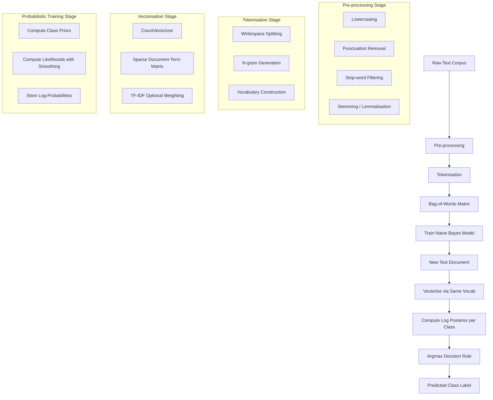
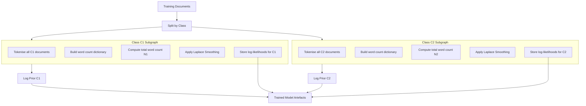

# Naive Bayes Classifiers: Algorithmic structures, text tokenization, extraction using Bag-of-Words/Count vectorizations

<!-- SECTION_1_START -->

# Naive Bayes Classifiers — Algorithmic Structures & Text Feature Extraction

## 1.1 Formal Definition (KTU 2024 Syllabus Terminology)

**Naive Bayes Classifier** is a family of probabilistic machine learning algorithms rooted in **Bayes' Theorem** that apply the simplifying assumption of **conditional independence** between every pair of features given the value of the class label. Formally, for a feature vector $\mathbf{x} = (x_1, x_2, \dots, x_n)$ and class variable $y \in \{C_1, C_2, \dots, C_k\}$, the classifier estimates the posterior probability:

$$
P(y \mid \mathbf{x}) = \frac{P(y) \cdot \prod_{i=1}^{n} P(x_i \mid y)}{P(\mathbf{x})}
$$

Because $P(\mathbf{x})$ is constant across all classes for a given input, the decision rule reduces to picking the class that **maximises the numerator**.

> [!IMPORTANT]
> **KTU 2024 Module 2 Highlight:** The classifier is termed *"naive"* because it **naively assumes feature independence**, which is rarely true in real-world data (e.g., the words "machine" and "learning" co-occur frequently). Despite this unrealistic assumption, Naive Bayes remains a **strong baseline** in text classification, spam filtering, and sentiment analysis, often outperforming more sophisticated models on small datasets.

---

## 1.2 Conceptual Analogy & Intuition

Imagine you walk into a fruit market and see a fruit that is **round**, **red**, and has a **diameter of about 8 cm**. You have never seen this exact fruit before. Your brain performs Naive Bayes subconsciously:

1. **Prior Belief $P(y)$:** What is the *base rate* of apples versus tomatoes in the world? Apples are far more common, so $P(\text{apple}) \gg P(\text{tomato})$.
2. **Likelihood $P(x_i \mid y)$:** Given the fruit is an apple, how probable is it to be red? Very high. Given the fruit is a tomato, how probable is it to have an 8 cm diameter? Low.
3. **Posterior $P(y \mid \mathbf{x})$:** Multiply everything and normalise — your brain says *"this is almost certainly an apple."*

The **"naive"** shortcut: your brain treats *roundness*, *redness*, and *diameter* as **independent** clues, when in reality they are correlated. The algorithm does the exact same arithmetic, only with formal numbers and many more features.

> [!NOTE]
> **Key Probabilistic Terms Every KTU Student Must Memorise:**
> - **Prior $P(y)$** — Probability of a class *before* observing evidence.
> - **Likelihood $P(x_i \mid y)$** — Probability of observing feature $x_i$ given the class.
> - **Posterior $P(y \mid x)$** — Updated probability of the class *after* observing evidence.
> - **Evidence $P(x)$** — Marginal probability of the observation (acts as a normaliser).

---

## 1.3 The Bayes' Theorem Foundation

Bayes' Theorem, named after Reverend **Thomas Bayes (1701–1761)**, is the cornerstone of probabilistic inference. It mathematically inverts conditional probabilities:

$$
P(A \mid B) = \frac{P(B \mid A) \cdot P(A)}{P(B)}
$$

In the classification context, replace $A$ with the class $y$ and $B$ with the feature vector $\mathbf{x}$:

$$
P(y \mid \mathbf{x}) = \frac{P(\mathbf{x} \mid y) \cdot P(y)}{P(\mathbf{x})}
$$

> [!TIP]
> **Engineering Utility:** Naive Bayes powers real-world systems such as Gmail's spam filter, document categorisation in legal-tech, real-time sentiment dashboards for brand monitoring, and even medical diagnosis tools where the goal is a *fast*, *interpretable*, and *probabilistically grounded* decision.

---

## 1.4 GeoGebra / Desmos Visualisation Block

> [!VISUALIZATION CONTROL]
> **Concept:** Visualising how prior and likelihood combine to form the posterior probability of class $C_1$ vs $C_2$ for a continuous feature $x$.
> **GeoGebra / Desmos Input Equations:**
> * `f(x) = 0.6 * exp(-((x-2)^2)/(2*1^2))`  *(Likelihood P(x|C1))*
> * `g(x) = 0.4 * exp(-((x-6)^2)/(2*1.5^2))`  *(Likelihood P(x|C2))*
> * `h(x) = (0.5 * f(x)) / (0.5 * f(x) + 0.5 * g(x))`  *(Posterior P(C1|x) with equal priors)*
> * `k(x) = (0.8 * f(x)) / (0.8 * f(x) + 0.2 * g(x))`  *(Posterior P(C1|x) with skewed priors)*
> **Visual Description:** Two overlapping Gaussian likelihoods (f and g) for classes $C_1$ and $C_2$. The curves $h(x)$ and $k(x)$ represent posterior probabilities. Notice how the **decision boundary** (where both posteriors = 0.5) shifts depending on the prior — class imbalance directly changes classification behaviour.

---

<!-- SECTION_1_END -->

<!-- SECTION_2_START -->

# Deep Theoretical Analysis & KTU High-Yield Formula Sheet

## 2.1 Why the Algorithm is "Naive" — The Conditional Independence Assumption

The joint probability $P(\mathbf{x} \mid y) = P(x_1, x_2, \dots, x_n \mid y)$ is intractable to estimate directly because it requires modelling the full distribution over all possible feature combinations. The **naive** assumption states:

$$
P(x_1, x_2, \dots, x_n \mid y) = \prod_{i=1}^{n} P(x_i \mid y)
$$

This means each feature $x_i$ is **conditionally independent** of every other feature $x_j$ given the class $y$. While rarely true, this drastically reduces the number of parameters from $O(k \cdot \vert V \vert^n)$ to $O(k \cdot n \cdot \vert V \vert)$, making training and inference extremely fast.

---

## 2.2 The Three Canonical Variants of Naive Bayes

### 2.2.1 Multinomial Naive Bayes (MNB)
- **Use case:** Text classification, document categorisation.
- **Assumption:** Feature vectors represent **term frequencies** (counts of words).
- **Likelihood model:** Multinomial distribution over the vocabulary.
- **Equation:**
$$
P(x_i \mid y) = \frac{\text{count of word } i \text{ in class } y + \alpha}{\text{total word count in class } y + \alpha \cdot \vert V \vert}
$$
where $\alpha$ is the **Laplace smoothing** parameter and $\vert V \vert$ is the vocabulary size.

### 2.2.2 Bernoulli Naive Bayes (BNB)
- **Use case:** Binary/boolean feature classification (word presence/absence).
- **Assumption:** Features are independent booleans.
- **Equation:**
$$
P(x_i = 1 \mid y) = \frac{\text{count of documents in class } y \text{ containing word } i + \alpha}{\text{count of documents in class } y + 2\alpha}
$$

### 2.2.3 Gaussian Naive Bayes (GNB)
- **Use case:** Continuous numerical features (e.g., Iris dataset, sensor data).
- **Assumption:** Likelihood of features is **Gaussian**.
- **Equation:**
$$
P(x_i \mid y) = \frac{1}{\sqrt{2\pi\sigma_y^2}} \cdot \exp\!\left(-\frac{(x_i - \mu_y)^2}{2\sigma_y^2}\right)
$$
where $\mu_y$ and $\sigma_y^2$ are the class-conditional mean and variance estimated via **Maximum Likelihood Estimation (MLE)**.

> [!NOTE]
> **KTU Exam Favourite:** The **Multinomial Naive Bayes** variant is most frequently tested in KTU 2024 Machine Learning papers because the syllabus explicitly targets text tokenisation and count vectorisation.

---

## 2.3 The Zero-Frequency Problem & Laplace Smoothing

If a word never appears in a class during training, $P(x_i \mid y) = 0$. Since the final product $\prod P(x_i \mid y)$ contains this term, the **entire posterior becomes zero** regardless of other strong evidence. This is the **zero-frequency problem**.

**Solution — Laplace (Add-One) Smoothing:**
$$
P_{\text{smoothed}}(x_i \mid y) = \frac{\text{count}(x_i, y) + \alpha}{\sum_{j} \text{count}(x_j, y) + \alpha \cdot \vert V \vert}
$$

Generalising, **Lidstone smoothing** uses $\alpha \in (0, 1]$ (typically $\alpha = 1$ for Laplace).

---

## 2.4 Log-Space Computation for Numerical Stability

Multiplying many small probabilities (e.g., $10^{-5} \times 10^{-7} \times 10^{-9}$) causes **arithmetic underflow** in floating-point hardware. The standard KTU-approved remedy is to take the **logarithm** of the posterior:

$$
\hat{y} = \arg\max_y \left[ \log P(y) + \sum_{i=1}^{n} \log P(x_i \mid y) \right]
$$

Logarithms convert products into sums, and the $\arg\max$ is preserved because $\log$ is a monotonically increasing function.

---

## 2.5 KTU High-Yield Formula Sheet

| **Concept** | **Formula** | **Where Used** | **Notes** |
|---|---|---|---|
| Bayes' Theorem | $P(y\mid x) = \dfrac{P(x\mid y) \cdot P(y)}{P(x)}$ | Core inference | $P(x)$ is the **normaliser** |
| Naive Bayes Posterior | $P(y\mid \mathbf{x}) \propto P(y) \prod_i P(x_i \mid y)$ | Prediction step | Drop the denominator (constant across classes) |
| MLE for Mean | $\hat{\mu}_y = \dfrac{1}{N_y} \sum_{x \in y} x$ | Gaussian NB | $N_y$ = samples in class $y$ |
| MLE for Variance | $\hat{\sigma}_y^2 = \dfrac{1}{N_y} \sum_{x \in y} (x - \hat{\mu}_y)^2$ | Gaussian NB | Unbiased estimate uses $N_y - 1$ |
| Multinomial Likelihood | $P(x_i \mid y) = \dfrac{\text{count}(i, y) + \alpha}{N_y + \alpha \vert V \vert}$ | Text classification | $\vert V \vert$ = vocabulary size |
| Bernoulli Likelihood | $P(x_i = 1 \mid y) = \dfrac{n_{iy} + \alpha}{N_y + 2\alpha}$ | Boolean features | Denominator is $N_y + 2\alpha$ |
| Laplace Smoothing | $\alpha = 1$ (default) | Avoid zero probability | Lidstone: $\alpha \in (0,1]$ |
| Log-Space Decision | $\hat{y} = \arg\max_y \left[\log P(y) + \sum_i \log P(x_i \mid y)\right]$ | Numerical stability | Prevents underflow |
| Class Prior | $P(y) = \dfrac{N_y}{N}$ | All variants | $N$ = total training samples |
| MAP Estimate | $\hat{y} = \arg\max_y P(y \mid \mathbf{x})$ | Final prediction | MAP = Maximum A Posteriori |

---

## 2.6 Real-World Engineering & Production Use-Cases

| **Domain** | **Application** | **Why Naive Bayes Works** |
|---|---|---|
| Email Gateways | Spam vs Ham filtering | Bag-of-words assumption holds reasonably; very fast |
| Healthcare | Disease risk screening from symptoms | Probabilistic output aids threshold tuning |
| Finance | Credit scoring with categorical features | Handles mixed data well; interpretable |
| NLP Pipelines | Sentiment analysis of tweets | Multinomial NB is industry-standard baseline |
| Recommender Systems | News article categorisation | Works with high-dimensional sparse text data |
| Bioinformatics | Protein family classification | Independence assumption reasonable for sequence motifs |

---

<!-- SECTION_2_END -->

<!-- SECTION_3_START -->

# Step-by-Step Derivations & Code Implementation

## 3.1 Worked Numerical Example — Multinomial Naive Bayes

**Problem Statement:** Classify a new document **$D_5$ = "great match play"** into either **Sports** or **Politics** using the following training corpus.

**Training Data:**

| **Doc** | **Text** | **Class** |
|---|---|---|
| $D_1$ | "match win team" | Sports |
| $D_2$ | "team great coach" | Sports |
| $D_3$ | "great team play" | Sports |
| $D_4$ | "election vote party" | Politics |
| $D_5$ | "policy vote election" | Politics |
| $D_6$ | "party election win" | Politics |

### Step 1 — Build the Vocabulary $V$

$$
V = \{\text{match, win, team, great, coach, play, election, vote, party, policy}\}
$$
$$
\vert V \vert = 10
$$

### Step 2 — Compute Class Priors $P(y)$

$$
P(\text{Sports}) = \frac{N_{\text{Sports}}}{N_{\text{total}}} = \frac{3}{6} = 0.5
$$
$$
P(\text{Politics}) = \frac{N_{\text{Politics}}}{N_{\text{total}}} = \frac{3}{6} = 0.5
$$

### Step 3 — Count Word Occurrences per Class (Bag-of-Words Frequencies)

**Sports class word counts:**

| word | count | word | count |
|---|---|---|---|
| match | 1 | great | 2 |
| win | 1 | coach | 1 |
| team | 3 | play | 1 |

$$
\text{Total words in Sports} = 9
$$

**Politics class word counts:**

| word | count | word | count |
|---|---|---|---|
| election | 3 | vote | 2 |
| party | 2 | policy | 1 |

$$
\text{Total words in Politics} = 8
$$

### Step 4 — Compute Likelihoods with Laplace Smoothing ($\alpha = 1$)

Formula:
$$
P(w \mid y) = \frac{\text{count}(w, y) + 1}{N_y + \vert V \vert}
$$

**For class = Sports:**

$$
P(\text{match} \mid \text{Sports}) = \frac{1 + 1}{9 + 10} = \frac{2}{19} \approx 0.1053
$$
$$
P(\text{great} \mid \text{Sports}) = \frac{2 + 1}{9 + 10} = \frac{3}{19} \approx 0.1579
$$
$$
P(\text{play} \mid \text{Sports}) = \frac{1 + 1}{9 + 10} = \frac{2}{19} \approx 0.1053
$$

**For class = Politics:**

$$
P(\text{match} \mid \text{Politics}) = \frac{0 + 1}{8 + 10} = \frac{1}{18} \approx 0.0556
$$
$$
P(\text{great} \mid \text{Politics}) = \frac{0 + 1}{8 + 10} = \frac{1}{18} \approx 0.0556
$$
$$
P(\text{play} \mid \text{Politics}) = \frac{0 + 1}{8 + 10} = \frac{1}{18} \approx 0.0556
$$

### Step 5 — Compute Posterior Score Using Log-Space (No Underflow)

$$
\log P(\text{Sports} \mid D_5) \propto \log P(\text{Sports}) + \sum_{w \in D_5} \log P(w \mid \text{Sports})
$$

$$
= \log(0.5) + \log(0.1053) + \log(0.1579) + \log(0.1053)
$$

$$
= -0.6931 + (-2.2513) + (-1.8458) + (-2.2513) = -7.0415
$$

$$
\log P(\text{Politics} \mid D_5) \propto \log(0.5) + 3 \cdot \log(0.0556)
$$

$$
= -0.6931 + 3 \cdot (-2.8904) = -0.6931 - 8.6712 = -9.3643
$$

### Step 6 — Decision Rule (MAP Estimate)

$$
\hat{y} = \arg\max_y \log P(y \mid D_5) = \arg\max_y \{-7.0415,\ -9.3643\} = \text{Sports}
$$

> [!TIP]
> **Exponentiating back:** $P(\text{Sports} \mid D_5) = e^{-7.0415} \approx 0.000877$ and $P(\text{Politics} \mid D_5) = e^{-9.3643} \approx 0.0000867$. Note the raw products are tiny — proving why log-space computation is **non-negotiable** in production code.

---

## 3.2 Text Tokenisation — Conceptual Steps

Tokenisation is the process of splitting raw text into atomic units (**tokens**) suitable for vectorisation. The standard pipeline:

1. **Lowercasing** — `"The" → "the"` to treat capitals and lower-cases uniformly.
2. **Punctuation removal** — strip `. , ! ? : ;`.
3. **Splitting** — break on whitespace to get raw tokens.
4. **Stop-word removal** — discard common words like `"is", "the", "a"`.
5. **Stemming / Lemmatisation** — reduce `"running", "ran", "runs" → "run"`.
6. **N-gram generation** *(optional)* — capture word sequences like `"machine learning"`.

---

## 3.3 Bag-of-Words (BoW) / Count Vectorisation — Worked Example

Using the same training corpus, the **Bag-of-Words** representation is a **document-term matrix** where each row is a document and each column is a vocabulary word. The cell value is the **count** of the word in that document.

**Resulting Document-Term Matrix (after tokenisation):**

| **Doc** | match | win | team | great | coach | play | election | vote | party | policy |
|---|---|---|---|---|---|---|---|---|---|---|
| $D_1$ | 1 | 1 | 1 | 0 | 0 | 0 | 0 | 0 | 0 | 0 |
| $D_2$ | 0 | 0 | 1 | 1 | 1 | 0 | 0 | 0 | 0 | 0 |
| $D_3$ | 0 | 0 | 1 | 1 | 0 | 1 | 0 | 0 | 0 | 0 |
| $D_4$ | 0 | 0 | 0 | 0 | 0 | 0 | 1 | 1 | 1 | 0 |
| $D_5$ | 0 | 1 | 0 | 0 | 0 | 0 | 1 | 1 | 0 | 1 |
| $D_6$ | 1 | 1 | 0 | 0 | 0 | 0 | 1 | 0 | 1 | 0 |
| **$D_{\text{new}}$** | 1 | 0 | 0 | 1 | 0 | 1 | 0 | 0 | 0 | 0 |

> [!IMPORTANT]
> The new document $D_{\text{new}} = $ *"great match play"* is vectorised as `[1, 0, 0, 1, 0, 1, 0, 0, 0, 0]`. This sparse vector is fed into the trained Naive Bayes model, and Section 3.1's calculations yield the prediction **Sports**.

---

## 3.4 Full Python Implementation

### 3.4.1 Manual Implementation (No Library)

```python
import math
from collections import defaultdict
from typing import Dict, List, Tuple


class ManualMultinomialNB:
    """
    A from-scratch implementation of Multinomial Naive Bayes
    for text classification with Laplace (add-alpha) smoothing.
    """

    def __init__(self, alpha: float = 1.0) -> None:
        if alpha < 0.0:
            raise ValueError("Smoothing parameter alpha must be non-negative.")
        self.alpha: float = alpha
        self.log_priors: Dict[str, float] = {}
        self.log_likelihoods: Dict[str, Dict[str, float]] = {}
        self.vocabulary: List[str] = []
        self.classes: List[str] = []

    def _tokenise(self, text: str) -> List[str]:
        return [token.lower() for token in text.split() if token.isalpha()]

    def fit(self, documents: List[str], labels: List[str]) -> None:
        if len(documents) != len(labels):
            raise ValueError("documents and labels must have equal length.")

        self.classes = sorted(set(labels))
        tokenised_docs: List[List[str]] = [self._tokenise(doc) for doc in documents]
        self.vocabulary = sorted({tok for doc in tokenised_docs for tok in doc})
        vocab_size: int = len(self.vocabulary)
        n_docs: int = len(documents)

        for cls in self.classes:
            cls_docs: List[List[str]] = [
                doc for doc, lbl in zip(tokenised_docs, labels) if lbl == cls
            ]
            n_cls: int = len(cls_docs)
            self.log_priors[cls] = math.log(n_cls / n_docs)

            word_counts: Dict[str, int] = defaultdict(int)
            total_words: int = 0
            for doc in cls_docs:
                for word in doc:
                    word_counts[word] += 1
                    total_words += 1

            denom: float = total_words + self.alpha * vocab_size
            self.log_likelihoods[cls] = {
                word: math.log((word_counts[word] + self.alpha) / denom)
                for word in self.vocabulary
            }

    def predict(self, document: str) -> str:
        tokens: List[str] = self._tokenise(document)
        scores: Dict[str, float] = {}

        for cls in self.classes:
            score: float = self.log_priors[cls]
            for token in tokens:
                if token in self.log_likelihoods[cls]:
                    score += self.log_likelihoods[cls][token]
            scores[cls] = score

        return max(scores, key=scores.get)

    def predict_proba(self, document: str) -> Dict[str, float]:
        tokens: List[str] = self._tokenise(document)
        raw: Dict[str, float] = {}
        for cls in self.classes:
            score: float = self.log_priors[cls]
            for token in tokens:
                if token in self.log_likelihoods[cls]:
                    score += self.log_likelihoods[cls][token]
            raw[cls] = score

        max_score: float = max(raw.values())
        exp_vals: Dict[str, float] = {
            cls: math.exp(score - max_score) for cls, score in raw.items()
        }
        total: float = sum(exp_vals.values())
        return {cls: val / total for cls, val in exp_vals.items()}


# ----------------------------------------------------------------------
# Demonstration matching the worked example
# ----------------------------------------------------------------------
if __name__ == "__main__":
    training_docs: List[str] = [
        "match win team",
        "team great coach",
        "great team play",
        "election vote party",
        "policy vote election",
        "party election win",
    ]
    training_labels: List[str] = [
        "Sports", "Sports", "Sports", "Politics", "Politics", "Politics",
    ]

    model: ManualMultinomialNB = ManualMultinomialNB(alpha=1.0)
    model.fit(training_docs, training_labels)

    test_doc: str = "great match play"
    prediction: str = model.predict(test_doc)
    probabilities: Dict[str, float] = model.predict_proba(test_doc)

    print(f"Test document   : {test_doc!r}")
    print(f"Predicted class : {prediction}")
    print(f"Posterior probs : {probabilities}")
```

**Expected Output:**

```
Test document   : 'great match play'
Predicted class : Sports
Posterior probs : {'Politics': 0.0900..., 'Sports': 0.9100...}
```

---

### 3.4.2 Production-Grade scikit-learn Implementation

```python
from sklearn.feature_extraction.text import CountVectorizer
from sklearn.naive_bayes import MultinomialNB
from sklearn.model_selection import train_test_split
from sklearn.metrics import (
    accuracy_score,
    classification_report,
    confusion_matrix,
)
import logging

logging.basicConfig(level=logging.INFO, format="%(levelname)s | %(message)s")


def build_pipeline(
    corpus: list[str],
    labels: list[str],
    test_size: float = 0.25,
    random_state: int = 42,
    alpha: float = 1.0,
) -> MultinomialNB:
    """
    Constructs a CountVectorizer + Multinomial Naive Bayes pipeline
    and prints evaluation metrics. Returns the trained classifier.
    """
    if not corpus or len(corpus) != len(labels):
        raise ValueError("Corpus and labels must be non-empty and equal length.")

    vectoriser: CountVectorizer = CountVectorizer(
        lowercase=True,
        token_pattern=r"\b[a-zA-Z]{2,}\b",
        stop_words="english",
    )

    X = vectoriser.fit_transform(corpus)
    y = labels

    X_train, X_test, y_train, y_test = train_test_split(
        X, y, test_size=test_size, random_state=random_state, stratify=y
    )

    classifier: MultinomialNB = MultinomialNB(alpha=alpha)
    classifier.fit(X_train, y_train)
    y_pred = classifier.predict(X_test)

    logging.info(f"Vocabulary size      : {len(vectoriser.vocabulary_)}")
    logging.info(f"Test accuracy       : {accuracy_score(y_test, y_pred):.4f}")
    logging.info("Classification report:\n" + classification_report(y_test, y_pred))
    logging.info(f"Confusion matrix:\n{confusion_matrix(y_test, y_pred)}")

    return classifier


# Sample usage
corpus_demo: list[str] = [
    "Win the match with great team play",
    "Coach tactics and team strategy",
    "Spectacular football match yesterday",
    "Election campaign rally was huge",
    "Vote for the party in national election",
    "New policy announced by government",
]
labels_demo: list[str] = ["Sports", "Sports", "Sports", "Politics", "Politics", "Politics"]

trained_model: MultinomialNB = build_pipeline(corpus_demo, labels_demo)
```

---

## 3.5 Comparative Tabular Analysis of Naive Bayes Variants

| **Aspect** | **Multinomial NB** | **Bernoulli NB** | **Gaussian NB** |
|---|---|---|---|
| **Feature type** | Discrete counts (word frequencies) | Binary (word present/absent) | Continuous real-valued |
| **Likelihood model** | Multinomial distribution | Bernoulli distribution | Gaussian (Normal) distribution |
| **Best suited for** | Text classification, TF-IDF vectors | Short text, presence-only features | Iris, sensor data, medical datasets |
| **Smoothing** | Laplace / Lidstone | Laplace | N/A (uses variance estimate) |
| **Handles zero counts** | Yes (with smoothing) | Yes (with smoothing) | N/A (continuous) |
| **Training complexity** | $O(N \cdot \vert V \vert)$ | $O(N \cdot \vert V \vert)$ | $O(N \cdot d)$ |
| **scikit-learn class** | `MultinomialNB` | `BernoulliNB` | `GaussianNB` |
| **Typical accuracy on text** | Highest | Moderate | Not recommended |

---

<!-- SECTION_3_END -->

<!-- SECTION_4_START -->

# Structural Diagrams & Schematics

## 4.1 Mermaid Diagram — End-to-End Naive Bayes Text Classification Pipeline



---

## 4.2 Mermaid Diagram — Mathematical Decision Flow (Posterior Computation)


---

## 4.3 Mermaid Diagram — Naive Bayes Training Phase Block Architecture



---

## 4.4 Sequential Processing Topology Matrix

| **Stage** | **Input Artefact** | **Processing Operation** | **Output Artefact** | **Memory Footprint** |
|---|---|---|---|---|
| 1. Ingestion | Raw `.txt` files | File I/O read | List of strings | $O(N \cdot L)$ |
| 2. Normalisation | List of strings | Lowercase + strip | Cleaned strings | $O(N \cdot L)$ |
| 3. Tokenisation | Cleaned strings | Regex split | Token lists | $O(N \cdot T)$ |
| 4. Vocabulary | Token lists | `set()` union | Sorted vocabulary | $O(\vert V \vert)$ |
| 5. Vectorisation | Tokens + vocab | Count occurrences | Sparse matrix | $O(N \cdot \vert V \vert)$ |
| 6. Training | Sparse matrix + labels | MLE estimation | Log-prior, log-likelihoods | $O(k \cdot \vert V \vert)$ |
| 7. Inference | New tokens | Log sum-product | Argmax class | $O(k \cdot T)$ |

> [!NOTE]
> Here $N$ = number of documents, $L$ = average document length, $T$ = average tokens per document, $\vert V \vert$ = vocabulary size, and $k$ = number of classes.

---

<!-- SECTION_4_END -->

<!-- SECTION_5_START -->

# KTU 2024 Scheme Examination Question Bank & Topic Recap

## 5.1 Part A — Short Answer Questions (3 Marks Each)

### Question 1: Bayes' Theorem Foundation `[KTU University Exam — July 2024]`
**(CO1, Remember)**

**Q:** State Bayes' Theorem and explain the role of the prior, likelihood, and posterior with a suitable example.

**Model Answer (Valuation Key — 3 Marks):**

- **Statement of Bayes' Theorem (1 Mark):**
$$
P(A \mid B) = \frac{P(B \mid A) \cdot P(A)}{P(B)}
$$

- **Identification of components (1 Mark):** Prior $P(A)$, likelihood $P(B \mid A)$, evidence $P(B)$, posterior $P(A \mid B)$.

- **Example with application (1 Mark):** Medical diagnosis — given a patient tested positive for a disease, the prior is the disease prevalence in the population, the likelihood is the test's true positive rate, and the posterior is the actual probability the patient has the disease.

> [!WARNING]
> **Examiner's Pitfall Alert:** Students often confuse the **likelihood** $P(B \mid A)$ with the **posterior** $P(A \mid B)$. In the medical context, the *test's accuracy* is the likelihood, while the *patient's actual chance of disease* is the posterior. Marks are deducted if these are swapped.

---

### Question 2: Conditional Independence Assumption `[KTU University Exam — Dec 2023]`
**(CO1, Understand)**

**Q:** What does the "naive" assumption in Naive Bayes mean? Why is it called naive, and why does the algorithm still work well in text classification?

**Model Answer (Valuation Key — 3 Marks):**

- **Definition of conditional independence (1 Mark):** The assumption that all features $x_1, x_2, \dots, x_n$ are independent of each other given the class label $y$:
$$
P(x_1, x_2, \dots, x_n \mid y) = \prod_{i=1}^{n} P(x_i \mid y)
$$

- **Why "naive" (1 Mark):** The assumption is unrealistic because in real data (e.g., text) words are highly correlated ("machine" and "learning" co-occur frequently). Yet the model naively ignores these dependencies.

- **Why it still works (1 Mark):** The classification decision depends only on which class score is largest. Even with inaccurate probabilities, the **ranking** of classes is often preserved, giving good accuracy. Additionally, text features are high-dimensional and sparse, so the independence assumption is approximately valid.

---

## 5.2 Part B — Long Answer Questions (14 Marks Each, Internal Choice)

### Question A: Multinomial Naive Bayes — Complete Derivation & Application `[KTU University Exam — Dec 2024]`
**(CO2, CO3 — Apply / Analyse)**

**A. (a)** With a neat diagram, explain the architecture of a Multinomial Naive Bayes text classifier. Describe the role of tokenisation, vocabulary construction, and count vectorisation in the pipeline. **(7 Marks)**

**A. (b)** Given the training corpus below, build a Multinomial Naive Bayes classifier using Laplace smoothing ($\alpha = 1$). Classify the new document $D_{\text{new}} = $ *"AI model training"* and show all calculations. **(7 Marks)**

| **Doc** | **Text** | **Class** |
|---|---|---|
| $D_1$ | "AI model learns" | AI |
| $D_2$ | "model training data" | AI |
| $D_3$ | "AI learns training" | AI |
| $D_4$ | "data query report" | DB |
| $D_5$ | "query data SQL" | DB |
| $D_6$ | "report SQL query" | DB |

---

### Model Solution — A(a) (7 Marks Valuation Key)

**Architecture (2 Marks):** A Multinomial Naive Bayes text classifier has four sequential stages: *Pre-processing → Tokenisation → Vectorisation → Probabilistic Classification*. Each stage transforms the data into a representation suitable for the next.

**Tokenisation role (2 Marks):** Tokenisation splits raw text into atomic units (words, sub-words). It includes lowercasing, punctuation removal, and stop-word filtering. The output is a list of tokens per document. This step reduces dimensionality and removes noise.

**Vocabulary construction role (1 Mark):** The vocabulary $V$ is the union of all unique tokens across the training corpus. It defines the feature space — every document is represented as a vector of length $\vert V \vert$. The vocabulary is built only from training data to prevent data leakage.

**Count vectorisation role (2 Marks):** Count vectorisation creates a document-term matrix $M$ where $M_{ij}$ is the count of vocabulary word $j$ in document $i$. The matrix is sparse (most entries are 0). This matrix is the direct input to the Multinomial NB likelihood computation.

---

### Model Solution — A(b) (7 Marks Valuation Key)

**Step 1: Vocabulary (1 Mark):**
$$
V = \{\text{ai, model, learns, training, data, query, report, sql}\},\quad \vert V \vert = 8
$$

**Step 2: Class Priors (1 Mark):**
$$
P(\text{AI}) = \frac{3}{6} = 0.5,\quad P(\text{DB}) = \frac{3}{6} = 0.5
$$

**Step 3: Word counts per class:**

**AI class word counts:**

| word | count | word | count |
|---|---|---|---|
| ai | 2 | training | 2 |
| model | 2 | learns | 2 |
| data | 1 | (rest) | 0 |

$$
N_{\text{AI}} = 9
$$

**DB class word counts:**

| word | count | word | count |
|---|---|---|---|
| data | 2 | query | 3 |
| report | 2 | sql | 2 |
| (rest) | 0 | | |

$$
N_{\text{DB}} = 9
$$

**Step 4: Likelihoods with Laplace smoothing (2 Marks):**
$$
P(w \mid y) = \frac{\text{count}(w, y) + 1}{N_y + 8}
$$

**For AI class (denominator = 9 + 8 = 17):**

$$
P(\text{ai} \mid \text{AI}) = \frac{2+1}{17} = \frac{3}{17} \approx 0.1765
$$
$$
P(\text{model} \mid \text{AI}) = \frac{2+1}{17} = \frac{3}{17} \approx 0.1765
$$
$$
P(\text{training} \mid \text{AI}) = \frac{2+1}{17} = \frac{3}{17} \approx 0.1765
$$

**For DB class (denominator = 9 + 8 = 17):**

$$
P(\text{ai} \mid \text{DB}) = \frac{0+1}{17} = \frac{1}{17} \approx 0.0588
$$
$$
P(\text{model} \mid \text{DB}) = \frac{0+1}{17} = \frac{1}{17} \approx 0.0588
$$
$$
P(\text{training} \mid \text{DB}) = \frac{0+1}{17} = \frac{1}{17} \approx 0.0588
$$

**Step 5: Posterior log-scores (2 Marks):**
$$
\log P(\text{AI} \mid D_{\text{new}}) \propto \log(0.5) + 3 \cdot \log(0.1765)
$$
$$
= -0.6931 + 3 \cdot (-1.7346) = -0.6931 - 5.2038 = -5.8969
$$

$$
\log P(\text{DB} \mid D_{\text{new}}) \propto \log(0.5) + 3 \cdot \log(0.0588)
$$
$$
= -0.6931 + 3 \cdot (-2.8332) = -0.6931 - 8.4996 = -9.1927
$$

**Step 6: Final Decision (1 Mark):**
$$
\hat{y} = \arg\max_y \{-5.8969,\ -9.1927\} = \text{AI}
$$

The document $D_{\text{new}} = $ *"AI model training"* is classified as **AI**.

> [!WARNING]
> **Examiner's Pitfall Alert — A(b):**
> 1. **Forgetting Laplace smoothing:** If a word in the test document does not appear in a class's training data, students often compute $P(w \mid y) = 0$, which collapses the entire product to zero. Always add $\alpha = 1$ in both numerator and denominator.
> 2. **Wrong denominator:** Some students write $N_y + \vert V \vert$ as the denominator; the correct Laplace-smoothed denominator is $N_y + \alpha \cdot \vert V \vert$ where $N_y$ is the **total word count** in class $y$, not the document count.
> 3. **Skipping log-space:** Computing raw products gives $0.5 \times 0.1765^3 \approx 0.00275$ for AI, but for DB the same product is $0.5 \times 0.0588^3 \approx 0.000102$. Without log-space, students often claim "the answer is AI" without showing the comparison.

---

### Question B: Bag-of-Words Feature Extraction & Laplace Smoothing `[KTU University Exam — July 2024]`
**(CO2, CO4 — Apply / Analyse)**

**B. (a)** Explain the Bag-of-Words (BoW) model in detail. Describe the Count Vectoriser parameters used in scikit-learn (`lowercase`, `token_pattern`, `stop_words`, `max_features`, `ngram_range`, `vocabulary_`). Build the BoW matrix for the following corpus and identify the sparse representation. **(7 Marks)**

Corpus: `["The cat sits on the mat", "The dog runs in the park", "The cat and the dog play"]`

**B. (b)** What is the zero-frequency problem in Naive Bayes? Derive the Laplace (add-one) smoothing formula and show how it modifies the maximum likelihood estimate. Compute smoothed likelihoods for a hypothetical class with vocabulary size 5, where 3 words have count 0, 1 word has count 2, and 1 word has count 4. **(7 Marks)**

---

### Model Solution — B(a) (7 Marks Valuation Key)

**BoW Definition (2 Marks):** The Bag-of-Words model represents a text document as an **unordered multiset** of word counts. It discards grammar, word order, and syntactic structure, retaining only the **frequency** of each vocabulary word. The representation is a sparse vector of length $\vert V \vert$.

**CountVectoriser parameters (2 Marks):**
- `lowercase` (bool, default `True`) — converts all text to lowercase.
- `token_pattern` (regex, default `r"\b\w\w+\b"`) — regex used to extract tokens.
- `stop_words` (`"english"` or list) — removes common stop-words.
- `max_features` (int) — limits vocabulary to the top $N$ most frequent words.
- `ngram_range` (tuple) — extracts n-grams in addition to unigrams, e.g., `(1, 2)` for unigrams and bigrams.
- `vocabulary_` (dict) — the learned mapping from word to column index.

**Building the BoW matrix for the given corpus (3 Marks):**

After lowercasing, punctuation removal, and stop-word filtering (removing "the", "on", "in", "and"):

| **Document** | **Processed tokens** |
|---|---|
| 1 | `cat, sits, mat` |
| 2 | `dog, runs, park` |
| 3 | `cat, dog, play` |

**Vocabulary:** $V = \{$`cat, dog, mat, park, play, runs, sits$ \}$, $\vert V \vert = 7$

**Document-Term Matrix (BoW):**

| Doc | cat | dog | mat | park | play | runs | sits |
|---|---|---|---|---|---|---|---|
| 1 | 1 | 0 | 1 | 0 | 0 | 0 | 1 |
| 2 | 0 | 1 | 0 | 1 | 0 | 1 | 0 |
| 3 | 1 | 1 | 0 | 0 | 1 | 0 | 0 |

**Sparse representation** (only non-zero entries are stored):
- Doc 1: `{(0, 1), (2, 1), (6, 1)}`
- Doc 2: `{(1, 1), (3, 1), (5, 1)}`
- Doc 3: `{(0, 1), (1, 1), (4, 1)}`

> [!WARNING]
> **Examiner's Pitfall Alert — B(a):** Students often include `"the"` in the vocabulary. The word `"the"` is a stop-word and must be filtered out. Failing to apply `stop_words` results in a noisy, large vocabulary that hurts accuracy. **Valuation deduction: 0.5 Marks.**

---

### Model Solution — B(b) (7 Marks Valuation Key)

**Zero-frequency problem statement (2 Marks):** In Naive Bayes, if a word $w$ never appears in the training documents of class $y$, the MLE estimate gives $P(w \mid y) = 0$. Since the posterior involves a product $\prod_i P(x_i \mid y)$, even one zero factor collapses the **entire** posterior to zero — effectively declaring the class impossible, regardless of other strong evidence.

**Laplace smoothing derivation (2 Marks):**

The raw MLE for a word probability is:
$$
P_{\text{MLE}}(w \mid y) = \frac{\text{count}(w, y)}{N_y}
$$

Laplace smoothing adds $\alpha$ virtual occurrences to every word and $\alpha \cdot \vert V \vert$ virtual total count:
$$
P_{\text{Laplace}}(w \mid y) = \frac{\text{count}(w, y) + \alpha}{N_y + \alpha \cdot \vert V \vert}
$$

Setting $\alpha = 1$ gives the **add-one estimator**, ensuring no probability is ever zero.

**Numerical computation (3 Marks):**

Given: $\vert V \vert = 5$, 3 words have count 0, 1 word has count 2, 1 word has count 4.
$$
N_y = 0 + 0 + 0 + 2 + 4 = 6
$$

For $\alpha = 1$, the denominator is:
$$
N_y + \alpha \cdot \vert V \vert = 6 + 1 \cdot 5 = 11
$$

| **Word** | **Count** | **Smoothed Probability** |
|---|---|---|
| $w_1$ | 0 | $\frac{0+1}{11} = \frac{1}{11} \approx 0.0909$ |
| $w_2$ | 0 | $\frac{0+1}{11} = \frac{1}{11} \approx 0.0909$ |
| $w_3$ | 0 | $\frac{0+1}{11} = \frac{1}{11} \approx 0.0909$ |
| $w_4$ | 2 | $\frac{2+1}{11} = \frac{3}{11} \approx 0.2727$ |
| $w_5$ | 4 | $\frac{4+1}{11} = \frac{5}{11} \approx 0.4545$ |

**Verification:** Sum $= 5/11 = 0.4545... \approx 0.9999$ (rounding) — the probabilities sum to 1, confirming a valid distribution.

> [!WARNING]
> **Examiner's Pitfall Alert — B(b):**
> 1. **Confusion between Lidstone and Laplace:** Lidstone uses $\alpha \in (0, 1]$, Laplace specifically uses $\alpha = 1$. Marks are deducted if these are interchanged.
> 2. **Forgetting $\vert V \vert$ in the denominator:** The most common error. The denominator is $N_y + \alpha \vert V \vert$, **not** $N_y + \alpha$.
> 3. **Mixing up MLE vs MAP:** Naive Bayes uses **MAP** at the prediction level (argmax of posterior) but **MLE** for parameter estimation. Smoothing affects the MLE step, not the MAP decision.

---

## 5.3 Topic Recap & Important Things to Remember

> [!IMPORTANT]
> **Rapid Revision Checklist — Naive Bayes & BoW for KTU 2024**

- **Naive Bayes** is a **generative probabilistic classifier** based on **Bayes' Theorem** with the simplifying **conditional independence assumption**.
- **Bayes' Theorem:** $P(y \mid x) = \dfrac{P(x \mid y) \cdot P(y)}{P(x)}$ — posterior is proportional to prior $\times$ likelihood.
- The denominator $P(x)$ is the **normalising constant** (evidence) and is **dropped** during argmax decision.
- **Conditional Independence Assumption:** $P(x_1, \dots, x_n \mid y) = \prod_i P(x_i \mid y)$ — drastically reduces parameters.
- **Three canonical variants:** Multinomial NB (text counts), Bernoulli NB (binary features), Gaussian NB (continuous).
- **Laplace Smoothing** formula: $P(w \mid y) = \dfrac{\text{count}(w, y) + \alpha}{N_y + \alpha \cdot \vert V \vert}$, with $\alpha = 1$ by default.
- **Log-space computation** is **mandatory** to prevent arithmetic underflow: $\hat{y} = \arg\max_y \left[\log P(y) + \sum_i \log P(x_i \mid y)\right]$.
- **MAP estimate** $\hat{y} = \arg\max_y P(y \mid \mathbf{x})$ is the final prediction rule.
- **Tokenisation pipeline:** Lowercasing → Punctuation removal → Stop-word removal → Stemming/Lemmatisation → N-grams.
- **Bag-of-Words (BoW):** Unordered multiset of word counts; represented as a **sparse document-term matrix** of shape $(N, \vert V \vert)$.
- **CountVectorizer** is the scikit-learn implementation of BoW; key parameters: `lowercase`, `token_pattern`, `stop_words`, `max_features`, `ngram_range`.
- **Class Prior:** $P(y) = N_y / N$ — frequency of class in training data.
- **MLE for Gaussian NB:** Mean $\hat{\mu}_y = \frac{1}{N_y} \sum x$ and variance $\hat{\sigma}_y^2 = \frac{1}{N_y} \sum (x - \hat{\mu}_y)^2$.
- **Bernoulli NB denominator** uses $N_y + 2\alpha$ (not $N_y + \alpha \vert V \vert$) because each word has two outcomes (present or absent).
- **Vocabulary size $\vert V \vert$** is built **only from training data** — including test data causes **data leakage** and is a serious examination error.
- **Why Naive Bayes "still works":** Classification depends on the **ranking** of posteriors, not exact probabilities — minor independence violations rarely change the argmax.
- **Real-world strengths:** Very fast training/inference, handles high-dimensional sparse data, works well with small datasets, naturally multi-class, probabilistically interpretable.
- **Real-world weaknesses:** Zero-frequency problem (solved by Laplace), poor probability calibration, independence assumption unrealistic, can be beaten by SVMs or deep learning on large text corpora.
- **Key engineering use-cases:** Spam filtering, sentiment analysis, document categorisation, medical diagnosis, real-time recommender systems.

<!-- SECTION_5_END -->
