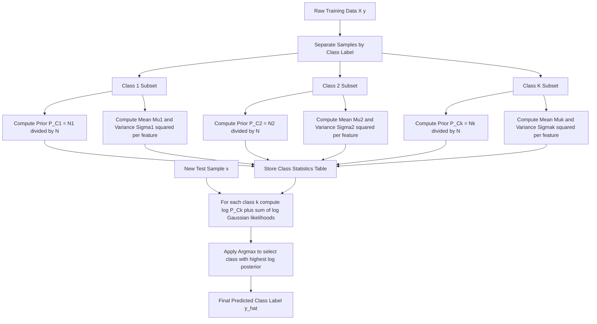
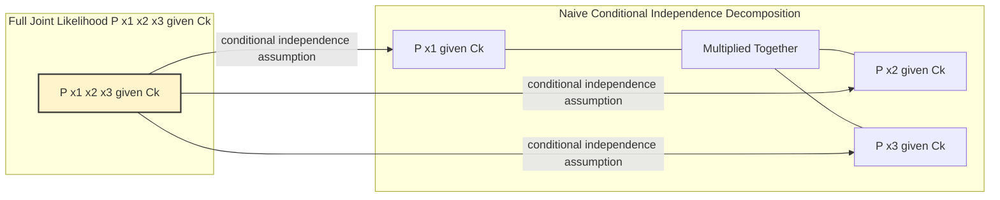
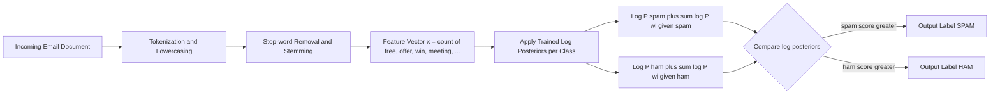

# Probabilistic Classifiers: Bayes' Theorem, conditional feature independence assumption constraints

<!-- SECTION_1_START -->

# Probabilistic Classifiers: Bayes' Theorem and the Naive Independence Assumption

## Formal Definition

A **Probabilistic Classifier** is a supervised learning model that estimates the posterior probability $P(C_k \mid \mathbf{x})$ of a class label $C_k$ given a feature vector $\mathbf{x} = (x_1, x_2, \dots, x_n)$, and then assigns the input to the class with the maximum posterior probability. The entire framework is grounded in **Bayes' Theorem**:

$$
P(C_k \mid \mathbf{x}) \;=\; \frac{P(\mathbf{x} \mid C_k)\, P(C_k)}{P(\mathbf{x})}
$$

where:
- $P(C_k)$ is the **prior probability** of class $C_k$,
- $P(\mathbf{x} \mid C_k)$ is the **likelihood** of observing $\mathbf{x}$ given class $C_k$,
- $P(\mathbf{x})$ is the **evidence** (a normalizing constant),
- $P(C_k \mid \mathbf{x})$ is the **posterior probability** that we wish to estimate.

> [!IMPORTANT]
> **KTU 2024 Syllabus Highlight (PCCST503 — Module 2)**
> The two pillars you must master are: (1) the **MAP (Maximum A Posteriori)** decision rule, and (2) the **conditional feature independence assumption** that defines the *Naive Bayes* family of classifiers. These are routinely asked as 7-mark sub-questions.

> [!NOTE]
> **Core Decision Rule (MAP Hypothesis)**
> Since $P(\mathbf{x})$ is identical for every class, the optimal class is:
> $$\hat{y} \;=\; \underset{k \in \{1,\dots,K\}}{\arg\max}\; P(C_k)\prod_{i=1}^{n} P(x_i \mid C_k)$$
> We simply pick the class that maximises the product of the prior and the likelihoods.

---

## Conceptual Analogy / Intuition

Imagine a doctor diagnosing a patient who walks in with a **fever (x₁)**, a **rash (x₂)**, and a **sore throat (x₃)**. Three diseases are possible: **Flu**, **Measles**, or **Common Cold**.

- The doctor has a **prior belief** about how common each disease is in the city (this is $P(C_k)$ — the *Prior*).
- Given each disease, the doctor knows the probability of each symptom appearing (this is $P(x_i \mid C_k)$ — the *Likelihood*).
- The doctor combines these to form a **revised (posterior) belief** about which disease the patient most likely has.

The **Naive Bayes assumption** is equivalent to the doctor saying: *"Assuming the symptoms are conditionally independent given the disease, the chance of seeing fever AND rash AND sore throat together is just the product of their individual chances."* This is naive because, in reality, symptoms are correlated — but the simplification works remarkably well in practice.

> [!TIP]
> Think of $P(\mathbf{x})$ as the **total probability of those symptoms occurring in the entire population**. It is the *denominator that keeps probabilities summing to 1*, and it is often ignored during classification because it is the same for all classes.

---

## Standard Metrics and Constants

- **Joint Probability Space**: All possible $(\mathbf{x}, C_k)$ combinations form a probability space of size $\vert \mathcal{X} \vert \times K$.
- **Log-Probability Trick (numerical stability)**: Because products of many small probabilities underflow to 0, KTU examiners and practitioners prefer:
$$\log P(C_k \mid \mathbf{x}) \;\propto\; \log P(C_k) + \sum_{i=1}^{n} \log P(x_i \mid C_k)$$
- **Laplace Smoothing Constant**: $\alpha = 1$ is the **standard smoothing parameter** added to every count to avoid zero-frequency issues.

> [!VISUALIZATION CONTROL]
> **Concept:** Gaussian Naive Bayes decision boundary in 2D feature space
> **GeoGebra / Desmos Input Equations:**
> * `f(x,y) = (1/(2*pi*s1x*s1y*sqrt(1-r1^2))) * exp(-1/(2*(1-r1^2)) * (((x-m1x)/s1x)^2 - 2*r1*((x-m1x)/s1x)*((y-m1y)/s1y) + ((y-m1y)/s1y)^2))`  *(Class 1)*
> * `g(x,y) = (1/(2*pi*s2x*s2y*sqrt(1-r2^2))) * exp(-1/(2*(1-r2^2)) * (((x-m2x)/s2x)^2 - 2*r2*((x-m2x)/s2x)*((y-m2y)/s2y) + ((y-m2y)/s2y)^2))`  *(Class 2)*
> * `boundary: f(x,y) * P1 = g(x,y) * P2`
> **Visual Description:** Two overlapping 2D Gaussian "bell surfaces" rise from the $xy$-plane. The **decision boundary** appears as the curved contour where $P(C_1)\,f(\mathbf{x}) = P(C_2)\,g(\mathbf{x})$. Points on one side are classified as $C_1$, and on the other as $C_2$.

<!-- SECTION_1_END -->

<!-- SECTION_2_START -->

# Deep Theoretical Analysis: Why Bayes' Theorem + Naive Independence?

## 1. The Direct Computation Problem

To classify exactly using Bayes' rule, we need $P(\mathbf{x} \mid C_k)$ for the **full joint distribution** of features. For $n$ binary features, this requires learning $2^n$ probabilities per class. For $n = 20$ features, that is over **1 million probabilities** — clearly infeasible for any reasonable dataset.

> [!NOTE]
> **The Naive Solution (Conditional Independence Assumption)**
> $$P(\mathbf{x} \mid C_k) \;=\; P(x_1, x_2, \dots, x_n \mid C_k) \;\approx\; \prod_{i=1}^{n} P(x_i \mid C_k)$$
> The number of parameters collapses from $2^n - 1$ to just $n$ per class — a massive reduction in complexity.

## 2. Why the Assumption Works (Counter-Intuitive Strength)

Even though features are **almost never truly independent**, the Naive Bayes classifier is surprisingly robust because:
- It only needs the **ranking** of posteriors to be correct, not the exact probabilities.
- Classification errors from correlated features often **cancel out** across classes.
- The variance reduction from using fewer parameters outweighs the bias introduced.

## 3. Log-Space Formulation (The KTU Board Favourite)

Converting the MAP decision rule to log-space:
$$\hat{y} \;=\; \underset{k}{\arg\max}\;\Bigl[\log P(C_k) + \sum_{i=1}^{n} \log P(x_i \mid C_k)\Bigr]$$
This is exactly what every production-grade Naive Bayes implementation does.

## 4. Zero-Frequency (Zero-Probability) Problem

If a categorical feature value never appears with a class in training, $P(x_i = v \mid C_k) = 0$, which makes the entire product zero — wiping out all other evidence. The fix is **Laplace (Additive) Smoothing**:
$$\hat{P}(x_i = v \mid C_k) \;=\; \frac{\text{count}(x_i = v,\, C_k) + \alpha}{N_k + \alpha\, V}$$
where $N_k$ is the number of training samples in class $C_k$, and $V$ is the number of possible values of $x_i$.

## 5. Variants of Naive Bayes (KTU 2024 Expectation)

| Variant | Feature Type | Likelihood Model |
|---|---|---|
| **Gaussian Naive Bayes** | Continuous | $P(x_i \mid C_k) = \mathcal{N}(x_i;\,\mu_{ik},\sigma_{ik}^2)$ |
| **Multinomial Naive Bayes** | Discrete counts (e.g. word counts) | $P(\mathbf{x} \mid C_k) \propto \prod_{i} P(w_i \mid C_k)^{x_i}$ |
| **Bernoulli Naive Bayes** | Binary / Boolean | $P(\mathbf{x} \mid C_k) = \prod_{i} p_{ik}^{x_i}(1-p_{ik})^{1-x_i}$ |
| **Complement Naive Bayes** | Imbalanced text | Uses complement class statistics |

---

## KTU High-Yield Formula Sheet

| Concept | Formula | Notes |
|---|---|---|
| Bayes' Theorem | $P(C_k \mid \mathbf{x}) = \dfrac{P(\mathbf{x} \mid C_k)\,P(C_k)}{P(\mathbf{x})}$ | Foundation of all probabilistic classifiers |
| Naive Independence | $P(x_1,\dots,x_n \mid C_k) = \prod_{i=1}^{n} P(x_i \mid C_k)$ | "Naive" simplifying assumption |
| MAP Decision | $\hat{y} = \arg\max_k P(C_k)\prod_i P(x_i \mid C_k)$ | Ignore $P(\mathbf{x})$; equivalent to $\arg\max$ of posterior |
| Log-Space MAP | $\hat{y} = \arg\max_k \bigl[\log P(C_k) + \sum_i \log P(x_i \mid C_k)\bigr]$ | Numerically stable, mandatory in code |
| Gaussian Likelihood | $P(x_i \mid C_k) = \dfrac{1}{\sigma_{ik}\sqrt{2\pi}} \exp\!\Bigl(-\dfrac{(x_i-\mu_{ik})^2}{2\sigma_{ik}^2}\Bigr)$ | Continuous features |
| Multinomial Likelihood | $P(\mathbf{x} \mid C_k) \propto \prod_{i} P(w_i \mid C_k)^{x_i}$ | Text classification |
| Bernoulli Likelihood | $P(\mathbf{x} \mid C_k) = \prod_i p_{ik}^{x_i}(1-p_{ik})^{1-x_i}$ | Binary bag-of-words |
| Laplace Smoothing | $\hat{P}(x_i \mid C_k) = \dfrac{\text{count}(x_i, C_k) + \alpha}{N_k + \alpha V}$ | $\alpha = 1$ is standard |
| Prior Estimation | $P(C_k) = \dfrac{N_k}{N}$ | Maximum Likelihood Estimate |
| Gaussian MLE | $\mu_{ik} = \dfrac{1}{N_k}\sum_{j \in C_k} x_{ij},\quad \sigma_{ik}^2 = \dfrac{1}{N_k}\sum_{j \in C_k}(x_{ij}-\mu_{ik})^2$ | Per-class, per-feature |

> [!IMPORTANT]
> **Where Naive Bayes is used in industry (real engineering utility):**
> * **Spam filtering** (Multinomial NB on token counts)
> * **Sentiment analysis** (Bernoulli NB on presence/absence of words)
> * **Medical diagnosis** (Gaussian NB on continuous lab measurements)
> * **Real-time recommendation systems** (extremely fast inference)
> * **Baseline text classifiers** in NLP pipelines (often outperforms deep models on small datasets)

<!-- SECTION_2_END -->

<!-- SECTION_3_START -->

# Step-by-Step Derivations and Python Implementation

## Derivation 1: From Bayes' Theorem to the Naive Bayes Decision Rule

**Step 1 — Start with Bayes' Theorem for class $C_k$:**

$$
P(C_k \mid \mathbf{x}) \;=\; \frac{P(\mathbf{x} \mid C_k)\,P(C_k)}{P(\mathbf{x})}
$$

**Step 2 — State the classification goal:** Choose the class with the largest posterior.

$$
\hat{y} \;=\; \underset{k \in \{1,\dots,K\}}{\arg\max}\; P(C_k \mid \mathbf{x})
$$

**Step 3 — Drop the constant $P(\mathbf{x})$:** Because $P(\mathbf{x})$ does not depend on $k$, it does not affect the argmax.

$$
\hat{y} \;=\; \underset{k}{\arg\max}\; P(\mathbf{x} \mid C_k)\,P(C_k)
$$

**Step 4 — Apply the conditional independence assumption:**

$$
P(\mathbf{x} \mid C_k) \;=\; \prod_{i=1}^{n} P(x_i \mid C_k)
$$

**Step 5 — Substitute to obtain the Naive Bayes decision rule:**

$$
\hat{y} \;=\; \underset{k}{\arg\max}\; P(C_k)\prod_{i=1}^{n} P(x_i \mid C_k)
$$

**Step 6 — Take the logarithm (a strictly monotonic transformation that preserves argmax):**

$$
\hat{y} \;=\; \underset{k}{\arg\max}\; \Bigl[\log P(C_k) + \sum_{i=1}^{n} \log P(x_i \mid C_k)\Bigr]
$$

---

## Derivation 2: Maximum Likelihood Estimates for Gaussian Naive Bayes

**Step 1 — Write the log-likelihood of the data given class $C_k$:**

$$
\mathcal{L}(\mu_{ik}, \sigma_{ik}^2) \;=\; \sum_{j:\,y_j = C_k} \log\!\Bigl[\frac{1}{\sigma_{ik}\sqrt{2\pi}}\exp\!\Bigl(-\frac{(x_{ij}-\mu_{ik})^2}{2\sigma_{ik}^2}\Bigr)\Bigr]
$$

**Step 2 — Differentiate w.r.t. $\mu_{ik}$ and set to 0:**

$$
\frac{\partial \mathcal{L}}{\partial \mu_{ik}} \;=\; \sum_{j \in C_k} \frac{x_{ij} - \mu_{ik}}{\sigma_{ik}^2} \;=\; 0
$$

**Step 3 — Solve for $\mu_{ik}$:**

$$
\mu_{ik}^{\text{MLE}} \;=\; \frac{1}{N_k}\sum_{j \in C_k} x_{ij}
$$

**Step 4 — Differentiate w.r.t. $\sigma_{ik}^2$ and solve:**

$$
\sigma_{ik}^{2,\text{MLE}} \;=\; \frac{1}{N_k}\sum_{j \in C_k}(x_{ij} - \mu_{ik})^2
$$

---

## Derivation 3: Worked Numerical Example (Laplace Smoothing)

**Problem.** A training set has $N = 10$ documents, split into $N_{\text{spam}} = 4$ and $N_{\text{ham}} = 6$. The word *"offer"* appears in 3 spam and 0 ham documents. The vocabulary size is $V = 5$. With Laplace smoothing $\alpha = 1$, compute $\hat{P}(\text{offer} \mid \text{spam})$ and $\hat{P}(\text{offer} \mid \text{ham})$.

**Solution — Spam:**

$$
\hat{P}(\text{offer} \mid \text{spam}) \;=\; \frac{3 + 1}{4 + 1 \cdot 5} \;=\; \frac{4}{9} \;\approx\; 0.4444
$$

**Solution — Ham:**

$$
\hat{P}(\text{offer} \mid \text{ham}) \;=\; \frac{0 + 1}{6 + 1 \cdot 5} \;=\; \frac{1}{11} \;\approx\; 0.0909
$$

> [!NOTE]
> Without smoothing, $\hat{P}(\text{offer} \mid \text{ham}) = 0$ — and the entire posterior becomes zero for any document containing *"offer"*, no matter how strongly the other features suggest ham.

---

## Python Implementation: From-Scratch Gaussian Naive Bayes

```python
import numpy as np
from typing import Tuple
import logging

logging.basicConfig(level=logging.INFO, format='[%(levelname)s] %(message)s')
logger = logging.getLogger(__name__)


class GaussianNaiveBayes:
    """
    A from-scratch implementation of Gaussian Naive Bayes for continuous features.
    Assumes conditional independence of features given the class label.
    """

    def __init__(self, var_smoothing: float = 1e-9) -> None:
        # var_smoothing is the largest possible variance to add (numerical safety)
        self.var_smoothing: float = var_smoothing
        self.classes: np.ndarray = np.array([])
        self.priors: dict = {}
        self.means: dict = {}
        self.vars: dict = {}

    def fit(self, X: np.ndarray, y: np.ndarray) -> "GaussianNaiveBayes":
        X = np.asarray(X, dtype=np.float64)
        y = np.asarray(y)
        if X.shape[0] != y.shape[0]:
            raise ValueError("X and y must have the same number of samples.")
        if X.ndim != 2:
            raise ValueError("X must be a 2D array of shape (n_samples, n_features).")

        self.classes = np.unique(y)
        n_samples, n_features = X.shape
        logger.info(f"Training GaussianNB on {n_samples} samples, "
                    f"{n_features} features, {len(self.classes)} classes.")

        for c in self.classes:
            X_c = X[y == c]
            self.priors[c] = X_c.shape[0] / n_samples
            self.means[c] = X_c.mean(axis=0)
            self.vars[c] = X_c.var(axis=0) + self.var_smoothing
            logger.info(f"Class {c}: prior={self.priors[c]:.4f}, "
                        f"mean={self.means[c]}, var={self.vars[c]}")
        return self

    def _gaussian_log_likelihood(self, x: np.ndarray, c) -> float:
        mean = self.means[c]
        var = self.vars[c]
        # log(1 / (sqrt(2*pi*var))) + (-(x-mean)^2 / (2*var))
        log_lik = -0.5 * np.sum(np.log(2.0 * np.pi * var))
        log_lik -= 0.5 * np.sum(((x - mean) ** 2) / var)
        return log_lik

    def predict_log_proba(self, X: np.ndarray) -> np.ndarray:
        X = np.asarray(X, dtype=np.float64)
        log_proba = np.zeros((X.shape[0], len(self.classes)))
        for idx, c in enumerate(self.classes):
            log_prior = np.log(self.priors[c])
            row_log_lik = np.array([self._gaussian_log_likelihood(x, c) for x in X])
            log_proba[:, idx] = log_prior + row_log_lik
        return log_proba

    def predict(self, X: np.ndarray) -> np.ndarray:
        log_proba = self.predict_log_proba(X)
        return self.classes[np.argmax(log_proba, axis=1)]


# ---- Demonstration on synthetic data ----
if __name__ == "__main__":
    rng = np.random.default_rng(seed=42)
    # Class 0: mean = [0, 0], Class 1: mean = [3, 3]
    X_train = np.vstack([
        rng.normal(loc=[0, 0], scale=[1, 1], size=(50, 2)),
        rng.normal(loc=[3, 3], scale=[1, 1], size=(50, 2)),
    ])
    y_train = np.array([0] * 50 + [1] * 50)

    model = GaussianNaiveBayes()
    model.fit(X_train, y_train)

    X_test = np.array([[0.5, 0.5], [2.5, 2.5], [-1.0, -1.0], [4.0, 4.0]])
    predictions = model.predict(X_test)
    logger.info(f"Predictions for {X_test.tolist()} -> {predictions.tolist()}")
```

<!-- SECTION_3_END -->

<!-- SECTION_4_START -->

# Structural Diagrams and Schematics

## Diagram 1: Naive Bayes Classification Pipeline (Training + Inference)



> [!NOTE]
> **Reading the diagram:** The upper branch is **offline training** (one-time, builds the statistics table). The lower branch starting at node `G` is the **online inference path** (executed for every new test sample).

---

## Diagram 2: Decomposition of the Naive Bayes Joint Likelihood



---

## Diagram 3: Sequential Processing Topology (How a Spam Classifier Uses NB)



<!-- SECTION_4_END -->

<!-- SECTION_5_START -->

# KTU 2024 Scheme Examination Question Bank

## Part A — Short Answer Questions (3 Marks Each)

### Question 1
**`[KTU University Exam — July 2024]`**  *CO1 | Remember*

State Bayes' Theorem for classification and explain the role of the prior probability $P(C_k)$ in the decision rule.

**Model Answer (3 Marks):**
> Bayes' Theorem states that the posterior probability of a class $C_k$ given a feature vector $\mathbf{x}$ is:
> $$P(C_k \mid \mathbf{x}) = \frac{P(\mathbf{x} \mid C_k)\,P(C_k)}{P(\mathbf{x})}$$
> The **prior $P(C_k)$** represents our belief about how likely class $C_k$ is **before observing any feature evidence**. It is estimated as the fraction of training samples belonging to $C_k$, i.e. $P(C_k) = N_k / N$. In the MAP decision rule, the prior ensures that a class with overwhelming prior dominance is favoured even if the likelihood evidence is weak, anchoring the classifier to the **base rate** of the data.

---

### Question 2
**`[KTU University Exam — Dec 2023]`**  *CO1 | Understand*

What is the **conditional independence assumption** in Naive Bayes? Why is it called "naive"?

**Model Answer (3 Marks):**
> The assumption states that, **given the class label, all features are mutually independent**:
> $$P(x_1, x_2, \dots, x_n \mid C_k) = \prod_{i=1}^{n} P(x_i \mid C_k)$$
> It is called "naive" because in real-world data, features are almost always correlated (e.g. the words *"free"* and *"offer"* frequently co-occur in spam). The assumption is a deliberate oversimplification that reduces the number of parameters from exponential to linear in the number of features, making the classifier tractable and surprisingly effective.

---

## Part B — Long Answer Questions (14 Marks Each)

### Question A — Option 1
**`[KTU University Exam — Model Paper 2024]`**  *CO2, CO3 | Understand + Apply*

**(a)** [7 Marks] Derive the Naive Bayes classification decision rule starting from Bayes' Theorem. Clearly state the conditional independence assumption and justify why taking the logarithm is preferred in practice.

**(b)** [7 Marks] Consider a 2-class dataset with class priors $P(C_1) = 0.4$ and $P(C_2) = 0.6$. A new sample has two features $x_1 = 2$ and $x_2 = 3$ with the following Gaussian likelihoods:
* Class $C_1$: $\mu_1 = (1, 1),\ \sigma_1 = (1, 1)$ (per feature)
* Class $C_2$: $\mu_2 = (3, 4),\ \sigma_2 = (1.5, 0.5)$ (per feature)

Classify the sample using the MAP rule in log-space.

---

**Model Solution:**

**Part (a) — Derivation (7 Marks):**

`[Step 1: Bayes' Theorem — 1 Mark]`
$$P(C_k \mid \mathbf{x}) = \frac{P(\mathbf{x} \mid C_k)\,P(C_k)}{P(\mathbf{x})}$$

`[Step 2: Argmax decision rule — 1 Mark]`
$$\hat{y} = \arg\max_k P(C_k \mid \mathbf{x}) = \arg\max_k P(\mathbf{x} \mid C_k)\,P(C_k)$$
($P(\mathbf{x})$ dropped because it is constant across classes.)

`[Step 3: Conditional independence assumption — 2 Marks]`
$$P(\mathbf{x} \mid C_k) = \prod_{i=1}^{n} P(x_i \mid C_k)$$

`[Step 4: Final decision rule — 1 Mark]`
$$\hat{y} = \arg\max_k\, P(C_k) \prod_{i=1}^{n} P(x_i \mid C_k)$$

`[Step 5: Justification of log-space — 2 Marks]`
Taking log converts the product into a sum:
$$\hat{y} = \arg\max_k\, \Bigl[\log P(C_k) + \sum_{i=1}^{n} \log P(x_i \mid C_k)\Bigr]$$
This is preferred because (i) products of many small probabilities cause **numerical underflow** in floating point, (ii) summation is computationally faster, and (iii) the logarithm is monotonic so the argmax is preserved.

---

**Part (b) — Numerical Problem (7 Marks):**

`[Step 1: Compute log-prior for each class — 1 Mark]`
$$\log P(C_1) = \log(0.4) \approx -0.9163$$
$$\log P(C_2) = \log(0.6) \approx -0.5108$$

`[Step 2: Gaussian log-likelihood formula — 1 Mark]`
$$\log P(x_i \mid C_k) = -\tfrac{1}{2}\log(2\pi\sigma_{ik}^2) - \frac{(x_i - \mu_{ik})^2}{2\sigma_{ik}^2}$$

`[Step 3: Class C1 log-likelihoods — 1 Mark]`
* For $x_1 = 2$ (mean $1$, var $1$): $-0.5\log(2\pi) - \frac{(2-1)^2}{2} = -0.9189 - 0.5 = -1.4189$
* For $x_2 = 3$ (mean $1$, var $1$): $-0.9189 - \frac{(3-1)^2}{2} = -0.9189 - 2.0 = -2.9189$

`[Step 4: Class C2 log-likelihoods — 1 Mark]`
* For $x_1 = 2$ (mean $3$, var $2.25$): $-0.5\log(2\pi \cdot 2.25) - \frac{(2-3)^2}{2 \cdot 2.25} = -1.2238 - 0.2222 = -1.4460$
* For $x_2 = 3$ (mean $4$, var $0.25$): $-0.5\log(2\pi \cdot 0.25) - \frac{(3-4)^2}{2 \cdot 0.25} = 0.2253 - 2.0 = -1.7747$

`[Step 5: Total log-posteriors — 1 Mark]`
$$\text{Class } C_1: \quad -0.9163 + (-1.4189) + (-2.9189) = -5.2541$$
$$\text{Class } C_2: \quad -0.5108 + (-1.4460) + (-1.7747) = -3.7315$$

`[Step 6: Final classification — 1 Mark]`
Since $-3.7315 > -5.2541$, the sample is classified as **$C_2$**.

---

### Question B — Option 2 (Internal Choice)
**`[KTU University Exam — July 2024]`**  *CO2, CO4 | Understand + Apply*

**(a)** [7 Marks] Explain the three major variants of Naive Bayes — **Gaussian**, **Multinomial**, and **Bernoulli** — with the exact form of the likelihood function $P(\mathbf{x} \mid C_k)$ used in each. Mention one real-world application where each is most appropriate.

**(b)** [7 Marks] A text classification dataset has $N = 100$ documents with $N_{\text{spam}} = 30$ and $N_{\text{ham}} = 70$. The vocabulary size is $V = 6$. The word *"discount"* occurs in 12 spam and 5 ham documents. Using **Laplace smoothing** with $\alpha = 1$, compute:
1. $P(\text{spam})$ and $P(\text{ham})$ (with smoothing comment).
2. $\hat{P}(\text{discount} \mid \text{spam})$ and $\hat{P}(\text{discount} \mid \text{ham})$.
3. A new email contains the single word *"discount"*. What is its predicted class under Multinomial Naive Bayes?

---

**Model Solution:**

**Part (a) — Variants of Naive Bayes (7 Marks):**

`[Gaussian NB — 2 Marks]`
Used for **continuous features**. Assumes each feature follows a Normal distribution per class:
$$P(x_i \mid C_k) = \frac{1}{\sigma_{ik}\sqrt{2\pi}}\exp\!\Bigl(-\frac{(x_i - \mu_{ik})^2}{2\sigma_{ik}^2}\Bigr)$$
*Application:* Medical diagnosis (age, blood pressure, cholesterol).

`[Multinomial NB — 2 Marks]`
Used for **discrete count features** (e.g. word frequencies in a document):
$$P(\mathbf{x} \mid C_k) \propto \prod_{i=1}^{V} P(w_i \mid C_k)^{x_i}$$
*Application:* Spam filtering, topic classification with bag-of-words counts.

`[Bernoulli NB — 2 Marks]`
Used for **binary / boolean features** (word present or absent):
$$P(\mathbf{x} \mid C_k) = \prod_{i=1}^{V} p_{ik}^{x_i}\,(1 - p_{ik})^{1 - x_i}$$
*Application:* Short-text classification, sentiment with presence-only features.

`[Conclusion line — 1 Mark]`
The choice of variant depends on the **feature type and representation** of the input data.

---

**Part (b) — Numerical Problem (7 Marks):**

`[Step 1: Priors — 1 Mark]`
$$P(\text{spam}) = \frac{30}{100} = 0.30,\qquad P(\text{ham}) = \frac{70}{100} = 0.70$$

`[Step 2: Smoothed likelihood of "discount" given spam — 1 Mark]`
$$\hat{P}(\text{discount} \mid \text{spam}) = \frac{12 + 1}{30 + 1 \cdot 6} = \frac{13}{36} \approx 0.3611$$

`[Step 3: Smoothed likelihood of "discount" given ham — 1 Mark]`
$$\hat{P}(\text{discount} \mid \text{ham}) = \frac{5 + 1}{70 + 1 \cdot 6} = \frac{6}{76} \approx 0.0789$$

`[Step 4: Apply Multinomial NB with one occurrence — 2 Marks]`
$$\text{Score(spam)} \propto 0.30 \times 0.3611 = 0.1083$$
$$\text{Score(ham)} \propto 0.70 \times 0.0789 = 0.0553$$

`[Step 5: Final decision — 1 Mark]`
Since $0.1083 > 0.0553$, the email is classified as **SPAM**.

`[Justification of smoothing impact — 1 Mark]`
Without Laplace smoothing, $\hat{P}(\text{discount} \mid \text{ham})$ would still be $\frac{5}{70} \approx 0.0714$, but the technique is critical when a word has **never been seen** for a class — preventing the entire posterior from collapsing to zero.

---

> [!WARNING]
> **KTU Examiner's Valuation Warning — Where Students Lose Marks**
> 1. **Forgetting the log transformation** when computing the final argmax. If you compute the product of many probabilities, you lose numerical accuracy marks.
> 2. **Omitting the conditional independence assumption statement** in part-(a) derivations. The examiner expects the explicit equation $P(\mathbf{x} \mid C_k) = \prod_i P(x_i \mid C_k)$.
> 3. **Skipping the Laplace smoothing explanation.** Even if the question doesn't demand smoothing, mentioning it shows conceptual depth and is a high-yield 1-mark bonus.
> 4. **Confusing Multinomial and Bernoulli NB.** Multinomial uses **counts**, Bernoulli uses **presence/absence (0/1)**.
> 5. **Not stating the MAP rule explicitly** in numerical answers. Always write "$\hat{y} = \arg\max_k$" before plugging in values.

---

## Topic Recap & Important Things to Remember

* **Bayes' Theorem** is the foundation: $P(C_k \mid \mathbf{x}) = \dfrac{P(\mathbf{x} \mid C_k)\,P(C_k)}{P(\mathbf{x})}$.
* The **MAP decision rule** is $\hat{y} = \arg\max_k\, P(C_k)\,P(\mathbf{x} \mid C_k)$. The denominator $P(\mathbf{x})$ can be discarded because it is the same for all classes.
* The **Naive Bayes assumption** is the conditional independence of features given the class:
$P(x_1, \dots, x_n \mid C_k) = \prod_{i=1}^{n} P(x_i \mid C_k)$. It is naive because real features are correlated.
* **Three variants** you must know: **Gaussian** (continuous), **Multinomial** (counts), **Bernoulli** (binary).
* **Parameter estimates**:
  * Prior: $P(C_k) = N_k / N$
  * Gaussian: $\mu_{ik}$ and $\sigma_{ik}^2$ from per-class MLE
  * Categorical: $P(x_i = v \mid C_k) = \text{count}(v, C_k) / N_k$
* **Log-space computation** is numerically stable and mandatory: $\log P(C_k) + \sum_i \log P(x_i \mid C_k)$.
* **Laplace (additive) smoothing** with $\alpha = 1$ prevents zero-frequency collapse:
$\hat{P}(x_i \mid C_k) = \dfrac{\text{count} + \alpha}{N_k + \alpha V}$.
* **Naive Bayes is fast, requires little training data, and handles high-dimensional data well** (e.g. text with thousands of words).
* **Naive Bayes is a generative classifier** — it models the joint distribution $P(\mathbf{x}, C_k)$ rather than the decision boundary directly.
* Real-world deployments: **spam filters (Gmail/Outlook)**, **medical diagnosis systems**, **news article categorization**, **baseline NLP models**.
* **Limitation to remember:** The conditional independence assumption is often violated; the classifier is suboptimal when feature correlations carry class-discriminative information.
* **Exam mantra:** Whenever asked to "derive the Naive Bayes classifier," always include: Bayes' Theorem $\to$ drop $P(\mathbf{x})$ $\to$ apply independence $\to$ argmax $\to$ log-space.

<!-- SECTION_5_END -->
