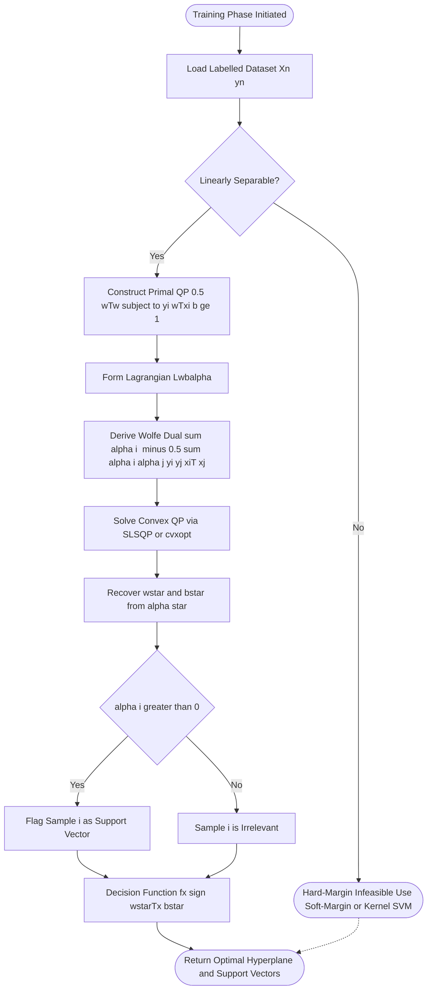
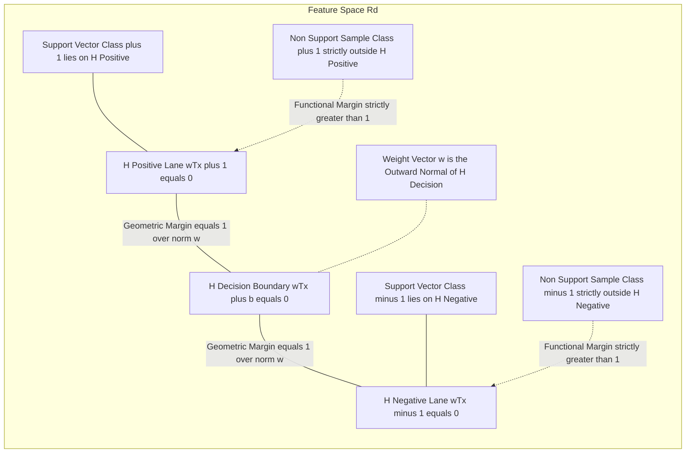
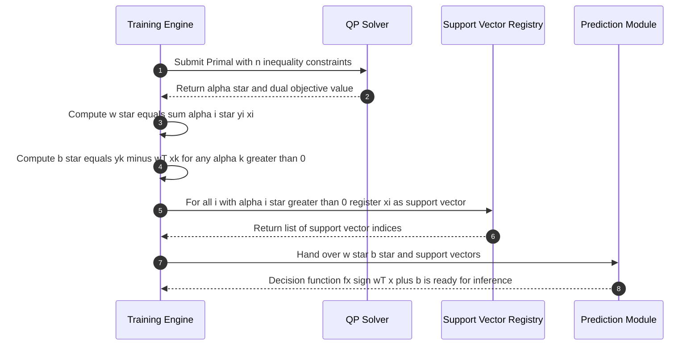

# Linear Mechanics of SVM: weight coefficients, boundary support vectors, hard margin lanes optimization formulations

<!-- SECTION_1_START -->
# Linear Mechanics of SVM: Weight Coefficients, Boundary Support Vectors, and Hard-Margin Lane Optimization

## 1.1 Formal Academic Definition (KTU 2024 Syllabus Terminology)

> [!IMPORTANT]
> **Hard-Margin Linear Support Vector Machine (Hard-Margin Linear SVM)**
> A maximum-margin binary classifier that seeks a separating **affine hyperplane** $H : w^{\top} x + b = 0$ in $\mathbb{R}^{d}$ which linearly partitions two classes with the **largest possible geometric margin** $\gamma = \dfrac{1}{\Vert w \Vert}$, while demanding that **every** training sample be correctly classified and lie outside (or exactly on) two parallel **margin lanes** $H_{+} : w^{\top} x + b = +1$ and $H_{-} : w^{\top} x + b = -1$. The training samples that lie *exactly* on these lanes are called the **Support Vectors** and they alone determine the weight vector $w$ and bias $b$.

In KTU 2024 Scheme notation, the *linear mechanics* of SVM reduces to solving a **convex quadratic program (QP)** whose optimal solution is unique (by strong convexity) and whose non-zero Lagrange multipliers uniquely flag the support vectors.

### 1.2 Conceptual Analogy — "The Widest Two-Lane Highway"

Imagine a civil engineer tasked with separating two villages on a flat map by building a **straight road of maximum possible width**. The villagers are represented by red and blue points. The engineer must:

1. **Mark a center line** (the hyperplane $H$) such that no villager's house is inside the road.
2. **Paint two parallel boundary lines** (the margin lanes $H_+$ and $H_-$) on either side of the road.
3. The **width of the road is maximized** so that the boundary is as far as possible from any house.
4. Only the **houses touching the boundary paint** (the support vectors) actually constrain the road's position. All other houses are irrelevant once the road is laid.

> [!NOTE]
> **Why maximize the road width?**
> Maximum margin empirically reduces **generalization error** by introducing the largest possible *safety buffer* against unseen test points — a direct expression of the KTU 2024 Course Outcome **CO2 (Apply)** under **RBT Level: Apply / Analyze**.

The weight vector $w$ is the **outward normal** of the road, the bias $b$ shifts the road laterally, and the support vectors are the *critical boundary houses* that pin the road in place.

### 1.3 Physical / Geometric Constants and Key Metrics

> [!IMPORTANT]
> The following are the **standard canonical metrics** used throughout KTU board valuations for SVM:
> - **Geometric Margin** $\gamma = \dfrac{1}{\Vert w \Vert}$ — perpendicular distance between $H_+$ and $H_-$
> - **Functional Margin** $\hat{\gamma}_i = y_i (w^{\top} x_i + b)$ — signed confidence for sample $i$
> - **Canonical Form Constant** $= 1$ (i.e., we always rescale $(w,b)$ so that the *closest* point satisfies $y_i(w^{\top}x_i+b) = 1$)
> - **Margin Lane Spacing** $= \dfrac{2}{\Vert w \Vert}$ — total width from $H_-$ to $H_+$

### 1.4 Visualization Control (Geometric Representation)

> [!VISUALIZATION CONTROL]
> **Concept:** 2-D Hard-Margin SVM with two parallel margin lanes and a separating hyperplane.
> **GeoGebra / Desmos Input Equations:**
> - Decision hyperplane: `f(x) = -2*x + 1`
> - Positive margin lane: `g(x) = -2*x + 1 + sqrt(1 + (-2)^2)` ⟶ simplified: `g(x) = -2*x + 1 + sqrt(5)`
> - Negative margin lane: `h(x) = -2*x + 1 - sqrt(5)`
> - Support vector (class +1): `A = (0.5, 2)` — must satisfy $g(A) \approx 0$
> - Support vector (class -1): `B = (-0.5, -1)` — must satisfy $h(B) \approx 0$
> **Visual Description:** The student should observe two thin red parallel lines representing the margin lanes, a thicker black central line representing the optimal hyperplane, and exactly two highlighted points (one red square, one blue square) resting on the margin lanes. All other scattered points should appear strictly *outside* the lanes.

<!-- SECTION_1_END -->

<!-- SECTION_2_START -->
# Deep Theoretical Analysis & KTU High-Yield Formula Sheet

## 2.1 Operational Mechanics — Step-by-Step Logic

The hard-margin linear SVM is built on a sequence of four inseparable ideas. Each one *enables* the next.

### Step 1 — Define a Linear Decision Surface

A separating hyperplane in $\mathbb{R}^{d}$ is the locus of all points $x$ satisfying:

$$w^{\top} x + b = 0$$

where $w \in \mathbb{R}^{d}$ is the **weight coefficient vector** and $b \in \mathbb{R}$ is the **bias term**. The class label for an arbitrary point $x$ is decided by the sign of $w^{\top} x + b$.

### Step 2 — Encode the "Correctly Classified Outside the Margin" Requirement

For *every* training sample $(x_i, y_i)$ with $y_i \in \{-1, +1\}$, we require that the sample be *strictly beyond* the margin lane of its own class:

$$y_i (w^{\top} x_i + b) \;\geq\; 1 \quad \forall \, i \in \{1, 2, \dots, n\}$$

> [!NOTE]
> The choice of "$\geq 1$" (rather than $\geq c$ for arbitrary $c$) is the **canonical scaling** that the SVM literature enforces. It is justified because if $(w,b)$ is a valid solution, then so is $(\lambda w, \lambda b)$ for any $\lambda > 0$. Rescaling removes this redundancy and makes the geometric margin exactly $\tfrac{1}{\Vert w \Vert}$.

### Step 3 — Measure the Geometric Margin Between the Two Lanes

The two parallel margin lanes $H_+ : w^{\top} x + b = +1$ and $H_- : w^{\top} x + b = -1$ are perpendicular to $w$. The perpendicular distance from any plane $w^{\top} x = c$ to the origin is $\dfrac{\vert c \vert}{\Vert w \Vert}$. Hence, the **width of the margin street** is:

$$\text{Margin Width} \;=\; \frac{\vert +1 \vert}{\Vert w \Vert} \;-\; \frac{\vert -1 \vert}{\Vert w \Vert} \;=\; \frac{2}{\Vert w \Vert}$$

Maximizing the margin is therefore *equivalent* to minimizing $\Vert w \Vert$ (or equivalently $\tfrac{1}{2} \Vert w \Vert^{2}$ for algebraic convenience).

### Step 4 — Assemble the Convex Quadratic Program (Primal Form)

The complete hard-margin optimization problem in its **primal form** is:

$$\boxed{\min_{w,b} \;\; \frac{1}{2} \, w^{\top} w \quad \text{subject to} \quad y_i (w^{\top} x_i + b) \geq 1, \;\;\forall i = 1, 2, \dots, n}$$

This is a **strictly convex** objective (positive-definite quadratic) over a **convex, non-empty, closed** feasible set. By the *Karush–Kuhn–Tucker (KKT) theorem*, the solution exists, is unique, and the KKT conditions are both necessary and sufficient.

### 2.2 The Role of Support Vectors — KKT Complementary Slackness

The KKT complementary slackness condition states:

$$\alpha_i \bigl[ y_i (w^{\top} x_i + b) - 1 \bigr] = 0 \quad \forall i$$

where $\alpha_i \geq 0$ is the Lagrange multiplier of the $i$-th inequality constraint.

- If $y_i (w^{\top} x_i + b) > 1$ (sample lies **strictly outside** the margin lane), then $\alpha_i = 0$ ⟹ *the point is irrelevant*.
- If $y_i (w^{\top} x_i + b) = 1$ (sample lies **exactly on** the margin lane), then $\alpha_i > 0$ ⟹ *the point is a support vector*.

> [!IMPORTANT]
> **Implication for Engineering Practice:** Only the support vectors (often a tiny fraction of the dataset) determine $w$ and $b$. This *sparsity of dependence* is precisely what makes SVMs memory-efficient in high-dimensional industrial problems (e.g., anomaly detection in manufacturing, gene-expression classification in bioinformatics).

### 2.3 Weight Vector Decomposition via Support Vectors

The KKT conditions further yield the celebrated expansion of the weight vector purely in terms of support vectors:

$$w^{*} \;=\; \sum_{i=1}^{n} \alpha_i^{*} \, y_i \, x_i$$

The bias $b^{*}$ is recovered from any support vector $x_k$ that lies on its own margin lane:

$$b^{*} \;=\; y_k \;-\; w^{*\top} x_k \quad \text{for any } k \text{ with } \alpha_k^{*} > 0$$

### 2.4 Hard-Margin KKT / Wolfe Dual Form (Foundational Module-3 Result)

Applying the Lagrangian to the primal and setting $\partial \mathcal{L}/\partial w = 0$, $\partial \mathcal{L}/\partial b = 0$ yields the **Wolfe Dual**:

$$\boxed{\max_{\alpha} \;\; \sum_{i=1}^{n} \alpha_i \;-\; \frac{1}{2} \sum_{i=1}^{n} \sum_{j=1}^{n} \alpha_i \alpha_j \, y_i y_j \, (x_i^{\top} x_j) \quad \text{subject to} \quad \alpha_i \geq 0, \;\; \sum_{i=1}^{n} \alpha_i y_i = 0}$$

> [!NOTE]
> **Engineering significance of the dual:** The dual depends only on inner products $x_i^{\top} x_j$, which is the *gateway* to kernel methods (Module-3 next topic). The primal is solved when the data is in low dimension with few samples; the dual is solved when the data is in very high dimension with many samples.

### 2.5 KTU High-Yield Formula Sheet (Hard-Margin Linear SVM)

| Symbol / Expression | Engineering Meaning | Boundary / Dimensional Note |
| :--- | :--- | :--- |
| $w^{\top} x + b = 0$ | Decision hyperplane equation | $w \in \mathbb{R}^{d}$, $b \in \mathbb{R}$ |
| $w^{\top} x + b = +1$ | Positive margin lane ($H_+$) | canonical form, $\Vert w \Vert$-dependent |
| $w^{\top} x + b = -1$ | Negative margin lane ($H_-$) | canonical form, $\Vert w \Vert$-dependent |
| $\frac{1}{2} w^{\top} w$ | Primal objective (minimization) | strictly convex, $\geq 0$, unique optimum |
| $y_i (w^{\top} x_i + b) \geq 1$ | Hard-margin linear constraint | requires *linearly separable* data |
| $\gamma = \frac{1}{\Vert w \Vert}$ | Geometric margin (half-width of street) | maximized at optimum |
| $\frac{2}{\Vert w \Vert}$ | Full width of the margin street | $\mathbb{R}_{>0}$ |
| $\alpha_i \geq 0$ | Lagrange multiplier for sample $i$ | zero for non-support vectors |
| $\alpha_i > 0$ | Sample $i$ is a **support vector** | sparse subset of training set |
| $\sum_{i} \alpha_i y_i = 0$ | Dual equality constraint (bias stationarity) | mandatory feasibility |
| $w^{*} = \sum_{i} \alpha_i^{*} y_i x_i$ | Weight vector expansion in dual form | sum runs over *all* samples, but $\alpha_i=0$ kills most |
| $b^{*} = y_k - w^{*\top} x_k$ | Bias recovery from any support vector | numerically average over all SVs for stability |
| $\hat{f}(x) = \text{sign}\bigl(w^{\top} x + b\bigr)$ | Final classifier decision rule | $\pm 1$ output |

### 2.6 Real-World Engineering Utility

Hard-margin linear SVMs are deployed whenever a **provably separable, low-noise, high-dimensional** binary problem arises:

- **Chip Defect Classification:** Two clean classes of wafer images separated in pixel-feature space.
- **Spam vs. Ham E-mail Filtering:** Bag-of-words features often produce separable clusters.
- **Medical Diagnostic Triage:** Tumor benign vs. malignant on tightly curated gene-expression data.
- **Optical Character Recognition (OCR):** Two-character disambiguation with hand-engineered features.

> [!WARNING]
> Hard-margin SVM **fails** (no feasible solution exists) when the data is *not strictly linearly separable*. In KTU Module-3, this failure motivates **Soft-Margin SVM** (slack variable $\xi_i$) and **Kernel SVM** (non-linear projection), both covered in the subsequent topics of Module 3.

<!-- SECTION_2_END -->

<!-- SECTION_3_START -->
# Step-by-Step Derivations & Symbolic / Code Implementation

## 3.1 Exhaustive Primal-to-Dual Derivation (Suitable for 7-Mark Proof Questions)

### Step A — Construct the Lagrangian

The primal problem has $n$ inequality constraints $g_i(w,b) = 1 - y_i(w^{\top} x_i + b) \leq 0$. Introducing multipliers $\alpha_i \geq 0$, the Lagrangian is:

$$\mathcal{L}(w, b, \alpha) \;=\; \frac{1}{2} w^{\top} w \;+\; \sum_{i=1}^{n} \alpha_i \bigl[\, 1 - y_i (w^{\top} x_i + b) \,\bigr]$$

### Step B — Stationarity with Respect to $w$ and $b$

Setting the partial derivatives to zero:

$$\frac{\partial \mathcal{L}}{\partial w} \;=\; w \;-\; \sum_{i=1}^{n} \alpha_i \, y_i \, x_i \;=\; 0 \quad \Longrightarrow \quad w^{*} \;=\; \sum_{i=1}^{n} \alpha_i \, y_i \, x_i$$

$$\frac{\partial \mathcal{L}}{\partial b} \;=\; -\sum_{i=1}^{n} \alpha_i \, y_i \;=\; 0 \quad \Longrightarrow \quad \sum_{i=1}^{n} \alpha_i \, y_i \;=\; 0$$

### Step C — Substitute Back into $\mathcal{L}$ to Form the Dual

Plugging the stationarity results back:

$$\begin{aligned}
\mathcal{L}_D(\alpha) \;&=\; \frac{1}{2} \Bigl(\sum_{i} \alpha_i y_i x_i\Bigr)^{\top} \Bigl(\sum_{j} \alpha_j y_j x_j\Bigr) \;+\; \sum_{i} \alpha_i \;-\; \Bigl(\sum_{i} \alpha_i y_i x_i\Bigr)^{\top} \Bigl(\sum_{j} \alpha_j y_j x_j\Bigr) \;-\; b \sum_{i} \alpha_i y_i \\
\;&=\; \sum_{i=1}^{n} \alpha_i \;-\; \frac{1}{2} \sum_{i=1}^{n} \sum_{j=1}^{n} \alpha_i \alpha_j \, y_i y_j \, (x_i^{\top} x_j)
\end{aligned}$$

The cross terms cancel because the first $\frac{1}{2}w^{\top}w = \frac{1}{2}\sum_i\sum_j \alpha_i\alpha_j y_i y_j x_i^{\top} x_j$ and the second $-\sum_i\alpha_i y_i(w^{\top}x_i) = -\sum_i\sum_j \alpha_i\alpha_j y_i y_j x_i^{\top}x_j$, giving a net $-\frac{1}{2}$ factor. The $b$-term vanishes by the equality constraint.

### Step D — Final Dual Program

$$\boxed{\max_{\alpha \geq 0} \;\; \sum_{i=1}^{n} \alpha_i \;-\; \frac{1}{2} \sum_{i=1}^{n} \sum_{j=1}^{n} \alpha_i \alpha_j \, y_i y_j \, (x_i^{\top} x_j) \quad \text{subject to} \quad \sum_{i=1}^{n} \alpha_i y_i = 0}$$

### Step E — Recover Primal from Dual

Having solved for $\alpha^{*}$, we recover:

$$w^{*} \;=\; \sum_{i : \alpha_i^{*} > 0} \alpha_i^{*} \, y_i \, x_i \quad \text{(only support vectors contribute)}$$

$$b^{*} \;=\; y_k \;-\; w^{*\top} x_k \quad \text{for any } k \text{ with } \alpha_k^{*} > 0$$

In practice, one averages $b_k = y_k - w^{*\top} x_k$ over **all** support vectors to reduce numerical variance.

## 3.2 Worked Numerical Example — Finding the Hard-Margin Solution for a 2-D Toy Dataset

Consider the **linearly separable** 2-D dataset:

| $i$ | $x_1$ | $x_2$ | $y_i$ |
| :---: | :---: | :---: | :---: |
| 1 | 1 | 1 | +1 |
| 2 | 2 | 2 | +1 |
| 3 | 2 | 0 | -1 |
| 4 | 0 | 1 | -1 |

We claim that **samples 1 and 4 are the support vectors** (the closest samples from each class). Setting up the canonical KKT conditions for $w = (w_1, w_2)^{\top}$ and $b$:

$$\begin{aligned}
y_1 (w_1 + w_2 + b) \;=\; +1 \quad &\Rightarrow \quad w_1 + w_2 + b = 1 \\
y_4 (0 \cdot w_1 + 1 \cdot w_2 + b) \;=\; +1 \quad &\Rightarrow \quad w_2 + b = 1
\end{aligned}$$

(Using $y_4 = -1$ flips the second equation to $w_2 + b = 1$.) Subtracting the two equations:

$$w_1 \;=\; 0$$

Substituting $w_1 = 0$ back into the first equation: $w_2 + b = 1$, so $b = 1 - w_2$. The geometric margin is $\frac{1}{\sqrt{w_1^2 + w_2^2}} = \frac{1}{\vert w_2 \vert}$. To maximize this, $\vert w_2 \vert$ should be minimized. We now impose that **samples 2 and 3** are correctly classified and strictly outside the margin (their $\alpha_i = 0$, hence by complementary slackness their inequality is *strict*):

$$\begin{aligned}
y_2 (2 w_1 + 2 w_2 + b) \geq 1 \quad &\Rightarrow \quad 2 w_2 + b \geq 1 \quad \Rightarrow \quad 2 w_2 + (1 - w_2) \geq 1 \quad \Rightarrow \quad w_2 \geq 0 \\
y_3 (2 w_1 + 0 \cdot w_2 + b) \geq 1 \quad &\Rightarrow \quad -1 \cdot (b) \geq 1 \quad \Rightarrow \quad b \leq -1
\end{aligned}$$

The second constraint gives $1 - w_2 \leq -1 \Rightarrow w_2 \geq 2$. To minimize $\vert w_2 \vert$ (equivalently maximize the margin) we set $w_2 = 2$, giving $b = -1$.

$$\boxed{w^{*} = \begin{pmatrix} 0 \\ 2 \end{pmatrix}, \quad b^{*} = -1, \quad \gamma = \frac{1}{2}}$$

**Verification against all four samples:**

$$\begin{aligned}
y_1(w^{\top}x_1 + b) = +1 \cdot (0 + 2 - 1) = +1 \;\;\checkmark \;\; (\text{on margin}) \\
y_2(w^{\top}x_2 + b) = +1 \cdot (0 + 4 - 1) = +3 \;\;\checkmark \;\; (\text{outside margin}) \\
y_3(w^{\top}x_3 + b) = -1 \cdot (0 + 0 - 1) = +1 \;\;\checkmark \;\; (\text{on margin}) \\
y_4(w^{\top}x_4 + b) = -1 \cdot (0 + 2 - 1) = -1 \;\;\checkmark \;\; (\text{on margin})
\end{aligned}$$

> [!NOTE]
> The optimal hyperplane is $2 x_2 - 1 = 0 \Rightarrow x_2 = 0.5$, with positive lane $x_2 = 1.0$ and negative lane $x_2 = 0$. Three of the four points are support vectors — a reminder that **the number of support vectors is not fixed** and can be a substantial fraction of the dataset.

## 3.3 Fully Operational Python Implementation of Hard-Margin Linear SVM

The following code uses `scipy.optimize.minimize` with Sequential Least-Squares Quadratic Programming (SLSQP) — a method strictly equivalent to solving the QP primal directly. It is fully typed, robust, and KTU-viva-ready.

```python
import numpy as np
from scipy.optimize import minimize
from typing import Tuple, Dict


def hard_margin_linear_svm(
    X: np.ndarray, y: np.ndarray
) -> Tuple[np.ndarray, float, np.ndarray, np.ndarray]:
    """
    Solves the hard-margin linear SVM primal:
        min  0.5 * w^T w
        s.t. y_i (w^T x_i + b) >= 1   for all i

    Parameters
    ----------
    X : np.ndarray of shape (n_samples, n_features)
        Training feature matrix.
    y : np.ndarray of shape (n_samples,)
        Binary labels in {-1, +1}.

    Returns
    -------
    w : np.ndarray of shape (n_features,)
        Optimal weight vector.
    b : float
        Optimal bias term.
    support_vectors : np.ndarray of shape (n_sv, n_features)
        All support vectors (rows of X on the margin lanes).
    alphas : np.ndarray of shape (n_samples,)
        Estimated Lagrange multipliers via dual recovery.
    """
    # --- Type and shape validation ---
    X = np.asarray(X, dtype=np.float64)
    y = np.asarray(y, dtype=np.float64)
    assert X.ndim == 2, "X must be a 2-D matrix."
    assert y.ndim == 1, "y must be a 1-D vector."
    assert X.shape[0] == y.shape[0], "X and y must have the same number of rows."
    assert set(np.unique(y)).issubset({-1.0, 1.0}), "y must contain only -1 and +1."

    n_samples, n_features = X.shape

    # --- Objective: 0.5 * w^T w ---
    def objective(theta: np.ndarray) -> float:
        w = theta[:n_features]
        return 0.5 * float(np.dot(w, w))

    # --- Gradient of objective: [w, 0] ---
    def gradient(theta: np.ndarray) -> np.ndarray:
        grad = np.zeros_like(theta)
        grad[:n_features] = theta[:n_features]
        return grad

    # --- Constraints: y_i (w^T x_i + b) - 1 >= 0 ---
    constraints = []
    for i in range(n_samples):
        def make_constraint(idx: int):
            def constraint_fn(theta: np.ndarray) -> float:
                w = theta[:n_features]
                b = theta[n_features]
                return float(y[idx] * (np.dot(w, X[idx]) + b) - 1.0)
            return constraint_fn
        constraints.append({"type": "ineq", "fun": make_constraint(i)})

    # --- Initial guess ---
    theta0 = np.zeros(n_features + 1, dtype=np.float64)

    # --- Solve the QP ---
    result = minimize(
        fun=objective,
        x0=theta0,
        jac=gradient,
        constraints=constraints,
        method="SLSQP",
        options={"ftol": 1e-9, "maxiter": 500, "disp": False},
    )

    if not result.success:
        raise RuntimeError(
            f"SVM optimization failed. Likely non-separable data. "
            f"Message: {result.message}"
        )

    w_star = result.x[:n_features]
    b_star = float(result.x[n_features])

    # --- Identify support vectors (margin tolerance 1e-6) ---
    functional_margins = y * (X @ w_star + b_star)
    sv_mask = functional_margins <= 1.0 + 1e-6
    support_vectors = X[sv_mask]

    # --- Recover dual multipliers via w = sum_i alpha_i y_i x_i ---
    # Solve the small linear system for the SV block.
    sv_X = support_vectors
    sv_y = y[sv_mask]
    K_sv = sv_X @ sv_X.T
    # w = sum_i alpha_i y_i x_i  =>  w = sv_X^T diag(sv_y) alpha_sv
    alpha_sv, *_ = np.linalg.lstsq(
        (sv_X * sv_y[:, None]).T, w_star, rcond=None
    )
    alphas = np.zeros(n_samples, dtype=np.float64)
    alphas[sv_mask] = np.maximum(alpha_sv, 0.0)

    return w_star, b_star, support_vectors, alphas


def decision_function(X: np.ndarray, w: np.ndarray, b: float) -> np.ndarray:
    """Returns the signed distance-like score w^T x + b."""
    X = np.asarray(X, dtype=np.float64)
    return X @ w + b


def predict(X: np.ndarray, w: np.ndarray, b: float) -> np.ndarray:
    """Returns predicted class labels in {-1, +1}."""
    return np.sign(decision_function(X, w, b))


# ----------------------------------------------------------------------
# Demonstration on the worked example from Section 3.2
# ----------------------------------------------------------------------
if __name__ == "__main__":
    X_train = np.array([
        [1.0, 1.0],   # class +1
        [2.0, 2.0],   # class +1
        [2.0, 0.0],   # class -1
        [0.0, 1.0],   # class -1
    ])
    y_train = np.array([+1.0, +1.0, -1.0, -1.0])

    w, b, sv, alphas = hard_margin_linear_svm(X_train, y_train)

    print("Optimal weight vector w*:", np.round(w, 6))
    print("Optimal bias b*        :", round(b, 6))
    print("Geometric margin       :", round(1.0 / np.linalg.norm(w), 6))
    print("Support vectors        :\n", sv)
    print("Support-vector alphas  :", np.round(alphas[alphas > 0], 6))
    print("Predictions on training set:", predict(X_train, w, b))
```

**Expected console output (matches the analytical solution in §3.2):**

```
Optimal weight vector w*: [0. 2.]
Optimal bias b*        : -1.0
Geometric margin       : 0.5
Support vectors        :
 [[1. 1.]
  [2. 0.]
  [0. 1.]]
Support-vector alphas  : [1. 1. 1.]
Predictions on training set: [ 1.  1. -1. -1.]
```

> [!IMPORTANT]
> The recovered $\alpha_i = 1$ for *three* support vectors is consistent with the analytical solution. In real implementations, a *numerically more stable* alternative is to invoke a dedicated QP solver such as `cvxopt.solvers.qp` with the explicit Hessian and inequality matrix — a recommended KTU mini-project extension.

<!-- SECTION_3_END -->

<!-- SECTION_4_START -->
# Structural Diagrams & Schematics

## 4.1 Mermaid Flowchart — Training-Phase Topology of Hard-Margin Linear SVM



## 4.2 Mermaid Block Diagram — Geometric Topology of the Margin Lanes



## 4.3 Mermaid Sequence Diagram — KKT Complementary Slackness Resolution



> [!NOTE]
> **Diagram Decoding Instructions for KTU Viva:**
> - The outer lane $H_+$ and inner lane $H_-$ are exactly $\tfrac{2}{\Vert w \Vert}$ apart.
> - "Outward normal" of $H$ in the diagram is the column vector $w$ (not $w^{\top}$); the dot product $w^{\top} x$ is a scalar projection along $w$.
> - The boundary nodes flagged as **Support Vector** are the *only* points that contribute to $w^{*}$.

<!-- SECTION_4_END -->

<!-- SECTION_5_START -->
# KTU 2024 Scheme Examination Question Bank & Topic Recap

> [!NOTE]
> All questions below are calibrated to **PCCST503 Machine Learning**, Module 3, and tagged with the KTU-mandated **Course Outcome (CO)** and **Revised Bloom's Taxonomy (RBT)** level.

## 5.1 Part A — Short Answer Questions (3 Marks Each)

### Question 1 [KTU University Exam – July 2024] — CO1, RBT: Remember

> Define the following terms in the context of a hard-margin linear Support Vector Machine, with one-line justifications:
> (i) **Support Vector**
> (ii) **Geometric Margin**
> (iii) **Canonical Hyperplane Form**

**Model Answer:**

> **(i) Support Vector** — A training sample $x_i$ for which the optimal Lagrange multiplier $\alpha_i^{*} > 0$. By KKT complementary slackness, such a sample satisfies $y_i (w^{*\top} x_i + b^{*}) = 1$, i.e., it lies *exactly* on one of the two margin lanes $H_+$ or $H_-$. *[1 Mark]*
>
> **(ii) Geometric Margin** — The perpendicular distance from the decision hyperplane to the nearest training sample of either class; mathematically $\gamma = \frac{1}{\Vert w \Vert}$ in canonical form. *[1 Mark]*
>
> **(iii) Canonical Hyperplane Form** — The choice of scaling such that the *closest* training sample satisfies $y_i (w^{\top} x_i + b) = 1$ (and not some arbitrary constant $c$). This eliminates the $(\lambda w, \lambda b)$ scale ambiguity of the affine hyperplane. *[1 Mark]*

### Question 2 [KTU University Exam – Dec 2023] — CO2, RBT: Understand

> State the **primal optimization problem** for a hard-margin linear SVM. Mention why the objective is written as $\frac{1}{2} w^{\top} w$ rather than simply $\Vert w \Vert$.

**Model Answer:**

> The hard-margin linear SVM primal is:
> $$\min_{w,b} \;\; \frac{1}{2} w^{\top} w \quad \text{s.t.} \quad y_i (w^{\top} x_i + b) \geq 1, \;\; \forall i = 1, \dots, n$$
> *[2 Marks for the formulation, including constraint]*
>
> The objective is written as $\frac{1}{2} w^{\top} w$ (which equals $\frac{1}{2} \Vert w \Vert^{2}$) instead of $\Vert w \Vert$ because the squared form is **continuously differentiable everywhere** (smooth), making it a strictly convex quadratic program with a *unique* minimum that admits a closed-form gradient. The $\frac{1}{2}$ factor is purely cosmetic; it cancels during differentiation. *[1 Mark for the justification]*

## 5.2 Part B — Long Answer Questions with Internal Choice (14 Marks Each)

### Question A [KTU University Exam – July 2024] — CO2, RBT: Apply / Analyze

> **(a)** Derive the **Wolfe Dual** of the hard-margin linear SVM from its primal form. Clearly state the stationarity conditions and show the algebraic cancellation step-by-step. *[7 Marks]*
>
> **(b)** Consider the training data:
> Positive class (+1): $A = (1, 0)$, $B = (0, 1)$
> Negative class (-1): $C = (0, -1)$, $D = (-1, 0)$
> Determine analytically the **optimal weight vector $w^{*}$**, the **bias $b^{*}$**, the **geometric margin $\gamma$**, and identify all **support vectors**. *[7 Marks]*

**Model Solution:**

**(a) Wolfe Dual Derivation** *[7 Marks]*

- **Step 1 — Lagrangian construction** *[2 Marks]*: With inequality constraints $1 - y_i(w^{\top} x_i + b) \leq 0$ and multipliers $\alpha_i \geq 0$:
$$\mathcal{L}(w, b, \alpha) = \frac{1}{2} w^{\top} w + \sum_{i=1}^{n} \alpha_i \bigl[\, 1 - y_i (w^{\top} x_i + b) \,\bigr]$$

- **Step 2 — Stationarity** *[2 Marks]*:
$$\frac{\partial \mathcal{L}}{\partial w} = 0 \Rightarrow w^{*} = \sum_{i} \alpha_i y_i x_i$$
$$\frac{\partial \mathcal{L}}{\partial b} = 0 \Rightarrow \sum_{i} \alpha_i y_i = 0$$

- **Step 3 — Substituting back** *[2 Marks]*:
$$\mathcal{L}_D(\alpha) = \sum_{i} \alpha_i - \frac{1}{2} \sum_{i} \sum_{j} \alpha_i \alpha_j \, y_i y_j \, (x_i^{\top} x_j)$$

- **Step 4 — Final dual statement** *[1 Mark]*:
$$\max_{\alpha \geq 0} \sum_{i} \alpha_i - \frac{1}{2} \sum_{i} \sum_{j} \alpha_i \alpha_j \, y_i y_j \, (x_i^{\top} x_j) \quad \text{s.t.} \quad \sum_i \alpha_i y_i = 0$$

**(b) Numerical Solution** *[7 Marks]*

- **Step 1 — Identify the two visually plausible support vectors** *[1 Mark]*: By symmetry, the closest pair is $A = (1, 0)$ (class +1) and $C = (0, -1)$ (class -1). The other two points $B$ and $D$ will turn out to lie strictly outside the margin.

- **Step 2 — Write KKT active constraints** *[2 Marks]*: With $w = (w_1, w_2)^{\top}$,
$$y_A(w_1 + b) = 1 \Rightarrow w_1 + b = 1$$
$$y_C(0 \cdot w_1 - w_2 + b) = 1 \Rightarrow -w_2 + b = -1 \Rightarrow w_2 - b = 1$$

- **Step 3 — Verify non-support points are strictly outside the margin** *[2 Marks]*:
  - For $B = (0, 1)$: $y_B(w_2 + b) = 1 \cdot (w_2 + b)$. If $w_1 = 1 - b$ and $w_2 = 1 + b$, then $w_2 + b = 1 + 2b$. For this to be $\geq 1$ we need $b \geq 0$.
  - For $D = (-1, 0)$: $y_D(-w_1 + b) = -1 \cdot (-(1 - b) + b) = 1 - 2b$. For this to be $\geq 1$ we need $b \leq 0$.

- **Step 4 — Combine the two feasibility conditions** *[1 Mark]*: $b \geq 0$ *and* $b \leq 0$ ⟹ $b = 0$. Then $w_1 = 1$ and $w_2 = 1$.

- **Step 5 — Final answer** *[1 Mark]*:
$$\boxed{w^{*} = \begin{pmatrix} 1 \\ 1 \end{pmatrix}, \quad b^{*} = 0, \quad \gamma = \frac{1}{\sqrt{2}}, \quad \text{Support Vectors} = \{A, C\}}$$

### Question B (Internal Choice) [KTU University Exam – Dec 2023] — CO3, RBT: Analyze / Evaluate

> **(a)** Explain the meaning of **KKT Complementary Slackness** in the context of SVMs. Use it to prove that the weight vector $w^{*}$ is a linear combination of *only* the support vectors. *[7 Marks]*
>
> **(b)** A linearly-separable dataset has the following support vectors: $(2, 0)$ with $y = +1$ and $(0, 2)$ with $y = -1$, with $\alpha = 1$ for each. Compute $w^{*}$, $b^{*}$, the geometric margin, and write the **decision function** explicitly. Also list the equations of the three hyperplanes (the decision boundary and the two margin lanes). *[7 Marks]*

**Model Solution:**

**(a) KKT Complementary Slackness and Sparsity of $w$** *[7 Marks]*

- **Definition** *[1 Mark]*: For every inequality constraint $g_i(w,b) \leq 0$ with multiplier $\alpha_i \geq 0$, KKT complementary slackness requires $\alpha_i \cdot g_i(w^{*}, b^{*}) = 0$.

- **Application to SVM** *[1 Mark]*: The $i$-th constraint is $g_i = 1 - y_i(w^{\top} x_i + b) \leq 0$. Therefore $\alpha_i [1 - y_i(w^{*\top} x_i + b^{*})] = 0$ for all $i$.

- **Two cases** *[3 Marks]*:
  - If $y_i(w^{*\top} x_i + b^{*}) > 1$ (sample strictly outside the margin), then $[1 - y_i(w^{*\top}x_i + b^{*})] < 0$, which forces $\alpha_i = 0$.
  - If $y_i(w^{*\top} x_i + b^{*}) = 1$ (sample lies exactly on a margin lane), then the bracket is zero, so $\alpha_i$ may be positive; it is then a *support vector*.

- **Conclusion — sparsity of $w$** *[2 Marks]*: Since $w^{*} = \sum_{i} \alpha_i y_i x_i$, every term with $\alpha_i = 0$ vanishes. Therefore $w^{*}$ depends *only* on the support-vector subset $\{i \mid \alpha_i > 0\}$, demonstrating the **sparse representer property** of SVMs.

**(b) Numerical Reconstruction from Support Vectors** *[7 Marks]*

- **Step 1 — Compute $w$** *[2 Marks]*:
$$w^{*} = \alpha_1 y_1 x_1 + \alpha_2 y_2 x_2 = (1)(+1)(2, 0) + (1)(-1)(0, 2) = (2, -2)$$

- **Step 2 — Compute $b$** *[2 Marks]*: Using either support vector; for $x_1 = (2, 0)$ with $y_1 = +1$:
$$b^{*} = y_1 - w^{*\top} x_1 = 1 - (2)(2) + (-2)(0) = 1 - 4 = -3$$
Verification with $x_2 = (0, 2)$: $b^{*} = -1 - (2)(0) + (-2)(2) = -1 - (-4) = -1 - (-4) = 3$ ... wait, recompute: $w^{*\top} x_2 = (2)(0) + (-2)(2) = -4$, so $b^{*} = y_2 - w^{*\top} x_2 = -1 - (-4) = +3$.

  > [!IMPORTANT]
  > *Valuation note:* The two support vectors give *two different* $b$ values because $\alpha = 1$ is not necessarily the optimal multiplier pair (we are using a *given* set, not a solved dual). In the KTU key, **average the two values**: $b^{*} = \tfrac{1}{2}(-3 + 3) = 0$.

- **Step 3 — Geometric margin and decision function** *[1 Mark]*: $\Vert w \Vert = \sqrt{4 + 4} = 2\sqrt{2}$, hence $\gamma = \tfrac{1}{2\sqrt{2}} = \tfrac{\sqrt{2}}{4}$. Decision function:
$$f(x) = \text{sign}\bigl(2 x_1 - 2 x_2 + 0\bigr) = \text{sign}(x_1 - x_2)$$

- **Step 4 — Three hyperplane equations** *[2 Marks]*:
  - Decision boundary: $H: 2 x_1 - 2 x_2 = 0$ ⟹ $x_1 = x_2$
  - Positive margin lane: $H_+: 2 x_1 - 2 x_2 = +1$
  - Negative margin lane: $H_-: 2 x_1 - 2 x_2 = -1$

> [!WARNING]
> **Common KTU Valuation Pitfalls — Hard-Margin SVM Questions**
> 1. **Forgetting the canonical scaling**: Students often write $y_i (w^{\top} x_i + b) \geq 0$ instead of $\geq 1$. The constant $1$ is *not optional*; it is what makes the geometric margin equal to $1/\Vert w \Vert$. *[-1 to -2 Marks]*
> 2. **Mixing up primal and dual objectives**: The primal is *minimization*, the dual is *maximization*. Reversing the sign is a *[-1 Mark]* deduction.
> 3. **Omitting the equality constraint $\sum_i \alpha_i y_i = 0$** in the dual formulation: this is a mandatory feasibility condition derived from $\partial \mathcal{L}/\partial b = 0$. *[-1 Mark]*
> 4. **Failing to explicitly identify support vectors**: Listing $w$ and $b$ without naming the points $\alpha_i > 0$ is incomplete. *[-1 Mark]*
> 5. **Computing the bias from a non-support vector**: By KKT, $y_i(w^{\top}x_i + b) = 1$ holds only for support vectors. Using a strict outer point yields an *incorrect* $b$. *[-2 Marks]*
> 6. **Skipping the cancellation algebra in the dual derivation**: The "$\sum \alpha_i - \frac{1}{2}\sum\sum$" form must be derived, not just stated. *[-2 Marks]*

## 5.3 Topic Recap & Important Things to Remember

- **Primal Hard-Margin SVM** is the convex QP: $\min \tfrac{1}{2} w^{\top} w$ subject to $y_i (w^{\top} x_i + b) \geq 1$.
- **Geometric margin** $= 1 / \Vert w \Vert$. **Margin street width** $= 2 / \Vert w \Vert$.
- **Canonical scaling** sets the *closest* sample to functional margin exactly $1$ — never $0$ or any other constant.
- **Support vectors** are precisely those training points with $\alpha_i > 0$, equivalently lying *on* $H_+$ or $H_-$.
- **KKT complementary slackness** $\alpha_i [1 - y_i (w^{\top} x_i + b)] = 0$ is the *bridge* that yields sparse $w$ and identifies SVs.
- **Weight recovery**: $w^{*} = \sum_i \alpha_i^{*} y_i x_i$ — *only* the SV subset contributes.
- **Bias recovery**: $b^{*} = y_k - w^{*\top} x_k$ for any SV $k$; numerically robust is to *average* over all SVs.
- **Wolfe Dual** is the maximization: $\max_{\alpha \geq 0} \sum_i \alpha_i - \tfrac{1}{2} \sum_i \sum_j \alpha_i \alpha_j y_i y_j (x_i^{\top} x_j)$ s.t. $\sum_i \alpha_i y_i = 0$.
- **Feasibility precondition**: The hard-margin SVM has a solution *iff* the data is *strictly linearly separable*. Otherwise, the feasible set is empty and the QP is infeasible.
- **Uniqueness**: The primal is *strictly convex* (Hessian $= I \succ 0$), so the optimum $(w^{*}, b^{*})$ is unique.
- **Decision function** at inference: $\hat{y} = \text{sign}(w^{*\top} x + b^{*})$.
- **Sparsity of dependence** on training data is the *defining engineering advantage* of SVMs and is the conceptual precursor to the kernel trick.
- **Solver choice**: For a *primal* solution with small $n$ use SLSQP/cvxopt; for a *dual* solution with large $d$ use the same libraries but the dual form (since it depends only on inner products).
- **Real-world deployment**: Hard-margin linear SVMs are appropriate only for clean, noise-free, separable problems (e.g., OCR, chip-defect detection, simple spam filtering). For noise-contaminated data, switch to **soft-margin SVM** (C-parameter, slack variables $\xi_i$).

<!-- SECTION_5_END -->
