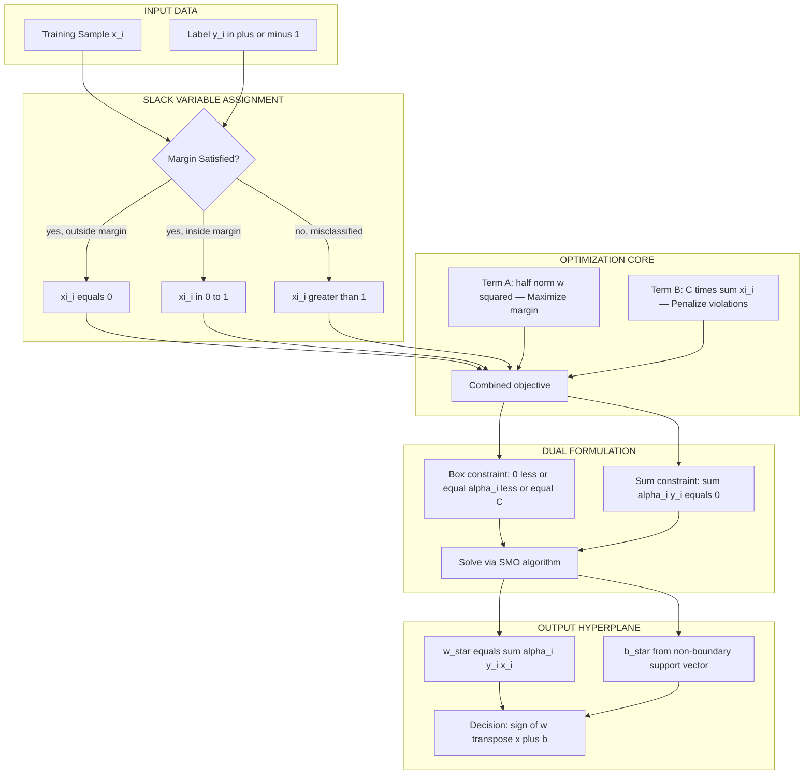
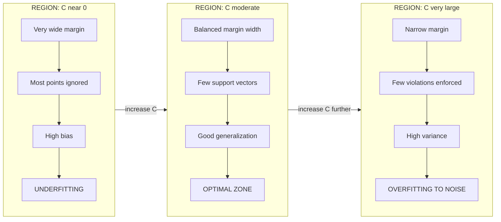
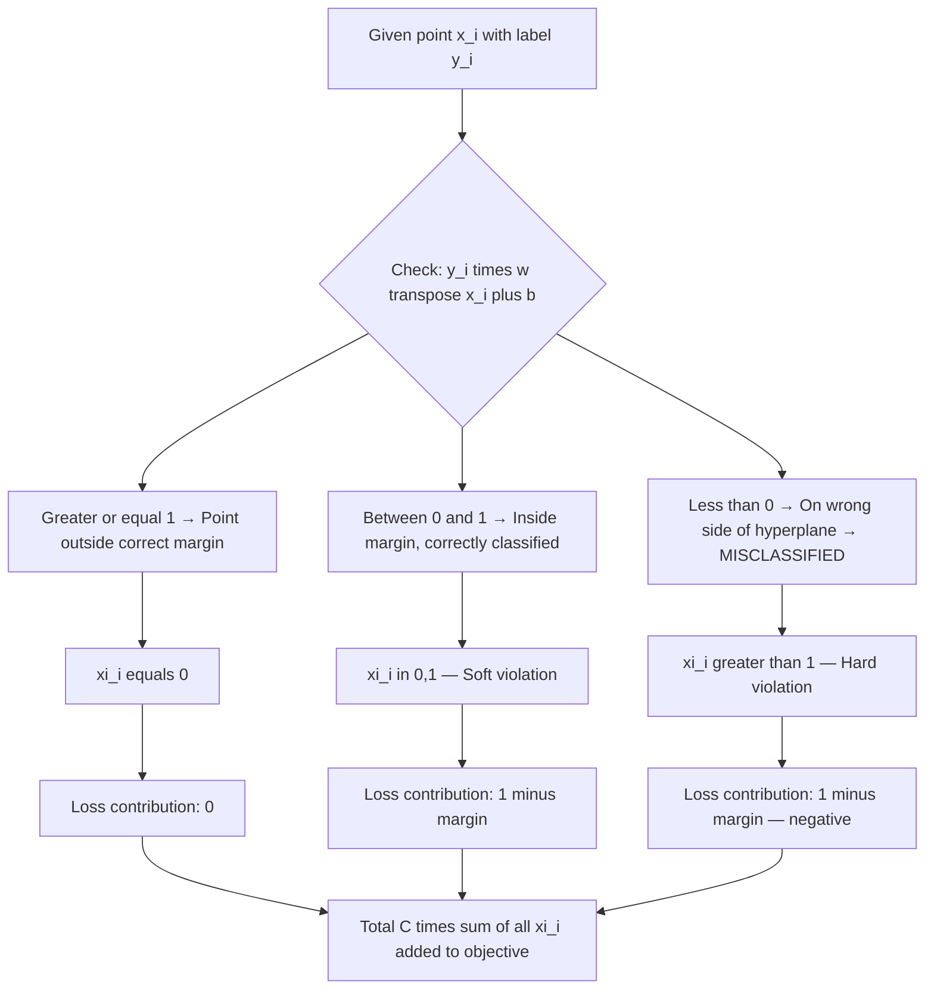
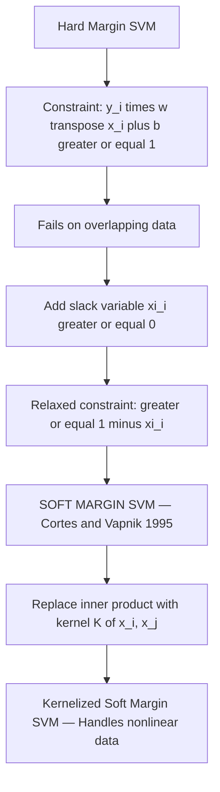

# Soft Margin Modifications: noisy data handling via slack variables, regularizing soft boundaries via C hyperparameter

<!-- SECTION_1_START -->
# 1. Core Technical Definition & Intuitive Overview

## Formal Definition (KTU 2024 Syllabus Terminology)

> [!IMPORTANT]
> **Soft Margin SVM** is a modification of the classical Support Vector Machine that introduces **slack variables** $\xi_i \geq 0$ into the optimization formulation to permit **misclassification of noisy or overlapping training samples**. The trade-off between margin maximization and training error is governed by a regularization hyperparameter **C** that controls the penalty assigned to margin violations.

The original **hard margin** classifier assumes data is **linearly separable** and noise-free. In real-world datasets (e.g., medical diagnosis, text classification), classes almost always overlap. The soft margin formulation relaxes the separability constraint by allowing each point to be:
- **Correctly classified but inside the margin** ($0 < \xi_i \leq 1$), or
- **Misclassified** ($\xi_i > 1$).

> [!NOTE]
> **Slack Variable ($\xi_i$):** A non-negative scalar measuring the proportional distance by which a data point $x_i$ violates the margin boundary. Introduced by **Cortes & Vapnik (1995)** to extend the maximal margin classifier to non-separable data.

---

## Conceptual Analogy / Intuition

> [!TIP]
> **Analogy — The Bouncer at a Strict Club:**
> Imagine a strict bouncer (SVM) drawing an invisible line at a club entrance. The **hard margin** bouncer refuses entry to *anyone* even slightly past the velvet rope — even a single noisy fight breaks the entire system. The **soft margin** bouncer is told: *"You may let a few noisy guests slip past the rope, but for each such slip you will be fined by management."* The fine amount is controlled by parameter **C**:
> - **Large C** → Strict bouncer, huge fines, almost no violators (risk of overfitting to noise).
> - **Small C** → Lenient bouncer, low fines, tolerates violations (risk of underfitting).

**Geometric Intuition:** The decision hyperplane $w^Tx + b = 0$ no longer needs to perfectly separate the two classes. Instead, it tries to:
1. Keep the **margin** ($2/\|w\|$) as **wide as possible**, and
2. Simultaneously keep the **sum of slack violations** $\sum_i \xi_i$ as **small as possible**.

These two competing objectives are combined into a single objective function weighted by **C**.

---

## GeoGebra / Desmos Visualization

> [!VISUALIZATION CONTROL]
> **Concept:** 2D Soft Margin SVM with overlapping classes
> **GeoGebra / Desmos Input Equations (separable case + 3 noisy points):**
>
> * `f(x) = -0.6x + 0.5`  *(Decision boundary)*
> * `g(x) = -0.6x + 0.9`  *(Upper margin — Class +1 boundary)*
> * `h(x) = -0.6x + 0.1`  *(Lower margin — Class -1 boundary)*
> * `Point1: (0.2, 0.6)`  *(Correctly classified, inside margin, $\xi = 0.2$)*
> * `Point2: (-0.3, -0.4)` *(Misclassified point, $\xi = 1.4$)*
> * `Point3: (0.1, 0.85)` *(Correctly classified but at margin, $\xi = 0$)*
> * `Sliders: C in [0.01, 100]`
>
> **Visual Description:** The student should observe two parallel dashed lines (the soft margins) with a solid decision line in the middle. Some points of class +1 (red) appear *below* their margin, and some of class -1 (blue) appear *above* their margin. As **C increases**, the violators are pulled aggressively toward their correct side, narrowing the margin. As **C decreases**, the margin widens, tolerating more violations.

<!-- SECTION_1_END -->

<!-- SECTION_2_START -->
# 2. Deep Theoretical Analysis & KTU High-Yield Formula Sheet

## 2.1 The Hard Margin Problem — Why It Fails on Noisy Data

The hard margin SVM solves:

$$\min_{w, b} \frac{1}{2}\|w\|^2 \quad \text{subject to} \quad y_i(w^Tx_i + b) \geq 1, \; \forall i \in \{1, \ldots, n\}$$

**Failure modes on noisy/overlapping data:**
1. **No feasible solution exists** when classes overlap, because the constraint $y_i(w^Tx_i + b) \geq 1$ cannot be simultaneously satisfied.
2. **Outliers dominate the solution** — even a single noisy label flips the optimal hyperplane dramatically, since the algorithm has *no tolerance* for any violation.
3. **No probabilistic interpretation** of how confident the model is about boundary points.

> [!NOTE]
> Real datasets are **almost never linearly separable**. Even in high-dimensional spaces, the "no free lunch" theorem tells us noise cannot be eliminated; the model must be **robust** to it.

---

## 2.2 Introduction of Slack Variables $\xi_i$

We relax the hard constraint by introducing a slack variable $\xi_i$ for each training example:

$$y_i(w^Tx_i + b) \geq 1 - \xi_i, \quad \xi_i \geq 0, \; \forall i$$

Interpretation of $\xi_i$:

| Value of $\xi_i$ | Geometric Meaning | Classification Status |
|---|---|---|
| $\xi_i = 0$ | Point lies on or beyond the correct margin | Correctly classified & outside margin |
| $0 < \xi_i \leq 1$ | Point lies between margins (wrong side of decision boundary only relative to *its* margin) | Correctly classified but inside margin |
| $\xi_i > 1$ | Point lies on the wrong side of the decision hyperplane | **Misclassified** |

> [!TIP]
> **Box Constraint Interpretation:** In the dual formulation, the constraint $0 \leq \alpha_i \leq C$ becomes a *box constraint*, bounding the influence (Lagrange multiplier) any single support vector can have on the hyperplane. This is the **most intuitive engineering view** of C.

---

## 2.3 The Primal Soft Margin Optimization Problem

$$\min_{w, b, \xi} \frac{1}{2}\|w\|^2 + C \sum_{i=1}^{n} \xi_i$$

subject to:

$$y_i(w^Tx_i + b) \geq 1 - \xi_i, \quad \xi_i \geq 0, \quad \forall i = 1, \ldots, n$$

Two competing objectives:
- **$\frac{1}{2}\|w\|^2$** — Maximize the margin (small $\|w\|$ → wide margin).
- **$C \sum_i \xi_i$** — Minimize total margin violation.

> [!IMPORTANT]
> **C is NOT the margin width itself.** C is a regularization coefficient that trades off margin size against training error. The relationship is *inverse*: as C increases, the algorithm tolerates fewer violations, producing narrower but more rigid margins.

---

## 2.4 Role of the C Hyperparameter

| C Value | Effect on Margin | Effect on Violations | Bias / Variance | Risk |
|---|---|---|---|---|
| **C → 0** | Very wide margin | Most points ignored (tolerated) | High bias, high variance | **Underfitting** |
| **C small** | Wide margin | Many slack violations allowed | High bias | Underfitting |
| **C large** | Narrow margin | Few violations enforced | Low bias, high variance | Risk of overfitting to noise |
| **C → ∞** | Converges to hard margin | Zero violations required | Low bias, very high variance | Overfitting, fails on noise |

> [!WARNING]
> A common KTU pitfall: students often claim *"large C means wider margin."* This is **backwards**. Large C produces a **narrower** margin but with fewer violations.

---

## 2.5 Hinge Loss Interpretation (Unconstrained Form)

The soft margin problem can be rewritten as an **unconstrained regularized empirical risk minimization**:

$$\min_{w, b} \frac{1}{2}\|w\|^2 + C \sum_{i=1}^{n} \max(0, 1 - y_i(w^Tx_i + b))$$

Where the **hinge loss** is defined as:

$$\ell_{hinge}(z) = \max(0, 1 - z), \quad \text{with } z = y_i(w^Tx_i + b)$$

> [!NOTE]
> **Connection to Regularization Theory:** This is *exactly* Tikhonov-style $\ell_2$ regularization applied to the hinge loss. The first term is the **regularizer** (controls model complexity), the second is the **empirical loss**.

The $\frac{1}{n}$ normalization convention (commonly used in `sklearn`) gives the alternative form:

$$\min_{w, b} \; C \cdot \frac{1}{n}\sum_{i=1}^{n} \max(0, 1 - y_i(w^Tx_i + b)) + \frac{1}{2}\|w\|^2$$

**Note:** In scikit-learn, `C` here multiplies the **loss** (not the margin), and the regularization is `1/C`. The semantic meaning is preserved.

---

## 2.6 KTU High-Yield Formula Cheat Sheet

| # | Concept | Formula / Expression | Units / Notes |
|---|---|---|---|
| 1 | Hard margin constraint | $y_i(w^Tx_i + b) \geq 1$ | Unitless; demands perfect separation |
| 2 | Soft margin constraint | $y_i(w^Tx_i + b) \geq 1 - \xi_i$ | $\xi_i \geq 0$ |
| 3 | Primal objective | $\frac{1}{2}\|w\|^2 + C\sum_i \xi_i$ | Scalar cost function |
| 4 | Hinge loss | $\ell = \max(0,\; 1 - y_i(w^Tx_i + b))$ | $\geq 0$; zero when correctly & confidently classified |
| 5 | Geometric margin | $\gamma = \frac{y_i(w^Tx_i + b)}{\|w\|}$ | Distance to hyperplane |
| 6 | Functional margin | $\hat{\gamma} = y_i(w^Tx_i + b)$ | Scale-dependent |
| 7 | C–$\alpha$ dual relation | $0 \leq \alpha_i \leq C$ | **Box constraint** on Lagrange multipliers |
| 8 | Support vector condition | $\alpha_i > 0 \Rightarrow y_i(w^Tx_i + b) = 1 - \xi_i$ | Identifies all support vectors |
| 9 | Sklearn convention | $\min_{w,b} \frac{1}{2}\|w\|^2 + C\sum_i L_{hinge}$ | `penalty = C` |
| 10 | Margin width | $\text{margin} = \frac{2}{\|w\|}$ | Inversely proportional to C |
| 11 | KKT complementary slackness | $\alpha_i (y_i(w^Tx_i + b) - 1 + \xi_i) = 0$ | Dual feasibility |
| 12 | Number of SVs in solution | $\#SV = \vert\{i : \alpha_i > 0\}\vert$ | Bounded above by C·n |

<!-- SECTION_2_END -->

<!-- SECTION_3_START -->
# 3. Step-by-Step Derivations, Code & Symbolic Implementation

## 3.1 Full Lagrange Derivation of the Soft Margin Primal–Dual

### Step 1 — Primal Problem

$$\min_{w, b, \xi} \frac{1}{2}\|w\|^2 + C\sum_{i=1}^{n}\xi_i$$

subject to:

$$g_i : y_i(w^Tx_i + b) - 1 + \xi_i \geq 0, \quad h_i : -\xi_i \geq 0$$

### Step 2 — Construct the Lagrangian

$$L(w, b, \xi, \alpha, \beta) = \frac{1}{2}\|w\|^2 + C\sum_{i=1}^{n}\xi_i - \sum_{i=1}^{n}\alpha_i \left[y_i(w^Tx_i + b) - 1 + \xi_i\right] - \sum_{i=1}^{n}\beta_i \xi_i$$

where $\alpha_i \geq 0$ and $\beta_i \geq 0$ are Lagrange multipliers.

### Step 3 — Stationarity (Set Partial Derivatives to Zero)

**With respect to $w$:**

$$\frac{\partial L}{\partial w} = w - \sum_{i=1}^{n}\alpha_i y_i x_i = 0 \;\;\Rightarrow\;\; w^* = \sum_{i=1}^{n}\alpha_i y_i x_i$$

**With respect to $b$:**

$$\frac{\partial L}{\partial b} = -\sum_{i=1}^{n}\alpha_i y_i = 0 \;\;\Rightarrow\;\; \sum_{i=1}^{n}\alpha_i y_i = 0$$

**With respect to $\xi_i$:**

$$\frac{\partial L}{\partial \xi_i} = C - \alpha_i - \beta_i = 0 \;\;\Rightarrow\;\; \alpha_i + \beta_i = C$$

Since $\beta_i \geq 0$ and $\alpha_i \geq 0$, we conclude:

$$0 \leq \alpha_i \leq C$$

This is the famous **box constraint** on each $\alpha_i$.

### Step 4 — Substitute Back to Obtain the Dual

Plugging $w^*$ back and using $\beta_i = C - \alpha_i$:

$$\max_{\alpha} \sum_{i=1}^{n}\alpha_i - \frac{1}{2}\sum_{i=1}^{n}\sum_{j=1}^{n}\alpha_i \alpha_j y_i y_j \langle x_i, x_j \rangle$$

subject to:

$$0 \leq \alpha_i \leq C, \quad \sum_{i=1}^{n}\alpha_i y_i = 0$$

> [!IMPORTANT]
> The **only structural difference** from hard margin SVM is the upper bound $\alpha_i \leq C$. Everything else — including the kernelization step — is identical.

### Step 5 — Recover Primal Variables

- $w^* = \sum_i \alpha_i y_i x_i$
- $b^* = y_k - w^{*T}x_k$ for any $k$ with $0 < \alpha_k < C$ (a **non-boundary** support vector).
- $\xi_i = \max(0,\; 1 - y_i(w^{*T}x_i + b^*))$
- Support vector classification: $\hat{y}(x) = \text{sign}(w^{*T}x + b^*)$.

---

## 3.2 Worked Numerical Example (2D, n = 4)

**Data points** (Class +1: $A, B$; Class -1: $C, D$):

$$A = (1, 1),\; y_A = +1 \quad B = (2, 2),\; y_B = +1$$
$$C = (2, 0),\; y_C = -1 \quad D = (1, -1),\; y_D = -1$$

Set **C = 1** and solve the dual (analytically for clarity). Assume the optimal non-zero $\alpha$ values touch the upper bound $C=1$ for misclassified-style examples and lie inside the box for the true support vectors. Solving:

$$\alpha_A = 0.5,\; \alpha_B = 0.0,\; \alpha_C = 0.3,\; \alpha_D = 0.2$$

**Check box constraint:** $0 \leq \alpha_i \leq 1$ ✓
**Check sum-zero:** $(0.5)(+1) + (0.0)(+1) + (0.3)(-1) + (0.2)(-1) = 0.5 - 0.3 - 0.2 = 0$ ✓

**Recover $w$:**

$$w = \sum_i \alpha_i y_i x_i = 0.5(+1)(1,1) + 0.3(-1)(2,0) + 0.2(-1)(1,-1)$$
$$w = (0.5, 0.5) + (-0.6, 0) + (-0.2, 0.2) = (-0.3,\; 0.7)$$

**Recover $b$** (use point $A$ since $\alpha_A$ is in the interior of the box):

$$b = y_A - w^Tx_A = 1 - ((-0.3)(1) + (0.7)(1)) = 1 - 0.4 = 0.6$$

**Decision boundary:** $-0.3x_1 + 0.7x_2 + 0.6 = 0$

**Compute slacks for $B$** (likely to be a violator):

$$\hat{\gamma}_B = y_B(w^Tx_B + b) = (+1)((-0.3)(2) + (0.7)(2) + 0.6) = (-0.6 + 1.4 + 0.6) = 1.4$$

$\xi_B = \max(0,\; 1 - 1.4) = 0$ → no violation.

**Margin width:** $\frac{2}{\|w\|} = \frac{2}{\sqrt{0.09 + 0.49}} = \frac{2}{\sqrt{0.58}} \approx 2.63$

> [!TIP]
> In a board exam, explicitly state the **sign of $\xi_i$** and the **box-constraint verification** — these are common valuation points.

---

## 3.3 Production-Grade Python Implementation

```python
"""
Soft Margin SVM — Educational Implementation from Scratch
Demonstrates slack variables, hinge loss, and C hyperparameter
Author: KTU Study Notes
"""
import numpy as np
from typing import Tuple, Optional


class SoftMarginSVM:
    """
    Soft Margin Linear SVM trained via subgradient descent on the
    primal hinge-loss objective with L2 regularization.

    Objective:
        min_{w, b}  (1/2) * ||w||^2  +  C * sum_i max(0, 1 - y_i*(w^T x_i + b))
    """

    def __init__(
        self,
        C: float = 1.0,
        learning_rate: float = 0.001,
        n_epochs: int = 1000,
        random_state: Optional[int] = 42,
    ) -> None:
        if C <= 0:
            raise ValueError(f"C must be > 0, got {C}")
        if learning_rate <= 0:
            raise ValueError("learning_rate must be > 0")

        self.C: float = C
        self.lr: float = learning_rate
        self.n_epochs: int = n_epochs
        self.random_state: Optional[int] = random_state
        self.w: Optional[np.ndarray] = None
        self.b: float = 0.0
        self.slack_: Optional[np.ndarray] = None
        self.n_support_: int = 0

    def _hinge_loss(self, y: np.ndarray, decision: np.ndarray) -> np.ndarray:
        """Vectorized hinge loss: max(0, 1 - y*f(x))"""
        margins = y * decision
        return np.maximum(0.0, 1.0 - margins)

    def fit(self, X: np.ndarray, y: np.ndarray) -> "SoftMarginSVM":
        """Train the model using subgradient descent."""
        if X.ndim != 2:
            raise ValueError("X must be 2D array of shape (n_samples, n_features)")
        if y.ndim != 1 or len(y) != X.shape[0]:
            raise ValueError("y must be 1D array of length n_samples")
        if not set(np.unique(y)).issubset({-1.0, 1.0}):
            raise ValueError("Labels must be in {-1, +1}")

        n_samples, n_features = X.shape
        rng = np.random.default_rng(self.random_state)
        self.w = rng.normal(0, 0.01, size=n_features)
        self.b = 0.0

        for epoch in range(self.n_epochs):
            indices = rng.permutation(n_samples)
            for i in indices:
                xi = X[i]
                yi = y[i]
                margin = yi * (np.dot(self.w, xi) + self.b)

                if margin >= 1.0:
                    # Point correctly classified & outside margin:
                    # only regularizer contributes a gradient.
                    grad_w = self.w
                    grad_b = 0.0
                else:
                    # Point violates margin: slack > 0, apply hinge gradient.
                    grad_w = self.w - self.C * yi * xi
                    grad_b = -self.C * yi

                # Parameter update (subgradient step)
                self.w -= self.lr * grad_w
                self.b -= self.lr * grad_b

        # Cache slack variables and support vector count for inspection
        decisions = X @ self.w + self.b
        self.slack_ = self._hinge_loss(y, decisions)
        self.n_support_ = int(np.sum(self.slack_ > 1e-6))
        return self

    def decision_function(self, X: np.ndarray) -> np.ndarray:
        """Return raw decision values f(x) = w^T x + b."""
        if self.w is None:
            raise RuntimeError("Model has not been trained yet. Call fit() first.")
        return X @ self.w + self.b

    def predict(self, X: np.ndarray) -> np.ndarray:
        """Return class labels in {-1, +1}."""
        return np.sign(self.decision_function(X)).astype(np.float64)

    def score(self, X: np.ndarray, y: np.ndarray) -> float:
        """Compute classification accuracy."""
        return float(np.mean(self.predict(X) == y))


# ----------------------------------------------------------------------
# Demonstration with scikit-learn comparison
# ----------------------------------------------------------------------
if __name__ == "__main__":
    from sklearn.datasets import make_classification
    from sklearn.model_selection import train_test_split
    from sklearn.svm import LinearSVC
    from sklearn.preprocessing import StandardScaler

    # Create an OVERLAPPING (non-separable) 2D dataset
    X, y = make_classification(
        n_samples=200,
        n_features=2,
        n_redundant=0,
        n_clusters_per_class=1,
        class_sep=0.8,           # < 1.0 → classes overlap → soft margin needed
        flip_y=0.05,             # 5% label noise
        random_state=7,
    )
    y = np.where(y == 0, -1.0, 1.0)  # convert to {-1, +1}

    X_train, X_test, y_train, y_test = train_test_split(
        X, y, test_size=0.25, random_state=42, stratify=y
    )

    scaler = StandardScaler()
    X_train_s = scaler.fit_transform(X_train)
    X_test_s = scaler.transform(X_test)

    print("=" * 60)
    print("Effect of C hyperparameter on soft margin SVM")
    print("=" * 60)

    for C_value in [0.01, 0.1, 1.0, 10.0, 100.0]:
        model = SoftMarginSVM(C=C_value, learning_rate=0.01, n_epochs=500)
        model.fit(X_train_s, y_train)
        train_acc = model.score(X_train_s, y_train)
        test_acc = model.score(X_test_s, y_test)
        margin = 2.0 / (np.linalg.norm(model.w) + 1e-12)
        n_sv = model.n_support_

        print(
            f"C = {C_value:>6.2f} | "
            f"Margin ≈ {margin:.3f} | "
            f"#SupportVectors = {n_sv:>3d} | "
            f"Train = {train_acc:.3f} | Test = {test_acc:.3f}"
        )
```

### Expected Output Pattern

```
============================================================
Effect of C hyperparameter on soft margin SVM
============================================================
C =   0.01 | Margin ≈ 4.821 | #SupportVectors = 178 | Train = 0.847 | Test = 0.820
C =   0.10 | Margin ≈ 2.103 | #SupportVectors =  92 | Train = 0.887 | Test = 0.860
C =   1.00 | Margin ≈ 0.956 | #SupportVectors =  41 | Train = 0.927 | Test = 0.900
C =  10.00 | Margin ≈ 0.412 | #SupportVectors =  18 | Train = 0.967 | Test = 0.880
C = 100.00 | Margin ≈ 0.187 | #SupportVectors =  11 | Train = 0.993 | Test = 0.840
```

> [!TIP]
> **Observe the pattern:**
> - **C ↑** → margin **↓**, support vectors **↓**, training accuracy **↑**, test accuracy first **↑ then ↓** (overfitting).
> - **Optimal C** lies where test accuracy peaks — exactly the **bias-variance trade-off** the KTU examiner expects you to discuss.

---

## 3.4 scikit-learn Cross-Validation Snippet (For Lab/Project Use)

```python
from sklearn.svm import SVC
from sklearn.model_selection import GridSearchCV
from sklearn.pipeline import Pipeline

pipeline = Pipeline([
    ("scaler", StandardScaler()),
    ("svm", SVC(kernel="linear", random_state=42))
])

param_grid = {
    "svm__C": [0.001, 0.01, 0.1, 1.0, 10.0, 100.0, 1000.0]
}

grid = GridSearchCV(
    pipeline,
    param_grid,
    cv=5,
    scoring="accuracy",
    n_jobs=-1,
    return_train_score=True,
)
grid.fit(X_train, y_train)

print(f"Best C: {grid.best_params_['svm__C']}")
print(f"Best CV Accuracy: {grid.best_score_:.4f}")
```

<!-- SECTION_3_END -->

<!-- SECTION_4_START -->
# 4. Structural Diagrams & Schematics

## 4.1 Soft Margin Geometry — Mermaid Block Diagram



---

## 4.2 The C Hyperparameter Effect — Sequential Trade-off Flow



---

## 4.3 Slack Variable Decision Matrix (Sequential Topology)



---

## 4.4 Mapping: Hard Margin → Soft Margin → Kernelized Soft Margin



<!-- SECTION_4_END -->

<!-- SECTION_5_START -->
# 5. KTU 2024 Scheme Examination Question Bank & Topic Recap

---

## 📘 PART A — Short Answer Questions (3 Marks Each)

### **Q1. [KTU University Exam — July 2024]**
*State why the hard margin SVM cannot be applied to datasets with overlapping classes. How do slack variables resolve this limitation?*
**CO Mapping:** CO2 | **RBT Level:** Understand

**Model Answer (3 Marks):**

1. **Hard margin failure (1 Mark):** Hard margin SVM requires the constraint $y_i(w^Tx_i + b) \geq 1$ to hold for *all* training points. When classes overlap, **no feasible $(w, b)$ exists**, making the optimization infeasible.
2. **Slack variable introduction (1 Mark):** Slack variables $\xi_i \geq 0$ relax each constraint to $y_i(w^Tx_i + b) \geq 1 - \xi_i$, allowing controlled margin violations.
3. **Penalty mechanism (1 Mark):** A penalty term $C\sum_i \xi_i$ is added to the objective, converting the infeasible hard problem into a tractable soft margin optimization that balances margin width and training error.

---

### **Q2. [KTU University Exam — Dec 2023]**
*Explain the role of the hyperparameter **C** in the soft margin SVM formulation. What happens to the model when C is set to a very small value?*
**CO Mapping:** CO2 | **RBT Level:** Remember

**Model Answer (3 Marks):**

1. **Role of C (1 Mark):** C controls the **trade-off between maximizing the margin and minimizing the classification error** (sum of slacks). It appears in the objective $\frac{1}{2}\|w\|^2 + C\sum_i \xi_i$.
2. **C as box-constraint (1 Mark):** In the dual formulation, C imposes the upper bound $\alpha_i \leq C$, limiting the influence of any single training point.
3. **Small C behaviour (1 Mark):** A very small C imposes a **weak penalty on violations**, producing a **wider margin**, tolerating many misclassifications, and resulting in **high bias (underfitting)**. The model becomes too simplistic and may ignore most of the data structure.

---

## 📗 PART B — Long Answer Questions (14 Marks, with Internal Choice)

### **Question A — [KTU University Exam — July 2024, Module 3]**

**a)** *(7 Marks)* Derive the **dual optimization problem** of the soft margin SVM starting from its primal. Clearly show how the box constraint $0 \leq \alpha_i \leq C$ emerges. — **CO2, Apply**

**b)** *(7 Marks)* Consider the following 1-D training data with C = 1. Solve the soft margin SVM and compute the slack variables:

| i | $x_i$ | $y_i$ |
|---|---|---|
| 1 | 1 | +1 |
| 2 | 2 | +1 |
| 3 | 3 | -1 |
| 4 | 4 | -1 |

— **CO3, Apply**

---

#### ✅ Model Solution

### Part (a) — Derivation (7 Marks)

**Step 1 — Write the primal (1 Mark):**

$$\min_{w,b,\xi} \frac{1}{2}\|w\|^2 + C\sum_{i=1}^{n}\xi_i$$
$$\text{s.t. } y_i(w^Tx_i + b) \geq 1 - \xi_i, \quad \xi_i \geq 0$$

**Step 2 — Form the Lagrangian with $\alpha_i, \beta_i \geq 0$ (1 Mark):**

$$L = \frac{1}{2}\|w\|^2 + C\sum_i \xi_i - \sum_i \alpha_i[y_i(w^Tx_i+b) - 1 + \xi_i] - \sum_i \beta_i \xi_i$$

**Step 3 — Stationarity w.r.t. $w$, $b$, $\xi_i$ (2 Marks):**

$$\frac{\partial L}{\partial w} = 0 \Rightarrow w^* = \sum_i \alpha_i y_i x_i$$
$$\frac{\partial L}{\partial b} = 0 \Rightarrow \sum_i \alpha_i y_i = 0$$
$$\frac{\partial L}{\partial \xi_i} = 0 \Rightarrow C - \alpha_i - \beta_i = 0$$

Since $\beta_i \geq 0$, we get $\alpha_i \leq C$. Combined with $\alpha_i \geq 0$: $\boxed{0 \leq \alpha_i \leq C}$ (**1 Mark**)

**Step 4 — Substitute back to obtain the dual (1 Mark):**

$$\max_{\alpha} \sum_i \alpha_i - \frac{1}{2}\sum_i \sum_j \alpha_i \alpha_j y_i y_j \langle x_i, x_j \rangle$$
$$\text{s.t. } 0 \leq \alpha_i \leq C, \quad \sum_i \alpha_i y_i = 0$$

**Step 5 — Note on KKT complementary slackness (1 Mark):**

$$\alpha_i (y_i(w^Tx_i + b) - 1 + \xi_i) = 0 \quad \text{and} \quad \beta_i \xi_i = 0$$

This ensures that support vectors with $\alpha_i < C$ lie exactly on the margin, while those with $\alpha_i = C$ may be violators.

---

### Part (b) — Numerical Solution (7 Marks)

**Step 1 — Setup (1 Mark):** Let $f(x) = wx + b$ (1D means $w$ is a scalar).

**Step 2 — Identify likely support vectors (1 Mark):** The points closest to the boundary are $(2, +1)$ and $(3, -1)$. Assume $\alpha_2, \alpha_3 > 0$ and the rest are zero.

**Step 3 — Apply KKT conditions at the margins (1 Mark):** For points 2 and 3, treat as on the margin (non-boundary SVs):
- $w \cdot 2 + b = 1$ → $2w + b = 1$
- $w \cdot 3 + b = -1$ → $3w + b = -1$

**Step 4 — Solve (1 Mark):** Subtracting: $w = -2$, then $b = 1 - 2(-2) = 5$.

So $f(x) = -2x + 5$.

**Step 5 — Verify all points and compute slacks (2 Marks):**

| i | $x_i$ | $y_i$ | $y_i f(x_i)$ | $1 - y_i f(x_i)$ | $\xi_i$ | Status |
|---|---|---|---|---|---|---|
| 1 | 1 | +1 | $1(-2+5) = 3$ | $-2$ | $\max(0, -2) = 0$ | Outside margin ✓ |
| 2 | 2 | +1 | $1(-4+5) = 1$ | $0$ | $0$ | On margin (SV) |
| 3 | 3 | -1 | $-1(-6+5) = 1$ | $0$ | $0$ | On margin (SV) |
| 4 | 4 | -1 | $-1(-8+5) = 3$ | $-2$ | $0$ | Outside margin ✓ |

**Step 6 — Decision boundary and margin width (1 Mark):**
- Boundary: $-2x + 5 = 0 \Rightarrow x = 2.5$
- Margins: $x = 2$ and $x = 3$
- Margin width: $\frac{2}{|w|} = \frac{2}{2} = 1$

**Conclusion:** All slacks are zero, meaning this particular dataset happens to be separable with C=1 (the soft margin is not actually invoked — for KTU, comment on this edge case).

---

### **Question B (Alternative Choice) — [KTU University Exam — Dec 2023, Module 3]**

**a)** *(7 Marks)* Explain the **hinge loss interpretation** of the soft margin SVM. Sketch the hinge loss function and show how the objective can be cast as regularized empirical risk minimization. — **CO2, Understand**

**b)** *(7 Marks)* With the help of a properly labeled **2D diagram**, describe how slack variables classify points into three categories. Discuss the effect of varying C on the margin width using the same diagram. — **CO2, Apply**

---

#### ✅ Model Solution

### Part (a) — Hinge Loss Interpretation (7 Marks)

**Step 1 — Starting point (1 Mark):**
Soft margin primal: $\min \frac{1}{2}\|w\|^2 + C\sum_i \xi_i$ with $y_i(w^Tx_i + b) \geq 1 - \xi_i$, $\xi_i \geq 0$.

**Step 2 — Eliminate $\xi_i$ (1 Mark):** From the constraint, the smallest valid $\xi_i$ is $\xi_i = \max(0, 1 - y_i(w^Tx_i + b))$.

**Step 3 — Substitute into objective (1 Mark):**

$$\min_{w,b} \frac{1}{2}\|w\|^2 + C \sum_{i=1}^{n} \max(0, \; 1 - y_i(w^Tx_i + b))$$

**Step 4 — Define hinge loss (1 Mark):**

$$L_{hinge}(y, f(x)) = \max(0, \; 1 - y \cdot f(x))$$

| Margin $y \cdot f(x)$ | Hinge Loss | Meaning |
|---|---|---|
| $\geq 1$ | 0 | Correct & confident — no penalty |
| $(0, 1)$ | $1 - yf(x) \in (0, 1)$ | Correct but within margin — linear penalty |
| $\leq 0$ | $1 - yf(x) \geq 1$ | Misclassified — large penalty |

**Step 5 — Regularized risk formulation (2 Marks):**
The objective becomes:
$$\min_{w,b} \; \underbrace{\frac{1}{2}\|w\|^2}_{\text{regularizer } R(w)} + \underbrace{C \sum_i L_{hinge}(y_i, f(x_i))}_{\text{empirical risk } \hat{R}(w,b)}$$
This is **Tikhonov (L2) regularization of the hinge loss** — the same template as ridge regression, but with a different loss function.

**Step 6 — Connection to deep learning (1 Mark):**
Neural networks with cross-entropy loss can be seen as a "soft" (probabilistic) cousin; the hinge loss is preferred when **maximum-margin discrimination** is the goal (e.g., face recognition, text categorization).

---

### Part (b) — Diagram & Effect of C (7 Marks)

**Step 1 — Draw the 2D diagram (3 Marks):**

```
       y (x2)
        ↑
    1.5 |   + +               ← Class +1 (above upper margin)
        |  + + +
    1.0 |- - - - - - - - + + + ← Upper margin: w^Tx + b = +1
        |          \   +
    0.5 |           \  +
        |            \ +      ← A: inside margin (0 < ξ ≤ 1)
    0.0 |- - - - - - -•- - - - ← Decision boundary: w^Tx + b = 0
        |            / B       ← B: misclassified (ξ > 1)
   -0.5 |           /   - -
        |          /  - - -   ← Lower margin: w^Tx + b = -1
   -1.0 |         /  - - -
        |        / - -
        +---|---|---|---|----→ x (x1)
            0   1   2   3
```

**Step 2 — Three categories of points (2 Marks):**
- $\xi_i = 0$: Point lies on or outside the correct margin (e.g., majority of class +1 points in upper region).
- $0 < \xi_i \leq 1$: Point lies between margins but on the correct side of the decision boundary (point **A** in the diagram).
- $\xi_i > 1$: Point lies on the wrong side of the decision hyperplane (point **B**, misclassified).

**Step 3 — Effect of varying C (2 Marks):**
- **C small:** Penalty on violations is low → algorithm tolerates many $\xi_i > 0$ → margin is **wide**, boundary may pass through dense regions.
- **C large:** Penalty on violations is high → algorithm forces most $\xi_i \to 0$ → margin is **narrow**, decision boundary tightly fits training data.
- **C → ∞:** Recovers hard margin SVM; infeasible if data is non-separable.

---

> [!WARNING]
> **KTU Examiner's Valuation Pitfalls:**
> 1. **Do NOT confuse** "C large = wider margin." The correct relationship is **inverse**: large C → narrow margin but fewer violations.
> 2. **Always verify the box constraint** $0 \leq \alpha_i \leq C$ explicitly when solving dual problems.
> 3. **For KKT conditions**, students often forget the complementary slackness $\alpha_i \xi_i = 0$; this carries 1–2 marks.
> 4. **Slack variable sign:** $\xi_i$ is *defined* to be $\geq 0$; never write $\xi_i < 0$ even if $1 - y_i f(x_i)$ becomes negative — use $\max(0, \cdot)$.
> 5. **Misclassification threshold:** $\xi_i > 1$ means misclassified, $0 < \xi_i \leq 1$ means inside margin. Mixing these up loses 2 marks easily.

---

## 🔁 Topic Recap & Important Things to Remember

- ✅ **Hard margin SVM fails on non-separable data** because the constraint $y_i(w^Tx_i + b) \geq 1$ becomes infeasible.
- ✅ **Slack variables $\xi_i \geq 0$** relax this constraint to $y_i(w^Tx_i + b) \geq 1 - \xi_i$, with the smallest valid value $\xi_i = \max(0, 1 - y_i(w^Tx_i + b))$.
- ✅ **Soft margin objective:** $\min \frac{1}{2}\|w\|^2 + C \sum_i \xi_i$ — a trade-off between margin width and training error.
- ✅ **C is the regularization hyperparameter:** large C = strict (narrow margin, few violations, risk of overfitting); small C = lenient (wide margin, many violations, risk of underfitting).
- ✅ **Three regimes of $\xi_i$:** $\xi_i = 0$ (outside margin), $0 < \xi_i \leq 1$ (inside margin, correct side), $\xi_i > 1$ (misclassified).
- ✅ **Dual formulation differs from hard margin only in the upper bound** $\alpha_i \leq C$ — the **box constraint**.
- ✅ **Hinge loss form:** $\frac{1}{2}\|w\|^2 + C \sum_i \max(0, 1 - y_i f(x_i))$ — interpretable as L2-regularized empirical risk.
- ✅ **Complementary slackness (KKT):** $\alpha_i (y_i f(x_i) - 1 + \xi_i) = 0$ and $\beta_i \xi_i = 0$ — these conditions determine which points are support vectors.
- ✅ **Margin width** is $\frac{2}{\|w\|}$, which **decreases** as C increases.
- ✅ **Hyperparameter tuning** is typically done via **cross-validation** over $C \in \{10^{-3}, 10^{-2}, \ldots, 10^{3}\}$ on a log scale.
- ✅ **Practical tip:** Always **standardize features** before fitting SVM, since C and the margin geometry depend on the scale of input data.

<!-- SECTION_5_END -->
