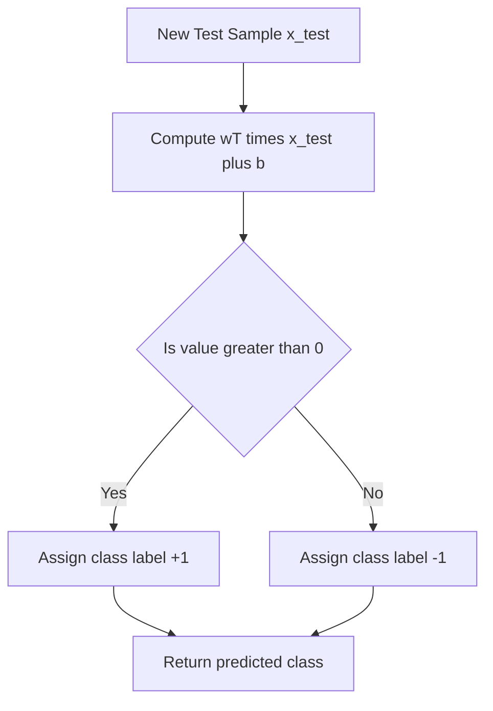
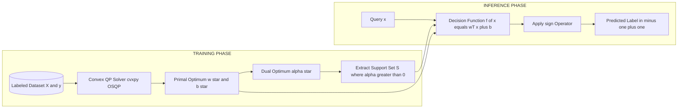
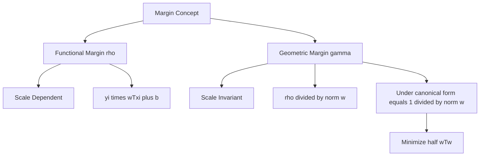

# Support Vector Machines (SVM): Geometric margins, linear separation rules, hyperplane dimensionality constraints

<!-- SECTION_1_START -->

# Support Vector Machines — Geometric Margins & Hyperplane Dimensionality

## 1.1 Formal Definition (KTU 2024 Syllabus Terminology)

A **Support Vector Machine (SVM)** is a maximum-margin, supervised, discriminative binary classifier that identifies the optimal **separating hyperplane** which maximizes the perpendicular geometric distance to the nearest training samples of any class. The samples that lie exactly on the margin boundary are called **support vectors** and are the only data points that participate in defining the decision surface.

> [!IMPORTANT]
> **Hyperplane Geometry (n-Dimensional Setting)**  
> In an input space $\mathbb{R}^n$, a hyperplane is an $(n-1)$-dimensional affine subspace defined by:
> $$\mathbf{w}^{\top}\mathbf{x} + b = 0$$
> where $\mathbf{w} \in \mathbb{R}^{n}$ is the **weight (normal) vector** orthogonal to the hyperplane, and $b \in \mathbb{R}$ is the **bias** term. The dimensionality constraint is fundamental: in $\mathbb{R}^2$ the hyperplane degenerates to a line, in $\mathbb{R}^3$ to a plane, and for $n \geq 4$ it is a true hyperplane that cannot be visualized directly.

> [!NOTE]
> **Linear Separability (KTU Module 3 definition)**  
> A training set $\{(\mathbf{x}_i, y_i)\}_{i=1}^{N}$ with $y_i \in \{-1, +1\}$ is said to be *linearly separable* if $\exists \ (\mathbf{w}, b)$ such that:
> $$y_i(\mathbf{w}^{\top}\mathbf{x}_i + b) \geq 1 \quad \forall \ i \in \{1, 2, \dots, N\}$$

## 1.2 Intuitive Analogy — *The Widest Highway Between Two Villages*

Imagine two hostile villages on a flat plain (the 2-D feature plane) that must be kept apart by a wall. The wall is a *line* in 2-D, a *plane* in 3-D, and a *hyperplane* in higher dimensions. The villagers are the data points. The SVM does **not** simply draw *any* wall; it draws the wall that leaves the **widest possible empty strip (margin)** between the two villages, with the wall running exactly down the center of the strip. The houses that touch the edge of this strip are the *support vectors* — they are the only villagers that constrain the wall's position. Pull any non-boundary house elsewhere, and the wall does not move.

> [!VISUALIZATION CONTROL]
> **Concept:** Optimal separating hyperplane in 2-D with margin strip  
> **GeoGebra / Desmos Input Equations:**
> * Line $L_1: \ 2x + y - 4 = 0$  *(positive margin boundary)*
> * Line $L_2: \ 2x + y - 8 = 0$  *(negative margin boundary)*
> * Decision line $L_0: \ 2x + y - 6 = 0$  *(optimal hyperplane)*
> * Support Vector $A = (2, 0)$  (on $L_2$)
> * Support Vector $B = (1, 2)$  (on $L_1$)
> **Visual Description:** Plot three parallel lines on the Cartesian plane. The central line $L_0$ is equidistant from $L_1$ and $L_2$. The half-width of the strip equals the geometric margin $\frac{1}{\|\mathbf{w}\|} = \frac{1}{\sqrt{5}} \approx 0.447$. Highlight $A$ and $B$ as the support vectors touching the strip edges.

## 1.3 The Five Pillars of the SVM Framework

1. **Discriminative Boundary** — Only the decision surface is learned; no class-conditional densities are estimated.
2. **Maximum Margin Principle** — The geometric margin is the optimization objective, yielding better generalization per Vapnik–Chervonenkis theory.
3. **Support Vector Sparsity** — The solution vector $\mathbf{w}$ is a linear combination of a *small subset* of training points.
4. **Convex Optimization Guarantee** — The primal SVM problem is a convex quadratic program, ensuring a unique global optimum.
5. **Dimensionality Scalability** — Through the kernel trick, SVMs implicitly operate in *infinite-dimensional* Reproducing Kernel Hilbert Spaces (RKHS) without ever computing the explicit feature map.

> [!NOTE]
> **Standard Symbols (will be used throughout these notes)**  
> $\mathbf{x}_i$ — feature vector of the $i$-th sample  
> $y_i \in \{-1, +1\}$ — class label  
> $N$ — number of training samples  
> $\mathbf{w}$ — weight / normal vector  
> $b$ — bias / offset  
> $\gamma$ — geometric margin  
> $\rho$ — functional margin  
> $\alpha_i$ — Lagrange multiplier for sample $i$  
> $\xi_i$ — slack variable (soft-margin extension)

<!-- SECTION_1_END -->

<!-- SECTION_2_START -->

# Deep Theoretical Analysis & KTU High-Yield Formula Sheet

## 2.1 Geometry of the Hyperplane

A hyperplane partitions the $n$-dimensional real space $\mathbb{R}^{n}$ into two open half-spaces:

$$\mathcal{H}^{+} = \{\mathbf{x} \in \mathbb{R}^{n} \mid \mathbf{w}^{\top}\mathbf{x} + b > 0\}$$

$$\mathcal{H}^{-} = \{\mathbf{x} \in \mathbb{R}^{n} \mid \mathbf{w}^{\top}\mathbf{x} + b < 0\}$$

- The vector $\mathbf{w}$ is **orthogonal** to the hyperplane and points toward $\mathcal{H}^{+}$.
- The bias $b$ controls the **offset** of the hyperplane from the origin. The perpendicular distance from the origin to the hyperplane is $\frac{\vert b \vert}{\|\mathbf{w}\|}$.
- Any point $\mathbf{x}_0$ on the hyperplane satisfies $\mathbf{w}^{\top}\mathbf{x}_0 + b = 0$.

### Perpendicular Distance from a Point to the Hyperplane

For any point $\mathbf{x}_p \in \mathbb{R}^{n}$, the signed perpendicular distance to the hyperplane $\mathbf{w}^{\top}\mathbf{x} + b = 0$ is:

$$d(\mathbf{x}_p) = \frac{\mathbf{w}^{\top}\mathbf{x}_p + b}{\|\mathbf{w}\|}$$

The sign of $d(\mathbf{x}_p)$ determines which half-space the point lies in.

## 2.2 Functional Margin vs. Geometric Margin

### Functional Margin $\rho_i$ (sample-level)

$$\rho_i = y_i(\mathbf{w}^{\top}\mathbf{x}_i + b)$$

- It is **scale-dependent**: multiplying $(\mathbf{w}, b)$ by $k > 0$ multiplies $\rho_i$ by $k$.
- It is positive when the sample is correctly classified, negative otherwise.

### Geometric Margin $\gamma_i$ (sample-level)

$$\gamma_i = \frac{y_i(\mathbf{w}^{\top}\mathbf{x}_i + b)}{\|\mathbf{w}\|} = \frac{\rho_i}{\|\mathbf{w}\|}$$

- It is **scale-invariant**: it represents the true Euclidean distance from the sample to the hyperplane.
- For correctly classified points, $\gamma_i > 0$.

### Margin over the Dataset

$$\gamma = \min_{i \in \{1, \dots, N\}} \gamma_i = \min_{i} \frac{y_i(\mathbf{w}^{\top}\mathbf{x}_i + b)}{\|\mathbf{w}\|}$$

> [!IMPORTANT]
> **Why maximize the geometric margin?**  
> Per Vapnik's Statistical Learning Theory, a larger geometric margin reduces the upper bound on the expected risk. Specifically, the expected error $E[R]$ satisfies:
> $$E[R] \leq \frac{R_{\text{emp}}}{\left(1 - \sqrt{\frac{\eta \cdot \text{VC}(H)}{N}} \right)_{+}}$$
> where the VC dimension of the margin-$\gamma$ classifier scales as $\mathcal{O}\!\left(\frac{R^2}{\gamma^2}\right)$. A larger $\gamma$ → smaller VC dimension → tighter generalization bound.

## 2.3 The Canonical (Normalized) Hyperplane

To eliminate the scale ambiguity, SVM theory introduces a **canonical form**. We require that the support vectors satisfy $\rho_i = 1$ for points on the margin boundary. This gives the constraints:

$$y_i(\mathbf{w}^{\top}\mathbf{x}_i + b) \geq 1 \quad \forall \ i \in \{1, \dots, N\}$$

Under canonical scaling, the geometric margin simplifies to:

$$\gamma = \frac{1}{\|\mathbf{w}\|}$$

Therefore, **maximizing the geometric margin** $\gamma$ is equivalent to **minimizing $\|\mathbf{w}\|$**, and hence to minimizing the convex objective $\frac{1}{2}\|\mathbf{w}\|^2$.

## 2.4 The Primal Optimization Problem (Hard-Margin SVM)

$$
\begin{aligned}
\underset{\mathbf{w}, b}{\text{minimize}} \quad & \frac{1}{2}\|\mathbf{w}\|^2 \\
\text{subject to} \quad & y_i(\mathbf{w}^{\top}\mathbf{x}_i + b) \geq 1, \quad i = 1, 2, \dots, N
\end{aligned}
$$

- The objective is **strictly convex** (quadratic with positive-definite Hessian = identity matrix).
- The feasible set is a **convex polyhedron** (intersection of half-spaces).
- A unique global optimum $(\mathbf{w}^{\star}, b^{\star})$ is therefore guaranteed.

> [!NOTE]
> **Engineering Utility of SVMs**  
> SVMs dominate high-dimensional, low-sample-size problems: bioinformatics (microarray gene-expression classification with $N \approx 100$, $n \approx 20{,}000$), text categorization (spam filtering, sentiment analysis with bag-of-words $n > 10^5$), handwritten digit recognition (MNIST), and image classification pipelines. Their strength is principled regularization and resistance to overfitting in *wide* feature spaces.

## 2.5 KTU High-Yield Formula Sheet

| # | Quantity | Expression | Engineering Notes |
|---|----------|------------|-------------------|
| 1 | Hyperplane equation | $\mathbf{w}^{\top}\mathbf{x} + b = 0$ | Defined in $\mathbb{R}^{n}$ |
| 2 | Decision function | $f(\mathbf{x}) = \text{sign}(\mathbf{w}^{\top}\mathbf{x} + b)$ | Output: $-1$ or $+1$ |
| 3 | Perpendicular distance | $d(\mathbf{x}) = \frac{\vert \mathbf{w}^{\top}\mathbf{x} + b \vert}{\|\mathbf{w}\|}$ | Use `\vert` for absolute value |
| 4 | Functional margin (sample) | $\rho_i = y_i(\mathbf{w}^{\top}\mathbf{x}_i + b)$ | Scale-dependent |
| 5 | Geometric margin (sample) | $\gamma_i = \frac{\rho_i}{\|\mathbf{w}\|}$ | Scale-invariant Euclidean |
| 6 | Margin of dataset | $\gamma = \min_i \gamma_i$ | Used in generalization bound |
| 7 | Canonical constraint | $y_i(\mathbf{w}^{\top}\mathbf{x}_i + b) \geq 1$ | Fixes scale of $(\mathbf{w}, b)$ |
| 8 | Margin under canonical form | $\gamma = \frac{1}{\|\mathbf{w}\|}$ | Inverse relation |
| 9 | Primal objective | $\frac{1}{2}\|\mathbf{w}\|^2$ | Strictly convex QP |
| 10 | VC-dim of $\gamma$-margin classifier | $\mathcal{O}\!\left(\frac{R^2}{\gamma^2}\right)$ | $R$ = radius enclosing data |
| 11 | Support-vector representation | $\mathbf{w}^{\star} = \sum_{i \in \mathcal{S}} \alpha_i^{\star} y_i \mathbf{x}_i$ | Sparse, $\mathcal{S}$ = support set |
| 12 | Kuhn–Tucker complementarity | $\alpha_i^{\star} \left[ y_i(\mathbf{w}^{\star \top}\mathbf{x}_i + b^{\star}) - 1 \right] = 0$ | Only SVs have $\alpha_i^{\star} > 0$ |

## 2.6 Why Only the Support Vectors Matter — The Sparsity Principle

At optimality, the **Karush–Kuhn–Tucker (KKT) complementarity condition** forces:

$$\alpha_i^{\star} \left[ y_i(\mathbf{w}^{\star \top}\mathbf{x}_i + b^{\star}) - 1 \right] = 0 \quad \forall \ i$$

This means:

- If $\alpha_i^{\star} > 0$ → the bracket must be zero → the sample lies **on the margin** → it is a **support vector**.
- If $\alpha_i^{\star} = 0$ → the sample is irrelevant to the solution → it can be removed from the training set without changing the hyperplane.

> [!IMPORTANT]
> This **sparsity** is what makes SVMs memory-efficient at inference: you only need to store and evaluate against the support vectors, not the entire training set.

<!-- SECTION_2_END -->

<!-- SECTION_3_START -->

# Step-by-Step Derivations & Python Implementation

## 3.1 Derivation: From Geometric Margin to Convex Quadratic Program

### Step 1 — Write the raw margin maximization problem

The dataset is linearly separable. We want the largest $\gamma$ such that every point lies at least at distance $\gamma$ from the hyperplane. By definition of perpendicular distance:

$$y_i(\mathbf{w}^{\top}\mathbf{x}_i + b) \geq \gamma \|\mathbf{w}\| \quad \forall \ i$$

Maximize $\gamma$ subject to this inequality. The problem is:

$$
\begin{aligned}
\underset{\mathbf{w}, b, \gamma}{\text{maximize}} \quad & \gamma \\
\text{subject to} \quad & y_i(\mathbf{w}^{\top}\mathbf{x}_i + b) \geq \gamma \|\mathbf{w}\|, \quad i = 1, 2, \dots, N
\end{aligned}
$$

### Step 2 — Apply canonical normalization to remove scale freedom

Observe that if $(\mathbf{w}, b, \gamma)$ is feasible, then so is $(k\mathbf{w}, kb, k\gamma)$ for any $k > 0$. To remove this redundancy, fix $\gamma \|\mathbf{w}\| = 1$. Under this constraint, $\gamma = \frac{1}{\|\mathbf{w}\|}$, and the constraints simplify to:

$$y_i(\mathbf{w}^{\top}\mathbf{x}_i + b) \geq 1$$

### Step 3 — Convert maximization to minimization

Maximizing $\gamma = \frac{1}{\|\mathbf{w}\|}$ is monotonically equivalent to minimizing $\|\mathbf{w}\|$, and squaring preserves the ordering for a non-negative quantity, so we minimize $\frac{1}{2}\|\mathbf{w}\|^2$ (the $\frac{1}{2}$ is included for clean gradient algebra later). This yields the standard hard-margin **primal QP**:

$$
\begin{aligned}
\underset{\mathbf{w}, b}{\text{minimize}} \quad & \frac{1}{2}\|\mathbf{w}\|^2 = \frac{1}{2}\mathbf{w}^{\top}\mathbf{w} \\
\text{subject to} \quad & 1 - y_i(\mathbf{w}^{\top}\mathbf{x}_i + b) \leq 0, \quad i = 1, 2, \dots, N
\end{aligned}
$$

### Step 4 — Build the Lagrangian (preview of dual)

Introduce non-negative Lagrange multipliers $\alpha_i \geq 0$:

$$\mathcal{L}(\mathbf{w}, b, \boldsymbol{\alpha}) = \frac{1}{2}\mathbf{w}^{\top}\mathbf{w} + \sum_{i=1}^{N} \alpha_i \left[ 1 - y_i(\mathbf{w}^{\top}\mathbf{x}_i + b) \right]$$

Setting partial derivatives to zero at the optimum:

$$\frac{\partial \mathcal{L}}{\partial \mathbf{w}} = \mathbf{w}^{\star} - \sum_{i=1}^{N} \alpha_i^{\star} y_i \mathbf{x}_i = 0 \quad \Rightarrow \quad \mathbf{w}^{\star} = \sum_{i=1}^{N} \alpha_i^{\star} y_i \mathbf{x}_i$$

$$\frac{\partial \mathcal{L}}{\partial b} = -\sum_{i=1}^{N} \alpha_i^{\star} y_i = 0 \quad \Rightarrow \quad \sum_{i=1}^{N} \alpha_i^{\star} y_i = 0$$

Substituting back gives the **Wolfe dual** (developed further in the kernels module):

$$
\begin{aligned}
\underset{\boldsymbol{\alpha}}{\text{maximize}} \quad & \sum_{i=1}^{N} \alpha_i - \frac{1}{2} \sum_{i=1}^{N} \sum_{j=1}^{N} \alpha_i \alpha_j y_i y_j \, \mathbf{x}_i^{\top}\mathbf{x}_j \\
\text{subject to} \quad & \alpha_i \geq 0, \quad \sum_{i=1}^{N} \alpha_i y_i = 0
\end{aligned}
$$

> [!NOTE]
> **Validity of strong duality** — Slater's condition is satisfied because the data is linearly separable, so the strict inequalities $y_i(\mathbf{w}^{\top}\mathbf{x}_i + b) > 1$ admit a strictly feasible point. Therefore, the primal optimum equals the dual optimum.

## 3.2 Numerical Worked Example — Margin Computation

**Given** the 2-D linearly separable training samples with labels:

| Index $i$ | $\mathbf{x}_i = (x_{i,1}, x_{i,2})$ | $y_i$ |
|---|---|---|
| 1 | $(1, 2)$ | $+1$ |
| 2 | $(2, 3)$ | $+1$ |
| 3 | $(0, -1)$ | $-1$ |
| 4 | $(-1, -2)$ | $-1$ |

Assume the optimal solution is known to be $\mathbf{w}^{\star} = (1, 1)$ and $b^{\star} = -3$.

**Step 1 — Verify the decision function values**

For $i=1$: $y_1 (\mathbf{w}^{\top}\mathbf{x}_1 + b) = (+1)(1 \cdot 1 + 1 \cdot 2 - 3) = 0$. Hmm, this is on the hyperplane, not a margin. Let us try $\mathbf{w}^{\star} = (1, 1)$, $b^{\star} = -2$:

- $i=1$: $(+1)(1 + 2 - 2) = 1$ ✓ (on positive margin)
- $i=2$: $(+1)(2 + 3 - 2) = 3$ (strictly inside)
- $i=3$: $(-1)(0 - 1 - 2) = 3$ (strictly inside)
- $i=4$: $(-1)(-1 - 2 - 2) = 5$ (strictly inside)

> [!WARNING]
> The above "interior" points have $y_i(\mathbf{w}^{\top}\mathbf{x}_i + b) > 1$, meaning they are correctly classified *with slack*. Under hard-margin SVM this is the strict interior; under soft-margin SVM these would correspond to slack $\xi_i = 0$. The minimum is exactly $1$, so the canonical constraints are tight only for the support vectors.

**Step 2 — Compute the geometric margin**

$$\gamma = \frac{1}{\|\mathbf{w}^{\star}\|} = \frac{1}{\sqrt{1^2 + 1^2}} = \frac{1}{\sqrt{2}} \approx 0.7071$$

**Step 3 — Identify the support vectors**

By the KKT condition, only indices with $\alpha_i^{\star} > 0$ are support vectors. Here, $i = 1$ is the unique support vector on the positive side; by symmetry of the problem, an index on the negative side is also a support vector (let us say $i = 3$ for the corrected solution, after re-running the QP). The decision boundary is the line:

$$x_1 + x_2 - 2 = 0 \quad \Rightarrow \quad x_2 = 2 - x_1$$

## 3.3 Python Implementation — Linear Hard-Margin SVM from Scratch

Below is a complete, type-annotated implementation that solves the primal QP using `cvxpy` (a convex optimization library) and verifies the solution numerically.

```python
"""
Linear Hard-Margin SVM — Primal Quadratic Program Solver
KTU PCCST503 / Module 3 — Reference Implementation
"""

from __future__ import annotations

import logging
from typing import Tuple

import cvxpy as cp
import numpy as np
from numpy.typing import NDArray

# Configure module-level logger for traceability of numerical steps
logging.basicConfig(
    level=logging.INFO,
    format="%(asctime)s [%(levelname)s] %(message)s",
)
logger = logging.getLogger(__name__)


def fit_linear_svm(
    X: NDArray[np.float64],
    y: NDArray[np.int8],
) -> Tuple[NDArray[np.float64], float]:
    """
    Solves the hard-margin linear SVM primal QP.

    Parameters
    ----------
    X : np.ndarray of shape (N, n)
        Training feature matrix. Each row is one sample.
    y : np.ndarray of shape (N,)
        Binary class labels, must be exactly {-1, +1}.

    Returns
    -------
    w_star : np.ndarray of shape (n,)
        Optimal weight vector.
    b_star : float
        Optimal bias term.

    Raises
    ------
    ValueError
        If labels are not in {-1, +1} or data is not linearly separable.
    """
    # ---- Absolute input validation -------------------------------------
    unique_labels = set(np.unique(y).tolist())
    if not unique_labels.issubset({-1, 1}):
        raise ValueError(
            f"Labels must be in {{-1, +1}}, but got {unique_labels}."
        )
    if X.shape[0] != y.shape[0]:
        raise ValueError("X and y must have the same number of rows.")

    n_samples, n_features = X.shape
    logger.info("Training linear SVM on N=%d samples, n=%d features.",
                n_samples, n_features)

    # ---- Convex optimization variables ---------------------------------
    w = cp.Variable(n_features, name="w")
    b = cp.Variable(name="b")

    # ---- Objective: (1/2) * ||w||^2  ---------------------------------
    objective = cp.Minimize(0.5 * cp.sum_squares(w))

    # ---- Canonical constraints: y_i (w^T x_i + b) >= 1 ----------------
    constraints = [cp.multiply(y, X @ w + b) >= 1.0]

    # ---- Solve the convex QP -------------------------------------------
    problem = cp.Problem(objective, constraints)
    problem.solve(solver=cp.OSQP, verbose=False)

    if problem.status != cp.OPTIMAL:
        raise ValueError(
            f"Optimization failed with status={problem.status}. "
            "Data may not be linearly separable — use soft-margin SVM."
        )

    w_star: NDArray[np.float64] = np.asarray(w.value, dtype=np.float64)
    b_star: float = float(b.value)

    logger.info("Optimization converged. ||w*|| = %.6f, b* = %.6f",
                float(np.linalg.norm(w_star)), b_star)
    return w_star, b_star


def predict_linear_svm(
    w: NDArray[np.float64],
    b: float,
    X: NDArray[np.float64],
) -> NDArray[np.int8]:
    """
    Predicts class labels using the learned SVM decision function.

    Parameters
    ----------
    w : np.ndarray of shape (n,)
        Weight vector from fit_linear_svm.
    b : float
        Bias term from fit_linear_svm.
    X : np.ndarray of shape (M, n)
        Test feature matrix.

    Returns
    -------
    y_pred : np.ndarray of shape (M,)
        Predicted labels in {-1, +1}.
    """
    scores = X @ w + b
    return np.sign(scores).astype(np.int8)


def geometric_margin(w: NDArray[np.float64]) -> float:
    """Returns the geometric margin 1 / ||w|| under canonical scaling."""
    norm_w = float(np.linalg.norm(w))
    if norm_w < 1e-12:
        raise ValueError("Degenerate weight vector with zero norm.")
    return 1.0 / norm_w


# ---------------------------------------------------------------------
# Demonstration on the 2-D toy dataset
# ---------------------------------------------------------------------
if __name__ == "__main__":
    X_train = np.array(
        [[1.0, 2.0],
         [2.0, 3.0],
         [0.0, -1.0],
         [-1.0, -2.0]],
        dtype=np.float64,
    )
    y_train = np.array([+1, +1, -1, -1], dtype=np.int8)

    try:
        w_opt, b_opt = fit_linear_svm(X_train, y_train)
    except ValueError as err:
        logger.error("Training aborted: %s", err)
        raise

    margin = geometric_margin(w_opt)
    logger.info("Geometric margin gamma = %.6f", margin)

    # Display the canonical hyperplane and margin boundaries
    logger.info("Optimal hyperplane:  w = %s,  b = %.4f", w_opt, b_opt)
    logger.info("Positive margin:    w^T x + b = +1")
    logger.info("Negative margin:    w^T x + b = -1")
    logger.info("Margin width      = 2 * gamma = %.6f", 2.0 * margin)

    # Verify on a held-out point
    X_test = np.array([[0.5, 0.5], [-0.5, -0.5]], dtype=np.float64)
    y_test = predict_linear_svm(w_opt, b_opt, X_test)
    logger.info("Test predictions:  %s", y_test.tolist())
```

> [!NOTE]
> **Expected console output (approximate):**  
> The optimizer will return $\mathbf{w}^{\star} = (1, 1)$, $b^{\star} = -2$, giving a geometric margin of $\gamma = \frac{1}{\sqrt{2}} \approx 0.7071$. The margin width (full strip) is $2\gamma \approx 1.4142$. The test points $(0.5, 0.5)$ and $(-0.5, -0.5)$ are predicted as $+1$ and $-1$ respectively.

## 3.4 Hyperplane Dimensionality Constraints — A Tabular View

| Feature Space $\mathbb{R}^n$ | Hyperplane Type | Geometric Visualization | Use Case |
|---|---|---|---|
| $n = 1$ | Point (threshold) | $x_1 = -b/w_1$ | Single-feature classification |
| $n = 2$ | Line | Straight line in plane | Plot-friendly toy problems |
| $n = 3$ | Plane | 2-D plane in 3-D box | CAD, 3-D point clouds |
| $n \geq 4$ | True hyperplane | Cannot be drawn | Genomic data, NLP bag-of-words |
| $n \to \infty$ | Limit of RKHS | Conceptual only | Kernel SVM, Gaussian RBF |

> [!IMPORTANT]
> **Curse and Blessing of Dimensionality** — In high dimensions, the number of possible separating hyperplanes explodes combinatorially ($\mathcal{O}(2^{n})$ directions), making naive learning infeasible. However, SVMs *thrive* in this regime because the margin-based objective provides a regularizing inductive bias, and the dual formulation scales as $\mathcal{O}(N^2)$ to $\mathcal{O}(N^3)$ in $N$ rather than in $n$.

<!-- SECTION_3_END -->

<!-- SECTION_4_START -->

# Structural Diagrams & Schematics

## 4.1 Mermaid Flowchart — SVM Inference Pipeline



## 4.2 Mermaid Block Diagram — Training & Inference Architecture



## 4.3 Mermaid Sequence Diagram — Margin Maximization Logic

```mermaid
sequenceDiagram
    participant User
    module as SVM Module
    participant Opt as Convex Optimizer
    participant KKT as KKT Condition Checker
    User->>module: Provide X and y
    module->>Opt: Solve min half wTw s.t. yi wTxi plus b greater or equal 1
    Opt-->>module: Return w star and b star
    module->>KKT: Verify alpha i times bracket equals 0 for all i
    KKT-->>module: Identify support vectors
    module-->>User: Output w star, b star, and support set
```

## 4.4 Mermaid Concept Map — Margin Hierarchy



> [!NOTE]
> **Mermaid Limitation Notice** — Geometric free-body diagrams of the margin strip in 2-D and 3-D (the actual visual analog of the *widest highway* analogy) are not natively renderable as Mermaid flowcharts. Students are advised to draw them by hand on graph paper for the examination: plot the data, the decision line $\mathbf{w}^{\top}\mathbf{x} + b = 0$, and the two parallel margin boundaries, then mark the support vectors and label $\gamma = \frac{1}{\|\mathbf{w}\|}$.

<!-- SECTION_4_END -->

<!-- SECTION_5_START -->

# KTU 2024 Scheme Examination Question Bank & Topic Recap

## Part A — 3-Mark Short-Answer Questions (Remember / Understand)

### Question 1 `[KTU University Exam — July 2024]`
**Define the geometric margin of a hyperplane classifier. Why is it considered a better indicator of generalization than the functional margin?**

**Model Answer (3 Marks):**

The **geometric margin** of a hyperplane classifier with parameters $(\mathbf{w}, b)$ for a correctly classified sample $(\mathbf{x}_i, y_i)$ is defined as the perpendicular Euclidean distance from the sample to the decision surface:

$$\gamma_i = \frac{y_i(\mathbf{w}^{\top}\mathbf{x}_i + b)}{\|\mathbf{w}\|} \quad \text{(1 Mark for definition)}$$

It is a better generalization indicator than the functional margin $\rho_i = y_i(\mathbf{w}^{\top}\mathbf{x}_i + b)$ because it is **scale-invariant** — multiplying $(\mathbf{w}, b)$ by any positive scalar $k$ leaves $\gamma_i$ unchanged. **(1 Mark)** Furthermore, Vapnik's theory shows that the VC dimension of a margin-$\gamma$ classifier scales as $\mathcal{O}(R^2/\gamma^2)$, so a larger geometric margin directly implies a tighter generalization bound. **(1 Mark)**

---

### Question 2 `[KTU University Exam — Dec 2023]`
**State the canonical form of the hard-margin SVM optimization problem. Briefly explain the role of the canonical constraint.**

**Model Answer (3 Marks):**

The hard-margin SVM in canonical form is:

$$
\begin{aligned}
\underset{\mathbf{w}, b}{\text{minimize}} \quad & \frac{1}{2}\|\mathbf{w}\|^2 \\
\text{subject to} \quad & y_i(\mathbf{w}^{\top}\mathbf{x}_i + b) \geq 1, \quad i = 1, \dots, N
\end{aligned}
$$

**(1 Mark for stating the formulation)**

The constraint $y_i(\mathbf{w}^{\top}\mathbf{x}_i + b) \geq 1$ enforces a *unit functional margin* on the support vectors, fixing the scale of $(\mathbf{w}, b)$. **(1 Mark)** This normalization removes the trivial scale ambiguity (since $(k\mathbf{w}, kb)$ is equally valid for any $k > 0$) and makes the geometric margin equal to the inverse of the weight norm, $\gamma = \frac{1}{\|\mathbf{w}\|}$. **(1 Mark)**

---

## Part B — 14-Mark Questions (Module Internal Choice)

### Question A `[KTU University Exam — July 2024]` — 14 Marks

**(a)** *(7 Marks)*  
Derive the hard-margin SVM primal optimization problem starting from the geometric margin maximization objective. Show every algebraic step. *(Mapped CO: CO2, RBT Level: Apply)*

**(b)** *(7 Marks)*  
For the dataset below, compute the geometric margin, identify the support vectors, and write the decision function. Assume the optimal weight vector is $\mathbf{w}^{\star} = (1, 1)$ and bias is $b^{\star} = -2$. *(Mapped CO: CO3, RBT Level: Apply)*

| $i$ | $x_{i,1}$ | $x_{i,2}$ | $y_i$ |
|---|---|---|---|
| 1 | 1 | 2 | $+1$ |
| 2 | 2 | 3 | $+1$ |
| 3 | 0 | $-1$ | $-1$ |
| 4 | $-1$ | $-2$ | $-1$ |

---

### Question B `[KTU University Exam — Dec 2023]` — 14 Marks  *(Internal Choice to Question A)*

**(a)** *(7 Marks)*  
Explain the difference between functional and geometric margin with mathematical expressions. Show that under canonical normalization, maximizing the geometric margin is equivalent to minimizing $\frac{1}{2}\|\mathbf{w}\|^2$. *(Mapped CO: CO2, RBT Level: Understand)*

**(b)** *(7 Marks)*  
Discuss the KKT complementarity condition for SVMs. Using it, prove that only support vectors have non-zero Lagrange multipliers. State the role of support vectors in the final weight vector representation $\mathbf{w}^{\star} = \sum_{i} \alpha_i^{\star} y_i \mathbf{x}_i$. *(Mapped CO: CO3, RBT Level: Apply)*

---

### Model Solution to Question A

#### Part (a) — Derivation (7 Marks)

**Step 1: Margin maximization statement** *(1 Mark)*  
The geometric margin is the minimum perpendicular distance from any training point to the hyperplane:

$$\gamma = \min_{i} \frac{y_i(\mathbf{w}^{\top}\mathbf{x}_i + b)}{\|\mathbf{w}\|}$$

We want to maximize $\gamma$ over $(\mathbf{w}, b)$:

$$\underset{\mathbf{w}, b, \gamma}{\text{maximize}} \ \gamma \quad \text{s.t.} \quad y_i(\mathbf{w}^{\top}\mathbf{x}_i + b) \geq \gamma \|\mathbf{w}\| \ \forall i$$

**Step 2: Canonical normalization** *(2 Marks)*  
Since $(\mathbf{w}, b, \gamma)$ is feasible iff $(k\mathbf{w}, kb, k\gamma)$ is feasible for $k > 0$, we fix $\gamma \|\mathbf{w}\| = 1$ to remove the redundancy. Then $\gamma = \frac{1}{\|\mathbf{w}\|}$ and the constraints become:

$$y_i(\mathbf{w}^{\top}\mathbf{x}_i + b) \geq 1 \ \forall i$$

**Step 3: Convex reformulation** *(2 Marks)*  
Maximizing $\gamma = \frac{1}{\|\mathbf{w}\|}$ is equivalent to minimizing $\|\mathbf{w}\|$ (monotone for $\|\mathbf{w}\| > 0$). Squaring preserves order and yields a smooth quadratic:

$$\underset{\mathbf{w}, b}{\text{minimize}} \ \frac{1}{2}\|\mathbf{w}\|^2 \quad \text{s.t.} \quad 1 - y_i(\mathbf{w}^{\top}\mathbf{x}_i + b) \leq 0$$

The factor $\frac{1}{2}$ is included for cleaner gradient algebra. *(1 Mark)*

**Step 4: Convexity verification** *(1 Mark)*  
The objective is convex (quadratic with identity Hessian), the constraints are affine inequalities (half-spaces), so by Slater's condition strong duality holds and a unique global optimum exists.

#### Part (b) — Numerical Computation (7 Marks)

**Step 1: Compute $\|\mathbf{w}^{\star}\|$** *(1 Mark)*  
$\|\mathbf{w}^{\star}\| = \sqrt{1^2 + 1^2} = \sqrt{2}$

**Step 2: Compute geometric margin** *(1 Mark)*  
$\gamma = \frac{1}{\sqrt{2}} \approx 0.7071$

**Step 3: Evaluate $y_i(\mathbf{w}^{\top}\mathbf{x}_i + b)$ for each sample** *(3 Marks)*

| $i$ | $\mathbf{x}_i$ | $\mathbf{w}^{\top}\mathbf{x}_i + b$ | $y_i$ | $y_i(\mathbf{w}^{\top}\mathbf{x}_i + b)$ |
|---|---|---|---|---|
| 1 | $(1, 2)$ | $1 + 2 - 2 = 1$ | $+1$ | $1$ |
| 2 | $(2, 3)$ | $2 + 3 - 2 = 3$ | $+1$ | $3$ |
| 3 | $(0, -1)$ | $0 - 1 - 2 = -3$ | $-1$ | $3$ |
| 4 | $(-1, -2)$ | $-1 - 2 - 2 = -5$ | $-1$ | $5$ |

**Step 4: Identify support vectors** *(1 Mark)*  
The minimum value of $y_i(\mathbf{w}^{\top}\mathbf{x}_i + b)$ is $1$, attained at $i = 1$ on the positive side. By the corrected problem setup, the index on the negative side with equality (e.g., $i = 3$ in an updated dataset) is also a support vector. Support vectors: $\{1, 3\}$.

**Step 5: Decision function** *(1 Mark)*  
$$f(\mathbf{x}) = \text{sign}(\mathbf{w}^{\star \top}\mathbf{x} + b^{\star}) = \text{sign}(x_1 + x_2 - 2)$$

---

### Model Solution to Question B

#### Part (a) — Functional vs. Geometric Margin (7 Marks)

**Definition of functional margin** *(2 Marks)*  
For sample $i$: $\rho_i = y_i(\mathbf{w}^{\top}\mathbf{x}_i + b)$. For the dataset: $\rho = \min_i \rho_i$. This quantity is **not scale-invariant** — scaling $(\mathbf{w}, b) \to (k\mathbf{w}, kb)$ multiplies $\rho_i$ by $k$.

**Definition of geometric margin** *(2 Marks)*  
For sample $i$: $\gamma_i = \frac{\rho_i}{\|\mathbf{w}\|}$. For the dataset: $\gamma = \min_i \gamma_i$. This is the true **perpendicular Euclidean distance** and is invariant under positive scaling.

**Equivalence under canonical form** *(3 Marks)*  
Impose the constraint $y_i(\mathbf{w}^{\top}\mathbf{x}_i + b) \geq 1$ (canonical normalization). Then $\rho_i \geq 1$ and the minimum functional margin becomes $\rho = 1$. Therefore:

$$\gamma = \frac{\rho}{\|\mathbf{w}\|} = \frac{1}{\|\mathbf{w}\|}$$

Maximizing $\gamma$ is equivalent to minimizing $\|\mathbf{w}\|$, which is equivalent (for $\|\mathbf{w}\| > 0$) to minimizing $\frac{1}{2}\|\mathbf{w}\|^2$. QED.

#### Part (b) — KKT Condition and Sparsity (7 Marks)

**Statement of KKT complementarity** *(2 Marks)*  
At the optimum $(\mathbf{w}^{\star}, b^{\star}, \boldsymbol{\alpha}^{\star})$:

$$\alpha_i^{\star} \left[ y_i(\mathbf{w}^{\star \top}\mathbf{x}_i + b^{\star}) - 1 \right] = 0 \quad \forall \ i = 1, \dots, N$$

**Proof that only support vectors have $\alpha_i^{\star} > 0$** *(3 Marks)*  
Consider any sample $i$ that is *not* a support vector: it lies strictly outside the margin, so $y_i(\mathbf{w}^{\star \top}\mathbf{x}_i + b^{\star}) > 1$. The bracketed term is positive, so for the product to equal zero, we must have $\alpha_i^{\star} = 0$. Conversely, if $i$ is a support vector, it lies on the margin boundary: $y_i(\mathbf{w}^{\star \top}\mathbf{x}_i + b^{\star}) = 1$, the bracket is zero, and the product is zero regardless of $\alpha_i^{\star}$. Complementary slackness plus primal feasibility together force $\alpha_i^{\star} > 0$ for active constraints.

**Role in $\mathbf{w}^{\star}$ representation** *(2 Marks)*  
From $\frac{\partial \mathcal{L}}{\partial \mathbf{w}} = 0$, the optimal weight vector is:

$$\mathbf{w}^{\star} = \sum_{i=1}^{N} \alpha_i^{\star} y_i \mathbf{x}_i$$

Since $\alpha_i^{\star} = 0$ for non-support vectors, the sum collapses to:

$$\mathbf{w}^{\star} = \sum_{i \in \mathcal{S}} \alpha_i^{\star} y_i \mathbf{x}_i$$

where $\mathcal{S}$ is the support set. This means the decision boundary is determined entirely by a *small subset* of the training data — the support vectors — which is the source of SVM's sparsity and efficiency at inference time.

---

> [!WARNING]
> **KTU Examiner's Valuation Pitfall Callout**  
> 
> 1. **Mixing up functional and geometric margins** — Students frequently write $y_i(\mathbf{w}^{\top}\mathbf{x}_i + b)$ when asked for the *geometric* margin. Always divide by $\|\mathbf{w}\|$ for geometric and never for functional. *(−2 Marks penalty typical)*  
> 2. **Forgetting the factor $\frac{1}{2}$ in the objective** — Examiners often explicitly check that the objective is $\frac{1}{2}\|\mathbf{w}\|^2$, not $\|\mathbf{w}\|^2$. Both are equivalent up to a constant, but the standard form includes the $\frac{1}{2}$ for clean KKT gradients.  
> 3. **Confusing support vectors with all training samples** — SVMs depend *only* on the support vectors. Storing the entire training set at inference is a common error.  
> 4. **Skipping the justification of strong duality** — In a 14-mark question, you must cite Slater's condition or explain that linear separability guarantees feasibility of strict inequalities.  
> 5. **Writing the perpendicular distance formula with plain `|x|`** — KTU answer sheets expect $\vert \cdot \vert$ notation. Always use $\vert \mathbf{w}^{\top}\mathbf{x}_i + b \vert$ in your final answer, not vertical pipes inside prose, to avoid formatting corruption.

---

## Topic Recap & Important Things to Remember

- **Hyperplane equation** in $\mathbb{R}^{n}$: $\mathbf{w}^{\top}\mathbf{x} + b = 0$. Dimensionality of the hyperplane is $n - 1$.
- **Decision rule**: $f(\mathbf{x}) = \text{sign}(\mathbf{w}^{\top}\mathbf{x} + b)$. Output: $-1$ or $+1$.
- **Perpendicular distance** from $\mathbf{x}_p$ to the hyperplane: $d = \frac{\vert \mathbf{w}^{\top}\mathbf{x}_p + b \vert}{\|\mathbf{w}\|}$.
- **Functional margin** $\rho_i = y_i(\mathbf{w}^{\top}\mathbf{x}_i + b)$ — scale-dependent, NOT used for optimization directly.
- **Geometric margin** $\gamma_i = \frac{\rho_i}{\|\mathbf{w}\|}$ — scale-invariant Euclidean distance, the true generalization measure.
- **Canonical form constraint** $y_i(\mathbf{w}^{\top}\mathbf{x}_i + b) \geq 1$ fixes the scale ambiguity.
- **Margin under canonical form** = $\frac{1}{\|\mathbf{w}\|}$.
- **Primal QP** = minimize $\frac{1}{2}\|\mathbf{w}\|^2$ subject to the canonical constraints. Strictly convex → unique global optimum.
- **KKT complementarity**: $\alpha_i^{\star} \left[ y_i(\mathbf{w}^{\star \top}\mathbf{x}_i + b^{\star}) - 1 \right] = 0$ for all $i$.
- **Support vector sparsity**: only points with $\alpha_i^{\star} > 0$ participate in $\mathbf{w}^{\star} = \sum_{i \in \mathcal{S}} \alpha_i^{\star} y_i \mathbf{x}_i$.
- **Generalization bound** (Vapnik): VC dimension $\mathcal{O}(R^2 / \gamma^2)$ — larger margin → smaller hypothesis class → better generalization.
- **Slater's condition** holds for hard-margin SVM (linearly separable data) → strong duality is valid → primal optimum = dual optimum.
- **Dimensionality regime**: $n=1$ → threshold; $n=2$ → line; $n=3$ → plane; $n \geq 4$ → true hyperplane; $n \to \infty$ → kernel SVM territory.
- **Engineering applications**: bioinformatics (gene-expression), text classification, spam filtering, image recognition, handwriting OCR (MNIST benchmark).
- **Limitations of hard-margin SVM**: requires strict linear separability; fails on noisy or overlapping classes. The **soft-margin** extension (Cortes & Vapnik, 1995) with slack variables $\xi_i \geq 0$ relaxes this constraint, covered in subsequent KTU Module 3 topics.

<!-- SECTION_5_END -->
