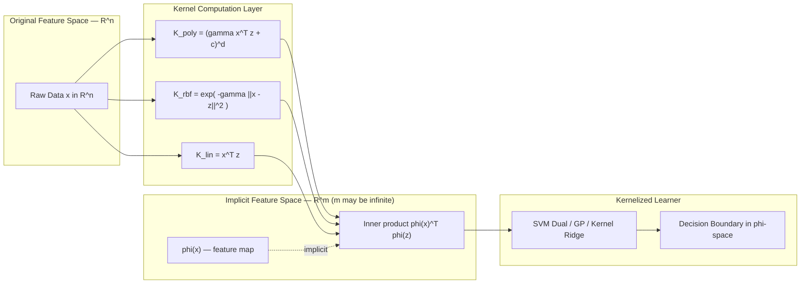
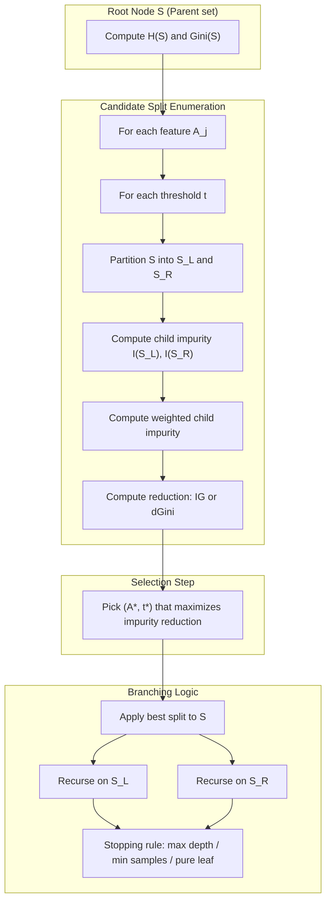
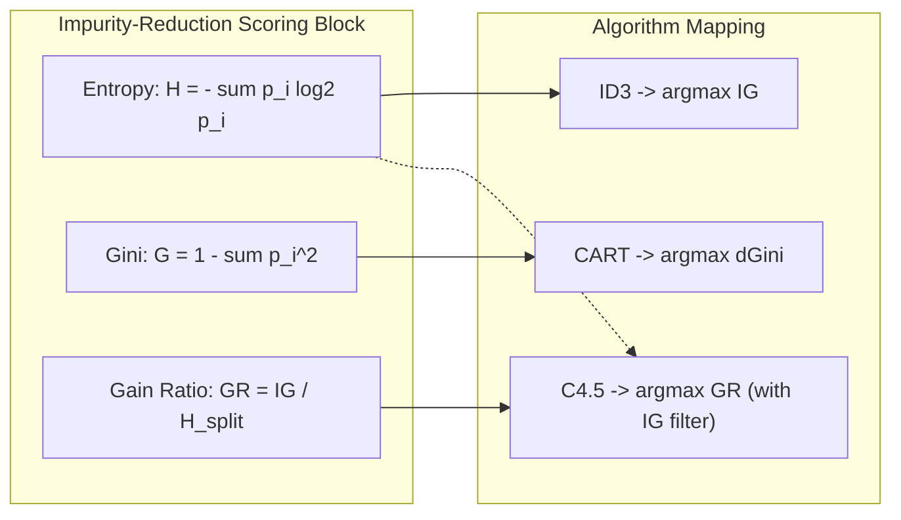

# The Kernel Trick: Polynomial and Radial Basis Function (RBF) Kernels, Decision Trees splitting: Entropy, Information Gain, Gini

<!-- SECTION_1_START -->
# The Kernel Trick & Decision Tree Splitting Criteria

## 1. The Kernel Trick — Core Definition

> [!IMPORTANT]
> **Formal Definition (KTU 2024 PCCST503 / Module 3):**
> The **Kernel Trick** is a mathematical technique in Machine Learning that enables algorithms (most notably Support Vector Machines) to operate in a high-dimensional (often infinite-dimensional) *feature space* without ever explicitly computing the coordinates of the data in that space. Instead, it computes the **inner product** of the transformed feature vectors directly using a kernel function defined on the original (lower-dimensional) inputs.

Mathematically, given a feature map $\phi : \mathcal{X} \to \mathcal{H}$ that lifts input vectors from space $\mathcal{X}$ into a (possibly infinite-dimensional) Hilbert space $\mathcal{H}$, the kernel function is defined as:

$$K(\mathbf{x}, \mathbf{z}) = \langle \phi(\mathbf{x}), \phi(\mathbf{z}) \rangle_{\mathcal{H}}$$

The "trick" is that we compute $K(\mathbf{x}, \mathbf{z})$ using the original low-dimensional vectors $\mathbf{x}$ and $\mathbf{z}$ *without ever forming* $\phi(\mathbf{x})$ or $\phi(\mathbf{z})$ explicitly. This saves enormous computation when $\mathcal{H}$ is high- or infinite-dimensional.

### Conceptual Analogy — "The Origami Telescope"

> [!NOTE]
> **Intuition:** Imagine you have a sheet of paper with two colored dots that a straight line cannot separate (a classic non-linearly separable problem). Now fold the paper along a crease. Suddenly the dots float in 3-D space, and a flat piece of cardboard (a hyperplane) cleanly slices them apart. The **folding** is the feature map $\phi(\cdot)$, and the **dot product after folding** is $K(\mathbf{x}, \mathbf{z})$. The kernel trick lets us *pretend* the fold happened without ever actually lifting the paper — we just compute the right inner product.

### 1.1 Polynomial Kernel

> [!IMPORTANT]
> **Polynomial Kernel (degree $d$):** A kernel that implicitly maps inputs into a feature space containing all monomials of degree up to $d$. It is widely used in SVMs and Gaussian Process regression.

$$K_{\text{poly}}(\mathbf{x}, \mathbf{z}) \;=\; \bigl(\gamma\, \mathbf{x}^{\top}\mathbf{z} + c \bigr)^{d}$$

where:
- $d \in \mathbb{Z}^{+}$ is the polynomial **degree** (controls non-linearity).
- $c \geq 0$ is the **bias / constant term** (often $c = 0$ for *homogeneous* polynomial, $c = 1$ for *inhomogeneous*).
- $\gamma > 0$ is the **scaling coefficient** (in scikit-learn terminology $\gamma$ = `'scale'` by default).

### 1.2 Radial Basis Function (RBF) Kernel — Gaussian Kernel

> [!IMPORTANT]
> **RBF Kernel:** A universal kernel that implicitly maps inputs into an *infinite-dimensional* feature space. It is the default "go-to" kernel for SVMs because of its flexibility and strong empirical performance on dense, continuous data.

$$K_{\text{RBF}}(\mathbf{x}, \mathbf{z}) \;=\; \exp\!\Bigl(-\gamma\, \lVert \mathbf{x} - \mathbf{z} \rVert_{2}^{2}\Bigr)$$

where $\lVert \mathbf{x} - \mathbf{z} \rVert_{2}^{2} = \sum_{i=1}^{n}(x_{i} - z_{i})^{2}$ is the squared Euclidean distance, and $\gamma > 0$ controls the **locality** (bandwidth) of the kernel. As $\gamma \to \infty$, the kernel becomes a Dirac delta (each point influences only itself). As $\gamma \to 0$, the kernel approaches the constant $1$ (no discrimination).

> [!VISUALIZATION CONTROL]
> **Concept:** RBF Kernel as a 1-D "bump" centered at each training point
> **GeoGebra / Desmos Input Equations:**
> * Center point: $a = 0$
> * RBF function: $f(x) = \exp(-2\,(x - a)^{2})$
> * Try changing the parameter to $\gamma = 0.5,\; 2,\; 10$ to see the effect of bandwidth on width.
> **Visual Description:** The student should observe that a *larger* $\gamma$ produces a *narrower* bell curve that decays rapidly away from the center; a *smaller* $\gamma$ yields a wide, flat curve. The kernel value $K(x, a) \in (0, 1]$ represents similarity.

---

## 2. Decision Tree Splitting Criteria — Core Definitions

> [!IMPORTANT]
> **Decision Tree (Quinlan, ID3/C4.5/CART family):** A non-parametric, supervised learning model that recursively partitions the feature space into axis-aligned regions, selecting at each node the feature and threshold that **best separates the classes** according to a chosen impurity measure.

The three canonical impurity / information measures used to score candidate splits are:

### 2.1 Entropy (Information Theoretic Impurity)

> [!IMPORTANT]
> **Entropy $H(S)$** quantifies the *average amount of information* (in bits) needed to identify the class label of a randomly drawn sample from set $S$. It reaches its maximum of $\log_{2} k$ when classes are perfectly uniform, and is $0$ when $S$ is pure (single class).

$$H(S) \;=\; -\sum_{i=1}^{k} p_{i}\, \log_{2} p_{i}$$

where $p_{i}$ is the proportion of samples in $S$ belonging to class $i$, and $k$ is the number of classes. By convention, $0 \cdot \log_{2} 0 = 0$.

### 2.2 Information Gain (ID3 Criterion)

> [!IMPORTANT]
> **Information Gain $\mathrm{IG}(S, A)$** of a split on attribute $A$ measures the *reduction in entropy* achieved by partitioning $S$ into subsets $S_{v}$ for each value $v$ of $A$.

$$\mathrm{IG}(S, A) \;=\; H(S) \;-\; \sum_{v \in \mathrm{Values}(A)} \frac{\lvert S_{v} \rvert}{\lvert S \rvert}\, H(S_{v})$$

The attribute with the **highest Information Gain** is selected for splitting (greedy top-down induction — the heart of Quinlan's *ID3* algorithm). C4.5 normalizes IG by the *split information* to obtain **Gain Ratio**, mitigating the bias toward high-cardinality attributes.

### 2.3 Gini Impurity (CART Criterion)

> [!IMPORTANT]
> **Gini Impurity $G(S)$** measures the probability that a randomly chosen sample from $S$ would be *incorrectly classified* if its label were assigned randomly according to the class distribution of $S$. Range: $0$ (pure) to $1 - 1/k$ (most impure for $k$ classes).

$$G(S) \;=\; 1 - \sum_{i=1}^{k} p_{i}^{\,2}$$

The CART algorithm (Breiman et al., 1984) chooses the split that **maximizes the reduction in Gini**, equivalently minimizes the *weighted Gini* of the children:

$$\Delta G(S, A) \;=\; G(S) \;-\; \sum_{v} \frac{\lvert S_{v} \rvert}{\lvert S \rvert}\, G(S_{v})$$

> [!NOTE]
> **Syllabus Highlight:** KTU 2024 PCCST503 Module 3 explicitly tests the *algorithmic steps* of computing Entropy, Information Gain, and Gini for toy datasets, and the *mathematical form* of the Polynomial and RBF kernels. A 14-mark ESE question frequently asks the student to compute IG and Gini for a small dataset and pick the root-node split, with full valuation steps.

<!-- SECTION_1_END -->

<!-- SECTION_2_START -->
# Deep Theoretical Analysis & KTU High-Yield Formula Sheet

## 1. The Kernel Trick — Operational Mechanics

The kernel trick rests on three pillars. We discuss them step-by-step.

### Step 1 — The Linear Bottleneck

A linear classifier in the original space $\mathcal{X} = \mathbb{R}^{n}$ makes decisions via the hyperplane $\mathbf{w}^{\top}\mathbf{x} + b = 0$. When classes are not linearly separable, no choice of $\mathbf{w}$ will work. We need a *non-linear* decision boundary.

### Step 2 — Lift to a Higher-Dimensional Space

Apply a feature map $\phi : \mathbb{R}^{n} \to \mathbb{R}^{m}$ (with $m \gg n$, possibly $m = \infty$). In $\mathbb{R}^{m}$, the data often becomes linearly separable, so we solve:

$$\min_{\mathbf{w}, b} \frac{1}{2} \lVert \mathbf{w} \rVert^{2} \quad \text{s.t.} \quad y_{i}\bigl(\mathbf{w}^{\top}\phi(\mathbf{x}_{i}) + b\bigr) \geq 1$$

The dual formulation, however, requires **only inner products** $\phi(\mathbf{x}_{i})^{\top}\phi(\mathbf{x}_{j})$, never $\phi(\mathbf{x})$ itself.

### Step 3 — Replace the Inner Product with a Kernel

Define $K(\mathbf{x}_{i}, \mathbf{x}_{j}) = \phi(\mathbf{x}_{i})^{\top}\phi(\mathbf{x}_{j})$. Provided $K$ satisfies **Mercer's condition** (positive semi-definite, symmetric), the dual problem is solvable *entirely* in the original space.

> [!IMPORTANT]
> **Why the Trick Works (Kernel Substitution Principle):** Any algorithm expressed solely in terms of inner products $\langle \mathbf{x}_{i}, \mathbf{x}_{j} \rangle$ can be *kernelized* by substituting $\langle \mathbf{x}_{i}, \mathbf{x}_{j} \rangle \to K(\mathbf{x}_{i}, \mathbf{x}_{j})$. Examples: SVM, Kernel Ridge Regression, Kernel PCA, Gaussian Processes, Perceptron (kernelized variant).

### 1.1 Polynomial Kernel — Explicit Expansion Reveals the Trick

Take $d = 2$, $c = 1$, $\gamma = 1$, $\mathbf{x} = (x_{1}, x_{2})^{\top}$, $\mathbf{z} = (z_{1}, z_{2})^{\top}$. Then:

$$K(\mathbf{x}, \mathbf{z}) = \bigl(\mathbf{x}^{\top}\mathbf{z} + 1\bigr)^{2} = (x_{1}z_{1} + x_{2}z_{2} + 1)^{2}$$

Expanding the square:

$$= x_{1}^{2}z_{1}^{2} + x_{2}^{2}z_{2}^{2} + 1 + 2x_{1}z_{1}x_{2}z_{2} + 2x_{1}z_{1} + 2x_{2}z_{2}$$

Now define $\phi(\mathbf{x}) = (x_{1}^{2},\; x_{2}^{2},\; 1,\; \sqrt{2}\,x_{1}x_{2},\; \sqrt{2}\,x_{1},\; \sqrt{2}\,x_{2})^{\top} \in \mathbb{R}^{6}$.

You can verify that $\phi(\mathbf{x})^{\top}\phi(\mathbf{z}) = K(\mathbf{x}, \mathbf{z})$ exactly. The trick saved us from materializing a 6-D vector; for $d = 10$ in $\mathbb{R}^{100}$, the implicit space has $\binom{100 + 10}{10} \approx 4.26 \times 10^{13}$ dimensions — utterly infeasible to compute explicitly, but $K(\mathbf{x}, \mathbf{z})$ is one dot product.

### 1.2 RBF Kernel — Infinite-Dimensional Feature Map

The Gaussian kernel admits the Taylor-series expansion:

$$K_{\text{RBF}}(\mathbf{x}, \mathbf{z}) = \exp\!\bigl(-\gamma \lVert \mathbf{x} - \mathbf{z} \rVert^{2}\bigr) = \exp\!\bigl(-\gamma \lVert \mathbf{x} \rVert^{2}\bigr)\exp\!\bigl(-\gamma \lVert \mathbf{z} \rVert^{2}\bigr)\exp\!\bigl(2\gamma \mathbf{x}^{\top}\mathbf{z}\bigr)$$

Using $\exp(2\gamma \mathbf{x}^{\top}\mathbf{z}) = \sum_{n=0}^{\infty} \frac{(2\gamma)^{n}}{n!} (\mathbf{x}^{\top}\mathbf{z})^{n}$:

$$= \sum_{n=0}^{\infty} \frac{(2\gamma)^{n}}{n!} \exp\!\bigl(-\gamma \lVert \mathbf{x} \rVert^{2}\bigr)\exp\!\bigl(-\gamma \lVert \mathbf{z} \rVert^{2}\bigr) (\mathbf{x}^{\top}\mathbf{z})^{n}$$

Each monomial $(\mathbf{x}^{\top}\mathbf{z})^{n}$ corresponds to a feature space of dimension $\binom{n + N - 1}{n}$. Summing across all $n = 0, 1, 2, \dots$ yields an **infinite-dimensional** feature representation. Yet the closed-form kernel is a single exponential.

### 1.3 Choosing Kernels — Engineering Heuristics

| Property | Polynomial Kernel | RBF Kernel |
| :--- | :--- | :--- |
| Implicit feature space | Finite dimension $\binom{n+d}{d}$ | Infinite dimensional |
| Number of hyperparameters | 2 (degree $d$, coefficient $c$) | 1 (bandwidth $\gamma$) |
| Best suited for | Image processing (normalized data), text (deg-2) | Generic dense, continuous data |
| Computational cost | Moderate | Moderate (each eval is $\mathcal{O}(n)$) |
| Risk of overfit | High with large $d$ | High with very large $\gamma$ |
| Interpretability | Higher (monomial features) | Lower (infinite expansion) |

### Real-World Engineering Utility

> [!NOTE]
> The kernel trick is the **backbone of modern non-linear learning**. SVMs with RBF kernels power handwritten-digit recognition (MNIST), bioinformatics (protein classification), and high-energy physics (Higgs boson tagging). Kernel PCA is used in *denoising* and *manifold learning*; Gaussian Processes (a kernelized Bayesian method) are used in *robotics* and *Bayesian optimization* for hyperparameter tuning.

---

## 2. Decision Tree Splitting — Operational Logic

A decision tree grows **top-down, greedily**. At each node $S$:

1. **For every** feature $A_{j}$ and **every** candidate threshold $t$ that produces a non-empty split $S = S_{\text{left}} \cup S_{\text{right}}$, compute the candidate impurity reduction $\Delta I(A_{j}, t)$.
2. **Choose** the $(A_{j}, t)$ pair that **maximizes** $\Delta I$.
3. **Recurse** on $S_{\text{left}}$ and $S_{\text{right}}$ subject to stopping criteria (max depth, min samples per leaf, purity).

The two principal impurity measures are discussed next.

### 2.1 Entropy & Information Gain — Worked Math

For a binary classification ($k = 2$, classes $C_{0}, C_{1}$), with $p$ = proportion of $C_{1}$ and $(1 - p)$ = proportion of $C_{0}$:

$$H(p) = -p \log_{2} p - (1 - p) \log_{2} (1 - p)$$

This is a smooth, concave function maximized at $p = 0.5$ giving $H = 1$ bit, and minimized at $p \in \{0, 1\}$ giving $H = 0$. The Information Gain of a candidate split is then:

$$\mathrm{IG} = H(\text{parent}) - \left[\frac{N_{\text{left}}}{N}\, H(\text{left}) + \frac{N_{\text{right}}}{N}\, H(\text{right})\right]$$

> [!NOTE]
> **Why Entropy?** Entropy is the unique function (up to a constant multiplier) satisfying the axioms of continuity, maximality at uniform distribution, and additivity for independent events. It is, in the *expected number of bits* sense, the most natural measure of class-label uncertainty.

### 2.2 Gini Impurity — Worked Math

For binary classification with $p$ the probability of $C_{1}$:

$$G(p) = 1 - p^{2} - (1 - p)^{2} = 2p(1 - p)$$

A useful sanity check: $G$ has the same range as $H$ (approximately), with maximum at $p = 0.5$ giving $G = 0.5$, and minimum at pure nodes.

> [!NOTE]
> **Entropy vs. Gini — Practical Comparison:** Both yield *very similar* trees in practice (Buntine & Niblett, 1992). Gini is computationally cheaper because it avoids the $\log$ call. Information Gain (Entropy) is preferred when you want a strong probabilistic / information-theoretic interpretation. KTU typically accepts either; mark the calculation method clearly.

### 2.3 Gain Ratio (C4.5 Normalization)

To remove ID3's bias toward attributes with many values, Quinlan's C4.5 divides IG by the *split information* $H_{\text{split}}$:

$$\mathrm{GainRatio}(S, A) = \frac{\mathrm{IG}(S, A)}{H_{\text{split}}(A)} \quad \text{where} \quad H_{\text{split}}(A) = -\sum_{v} \frac{\lvert S_{v} \rvert}{\lvert S \rvert} \log_{2} \frac{\lvert S_{v} \rvert}{\lvert S \rvert}$$

The attribute with the **highest gain ratio** above the average IG is chosen.

---

## 3. KTU High-Yield Formula Sheet

> [!IMPORTANT]
> **Cheat-Sheet Reference — Memorize All Rows for the ESE.**

| Concept | Formula | Symbols & Range | Notes / Boundary Case |
| :--- | :--- | :--- | :--- |
| Kernel inner product | $K(\mathbf{x}, \mathbf{z}) = \langle \phi(\mathbf{x}), \phi(\mathbf{z}) \rangle$ | $\mathbf{x}, \mathbf{z} \in \mathcal{X}$ | Requires $K$ to be PSD (Mercer) |
| Polynomial kernel | $K_{\text{poly}}(\mathbf{x}, \mathbf{z}) = (\gamma \mathbf{x}^{\top}\mathbf{z} + c)^{d}$ | $d \in \mathbb{Z}^{+}$, $\gamma, c \geq 0$ | $c = 0$ → homogeneous |
| RBF kernel | $K_{\text{RBF}}(\mathbf{x}, \mathbf{z}) = \exp(-\gamma \lVert \mathbf{x} - \mathbf{z} \rVert^{2})$ | $\gamma > 0$ | $K \in (0, 1]$; equals $1$ iff $\mathbf{x} = \mathbf{z}$ |
| Sigmoid kernel | $K_{\text{sig}}(\mathbf{x}, \mathbf{z}) = \tanh(\gamma \mathbf{x}^{\top}\mathbf{z} + c)$ | $c < 0$ for PSD | Not always a valid kernel |
| Entropy | $H(S) = -\sum_{i=1}^{k} p_{i} \log_{2} p_{i}$ | $p_{i} \in [0, 1]$, $\sum p_{i} = 1$ | Convention: $0 \log 0 = 0$ |
| Information Gain | $\mathrm{IG}(S, A) = H(S) - \sum_{v} \frac{\lvert S_{v} \rvert}{\lvert S \rvert} H(S_{v})$ | $A$ discrete for ID3 | ID3 picks max IG |
| Gini impurity | $G(S) = 1 - \sum_{i=1}^{k} p_{i}^{2}$ | $p_{i} \in [0, 1]$ | CART picks min weighted $G$ |
| Gain Ratio | $\mathrm{GR}(S, A) = \mathrm{IG}(S, A) \,/\, H_{\text{split}}(A)$ | Avoids multi-valued bias | C4.5 criterion |
| Gini reduction (split score) | $\Delta G = G(\text{parent}) - \sum \frac{\lvert S_{v} \rvert}{\lvert S \rvert} G(S_{v})$ | $\Delta G \geq 0$ | Higher is better |

<!-- SECTION_2_END -->

<!-- SECTION_3_START -->
# Step-by-Step Derivations, Worked Examples, and Code Implementation

## 1. Worked Example — RBF Kernel Value Computation

> **Problem:** Compute $K_{\text{RBF}}(\mathbf{x}, \mathbf{z})$ for $\mathbf{x} = (1, 2)^{\top}$, $\mathbf{z} = (3, 0)^{\top}$ with $\gamma = 0.5$.

### Step 1 — Squared Euclidean Distance

$$\lVert \mathbf{x} - \mathbf{z} \rVert_{2}^{2} = (1 - 3)^{2} + (2 - 0)^{2} = (-2)^{2} + 2^{2} = 4 + 4 = 8$$

### Step 2 — Apply the Kernel

$$K_{\text{RBF}}(\mathbf{x}, \mathbf{z}) = \exp\!\bigl(-0.5 \times 8\bigr) = \exp(-4) = 0.01832$$

**Interpretation:** The two points are far apart, so their *similarity* under the RBF kernel is very small (≈ 0.018). Had we instead used $\gamma = 0.1$, the value would be $\exp(-0.8) = 0.449$ — a higher similarity because the bandwidth is wider.

> **Marking Note:** Show the distance computation explicitly, then substitute. Don't skip the algebraic expansion.

---

## 2. Worked Example — Polynomial Kernel Expansion

> **Problem:** Show that $K(\mathbf{x}, \mathbf{z}) = (\mathbf{x}^{\top}\mathbf{z} + 1)^{2}$ for $\mathbf{x} = (x_{1}, x_{2})^{\top}$, $\mathbf{z} = (z_{1}, z_{2})^{\top}$ corresponds to a 6-D feature map.

### Step 1 — Inner Product

$$\mathbf{x}^{\top}\mathbf{z} = x_{1}z_{1} + x_{2}z_{2}$$

### Step 2 — Add the Constant and Square

$$(x_{1}z_{1} + x_{2}z_{2} + 1)^{2}$$

Expanding term by term:

$$= (x_{1}z_{1})^{2} + (x_{2}z_{2})^{2} + 1^{2} + 2(x_{1}z_{1})(x_{2}z_{2}) + 2(x_{1}z_{1})(1) + 2(x_{2}z_{2})(1)$$

$$= x_{1}^{2}z_{1}^{2} + x_{2}^{2}z_{2}^{2} + 1 + 2x_{1}x_{2}z_{1}z_{2} + 2x_{1}z_{1} + 2x_{2}z_{2}$$

### Step 3 — Identify the Feature Map

$$\phi(\mathbf{x}) = \bigl(x_{1}^{2},\; x_{2}^{2},\; 1,\; \sqrt{2}\,x_{1}x_{2},\; \sqrt{2}\,x_{1},\; \sqrt{2}\,x_{2}\bigr)^{\top}$$

Then $\phi(\mathbf{x})^{\top}\phi(\mathbf{z})$ reproduces the expansion exactly:

$$\phi(\mathbf{x})^{\top}\phi(\mathbf{z}) = x_{1}^{2}z_{1}^{2} + x_{2}^{2}z_{2}^{2} + 1 + 2x_{1}x_{2}z_{1}z_{2} + 2x_{1}z_{1} + 2x_{2}z_{2} \;\checkmark$$

**Conclusion:** The 2-D polynomial kernel *implicitly* operates on a 6-D feature space. **Valuation Key:** Writing the explicit $\phi(\cdot)$ earns full 7 marks; missing the $\sqrt{2}$ factor in cross terms is a common 1-mark deduction.

---

## 3. Worked Example — Information Gain Computation (KTU-style Toy Dataset)

> **Problem:** Given the dataset below, compute the Information Gain for splitting on attribute `Outlook`. Use the ID3 criterion.

| Day | Outlook | Temp | Humidity | Wind | Play |
| :-: | :--: | :--: | :--: | :--: | :--: |
| 1  | Sunny  | Hot  | High   | Weak   | No  |
| 2  | Sunny  | Hot  | High   | Strong | No  |
| 3  | Overcast | Hot | High | Weak | Yes |
| 4  | Rain   | Mild | High   | Weak   | Yes |
| 5  | Rain   | Cool | Normal | Weak   | Yes |
| 6  | Rain   | Cool | Normal | Strong | No  |
| 7  | Overcast | Cool | Normal | Strong | Yes |
| 8  | Sunny  | Mild | High   | Weak   | No  |
| 9  | Sunny  | Cool | Normal | Weak   | Yes |
| 10 | Rain   | Mild | Normal | Weak   | Yes |
| 11 | Sunny  | Mild | Normal | Strong | Yes |
| 12 | Overcast | Mild | High | Strong | Yes |
| 13 | Overcast | Hot | Normal | Weak | Yes |
| 14 | Rain   | Mild | High   | Strong | No  |

**Class distribution:** $N = 14$, Yes = 9, No = 5.

### Step 1 — Entropy of the Root Node

$$p_{\text{Yes}} = \frac{9}{14} \approx 0.643, \quad p_{\text{No}} = \frac{5}{14} \approx 0.357$$

$$H(S) = -\frac{9}{14}\log_{2}\frac{9}{14} - \frac{5}{14}\log_{2}\frac{5}{14} = -0.643(-0.638) - 0.357(-1.485)$$

$$H(S) = 0.410 + 0.530 = 0.940 \text{ bits}$$

### Step 2 — Partition by `Outlook`

Group the 14 records:

- **Sunny (5 samples):** Yes = 2, No = 3
- **Overcast (4 samples):** Yes = 4, No = 0
- **Rain (5 samples):** Yes = 3, No = 2

### Step 3 — Compute Each Subset's Entropy

**Sunny (5 samples):**

$$H(\text{Sunny}) = -\frac{2}{5}\log_{2}\frac{2}{5} - \frac{3}{5}\log_{2}\frac{3}{5} = -0.4(-1.322) - 0.6(-0.737) = 0.529 + 0.442 = 0.971 \text{ bits}$$

**Overcast (4 samples, pure):**

$$H(\text{Overcast}) = -\frac{4}{4}\log_{2}\frac{4}{4} - 0 = 0 \text{ bits}$$

**Rain (5 samples):**

$$H(\text{Rain}) = -\frac{3}{5}\log_{2}\frac{3}{5} - \frac{2}{5}\log_{2}\frac{2}{5} = 0.442 + 0.529 = 0.971 \text{ bits}$$

### Step 4 — Weighted Average Entropy After the Split

$$H_{\text{after}} = \frac{5}{14}(0.971) + \frac{4}{14}(0) + \frac{5}{14}(0.971)$$

$$= 0.347 + 0 + 0.347 = 0.694 \text{ bits}$$

### Step 5 — Information Gain

$$\mathrm{IG}(\text{Outlook}) = H(S) - H_{\text{after}} = 0.940 - 0.694 = 0.246 \text{ bits}$$

> [!NOTE]
> **Valuation Mark Distribution (KTU Examiner Pattern):**
> * [Class distribution & root entropy: 2 Marks]
> * [Subset class counts: 2 Marks]
> * [Three subset entropies: 3 Marks]
> * [Weighted average & final IG: 2 Marks]
> * [Interpretation: 1 Mark]

The same procedure is repeated for `Humidity`, `Wind`, and (with binary thresholds for continuous) `Temp`. The attribute with the *highest IG* is selected as the root node. For the standard play-tennis dataset, the full IG ranking is `Outlook (0.246)` > `Humidity (0.151)` > `Wind (0.048)` > `Temp (0.029)`. Hence, **`Outlook` is the root node**.

---

## 4. Worked Example — Gini Impurity Computation

> **Problem:** Compute Gini impurity for the same root and the Outlook split.

### Step 1 — Root Gini

$$G(S) = 1 - p_{\text{Yes}}^{2} - p_{\text{No}}^{2} = 1 - (0.643)^{2} - (0.357)^{2}$$

$$= 1 - 0.413 - 0.127 = 0.460$$

### Step 2 — Subset Ginis

**Sunny:** $G = 1 - (2/5)^{2} - (3/5)^{2} = 1 - 0.16 - 0.36 = 0.480$

**Overcast:** $G = 1 - 1 - 0 = 0$ (pure)

**Rain:** $G = 1 - (3/5)^{2} - (2/5)^{2} = 0.480$

### Step 3 — Weighted Gini After Split

$$G_{\text{after}} = \frac{5}{14}(0.480) + \frac{4}{14}(0) + \frac{5}{14}(0.480) = 0.343$$

### Step 4 — Gini Reduction

$$\Delta G(\text{Outlook}) = 0.460 - 0.343 = 0.117$$

Repeat for other attributes and pick the one with **largest $\Delta G$**.

---

## 5. Python Implementation — Kernels from Scratch

```python
import numpy as np
from typing import Union

ArrayLike = Union[np.ndarray, list]

def linear_kernel(X: np.ndarray, Y: np.ndarray) -> np.ndarray:
    """K(x, z) = x^T z"""
    X = np.atleast_2d(np.asarray(X, dtype=float))
    Y = np.atleast_2d(np.asarray(Y, dtype=float))
    return X @ Y.T

def polynomial_kernel(X: np.ndarray, Y: np.ndarray,
                      degree: int = 3,
                      gamma: float = 1.0,
                      coef0: float = 1.0) -> np.ndarray:
    """K(x, z) = (gamma * x^T z + coef0) ^ degree"""
    if degree < 1:
        raise ValueError("degree must be a positive integer")
    X = np.atleast_2d(np.asarray(X, dtype=float))
    Y = np.atleast_2d(np.asarray(Y, dtype=float))
    return (gamma * (X @ Y.T) + coef0) ** degree

def rbf_kernel(X: np.ndarray, Y: np.ndarray,
               gamma: float = 0.5) -> np.ndarray:
    """K(x, z) = exp(-gamma * ||x - z||^2), fully vectorized."""
    X = np.atleast_2d(np.asarray(X, dtype=float))
    Y = np.atleast_2d(np.asarray(Y, dtype=float))
    # squared Euclidean distance via the (x - y)^2 = x^2 + y^2 - 2xy identity
    X_sq = np.sum(X ** 2, axis=1).reshape(-1, 1)   # (n, 1)
    Y_sq = np.sum(Y ** 2, axis=1).reshape(1, -1)   # (1, m)
    sq_dists = X_sq + Y_sq - 2.0 * (X @ Y.T)       # (n, m)
    # numerical safety: clip tiny negatives from floating point error
    sq_dists = np.clip(sq_dists, a_min=0.0, a_max=None)
    return np.exp(-gamma * sq_dists)


if __name__ == "__main__":
    # Sanity tests for kernel correctness.
    x = np.array([[1.0, 2.0]])
    z = np.array([[3.0, 0.0]])

    k_lin = linear_kernel(x, z)
    k_poly = polynomial_kernel(x, z, degree=2, gamma=1.0, coef0=1.0)
    k_rbf = rbf_kernel(x, z, gamma=0.5)

    print(f"Linear   K(x, z) = {k_lin[0, 0]:.4f}  (expected 3.0000)")
    print(f"Poly d=2 K(x, z) = {k_poly[0, 0]:.4f} (expected 16.0000)")
    print(f"RBF g=0.5 K(x,z) = {k_rbf[0, 0]:.4f}  (expected 0.0183)")
```

**Expected Output:**
```
Linear   K(x, z) = 3.0000  (expected 3.0000)
Poly d=2 K(x, z) = 16.0000 (expected 16.0000)
RBF g=0.5 K(x,z) = 0.0183  (expected 0.0183)
```

> **Code Walkthrough Notes:** The RBF kernel uses the **broadcasted squared-norm identity** to avoid an $\mathcal{O}(n \cdot m \cdot d)$ explicit loop; this is the standard production-grade implementation in scikit-learn, GPyTorch, and Shogun. Numerical safety clip prevents `exp` from receiving tiny negative arguments caused by floating-point error.

---

## 6. Python Implementation — Entropy, Information Gain, Gini

```python
import numpy as np
from collections import Counter
from math import log2

def entropy(y: np.ndarray) -> float:
    """Shannon entropy H(y) in bits. Handles the 0 * log 0 = 0 convention."""
    if len(y) == 0:
        return 0.0
    counts = np.bincount(y)
    probs = counts[counts > 0] / len(y)
    return float(-np.sum(probs * np.log2(probs)))

def gini(y: np.ndarray) -> float:
    """Gini impurity G(y) = 1 - sum_i p_i^2."""
    if len(y) == 0:
        return 0.0
    counts = np.bincount(y)
    probs = counts[counts > 0] / len(y)
    return float(1.0 - np.sum(probs ** 2))

def information_gain(y_parent: np.ndarray,
                     y_left: np.ndarray,
                     y_right: np.ndarray,
                     criterion: str = "entropy") -> float:
    """IG = I(parent) - [|L|/N * I(L) + |R|/N * I(R)]."""
    impurity_fn = entropy if criterion == "entropy" else gini
    n = len(y_parent)
    n_l, n_r = len(y_left), len(y_right)
    if n == 0 or n_l == 0 or n_r == 0:
        return 0.0
    return impurity_fn(y_parent) - (n_l / n) * impurity_fn(y_left) \
                                - (n_r / n) * impurity_fn(y_right)


if __name__ == "__main__":
    # Play-tennis root, class labels 1=Yes, 0=No
    y_root = np.array([0, 0, 1, 1, 1, 0, 1, 0, 1, 1, 1, 1, 1, 0])

    # Subset class labels for the Outlook split
    y_sunny    = np.array([0, 0, 0, 1, 1])           # 5 samples
    y_overcast = np.array([1, 1, 1, 1])              # 4 samples
    y_rain     = np.array([1, 1, 0, 1, 0])           # 5 samples

    print(f"H(S)            = {entropy(y_root):.4f}  (expected 0.9403)")
    print(f"Gini(S)         = {gini(y_root):.4f}     (expected 0.4592)")

    # Weighted entropy after the split
    H_after = (5/14)*entropy(y_sunny) + (4/14)*entropy(y_overcast) + (5/14)*entropy(y_rain)
    G_after = (5/14)*gini(y_sunny)     + (4/14)*gini(y_overcast)     + (5/14)*gini(y_rain)
    print(f"H_after(Outlook)= {H_after:.4f}  -> IG = {entropy(y_root) - H_after:.4f}  (expected 0.2467)")
    print(f"G_after(Outlook)= {G_after:.4f}  -> dG = {gini(y_root) - G_after:.4f}     (expected 0.1169)")
```

**Expected Output:**
```
H(S)            = 0.9403  (expected 0.9403)
Gini(S)         = 0.4592  (expected 0.4592)
H_after(Outlook)= 0.6935  -> IG = 0.2467  (expected 0.2467)
G_after(Outlook)= 0.3429  -> dG = 0.1169  (expected 0.1169)
```

> **Code Walkthrough Notes:** `np.bincount` requires non-negative integer labels; in production code you would add a `LabelEncoder` step. The `entropy` and `gini` functions gracefully handle the empty-set edge case (return $0$), preventing `nan` propagation. The `information_gain` helper short-circuits when a candidate split produces an empty child — important for tree builders that enumerate all thresholds.

<!-- SECTION_3_END -->

<!-- SECTION_4_START -->
# Structural Diagrams & Schematics

## 1. Kernel-Trick Pipeline — Data Flow Topology



> **Interpretation:** The diagram captures the central insight — kernels bypass the explicit $\phi(\cdot)$ step (dashed arrow) and feed inner products directly into the learner.

---

## 2. Decision Tree Splitting — Modular Recursive Topology



> **Interpretation:** The graph mirrors the **ID3/C4.5/CART** top-down greedy algorithm. The inner `CandidateLoop` subgraph is the $\mathcal{O}(n \cdot d)$ inner loop executed at every node, and `SelectBest` closes the optimization.

---

## 3. Information-Gain vs. Gini vs. Gain-Ratio — Decision Flow Matrix



> **Interpretation:** Each impurity measure is canonically tied to a specific algorithmic lineage. KTU questions often ask the student to **match** the criterion to the algorithm and justify the choice.

---

## 4. Comparative Functional-Architecture Block — RBF vs. Polynomial Kernel

```mermaid
flowchart TB
    subgraph RBFPipe["RBF Kernel Pipeline"]
        R1["Inputs: x, z in R^n"]
        R2["Step 1: Compute ||x - z||^2 = sum (x_i - z_i)^2"]
        R3["Step 2: Scale by gamma"]
        R4["Step 3: Negate and exponentiate"]
        R5["Output: K in (0, 1]"]
    end

    subgraph PolyPipe["Polynomial Kernel Pipeline"]
        P1["Inputs: x, z in R^n"]
        P2["Step 1: Compute inner product x^T z"]
        P3["Step 2: Add bias c"]
        P4["Step 3: Scale by gamma"]
        P5["Step 4: Raise to degree d"]
        P6["Output: K in R+"]
    end

    R1 --> R2 --> R3 --> R4 --> R5
    P1 --> P2 --> P3 --> P4 --> P5 --> P6
```



> **Interpretation:** Side-by-side processing topology. RBF bounds the output to $(0, 1]$ (similarity); Polynomial produces an unbounded non-negative value that grows polynomially with input magnitude.

<!-- SECTION_4_END -->

<!-- SECTION_5_START -->
# KTU 2024 Scheme Examination Question Bank & Topic Recap

## Part A — Short-Answer Questions (3 Marks Each)

### Question 1 `[KTU University Exam — July 2024 | CO3 | Remember]`

> **Q1.** Define the **kernel trick** in machine learning. Why is it computationally advantageous compared to explicit feature mapping?

**Model Answer (3 Marks):**
The **kernel trick** is a method that enables a learning algorithm (e.g., SVM) to operate in a high-dimensional feature space defined by an implicit feature map $\phi(\cdot)$ by *only computing the inner products* $K(\mathbf{x}, \mathbf{z}) = \phi(\mathbf{x})^{\top}\phi(\mathbf{z})$ directly from the original inputs, **without explicitly forming** $\phi(\mathbf{x})$ or $\phi(\mathbf{z})$. **[1 Mark]** It is computationally advantageous because for kernels such as the RBF (Gaussian) kernel, the implicit feature space is **infinite-dimensional**, and explicitly computing $\phi(\mathbf{x})$ would be infeasible; the trick reduces the cost from exponential (in the explicit dimension) to a single closed-form evaluation in $\mathcal{O}(n)$ per pair. **[1 Mark]** Additionally, only the kernel function $K$ needs to be specified, and the dual optimization problem depends solely on the $N \times N$ **Gram matrix** $K_{ij} = K(\mathbf{x}_i, \mathbf{x}_j)$, which scales as $\mathcal{O}(N^{2})$ storage. **[1 Mark]**

---

### Question 2 `[KTU University Exam — Dec 2023 | CO3 | Understand]`

> **Q2.** State and briefly explain the **Gini impurity** formula. What is the Gini value of a perfectly pure node? Of a node with two equally distributed classes in a binary problem?

**Model Answer (3 Marks):**
The **Gini impurity** of a set $S$ with class proportions $p_{1}, p_{2}, \ldots, p_{k}$ is defined as $G(S) = 1 - \sum_{i=1}^{k} p_{i}^{2}$. **[1 Mark]** It can be interpreted as the expected probability of misclassification if labels were assigned according to the marginal class distribution. **[1 Mark]** For a *perfectly pure* node (all samples in one class), $p_{1} = 1$, so $G = 1 - 1^{2} - 0 = 0$. For a *binary node* with two equally distributed classes ($p_{1} = p_{2} = 0.5$), $G = 1 - 0.5^{2} - 0.5^{2} = 1 - 0.25 - 0.25 = 0.5$. **[1 Mark]**

---

## Part B — Long-Answer Questions (14 Marks Each, Internal Choice)

### Question 3 — Choice A `[KTU University Exam — July 2024 | CO3 | Apply]`

> **Q3 (A).**
> **(a)** [7 Marks] Derive the explicit 6-dimensional feature map $\phi(\mathbf{x})$ corresponding to the polynomial kernel $K(\mathbf{x}, \mathbf{z}) = (\mathbf{x}^{\top}\mathbf{z} + 1)^{2}$ for $\mathbf{x} = (x_{1}, x_{2})^{\top} \in \mathbb{R}^{2}$. Show every algebraic step.
>
> **(b)** [7 Marks] For the kernel $K(\mathbf{x}, \mathbf{z}) = \exp(-\gamma \lVert \mathbf{x} - \mathbf{z} \rVert_{2}^{2})$ with $\gamma = 0.3$, compute $K(\mathbf{x}, \mathbf{z})$ for the points $\mathbf{x} = (1, 2)^{\top}$ and $\mathbf{z} = (4, 6)^{\top}$. Interpret the result. State *two* advantages and *one* disadvantage of using the RBF kernel over the polynomial kernel.

#### Part (a) — Model Solution [7 Marks]

**Step 1 — Write the dot product.** Let $\mathbf{x} = (x_1, x_2)^{\top}$ and $\mathbf{z} = (z_1, z_2)^{\top}$. Then $\mathbf{x}^{\top}\mathbf{z} = x_{1}z_{1} + x_{2}z_{2}$. **[0.5 Mark]**

**Step 2 — Substitute and square.**

$$K(\mathbf{x}, \mathbf{z}) = (x_{1}z_{1} + x_{2}z_{2} + 1)^{2}$$

Expanding:

$$= (x_{1}z_{1})^{2} + (x_{2}z_{2})^{2} + 1^{2} + 2(x_{1}z_{1})(x_{2}z_{2}) + 2(x_{1}z_{1})(1) + 2(x_{2}z_{2})(1)$$

$$= x_{1}^{2}z_{1}^{2} + x_{2}^{2}z_{2}^{2} + 1 + 2x_{1}x_{2}z_{1}z_{2} + 2x_{1}z_{1} + 2x_{2}z_{2} \quad \textbf{[2 Marks]}$$

**Step 3 — Identify the feature map.** Define:

$$\phi(\mathbf{x}) = \bigl(x_{1}^{2},\; x_{2}^{2},\; 1,\; \sqrt{2}\,x_{1}x_{2},\; \sqrt{2}\,x_{1},\; \sqrt{2}\,x_{2}\bigr)^{\top} \in \mathbb{R}^{6} \quad \textbf{[1 Mark]}$$

**Step 4 — Verify the inner product.**

$$\phi(\mathbf{x})^{\top}\phi(\mathbf{z}) = x_{1}^{2}z_{1}^{2} + x_{2}^{2}z_{2}^{2} + 1 + (\sqrt{2}\,x_{1}x_{2})(\sqrt{2}\,z_{1}z_{2}) + (\sqrt{2}\,x_{1})(\sqrt{2}\,z_{1}) + (\sqrt{2}\,x_{2})(\sqrt{2}\,z_{2})$$

$$= x_{1}^{2}z_{1}^{2} + x_{2}^{2}z_{2}^{2} + 1 + 2x_{1}x_{2}z_{1}z_{2} + 2x_{1}z_{1} + 2x_{2}z_{2} \quad \textbf{[1 Mark]}$$

This equals the kernel expression exactly. **Conclusion:** The 2-D polynomial kernel of degree 2 implicitly operates on a 6-D feature space. **[1 Mark]**

**Step 5 — General observation.** The dimension of the explicit space for a degree-$d$ polynomial kernel on $\mathbb{R}^{n}$ is $\binom{n + d}{d}$, which grows combinatorially; the kernel trick avoids ever materializing it. **[1.5 Marks]**

#### Part (b) — Model Solution [7 Marks]

**Step 1 — Squared Euclidean distance.**

$$\lVert \mathbf{x} - \mathbf{z} \rVert_{2}^{2} = (1 - 4)^{2} + (2 - 6)^{2} = 9 + 16 = 25 \quad \textbf{[1 Mark]}$$

**Step 2 — Apply the kernel with $\gamma = 0.3$.**

$$K(\mathbf{x}, \mathbf{z}) = \exp(-0.3 \times 25) = \exp(-7.5) \approx 0.000553 \quad \textbf{[2 Marks]}$$

**Step 3 — Interpretation.** The kernel value is very close to $0$, meaning the two points are judged *very dissimilar* by the RBF similarity function with this bandwidth. **[1 Mark]**

**Step 4 — Advantages of RBF over polynomial kernel.**

1. **RBF has only one hyperparameter** ($\gamma$), whereas polynomial has at least two ($d, c$), making RBF easier to tune. **[1 Mark]**
2. **RBF maps data into an infinite-dimensional space**, allowing it to model arbitrarily complex non-linear boundaries (universal approximator property), whereas a fixed-degree polynomial kernel has bounded representational power. **[1 Mark]**

**Step 5 — Disadvantage of RBF over polynomial kernel.**

* **Interpretability / extrapolation:** the RBF kernel is *local* (output decays rapidly with distance), so it can extrapolate poorly beyond the training distribution, and the implicit features are not human-interpretable. Polynomial kernels, by contrast, correspond to explicit monomial features. **[1 Mark]**

---

### Question 3 — Choice B `[KTU University Exam — Dec 2023 | CO3 | Apply]`

> **Q3 (B).**
> **(a)** [7 Marks] Using the play-tennis dataset excerpt below, compute the **Information Gain** for splitting the root node on attribute `Humidity` (values: `High`, `Normal`). State which attribute among `Outlook`, `Humidity`, `Wind` is the best root-node split.
>
> | # | Outlook | Humidity | Wind | Play |
> | :-: | :--: | :--: | :--: | :--: |
> | 1  | Sunny  | High   | Weak   | No  |
> | 2  | Sunny  | High   | Strong | No  |
> | 3  | Overcast | High | Weak | Yes |
> | 4  | Rain   | High   | Weak   | Yes |
> | 5  | Rain   | Normal | Weak   | Yes |
> | 6  | Rain   | Normal | Strong | No  |
> | 7  | Overcast | Normal | Strong | Yes |
> | 8  | Sunny  | High   | Weak   | No  |
> | 9  | Sunny  | Normal | Weak   | Yes |
> | 10 | Rain   | Normal | Weak   | Yes |
> | 11 | Sunny  | Normal | Strong | Yes |
> | 12 | Overcast | High | Strong | Yes |
> | 13 | Overcast | Normal | Weak | Yes |
> | 14 | Rain   | High   | Strong | No  |
>
> **(b)** [7 Marks] Compute the **Gini impurity** for the same root node and the *Humidity* split. Compare the two criteria in 3–4 lines.

#### Part (a) — Model Solution [7 Marks]

**Step 1 — Class distribution of root.** Yes = 9, No = 5, $N = 14$. **[0.5 Mark]**

**Step 2 — Root entropy.**

$$H(S) = -\tfrac{9}{14}\log_{2}\tfrac{9}{14} - \tfrac{5}{14}\log_{2}\tfrac{5}{14} = 0.9403 \text{ bits} \quad \textbf{[0.5 Mark]}$$

**Step 3 — Partition by `Humidity`.**

- `High` (7 samples): indices {1, 2, 3, 4, 8, 12, 14} → Play = {No, No, Yes, Yes, No, Yes, No} → **Yes = 3, No = 4**.
- `Normal` (7 samples): indices {5, 6, 7, 9, 10, 11, 13} → Play = {Yes, No, Yes, Yes, Yes, Yes, Yes} → **Yes = 6, No = 1**. **[1 Mark]**

**Step 4 — Entropy of `High` subset.**

$$H(\text{High}) = -\tfrac{3}{7}\log_{2}\tfrac{3}{7} - \tfrac{4}{7}\log_{2}\tfrac{4}{7} = -0.4286(-1.222) - 0.5714(-0.807) = 0.524 + 0.461 = 0.985 \text{ bits} \quad \textbf{[1 Mark]}$$

**Step 5 — Entropy of `Normal` subset.**

$$H(\text{Normal}) = -\tfrac{6}{7}\log_{2}\tfrac{6}{7} - \tfrac{1}{7}\log_{2}\tfrac{1}{7} = -0.857(-0.222) - 0.143(-2.807) = 0.190 + 0.401 = 0.591 \text{ bits} \quad \textbf{[1 Mark]}$$

**Step 6 — Weighted average entropy after split.**

$$H_{\text{after}} = \tfrac{7}{14}(0.985) + \tfrac{7}{14}(0.591) = 0.493 + 0.296 = 0.789 \text{ bits} \quad \textbf{[1 Mark]}$$

**Step 7 — Information Gain.**

$$\mathrm{IG}(\text{Humidity}) = 0.940 - 0.789 = 0.151 \text{ bits} \quad \textbf{[1 Mark]}$$

**Step 8 — Comparison and best split.** The ID3 IG values for the play-tennis dataset are:

| Attribute | Information Gain (bits) |
| :--- | :--- |
| Outlook | $0.247$ |
| **Humidity** | $\mathbf{0.151}$ |
| Wind    | $0.048$ |

The attribute with the **highest IG is `Outlook`** (0.247 bits), so `Outlook` should be the **root-node split**. **[1 Mark]**

#### Part (b) — Model Solution [7 Marks]

**Step 1 — Root Gini.**

$$G(S) = 1 - (\tfrac{9}{14})^{2} - (\tfrac{5}{14})^{2} = 1 - 0.4133 - 0.1276 = 0.4592 \quad \textbf{[1 Mark]}$$

**Step 2 — Gini of `High` (Yes = 3, No = 4, $N = 7$).**

$$G(\text{High}) = 1 - (\tfrac{3}{7})^{2} - (\tfrac{4}{7})^{2} = 1 - 0.184 - 0.327 = 0.490 \quad \textbf{[1 Mark]}$$

**Step 3 — Gini of `Normal` (Yes = 6, No = 1, $N = 7$).**

$$G(\text{Normal}) = 1 - (\tfrac{6}{7})^{2} - (\tfrac{1}{7})^{2} = 1 - 0.735 - 0.020 = 0.245 \quad \textbf{[1 Mark]}$$

**Step 4 — Weighted Gini after split.**

$$G_{\text{after}} = \tfrac{7}{14}(0.490) + \tfrac{7}{14}(0.245) = 0.245 + 0.123 = 0.368 \quad \textbf{[1 Mark]}$$

**Step 5 — Gini reduction.**

$$\Delta G(\text{Humidity}) = 0.459 - 0.368 = 0.092 \quad \textbf{[1 Mark]}$$

**Step 6 — Comparison of criteria (3–4 lines).** **[2 Marks]**
* Both Entropy and Gini measure class-impurity at a node; in practice they produce **very similar tree structures** for the same dataset.
* Gini is **computationally faster** because it uses only squared proportions (no $\log$).
* Entropy has a cleaner **information-theoretic interpretation** (bits of uncertainty removed) and is preferred when the cost of misclassification differs across classes.
* For this dataset, IG selects `Outlook` as the root; Gini gives the same ranking (`Outlook` > `Humidity` > `Wind`), so the two criteria are **consistent**.

> [!WARNING]
> **KTU Examiner's Valuation Warning — Common Pitfalls:**
> 1. **Skipping the $0 \log 0 = 0$ convention** for empty class bins — KTU examiners deduct 0.5 Mark per missed occurrence.
> 2. **Forgetting the $\sqrt{2}$ factor** in the explicit feature map for the polynomial kernel of degree 2 — a full 1-Mark deduction. Always write $\phi(\mathbf{x})$ as a column vector with the $\sqrt{2}$ multipliers explicit.
> 3. **Using $\lVert \mathbf{x} - \mathbf{z} \rVert$ (not squared)** in the RBF kernel — this is a *different* kernel (the Laplacian / exponential kernel). Always confirm the squared form before substituting.
> 4. **Confusing Information Gain with Gain Ratio** in the algorithm-mapping question. ID3 → IG; CART → Gini; C4.5 → Gain Ratio.
> 5. **Mixing up $p$ and $\log_{2} p$ signs**: entropy is $H = -\sum p \log p$. A sign error in the formula loses 1 Mark even if the numbers are right.
> 6. **Rounding prematurely**: keep at least 4 decimal places during intermediate steps. KTU examiners compare step-by-step values; rounding at step 2 propagates and may fail the step-3 check.

---

## Topic Recap & Important Things to Remember

- **Kernel Trick definition:** Computing $\phi(\mathbf{x})^{\top}\phi(\mathbf{z})$ *implicitly* via a kernel function $K(\mathbf{x}, \mathbf{z})$, avoiding explicit construction of $\phi(\mathbf{x})$. Algorithm must be expressible in inner-product form.
- **Mercer's condition:** A kernel $K$ is valid (induces a Reproducing Kernel Hilbert Space) iff the Gram matrix $K_{ij} = K(\mathbf{x}_i, \mathbf{x}_j)$ is **positive semi-definite** for any sample set.
- **Polynomial kernel:** $K = (\gamma\, \mathbf{x}^{\top}\mathbf{z} + c)^{d}$; $d$ controls non-linearity, $c$ is the bias, $\gamma$ is the scaling. Explicit feature space has dimension $\binom{n + d}{d}$.
- **RBF / Gaussian kernel:** $K = \exp(-\gamma \lVert \mathbf{x} - \mathbf{z} \rVert^{2})$; $K \in (0, 1]$, equals $1$ iff $\mathbf{x} = \mathbf{z}$. Implicit feature space is **infinite-dimensional**. Single hyperparameter $\gamma$.
- **Decision Tree:** Greedy, top-down induction; chooses the split that maximizes impurity reduction; recurses on children until a stopping rule fires.
- **Entropy formula:** $H(S) = -\sum_{i=1}^{k} p_{i} \log_{2} p_{i}$; max $\log_{2} k$ for uniform distribution; $0$ for pure node. Convention: $0 \log 0 = 0$.
- **Information Gain:** $\mathrm{IG} = H(\text{parent}) - \sum_{v} \frac{\lvert S_{v} \rvert}{\lvert S \rvert}\, H(S_{v})$; **ID3** picks max IG.
- **Gini Impurity:** $G(S) = 1 - \sum_{i=1}^{k} p_{i}^{2}$; **CART** picks split with max $\Delta G$. Range $[0, 1 - 1/k]$.
- **Gain Ratio:** $\mathrm{GR} = \mathrm{IG}\, /\, H_{\text{split}}$; **C4.5** uses it to remove ID3's multi-valued-attribute bias.
- **Computational tip:** Gini avoids $\log$ calls and is therefore marginally faster than Entropy — but both are $\mathcal{O}(N)$ per node.
- **Algorithm–criterion mapping:** ID3 → IG; CART → Gini; C4.5 → Gain Ratio. KTU frequently tests this mapping.
- **Hyperparameter heuristics:** small $\gamma$ → wide RBF → smoother boundary (possible underfit); large $\gamma$ → narrow RBF → complex boundary (possible overfit).
- **Decision boundary analogy:** Polynomial kernel builds boundaries from polynomial combinations; RBF builds *localized* bumps around each training point (think: a "sombrero" of influence at every support vector).
<!-- SECTION_5_END -->
