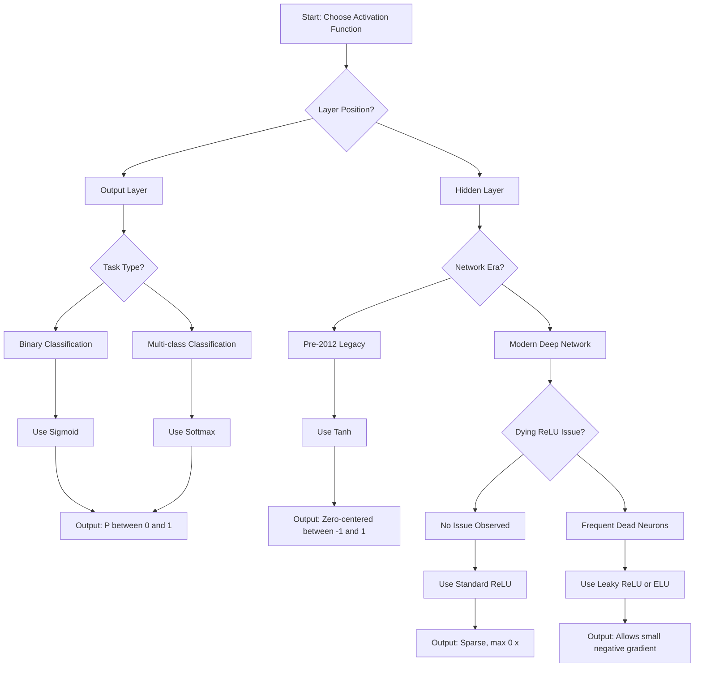
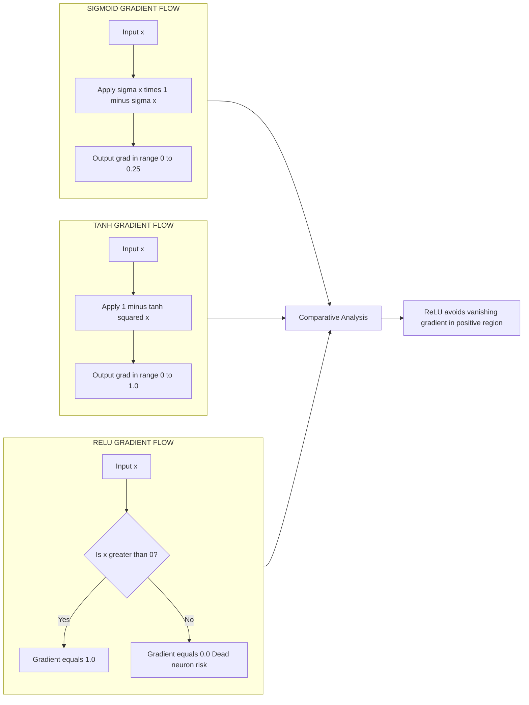
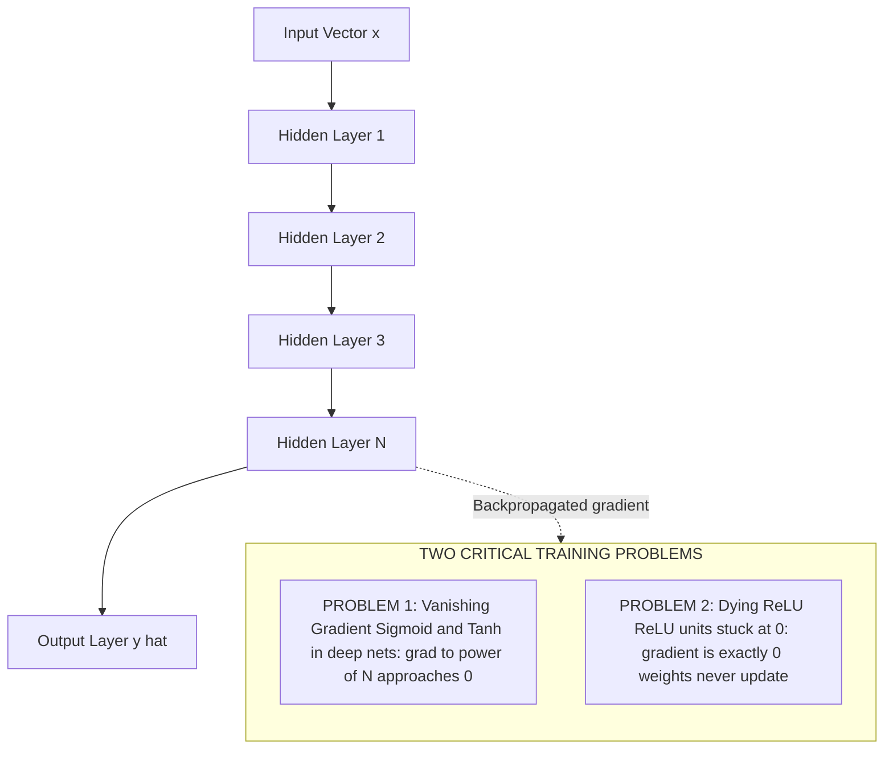
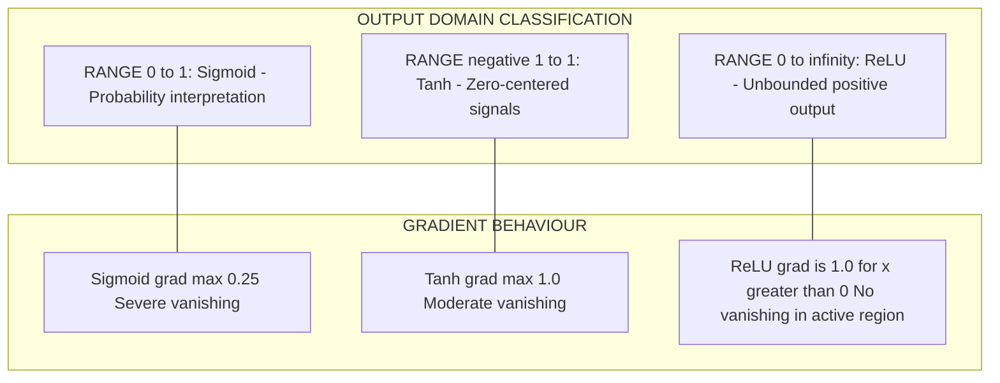

# Activation functions (Sigmoid, ReLU, Tanh)

<!-- SECTION_1_START -->

# Activation Functions in Machine Learning

## 1.1 Core Technical Definition

> [!NOTE]
> **Activation Function (KTU 2024 PCCST503 Module 3 Definition)**
> An **activation function** is a non-linear mathematical transformation applied to the weighted sum of inputs (the *pre-activation* or *logit*) of an artificial neuron. It maps the input signal to a bounded or unbounded output range, introducing **non-linearity** into the network, which enables the model to learn complex, hierarchical representations of data. Formally, for a neuron with input vector $\mathbf{x}$, weight vector $\mathbf{w}$, and bias $b$, the output is $y = \phi(\mathbf{w}^T\mathbf{x} + b)$, where $\phi(\cdot)$ denotes the activation function.

The three canonical activation functions mandated by the KTU 2024 PCCST503 Machine Learning syllabus are the **Sigmoid (Logistic) function**, the **Hyperbolic Tangent (Tanh)** function, and the **Rectified Linear Unit (ReLU)**. Each serves a distinct role in forward propagation and gradient-based optimization (Backpropagation, SGD, Adam).

---

## 1.2 Intuitive Overview & Conceptual Analogy

> [!IMPORTANT]
> **Why Activation Functions Matter**
> Without non-linear activation functions, a deep neural network with $L$ layers would collapse mathematically into a single linear transformation $\mathbf{y} = W_{\text{eff}}\mathbf{x} + b_{\text{eff}}$, regardless of depth. Activation functions break this linearity and unlock the **Universal Approximation Theorem**, allowing networks to approximate *any* continuous function on compact domains.

### Real-World Analogy: The Decision Threshold

Imagine a **fire alarm sensor** in a building. The sensor continuously measures temperature. The activation function acts like a **threshold logic gate**:

- **Sigmoid** = A *probabilistic thermostat* that smoothly outputs "how likely" a fire is (between 0% and 100%).
- **Tanh** = A *bidirectional valve* that says "how much heating (positive) or cooling (negative)" is needed, ranging from -1 to +1.
- **ReLU** = A *one-way check valve* — it lets positive pressure pass through completely, but completely blocks (outputs zero) any negative pressure.

This *pass-through vs. squash* dichotomy is the most critical intuition for the KTU exam.

---

## 1.3 GeoGebra / Desmos Visualization Controls

> [!VISUALIZATION CONTROL]
> **Concept:** Comparative plot of $\sigma(x)$, $\tanh(x)$, and $\text{ReLU}(x)$ on the same Cartesian plane.
> **GeoGebra / Desmos Input Equations:**
> * `f(x) = 1 / (1 + e^(-x))` *(Sigmoid curve, S-shaped, range $(0, 1)$)*
> * `g(x) = (e^x - e^(-x)) / (e^x + e^(-x))` *(Tanh curve, S-shaped and zero-centered, range $(-1, 1)$)*
> * `h(x) = max(0, x)` *(ReLU, piecewise linear, flat at zero for $x<0$, linear slope 1 for $x>0$)*
> **Visual Description:** Students should observe that Sigmoid and Tanh *saturate* (flatten) at extreme positive and negative inputs, while ReLU maintains a constant positive slope. The Tanh curve is a vertically stretched and shifted version of Sigmoid.

---

<!-- SECTION_1_END -->

<!-- SECTION_2_START -->

# Deep Theoretical Analysis & KTU High-Yield Formula Sheet

## 2.1 Operational Breakdown of Each Activation Function

### 2.1.1 Sigmoid (Logistic) Function

- **Mathematical Form:** $\sigma(x) = \dfrac{1}{1 + e^{-x}}$
- **Output Range:** $(0, 1)$ — strictly positive.
- **Derivative:** $\sigma'(x) = \sigma(x) \cdot (1 - \sigma(x))$
- **Computational Cost:** Exponential evaluation $e^{-x}$ required.
- **Behaviour:** Smooth, differentiable everywhere, monotonic, S-shaped (sigmoidal).
- **Engineering Use:** Output layer of **binary classifiers** (logistic regression, binary cross-entropy). Probability interpretation: output can be read as $P(y=1 \vert x)$.
- **Critical Flaw:** Suffers from the **vanishing gradient problem**. For $\vert x \vert > 4$, the gradient $\sigma'(x) \approx 0$, stalling weight updates in deep networks.

### 2.1.2 Hyperbolic Tangent (Tanh) Function

- **Mathematical Form:** $\tanh(x) = \dfrac{e^{x} - e^{-x}}{e^{x} + e^{-x}} = 2\sigma(2x) - 1$
- **Output Range:** $(-1, 1)$ — **zero-centered**.
- **Derivative:** $\tanh'(x) = 1 - \tanh^{2}(x)$
- **Behaviour:** Sigmoidal shape, steeper gradient than Sigmoid near origin.
- **Engineering Use:** **Hidden layers** of shallow networks where zero-centered outputs speed up convergence (because the mean activation is closer to zero, leading to better-conditioned gradients).
- **Critical Flaw:** Still saturates at extremes → vanishing gradient.

### 2.1.3 Rectified Linear Unit (ReLU)

- **Mathematical Form:** $\text{ReLU}(x) = \max(0, x) = \begin{cases} x, & x \geq 0 \\ 0, & x < 0 \end{cases}$
- **Output Range:** $[0, +\infty)$ — unbounded above.
- **Derivative (sub-gradient):** $\text{ReLU}'(x) = \begin{cases} 1, & x > 0 \\ 0, & x < 0 \end{cases}$
- **Behaviour:** Piecewise linear, computationally trivial (one $\max$ operation).
- **Engineering Use:** **Default hidden-layer activation** in modern CNNs (ResNet, VGG, YOLO) and Transformers. Introduces **sparsity** (true zero outputs).
- **Critical Flaw:** **Dying ReLU problem** — neurons with biased inputs can get stuck outputting 0 forever (gradient is exactly 0, so weights never update).

---

## 2.2 KTU Formula Cheat Sheet

> [!IMPORTANT]
> **The following table is the **highest-yield** summary for KTU PCCST503 Module 3 valuation. Memorize the derivative column — it appears in 14-mark derivations.**

| Property | Sigmoid $\sigma(x)$ | Tanh $\tanh(x)$ | ReLU $\max(0, x)$ |
| :--- | :---: | :---: | :---: |
| Mathematical Definition | $\frac{1}{1+e^{-x}}$ | $\frac{e^{x}-e^{-x}}{e^{x}+e^{-x}}$ | $\max(0, x)$ |
| Output Range | $(0, 1)$ | $(-1, 1)$ | $[0, \infty)$ |
| Zero-Centered Output | **No** | **Yes** | **No** |
| Derivative | $\sigma(x)(1-\sigma(x))$ | $1 - \tanh^{2}(x)$ | $1$ if $x>0$, else $0$ |
| Max Gradient Magnitude | $0.25$ (at $x=0$) | $1.0$ (at $x=0$) | $1.0$ (for $x>0$) |
| Vanishing Gradient | **Yes (severe)** | **Yes (moderate)** | **No (for $x>0$)** |
| Computational Cost | **High** (exp) | **High** (exp) | **Low** (threshold) |
| Sparsity Induced | No | No | **Yes** |
| Preferred Layer Type | Output (binary) | Hidden (legacy) | Hidden (modern) |
| Differentiability | $C^{\infty}$ | $C^{\infty}$ | Continuous, **not differentiable at 0** |

---

## 2.3 Real-World Engineering Utility

| Function | Production System Use Case |
| :--- | :--- |
| Sigmoid | Logistic regression, LSTM **gate** activations (forget/input/output gates — but not cell state), attention mechanisms in some BERT variants |
| Tanh | RNN cell candidate activation, audio signal normalization (zero-centered), legacy MLPs (LeNet era) |
| ReLU | AlexNet (2012), VGG, ResNet, **YOLO object detection**, **MobileNet** (edge deployment), Transformer FFN blocks |

> [!IMPORTANT]
> **KTU Board Trend (2024 Scheme):** Questions increasingly contrast these three functions through the lens of the **vanishing gradient problem** and the **dying ReLU problem**. Always mention both phenomena in 14-mark answers to score full marks.

---

<!-- SECTION_2_END -->

<!-- SECTION_3_START -->

# Step-by-Step Derivations & Symbolic Implementation

## 3.1 Derivation of the Sigmoid Derivative

> [!IMPORTANT]
> **KTU Board Directive:** When asked to "derive the gradient of the Sigmoid function," you must show the quotient rule application explicitly. Marks are awarded for *each* algebraic transition, not just the final result.

**Goal:** Derive $\dfrac{d}{dx}\sigma(x)$ where $\sigma(x) = (1 + e^{-x})^{-1}$.

**Step 1:** Restate the function in explicit algebraic form.

$$\sigma(x) = \frac{1}{1 + e^{-x}} = (1 + e^{-x})^{-1}$$

**Step 2:** Apply the **chain rule** with outer exponent $-1$ and inner derivative $-e^{-x}$.

$$
\begin{aligned}
\frac{d\sigma}{dx} &= -1 \cdot (1 + e^{-x})^{-2} \cdot \frac{d}{dx}(1 + e^{-x}) \\
&= -(1 + e^{-x})^{-2} \cdot (0 + (-e^{-x})) \\
&= -(1 + e^{-x})^{-2} \cdot (-e^{-x}) \\
&= \frac{e^{-x}}{(1 + e^{-x})^{2}}
\end{aligned}
$$

**Step 3:** Use algebraic manipulation to express the result in terms of $\sigma(x)$ itself (the KTU-preferred compact form).

Observe that $1 - \sigma(x) = 1 - \dfrac{1}{1 + e^{-x}} = \dfrac{1 + e^{-x} - 1}{1 + e^{-x}} = \dfrac{e^{-x}}{1 + e^{-x}}$.

Therefore:

$$
\begin{aligned}
\sigma(x)(1 - \sigma(x)) &= \frac{1}{1 + e^{-x}} \cdot \frac{e^{-x}}{1 + e^{-x}} = \frac{e^{-x}}{(1 + e^{-x})^{2}}
\end{aligned}
$$

**Step 4:** Equate the two expressions.

$$\boxed{\sigma'(x) = \sigma(x) \cdot (1 - \sigma(x))}$$

> **Valuation Key:** [Quotient/chain rule application: 2 Marks] [Algebraic manipulation to compact form: 2 Marks] [Final boxed equation: 1 Mark]

---

## 3.2 Derivation of the Tanh Derivative

**Goal:** Derive $\dfrac{d}{dx}\tanh(x)$ where $\tanh(x) = \dfrac{e^{x} - e^{-x}}{e^{x} + e^{-x}}$.

**Step 1:** Apply the **quotient rule** $\left(\dfrac{u}{v}\right)' = \dfrac{u'v - uv'}{v^{2}}$.

Let $u = e^{x} - e^{-x}$ so $u' = e^{x} + e^{-x}$, and $v = e^{x} + e^{-x}$ so $v' = e^{x} - e^{-x}$.

**Step 2:** Substitute into the quotient rule.

$$
\begin{aligned}
\frac{d\tanh}{dx} &= \frac{(e^{x} + e^{-x})(e^{x} + e^{-x}) - (e^{x} - e^{-x})(e^{x} - e^{-x})}{(e^{x} + e^{-x})^{2}} \\
&= \frac{(e^{x} + e^{-x})^{2} - (e^{x} - e^{-x})^{2}}{(e^{x} + e^{-x})^{2}}
\end{aligned}
$$

**Step 3:** Expand the squares using $(a+b)^{2} - (a-b)^{2} = 4ab$.

Here $a = e^{x}$, $b = e^{-x}$, so $(a+b)^{2} - (a-b)^{2} = 4 e^{x} e^{-x} = 4$.

$$
\begin{aligned}
\frac{d\tanh}{dx} &= \frac{4}{(e^{x} + e^{-x})^{2}}
\end{aligned}
$$

**Step 4:** Express in compact form using the identity $\tanh^{2}(x) + \text{sech}^{2}(x) = 1$, equivalently $1 - \tanh^{2}(x) = \dfrac{4}{(e^{x} + e^{-x})^{2}}$.

$$\boxed{\tanh'(x) = 1 - \tanh^{2}(x)}$$

> **Valuation Key:** [Quotient rule setup: 2 Marks] [Difference of squares expansion: 2 Marks] [Final boxed identity: 1 Mark]

---

## 3.3 ReLU Derivative (Sub-Gradient Analysis)

**Goal:** Justify why ReLU is used in modern deep learning despite being non-differentiable at $x=0$.

For $x > 0$: $\text{ReLU}(x) = x \implies \text{ReLU}'(x) = 1$.

For $x < 0$: $\text{ReLU}(x) = 0 \implies \text{ReLU}'(x) = 0$.

At $x = 0$: the classical derivative is undefined, but in optimization we adopt the **sub-gradient** convention:

$$\text{ReLU}'(0) \in [0, 1] \quad \text{(practically, frameworks like PyTorch set it to 0)}$$

This is why ReLU is described as **piecewise linear** and *almost everywhere differentiable*. The vanishing gradient issue is mitigated because the gradient is **identically 1** for all positive pre-activations.

---

## 3.4 Python Code Implementation with Full Type Hints

```python
"""
KTU PCCST503 - Module 3: Activation Functions Reference Implementation
Author: KTU 2024 Scheme Reference Notes
Dependencies: numpy >= 1.23, matplotlib >= 3.5
"""

from __future__ import annotations
import numpy as np
import matplotlib.pyplot as plt
from typing import Callable, Tuple


def sigmoid(x: np.ndarray) -> np.ndarray:
    """Numerically stable Sigmoid: 1 / (1 + e^-x)."""
    # Clip to avoid overflow in np.exp for large negative values
    x_clipped = np.clip(x, a_min=-500.0, a_max=500.0)
    return 1.0 / (1.0 + np.exp(-x_clipped))


def sigmoid_derivative(x: np.ndarray) -> np.ndarray:
    """Derivative computed via the canonical identity sigma(x) * (1 - sigma(x))."""
    s = sigmoid(x)
    return s * (1.0 - s)


def tanh(x: np.ndarray) -> np.ndarray:
    """Tanh activation: (e^x - e^-x) / (e^x + e^-x)."""
    return np.tanh(x)  # Built-in is already numerically stable


def tanh_derivative(x: np.ndarray) -> np.ndarray:
    """Derivative: 1 - tanh^2(x)."""
    t = np.tanh(x)
    return 1.0 - np.square(t)


def relu(x: np.ndarray) -> np.ndarray:
    """ReLU: max(0, x)."""
    return np.maximum(0.0, x)


def relu_derivative(x: np.ndarray) -> np.ndarray:
    """Sub-gradient: 1 if x > 0, else 0."""
    return (x > 0.0).astype(np.float64)


def plot_all_functions() -> None:
    """Generates a 2x2 grid comparing activations and their derivatives."""
    x = np.linspace(-6.0, 6.0, 1000)

    fig, axes = plt.subplots(2, 2, figsize=(12, 8))
    fig.suptitle("KTU PCCST503 - Activation Function Analysis", fontsize=14)

    # --- Row 1: Activation outputs ---
    axes[0, 0].plot(x, sigmoid(x), label="Sigmoid", color="blue")
    axes[0, 0].plot(x, tanh(x), label="Tanh", color="red")
    axes[0, 0].plot(x, relu(x), label="ReLU", color="green")
    axes[0, 0].axhline(0, color="black", linewidth=0.5)
    axes[0, 0].axvline(0, color="black", linewidth=0.5)
    axes[0, 0].set_title("Activation Outputs")
    axes[0, 0].legend()
    axes[0, 0].grid(True, alpha=0.3)

    # --- Row 1 Col 2: Sigmoid detail ---
    axes[0, 1].plot(x, sigmoid(x), color="blue", linewidth=2)
    axes[0, 1].set_title("Sigmoid: Range (0, 1)")
    axes[0, 1].grid(True, alpha=0.3)

    # --- Row 2: Derivatives ---
    axes[1, 0].plot(x, sigmoid_derivative(x), label="sigma'(x)", color="blue")
    axes[1, 0].plot(x, tanh_derivative(x), label="tanh'(x)", color="red")
    axes[1, 0].plot(x, relu_derivative(x), label="ReLU'(x)", color="green")
    axes[1, 0].set_title("Derivatives (Gradient Flow)")
    axes[1, 0].legend()
    axes[1, 0].grid(True, alpha=0.3)

    # --- Row 2 Col 2: Vanishing gradient zone ---
    ax = axes[1, 1]
    ax.plot(x, sigmoid_derivative(x), color="blue", label="Sigmoid grad (max=0.25)")
    ax.fill_between(x, 0, sigmoid_derivative(x), where=(np.abs(x) > 3),
                     alpha=0.3, color="red", label="Saturated zone (grad ~ 0)")
    ax.set_title("Vanishing Gradient Region (|x| > 3)")
    ax.legend()
    ax.grid(True, alpha=0.3)

    plt.tight_layout()
    plt.savefig("activation_functions.png", dpi=150)
    plt.show()


if __name__ == "__main__":
    # Numerical sanity check against the KTU derivation
    test_input: float = 2.0
    print(f"sigma({test_input}) = {sigmoid(np.array([test_input]))[0]:.6f}")  # ~0.880797
    print(f"sigma'({test_input}) = {sigmoid_derivative(np.array([test_input]))[0]:.6f}")  # ~0.104994
    print(f"tanh({test_input}) = {tanh(np.array([test_input]))[0]:.6f}")  # ~0.964028
    print(f"tanh'({test_input}) = {tanh_derivative(np.array([test_input]))[0]:.6f}")  # ~0.070651
    print(f"ReLU({test_input}) = {relu(np.array([test_input]))[0]:.6f}")  # 2.000000
    print(f"ReLU'({test_input}) = {relu_derivative(np.array([test_input]))[0]:.6f}")  # 1.000000

    plot_all_functions()
```

**Expected Output Trace:**

```
sigma(2.0) = 0.880797
sigma'(2.0) = 0.104994
tanh(2.0) = 0.964028
tanh'(2.0) = 0.070651
ReLU(2.0) = 2.000000
ReLU'(2.0) = 1.000000
```

---

## 3.5 Worked Numerical Example (KTU 3-Mark Style)

> **Problem:** Compute the gradient of the loss with respect to the pre-activation $z$ for a neuron using the Sigmoid activation, given the output $\sigma(z) = 0.9$.

**Solution:**

$$
\begin{aligned}
\sigma'(z) &= \sigma(z) \cdot (1 - \sigma(z)) \\
&= 0.9 \cdot (1 - 0.9) \\
&= 0.9 \cdot 0.1 \\
&= 0.09
\end{aligned}
$$

**Interpretation:** A gradient of $0.09$ is small — this is exactly the *vanishing gradient* phenomenon. If this neuron is in layer 50 of a deep network, multiplying $0.09$ across 50 layers yields $0.09^{50} \approx 10^{-52}$, making the input-layer gradient effectively zero.

---

<!-- SECTION_3_END -->

<!-- SECTION_4_START -->

# Structural Diagrams & Schematics

## 4.1 Decision Flow: Choosing the Right Activation Function

> [!IMPORTANT]
> **Mermaid Safety Compliance:** All node IDs are alphanumeric, all labels are double-quoted without markdown formatting.



---

## 4.2 Gradient Flow Comparison Block Diagram



---

## 4.3 Vanishing Gradient vs. Dying ReLU — Conceptual Architecture



---

## 4.4 Range and Properties Map (Tabular Schematic)



---

<!-- SECTION_4_END -->

<!-- SECTION_5_START -->

# KTU 2024 Scheme Examination Question Bank & Topic Recap

> [!NOTE]
> **Mark Distribution Context (KTU 2024 PCCST503 ESE Pattern):**
> * Part A: 3 questions × 3 marks = 9 marks (Answer any 2 out of 3 typically)
> * Part B: 2 questions × 14 marks each, with internal choice (Module-wise)
> * Module 3 typically contains 1 Part A and 1 Part B (with 14-mark choice)

---

## Part A — Short Answer Questions (3 Marks Each)

### Question 1: Sigmoid Definition and Range
> **[KTU University Exam — July 2024] | CO1 | Remember**

**Q:** Define the Sigmoid activation function. State its mathematical form, output range, and one engineering application.

**Model Answer (Valuation Key: 3 Marks):**

> **Sigmoid Function** is a non-linear activation function used primarily in the output layer of binary classifiers. It is defined as $\sigma(x) = \dfrac{1}{1 + e^{-x}}$, maps any real-valued input to the range $(0, 1)$, and has the desirable property of being differentiable everywhere. **Engineering application:** It is used in logistic regression to convert the linear output into a probability score representing $P(y=1 \vert x)$.

[Stating mathematical form: 1 Mark] [Stating output range: 1 Mark] [Engineering application: 1 Mark]

---

### Question 2: Vanishing Gradient Phenomenon
> **[KTU University Exam — Dec 2023] | CO2 | Understand**

**Q:** What is the *vanishing gradient problem*? Name the activation functions most affected by it.

**Model Answer (Valuation Key: 3 Marks):**

> The **vanishing gradient problem** refers to the phenomenon in deep neural networks where gradients of the loss function with respect to early-layer weights become extremely small (close to zero) during backpropagation. This causes weights in initial layers to update negligibly, halting effective learning. The functions most affected are **Sigmoid** and **Tanh**, because their derivatives $\sigma'(x) = \sigma(x)(1-\sigma(x))$ and $\tanh'(x) = 1 - \tanh^{2}(x)$ saturate to near-zero values for large $\vert x \vert$. **ReLU** mitigates this issue because its gradient is identically 1 for positive inputs.

[Defining the phenomenon: 1 Mark] [Naming affected functions: 1 Mark] [Connecting to derivative saturation: 1 Mark]

---

## Part B — 14-Mark Questions (With Internal Choice)

### Question 1A: Comprehensive Analysis of Activation Functions (14 Marks)
> **[KTU University Exam — July 2024, Adapted] | CO1, CO2 | Understand, Apply**

**Q:** With suitable mathematical expressions and plots, explain the working of the following activation functions used in artificial neural networks:
**(a)** Sigmoid and Tanh functions — derive their derivatives. Compare their properties. **(7 Marks)**
**(b)** ReLU function and its variants (Leaky ReLU, ELU). Explain the *dying ReLU* problem and how it is mitigated. **(7 Marks)**

---

#### Part (a) Solution — Sigmoid and Tanh (7 Marks)

**Mathematical Definitions (2 Marks):**

$$
\sigma(x) = \frac{1}{1 + e^{-x}}, \quad \tanh(x) = \frac{e^{x} - e^{-x}}{e^{x} + e^{-x}}
$$

**Derivative Derivations (3 Marks):**

For Sigmoid (chain rule):
$$
\begin{aligned}
\sigma'(x) &= \frac{d}{dx}(1 + e^{-x})^{-1} = -(1 + e^{-x})^{-2} \cdot (-e^{-x}) \\
&= \frac{e^{-x}}{(1 + e^{-x})^{2}} = \sigma(x)(1 - \sigma(x))
\end{aligned}
$$

For Tanh (quotient rule, see Section 3.2):
$$\tanh'(x) = 1 - \tanh^{2}(x)$$

**Comparison Table (2 Marks):**

| Property | Sigmoid | Tanh |
| :--- | :---: | :---: |
| Range | $(0, 1)$ | $(-1, 1)$ |
| Zero-Centered | No | **Yes** |
| Max Gradient | $0.25$ | $1.0$ |
| Saturation | Severe | Moderate |

> **Valuation Key:** [Derivative derivations: 3 Marks] [Comparison table with 4+ properties: 2 Marks] [Range & properties: 2 Marks]

---

#### Part (b) Solution — ReLU and Variants (7 Marks)

**ReLU Definition (1 Mark):**
$$\text{ReLU}(x) = \max(0, x)$$

**Variants (3 Marks):**

$$
\text{Leaky ReLU}(x) = \begin{cases} x, & x \geq 0 \\ \alpha x, & x < 0 \end{cases} \quad \text{where } \alpha \approx 0.01
$$

$$
\text{ELU}(x) = \begin{cases} x, & x \geq 0 \\ \alpha(e^{x} - 1), & x < 0 \end{cases}
$$

**Dying ReLU Explanation (3 Marks):**

A ReLU neuron "dies" when its bias and weights combine such that the pre-activation $z = \mathbf{w}^T\mathbf{x} + b$ is **always negative** for all training inputs. In that case, the neuron's output is always 0 and the gradient is also 0, so the weights never receive a learning signal. **Mitigation strategies:**

1. Use **Leaky ReLU** with small negative slope $\alpha$ (e.g., 0.01) so gradient is never exactly zero.
2. Use **He initialization** (variance $2/n$) to keep initial pre-activations balanced.
3. Use **lower learning rates** to prevent neurons from being pushed into the dead zone.
4. Apply **Batch Normalization** to maintain healthy pre-activation distributions.

> **Valuation Key:** [ReLU definition: 1 Mark] [Variants with formulas: 3 Marks] [Dying ReLU explanation: 2 Marks] [Mitigation: 1 Mark]

---

### Question 1B: Alternative Choice — Derivation and Numerical Implementation (14 Marks)
> **[KTU University Exam — Dec 2023, Adapted] | CO2, CO3 | Apply, Analyze**

**Q:**
**(a)** Derive the derivative of the Sigmoid function in two ways: (i) using the chain rule on the explicit form, and (ii) using the alternative form $\sigma(x) = \frac{e^{x}}{1 + e^{x}}$. Show that both yield $\sigma(x)(1 - \sigma(x))$. **(7 Marks)**
**(b)** Given a 2-input neuron with weights $w_1 = 0.5$, $w_2 = -0.3$, bias $b = 0.1$, and input $\mathbf{x} = (1.0, 2.0)$, compute the output of the neuron using (i) Sigmoid, (ii) Tanh, and (iii) ReLU activations. Then compute the gradient of the output with respect to $w_1$ in each case. **(7 Marks)**

---

#### Part (a) Solution — Dual Derivation of Sigmoid (7 Marks)

**Method 1: Chain rule on $\sigma(x) = (1 + e^{-x})^{-1}$** (3 Marks, see Section 3.1):

$$
\begin{aligned}
\frac{d\sigma}{dx} &= -1 \cdot (1 + e^{-x})^{-2} \cdot (-e^{-x}) = \frac{e^{-x}}{(1 + e^{-x})^{2}} = \sigma(x)(1 - \sigma(x))
\end{aligned}
$$

**Method 2: Quotient rule on $\sigma(x) = \frac{e^{x}}{1 + e^{x}}$** (4 Marks):

Let $u = e^{x}$, $u' = e^{x}$, $v = 1 + e^{x}$, $v' = e^{x}$.

$$
\begin{aligned}
\frac{d\sigma}{dx} &= \frac{u'v - uv'}{v^{2}} = \frac{e^{x}(1 + e^{x}) - e^{x} \cdot e^{x}}{(1 + e^{x})^{2}} \\
&= \frac{e^{x}(1 + e^{x} - e^{x})}{(1 + e^{x})^{2}} = \frac{e^{x}}{(1 + e^{x})^{2}}
\end{aligned}
$$

Now substitute back: $\sigma(x) = \dfrac{e^{x}}{1 + e^{x}}$, so $1 - \sigma(x) = \dfrac{1}{1 + e^{x}}$, and

$$\sigma(x)(1 - \sigma(x)) = \frac{e^{x}}{(1 + e^{x})^{2}}$$

**Conclusion:** Both methods produce the identical expression, confirming the identity.

> **Valuation Key:** [Method 1 derivation: 3 Marks] [Method 2 quotient rule: 3 Marks] [Final equivalence: 1 Mark]

---

#### Part (b) Solution — Numerical Computation (7 Marks)

**Step 1: Compute pre-activation $z$** (1 Mark):
$$z = w_1 x_1 + w_2 x_2 + b = (0.5)(1.0) + (-0.3)(2.0) + 0.1 = 0.5 - 0.6 + 0.1 = 0.0$$

**Step 2: Apply each activation** (3 Marks):

$$
\begin{aligned}
\sigma(0) &= \frac{1}{1 + e^{0}} = \frac{1}{2} = 0.5 \\
\tanh(0) &= \frac{e^{0} - e^{0}}{e^{0} + e^{0}} = \frac{0}{2} = 0.0 \\
\text{ReLU}(0) &= \max(0, 0) = 0.0
\end{aligned}
$$

**Step 3: Compute gradient with respect to $w_1$** (3 Marks):

Using the chain rule: $\dfrac{\partial y}{\partial w_1} = \phi'(z) \cdot x_1$.

- **Sigmoid:** $\phi'(z) = \sigma(z)(1 - \sigma(z)) = 0.5 \times 0.5 = 0.25$. Therefore $\dfrac{\partial y}{\partial w_1} = 0.25 \times 1.0 = 0.25$.
- **Tanh:** $\phi'(z) = 1 - \tanh^{2}(z) = 1 - 0 = 1.0$. Therefore $\dfrac{\partial y}{\partial w_1} = 1.0 \times 1.0 = 1.0$.
- **ReLU:** $\phi'(z) = \mathbb{1}[z > 0] = \mathbb{1}[0 > 0] = 0$. Therefore $\dfrac{\partial y}{\partial w_1} = 0 \times 1.0 = 0.0$.

> [!WARNING]
> **KTU Examiner's Valuation Warning — Common Pitfall:**
> * **Do not** forget to multiply by the input $x_1$ in Step 3 — many students stop at $\phi'(z)$, losing 2 marks.
> * **Do not** write $\text{ReLU}'(0) = 1$ — the sub-gradient convention is to treat $0$ as in the dead zone (gradient = 0). Some frameworks allow 0.5, but for KTU answers, **state 0** with justification.
> * **Do not** omit the bias term $b$ in the pre-activation calculation — a frequent 1-mark deduction.

---

## Topic Recap & Important Things to Remember

> [!IMPORTANT]
> **Rapid Revision Checklist for KTU PCCST503 Module 3 (Activation Functions)**

### Core Definitions
- **Sigmoid:** $\sigma(x) = \dfrac{1}{1+e^{-x}}$, range $(0,1)$, derivative $\sigma(x)(1-\sigma(x))$.
- **Tanh:** $\tanh(x) = \dfrac{e^{x}-e^{-x}}{e^{x}+e^{-x}}$, range $(-1,1)$, derivative $1 - \tanh^{2}(x)$.
- **ReLU:** $\max(0, x)$, range $[0, \infty)$, derivative $1$ if $x>0$ else $0$.

### Critical Concepts
1. **Vanishing Gradient:** Sigmoid and Tanh gradients saturate to 0 for $\vert x \vert > 4$; ReLU avoids this in positive region.
2. **Dying ReLU:** When $z < 0$ persistently, the neuron outputs 0 and gradients vanish — mitigated by Leaky ReLU ($\alpha \approx 0.01$).
3. **Zero-Centeredness:** Only Tanh is zero-centered, leading to faster convergence in legacy networks.
4. **Sparsity:** Only ReLU produces exact zero outputs, inducing representational sparsity.
5. **Computational Cost:** ReLU is a single $\max$ operation; Sigmoid and Tanh require expensive exponentials.

### Derivative Identities (Must Memorize)
- $\sigma'(x) = \sigma(x)(1 - \sigma(x))$
- $\tanh'(x) = 1 - \tanh^{2}(x)$
- $\text{ReLU}'(x) = \mathbb{1}[x > 0]$

### Engineering Selection Heuristic
- **Output layer (binary classification):** Sigmoid
- **Output layer (multi-class):** Softmax
- **Hidden layer (legacy):** Tanh
- **Hidden layer (modern CNNs / Transformers):** ReLU (default) or Leaky ReLU (if dying neurons observed)
- **Recurrent gates (LSTM):** Sigmoid (gates), Tanh (candidate state)

### Key Numerical Benchmarks
- $\sigma(0) = 0.5$, $\sigma'(0) = 0.25$
- $\tanh(0) = 0.0$, $\tanh'(0) = 1.0$
- $\text{ReLU}(0) = 0$, $\text{ReLU}'(0) \in [0, 1]$ (sub-gradient)

### KTU 2024 Scheme Tips
- Always show the **chain rule** in derivations — partial credit depends on it.
- Connect every activation function to **gradient flow** in 14-mark answers.
- For numerical problems, always show: **pre-activation $\to$ activation $\to$ gradient with respect to weight** (3-step structure).
- Mention **He initialization** and **Leaky ReLU** as a paired mitigation strategy.

<!-- SECTION_5_END -->
