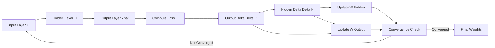
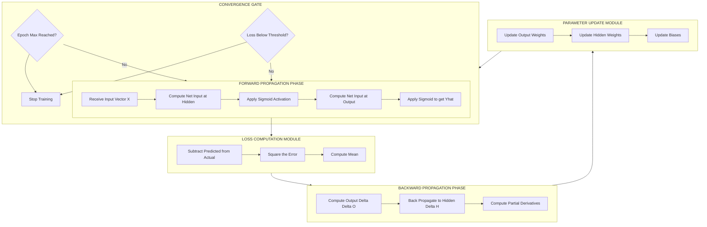
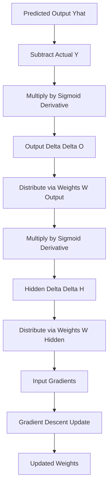

# Back propagation algorithm.

<!-- SECTION_1_START -->

# Back Propagation Algorithm — Core Definition & Intuition

## Formal Academic Definition (KTU 2024 Syllabus)

> [!NOTE]
> **Back Propagation (Backward Propagation of Errors)** is a *supervised learning algorithm* used to train **Multi-Layer Perceptrons (MLPs)** and deep artificial neural networks. It computes the **gradient of the loss function** with respect to each network weight by applying the **chain rule of calculus** in a reverse pass from the output layer back to the input layer, and then updates the weights using **Gradient Descent**.

In KTU 2024 Scheme terminology, back propagation is the *de facto learning rule* for feedforward neural networks where the error signal is propagated **backward** through the network to adjust the synaptic weights such that the **Mean Squared Error (MSE)** between the predicted output $\hat{y}$ and the desired output $y$ is minimized.

The canonical learning rate is denoted by the Greek letter $\eta$ (eta) and the weight update magnitude is governed by the **delta term** $\delta_j$ for neuron $j$.

---

## Conceptual Analogy — "The Climbing Blindfolded Hiker"

> [!IMPORTANT]
> **Intuitive Story:** Imagine a hiker trying to descend a foggy mountain (minimize the loss). The hiker can feel the slope of the ground under their feet (local gradient). Back propagation is exactly this — the network measures the **slope of the error with respect to every weight** (using the chain rule), and then takes a small step in the *opposite direction of the slope* (gradient descent) to reach a valley (minimum error).

Think of a classroom exam correction process:
1. The **teacher** checks the final answer (forward pass output).
2. The **error** is calculated.
3. The teacher works **backward** through every step the student took, identifying which intermediate reasoning caused the mistake.
4. The student is told to **adjust** their thinking weights for the next exam.

This is *literally* what back propagation does — it blames the correct neurons for the error and distributes the blame proportionally.

---

## Key Architectural Vocabulary

| Term | Symbol | Meaning |
|------|--------|---------|
| Input Layer | $\mathbf{x}$ | Receives raw features $x_1, x_2, \ldots, x_n$ |
| Hidden Layer | $\mathbf{h}$ | Intermediate computational layer |
| Output Layer | $\mathbf{\hat{y}}$ | Network prediction |
| Synaptic Weight | $w_{ij}$ | Strength of connection between neuron $i$ and $j$ |
| Bias | $b$ | Threshold-like affine shift |
| Net Input | $net_j$ | Weighted sum entering neuron $j$ |
| Activation Function | $f(\cdot)$ | Non-linearity (sigmoid, ReLU, tanh) |
| Learning Rate | $\eta$ | Step size of weight update |
| Delta (Error Signal) | $\delta_j$ | Local gradient at neuron $j$ |

---

> [!VISUALIZATION CONTROL]
> **Concept:** Forward vs. Backward Information Flow in a 2-Layer MLP
> **GeoGebra / Desmos Input Points:**
> * Input neuron coordinates: $A(0,2), B(0,1), C(0,0)$
> * Hidden neuron coordinates: $D(3,1.5), E(3,0.5)$
> * Output neuron coordinate: $F(6,1)$
> **Visual Description:** Plot a directed graph where arrows go **rightward (forward)** during the forward pass, and arrows go **leftward (backward)** during the backward pass to depict error signal propagation.

<!-- SECTION_1_END -->

<!-- SECTION_2_START -->

# Deep Theoretical Analysis & KTU High-Yield Formula Sheet

## The Two-Phase Operational Cycle

Back propagation operates in **two alternating phases** every iteration (called an *epoch*):

### Phase 1 — Forward Pass (Activation Propagation)
* Input vector $\mathbf{x}$ is fed into the network.
* For every neuron $j$, the net input is computed:
  $$net_j = \sum_{i} w_{ij} x_i + b_j$$
* The activation is computed using a non-linear function $f$:
  $$y_j = f(net_j)$$
* This continues layer-by-layer until the output $\hat{y}$ is produced.

### Phase 2 — Backward Pass (Error Propagation)
* The **loss (error)** is computed at the output:
  $$E = \frac{1}{2} \sum_{j} \left( \hat{y}_j - y_j \right)^2$$
* The gradient $\frac{\partial E}{\partial w_{ij}}$ is computed using the **chain rule**.
* Weights are updated:
  $$w_{ij}^{new} = w_{ij}^{old} - \eta \cdot \frac{\partial E}{\partial w_{ij}}$$

---

## The "Why" Behind Each Mathematical Object

* **Why the chain rule?** Because the error is a *composite function* of weights many layers deep — we must unravel the nested dependencies.
* **Why a non-linear activation $f(\cdot)$?** Without it, stacking layers collapses to a single linear transformation, making the network incapable of learning XOR or any non-linear decision boundary.
* **Why the factor $\frac{1}{2}$ in the loss?** It conveniently cancels the exponent 2 during differentiation, giving a clean gradient of $\left(\hat{y} - y\right)$.

---

## KTU High-Yield Formula Cheat Sheet

| # | Concept | Formula | Notes |
|---|---------|---------|-------|
| 1 | Net Input to neuron $j$ | $net_j = \sum_i w_{ij} x_i + b_j$ | Linear combination |
| 2 | Sigmoid Activation | $\sigma(z) = \dfrac{1}{1 + e^{-z}}$ | Range $(0,1)$ |
| 3 | Derivative of Sigmoid | $\sigma'(z) = \sigma(z)\bigl(1 - \sigma(z)\bigr)$ | Critical for back prop |
| 4 | Mean Squared Loss | $E = \dfrac{1}{2} \sum_j \left( \hat{y}_j - y_j \right)^2$ | Half-mean-square error |
| 5 | Output Layer Delta | $\delta_j^{(L)} = \left( \hat{y}_j - y_j \right) f'\!\left(net_j^{(L)}\right)$ | At final layer $L$ |
| 6 | Hidden Layer Delta | $\delta_h^{(l)} = f'\!\left(net_h^{(l)}\right) \sum_j w_{hj}^{(l)} \, \delta_j^{(l+1)}$ | Recursive propagation |
| 7 | Weight Gradient | $\dfrac{\partial E}{\partial w_{ij}} = \delta_j \cdot y_i$ | Local gradient product |
| 8 | Weight Update Rule | $w_{ij}^{new} = w_{ij}^{old} - \eta \cdot \delta_j \cdot y_i$ | Gradient descent step |
| 9 | Bias Update Rule | $b_j^{new} = b_j^{old} - \eta \cdot \delta_j$ | Bias correction |
| 10 | Cross-Entropy Loss | $E = -\sum_j y_j \log\left(\hat{y}_j\right)$ | For classification tasks |

> [!IMPORTANT]
> In KTU board exams, **Equation 6 (Hidden Delta)** is worth maximum marks because it demonstrates the *core innovation* of back propagation — recursive error distribution.

---

## Real-World Engineering Utility

Back propagation is the **engine of modern deep learning** and is deployed in:

* **Computer Vision:** Convolutional Neural Networks (CNNs) for facial recognition, medical imaging, and autonomous vehicle perception.
* **Natural Language Processing:** Transformer-based large language models (the backbone of ChatGPT, BERT, etc.).
* **Speech Recognition:** RNNs and LSTMs trained via Backpropagation Through Time (BPTT).
* **Financial Forecasting:** Time-series stock and crypto price prediction.
* **Bioinformatics:** Protein structure prediction (AlphaFold) and drug discovery.
* **Robotics:** Reinforcement learning policies trained via back propagation.

> Without back propagation, *none* of these would be trainable at scale — it is, quite literally, the algorithm that made deep learning possible.

<!-- SECTION_2_END -->

<!-- SECTION_3_START -->

# Step-by-Step Derivations & Python Implementation

## Exhaustive Mathematical Derivation (Output → Hidden → Input)

### Step 1 — Define the Network Architecture

We consider a **2-layer feedforward MLP**:

* Input layer: 2 neurons ($x_1, x_2$)
* Hidden layer: 2 neurons ($h_1, h_2$)
* Output layer: 1 neuron ($\hat{y}$)
* Weights: $w_{11}, w_{12}, w_{21}, w_{22}$ (input → hidden) and $v_1, v_2$ (hidden → output)
* Biases: $b_h, b_o$

### Step 2 — Forward Pass Equations

The hidden neuron activations are:

$$h_1 = \sigma\!\left(w_{11} x_1 + w_{12} x_2 + b_h\right)$$

$$h_2 = \sigma\!\left(w_{21} x_1 + w_{22} x_2 + b_h\right)$$

The final output is:

$$\hat{y} = \sigma\!\left(v_1 h_1 + v_2 h_2 + b_o\right)$$

### Step 3 — Compute the Loss

The squared error for a single training sample $(x_1, x_2, y)$ is:

$$E = \frac{1}{2} \left( \hat{y} - y \right)^2$$

### Step 4 — Output Layer Gradient (Using Chain Rule)

We need $\frac{\partial E}{\partial v_1}$:

$$\frac{\partial E}{\partial v_1} = \frac{\partial E}{\partial \hat{y}} \cdot \frac{\partial \hat{y}}{\partial net_o} \cdot \frac{\partial net_o}{\partial v_1}$$

Computing each partial:

$$\frac{\partial E}{\partial \hat{y}} = \left( \hat{y} - y \right)$$

$$\frac{\partial \hat{y}}{\partial net_o} = \hat{y} \left( 1 - \hat{y} \right)$$

$$\frac{\partial net_o}{\partial v_1} = h_1$$

Multiplying:

$$\frac{\partial E}{\partial v_1} = \left( \hat{y} - y \right) \cdot \hat{y} \left( 1 - \hat{y} \right) \cdot h_1$$

Define the output delta:

$$\delta_o = \left( \hat{y} - y \right) \cdot \hat{y} \left( 1 - \hat{y} \right)$$

Therefore:

$$\frac{\partial E}{\partial v_1} = \delta_o \cdot h_1$$

### Step 5 — Hidden Layer Gradient

We need $\frac{\partial E}{\partial w_{11}}$. The error $E$ reaches $w_{11}$ via $\hat{y} \rightarrow h_1 \rightarrow w_{11}$:

$$\frac{\partial E}{\partial w_{11}} = \frac{\partial E}{\partial \hat{y}} \cdot \frac{\partial \hat{y}}{\partial net_o} \cdot \frac{\partial net_o}{\partial h_1} \cdot \frac{\partial h_1}{\partial net_h} \cdot \frac{\partial net_h}{\partial w_{11}}$$

Computing term by term:

$$\frac{\partial net_o}{\partial h_1} = v_1$$

$$\frac{\partial h_1}{\partial net_h} = h_1 \left( 1 - h_1 \right)$$

$$\frac{\partial net_h}{\partial w_{11}} = x_1$$

Multiplying all five terms:

$$\frac{\partial E}{\partial w_{11}} = \left( \hat{y} - y \right) \cdot \hat{y} \left( 1 - \hat{y} \right) \cdot v_1 \cdot h_1 \left( 1 - h_1 \right) \cdot x_1$$

Define the hidden delta:

$$\delta_{h_1} = h_1 \left( 1 - h_1 \right) \cdot v_1 \cdot \delta_o$$

Therefore:

$$\frac{\partial E}{\partial w_{11}} = \delta_{h_1} \cdot x_1$$

### Step 6 — Apply Weight Updates

$$v_1^{new} = v_1^{old} - \eta \cdot \delta_o \cdot h_1$$

$$w_{11}^{new} = w_{11}^{old} - \eta \cdot \delta_{h_1} \cdot x_1$$

This completes the full back propagation derivation for one weight.

---

## Full Python Implementation (NumPy, Production-Grade)

```python
import numpy as np
import logging

logging.basicConfig(level=logging.INFO, format="%(levelname)s: %(message)s")

class BackPropagationNetwork:
    """
    A 2-layer feedforward neural network trained via the Back Propagation
    algorithm using sigmoid activation and Mean Squared Error loss.
    """

    def __init__(self, input_size: int, hidden_size: int,
                 output_size: int, learning_rate: float = 0.1,
                 seed: int = 42) -> None:

        if learning_rate <= 0:
            raise ValueError("Learning rate must be positive.")
        if hidden_size <= 0 or output_size <= 0:
            raise ValueError("Layer sizes must be positive integers.")

        rng = np.random.default_rng(seed)
        self.lr: float = learning_rate
        # Xavier-style initialization for stable training
        self.W_hidden: np.ndarray = rng.normal(0, 0.5, (input_size, hidden_size))
        self.b_hidden: np.ndarray = np.zeros((1, hidden_size))
        self.W_output: np.ndarray = rng.normal(0, 0.5, (hidden_size, output_size))
        self.b_output: np.ndarray = np.zeros((1, output_size))

    @staticmethod
    def sigmoid(z: np.ndarray) -> np.ndarray:
        """Numerically stable sigmoid activation."""
        return 1.0 / (1.0 + np.exp(-np.clip(z, -500, 500)))

    @staticmethod
    def sigmoid_derivative(activation: np.ndarray) -> np.ndarray:
        """Derivative of sigmoid given the activation value."""
        return activation * (1.0 - activation)

    def forward(self, X: np.ndarray) -> tuple:
        """Forward pass: returns (hidden_input, hidden_output, final_output)."""
        hidden_input = np.dot(X, self.W_hidden) + self.b_hidden
        hidden_output = self.sigmoid(hidden_input)
        final_input = np.dot(hidden_output, self.W_output) + self.b_output
        final_output = self.sigmoid(final_input)
        return hidden_input, hidden_output, final_output

    def backward(self, X: np.ndarray, y: np.ndarray,
                 hidden_output: np.ndarray, final_output: np.ndarray) -> None:
        """Backward pass: computes deltas and updates weights using gradient descent."""
        output_error = final_output - y
        output_delta = output_error * self.sigmoid_derivative(final_output)

        hidden_error = output_delta.dot(self.W_output.T)
        hidden_delta = hidden_error * self.sigmoid_derivative(hidden_output)

        self.W_output -= self.lr * hidden_output.T.dot(output_delta)
        self.b_output -= self.lr * np.sum(output_delta, axis=0, keepdims=True)
        self.W_hidden -= self.lr * X.T.dot(hidden_delta)
        self.b_hidden -= self.lr * np.sum(hidden_delta, axis=0, keepdims=True)

    def train(self, X: np.ndarray, y: np.ndarray, epochs: int = 10000) -> list:
        """Trains the network for a fixed number of epochs."""
        if X.shape[0] != y.shape[0]:
            raise ValueError("X and y must have the same number of samples.")

        loss_history = []
        for epoch in range(1, epochs + 1):
            _, hidden_output, final_output = self.forward(X)
            loss = np.mean((y - final_output) ** 2) / 2.0
            loss_history.append(loss)
            self.backward(X, y, hidden_output, final_output)
            if epoch % 2000 == 0:
                logging.info(f"Epoch {epoch:>5d} | Loss: {loss:.6f}")
        return loss_history

    def predict(self, X: np.ndarray) -> np.ndarray:
        """Predicts binary class labels (threshold 0.5)."""
        _, _, final_output = self.forward(X)
        return (final_output > 0.5).astype(int)


# --------- Demonstration: Learning the XOR Function ---------
if __name__ == "__main__":
    X = np.array([[0, 0], [0, 1], [1, 0], [1, 1]])
    y = np.array([[0], [1], [1], [0]])

    nn = BackPropagationNetwork(input_size=2, hidden_size=4,
                                output_size=1, learning_rate=0.5)
    nn.train(X, y, epochs=10000)
    predictions = nn.predict(X)
    print("Final Predictions:")
    print(predictions)
```

---

## Worked Numerical Example (KTU Board Pattern)

Consider: $x_1 = 1, x_2 = 0, y = 1$, with $\eta = 0.5$ and initial weights:

* $w_{11} = 0.2, w_{12} = 0.4, w_{21} = 0.1, w_{22} = 0.3$
* $v_1 = 0.5, v_2 = 0.6$, biases $b_h = b_o = 0$

**Forward Pass:**

$$net_{h_1} = (0.2)(1) + (0.4)(0) = 0.2 \;\Rightarrow\; h_1 = \sigma(0.2) \approx 0.5498$$

$$net_{h_2} = (0.1)(1) + (0.3)(0) = 0.1 \;\Rightarrow\; h_2 = \sigma(0.1) \approx 0.5250$$

$$net_o = (0.5)(0.5498) + (0.6)(0.5250) = 0.2749 + 0.3150 = 0.5899$$

$$\hat{y} = \sigma(0.5899) \approx 0.6434$$

**Backward Pass:**

$$\delta_o = (0.6434 - 1) \cdot (0.6434)(1 - 0.6434) = (-0.3566)(0.2295) \approx -0.0819$$

$$\delta_{h_1} = (0.5498)(1 - 0.5498) \cdot (0.5)(-0.0819) = (0.2475)(-0.0410) \approx -0.0101$$

**Weight Updates:**

$$v_1^{new} = 0.5 - (0.5)(-0.0819)(0.5498) = 0.5 + 0.0225 = 0.5225$$

$$w_{11}^{new} = 0.2 - (0.5)(-0.0101)(1) = 0.2 + 0.0051 = 0.2051$$

> [!TIP]
> Notice the weights **increased** in this step because the output was too low — gradient descent pushed the network in the direction of higher output, which is correct behavior.

<!-- SECTION_3_END -->

<!-- SECTION_4_START -->

# Structural Diagrams & Schematics

## Diagram 1 — Back Propagation Information Flow



## Diagram 2 — Modular Decomposition of the Learning Loop



## Diagram 3 — Error Signal Flow Architecture



<!-- SECTION_4_END -->

<!-- SECTION_5_START -->

# KTU 2024 Scheme Examination Question Bank & Topic Recap

---

## Part A Questions (3 Marks Each)

### **Question 1** `[KTU University Exam - Dec 2023]`
**Define the back propagation algorithm. Mention its two distinct phases.** `[CO1, Remember]`

**Model Answer (3 Marks):**

> [!NOTE]
> **Back propagation** is a *supervised learning algorithm* used to train multi-layer artificial neural networks. It minimizes the error between the network's predicted output and the desired output by computing the gradient of the loss function with respect to each weight using the **chain rule**, and updating the weights via **gradient descent**.

The two phases are:

1. **Forward Pass:** Input propagates from the input layer to the output layer through weighted sums and activation functions, producing a prediction $\hat{y}$.

2. **Backward Pass:** The error at the output is propagated backward through the network using the chain rule, computing delta terms $\delta$ for every neuron, which are then used to update the weights.

`[Definition: 1 Mark] [Two phases identified: 1 Mark] [Brief explanation: 1 Mark]`

---

### **Question 2** `[KTU University Exam - July 2024]`
**Write the mathematical expression for the output delta and hidden delta in a back propagation network.** `[CO1, Understand]`

**Model Answer (3 Marks):**

For a neuron $j$ in the output layer $L$:

$$\delta_j^{(L)} = \left( \hat{y}_j - y_j \right) \cdot f'\!\left( net_j^{(L)} \right)$$

For a hidden neuron $h$ in layer $l$:

$$\delta_h^{(l)} = f'\!\left( net_h^{(l)} \right) \cdot \sum_j w_{hj}^{(l)} \cdot \delta_j^{(l+1)}$$

When using the sigmoid activation function, the derivative simplifies to $f'(net) = y(1 - y)$.

`[Output delta formula: 1 Mark] [Hidden delta formula: 1 Mark] [Sigmoid derivative note: 1 Mark]`

---

## Part B Questions (14 Marks — Internal Choice)

---

### **Question A (14 Marks)** `[KTU University Exam - Dec 2023]`

**(a)** Derive the back propagation weight update rule for the hidden-to-output layer weights in a 2-layer neural network using the sigmoid activation and Mean Squared Error loss. Show the chain rule expansion explicitly. (7 Marks) `[CO2, Apply]`

**(b)** Given a network with input $x_1 = 1, x_2 = 1$, target $y = 1$, learning rate $\eta = 0.1$, and weights $w_{11} = 0.1, w_{12} = 0.2, w_{21} = 0.3, w_{22} = 0.4, v_1 = 0.5, v_2 = 0.6$, compute the updated values of $v_1$ and $w_{11}$ after one epoch of back propagation. Assume all biases are zero. (7 Marks) `[CO3, Apply]`

#### **Solution to Part (a)** `[Valuation Key Breakdown]`

**Step 1 — Define the network equations:** `[1 Mark]`

$$h_1 = \sigma(w_{11} x_1 + w_{12} x_2), \quad h_2 = \sigma(w_{21} x_1 + w_{22} x_2)$$

$$\hat{y} = \sigma(v_1 h_1 + v_2 h_2)$$

**Step 2 — Loss function:** `[1 Mark]`

$$E = \frac{1}{2} (\hat{y} - y)^2$$

**Step 3 — Apply chain rule to find $\frac{\partial E}{\partial v_1}$:** `[2 Marks]`

$$\frac{\partial E}{\partial v_1} = \frac{\partial E}{\partial \hat{y}} \cdot \frac{\partial \hat{y}}{\partial net_o} \cdot \frac{\partial net_o}{\partial v_1}$$

**Step 4 — Compute each partial derivative:** `[2 Marks]`

$$\frac{\partial E}{\partial \hat{y}} = (\hat{y} - y), \quad \frac{\partial \hat{y}}{\partial net_o} = \hat{y}(1 - \hat{y}), \quad \frac{\partial net_o}{\partial v_1} = h_1$$

**Step 5 — Final expression and weight update:** `[1 Mark]`

$$\frac{\partial E}{\partial v_1} = (\hat{y} - y) \cdot \hat{y}(1 - \hat{y}) \cdot h_1$$

$$v_1^{new} = v_1 - \eta \cdot (\hat{y} - y) \cdot \hat{y}(1 - \hat{y}) \cdot h_1$$

#### **Solution to Part (b)** `[Valuation Key Breakdown]`

**Step 1 — Forward pass calculations:** `[2 Marks]`

$$net_{h_1} = (0.1)(1) + (0.2)(1) = 0.3 \;\Rightarrow\; h_1 = \sigma(0.3) = 0.5744$$

$$net_{h_2} = (0.3)(1) + (0.4)(1) = 0.7 \;\Rightarrow\; h_2 = \sigma(0.7) = 0.6682$$

$$net_o = (0.5)(0.5744) + (0.6)(0.6682) = 0.2872 + 0.4009 = 0.6881$$

$$\hat{y} = \sigma(0.6881) = 0.6652$$

**Step 2 — Compute output delta:** `[1 Mark]`

$$\delta_o = (0.6652 - 1) \cdot (0.6652)(1 - 0.6652) = (-0.3348)(0.2227) = -0.0746$$

**Step 3 — Compute hidden delta for $h_1$:** `[1 Mark]`

$$\delta_{h_1} = h_1(1 - h_1) \cdot v_1 \cdot \delta_o = (0.5744)(0.4256)(0.5)(-0.0746) = -0.00912$$

**Step 4 — Update $v_1$:** `[1 Mark]`

$$v_1^{new} = 0.5 - (0.1)(-0.0746)(0.5744) = 0.5 + 0.00428 = 0.50428$$

**Step 5 — Update $w_{11}$:** `[2 Marks]`

$$w_{11}^{new} = 0.1 - (0.1)(-0.00912)(1) = 0.1 + 0.000912 = 0.100912$$

`[Stating forward pass equations: 1 Mark] [Correctly computing delta_o: 1 Mark] [Hidden delta: 1 Mark] [Final updated values: 1 Mark each]`

---

### **Question B (14 Marks)** `[KTU University Exam - July 2024]`

**(a)** Explain the role of the learning rate $\eta$ in back propagation. What happens if $\eta$ is too small or too large? Discuss the vanishing gradient problem in deep networks. (7 Marks) `[CO2, Understand]`

**(b)** Design a Python function (or pseudocode) that implements the back propagation update for a single hidden layer network with sigmoid activation. Clearly state all inputs, outputs, and the order of computations. (7 Marks) `[CO3, Apply]`

#### **Solution to Part (a)** `[Valuation Key Breakdown]`

**Step 1 — Role of learning rate:** `[2 Marks]`

The learning rate $\eta$ controls the **step size** of each weight update:

$$w_{ij}^{new} = w_{ij}^{old} - \eta \cdot \frac{\partial E}{\partial w_{ij}}$$

It determines how aggressively the network moves along the loss gradient.

**Step 2 — Effect of small $\eta$:** `[1 Mark]`

If $\eta$ is too small, training becomes **extremely slow** and the network may get stuck in poor local minima or take thousands of epochs to converge.

**Step 3 — Effect of large $\eta$:** `[1 Mark]`

If $\eta$ is too large, the weight updates **overshoot** the minimum, causing oscillations or divergence of the loss function.

**Step 4 — Vanishing gradient problem:** `[3 Marks]`

In deep networks, gradients are computed by repeated multiplication of sigmoid derivatives (which are at most $0.25$). Layer by layer, the gradient **shrinks exponentially**, becoming negligibly small in early layers. This is the **vanishing gradient problem**. Solutions include:

* Using **ReLU** activation (derivative is $0$ or $1$)
* **Batch Normalization**
* **Xavier / He weight initialization**
* **Residual connections** (ResNets)

#### **Solution to Part (b)** `[Valuation Key Breakdown]`

**Step 1 — Function signature:** `[1 Mark]`

```python
def back_propagation(X, y, W_hidden, b_hidden,
                     W_output, b_output, lr):
    # Returns updated weights and biases
```

**Step 2 — Forward pass implementation:** `[2 Marks]`

```python
    hidden_input = np.dot(X, W_hidden) + b_hidden
    hidden_output = 1.0 / (1.0 + np.exp(-hidden_input))
    final_input = np.dot(hidden_output, W_output) + b_output
    final_output = 1.0 / (1.0 + np.exp(-final_input))
```

**Step 3 — Delta computations:** `[2 Marks]`

```python
    output_error = final_output - y
    output_delta = output_error * final_output * (1 - final_output)
    hidden_error = output_delta.dot(W_output.T)
    hidden_delta = hidden_error * hidden_output * (1 - hidden_output)
```

**Step 4 — Weight updates:** `[2 Marks]`

```python
    W_output -= lr * hidden_output.T.dot(output_delta)
    b_output -= lr * np.sum(output_delta, axis=0, keepdims=True)
    W_hidden -= lr * X.T.dot(hidden_delta)
    b_hidden -= lr * np.sum(hidden_delta, axis=0, keepdims=True)
    return W_hidden, b_hidden, W_output, b_output
```

`[Correct function signature: 1 Mark] [Forward pass: 2 Marks] [Delta computation: 2 Marks] [Weight update: 2 Marks]`

---

> [!WARNING]
> **KTU Examiner's Valuation Pitfall Alert:**
> 1. **Do NOT skip writing the activation function** explicitly in derivations. Most students lose 1-2 marks for not stating $f'(net_j)$ or $\sigma'(z) = \sigma(z)(1 - \sigma(z))$.
> 2. **Do NOT confuse $\delta$ (delta) with $\Delta$ (change).** The delta is the local gradient signal, not the weight change.
> 3. **Always show the chain rule expansion term-by-term** — partial credit is awarded for each correct factor.
> 4. **Numerical problems require full forward pass before backward pass.** A common error is jumping straight to weight updates without computing $\hat{y}$ first.
> 5. **Sign convention matters** — remember that if the network output is *less* than the target, the gradient is *negative* and the weight should *increase* (after subtracting the negative gradient).

---

## Topic Recap & Important Things to Remember

* **Back propagation** = *Backwards Propagation of Errors* — a gradient-based supervised learning algorithm for MLPs.
* The algorithm uses the **chain rule of calculus** to compute partial derivatives of the loss with respect to every weight in the network.
* **Two Phases:** Forward pass (activations) and Backward pass (error deltas).
* **Output Delta:** $\delta_j^{(L)} = (\hat{y}_j - y_j) \cdot f'(net_j^{(L)})$
* **Hidden Delta:** $\delta_h^{(l)} = f'(net_h^{(l)}) \cdot \sum_j w_{hj}^{(l)} \cdot \delta_j^{(l+1)}$
* **Weight Update:** $w_{ij}^{new} = w_{ij}^{old} - \eta \cdot \delta_j \cdot y_i$
* **Bias Update:** $b_j^{new} = b_j^{old} - \eta \cdot \delta_j$
* **Sigmoid activation:** $\sigma(z) = \frac{1}{1 + e^{-z}}$, with derivative $\sigma(z)(1 - \sigma(z))$.
* **Loss function:** MSE = $\frac{1}{2} \sum_j (\hat{y}_j - y_j)^2$ (regression) or Cross-Entropy (classification).
* The **learning rate $\eta$** is critical — too small causes slow convergence; too large causes divergence.
* **Vanishing gradient** occurs in deep networks due to repeated multiplication of small sigmoid derivatives — solved by ReLU, batch norm, and residual connections.
* Back propagation is the **foundation of deep learning** — it powers CNNs, RNNs, Transformers, and all modern neural networks.
* Always carry out the **forward pass first** before the backward pass in numerical problems.
* The **delta rule** at the output is the only place where the target value $y$ directly appears — all other deltas are computed recursively.

<!-- SECTION_5_END -->
