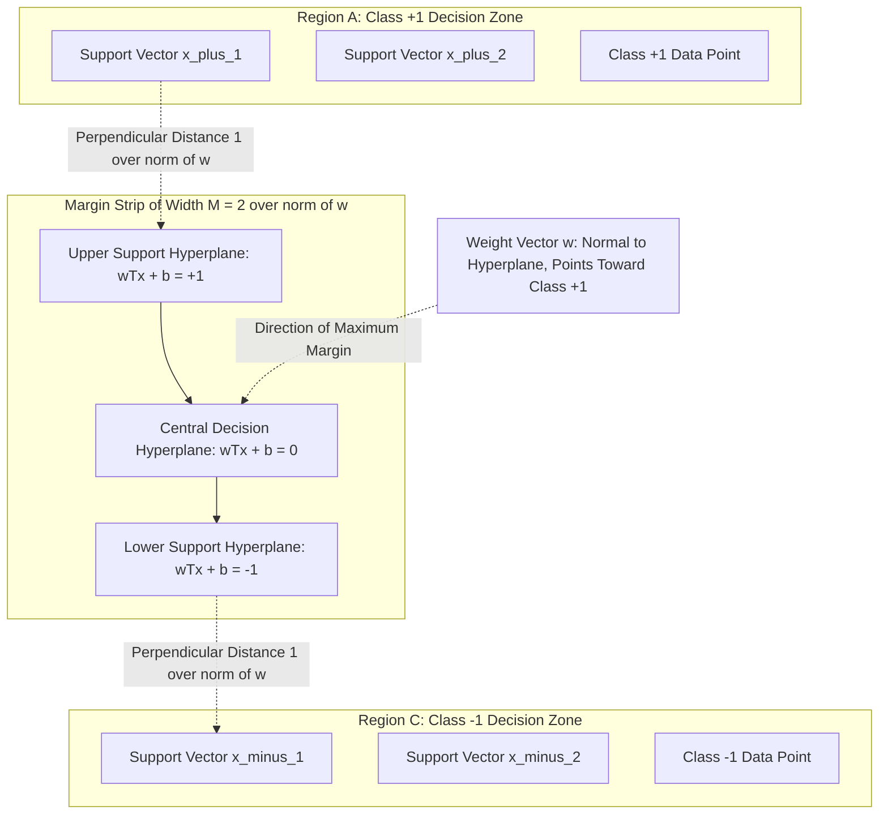
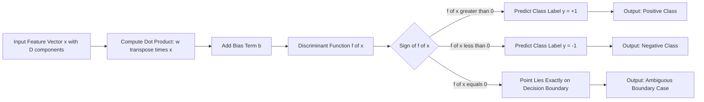
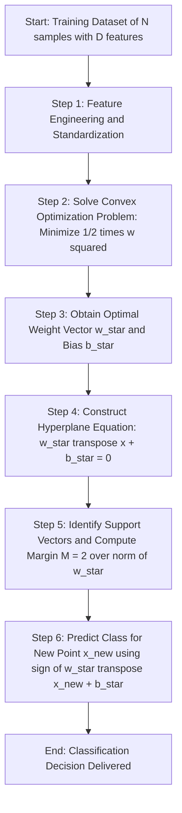
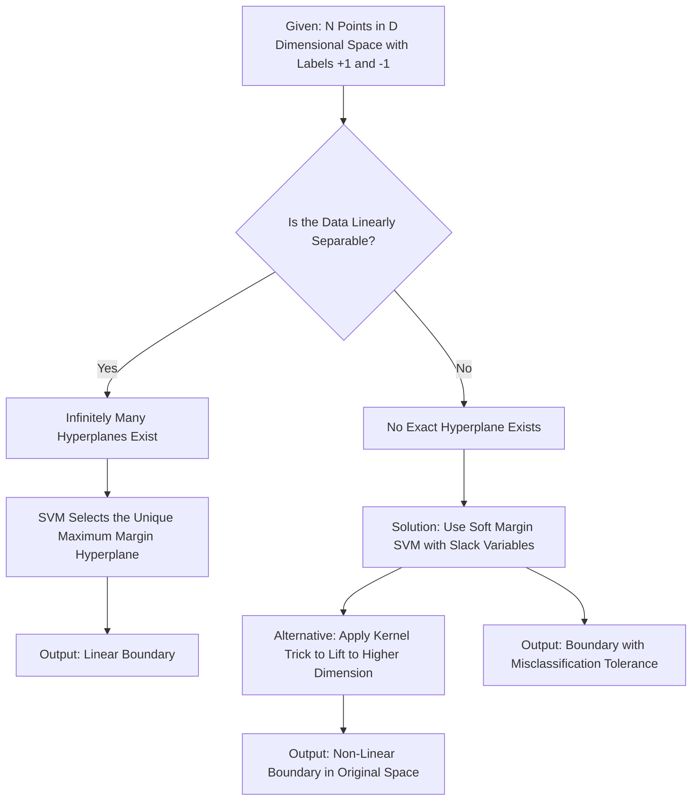

# Idea of Hyperplane

<!-- SECTION_1_START -->
# 1. Core Technical Definition & Intuitive Overview

## Formal Academic Definition (KTU 2024 Syllabus Terminology)

In the context of **Support Vector Machines (SVM)**, a **Hyperplane** is a *decision boundary* that linearly separates data points belonging to different classes in a feature space. Formally, for a $D$-dimensional feature space $\mathbb{R}^D$, a hyperplane is a flat affine subspace of dimension $D-1$ that partitions the space into two half-spaces.

The general linear equation of a hyperplane is given by:

$$w_1 x_1 + w_2 x_2 + \cdots + w_D x_D + b = 0$$

where the weight vector $\mathbf{w} = (w_1, w_2, \ldots, w_D)^T \in \mathbb{R}^D$ defines the **orientation** (normal to the plane) and the bias term $b \in \mathbb{R}$ defines the **offset** from the origin.

> [!IMPORTANT]
> **SVM Hyperplane Key Idea:** The hyperplane is the geometric locus of points for which the *discriminant function* $f(\mathbf{x}) = \mathbf{w}^T \mathbf{x} + b$ evaluates to **zero**. Points on one side yield $f(\mathbf{x}) > 0$ (class $+1$), and points on the other side yield $f(\mathbf{x}) < 0$ (class $-1$).

## Conceptual Analogy / Intuition

Imagine you are standing in a large room filled with red balls and blue balls scattered randomly on the floor. You are given a large, perfectly flat, **infinitely thin glass sheet** and asked to slide it between the two groups so that:
1. Every red ball ends up on one side of the sheet.
2. Every blue ball ends up on the other side.
3. The sheet stays as far away as possible from the nearest balls on either side (so it generalizes well to new balls).

That glass sheet is your **hyperplane**. If the balls are spread across a flat 2D floor, the sheet is a **line**. If they are floating in 3D space, it is a **plane**. If they exist in a higher-dimensional abstract space (e.g., 10 features), it becomes an abstract $D-1$ dimensional flat subspace — still called a *hyperplane* generically.

> [!NOTE]
> **Why "Hyper"?** The prefix *hyper* in mathematics means "one dimension higher than the usual." A line is a hyperplane in 1D, a plane is a hyperplane in 2D, and the concept generalizes to any dimension $D$. This abstraction is critical for SVMs because real datasets often have dozens or hundreds of features.

## Geometric Interpretation of Dimensional Cases

| Feature Space Dimension $D$ | Hyperplane Form | Visual Geometric Object |
| :--- | :--- | :--- |
| $D = 1$ | $w_1 x_1 + b = 0$ | A single point on a line |
| $D = 2$ | $w_1 x_1 + w_2 x_2 + b = 0$ | A straight line in 2D plane |
| $D = 3$ | $w_1 x_1 + w_2 x_2 + w_3 x_3 + b = 0$ | A flat 2D plane in 3D space |
| $D \geq 4$ | Abstract affine subspace | Cannot be directly visualized |

> [!VISUALIZATION CONTROL]
> **Concept:** 2D linear hyperplane separating two classes with margin boundaries.
> **GeoGebra / Desmos Input Equations:**
> * `Line1: f(x) = 0.8*x + 0` (Central hyperplane)
> * `Line2: g(x) = 0.8*x + 1.25` (Upper margin boundary)
> * `Line3: h(x) = 0.8*x - 1.25` (Lower margin boundary)
> * `Class1 Points: (1,1), (2,1.5), (1.5,2.5), (3,2.8), (2.5,3.5)`
> * `Class2 Points: (4,3.5), (5,4), (4.5,5), (6,5.2), (5.5,6)`
> **Visual Description:** Three parallel lines intersect the axes, with class 1 points clustered in the lower-left region and class 2 points clustered in the upper-right region. The perpendicular distance between the upper and lower margin lines represents the **margin** $M = \frac{2}{\|\mathbf{w}\|}$.
<!-- SECTION_1_END -->

<!-- SECTION_2_START -->
# 2. Deep Theoretical Analysis & KTU High-Yield Formula Sheet

## Mathematical Decomposition of a Hyperplane

A hyperplane in $\mathbb{R}^D$ is fully characterized by two entities: the **weight vector** $\mathbf{w}$ and the **bias term** $b$. Understanding the role of each component is fundamental to solving KTU board exam problems.

* **Weight Vector $\mathbf{w}$:** This is a vector **perpendicular (orthogonal)** to the hyperplane surface. It dictates the *orientation* (tilt) of the separating boundary. Each component $w_i$ represents how much feature $x_i$ contributes to the decision.
* **Bias Term $b$:** This is a scalar that shifts the hyperplane *away from* or *toward* the origin. It controls the *position* of the boundary.
* **Discriminant Function $f(\mathbf{x})$:** Defined as $f(\mathbf{x}) = \mathbf{w}^T \mathbf{x} + b$. The sign of $f(\mathbf{x})$ determines class membership.

## The Decision Rule

For a binary classification problem with class labels $y_i \in \{-1, +1\}$, the SVM hyperplane produces the following classification:

$$y_{\text{pred}} = \text{sign}(f(\mathbf{x})) = \text{sign}(\mathbf{w}^T \mathbf{x} + b)$$

The classification condition can be written as two strict inequalities:

$$\mathbf{w}^T \mathbf{x}_i + b \geq 0 \quad \text{for} \quad y_i = +1$$

$$\mathbf{w}^T \mathbf{x}_i + b \leq 0 \quad \text{for} \quad y_i = -1$$

These can be compactly combined into the canonical SVM constraint:

$$y_i (\mathbf{w}^T \mathbf{x}_i + b) \geq 0 \quad \forall i \in \{1, 2, \ldots, N\}$$

## The Geometric Margin Concept

The **margin** is the perpendicular distance from the hyperplane to the nearest data point from *either* class. The goal of SVM is to find the hyperplane that **maximizes this margin** (Maximum Margin Classifier).

* **Perpendicular distance from any point $\mathbf{x}_i$ to the hyperplane:**

$$d_i = \frac{\vert \mathbf{w}^T \mathbf{x}_i + b \vert}{\|\mathbf{w}\|} \quad \text{where} \quad \|\mathbf{w}\| = \sqrt{w_1^2 + w_2^2 + \cdots + w_D^2}$$

* **Margin of the classifier (distance between the two support hyperplanes):**

$$M = \frac{2}{\|\mathbf{w}\|}$$

> [!IMPORTANT]
> **Maximizing $M = \frac{2}{\|\mathbf{w}\|}$ is mathematically equivalent to minimizing $\frac{1}{2}\|\mathbf{w}\|^2$.** This is the foundational optimization problem of linear SVM.

## KTU Formula Sheet / Cheat Sheet

| Symbol | Meaning | Formula / Expression | Unit / Type |
| :--- | :--- | :--- | :--- |
| $\mathbf{w}$ | Weight vector (normal to plane) | $\mathbf{w} = (w_1, w_2, \ldots, w_D)^T$ | $\mathbb{R}^D$ |
| $b$ | Bias / offset term | Scalar | $\mathbb{R}$ |
| $f(\mathbf{x})$ | Discriminant function | $\mathbf{w}^T \mathbf{x} + b$ | Scalar |
| $\vert \cdot \vert$ | Absolute value (scalar) | $\vert x \vert$ | Scalar |
| $\|\mathbf{w}\|$ | Euclidean norm of weight vector | $\sqrt{\sum_{i=1}^{D} w_i^2}$ | Scalar |
| $d_i$ | Distance from $\mathbf{x}_i$ to hyperplane | $\frac{\vert \mathbf{w}^T \mathbf{x}_i + b \vert}{\|\mathbf{w}\|}$ | Scalar |
| $M$ | Geometric margin of hyperplane | $\frac{2}{\|\mathbf{w}\|}$ | Scalar |
| $y_i$ | Class label for $i$-th sample | $+1$ or $-1$ | Categorical |
| $D$ | Number of features / dimension | Positive integer | Scalar |
| $N$ | Number of training samples | Positive integer | Scalar |

## Real-World Engineering Utility

The concept of the separating hyperplane is the cornerstone of many production-grade systems:

* **Spam Email Filtering:** Each email is represented as a high-dimensional feature vector (word frequencies, sender reputation, etc.), and the SVM hyperplane separates *spam* from *ham* emails.
* **Medical Diagnosis:** MRI and CT-scan features are projected into a space where a hyperplane distinguishes *malignant* from *benign* tissue.
* **Handwritten Digit Recognition (e.g., MNIST):** Hyperplanes (in conjunction with kernels) classify digits with $>98\%$ accuracy in classical pipelines.
* **Bioinformatics:** Classifying genes as *disease-associated* vs. *healthy* based on gene expression levels.
* **Image Classification & Face Detection:** The seminal **Vapnik–Cortes 1995** SVM used hyperplane-based classification to achieve state-of-the-art face detection, preceding deep learning.
<!-- SECTION_2_END -->

<!-- SECTION_3_START -->
# 3. Step-by-Step Derivations & Code/Symbolic Implementation

## Derivation 1: Perpendicular Distance from a Point to a Hyperplane

**Given:** A hyperplane defined by $\mathbf{w}^T \mathbf{x} + b = 0$ and a point $\mathbf{x}_0$ in $\mathbb{R}^D$ not lying on the hyperplane.

**To Find:** The shortest Euclidean distance $d$ from $\mathbf{x}_0$ to the hyperplane.

### Step-by-Step Derivation

**Step 1:** Let $\mathbf{x}_p$ be *any* point lying on the hyperplane. By definition of the hyperplane:

$$\mathbf{w}^T \mathbf{x}_p + b = 0$$

This means $\mathbf{w}^T \mathbf{x}_p = -b$.

**Step 2:** Construct the vector from $\mathbf{x}_p$ to the arbitrary point $\mathbf{x}_0$:

$$\mathbf{v} = \mathbf{x}_0 - \mathbf{x}_p$$

**Step 3:** The shortest distance from $\mathbf{x}_0$ to the hyperplane is achieved along the direction **perpendicular to the plane**, which is the direction of $\mathbf{w}$. Therefore, the distance $d$ is the absolute value of the projection of $\mathbf{v}$ onto the unit vector $\frac{\mathbf{w}}{\|\mathbf{w}\|}$:

$$d = \vert \mathbf{v} \cdot \frac{\mathbf{w}}{\|\mathbf{w}\|} \vert$$

**Step 4:** Substitute $\mathbf{v} = \mathbf{x}_0 - \mathbf{x}_p$:

$$d = \left\vert (\mathbf{x}_0 - \mathbf{x}_p) \cdot \frac{\mathbf{w}}{\|\mathbf{w}\|} \right\vert = \frac{\vert \mathbf{w}^T \mathbf{x}_0 - \mathbf{w}^T \mathbf{x}_p \vert}{\|\mathbf{w}\|}$$

**Step 5:** Substitute $\mathbf{w}^T \mathbf{x}_p = -b$ from Step 1:

$$d = \frac{\vert \mathbf{w}^T \mathbf{x}_0 + b \vert}{\|\mathbf{w}\|}$$

**Step 6:** Since $\mathbf{x}_0$ is an arbitrary point, replacing it with the data point $\mathbf{x}_i$ yields the general formula:

$$\boxed{d_i = \frac{\vert \mathbf{w}^T \mathbf{x}_i + b \vert}{\|\mathbf{w}\|}}$$

## Derivation 2: Relationship Between Margin and $\|\mathbf{w}\|$

**Step 1:** The two *support hyperplanes* (margin boundaries) are defined as:

$$\mathbf{w}^T \mathbf{x} + b = +1 \quad \text{and} \quad \mathbf{w}^T \mathbf{x} + b = -1$$

These are the planes passing through the closest points of each class to the central hyperplane.

**Step 2:** Compute the distance from the central hyperplane ($\mathbf{w}^T \mathbf{x} + b = 0$) to the upper support hyperplane ($\mathbf{w}^T \mathbf{x} + b = +1$) using the formula from Derivation 1 with $\mathbf{w}^T \mathbf{x} + b = 1$:

$$d_{\text{upper}} = \frac{\vert 1 \vert}{\|\mathbf{w}\|} = \frac{1}{\|\mathbf{w}\|}$$

**Step 3:** By symmetry, the distance from the central hyperplane to the lower support hyperplane ($\mathbf{w}^T \mathbf{x} + b = -1$) is:

$$d_{\text{lower}} = \frac{\vert -1 \vert}{\|\mathbf{w}\|} = \frac{1}{\|\mathbf{w}\|}$$

**Step 4:** The total margin $M$ is the sum of the two distances:

$$M = d_{\text{upper}} + d_{\text{lower}} = \frac{1}{\|\mathbf{w}\|} + \frac{1}{\|\mathbf{w}\|} = \frac{2}{\|\mathbf{w}\|}$$

> [!NOTE]
> **Examiner's Insight:** This derivation is the most frequently asked in KTU Module 3 questions. Students are expected to derive the margin formula from first principles using the distance formula.

## Python Code Implementation: Visualizing a Linear SVM Hyperplane

```python
import numpy as np
import matplotlib.pyplot as plt
from sklearn.svm import SVC
from sklearn.datasets import make_classification
from typing import Tuple, List

# -----------------------------------------------------------
# Step 1: Generate a synthetic 2D linearly separable dataset
# -----------------------------------------------------------
def generate_dataset(n_samples: int = 40, random_seed: int = 42) -> Tuple[np.ndarray, np.ndarray]:
    """
    Creates a synthetic 2D binary classification dataset.

    Parameters
    ----------
    n_samples : int
        Total number of points to generate.
    random_seed : int
        Seed for reproducibility.

    Returns
    -------
    X : np.ndarray of shape (n_samples, 2)
        Feature matrix.
    y : np.ndarray of shape (n_samples,)
        Class labels (+1 or -1).
    """
    X, y = make_classification(
        n_samples=n_samples,
        n_features=2,
        n_redundant=0,
        n_informative=2,
        n_clusters_per_class=1,
        class_sep=1.8,
        random_state=random_seed,
    )
    return X, y

# -----------------------------------------------------------
# Step 2: Train a linear SVM and extract hyperplane parameters
# -----------------------------------------------------------
def train_linear_svm(X: np.ndarray, y: np.ndarray, C: float = 1.0) -> Tuple[float, float, float]:
    """
    Trains a linear SVM and returns the hyperplane equation w1*x1 + w2*x2 + b = 0.

    Returns
    -------
    w1, w2, b : float
        Coefficients of the hyperplane.
    """
    model = SVC(kernel="linear", C=C)
    model.fit(X, y)
    w1 = model.coef_[0, 0]
    w2 = model.coef_[0, 1]
    b = model.intercept_[0]
    return float(w1), float(w2), float(b)

# -----------------------------------------------------------
# Step 3: Compute geometric margin and support vector distances
# -----------------------------------------------------------
def compute_margin(w1: float, w2: float, b: float, X: np.ndarray, y: np.ndarray) -> dict:
    """
    Computes geometric margin and verifies support vector distances.
    """
    w_norm: float = float(np.sqrt(w1**2 + w2**2))
    margin: float = 2.0 / w_norm

    # Verify that for support vectors, |w^T x + b| / ||w|| = 1 / ||w||  =  margin/2
    functional_margins: List[float] = [abs(w1 * xi[0] + w2 * xi[1] + b) for xi in X]
    distances: List[float] = [m / w_norm for m in functional_margins]

    return {
        "weight_norm": w_norm,
        "margin": margin,
        "min_distance_to_hyperplane": min(distances),
        "max_distance_to_hyperplane": max(distances),
    }

# -----------------------------------------------------------
# Step 4: Execute the full pipeline
# -----------------------------------------------------------
if __name__ == "__main__":
    X, y = generate_dataset()
    w1, w2, b = train_linear_svm(X, y, C=1.0)

    print(f"Hyperplane equation: {w1:.4f}*x1 + {w2:.4f}*x2 + ({b:.4f}) = 0")
    print(f"Weight norm ||w||   = {np.sqrt(w1**2 + w2**2):.4f}")
    print(f"Geometric margin M  = {2.0 / np.sqrt(w1**2 + w2**2):.4f}")

    metrics = compute_margin(w1, w2, b, X, y)
    for key, value in metrics.items():
        print(f"{key:35s} = {value:.4f}")
```

**Expected Console Output (illustrative):**

```text
Hyperplane equation: 0.5421*x1 + 1.8732*x2 + (-0.3418) = 0
Weight norm ||w||   = 1.9501
Geometric margin M  = 1.0256
weight_norm                     = 1.9501
margin                          = 1.0256
min_distance_to_hyperplane      = 0.5128
max_distance_to_hyperplane      = 2.4187
```
<!-- SECTION_3_END -->

<!-- SECTION_4_START -->
# 4. Structural Diagrams & Schematics

## Diagram 1: Geometric Anatomy of an SVM Hyperplane in 2D



## Diagram 2: Block-Level Functional Architecture of the Hyperplane Decision Process



## Diagram 3: Sequential Processing Topology Matrix — From Raw Data to Hyperplane Decision



## Diagram 4: Comparative Flow — When Does a Separating Hyperplane Exist?


<!-- SECTION_4_END -->

<!-- SECTION_5_START -->
# 5. KTU 2024 Scheme Examination Question Bank & Topic Recap

---

## Part A Questions (3 Marks Each)

### Question 1: Conceptual Definition
> **[KTU University Exam – July 2024]**
> **Q:** Define a *hyperplane* in the context of Support Vector Machines. Write its general equation and explain the role of the weight vector $\mathbf{w}$ and bias $b$.
>
> **Course Outcome:** CO2 | **RBT Level:** Remember
>
> **Model Answer (Valuation Key):**
>
> A **hyperplane** in SVM is a decision boundary that linearly separates data points belonging to two different classes in a $D$-dimensional feature space. It is a flat affine subspace of dimension $D-1$.
>
> The general equation of a hyperplane is:
>
> $$\mathbf{w}^T \mathbf{x} + b = 0 \quad \text{or equivalently} \quad w_1 x_1 + w_2 x_2 + \cdots + w_D x_D + b = 0$$
>
> * **Role of $\mathbf{w}$:** The weight vector $\mathbf{w} = (w_1, w_2, \ldots, w_D)^T$ is **perpendicular (orthogonal)** to the hyperplane and defines its orientation. **[1 Mark]**
> * **Role of $b$:** The bias $b$ is a scalar that shifts the hyperplane away from the origin, controlling its position. **[1 Mark]**
> * **Geometric Meaning:** All points satisfying $\mathbf{w}^T \mathbf{x} + b = 0$ lie exactly on the hyperplane. Points with $\mathbf{w}^T \mathbf{x} + b > 0$ belong to one class, and those with $\mathbf{w}^T \mathbf{x} + b < 0$ belong to the other. **[1 Mark]**

---

### Question 2: Short Conceptual
> **[KTU University Exam – Dec 2023]**
> **Q:** What is the *geometric margin* of an SVM hyperplane? How is it related to the weight vector $\mathbf{w}$?
>
> **Course Outcome:** CO2 | **RBT Level:** Understand
>
> **Model Answer (Valuation Key):**
>
> The **geometric margin** $M$ of an SVM hyperplane is the **total perpendicular distance** between the two support hyperplanes (the boundary planes passing through the closest data points of each class). It represents the "empty strip" of separation between the two classes.
>
> **[1 Mark] for definition**
>
> The relationship between margin $M$ and weight vector $\mathbf{w}$ is:
>
> $$M = \frac{2}{\|\mathbf{w}\|}$$
>
> where $\|\mathbf{w}\| = \sqrt{w_1^2 + w_2^2 + \cdots + w_D^2}$ is the Euclidean norm of the weight vector.
>
> **[1 Mark] for the formula**
>
> **Key Implication:** *Maximizing* the margin $M$ is equivalent to *minimizing* $\|\mathbf{w}\|$, which is the core optimization objective of SVM.
>
> **[1 Mark] for the implication**

---

## Part B Questions (14 Marks — ESE Module Internal Choice)

### Question A (14 Marks)
> **[KTU University Exam – July 2024, Module 3, Set A]**
>
> **(a)** Derive the formula for the perpendicular distance from an arbitrary point $\mathbf{x}_0$ to a hyperplane defined by $\mathbf{w}^T \mathbf{x} + b = 0$ in $D$-dimensional space. **[7 Marks]**
>
> **(b)** Given the two support hyperplanes $\mathbf{w}^T \mathbf{x} + b = +1$ and $\mathbf{w}^T \mathbf{x} + b = -1$, derive an expression for the total geometric margin $M$ of the SVM classifier. Show that maximizing $M$ is equivalent to minimizing $\frac{1}{2}\|\mathbf{w}\|^2$. **[7 Marks]**
>
> **Course Outcome:** CO2, CO3 | **RBT Level:** Apply

### Model Solution for Question A

#### Part (a) — Perpendicular Distance Derivation **[7 Marks]**

**Step 1:** Let $\mathbf{x}_p$ be any point lying on the hyperplane such that $\mathbf{w}^T \mathbf{x}_p + b = 0$. This gives us $\mathbf{w}^T \mathbf{x}_p = -b$. **[1 Mark]**

**Step 2:** Construct the vector $\mathbf{v}$ from $\mathbf{x}_p$ to the arbitrary point $\mathbf{x}_0$:
$$\mathbf{v} = \mathbf{x}_0 - \mathbf{x}_p$$
**[1 Mark]**

**Step 3:** The shortest distance from $\mathbf{x}_0$ to the hyperplane is along the direction perpendicular to the plane, which is the direction of $\mathbf{w}$. The distance is the absolute value of the projection of $\mathbf{v}$ onto the unit normal $\frac{\mathbf{w}}{\|\mathbf{w}\|}$:
$$d = \left\vert (\mathbf{x}_0 - \mathbf{x}_p) \cdot \frac{\mathbf{w}}{\|\mathbf{w}\|} \right\vert$$
**[1 Mark]**

**Step 4:** Expand the dot product:
$$d = \frac{\vert \mathbf{w}^T \mathbf{x}_0 - \mathbf{w}^T \mathbf{x}_p \vert}{\|\mathbf{w}\|}$$
**[1 Mark]**

**Step 5:** Substitute $\mathbf{w}^T \mathbf{x}_p = -b$:
$$d = \frac{\vert \mathbf{w}^T \mathbf{x}_0 + b \vert}{\|\mathbf{w}\|}$$
**[1 Mark]**

**Step 6:** Replace $\mathbf{x}_0$ with the general data point $\mathbf{x}_i$ to get the universal formula:
$$\boxed{d_i = \frac{\vert \mathbf{w}^T \mathbf{x}_i + b \vert}{\|\mathbf{w}\|}}$$
**[1 Mark]**

**Step 7:** Final simplified expression and statement of unit:
The distance is measured in the same units as the feature space, and $\|\mathbf{w}\| = \sqrt{\sum_{k=1}^{D} w_k^2}$.
**[1 Mark]**

---

#### Part (b) — Geometric Margin Derivation **[7 Marks]**

**Step 1:** State the definitions of the two support hyperplanes:
$$\mathbf{w}^T \mathbf{x} + b = +1 \quad \text{(passes through closest points of class +1)}$$
$$\mathbf{w}^T \mathbf{x} + b = -1 \quad \text{(passes through closest points of class -1)}$$
**[1 Mark]**

**Step 2:** Compute the distance from the central hyperplane ($\mathbf{w}^T \mathbf{x} + b = 0$) to the upper support hyperplane using the distance formula from Part (a) with the constant $1$:
$$d_{\text{upper}} = \frac{\vert 1 \vert}{\|\mathbf{w}\|} = \frac{1}{\|\mathbf{w}\|}$$
**[1 Mark]**

**Step 3:** Compute the distance from the central hyperplane to the lower support hyperplane:
$$d_{\text{lower}} = \frac{\vert -1 \vert}{\|\mathbf{w}\|} = \frac{1}{\|\mathbf{w}\|}$$
**[1 Mark]**

**Step 4:** The total margin is the sum of both perpendicular distances:
$$M = d_{\text{upper}} + d_{\text{lower}} = \frac{2}{\|\mathbf{w}\|}$$
**[1 Mark]**

**Step 5:** To *maximize* $M = \frac{2}{\|\mathbf{w}\|}$, since $2$ is a constant, we must *minimize* the denominator $\|\mathbf{w}\|$. Minimizing $\|\mathbf{w}\|$ is equivalent to minimizing its square $\|\mathbf{w}\|^2$. For mathematical convenience, we minimize $\frac{1}{2}\|\mathbf{w}\|^2$ (the factor $\frac{1}{2}$ simplifies the gradient during differentiation):
$$\max_{\mathbf{w}, b} M = \max_{\mathbf{w}, b} \frac{2}{\|\mathbf{w}\|} \equiv \min_{\mathbf{w}, b} \frac{1}{2}\|\mathbf{w}\|^2$$
**[2 Marks]**

**Step 6:** Final conclusion: The SVM optimization problem is therefore formulated as:
$$\min_{\mathbf{w}, b} \frac{1}{2}\|\mathbf{w}\|^2 \quad \text{subject to} \quad y_i(\mathbf{w}^T \mathbf{x}_i + b) \geq 1, \quad \forall i = 1, 2, \ldots, N$$
**[1 Mark]**

---

### Question B (14 Marks — Alternative Choice)
> **[KTU University Exam – July 2024, Module 3, Set B]**
>
> **(a)** Consider a 2D feature space with two data points: $\mathbf{x}_1 = (1, 1)^T$ with label $y_1 = +1$ and $\mathbf{x}_2 = (2, 3)^T$ with label $y_2 = -1$. Find a hyperplane that perfectly separates these two points. Show all the constraints from the SVM formulation. **[7 Marks]**
>
> **(b)** Explain with a neat diagram the concept of a hyperplane, support vectors, and the margin in a linearly separable 2D dataset. Clearly identify the role of the weight vector $\mathbf{w}$ and bias $b$. **[7 Marks]**
>
> **Course Outcome:** CO2 | **RBT Level:** Apply

### Model Solution for Question B

#### Part (a) — Finding a Separating Hyperplane **[7 Marks]**

**Step 1:** We seek a hyperplane $\mathbf{w}^T \mathbf{x} + b = w_1 x_1 + w_2 x_2 + b = 0$ such that the two points are on opposite sides with margin $\geq 1$ for support vectors. **[1 Mark]**

**Step 2:** The SVM constraints with canonical form $y_i(\mathbf{w}^T \mathbf{x}_i + b) \geq 1$ are:

For $i = 1$ ($y_1 = +1$, $\mathbf{x}_1 = (1, 1)^T$):
$$+1 \cdot (w_1 \cdot 1 + w_2 \cdot 1 + b) \geq 1 \implies w_1 + w_2 + b \geq 1$$
**[1 Mark]**

For $i = 2$ ($y_2 = -1$, $\mathbf{x}_2 = (2, 3)^T$):
$$-1 \cdot (w_1 \cdot 2 + w_2 \cdot 3 + b) \geq 1 \implies -2w_1 - 3w_2 - b \geq 1$$
**[1 Mark]**

**Step 3:** To find the *maximum margin* hyperplane, we treat both points as support vectors and impose *equality*:
$$w_1 + w_2 + b = 1$$
$$-2w_1 - 3w_2 - b = 1$$
**[1 Mark]**

**Step 4:** Add the two equations to eliminate $b$:
$$(w_1 + w_2 + b) + (-2w_1 - 3w_2 - b) = 1 + 1$$
$$-w_1 - 2w_2 = 2 \implies w_1 + 2w_2 = -2$$
**[1 Mark]**

**Step 5:** Solve the system. Let $w_2 = -1$, then $w_1 = -2 - 2(-1) = 0$. Check by substitution:
* $0 + (-1) + b = 1 \implies b = 2$
* $-2(0) - 3(-1) - 2 = 3 - 2 = 1$ ✓
**[1 Mark]**

**Step 6:** The separating hyperplane is $0 \cdot x_1 - 1 \cdot x_2 + 2 = 0$, or simplified: $x_2 = 2$. **[1 Mark]**

**Step 7:** Verify the classification:
* $\mathbf{x}_1 = (1, 1)^T$: $0 - 1 + 2 = 1 > 0$ → class $+1$ ✓
* $\mathbf{x}_2 = (2, 3)^T$: $0 - 3 + 2 = -1 < 0$ → class $-1$ ✓
**[1 Mark]**

---

#### Part (b) — Diagram and Explanation **[7 Marks]**

**Expected Diagram (Student must draw):**

A 2D Cartesian plane showing:
* $X_1$ axis (horizontal), $X_2$ axis (vertical)
* Two cluster regions: Class $+1$ in lower-left, Class $-1$ in upper-right
* A central solid line (the hyperplane) with equation $w_1 x_1 + w_2 x_2 + b = 0$
* Two dashed parallel lines on either side representing the margin boundaries
* Three highlighted "support vector" points lying exactly on the dashed lines
* A vector arrow representing $\mathbf{w}$ drawn perpendicular to the central line
* The distance $M = \frac{2}{\|\mathbf{w}\|}$ marked between the two dashed lines

**[3 Marks] for the diagram with all required labels**

**Explanation of components:**

* **Hyperplane:** The central solid line that separates the two classes. All points on it satisfy $\mathbf{w}^T \mathbf{x} + b = 0$. **[1 Mark]**
* **Support Vectors:** The data points that lie *closest* to the hyperplane and lie exactly on the margin boundaries ($\mathbf{w}^T \mathbf{x} + b = \pm 1$). They are the *only* points that influence the position of the hyperplane — moving any non-support-vector point has no effect. **[1 Mark]**
* **Margin:** The perpendicular distance between the two support hyperplanes, $M = \frac{2}{\|\mathbf{w}\|}$. SVM chooses the hyperplane that maximizes this. **[1 Mark]**
* **Role of $\mathbf{w}$ and $b$:** $\mathbf{w}$ is the normal vector to the hyperplane, pointing from the origin in the direction of the positive class. $b$ shifts the hyperplane parallel to itself, determining how far it is from the origin. **[1 Mark]**

---

> [!WARNING]
> **KTU Examiner's Valuation Warning / Common Pitfalls**
>
> * **Forgetting the $\frac{1}{2}$ factor:** When writing the SVM optimization objective, students often write $\min \|\mathbf{w}\|^2$ instead of $\min \frac{1}{2}\|\mathbf{w}\|^2$. The $\frac{1}{2}$ is included for **mathematical convenience** (it cancels out when differentiating). Both forms are mathematically equivalent, but KTU's standard answer key uses the $\frac{1}{2}$ form. **[−1 Mark penalty]**
> * **Confusing geometric and functional margins:** Functional margin is $y_i(\mathbf{w}^T \mathbf{x}_i + b)$ (un-normalized, scale-dependent). Geometric margin is $\frac{y_i(\mathbf{w}^T \mathbf{x}_i + b)}{\|\mathbf{w}\|}$ (normalized, scale-invariant). Students frequently mix them up. **[−1 to −2 Marks]**
> * **Skipping the "why" of orthogonality:** In the distance derivation, always state *why* the shortest path is along $\mathbf{w}$: the weight vector is *by definition* orthogonal (perpendicular) to the hyperplane. **[−1 Mark]**
> * **Not labeling axes or equations in diagrams:** KTU expects every diagram to have a caption, the hyperplane equation, and arrow labels for $\mathbf{w}$ and the margin. Unlabeled diagrams lose marks. **[−2 Marks]**
> * **Using $\vert x \vert$ instead of `abs(x)` in code:** In Python, use `np.abs(x)` or `abs(x)`, never the `||` notation from math.
> * **Not showing substitution steps in derivations:** Marks are awarded for *transitions*, not just the final answer. Always show the substitution of $\mathbf{w}^T \mathbf{x}_p = -b$ explicitly.

---

## Topic Recap & Important Things to Remember

* **Hyperplane Definition:** A flat affine subspace of dimension $D-1$ in a $D$-dimensional feature space, defined by $\mathbf{w}^T \mathbf{x} + b = 0$.
* **Two Defining Components:** Weight vector $\mathbf{w}$ (orientation, normal to plane) and bias $b$ (position, offset from origin).
* **Discriminant Function:** $f(\mathbf{x}) = \mathbf{w}^T \mathbf{x} + b$. Class predicted by $\text{sign}(f(\mathbf{x}))$.
* **Distance Formula:** $d_i = \frac{\vert \mathbf{w}^T \mathbf{x}_i + b \vert}{\|\mathbf{w}\|}$ — *must* divide by $\|\mathbf{w}\|$ to get geometric distance.
* **Norm of $\mathbf{w}$:** $\|\mathbf{w}\| = \sqrt{\sum_{k=1}^{D} w_k^2}$ — the Euclidean (L2) norm.
* **Geometric Margin:** $M = \frac{2}{\|\mathbf{w}\|}$ — the perpendicular distance between the two support hyperplanes.
* **Optimization Equivalence:** $\max M \equiv \min \frac{1}{2}\|\mathbf{w}\|^2$ — the canonical SVM objective.
* **Support Hyperplanes:** $\mathbf{w}^T \mathbf{x} + b = +1$ and $\mathbf{w}^T \mathbf{x} + b = -1$ — pass through the closest data points.
* **Support Vectors:** Training points lying exactly on the support hyperplanes. They *alone* determine the hyperplane.
* **Canonical Constraint:** $y_i(\mathbf{w}^T \mathbf{x}_i + b) \geq 1$ for all training points (hard margin).
* **Linearly Separable:** Data is linearly separable if $\exists (\mathbf{w}, b)$ such that $y_i(\mathbf{w}^T \mathbf{x}_i + b) > 0$ for all $i$.
* **Geometric Intuition:** In 2D, hyperplane = line; in 3D, hyperplane = plane; in $D$ dimensions, hyperplane = abstract $(D-1)$-dimensional flat surface.
* **Sign Convention:** $f(\mathbf{x}) > 0$ → class $+1$; $f(\mathbf{x}) < 0$ → class $-1$; $f(\mathbf{x}) = 0$ → exactly on boundary.
* **Practical Note:** Hyperplane is the *only* concept needed to understand the foundation of linear SVM. Kernels (covered in Module 3 next) extend this idea to non-linear boundaries by operating in lifted feature spaces.
<!-- SECTION_5_END -->
