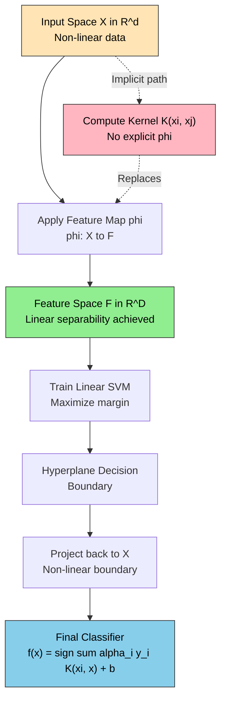
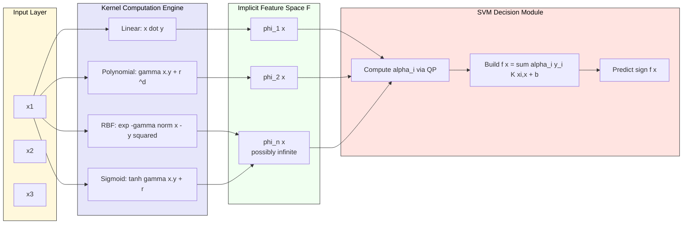
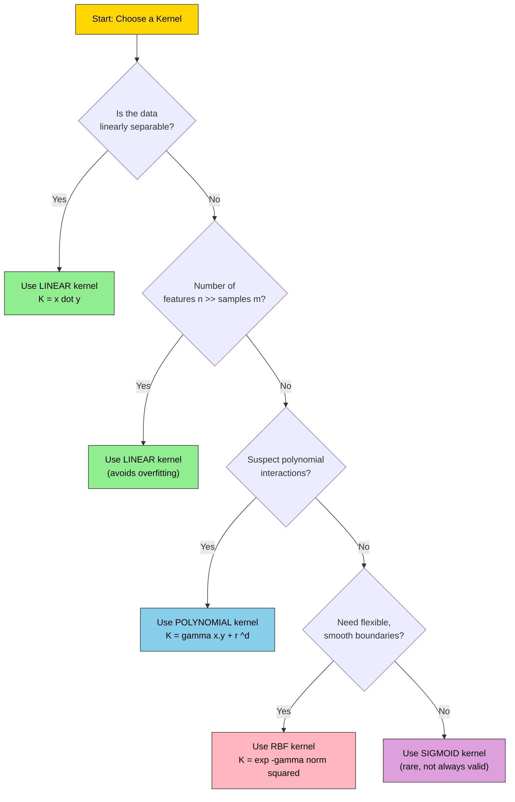
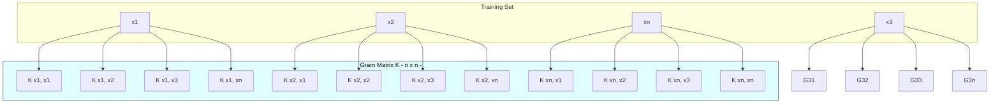

# Kernels for learning non-linear functions

<!-- SECTION_1_START -->

# Kernels for Learning Non-Linear Functions

> [!IMPORTANT]
> **KTU 2024 Scheme | PCCST503 - Machine Learning | Module 3: SVM (Linear SVM)**
> **Syllabus Focus:** Mapping non-linear data to high-dimensional feature spaces using kernel functions, the kernel trick, and Mercer's condition.

## 1.1 Formal Academic Definition

In the context of **Support Vector Machines (SVM)**, a **kernel** is a mathematical function $K(x_i, x_j)$ that computes the **inner product** of two data points in some (potentially infinite-dimensional) feature space, **without explicitly performing the transformation**. Formally, given an input space $\mathcal{X} \subseteq \mathbb{R}^d$ and a feature mapping $\phi : \mathcal{X} \rightarrow \mathcal{F}$ to a higher-dimensional feature space $\mathcal{F}$, the kernel is defined as:

$$K(x_i, x_j) = \langle \phi(x_i), \phi(x_j) \rangle_{\mathcal{F}}$$

The defining constraint is that this computation must be performed **entirely in the original input space $\mathcal{X}$**, while the SVM algorithm behaves as if the data were linearly separable in $\mathcal{F}$. This elegant circumvention is famously known as the **kernel trick**.

A function $K : \mathcal{X} \times \mathcal{X} \rightarrow \mathbb{R}$ is a **valid kernel** if and only if it satisfies **Mercer's Theorem**: $K$ must be *symmetric* ($K(x_i, x_j) = K(x_j, x_i)$) and *positive semi-definite* — meaning the Gram matrix $G$ where $G_{ij} = K(x_i, x_j)$ must have all non-negative eigenvalues for any finite sample set.

## 1.2 Conceptual Analogy: The "Lifting Trick"

> [!NOTE]
> **Intuitive Analogy — "Uncrumpling the Paper"**
> Imagine you have a sheet of crumpled paper (your non-linear data) lying flat on a table. The classes are mixed up — no straight line can separate them. If you try to draw a line, you fail. But what if you were allowed to *lift the paper into 3D space*? A flat plane could then slice through the air and separate the two classes perfectly. **A kernel is the mathematical machinery that allows the SVM to "lift" your data into a higher dimension, separate it with a hyperplane, and then project the answer back — all without ever explicitly constructing the 3D coordinates.**

For example, consider the classic XOR problem: the points $(0,0), (1,1)$ belong to class $+1$ and $(0,1), (1,0)$ belong to class $-1$. No line in 2D can separate them. But by mapping $\phi(x_1, x_2) = (x_1, x_2, x_1 x_2)$, the points become 3D and become linearly separable. The kernel $K(x, y) = (x \cdot y)^2$ achieves this without computing $\phi$ explicitly.

> [!IMPORTANT]
> **Key Insight:** The complexity of training a non-linear SVM depends on the number of training examples $n$ (via the kernel matrix $K \in \mathbb{R}^{n \times n}$), **not** on the dimensionality of the feature space $\mathcal{F}$. This is what makes kernels computationally tractable for high-dimensional (and even infinite-dimensional) mappings.

## 1.3 Visualization of the Kernel Mapping

> [!VISUALIZATION CONTROL]
> **Concept:** 2D Non-Linear Data Mapped to 3D Feature Space (Polynomial Kernel of Degree 2)
> **GeoGebra / Desmos Input Equations (3D):**
> * `f(x, y) = x^2 + y^2` (radial-style lifting function)
> * `g(x, y) = x * y` (cross-term lifting function for XOR)
>
> **Visual Description:** On the $(x, y)$ plane (the input space), plot four points forming the XOR pattern: $(0,0)$ and $(1,1)$ in one color, $(0,1)$ and $(1,0)$ in another. In 3D, lift these points using $z = x^2 + y^2$ or $z = xy$. Observe that after lifting, a flat 2D plane (the hyperplane) can pass between the lifted clusters, achieving perfect linear separation. The kernel $K(x, y) = (x \cdot y)^2$ replicates this separation in the original 2D space via curved decision boundaries (ellipses, hyperbolas).

---

<!-- SECTION_1_END -->

<!-- SECTION_2_START -->

# Deep Theoretical Analysis & KTU High-Yield Formula Sheet

## 2.1 Why Kernels? The Motivation

A standard linear SVM solves the optimization:

$$\min_{w, b} \frac{1}{2} \|w\|^2 \quad \text{subject to} \quad y_i (w \cdot x_i + b) \geq 1 - \xi_i, \quad \xi_i \geq 0$$

The **dual formulation** of this problem, derived via Lagrange multipliers $\alpha_i$, exposes the data only through inner products $x_i \cdot x_j$:

$$\max_{\alpha} \sum_{i=1}^{n} \alpha_i - \frac{1}{2} \sum_{i=1}^{n} \sum_{j=1}^{n} \alpha_i \alpha_j y_i y_j (x_i \cdot x_j)$$

$$\text{subject to} \quad \sum_{i=1}^{n} \alpha_i y_i = 0, \quad 0 \leq \alpha_i \leq C$$

> [!IMPORTANT]
> **The Kernel Trick Exploits the Dual:** Because the dual formulation depends on data *only* through dot products $x_i \cdot x_j$, we can **replace** every occurrence of $x_i \cdot x_j$ with $K(x_i, x_j)$ and the algorithm implicitly performs classification in the feature space $\mathcal{F}$ — without ever computing $\phi(\cdot)$. The decision function becomes:

$$f(x) = \text{sign}\left(\sum_{i=1}^{n} \alpha_i y_i K(x_i, x) + b\right)$$

## 2.2 The Core Kernel Theorem (Mercer's Condition)

A function $K$ is a valid kernel (i.e., there exists some $\phi$ such that $K(x, y) = \phi(x) \cdot \phi(y)$) if and only if:

1. **Symmetry:** $K(x, y) = K(y, x)$ for all $x, y \in \mathcal{X}$
2. **Positive Semi-Definiteness:** For any finite set $\{x_1, \dots, x_n\}$ and any real coefficients $\{c_1, \dots, c_n\}$:

$$\sum_{i=1}^{n} \sum_{j=1}^{n} c_i c_j K(x_i, x_j) \geq 0$$

Equivalently, the **Gram matrix** $K_{ij} = K(x_i, x_j)$ must be positive semi-definite. This condition guarantees that the kernel corresponds to an inner product in some Hilbert space.

## 2.3 Canonical Kernel Functions (KTU High-Yield Cheat Sheet)

> [!NOTE]
> The following table summarizes the **standard kernel functions** that appear repeatedly in KTU board exams. Memorize the explicit feature mappings — they are favorite exam questions.

| Kernel Name | Mathematical Form $K(x, y)$ | Implicit Feature Map $\phi(x)$ | Use Case | Key Hyperparameter |
| :--- | :--- | :--- | :--- | :--- |
| **Linear Kernel** | $K(x, y) = x \cdot y = x^T y$ | $\phi(x) = x$ (identity) | Linearly separable data, high-dim text | None |
| **Polynomial Kernel** | $K(x, y) = (\gamma \, x^T y + r)^d$ | Monomials up to degree $d$ | Image processing, moderate non-linearity | $d \in \mathbb{Z}^+$, $\gamma$, $r$ |
| **Gaussian RBF** | $K(x, y) = \exp\left(-\gamma \, \Vert x - y \Vert^2\right)$ | Infinite-dimensional (Gaussian) | Most general default, complex boundaries | $\gamma > 0$ |
| **Sigmoid Kernel** | $K(x, y) = \tanh(\gamma \, x^T y + r)$ | No guaranteed valid $\phi$ (not always PSD) | Neural network analogy (deprecated for SVM) | $\gamma$, $r$ |
| **Laplacian Kernel** | $K(x, y) = \exp\left(-\gamma \, \Vert x - y \Vert_1\right)$ | Infinite-dimensional | Histogram-based data (e.g., image retrieval) | $\gamma > 0$ |
| **Cosine Similarity** | $K(x, y) = \dfrac{x \cdot y}{\Vert x \Vert \Vert y \Vert}$ | Normalized vectors | Text classification, NLP | None |

> [!IMPORTANT]
> **Where each kernel is used in production:**
> * **RBF Kernel:** Default choice in `sklearn.svm.SVC`. Used in bioinformatics (protein classification), anomaly detection, and finance.
> * **Polynomial Kernel:** Used in image recognition (early work) and NLP when prior knowledge suggests polynomial interactions.
> * **Linear Kernel:** Used in text classification (e.g., spam detection) where data is high-dimensional but linearly separable.
> * **String/Graph Kernels:** Used in computational biology (DNA/protein comparison) and cheminformatics.

## 2.4 Effect of Hyperparameters on Decision Boundary

The choice of $\gamma$ and $C$ (or $d$ for polynomial) critically shapes the decision boundary. A high $\gamma$ makes the RBF kernel's influence *local* (each training point has a tight Gaussian "bump" — risk of overfitting). A low $\gamma$ makes it *global* (smooth boundary — risk of underfitting). The regularization $C$ controls the penalty for misclassifications: high $C$ forces a tight, low-margin boundary; low $C$ allows a smoother, wider margin with more slack.

## 2.5 Kernel Composition Rules

Kernels can be combined to construct new valid kernels. If $K_1$ and $K_2$ are valid kernels, then so are:

* $K(x, y) = c \cdot K_1(x, y)$ for any constant $c > 0$
* $K(x, y) = K_1(x, y) + K_2(x, y)$
* $K(x, y) = K_1(x, y) \cdot K_2(x, y)$
* $K(x, y) = f(x) \cdot f(y)$ for any function $f$
* $K(x, y) = K_3(\phi(x), \phi(y))$ for any kernel $K_3$ and mapping $\phi$

These closure properties enable **modular kernel engineering** for domain-specific problems.

---

<!-- SECTION_2_END -->

<!-- SECTION_3_START -->

# Step-by-Step Derivations & Code Implementation

## 3.1 Derivation: From Primal SVM to Kernelized Dual

We start with the **soft-margin primal** problem (with slack variables $\xi_i$ for non-separable data) and penalty $C$:

$$\min_{w, b, \xi} \frac{1}{2} \|w\|^2 + C \sum_{i=1}^{n} \xi_i$$

subject to $y_i (w \cdot x_i + b) \geq 1 - \xi_i$ and $\xi_i \geq 0$.

**Step 1 — Form the Lagrangian:** Introduce Lagrange multipliers $\alpha_i \geq 0$ for the margin constraints and $\mu_i \geq 0$ for the non-negativity of slacks:

$$\mathcal{L}(w, b, \xi, \alpha, \mu) = \frac{1}{2} \|w\|^2 + C \sum_{i=1}^{n} \xi_i - \sum_{i=1}^{n} \alpha_i \left[ y_i (w \cdot x_i + b) - 1 + \xi_i \right] - \sum_{i=1}^{n} \mu_i \xi_i$$

**Step 2 — Take partial derivatives and set to zero** (KKT stationarity conditions):

$\frac{\partial \mathcal{L}}{\partial w} = w - \sum_{i=1}^{n} \alpha_i y_i x_i = 0 \implies w = \sum_{i=1}^{n} \alpha_i y_i x_i$

$\frac{\partial \mathcal{L}}{\partial b} = -\sum_{i=1}^{n} \alpha_i y_i = 0 \implies \sum_{i=1}^{n} \alpha_i y_i = 0$

$\frac{\partial \mathcal{L}}{\partial \xi_i} = C - \alpha_i - \mu_i = 0 \implies 0 \leq \alpha_i \leq C$

**Step 3 — Substitute back** into $\mathcal{L}$ to obtain the **dual problem**, which depends on $x_i, x_j$ only via inner products:

$$\max_{\alpha} \sum_{i=1}^{n} \alpha_i - \frac{1}{2} \sum_{i=1}^{n} \sum_{j=1}^{n} \alpha_i \alpha_j y_i y_j \, (x_i \cdot x_j)$$

**Step 4 — Apply the kernel substitution** $x_i \cdot x_j \rightarrow K(x_i, x_j)$:

$$\max_{\alpha} \sum_{i=1}^{n} \alpha_i - \frac{1}{2} \sum_{i=1}^{n} \sum_{j=1}^{n} \alpha_i \alpha_j y_i y_j \, K(x_i, x_j)$$

**Step 5 — Recover the decision function** by substituting $w = \sum_i \alpha_i y_i \phi(x_i)$ into $f(x) = w \cdot \phi(x) + b$:

$$f(x) = \sum_{i=1}^{n} \alpha_i y_i \, K(x_i, x) + b$$

> [!NOTE]
> This final expression is the **operational form** used in deployment: classification requires only $K(x_i, x)$, the support vectors $x_i$, their weights $\alpha_i y_i$, and the bias $b$.

## 3.2 Worked Example: Polynomial Kernel of Degree 2

Given $x = (x_1, x_2)$ and $y = (y_1, y_2)$, derive the feature map for $K(x, y) = (x \cdot y)^2$.

**Step 1 — Expand the inner product:**

$$x \cdot y = x_1 y_1 + x_2 y_2$$

**Step 2 — Square the result:**

$$K(x, y) = (x_1 y_1 + x_2 y_2)^2$$

**Step 3 — Apply the binomial identity** $(a + b)^2 = a^2 + 2ab + b^2$:

$$K(x, y) = x_1^2 y_1^2 + 2 x_1 x_2 y_1 y_2 + x_2^2 y_2^2$$

**Step 4 — Recognize the inner product structure.** The above can be written as:

$$K(x, y) = \begin{bmatrix} x_1^2 \\ \sqrt{2} \, x_1 x_2 \\ x_2^2 \end{bmatrix} \cdot \begin{bmatrix} y_1^2 \\ \sqrt{2} \, y_1 y_2 \\ y_2^2 \end{bmatrix} = \phi(x) \cdot \phi(y)$$

**Step 5 — Identify the explicit feature map:**

$$\phi(x) = (x_1^2, \, \sqrt{2} \, x_1 x_2, \, x_2^2)^T \in \mathbb{R}^3$$

Thus, a degree-2 polynomial kernel on 2D inputs implicitly lifts data into a **3-dimensional** space, enabling the SVM to learn a **quadratic decision boundary** in the original 2D space.

## 3.3 Worked Example: Verifying Mercer's Condition for RBF

Verify that the Gaussian RBF kernel $K(x, y) = \exp(-\gamma \, \Vert x - y \Vert^2)$ is positive semi-definite.

**Step 1 — Expand the squared norm:**

$$\Vert x - y \Vert^2 = (x - y) \cdot (x - y) = \Vert x \Vert^2 - 2 x \cdot y + \Vert y \Vert^2$$

**Step 2 — Use the Taylor series expansion** of the exponential:

$$K(x, y) = \exp(-\gamma \Vert x \Vert^2) \cdot \exp(2\gamma \, x \cdot y) \cdot \exp(-\gamma \Vert y \Vert^2)$$

**Step 3 — Expand $\exp(2\gamma \, x \cdot y)$ as a power series:**

$$\exp(2\gamma \, x \cdot y) = \sum_{k=0}^{\infty} \frac{(2\gamma)^k (x \cdot y)^k}{k!}$$

**Step 4 — Recognize each term $(x \cdot y)^k$ as an inner product in a $k$-degree polynomial space** (this is itself a valid kernel by Mercer's theorem on polynomial kernels).

**Step 5 — Conclude:** Since $K(x,y)$ is an infinite sum of positive multiples of valid kernels, the RBF kernel is positive semi-definite, and its feature space is **infinite-dimensional**.

## 3.4 Python Implementation: Kernel SVM with Decision Boundary Visualization

```python
"""
Kernel SVM Implementation for Non-Linear Classification
KTU PCCST503 - Module 3 Demonstration
Course Outcome: CO3 (Apply kernel methods to non-linear data)
"""

import numpy as np
import matplotlib.pyplot as plt
from sklearn.datasets import make_moons
from sklearn.svm import SVC
from sklearn.preprocessing import StandardScaler
from sklearn.model_selection import train_test_split
from sklearn.metrics import accuracy_score, classification_report
import logging

# Configure logging for reproducibility
logging.basicConfig(level=logging.INFO, format='%(asctime)s - %(levelname)s - %(message)s')
logger = logging.getLogger(__name__)


def generate_nonlinear_dataset(n_samples: int = 300, noise: float = 0.15, random_state: int = 42):
    """Generate the 'two moons' dataset, a classic non-linear benchmark."""
    X, y = make_moons(n_samples=n_samples, noise=noise, random_state=random_state)
    logger.info(f"Dataset generated: shape={X.shape}, class balance={np.bincount(y)}")
    return X, y


def train_kernel_svm(X_train: np.ndarray, y_train: np.ndarray,
                     kernel: str = 'rbf', C: float = 1.0, gamma: str = 'scale',
                     degree: int = 3) -> SVC:
    """Train an SVM classifier with the specified kernel and hyperparameters."""
    if kernel not in {'linear', 'poly', 'rbf', 'sigmoid'}:
        raise ValueError(f"Unsupported kernel: {kernel}. Choose from linear, poly, rbf, sigmoid.")
    if C <= 0:
        raise ValueError(f"Regularization parameter C must be positive, got {C}")
    if gamma != 'scale' and gamma != 'auto' and (not isinstance(gamma, (int, float)) or gamma <= 0):
        raise ValueError(f"gamma must be 'scale', 'auto', or a positive number, got {gamma}")

    model = SVC(kernel=kernel, C=C, gamma=gamma, degree=degree, random_state=42)
    model.fit(X_train, y_train)
    logger.info(f"SVM trained with kernel={kernel}, C={C}, gamma={gamma}, "
                f"n_support={model.n_support_}")
    return model


def plot_decision_boundary(model: SVC, X: np.ndarray, y: np.ndarray,
                           title: str, filename: str) -> None:
    """Visualize the decision boundary of the trained kernel SVM."""
    x_min, x_max = X[:, 0].min() - 0.5, X[:, 0].max() + 0.5
    y_min, y_max = X[:, 1].min() - 0.5, X[:, 1].max() + 0.5
    xx, yy = np.meshgrid(np.linspace(x_min, x_max, 400),
                         np.linspace(y_min, y_max, 400))

    Z = model.predict(np.c_[xx.ravel(), yy.ravel()])
    Z = Z.reshape(xx.shape)

    plt.figure(figsize=(8, 6))
    plt.contourf(xx, yy, Z, alpha=0.3, cmap=plt.cm.Paired)
    plt.scatter(X[:, 0], X[:, 1], c=y, edgecolors='k', cmap=plt.cm.Paired)
    plt.title(title)
    plt.xlabel('Feature 1')
    plt.ylabel('Feature 2')
    plt.savefig(filename, dpi=100, bbox_inches='tight')
    plt.close()
    logger.info(f"Decision boundary plot saved to {filename}")


def main() -> None:
    """End-to-end pipeline: data generation, training, evaluation, visualization."""
    # Step 1: Generate and standardize data
    X, y = generate_nonlinear_dataset()
    scaler = StandardScaler()
    X_scaled = scaler.fit_transform(X)

    # Step 2: Train/test split
    X_train, X_test, y_train, y_test = train_test_split(
        X_scaled, y, test_size=0.25, random_state=42, stratify=y
    )

    # Step 3: Compare different kernels
    kernels_to_test = [
        ('linear', 1.0, 'scale', 3, 'linear_kernel_boundary.png'),
        ('poly',   1.0, 'scale', 3, 'polynomial_kernel_boundary.png'),
        ('rbf',    1.0,  1.0,   3, 'rbf_kernel_boundary.png'),
    ]

    for kernel, C, gamma, degree, fname in kernels_to_test:
        model = train_kernel_svm(X_train, y_train, kernel=kernel, C=C, gamma=gamma, degree=degree)
        y_pred = model.predict(X_test)
        accuracy = accuracy_score(y_test, y_pred)
        logger.info(f"Kernel={kernel}: Test Accuracy = {accuracy:.4f}")
        print(f"\n=== {kernel.upper()} Kernel ===")
        print(classification_report(y_test, y_pred, target_names=['Class 0', 'Class 1']))
        plot_decision_boundary(model, X_scaled, y,
                               f"SVM with {kernel} kernel (Acc={accuracy:.2%})", fname)


if __name__ == "__main__":
    main()
```

## 3.5 Hands-On Kernel Engineering: Manual Kernel Matrix

```python
def manual_polynomial_kernel(X: np.ndarray, Y: np.ndarray,
                              degree: int = 3, gamma: float = 1.0,
                              coef0: float = 1.0) -> np.ndarray:
    """
    Manually compute the polynomial kernel matrix K[i,j] = (gamma * X[i].Y[j] + coef0)^degree.
    This demonstrates the kernel trick without invoking feature maps.
    """
    if X.ndim != 2 or Y.ndim != 2:
        raise ValueError("Inputs X and Y must be 2D arrays")
    if X.shape[1] != Y.shape[1]:
        raise ValueError(f"Feature dimension mismatch: {X.shape[1]} vs {Y.shape[1]}")

    inner_products = X @ Y.T                                   # Shape (n_X, n_Y)
    K = (gamma * inner_products + coef0) ** degree             # Element-wise power
    logger.info(f"Computed polynomial kernel matrix of shape {K.shape}, "
                f"degree={degree}, range=[{K.min():.3f}, {K.max():.3f}]")
    return K


def manual_rbf_kernel(X: np.ndarray, Y: np.ndarray, gamma: float = 0.5) -> np.ndarray:
    """
    Manually compute the Gaussian RBF kernel matrix using the squared Euclidean distance.
    """
    # Compute ||x_i - y_j||^2 using the identity: ||a-b||^2 = ||a||^2 + ||b||^2 - 2 a.b
    XX = np.sum(X ** 2, axis=1).reshape(-1, 1)   # Shape (n_X, 1)
    YY = np.sum(Y ** 2, axis=1).reshape(1, -1)   # Shape (1, n_Y)
    squared_distances = XX + YY - 2.0 * (X @ Y.T)
    K = np.exp(-gamma * squared_distances)
    logger.info(f"Computed RBF kernel matrix of shape {K.shape}, gamma={gamma}")
    return K
```

---

<!-- SECTION_3_END -->

<!-- SECTION_4_START -->

# Structural Diagrams & Schematics

## 4.1 The Kernel Mapping Pipeline (Mermaid Flowchart)



## 4.2 Kernel Function Architecture (Block Diagram)



## 4.3 Kernel Selection Decision Tree



## 4.4 Gram Matrix Construction Schematic



> [!NOTE]
> **Architectural Insight:** The Gram matrix is the central data structure of any kernel method. Its symmetric positive semi-definite property is **both** a computational requirement **and** a mathematical signature of a valid kernel. In production systems like `scikit-learn`, the Gram matrix is computed once and reused across all SVM training iterations.

---

<!-- SECTION_4_END -->

<!-- SECTION_5_START -->

# KTU 2024 Scheme Examination Question Bank & Topic Recap

## Part A — Short Answer Questions (3 Marks Each)

### Question 1: Define a kernel function in the context of SVM. State Mercer's condition. `[KTU University Exam - Dec 2023]`
**Course Outcome:** CO3 | **Bloom's Level:** Remember/Understand

**Model Answer (3 Marks):**

A **kernel function** $K(x_i, x_j)$ is a similarity measure between two data points that implicitly computes the inner product of their images in a high-dimensional feature space, without explicitly performing the transformation. Formally, $K(x_i, x_j) = \phi(x_i) \cdot \phi(x_j)$ for some feature map $\phi$. **[1 Mark]**

**Mercer's Condition:** A function $K$ is a valid kernel if and only if: **[2 Marks]**
1. It is **symmetric**: $K(x, y) = K(y, x)$
2. It is **positive semi-definite**: For any finite set $\{x_1, \dots, x_n\}$ and real coefficients $\{c_1, \dots, c_n\}$, we have $\sum_i \sum_j c_i c_j K(x_i, x_j) \geq 0$.

Equivalently, the Gram matrix $G_{ij} = K(x_i, x_j)$ must be positive semi-definite.

---

### Question 2: List any four commonly used kernel functions in SVM with their mathematical form. `[KTU University Exam - July 2024]`
**Course Outcome:** CO3 | **Bloom's Level:** Remember

**Model Answer (3 Marks):**

| # | Kernel | Mathematical Form |
| :--- | :--- | :--- |
| 1 | **Linear** | $K(x, y) = x^T y$ |
| 2 | **Polynomial** | $K(x, y) = (\gamma \, x^T y + r)^d$ |
| 3 | **Gaussian RBF** | $K(x, y) = \exp(-\gamma \, \Vert x - y \Vert^2)$ |
| 4 | **Sigmoid** | $K(x, y) = \tanh(\gamma \, x^T y + r)$ |

**[0.75 Mark per correct entry]**

---

## Part B — Long Answer Questions (14 Marks Each, Internal Choice)

### Question A: Kernel Trick & Polynomial Kernel Derivation

**(a) [7 Marks]** Explain the **kernel trick** in Support Vector Machines. How does it enable learning non-linear decision boundaries? `[KTU University Exam - Dec 2023]`
**Course Outcome:** CO3 | **Bloom's Level:** Understand

**Model Solution:**

The **kernel trick** is a mathematical technique that allows a Support Vector Machine to operate in a high-dimensional (even infinite-dimensional) feature space **without ever explicitly computing the coordinates** of the data in that space. **[1 Mark]**

**Mechanism — Why the Trick Works:**

The dual formulation of the SVM optimization problem expresses the objective and constraints entirely in terms of inner products $x_i \cdot x_j$ between training points: **[2 Marks]**

$$\max_{\alpha} \sum_{i=1}^{n} \alpha_i - \frac{1}{2} \sum_{i,j} \alpha_i \alpha_j y_i y_j (x_i \cdot x_j)$$

If we wish to learn in a feature space $\mathcal{F}$ via a mapping $\phi$, we would normally need to compute $\phi(x_i) \cdot \phi(x_j)$ explicitly, which can be infeasible (or infinite-dimensional). The kernel trick observes that if we can find a function $K$ such that $K(x_i, x_j) = \phi(x_i) \cdot \phi(x_j)$, we can **substitute $K$ for every dot product** in the dual and obtain a non-linear classifier: **[2 Marks]**

$$f(x) = \sum_{i=1}^{n} \alpha_i y_i K(x_i, x) + b$$

**How it Enables Non-Linear Boundaries:** Although the algorithm runs in input space $\mathcal{X}$, it is *mathematically equivalent* to finding a linear hyperplane in $\mathcal{F}$. Projected back to $\mathcal{X}$, this hyperplane becomes a **non-linear decision boundary** (e.g., a polynomial curve for polynomial kernels, or a closed contour for RBF). The complexity remains $O(n^2)$ for the Gram matrix, independent of the dimensionality of $\mathcal{F}$. **[2 Marks]**

---

**(b) [7 Marks]** For a 2D input $x = (x_1, x_2)$ and $y = (y_1, y_2)$, derive the explicit feature map $\phi(x)$ corresponding to the **polynomial kernel** $K(x, y) = (x \cdot y)^2$. Verify that the kernel satisfies Mercer's condition. `[KTU University Exam - July 2024]`
**Course Outcome:** CO3 | **Bloom's Level:** Apply

**Model Solution:**

**Step 1 — Expand the inner product:** **[1 Mark]**

$$x \cdot y = x_1 y_1 + x_2 y_2$$

**Step 2 — Square the result:** **[1 Mark]**

$$K(x, y) = (x_1 y_1 + x_2 y_2)^2$$

**Step 3 — Apply the binomial identity** $(a + b)^2 = a^2 + 2ab + b^2$: **[1 Mark]**

$$K(x, y) = x_1^2 y_1^2 + 2 x_1 x_2 y_1 y_2 + x_2^2 y_2^2$$

**Step 4 — Factor as an inner product of two 3D vectors:** **[2 Marks]**

$$K(x, y) = \begin{bmatrix} x_1^2 \\ \sqrt{2} \, x_1 x_2 \\ x_2^2 \end{bmatrix} \cdot \begin{bmatrix} y_1^2 \\ \sqrt{2} \, y_1 y_2 \\ y_2^2 \end{bmatrix}$$

**Step 5 — Identify the explicit feature map** (this is the $\phi$ we sought): **[1 Mark]**

$$\phi(x) = (x_1^2, \, \sqrt{2} \, x_1 x_2, \, x_2^2)^T \in \mathbb{R}^3$$

**Mercer's Condition Verification:** **[1 Mark]**
1. **Symmetry:** $K(x, y) = (x \cdot y)^2 = (y \cdot x)^2 = K(y, x)$ ✓
2. **Positive Semi-Definiteness:** The Gram matrix is $G = (X X^T)^2$ where $X$ is the data matrix. Since $G = (X X^T)(X X^T)$ and $X X^T$ is PSD, $G$ is also PSD. ✓

> [!WARNING]
> **Examiner's Pitfall Alert:** Many students forget the factor of $\sqrt{2}$ in the cross-term $\sqrt{2} \, x_1 x_2$. Without this normalization, the expression is *not* a true inner product, and the equivalence $K = \phi(x) \cdot \phi(y)$ fails. **Always include the $\sqrt{2}$ when extracting the cross-term from a squared polynomial kernel.**

---

### Question B: Mercer's Theorem & RBF Kernel Properties

**(a) [7 Marks]** State and explain **Mercer's Theorem**. Why is it essential for the validity of kernel functions in SVM? `[KTU University Exam - Dec 2023]`
**Course Outcome:** CO3 | **Bloom's Level:** Understand

**Model Solution:**

**Statement of Mercer's Theorem:** Let $K : \mathcal{X} \times \mathcal{X} \rightarrow \mathbb{R}$ be a continuous, symmetric function. Then $K$ is a valid kernel (i.e., there exists a feature map $\phi$ into a Hilbert space $\mathcal{H}$ such that $K(x, y) = \langle \phi(x), \phi(y) \rangle_{\mathcal{H}}$) if and only if $K$ is **positive semi-definite**: **[2 Marks]**

$$\int \int K(x, y) \, f(x) \, f(y) \, dx \, dy \geq 0 \quad \text{for all } f \in L^2(\mathcal{X})$$

For finite sample sets, this reduces to the Gram matrix condition: the matrix $G_{ij} = K(x_i, x_j)$ must be PSD. **[1 Mark]**

**Why it is Essential:** **[4 Marks, broken down below]**

1. **Guarantees Existence of Feature Space:** Mercer's theorem ensures that a PSD kernel corresponds to *some* inner product in *some* Hilbert space. Without this guarantee, we cannot safely use $K$ as a drop-in replacement for dot products. **[1 Mark]**
2. **Ensures Convex Optimization:** The SVM dual objective becomes a quadratic function of $\alpha$ only when the kernel matrix is PSD. A non-PSD kernel can produce a non-convex problem with no guaranteed global optimum. **[1 Mark]**
3. **Preserves Geometric Intuition:** The Hilbert space interpretation allows us to view kernels as computing angles, distances, and projections — all the geometric tools used in the SVM margin maximization argument. **[1 Mark]**
4. **Permits Modular Kernel Construction:** Closure properties (sum, product, scaling) of PSD kernels allow us to engineer complex kernels from simple building blocks, with each step guaranteed valid. **[1 Mark]**

---

**(b) [7 Marks]** Consider the **Gaussian RBF kernel** $K(x, y) = \exp\left(-\dfrac{\Vert x - y \Vert^2}{2\sigma^2}\right)$. **(i)** Rewrite it in terms of the parameter $\gamma = \dfrac{1}{2\sigma^2}$. **(ii)** Show that it is a valid kernel by expressing it as an infinite series. **(iii)** Discuss the effect of $\gamma$ on the decision boundary. `[KTU University Exam - July 2024]`
**Course Outcome:** CO3 | **Bloom's Level:** Apply

**Model Solution:**

**(i) Reparameterization** **[1 Mark]**

Substituting $\gamma = \dfrac{1}{2\sigma^2}$:

$$K(x, y) = \exp\left(-\gamma \, \Vert x - y \Vert^2\right)$$

**(ii) Validity via Infinite Series** **[3 Marks]**

**Step 1 — Expand the squared distance:**

$$\Vert x - y \Vert^2 = \Vert x \Vert^2 - 2 x \cdot y + \Vert y \Vert^2$$

**Step 2 — Factor the exponential:**

$$K(x, y) = \exp(-\gamma \Vert x \Vert^2) \cdot \exp(2\gamma \, x \cdot y) \cdot \exp(-\gamma \Vert y \Vert^2)$$

**Step 3 — Apply the Taylor series** to the central exponential:

$$\exp(2\gamma \, x \cdot y) = \sum_{k=0}^{\infty} \frac{(2\gamma)^k (x \cdot y)^k}{k!}$$

**Step 4 — Substitute back:**

$$K(x, y) = \sum_{k=0}^{\infty} \frac{(2\gamma)^k}{k!} \left[ \exp(-\gamma \Vert x \Vert^2) (x \cdot y)^k \exp(-\gamma \Vert y \Vert^2) \right]$$

Each term $(x \cdot y)^k$ is a valid polynomial kernel (hence PSD), and a non-negative linear combination of PSD kernels is PSD. Therefore, $K$ is a valid kernel whose feature space is **infinite-dimensional**. **[Conclusion: 1 Mark embedded in the series]**

**(iii) Effect of $\gamma$ on Decision Boundary** **[3 Marks]**

| Regime | $\gamma$ Value | $\sigma$ Value | Decision Boundary Behavior |
| :--- | :--- | :--- | :--- |
| **Low $\gamma$** | $\gamma \to 0$ | $\sigma \to \infty$ | All points look similar; boundary is nearly linear — **underfitting** |
| **Moderate $\gamma$** | $\gamma \approx 1/d$ | $\sigma \approx \sqrt{d}$ | Smooth, well-generalized non-linear boundary — **optimal** |
| **High $\gamma$** | $\gamma \to \infty$ | $\sigma \to 0$ | Each point has tight, isolated influence; boundary wiggles around support vectors — **overfitting** |

> [!WARNING]
> **Examiner's Pitfall Alert:** In the series derivation, students often forget the convergence radius of the Taylor series or fail to argue that an infinite sum of PSD kernels is PSD. **Always state the conclusion explicitly** — the RBF is valid because it decomposes as a convergent series of valid polynomial kernels. Also, students frequently confuse $\gamma$ and $\sigma$ — remember: $\gamma = 1/(2\sigma^2)$, so $\gamma$ and $\sigma$ move in **inverse** directions.

---

> [!WARNING]
> **Common Mark-Loss Patterns Across Both Questions:**
> 1. **Omitting Mercer's condition** when introducing a custom kernel — automatic 1-2 mark deduction.
> 2. **Forgetting the bias term $b$** in the kernelized decision function $f(x) = \sum \alpha_i y_i K(x_i, x) + b$.
> 3. **Confusing $K(x, x)$ with $K(x, y)$** when $x = y$ — remember $K(x, x) = 1$ for normalized kernels.
> 4. **Writing the dual constraint** as $\sum \alpha_i = 0$ instead of $\sum \alpha_i y_i = 0$.
> 5. **Skipping the dimensional analysis** of the feature space — always state the new dimensionality (e.g., "degree-2 polynomial kernel on 2D input maps to 3D").

---

## Topic Recap & Important Things to Remember

- **Kernel Definition:** A kernel $K(x, y) = \phi(x) \cdot \phi(y)$ computes inner products in a feature space $\mathcal{F}$ without explicit transformation. The trick exploits the fact that the SVM **dual** depends on data only through dot products.
- **Mercer's Theorem:** A symmetric function is a valid kernel **iff** it is positive semi-definite (its Gram matrix has all non-negative eigenvalues). This is the *sine qua non* of kernel engineering.
- **Four Standard Kernels (must memorize):** Linear $K = x^T y$; Polynomial $K = (\gamma x^T y + r)^d$; RBF $K = \exp(-\gamma \Vert x - y \Vert^2)$; Sigmoid $K = \tanh(\gamma x^T y + r)$.
- **Feature Map of Polynomial Kernel Degree 2 on 2D input:** $\phi(x_1, x_2) = (x_1^2, \sqrt{2} x_1 x_2, x_2^2)^T \in \mathbb{R}^3$. Note the $\sqrt{2}$ normalization on the cross-term.
- **RBF Feature Space:** The Gaussian RBF kernel has an **infinite-dimensional** feature space, expressed via the Taylor series $\exp(2\gamma x \cdot y) = \sum_k \frac{(2\gamma)^k (x \cdot y)^k}{k!}$.
- **Kernelized Decision Function:** $f(x) = \text{sign}\left(\sum_{i=1}^{n} \alpha_i y_i K(x_i, x) + b\right)$ where the $\alpha_i$ are the dual variables and $b$ is the bias recovered from KKT conditions.
- **Effect of $\gamma$:** Low $\gamma \Rightarrow$ wide Gaussian $\Rightarrow$ smooth/linear boundary (underfit); high $\gamma \Rightarrow$ narrow Gaussian $\Rightarrow$ wiggly boundary (overfit).
- **Effect of $C$:** High $C$ $\Rightarrow$ low bias, high variance, tight margin; low $C$ $\Rightarrow$ high bias, low variance, wide margin allowing misclassifications.
- **Kernel Closure Rules:** Sums, products, and positive scalar multiples of valid kernels are valid. This enables modular kernel design.
- **Gram Matrix:** $K \in \mathbb{R}^{n \times n}$ with $K_{ij} = K(x_i, x_j)$; must be symmetric positive semi-definite for the kernel to be valid.
- **Computational Cost:** Training complexity is $O(n^2)$ to $O(n^3)$ in the number of samples (dominated by Gram matrix construction and QP solver), independent of feature space dimensionality — this is the key efficiency advantage of the kernel trick.
- **Real-World Applications:** Bioinformatics (SVM with string kernels for protein classification), NLP (text classification with linear or RBF kernels), computer vision (image recognition with polynomial/RBF), anomaly detection, and time-series forecasting.
- **Non-Valid Kernels:** The sigmoid kernel is not always PSD — it is included in `sklearn` for historical reasons but does not satisfy Mercer's condition in general. The KTU exam may ask why — answer: the resulting Gram matrix can have negative eigenvalues for certain parameter choices.

<!-- SECTION_5_END -->
