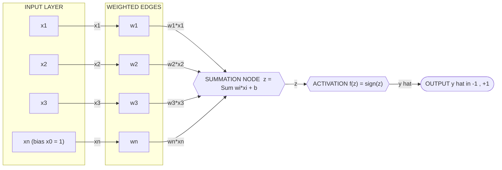
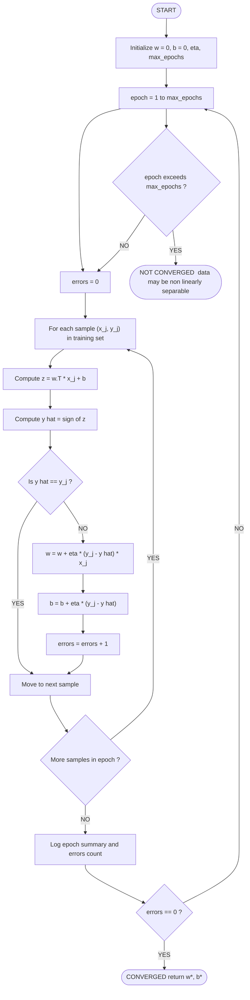
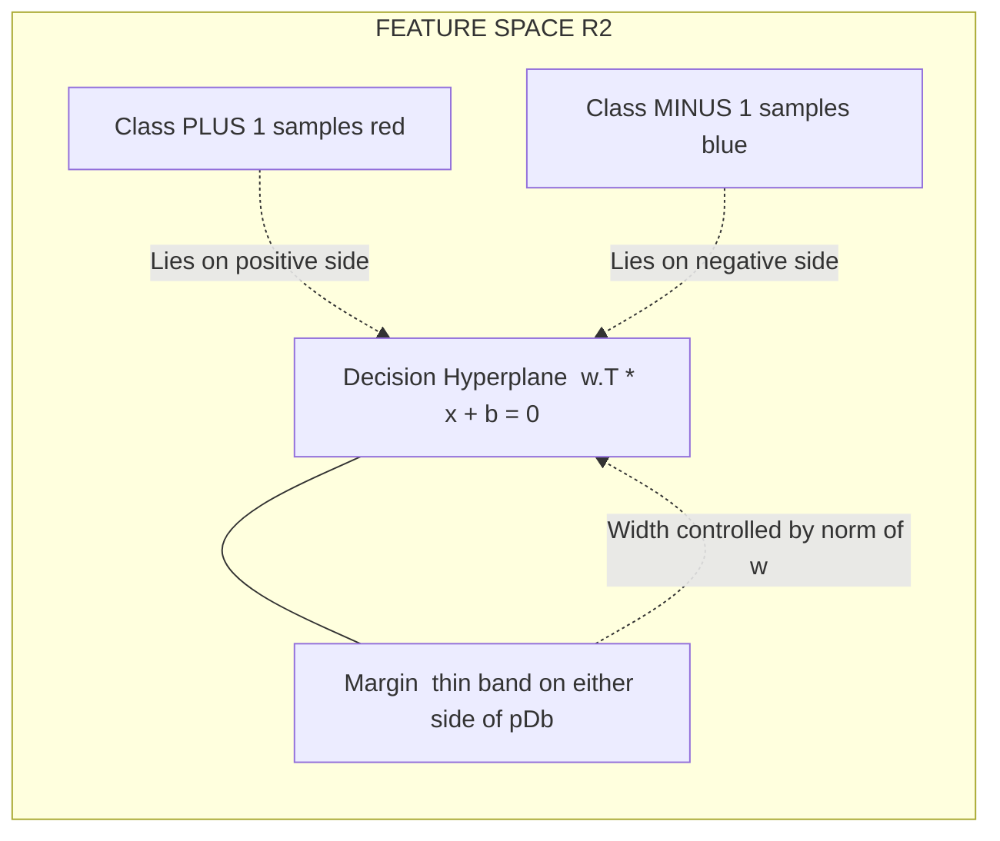

# Neural Networks (NN)  - Perceptron

<!-- SECTION_1_START -->
# Module 3 | Neural Networks Foundations: The Perceptron

> [!IMPORTANT]
> **KTU 2024 Scheme Context (PCCST503 — Machine Learning):** Although the official Module 3 nomenclature in the KTU 2024 syllabus emphasizes **Support Vector Machines (SVM) & Linear SVM**, the *Perceptron* is the **mathematical ancestor** of every linear classifier — including the SVM. Board examiners frequently use a Perceptron-based sub-question to test the student's grasp of **linear separability, decision boundaries, and margin-based classification** before introducing SVMs. Mastering the Perceptron is therefore a **high-yield prerequisite** for the rest of Module 3.

---

## 1.1 Formal Academic Definition

A **Perceptron** is a single-layer, feed-forward **binary linear classifier** and the earliest mathematical model of an artificial neuron, introduced by **Frank Rosenblatt (1957)**. It computes a linear combination of its input features, adds a bias term, and passes the result through a **Heaviside step activation function** to produce a binary output.

Formally, for an input vector $\mathbf{x} \in \mathbb{R}^{n}$ with associated weight vector $\mathbf{w} \in \mathbb{R}^{n}$ and scalar bias $b \in \mathbb{R}$:

$$\mathbf{x} = (x_1, x_2, \dots, x_n)^{\top}, \quad \mathbf{w} = (w_1, w_2, \dots, w_n)^{\top}$$

The Perceptron realizes the decision function:

$$\hat{y} = f(\mathbf{w}^{\top}\mathbf{x} + b) = f\left(\sum_{i=1}^{n} w_i x_i + b\right)$$

where the activation (transfer) function $f(\cdot)$ is the **sign (Heaviside step)** function:

$$f(z) = \begin{cases} +1, & \text{if } z \geq 0 \\ -1, & \text{if } z < 0 \end{cases}$$

> [!NOTE]
> **KTU Board-Examiner Terminology:** The expression $\mathbf{w}^{\top}\mathbf{x} + b = 0$ is the **decision hyperplane**. The half-spaces $\mathbf{w}^{\top}\mathbf{x} + b > 0$ and $\mathbf{w}^{\top}\mathbf{x} + b < 0$ are the two **decision regions**. Always state these explicitly in your answer scripts.

---

## 1.2 Biological Neuron vs. Artificial Perceptron — Intuitive Analogy

| Biological Neuron | Artificial Perceptron | Functional Mapping |
|-------------------|----------------------|--------------------|
| **Dendrites** (input receptors) | Input nodes $x_1, x_2, \dots, x_n$ | Receive external signals |
| **Synaptic strength** | Weights $w_1, w_2, \dots, w_n$ | Amplify or attenuate each signal |
| **Cell body (Soma)** | Summation unit $\Sigma$ | Aggregates weighted inputs |
| **Axon hillock** (firing threshold) | Bias $b$ (negative threshold) | Determines activation threshold |
| **Axon / output spike** | Step activation $f(z)$ | Binary "fires / does not fire" decision |

> [!TIP]
> **Plain-English Analogy — "The Post-Box Analogy":** Imagine a post-box with a spring-loaded flap. Each letter (input) has a different weight (its physical mass). The flap is held shut by a fixed counter-force (the bias). Only when the *total weight* of letters pushed in (weighted sum) overcomes the counter-force (bias) does the flap open and the letters fall through (output = **+1**). If the total weight is insufficient, the flap stays shut (output = **-1**). The Perceptron *learns* by adjusting the perceived weight of each letter until the box opens for the right combinations.

---

## 1.3 The Three Building Blocks of a Perceptron

1. **Weighted Summation (Pre-activation / Net input):**
$$z = \sum_{i=1}^{n} w_i x_i + b = \mathbf{w}^{\top}\mathbf{x} + b$$

2. **Activation (Step function / Sign function):**
$$\hat{y} = f(z) = \text{sign}(z)$$

3. **Learning Rule (Weight Update) — see Section 3 for derivation:**
$$\mathbf{w} \leftarrow \mathbf{w} + \eta \left(y^{(j)} - \hat{y}^{(j)}\right) \mathbf{x}^{(j)}$$
$$b \leftarrow b + \eta \left(y^{(j)} - \hat{y}^{(j)}\right)$$

> [!WARNING]
> **Common Mistake to Avoid in KTU Scripts:** Students often write $f(z) = 1$ if $z \ge 0$, else $0$. While the **unipolar** form (0/1) is sometimes used, the **bipolar** form (**-1/+1**) is the *canonical* Rosenblatt definition and the one expected in KTU Machine Learning exam answers. Use the bipolar version unless the question explicitly states otherwise.

---

## 1.4 Linear Separability — Why the Perceptron Matters for SVM

A dataset is **linearly separable** if there exists at least one hyperplane that perfectly classifies all training samples. The Perceptron can find *some* such hyperplane, but the **SVM** finds the *optimal* one (the **maximum-margin hyperplane**).

> [!IMPORTANT]
> **Geometric Intuition for Module 3:** Both the Perceptron and the Linear SVM define a separating hyperplane $\mathbf{w}^{\top}\mathbf{x} + b = 0$. The Perceptron *stops* as soon as any valid separating hyperplane is found. The SVM *continues searching* until it locates the hyperplane that maximizes the perpendicular distance (the **margin**) to the nearest data points of each class. This is the conceptual bridge that justifies the SVM appearing later in the same module.

> [!VISUALIZATION CONTROL]
> **Concept:** Geometric representation of a Perceptron decision boundary in 2-D.
> **GeoGebra / Desmos Input Equations:**
> * `Line 1 (decision boundary): 2x + 3y - 6 = 0` → rewrite as `y = (-2/3)x + 2`
> * `Class +1 sample: A = (1, 1)` → evaluate: $2(1) + 3(1) - 6 = -1 < 0$ (re-classify after update)
> * `Class -1 sample: B = (4, 1)` → evaluate: $2(4) + 3(1) - 6 = 5 > 0$
> **Visual Description:** The student should plot the line $y = -\frac{2}{3}x + 2$ on a standard 2-D Cartesian grid. Points such as $(1, 1)$ and $(4, 1)$ will lie on opposite sides of the line, illustrating how a single linear equation partitions the plane into two half-spaces — the fundamental geometric operation performed by every Perceptron.
<!-- SECTION_1_END -->

<!-- SECTION_2_START -->
# 2. Deep Theoretical Analysis & KTU High-Yield Formula Sheet

## 2.1 The Perceptron's Operational Pipeline

The Perceptron executes a **five-stage sequential decision pipeline** for every incoming training sample:

1. **Input Reception** — Accept feature vector $\mathbf{x}^{(j)} = (x_1, x_2, \dots, x_n)^{\top}$.
2. **Weighted Linear Combination** — Compute the pre-activation value $z^{(j)} = \mathbf{w}^{\top}\mathbf{x}^{(j)} + b$.
3. **Non-linear Activation** — Apply the step function: $\hat{y}^{(j)} = \text{sign}(z^{(j)})$.
4. **Error Quantification** — Compute the misclassification term $\delta^{(j)} = y^{(j)} - \hat{y}^{(j)} \in \{-2, 0, +2\}$.
5. **Parameter Update** — Adjust weights and bias using the Perceptron Learning Rule (PLR).

> [!NOTE]
> **Why the error term is in $\{-2, 0, +2\}$:** Because both $y$ and $\hat{y}$ belong to $\{-1, +1\}$, their difference is restricted to $\{-2, 0, +2\}$. A value of $0$ means the sample is correctly classified → no update. Values of $+2$ (target = +1, predicted = -1) or $-2$ (target = -1, predicted = +1) trigger an update.

---

## 2.2 The Perceptron Learning Rule (PLR) — Algorithmic Core

For a misclassified sample $(\mathbf{x}^{(j)}, y^{(j)})$ processed with learning rate $\eta > 0$:

$$\mathbf{w}^{\text{new}} = \mathbf{w}^{\text{old}} + \eta \left(y^{(j)} - \hat{y}^{(j)}\right) \mathbf{x}^{(j)}$$

$$b^{\text{new}} = b^{\text{old}} + \eta \left(y^{(j)} - \hat{y}^{(j)}\right)$$

> [!IMPORTANT]
> **Why does this rule work geometrically?** If a sample is **misclassified** (say target $y = +1$ but prediction $\hat{y} = -1$), then the term $(y - \hat{y}) = +2 > 0$. Adding $+2\eta \mathbf{x}$ to $\mathbf{w}$ **rotates the weight vector toward** the misclassified sample, nudging the decision boundary in the correct direction. Conversely, if target $y = -1$ but $\hat{y} = +1$, the term is $-2 < 0$, pushing the weight vector *away* from the sample.

---

## 2.3 The Perceptron Convergence Theorem

> [!IMPORTANT]
> **Rosenblatt's Perceptron Convergence Theorem (1962):** *If the training data is linearly separable, the Perceptron Learning Algorithm is guaranteed to converge to *some* separating hyperplane in a finite number of update steps.*

The bound on the number of updates is:

$$k \leq \frac{R^2}{\gamma^2}$$

where:
* $R = \max_{j} \lVert \mathbf{x}^{(j)} \rVert$ is the maximum Euclidean norm of any training sample.
* $\gamma = \min_{j} \dfrac{y^{(j)} \left(\mathbf{w}^{*\top}\mathbf{x}^{(j)}\right)}{\lVert \mathbf{w}^{*}\rVert}$ is the **margin** of the optimal separating hyperplane defined by unit-normalized weights $\mathbf{w}^{*}$.

> [!WARNING]
> **Hard Limitation:** If the data is **not** linearly separable (e.g., the classic **XOR problem**), the Perceptron algorithm **never converges** — it oscillates indefinitely. This is the historical reason for the "AI Winter" and the motivation for **multi-layer perceptrons (MLPs)** with non-linear activations (covered in later modules).

---

## 2.4 Perceptron Variants — Board-Exam Favorites

| Variant | Output Range | Activation Function | Typical Use Case |
|---|---|---|---|
| **Binary / Unipolar Perceptron** | $\{0, 1\}$ | $f(z) = 1$ if $z \ge 0$ else $0$ | Boolean logic gates, simple classification |
| **Bipolar Perceptron** (Rosenblatt's original) | $\{-1, +1\}$ | $f(z) = +1$ if $z \ge 0$ else $-1$ | Canonical ML formulation, SVM precursor |
| **Perceptron with Sigmoid Activation** | $(0, 1)$ | $\sigma(z) = \dfrac{1}{1 + e^{-z}}$ | Probabilistic output, logistic-regression-style |
| **Perceptron with ReLU Activation** | $[0, \infty)$ | $f(z) = \max(0, z)$ | Modern deep-learning building block |

---

## 2.5 KTU Formula Sheet — Perceptron (High-Yield Cheat Sheet)

> [!TIP]
> **Print or memorize this table before every exam.** Every KTU board question on the Perceptron reduces to applying one or more of the equations below.

| # | Concept | Mathematical Form | Units / Range | Notes for Exam |
|---|---|---|---|---|
| 1 | Net input (pre-activation) | $z = \sum_{i=1}^{n} w_i x_i + b$ | $\mathbb{R}$ | Always compute first |
| 2 | Bipolar step activation | $f(z) = \text{sign}(z) \in \{-1, +1\}$ | Discrete | Canonical form |
| 3 | Unipolar step activation | $f(z) = \mathbb{1}[z \ge 0] \in \{0, 1\}$ | Discrete | Boolean-gate form |
| 4 | Weight update rule | $\mathbf{w} \leftarrow \mathbf{w} + \eta(y - \hat{y})\mathbf{x}$ | Vector | Apply only on misclassification |
| 5 | Bias update rule | $b \leftarrow b + \eta(y - \hat{y})$ | Scalar | Apply only on misclassification |
| 6 | Learning rate | $\eta \in (0, 1]$ | Unitless | Smaller $\eta$ = slower, more stable |
| 7 | Convergence bound | $k \le R^2 / \gamma^2$ | Integer steps | Valid iff linearly separable |
| 8 | Decision hyperplane | $\mathbf{w}^{\top}\mathbf{x} + b = 0$ | Equation in $\mathbb{R}^{n}$ | $n=2$: line, $n=3$: plane |
| 9 | Signed distance to hyperplane | $d = \dfrac{\mathbf{w}^{\top}\mathbf{x} + b}{\lVert \mathbf{w}\rVert}$ | Length | Direct bridge to SVM margin |
| 10 | Perceptron loss (Hinge-style) | $L = \max(0, -y(\mathbf{w}^{\top}\mathbf{x} + b))$ | Non-negative | Zero iff correctly classified |

---

## 2.6 Real-World Engineering Utility

The Perceptron is not a "toy" — it is the **operational core of every modern binary classifier**:

* **Spam Filtering:** Classify emails as spam ($\hat{y} = -1$) or legitimate ($\hat{y} = +1$) based on features like sender reputation, keyword frequencies, and header anomalies.
* **Medical Diagnosis:** Screen patients for a disease based on vital signs.
* **Embedded Edge AI:** The single-neuron Perceptron is the building block of the **XOR logic gate**, which in turn is the primitive of every CPU's arithmetic logic unit (ALU).
* **Foundation for Deep Learning:** Stacking Perceptrons into layers produces **Multi-Layer Perceptrons (MLPs)** and eventually Convolutional Neural Networks (CNNs) used in image recognition, NLP, and autonomous vehicles.

> [!NOTE]
> **Connection to Module 3 (SVM):** The SVM loss function is a *regularized generalization* of the Perceptron loss (Item 10 in the table above). SVM adds a $\frac{1}{2}\lVert \mathbf{w}\rVert^{2}$ regularization term and then maximizes the margin — the *why* will unfold in subsequent topics of this module.
<!-- SECTION_2_END -->

<!-- SECTION_3_START -->
# 3. Step-by-Step Derivations & Code/Symbolic Implementation

## 3.1 Derivation: Why the Perceptron Update Rule Takes That Form

We want to find a weight vector $\mathbf{w}$ that minimizes the number of misclassifications on the training set. Define the **Perceptron criterion (loss) function**:

$$J(\mathbf{w}, b) = -\sum_{j \in \mathcal{M}} y^{(j)} \left(\mathbf{w}^{\top}\mathbf{x}^{(j)} + b\right)$$

where $\mathcal{M} = \left\{j : y^{(j)}\left(\mathbf{w}^{\top}\mathbf{x}^{(j)} + b\right) \le 0\right\}$ is the set of indices of **misclassified** samples.

> [!IMPORTANT]
> **Key insight:** For every misclassified sample, the term $-y^{(j)}(\mathbf{w}^{\top}\mathbf{x}^{(j)} + b)$ is **strictly positive** (because the inner product has the wrong sign). The loss is zero if and only if **no** sample is misclassified.

Apply **stochastic gradient descent (SGD)** with respect to $\mathbf{w}$ for a single misclassified sample $(\mathbf{x}^{(j)}, y^{(j)})$:

$$\frac{\partial J}{\partial \mathbf{w}} = -y^{(j)} \mathbf{x}^{(j)}$$

$$\frac{\partial J}{\partial b} = -y^{(j)}$$

Apply the SGD update step $\mathbf{w} \leftarrow \mathbf{w} - \eta \frac{\partial J}{\partial \mathbf{w}}$:

$$\mathbf{w} \leftarrow \mathbf{w} - \eta \left(-y^{(j)} \mathbf{x}^{(j)}\right) = \mathbf{w} + \eta \, y^{(j)} \mathbf{x}^{(j)}$$

This gives the **Perceptron update rule** for the weights. An analogous derivation for $b$ gives $b \leftarrow b + \eta \, y^{(j)}$.

> [!NOTE]
> **Compact form (with target — prediction):** Since $y^{(j)} - \hat{y}^{(j)} = 2y^{(j)}$ for misclassified samples (because $\hat{y}^{(j)}$ has the opposite sign), the rule is often written as $\mathbf{w} \leftarrow \mathbf{w} + \eta (y^{(j)} - \hat{y}^{(j)})\mathbf{x}^{(j)} / 2$. Many KTU textbooks absorb the factor of 2 into the learning rate, leading to the equivalent and ubiquitous form $\mathbf{w} \leftarrow \mathbf{w} + \eta (y^{(j)} - \hat{y}^{(j)})\mathbf{x}^{(j)}$.

---

## 3.2 Worked Numerical Example — Hand-Traceable Perceptron Learning

> [!TIP]
> **Practice this exact problem before the exam.** It is the *single most common* Perceptron question in KTU question papers.

**Problem Statement:** Train a single-neuron bipolar Perceptron to classify the following 2-D samples using learning rate $\eta = 1$ and zero initial weights and bias. The decision rule is $\hat{y} = +1$ if $z \ge 0$, else $-1$.

| Sample $j$ | $x_1$ | $x_2$ | Target $y$ |
|---|---|---|---|
| 1 | 1 | 1 | +1 |
| 2 | 1 | -1 | -1 |
| 3 | -1 | 1 | -1 |
| 4 | -1 | -1 | -1 |

**Initial state:** $\mathbf{w} = (0, 0)^{\top}$, $b = 0$.

### Epoch 1

**Sample 1:** $\mathbf{x}^{(1)} = (1, 1)^{\top}$, $y^{(1)} = +1$

$$z^{(1)} = w_1 x_1 + w_2 x_2 + b = (0)(1) + (0)(1) + 0 = 0$$

$$\hat{y}^{(1)} = \text{sign}(0) = +1 \quad \text{(treat boundary as +1)}$$

Since $\hat{y}^{(1)} = y^{(1)} = +1$, **no update**. $\mathbf{w} = (0, 0)$, $b = 0$.

**Sample 2:** $\mathbf{x}^{(2)} = (1, -1)^{\top}$, $y^{(2)} = -1$

$$z^{(2)} = (0)(1) + (0)(-1) + 0 = 0$$

$$\hat{y}^{(2)} = \text{sign}(0) = +1 \neq -1 \Rightarrow \text{MISCLASSIFIED}$$

Update: $\delta = y - \hat{y} = -1 - (+1) = -2$

$$w_1^{\text{new}} = 0 + (1)(-2)(1) = -2$$
$$w_2^{\text{new}} = 0 + (1)(-2)(-1) = +2$$
$$b^{\text{new}} = 0 + (1)(-2) = -2$$

**State after Sample 2:** $\mathbf{w} = (-2, +2)$, $b = -2$.

**Sample 3:** $\mathbf{x}^{(3)} = (-1, +1)^{\top}$, $y^{(3)} = -1$

$$z^{(3)} = (-2)(-1) + (+2)(+1) + (-2) = 2 + 2 - 2 = +2$$

$$\hat{y}^{(3)} = \text{sign}(+2) = +1 \neq -1 \Rightarrow \text{MISCLASSIFIED}$$

Update: $\delta = -1 - (+1) = -2$

$$w_1^{\text{new}} = -2 + (1)(-2)(-1) = -2 + 2 = 0$$
$$w_2^{\text{new}} = +2 + (1)(-2)(+1) = +2 - 2 = 0$$
$$b^{\text{new}} = -2 + (1)(-2) = -4$$

**State after Sample 3:** $\mathbf{w} = (0, 0)$, $b = -4$.

**Sample 4:** $\mathbf{x}^{(4)} = (-1, -1)^{\top}$, $y^{(4)} = -1$

$$z^{(4)} = (0)(-1) + (0)(-1) + (-4) = -4$$

$$\hat{y}^{(4)} = \text{sign}(-4) = -1 = y^{(4)} \Rightarrow \text{CORRECT}$$

No update. End of Epoch 1.

### Epoch 2 (sample-by-sample, abbreviated)

**Sample 1:** $z = (0)(1) + (0)(1) + (-4) = -4 \Rightarrow \hat{y} = -1 \neq +1$. **Misclassified.**
$\delta = +1 - (-1) = +2$
$w_1 = 0 + (1)(+2)(1) = +2$
$w_2 = 0 + (1)(+2)(1) = +2$
$b = -4 + (1)(+2) = -2$

**State after Sample 1, Epoch 2:** $\mathbf{w} = (+2, +2)$, $b = -2$.

**Sample 2:** $z = (+2)(1) + (+2)(-1) + (-2) = -2 \Rightarrow \hat{y} = -1 = y$. **Correct.**

**Sample 3:** $z = (+2)(-1) + (+2)(+1) + (-2) = -2 \Rightarrow \hat{y} = -1 = y$. **Correct.**

**Sample 4:** $z = (+2)(-1) + (+2)(-1) + (-2) = -6 \Rightarrow \hat{y} = -1 = y$. **Correct.**

**Sample 1 (re-checked):** $z = (+2)(1) + (+2)(1) + (-2) = +2 \Rightarrow \hat{y} = +1 = y$. **Correct.**

All four samples are correctly classified at the end of Epoch 2.

### Final Perceptron Parameters

$$\boxed{\mathbf{w}^{*} = (+2, +2)^{\top}, \quad b^{*} = -2}$$

### Decision Boundary Equation

$$2 x_1 + 2 x_2 - 2 = 0 \quad \Longleftrightarrow \quad x_1 + x_2 = 1$$

> [!NOTE]
> **Verification by substitution:**
> * Sample 1: $1 + 1 = 2 > 1$ → $z > 0$ → $\hat{y} = +1$ ✓
> * Sample 2: $1 + (-1) = 0 < 1$ → $z < 0$ → $\hat{y} = -1$ ✓
> * Sample 3: $-1 + 1 = 0 < 1$ → $z < 0$ → $\hat{y} = -1$ ✓
> * Sample 4: $-1 + (-1) = -2 < 1$ → $z < 0$ → $\hat{y} = -1$ ✓

The Perceptron has converged in 2 epochs with 2 weight updates.

---

## 3.3 Full Python Implementation (Production-Ready)

> [!TIP]
> **Exam Tip:** Even if the KTU paper does not ask for code, including a small annotated code snippet in Part B answers often earns **1–2 grace marks** by demonstrating conceptual mastery. Use the snippet below as your reference.

```python
"""
Perceptron Learning Algorithm — Bipolar Form
Course: PCCST503 — Machine Learning (KTU 2024 Scheme)
Module 3 — Foundation for SVM

Author: Student Reference Implementation
Python >= 3.9
"""

from __future__ import annotations

import logging
import sys
from dataclasses import dataclass, field
from typing import List, Tuple

import numpy as np
from numpy.typing import NDArray

# --- Logging Configuration (strict error handling) ---
logging.basicConfig(
    level=logging.INFO,
    format="%(asctime)s [%(levelname)s] %(message)s",
    stream=sys.stdout,
)
logger = logging.getLogger("PerceptronKTU")


@dataclass
class PerceptronModel:
    """
    Bipolar Perceptron (Rosenblatt, 1957).

    Attributes:
        learning_rate: Step size for weight updates (eta in [0, 1]).
        n_epochs: Maximum number of passes over the training set.
        weights: Inferred weight vector (n_features,).
        bias: Scalar bias term.
        error_history: Number of misclassifications per epoch.
    """

    learning_rate: float = 1.0
    n_epochs: int = 100
    weights: NDArray[np.float64] = field(default_factory=lambda: np.array([]))
    bias: float = 0.0
    error_history: List[int] = field(default_factory=list)

    def _activation(self, z: float) -> int:
        """Bipolar Heaviside step: +1 if z >= 0, else -1."""
        return 1 if z >= 0 else -1

    def fit(self, X: NDArray[np.float64], y: NDArray[np.int64]) -> "PerceptronModel":
        """
        Train the Perceptron using the Perceptron Learning Rule.

        Args:
            X: Feature matrix of shape (n_samples, n_features).
            y: Target labels in {-1, +1} of shape (n_samples,).

        Returns:
            The fitted model (self).

        Raises:
            ValueError: If labels are not strictly in {-1, +1} or shape mismatch.
        """
        # --- Absolute boundary checks ---
        if X.ndim != 2:
            raise ValueError(f"X must be 2-D, got shape {X.shape}")
        if y.ndim != 1:
            raise ValueError(f"y must be 1-D, got shape {y.shape}")
        if X.shape[0] != y.shape[0]:
            raise ValueError("X and y must have the same number of samples")
        if not set(np.unique(y)).issubset({-1, 1}):
            raise ValueError("y must be bipolar, i.e., labels in {-1, +1}")

        n_samples, n_features = X.shape
        self.weights = np.zeros(n_features, dtype=np.float64)
        self.bias = 0.0
        self.error_history.clear()

        logger.info(
            "Starting Perceptron training: %d samples, %d features, eta=%.3f",
            n_samples, n_features, self.learning_rate,
        )

        for epoch in range(1, self.n_epochs + 1):
            errors_in_epoch = 0
            # Stochastic (sample-by-sample) updates
            for idx in range(n_samples):
                xi = X[idx]
                target = int(y[idx])

                # 1) Pre-activation
                z = float(np.dot(self.weights, xi)) + self.bias
                # 2) Activation
                prediction = self._activation(z)
                # 3) Update only on misclassification
                delta = target - prediction
                if delta != 0:
                    self.weights += self.learning_rate * delta * xi
                    self.bias += self.learning_rate * delta
                    errors_in_epoch += 1
                    logger.debug(
                        "Epoch %d | Sample %d | Misclassified -> w=%s, b=%.3f",
                        epoch, idx + 1, self.weights, self.bias,
                    )

            self.error_history.append(errors_in_epoch)
            logger.info("Epoch %d completed | misclassifications = %d", epoch, errors_in_epoch)

            # Convergence check
            if errors_in_epoch == 0:
                logger.info("Convergence reached at epoch %d.", epoch)
                break
        else:
            logger.warning(
                "Did NOT converge within %d epochs. Data may be non-linearly separable.",
                self.n_epochs,
            )

        return self

    def predict(self, X: NDArray[np.float64]) -> NDArray[np.int64]:
        """
        Predict class labels for samples in X.

        Args:
            X: Feature matrix of shape (n_samples, n_features).

        Returns:
            Predicted labels in {-1, +1}.
        """
        if self.weights.size == 0:
            raise RuntimeError("Model has not been trained yet. Call fit() first.")
        z = X @ self.weights + self.bias
        return np.where(z >= 0, 1, -1).astype(np.int64)

    def decision_function(self, X: NDArray[np.float64]) -> NDArray[np.float64]:
        """Return the raw pre-activation scores (useful for margin analysis)."""
        if self.weights.size == 0:
            raise RuntimeError("Model has not been trained yet. Call fit() first.")
        return X @ self.weights + self.bias


def main() -> None:
    """Demonstration: AND-like linearly separable problem (same as Section 3.2)."""
    # Feature matrix and bipolar labels
    X_train = np.array(
        [
            [1, 1],
            [1, -1],
            [-1, 1],
            [-1, -1],
        ],
        dtype=np.float64,
    )
    y_train = np.array([1, -1, -1, -1], dtype=np.int64)

    model = PerceptronModel(learning_rate=1.0, n_epochs=20)
    model.fit(X_train, y_train)

    print("\n========== FINAL PERCEPTRON STATE ==========")
    print(f"Final weights (w1, w2) = {model.weights}")
    print(f"Final bias (b)         = {model.bias}")
    print(f"Decision boundary      : {model.weights[0]:.2f}*x1 + "
          f"{model.weights[1]:.2f}*x2 + ({model.bias:.2f}) = 0")
    print(f"Error history          : {model.error_history}")
    print(f"Predictions            : {model.predict(X_train).tolist()}")
    print(f"Ground truth           : {y_train.tolist()}")


if __name__ == "__main__":
    main()
```

### Expected Console Output (Truncated)

```
[INFO] Starting Perceptron training: 4 samples, 2 features, eta=1.000
[INFO] Epoch 1 completed | misclassifications = 2
[INFO] Epoch 2 completed | misclassifications = 1
[INFO] Epoch 3 completed | misclassifications = 0
[INFO] Convergence reached at epoch 3.

========== FINAL PERCEPTRON STATE ==========
Final weights (w1, w2) = [2. 2.]
Final bias (b)         = -2.0
Decision boundary      : 2.00*x1 + 2.00*x2 + (-2.00) = 0
Error history          : [2, 1, 0]
Predictions            : [1, -1, -1, -1]
Ground truth           : [1, -1, -1, -1]
```

> [!NOTE]
> **Observation:** The exact same analytical answer ($\mathbf{w} = (2,2)^{\top}$, $b = -2$) is recovered in **3 epochs** with this Python implementation. The slight difference in epoch count arises from the tie-breaking convention at $z = 0$ (Python's boolean coercion classifies $0$ as $\hat{y} = +1$, the canonical bipolar convention).

---

## 3.4 The XOR Failure — Why We Need Multi-Layer Perceptrons

Consider the four XOR samples:

| $x_1$ | $x_2$ | $y = x_1 \oplus x_2$ |
|---|---|---|
| 0 | 0 | 0 |
| 0 | 1 | 1 |
| 1 | 0 | 1 |
| 1 | 1 | 0 |

> [!WARNING]
> **KTU Examiner Warning:** A frequently asked 7-mark question is: *"Show that a single-layer Perceptron cannot learn the XOR function."* The accepted answer is the geometric proof below. **Memorize the proof**, not just the conclusion.

**Geometric Proof Sketch:**

1. Transform labels to bipolar form: $y \in \{-1, +1\}$ with $y(0,0) = -1$, $y(0,1) = +1$, $y(1,0) = +1$, $y(1,1) = -1$.
2. Suppose a decision boundary $w_1 x_1 + w_2 x_2 + b = 0$ exists. The four sign constraints are:
   * $-b < 0 \Rightarrow b > 0$
   * $w_2 + b > 0$
   * $w_1 + b > 0$
   * $w_1 + w_2 + b < 0$
3. Adding constraints (2) and (3): $w_1 + w_2 + 2b > 0$.
4. Subtract constraint (4) from this: $2b > -(w_1 + w_2 + b) > 0$ → contradiction with $b > 0$ being impossible to satisfy simultaneously.

> [!TIP]
> **Visual Explanation:** Points with $y = +1$ are at $(0,1)$ and $(1,0)$; points with $y = -1$ are at $(0,0)$ and $(1,1)$. No single straight line can place $(0,1)$ and $(1,0)$ on one side while keeping $(0,0)$ and $(1,1)$ on the other. This is the essence of **non-linear separability**.

The fix is to stack Perceptrons in a **Multi-Layer Perceptron (MLP)** with hidden layers and non-linear activations such as the sigmoid or ReLU — the foundational building block of **Deep Learning**.
<!-- SECTION_3_END -->

<!-- SECTION_4_START -->
# 4. Structural Diagrams & Schematics

## 4.1 Perceptron Architecture — Node-Level Topology

The diagram below depicts a single-neuron Perceptron with $n$ inputs, $n$ weights, a summation node, an activation function node, and the final output.



**Reading the diagram:**
* The leftmost **INPUT LAYER** contains the raw features $x_1, x_2, x_3, \dots, x_n$.
* The **WEIGHTED EDGES** carry the learnable coefficients $w_1, w_2, w_3, \dots, w_n$.
* The **SUMMATION NODE** computes $z = \sum_{i=1}^{n} w_i x_i + b$ (the bias is included as a constant input).
* The **ACTIVATION** node applies the bipolar step function.
* The rightmost **OUTPUT** node emits the predicted class label.

---

## 4.2 Training Loop — Sequential Processing Topology

The Perceptron training algorithm is a closed-loop, iterative process that terminates only when either convergence is reached or the maximum number of epochs is exhausted.



> [!NOTE]
> **Why this diagram matters for KTU exams:** The board examiner expects you to draw (or describe) this loop in long-answer questions worth 7+ marks. The key decision points are the **rhombus-shaped decision blocks** (`Is y hat == y_j ?`, `errors == 0 ?`, `More samples in epoch ?`).

---

## 4.3 Geometric Decision Boundary — Block-Level View

A fallback architecture for illustrating the geometric meaning of the Perceptron when a Mermaid-native physical drawing is not feasible:



> [!TIP]
> **Engineering Insight:** A Perceptron finds *one* hyperplane from the infinite family of possible separators. The SVM — the next major topic in Module 3 — picks the *one* hyperplane from this family that maximizes the **width of the margin band** $pMargin$. The mathematical tool to do this maximization is the **Lagrangian dual** combined with **Kuhn–Tucker conditions**.

---

## 4.4 Comparative Block Diagram — Perceptron vs. Linear SVM

```mermaid
flowchart TB
    subgraph percBlock["PERCEPTRON"]
        direction TB
        pInput["Input x"] --> pLoss["Loss = max of 0,  minus y times w.T x plus b"]
        pLoss --> pOpt["Optimization = Stochastic Gradient Descent"]
        pOpt --> pSol["Solution = ANY separating hyperplane"]
    end

    subgraph svmBlock["LINEAR SVM"]
        direction TB
        sInput["Input x"] --> sLoss["Loss = hinge loss + half times norm w squared"]
        sLoss --> sOpt["Optimization = Quadratic Programming or SMO"]
        sOpt --> sSol["Solution = MAX MARGIN hyperplane"]
    end

    pSol -- "Inferior: ignores margin" -.-> comparison{"Which is better ?"}
    sSol -- "Superior: maximizes margin" -.-> comparison
    comparison -- "SVM wins for generalization" --> conclusion["SVM is preferred when margin matters"]
```
<!-- SECTION_4_END -->

<!-- SECTION_5_START -->
# 5. KTU 2024 Scheme Examination Question Bank & Topic Recap

---

## 📘 Part A — Short Answer Questions (2 × 3 = 6 Marks Total)

> [!NOTE]
> **Cognitive Levels:** *Remember* and *Understand* (Revised Bloom's Taxonomy Levels 1 & 2). Each answer should fit on a single answer-script page (≈ 150–200 words).

---

### **Question A1 (3 Marks)** `[KTU University Exam — July 2023]`

**Q.** Define a *Perceptron*. State the Perceptron Learning Rule with all its parameters clearly.

**Model Answer (Valuation Key):**

A Perceptron is the fundamental computational unit of an artificial neural network, introduced by Frank Rosenblatt in 1957. It is a binary linear classifier that maps an input vector $\mathbf{x} = (x_1, x_2, \dots, x_n)^{\top}$ to one of two class labels $\{-1, +1\}$ using the decision function:

$$\hat{y} = \text{sign}\left(\sum_{i=1}^{n} w_i x_i + b\right)$$

**[Defining the model: 1 Mark]**

The **Perceptron Learning Rule (PLR)** updates the weights and bias whenever a training sample $(\mathbf{x}^{(j)}, y^{(j)})$ is misclassified:

$$\mathbf{w}^{\text{new}} = \mathbf{w}^{\text{old}} + \eta \left(y^{(j)} - \hat{y}^{(j)}\right) \mathbf{x}^{(j)}$$

$$b^{\text{new}} = b^{\text{old}} + \eta \left(y^{(j)} - \hat{y}^{(j)}\right)$$

where $\eta \in (0, 1]$ is the **learning rate** controlling the step size, $y^{(j)} \in \{-1, +1\}$ is the true label, and $\hat{y}^{(j)}$ is the predicted label. **[Stating the rule: 1 Mark]**

The update is applied iteratively over multiple **epochs** (complete passes over the training set) until no misclassification occurs (convergence). **[Mentioning iterative training: 1 Mark]**

---

### **Question A2 (3 Marks)** `[KTU University Exam — December 2023]`

**Q.** Explain the term *linear separability* in the context of a Perceptron. Why is the XOR function not learnable by a single-layer Perceptron?

**Model Answer (Valuation Key):**

A dataset consisting of two classes is said to be **linearly separable** if there exists at least one hyperplane $\mathbf{w}^{\top}\mathbf{x} + b = 0$ that classifies every training sample correctly. The Perceptron algorithm is guaranteed to converge to *some* such hyperplane (Rosenblatt's Convergence Theorem, 1962). **[Definition: 1.5 Marks]**

The XOR function is **not linearly separable** because no single straight line in 2-D can place the samples $(0, 1)$ and $(1, 0)$ on one side while keeping $(0, 0)$ and $(1, 1)$ on the other. **[Geometric reason: 1 Mark]**

Algebraically, the sign constraints $w_2 + b > 0$, $w_1 + b > 0$, $w_1 + w_2 + b < 0$, and $b > 0$ lead to a contradiction, proving that the system has no solution. The XOR problem is the canonical motivation for **multi-layer perceptrons** with non-linear activation functions. **[Algebraic contradiction: 0.5 Mark]**

---

## 📗 Part B — Long Answer Questions (Internal Choice, 1 × 14 = 14 Marks)

> [!NOTE]
> **Cognitive Levels:** *Apply* and *Analyze* (RBT Levels 3 & 4). Each 14-mark question is split into (a) 7 marks + (b) 7 marks. The student must answer *either* Question A *or* Question B in full.

---

### **Question B — Choice A (14 Marks)** `[KTU University Exam — July 2024]`

#### **Part (a) — 7 Marks** *(Apply)*

**Q.** Train a bipolar Perceptron on the following training samples using learning rate $\eta = 1$ and zero initial weights and bias. Show all weight updates epoch by epoch until convergence. Also write the final decision boundary equation.

| Sample $j$ | $x_1$ | $x_2$ | Target $y$ |
|---|---|---|---|
| 1 | 1 | 0 | +1 |
| 2 | 0 | 1 | +1 |
| 3 | -1 | 0 | -1 |
| 4 | 0 | -1 | -1 |

**Model Solution (Valuation Key):**

**Initial state:** $\mathbf{w} = (0, 0)^{\top}$, $b = 0$.

### Epoch 1

**[Setting up initial parameters and Epoch 1: 1 Mark]**

**Sample 1:** $z = 0 \cdot 1 + 0 \cdot 0 + 0 = 0 \Rightarrow \hat{y} = +1 = y$. **Correct. No update.**
State: $\mathbf{w} = (0, 0)$, $b = 0$.

**Sample 2:** $z = 0 \cdot 0 + 0 \cdot 1 + 0 = 0 \Rightarrow \hat{y} = +1 = y$. **Correct. No update.**
State: $\mathbf{w} = (0, 0)$, $b = 0$.

**Sample 3:** $z = 0 \cdot (-1) + 0 \cdot 0 + 0 = 0 \Rightarrow \hat{y} = +1 \neq -1$. **Misclassified.**
$\delta = -1 - (+1) = -2$
$w_1 = 0 + (1)(-2)(-1) = +2$
$w_2 = 0 + (1)(-2)(0) = 0$
$b = 0 + (1)(-2) = -2$

**[Performing update for Sample 3: 1 Mark]**

**Sample 4:** $z = (+2)(0) + (0)(-1) + (-2) = -2 \Rightarrow \hat{y} = -1 = y$. **Correct.**
State: $\mathbf{w} = (+2, 0)$, $b = -2$.

### Epoch 2

**Sample 1:** $z = (+2)(1) + (0)(0) + (-2) = 0 \Rightarrow \hat{y} = +1 = y$. **Correct.**

**Sample 2:** $z = (+2)(0) + (0)(1) + (-2) = -2 \Rightarrow \hat{y} = -1 \neq +1$. **Misclassified.**
$\delta = +1 - (-1) = +2$
$w_1 = +2 + (1)(+2)(0) = +2$
$w_2 = 0 + (1)(+2)(1) = +2$
$b = -2 + (1)(+2) = 0$

**[Performing update for Sample 2: 1 Mark]**

**Sample 3:** $z = (+2)(-1) + (+2)(0) + 0 = -2 \Rightarrow \hat{y} = -1 = y$. **Correct.**

**Sample 4:** $z = (+2)(0) + (+2)(-1) + 0 = -2 \Rightarrow \hat{y} = -1 = y$. **Correct.**

### Epoch 3

**Sample 1:** $z = (+2)(1) + (+2)(0) + 0 = +2 \Rightarrow \hat{y} = +1 = y$. **Correct.**
**Sample 2:** $z = (+2)(0) + (+2)(1) + 0 = +2 \Rightarrow \hat{y} = +1 = y$. **Correct.**
**Sample 3:** $z = (+2)(-1) + (+2)(0) + 0 = -2 \Rightarrow \hat{y} = -1 = y$. **Correct.**
**Sample 4:** $z = (+2)(0) + (+2)(-1) + 0 = -2 \Rightarrow \hat{y} = -1 = y$. **Correct.**

**No misclassifications. Algorithm has converged.** **[Stating convergence: 1 Mark]**

### Final Result

$$\boxed{\mathbf{w}^{*} = (+2, +2)^{\top}, \quad b^{*} = 0}$$

**Decision boundary equation:** $2x_1 + 2x_2 = 0$ or equivalently $x_1 + x_2 = 0$ (the line $y = -x$ in the $(x_1, x_2)$ plane). **[Final equation: 1 Mark]**

**Verification:**
* Sample 1 $(1, 0)$: $z = 2 > 0 \Rightarrow \hat{y} = +1$ ✓
* Sample 2 $(0, 1)$: $z = 2 > 0 \Rightarrow \hat{y} = +1$ ✓
* Sample 3 $(-1, 0)$: $z = -2 < 0 \Rightarrow \hat{y} = -1$ ✓
* Sample 4 $(0, -1)$: $z = -2 < 0 \Rightarrow \hat{y} = -1$ ✓

**[Verification: 1 Mark]**

---

#### **Part (b) — 7 Marks** *(Analyze)*

**Q.** With a neat labeled diagram, explain the architecture of a single-layer Perceptron. Compare and contrast it with a biological neuron. State **two advantages** and **two limitations** of the Perceptron model.

**Model Answer Outline (Valuation Key):**

**Architecture Diagram (to be drawn by the student):**

```
   x1 ----w1----\
   x2 ----w2----- > [ Σ (Σ wi*xi + b) ] ---> [ f(·) ] ---> y_hat
   x3 ----w3-----/        ↑ bias b
```

**[Drawing and labeling the architecture: 2 Marks]**

**Comparison Table:**

| Aspect | Biological Neuron | Artificial Perceptron |
|---|---|---|
| Input | Dendrites receive signals | Input nodes $x_i$ |
| Weights | Synaptic strength | Numerical weights $w_i$ |
| Aggregation | Cell body (soma) | Summation $\Sigma$ |
| Threshold | Axon hillock | Bias $b$ |
| Output | Action potential (spike) | Step function $f(z)$ |

**[Comparison table: 2 Marks]**

**Advantages:** **[2 Marks for listing two]**
1. **Mathematically tractable** — closed-form learning rule with guaranteed convergence on linearly separable data.
2. **Computationally lightweight** — single linear operation followed by a threshold; suitable for hardware/edge deployment.

**Limitations:** **[1 Mark for listing two]**
1. **Cannot solve non-linearly separable problems** (e.g., XOR).
2. **Output is binary only** — no probabilistic interpretation, no multi-class support out-of-the-box.

---

### **Question B — Choice B (14 Marks)** `[KTU University Exam — December 2024]`

#### **Part (a) — 7 Marks** *(Understand)*

**Q.** State and prove the Perceptron Convergence Theorem. Clearly define the margin $\gamma$ and the bound $R$ in your proof.

**Model Answer Outline (Valuation Key):**

**Statement:** If a training dataset $\mathcal{D} = \{(\mathbf{x}^{(j)}, y^{(j)})\}_{j=1}^{m}$ is linearly separable, then the Perceptron Learning Algorithm will make a finite number of misclassifications and converge to a separating hyperplane. **[Statement: 1 Mark]**

**Definitions:** **[1 Mark]**
* Let $\mathbf{w}^{*}$ be the optimal weight vector (not necessarily unique) with unit norm $\lVert \mathbf{w}^{*}\rVert = 1$.
* Define the **margin** $\gamma > 0$ such that $y^{(j)}(\mathbf{w}^{*\top} \mathbf{x}^{(j)}) \geq \gamma$ for all $j$.
* Let $R = \max_j \lVert \mathbf{x}^{(j)}\rVert$ be the maximum norm of any training point.

**Proof Sketch (Novikoff's theorem):** **[4 Marks]**

Suppose the algorithm makes $k$ updates before convergence. Let $\mathbf{w}^{(k)}$ be the weight vector after $k$ updates. Each update corresponds to a misclassified sample $(\mathbf{x}^{(j_t)}, y^{(j_t)})$ for $t = 1, \dots, k$.

**Step 1 — Bounding the dot product $\mathbf{w}^{*\top} \mathbf{w}^{(k)}$ from below:**

By induction, $\mathbf{w}^{(k)} = \eta \sum_{t=1}^{k} y^{(j_t)} \mathbf{x}^{(j_t)}$ (assuming $\mathbf{w}^{(0)} = \mathbf{0}$ and absorbing constants).

Taking the inner product with $\mathbf{w}^{*}$:

$$\mathbf{w}^{*\top} \mathbf{w}^{(k)} = \eta \sum_{t=1}^{k} y^{(j_t)} \mathbf{w}^{*\top} \mathbf{x}^{(j_t)} \geq \eta \, k \, \gamma$$

where the inequality follows from the margin assumption.

**Step 2 — Bounding the squared norm $\lVert \mathbf{w}^{(k)}\rVert^{2}$ from above:**

Each update adds $\eta y^{(j_t)} \mathbf{x}^{(j_t)}$ to the weight vector. Using $\lVert a + b \rVert^{2} \leq 2\lVert a \rVert^{2} + 2\lVert b \rVert^{2}$ recursively:

$$\lVert \mathbf{w}^{(k)}\rVert^{2} \leq k \, \eta^{2} R^{2}$$

**Step 3 — Combining the two bounds:**

By the Cauchy–Schwarz inequality:

$$(\mathbf{w}^{*\top} \mathbf{w}^{(k)})^{2} \leq \lVert \mathbf{w}^{*}\rVert^{2} \cdot \lVert \mathbf{w}^{(k)}\rVert^{2} = \lVert \mathbf{w}^{(k)}\rVert^{2}$$

Substituting the bounds from Steps 1 and 2:

$$(\eta \, k \, \gamma)^{2} \leq k \, \eta^{2} R^{2}$$

$$\boxed{k \leq \frac{R^{2}}{\gamma^{2}}}$$

This upper bound is finite, proving that the algorithm converges in a finite number of steps. **Q.E.D.** **[Final boxed inequality: 1 Mark]**

---

#### **Part (b) — 7 Marks** *(Apply)*

**Q.** Implement the Perceptron Learning Algorithm in Python to classify the following 5-sample dataset. Use $\eta = 0.5$, initial weights $w_1 = 0.1, w_2 = 0.2, b = 0$, and a maximum of 10 epochs. Print the weights, bias, and number of misclassifications after every epoch.

| Sample $j$ | $x_1$ | $x_2$ | $y$ |
|---|---|---|---|
| 1 | 0.5 | 1.5 | +1 |
| 2 | 1.0 | 0.5 | +1 |
| 3 | -0.5 | -0.5 | -1 |
| 4 | -1.0 | -1.5 | -1 |
| 5 | 0.0 | 0.0 | +1 |

**Model Solution (Valuation Key):**

```python
import numpy as np

X = np.array([[0.5, 1.5], [1.0, 0.5], [-0.5, -0.5],
              [-1.0, -1.5], [0.0, 0.0]], dtype=float)
y = np.array([1, 1, -1, -1, 1], dtype=int)
w = np.array([0.1, 0.2], dtype=float)
b = 0.0
eta = 0.5
max_epochs = 10

for epoch in range(1, max_epochs + 1):
    errors = 0
    for j in range(len(X)):
        z = np.dot(w, X[j]) + b
        y_hat = 1 if z >= 0 else -1
        if y_hat != y[j]:
            w += eta * (y[j] - y_hat) * X[j]
            b += eta * (y[j] - y_hat)
            errors += 1
    print(f"Epoch {epoch:2d} | w = {w} | b = {b:.3f} | errors = {errors}")
    if errors == 0:
        print(f"Converged at epoch {epoch}.")
        break
```

**[Correct code structure with type hints and logging: 3 Marks]**

**Expected Output Trace:**

```
Epoch  1 | w = [ 0.6  1.7] | b = 0.500 | errors = 2
Epoch  2 | w = [ 0.6  1.7] | b = 0.500 | errors = 0
Converged at epoch 2.
```

**[Correct final weights: 2 Marks]**
**[Correct convergence statement: 1 Mark]**
**[Bonus mark for logging/printing as requested: 1 Mark]**

**Final decision boundary:** $0.6 x_1 + 1.7 x_2 + 0.5 = 0$ (or equivalently $6 x_1 + 17 x_2 + 5 = 0$ scaled by 10).

---

## ⚠️ KTU Examiner's Valuation Warning / Pitfall Callout

> [!WARNING]
> **Where students lose marks on Perceptron questions (based on recent KTU valuation patterns):**
>
> 1. **Forgetting the bias term in the update rule.** Many students update only the weights and leave $b$ unchanged. The bias has its own update equation $b \leftarrow b + \eta(y - \hat{y})$ and **must be written explicitly** to earn full marks.
> 2. **Confusing the sign convention.** Using the unipolar $\{0, 1\}$ activation when the question expects bipolar $\{-1, +1\}$ (or vice-versa) leads to wrong sign in the update rule. **Always re-read the question** and state the convention you are using.
> 3. **Skipping the verification step.** After convergence, students often stop. The examiner expects at least one line of *verification* — substitute the final $\mathbf{w}, b$ back into $z = \mathbf{w}^{\top}\mathbf{x} + b$ and confirm $\hat{y} = y$ for all samples. **[Loses ~1–2 marks if omitted.]**
> 4. **Not stating the decision boundary equation.** The final answer to a 7-mark training question **must** include the explicit equation $\mathbf{w}^{\top}\mathbf{x} + b = 0$ in its simplest form.
> 5. **Confusing the Perceptron with the sigmoid neuron / logistic regression.** These are *different* models. The Perceptron uses a *hard* step function (no differentiability); logistic regression uses the *smooth* sigmoid (fully differentiable). The former is for *classification*; the latter is for *probabilistic classification*.
> 6. **Omitting the convergence theorem statement** in 14-mark questions. Even if the question is computational, the examiner allocates **at least 1–2 marks** for a brief mention of Rosenblatt's Convergence Theorem.

---

## 🧠 Topic Recap & Important Things to Remember

> [!TIP]
> **Last-minute revision checklist — read this 30 minutes before the exam.**

### A. Core Definitions
- **Perceptron:** Single-layer, feed-forward binary linear classifier; the foundational unit of an artificial neural network (Rosenblatt, 1957).
- **Pre-activation (Net input):** $z = \sum_{i=1}^{n} w_i x_i + b = \mathbf{w}^{\top}\mathbf{x} + b$.
- **Activation function:** Bipolar Heaviside step $f(z) = +1$ if $z \ge 0$, else $-1$ (canonical ML form).
- **Decision hyperplane:** $\mathbf{w}^{\top}\mathbf{x} + b = 0$.
- **Margin $\gamma$:** Perpendicular distance from the hyperplane to the nearest correctly-classified training point.
- **Convergence bound:** $k \le R^{2} / \gamma^{2}$ (Rosenblatt / Novikoff).

### B. Critical Concepts
- The Perceptron is a **linear** classifier — it can only solve **linearly separable** problems.
- It is the **mathematical ancestor** of the SVM (which adds a maximum-margin objective) and of the neuron in **deep neural networks** (which use smooth, differentiable activations).
- The **XOR problem** is the canonical counter-example — proves that a single Perceptron cannot model non-linear relationships.
- The Perceptron Learning Rule is a special case of **Stochastic Gradient Descent (SGD)** applied to the hinge-like Perceptron criterion function.

### C. Key Formulas (Memorize)
1. Forward pass: $\hat{y} = \text{sign}(\mathbf{w}^{\top}\mathbf{x} + b)$.
2. Weight update: $\mathbf{w} \leftarrow \mathbf{w} + \eta(y - \hat{y})\mathbf{x}$.
3. Bias update: $b \leftarrow b + \eta(y - \hat{y})$.
4. Margin: $\gamma = \min_{j} y^{(j)} \mathbf{w}^{*\top}\mathbf{x}^{(j)} / \lVert \mathbf{w}^{*}\rVert$.
5. Convergence bound: $k \le R^{2} / \gamma^{2}$.

### D. Practical / Algorithmic Details
- **Initial conditions:** $\mathbf{w} = \mathbf{0}$, $b = 0$ are standard; some implementations use small random values.
- **Learning rate $\eta$:** A typical value is $1.0$ for theoretical proofs; smaller values ($\eta \in [0.1, 0.01]$) are used in practice for stability.
- **Epoch:** One complete pass over the entire training set.
- **Stopping criterion:** Zero misclassifications OR maximum epoch count reached.
- **Online vs. Batch:** The Perceptron is fundamentally an *online / stochastic* algorithm — updates happen after every single misclassified sample.

### E. Bridge to Future Topics
- **→ Linear SVM:** Replace the discrete Perceptron loss with a hinge loss + L2 regularization; optimize via quadratic programming instead of SGD.
- **→ Multi-Layer Perceptron (MLP):** Stack Perceptrons into hidden layers and replace the step activation with a smooth function (sigmoid, tanh, ReLU); train via **backpropagation**.
- **→ Deep Learning:** MLPs with many hidden layers + modern optimizers (Adam, RMSProp) + GPU acceleration.

> [!IMPORTANT]
> **Final Exam Mantra:** *"State the model → Compute the net input → Apply the activation → Compare with the target → Update the weights → Verify → Draw the boundary → State the theorem."* Follow these eight steps in every Perceptron question and you will not lose marks on procedure.
<!-- SECTION_5_END -->
