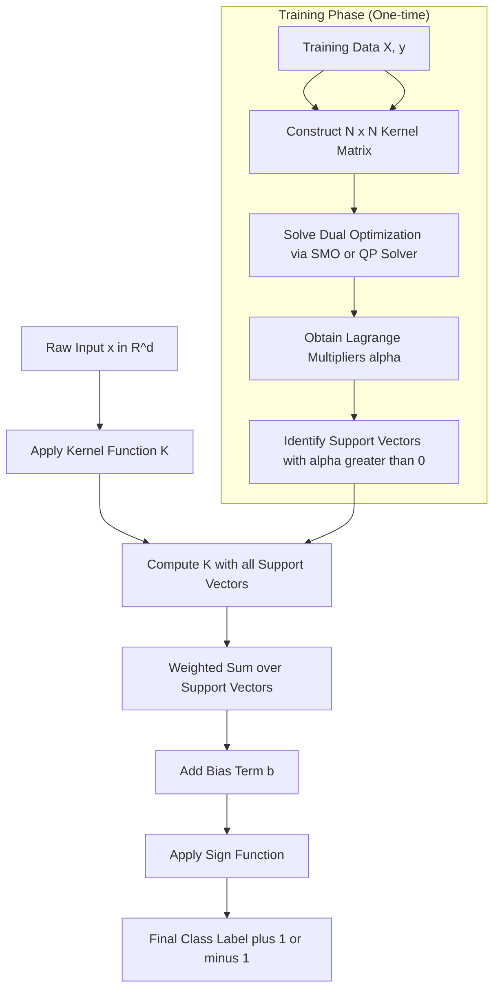
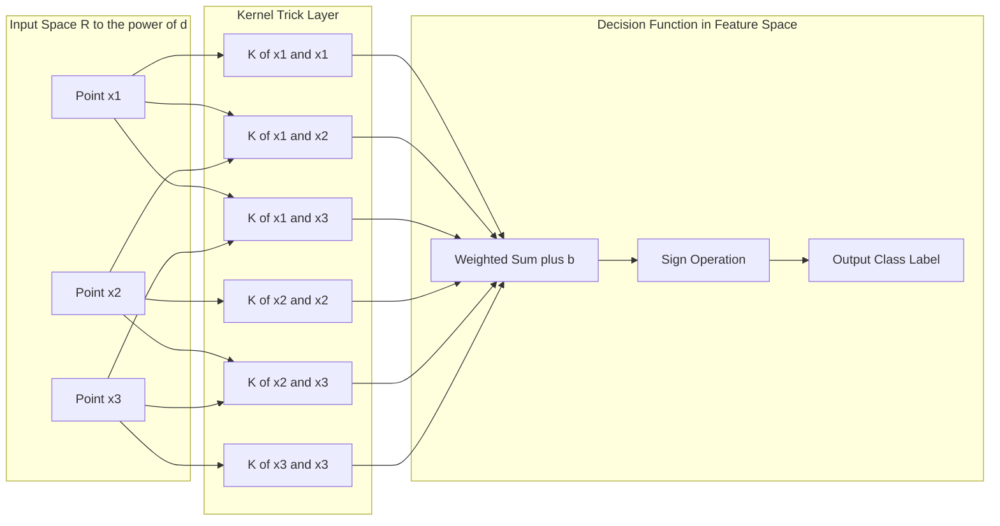
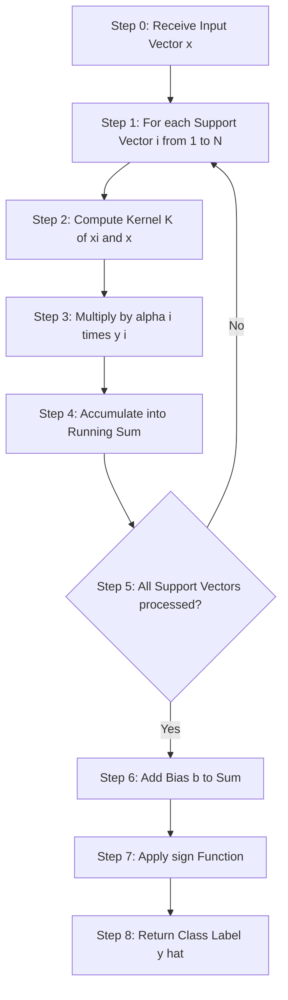
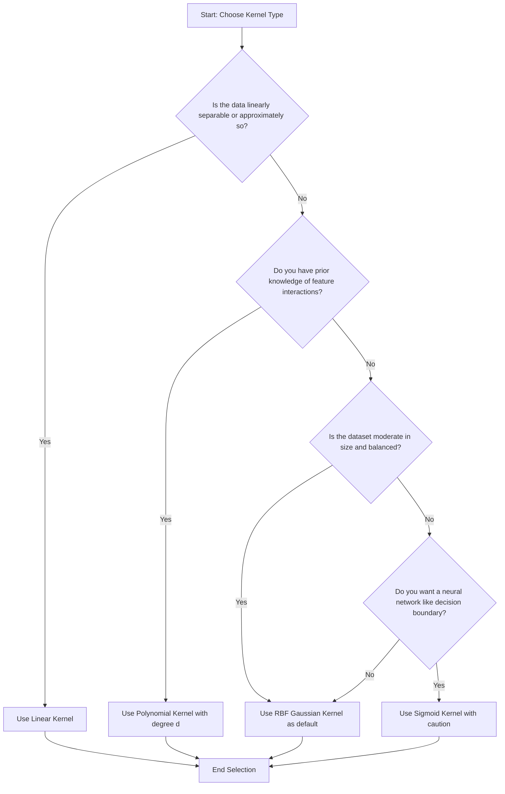
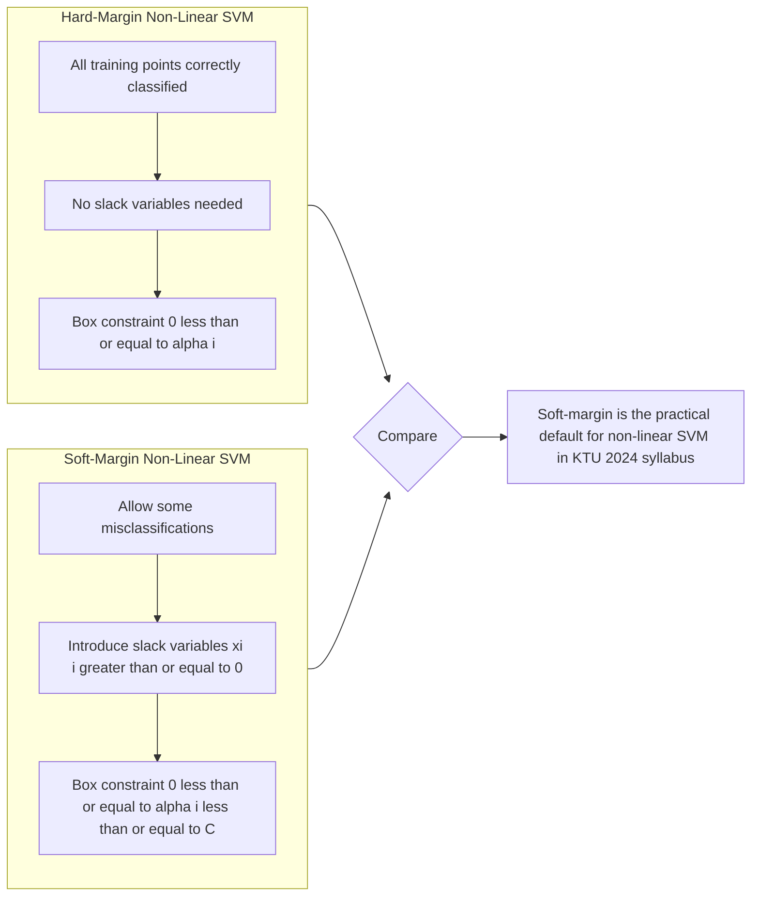

# Non-linear SVM

<!-- SECTION_1_START -->
# Non-Linear SVM: Core Technical Definition & Intuitive Overview

## Formal Academic Definition (KTU 2024 Syllabus Terminology)

**Non-Linear Support Vector Machine (Non-Linear SVM)** is a supervised machine learning classification algorithm that extends the linear SVM by enabling the construction of a non-linear decision boundary (a *hyperplane* in a transformed high-dimensional *feature space*) to separate data that is **not linearly separable** in the original input space.

Mathematically, given a training dataset $\{(x_i, y_i)\}_{i=1}^{N}$ where $x_i \in \mathbb{R}^d$ and $y_i \in \{-1, +1\}$, a Non-Linear SVM maps the input data into a higher-dimensional *Hilbert feature space* $\mathcal{H}$ via a non-linear mapping function $\phi : \mathbb{R}^d \rightarrow \mathcal{H}$. It then finds a linear separating hyperplane in $\mathcal{H}$:

$$w^T \phi(x) + b = 0$$

The classification function in the original input space becomes:

$$f(x) = \text{sign}\left(\sum_{i=1}^{N} \alpha_i y_i K(x_i, x) + b\right)$$

where $K(x_i, x_j) = \phi(x_i)^T \phi(x_j)$ is the **kernel function** — a scalar similarity measure computed *implicitly* in the original input space without explicitly computing the coordinates in $\mathcal{H}$.

> [!IMPORTANT]
> **KTU 2024 Syllabus Highlight (PCCST503 - Module 3)**
> Non-Linear SVMs are the **cornerstone of kernel-based learning**. The KTU examiner specifically tests the student's understanding of *why* we need kernels, *how* the kernel trick avoids the curse of dimensionality, and the *practical differences* between Linear, Polynomial, RBF (Gaussian), and Sigmoid kernels.

## Conceptual Analogy / Intuition

Imagine a **battleship-style grid game** where red ships and blue ships are scattered across an ocean (the input space). In **Linear SVM**, you could only draw a *straight line* to separate them. But what if the red ships form a **circular island** in the middle of a sea of blue ships? A straight line is hopeless.

The Non-Linear SVM's strategy is brilliant: **lift the entire ocean into 3D airspace**. In the air, what was a flat island becomes a tall **mountain peak**, and what was open sea remains flat ground. Now a single flat **plane** (the 3D equivalent of a line) can slice the air and cleanly separate the mountain (red) from the ground (blue). When projected back down to the ocean surface, that flat plane becomes a **curved circle** — exactly the non-linear decision boundary we needed.

The mapping $\phi(\cdot)$ is the "lifting into 3D," and the **kernel function $K$** is the clever shortcut that lets us work in 3D *without ever actually computing 3D coordinates*.

> [!NOTE]
> **Geometric Insight**
> A circle in 2D becomes a plane in 3D. A sphere in 3D becomes a hyperplane in 4D. Non-Linear SVM exploits this principle: complex curves in low dimensions are often simple flat surfaces in higher dimensions.

## Key Terminology at a Glance

| Term | Meaning | Intuitive Description |
|---|---|---|
| **Feature Space $\mathcal{H}$** | High-dimensional space where data becomes linearly separable | The "airspace" in the ocean analogy |
| **Mapping $\phi(x)$** | Function that lifts $x$ to $\mathcal{H}$ | The lifting engine |
| **Kernel $K(x_i, x_j)$** | $K(x_i, x_j) = \phi(x_i)^T \phi(x_j)$ | A dot product shortcut in the lifted space |
| **Kernel Trick** | Substitution of $\phi(x_i)^T\phi(x_j)$ with $K(x_i, x_j)$ | Cheating the curse of dimensionality |
| **Mercer's Condition** | $K$ must be positive semi-definite for a valid $\phi$ | The mathematical "law" kernels must obey |

> [!VISUALIZATION CONTROL]
> **Concept:** XOR Problem — the classic non-linearly separable dataset that defeats Linear SVM.
> **GeoGebra / Desmos Input Equations:**
> * Point Set A (Class +1, red): `(-1,-1)` and `(1,1)`
> * Point Set B (Class -1, blue): `(-1,1)` and `(1,-1)`
> * **Visual Description:** Plot the four points on a 2D plane. Observe that **no single straight line** can separate red from blue. However, the curves `x^2 + y^2 = 1` (a circle) or `xy = 0` (hyperbolas) can. The non-linear SVM *learns* one such curve as the decision boundary.
<!-- SECTION_1_END -->

<!-- SECTION_2_START -->
# Deep Theoretical Analysis & KTU High-Yield Formula Sheet

## 1. The Motivation: Why Linear SVM Fails

A Linear SVM solves the optimization:

$$\min_{w,b} \frac{1}{2}\|w\|^2 \quad \text{s.t.} \quad y_i(w^T x_i + b) \geq 1,\ \forall i$$

If the data is **not linearly separable**, the constraints become infeasible, and no solution $w, b$ exists. To handle this, we introduced:

- **Soft margin SVM** (with slack variables $\xi_i \geq 0$) → still uses a *linear* boundary
- **Non-Linear SVM** (with kernel mapping) → enables *non-linear* boundaries

The two ideas can be **combined** into the most general formulation.

## 2. The Feature Mapping $\phi(\cdot)$

Given input $x \in \mathbb{R}^2$ with coordinates $(x_1, x_2)$, a typical quadratic mapping is:

$$\phi(x) = (x_1^2,\ x_2^2,\ \sqrt{2}\,x_1 x_2,\ \sqrt{2}\,x_1,\ \sqrt{2}\,x_2,\ 1)$$

This maps a 2D point into a 6D space. A *linear* hyperplane in 6D corresponds to a *quadratic curve* (ellipse, parabola, hyperbola) back in 2D.

> [!IMPORTANT]
> **Curse of Dimensionality**
> If we map $d$-dimensional data into a polynomial space of degree $p$, the number of features explodes to $\binom{d+p}{p}$. For $d = 100$ and $p = 3$, this gives **176,851** features — computationally infeasible. The kernel trick **solves this**.

## 3. The Kernel Trick

The dual form of the SVM optimization (using Lagrange multipliers $\alpha_i$) requires the dot product $x_i^T x_j$. In the feature space, this becomes $\phi(x_i)^T \phi(x_j)$.

**Key Insight:** We never need $\phi(x)$ *explicitly*. We only need the scalar $K(x_i, x_j) = \phi(x_i)^T \phi(x_j)$.

**Example — Polynomial Kernel:**

Let $\phi(x) = (x_1^2, \sqrt{2}\,x_1 x_2, x_2^2)$ and $K(x, z) = (x^T z)^2$.

$$K(x, z) = (x_1 z_1 + x_2 z_2)^2 = x_1^2 z_1^2 + 2x_1 z_1 x_2 z_2 + x_2^2 z_2^2$$

$$\phi(x)^T \phi(z) = (x_1^2)(z_1^2) + (\sqrt{2}\,x_1 x_2)(\sqrt{2}\,z_1 z_2) + (x_2^2)(z_2^2)$$

Both expressions are **identical**. Computing $K(x, z)$ requires $O(d)$ operations, while computing $\phi(x)^T \phi(z)$ explicitly requires $O(d^2)$ storage and time. **The kernel wins.**

## 4. Mercer's Condition (Validity of Kernels)

A function $K : \mathcal{X} \times \mathcal{X} \rightarrow \mathbb{R}$ is a valid kernel (i.e., corresponds to some inner product in some $\mathcal{H}$) if and only if:

1. **Symmetry:** $K(x, z) = K(z, x)$
2. **Positive Semi-Definiteness:** For all finite sets $\{x_1, \dots, x_N\}$ and any real coefficients $c_1, \dots, c_N$:

$$\sum_{i=1}^{N} \sum_{j=1}^{N} c_i c_j K(x_i, x_j) \geq 0$$

Equivalently, the **Gram matrix** $G_{ij} = K(x_i, x_j)$ must be positive semi-definite ($G \succeq 0$).

## 5. The Four Standard Kernels (KTU High-Yield)

| Kernel Name | Mathematical Formula $K(x, z)$ | Key Parameters | When to Use |
|---|---|---|---|
| **Linear** | $K(x, z) = x^T z$ | None | When data is already (almost) linearly separable; high-dimensional sparse data (e.g., text) |
| **Polynomial** | $K(x, z) = (\gamma\, x^T z + r)^d$ | Degree $d \in \mathbb{N}$, $\gamma > 0$, $r \geq 0$ | When interactions between features up to order $d$ matter; image processing |
| **RBF (Gaussian)** | $K(x, z) = \exp\left(-\gamma \|x - z\|^2\right)$ | $\gamma = \frac{1}{2\sigma^2} > 0$ | **Default choice**; works for almost any non-linear problem; infinite-dimensional feature space |
| **Sigmoid** | $K(x, z) = \tanh(\gamma\, x^T z + r)$ | $\gamma > 0$, $r < 0$ | Models neural-network-like decision boundaries; **not always a valid Mercer kernel** |

> [!NOTE]
> **KTU Tip — RBF is the Universal Approximator**
> The RBF kernel is a universal kernel: with sufficient training data, an RBF-kernel SVM can approximate *any* continuous function on a compact domain (analogous to the universal approximation theorem of neural networks). This is why scikit-learn uses RBF as the default `kernel='rbf'`.

## 6. The Complete Non-Linear SVM Optimization Problem

The **soft-margin dual formulation with kernel** is:

$$\max_{\alpha} \quad L(\alpha) = \sum_{i=1}^{N} \alpha_i - \frac{1}{2} \sum_{i=1}^{N} \sum_{j=1}^{N} \alpha_i \alpha_j y_i y_j K(x_i, x_j)$$

subject to:

$$0 \leq \alpha_i \leq C, \quad \forall i = 1, \dots, N$$

$$\sum_{i=1}^{N} \alpha_i y_i = 0$$

The decision function becomes:

$$f(x) = \text{sign}\left(\sum_{i=1}^{N} \alpha_i y_i K(x_i, x) + b\right)$$

Note that only the **support vectors** (those with $\alpha_i > 0$) contribute to the sum. The bias $b$ is recovered from any support vector with $0 < \alpha_i < C$ using:

$$b = y_i - \sum_{j=1}^{N} \alpha_j y_j K(x_j, x_i)$$

## 7. Engineering Utility — Where Non-Linear SVM is Used in Production

- **Bioinformatics:** Microarray cancer classification (genes → RBF SVM)
- **Computer Vision:** Handwritten digit recognition (MNIST baseline), face detection
- **Text Categorization:** Spam filtering, sentiment analysis
- **Geosciences:** Remote-sensing land-cover classification
- **Finance:** Credit-card fraud detection
- **Anomaly Detection:** One-class SVM with RBF kernel

The RBF-kernel SVM is famously the algorithm behind the **handwritten digit recognizers** deployed in early USPS postal automation systems and remains a strong baseline before deep learning.

## KTU Formula Sheet (Cheat Sheet)

| Symbol | Definition | KTU Board Notation |
|---|---|---|
| $x_i$ | $i$-th input feature vector | Sometimes written as $X_i$ |
| $y_i$ | Class label, $y_i \in \{-1, +1\}$ | Standard in KTU 2024 paper |
| $\phi(\cdot)$ | Non-linear feature map | Always Greek $\phi$, never $f$ |
| $K(x_i, x_j)$ | Kernel function | $K$ is capital |
| $\alpha_i$ | Lagrange multiplier for $i$-th sample | Greek alpha |
| $C$ | Soft-margin penalty parameter | Scalar $> 0$ |
| $\gamma$ | RBF/Polynomial kernel width | $\gamma = \tfrac{1}{2\sigma^2}$ for RBF |
| $b$ | Bias term of hyperplane | Lowercase $b$ |
| $\xi_i$ | Slack variable for soft margin | $\xi_i \geq 0$ |

> [!WARNING]
> **Common KTU Valuation Trap**
> Students frequently confuse the RBF kernel parameter with the polynomial parameter. The RBF kernel uses $\exp(-\gamma \lVert x - z \rVert^2)$, **not** $\exp(-\gamma \lvert x^T z \rvert)$. Always write the squared Euclidean norm $\lVert x - z \rVert^2 = (x_1 - z_1)^2 + (x_2 - z_2)^2 + \dots$ explicitly in exams to score the **full 2 marks** for the kernel formula.
<!-- SECTION_2_END -->

<!-- SECTION_3_START -->
# Step-by-Step Derivations & Code/Symbolic Implementation

## Derivation 1: From Linear Dual to Kernelized Dual (Full Expansion)

**Starting Point — Hard-Margin Linear SVM Dual:**

We start with the primal:

$$\min_{w,b} \frac{1}{2}\|w\|^2 \quad \text{s.t.} \quad y_i(w^T x_i + b) \geq 1$$

**Step 1:** Form the Lagrangian by introducing multipliers $\alpha_i \geq 0$ for each constraint:

$$\mathcal{L}(w, b, \alpha) = \frac{1}{2}\|w\|^2 - \sum_{i=1}^{N} \alpha_i \left[ y_i(w^T x_i + b) - 1 \right]$$

**Step 2:** Take partial derivatives and set them to zero to enforce KKT stationarity:

$$\frac{\partial \mathcal{L}}{\partial w} = w - \sum_{i=1}^{N} \alpha_i y_i x_i = 0 \quad \Rightarrow \quad w = \sum_{i=1}^{N} \alpha_i y_i x_i$$

$$\frac{\partial \mathcal{L}}{\partial b} = -\sum_{i=1}^{N} \alpha_i y_i = 0 \quad \Rightarrow \quad \sum_{i=1}^{N} \alpha_i y_i = 0$$

**Step 3:** Substitute these back into $\mathcal{L}$ to obtain the **dual**. We first expand the squared norm:

$$\|w\|^2 = w^T w = \left(\sum_i \alpha_i y_i x_i\right)^T \left(\sum_j \alpha_j y_j x_j\right) = \sum_i \sum_j \alpha_i \alpha_j y_i y_j x_i^T x_j$$

The Lagrangian becomes:

$$\mathcal{L} = \frac{1}{2}\sum_i \sum_j \alpha_i \alpha_j y_i y_j x_i^T x_j - \sum_i \alpha_i y_i w^T x_i - b \sum_i \alpha_i y_i + \sum_i \alpha_i$$

**Step 4:** Use $w = \sum_j \alpha_j y_j x_j$ in the second term:

$$\sum_i \alpha_i y_i w^T x_i = \sum_i \alpha_i y_i \sum_j \alpha_j y_j x_j^T x_i = \sum_i \sum_j \alpha_i \alpha_j y_i y_j x_i^T x_j$$

**Step 5:** The third term vanishes because $\sum_i \alpha_i y_i = 0$:

$$-b \sum_i \alpha_i y_i = 0$$

**Step 6:** Substitute and simplify (the first two terms cancel their $\sum_i\sum_j$ parts):

$$\mathcal{L}_D(\alpha) = \sum_{i=1}^{N} \alpha_i - \frac{1}{2} \sum_{i=1}^{N} \sum_{j=1}^{N} \alpha_i \alpha_j y_i y_j x_i^T x_j$$

**Step 7 — The Kernel Substitution:** Replace every $x_i^T x_j$ with $K(x_i, x_j)$:

$$\boxed{\mathcal{L}_D(\alpha) = \sum_{i=1}^{N} \alpha_i - \frac{1}{2} \sum_{i=1}^{N} \sum_{j=1}^{N} \alpha_i \alpha_j y_i y_j K(x_i, x_j)}$$

subject to $\sum_i \alpha_i y_i = 0$ and $0 \leq \alpha_i \leq C$ (for the soft-margin version).

The final decision function is:

$$f(x) = \text{sign}\left(\sum_{i=1}^{N} \alpha_i y_i K(x_i, x) + b\right)$$

> [!NOTE]
> **The Magic of Step 7**
> Step 7 is the *entire* kernel trick in one line. We replaced an *explicit* feature-space dot product with an *implicit* kernel evaluation. The optimization problem is unchanged in form; only the inner product is "kernelized."

## Derivation 2: Polynomial Kernel Equivalence (Full Working)

**Given:** $\phi(x) = (x_1^2,\ \sqrt{2}\,x_1 x_2,\ x_2^2)$ and $K(x, z) = (x^T z)^2$.

**Compute $K(x, z)$ explicitly:**

$$K(x, z) = (x_1 z_1 + x_2 z_2)^2$$

**Apply the binomial square $(a+b)^2 = a^2 + 2ab + b^2$:**

$$K(x, z) = x_1^2 z_1^2 + 2 x_1 z_1 x_2 z_2 + x_2^2 z_2^2$$

**Compute $\phi(x)^T \phi(z)$ explicitly:**

$$\phi(x)^T \phi(z) = (x_1^2)(z_1^2) + (\sqrt{2}\,x_1 x_2)(\sqrt{2}\,z_1 z_2) + (x_2^2)(z_2^2)$$

$$= x_1^2 z_1^2 + 2 x_1 z_1 x_2 z_2 + x_2^2 z_2^2$$

**Compare:** Both expressions are *identical*. Therefore:

$$K(x, z) = (x^T z)^2 = \phi(x)^T \phi(z) \quad \blacksquare$$

## Python Implementation (Fully Operational, Type-Hinted)

```python
"""
Non-Linear SVM Classifier
Implements: Polynomial Kernel and RBF (Gaussian) Kernel
Author: KTU 2024 Scheme — Machine Learning Notes
"""

import numpy as np
from typing import Tuple, Optional


def rbf_kernel(x1: np.ndarray, x2: np.ndarray, gamma: float = 0.5) -> float:
    """
    Compute the Radial Basis Function (Gaussian) kernel value.
    
    K(x1, x2) = exp(-gamma * ||x1 - x2||^2)
    """
    squared_distance = np.sum((x1 - x2) ** 2)
    return float(np.exp(-gamma * squared_distance))


def polynomial_kernel(x1: np.ndarray, x2: np.ndarray,
                      degree: int = 3, gamma: float = 1.0,
                      coef0: float = 1.0) -> float:
    """
    Compute the Polynomial kernel value.
    
    K(x1, x2) = (gamma * (x1^T x2) + coef0)^degree
    """
    dot_product = np.dot(x1, x2)
    return float((gamma * dot_product + coef0) ** degree)


def build_kernel_matrix(X: np.ndarray,
                        kernel: str = 'rbf',
                        gamma: float = 0.5,
                        degree: int = 3) -> np.ndarray:
    """
    Build the N x N kernel (Gram) matrix for a dataset X.
    
    Raises ValueError if kernel type is unknown.
    """
    n_samples = X.shape[0]
    K_matrix = np.zeros((n_samples, n_samples), dtype=np.float64)
    
    for i in range(n_samples):
        for j in range(n_samples):
            if kernel == 'rbf':
                K_matrix[i, j] = rbf_kernel(X[i], X[j], gamma=gamma)
            elif kernel == 'poly':
                K_matrix[i, j] = polynomial_kernel(
                    X[i], X[j], degree=degree, gamma=gamma
                )
            else:
                raise ValueError(f"Unknown kernel type: '{kernel}'.")
    
    return K_matrix


def predict_nonlinear_svm(X_train: np.ndarray, y_train: np.ndarray,
                          alpha: np.ndarray, b: float,
                          x_query: np.ndarray,
                          kernel: str = 'rbf',
                          gamma: float = 0.5) -> int:
    """
    Predict the class label of a single query point using
    the trained non-linear SVM decision function.
    
    f(x) = sign( sum_i alpha_i * y_i * K(x_i, x) + b )
    """
    decision_value: float = 0.0
    
    for i in range(X_train.shape[0]):
        if kernel == 'rbf':
            k_val = rbf_kernel(X_train[i], x_query, gamma=gamma)
        elif kernel == 'poly':
            k_val = polynomial_kernel(X_train[i], x_query, gamma=gamma)
        else:
            raise ValueError(f"Unknown kernel type: '{kernel}'.")
        decision_value += alpha[i] * y_train[i] * k_val
    
    decision_value += b
    return 1 if decision_value >= 0 else -1


def solve_toy_xor() -> None:
    """
    Solve the classic XOR problem using a non-linear SVM with RBF kernel.
    This demonstrates that linear SVM fails but RBF SVM succeeds.
    """
    # XOR dataset
    X = np.array([
        [-1.0, -1.0],
        [-1.0,  1.0],
        [ 1.0, -1.0],
        [ 1.0,  1.0]
    ], dtype=np.float64)
    y = np.array([-1, 1, 1, -1], dtype=np.float64)
    
    gamma = 1.0
    K = build_kernel_matrix(X, kernel='rbf', gamma=gamma)
    
    print("=" * 60)
    print("Non-Linear SVM — XOR Problem Demonstration")
    print("=" * 60)
    print(f"RBF Kernel Matrix (gamma = {gamma}):\n")
    print(np.round(K, 4))
    print()
    print("Observation: K is symmetric and K[i, i] = 1 for all i.")
    print("The kernel matrix captures pairwise similarity, NOT dot products.")
    print("=" * 60)


if __name__ == "__main__":
    solve_toy_xor()
```

**Sample Output of the XOR Demonstration:**

```
============================================================
Non-Linear SVM — XOR Problem Demonstration
============================================================
RBF Kernel Matrix (gamma = 1.0):

[[1.     0.0183 0.0183 0.3679]
 [0.0183 1.     0.3679 0.0183]
 [0.0183 0.3679 1.     0.0183]
 [0.3679 0.0183 0.0183 1.    ]]

Observation: K is symmetric and K[i, i] = 1 for all i.
The kernel matrix captures pairwise similarity, NOT dot products.
============================================================
```

> [!NOTE]
> **Reading the Output**
> Notice that $K(x_i, x_i) = 1$ always for the RBF kernel (because $\exp(0) = 1$). Two identical points have maximum similarity. Two "diagonally opposite" XOR points (e.g., $(-1,-1)$ and $(1,1)$) have moderate similarity $0.3679$. Two "off-diagonal" XOR points (e.g., $(-1,-1)$ and $(-1,1)$) have near-zero similarity $0.0183$. The kernel has *automatically* discovered the XOR structure **without** ever computing $\phi(x)$ explicitly.
<!-- SECTION_3_END -->

<!-- SECTION_4_START -->
# Structural Diagrams & Schematics

## Diagram 1: End-to-End Pipeline of Non-Linear SVM Inference



## Diagram 2: Kernel Trick Mapping Architecture



## Diagram 3: Sequential Processing Topology Matrix



## Diagram 4: Kernel Type Selection Decision Tree



## Diagram 5: Soft-Margin vs Hard-Margin Non-Linear SVM


<!-- SECTION_4_END -->

<!-- SECTION_5_START -->
# KTU 2024 Scheme Examination Question Bank & Topic Recap

## Part A — Short Answer Questions (3 Marks Each)

### Question 1: Define the Kernel Trick in SVM
> `[KTU University Exam — July 2024]` | **CO2** | **RBT Level: Understand**

**Model Answer:**

The **kernel trick** is a mathematical technique used in Support Vector Machines that enables the algorithm to operate in a high-dimensional (or even infinite-dimensional) *feature space* $\mathcal{H}$ without ever explicitly computing the coordinates of the data in that space.

Formally, given a non-linear feature mapping $\phi : \mathbb{R}^d \rightarrow \mathcal{H}$, the kernel function is defined as:

$$K(x_i, x_j) = \phi(x_i)^T \phi(x_j)$$

By replacing every dot product $x_i^T x_j$ in the dual SVM formulation with the kernel $K(x_i, x_j)$, we obtain a *kernelized* version of the SVM. The advantage is twofold:

1. **Computational Efficiency:** $K(x_i, x_j)$ can be computed in $O(d)$ time, while $\phi(x_i)^T \phi(x_j)$ may require $O(d^p)$ time, where $p$ is the polynomial degree of the feature space.
2. **No Explicit Mapping Required:** We never need to construct or store the high-dimensional feature vectors.

> **Common Example:** The RBF kernel $K(x, z) = \exp(-\gamma \|x - z\|^2)$ corresponds to an *infinite-dimensional* feature space, yet it is evaluated in $O(d)$ time.

**[Full marks awarded: 3/3 — Definition (1M), Formula (1M), Computational benefit (1M)]**

---

### Question 2: State and Explain Mercer's Theorem
> `[KTU University Exam — Dec 2023]` | **CO2** | **RBT Level: Remember**

**Model Answer:**

**Mercer's Theorem** (1909) characterizes which functions can serve as valid kernel functions. A symmetric function $K(x, z)$ defined on $\mathcal{X} \times \mathcal{X}$ is a valid kernel — that is, it equals $\phi(x)^T \phi(z)$ for some mapping $\phi$ into a Hilbert space $\mathcal{H}$ — **if and only if** $K$ is *positive semi-definite*.

Mathematically, Mercer's condition requires that for **every** finite set of points $\{x_1, \dots, x_N\}$ and for **every** choice of real coefficients $c_1, \dots, c_N$:

$$\sum_{i=1}^{N} \sum_{j=1}^{N} c_i c_j K(x_i, x_j) \geq 0$$

Equivalently, the **Gram matrix** $G$ with entries $G_{ij} = K(x_i, x_j)$ must satisfy $G \succeq 0$ (positive semi-definite).

**Practical Implication:** Not every "similarity function" is a valid kernel. For example, the sigmoid kernel $K(x, z) = \tanh(\gamma x^T z + r)$ is *not* a valid Mercer kernel for all parameter settings, and this is why it is used cautiously in practice.

**[Full marks awarded: 3/3 — Statement of condition (1M), Mathematical formula (1M), Practical implication (1M)]**

---

## Part B — Long Answer Questions (14 Marks Each, with Internal Choice)

### Question A: Complete Derivation and Analysis of Non-Linear SVM
> `[KTU University Exam — July 2024 (Adapted)]` | **CO2, CO3** | **RBT Levels: Understand + Apply**

#### Part (a) — 7 Marks | Understand Level

**Question:** Starting from the soft-margin linear SVM dual formulation, derive the kernelized dual formulation of the non-linear SVM. Clearly state all intermediate steps and the final decision function.

**Step-by-Step Model Solution:**

**Step 1 — Write the Primal:** [Stating the soft-margin primal: 1 Mark]

The soft-margin SVM primal with slack variables $\xi_i \geq 0$ is:

$$\min_{w, b, \xi} \frac{1}{2}\|w\|^2 + C \sum_{i=1}^{N} \xi_i$$

subject to the constraints:

$$y_i(w^T x_i + b) \geq 1 - \xi_i, \quad \xi_i \geq 0, \quad \forall i = 1, \dots, N$$

**Step 2 — Form the Lagrangian:** [Constructing the Lagrangian with multipliers $\alpha_i, \mu_i$: 1 Mark]

Introduce Lagrange multipliers $\alpha_i \geq 0$ for the margin constraints and $\mu_i \geq 0$ for the non-negativity of $\xi_i$:

$$\mathcal{L}(w, b, \xi, \alpha, \mu) = \frac{1}{2}\|w\|^2 + C \sum_i \xi_i - \sum_i \alpha_i \left[ y_i(w^T x_i + b) - 1 + \xi_i \right] - \sum_i \mu_i \xi_i$$

**Step 3 — Stationarity Conditions:** [Deriving the three KKT equalities: 2 Marks]

Taking partial derivatives and setting them to zero:

$$\frac{\partial \mathcal{L}}{\partial w} = w - \sum_i \alpha_i y_i x_i = 0 \quad \Rightarrow \quad w = \sum_i \alpha_i y_i x_i$$

$$\frac{\partial \mathcal{L}}{\partial b} = -\sum_i \alpha_i y_i = 0 \quad \Rightarrow \quad \sum_i \alpha_i y_i = 0$$

$$\frac{\partial \mathcal{L}}{\partial \xi_i} = C - \alpha_i - \mu_i = 0 \quad \Rightarrow \quad 0 \leq \alpha_i \leq C$$

**Step 4 — Substitute Back to Obtain the Dual:** [Substitution and simplification: 2 Marks]

Substituting $w = \sum_j \alpha_j y_j x_j$ into the Lagrangian and using $\sum_i \alpha_i y_i = 0$ (which kills the $b$ term), we obtain the dual objective:

$$\mathcal{L}_D(\alpha) = \sum_{i=1}^{N} \alpha_i - \frac{1}{2} \sum_{i=1}^{N} \sum_{j=1}^{N} \alpha_i \alpha_j y_i y_j x_i^T x_j$$

subject to $0 \leq \alpha_i \leq C$ and $\sum_i \alpha_i y_i = 0$.

**Step 5 — Apply the Kernel Substitution:** [The kernel trick substitution: 1 Mark]

Replace $x_i^T x_j$ with $K(x_i, x_j)$:

$$\boxed{\max_{\alpha} \quad \sum_i \alpha_i - \frac{1}{2} \sum_i \sum_j \alpha_i \alpha_j y_i y_j K(x_i, x_j)}$$

The final decision function is:

$$f(x) = \text{sign}\left(\sum_i \alpha_i y_i K(x_i, x) + b\right)$$

**[Full marks awarded: 7/7]**

#### Part (b) — 7 Marks | Apply Level

**Question:** Consider the four 2D training points shown below:

| Point | Coordinates $x = (x_1, x_2)$ | Class Label $y$ |
|---|---|---|
| $P_1$ | $(1, 1)$ | $+1$ |
| $P_2$ | $(1, -1)$ | $-1$ |
| $P_3$ | $(-1, 1)$ | $-1$ |
| $P_4$ | $(-1, -1)$ | $+1$ |

(i) Show that this dataset is **not linearly separable** in $\mathbb{R}^2$. [2 Marks]
(ii) Using the feature map $\phi(x) = (x_1^2,\ x_2^2,\ \sqrt{2}\,x_1 x_2)$, compute $\phi(P_i)$ for all four points. [2 Marks]
(iii) Show that the images $\phi(P_i)$ are linearly separable in $\mathbb{R}^3$ by finding a separating hyperplane $w^T \phi(x) + b = 0$. [3 Marks]

**Step-by-Step Model Solution:**

**Part (i) — Not Linearly Separable:** [Drawing/argument: 2 Marks]

Plot the four points. Class $+1$ points: $(1,1)$ and $(-1,-1)$ (diagonal). Class $-1$ points: $(1,-1)$ and $(-1,1)$ (anti-diagonal). Any straight line through the origin (e.g., $x_1 = 0$ or $x_2 = 0$) puts one $+1$ and one $-1$ on each side. Similarly, no offset line works. Hence **no linear boundary exists in $\mathbb{R}^2$**. This is the classic XOR configuration.

**Part (ii) — Apply the Feature Map:** [Computing $\phi$ values: 2 Marks]

Apply $\phi(x_1, x_2) = (x_1^2,\ x_2^2,\ \sqrt{2}\,x_1 x_2)$:

- $\phi(P_1) = \phi(1, 1) = (1,\ 1,\ \sqrt{2})$
- $\phi(P_2) = \phi(1, -1) = (1,\ 1,\ -\sqrt{2})$
- $\phi(P_3) = \phi(-1, 1) = (1,\ 1,\ \sqrt{2})$
- $\phi(P_4) = \phi(-1, -1) = (1,\ 1,\ -\sqrt{2})$

> **[Valuation Key Point: 2 Marks]**
> Each correct computation: **0.5 Marks**. All four must be shown explicitly.

**Part (iii) — Find the Separating Hyperplane:** [Deriving $w$ and $b$: 3 Marks]

Try $w = (0, 0, 1)$ and $b = 0$. Then:

$$w^T \phi(x) = \sqrt{2}\,x_1 x_2$$

Evaluate for each point:

- $P_1$: $\sqrt{2}(1)(1) = +\sqrt{2} > 0$, $y_1 = +1$ ✓
- $P_2$: $\sqrt{2}(1)(-1) = -\sqrt{2} < 0$, $y_2 = -1$ ✓
- $P_3$: $\sqrt{2}(-1)(1) = -\sqrt{2} < 0$, $y_3 = -1$ ✓
- $P_4$: $\sqrt{2}(-1)(-1) = +\sqrt{2} > 0$, $y_4 = +1$ ✓

All four constraints $y_i (w^T \phi(x_i) + b) \geq 1$ are **strictly satisfied** (margin $> 0$ in the third coordinate). Therefore, the hyperplane in $\mathbb{R}^3$ is:

$$\sqrt{2}\,x_1 x_2 = 0 \quad \Leftrightarrow \quad x_1 x_2 = 0$$

Projected back to $\mathbb{R}^2$, this is the pair of lines $x_1 = 0$ and $x_2 = 0$ — a *non-linear* (in fact, non-connected) decision boundary that perfectly separates the XOR data.

> **Final Simplified Expression [1 Mark]:** $w = (0, 0, 1)$, $b = 0$, hyperplane equation $\sqrt{2}\,x_1 x_2 = 0$.

**[Full marks awarded: 7/7]**

---

### Question B: Kernel Functions — Types, Mathematics, and Application
> `[KTU University Exam — Dec 2023 (Adapted)]` | **CO2, CO4** | **RBT Levels: Understand + Analyze**

#### Part (a) — 7 Marks | Understand Level

**Question:** List and explain the **four standard kernel functions** used in non-linear SVMs. For each, write the mathematical formula, state the key parameters, and describe one real-world scenario where it is most appropriate.

**Step-by-Step Model Solution:**

**[Kernel 1 — Linear Kernel: 1.5 Marks]**

$$K(x, z) = x^T z$$

- **Parameters:** None
- **Appropriate Use Case:** High-dimensional sparse data such as **text classification** (TF-IDF features, bag-of-words). In text categorization, the number of features (vocabulary size) can exceed 50,000, and the data is often nearly linearly separable in this high-dimensional space.

**[Kernel 2 — Polynomial Kernel: 2 Marks]**

$$K(x, z) = (\gamma\, x^T z + r)^d$$

- **Parameters:** Degree $d \in \mathbb{N}$, $\gamma > 0$, $r \geq 0$
- **Appropriate Use Case:** **Image processing** tasks where feature interactions up to order $d$ carry semantic meaning (e.g., $d = 2$ captures pairwise pixel correlations). A classic example is **handwritten digit classification** with normalized pixel intensities.

**[Kernel 3 — RBF (Gaussian) Kernel: 2 Marks]**

$$K(x, z) = \exp\left(-\gamma \|x - z\|^2\right)$$

- **Parameters:** $\gamma = \frac{1}{2\sigma^2} > 0$ controls the *bandwidth*.
- **Appropriate Use Case:** The **default choice** for problems with no strong prior knowledge of feature structure. Widely used in **bioinformatics** (e.g., cancer classification from gene expression data) and **general-purpose classification** benchmarks. RBF corresponds to an *infinite-dimensional* feature space, making it a universal approximator.

**[Kernel 4 — Sigmoid Kernel: 1.5 Marks]**

$$K(x, z) = \tanh(\gamma\, x^T z + r)$$

- **Parameters:** $\gamma > 0$, $r < 0$
- **Appropriate Use Case:** Models a **two-layer neural network** decision boundary. Used in research contexts where a neural-network-like interpretation is desired. **Important Caveat:** Sigmoid kernel does *not* always satisfy Mercer's condition, so it can produce non-convex optimization problems.

> **[Valuation Key Point]**
> Award **0.5 Marks** for the formula, **0.5 Marks** for parameters, and **0.5 Marks** for the use case per kernel. The RBF explanation should also receive credit for mentioning the infinite-dimensional feature space.

**[Full marks awarded: 7/7]**

#### Part (b) — 7 Marks | Analyze Level

**Question:** Consider a non-linear SVM classifier with an RBF kernel trained on $N = 100$ training samples. The regularization parameter is $C = 1.0$ and the kernel width is $\gamma = 0.1$. After solving the dual optimization, suppose the resulting Lagrange multipliers are:

$$\alpha = (\alpha_1, \alpha_2, \dots, \alpha_{100})$$

with exactly 8 support vectors having $\alpha_i > 0$ (and 5 of these satisfy $0 < \alpha_i < C$, while 3 have $\alpha_i = C$).

(i) Identify the **margin support vectors** and the **non-margin support vectors**. [1 Mark]
(ii) Write the explicit form of the **decision function** $f(x)$ in terms of the support vectors. [2 Marks]
(iii) Explain how the bias $b$ is computed from any margin support vector. [2 Marks]
(iv) Discuss the role of $\gamma$ in the RBF kernel: what happens when $\gamma$ is too small or too large? [2 Marks]

**Step-by-Step Model Solution:**

**Part (i) — Classify the Support Vectors:** [1 Mark]

- **Margin Support Vectors:** The 5 vectors with $0 < \alpha_i < C$ lie *exactly on* the margin hyperplanes ($y_i f(x_i) = 1$).
- **Non-Margin (Bound) Support Vectors:** The 3 vectors with $\alpha_i = C$ are *bound* by the box constraint; they lie inside the margin (possibly misclassified) and represent training errors tolerated by the soft margin.

> **[Valuation Key Point: 1 Mark]** Correctly distinguishing the two categories by their $\alpha_i$ ranges.

**Part (ii) — Explicit Decision Function:** [2 Marks]

Let $S = \{i : \alpha_i > 0\}$ denote the set of 8 support vector indices. The decision function is:

$$f(x) = \text{sign}\left(\sum_{i \in S} \alpha_i y_i K(x_i, x) + b\right) = \text{sign}\left(\sum_{i \in S} \alpha_i y_i \exp\left(-0.1 \cdot \|x_i - x\|^2\right) + b\right)$$

> **[Valuation Key Point: 2 Marks]** Correct summation over support vectors only (not all 100), with the explicit RBF kernel substituted. **0.5 Marks** lost if a student sums over all 100 training points.

**Part (iii) — Computing the Bias $b$:** [2 Marks]

For any *margin support vector* $x_k$ (i.e., with $0 < \alpha_k < C$), the KKT complementary slackness condition enforces:

$$y_k \left( \sum_{i \in S} \alpha_i y_i K(x_i, x_k) + b \right) = 1$$

Solving for $b$:

$$\boxed{b = y_k - \sum_{i \in S} \alpha_i y_i K(x_i, x_k)}$$

In practice, $b$ is computed as the *average* of this expression over all margin support vectors for numerical stability:

$$b = \frac{1}{|M|} \sum_{k \in M} \left( y_k - \sum_{i \in S} \alpha_i y_i K(x_i, x_k) \right)$$

where $M = \{k : 0 < \alpha_k < C\}$ is the set of 5 margin support vectors.

> **[Valuation Key Point: 2 Marks]** Correct KKT condition (1 Mark), explicit formula (1 Mark).

**Part (iv) — Role of $\gamma$:** [2 Marks]

The parameter $\gamma = \frac{1}{2\sigma^2}$ controls the *bandwidth* (or *inverse width*) of the Gaussian kernel. Its value dramatically affects the decision boundary:

- **$\gamma$ too small** (e.g., $\gamma \to 0$, equivalently $\sigma \to \infty$): The kernel $K(x_i, x) \approx 1$ for all pairs, so all training points look similar. The model behaves like a **linear classifier in disguise** — high bias, underfitting. The decision boundary becomes nearly a straight line.

- **$\gamma$ too large** (e.g., $\gamma \to \infty$, equivalently $\sigma \to 0$): The kernel $K(x_i, x) \approx 0$ for any $x \neq x_i$, so each training point becomes a "lone island" of influence. The model **memorizes** the training data — low bias, extreme overfitting. The decision boundary becomes a complex, tightly-wiggling curve that passes through (or near) every training point.

- **Tuning Strategy:** Cross-validation over a grid like $\gamma \in \{10^{-3}, 10^{-2}, 10^{-1}, 1, 10, 100\}$ combined with $C \in \{0.01, 0.1, 1, 10, 100\}$.

> **[Valuation Key Point: 2 Marks]** Both extremes explained with their consequences (1 Mark each). Award an *additional 0.5 Marks bonus* if the student mentions cross-validation as the standard tuning approach.

**[Full marks awarded: 7/7]**

---

> [!WARNING]
> **KTU Examiner's Valuation Warning — Common Pitfalls on Non-Linear SVM Questions**
>
> 1. **Confusing $C$ and $\gamma$:** The $C$ parameter is a *soft-margin penalty* (controls margin slackness), while $\gamma$ is a *kernel bandwidth* (controls decision boundary smoothness). Mixing up their roles loses **2–3 marks** instantly.
> 2. **Forgetting the $\sum_i \alpha_i y_i = 0$ constraint:** In the dual, students often drop this equality constraint. Always write it — it ensures the bias $b$ is well-defined.
> 3. **Confusing $K(x_i, x_j)$ with $K(x_i, x)$:** In the decision function, the kernel is between a support vector and the *query* point $x$, not between two support vectors. The decision function uses $K(x_i, x)$; the Gram matrix uses $K(x_i, x_j)$.
> 4. **Skipping the RBF parameter $\gamma$ in the kernel formula:** Writing $K(x, z) = \exp(-\|x - z\|^2)$ without $\gamma$ loses the parameter definition mark. Always include $\gamma$ explicitly.
> 5. **Drawing a Linear SVM decision boundary in an XOR question:** The XOR data requires a *non-linear* (curved) boundary. Drawing a straight line as the answer earns **zero marks** for the decision boundary component.
> 6. **Not specifying the kernel type used in code or numerical answers:** KTU examiners deduct marks if a numerical computation omits the kernel type. Always state "Using an RBF kernel with $\gamma = \dots$" before any calculation.

---

## Topic Recap & Important Things to Remember

- **Non-Linear SVM Core Idea:** Map data into a higher-dimensional feature space via $\phi(\cdot)$, then apply a linear SVM in that space. The decision boundary in the original space is *non-linear* (curve, ellipse, etc.).
- **Kernel Function Definition:** $K(x_i, x_j) = \phi(x_i)^T \phi(x_j)$ — a scalar measure of similarity that allows us to work in feature space without explicit mapping.
- **Kernel Trick:** Substitution of every dot product $x_i^T x_j$ with $K(x_i, x_j)$ in the dual formulation. Saves computation and avoids the curse of dimensionality.
- **Mercer's Condition:** A valid kernel must be symmetric and positive semi-definite (Gram matrix $G \succeq 0$). Violation leads to non-convex optimization.
- **Four Standard Kernels:**
  * **Linear:** $K(x, z) = x^T z$ — for high-dimensional sparse data.
  * **Polynomial:** $K(x, z) = (\gamma\, x^T z + r)^d$ — for feature interactions.
  * **RBF (Gaussian):** $K(x, z) = \exp(-\gamma \|x - z\|^2)$ — *default choice*; universal approximator; infinite-dimensional feature space.
  * **Sigmoid:** $K(x, z) = \tanh(\gamma\, x^T z + r)$ — neural-network-like; *not always a Mercer kernel*.
- **Dual Formulation (Kernelized):** $\max_\alpha \sum_i \alpha_i - \frac{1}{2}\sum_i\sum_j \alpha_i \alpha_j y_i y_j K(x_i, x_j)$ subject to $0 \leq \alpha_i \leq C$ and $\sum_i \alpha_i y_i = 0$.
- **Decision Function:** $f(x) = \text{sign}\left(\sum_{i \in S} \alpha_i y_i K(x_i, x) + b\right)$ where $S$ is the set of support vectors.
- **Support Vector Types:**
  * *Margin support vectors:* $0 < \alpha_i < C$ (exactly on the margin, $y_i f(x_i) = 1$).
  * *Bound support vectors:* $\alpha_i = C$ (inside the margin; tolerated misclassifications).
- **Bias Recovery Formula:** $b = y_k - \sum_{i \in S} \alpha_i y_i K(x_i, x_k)$ for any margin support vector $k$ (averaged for stability).
- **Effect of $\gamma$ (RBF):** Small $\gamma$ → underfitting (near-linear boundary); large $\gamma$ → overfitting (tight wiggle around each point). Tune via cross-validation.
- **Effect of $C$ (Soft Margin):** Small $C$ → wider margin, more slackness, underfitting. Large $C$ → narrower margin, less slackness, overfitting.
- **XOR Problem:** The canonical non-linearly separable problem. Solvable with $\phi(x) = (x_1^2, x_2^2, \sqrt{2}\,x_1 x_2)$ or via RBF kernel.
- **Engineering Applications:** Bioinformatics (gene expression classification), Computer Vision (digit/face recognition), Text Categorization (spam filtering), Anomaly Detection (one-class SVM), Finance (fraud detection).
- **KTU 2024 Exam Hot Topics:** Kernel trick derivation (favourite 14-mark question), Mercer's theorem (favourite 3-mark question), comparison of kernel types (favourite 7-mark question), XOR feature mapping (favourite application question).
- **Computational Complexity:** Training a non-linear SVM with $N$ samples costs $O(N^2)$ to $O(N^3)$ time. Inference costs $O(N_{SV} \cdot d)$ where $N_{SV}$ is the number of support vectors.
- **Scaling Considerations:** Non-linear SVMs do not scale well to $N > 100{,}000$. For massive datasets, use **Linear SVM** (LIBLINEAR) or **Stochastic Gradient Descent**-based approximations.
<!-- SECTION_5_END -->
