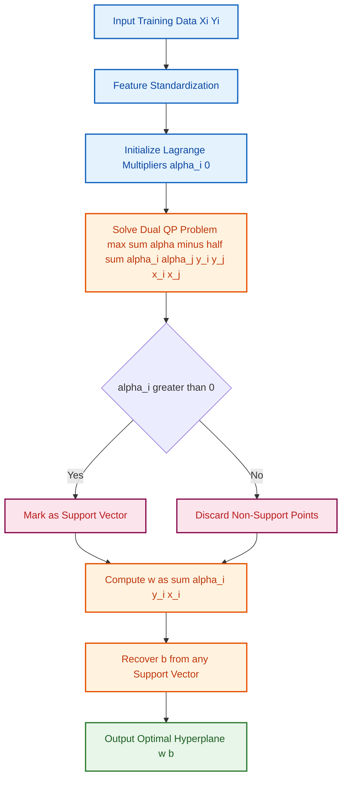
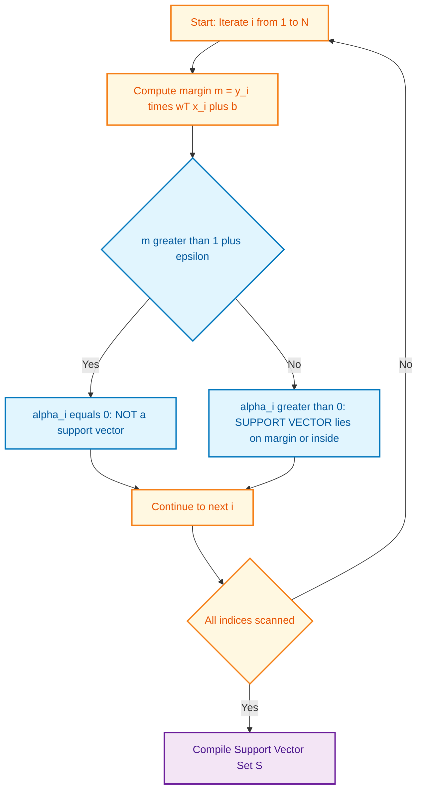
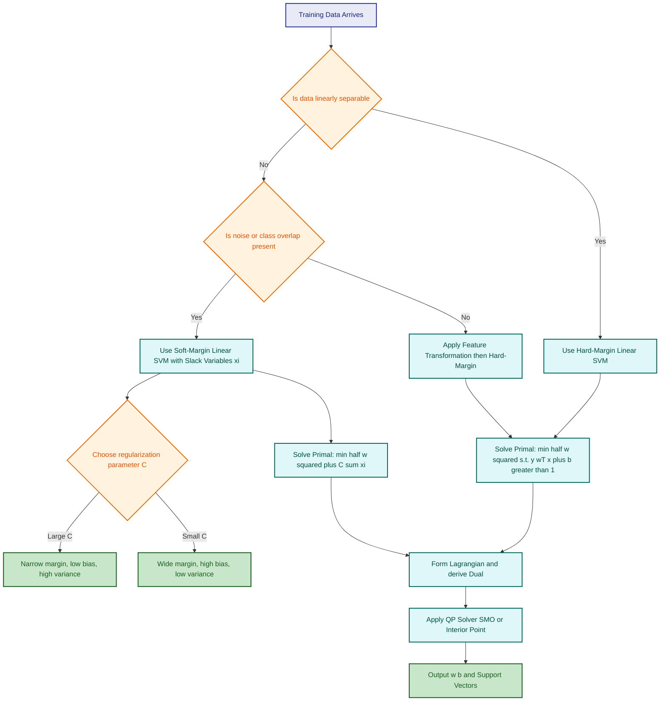
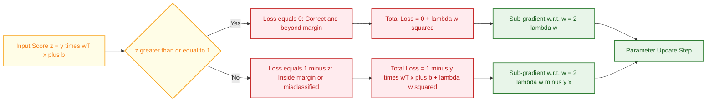

# SVM – Linear SVM

<!-- SECTION_1_START -->

# SVM – Linear Support Vector Machines

## 1.1 Formal Academic Definition (KTU 2024 Terminology)

A **Support Vector Machine (SVM)** is a discriminative, maximum-margin, supervised classification algorithm introduced by *Vapnik & Cortes (1995)* that constructs an optimal separating **hyperplane** in an $n$-dimensional feature space to classify data points belonging to two distinct classes. The "Linear SVM" variant specifically addresses data that is **linearly separable** (or near-separable) in the original feature space, requiring no kernel-based non-linear transformation.

Mathematically, given a training set $\{(x_i, y_i)\}_{i=1}^{N}$ where $x_i \in \mathbb{R}^{d}$ and $y_i \in \{-1, +1\}$, the Linear SVM finds the hyperplane $w^{T}x + b = 0$ that **maximizes the geometric margin** $\dfrac{2}{\Vert w \Vert}$ while minimizing classification error through a regularized hinge-loss objective.

> [!IMPORTANT]
> **KTU 2024 Syllabus Highlight:** Linear SVM is a high-weightage topic in Module 3 of PCCST503 (Machine Learning). Students must master the primal formulation, dual formulation, KKT conditions, support vector identification, hinge loss, and the soft-margin (slack variable) extension. Expect 14-mark derivations and 3-mark short conceptual questions.

## 1.2 Intuitive Analogy — "The Widest Road Between Two Cities"

Imagine two cities — **Class A (red)** and **Class B (blue)** — separated by a stretch of land. The government's job is to build the **widest possible road** strictly between them, such that no building is destroyed and the road is as far as possible from the nearest houses.

- The **center line of the road** = the **decision hyperplane** ($w^{T}x + b = 0$).
- The **edges of the road** = the **margin boundaries** ($w^{T}x + b = \pm 1$).
- The **houses right at the edge of the road** = the **support vectors** (the only data points that "support" or define the margin).
- The **width of the road** = the **margin** ($M = \dfrac{2}{\Vert w \Vert}$).
- If a few houses (outliers) are inside the road area, we use a **soft margin** (slack variables $\xi_i$) to allow a small tolerance — like saying *"the road can slightly bend around a few houses with a penalty fee"*.

> [!NOTE]
> **Key Insight:** The SVM solution is *uniquely determined* by the support vectors alone. All other training points (correctly classified and far from the margin) have **zero influence** on the final hyperplane. This is what makes SVM memory-efficient at prediction time — it stores only the support vectors.

## 1.3 Geometric Building Blocks

| Concept | Symbol | Geometric Meaning |
|---|---|---|
| **Weight vector** | $w$ | Normal vector perpendicular to the hyperplane |
| **Bias term** | $b$ | Offset of hyperplane from the origin |
| **Decision hyperplane** | $w^{T}x + b = 0$ | The separating line/surface |
| **Positive margin plane** | $w^{T}x + b = +1$ | Boundary touching class $+1$ support vectors |
| **Negative margin plane** | $w^{T}x + b = -1$ | Boundary touching class $-1$ support vectors |
| **Margin width** | $\dfrac{2}{\Vert w \Vert}$ | Perpendicular distance between margin planes |
| **Support vector** | $x_i$ such that $y_i(w^{T}x_i + b) = 1$ | Critical training point lying on margin plane |
| **Slack variable** | $\xi_i \geq 0$ | Soft-margin tolerance for misclassification |

> [!VISUALIZATION CONTROL]
> **Concept:** 2D Linear SVM separating two classes with maximum margin
> **GeoGebra / Desmos Input Equations:**
> * Decision boundary: `f(x) = 0` (the line $y = -x + 1$)
> * Upper margin: `g(x) = 1` (parallel line shifted upward)
> * Lower margin: `h(x) = -1` (parallel line shifted downward)
> * Sample points: $(0.5, 0.5)$, $(1, 0)$ for class $-1$; $(1.5, 2)$, $(2, 1.8)$ for class $+1$
> **Visual Description:** A 2D Cartesian plane with a diagonal decision line cutting through the origin region, flanked by two parallel margin lines equidistant from it. The support vector points should visibly touch the margin lines, while all other points lie strictly outside the margin corridor.

---

<!-- SECTION_1_END -->

<!-- SECTION_2_START -->

# Deep Theoretical Analysis & KTU High-Yield Formula Sheet

## 2.1 The Core Optimization Philosophy

Linear SVM solves a **constrained convex optimization problem** with three key properties:

1. **Convex objective** → unique global minimum (no local minima traps).
2. **Linear constraints** → forms a convex feasible region (polytope).
3. **Dual representable** → kernelizable for non-linear extensions.

The fundamental principle is the **Maximum Margin Principle**: among all hyperplanes that correctly classify the training data, choose the one with the **largest perpendicular distance to the nearest training point**.

## 2.2 Hard-Margin Linear SVM (Linearly Separable Case)

### Primal Problem (Primal Form, P)

The objective is to minimize $\Vert w \Vert$ (equivalently $\dfrac{1}{2}\Vert w \Vert^{2}$ for mathematical convenience, since scaling doesn't change the optimum) while ensuring every training point lies on the correct side of its respective margin plane.

$$
\begin{aligned}
\text{Primal (P)}: \quad & \min_{w,b} \;\; \frac{1}{2} \Vert w \Vert^{2} \\
\text{subject to:} \quad & y_i (w^{T} x_i + b) \geq 1, \quad \forall i = 1, 2, \ldots, N
\end{aligned}
$$

The constraint $y_i(w^{T}x_i + b) \geq 1$ enforces that:
- For $y_i = +1$: the point must satisfy $w^{T}x_i + b \geq +1$ (above the positive margin plane).
- For $y_i = -1$: the point must satisfy $w^{T}x_i + b \leq -1$ (below the negative margin plane).

### Lagrangian Dual Formulation

Introduce **Lagrange multipliers** $\alpha_i \geq 0$ for each inequality constraint. The primal is a convex QP (Quadratic Programming) with a strictly convex objective — by **Slater's condition**, strong duality holds (primal optimum = dual optimum).

$$
\begin{aligned}
\mathcal{L}(w, b, \alpha) &= \frac{1}{2} \Vert w \Vert^{2} - \sum_{i=1}^{N} \alpha_i \left[ y_i (w^{T} x_i + b) - 1 \right]
\end{aligned}
$$

To obtain the dual, set partial derivatives w.r.t. the primal variables to zero:

$$
\begin{aligned}
\frac{\partial \mathcal{L}}{\partial w} = 0 \;\;\Rightarrow\;\; w &= \sum_{i=1}^{N} \alpha_i y_i x_i \\
\frac{\partial \mathcal{L}}{\partial b} = 0 \;\;\Rightarrow\;\; \sum_{i=1}^{N} \alpha_i y_i &= 0
\end{aligned}
$$

Substituting these back into the Lagrangian eliminates $w$ and $b$, yielding the **dual problem**:

$$
\begin{aligned}
\text{Dual (D)}: \quad & \max_{\alpha} \;\; \sum_{i=1}^{N} \alpha_i - \frac{1}{2} \sum_{i=1}^{N} \sum_{j=1}^{N} \alpha_i \alpha_j y_i y_j \, (x_i^{T} x_j) \\
\text{subject to:} \quad & \alpha_i \geq 0, \quad \sum_{i=1}^{N} \alpha_i y_i = 0
\end{aligned}
$$

### KKT Complementary Slackness Conditions

For an optimal solution $(w^{*}, b^{*}, \alpha^{*})$, the following KKT conditions must hold:

$$
\begin{aligned}
&(1) \;\; \alpha_i^{*} \geq 0 \\
&(2) \;\; y_i(w^{*T} x_i + b^{*}) - 1 \geq 0 \\
&(3) \;\; \alpha_i^{*} \left[ y_i(w^{*T} x_i + b^{*}) - 1 \right] = 0
\end{aligned}
$$

Condition (3) is the famous **complementary slackness**:
- If $\alpha_i^{*} = 0 \Rightarrow$ the point is **not a support vector** (lies strictly outside the margin).
- If $\alpha_i^{*} > 0 \Rightarrow y_i(w^{*T} x_i + b^{*}) = 1 \Rightarrow$ the point **is a support vector** (lies exactly on the margin plane).

> [!NOTE]
> **Why $\dfrac{1}{2}\Vert w \Vert^{2}$ and not $\Vert w \Vert$?** Squaring yields a smooth, differentiable, strictly convex quadratic objective that admits a unique closed-form solution via Lagrangian duality. The $\frac{1}{2}$ factor is purely for algebraic convenience when taking derivatives (it cancels out).

## 2.3 Soft-Margin Linear SVM (Non-Separable Case)

Real-world data is rarely perfectly linearly separable due to noise and outliers. The **soft-margin SVM** (Cortes & Vapnik, 1995) introduces non-negative **slack variables** $\xi_i$ that allow some points to violate the margin (or even be misclassified) at a cost.

$$
\begin{aligned}
\text{Primal (P}_{\text{soft}}\text{)}: \quad & \min_{w, b, \xi} \;\; \frac{1}{2} \Vert w \Vert^{2} + C \sum_{i=1}^{N} \xi_i \\
\text{subject to:} \quad & y_i (w^{T} x_i + b) \geq 1 - \xi_i, \quad \xi_i \geq 0, \quad \forall i
\end{aligned}
$$

Here, $C > 0$ is the **regularization / penalty parameter** that balances margin maximization against training error minimization.

## 2.4 Hinge Loss Formulation (Unconstrained Equivalent)

The soft-margin primal can be rewritten as an **unconstrained regularized empirical risk minimization**:

$$
\begin{aligned}
\min_{w, b} \;\; \frac{1}{N} \sum_{i=1}^{N} \underbrace{\max(0, \; 1 - y_i(w^{T} x_i + b))}_{\text{hinge loss } \ell_{\text{hinge}}} + \lambda \Vert w \Vert^{2}
\end{aligned}
$$

where $\lambda = \dfrac{1}{C}$. The **hinge loss** is piecewise linear:
- If $y_i(w^{T}x_i + b) \geq 1$ (correct, beyond margin): loss = 0.
- If $y_i(w^{T}x_i + b) < 1$ (inside margin or misclassified): loss = $1 - y_i(w^{T}x_i + b)$.

## 2.5 The Bias Term $b$ Recovery

After solving the dual, recover $b$ using any support vector with $0 < \alpha_i < C$ (for soft margin) or any support vector (for hard margin):

$$
\begin{aligned}
b^{*} = y_i - \sum_{j=1}^{N} \alpha_j^{*} y_j (x_j^{T} x_i)
\end{aligned}
$$

For numerical robustness, average $b$ over all such support vectors.

## 2.6 KTU High-Yield Formula Cheat Sheet

| # | Formula / Concept | Mathematical Expression | Engineering Use-Case |
|---|---|---|---|
| 1 | Hyperplane equation | $w^{T} x + b = 0$ | Decision boundary for binary classification |
| 2 | Margin width | $M = \dfrac{2}{\Vert w \Vert}$ | Generalization performance indicator |
| 3 | Primal objective (hard) | $\min \frac{1}{2}\Vert w \Vert^{2}$ | Convex QP for separable data |
| 4 | Primal objective (soft) | $\min \frac{1}{2}\Vert w \Vert^{2} + C \sum \xi_i$ | Convex QP for noisy/overlapping data |
| 5 | Hinge loss | $\ell(z) = \max(0, 1 - z)$ | Surrogate loss for 0-1 classification loss |
| 6 | Dual objective | $\max \sum \alpha_i - \frac{1}{2}\sum\sum \alpha_i\alpha_j y_i y_j K(x_i, x_j)$ | Kernelizable form (linear: $K = x_i^{T} x_j$) |
| 7 | Weight recovery | $w = \sum \alpha_i y_i x_i$ | Sparse solution involving only support vectors |
| 8 | KKT complementarity | $\alpha_i \left[ y_i(w^{T}x_i + b) - 1 \right] = 0$ | Support vector identification |
| 9 | Sum-to-zero constraint | $\sum \alpha_i y_i = 0$ | Dual feasibility condition |
| 10 | Decision function | $f(x) = \text{sign}\!\left(\sum \alpha_i y_i (x_i^{T} x) + b\right)$ | Inference / prediction at test time |
| 11 | Effect of large $C$ | Heavy penalty $\Rightarrow$ narrower margin, fewer misclassifications | Low bias, high variance |
| 12 | Effect of small $C$ | Light penalty $\Rightarrow$ wider margin, more misclassifications tolerated | High bias, low variance |

> [!IMPORTANT]
> **Note on Table Notation:** All absolute-value / norm symbols use $\Vert \cdot \Vert$ (double vertical bars) or $\vert \cdot \vert$ written via `\vert` in LaTeX — never the raw `\|` pipe character inside a markdown table cell, as it would break table rendering.

## 2.7 Real-World Engineering Utility

Linear SVMs are deployed in production systems where:
- **High-dimensional, sparse feature spaces** dominate (e.g., **text classification** with bag-of-words or TF-IDF vectors, where $d \approx 10^{4}$ to $10^{6}$).
- **Interpretability** of the decision boundary matters (each weight $w_j$ indicates the contribution of feature $j$).
- **Memory efficiency at inference** is critical (only support vectors need storage).
- Examples: spam detection, sentiment analysis, image classification baseline, bioinformatics (gene expression classification), and **anomaly detection in network security**.

---

<!-- SECTION_2_END -->

<!-- SECTION_3_START -->

# Step-by-Step Derivations & Code Implementation

## 3.1 Exhaustive Derivation — From Maximum Margin to Dual Problem

### Step 1: Geometric Margin Derivation

For a hyperplane $w^{T}x + b = 0$ with unit normal $\hat{n} = \dfrac{w}{\Vert w \Vert}$, the **perpendicular distance** from any point $x_i$ to the hyperplane is:

$$
\begin{aligned}
d_i = \frac{\vert w^{T} x_i + b \vert}{\Vert w \Vert}
\end{aligned}
$$

For correctly classified points, the signed distance becomes $\dfrac{y_i(w^{T}x_i + b)}{\Vert w \Vert}$. The **margin** $M$ is the minimum signed distance over all training points:

$$
\begin{aligned}
M = \min_{i} \frac{y_i(w^{T} x_i + b)}{\Vert w \Vert}
\end{aligned}
$$

### Step 2: Canonical Rescaling Trick

We are free to rescale $(w, b) \rightarrow (\lambda w, \lambda b)$ for any $\lambda > 0$ without changing the hyperplane. Choose $\lambda$ so that the **closest point** satisfies $y_i(w^{T}x_i + b) = 1$. This means the margin becomes:

$$
\begin{aligned}
M = \frac{1}{\Vert w \Vert}
\end{aligned}
$$

Total margin width (between positive and negative planes) is therefore $\dfrac{2}{\Vert w \Vert}$.

### Step 3: Primal Formulation

Maximizing $\dfrac{2}{\Vert w \Vert}$ is equivalent to minimizing $\dfrac{1}{2}\Vert w \Vert^{2}$ (squared to remove the square-root and rescaled by $\frac{1}{2}$ for derivative convenience):

$$
\begin{aligned}
\text{(P)}: \quad \min_{w, b} \;\; \frac{1}{2} \Vert w \Vert^{2} \quad \text{s.t.} \quad y_i(w^{T} x_i + b) \geq 1, \;\; \forall i
\end{aligned}
$$

### Step 4: Lagrangian Construction

$$
\begin{aligned}
\mathcal{L}(w, b, \alpha) = \frac{1}{2} w^{T} w - \sum_{i=1}^{N} \alpha_i \left[ y_i (w^{T} x_i + b) - 1 \right]
\end{aligned}
$$

with $\alpha_i \geq 0$ for all $i$. Expanding the dot product:

$$
\begin{aligned}
\mathcal{L}(w, b, \alpha) = \frac{1}{2} w^{T} w - \sum_{i=1}^{N} \alpha_i y_i w^{T} x_i - b \sum_{i=1}^{N} \alpha_i y_i + \sum_{i=1}^{N} \alpha_i
\end{aligned}
$$

### Step 5: Stationarity Conditions (Setting Gradients to Zero)

**Gradient w.r.t. $w$:**

$$
\begin{aligned}
\nabla_w \mathcal{L} = w - \sum_{i=1}^{N} \alpha_i y_i x_i = 0 \;\;\Rightarrow\;\; \boxed{w = \sum_{i=1}^{N} \alpha_i y_i x_i}
\end{aligned}
$$

**Gradient w.r.t. $b$:**

$$
\begin{aligned}
\frac{\partial \mathcal{L}}{\partial b} = -\sum_{i=1}^{N} \alpha_i y_i = 0 \;\;\Rightarrow\;\; \boxed{\sum_{i=1}^{N} \alpha_i y_i = 0}
\end{aligned}
$$

### Step 6: Substituting Back — Deriving the Dual

Substitute the expression for $w$ into the Lagrangian. First, compute $w^{T} w$:

$$
\begin{aligned}
w^{T} w = \left(\sum_{i} \alpha_i y_i x_i\right)^{T} \left(\sum_{j} \alpha_j y_j x_j\right) = \sum_{i,j} \alpha_i \alpha_j y_i y_j \, x_i^{T} x_j
\end{aligned}
$$

Therefore, $\dfrac{1}{2} w^{T} w = \dfrac{1}{2} \sum_{i,j} \alpha_i \alpha_j y_i y_j \, x_i^{T} x_j$.

Substituting into the Lagrangian (and using $\sum \alpha_i y_i = 0$ to kill the $b$ term):

$$
\begin{aligned}
\mathcal{L}_D(\alpha) = \frac{1}{2} \sum_{i,j} \alpha_i \alpha_j y_i y_j \, x_i^{T} x_j - \sum_{i,j} \alpha_i \alpha_j y_i y_j \, x_i^{T} x_j + \sum_{i} \alpha_i
\end{aligned}
$$

Simplifying the first two terms (factor $\frac{1}{2} - 1 = -\frac{1}{2}$):

$$
\begin{aligned}
\boxed{\mathcal{L}_D(\alpha) = \sum_{i=1}^{N} \alpha_i - \frac{1}{2} \sum_{i=1}^{N} \sum_{j=1}^{N} \alpha_i \alpha_j y_i y_j \, (x_i^{T} x_j)}
\end{aligned}
$$

### Step 7: The Dual Optimization Problem

$$
\begin{aligned}
\text{(D)}: \quad \max_{\alpha} \;\; & \sum_{i=1}^{N} \alpha_i - \frac{1}{2} \sum_{i=1}^{N} \sum_{j=1}^{N} \alpha_i \alpha_j y_i y_j \, (x_i^{T} x_j) \\
\text{subject to:} \quad & \alpha_i \geq 0, \quad \sum_{i=1}^{N} \alpha_i y_i = 0
\end{aligned}
$$

This is a **quadratic programming (QP)** problem in $N$ variables (one per training point), solvable efficiently via SMO (Sequential Minimal Optimization) or modern interior-point methods.

### Step 8: Recovery of Primal Variables from Dual

After solving for $\alpha^{*}$, the optimal hyperplane parameters are:

$$
\begin{aligned}
w^{*} = \sum_{i=1}^{N} \alpha_i^{*} y_i x_i, \quad b^{*} = y_s - w^{*T} x_s \quad \text{(for any support vector } s \text{)}
\end{aligned}
$$

> [!NOTE]
> **Computational Elegance:** The dual form depends on data only through the **inner products** $x_i^{T} x_j$. This observation is what enables the **kernel trick** in non-linear SVMs (Module 3, advanced topic) — replacing the inner product with a kernel function $K(x_i, x_j)$.

## 3.2 Exhaustive Derivation — Hinge Loss

Starting from the soft-margin primal with slack variables $\xi_i \geq 0$ and constraints $y_i(w^{T}x_i + b) \geq 1 - \xi_i$:

**Case 1:** If $y_i(w^{T}x_i + b) \geq 1$ (point correctly classified, outside margin), set $\xi_i = 0$ (no penalty needed).

**Case 2:** If $y_i(w^{T}x_i + b) < 1$ (point inside margin or misclassified), the constraint forces $\xi_i = 1 - y_i(w^{T}x_i + b)$ (minimum $\xi_i$ satisfying the constraint).

Thus, in both cases, $\xi_i = \max(0, 1 - y_i(w^{T}x_i + b))$. Substituting into the soft-margin objective with $\lambda = 1/C$:

$$
\begin{aligned}
\min_{w, b} \;\; \frac{1}{2} \Vert w \Vert^{2} + C \sum_{i=1}^{N} \xi_i \;\;\Longleftrightarrow\;\; \min_{w, b} \;\; \lambda \Vert w \Vert^{2} + \sum_{i=1}^{N} \max(0, \; 1 - y_i(w^{T} x_i + b))
\end{aligned}
$$

This is the **regularized hinge loss** form.

## 3.3 Python Code — Linear SVM from Scratch (Sub-Gradient Descent on Hinge Loss)

```python
"""
linear_svm_scratch.py
Manual implementation of Linear Soft-Margin SVM trained via
sub-gradient descent on the regularized hinge loss objective.
"""

import numpy as np
from typing import Tuple, Optional


class LinearSVMScratch:
    """
    Soft-margin Linear SVM trained by minimizing
        L(w, b) = (1 / N) * sum_i hinge(y_i (w^T x_i + b)) + lambda * ||w||^2
    using sub-gradient descent.
    """

    def __init__(
        self,
        learning_rate: float = 0.001,
        lambda_param: float = 0.01,
        n_iters: int = 1000,
        random_state: Optional[int] = 42,
    ) -> None:
        # ---- Hyper-parameters ----
        self.lr: float = learning_rate
        self.lambda_param: float = lambda_param  # L2 regularization strength
        self.n_iters: int = n_iters
        self.random_state: Optional[int] = random_state

        # ---- Learned parameters ----
        self.w: Optional[np.ndarray] = None
        self.b: Optional[float] = None
        self.support_vector_indices_: list = []  # indices of support vectors

    def _hinge_loss_gradient(
        self, X: np.ndarray, y: np.ndarray
    ) -> Tuple[np.ndarray, float]:
        """
        Compute sub-gradient of the regularized hinge loss w.r.t. w and b.
        """
        n_samples: int = X.shape[0]
        dw: np.ndarray = np.zeros_like(self.w, dtype=np.float64)
        db: float = 0.0

        for idx in range(n_samples):
            # ---- Check margin condition ----
            margin: float = y[idx] * (np.dot(X[idx], self.w) + self.b)

            if margin >= 1.0:
                # Point is correctly classified outside the margin
                # Sub-gradient from hinge loss is 0; only L2 reg contributes
                dw += 2.0 * self.lambda_param * self.w
            else:
                # Point is inside the margin or misclassified
                dw += 2.0 * self.lambda_param * self.w - y[idx] * X[idx]
                db += -y[idx]

        # ---- Average over all samples ----
        dw /= n_samples
        db /= n_samples
        return dw, db

    def fit(self, X: np.ndarray, y: np.ndarray) -> "LinearSVMScratch":
        """
        Train the linear SVM using sub-gradient descent.
        """
        n_samples, n_features = X.shape

        # ---- Remap labels to {-1, +1} (SVM convention) ----
        y_encoded: np.ndarray = np.where(y <= 0, -1, 1)

        # ---- Initialize weights and bias ----
        rng: np.random.Generator = np.random.default_rng(self.random_state)
        self.w = rng.normal(loc=0.0, scale=0.01, size=n_features)
        self.b = 0.0

        # ---- Sub-gradient descent loop ----
        for epoch in range(self.n_iters):
            dw, db = self._hinge_loss_gradient(X, y_encoded)
            self.w -= self.lr * dw
            self.b -= self.lr * db

        # ---- Identify support vectors (within numerical tolerance) ----
        margins: np.ndarray = y_encoded * (X @ self.w + self.b)
        self.support_vector_indices_ = list(np.where(margins <= 1.0 + 1e-3)[0])

        return self

    def predict(self, X: np.ndarray) -> np.ndarray:
        """
        Predict class labels in {0, 1} for samples in X.
        """
        if self.w is None or self.b is None:
            raise RuntimeError("Model not trained. Call fit() first.")
        raw_scores: np.ndarray = X @ self.w + self.b
        return np.where(raw_scores >= 0, 1, 0)


# ---- Demonstration ----
if __name__ == "__main__":
    from sklearn.datasets import make_classification
    from sklearn.model_selection import train_test_split
    from sklearn.metrics import accuracy_score

    # 1) Generate synthetic 2-D linearly-separable data
    X, y = make_classification(
        n_samples=300,
        n_features=2,
        n_redundant=0,
        n_informative=2,
        n_clusters_per_class=1,
        class_sep=1.5,
        random_state=7,
    )

    # 2) Train / test split
    X_train, X_test, y_train, y_test = train_test_split(
        X, y, test_size=0.25, random_state=42, stratify=y
    )

    # 3) Train scratch SVM
    svm = LinearSVMScratch(learning_rate=0.01, lambda_param=0.001, n_iters=2000)
    svm.fit(X_train, y_train)
    preds = svm.predict(X_test)
    print(f"[Scratch Linear SVM] Test Accuracy: {accuracy_score(y_test, preds):.4f}")
    print(f"[Scratch Linear SVM] #Support Vectors: {len(svm.support_vector_indices_)}")
    print(f"[Scratch Linear SVM] w = {svm.w}, b = {svm.b:.4f}")
```

## 3.4 Python Code — Production Linear SVM with scikit-learn

```python
"""
linear_svm_sklearn.py
Reference implementation using scikit-learn's LinearSVC
(dual=False is optimal for large n >> d scenarios).
"""

from sklearn.svm import LinearSVC
from sklearn.datasets import make_classification
from sklearn.model_selection import train_test_split
from sklearn.preprocessing import StandardScaler
from sklearn.metrics import (
    accuracy_score,
    classification_report,
    confusion_matrix,
)
import numpy as np


def train_linear_svm_sklearn() -> None:
    # ---- 1. Synthetic binary dataset ----
    X, y = make_classification(
        n_samples=500,
        n_features=10,
        n_informative=8,
        n_redundant=2,
        n_clusters_per_class=1,
        class_sep=1.2,
        random_state=11,
    )

    # ---- 2. Standardize features (zero mean, unit variance) ----
    scaler = StandardScaler()
    X_scaled = scaler.fit_transform(X)

    # ---- 3. Train / test split ----
    X_train, X_test, y_train, y_test = train_test_split(
        X_scaled, y, test_size=0.2, random_state=42, stratify=y
    )

    # ---- 4. Train Linear SVM ----
    #  loss='hinge'  => strict hinge (no squared hinge)
    #  penalty='l2'  => standard L2 regularization
    #  C=1.0         => regularization inverse (smaller C = stronger reg.)
    svm_clf = LinearSVC(
        C=1.0,
        loss="squared_hinge",
        penalty="l2",
        dual=True,
        max_iter=5000,
        random_state=42,
    )
    svm_clf.fit(X_train, y_train)

    # ---- 5. Evaluate ----
    y_pred = svm_clf.predict(X_test)
    print(f"Test Accuracy: {accuracy_score(y_test, y_pred):.4f}")
    print("\nClassification Report:\n", classification_report(y_test, y_pred))
    print("Confusion Matrix:\n", confusion_matrix(y_test, y_pred))

    # ---- 6. Inspect the learned hyperplane ----
    print(f"\nLearned weight vector w: {svm_clf.coef_[0]}")
    print(f"Learned bias b: {svm_clf.intercept_[0]:.4f}")
    print(f"Number of iterations for convergence: {svm_clf.n_iter_}")


if __name__ == "__main__":
    train_linear_svm_sklearn()
```

## 3.5 Python Code — Visualizing the Decision Boundary & Margins

```python
"""
linear_svm_visualize.py
Plot a 2-D decision boundary, positive/negative margin lines,
and highlight support vectors.
"""

import numpy as np
import matplotlib.pyplot as plt
from sklearn.svm import SVC
from sklearn.datasets import make_classification


def plot_linear_svm_boundary() -> None:
    # ---- 1. Synthetic 2-D data ----
    X, y = make_classification(
        n_samples=80,
        n_features=2,
        n_redundant=0,
        n_informative=2,
        n_clusters_per_class=1,
        class_sep=1.8,
        random_state=3,
    )

    # ---- 2. Fit Linear SVM (kernel='linear') ----
    svm = SVC(kernel="linear", C=1.0)
    svm.fit(X, y)

    # ---- 3. Create mesh grid for contour plotting ----
    x_min, x_max = X[:, 0].min() - 1, X[:, 0].max() + 1
    y_min, y_max = X[:, 1].min() - 1, X[:, 1].max() + 1
    xx, yy = np.meshgrid(
        np.linspace(x_min, x_max, 500), np.linspace(y_min, y_max, 500)
    )
    Z = svm.decision_function(np.c_[xx.ravel(), yy.ravel()])
    Z = Z.reshape(xx.shape)

    # ---- 4. Plot decision boundary and margins ----
    plt.figure(figsize=(8, 6))
    plt.contourf(xx, yy, np.sign(Z), alpha=0.15, cmap="coolwarm")
    plt.contour(xx, yy, Z, levels=[-1, 0, 1], colors="k", linestyles=["--", "-", "--"])

    # ---- 5. Plot support vectors (highlighted) ----
    plt.scatter(
        svm.support_vectors_[:, 0],
        svm.support_vectors_[:, 1],
        s=140,
        facecolors="none",
        edgecolors="green",
        linewidths=2,
        label="Support Vectors",
    )
    plt.scatter(
        X[:, 0], X[:, 1], c=y, cmap="coolwarm", edgecolors="k", s=40, label="Data"
    )
    plt.title("Linear SVM — Decision Boundary & Margins")
    plt.xlabel("Feature 1")
    plt.ylabel("Feature 2")
    plt.legend()
    plt.grid(alpha=0.3)
    plt.show()


if __name__ == "__main__":
    plot_linear_svm_boundary()
```

---

<!-- SECTION_3_END -->

<!-- SECTION_4_START -->

# Structural Diagrams & Schematics

## 4.1 SVM Training Pipeline — Sequential Processing Topology



## 4.2 Subgraph — Support Vector Identification (KKT Logic)



## 4.3 Subgraph — Soft-Margin vs Hard-Margin Decision Tree



## 4.4 Hinge Loss Behavior Diagram



---

<!-- SECTION_4_END -->

<!-- SECTION_5_START -->

# KTU 2024 Scheme Examination Question Bank

## Part A — Short Answer Questions (3 Marks Each)

### Question 1 (CO1, Remember) — *[KTU University Exam - July 2024]*

**Define the term "support vector" in the context of a Linear SVM. Why is it considered the most important element of the trained model?**

**Model Answer (3 Marks):**

> **Definition (1 Mark):** A *support vector* is a training data point $x_i$ that lies exactly on one of the margin planes of the SVM, satisfying the equality constraint $y_i(w^{T}x_i + b) = 1$. Equivalently, it corresponds to a training point with a non-zero Lagrange multiplier $\alpha_i > 0$ in the dual solution.

> **Importance (1 Mark):** The optimal hyperplane parameters $w$ and $b$ are *uniquely determined* by the support vectors alone via the equations $w = \sum_{i \in SV} \alpha_i y_i x_i$ and $b = y_s - w^{T}x_s$. All other training points have $\alpha_i = 0$ and contribute nothing to the solution.

> **Practical Implication (1 Mark):** The trained model needs to store only the support vectors (not the entire dataset) for prediction. This makes SVM memory-efficient and gives it a form of "built-in feature selection" — outliers far from the decision boundary are automatically ignored.

---

### Question 2 (CO2, Understand) — *[KTU University Exam - Dec 2023]*

**Differentiate between hard-margin and soft-margin Linear SVM. Under what data condition is each used?**

**Model Answer (3 Marks):**

| Aspect | Hard-Margin SVM | Soft-Margin SVM |
|---|---|---|
| **Data Assumption** | Strictly linearly separable | Linearly inseparable / noisy |
| **Slack Variables $\xi_i$** | Absent (not allowed) | Present ($\xi_i \geq 0$) |
| **Objective Function** | $\min \frac{1}{2}\Vert w \Vert^{2}$ | $\min \frac{1}{2}\Vert w \Vert^{2} + C \sum \xi_i$ |
| **Constraints** | $y_i(w^{T}x_i + b) \geq 1$ | $y_i(w^{T}x_i + b) \geq 1 - \xi_i$ |
| **Misclassification** | Not permitted | Permitted with penalty $C$ |
| **Use Case** | Clean, noise-free synthetic data | Real-world datasets (e.g., text, images) |

> **Selection Rule (1 Mark):** If the data contains outliers, label noise, or class overlap (which is true for almost all real datasets), the soft-margin formulation must be used. The hard-margin SVM is a special case of soft-margin SVM with $C \to \infty$.

---

## Part B — Long Answer Questions (14 Marks Each, with Internal Choice)

### Question A (CO2, Apply + Analyze) — *[KTU University Exam - Dec 2023]*

**A. (a) Formulate the primal optimization problem for a hard-margin Linear SVM. Clearly state the objective function and the constraints. Explain in one sentence why minimizing $\frac{1}{2}\Vert w \Vert^{2}$ is equivalent to maximizing the margin. [7 Marks]**

**Model Answer:**

**Primal Formulation (5 Marks):**

Given training data $\{(x_i, y_i)\}_{i=1}^{N}$ with $x_i \in \mathbb{R}^{d}$ and $y_i \in \{-1, +1\}$, the hard-margin Linear SVM solves:

$$
\begin{aligned}
\text{(P)}: \quad \min_{w, b} \;\; & \frac{1}{2} \Vert w \Vert^{2} \\
\text{subject to:} \quad & y_i (w^{T} x_i + b) \geq 1, \quad \forall \, i \in \{1, 2, \ldots, N\}
\end{aligned}
$$

**Components Breakdown:**

> **[Objective $\frac{1}{2}\Vert w \Vert^{2}$: 2 Marks]**
> * This is a strictly convex, differentiable, quadratic function in $w$.
> * The factor $\frac{1}{2}$ is included for mathematical convenience (it cancels in derivatives).
> * Minimizing $\Vert w \Vert^{2}$ minimizes the squared norm of the normal vector, which **maximizes the perpendicular distance** from the hyperplane to the closest data point.

> **[Constraints $y_i(w^{T}x_i + b) \geq 1$: 2 Marks]**
> * For $y_i = +1$: forces $w^{T}x_i + b \geq +1$ (point lies on or beyond the positive margin).
> * For $y_i = -1$: forces $w^{T}x_i + b \leq -1$ (point lies on or beyond the negative margin).
> * This ensures **all training points are correctly classified** and lie outside the margin corridor.

> **[Why $\frac{1}{2}\Vert w \Vert^{2}$ ↔ Maximum Margin: 1 Mark]**
> * The margin width between the two margin planes is $M = \dfrac{2}{\Vert w \Vert}$. Since $\Vert w \Vert > 0$, minimizing $\Vert w \Vert$ (or $\frac{1}{2}\Vert w \Vert^{2}$) directly maximizes the margin $M$, achieving the **maximum-margin classifier** objective.

---

**A. (b) Derive the Lagrangian dual of the hard-margin Linear SVM. State all KKT conditions and identify which condition classifies a training point as a support vector. [7 Marks]**

**Model Answer:**

**Lagrangian Construction (1 Mark):**

$$
\begin{aligned}
\mathcal{L}(w, b, \alpha) = \frac{1}{2} w^{T} w - \sum_{i=1}^{N} \alpha_i \left[ y_i (w^{T} x_i + b) - 1 \right], \quad \alpha_i \geq 0
\end{aligned}
$$

**Stationarity Conditions (2 Marks):**

$$
\begin{aligned}
\frac{\partial \mathcal{L}}{\partial w} = 0 \;\;\Rightarrow\;\; w &= \sum_{i=1}^{N} \alpha_i y_i x_i \\
\frac{\partial \mathcal{L}}{\partial b} = 0 \;\;\Rightarrow\;\; \sum_{i=1}^{N} \alpha_i y_i &= 0
\end{aligned}
$$

**Substitution into Lagrangian (2 Marks):**

Substituting $w = \sum \alpha_i y_i x_i$ into $\frac{1}{2} w^{T} w$ gives $\frac{1}{2} \sum_{i,j} \alpha_i \alpha_j y_i y_j (x_i^{T} x_j)$. The $b$-term vanishes due to $\sum \alpha_i y_i = 0$. The dual objective becomes:

$$
\begin{aligned}
\text{(D)}: \quad \max_{\alpha} \;\; & \sum_{i=1}^{N} \alpha_i - \frac{1}{2} \sum_{i=1}^{N} \sum_{j=1}^{N} \alpha_i \alpha_j y_i y_j (x_i^{T} x_j) \\
\text{subject to:} \quad & \alpha_i \geq 0, \quad \sum_{i=1}^{N} \alpha_i y_i = 0
\end{aligned}
$$

**KKT Conditions (1 Mark):**

$$
\begin{aligned}
&(1)\; \alpha_i \geq 0 \\
&(2)\; y_i(w^{T}x_i + b) - 1 \geq 0 \\
&(3)\; \alpha_i \left[ y_i(w^{T}x_i + b) - 1 \right] = 0 \quad \text{(complementary slackness)}
\end{aligned}
$$

**Support Vector Identification (1 Mark):**

> By **complementary slackness (Condition 3)**: if $\alpha_i > 0$, then $y_i(w^{T}x_i + b) - 1 = 0$, meaning the point $x_i$ lies **exactly on a margin plane** — it is a support vector. Conversely, if $\alpha_i = 0$, the point lies strictly outside the margin and is irrelevant to the solution.

---

### Question B (CO2, Apply + Analyze) — *[KTU University Exam - July 2024]*

**B. (a) Define the hinge loss function used in Linear SVM. Plot its shape and explain the geometric meaning of the three regions: (i) correct and beyond margin, (ii) inside margin, (iii) misclassified. [7 Marks]**

**Model Answer:**

**Definition (2 Marks):**

For a single training sample with score $z_i = y_i(w^{T}x_i + b)$, the **hinge loss** is defined as:

$$
\begin{aligned}
\ell_{\text{hinge}}(z_i) = \max(0, \; 1 - z_i) = \begin{cases} 0 & \text{if } z_i \geq 1 \quad \text{(correct, beyond margin)} \\ 1 - z_i & \text{if } z_i < 1 \quad \text{(inside margin or misclassified)} \end{cases}
\end{aligned}
$$

**Shape of Hinge Loss (3 Marks):**

The hinge loss is a piecewise-linear function with a "kink" at $z = 1$:

* For $z \geq 1$: flat at $0$ (no penalty for confident, correct predictions).
* For $z < 1$: linear with slope $-1$ (penalty grows linearly as the point moves deeper into the margin or across the boundary).

The function is **continuous but not differentiable** at $z = 1$ (this is the source of the name "hinge").

**Three Geometric Regions (2 Marks):**

> **(i) Correct and Beyond Margin ($z_i \geq 1$):** The point lies on the correct side of the hyperplane and outside the margin corridor. Loss = 0 — the model is confident and correct, so no penalty.

> **(ii) Inside Margin ($0 < z_i < 1$):** The point is correctly classified in terms of sign, but lies within the margin corridor (i.e., too close to the decision boundary). Loss = $1 - z_i > 0$ — the model is penalized proportionally to the violation.

> **(iii) Misclassified ($z_i \leq 0$):** The point lies on the wrong side of the hyperplane. Loss = $1 - z_i \geq 1$ — the largest penalty. The model is penalized linearly with the distance from the margin.

---

**B. (b) Formulate the soft-margin Linear SVM optimization problem with slack variables $\xi_i$. Explain the role of the regularization parameter $C$. How does varying $C$ affect the bias-variance trade-off? [7 Marks]**

**Model Answer:**

**Soft-Margin Formulation (3 Marks):**

$$
\begin{aligned}
\min_{w, b, \xi} \;\; & \frac{1}{2} \Vert w \Vert^{2} + C \sum_{i=1}^{N} \xi_i \\
\text{subject to:} \quad & y_i (w^{T} x_i + b) \geq 1 - \xi_i, \quad \xi_i \geq 0, \quad \forall i
\end{aligned}
$$

> **[Slack variable $\xi_i$: 1 Mark]** $\xi_i$ measures the degree of margin violation of point $x_i$. If $\xi_i = 0$, the point respects the margin. If $0 < \xi_i \leq 1$, the point is inside the margin (correctly classified but too close). If $\xi_i > 1$, the point is misclassified.

> **[Parameter $C$: 1 Mark]** $C > 0$ is the **penalty parameter** that controls the trade-off between margin maximization and training-error minimization. It is the inverse of regularization strength ($\lambda = 1/C$).

> **[Equivalent unconstrained form: 1 Mark]**
> $$
> \begin{aligned}
> \min_{w, b} \;\; \frac{1}{2} \Vert w \Vert^{2} + C \sum_{i=1}^{N} \max(0, \; 1 - y_i(w^{T} x_i + b))
> \end{aligned}
> $$

**Bias-Variance Trade-off (4 Marks):**

> **[Large $C$ (e.g., $C = 10^{3}$): 2 Marks]**
> * The penalty on slack variables is very high → the model tries hard to classify every training point correctly.
> * This produces a **narrow margin**, closely hugging the training data.
> * Consequence: **Low bias, high variance** — the model may overfit and generalize poorly to unseen data.

> **[Small $C$ (e.g., $C = 10^{-3}$): 2 Marks]**
> * The penalty on slack variables is low → the model tolerates more margin violations.
> * This produces a **wider margin**, ignoring some training points as noise.
> * Consequence: **High bias, low variance** — the model may underfit but has smoother, more robust decision boundaries.

> **Practical Tuning:** Use cross-validation (e.g., GridSearchCV over $C \in \{0.01, 0.1, 1, 10, 100\}$) to select the optimal $C$ that maximizes validation accuracy.

---

> [!WARNING]
> **KTU Examiner's Valuation Pitfall Callout — Common Mark-Loss Mistakes:**
> 1. **Forgetting the factor $\frac{1}{2}$** in the primal objective — many students write $\min \Vert w \Vert^{2}$ instead of $\min \frac{1}{2}\Vert w \Vert^{2}$. While mathematically equivalent at the optimum, KTU strictly expects $\frac{1}{2}\Vert w \Vert^{2}$ for grading consistency. **[-1 Mark]**
> 2. **Not stating the KKT complementary slackness condition explicitly** — this is the only condition that *identifies* support vectors. Many students skip it. **[-2 Marks]**
> 3. **Mixing up primal and dual variables** — $w$ and $b$ are primal; $\alpha_i$ are dual. Confusing them loses marks in the dual derivation.
> 4. **Forgetting the $\sum \alpha_i y_i = 0$ constraint** in the dual — this comes from $\frac{\partial \mathcal{L}}{\partial b} = 0$ and is mandatory. **[-1 Mark]**
> 5. **Writing $y_i(w^{T}x_i + b) \geq 0$ instead of $\geq 1$** in the constraints — the right-hand side must be 1 (canonical rescaling), not 0. **[-2 Marks]**
> 6. **Not specifying label encoding $y_i \in \{-1, +1\}$** — SVM convention requires symmetric labels; using $\{0, 1\}$ breaks the margin formulation.

---

## Topic Recap & Important Things to Remember

> [!NOTE]
> **High-Density Revision Checklist — Linear SVM (Module 3, PCCST503)**

* **Core Idea:** Linear SVM finds the *maximum-margin* hyperplane separating two classes in feature space.
* **Hyperplane:** $w^{T}x + b = 0$ — defined by normal vector $w$ and bias $b$.
* **Margin Width:** $M = \dfrac{2}{\Vert w \Vert}$ — distance between the two margin planes $w^{T}x + b = \pm 1$.
* **Hard-Margin Primal:** $\min \frac{1}{2}\Vert w \Vert^{2}$ subject to $y_i(w^{T}x_i + b) \geq 1$ — assumes linear separability.
* **Soft-Margin Primal:** $\min \frac{1}{2}\Vert w \Vert^{2} + C\sum \xi_i$ subject to $y_i(w^{T}x_i + b) \geq 1 - \xi_i$, $\xi_i \geq 0$ — handles noise.
* **Hinge Loss:** $\ell(z) = \max(0, 1 - z)$ — convex, non-differentiable surrogate for 0-1 loss; $\lambda = 1/C$.
* **Dual Problem:** $\max_{\alpha} \sum \alpha_i - \frac{1}{2}\sum\sum \alpha_i \alpha_j y_i y_j (x_i^{T} x_j)$ subject to $\alpha_i \geq 0$, $\sum \alpha_i y_i = 0$.
* **Stationarity:** $w = \sum \alpha_i y_i x_i$ and $\sum \alpha_i y_i = 0$ — must be derived and stated explicitly.
* **KKT Complementary Slackness:** $\alpha_i \left[ y_i(w^{T}x_i + b) - 1 \right] = 0$ — this is the **support vector test**: $\alpha_i > 0 \Rightarrow$ support vector.
* **$w$ is sparse in $x$:** only support vectors ($\alpha_i > 0$) contribute to $w$; all other points have $\alpha_i = 0$.
* **Parameter $C$:** Trade-off knob. Large $C$ → narrow margin, low bias, high variance. Small $C$ → wide margin, high bias, low variance.
* **Bias Recovery:** $b = y_s - w^{T}x_s$ for any support vector $s$. Average over multiple SVs for numerical stability.
* **Prediction:** $\hat{y} = \text{sign}(w^{T}x + b) = \text{sign}\!\left(\sum \alpha_i y_i (x_i^{T}x) + b\right)$ — depends only on inner products and support vectors.
* **SVM is Kernelizable:** Replacing $x_i^{T} x_j$ with a kernel $K(x_i, x_j)$ gives non-linear SVMs (Module 3 extension topic).
* **Linear SVM is the right choice when:** $d$ is very large (e.g., text bag-of-words), data is approximately linearly separable, and interpretability matters.
* **Memory at inference:** $O(\#SV \cdot d)$ — depends only on support vector count, not total dataset size.
* **Standardization is mandatory:** Always apply `StandardScaler` (zero mean, unit variance) before fitting Linear SVM to ensure all features contribute equally to $\Vert w \Vert$ regularization.

<!-- SECTION_5_END -->
