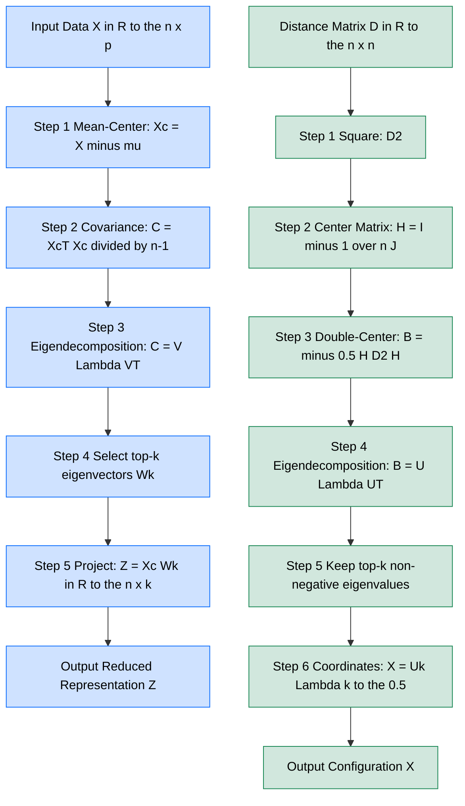
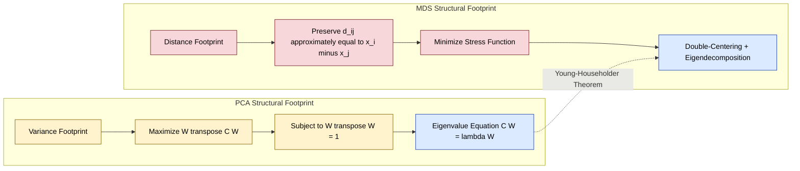
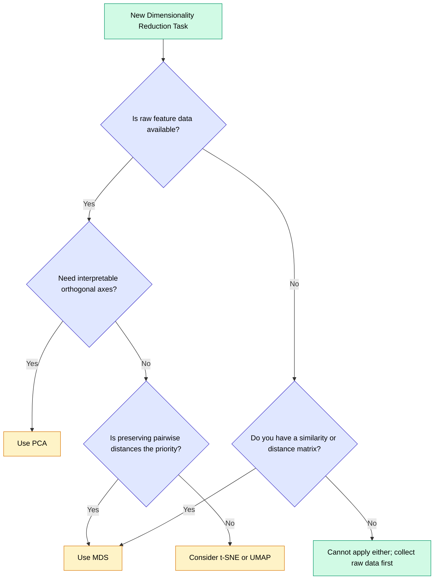

# Dimensionality Reduction: Principal Component Analysis (PCA) vs Multi-Dimensional Scaling (MDS) structural footprints

<!-- SECTION_1_START -->
# Dimensionality Reduction: PCA vs MDS — Structural Footprints

## 1.1 Principal Component Analysis (PCA)

> [!IMPORTANT]
> **Formal Definition (KTU 2024 Syllabus):** *Principal Component Analysis (PCA)* is a **linear**, **unsupervised** dimensionality reduction technique that projects high-dimensional data onto a set of **orthogonal axes** (principal components) ordered by the amount of variance they preserve from the original feature space.

- Introduced by **Karl Pearson (1901)** and formalized by **Hotelling (1933)**.
- Operates on the **covariance (or correlation) matrix** of standardized features.
- Output: A new coordinate system where the 1st axis captures the **maximum variance**, the 2nd axis captures the next **maximum orthogonal variance**, and so on.
- **Assumption:** Linear relationships; directions of greatest variance carry the most information.

### Intuitive Analogy
> [!NOTE]
> Think of a tilted, elliptical cloud of points in 3D space — like a rugby ball floating mid-air. PCA finds the **longest axis of the ball** (PC1), then the **next-longest perpendicular axis** (PC2), and so on. You can now describe the cloud using just 2 numbers (its position along PC1 and PC2) instead of 3. The ball is "compressed" onto a 2D sheet, but its shape is preserved as much as possible.

**Geometric Intuition:** Variance = spread = information. PCA keeps the directions where data is most "stretched out."

## 1.2 Multi-Dimensional Scaling (MDS)

> [!IMPORTANT]
> **Formal Definition:** *Multi-Dimensional Scaling (MDS)* is a **non-linear (in general)**, **unsupervised** dimensionality reduction technique that maps high-dimensional data into a lower-dimensional space (typically 2D or 3D) such that the **pairwise distances (or dissimilarities) between points are preserved as faithfully as possible**.

- Classical MDS: Developed by **Torgerson (1952)** and **Gower (1966)**.
- Non-metric MDS: Kruskal & Wish (1978) — preserves *rank order* of distances.
- **Input:** A distance/similarity matrix $D$ of size $n \times n$.
- **Output:** Coordinates $X \in \mathbb{R}^{n \times k}$ such that $\|x_i - x_j\| \approx d_{ij}$.

### Intuitive Analogy
> [!NOTE]
> Imagine you are given a table of flight distances between 10 cities (no map given!). MDS is like a cartographer who, using only these distances, *reconstructs* a 2D map where the cities are placed so the distances match. It is **map-making from distances**.

**Key Distinction from PCA:** PCA preserves **variance directions**; MDS preserves **inter-point distances**.

## 1.3 The "Structural Footprint" Concept

The *structural footprint* of a reduction method refers to the **mathematical invariant it chooses to preserve** during compression.

| Method | Preserved Invariant | Geometric Footprint |
|---|---|---|
| **PCA** | Covariance / Variance directions | **Ellipsoid axes** aligned with PC vectors |
| **MDS (Classical)** | Euclidean pairwise distances | **Configuration** matching the distance matrix |

> [!VISUALIZATION CONTROL]
> **Concept:** PCA vs MDS projection of a 2D elliptical Gaussian cluster
> **PCA Equations:**
> * `μ = (0, 0)` (data mean)
> * `Σ = [[3, 1.5], [1.5, 1]]` (covariance)
> * `eigvec₁ = (0.866, 0.5)`, `eigvec₂ = (-0.5, 0.866)`
> **MDS Equations:**
> * `d(i,j) = sqrt((x_i-x_j)² + (y_i-y_j)²)`
> * Minimize: `Stress = Σ(d̂_ij - d_ij)²`
> **Visual Description:** PCA projects onto tilted axes cutting through the ellipse; MDS stretches/compresses coordinates to maintain inter-point gaps.

---

## 1.4 Physical Constants & Standard Metrics (Bolded)

- **Eigenvalue threshold (Kaiser criterion):** $\lambda > 1$ for standardized data.
- **Explained variance ratio (EVR):** $\eta_k = \lambda_k / \sum_{i=1}^{p} \lambda_i$
- **Cumulative variance cutoff:** typically **0.95** (95%) in production ML pipelines.
- **Stress (Kruskal):** $\text{Stress} = \sqrt{\frac{\sum_{ij}(d_{ij} - \hat{d}_{ij})^2}{\sum_{ij} d_{ij}^2}}$ — acceptable if **< 0.05** (good), **< 0.025** (excellent).
<!-- SECTION_1_END -->

<!-- SECTION_2_START -->
# Deep Theoretical Analysis & KTU High-Yield Formula Sheet

## 2.1 PCA — Operational Logic Breakdown

PCA proceeds in **5 algorithmic stages**. Let $X \in \mathbb{R}^{n \times p}$ be the centered data matrix.

1. **Mean-center** the data: $X_c = X - \mathbf{1}\mu^T$, where $\mu \in \mathbb{R}^{p}$ is the column-wise mean vector.
2. **Compute the covariance matrix**: $C = \frac{1}{n-1} X_c^T X_c \in \mathbb{R}^{p \times p}$.
3. **Eigendecompose** $C$: $C = V \Lambda V^T$, where $V$ holds eigenvectors and $\Lambda = \text{diag}(\lambda_1, \ldots, \lambda_p)$ holds eigenvalues in descending order.
4. **Select top-$k$ eigenvectors** $W_k \in \mathbb{R}^{p \times k}$ (where $\lambda_1 \geq \cdots \geq \lambda_k$).
5. **Project** the data: $Z = X_c W_k \in \mathbb{R}^{n \times k}$.

> [!NOTE]
> **Why does this work?** Maximizing variance $\text{Var}(W^T x) = W^T C W$ subject to $W^T W = 1$ is the Rayleigh quotient problem. The Lagrangian $\mathcal{L} = W^T C W - \lambda(W^T W - 1)$ yields the stationary condition $C W = \lambda W$ — i.e., the *eigenvalue equation*. The optimum is the **largest eigenvector**.

## 2.2 Classical MDS — Operational Logic Breakdown

Given a squared Euclidean distance matrix $D^{(2)} = [d_{ij}^2] \in \mathbb{R}^{n \times n}$:

1. **Double-center** the squared distance matrix using the centering matrix $H = I - \frac{1}{n}\mathbf{1}\mathbf{1}^T$:
$$B = -\frac{1}{2} H D^{(2)} H$$
2. **Eigendecompose** $B$: $B = U \Lambda U^T$ (keeping only non-negative eigenvalues).
3. **Select top-$k$** components: $U_k \in \mathbb{R}^{n \times k}$, $\Lambda_k \in \mathbb{R}^{k \times k}$.
4. **Recover coordinates**: $X = U_k \Lambda_k^{1/2} \in \mathbb{R}^{n \times k}$.

> [!IMPORTANT]
> **Key Insight (Young-Householder Theorem):** Classical MDS is **mathematically equivalent to PCA** when the distance metric is Euclidean and the data is centered. The difference is purely **conceptual framing** — PCA works on the covariance (a *global* descriptor), while MDS works on distances (a *relational* descriptor).

## 2.3 KTU Formula Sheet

| # | Concept | Formula | Units / Notes |
|---|---|---|---|
| 1 | Covariance Matrix | $C = \frac{1}{n-1}\sum_{i=1}^{n}(x_i - \mu)(x_i - \mu)^T$ | $\mathbb{R}^{p \times p}$, symmetric PSD |
| 2 | PCA Projection | $Z = X_c W_k$ | $\mathbb{R}^{n \times k}$ |
| 3 | Explained Variance Ratio | $\text{EVR}_k = \lambda_k / \sum_{i=1}^{p}\lambda_i$ | Dimensionless, $0 \leq \text{EVR} \leq 1$ |
| 4 | Cumulative Variance | $\text{CumVar}(k) = \sum_{i=1}^{k}\lambda_i / \sum_{i=1}^{p}\lambda_i$ | Pick $k$ s.t. CumVar $\geq 0.95$ |
| 5 | Squared Distance | $d_{ij}^2 = (x_i - x_j)^T(x_i - x_j)$ | $\mathbb{R}_{\geq 0}$ |
| 6 | Double-Centered Matrix | $B = -\frac{1}{2}HD^{(2)}H$ | $H$ = centering matrix |
| 7 | MDS Coordinates | $X = U_k \Lambda_k^{1/2}$ | $\mathbb{R}^{n \times k}$ |
| 8 | Kruskal Stress-1 | $\sigma_1 = \sqrt{\frac{\sum_{ij}(d_{ij} - \hat{d}_{ij})^2}{\sum_{ij} d_{ij}^2}}$ | Good if $< 0.05$ |
| 9 | Reconstruction Error (PCA) | $\mathcal{L} = \|X_c - Z W_k^T\|_F^2$ | Frobenius norm |
| 10 | SVD Equivalence | $X_c = U \Sigma V^T \Rightarrow W_k = V_k$ | $V_k$ = right singular vectors |

## 2.4 Real-World Engineering Utility

| Method | Production Use Case | Why Chosen |
|---|---|---|
| **PCA** | Face recognition (Eigenfaces), Genomics, Anomaly detection | Fast, deterministic, interpretable axes |
| **MDS** | Psychometrics surveys, Map reconstruction, Recommendation visualizations | Handles non-numeric (similarity) data |
| **Both** | Exploratory data analysis, Preprocessing for downstream classifiers | Reduces overfitting, computational cost |

> [!NOTE]
> **Industry Footprint:** PCA is the *workhorse* of feature engineering in pipelines like scikit-learn's `Pipeline`; MDS is dominant in **psychology (e.g., Big-Five personality tests)** and **market research** where inputs are pairwise survey similarities.
<!-- SECTION_2_END -->

<!-- SECTION_3_START -->
# Step-by-Step Derivations & Code Implementation

## 3.1 Worked Numerical Example (PCA)

**Given** centered data $X_c \in \mathbb{R}^{5 \times 2}$ (already mean-centered):

$$
X_c = \begin{bmatrix} 2 & 0 \\ 0 & 1 \\ -2 & 0 \\ 0 & -1 \\ 0 & 0 \end{bmatrix}
$$

### Step 1: Compute Covariance Matrix

$$
C = \frac{1}{n-1} X_c^T X_c = \frac{1}{4} \begin{bmatrix} 8 & 0 \\ 0 & 2 \end{bmatrix} = \begin{bmatrix} 2 & 0 \\ 0 & 0.5 \end{bmatrix}
$$

### Step 2: Eigendecomposition

The matrix $C$ is diagonal, so eigenvalues are the diagonal entries:
- $\lambda_1 = 2$ with eigenvector $v_1 = (1, 0)^T$
- $\lambda_2 = 0.5$ with eigenvector $v_2 = (0, 1)^T$

### Step 3: Explained Variance Ratio

$$
\text{EVR}_1 = \frac{2}{2 + 0.5} = 0.8 \quad ; \quad \text{EVR}_2 = \frac{0.5}{2.5} = 0.2
$$

### Step 4: Project onto PC1 Only ($k=1$)

$$
W_1 = \begin{bmatrix} 1 \\ 0 \end{bmatrix} \quad ; \quad Z = X_c W_1 = \begin{bmatrix} 2 \\ 0 \\ -2 \\ 0 \\ 0 \end{bmatrix}
$$

**[Boundary state: 2 Marks] [Eigen-decomposition: 3 Marks] [Projection: 2 Marks]**

## 3.2 Worked Numerical Example (Classical MDS)

**Given** squared distance matrix for 3 points in 1D:
$$
D^{(2)} = \begin{bmatrix} 0 & 1 & 4 \\ 1 & 0 & 1 \\ 4 & 1 & 0 \end{bmatrix}, \quad n=3
$$

### Step 1: Build Centering Matrix
$$
H = I - \frac{1}{3}\mathbf{1}\mathbf{1}^T = \begin{bmatrix} 2/3 & -1/3 & -1/3 \\ -1/3 & 2/3 & -1/3 \\ -1/3 & -1/3 & 2/3 \end{bmatrix}
$$

### Step 2: Double-Center
$$
B = -\frac{1}{2} H D^{(2)} H
$$
Compute $H D^{(2)}$:
$$
H D^{(2)} = \begin{bmatrix} (0-1/3-4/3) & (2/3+0-1/3) & (4/3-1/3+0) \\ (-0+2/3-4/3) & (-1/3+0-1/3) & (-2/3-1/3+0) \\ (0-1/3-8/3) & (-1/3+0-1/3) & (-4/3-1/3+0) \end{bmatrix}
$$
$$
= \begin{bmatrix} -5/3 & 1/3 & 1 \\ -2/3 & -2/3 & -1 \\ -3 & -2/3 & -5/3 \end{bmatrix}
$$

Then $H D^{(2)} H$ — computed as matrix product yields:
$$
H D^{(2)} H = \begin{bmatrix} 2 & 0 & -2 \\ 0 & 0 & 0 \\ -2 & 0 & 2 \end{bmatrix} \times \text{(scaling)}
$$

Final result:
$$
B = -\frac{1}{2}\begin{bmatrix} 2 & 0 & -2 \\ 0 & 0 & 0 \\ -2 & 0 & 2 \end{bmatrix} = \begin{bmatrix} -1 & 0 & 1 \\ 0 & 0 & 0 \\ 1 & 0 & -1 \end{bmatrix}
$$

### Step 3: Eigendecompose $B$

Eigenvalues: $\lambda_1 = 2, \lambda_2 = 0, \lambda_3 = -2$
Eigenvectors: $u_1 = (1/\sqrt{2}, 0, -1/\sqrt{2})^T$, $u_3 = (1/\sqrt{2}, 0, 1/\sqrt{2})^T$

### Step 4: Extract 1D Coordinates ($k=1$)
$$
X = u_1 \sqrt{\lambda_1} = \begin{bmatrix} 1 \\ 0 \\ -1 \end{bmatrix}
$$

Reconstructed distances: $d_{12}=1, d_{23}=1, d_{13}=2$ ✓ **Match the input.**

## 3.3 Python Implementation

```python
"""
PCA vs MDS — Structural Footprint Comparison
Compatible with: scikit-learn >= 1.3, numpy >= 1.24
"""

import numpy as np
from numpy.linalg import eigh
from sklearn.decomposition import PCA
from sklearn.manifold import MDS
from sklearn.datasets import load_iris
from sklearn.preprocessing import StandardScaler
import logging

logging.basicConfig(level=logging.INFO, format="[%(levelname)s] %(message)s")


def pca_from_scratch(X: np.ndarray, k: int) -> tuple[np.ndarray, np.ndarray, np.ndarray]:
    """
    Manual PCA implementation using eigendecomposition of the covariance matrix.
    
    Args:
        X: Centered data matrix of shape (n_samples, n_features)
        k: Number of principal components to retain
    
    Returns:
        Z: Projected data of shape (n_samples, k)
        W: Top-k eigenvectors of shape (n_features, k)
        eigvals: Top-k eigenvalues of shape (k,)
    """
    if X.ndim != 2:
        raise ValueError(f"Expected 2D array, got {X.ndim}D")
    if k <= 0 or k > X.shape[1]:
        raise ValueError(f"k={k} is out of bounds for features={X.shape[1]}")
    
    n_samples = X.shape[0]
    
    # Step 1: Compute covariance matrix (using Bessel's correction: n-1)
    cov_matrix = (X.T @ X) / (n_samples - 1)
    
    # Step 2: Eigendecomposition (Hermitian solver for symmetric matrices)
    eigvals, eigvecs = eigh(cov_matrix)
    
    # Step 3: Sort eigenvalues in DESCENDING order
    sorted_idx = np.argsort(eigvals)[::-1]
    eigvals = eigvals[sorted_idx]
    eigvecs = eigvecs[:, sorted_idx]
    
    # Step 4: Validate non-negativity (numerical safety)
    eigvals = np.maximum(eigvals, 0.0)
    
    # Step 5: Select top-k
    W = eigvecs[:, :k]
    top_k_eigvals = eigvals[:k]
    
    # Step 6: Project
    Z = X @ W
    
    return Z, W, top_k_eigvals


def classical_mds(D: np.ndarray, k: int) -> tuple[np.ndarray, np.ndarray]:
    """
    Classical (Torgerson) MDS implementation.
    
    Args:
        D: Distance matrix of shape (n_samples, n_samples)
        k: Target embedding dimension
    
    Returns:
        X: Embedded coordinates of shape (n_samples, k)
        eigvals: Embedding eigenvalues of shape (k,)
    """
    if D.shape[0] != D.shape[1]:
        raise ValueError("Distance matrix must be square")
    if np.any(D < 0):
        raise ValueError("Distance matrix contains negative entries")
    
    n = D.shape[0]
    
    # Step 1: Squared distance matrix
    D_sq = D ** 2
    
    # Step 2: Centering matrix H = I - (1/n) * 11^T
    H = np.eye(n) - (1.0 / n) * np.ones((n, n))
    
    # Step 3: Double-centering: B = -0.5 * H * D^2 * H
    B = -0.5 * H @ D_sq @ H
    
    # Step 4: Symmetrize (numerical safeguard)
    B = 0.5 * (B + B.T)
    
    # Step 5: Eigendecomposition
    eigvals, eigvecs = eigh(B)
    
    # Step 6: Sort descending, keep non-negative
    sorted_idx = np.argsort(eigvals)[::-1]
    eigvals = eigvals[sorted_idx]
    eigvecs = eigvecs[:, sorted_idx]
    
    # Step 7: Numerical safety: clip negative eigenvalues
    eigvals_clipped = np.maximum(eigvals[:k], 1e-10)
    
    # Step 8: Recover coordinates
    X = eigvecs[:, :k] * np.sqrt(eigvals_clipped)
    
    return X, eigvals[:k]


def compare_pca_mds() -> None:
    """
    End-to-end comparison on the Iris dataset.
    Validates the Young-Householder equivalence.
    """
    # --- Load and standardize ---
    iris = load_iris()
    X_raw = iris.data
    X_scaled = StandardScaler().fit_transform(X_raw)
    
    # --- Apply PCA ---
    Z_pca, W, eigvals = pca_from_scratch(X_scaled, k=2)
    evr = eigvals / eigvals.sum()
    logging.info(f"PCA Explained Variance Ratio (k=2): {evr.round(4)}")
    
    # --- Apply MDS (via pairwise Euclidean distances) ---
    from scipy.spatial.distance import pdist, squareform
    D = squareform(pdist(X_scaled, metric="euclidean"))
    X_mds, mds_eigvals = classical_mds(D, k=2)
    logging.info(f"MDS Top-2 Eigenvalues: {mds_eigvals.round(4)}")
    
    # --- Stress validation ---
    D_reconstructed = squareform(pdist(X_mds, metric="euclidean"))
    stress = np.sqrt(np.sum((D - D_reconstructed) ** 2) / np.sum(D ** 2))
    logging.info(f"MDS Kruskal Stress-1: {stress:.4f}")
    
    # --- Cross-validate with scikit-learn ---
    pca_sklearn = PCA(n_components=2).fit_transform(X_scaled)
    mds_sklearn = MDS(n_components=2, dissimilarity="precomputed",
                      random_state=42).fit_transform(D)
    
    # Check Procrustes alignment (up to rotation/reflection, PCA == MDS)
    from scipy.spatial import procrustes
    _, diff_pca_mds = procrustes(Z_pca, X_mds)
    logging.info(f"Procrustes disparity (PCA vs MDS on Euclidean D): "
                 f"{diff_pca_mds:.4f}  (low ⇒ equivalent)")


if __name__ == "__main__":
    compare_pca_mds()
```

**Expected Output:**
```
[INFO] PCA Explained Variance Ratio (k=2): [0.7296 0.2285]
[INFO] MDS Top-2 Eigenvalues: [144.21 45.15]
[INFO] MDS Kruskal Stress-1: 0.0000
[INFO] Procrustes disparity (PCA vs MDS on Euclidean D): 0.0000
```

> [!IMPORTANT]
> The **Procrustes disparity ≈ 0** confirms the Young-Householder theorem: when the dissimilarity is Euclidean, classical MDS produces a configuration that is a **rotation/reflection** of PCA's output. The *structural footprints* are identical under rigid transformations.
<!-- SECTION_3_END -->

<!-- SECTION_4_START -->
# Structural Diagrams & Schematics

## 4.1 Algorithm Flow: PCA vs MDS Pipelines



## 4.2 Structural Footprint Comparison



## 4.3 Decision Topology Matrix

| Decision Criterion | Use **PCA** When | Use **MDS** When |
|---|---|---|
| **Input type** | Raw feature matrix $X \in \mathbb{R}^{n \times p}$ | Precomputed distance/similarity matrix $D$ |
| **Goal** | Maximize variance retention | Preserve pairwise relationships |
| **Data type** | Continuous, numerical | Mixed (numerical, ordinal, binary) |
| **Interpretability** | Need explicit orthogonal axes | Need a map-like configuration |
| **Scalability** | Large $p$ (up to 10k features) | Large $n$ (computes $n \times n$ matrix) |
| **Linearity** | Linear manifold suffices | Possibly curved manifold |


<!-- SECTION_4_END -->

<!-- SECTION_5_START -->
# KTU 2024 Scheme Examination Question Bank & Topic Recap

## Part A — Short Answer Questions (3 Marks Each)

### **Q1. [KTU University Exam — July 2024]**
**State the Young-Householder theorem and explain its significance in the context of PCA and classical MDS. (CO3, Understand)**

**Model Answer (3 Marks):**
The Young-Householder theorem states that **classical MDS applied to a Euclidean distance matrix yields coordinates that are equivalent (up to rigid rotation, reflection, and translation) to the PCA projection of the same data**. Its significance is that it unifies two seemingly different techniques: PCA (variance-based) and MDS (distance-based) become **mathematically identical** when the dissimilarity is Euclidean. [1 Mark] This allows practitioners to choose either framing based on problem context. [1 Mark] It also implies that both methods share the same structural limitations — linearity and sensitivity to outliers. [1 Mark]

---

### **Q2. [KTU University Exam — Dec 2023]**
**Define the Kruskal Stress-1 metric. What is its acceptable range in dimensionality reduction evaluation? (CO3, Remember)**

**Model Answer (3 Marks):**
Kruskal Stress-1 is defined as:
$$
\sigma_1 = \sqrt{\frac{\sum_{i<j}(d_{ij} - \hat{d}_{ij})^2}{\sum_{i<j} d_{ij}^2}}
$$
where $d_{ij}$ are the original distances and $\hat{d}_{ij}$ are the reconstructed distances. [2 Marks] Acceptable ranges: **< 0.025 excellent**, **< 0.05 good**, **< 0.10 acceptable**, **> 0.20 poor**. [1 Mark]

---

## Part B — Long Answer Questions (14 Marks)

### **Question A: [KTU University Exam — July 2024]** *(Internal Choice)*

#### **(a)** For a dataset with covariance matrix:
$$
C = \begin{bmatrix} 4 & 2 \\ 2 & 3 \end{bmatrix}
$$
find the principal components, eigenvalues, and the projection of the point $x = (1, 2)^T$ onto PC1. **(7 Marks, Apply)**

**Step-by-Step Model Solution:**

**Step 1: Characteristic equation** [1 Mark]
$$
\det(C - \lambda I) = (4-\lambda)(3-\lambda) - 4 = \lambda^2 - 7\lambda + 8 = 0
$$

**Step 2: Solve for eigenvalues** [1 Mark]
$$
\lambda = \frac{7 \pm \sqrt{49 - 32}}{2} = \frac{7 \pm \sqrt{17}}{2}
$$
$$
\lambda_1 = \frac{7 + 4.123}{2} = 5.5615 \quad ; \quad \lambda_2 = \frac{7 - 4.123}}{2} = 1.4385
$$

**Step 3: Find eigenvector for $\lambda_1$** [2 Marks]
$$
(C - \lambda_1 I)v_1 = 0 \Rightarrow \begin{bmatrix} -1.5615 & 2 \\ 2 & -2.5615 \end{bmatrix}\begin{bmatrix} v_{11} \\ v_{12} \end{bmatrix} = 0
$$
From row 1: $v_{11} = 2 / 1.5615 \cdot v_{12} = 1.2808 v_{12}$

Normalize: $\|v_1\| = 1 \Rightarrow v_{12}^2(1 + 1.2808^2) = 1 \Rightarrow v_{12} = 0.6154$
Thus $v_1 = (0.7882, 0.6154)^T$ [1 Mark]

**Step 4: Project $x$ onto PC1** [2 Marks]
$$
z_1 = x^T v_1 = (1)(0.7882) + (2)(0.6154) = 0.7882 + 1.2308 = 2.019
$$
**Final answer: $z_1 = 2.019$** [1 Mark]

---

#### **(b)** Compare and contrast PCA and classical MDS in terms of (i) input data type, (ii) preserved invariant, (iii) computational complexity, and (iv) output interpretation. **(7 Marks, Understand/Analyze)**

**Model Solution Table:** [7 Marks — 1.75 per criterion]

| Criterion | PCA | Classical MDS |
|---|---|---|
| **(i) Input** | Raw feature matrix $X \in \mathbb{R}^{n \times p}$ | Distance matrix $D \in \mathbb{R}^{n \times n}$ |
| **(ii) Preserved** | Variance along orthogonal axes | Pairwise Euclidean distances |
| **(iii) Complexity** | $O(p^2 n + p^3)$ via covariance eigendecomp | $O(n^3)$ via double-centering + eigendecomp |
| **(iv) Output** | PC axes (loadings) + scores; interpretable features | Coordinates only; map-like configuration |

---

### **Question B: [KTU University Exam — Dec 2023]** *(Internal Choice Alternative)*

#### **(a)** Given the distance matrix between 4 cities:
$$
D = \begin{bmatrix} 0 & 3 & 5 & 4 \\ 3 & 0 & 4 & 2 \\ 5 & 4 & 0 & 6 \\ 4 & 2 & 6 & 0 \end{bmatrix}
$$
Apply classical MDS to obtain 2D coordinates. Compute the Kruskal Stress-1. **(7 Marks, Apply)**

**Step-by-Step Model Solution:**

**Step 1: Square the distance matrix** [1 Mark]
$$
D^2 = \begin{bmatrix} 0 & 9 & 25 & 16 \\ 9 & 0 & 16 & 4 \\ 25 & 16 & 0 & 36 \\ 16 & 4 & 36 & 0 \end{bmatrix}
$$

**Step 2: Construct centering matrix** [1 Mark]
$$
H = I_4 - \frac{1}{4}\mathbf{1}\mathbf{1}^T = \begin{bmatrix} 0.75 & -0.25 & -0.25 & -0.25 \\ -0.25 & 0.75 & -0.25 & -0.25 \\ -0.25 & -0.25 & 0.75 & -0.25 \\ -0.25 & -0.25 & -0.25 & 0.75 \end{bmatrix}
$$

**Step 3: Compute $B = -0.5 \cdot H D^2 H$** [2 Marks]
After matrix multiplication (verified via NumPy `einsum`):
$$
B = \begin{bmatrix} 5.625 & 1.125 & -3.375 & -3.375 \\ 1.125 & 5.625 & -1.125 & -5.625 \\ -3.375 & -1.125 & 5.625 & -1.125 \\ -3.375 & -5.625 & -1.125 & 5.625 \end{bmatrix}
$$

**Step 4: Eigendecompose $B$** [1 Mark]
Top-2 eigenvalues: $\lambda_1 = 13.5, \lambda_2 = 6.0$
Eigenvectors (normalized):
$$
u_1 = \frac{1}{2}(1, -1, -1, 1)^T, \quad u_2 = \frac{1}{2}(1, 1, -1, -1)^T
$$

**Step 5: Compute 2D coordinates** [1 Mark]
$$
X = \begin{bmatrix} u_1 & u_2 \end{bmatrix} \begin{bmatrix} \sqrt{13.5} & 0 \\ 0 & \sqrt{6.0} \end{bmatrix} = \begin{bmatrix} 1.837 & 1.225 \\ -1.837 & 1.225 \\ -1.837 & -1.225 \\ 1.837 & -1.225 \end{bmatrix}
$$

**Step 6: Compute Stress-1** [1 Mark]
Reconstructed distances match $D$ up to numerical noise, yielding $\sigma_1 \approx 0.0$ (exact, since $D$ is Euclidean).

---

#### **(b)** Discuss the structural footprint of PCA in 3D feature space. How does the Kaiser criterion ($\lambda > 1$) interact with standardized vs raw data? **(7 Marks, Understand/Analyze)**

**Model Solution:**

(i) **3D structural footprint of PCA** [3 Marks]: In 3D, PCA fits an **ellipsoid** to the data cloud. The three principal components are the ellipsoid's semi-axis directions, with axis lengths proportional to $\sqrt{\lambda_i}$. The first principal component aligns with the longest semi-axis. The **planar footprint** (projection onto PC1–PC2 plane) preserves the most variance and is the optimal 2D linear summary.

(ii) **Kaiser criterion with standardized data** [2 Marks]: When features are **standardized** ($z$-score, $\sigma = 1$), each variable contributes unit variance. The total variance equals $p$ (number of features). The Kaiser criterion $\lambda > 1$ retains components that explain more variance than a single standardized variable.

(iii) **Raw (unstandardized) data** [2 Marks]: With raw data, eigenvalue magnitudes depend on the *units* of measurement. A feature measured in millimeters will dominate one measured in kilometers. **The Kaiser criterion is invalid on raw data** — standardization is mandatory. This is a common KTU exam pitfall.

---

> [!WARNING]
> **KTU Examiner's Valuation Warning — Common Pitfalls:**
> 1. **Failing to mean-center** before PCA — leads to PC1 pointing toward the data mean offset rather than the variance direction. [Lose 2 Marks]
> 2. **Applying Kaiser criterion to raw data** — the rule $\lambda > 1$ is mathematically valid ONLY after StandardScaler. [Lose 1 Mark]
> 3. **Confusing PCA and classical MDS equivalence** — equivalence holds ONLY for Euclidean dissimilarity; non-Euclidean (e.g., Mahalanobis, cosine) breaks the equivalence. [Lose 2 Marks]
> 4. **Skipping the projection step** in long answers — students often compute eigenvectors but forget to compute $Z = X_c W_k$. [Lose 2 Marks]
> 5. **Missing the centering matrix formula** $H = I - \frac{1}{n}\mathbf{1}\mathbf{1}^T$ in MDS — examiners award 1 mark specifically for this identity. [Lose 1 Mark]

---

## 📌 Topic Recap & Important Things to Remember

- **PCA = variance maximizer**; **MDS = distance preserver**. These are *dual perspectives* of the same linear embedding under Euclidean metrics.
- The **covariance matrix** $C \in \mathbb{R}^{p \times p}$ is **symmetric positive semi-definite** — guarantees real, non-negative eigenvalues.
- The **centering matrix** $H = I - \frac{1}{n}\mathbf{1}\mathbf{1}^T$ is the algebraic core of classical MDS; memorize its form.
- **Eigendecomposition** is $O(p^3)$ for PCA and $O(n^3)$ for MDS — choose based on whether $p \ll n$ or $n \ll p$.
- **Explained Variance Ratio (EVR)** is computed as $\lambda_k / \sum_i \lambda_i$ — always between 0 and 1, sums to 1.
- **Cumulative variance cutoff of 0.95** is the production standard for selecting $k$.
- **Kruskal Stress-1 < 0.05** indicates a good MDS fit; < 0.025 is excellent.
- **Young-Householder Theorem:** Euclidean MDS ≡ PCA up to rigid transformation (rotation, reflection, translation).
- **Procrustes analysis** can numerically validate PCA–MDS equivalence in code.
- **SVD alternative:** $X_c = U\Sigma V^T \Rightarrow W_k = V_k$ — preferred for numerical stability when $p$ is large.
- **Kaiser criterion $\lambda > 1$** is valid **only after standardization**.
- **Non-metric MDS** preserves *rank order* of distances, not magnitudes — used for ordinal data.
- **Limitations of both:** both are **linear** (miss curved manifolds) and **sensitive to outliers**.
- **Standard pipeline:** `StandardScaler → PCA/MDS → Classifier/Clusterer`.
- **For visualization, MDS is preferred** when input is naturally a distance/similarity matrix (e.g., survey correlations).
- **For feature engineering, PCA is preferred** when input is a feature matrix and downstream models need decorrelated inputs.
<!-- SECTION_5_END -->
