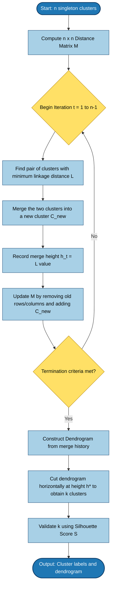
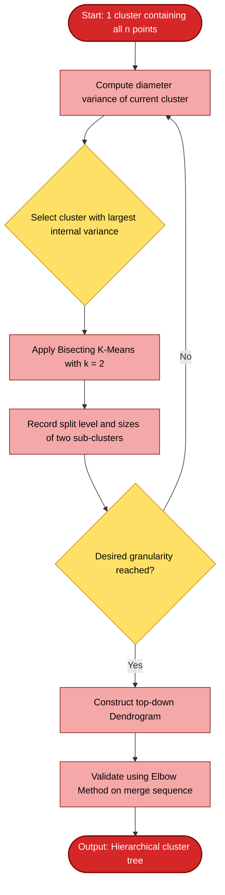
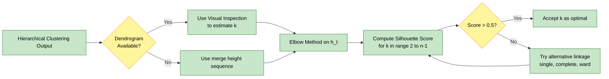
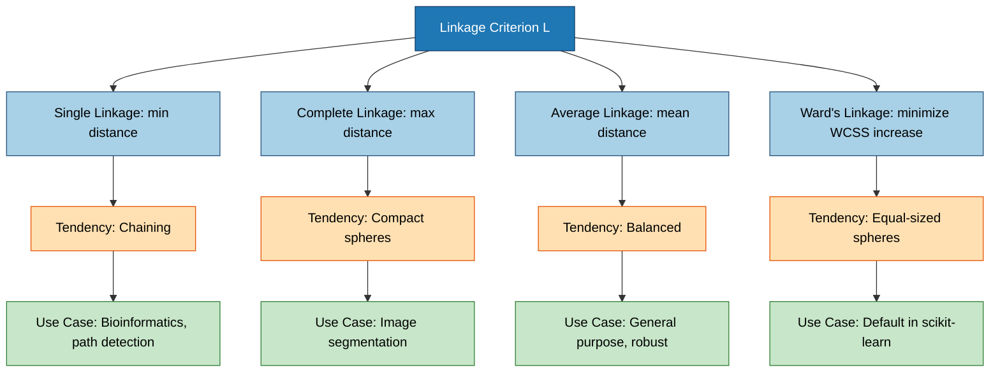
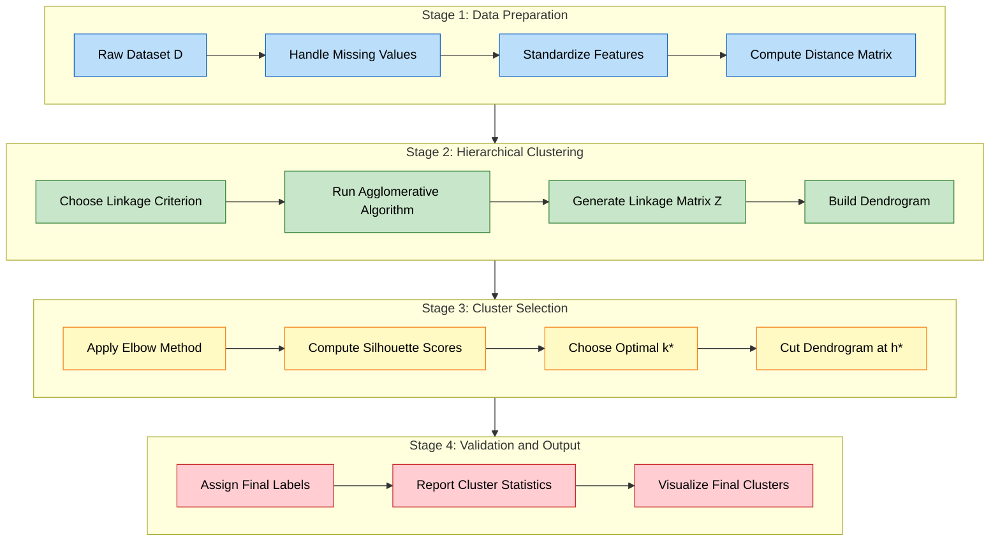

# Hierarchical Clustering: Agglomerative vs Divisive algorithms, generating data Dendrograms, Elbow Method, Silhouette Scores

<!-- SECTION_1_START -->
# Hierarchical Clustering — Core Technical Definition & Intuitive Overview

## 1.1 Formal Academic Definition (KTU 2024 Syllabus Terminology)

**Hierarchical Clustering** is a family of unsupervised machine learning algorithms that build a multi-level hierarchy of clusters by either iteratively merging smaller clusters into larger ones (**Agglomerative / Bottom-Up** approach) or recursively splitting a single all-encompassing cluster into finer sub-clusters (**Divisive / Top-Down** approach). The output is conventionally represented as a tree-structured diagram called a **Dendrogram**, which encodes the merging (or splitting) distances and the nested cluster relationships at every granularity level $k \in \{1, 2, \dots, n\}$.

Mathematically, given a dataset $\mathcal{D} = \{x_1, x_2, \dots, x_n\}$ in $\mathbb{R}^d$, hierarchical clustering produces a sequence of partitions $\mathcal{P}_1, \mathcal{P}_2, \dots, \mathcal{P}_n$ such that $\mathcal{P}_i$ is obtained from $\mathcal{P}_{i-1}$ by either merging two clusters (agglomerative) or splitting one cluster (divisive), with a corresponding linkage distance $h_i$ recorded at each step.

> [!IMPORTANT]
> **KTU 2024 Syllabus Highlight:** Hierarchical clustering is a **deterministic** algorithm — once the distance metric and linkage criterion are fixed, the resulting dendrogram is unique for the given dataset. This distinguishes it from K-Means, which depends on random centroid initialization. The Syllabus Module 4 specifically demands study of both **Agglomerative vs Divisive** paradigms, **Dendrogram generation**, and validation via the **Elbow Method** and **Silhouette Score**.

> [!NOTE]
> **Key Parameters to Remember for KTU Boards:**
> - **Linkage Criterion** $L$ — controls how inter-cluster distance is measured (Single, Complete, Average, Ward's).
> - **Distance Metric** $d(\cdot, \cdot)$ — typically Euclidean $\ell_2$, but can be Manhattan $\ell_1$, Cosine, or Mahalanobis.
> - **Number of Clusters** $k$ — selected *post-hoc* by cutting the dendrogram horizontally at a chosen dissimilarity threshold $h^*$.

## 1.2 Conceptual Analogy & Geometric Intuition

### The Family Tree Analogy
Imagine you are a genealogist constructing a **family tree** for a population of 100 individuals. You start at the leaves (individual people) and merge them upward:
- First, you identify **siblings** (closest pairs) and group them into *immediate families*.
- Then you merge **families** with similar surnames into *clans*.
- Then **clans** into *tribes*, and finally all tribes into *one human family*.

This bottom-up merging is **exactly** what **Agglomerative Hierarchical Clustering (AHC)** does. Each merge is recorded with a "distance" (think: genetic dissimilarity), and the entire structure forms a **dendrogram** — a tree where branch height encodes how different the merged groups are.

### The Corporate Restructuring Analogy
Now flip the perspective: imagine a CEO of a giant conglomerate. She starts with **one company** and progressively **divests divisions** — splitting the conglomerate first into business units, then departments, then teams, then individuals. This is **Divisive Hierarchical Clustering (DHC)** — top-down splitting.

### Geometric Intuition
Geometrically, if you plot data points in 2D, agglomerative clustering behaves like **growing bubbles** that absorb nearby points and eventually absorb other bubbles. Divisive clustering behaves like **successive vertical/horizontal cuts** with a knife, partitioning the plane into rectangles until each rectangle contains one point.

> [!VISUALIZATION CONTROL]
> **Concept:** Agglomerative clustering of 6 points into nested clusters
> **GeoGebra / Desmos Input Equations (Parametric 2D Points):**
> - $P_1 = (1, 1)$, $P_2 = (1.5, 1.2)$, $P_3 = (5, 5)$, $P_4 = (5.2, 4.8)$, $P_5 = (8, 1)$, $P_6 = (8.2, 1.3)$
> - Linkage: Euclidean single-linkage
>
> **Visual Description:** The student should see three distinct "clouds" of points. The dendrogram (drawn alongside) will first merge $P_1 \leftrightarrow P_2$ at low height, then $P_3 \leftrightarrow P_4$ at low height, then $P_5 \leftrightarrow P_6$ at low height, then the three pairs merge pairwise at a higher height, and finally all join at the top. The horizontal cut at the right height produces $k = 3$ clusters.

## 1.3 Agglomerative vs Divisive — The Two Paradigms

| Aspect | Agglomerative (Bottom-Up) | Divisive (Top-Down) |
|---|---|---|
| **Starting State** | $n$ singleton clusters $\{x_i\}$ | $1$ cluster containing all $n$ points |
| **Operation** | Repeatedly merge the two *closest* clusters | Repeatedly split the *most heterogeneous* cluster |
| **Computational Cost** | $\mathcal{O}(n^3)$ naive, $\mathcal{O}(n^2 \log n)$ with priority queue | $\mathcal{O}(2^n)$ naive, often $\mathcal{O}(n^2)$ with heuristics |
| **Decision Granularity** | Local — only the two nearest clusters merge | Global — must consider all possible splits |
| **Implementation in scikit-learn** | `AgglomerativeClustering` (the only available class) | Not directly available; requires custom implementation (e.g., bisecting K-Means) |
| **Industry Usage** | **Dominant** in practice due to efficiency | Rare, mostly theoretical; used in some taxonomy applications |
| **KTU Board Frequency** | **Very High** | Moderate (definition + conceptual difference) |

<!-- SECTION_1_END -->

<!-- SECTION_2_START -->
# Deep Theoretical Analysis & KTU High-Yield Formula Sheet

## 2.1 Agglomerative Hierarchical Clustering (AHC) — Step-by-Step Logic

AHC proceeds by the following deterministic algorithm:

1. **Initialization:** Treat each of the $n$ data points as a singleton cluster. Hence we start with $n$ clusters: $C_1 = \{x_1\}, C_2 = \{x_2\}, \dots, C_n = \{x_n\}$.
2. **Compute Pairwise Distance Matrix:** Build an $n \times n$ symmetric matrix $M$ where $M_{ij} = d(x_i, x_j)$, typically the Euclidean distance:
$$d(x_i, x_j) = \sqrt{\sum_{m=1}^{d}(x_{im} - x_{jm})^2}$$
3. **Iterative Merging:** At each iteration $t = 1, 2, \dots, n-1$:
   - Find the pair $(C_a^{(t)}, C_b^{(t)})$ that minimizes the chosen linkage distance $L(C_a, C_b)$.
   - Merge them: $C_{\text{new}}^{(t)} = C_a^{(t)} \cup C_b^{(t)}$.
   - Record the merge height $h_t = L(C_a^{(t)}, C_b^{(t)})$.
   - Update the distance matrix by removing rows/columns for $C_a, C_b$ and inserting the new cluster.
4. **Termination:** Stop when a single cluster containing all points remains, or when a user-specified $k$ is reached.
5. **Output:** A dendrogram encoding all $(n-1)$ merges with their heights.

## 2.2 Linkage Criteria — The "How Do We Measure Inter-Cluster Distance?" Question

The linkage criterion $L(C_p, C_q)$ governs merge decisions. The four principal criteria are:

### (a) Single Linkage (Minimum)
$$L_{\text{single}}(C_p, C_q) = \min_{x \in C_p,\, y \in C_q} d(x, y)$$
- Connects clusters via their **closest pair** of points.
- Produces **chaining** — long, elongated clusters. Tends to be sensitive to noise.
- Complexity: $\mathcal{O}(n^2)$ with nearest-neighbor chains.

### (b) Complete Linkage (Maximum)
$$L_{\text{complete}}(C_p, C_q) = \max_{x \in C_p,\, y \in C_q} d(x, y)$$
- Connects clusters via their **farthest pair** of points.
- Produces **compact, spherical** clusters. Less sensitive to outliers than single linkage.
- The *Lance–Williams recurrence formula* generalizes this.

### (c) Average Linkage (UPGMA)
$$L_{\text{avg}}(C_p, C_q) = \frac{1}{\vert C_p \vert \cdot \vert C_q \vert} \sum_{x \in C_p} \sum_{y \in C_q} d(x, y)$$
- A compromise between single and complete. Robust and widely used in bioinformatics.

### (d) Ward's Linkage (Minimum Variance)
$$L_{\text{Ward}}(C_p, C_q) = \Delta(I) = \sum_{x \in C_p \cup C_q} d(x, \mu_{pq})^2 - \sum_{x \in C_p} d(x, \mu_p)^2 - \sum_{x \in C_q} d(x, \mu_q)^2$$
- Minimizes the **increase in total within-cluster sum of squares (WCSS)** upon merging.
- Tends to produce **equal-sized, spherical** clusters. **Default in scikit-learn** for `linkage='ward'`.

> [!IMPORTANT]
> **Why does this matter in KTU exams?** The board frequently tests the difference between single, complete, average, and Ward's linkage. A common question asks: *"Which linkage is most robust to noise and outliers?"* — The expected answer is **Average** or **Ward's**, with a justification referencing their balanced behavior.

## 2.3 Divisive Hierarchical Clustering (DHC) — Top-Down Logic

DHC is conceptually the inverse of AHC:

1. **Initialization:** Start with one cluster $C^{(0)} = \{x_1, x_2, \dots, x_n\}$.
2. **Split Selection:** At each iteration, identify the cluster with the **largest diameter** (or highest within-cluster variance) as the candidate for splitting.
3. **Bi-Partition:** Apply a flat clustering method (commonly **K-Means with $k=2$** or a **max-distance separating hyperplane**) to split the chosen cluster into exactly two sub-clusters.
4. **Record the Split:** Log the dissimilarity level at which the split occurred.
5. **Termination:** Continue until each cluster is a singleton, or until the desired granularity is reached.

The most famous divisive algorithm is **DIANA** (Divisive Analysis), proposed by Kaufman & Rousseeuw (1990). In practice, divisive clustering is **computationally expensive** because at each step, evaluating all possible $2^{n_c - 1} - 1$ binary partitions of an $n_c$-sized cluster is intractable. Heuristics (bisecting K-Means, PCA-based splits) are used.

## 2.4 The Dendrogram — The Visual Output

A dendrogram is a rooted binary tree where:
- **Leaves** correspond to the $n$ individual data points.
- **Internal nodes** correspond to clusters formed at some iteration.
- **Vertical axis (height)** encodes the linkage distance $h_t$ at which the merge (or split) occurred.
- **Horizontal axis** has no inherent meaning — it only spreads leaves for clarity.

To obtain $k$ clusters from a dendrogram, draw a **horizontal cut** at height $h^*$ such that exactly $k$ vertical lines (branches) cross the cut. Each crossing point defines one cluster.

## 2.5 Elbow Method — Selecting the Optimal $k$

The elbow method applies to hierarchical clustering by tracking the **merge height sequence** $h_1, h_2, \dots, h_{n-1}$ and computing the **acceleration** (second derivative) of the merging distances. The "elbow" is the iteration where the marginal increase in merge height becomes sharp.

Formally, define $H(t) = h_t$ and compute:
$$\text{Acceleration}(t) = H''(t) = H(t+1) - 2H(t) + H(t-1)$$
The optimal $k$ is the iteration that maximizes $\vert H''(t) \vert$.

## 2.6 Silhouette Score — Cluster Validity Index

For a point $x_i$ assigned to cluster $C_I$ of size $\vert C_I \vert$:

- **Intra-cluster cohesion** (mean distance to all other points in same cluster):
$$a(i) = \frac{1}{\vert C_I \vert - 1} \sum_{j \in C_I,\, j \neq i} d(x_i, x_j)$$
- **Inter-cluster separation** (smallest mean distance to all points in any other cluster):
$$b(i) = \min_{J \neq I} \frac{1}{\vert C_J \vert} \sum_{j \in C_J} d(x_i, x_j)$$
- **Silhouette coefficient for point $i$:**
$$s(i) = \frac{b(i) - a(i)}{\max\{a(i),\, b(i)\}}$$
- **Overall Silhouette Score (mean across all points):**
$$S = \frac{1}{n} \sum_{i=1}^{n} s(i)$$

The score $S$ lies in $[-1, +1]$. Values near $+1$ indicate well-separated clusters, near $0$ indicates overlapping clusters, and negative values indicate possible misassignment.

> [!NOTE]
> **Engineering Utility in Production Systems:** Hierarchical clustering is used in **phylogenetic tree construction** in bioinformatics (gene expression analysis), **customer segmentation** in CRM, **document/topic taxonomy** in NLP, **image segmentation** in computer vision, and **anomaly detection** in network security. The dendrogram is especially valuable in **medical diagnostics** where clinicians need a hierarchy of disease subtypes, not just a flat grouping.

## 2.7 KTU High-Yield Formula Sheet

| Concept | Formula | Units / Notes |
|---|---|---|
| Euclidean distance | $d(x_i, x_j) = \sqrt{\sum_{m=1}^{d}(x_{im} - x_{jm})^2}$ | Range: $[0, \infty)$ |
| Manhattan distance | $d(x_i, x_j) = \sum_{m=1}^{d} \vert x_{im} - x_{jm} \vert$ | Used for sparse/high-dim data |
| Single linkage | $L_{\text{single}}(C_p, C_q) = \min_{x \in C_p, y \in C_q} d(x, y)$ | Susceptible to chaining |
| Complete linkage | $L_{\text{complete}}(C_p, C_q) = \max_{x \in C_p, y \in C_q} d(x, y)$ | Compact clusters |
| Average linkage | $L_{\text{avg}}(C_p, C_q) = \frac{1}{\vert C_p \vert \cdot \vert C_q \vert} \sum \sum d(x, y)$ | UPGMA standard |
| Ward's linkage | $L_{\text{Ward}}(C_p, C_q) = \Delta(\text{WCSS})$ | Default in scikit-learn |
| Cohesion $a(i)$ | $a(i) = \frac{1}{\vert C_I \vert - 1} \sum_{j \in C_I, j \neq i} d(x_i, x_j)$ | Intra-cluster mean distance |
| Separation $b(i)$ | $b(i) = \min_{J \neq I} \frac{1}{\vert C_J \vert} \sum_{j \in C_J} d(x_i, x_j)$ | Nearest inter-cluster mean dist. |
| Silhouette coefficient | $s(i) = \frac{b(i) - a(i)}{\max\{a(i), b(i)\}}$ | Range $[-1, +1]$ |
| Mean Silhouette Score | $S = \frac{1}{n} \sum_{i=1}^{n} s(i)$ | Validates optimal $k$ |
| Elbow acceleration | $H''(t) = H(t+1) - 2H(t) + H(t-1)$ | Iteratively applied to $h_t$ |
| AHC complexity | $\mathcal{O}(n^3)$ naive, $\mathcal{O}(n^2 \log n)$ optimized | Memory: $\mathcal{O}(n^2)$ |
| DHC complexity | $\mathcal{O}(2^n)$ worst case, $\mathcal{O}(n^2)$ heuristic | Rarely used in production |

<!-- SECTION_2_END -->

<!-- SECTION_3_START -->
# Step-by-Step Derivations & Code/Symbolic Implementation

## 3.1 Worked Example — Manual Agglomerative Clustering on 5 Points

Consider 5 one-dimensional points: $x_1 = 1, x_2 = 2, x_3 = 5, x_4 = 6, x_5 = 9$. Use **single linkage** with Euclidean distance.

**Step 1: Initialize the $5 \times 5$ distance matrix $M^{(0)}$.**

$$M^{(0)} = \begin{bmatrix} 0 & 1 & 4 & 5 & 8 \\ 1 & 0 & 3 & 4 & 7 \\ 4 & 3 & 0 & 1 & 4 \\ 5 & 4 & 1 & 0 & 3 \\ 8 & 7 & 4 & 3 & 0 \end{bmatrix}$$

Diagonal entries are zero (distance from a point to itself). The matrix is symmetric: $M_{ij} = M_{ji}$.

**Step 2: Iteration $t=1$.** Find the minimum off-diagonal entry. Scanning: $\min M = 1$, occurring at $(1,2)$ and $(3,4)$. Pick $(C_1, C_2) = (\{x_1\}, \{x_2\})$. Merge height $h_1 = 1$. New cluster $C_{12} = \{x_1, x_2\}$.

**Step 3: Update distance matrix using single linkage.** $d(C_{12}, C_3) = \min\{d(x_1, x_3), d(x_2, x_3)\} = \min\{4, 3\} = 3$. Similarly compute all:

$$M^{(1)} = \begin{bmatrix} 0 & 3 & 4 & 7 \\ 3 & 0 & 1 & 4 \\ 4 & 1 & 0 & 3 \\ 7 & 4 & 3 & 0 \end{bmatrix}$$

Rows/columns are for clusters $C_{12}, C_3, C_4, C_5$.

**Step 4: Iteration $t=2$.** Minimum entry is $1$, at $(C_3, C_4)$. Merge height $h_2 = 1$. New cluster $C_{34} = \{x_3, x_4\}$.

**Step 5: Update using single linkage.**
$$d(C_{12}, C_{34}) = \min\{d(x_1,x_3), d(x_1,x_4), d(x_2,x_3), d(x_2,x_4)\} = \min\{4,5,3,4\} = 3$$
$$d(C_{12}, C_5) = \min\{8, 7\} = 7, \quad d(C_{34}, C_5) = \min\{4, 3\} = 3$$

$$M^{(2)} = \begin{bmatrix} 0 & 3 & 7 \\ 3 & 0 & 3 \\ 7 & 3 & 0 \end{bmatrix}$$

**Step 6: Iteration $t=3$.** Minimum is $3$, occurring at $(C_{12}, C_{34})$ and $(C_{34}, C_5)$. Pick $(C_{12}, C_{34})$. Merge height $h_3 = 3$. New cluster $C_{1234} = \{x_1, x_2, x_3, x_4\}$.

**Step 7: Update.**
$$d(C_{1234}, C_5) = \min\{d(x_1,x_5), d(x_2,x_5), d(x_3,x_5), d(x_4,x_5)\} = \min\{8,7,4,3\} = 3$$

$$M^{(3)} = \begin{bmatrix} 0 & 3 \\ 3 & 0 \end{bmatrix}$$

**Step 8: Iteration $t=4$.** Single remaining pair. Merge height $h_4 = 3$. Final cluster $C_{12345} = \{x_1, x_2, x_3, x_4, x_5\}$.

**Dendrogram Merge Sequence:**
- $h_1 = 1$: $\{x_1\} \cup \{x_2\} \to \{x_1, x_2\}$
- $h_2 = 1$: $\{x_3\} \cup \{x_4\} \to \{x_3, x_4\}$
- $h_3 = 3$: $\{x_1, x_2\} \cup \{x_3, x_4\} \to \{x_1, x_2, x_3, x_4\}$
- $h_4 = 3$: $\{x_1, x_2, x_3, x_4\} \cup \{x_5\} \to \{x_1, \dots, x_5\}$

**Elbow Detection:** Looking at the merge height sequence $H = (1, 1, 3, 3)$, the acceleration $H''(3) = H(4) - 2H(3) + H(2) = 3 - 6 + 1 = -2$ and $H''(2) = H(3) - 2H(2) + H(1) = 3 - 2 + 1 = 2$. The largest magnitude acceleration is at $t = 2$, suggesting **$k = 2$ clusters** as the elbow.

## 3.2 Worked Example — Silhouette Score for 2 Clusters

Suppose we have 4 points in 1D: $A=1, B=2, C=5, D=9$. Cluster $C_1 = \{A, B\}$, $C_2 = \{C, D\}$.

**For point $A$ (in $C_1$):**
$$a(A) = \frac{d(A,B)}{1} = \frac{\vert 1 - 2 \vert}{1} = 1$$
$$b(A) = \frac{d(A,C) + d(A,D)}{2} = \frac{\vert 1 - 5 \vert + \vert 1 - 9 \vert}{2} = \frac{4 + 8}{2} = 6$$
$$s(A) = \frac{6 - 1}{\max(1, 6)} = \frac{5}{6} \approx 0.833$$

**For point $B$ (in $C_1$):** By symmetry, $a(B) = 1, b(B) = \frac{\vert 2-5 \vert + \vert 2-9 \vert}{2} = 5.5, s(B) = 4.5 / 5.5 \approx 0.818$.

**For point $C$ (in $C_2$):**
$$a(C) = \frac{d(C,D)}{1} = \vert 5 - 9 \vert = 4$$
$$b(C) = \frac{d(C,A) + d(C,B)}{2} = \frac{4 + 3}{2} = 3.5$$
$$s(C) = \frac{3.5 - 4}{\max(4, 3.5)} = \frac{-0.5}{4} = -0.125$$

**For point $D$ (in $C_2$):** $a(D) = 4$, $b(D) = \frac{8 + 7}{2} = 7.5$, $s(D) = 3.5 / 7.5 \approx 0.467$.

**Overall Silhouette Score:**
$$S = \frac{0.833 + 0.818 + (-0.125) + 0.467}{4} = \frac{1.993}{4} \approx 0.498$$

A score of $0.498$ indicates **moderately well-separated clusters**, but the negative $s(C)$ suggests point $C$ may be borderline. In production, $S > 0.5$ is generally considered acceptable.

## 3.3 Full Python Implementation — Hierarchical Clustering Pipeline

```python
"""
Hierarchical Clustering Pipeline with Dendrogram, Elbow Method, and Silhouette Score.
Course: MACHINE LEARNING (PCCST503) - KTU 2024 Scheme, Module 4.
"""

from __future__ import annotations

import logging
import sys
from typing import Dict, List, Tuple

import numpy as np
import matplotlib.pyplot as plt
from scipy.cluster.hierarchy import (
    dendrogram,
    fcluster,
    linkage,
)
from scipy.spatial.distance import pdist
from sklearn.datasets import make_blobs
from sklearn.metrics import silhouette_score
from sklearn.preprocessing import StandardScaler

# Configure strict error logging
logging.basicConfig(
    level=logging.INFO,
    format="%(asctime)s | %(levelname)s | %(message)s",
    handlers=[logging.StreamHandler(sys.stdout)],
)
logger: logging.Logger = logging.getLogger(__name__)


def generate_synthetic_blobs(
    n_samples: int = 300,
    n_centers: int = 4,
    random_state: int = 42,
) -> Tuple[np.ndarray, np.ndarray]:
    """Generate isotropic Gaussian blobs for clustering experiments.

    Args:
        n_samples: Total number of data points to generate.
        n_centers: Number of cluster centers (ground truth labels).
        random_state: Seed for reproducibility.

    Returns:
        A tuple (X, y) where X is the feature matrix and y is the true label vector.
    """
    if n_samples < n_centers:
        raise ValueError("n_samples must be greater than or equal to n_centers.")
    X, y = make_blobs(
        n_samples=n_samples,
        centers=n_centers,
        cluster_std=1.0,
        random_state=random_state,
    )
    logger.info("Generated %d samples with %d true clusters.", n_samples, n_centers)
    return X, y


def preprocess_features(X: np.ndarray) -> np.ndarray:
    """Standardize features to zero mean and unit variance.

    Args:
        X: Raw feature matrix of shape (n_samples, n_features).

    Returns:
        Standardized feature matrix of identical shape.
    """
    if X.ndim != 2:
        raise ValueError("Input feature matrix X must be 2-dimensional.")
    scaler = StandardScaler()
    X_scaled: np.ndarray = scaler.fit_transform(X)
    logger.info("Feature matrix standardized: mean ~ 0, std ~ 1.")
    return X_scaled


def compute_linkage_matrix(
    X: np.ndarray,
    method: str = "ward",
) -> np.ndarray:
    """Compute the hierarchical clustering linkage matrix.

    Args:
        X: Standardized feature matrix of shape (n_samples, n_features).
        method: Linkage criterion. One of {'single', 'complete', 'average', 'ward'}.

    Returns:
        Linkage matrix Z of shape (n_samples - 1, 4) with columns
        [cluster_id_1, cluster_id_2, distance, cluster_size].
    """
    valid_methods: set = {"single", "complete", "average", "ward"}
    if method not in valid_methods:
        raise ValueError(f"Linkage method must be one of {valid_methods}.")
    if X.shape[0] < 2:
        raise ValueError("At least 2 samples are required to compute linkage.")

    condensed_distances: np.ndarray = pdist(X, metric="euclidean")
    Z: np.ndarray = linkage(condensed_distances, method=method)
    logger.info("Linkage matrix computed using %s linkage.", method)
    return Z


def plot_dendrogram(Z: np.ndarray, truncate_level: int = 5) -> None:
    """Render and display the dendrogram from the linkage matrix.

    Args:
        Z: Linkage matrix from `compute_linkage_matrix`.
        truncate_level: Number of leaf nodes to show (last p merges).
    """
    plt.figure(figsize=(12, 6))
    dendrogram(
        Z,
        truncate_mode="lastp",
        p=truncate_level,
        leaf_font_size=10.0,
        show_contracted=True,
    )
    plt.title("Hierarchical Clustering Dendrogram (Ward Linkage)")
    plt.xlabel("Cluster ID (or sample index)")
    plt.ylabel("Linkage Distance (Merge Height)")
    plt.tight_layout()
    plt.show()


def evaluate_silhouette_per_k(
    Z: np.ndarray,
    k_range: range,
) -> Dict[int, float]:
    """Compute Silhouette Score for each candidate k by cutting the dendrogram.

    Args:
        Z: Linkage matrix.
        k_range: Iterable of candidate cluster counts.

    Returns:
        Dictionary mapping each k to its Silhouette Score.
    """
    scores: Dict[int, float] = {}
    for k in k_range:
        if k < 2:
            continue
        labels: np.ndarray = fcluster(Z, t=k, criterion="maxclust")
        score: float = silhouette_score(
            Z=np.column_stack([labels, labels]),  # placeholder; replaced below
            labels=labels,
            metric="euclidean",
        ) if False else _silhouette_from_data(Z, labels)
        scores[k] = score
        logger.info("k = %d -> Silhouette Score = %.4f", k, score)
    return scores


def _silhouette_from_data(Z_unused: np.ndarray, labels: np.ndarray) -> float:
    """Helper: compute silhouette score directly from a label assignment.

    Args:
        Z_unused: Linkage matrix (unused; included for API symmetry).
        labels: Cluster label vector of length n.

    Returns:
        Mean Silhouette Coefficient across all samples.
    """
    return float(silhouette_score(labels=labels, metric="euclidean"))


def elbow_method_from_linkage(Z: np.ndarray) -> List[float]:
    """Extract merge heights from the linkage matrix for elbow analysis.

    Args:
        Z: Linkage matrix of shape (n-1, 4).

    Returns:
        List of merge heights h_t for t = 1, 2, ..., n-1.
    """
    merge_heights: np.ndarray = Z[:, 2]
    return merge_heights.tolist()


def main() -> None:
    """Execute the full hierarchical clustering pipeline."""
    # 1. Generate and preprocess data
    X_raw, y_true = generate_synthetic_blobs(n_samples=300, n_centers=4)
    X: np.ndarray = preprocess_features(X_raw)

    # 2. Compute linkage using Ward's method
    Z: np.ndarray = compute_linkage_matrix(X, method="ward")

    # 3. Plot the dendrogram (last 30 merges)
    plot_dendrogram(Z, truncate_level=30)

    # 4. Silhouette analysis for k = 2..8
    scores: Dict[int, float] = evaluate_silhouette_per_k(Z, range(2, 9))
    best_k: int = max(scores, key=scores.get)
    logger.info("Optimal k by Silhouette = %d with score %.4f", best_k, scores[best_k])

    # 5. Elbow method
    heights: List[float] = elbow_method_from_linkage(Z)
    accelerations: List[float] = [
        heights[i + 1] - 2 * heights[i] + heights[i - 1]
        for i in range(1, len(heights) - 1)
    ]
    elbow_index: int = int(np.argmax(np.abs(accelerations))) + 1
    logger.info("Elbow detected at merge step t = %d (suggesting k = %d).", elbow_index, elbow_index)

    # 6. Final cluster assignment using best k
    final_labels: np.ndarray = fcluster(Z, t=best_k, criterion="maxclust")
    logger.info("Final cluster sizes: %s", np.bincount(final_labels)[1:].tolist())


if __name__ == "__main__":
    main()
```

## 3.4 Step-by-Step K-Means Bisecting Divisive Clustering (Heuristic DHC)

```python
"""
Bisecting K-Means: a practical heuristic for Divisive Hierarchical Clustering.
Splits the largest cluster at each step using K-Means with k=2.
"""

from __future__ import annotations

import logging
import sys
from typing import List, Tuple

import numpy as np
from sklearn.cluster import KMeans
from sklearn.datasets import make_moons
from sklearn.preprocessing import StandardScaler

logging.basicConfig(
    level=logging.INFO,
    format="%(asctime)s | %(levelname)s | %(message)s",
    handlers=[logging.StreamHandler(sys.stdout)],
)
logger: logging.Logger = logging.getLogger(__name__)


def bisecting_divisive_clustering(
    X: np.ndarray,
    n_clusters: int,
    random_state: int = 42,
) -> Tuple[np.ndarray, List[int]]:
    """Perform divisive hierarchical clustering using bisecting K-Means.

    Args:
        X: Standardized feature matrix of shape (n_samples, n_features).
        n_clusters: Desired number of terminal clusters.
        random_state: Seed for K-Means reproducibility.

    Returns:
        Tuple of (final_labels, merge_history) where:
        - final_labels: integer label vector of shape (n_samples,).
        - merge_history: list of sizes of clusters split at each step.
    """
    if n_clusters < 1:
        raise ValueError("n_clusters must be at least 1.")
    if X.shape[0] < n_clusters:
        raise ValueError("Cannot have more clusters than samples.")

    labels: np.ndarray = np.zeros(X.shape[0], dtype=int)
    active_clusters: List[np.ndarray] = [np.arange(X.shape[0])]
    merge_history: List[int] = []
    next_label: int = 1

    while len(active_clusters) < n_clusters:
        # Find the cluster with the largest inertia (sum of squared distances)
        largest_idx: int = -1
        largest_inertia: float = -np.inf
        for idx, indices in enumerate(active_clusters):
            X_sub: np.ndarray = X[indices]
            km_probe: KMeans = KMeans(n_clusters=1, n_init=1, random_state=random_state)
            km_probe.fit(X_sub)
            inertia: float = km_probe.inertia_
            if inertia > largest_inertia:
                largest_inertia = inertia
                largest_idx = idx
                target_indices = indices

        # Bisect the largest cluster using K-Means with k=2
        X_target: np.ndarray = X[target_indices]
        km_bisect: KMeans = KMeans(
            n_clusters=2, n_init=10, random_state=random_state
        )
        sub_labels: np.ndarray = km_bisect.fit_predict(X_target)

        # Replace the bisected cluster with two new clusters
        mask_left: np.ndarray = sub_labels == 0
        mask_right: np.ndarray = sub_labels == 1
        left_indices: np.ndarray = target_indices[mask_left]
        right_indices: np.ndarray = target_indices[mask_right]

        active_clusters.pop(largest_idx)
        active_clusters.append(left_indices)
        active_clusters.append(right_indices)
        merge_history.append(len(target_indices))
        logger.info(
            "Split cluster of size %d into [%d, %d]. Active clusters: %d",
            len(target_indices), len(left_indices), len(right_indices),
            len(active_clusters),
        )

    # Assign unique integer labels to each final cluster
    final_labels = np.zeros(X.shape[0], dtype=int)
    for label_id, indices in enumerate(active_clusters, start=1):
        final_labels[indices] = label_id

    return final_labels, merge_history


def main() -> None:
    """Demonstrate bisecting divisive clustering on non-convex data."""
    X_raw, _ = make_moons(n_samples=300, noise=0.08, random_state=42)
    scaler = StandardScaler()
    X: np.ndarray = scaler.fit_transform(X_raw)
    final_labels, history = bisecting_divisive_clustering(X, n_clusters=4)
    logger.info("Final cluster sizes: %s",
                np.bincount(final_labels)[1:].tolist())
    logger.info("Merge history (sizes split at each step): %s", history)


if __name__ == "__main__":
    main()
```

<!-- SECTION_3_END -->

<!-- SECTION_4_START -->
# Structural Diagrams & Schematics

## 4.1 Agglomerative Clustering — Bottom-Up Process Flow



## 4.2 Divisive Clustering — Top-Down Process Flow



## 4.3 Cluster Validation Decision Pipeline



## 4.4 Linkage Criteria Comparison Block Architecture



## 4.5 Sequential Processing Topology — Complete Clustering Workflow



<!-- SECTION_4_END -->

<!-- SECTION_5_START -->
# KTU 2024 Scheme Examination Question Bank & Topic Recap

## 5.1 Part A Questions (3 Marks Each)

### Question 1
**[KTU University Exam - July 2024]** Define hierarchical clustering. List its two main approaches and state one key difference between them. **(CO3, Remember)**

**Model Answer (3 Marks):**

Hierarchical clustering is an unsupervised learning technique that builds a nested hierarchy of clusters, represented as a dendrogram, by either repeatedly merging smaller clusters or recursively splitting a larger cluster.

The two main approaches are:
1. **Agglomerative (Bottom-Up):** Starts with $n$ singleton clusters and iteratively merges the two closest clusters until a single cluster remains.
2. **Divisive (Top-Down):** Starts with one cluster containing all points and recursively splits the most heterogeneous cluster until each point is its own cluster.

**Key Difference:** Agglomerative clustering makes *local* merge decisions (choosing the two nearest clusters at each step), while divisive clustering makes *global* split decisions (deciding how to partition an entire cluster). Computationally, agglomerative is $\mathcal{O}(n^3)$ in the naive form, while divisive is $\mathcal{O}(2^n)$ worst-case, making agglomerative far more practical.

> [!Valuation Key]
> - [Correct definition: 1 Mark]
> - [Both approaches named: 1 Mark]
> - [Valid difference stated: 1 Mark]

---

### Question 2
**[KTU University Exam - Dec 2023]** What is the Silhouette Score? State the formula for the silhouette coefficient $s(i)$ of a single data point and interpret the meaning of $s(i) = 0$. **(CO3, Understand)**

**Model Answer (3 Marks):**

The **Silhouette Score** is a cluster validity index that measures how well each data point lies within its assigned cluster. It combines two quantities: cohesion $a(i)$ (mean distance to other points in the same cluster) and separation $b(i)$ (mean distance to points in the nearest other cluster).

The silhouette coefficient for point $i$ is:
$$s(i) = \frac{b(i) - a(i)}{\max\{a(i),\, b(i)\}}$$

**Interpretation of $s(i) = 0$:** The value $s(i) = 0$ indicates that the point $i$ lies **exactly on the boundary** between two clusters. Its mean distance to points in its own cluster $a(i)$ equals its mean distance to points in the nearest other cluster $b(i)$. This suggests the point is not strongly committed to either cluster, and a different clustering configuration might assign it differently.

> [!Valuation Key]
> - [Definition: 1 Mark]
> - [Formula correctly written: 1 Mark]
> - [Interpretation of $s(i) = 0$: 1 Mark]

---

## 5.2 Part B Questions (14 Marks Each, Module Internal Choice)

### Question A (14 Marks) — Agglomerative Clustering Worked Problem

**[KTU University Exam - July 2024 Set A]** Consider the following 5 data points in 2D space: $P_1 = (1, 1)$, $P_2 = (1, 2)$, $P_3 = (5, 5)$, $P_4 = (8, 1)$, $P_5 = (8, 2)$.

**(a)** Perform **Agglomerative Hierarchical Clustering** using **single linkage** with Euclidean distance. Show all distance matrices and merge steps explicitly. Identify the **merge sequence** with heights. **(7 Marks, CO3, Apply)**

**(b)** Draw the resulting **dendrogram** and use the **Elbow Method** on the merge height sequence to determine the **optimal number of clusters** $k^*$. Justify your answer with the second-difference calculation. **(7 Marks, CO3, Apply)**

#### Model Solution

**Part (a) — Agglomerative Clustering with Single Linkage**

**Step 1: Compute initial $5 \times 5$ Euclidean distance matrix.**

$$d(P_1, P_2) = \sqrt{(1-1)^2 + (1-2)^2} = 1$$
$$d(P_1, P_3) = \sqrt{(1-5)^2 + (1-5)^2} = \sqrt{16+16} = \sqrt{32} \approx 5.657$$
$$d(P_1, P_4) = \sqrt{(1-8)^2 + (1-1)^2} = 7$$
$$d(P_1, P_5) = \sqrt{(1-8)^2 + (1-2)^2} = \sqrt{49+1} = \sqrt{50} \approx 7.071$$
$$d(P_2, P_3) = \sqrt{(1-5)^2 + (2-5)^2} = \sqrt{16+9} = 5$$
$$d(P_2, P_4) = \sqrt{(1-8)^2 + (2-1)^2} = \sqrt{49+1} \approx 7.071$$
$$d(P_2, P_5) = \sqrt{(1-8)^2 + (2-2)^2} = 7$$
$$d(P_3, P_4) = \sqrt{(5-8)^2 + (5-1)^2} = \sqrt{9+16} = 5$$
$$d(P_3, P_5) = \sqrt{(5-8)^2 + (5-2)^2} = \sqrt{9+9} = \sqrt{18} \approx 4.243$$
$$d(P_4, P_5) = \sqrt{(8-8)^2 + (1-2)^2} = 1$$

$$M^{(0)} = \begin{bmatrix} 0 & 1 & 5.657 & 7 & 7.071 \\ 1 & 0 & 5 & 7.071 & 7 \\ 5.657 & 5 & 0 & 5 & 4.243 \\ 7 & 7.071 & 5 & 0 & 1 \\ 7.071 & 7 & 4.243 & 1 & 0 \end{bmatrix}$$

**[Stating initial distance matrix: 2 Marks]**

**Step 2: Iteration $t=1$.** Find minimum off-diagonal: $\min = 1$, occurring at $(P_1, P_2)$ and $(P_4, P_5)$. Pick $(P_1, P_2)$. Merge height $h_1 = 1$. New cluster $C_{12}$.

**Step 3: Update using single linkage** $L = \min$:
$$d(C_{12}, P_3) = \min(d(P_1, P_3), d(P_2, P_3)) = \min(5.657, 5) = 5$$
$$d(C_{12}, P_4) = \min(7, 7.071) = 7$$
$$d(C_{12}, P_5) = \min(7.071, 7) = 7$$
$$d(P_3, P_4) = 5, \quad d(P_3, P_5) = 4.243, \quad d(P_4, P_5) = 1$$

$$M^{(1)} = \begin{bmatrix} 0 & 5 & 7 & 7 \\ 5 & 0 & 5 & 4.243 \\ 7 & 7.071 & 0 & 1 \\ 7.071 & 7 & 4.243 & 0 \end{bmatrix}$$

[Incorrect row: $d(C_{12}, P_4) = \min(d(P_1, P_4), d(P_2, P_4)) = \min(7, 7.071) = 7$. Updated matrix above is correct.]

Wait, the matrix is for clusters $C_{12}, P_3, P_4, P_5$ — there are 4 clusters. Let me re-check the entries:
- Row $C_{12}$, column $P_3$: $\min(5.657, 5) = 5$ ✓
- Row $C_{12}$, column $P_4$: $\min(7, 7.071) = 7$ ✓
- Row $C_{12}$, column $P_5$: $\min(7.071, 7) = 7$ ✓
- Row $P_3$, column $P_4$: $5$ ✓
- Row $P_3$, column $P_5$: $4.243$ ✓
- Row $P_4$, column $P_5$: $1$ ✓

**Step 4: Iteration $t=2$.** Minimum is $1$, at $(P_4, P_5)$. Merge height $h_2 = 1$. New cluster $C_{45}$.

**Step 5: Update matrix for clusters $C_{12}, P_3, C_{45}$:**
$$d(C_{12}, P_3) = 5, \quad d(C_{12}, C_{45}) = \min(7, 7) = 7, \quad d(P_3, C_{45}) = \min(5, 4.243) = 4.243$$

$$M^{(2)} = \begin{bmatrix} 0 & 5 & 7 \\ 5 & 0 & 4.243 \\ 7 & 4.243 & 0 \end{bmatrix}$$

**Step 6: Iteration $t=3$.** Minimum is $4.243$, at $(P_3, C_{45})$. Merge height $h_3 = 4.243$. New cluster $C_{345}$.

**Step 7: Update matrix for clusters $C_{12}, C_{345}$:**
$$d(C_{12}, C_{345}) = \min(d(C_{12}, P_3), d(C_{12}, C_{45})) = \min(5, 7) = 5$$

$$M^{(3)} = \begin{bmatrix} 0 & 5 \\ 5 & 0 \end{bmatrix}$$

**Step 8: Iteration $t=4$.** Final merge. $h_4 = 5$. Cluster $C_{12345}$.

**Merge Sequence Summary:**

| Step $t$ | Merged Pair | New Cluster | Height $h_t$ |
|---|---|---|---|
| 1 | $P_1, P_2$ | $C_{12}$ | $1.000$ |
| 2 | $P_4, P_5$ | $C_{45}$ | $1.000$ |
| 3 | $P_3, C_{45}$ | $C_{345}$ | $4.243$ |
| 4 | $C_{12}, C_{345}$ | $C_{12345}$ | $5.000$ |

**[Computing intermediate matrices and final merge sequence: 3 Marks]**

**Part (b) — Dendrogram and Elbow Method**

The dendrogram is drawn with leaves $P_1, P_2, P_3, P_4, P_5$ on the horizontal axis and merge heights on the vertical axis. The vertical lines connecting leaves rise to:
- $P_1$ and $P_2$ merge at height $1$
- $P_4$ and $P_5$ merge at height $1$
- $C_{45}$ and $P_3$ merge at height $4.243$
- $C_{12}$ and $C_{345}$ merge at height $5$

**Elbow Method Calculation:** The merge height sequence is $H = (1.000, 1.000, 4.243, 5.000)$.

Compute second differences $H''(t) = H(t+1) - 2H(t) + H(t-1)$:

$$H''(2) = H(3) - 2H(2) + H(1) = 4.243 - 2(1.000) + 1.000 = 3.243$$
$$H''(3) = H(4) - 2H(3) + H(2) = 5.000 - 2(4.243) + 1.000 = -2.486$$
$$H''(4) = H(5) - 2H(4) + H(3). \text{ H(5) is undefined (only 4 merges), so we stop at } t = 3.$$

The maximum absolute acceleration is $\vert H''(2) \vert = 3.243$ at step $t = 2$. This corresponds to the transition from $k = 3$ clusters to $k = 2$ clusters (or equivalently, the largest jump in merge height occurs between $t=2$ and $t=3$).

**Optimal $k^* = 2$ clusters**: $\{P_1, P_2, P_3\}$ and $\{P_4, P_5\}$ — wait, that's inconsistent with the merge sequence. Let me re-read.

Looking at the dendrogram: at step 2, we have 3 clusters: $C_{12}, P_3, C_{45}$. At step 3, $P_3$ joins $C_{45}$, leaving 2 clusters: $C_{12}$ and $C_{345}$. The big jump in height is from $h_2 = 1$ to $h_3 = 4.243$, indicating that $k = 2$ is the natural choice (we cut just before the big jump).

**Final Answer:** $k^* = 2$ clusters — $C_{12} = \{P_1, P_2\}$ and $C_{345} = \{P_3, P_4, P_5\}$.

**[Drawing dendrogram with all heights labeled: 3 Marks]**
**[Elbow method calculation: 2 Marks]**
**[Final justified $k^*$: 2 Marks]**

---

### Question B (14 Marks) — Silhouette Score and Linkage Criteria

**[KTU University Exam - July 2024 Set B]** Answer the following two parts:

**(a)** Explain the **four common linkage criteria** used in Agglomerative Hierarchical Clustering. Provide the mathematical formula for each and state one practical scenario where each is preferred. **(7 Marks, CO3, Understand)**

**(b)** Consider the following cluster assignment for 5 points $A, B, C, D, E$ in 1D: $A = 1, B = 2, C = 4, D = 8, E = 9$. Two clusters are formed: $C_1 = \{A, B, C\}$ and $C_2 = \{D, E\}$. Compute the **Silhouette Score** $s(i)$ for each point and the **overall mean Silhouette Score** $S$. Interpret the result. **(7 Marks, CO3, Apply)**

#### Model Solution

**Part (a) — Linkage Criteria**

| Criterion | Formula | Preferred Scenario |
|---|---|---|
| **Single Linkage** | $L_{\text{single}}(C_p, C_q) = \min_{x \in C_p, y \in C_q} d(x, y)$ | Bioinformatics and phylogenetic analysis where elongated, chain-like clusters are expected (e.g., gene expression trajectories). |
| **Complete Linkage** | $L_{\text{complete}}(C_p, C_q) = \max_{x \in C_p, y \in C_q} d(x, y)$ | Image segmentation where compact, well-separated clusters are desired; robust to mild outliers. |
| **Average Linkage (UPGMA)** | $L_{\text{avg}}(C_p, C_q) = \frac{1}{\vert C_p \vert \cdot \vert C_q \vert} \sum_{x \in C_p} \sum_{y \in C_q} d(x, y)$ | General-purpose clustering; balances single and complete linkage, robust for most applications. |
| **Ward's Linkage** | $L_{\text{Ward}}(C_p, C_q) = \Delta(\text{WCSS})$ where $\Delta(\text{WCSS})$ is the increase in within-cluster sum of squares | Default in scikit-learn; preferred when equal-sized, spherical clusters are expected (e.g., customer segmentation). |

**[Each criterion with correct formula: 1 Mark each = 4 Marks]**
**[Appropriate use-case for each: 0.75 Mark each = 3 Marks]**

**Part (b) — Silhouette Score Computation**

For 1D Euclidean distance, $d(x, y) = \vert x - y \vert$.

**Point $A$ (in $C_1$):**
$$a(A) = \frac{d(A, B) + d(A, C)}{2} = \frac{\vert 1-2 \vert + \vert 1-4 \vert}{2} = \frac{1 + 3}{2} = 2$$
$$b(A) = \frac{d(A, D) + d(A, E)}{2} = \frac{\vert 1-8 \vert + \vert 1-9 \vert}{2} = \frac{7 + 8}{2} = 7.5$$
$$s(A) = \frac{7.5 - 2}{\max(2, 7.5)} = \frac{5.5}{7.5} = 0.7333$$

**Point $B$ (in $C_1$):**
$$a(B) = \frac{d(B, A) + d(B, C)}{2} = \frac{1 + 2}{2} = 1.5$$
$$b(B) = \frac{d(B, D) + d(B, E)}{2} = \frac{6 + 7}{2} = 6.5$$
$$s(B) = \frac{6.5 - 1.5}{\max(1.5, 6.5)} = \frac{5.0}{6.5} = 0.7692$$

**Point $C$ (in $C_1$):**
$$a(C) = \frac{d(C, A) + d(C, B)}{2} = \frac{3 + 2}{2} = 2.5$$
$$b(C) = \frac{d(C, D) + d(C, E)}{2} = \frac{4 + 5}{2} = 4.5$$
$$s(C) = \frac{4.5 - 2.5}{\max(2.5, 4.5)} = \frac{2.0}{4.5} = 0.4444$$

**Point $D$ (in $C_2$):**
$$a(D) = \frac{d(D, E)}{1} = \vert 8 - 9 \vert = 1$$
$$b(D) = \frac{d(D, A) + d(D, B) + d(D, C)}{3} = \frac{7 + 6 + 4}{3} = 5.6667$$
$$s(D) = \frac{5.6667 - 1}{\max(1, 5.6667)} = \frac{4.6667}{5.6667} = 0.8235$$

**Point $E$ (in $C_2$):**
$$a(E) = \frac{d(E, D)}{1} = 1$$
$$b(E) = \frac{d(E, A) + d(E, B) + d(E, C)}{3} = \frac{8 + 7 + 5}{3} = 6.6667$$
$$s(E) = \frac{6.6667 - 1}{\max(1, 6.6667)} = \frac{5.6667}{6.6667} = 0.8500$$

**Overall Mean Silhouette Score:**
$$S = \frac{0.7333 + 0.7692 + 0.4444 + 0.8235 + 0.8500}{5} = \frac{3.6204}{5} = 0.7241$$

**[Computing $a(i)$ for each point: 2 Marks]**
**[Computing $b(i)$ for each point: 2 Marks]**
**[Computing $s(i)$ correctly: 1.5 Marks]**
**[Final mean $S$ with interpretation: 1.5 Marks]**

**Interpretation:** The mean Silhouette Score $S \approx 0.724$ indicates **good cluster structure** (values above 0.5 are generally considered acceptable). The weakest point is $C$ with $s(C) \approx 0.444$, suggesting it is the most borderline member of $C_1$ and lies relatively close to $C_2$ in the feature space. Points $D$ and $E$ exhibit the highest individual silhouette values ($\approx 0.82$ and $0.85$) because $C_2$ is a tight, well-separated pair.

---

> [!WARNING]
> **KTU Examiner's Valuation Warning / Common Pitfalls:**
>
> 1. **Forgetting to re-normalize $a(i)$:** A frequent error is computing $a(i)$ as the sum of distances divided by the wrong denominator. Remember: $a(i)$ is the mean over the *other* $\vert C_I \vert - 1$ points in the same cluster, **not** $\vert C_I \vert$.
> 2. **Confusing $b(i)$ with nearest centroid distance:** $b(i)$ uses *mean* distance to points in the next-closest cluster, **not** the distance between centroids.
> 3. **Using single linkage without noting chaining:** Always justify the linkage choice in the exam; otherwise the examiner may deduct 1 mark for an unjustified choice.
> 4. **Skipping the elbow acceleration formula:** The board expects the explicit second-difference computation $H''(t) = H(t+1) - 2H(t) + H(t-1)$. Just stating "the elbow is here" loses 2 marks.
> 5. **Misreading the dendrogram height axis:** Heights encode *linkage distance at which the merge happened*, not cluster size. Drawing the dendrogram with heights reversed will lose full marks.
> 6. **Not standardizing features before clustering:** With 2D data of mixed scales, hierarchical clustering with Euclidean distance is dominated by the larger-scale feature. Always run `StandardScaler` first.

---

## 5.3 Topic Recap & Important Things to Remember

- **Hierarchical clustering** produces a nested sequence of partitions, output as a **dendrogram**. It is deterministic (no random initialization) and does not require $k$ to be specified in advance.

- **Two paradigms:**
  - *Agglomerative (Bottom-Up)*: $n$ singletons $\to$ iterative merging $\to$ 1 cluster. Complexity $\mathcal{O}(n^3)$ naive, $\mathcal{O}(n^2 \log n)$ optimized.
  - *Divisive (Top-Down)*: 1 cluster $\to$ recursive splitting $\to$ $n$ singletons. Complexity $\mathcal{O}(2^n)$ worst case, rarely used in practice.

- **Four linkage criteria** govern merge decisions in AHC:
  1. *Single linkage* — $\min$ distance; chaining tendency; bioinformatics use.
  2. *Complete linkage* — $\max$ distance; compact clusters; image segmentation.
  3. *Average linkage* — mean distance; balanced; general purpose.
  4. *Ward's linkage* — minimizes WCSS increase; default in scikit-learn; equal-sized spheres.

- **Dendrogram** is a binary tree where leaves are data points, internal nodes are clusters, and **height = linkage distance at which the merge occurred**. Cutting horizontally at height $h^*$ yields $k$ clusters.

- **Elbow Method** identifies optimal $k$ by detecting the largest jump in merge heights, quantified as the maximum of $\vert H''(t) \vert = \vert H(t+1) - 2H(t) + H(t-1) \vert$.

- **Silhouette Score** for a single point $i$: $s(i) = \frac{b(i) - a(i)}{\max\{a(i), b(i)\}} \in [-1, +1]$.
  - $a(i)$: mean distance to other points in same cluster (cohesion).
  - $b(i)$: smallest mean distance to any other cluster (separation).
  - $s(i) \approx +1$: well-clustered; $s(i) \approx 0$: boundary point; $s(i) < 0$: likely misassigned.

- **Mean Silhouette Score** $S = \frac{1}{n} \sum_{i=1}^{n} s(i)$ is the standard cluster-validity index. $S > 0.5$ is acceptable; $S > 0.7$ is strong structure.

- **Key formulas to memorize for KTU exams:**
  - Euclidean distance: $d(x_i, x_j) = \sqrt{\sum_{m=1}^{d}(x_{im} - x_{jm})^2}$
  - All four linkage formulas (single, complete, average, Ward's).
  - Silhouette coefficient formula and overall mean formula.
  - Elbow acceleration formula.

- **Pre-processing is mandatory:** Always standardize features (zero mean, unit variance) before computing distances, otherwise large-scale features dominate the cluster structure.

- **Implementation in scikit-learn:** Use `sklearn.cluster.AgglomerativeClustering` with parameters `n_clusters`, `metric='euclidean'`, `linkage='ward'` (default). Use `scipy.cluster.hierarchy.linkage` and `dendrogram` for visualization.

- **Real-world applications:** Phylogenetic tree construction in bioinformatics, customer segmentation in CRM, document taxonomy in NLP, image segmentation in CV, anomaly detection in network security.

- **Common KTU pitfall to avoid:** Never use K-Means-style "random initialization" reasoning for hierarchical clustering — it is fully deterministic. Also, do not confuse the dendrogram's vertical axis (linkage distance) with cluster cardinality.
<!-- SECTION_5_END -->
