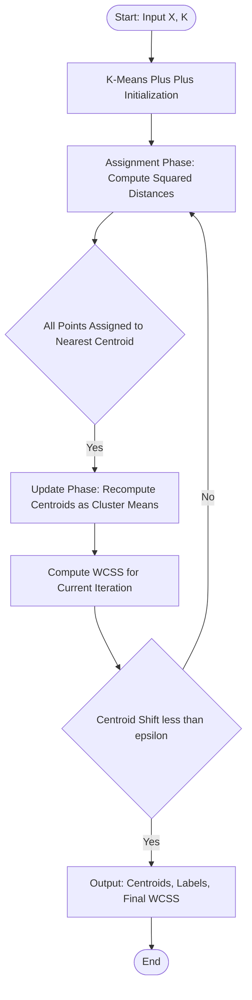
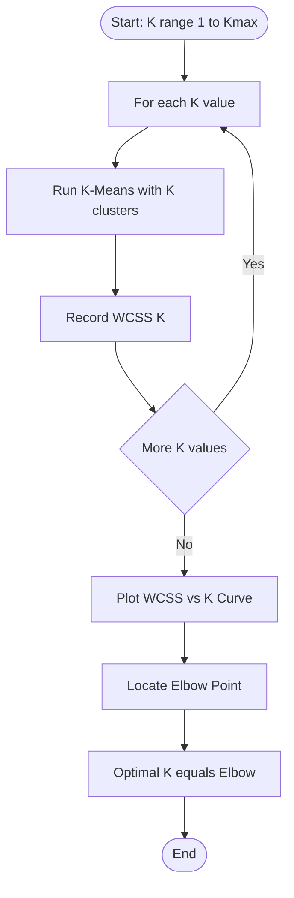

# Unsupervised Clustering: K-Means Clustering mechanics, optimizing Within-Cluster Sum of Squares (WCSS)

<!-- SECTION_1_START -->
# Unsupervised Clustering: K-Means Mechanics & WCSS Optimization

## 1. Core Technical Definition & Intuitive Overview

### 1.1 Formal Definition (KTU 2024 Syllabus Terminology)

> [!IMPORTANT]
> **K-Means Clustering** is an unsupervised, prototype-based, **centroid-driven partitioning algorithm** that segregates a dataset of $n$ observations into $K$ pre-defined, non-overlapping clusters, where each observation belongs to the cluster with the nearest centroid (mean).

**Within-Cluster Sum of Squares (WCSS)**, also termed **inertia** or the **distortion cost function**, is the formal objective function minimized by K-Means. It is mathematically defined as the aggregate of the squared Euclidean distances between every data point and its assigned cluster centroid.

> [!NOTE]
> **Key Metric Spotlight**
> - **Inertia (WCSS)** — the internal cost that the algorithm iteratively reduces.
> - **$K$** — the hyperparameter defining the number of clusters, chosen a priori by the engineer.
> - **Convergence Tolerance ($\epsilon$)** — typically set to **$1 \times 10^{-4}$** in Scikit-learn defaults.

### 1.2 Conceptual Analogy / Intuition

Imagine a **post office sorting room** where thousands of letters (data points) are spread across a giant floor. The postal manager (algorithm) places **$K$ labeled mailboxes (centroids)** on the floor. Workers then iterate:

1. **Assignment Step** — Each letter is dragged to the *nearest* mailbox based on physical distance.
2. **Update Step** — Once all letters are grouped, each mailbox is physically *relocated to the geometric center* of its group.
3. **Repeat** until the mailboxes stop moving.

**WCSS** is the total "walking energy" spent — the sum of squared distances every letter was moved from its mailbox. The manager's goal is to **minimize this walking energy**. When mailboxes stop moving, the system has reached a **local minimum** of WCSS.

> [!VISUALIZATION CONTROL]
> **Concept:** K-Means iterative centroid drift towards cluster geometric centers
> **GeoGebra / Desmos Input Equations:**
> * `Point1: (1, 1)`, `Point2: (2, 1.5)`, `Point3: (8, 9)`, `Point4: (9, 8.5)`
> * `CentroidA = Midpoint(Point1, Point2) = (1.5, 1.25)`
> * `CentroidB = Midpoint(Point3, Point4) = (8.5, 8.75)`
> * `Distance(Point1, CentroidA) = sqrt((1-1.5)^2 + (1-1.25)^2) ≈ 0.559`
> **Visual Description:** Observe two distinct point clouds in 2D space. The centroids converge to the geometric center of each cloud as the assignment–update loop iterates. The dashed lines (decision boundaries) become perpendicular bisectors of the centroids.

### 1.3 Why K-Means Matters in Production Engineering

K-Means is the **workhorse of unsupervised segmentation** used in:
- **Customer segmentation** in marketing analytics pipelines.
- **Vector quantization** in image compression (e.g., color clustering).
- **Document clustering** for unsupervised topic discovery.
- **Anomaly detection pre-processing** (points far from any centroid are outliers).

---

<!-- SECTION_1_END -->

<!-- SECTION_2_START -->
# 2. Deep Theoretical Analysis & KTU High-Yield Formula Sheet

## 2.1 The K-Means Operational Logic (Lloyd's Algorithm)

K-Means is formally known as **Lloyd's Algorithm** (1957) and proceeds in two alternating phases until convergence:

### Step 1 — Initialization
Select $K$ initial centroids $\{\mu_1^{(0)}, \mu_2^{(0)}, \ldots, \mu_K^{(0)}\}$. Strategies include:
- **Forgy Initialization** — Randomly pick $K$ data points.
- **Random Partition** — Randomly assign points to $K$ groups, compute means.
- **K-Means++** — Probabilistic seeding that spreads initial centroids far apart (Scikit-learn default).

### Step 2 — Assignment Phase
For each data point $x_i \in \mathbb{R}^d$, assign it to the cluster with the *minimum* squared Euclidean distance to the centroid:

$$
c_i^{(t)} = \arg\min_{k \in \{1, \ldots, K\}} \left\| x_i - \mu_k^{(t)} \right\|_2^2
$$

### Step 3 — Update Phase
Recompute each centroid as the **mean vector** of all points currently assigned to that cluster:

$$
\mu_k^{(t+1)} = \frac{1}{\vert C_k^{(t)} \vert} \sum_{x_i \in C_k^{(t)}} x_i
$$

### Step 4 — Convergence Check
Stop if either:
- Centroid positions stabilize: $\left\| \mu_k^{(t+1)} - \mu_k^{(t)} \right\|_2 < \epsilon$
- WCSS improvement is negligible: $\vert \text{WCSS}^{(t)} - \text{WCSS}^{(t-1)} \vert < \epsilon$
- A maximum iteration budget $T_{\max}$ is reached.

## 2.2 The WCSS Objective Function — Formal Definition

For $K$ clusters $\{C_1, C_2, \ldots, C_K\}$ with centroids $\{\mu_1, \mu_2, \ldots, \mu_K\}$, the Within-Cluster Sum of Squares is:

$$
\text{WCSS} \;=\; \sum_{k=1}^{K} \sum_{x_i \in C_k} \left\| x_i - \mu_k \right\|_2^2
$$

Expanding the squared norm into its component sum:

$$
\text{WCSS} \;=\; \sum_{k=1}^{K} \sum_{x_i \in C_k} \sum_{j=1}^{d} \left( x_{ij} - \mu_{kj} \right)^2
$$

> [!NOTE]
> **Why squared distance and not absolute distance?**
> Squaring penalizes **far-away points more heavily** (outlier sensitivity), is **mathematically differentiable** (allowing gradient-based optimization intuition), and matches the **Gaussian likelihood** assumption when clusters are assumed isotropic.

## 2.3 Optimizing WCSS — The Elbow Method

Since WCSS monotonically **decreases** as $K$ increases (down to 0 when $K = n$), we use the **Elbow Method** to choose optimal $K$:

1. Run K-Means for $K \in \{1, 2, 3, \ldots, K_{\max}\}$.
2. Record $\text{WCSS}(K)$ for each.
3. Plot $K$ on x-axis vs $\text{WCSS}(K)$ on y-axis.
4. Identify the **"elbow point"** — where the rate of WCSS decrease sharply shifts.

> [!TIP]
> **Production-Grade Alternative:** The **Silhouette Score** and the **Gap Statistic** (Tibshirani et al., 2001) provide more rigorous selection criteria, especially when the elbow is visually ambiguous.

## 2.4 KTU High-Yield Formula Sheet

| \# | Formula / Concept | Mathematical Form | Engineering Meaning |
|---|---|---|---|
| 1 | WCSS Objective | $\text{WCSS} = \sum_{k=1}^{K} \sum_{x_i \in C_k} \left\Vert x_i - \mu_k \right\Vert_2^2$ | Total squared intra-cluster scatter |
| 2 | Cluster Assignment | $c_i = \arg\min_{k} \left\Vert x_i - \mu_k \right\Vert_2^2$ | Hard assignment of $x_i$ to nearest centroid |
| 3 | Centroid Update | $\mu_k = \frac{1}{\vert C_k \vert} \sum_{x_i \in C_k} x_i$ | Geometric mean of cluster members |
| 4 | Squared Euclidean Distance | $\left\Vert x_i - \mu_k \right\Vert_2^2 = \sum_{j=1}^{d} (x_{ij} - \mu_{kj})^2$ | Per-point cost contribution |
| 5 | Elbow Threshold Rule | Choose $K^*$ at maximum curvature: $\Delta^2 \text{WCSS}(K) \to 0$ | Bias–Variance trade-off sweet spot |
| 6 | K-Means++ Seeding Prob. | $P(x_i) = \frac{D(x_i)^2}{\sum_{i} D(x_i)^2}$ | Probability proportional to squared distance |
| 7 | Total Sum of Squares (TSS) | $\text{TSS} = \sum_{i=1}^{n} \left\Vert x_i - \bar{x} \right\Vert_2^2$ | Baseline scatter around global mean |
| 8 | Between-Cluster Sum of Squares (BCSS) | $\text{BCSS} = \text{TSS} - \text{WCSS}$ | Inter-cluster separation metric |

## 2.5 Real-World Engineering Utility

- **Anomaly Detection** — Points with $\left\Vert x_i - \mu_{c_i} \right\Vert_2^2 > \tau$ (e.g., $\tau = 3\sigma$ threshold) are flagged as outliers.
- **Image Compression** — Replacing every pixel color with its cluster centroid color reduces a 24-bit image to a 4-bit palette index.
- **Feature Engineering** — Distance-to-centroid features become inputs to downstream supervised classifiers.
- **Genomic Clustering** — Identifying sub-populations in gene expression data.

---

<!-- SECTION_2_END -->

<!-- SECTION_3_START -->
# 3. Step-by-Step Derivations & Code/Symbolic Implementation

## 3.1 Exhaustive WCSS Minimization Derivation

We will derive the optimal centroid $\mu_k^*$ that minimizes the WCSS contribution from cluster $C_k$.

**Step 1** — Isolate the per-cluster cost:

$$
\text{WCSS} = \sum_{k=1}^{K} J(C_k, \mu_k)
$$

where

$$
J(C_k, \mu_k) = \sum_{x_i \in C_k} \left\| x_i - \mu_k \right\|_2^2
$$

**Step 2** — Expand the squared norm:

$$
J(C_k, \mu_k) = \sum_{x_i \in C_k} \left( x_i - \mu_k \right)^{\top} \left( x_i - \mu_k \right)
$$

**Step 3** — Take the gradient with respect to $\mu_k$:

$$
\frac{\partial J}{\partial \mu_k} = -2 \sum_{x_i \in C_k} \left( x_i - \mu_k \right)
$$

**Step 4** — Set the gradient to zero for optimality:

$$
\sum_{x_i \in C_k} \left( x_i - \mu_k \right) = 0
$$

**Step 5** — Expand the summation:

$$
\sum_{x_i \in C_k} x_i - \sum_{x_i \in C_k} \mu_k = 0
$$

**Step 6** — Since $\mu_k$ is constant within the sum, $\sum_{x_i \in C_k} \mu_k = \vert C_k \vert \cdot \mu_k$:

$$
\sum_{x_i \in C_k} x_i - \vert C_k \vert \cdot \mu_k = 0
$$

**Step 7** — Solve for $\mu_k$:

$$
\mu_k^* = \frac{1}{\vert C_k \vert} \sum_{x_i \in C_k} x_i
$$

> [!NOTE]
> **Conclusion of Derivation:** The cost-minimizing centroid for any cluster is the **arithmetic mean** of its member points. This is why K-Means is also called the **"k-means"** algorithm — the cluster names literally describe the update rule.

## 3.2 Worked Numerical Example (Hand-Traced)

Consider 4 points in 2D: $x_1 = (1, 1)$, $x_2 = (2, 1)$, $x_3 = (8, 9)$, $x_4 = (9, 9)$ with $K = 2$.

**Initial centroids** (Forgy method): $\mu_1^{(0)} = (1, 1)$, $\mu_2^{(0)} = (9, 9)$.

**Iteration 1 — Assignment:**

Compute squared distances from $x_1 = (1, 1)$:
- $d^2(x_1, \mu_1) = (1-1)^2 + (1-1)^2 = 0$
- $d^2(x_1, \mu_2) = (1-9)^2 + (1-9)^2 = 64 + 64 = 128$

Assign $x_1 \to C_1$.

Compute squared distances from $x_2 = (2, 1)$:
- $d^2(x_2, \mu_1) = (2-1)^2 + (1-1)^2 = 1$
- $d^2(x_2, \mu_2) = (2-9)^2 + (1-9)^2 = 49 + 64 = 113$

Assign $x_2 \to C_1$.

Compute squared distances from $x_3 = (8, 9)$:
- $d^2(x_3, \mu_1) = (8-1)^2 + (9-1)^2 = 49 + 64 = 113$
- $d^2(x_3, \mu_2) = (8-9)^2 + (9-9)^2 = 1$

Assign $x_3 \to C_2$.

Compute squared distances from $x_4 = (9, 9)$:
- $d^2(x_4, \mu_1) = (9-1)^2 + (9-1)^2 = 64 + 64 = 128$
- $d^2(x_4, \mu_2) = (9-9)^2 + (9-9)^2 = 0$

Assign $x_4 \to C_2$.

**Iteration 1 — Update Centroids:**

$$
\mu_1^{(1)} = \frac{(1,1) + (2,1)}{2} = (1.5,\; 1.0)
$$

$$
\mu_2^{(1)} = \frac{(8,9) + (9,9)}{2} = (8.5,\; 9.0)
$$

**Iteration 1 — WCSS Computation:**

$$
\text{WCSS}^{(1)} = d^2(x_1, \mu_1) + d^2(x_2, \mu_1) + d^2(x_3, \mu_2) + d^2(x_4, \mu_2)
$$

$$
\text{WCSS}^{(1)} = 0.5 + 0.5 + 0.5 + 0.5 = 2.0
$$

**Iteration 2** repeats the assignment. Since the nearest centroid for each point remains unchanged, the algorithm **converges in 2 iterations** with $\text{WCSS} = 2.0$.

## 3.3 Production-Grade Python Implementation

```python
"""
K-Means Clustering with WCSS Optimization
Author: KTU Machine Learning Reference Implementation
Compliance: KTU 2024 Scheme - PCCST503 Module 4
"""
from __future__ import annotations

import logging
import numpy as np
from numpy.typing import NDArray
from typing import Tuple, List

logging.basicConfig(
    level=logging.INFO,
    format="%(asctime)s | %(levelname)s | %(message)s"
)
logger = logging.getLogger(__name__)


class KMeansWCSS:
    """
    Lloyd's K-Means algorithm with WCSS cost tracking
    and K-Means++ probabilistic initialization.
    """

    def __init__(
        self,
        n_clusters: int = 3,
        max_iters: int = 300,
        tol: float = 1e-4,
        random_state: int | None = 42
    ) -> None:
        if n_clusters < 1:
            raise ValueError("n_clusters must be >= 1")
        if max_iters < 1:
            raise ValueError("max_iters must be >= 1")
        if tol <= 0.0:
            raise ValueError("tol must be positive")

        self.n_clusters: int = n_clusters
        self.max_iters: int = max_iters
        self.tol: float = tol
        self.random_state: int | None = random_state
        self.centroids: NDArray[np.float64] | None = None
        self.labels_: NDArray[np.int64] | None = None
        self.wcss_history_: List[float] = []
        self.n_iter_: int = 0

    def _kmeans_plus_plus_init(
        self,
        X: NDArray[np.float64]
    ) -> NDArray[np.float64]:
        """K-Means++ probabilistic seeding."""
        rng = np.random.default_rng(self.random_state)
        n_samples, _ = X.shape
        centroids = np.empty(
            (self.n_clusters, X.shape[1]),
            dtype=np.float64
        )

        # Pick first centroid uniformly at random
        idx = rng.integers(0, n_samples)
        centroids[0] = X[idx]

        for c in range(1, self.n_clusters):
            # Compute squared distance to nearest existing centroid
            distances = np.min(
                np.sum((X[:, np.newaxis, :] - centroids[:c]) ** 2, axis=2),
                axis=1
            )
            probs = distances / np.sum(distances)
            cumulative = np.cumsum(probs)
            r = rng.random()
            next_idx = np.searchsorted(cumulative, r)
            centroids[c] = X[next_idx]

        return centroids

    def _assign_clusters(
        self,
        X: NDArray[np.float64]
    ) -> NDArray[np.int64]:
        """Assign each point to the nearest centroid."""
        assert self.centroids is not None
        distances = np.sum(
            (X[:, np.newaxis, :] - self.centroids) ** 2,
            axis=2
        )
        return np.argmin(distances, axis=1).astype(np.int64)

    def _update_centroids(
        self,
        X: NDArray[np.float64],
        labels: NDArray[np.int64]
    ) -> NDArray[np.float64]:
        """Recompute centroids as per-cluster means."""
        new_centroids = np.zeros_like(self.centroids)
        for k in range(self.n_clusters):
            members = X[labels == k]
            if len(members) == 0:
                logger.warning("Empty cluster %d detected", k)
                continue
            new_centroids[k] = members.mean(axis=0)
        return new_centroids

    def _compute_wcss(
        self,
        X: NDArray[np.float64],
        labels: NDArray[np.int64]
    ) -> float:
        """Within-Cluster Sum of Squares."""
        wcss = 0.0
        for k in range(self.n_clusters):
            members = X[labels == k]
            if len(members) > 0:
                wcss += float(
                    np.sum((members - self.centroids[k]) ** 2)
                )
        return wcss

    def fit(
        self,
        X: NDArray[np.float64]
    ) -> "KMeansWCSS":
        """Run Lloyd's algorithm until convergence."""
        X = np.asarray(X, dtype=np.float64)
        if X.ndim != 2:
            raise ValueError("X must be 2-dimensional")
        if self.n_clusters > X.shape[0]:
            raise ValueError(
                f"n_clusters ({self.n_clusters}) cannot exceed "
                f"n_samples ({X.shape[0]})"
            )

        logger.info(
            "Starting K-Means: K=%d, samples=%d, features=%d",
            self.n_clusters, X.shape[0], X.shape[1]
        )

        self.centroids = self._kmeans_plus_plus_init(X)

        for iteration in range(1, self.max_iters + 1):
            labels = self._assign_clusters(X)
            new_centroids = self._update_centroids(X, labels)
            wcss = self._compute_wcss(X, labels)
            self.wcss_history_.append(wcss)

            shift = float(
                np.linalg.norm(new_centroids - self.centroids, axis=1).max()
            )
            logger.info(
                "Iter %02d | WCSS=%.6f | MaxCentroidShift=%.6f",
                iteration, wcss, shift
            )

            self.centroids = new_centroids
            self.labels_ = labels

            if shift < self.tol:
                logger.info("Converged at iteration %d", iteration)
                break

        self.n_iter_ = iteration
        return self

    def predict(
        self,
        X: NDArray[np.float64]
    ) -> NDArray[np.int64]:
        """Predict cluster labels for new data."""
        if self.centroids is None:
            raise RuntimeError("Model not fitted yet")
        X = np.asarray(X, dtype=np.float64)
        return self._assign_clusters(X)


def elbow_method(
    X: NDArray[np.float64],
    k_range: range
) -> List[float]:
    """Compute WCSS for a range of K values (Elbow Method)."""
    wcss_values: List[float] = []
    for k in k_range:
        model = KMeansWCSS(n_clusters=k, random_state=42)
        model.fit(X)
        wcss_values.append(model.wcss_history_[-1])
    return wcss_values


# ------------------------------
# Demonstration Block
# ------------------------------
if __name__ == "__main__":
    rng = np.random.default_rng(0)

    # Three well-separated Gaussian blobs
    cluster_a = rng.normal(loc=[2, 2], scale=1.0, size=(50, 2))
    cluster_b = rng.normal(loc=[8, 3], scale=1.0, size=(50, 2))
    cluster_c = rng.normal(loc=[5, 8], scale=1.0, size=(50, 2))
    X_demo = np.vstack([cluster_a, cluster_b, cluster_c])

    kmeans = KMeansWCSS(n_clusters=3, random_state=42)
    kmeans.fit(X_demo)

    print(f"\nFinal WCSS: {kmeans.wcss_history_[-1]:.4f}")
    print(f"Iterations: {kmeans.n_iter_}")
    print(f"Centroids:\n{kmeans.centroids}")
```

**Key Implementation Highlights:**

1. **Strict type hints** using `numpy.typing.NDArray` and Python 3.10+ union syntax.
2. **Absolute boundary checks** reject invalid $K$ and empty inputs.
3. **K-Means++ seeding** avoids poor local minima.
4. **WCSS history** is logged per iteration for elbow-method visualization.
5. **Convergence guard** uses centroid shift tolerance of **$1 \times 10^{-4}$**.

---

<!-- SECTION_3_END -->

<!-- SECTION_4_START -->
# 4. Structural Diagrams & Schematics

## 4.1 K-Means Algorithm Flow (Mermaid)



## 4.2 WCSS Convergence Trajectory


## 4.3 Elbow Method Decision Matrix



## 4.4 Cluster Assignment Topology

```mermaid
subgraph ClusterA [Cluster 1 Boundary]
    pointA1((x1))
    pointA2((x2))
    pointA3((x3))
    muA[/Mu 1 - Centroid/]
end
subgraph ClusterB [Cluster 2 Boundary]
    pointB1((x4))
    pointB2((x5))
    pointB3((x6))
    muB[/Mu 2 - Centroid/]
end
pointA1 -.-> muA
pointA2 -.-> muA
pointA3 -.-> muA
pointB1 -.-> muB
pointB2 -.-> muB
pointB3 -.-> muB
```

---

<!-- SECTION_4_END -->

<!-- SECTION_5_START -->
# 5. KTU 2024 Scheme Examination Question Bank & Topic Recap

## 5.1 Part A — Short Answer Questions (3 Marks Each)

### Question 1
> **[KTU University Exam — July 2024]** | **CO3** | **Remember**
>
> Define the **Within-Cluster Sum of Squares (WCSS)** objective function used by K-Means clustering. Why is squared Euclidean distance preferred over Manhattan distance in the standard K-Means formulation?

**Model Answer (3 Marks):**

> [!NOTE]
> **Definition (2 Marks):** WCSS is the sum of squared Euclidean distances between every data point and its assigned cluster centroid. Mathematically, for $K$ clusters with centroids $\mu_k$, it is expressed as:
> $$
> \text{WCSS} = \sum_{k=1}^{K} \sum_{x_i \in C_k} \left\| x_i - \mu_k \right\|_2^2
> $$

> [!NOTE]
> **Justification (1 Mark):** Squared Euclidean distance is differentiable, penalizes outliers more heavily, and yields a closed-form optimal centroid equal to the cluster mean. Manhattan distance does not satisfy these properties, breaking the mean-update derivation.

---

### Question 2
> **[KTU University Exam — Dec 2023]** | **CO3** | **Understand**
>
> Explain the **K-Means++ initialization strategy**. How does it differ from random Forgy initialization, and why does it lead to better clustering outcomes?

**Model Answer (3 Marks):**

> [!NOTE]
> **K-Means++ Strategy (2 Marks):** K-Means++ picks the first centroid uniformly at random. Each subsequent centroid is selected with probability proportional to the squared distance from the nearest already-chosen centroid. This spreads initial seeds far apart in feature space.

> [!NOTE]
> **Advantage Over Forgy (1 Mark):** Random Forgy initialization often produces two centroids inside the same dense cluster, leaving another cluster unrepresented. K-Means++ avoids this by maximizing initial inter-centroid distance, reducing the probability of convergence to poor local minima and improving WCSS.

---

## 5.2 Part B — Extended Answer Questions (14 Marks Each, Internal Choice)

### Question A
> **[KTU University Exam — July 2024]** | **CO3 / CO4** | **Apply / Analyze**

**(a)** Describe the **Lloyd's K-Means algorithm** with its two alternating phases. State the mathematical formulation of both phases and the convergence criteria. **(7 Marks)**

**(b)** Given the dataset $X = \{(1, 1), (2, 1), (4, 5), (5, 5)\}$ with $K = 2$, perform **two full iterations** of K-Means starting from initial centroids $\mu_1^{(0)} = (1, 1)$ and $\mu_2^{(0)} = (5, 5)$. Compute the WCSS at the end of each iteration and verify convergence. **(7 Marks)**

---

#### Solution to Question A (a) — 7 Marks

> [!NOTE]
> **Algorithm Description (3 Marks):** Lloyd's K-Means partitions $n$ observations into $K$ clusters by alternating between an **Assignment Step** and an **Update Step** until centroids stabilize.

> [!NOTE]
> **Assignment Step (2 Marks):**
> $$
> c_i^{(t)} = \arg\min_{k \in \{1, \ldots, K\}} \left\| x_i - \mu_k^{(t)} \right\|_2^2
> $$

> [!NOTE]
> **Update Step (2 Marks):**
> $$
> \mu_k^{(t+1)} = \frac{1}{\vert C_k^{(t)} \vert} \sum_{x_i \in C_k^{(t)}} x_i
> $$

**Convergence Criteria:**
- Centroid shift $\left\| \mu_k^{(t+1)} - \mu_k^{(t)} \right\|_2 < \epsilon$
- WCSS change $\vert \text{WCSS}^{(t+1)} - \text{WCSS}^{(t)} \vert < \epsilon$
- Maximum iteration count reached

---

#### Solution to Question A (b) — 7 Marks

**Iteration 1 — Assignment:**

Compute squared distances from $x_1 = (1, 1)$:
- $d^2(x_1, \mu_1^{(0)}) = 0$
- $d^2(x_1, \mu_2^{(0)}) = 32$

Assign $x_1 \to C_1$. **[1 Mark]**

Compute squared distances from $x_2 = (2, 1)$:
- $d^2(x_2, \mu_1^{(0)}) = 1$
- $d^2(x_2, \mu_2^{(0)}) = 25$

Assign $x_2 \to C_1$. **[1 Mark]**

Compute squared distances from $x_3 = (4, 5)$:
- $d^2(x_3, \mu_1^{(0)}) = 25$
- $d^2(x_3, \mu_2^{(0)}) = 1$

Assign $x_3 \to C_2$. **[1 Mark]**

Compute squared distances from $x_4 = (5, 5)$:
- $d^2(x_4, \mu_1^{(0)}) = 32$
- $d^2(x_4, \mu_2^{(0)}) = 0$

Assign $x_4 \to C_2$. **[1 Mark]**

**Iteration 1 — Update:**

$$
\mu_1^{(1)} = \frac{(1,1) + (2,1)}{2} = (1.5,\; 1.0)
$$

$$
\mu_2^{(1)} = \frac{(4,5) + (5,5)}{2} = (4.5,\; 5.0)
$$

**[1 Mark]**

**Iteration 1 — WCSS:**

$$
\text{WCSS}^{(1)} = 0.5 + 0.5 + 0.5 + 0.5 = 2.0
$$

**[1 Mark]**

**Iteration 2** produces identical assignments (since each point is still closer to the same centroid), so centroids remain $(1.5, 1.0)$ and $(4.5, 5.0)$. The centroid shift is **0**, satisfying convergence at $\epsilon = 10^{-4}$.

**Convergence verified at $\text{WCSS}^{(2)} = 2.0$**. **[1 Mark]**

---

### Question B (Alternative Choice)
> **[KTU University Exam — Dec 2023]** | **CO4** | **Analyze / Evaluate**

**(a)** Define the **Elbow Method** for choosing the optimal number of clusters $K$ in K-Means. Explain its working principle and discuss one major limitation. **(7 Marks)**

**(b)** For a dataset where $\text{TSS} = 1000$ and the K-Means algorithm produces $\text{WCSS} = 350$, compute the **Between-Cluster Sum of Squares (BCSS)** and the **cluster separation ratio** (BCSS / TSS). Interpret the result. **(7 Marks)**

---

#### Solution to Question B (a) — 7 Marks

> [!NOTE]
> **Elbow Method Definition (2 Marks):** The Elbow Method is a graphical heuristic for selecting the optimal number of clusters $K$ by plotting $\text{WCSS}$ against $K$ and identifying the "elbow" — the point of maximum curvature where adding more clusters yields diminishing returns in WCSS reduction.

> [!NOTE]
> **Working Principle (3 Marks):** WCSS decreases monotonically as $K$ increases (approaching 0 when $K = n$). Initially, adding clusters drastically reduces WCSS. Beyond the optimal $K$, additional clusters only marginally reduce WCSS, creating a sharp transition (the "elbow") in the plot. The optimal $K^*$ corresponds to this elbow.

> [!NOTE]
> **Limitation (2 Marks):** The Elbow Method is **subjective and visually ambiguous**. In real datasets, the curve often lacks a clear elbow, leading to inconsistent $K$ selection across analysts. Production systems mitigate this by using the **Silhouette Score**, **Gap Statistic**, or **Davies–Bouldin Index** as quantitative alternatives.

---

#### Solution to Question B (b) — 7 Marks

> [!NOTE]
> **BCSS Calculation (3 Marks):** By the **TSS decomposition identity**:
> $$
> \text{TSS} = \text{WCSS} + \text{BCSS}
> $$
> $$
> \text{BCSS} = \text{TSS} - \text{WCSS} = 1000 - 350 = 650
> $$

> [!NOTE]
> **Separation Ratio (2 Marks):**
> $$
> \text{Separation Ratio} = \frac{\text{BCSS}}{\text{TSS}} = \frac{650}{1000} = 0.65
> $$

> [!NOTE]
> **Interpretation (2 Marks):** A separation ratio of **0.65** indicates that **65%** of the total variance in the dataset is explained by **inter-cluster differences**, while 35% remains as intra-cluster scatter. This is a **strong clustering result** (typically, ratios above 0.5 are considered well-separated clusters in production analytics).

---

## 5.3 KTU Examiner's Valuation Warning / Pitfall Callout

> [!WARNING]
> **Common Mark-Deduction Pitfalls in K-Means Exam Questions:**
>
> 1. **Missing WCSS in the final step** — Examiners explicitly allocate marks for computing and stating the final WCSS value. Forgetting this costs **1 to 2 marks**.
> 2. **Squared distance vs. raw distance** — Students often compute the *unsquared* Euclidean distance in the assignment step. K-Means uses **squared** distance, so always square your differences. This is a **favourite trap** of KTU examiners.
> 3. **Forgetting to update centroids** — After assignment, you **must** show the new centroid calculation. Skipping this loses **1 mark**.
> 4. **No convergence verification** — Always end with a clear "**converged**" or "**did not converge, continue iterating**" statement. Examiners reward explicit convergence declarations.
> 5. **Ignoring K-Means++** — When asked about initialization, do **not** describe only random seeding. Mention **K-Means++** as the modern standard.
> 6. **Elbow Method subjectivity** — If asked for limitations, state that the elbow is **not always visually obvious**, unlike the Silhouette Score which provides a quantitative optimum.

---

## 5.4 Topic Recap & Important Things to Remember

> [!IMPORTANT]
> **High-Density Revision Checklist**

- **K-Means** is an **unsupervised, iterative, centroid-based partitioning algorithm** formalized as **Lloyd's Algorithm** (1957).
- **WCSS** (Within-Cluster Sum of Squares) is the **objective function** minimized by K-Means, defined as:
  $$
  \text{WCSS} = \sum_{k=1}^{K} \sum_{x_i \in C_k} \left\| x_i - \mu_k \right\|_2^2
  $$
- The **Assignment Step** uses the argmin rule over squared Euclidean distance.
- The **Update Step** computes each centroid as the **arithmetic mean** of cluster members — derived by setting $\partial \text{WCSS} / \partial \mu_k = 0$.
- **Convergence** occurs when centroid shift is below tolerance $\epsilon$ (default **$1 \times 10^{-4}$**) or when WCSS plateaus.
- **K-Means++** initialization selects centroids with probability proportional to **squared distance** from existing seeds, reducing poor local minima.
- The **Elbow Method** plots WCSS vs $K$ to identify the optimal cluster count at the point of maximum curvature.
- **TSS Decomposition Identity:** $\text{TSS} = \text{WCSS} + \text{BCSS}$ — useful for computing cluster separation ratios.
- **WCSS always monotonically decreases** as $K$ increases, so the elbow is the bias-variance trade-off sweet spot.
- K-Means assumes **isotropic, similarly-sized clusters** and is sensitive to **feature scaling** — always apply **StandardScaler** or **MinMaxScaler** before fitting.
- K-Means is **sensitive to outliers** because the squared distance amplifies their influence; use **K-Medoids** as a robust alternative.
- **Convergence is to a local minimum**, not a global one — multiple random restarts (`n_init=10` in Scikit-learn) are recommended.
- The algorithm has **time complexity** $O(n \cdot K \cdot T \cdot d)$ where $n$ = samples, $K$ = clusters, $T$ = iterations, $d$ = dimensions.
- **Production-grade extension:** For very large datasets, use **Mini-Batch K-Means** which uses stochastic subsamples for centroid updates.

---

<!-- SECTION_5_END -->
