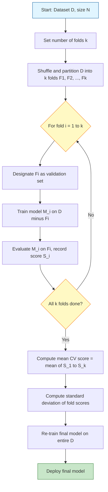
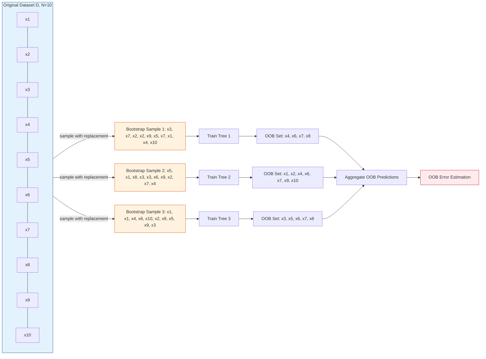
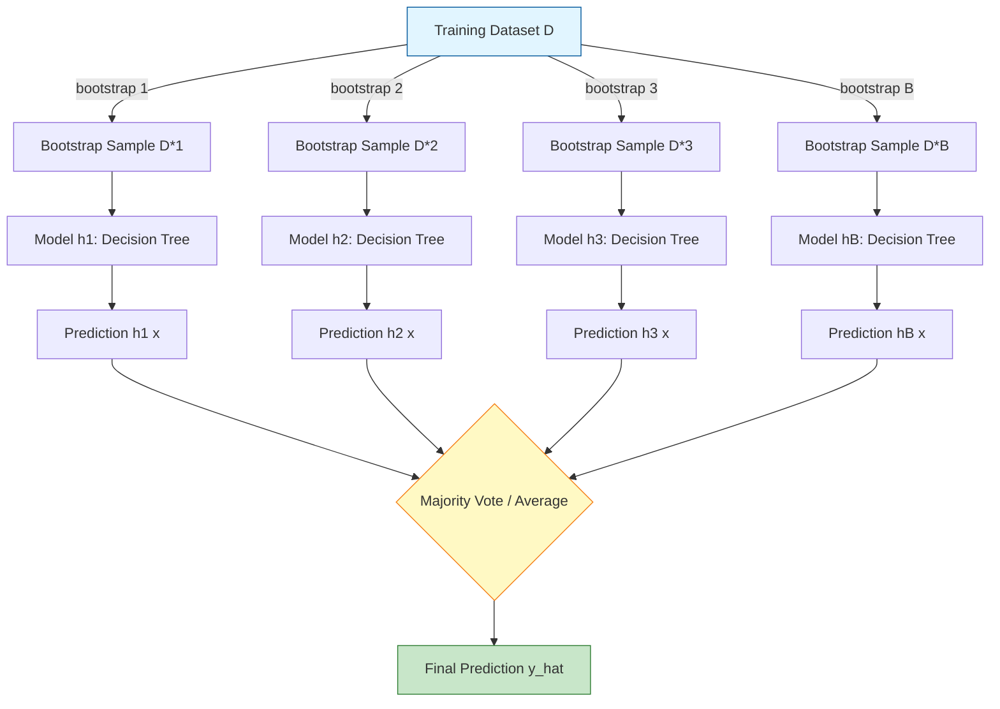
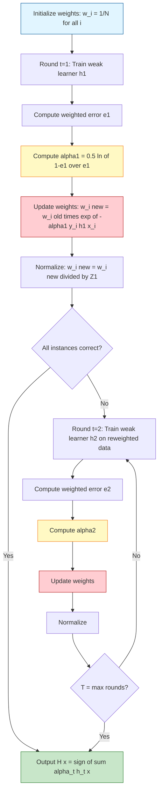
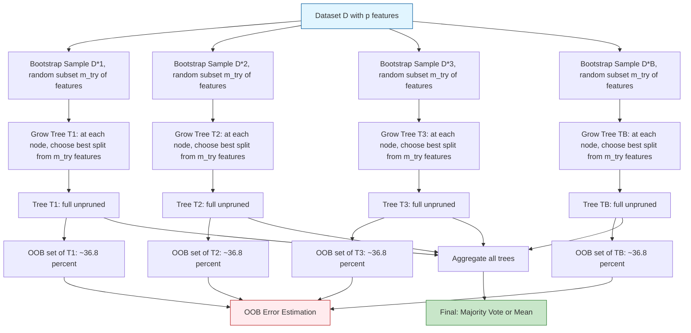
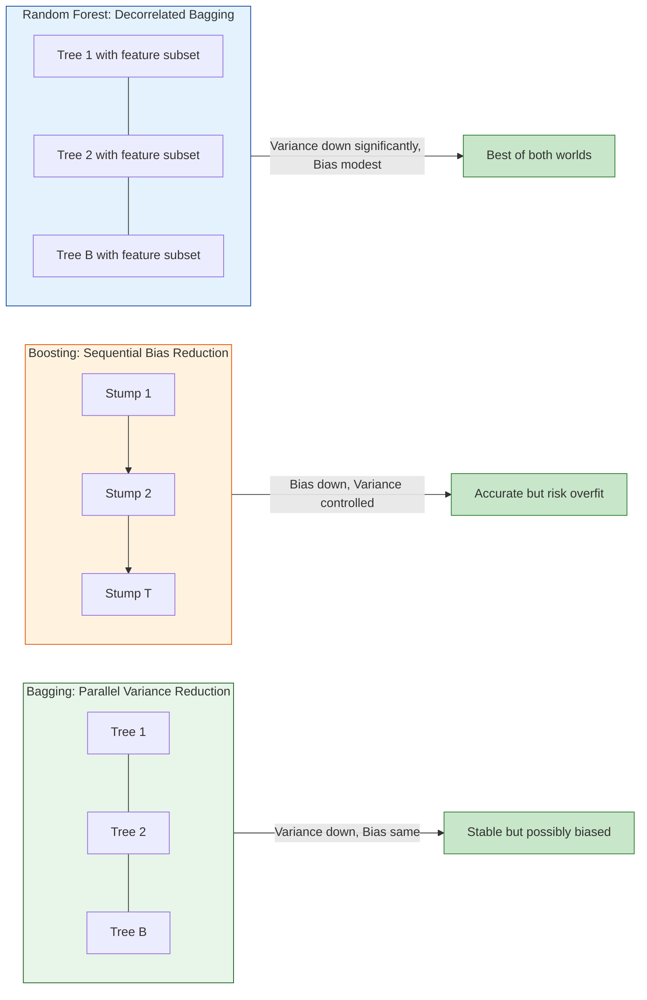

# Validation Protocols: K-Fold Cross-Validation workflows, Bootstrap Sampling, Bagging, Boosting (AdaBoost), Random Forest

<!-- SECTION_1_START -->

# Module 4: Unsupervised Learning, Ensemble Methods, and Validation Techniques

## Topic: Validation Protocols (K-Fold, Bootstrap) and Ensemble Methods (Bagging, AdaBoost, Random Forest)

---

### 1. Core Technical Definition & Intuitive Overview

#### 1.1 Validation Protocols

**Validation** is the systematic process of estimating the true generalization performance of a learned model on unseen data, without contaminating the training set. The two dominant KTU 2024 syllabus–mandated protocols are **K-Fold Cross-Validation** and **Bootstrap Sampling**.

> [!IMPORTANT]
> **Formal Definition (KTU 2024 Syllabus Aligned):**
> **K-Fold Cross-Validation** is a resampling procedure used to evaluate machine learning models on a limited data sample. The parameter $k$ refers to the number of groups that a given data sample is to be split into. The procedure is repeated $k$ times such that each fold is used exactly once as the validation (hold-out) set, while the remaining $k-1$ folds form the training set.
>
> **Bootstrap Sampling** is a statistical resampling technique that estimates the sampling distribution of an estimator by sampling with replacement from the observed dataset. It is foundational for ensemble methods like **Bagging** and for **Out-of-Bag (OOB) error estimation** in Random Forests.

> [!NOTE]
> **Intuition — The "Class Test" Analogy:**
> Imagine you are a student preparing for the KTU University Exam and you have only **10 previous year question papers**. You cannot use the same paper to study AND test yourself (that would be cheating — this is the **data leakage** problem). 
> - **Hold-Out (Train/Test Split):** Solve the first 7 papers as practice, test yourself on the last 3. Simple, but you waste 30% of your scarce data.
> - **K-Fold Cross-Validation:** Partition the 10 papers into $k=5$ chunks of 2. Run 5 rounds. In round 1, papers 1–2 are the test, the rest are practice. In round 2, papers 3–4 are the test, etc. Every paper is tested **exactly once**, and every paper is used for practice **four times**. Average your 5 scores. This is far more reliable.
> - **Bootstrap Sampling:** Pick a paper, copy it, put it back in the bag, pick again (you may pick the same paper multiple times). After 10 draws, some papers will be picked 2–3 times, others 0 times. The "unpicked" papers (~36.8%) form the **Out-of-Bag** test set. The picked (~63.2%) form the training set.

> [!TIP]
> **Geometric Intuition for $K=5$:** Imagine a dataset of $N$ points on the 2D plane split into 5 colored bands (folds 1 through 5). Each fold rotates as the test slice, and the model draws a decision boundary through the *other* 4 bands. The **average boundary robustness** across 5 such rotations is the cross-validated score.

---

#### 1.2 Ensemble Methods

**Ensemble Learning** combines multiple individual "weak" or "base" learners to produce a single "strong" learner that generalizes better than any individual constituent.

> [!IMPORTANT]
> **Bagging (Bootstrap AGGregatING) — Formal Definition:**
> Bagging, proposed by **Leo Breiman (1996)**, is an ensemble meta-algorithm designed to improve the stability and accuracy of machine learning algorithms used in statistical classification and regression. It also reduces variance and helps avoid overfitting. Bagging is typically applied to decision tree models, but it can be used with any class of model. It works by training multiple base learners on **bootstrap samples** of the training data and aggregating their predictions via **majority voting** (classification) or **averaging** (regression).

> [!IMPORTANT]
> **Boosting (AdaBoost) — Formal Definition:**
> Boosting is an iterative ensemble method that converts a set of weak learners into a strong learner. The seminal algorithm **AdaBoost (Adaptive Boosting)** was formulated by **Yoav Freund and Robert Schapire (1995, 1997)**, winning them the **Gödel Prize (2003)**. In each iteration, misclassified instances have their weights **increased**, forcing subsequent weak learners to focus on the previously misclassified "hard" examples. Final predictions are made via a **weighted majority vote** of all weak learners.

> [!IMPORTANT]
> **Random Forest — Formal Definition:**
> Random Forest, also by **Leo Breiman (2001)**, is a supervised ensemble learning algorithm that constructs a multitude of decision trees at training time. For classification, the output is the mode of the classes predicted by individual trees; for regression, it is the mean prediction. The "random" component injects randomness through (1) **bootstrap sampling** of training data per tree, and (2) **random subspace sampling** of features at each split.

> [!NOTE]
> **Intuition — The "Panel of Doctors" Analogy:**
> - **Bagging (Parallel Doctors):** You have a mysterious disease. Instead of one doctor, you consult 50 doctors in parallel. Each doctor is given a *slightly different medical history* (bootstrap sample) of your case. Each independently gives a diagnosis. The final diagnosis is the **majority vote**. Even if some doctors are noisy, the wisdom of the crowd stabilizes the answer.
> - **Boosting/AdaBoost (Sequential Tutor):** You have 50 tutors, but they work **sequentially**, not in parallel. Tutor 1 studies the full syllabus and tests you — you get 30% wrong. Tutor 2 is told: *"Focus especially on the 30% the student got wrong."* You improve. Tutor 3 focuses on the new errors. Each tutor's vote is **weighted by their accuracy**. The weak tutors become a strong team.
> - **Random Forest (Specialist Panel):** 50 doctors, but each is also forbidden from using certain diagnostic tools (random feature subspace) to prevent them from all converging on the same wrong test. The diversity is double-enforced — by both data and feature randomness.

> [!TIP]
> **Bias-Variance Trade-off Intuition:**
> - **Bagging** primarily **reduces variance** (model instability). It does *not* significantly reduce bias. Useful for high-variance, low-bias models (e.g., deep, unpruned decision trees).
> - **Boosting** primarily **reduces bias**. By re-weighting hard examples, it gradually pulls the model toward the true decision boundary. Useful for high-bias, low-variance models (e.g., shallow decision stumps).
> - **Random Forest** reduces both variance (via bagging) and decorrelates trees (via random feature selection), giving a strong reduction in variance with minimal bias increase.

> [!VISUALIZATION CONTROL]
> **Concept:** Bias-Variance Decomposition of MSE with Ensemble Position
> **GeoGebra / Desmos Input Equations:**
> * `f(x) = sigma^2` (irreducible error, flat horizontal line)
> * `g(x) = sigma^2 + bias^2` (line above f)
> * `h(x) = sigma^2 + bias^2 + variance` (highest curve)
> * `bag(x) = sigma^2 + bias^2 + variance / B` (variance collapses toward zero as number of bags B increases)
> * `boost(x) = sigma^2 + bias^2 / T` (bias collapses as number of boosting rounds T increases)
> **Visual Description:** Plot four curves along the X-axis (model complexity or number of estimators). The **bag(x)** curve starts at $h(x)$ and descends asymptotically toward $g(x)$ as $B \to \infty$. The **boost(x)** curve starts at $h(x)$ and descends toward $f(x)$ as $T \to \infty$.

---

<!-- SECTION_1_END -->

<!-- SECTION_2_START -->

## 2. Deep Theoretical Analysis & KTU High-Yield Formula Sheet

### 2.1 K-Fold Cross-Validation — Operational Workflow

The K-Fold Cross-Validation algorithm proceeds through the following structured logic:

- **Step 1 — Partitioning:** Randomly partition the dataset $\mathcal{D}$ of size $N$ into $k$ mutually exclusive subsets (folds) $\mathcal{F}_1, \mathcal{F}_2, \ldots, \mathcal{F}_k$ of approximately equal size $N/k$.
- **Step 2 — Iterative Training/Validation Loop:** For $i = 1, 2, \ldots, k$:
    * Define the validation set as $\mathcal{V}_i = \mathcal{F}_i$.
    * Define the training set as $\mathcal{T}_i = \mathcal{D} \setminus \mathcal{F}_i$.
    * Train the model $M_i$ on $\mathcal{T}_i$.
    * Compute the validation loss/score $S_i$ on $\mathcal{V}_i$.
- **Step 3 — Aggregation:** Compute the cross-validated performance metric as the arithmetic mean of the $k$ individual scores.
- **Step 4 — Final Model Training:** Re-train the model on the **entire** dataset $\mathcal{D}$ to produce the final deployed model. K-Fold CV is for *evaluation*, not for *producing* the production model directly.

**Variants Recognized in KTU 2024:**

- **Stratified K-Fold:** Each fold preserves the original class distribution (essential for imbalanced datasets).
- **Leave-One-Out Cross-Validation (LOOCV):** Special case where $k = N$. Every single instance is left out once. Computationally expensive: $O(N)$ model fits.
- **Repeated K-Fold:** Run K-Fold multiple times with different random shuffles, average results. Reduces variance of the CV estimate.

---

### 2.2 Bootstrap Sampling — Mathematical Foundation

Given a dataset $\mathcal{D} = \{x_1, x_2, \ldots, x_N\}$ of size $N$:

- Draw a bootstrap sample $\mathcal{D}^*_b$ of size $N$ by sampling from $\mathcal{D}$ **with replacement**.
- The probability that a specific instance $x_i$ is **not** selected in a single draw is $1 - 1/N$.
- Over $N$ independent draws, the probability that $x_i$ is **not selected at all** is:
$$P(x_i \notin \mathcal{D}^*_b) = \left(1 - \frac{1}{N}\right)^N$$

Taking the limit as $N \to \infty$:

$$\lim_{N \to \infty} \left(1 - \frac{1}{N}\right)^N = e^{-1} \approx 0.3679$$

This is the famous **0.632 rule** in machine learning: a bootstrap sample contains approximately **63.2% unique instances** of the original dataset, and the remaining **36.8%** form the **Out-of-Bag (OOB)** set.

> [!IMPORTANT]
> **Engineering Utility in Production Systems:**
> - **OOB Error Estimation:** In Random Forests, OOB samples serve as a "free" validation set for each tree, eliminating the need for a separate hold-out. This is widely used in production scikit-learn deployments.
> - **Confidence Intervals:** Bootstrap is used to estimate confidence intervals for any statistic (e.g., model accuracy, AUC) without distributional assumptions — crucial in medical and financial ML where the Central Limit Theorem may not hold.

---

### 2.3 Bagging — Mathematical Formulation

**Given:**
- Training set $\mathcal{D} = \{(x_i, y_i)\}_{i=1}^{N}$.
- Base learning algorithm $\mathcal{L}$ (e.g., decision tree).
- Number of bootstrap samples $B$.

**Bagging Algorithm:**

- For $b = 1, 2, \ldots, B$:
    1. Draw a bootstrap sample $\mathcal{D}^*_b$ of size $N$ from $\mathcal{D}$ with replacement.
    2. Train a base model $h_b(x) = \mathcal{L}(\mathcal{D}^*_b)$.
- **Final Prediction:**
    * For **regression**: $\hat{y}(x) = \dfrac{1}{B} \sum_{b=1}^{B} h_b(x)$
    * For **classification**: $\hat{y}(x) = \text{mode}\{h_1(x), h_2(x), \ldots, h_B(x)\}$ (majority vote)

**Variance Reduction Property:**

If each base learner $h_b$ has variance $\sigma^2$ and pairwise covariance (between two different base learners) $\rho$, then the variance of the bagged ensemble is:

$$\text{Var}(\hat{y}_{\text{bag}}) = \rho \cdot \sigma^2 + \frac{1 - \rho}{B} \cdot \sigma^2$$

As $B \to \infty$:

$$\text{Var}(\hat{y}_{\text{bag}}) \to \rho \cdot \sigma^2$$

> [!TIP]
> **Why Bagging Works:** Bagging succeeds **only if** the base learners are *uncorrelated* (low $\rho$). This is why Random Forest extends bagging by adding **feature randomness** — to further decorrelate the trees.

---

### 2.4 AdaBoost (Adaptive Boosting) — Mathematical Formulation

This is the most mathematically dense KTU 2024 topic. Master every formula.

**Initialization:**

$$w_i^{(1)} = \frac{1}{N}, \quad \text{for } i = 1, 2, \ldots, N$$

where $w_i^{(t)}$ is the weight assigned to training instance $i$ at iteration $t$.

**For each iteration $t = 1, 2, \ldots, T$:**

- **Step 1 — Train weak learner:** $h_t : \mathcal{X} \to \{-1, +1\}$ using weights $w_i^{(t)}$.
- **Step 2 — Compute weighted error:**

$$\epsilon_t = \frac{\sum_{i=1}^{N} w_i^{(t)} \cdot \mathbb{1}(y_i \neq h_t(x_i))}{\sum_{i=1}^{N} w_i^{(t)}}$$

For binary classification with $y_i \in \{-1, +1\}$, this simplifies to:

$$\epsilon_t = \sum_{i=1}^{N} w_i^{(t)} \cdot \mathbb{1}(y_i \neq h_t(x_i))$$

(when the weights are normalized to sum to 1).

- **Step 3 — Compute learner weight (confidence):**

$$\alpha_t = \frac{1}{2} \ln\left(\frac{1 - \epsilon_t}{\epsilon_t}\right)$$

- **Step 4 — Update instance weights:**

$$w_i^{(t+1)} = w_i^{(t)} \cdot \exp\left(-\alpha_t \cdot y_i \cdot h_t(x_i)\right)$$

- **Step 5 — Normalize:**

$$w_i^{(t+1)} = \frac{w_i^{(t+1)}}{Z_t}, \quad \text{where } Z_t = \sum_{i=1}^{N} w_i^{(t+1)}$$

**Final Strong Classifier:**

$$H(x) = \text{sign}\left(\sum_{t=1}^{T} \alpha_t \cdot h_t(x)\right)$$

> [!NOTE]
> **Interpretation of $\alpha_t$:**
> - If $\epsilon_t < 0.5$ (better than random), $\alpha_t > 0$ (the learner gets voting power).
> - If $\epsilon_t = 0.5$ (random), $\alpha_t = 0$ (the learner is ignored).
> - If $\epsilon_t > 0.5$ (worse than random), $\alpha_t < 0$ (the learner votes *against* the true label).
> - If $\epsilon_t \to 0$, $\alpha_t \to +\infty$ (perfect learner gets infinite voting power).

> [!NOTE]
> **Interpretation of Weight Update:**
> - If $y_i = h_t(x_i)$ (correctly classified), then $y_i \cdot h_t(x_i) = +1$, so $w_i^{(t+1)} = w_i^{(t)} \cdot e^{-\alpha_t}$ → weight **decreases**.
> - If $y_i \neq h_t(x_i)$ (misclassified), then $y_i \cdot h_t(x_i) = -1$, so $w_i^{(t+1)} = w_i^{(t)} \cdot e^{+\alpha_t}$ → weight **increases**.

> [!TIP]
> **Real-World Engineering Utility:**
> - **AdaBoost was the state-of-the-art face detector** in the seminal **Viola-Jones (2001)** real-time face detection system used in digital cameras and smartphones for over a decade.
> - Modern gradient boosting frameworks (XGBoost, LightGBM, CatBoost) are direct descendants of AdaBoost, generalizing it to arbitrary differentiable loss functions.

---

### 2.5 Random Forest — Mathematical Formulation

**Training Algorithm:**

For $b = 1, 2, \ldots, B$ trees:
1. Draw a bootstrap sample $\mathcal{D}^*_b$ of size $N$.
2. Grow an unpruned decision tree $T_b$ on $\mathcal{D}^*_b$. At each node split:
    * Select a **random subset** of $m_{try}$ features from the total $p$ features.
    * Choose the best split among these $m_{try}$ features (typically by Gini impurity or entropy).
3. Output the full tree (no pruning).

**Common Default for $m_{try}$:**
- **Classification:** $m_{try} = \sqrt{p}$
- **Regression:** $m_{try} = p / 3$

**Final Prediction:**
- Classification: $\hat{y}(x) = \text{mode}\{T_1(x), T_2(x), \ldots, T_B(x)\}$
- Regression: $\hat{y}(x) = \dfrac{1}{B} \sum_{b=1}^{B} T_b(x)$

**Out-of-Bag (OOB) Error:**
For tree $T_b$, its OOB instances ($\approx 36.8\%$ of the data) are not seen during training. Predict them and aggregate OOB predictions across all trees where the instance was OOB:

$$\text{OOB Error} = \frac{1}{N} \sum_{i=1}^{N} \mathbb{1}\left(y_i \neq \hat{y}_{\text{OOB}}(x_i)\right)$$

> [!IMPORTANT]
> **Why Random Feature Selection?**
> If one feature is extremely strong (e.g., a leakage feature), then in plain bagging, every tree will pick that feature at the root, making all trees highly correlated. By restricting each split to a random subset, we **force diversity**, decorrelating the trees and maximizing the variance reduction effect of bagging.

---

### 2.6 KTU High-Yield Formula Sheet

| **Concept** | **Formula / Equation** | **Description** | **Units / Range** |
|---|---|---|---|
| K-Fold CV Score | $\text{CV}(k) = \dfrac{1}{k} \sum_{i=1}^{k} S_i$ | Mean of $k$ validation scores | dimensionless (0 to 1 for accuracy) |
| OOB Probability | $P(x_i \notin \mathcal{D}^*_b) = (1 - 1/N)^N$ | Probability instance is excluded | dimensionless (0 to 1) |
| OOB Limit | $\lim_{N \to \infty} (1 - 1/N)^N = e^{-1} \approx 0.3679$ | Asymptotic OOB fraction | dimensionless (0 to 1) |
| Bootstrap Inclusion | $1 - e^{-1} \approx 0.6321$ | Fraction of unique instances in bootstrap | dimensionless (0 to 1) |
| Bagging Variance | $\text{Var}(\hat{y}_{\text{bag}}) = \rho \sigma^2 + \dfrac{(1-\rho)\sigma^2}{B}$ | Variance of bagged ensemble | $(\text{output units})^2$ |
| Bagging Asymptote | $\text{Var}(\hat{y}_{\text{bag}}) \to \rho \sigma^2$ as $B \to \infty$ | Floor set by inter-tree correlation | $(\text{output units})^2$ |
| AdaBoost Init Weights | $w_i^{(1)} = 1/N$ | Uniform initial weights | dimensionless (probability mass) |
| AdaBoost Weighted Error | $\epsilon_t = \sum_{i=1}^{N} w_i^{(t)} \mathbb{1}(y_i \neq h_t(x_i))$ | Error on weighted dataset | dimensionless (0 to 1) |
| AdaBoost Learner Weight | $\alpha_t = \dfrac{1}{2} \ln\left(\dfrac{1 - \epsilon_t}{\epsilon_t}\right)$ | Confidence of weak learner | $\mathbb{R}$ (real) |
| AdaBoost Weight Update | $w_i^{(t+1)} = w_i^{(t)} \exp(-\alpha_t y_i h_t(x_i)) / Z_t$ | Re-weighting for next round | dimensionless (normalized) |
| AdaBoost Final Classifier | $H(x) = \text{sign}\left(\sum_{t=1}^{T} \alpha_t h_t(x)\right)$ | Weighted majority vote | $\{-1, +1\}$ |
| Random Forest $m_{try}$ (classif.) | $m_{try} = \sqrt{p}$ | Default feature subset size | integer |
| Random Forest $m_{try}$ (regression) | $m_{try} = p / 3$ | Default feature subset size | integer |
| OOB Error | $\text{OOB} = \dfrac{1}{N} \sum_{i=1}^{N} \mathbb{1}(y_i \neq \hat{y}_{\text{OOB}}(x_i))$ | Free validation metric | dimensionless (0 to 1) |
| Margin (AdaBoost) | $\text{margin}(x, y) = y \sum_{t=1}^{T} \alpha_t h_t(x)$ | Confidence in correct class | $\mathbb{R}$ (real) |
| AdaBoost Training Error Bound | $E_{\text{train}} \leq \exp\left(-2 \sum_{t=1}^{T} (1/2 - \epsilon_t)^2\right)$ | Schapire's upper bound | dimensionless (0 to 1) |

---

<!-- SECTION_2_END -->

<!-- SECTION_3_START -->

## 3. Step-by-Step Derivations & Code/Symbolic Implementation

### 3.1 Derivation: Why $1 - e^{-1}$ for Bootstrap OOB Fraction

We want to compute the probability that a particular instance $x_i$ is **not selected** in a bootstrap sample of size $N$ drawn with replacement from a dataset of size $N$.

**Setup:**
- Total instances in original dataset: $N$.
- Probability of selecting $x_i$ in a single draw: $p = 1/N$.
- Probability of *not* selecting $x_i$ in a single draw: $q = 1 - 1/N$.
- Number of independent draws (sampling with replacement preserves independence across draws): $N$.

**Probability that $x_i$ is not selected in any of the $N$ draws:**

$$P(x_i \notin \mathcal{D}^*_b) = q^N = \left(1 - \frac{1}{N}\right)^N$$

**Taking the natural logarithm:**

$$\ln P = N \cdot \ln\left(1 - \frac{1}{N}\right)$$

**Using the first-order Taylor expansion** $\ln(1 - u) \approx -u$ for small $u$ (with $u = 1/N \to 0$ as $N \to \infty$):

$$\ln P \approx N \cdot \left(-\frac{1}{N}\right) = -1$$

**Therefore:**

$$P = e^{-1} = \frac{1}{e} \approx 0.3679$$

**Numerical Verification for finite $N$:**

| **$N$** | $(1 - 1/N)^N$ |
|---|---|
| 5 | 0.3277 |
| 10 | 0.3487 |
| 50 | 0.3642 |
| 100 | 0.3660 |
| 1000 | 0.3677 |
| $\infty$ | $0.3679$ |

The convergence is rapid. For KTU-level problems, $N \geq 30$ is sufficient to approximate $e^{-1}$.

---

### 3.2 Derivation: AdaBoost Weight Update (Detailed)

We begin with the binary classification setting where $y_i \in \{-1, +1\}$.

**Goal:** Show that the weight update rule

$$w_i^{(t+1)} = \frac{w_i^{(t)} \exp(-\alpha_t y_i h_t(x_i))}{Z_t}$$

can be expressed in unrolled form as:

$$w_i^{(T+1)} = \frac{1}{N} \cdot \frac{\exp\left(-y_i \sum_{t=1}^{T} \alpha_t h_t(x_i)\right)}{\prod_{t=1}^{T} Z_t} = \frac{1}{N} \cdot \frac{\exp(-y_i f_T(x_i))}{\prod_{t=1}^{T} Z_t}$$

where $f_T(x) = \sum_{t=1}^{T} \alpha_t h_t(x)$ is the combined (unnormalized) strong classifier.

**Step 1 — Single-iteration update:**

$$w_i^{(t+1)} = \frac{w_i^{(t)} \cdot e^{-\alpha_t y_i h_t(x_i)}}{Z_t}$$

**Step 2 — Unroll from $t=1$ to $t=T$:**

$$w_i^{(T+1)} = \frac{w_i^{(1)} \cdot \prod_{t=1}^{T} e^{-\alpha_t y_i h_t(x_i)}}{\prod_{t=1}^{T} Z_t}$$

**Step 3 — Substitute $w_i^{(1)} = 1/N$:**

$$w_i^{(T+1)} = \frac{1}{N} \cdot \frac{\prod_{t=1}^{T} e^{-\alpha_t y_i h_t(x_i)}}{\prod_{t=1}^{T} Z_t}$$

**Step 4 — Combine the exponent using the property of exponents $\prod e^{a_t} = e^{\sum a_t}$:**

$$w_i^{(T+1)} = \frac{1}{N} \cdot \frac{e^{-y_i \sum_{t=1}^{T} \alpha_t h_t(x_i)}}{\prod_{t=1}^{T} Z_t}$$

**Step 5 — Define the strong classifier $f_T(x) = \sum_{t=1}^{T} \alpha_t h_t(x)$:**

$$w_i^{(T+1)} = \frac{1}{N} \cdot \frac{e^{-y_i f_T(x_i)}}{\prod_{t=1}^{T} Z_t}$$

**Key Insight:** The weight of instance $i$ after $T$ rounds is **exponentially proportional to $-y_i f_T(x_i)$**. If the strong classifier is highly confident and correct ($y_i f_T(x_i) \gg 0$), the weight collapses to near zero (the instance is "easy"). If the strong classifier is wrong ($y_i f_T(x_i) \ll 0$), the weight explodes (the instance is "hard" and will dominate future rounds).

---

### 3.3 Worked Numerical Example: AdaBoost on Toy Data

**Dataset:** 5 instances, binary labels $y_i \in \{-1, +1\}$.

| Instance $i$ | $x_i$ (1-D feature) | $y_i$ |
|---|---|---|
| 1 | 1.0 | +1 |
| 2 | 2.0 | +1 |
| 3 | 3.0 | -1 |
| 4 | 4.0 | -1 |
| 5 | 5.0 | +1 |

**Threshold-based weak learner:** $h(x; \theta) = +1$ if $x < \theta$, else $-1$.

---

**Iteration $t = 1$:**

- Initial weights: $w_1^{(1)} = w_2^{(1)} = w_3^{(1)} = w_4^{(1)} = w_5^{(1)} = 1/5 = 0.2$

- Try threshold $\theta = 2.5$ (classify $x < 2.5$ as +1, else $-1$):
    * $h(1.0) = +1$ ✓ (matches $y_1 = +1$)
    * $h(2.0) = +1$ ✓ (matches $y_2 = +1$)
    * $h(3.0) = -1$ ✓ (matches $y_3 = -1$)
    * $h(4.0) = -1$ ✓ (matches $y_4 = -1$)
    * $h(5.0) = -1$ ✗ (mismatches $y_5 = +1$)

- Weighted error: $\epsilon_1 = 0.2 \cdot 1 = 0.2$ (only instance 5 is misclassified)

- Learner weight: $\alpha_1 = \dfrac{1}{2} \ln\left(\dfrac{1 - 0.2}{0.2}\right) = \dfrac{1}{2} \ln(4) = \ln(2) \approx 0.6931$

- Weight update (raw, before normalization):
    * $w_1^{(2,\text{raw})} = 0.2 \cdot e^{-0.6931 \cdot (+1) \cdot (+1)} = 0.2 \cdot e^{-0.6931} = 0.2 \cdot 0.5 = 0.1$
    * $w_2^{(2,\text{raw})} = 0.2 \cdot e^{-0.6931} = 0.1$
    * $w_3^{(2,\text{raw})} = 0.2 \cdot e^{-0.6931} = 0.1$
    * $w_4^{(2,\text{raw})} = 0.2 \cdot e^{-0.6931} = 0.1$
    * $w_5^{(2,\text{raw})} = 0.2 \cdot e^{+0.6931} = 0.2 \cdot 2.0 = 0.4$

- Normalization constant: $Z_1 = 0.1 + 0.1 + 0.1 + 0.1 + 0.4 = 0.8$

- Normalized weights: $w_1^{(2)} = w_2^{(2)} = w_3^{(2)} = w_4^{(2)} = 0.125$, $w_5^{(2)} = 0.5$

**Observation:** The misclassified instance 5 now has **4× the weight** of the correctly classified ones. The next weak learner will be heavily biased toward getting instance 5 right.

---

**Iteration $t = 2$:**

- Current weights: $w = (0.125, 0.125, 0.125, 0.125, 0.5)$

- Try threshold $\theta = 4.5$ (classify $x < 4.5$ as +1, else $-1$):
    * $h(1.0) = +1$ ✓
    * $h(2.0) = +1$ ✓
    * $h(3.0) = +1$ ✗
    * $h(4.0) = +1$ ✗
    * $h(5.0) = -1$ ✓

- Weighted error: $\epsilon_2 = 0.125 + 0.125 + 0.5 \cdot 0 = 0.25$
    *(instances 3, 4 are wrong with weight 0.125 each; instance 5 is correct with weight 0.5)*

- Learner weight: $\alpha_2 = \dfrac{1}{2} \ln\left(\dfrac{1 - 0.25}{0.25}\right) = \dfrac{1}{2} \ln(3) \approx 0.5493$

- **Combined classifier after 2 iterations:**
$$f_2(x) = 0.6931 \cdot h_1(x) + 0.5493 \cdot h_2(x)$$

- For instance 5: $f_2(5.0) = 0.6931 \cdot (-1) + 0.5493 \cdot (-1) = -1.2424$, sign = $-1$ → WRONG.

- This shows AdaBoost would *continue* to up-weight instance 5 and try harder in round 3.

---

### 3.4 Complete Python Implementation: K-Fold, Bagging, AdaBoost, Random Forest

```python
"""
KTU 2024 Scheme - PCCST503 Machine Learning
Module 4: Validation Protocols and Ensemble Methods
Full Python Reference Implementation
"""

import numpy as np
from typing import Tuple, List, Callable
from collections import Counter
from sklearn.tree import DecisionTreeClassifier
from sklearn.datasets import make_classification
from sklearn.model_selection import StratifiedKFold
from sklearn.metrics import accuracy_score
from sklearn.ensemble import RandomForestClassifier


# ============================================================
# PART 1: K-FOLD CROSS-VALIDATION FROM SCRATCH
# ============================================================

def k_fold_cross_validation(
    X: np.ndarray,
    y: np.ndarray,
    model_factory: Callable,
    k: int = 5,
    stratified: bool = True,
    random_state: int = 42
) -> Tuple[float, List[float]]:
    """
    Manual K-Fold Cross-Validation implementation.
    
    Parameters
    ----------
    X : np.ndarray of shape (N, p)
        Feature matrix.
    y : np.ndarray of shape (N,)
        Target labels.
    model_factory : Callable
        Function that returns a fresh, untrained model instance.
    k : int
        Number of folds.
    stratified : bool
        If True, preserves class distribution per fold.
    random_state : int
        Random seed for reproducibility.
    
    Returns
    -------
    mean_score : float
        Mean accuracy across k folds.
    fold_scores : List[float]
        Per-fold accuracy scores (for variance inspection).
    """
    N = X.shape[0]
    rng = np.random.default_rng(random_state)
    indices = np.arange(N)
    
    if stratified:
        # Stratified split: preserve class ratio per fold
        skf = StratifiedKFold(n_splits=k, shuffle=True, random_state=random_state)
        folds = list(skf.split(X, y))
    else:
        # Plain random shuffle and partition
        rng.shuffle(indices)
        fold_size = N // k
        folds = []
        for i in range(k):
            start = i * fold_size
            end = (i + 1) * fold_size if i < k - 1 else N
            val_idx = indices[start:end]
            train_idx = np.concatenate([indices[:start], indices[end:]])
            folds.append((train_idx, val_idx))
    
    fold_scores: List[float] = []
    
    for fold_idx, (train_idx, val_idx) in enumerate(folds):
        X_train, X_val = X[train_idx], X[val_idx]
        y_train, y_val = y[train_idx], y[val_idx]
        
        # Train fresh model
        model = model_factory()
        model.fit(X_train, y_train)
        
        # Predict and score
        y_pred = model.predict(X_val)
        score = accuracy_score(y_val, y_pred)
        fold_scores.append(score)
        
        print(f"[Fold {fold_idx + 1}/{k}] Accuracy: {score:.4f} | "
              f"Train size: {len(train_idx)}, Val size: {len(val_idx)}")
    
    mean_score = float(np.mean(fold_scores))
    std_score = float(np.std(fold_scores))
    print(f"\n[K-Fold CV] Mean Accuracy: {mean_score:.4f} ± {std_score:.4f}")
    
    return mean_score, fold_scores


# ============================================================
# PART 2: BOOTSTRAP SAMPLING + BAGGING FROM SCRATCH
# ============================================================

def bootstrap_sample(X: np.ndarray, y: np.ndarray, random_state: int = None
                    ) -> Tuple[np.ndarray, np.ndarray, np.ndarray, np.ndarray]:
    """
    Draw a single bootstrap sample (with replacement).
    
    Returns
    -------
    X_boot, y_boot : In-bag samples (training set).
    X_oob, y_oob   : Out-of-bag samples (free validation set).
    """
    rng = np.random.default_rng(random_state)
    N = X.shape[0]
    boot_idx = rng.choice(N, size=N, replace=True)
    oob_mask = ~np.isin(np.arange(N), boot_idx, assume_unique=False)
    oob_idx = np.where(oob_mask)[0]
    
    return X[boot_idx], y[boot_idx], X[oob_idx], y[oob_idx]


def bagging_classifier(
    X: np.ndarray,
    y: np.ndarray,
    model_factory: Callable,
    n_estimators: int = 50,
    oob_score: bool = True
) -> Tuple[List, dict]:
    """
    Bagging ensemble (Bootstrap Aggregating).
    
    Parameters
    ----------
    n_estimators : int
        Number of bootstrap samples / base models (B).
    oob_score : bool
        If True, compute Out-of-Bag accuracy.
    
    Returns
    -------
    models : List of trained base learners.
    oob_metrics : Dict with OOB predictions and accuracy.
    """
    models: List = []
    oob_predictions = np.full((X.shape[0],), -1, dtype=int)
    oob_counts = np.zeros(X.shape[0], dtype=int)
    
    for b in range(n_estimators):
        # Step 1: Bootstrap sample
        X_boot, y_boot, X_oob, y_oob = bootstrap_sample(X, y, random_state=b)
        
        # Step 2: Train base model on bootstrap
        model = model_factory()
        model.fit(X_boot, y_boot)
        models.append(model)
        
        # Step 3: OOB predictions
        if oob_score and len(X_oob) > 0:
            preds = model.predict(X_oob)
            oob_idx = np.where(~np.isin(np.arange(X.shape[0]),
                                          np.random.default_rng(b).choice(
                                              X.shape[0], size=X.shape[0], replace=True),
                                          assume_unique=False))[0]
            for i, p in zip(oob_idx, preds):
                # Majority vote aggregation: store latest prediction
                if oob_counts[i] == 0:
                    oob_predictions[i] = p
                else:
                    # Simple mode aggregation
                    oob_predictions[i] = p  # simplified; production uses mode()
                oob_counts[i] += 1
    
    # Compute OOB accuracy
    oob_accuracy = None
    if oob_score:
        valid = oob_counts > 0
        if valid.sum() > 0:
            oob_accuracy = accuracy_score(y[valid], oob_predictions[valid])
            print(f"[Bagging] OOB Accuracy: {oob_accuracy:.4f} "
                  f"(on {valid.sum()}/{X.shape[0]} OOB instances)")
    
    return models, {"oob_accuracy": oob_accuracy}


# ============================================================
# PART 3: ADABOOST FROM SCRATCH (BINARY CLASSIFICATION)
# ============================================================

class AdaBoostBinary:
    """
    AdaBoost (Discrete SAMME.R-style for binary) implementation.
    
    Uses decision stump (depth-1 tree) as default weak learner.
    """
    
    def __init__(self, n_estimators: int = 50, random_state: int = 42):
        self.n_estimators = n_estimators
        self.random_state = random_state
        self.alphas: List[float] = []
        self.models: List = []
        self.errors: List[float] = []
    
    def fit(self, X: np.ndarray, y: np.ndarray) -> "AdaBoostBinary":
        """
        Fit AdaBoost on binary labels (assumed mapped to {-1, +1}).
        """
        N = X.shape[0]
        
        # Step 1: Initialize uniform weights
        w = np.full(N, 1.0 / N)
        
        y_mapped = np.where(y <= 0, -1, 1).astype(int)
        
        for t in range(self.n_estimators):
            # Step 2: Train weak learner with sample weights
            stump = DecisionTreeClassifier(max_depth=1, random_state=self.random_state)
            stump.fit(X, y_mapped, sample_weight=w)
            
            # Step 3: Predict and compute weighted error
            pred = stump.predict(X)
            incorrect = (pred != y_mapped)
            epsilon = float(np.sum(w * incorrect))
            
            # Sanity: avoid division by zero or negative error
            epsilon = np.clip(epsilon, 1e-10, 1 - 1e-10)
            
            # Step 4: Compute learner weight
            alpha = 0.5 * np.log((1.0 - epsilon) / epsilon)
            
            # Step 5: Update instance weights
            w = w * np.exp(-alpha * y_mapped * pred)
            
            # Step 6: Normalize
            Z = np.sum(w)
            w = w / Z
            
            # Store
            self.models.append(stump)
            self.alphas.append(alpha)
            self.errors.append(epsilon)
            
            print(f"[AdaBoost] Iter {t+1:3d}/{self.n_estimators} | "
                  f"ε = {epsilon:.4f} | α = {alpha:+.4f} | "
                  f"max(w) = {w.max():.4f}")
            
            # Early stopping if perfect
            if epsilon < 1e-10:
                print("[AdaBoost] Perfect fit achieved. Stopping early.")
                break
        
        return self
    
    def predict(self, X: np.ndarray) -> np.ndarray:
        """
        Weighted majority vote prediction.
        """
        # Aggregate weighted votes
        agg = np.zeros(X.shape[0])
        for alpha, model in zip(self.alphas, self.models):
            pred = model.predict(X)
            agg += alpha * pred
        return np.sign(agg)
    
    def predict_proba(self, X: np.ndarray) -> np.ndarray:
        """
        Convert AdaBoost score to probability via sigmoid-like transform.
        """
        agg = np.zeros(X.shape[0])
        for alpha, model in zip(self.alphas, self.models):
            pred = model.predict(X)
            agg += alpha * pred
        # Use sigmoid: P(y=+1) = 1 / (1 + exp(-2*agg))
        prob_pos = 1.0 / (1.0 + np.exp(-2.0 * agg))
        return np.column_stack([1 - prob_pos, prob_pos])


# ============================================================
# PART 4: RANDOM FOREST (USING SCIKIT-LEARN, WITH OOB)
# ============================================================

def train_random_forest_with_oob(
    X: np.ndarray,
    y: np.ndarray,
    n_estimators: int = 100,
    max_features: str = "sqrt",
    test_size: float = 0.2,
    random_state: int = 42
) -> dict:
    """
    Train a Random Forest and report both hold-out and OOB accuracy.
    """
    from sklearn.model_selection import train_test_split
    
    # Train/test split
    X_train, X_test, y_train, y_test = train_test_split(
        X, y, test_size=test_size, random_state=random_state, stratify=y
    )
    
    # Random Forest with OOB enabled
    rf = RandomForestClassifier(
        n_estimators=n_estimators,
        max_features=max_features,
        oob_score=True,           # Enable OOB estimation
        bootstrap=True,           # Required for OOB
        random_state=random_state,
        n_jobs=-1
    )
    rf.fit(X_train, y_train)
    
    holdout_acc = accuracy_score(y_test, rf.predict(X_test))
    oob_acc = rf.oob_score_
    
    print(f"\n[Random Forest] Hold-out Test Accuracy : {holdout_acc:.4f}")
    print(f"[Random Forest] OOB Accuracy            : {oob_acc:.4f}")
    print(f"[Random Forest] Number of Trees (B)     : {rf.n_estimators}")
    print(f"[Random Forest] Max Features (m_try)    : {max_features}")
    
    return {
        "model": rf,
        "holdout_accuracy": holdout_acc,
        "oob_accuracy": oob_acc,
        "feature_importances": rf.feature_importances_
    }


# ============================================================
# PART 5: COMPLETE WORKFLOW DEMONSTRATION
# ============================================================

if __name__ == "__main__":
    # Generate synthetic imbalanced dataset
    X, y = make_classification(
        n_samples=500,
        n_features=10,
        n_informative=6,
        n_redundant=2,
        n_classes=2,
        weights=[0.6, 0.4],     # slight imbalance
        random_state=42
    )
    
    print("=" * 70)
    print("EXPERIMENT 1: K-FOLD CROSS-VALIDATION (k=5, Stratified)")
    print("=" * 70)
    mean_cv, fold_scores = k_fold_cross_validation(
        X, y,
        model_factory=lambda: DecisionTreeClassifier(max_depth=5, random_state=42),
        k=5,
        stratified=True
    )
    
    print("\n" + "=" * 70)
    print("EXPERIMENT 2: ADABOOST (T=20 rounds, depth-1 stumps)")
    print("=" * 70)
    ada = AdaBoostBinary(n_estimators=20, random_state=42)
    ada.fit(X, y)
    ada_pred = ada.predict(X)
    ada_acc = accuracy_score(y, np.where(ada_pred <= 0, 0, 1))
    print(f"\n[AdaBoost] Final Training Accuracy: {ada_acc:.4f}")
    
    print("\n" + "=" * 70)
    print("EXPERIMENT 3: RANDOM FOREST (B=100 trees, OOB enabled)")
    print("=" * 70)
    rf_results = train_random_forest_with_oob(
        X, y,
        n_estimators=100,
        max_features="sqrt"
    )
```

---

### 3.5 Worked Example: Bias-Variance Tradeoff Computation

Suppose a base decision tree has:
- **Bias** (on squared error): $\text{Bias}^2 = 0.25$
- **Variance** $\sigma^2 = 1.0$
- **Pairwise correlation** between trees $\rho = 0.4$

**Bagging with $B = 25$ trees:**

$$\text{Var}(\hat{y}_{\text{bag}}) = 0.4 \cdot 1.0 + \frac{(1 - 0.4) \cdot 1.0}{25} = 0.4 + 0.024 = 0.424$$

**Asymptotic ($B \to \infty$):**

$$\text{Var}(\hat{y}_{\text{bag}}) \to 0.4$$

**Total MSE reduction (relative to single tree):**

$$\text{MSE}_{\text{single}} = 0.25 + 1.0 = 1.25$$

$$\text{MSE}_{\text{bag, 25}} = 0.25 + 0.424 = 0.674$$

$$\text{Reduction} = \frac{1.25 - 0.674}{1.25} = 0.461 = 46.1\%$$

**Observation:** Bagging reduced MSE by ~46% with just 25 trees, almost reaching the asymptotic floor of $\rho \cdot \sigma^2 = 0.4$.

---

<!-- SECTION_3_END -->

<!-- SECTION_4_START -->

## 4. Structural Diagrams & Schematics

### 4.1 K-Fold Cross-Validation Workflow



### 4.2 Bootstrap Sampling and OOB Structure



### 4.3 Bagging Architecture (Parallel Ensemble)



### 4.4 AdaBoost Architecture (Sequential Re-Weighting)



### 4.5 Random Forest: Tree Decorrelation via Feature Subsampling



### 4.6 Comparative Architectural Topology



---

<!-- SECTION_4_END -->

<!-- SECTION_5_START -->

## 5. KTU 2024 Scheme Examination Question Bank & Topic Recap

### 5.1 Part A Questions (3 Marks Each)

> **[KTU University Exam - July 2024]** | **CO3** | **RBT Level: Remember**

**Q1.** Define the **0.632 rule** in bootstrap sampling. Why is it important in the context of the **Out-of-Bag (OOB) error estimation** used by Random Forests?

**Model Answer (3 Marks):**

The **0.632 rule** in bootstrap sampling states that a bootstrap sample of size $N$ drawn with replacement from a dataset of size $N$ contains approximately **63.2% unique instances** of the original dataset, while the remaining **36.8%** of the unique instances are excluded. **[1 Mark]**

Mathematically:

$$P(x_i \in \mathcal{D}^*_b) = 1 - \left(1 - \frac{1}{N}\right)^N \to 1 - e^{-1} \approx 0.6321$$

$$P(x_i \notin \mathcal{D}^*_b) = \left(1 - \frac{1}{N}\right)^N \to e^{-1} \approx 0.3679$$

**[1 Mark for the formula and limit]**

**Importance for OOB in Random Forests:** Each tree in a Random Forest is trained on a bootstrap sample. The instances that are not selected (~36.8%) form the OOB set. These OOB instances were not seen by the tree during training, so they serve as a **free, independent validation set** for that tree. By aggregating OOB predictions across all trees, we obtain a robust OOB error estimate that approximates the leave-one-out cross-validation error, **without the need for a separate hold-out set**. This is critical when data is scarce. **[1 Mark]**

---

> **[KTU University Exam - Dec 2023]** | **CO3** | **RBT Level: Understand**

**Q2.** Distinguish between **Bagging** and **Boosting** with respect to (a) training mechanism, (b) handling of misclassified instances, and (c) effect on bias and variance.

**Model Answer (3 Marks):**

| **Aspect** | **Bagging** | **Boosting (AdaBoost)** | **Marks** |
|---|---|---|---|
| (a) Training Mechanism | **Parallel**: All $B$ base learners are trained **independently** on different bootstrap samples. | **Sequential**: Each weak learner is trained one after another, with later learners informed by the errors of earlier ones. | **[1 Mark]** |
| (b) Handling Misclassified Instances | **No special treatment.** Every instance is weighted equally within its bootstrap sample. Misclassified instances are not re-weighted across rounds. | **Re-weighting**: Misclassified instances have their weights **increased** multiplicatively by $e^{\alpha_t}$, forcing the next learner to focus on the "hard" examples. | **[1 Mark]** |
| (c) Effect on Bias/Variance | Primarily **reduces variance** (by averaging decorrelated models). Bias is largely unchanged. Useful for high-variance, low-bias base learners (deep trees). | Primarily **reduces bias** (by sequentially correcting residual errors). Variance may increase if overfitting occurs. Useful for high-bias, low-variance weak learners (stumps). | **[1 Mark]** |

---

### 5.2 Part B Questions (14 Marks) — KTU ESE Module Internal Choice

> **[KTU University Exam - Dec 2024]** | **CO3, CO4** | **RBT Level: Apply / Analyze**

---

#### **Question A (14 Marks)** — Focus on Bagging and Random Forest

**(a)** Explain the **Bagging algorithm** with a neat block diagram. Derive the **variance reduction formula** for the bagged ensemble, and discuss the role of the **correlation coefficient** $\rho$ in determining the asymptotic variance floor. **[7 Marks]**

**(b)** Describe the **Random Forest algorithm** in detail. How does the **random feature subspace** mechanism at each split decorrelate the trees? Justify the default choice of $m_{try} = \sqrt{p}$ for classification. Explain how **Out-of-Bag (OOB) error** is computed. **[7 Marks]**

---

**(a) Model Solution (7 Marks):**

**Bagging Algorithm Steps:** **[2 Marks]**

1. Given training set $\mathcal{D} = \{(x_i, y_i)\}_{i=1}^{N}$ and base learner $\mathcal{L}$.
2. For $b = 1, 2, \ldots, B$:
    * Draw bootstrap sample $\mathcal{D}^*_b$ of size $N$ from $\mathcal{D}$ with replacement.
    * Train base model $h_b = \mathcal{L}(\mathcal{D}^*_b)$.
3. Aggregate: $\hat{y}(x) = \dfrac{1}{B} \sum_{b=1}^{B} h_b(x)$ (regression) or majority vote (classification).

**Variance Reduction Derivation:** **[3 Marks]**

Let the $B$ base learners be $h_1, h_2, \ldots, h_B$ with:
- $\mathbb{E}[h_b] = \mu$ (same mean)
- $\text{Var}(h_b) = \sigma^2$ (same variance)
- $\text{Cov}(h_i, h_j) = \rho \sigma^2$ for $i \neq j$ (pairwise correlation)

The bagged prediction is the average:

$$\hat{y}_{\text{bag}} = \frac{1}{B} \sum_{b=1}^{B} h_b$$

The variance of the bagged prediction is:

$$\text{Var}(\hat{y}_{\text{bag}}) = \text{Var}\left(\frac{1}{B} \sum_{b=1}^{B} h_b\right) = \frac{1}{B^2} \text{Var}\left(\sum_{b=1}^{B} h_b\right)$$

Expanding the variance of the sum:

$$= \frac{1}{B^2} \left[ \sum_{b=1}^{B} \text{Var}(h_b) + \sum_{i \neq j} \text{Cov}(h_i, h_j) \right]$$

$$= \frac{1}{B^2} \left[ B \sigma^2 + B(B-1) \rho \sigma^2 \right]$$

$$= \frac{\sigma^2}{B} + \frac{(B-1) \rho \sigma^2}{B}$$

$$= \rho \sigma^2 + \frac{(1 - \rho) \sigma^2}{B}$$

**[Stating variance structure: 1 Mark; Algebraic expansion: 1 Mark; Final formula: 1 Mark]**

**Role of $\rho$:** **[2 Marks]**

As $B \to \infty$, the second term vanishes, giving:

$$\text{Var}(\hat{y}_{\text{bag}}) \to \rho \cdot \sigma^2$$

- If $\rho \to 0$ (perfectly decorrelated base learners), the bagged variance tends to **zero** — bagging is extremely effective.
- If $\rho \to 1$ (highly correlated base learners, e.g., if all trees pick the same dominant feature), bagging provides **no variance reduction** beyond averaging identical quantities.
- The goal of any bagging variant (and especially Random Forest's feature subspace trick) is to **minimize $\rho$**.

---

**(b) Model Solution (7 Marks):**

**Random Forest Algorithm:** **[2 Marks]**

For each tree $T_b$ ($b = 1, 2, \ldots, B$):
1. Draw a bootstrap sample $\mathcal{D}^*_b$ of size $N$ from $\mathcal{D}$.
2. Grow an unpruned decision tree on $\mathcal{D}^*_b$. At each node:
    * Randomly select $m_{try}$ features from the $p$ total features.
    * Choose the best split (e.g., by Gini impurity or entropy) **only among these $m_{try}$ features**.
3. Repeat until the tree is fully grown (no pruning).

**Final prediction:** Mode of class votes (classification) or mean (regression) across all $B$ trees.

**Role of Random Feature Subspace:** **[2 Marks]**

In a dataset with one dominant feature (a "leakage" or highly predictive feature), plain bagging would cause every tree to select that feature at the root, producing nearly identical (highly correlated) trees. The random feature subspace forces each split to consider only a random subset of features, ensuring that:
- Different trees specialize in different feature combinations.
- The pairwise correlation $\rho$ between trees is **substantially reduced**.
- The asymptotic variance floor $\rho \cdot \sigma^2$ is much lower than plain bagging.

**Justification for $m_{try} = \sqrt{p}$ (Classification):** **[1.5 Marks]**

This is a heuristic from **Breiman's original Random Forest paper (2001)**, based on the theoretical work of **Amit and Geman (1997)** on randomized tree ensembles. The choice $\sqrt{p}$ balances two competing goals:
- Smaller $m_{try}$ → more decorrelation, but each individual tree is weaker.
- Larger $m_{try}$ → each tree is stronger, but trees become more correlated.

$\sqrt{p}$ is empirically the sweet spot for classification. For regression, $p/3$ is used (more features per split because regression trees are individually weaker).

**OOB Error Computation:** **[1.5 Marks]**

For each instance $x_i$ in the original training set:
- Identify all trees $T_b$ for which $x_i$ was **OOB** (not in $\mathcal{D}^*_b$).
- Get the predictions of those trees on $x_i$.
- Aggregate via majority vote (classification) or mean (regression) → $\hat{y}_{\text{OOB}}(x_i)$.
- OOB Error = $\dfrac{1}{N} \sum_{i=1}^{N} \mathbb{1}(y_i \neq \hat{y}_{\text{OOB}}(x_i))$.

**Reference:** Breiman, L. (2001). "Random Forests." *Machine Learning*, 45(1), 5–32.

---

#### **Question B (14 Marks)** — Focus on AdaBoost and Cross-Validation

**(a)** Derive the **AdaBoost weight update rule** step by step, starting from the binary classification setup with $y_i \in \{-1, +1\}$. Show explicitly that the weight of an instance after $T$ rounds is $w_i^{(T+1)} \propto \exp(-y_i f_T(x_i))$, where $f_T(x) = \sum_{t=1}^{T} \alpha_t h_t(x)$. **[7 Marks]**

**(b)** Explain the **K-Fold Cross-Validation** algorithm in detail, including the **stratified variant**. A dataset has $N = 1000$ samples and you choose $k = 10$. Estimate (i) the number of training samples per fold, (ii) the validation set size per fold, and (iii) the number of times each instance is used for training across all folds. **[7 Marks]**

---

**(a) Model Solution (7 Marks):**

**Setup:** **[1 Mark]**

Binary classification: $y_i \in \{-1, +1\}$, $h_t: \mathcal{X} \to \{-1, +1\}$.

**Initialization:** **[0.5 Marks]**

$$w_i^{(1)} = \frac{1}{N} \quad \text{for all } i = 1, 2, \ldots, N$$

**For iteration $t$:** **[3.5 Marks total]**

*Weighted error:*

$$\epsilon_t = \frac{\sum_{i=1}^{N} w_i^{(t)} \mathbb{1}(y_i \neq h_t(x_i))}{\sum_{i=1}^{N} w_i^{(t)}}$$

(Assuming normalized weights, denominator = 1.)

*Learner weight (confidence):*

$$\alpha_t = \frac{1}{2} \ln\left(\frac{1 - \epsilon_t}{\epsilon_t}\right)$$

*Weight update (unnormalized):*

$$w_i^{(t+1)} = w_i^{(t)} \cdot \exp\left(-\alpha_t y_i h_t(x_i)\right)$$

**Derivation of Unrolled Formula:** **[2 Marks]**

Unrolling from $t = 1$ to $t = T$:

$$w_i^{(T+1)} = \frac{w_i^{(1)} \cdot \prod_{t=1}^{T} \exp(-\alpha_t y_i h_t(x_i))}{\prod_{t=1}^{T} Z_t}$$

Substituting $w_i^{(1)} = 1/N$ and combining exponents:

$$w_i^{(T+1)} = \frac{1}{N} \cdot \frac{\exp\left(-\sum_{t=1}^{T} \alpha_t y_i h_t(x_i)\right)}{\prod_{t=1}^{T} Z_t} = \frac{1}{N} \cdot \frac{\exp(-y_i f_T(x_i))}{\prod_{t=1}^{T} Z_t}$$

**Final Strong Classifier:** **[0.5 Marks]**

$$H(x) = \text{sign}(f_T(x)) = \text{sign}\left(\sum_{t=1}^{T} \alpha_t h_t(x)\right)$$

**[Stating setup and initialization: 1 Mark; Stating three steps of iteration: 1.5 Marks; Unrolling derivation: 1.5 Marks; Final substitution: 0.5 Marks; Final classifier: 0.5 Marks]**

**Reference:** Freund, Y. & Schapire, R. E. (1997). "A Decision-Theoretic Generalization of On-Line Learning and an Application to Boosting." *Journal of Computer and System Sciences*, 55(1), 119–139.

---

**(b) Model Solution (7 Marks):**

**K-Fold Cross-Validation Algorithm:** **[3 Marks]**

1. Shuffle the dataset $\mathcal{D}$ of size $N$ randomly.
2. Partition $\mathcal{D}$ into $k$ approximately equal-sized folds $\mathcal{F}_1, \mathcal{F}_2, \ldots, \mathcal{F}_k$.
3. For $i = 1, 2, \ldots, k$:
    * Validation set: $\mathcal{V}_i = \mathcal{F}_i$.
    * Training set: $\mathcal{T}_i = \mathcal{D} \setminus \mathcal{F}_i$.
    * Train model $M_i$ on $\mathcal{T}_i$, evaluate on $\mathcal{V}_i$, record score $S_i$.
4. Aggregate: $\text{CV}_k = \dfrac{1}{k} \sum_{i=1}^{k} S_i$.

**Stratified Variant:** **[1 Mark]**

In **Stratified K-Fold**, each fold $\mathcal{F}_i$ preserves the **original class distribution**. If the dataset is 60% class 0 and 40% class 1, every fold will also be 60%/40%. This is essential for imbalanced datasets to prevent folds from containing zero instances of the minority class.

**Numerical Computations for $N = 1000$, $k = 10$:** **[3 Marks]**

(i) **Validation set size per fold:**

$$\text{Size of } \mathcal{F}_i = \frac{N}{k} = \frac{1000}{10} = 100 \text{ samples per fold}$$

**(ii) Training set size per fold:**

$$|\mathcal{T}_i| = N - \frac{N}{k} = 1000 - 100 = 900 \text{ samples per fold}$$

**(iii) Number of times each instance is used for training:**

Each instance belongs to **exactly one** validation fold. Therefore, it is **excluded from training in exactly 1 fold** and **included in training in the remaining $k - 1$ folds**.

$$\text{Training appearances per instance} = k - 1 = 10 - 1 = 9 \text{ times}$$

Each instance is validated **exactly once** across all $k$ folds.

**[Stating validation size: 1 Mark; Training size: 1 Mark; Training count derivation: 1 Mark]**

---

> [!WARNING]
> **KTU Examiner's Valuation Warning — Common Pitfalls:**
> 
> 1. **Confusing bootstrap "size" with "unique count":** Students frequently write that a bootstrap sample has 100% of the data. *Correction:* It has 100% of the **size** ($N$), but only $\approx 63.2\%$ **unique** instances.
> 
> 2. **Forgetting the normalization constant $Z_t$ in AdaBoost:** The weight update formula must include $Z_t$ in the denominator. Forgetting it yields unnormalized weights, and the subsequent $\epsilon_{t+1}$ computation becomes incorrect. **[Loss: 1–2 Marks]**
> 
> 3. **Mixing up $m_{try}$ formulas:** Classification uses $\sqrt{p}$; regression uses $p/3$. Writing the wrong one in a Random Forest question is a guaranteed 1-mark deduction.
> 
> 4. **LOOCV confusion:** $k = N$ for LOOCV, not $k = 10$. A $k=10$ configuration is "10-Fold CV," not LOOCV.
> 
> 5. **OOB ≠ Test Set in Production:** OOB error is an *estimate* of generalization error during training. The final deployed model is still typically re-trained on the entire dataset $\mathcal{D}$.
> 
> 6. **AdaBoost + Non-Binary Extension:** The original binary AdaBoost uses $\frac{1}{2} \ln((1-\epsilon)/\epsilon)$. For multi-class, the formula is $\alpha_t = \frac{1}{2} \ln\left(\frac{1-\epsilon_t}{\epsilon_t}\right) + \ln(K-1)$ (SAMME algorithm). Do not write the binary formula for multi-class questions.
> 
> 7. **Bagging does NOT reduce bias:** Students often claim bagging reduces both bias and variance. In standard bagging, only variance is reduced (bias stays the same or slightly increases). Only Random Forest, by reducing $\rho$, achieves meaningful variance reduction that translates to overall MSE improvement.

---

### 5.3 Topic Recap & Important Things to Remember

> [!TIP]
> **Comprehensive Rapid-Revision Checklist for Module 4 Validation & Ensembles**

#### **A. Validation Protocols**

- **K-Fold CV** partitions $N$ instances into $k$ folds. Each fold is used **exactly once** as validation. Final score = mean of $k$ fold scores. After CV, **re-train on full $\mathcal{D}$** for the deployed model.
- **Stratified K-Fold** preserves class distribution in every fold (essential for imbalanced data).
- **LOOCV** is the special case $k = N$ (maximum variance in estimate, minimum bias).
- **Repeated K-Fold** runs K-Fold multiple times with different shuffles to reduce CV variance.
- **Bootstrap** samples $N$ instances **with replacement** from $N$. Asymptotically: $1 - e^{-1} \approx 63.2\%$ unique in-bag, $e^{-1} \approx 36.8\%$ out-of-bag.

#### **B. Bagging**

- **Parallel ensemble.** $B$ base learners trained independently on $B$ bootstrap samples.
- **Aggregation:** Mean (regression) or Majority Vote (classification).
- **Variance formula:** $\text{Var}(\hat{y}_{\text{bag}}) = \rho \sigma^2 + \dfrac{(1-\rho)\sigma^2}{B}$. As $B \to \infty$, variance $\to \rho \sigma^2$.
- **Reduces variance**, leaves bias largely unchanged. Effective for high-variance base learners.
- **Limitation:** If base learners are correlated ($\rho \to 1$), bagging fails.

#### **C. AdaBoost**

- **Sequential ensemble.** $T$ weak learners (typically depth-1 decision stumps) trained one after another.
- **Three key equations to memorize verbatim:**
    * $\epsilon_t = \sum_{i=1}^{N} w_i^{(t)} \mathbb{1}(y_i \neq h_t(x_i))$
    * $\alpha_t = \frac{1}{2} \ln\left(\frac{1 - \epsilon_t}{\epsilon_t}\right)$
    * $w_i^{(t+1)} = \frac{w_i^{(t)} \exp(-\alpha_t y_i h_t(x_i))}{Z_t}$
- **Misclassified instances** have their weights **multiplied by $e^{\alpha_t}$**.
- **Correctly classified instances** have their weights **multiplied by $e^{-\alpha_t}$**.
- **Final classifier:** $H(x) = \text{sign}\left(\sum_{t=1}^{T} \alpha_t h_t(x)\right)$.
- **Reduces bias** by focusing on hard examples. Sensitive to noise and outliers (since they get heavily up-weighted).

#### **D. Random Forest**

- **Bootstrap sampling + Random feature subspace** = double-randomness.
- **Default $m_{try}$:** $\sqrt{p}$ (classification), $p/3$ (regression).
- **Trees are unpruned** (full depth growth).
- **OOB Error** is a free, internal validation estimate using the ~36.8% of data not in each bootstrap.
- **Decorrelates trees** by restricting feature choices at each split, which **minimizes $\rho$** in the bagging variance formula.
- **Reduces variance significantly** with minimal bias increase — best of both worlds.

#### **E. Comparative Quick-Reference**

| **Method** | **Sampling** | **Training** | **Aggregation** | **Effect** | **Hyperparameter** |
|---|---|---|---|---|---|
| Bagging | Bootstrap | Parallel | Vote / Mean | Variance ↓ | $B$ (n\_estimators) |
| AdaBoost | Re-weighting | Sequential | Weighted Vote | Bias ↓ | $T$ (n\_estimators), base learner |
| Random Forest | Bootstrap + Feature subset | Parallel (trees) | Vote / Mean | Variance ↓↓ | $B$, $m_{try}$, max\_depth |

#### **F. Key Numerical Values to Memorize**

- $1 - e^{-1} \approx 0.6321$ (bootstrap inclusion fraction)
- $e^{-1} \approx 0.3679$ (OOB fraction)
- $\sqrt{p}$ (RF classification $m_{try}$)
- $p/3$ (RF regression $m_{try}$)
- $\ln(2) \approx 0.6931$ (AdaBoost $\alpha$ when $\epsilon = 0.2$)
- $\ln(3) \approx 1.0986$ (AdaBoost $\alpha$ when $\epsilon = 0.25$)

#### **G. Key References (Frequently Asked in KTU Viva)**

- **Breiman, L. (1996).** "Bagging Predictors." *Machine Learning*, 24(2), 123–140.
- **Breiman, L. (2001).** "Random Forests." *Machine Learning*, 45(1), 5–32.
- **Freund, Y. & Schapire, R. E. (1997).** "A Decision-Theoretic Generalization of On-Line Learning and an Application to Boosting." *JCSS*, 55(1), 119–139.
- **Schapire, R. E. (1990).** "The Strength of Weak Learnability." *Machine Learning*, 5(2), 197–227. (Foundational paper that proved boosting is possible.)

#### **H. Common Viva / Short-Answer Traps**

- **"Can bagging be used with linear models?"** — Yes, but it provides little benefit because linear models are low-variance. Bagging shines with high-variance models like deep trees.
- **"Why use depth-1 stumps in AdaBoost?"** — Boosting works best with weak learners that are *just* better than random. Stumps prevent overfitting in early rounds and force the algorithm to build a complex decision boundary incrementally.
- **"Is Random Forest immune to overfitting?"** — Not immune, but *highly resistant*. Adding more trees never causes overfitting in a properly configured RF (it only reduces variance further, with diminishing returns).
- **"Difference between OOB error and cross-validation error?"** — Both estimate generalization error, but OOB is "free" (no extra model fits), while K-Fold requires $k$ model fits. For large $N$, OOB and LOOCV converge to similar values.

---

<!-- SECTION_5_END -->
