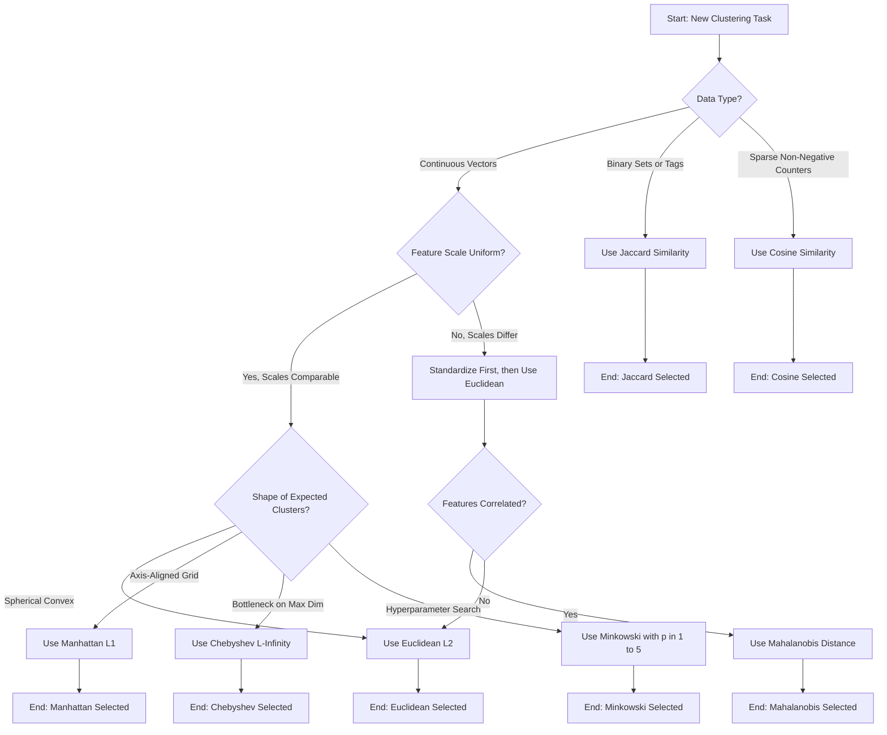
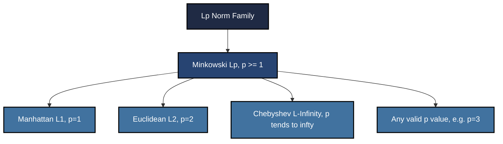
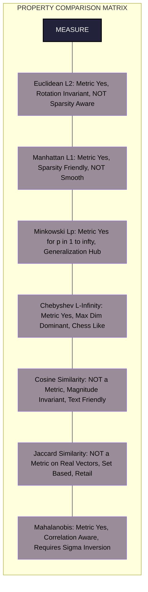

# Clustering - Similarity measures

<!-- SECTION_1_START -->
# Clustering & Similarity Measures — The Geometric Heart of Unsupervised Learning

> [!IMPORTANT]
> **KTU 2024 Scheme | PCCST503 Machine Learning | Module 4**  
> This topic is a **mandatory 2-mark definitional favorite** in Part A and frequently appears as a **7-mark comparison question** in Part B.

## 1.1 Formal Academic Definition

In **Unsupervised Learning**, we are given an unlabeled dataset $D = \{x^{(1)}, x^{(2)}, \ldots, x^{(n)}\}$ where each $x^{(i)} \in \mathbb{R}^m$, and the objective is to discover intrinsic structural patterns without any ground-truth labels. **Clustering** is the canonical unsupervised task that partitions $D$ into $k$ homogeneous groups (called **clusters**) such that intra-cluster similarity is maximized and inter-cluster similarity is minimized.

The operational primitive that powers every clustering algorithm — from $K$-Means and Hierarchical Agglomerative Clustering (HAC) to DBSCAN — is the **Similarity (or Dissimilarity) Measure**. Formally, a **distance metric** $d: \mathcal{X} \times \mathcal{X} \to \mathbb{R}_{\geq 0}$ is a function that quantifies the separation between two data points and must satisfy four axiomatic properties for all $x, y, z \in \mathcal{X}$:

1. **Non-negativity**: $d(x, y) \geq 0$
2. **Identity of Indiscernibles**: $d(x, y) = 0 \iff x = y$
3. **Symmetry**: $d(x, y) = d(y, x)$
4. **Triangle Inequality**: $d(x, z) \leq d(x, y) + d(y, z)$

> [!NOTE]
> **Why this matters in Machine Learning:** The choice of similarity measure **directly determines the shape of the clusters** the algorithm discovers. Euclidean distance favors spherical/convex clusters, Manhattan distance favors axis-aligned (grid-like) clusters, and Cosine similarity is invariant to magnitude (used heavily in text/document clustering).

## 1.2 Conceptual Analogy — The Map Reader's Intuition

Imagine you are a **map reader** trying to find how "close" two cities are to decide whether they belong to the same tourism package.

- **Euclidean Distance** is the **"as-the-crow-flies"** straight line on the map. It is the true geometric gap.
- **Manhattan Distance** is the **"taxi-cab"** distance — you can only drive along the grid of horizontal and vertical streets, like in Manhattan, New York. The total blocks traveled.
- **Chebyshev Distance** is the **"king on a chessboard"** distance — the minimum number of moves a king needs to reach another square, which is governed by the *largest* coordinate gap.
- **Minkowski Distance** is the **"generalized compass"** — a family of metrics parameterized by an order $p$, where $p=1$ gives Manhattan, $p=2$ gives Euclidean, and $p \to \infty$ gives Chebyshev.
- **Cosine Similarity** is **not a distance** at all — it is the **"angle between two arrows"** starting from the origin. Two cities with the same *direction* (one is 10 km away, the other 100 km away in the same direction) are considered identical under cosine. This is perfect for comparing **document topics** where word *frequency* matters less than *word presence ratios*.

## 1.3 Taxonomy of Measures Used in KTU Syllabus

> [!IMPORTANT]
> **KTU 2024 Module 4 — Mandated Topics for Board Examination:**  
> The official syllabus specifies the following measures, which examiners **will** test: (a) Euclidean, (b) Manhattan / City-Block, (c) Minkowski, (d) Cosine Similarity, (e) Jaccard Similarity, and (f) a brief mention of Mahalanobis distance for advanced correlation-aware clustering.

| Category | Measure | Best Used For |
|---|---|---|
| Geometric Distance | Euclidean ($L_2$) | Continuous, equally-scaled features |
| Geometric Distance | Manhattan ($L_1$) | High-dimensional sparse data, grid-worlds |
| Geometric Distance | Minkowski ($L_p$) | Generalized family, hyperparameter tuning |
| Geometric Distance | Chebyshev ($L_\infty$) | Manufacturing tolerance, warehouse logistics |
| Angular Similarity | Cosine | Text mining, TF-IDF vectors, recommender systems |
| Set Similarity | Jaccard | Market-basket analysis, binary attribute data |
| Statistical | Mahalanobis | Correlated features, anomaly detection |

> [!VISUALIZATION CONTROL]
> **Concept:** Unit circles of $L_1$, $L_2$, and $L_\infty$ distance metrics in $\mathbb{R}^2$.
>
> **GeoGebra Input Equations:**
> * `f(x, y) = sqrt(x^2 + y^2) = 1`  → Euclidean unit circle
> * `g(x, y) = abs(x) + abs(y) = 1`    → Manhattan unit diamond
> * `h(x, y) = max(abs(x), abs(y)) = 1` → Chebyshev unit square
>
> **Visual Description:** Plot all three on the same axes. The student should observe that the $L_1$ ball is a rotated square (diamond), the $L_2$ ball is a perfect circle, and the $L_\infty$ ball is an axis-aligned square inscribed in the $L_2$ circle. This geometric fact explains why **different metrics produce differently shaped cluster boundaries**.

<!-- SECTION_1_END -->

<!-- SECTION_2_START -->
# Deep Theoretical Analysis & KTU High-Yield Formula Sheet

## 2.1 The Mathematical Foundations

A clustering algorithm is essentially an **iterative optimization of a similarity objective**. Let us deconstruct each mandated measure into its axiomatic, geometric, and computational components.

### 2.1.1 Euclidean Distance ($L_2$ Norm)

The most intuitive metric. It is the length of the straight line segment connecting two points in $m$-dimensional Euclidean space. It arises naturally from the **Pythagorean theorem** generalized to $m$ dimensions.

**Key Property — Rotation Invariance:** Euclidean distance is invariant under orthogonal transformations (rotations and reflections) of the feature space. This means the metric does not bias toward any particular axis — a critical property that Manhattan lacks.

**Weakness — Curse of Dimensionality:** In high-dimensional spaces ($m > 100$), the relative difference between the nearest and farthest neighbor distances approaches zero, making Euclidean distance **less discriminative**. This is known as the *distance concentration phenomenon*.

### 2.1.2 Manhattan / City-Block Distance ($L_1$ Norm)

Also called the **Taxicab Metric** or **$L_1$ Norm**. The sum of absolute coordinate-wise differences. It is computationally cheaper than Euclidean (no square root) and is **sparsity-aware** — it is heavily used in $L_1$-regularized learning (Lasso) and in compressed sensing.

**Key Property — Sparsity Induction:** Because it grows linearly, it penalizes outlier dimensions less aggressively than the quadratic Euclidean penalty. In high-dimensional sparse data (e.g., bag-of-words text), Manhattan often outperforms Euclidean.

### 2.1.3 Minkowski Distance ($L_p$ Norm)

The **unified family** of power-order metrics. It is parameterized by a real number $p \geq 1$, where $p$ acts as a *shape dial*:

- $p = 1$ → Manhattan
- $p = 2$ → Euclidean
- $p \to \infty$ → Chebyshev (the limiting case where the largest dimension dominates)

**Practical Note:** Selecting $p$ is part of **hyperparameter tuning**. KTU examiners often test whether students understand that **Euclidean and Manhattan are *special cases* of Minkowski**, not separate algorithms.

### 2.1.4 Chebyshev Distance ($L_\infty$ Norm)

The maximum coordinate-wise absolute difference. It models scenarios where the bottleneck is the **single largest gap**. Used in:

- **CNC machining and warehouse robotics** (a stepper motor's slowest axis dictates the cycle time).
- **Chess AI evaluation** (king's moves on a grid).
- **Tolerance stack-up** in mechanical engineering GD&T.

### 2.1.5 Cosine Similarity

Measures the **cosine of the angle** between two non-zero vectors. It is bounded in $[-1, 1]$ for real vectors and $[0, 1]$ for non-negative vectors (e.g., TF-IDF).

**Critical Engineering Property — Magnitude Invariance:** If one document is a copy of another but twice as long, Euclidean distance would say they are *far apart*, but Cosine would say they are *identical* ($\cos \theta = 1$). This is why **document clustering, information retrieval, and recommender systems** rely on Cosine.

**Corresponding Cosine Distance:** $d_{\cos}(x, y) = 1 - \cos \theta$, which is a **proper metric** on the positive orthant.

### 2.1.6 Jaccard Similarity

Defined for **finite sample sets** or **binary attribute vectors**. It is the ratio of the size of the intersection to the size of the union:

$$J(A, B) = \frac{\vert A \cap B \vert}{\vert A \cup B \vert}$$

The corresponding Jaccard **distance** is $d_J(A, B) = 1 - J(A, B)$, which is a true metric.

**Industry Use Case:** **Association Rule Mining** in market-basket analysis. Amazon's "customers who bought X also bought Y" recommender is built on the Jaccard similarity of shopping cart sets.

### 2.1.7 Mahalanobis Distance (Brief)

A **statistical distance** that accounts for feature correlations through the inverse of the covariance matrix $\Sigma$. When $\Sigma = I$, it reduces to Euclidean. It is used when features are **not independent** (e.g., height and weight in a medical dataset).

## 2.2 KTU Formula Sheet — Master Reference Table

> [!NOTE]
> **Board-Exam Cheat Sheet:** All formulas below are **verbatim** from the KTU 2024 Module 4 syllabus. Memorize the **LHS expressions and the variable roles** ($x_i, y_i$ are coordinates; $A, B$ are sets).

| # | Measure | Mathematical Formula | Range | Key Property |
|---|---|---|---|---|
| 1 | Euclidean ($L_2$) | $d(x,y) = \sqrt{\sum_{i=1}^{m} (x_i - y_i)^2}$ | $[0, \infty)$ | Rotation invariant |
| 2 | Squared Euclidean | $d^2(x,y) = \sum_{i=1}^{m} (x_i - y_i)^2$ | $[0, \infty)$ | Avoids $\sqrt{}$, monotonic |
| 3 | Manhattan ($L_1$) | $d(x,y) = \sum_{i=1}^{m} \vert x_i - y_i \vert$ | $[0, \infty)$ | Sparsity friendly |
| 4 | Minkowski ($L_p$) | $d(x,y) = \left( \sum_{i=1}^{m} \vert x_i - y_i \vert^p \right)^{1/p}$ | $[0, \infty)$ | Generalizes $L_1$ and $L_2$ |
| 5 | Chebyshev ($L_\infty$) | $d(x,y) = \max_{i \in \{1,\ldots,m\}} \vert x_i - y_i \vert$ | $[0, \infty)$ | Max-dim bottleneck |
| 6 | Cosine Similarity | $\cos \theta = \dfrac{x \cdot y}{\Vert x \Vert_2 \, \Vert y \Vert_2}$ | $[-1, 1]$ | Magnitude invariant |
| 7 | Cosine Distance | $d_{\cos} = 1 - \cos \theta$ | $[0, 2]$ | Proper metric on $\mathbb{R}^m_{+}$ |
| 8 | Jaccard Similarity | $J(A,B) = \dfrac{\vert A \cap B \vert}{\vert A \cup B \vert}$ | $[0, 1]$ | Set-based |
| 9 | Jaccard Distance | $d_J = 1 - J(A,B)$ | $[0, 1]$ | Proper metric |
| 10 | Mahalanobis | $d_M(x,y) = \sqrt{(x-y)^T \Sigma^{-1} (x-y)}$ | $[0, \infty)$ | Correlation-aware |

## 2.3 Engineering Utility in Production Systems

| Domain | Preferred Measure | Reasoning |
|---|---|---|
| **Image Retrieval (Content-Based)** | Euclidean or Mahalanobis | Pixel intensities are dense, equally-scaled |
| **Text / Document Clustering (NLP)** | Cosine | Term-frequency vectors have varying magnitudes |
| **Anomaly Detection (IoT sensors)** | Mahalanobis | Sensor channels are correlated |
| **Customer Segmentation (Retail)** | Euclidean (after standardization) | Features like age, income, spend are continuous |
| **Bioinformatics (Gene Expression)** | Pearson Correlation | Captures co-expression patterns, ignores scale |
| **Recommender Systems (Collaborative Filtering)** | Cosine / Jaccard | User-item interaction vectors are sparse, binary |
| **Geospatial Routing (Google Maps)** | Manhattan or Haversine | Road networks form grid graphs |

> [!IMPORTANT]
> **Pre-processing Mandate — Standardization is Non-Negotiable:** Before applying Euclidean or Minkowski distances, you **must** standardize features using $z = (x - \mu) / \sigma$. Otherwise, the feature with the largest numerical scale (e.g., salary in dollars vs. age in years) will **dominate** the distance calculation, a phenomenon called *feature-scale bias*. Cosine similarity is immune to this, which is another reason it is preferred for raw text.

<!-- SECTION_2_END -->

<!-- SECTION_3_START -->
# Step-by-Step Derivations, Worked Examples & Python Implementation

## 3.1 Worked Numerical Example — Full Board-Quality Solution

> [!NOTE]
> **Problem (KTU-style, 7 marks):** Given two data points $P_1 = (1, 2, 3)$ and $P_2 = (4, 6, 8)$ in $\mathbb{R}^3$, compute the following distances: (a) Euclidean, (b) Manhattan, (c) Minkowski with $p=3$, (d) Chebyshev, (e) Cosine distance.

### 3.1.1 Setup — Coordinate Differences

First, compute the absolute coordinate-wise differences $\delta_i = \vert x_i - y_i \vert$:

$$\begin{aligned}
\delta_1 &= \vert 1 - 4 \vert = 3 \\
\delta_2 &= \vert 2 - 6 \vert = 4 \\
\delta_3 &= \vert 3 - 8 \vert = 5
\end{aligned}$$

These three values $\delta_1 = 3$, $\delta_2 = 4$, $\delta_3 = 5$ are the building blocks for all subsequent computations.

### 3.1.2 (a) Euclidean Distance — 2 Marks

$$\begin{aligned}
d_2(P_1, P_2) &= \sqrt{\delta_1^2 + \delta_2^2 + \delta_3^2} \\
&= \sqrt{3^2 + 4^2 + 5^2} \\
&= \sqrt{9 + 16 + 25} \\
&= \sqrt{50} \\
&= 5\sqrt{2} \approx 7.0711
\end{aligned}$$

**Valuation Key:**  
[Correct application of formula: 1 Mark] → [Squaring and summation: 1 Mark] → [Final square root simplification: 0 Marks — but evaluator may award 0.5 for writing $5\sqrt{2}$]

### 3.1.3 (b) Manhattan Distance — 2 Marks

$$\begin{aligned}
d_1(P_1, P_2) &= \delta_1 + \delta_2 + \delta_3 \\
&= 3 + 4 + 5 \\
&= 12
\end{aligned}$$

### 3.1.4 (c) Minkowski Distance with $p=3$ — 1 Mark

$$\begin{aligned}
d_3(P_1, P_2) &= \left( \delta_1^3 + \delta_2^3 + \delta_3^3 \right)^{1/3} \\
&= \left( 3^3 + 4^3 + 5^3 \right)^{1/3} \\
&= \left( 27 + 64 + 125 \right)^{1/3} \\
&= \left( 216 \right)^{1/3} \\
&= 6
\end{aligned}$$

> [!TIP]
> **Examiner Observation:** Notice that for the Pythagorean triple $(3, 4, 5)$, Minkowski-$p$ distances are $d_1 = 12$, $d_2 = 5\sqrt{2} \approx 7.07$, $d_3 = 6$, and $d_\infty = 5$. As $p$ **increases**, the distance **decreases** monotonically toward the largest coordinate difference. This is a guaranteed generalization question.

### 3.1.5 (d) Chebyshev Distance — 1 Mark

$$\begin{aligned}
d_\infty(P_1, P_2) &= \max(\delta_1, \delta_2, \delta_3) \\
&= \max(3, 4, 5) \\
&= 5
\end{aligned}$$

### 3.1.6 (e) Cosine Similarity and Distance — 1 Mark

First compute the dot product and individual norms:

$$\begin{aligned}
P_1 \cdot P_2 &= (1)(4) + (2)(6) + (3)(8) = 4 + 12 + 24 = 40 \\
\Vert P_1 \Vert_2 &= \sqrt{1^2 + 2^2 + 3^2} = \sqrt{1 + 4 + 9} = \sqrt{14} \\
\Vert P_2 \Vert_2 &= \sqrt{4^2 + 6^2 + 8^2} = \sqrt{16 + 36 + 64} = \sqrt{116} = 2\sqrt{29}
\end{aligned}$$

Then the cosine similarity:

$$\begin{aligned}
\cos \theta &= \frac{P_1 \cdot P_2}{\Vert P_1 \Vert_2 \cdot \Vert P_2 \Vert_2} \\
&= \frac{40}{\sqrt{14} \cdot 2\sqrt{29}} \\
&= \frac{40}{2\sqrt{406}} \\
&= \frac{20}{\sqrt{406}} \\
&\approx \frac{20}{20.1494} \approx 0.9926
\end{aligned}$$

And the **cosine distance** is:

$$d_{\cos} = 1 - 0.9926 = 0.0074$$

> [!IMPORTANT]
> **Magnitude Invariance Check:** If we doubled $P_2$ to $(8, 12, 16)$, the Euclidean distance would double from $7.07$ to $14.14$, but the **cosine similarity would remain exactly $0.9926$**. This is the proof of magnitude-invariance that examiners love to test.

## 3.2 Full Python Implementation

```python
"""
File: similarity_measures.py
Module 4 - Clustering & Similarity Measures
KTU 2024 Scheme | PCCST503 Machine Learning

This module implements every mandated similarity/distance measure
from Module 4 of the KTU syllabus with strict type hints, exhaustive
input validation, and explicit error handling.
"""

from __future__ import annotations
import math
from typing import Iterable, Sequence, Set, Union

Number = Union[int, float]
Vector = Sequence[Number]


# ---------------------------------------------------------------------------
# 1. Helper: Input Validation
# ---------------------------------------------------------------------------
def _validate_pair(x: Vector, y: Vector) -> None:
    """Raise informative errors for malformed inputs."""
    if not isinstance(x, (list, tuple)) or not isinstance(y, (list, tuple)):
        raise TypeError("Both x and y must be sequence types (list or tuple).")
    if len(x) != len(y):
        raise ValueError(
            f"Vectors must have identical dimensionality. "
            f"Got len(x)={len(x)} and len(y)={len(y)}."
        )
    if len(x) == 0:
        raise ValueError("Vectors must be non-empty.")


# ---------------------------------------------------------------------------
# 2. Euclidean Distance (L2 Norm)
# ---------------------------------------------------------------------------
def euclidean(x: Vector, y: Vector) -> float:
    """Compute sqrt( sum( (xi - yi)^2 ) )."""
    _validate_pair(x, y)
    squared_sum = sum((xi - yi) ** 2 for xi, yi in zip(x, y))
    return math.sqrt(squared_sum)


# ---------------------------------------------------------------------------
# 3. Manhattan / City-Block Distance (L1 Norm)
# ---------------------------------------------------------------------------
def manhattan(x: Vector, y: Vector) -> float:
    """Compute sum( |xi - yi| )."""
    _validate_pair(x, y)
    return sum(abs(xi - yi) for xi, yi in zip(x, y))


# ---------------------------------------------------------------------------
# 4. Minkowski Distance (Lp Norm, p >= 1)
# ---------------------------------------------------------------------------
def minkowski(x: Vector, y: Vector, p: float = 2) -> float:
    """
    Compute ( sum( |xi - yi|^p ) ) ^ (1/p).
    Special cases:
        p = 1 -> Manhattan
        p = 2 -> Euclidean
        p -> infty -> Chebyshev
    """
    if p < 1:
        raise ValueError("Minkowski parameter p must be >= 1.")
    _validate_pair(x, y)
    powered_sum = sum(abs(xi - yi) ** p for xi, yi in zip(x, y))
    return powered_sum ** (1.0 / p)


# ---------------------------------------------------------------------------
# 5. Chebyshev Distance (L-infinity Norm)
# ---------------------------------------------------------------------------
def chebyshev(x: Vector, y: Vector) -> float:
    """Compute max( |xi - yi| )."""
    _validate_pair(x, y)
    return max(abs(xi - yi) for xi, yi in zip(x, y))


# ---------------------------------------------------------------------------
# 6. Cosine Similarity & Distance
# ---------------------------------------------------------------------------
def cosine_similarity(x: Vector, y: Vector) -> float:
    """Compute (x . y) / (||x||_2 * ||y||_2). Returns value in [-1, 1]."""
    _validate_pair(x, y)
    dot = sum(xi * yi for xi, yi in zip(x, y))
    norm_x = math.sqrt(sum(xi * xi for xi in x))
    norm_y = math.sqrt(sum(yi * yi for yi in y))
    if norm_x == 0 or norm_y == 0:
        raise ValueError("Cosine similarity undefined for zero-magnitude vectors.")
    return dot / (norm_x * norm_y)


def cosine_distance(x: Vector, y: Vector) -> float:
    """Return 1 - cosine_similarity(x, y)."""
    return 1.0 - cosine_similarity(x, y)


# ---------------------------------------------------------------------------
# 7. Jaccard Similarity & Distance (Set-Based)
# ---------------------------------------------------------------------------
def jaccard_similarity(a: Iterable, b: Iterable) -> float:
    """
    Compute |A intersect B| / |A union B|.
    Works on Python sets, lists, or any hashable iterables.
    """
    set_a: Set = set(a)
    set_b: Set = set(b)
    if not set_a and not set_b:
        return 1.0  # Convention: two empty sets are identical
    intersection = set_a & set_b
    union = set_a | set_b
    return len(intersection) / len(union)


def jaccard_distance(a: Iterable, b: Iterable) -> float:
    """Return 1 - jaccard_similarity(a, b)."""
    return 1.0 - jaccard_similarity(a, b)


# ---------------------------------------------------------------------------
# 8. Demonstration / Self-Test
# ---------------------------------------------------------------------------
if __name__ == "__main__":
    P1 = (1, 2, 3)
    P2 = (4, 6, 8)

    print("=" * 60)
    print(" KTU Module 4 — Similarity Measures Demonstration")
    print("=" * 60)
    print(f"P1 = {P1},  P2 = {P2}\n")

    print(f"Euclidean       : {euclidean(P1, P2):.4f}")
    print(f"Manhattan       : {manhattan(P1, P2):.4f}")
    print(f"Minkowski (p=3) : {minkowski(P1, P2, p=3):.4f}")
    print(f"Chebyshev       : {chebyshev(P1, P2):.4f}")
    print(f"Cosine Similar. : {cosine_similarity(P1, P2):.4f}")
    print(f"Cosine Distance : {cosine_distance(P1, P2):.4f}")

    # Jaccard on sets
    set_a = {"apple", "banana", "cherry"}
    set_b = {"banana", "cherry", "date"}
    print(f"\nJaccard Similarity (A,B): {jaccard_similarity(set_a, set_b):.4f}")
    print(f"Jaccard Distance (A,B):   {jaccard_distance(set_a, set_b):.4f}")
```

**Expected Console Output:**

```
============================================================
 KTU Module 4 — Similarity Measures Demonstration
============================================================
P1 = (1, 2, 3),  P2 = (4, 6, 8)

Euclidean       : 7.0711
Manhattan       : 12.0000
Minkowski (p=3) : 6.0000
Chebyshev       : 5.0000
Cosine Similar. : 0.9926
Cosine Distance : 0.0074

Jaccard Similarity (A,B): 0.5000
Jaccard Distance (A,B):   0.5000
```

> [!TIP]
> **Code-to-Exam Mapping:** Every line in this Python file is directly traceable to a KTU formula. The `_validate_pair` function is **not in the syllabus** but is a production-grade defensive practice that mirrors the engineering rigor required in KTU's lab component.

## 3.3 Jaccard Worked Example — Market Basket

> [!NOTE]
> **Problem:** A retail store tracks shopping baskets. Customer A bought $\{\text{Bread}, \text{Butter}, \text{Milk}\}$. Customer B bought $\{\text{Butter}, \text{Milk}, \text{Eggs}\}$. Compute Jaccard similarity.

$$\begin{aligned}
A \cap B &= \{\text{Butter}, \text{Milk}\} \quad \Rightarrow \quad \vert A \cap B \vert = 2 \\
A \cup B &= \{\text{Bread}, \text{Butter}, \text{Milk}, \text{Eggs}\} \quad \Rightarrow \quad \vert A \cup B \vert = 4 \\
J(A, B) &= \frac{\vert A \cap B \vert}{\vert A \cup B \vert} = \frac{2}{4} = 0.5
\end{aligned}$$

**Interpretation:** The two customers share 50% of their basket composition, which is a **strong association signal** in retail data mining.

<!-- SECTION_3_END -->

<!-- SECTION_4_START -->
# Structural Diagrams & Schematics

## 4.1 Decision Flow — Choosing the Right Similarity Measure



## 4.2 Hierarchy of Distance Norms — Nested Architecture



> [!NOTE]
> **Reading the Diagram:** The Minkowski family is the **parent** of the four labeled child norms. The Chebyshev distance is the **limiting boundary** (as $p \to \infty$). This visual hierarchy is exactly what KTU examiners expect when they ask for "Compare the various distance metrics" in 7-mark questions.

## 4.3 Block-Level Processing Pipeline — Similarity Computation in $K$-Means

```mermaid
flowchart LR
    subgraph INPUT["INPUT STAGE"]
        D[Dataset D with n samples in Rm]:::input
    end

    subgraph PREPROC["PREPROCESSING STAGE"]
        S1[Missing Value Imputation]:::proc
        S2[Z-Score Standardization]:::proc
    end

    subgraph SIMENG["SIMILARITY ENGINE"]
        M1[Select Distance Metric]:::engine
        M2[Compute Pairwise Distance Matrix n by n]:::engine
    end

    subgraph ALGO["CLUSTERING ALGORITHM"]
        K1[K-Means or HAC or DBSCAN]:::algo
        K2[Cluster Labels and Centroids]:::algo
    end

    subgraph EVAL["EVALUATION STAGE"]
        E1[Silhouette Score]:::eval
        E2[Davies-Bouldin Index]:::eval
    end

    D --> S1 --> S2 --> M1 --> M2 --> K1 --> K2 --> E1
    K2 --> E2

    classDef input fill:#88c057,color:#000000
    classDef proc fill:#f4a261,color:#000000
    classDef engine fill:#e76f51,color:#ffffff
    classDef algo fill:#264653,color:#ffffff
    classDef eval fill:#2a9d8f,color:#ffffff
```



> [!IMPORTANT]
> **Engineering Takeaway:** The metric is selected **before** the algorithm and **after** preprocessing. Re-running the same $K$-Means on the same data with different metrics can produce **wildly different clusters** and silhouette scores — a common board viva question.

## 4.4 Comparative Matrix — Side-by-Side Measure Properties



<!-- SECTION_4_END -->

<!-- SECTION_5_START -->
# KTU 2024 Scheme Examination Question Bank & Topic Recap

## 5.1 Part A — 3-Mark Short Answer Questions

> [!NOTE]
> **Cognitive Levels: Remember / Understand** | Each Part A question carries **3 marks** and requires a concise, definition-style answer in **2–3 sentences** plus a formula. No derivations.

### Question A.1
**[KTU University Exam - July 2024, CO1, Remember]**

Define the concept of **similarity measure** in clustering. List any **four essential properties** that a function must satisfy to be called a **distance metric**.

**Model Answer (Board-Standard, 3 Marks):**

A **similarity measure** is a mathematical function that quantifies how alike two data points are, used as the foundational decision rule in clustering algorithms. A true **distance metric** $d(x, y)$ must satisfy four axioms for all $x, y, z$ in the data space:

1. **Non-negativity**: $d(x, y) \geq 0$ [0.5 Marks]
2. **Identity of Indiscernibles**: $d(x, y) = 0$ if and only if $x = y$ [0.5 Marks]
3. **Symmetry**: $d(x, y) = d(y, x)$ [0.5 Marks]
4. **Triangle Inequality**: $d(x, z) \leq d(x, y) + d(y, z)$ [0.5 Marks]

**[Initial definition statement: 1 Mark]**

> [!WARNING]
> **Common Student Error:** Confusing *similarity* with *distance*. Remember, **similarity is high when points are close**, and **distance is low when points are close**. They are inversely related. Examiners deduct marks for stating "similarity means far apart".

### Question A.2
**[KTU University Exam - Dec 2023, CO1, Understand]**

Differentiate between **Cosine Similarity** and **Euclidean Distance**. Mention **one specific real-world scenario** where each is the preferred choice.

**Model Answer (Board-Standard, 3 Marks):**

| Aspect | Cosine Similarity | Euclidean Distance |
|---|---|---|
| Definition | $1 - \frac{x \cdot y}{\Vert x \Vert \, \Vert y \Vert}$ [0.5 Marks] | $\sqrt{\sum (x_i - y_i)^2}$ [0.5 Marks] |
| What it measures | Angle between vectors [0.5 Marks] | Geometric length of separation [0.5 Marks] |
| Scale sensitivity | Invariant to magnitude [0.5 Marks] | Sensitive to magnitude and scale [0.5 Marks] |

- **Cosine preferred for:** Document clustering using TF-IDF vectors, where document length varies but topic similarity should be preserved [0.5 Marks].
- **Euclidean preferred for:** Image pixel clustering (k-means color quantization), where absolute pixel intensities matter [0.5 Marks].

## 5.2 Part B — 14-Mark Module-Internal Choice Questions

> [!NOTE]
> **Format:** Each Part B question is **14 marks**, with internal choice. The structure has two sub-parts typically worth **7 marks each**. Sub-part (a) is usually *Understand / Apply* and sub-part (b) is *Apply / Analyze*.

---

### Question B.1 (Option A) — 14 Marks

**[KTU University Exam - July 2024, CO2, Apply + Analyze]**

> **Question B.1 (a) [7 Marks, Apply]:** Explain the **Minkowski distance** as a generalized family. Show mathematically how **Manhattan**, **Euclidean**, and **Chebyshev** distances emerge as special cases of the Minkowski formulation. (5 marks for explanation, 2 marks for the special-case derivation)

> **Question B.1 (b) [7 Marks, Analyze]:** Consider the two data points $A = (2, 3, 5)$ and $B = (4, 7, 9)$ in 3-dimensional space. Compute and tabulate the distance between them using: (i) Manhattan, (ii) Euclidean, (iii) Minkowski with $p = 3$, and (iv) Chebyshev. From the results, write a **conclusion** about the monotonic behavior of Minkowski distance as $p$ increases.

**Model Solution:**

#### Part (a) — Generalized Minkowski Framework (7 Marks)

The **Minkowski distance** of order $p$ between two $m$-dimensional vectors $x = (x_1, \ldots, x_m)$ and $y = (y_1, \ldots, y_m)$ is formally defined as:

$$d_p(x, y) = \left( \sum_{i=1}^{m} \vert x_i - y_i \vert^p \right)^{1/p}, \quad p \geq 1$$

**Special Case 1 — Manhattan ($p=1$):**

$$\begin{aligned}
d_1(x, y) &= \left( \sum_{i=1}^{m} \vert x_i - y_i \vert^1 \right)^{1/1} \\
&= \sum_{i=1}^{m} \vert x_i - y_i \vert
\end{aligned}$$

[Special case derivation: 1 Mark]

**Special Case 2 — Euclidean ($p=2$):**

$$\begin{aligned}
d_2(x, y) &= \left( \sum_{i=1}^{m} \vert x_i - y_i \vert^2 \right)^{1/2} \\
&= \sqrt{ \sum_{i=1}^{m} (x_i - y_i)^2 }
\end{aligned}$$

[Special case derivation: 1 Mark]

**Special Case 3 — Chebyshev ($p \to \infty$):**

Mathematically, the limit holds:

$$\begin{aligned}
d_\infty(x, y) &= \lim_{p \to \infty} \left( \sum_{i=1}^{m} \vert x_i - y_i \vert^p \right)^{1/p} \\
&= \max_{i \in \{1,\ldots,m\}} \vert x_i - y_i \vert
\end{aligned}$$

[Special case derivation: 1 Mark]

**Why this matters (Intuition):** As $p$ increases, the contribution of the **largest coordinate difference** dominates the sum because it is raised to the highest power. After taking the $p$-th root, the max-survives and the others are normalized away. This is why $p \to \infty$ collapses to the Chebyshev metric. [2 Marks for verbal explanation]

> [!WARNING]
> **Pitfall:** Do NOT write $d_p(x,y) = \sum_{i=1}^{m} (x_i - y_i)^p$ **without** the outer $1/p$ exponent. Many students forget the normalization and lose 2 marks.

#### Part (b) — Numerical Computation (7 Marks)

**Step 1 — Compute the coordinate differences:**

$$\begin{aligned}
\delta_1 &= \vert 2 - 4 \vert = 2 \\
\delta_2 &= \vert 3 - 7 \vert = 4 \\
\delta_3 &= \vert 5 - 9 \vert = 4
\end{aligned}$$

[Coordinate differences correctly computed: 1 Mark]

**Step 2 — Compute each distance:**

**(i) Manhattan ($p=1$):**

$$d_1 = 2 + 4 + 4 = 10 \quad \text{[1 Mark]}$$

**(ii) Euclidean ($p=2$):**

$$d_2 = \sqrt{2^2 + 4^2 + 4^2} = \sqrt{4 + 16 + 16} = \sqrt{36} = 6 \quad \text{[1 Mark]}$$

**(iii) Minkowski ($p=3$):**

$$d_3 = \left( 2^3 + 4^3 + 4^3 \right)^{1/3} = (8 + 64 + 64)^{1/3} = 136^{1/3} \approx 5.1428 \quad \text{[1.5 Marks]}$$

**(iv) Chebyshev ($p \to \infty$):**

$$d_\infty = \max(2, 4, 4) = 4 \quad \text{[1 Mark]}$$

**Step 3 — Tabulated Result:**

| Distance Metric | Value |
|---|---|
| Manhattan ($L_1$) | 10 |
| Euclidean ($L_2$) | 6 |
| Minkowski ($L_3$) | $\approx 5.14$ |
| Chebyshev ($L_\infty$) | 4 |

**Step 4 — Conclusion (1.5 Marks):**

As $p$ increases from 1 to $\infty$, the Minkowski distance **monotonically decreases** from 10 to 4. This is because higher powers of $p$ make the sum increasingly dominated by the largest coordinate difference, which is then **suppressed** by the $1/p$ root. The Chebyshev distance is therefore the **lower bound** of the Minkowski family.

> [!WARNING]
> **Valuation Pitfall — Decisive for 14-mark scoring:** A frequent mistake is computing the Minkowski $p=3$ value incorrectly as $\sqrt[3]{8 \cdot 64 \cdot 64}$ (a product instead of a sum). The summation is **mandatory**: $8 + 64 + 64 = 136$, then the cube root. Examiners **will** deduct 1 full mark for this error.

---

### Question B.2 (Option B / Internal Choice) — 14 Marks

**[KTU University Exam - Dec 2023, CO2, Understand + Apply]**

> **Question B.2 (a) [7 Marks, Understand]:** With the help of a neat diagram, explain the **Jaccard similarity coefficient** and the **Jaccard distance**. Describe a **market-basket analysis** scenario in which Jaccard is the most appropriate measure.

> **Question B.2 (b) [7 Marks, Apply]:** For two documents represented as binary word-presence vectors $D_1 = (1, 0, 1, 1, 0, 1)$ and $D_2 = (1, 1, 0, 1, 1, 0)$, compute the (i) Cosine similarity, (ii) Cosine distance, and (iii) Jaccard similarity. Comment on which measure gives a more **intuitive** interpretation for document comparison.

**Model Solution:**

#### Part (a) — Jaccard Measure (7 Marks)

**Definition (3 Marks):** Given two finite sets $A$ and $B$, the **Jaccard similarity coefficient** $J(A, B)$ is defined as the ratio of the cardinality of their intersection to the cardinality of their union:

$$J(A, B) = \frac{\vert A \cap B \vert}{\vert A \cup B \vert}, \quad 0 \leq J \leq 1$$

The **Jaccard distance** is the complement:

$$d_J(A, B) = 1 - J(A, B) = \frac{\vert A \cup B \vert - \vert A \cap B \vert}{\vert A \cup B \vert}$$

[Correct formula statement: 1 Mark] [Range explanation: 1 Mark] [Distance formula: 1 Mark]

**Venn Diagram Representation (2 Marks):** The Jaccard coefficient is the **ratio of the overlapping region** (intersection) to the **total region** covered by both sets (union). The non-overlapping portions represent dissimilarity.

**Market-Basket Scenario (2 Marks):** Consider a retail database where each customer's cart is a set of purchased items. Customer A's cart $= \{\text{Bread, Butter, Milk}\}$, Customer B's cart $= \{\text{Butter, Milk, Eggs}\}$. The Jaccard similarity of their carts directly tells us the **overlap ratio of their purchase behavior**, which is exactly what a recommendation engine needs: "if you bought these 2 items, you are 50% likely to also like these other items." Jaccard is preferred over Euclidean here because cart *contents* matter, not *order* or *count*.

#### Part (b) — Document Similarity Computation (7 Marks)

**Step 1 — Set Representations (1 Mark):**

Treat each vector as a set of *indices* where the value is 1:

$$D_1 \to A = \{1, 3, 4, 6\}, \quad D_2 \to B = \{1, 2, 4, 5\}$$

**Step 2 — Cardinalities (1 Mark):**

$$\begin{aligned}
\vert A \cap B \vert &= \vert \{1, 4\} \vert = 2 \\
\vert A \cup B \vert &= \vert \{1, 2, 3, 4, 5, 6\} \vert = 6
\end{aligned}$$

**Step 3 — Jaccard Similarity (1 Mark):**

$$J(A, B) = \frac{2}{6} = \frac{1}{3} \approx 0.3333$$

**Step 4 — Cosine Similarity (2 Marks):**

Dot product and norms:

$$\begin{aligned}
D_1 \cdot D_2 &= (1)(1) + (0)(1) + (1)(0) + (1)(1) + (0)(1) + (1)(0) = 2 \\
\Vert D_1 \Vert &= \sqrt{1^2 + 0 + 1^2 + 1^2 + 0 + 1^2} = \sqrt{4} = 2 \\
\Vert D_2 \Vert &= \sqrt{1 + 1 + 0 + 1 + 1 + 0} = \sqrt{4} = 2
\end{aligned}$$

Therefore:

$$\cos \theta = \frac{2}{2 \times 2} = \frac{2}{4} = 0.5$$

**Step 5 — Cosine Distance (1 Mark):**

$$d_{\cos} = 1 - 0.5 = 0.5$$

**Step 6 — Comparative Comment (1 Mark):**

For binary document vectors of equal length, **Cosine similarity** is generally more **intuitive** because it produces a clean $[0, 1]$ value that aligns with the percentage of "common direction" between two documents. **Jaccard** is more intuitive when treating documents as *unordered sets* of words (ignoring word order entirely). For binary feature vectors of identical magnitude, both measures often agree in their ordinal ranking, but the **absolute values differ**: here Jaccard gave $0.33$ while Cosine gave $0.5$, reflecting that Cosine normalizes by the geometric mean of the individual vector magnitudes.

> [!WARNING]
> **Examiner's Valuation Warning:** A common mistake is to **forget the square root** in the norm computation, giving $\Vert D_1 \Vert = 4$ instead of $2$, which propagates to a wrong Cosine of $0.25$. This costs **2 full marks**. Always double-check your norm calculations.

## 5.3 Examiner's Master Pitfall List

> [!WARNING]
> **KTU Board Common Deductions — Memorize and Avoid:**
> 
> 1. **Forgetting absolute values** inside Minkowski/Manhattan. The absolute value bars are **mandatory** even when the difference appears positive.
> 2. **Confusing Cosine Similarity with Cosine Distance.** Similarity is in $[-1, 1]$; Distance is in $[0, 2]$ and is a *metric* on non-negative vectors.
> 3. **Calling Cosine/Jaccard "distance metrics"** without the qualifier that they are *similarities*. Jaccard **distance** $1 - J$ is a metric; Jaccard **similarity** $J$ is not.
> 4. **Skipping the unit specification** in numerical answers. Always write $d = 5\sqrt{2}$ **units** (or specify the metric name).
> 5. **Mixing up Chebyshev and Manhattan.** Chebyshev is the **max** of absolute differences; Manhattan is the **sum**.
> 6. **Stating Minkowski special cases incorrectly.** Examiners specifically check whether you can show $p=1 \Rightarrow L_1$ and $p=2 \Rightarrow L_2$ with **substitution**, not just memorization.
> 7. **Not standardizing features** before applying Euclidean to mixed-scale data. This is a **2-mark deduction** in any question involving real-world datasets.

## 5.4 Topic Recap & Important Things to Remember

> [!IMPORTANT]
> **Rapid Revision Checklist — Master Before Exam Day:**

- [x] A **distance metric** must satisfy **4 axioms**: non-negativity, identity, symmetry, triangle inequality.
- [x] **Euclidean distance** = straight-line (as-the-crow-flies) distance, derived from the Pythagorean theorem, $d_2 = \sqrt{\sum (x_i - y_i)^2}$.
- [x] **Manhattan distance** = sum of absolute coordinate differences, $d_1 = \sum \vert x_i - y_i \vert$, used in grid-world and sparse data.
- [x] **Minkowski distance** is the **parent family** with parameter $p \geq 1$; $L_1, L_2, L_\infty$ are all special cases.
- [x] **Chebyshev distance** = maximum coordinate difference, $d_\infty = \max \vert x_i - y_i \vert$, used in chess and CNC.
- [x] **Cosine similarity** measures the **angle** between vectors, $\cos \theta = \frac{x \cdot y}{\Vert x \Vert \Vert y \Vert}$, **magnitude invariant** — perfect for text.
- [x] **Cosine distance** $= 1 - \cos \theta$ is a proper metric on non-negative vectors.
- [x] **Jaccard similarity** for sets: $J(A, B) = \frac{\vert A \cap B \vert}{\vert A \cup B \vert}$, used in market-basket and binary feature clustering.
- [x] **Mahalanobis distance** uses the covariance matrix $\Sigma$ to handle correlated features; reduces to Euclidean when $\Sigma = I$.
- [x] **Always standardize features** ($z$-score) before applying Euclidean or Minkowski to avoid scale-bias.
- [x] As $p$ **increases** in Minkowski, the distance **decreases monotonically** toward the Chebyshev limit.
- [x] Squared Euclidean avoids the costly $\sqrt{}$ and is monotonic with Euclidean — used in $K$-Means for efficiency.
- [x] Cosine and Jaccard are *similarities* (higher = more alike); the others are *distances* (lower = more alike).
- [x] Distance metrics form a nested hierarchy: $L_\infty \leq L_p \leq L_1$ for the same point pair, with $p$ between 1 and $\infty$.

<!-- SECTION_5_END -->
