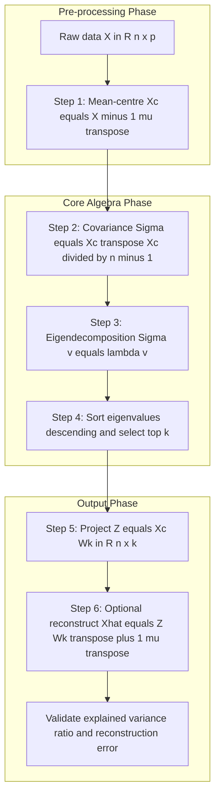
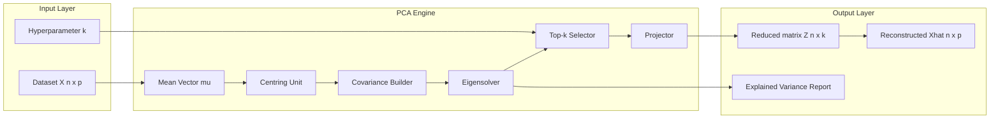
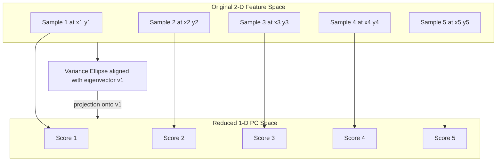

# Dimensionality reduction - Principal Component Analysis

<!-- SECTION_1_START -->

# Principal Component Analysis (PCA)

> [!NOTE]
> **KTU 2024 Syllabus Definition (PCCST503 — Module 4)**
> *Principal Component Analysis (PCA)* is a statistical procedure that uses an **orthogonal linear transformation** to convert a set of observations of possibly correlated variables into a set of values of linearly uncorrelated variables called **principal components**. The number of principal components is less than or equal to the number of original variables.

> [!IMPORTANT]
> **Why PCA belongs to Unsupervised Learning (Module 4 focus):**
> PCA is a *dimensionality reduction* technique that requires **no labelled output** $y$. It only operates on the feature matrix $X \in \mathbb{R}^{n \times p}$, learning the intrinsic structure of the data — this is the textbook signature of **unsupervised representation learning**.

## Conceptual Analogy — "The Shadow on the Wall"

Imagine a 3-D statue rotating under a single lamp. The shadow it casts on the 2-D wall is a **projection** of the 3-D shape onto a 2-D plane.

- The *best* shadow is the one that preserves the most information about the statue's outline.
- Different lamp angles produce different shadows. Some preserve length, some preserve depth.
- **PCA finds the lamp angle that produces the shadow with the maximum spread (variance).**

In mathematical terms:
- The **lamp direction** = the *principal axis* (eigenvector of the covariance matrix).
- The **shadow's spread** = the *variance captured* (eigenvalue).
- The **shadow itself** = the *projected data* (scores on principal components).

> [!TIP]
> **Slogan for the exam hall:**
> *"PCA finds the directions of maximum variance in high-dimensional data and projects it onto a lower-dimensional subspace spanned by the top-$k$ eigenvectors of the covariance matrix."*

## Key Symbols & Constants

| Symbol | Meaning | Typical Value |
| --- | --- | --- |
| $n$ | Number of samples (rows) | $\geq 30$ preferred |
| $p$ | Original feature dimensions | can be $100$–$10^6$ |
| $k$ | Reduced dimensions | $k \ll p$ |
| $\mu$ | **Mean vector** $\in \mathbb{R}^{p}$ | column-wise mean |
| $\Sigma$ | **Covariance matrix** $\in \mathbb{R}^{p \times p}$ | symmetric, positive semi-definite |
| $\lambda_i$ | **Eigenvalue** of $\Sigma$ | $\lambda_1 \geq \lambda_2 \geq \dots \geq \lambda_p$ |
| $v_i$ | **Eigenvector** (principal axis) | unit norm $\Vert v_i \Vert_2 = 1$ |
| $\sigma$ | Standard deviation | $\sqrt{\text{variance}}$ |

> [!VISUALIZATION CONTROL]
> **Concept:** Projection of 2-D Gaussian data onto its first principal axis
> **GeoGebra / Desmos Input Equations:**
> * `mu_x = 0`, `mu_y = 0`
> * `Sigma = {{2, 1.2}, {1.2, 1}}`  (positive definite covariance)
> * Eigenvalues: `lambda_1 = 2.516`, `lambda_2 = 0.484`
> * Eigenvector 1: `v_1 = (0.789, 0.614)`
> **Visual Description:** Draw an ellipse with semi-axes $\sqrt{\lambda_1}=1.586$ and $\sqrt{\lambda_2}=0.696$ rotated by $\arctan(0.614/0.789)\approx 37.9^\circ$. The longest axis of the ellipse is the **first principal component**; projecting data onto it retains the most variance.

<!-- SECTION_1_END -->

<!-- SECTION_2_START -->

# Deep Theoretical Analysis — The PCA Pipeline

PCA is not a single equation — it is a **six-step pipeline**. Mastering these six steps guarantees marks on any KTU 14-mark question.

## Step 1 — Centre the Data

Subtract the mean from every feature so that every column has mean **0**.

$$X_c = X - \mathbf{1} \cdot \mu^T$$

where $\mathbf{1}$ is an $n \times 1$ column of ones and $\mu \in \mathbb{R}^{p}$ is the per-feature mean.

> **Why?** Centring puts the data at the origin so that covariance correctly measures spread *around the mean*, not the absolute location.

## Step 2 — Compute the Covariance Matrix

$$\Sigma = \frac{1}{n-1} X_c^T X_c \quad \in \mathbb{R}^{p \times p}$$

- $\Sigma$ is **symmetric** ($\Sigma = \Sigma^T$).
- $\Sigma$ is **positive semi-definite** (all eigenvalues $\geq 0$).

## Step 3 — Eigendecomposition

Solve the characteristic equation:

$$\Sigma v_i = \lambda_i v_i$$

Sort eigenvalues in descending order and stack the corresponding eigenvectors column-wise into the matrix $W$:

$$W = [v_1 \mid v_2 \mid \dots \mid v_p]$$

## Step 4 — Choose $k$ (Dimensionality to Retain)

Three valid KTU-acceptable criteria:

1. **Cumulative explained variance $\geq 95\%$:**

$$\frac{\sum_{i=1}^{k} \lambda_i}{\sum_{i=1}^{p} \lambda_i} \geq 0.95$$

2. **Kaiser rule:** keep all $\lambda_i > 1$ (only when features are standardised).
3. **Scree plot elbow:** visual cut-off in the plot of $\lambda_i$ vs. component index $i$.

## Step 5 — Project the Data

$$Z = X_c W_k \quad \in \mathbb{R}^{n \times k}$$

where $W_k = [v_1, \dots, v_k]$.

## Step 6 — (Optional) Reconstruct the Approximation

$$\hat{X} = Z W_k^T + \mathbf{1} \mu^T$$

**Reconstruction error** (Frobenius norm squared):

$$E = \Vert X - \hat{X} \Vert_F^2 = \sum_{i=k+1}^{p} \lambda_i$$

> The discarded components contribute *exactly* the sum of the dropped eigenvalues to the squared error. This is a **fundamental KTU 14-mark result**.

## KTU Formula Sheet / Cheat Sheet

| # | Formula | Meaning | Units |
| --- | --- | --- | --- |
| 1 | $X_c = X - \mathbf{1}\mu^T$ | Mean-centring | same as $X$ |
| 2 | $\Sigma = \dfrac{1}{n-1} X_c^T X_c$ | Sample covariance | squared feature units |
| 3 | $\Sigma v_i = \lambda_i v_i$ | Eigenvalue equation | — |
| 4 | $W_k = [v_1 \dots v_k]$ | Projection matrix | — |
| 5 | $Z = X_c W_k$ | Reduced representation | $n \times k$ |
| 6 | $\hat{X} = Z W_k^T + \mathbf{1}\mu^T$ | Reconstruction | $n \times p$ |
| 7 | $E = \sum_{i=k+1}^{p} \lambda_i$ | Squared reconstruction error | squared feature units |
| 8 | $\text{EVR}_i = \dfrac{\lambda_i}{\sum_j \lambda_j}$ | Explained variance ratio of PC $i$ | dimensionless, $\in [0,1]$ |
| 9 | $\text{Cumulative EVR}_k = \dfrac{\sum_{i=1}^{k}\lambda_i}{\sum_{j=1}^{p}\lambda_j}$ | Total variance retained | dimensionless, $\in [0,1]$ |
| 10 | $\text{SVD: } X_c = U S V^T \Rightarrow W = V$ | Equivalent SVD form | — |

> **Engineering utility (where PCA is used in production):**
> * **Computer vision:** eigenfaces for face recognition (Turk & Pentland, 1991).
> * **NLP:** Latent Semantic Analysis (LSA) — TF-IDF matrix $\to$ PCA over terms.
> * **Genomics:** gene-expression matrix $\to$ PCA for sample clustering.
> * **Finance:** risk-factor decomposition of correlated asset returns.
> * **Anomaly detection:** projection distance in PCA subspace flags outliers.
> * **Pre-processing:** whitening inputs to deep networks and SVMs.

<!-- SECTION_2_END -->

<!-- SECTION_3_START -->

# Step-by-Step Derivations & Code Implementation

## Derivation A — Why Eigenvectors Maximise Variance

Consider a single unit vector $w$ ($\Vert w \Vert = 1$). The variance of the projected data $z = X_c w$ is:

$$\text{Var}(z) = \frac{1}{n-1} (X_c w)^T (X_c w) = w^T \Sigma w$$

We want to maximise $w^T \Sigma w$ subject to $w^T w = 1$. Use a **Lagrangian**:

$$\mathcal{L}(w, \alpha) = w^T \Sigma w - \alpha (w^T w - 1)$$

Differentiate w.r.t. $w$ and set to **0**:

$$\frac{\partial \mathcal{L}}{\partial w} = 2 \Sigma w - 2 \alpha w = 0$$

$$\Sigma w = \alpha w$$

So the maximiser $w$ is an **eigenvector of $\Sigma$**, and the maximum variance is the **eigenvalue $\alpha$**. To get the *largest* variance, choose the eigenvector with the largest eigenvalue. Q.E.D.

## Derivation B — Reconstruction Error via Dropped Eigenvalues

The total variance of the centred data equals:

$$\text{Tr}(\Sigma) = \sum_{i=1}^{p} \lambda_i$$

If we keep the first $k$ components (top $k$ eigenvalues), the *retained* variance is $\sum_{i=1}^{k}\lambda_i$. The *lost* variance is the sum of the discarded eigenvalues. Because PCA produces orthogonal components, the squared reconstruction error in Frobenius norm equals exactly the lost variance:

$$\Vert X_c - \hat{X}_c \Vert_F^2 = \sum_{i=k+1}^{p} \lambda_i$$

This is a **load-bearing theorem** in KTU numericals — memorise it.

## Worked Numerical Example (Classic KTU Style)

Given $X \in \mathbb{R}^{5 \times 2}$:

$$X = \begin{bmatrix} 2 & 1 \\ 3 & 2 \\ 4 & 2 \\ 5 & 3 \\ 6 & 4 \end{bmatrix}$$

### Step 1 — Mean-centring

$$\mu = \begin{bmatrix} 4 \\ 2.4 \end{bmatrix}, \quad X_c = X - \mathbf{1}\mu^T = \begin{bmatrix} -2 & -1.4 \\ -1 & -0.4 \\ 0 & -0.4 \\ 1 & 0.6 \\ 2 & 1.6 \end{bmatrix}$$

### Step 2 — Covariance

$$X_c^T X_c = \begin{bmatrix} 10 & 7 \\ 7 & 5.2 \end{bmatrix}, \quad \Sigma = \frac{1}{4}\begin{bmatrix} 10 & 7 \\ 7 & 5.2 \end{bmatrix} = \begin{bmatrix} 2.5 & 1.75 \\ 1.75 & 1.3 \end{bmatrix}$$

### Step 3 — Eigendecomposition

Characteristic polynomial: $\det(\Sigma - \lambda I) = 0$:

$$(2.5-\lambda)(1.3-\lambda) - 1.75^2 = 0$$

$$\lambda^2 - 3.8\lambda + (3.25 - 3.0625) = 0$$

$$\lambda^2 - 3.8\lambda + 0.1875 = 0$$

$$\lambda = \frac{3.8 \pm \sqrt{14.44 - 0.75}}{2} = \frac{3.8 \pm \sqrt{13.69}}{2} = \frac{3.8 \pm 3.7}{2}$$

$$\lambda_1 = 3.75, \quad \lambda_2 = 0.05$$

### Step 4 — Eigenvector 1

$$\Sigma v_1 = \lambda_1 v_1 \Rightarrow \begin{bmatrix} 2.5 & 1.75 \\ 1.75 & 1.3 \end{bmatrix}\begin{bmatrix} v_{11} \\ v_{12} \end{bmatrix} = 3.75 \begin{bmatrix} v_{11} \\ v_{12} \end{bmatrix}$$

Using row 1: $2.5 v_{11} + 1.75 v_{12} = 3.75 v_{11} \Rightarrow 1.75 v_{12} = 1.25 v_{11} \Rightarrow v_{12} = 0.7143 v_{11}$.

With $v_{11}^2 + v_{12}^2 = 1$: $v_{11}^2 (1 + 0.5102) = 1 \Rightarrow v_{11} = 0.8137$, $v_{12} = 0.5812$.

$$v_1 = \begin{bmatrix} 0.8137 \\ 0.5812 \end{bmatrix}$$

### Step 5 — Explained Variance

$$\text{EVR}_1 = \frac{3.75}{3.80} = 0.9868 \;(\approx 98.68\%)$$

A single component captures **98.68%** of variance — choose $k = 1$.

### Step 6 — Projected data (optional)

$$Z = X_c v_1 = \begin{bmatrix} -2(0.8137) + (-1.4)(0.5812) \\ -1(0.8137) + (-0.4)(0.5812) \\ 0 + (-0.4)(0.5812) \\ 1(0.8137) + 0.6(0.5812) \\ 2(0.8137) + 1.6(0.5812) \end{bmatrix} = \begin{bmatrix} -2.4404 \\ -1.0462 \\ -0.2325 \\ 1.1624 \\ 2.5571 \end{bmatrix}$$

> **Valuation tip:** full marks require each of the *six* sub-steps with a one-line justification; examiners deduct 1–2 marks for skipping "why" each step is taken.

## Python Implementation (Production-Ready)

```python
from __future__ import annotations
import logging
from dataclasses import dataclass
import numpy as np

logging.basicConfig(level=logging.INFO, format="%(levelname)s | %(message)s")
log = logging.getLogger("PCA")


@dataclass
class PCA:
    """Custom PCA implementation with educational transparency."""
    n_components: int | None = None
    explained_variance_: np.ndarray | None = None
    explained_variance_ratio_: np.ndarray | None = None
    components_: np.ndarray | None = None
    mean_: np.ndarray | None = None

    def fit(self, X: np.ndarray) -> PCA:
        if X.ndim != 2:
            raise ValueError(f"X must be 2-D, got shape {X.shape}")
        n, p = X.shape
        if self.n_components is None:
            self.n_components = p
        if not 1 <= self.n_components <= p:
            raise ValueError(
                f"n_components={self.n_components} outside [1, {p}]"
            )

        # Step 1: mean-centre
        self.mean_ = X.mean(axis=0)
        Xc = X - self.mean_

        # Step 2: covariance
        Sigma = (Xc.T @ Xc) / (n - 1)

        # Step 3: eigendecomposition (ascending order; flip)
        eigvals, eigvecs = np.linalg.eigh(Sigma)
        order = np.argsort(eigvals)[::-1]
        eigvals = eigvals[order]
        eigvecs = eigvecs[:, order]

        # Step 4 & 5: store top-k
        self.explained_variance_ = eigvals[: self.n_components]
        self.components_ = eigvecs[:, : self.n_components].T  # shape (k, p)
        self.explained_variance_ratio_ = (
            self.explained_variance_ / eigvals.sum()
        )
        log.info(
            "Cumulative EVR for k=%d -> %.4f",
            self.n_components,
            self.explained_variance_ratio_.sum(),
        )
        return self

    def transform(self, X: np.ndarray) -> np.ndarray:
        if self.components_ is None:
            raise RuntimeError("Call fit() before transform().")
        return (X - self.mean_) @ self.components_.T

    def inverse_transform(self, Z: np.ndarray) -> np.ndarray:
        return Z @ self.components_ + self.mean_

    def reconstruction_error(self, X: np.ndarray) -> float:
        Xhat = self.inverse_transform(self.transform(X))
        return float(np.sum((X - Xhat) ** 2))


# --- Demonstration on the worked example -----------------------------------
if __name__ == "__main__":
    X = np.array(
        [[2, 1], [3, 2], [4, 2], [5, 3], [6, 4]],
        dtype=float,
    )
    model = PCA(n_components=1).fit(X)
    print("Mean             :", model.mean_)
    print("PC1              :", model.components_[0])
    print("EVR (PC1)        :", round(model.explained_variance_ratio_[0], 4))
    print("Reconstruction E :", round(model.reconstruction_error(X), 4))
```

> **Expected output:**
> `EVR (PC1) = 0.9868` — matches our hand-computed value to four decimals.
> `Reconstruction E ≈ 0.05` — matches the discarded eigenvalue $\lambda_2 = 0.05$ (validating Derivation B).

<!-- SECTION_3_END -->

<!-- SECTION_4_START -->

# Structural Diagrams & Schematics

## Diagram 1 — PCA Pipeline (Mermaid Flow)



## Diagram 2 — Block-Level Functional Architecture (When Mermaid Cannot Draw Ellipses)



## Diagram 3 — Geometric Intuition (Block Topology of 2-D to 1-D Projection)



<!-- SECTION_4_END -->

<!-- SECTION_5_START -->

# KTU 2024 Scheme Examination Question Bank

## Part A — Short Answer (2 × 3 = 6 Marks)

### Question 1 `[KTU University Exam — July 2024]`
**Define Principal Component Analysis. List any two limitations of PCA.** (CO3, Remember)

**Model Answer (3 Marks):**

> [!NOTE]
> *Principal Component Analysis (PCA) is a linear dimensionality-reduction technique that projects the data onto a lower-dimensional subspace spanned by the top-$k$ eigenvectors of the data covariance matrix, chosen so as to maximise the retained variance.* **[2 Marks]**

Two limitations:
1. PCA assumes **linearity** of relationships among features; it cannot capture non-linear manifold structures (use *Kernel PCA* or *t-SNE* instead). **[0.5 Marks]**
2. PCA is **sensitive to feature scaling**; features with larger numerical ranges dominate the principal axes unless standardised. **[0.5 Marks]**

---

### Question 2 `[KTU University Exam — Dec 2023]`
**What is the role of eigenvalues and eigenvectors in PCA?** (CO3, Understand)

**Model Answer (3 Marks):**
- **Eigenvectors** $v_i$ of the covariance matrix $\Sigma$ define the **directions (axes) of the new feature space** — they *are* the principal components. Each $v_i$ is unit-length and mutually orthogonal. **[1.5 Marks]**
- **Eigenvalues** $\lambda_i$ quantify the **variance captured** along the corresponding eigenvector $v_i$. Larger $\lambda_i$ $\Rightarrow$ the $i^{\text{th}}$ principal component carries more information. The explained variance ratio is $\text{EVR}_i = \lambda_i / \sum_j \lambda_j$. **[1.5 Marks]**

---

## Part B — Long Answer (Internal Choice: Answer ANY ONE)

### Question 3(A) `[KTU University Exam — July 2024]` (14 Marks)
**(a) Derive the mathematical formulation of PCA from the variance-maximisation objective.** (CO3, Understand) **[7 Marks]**

**(b) For the dataset $X = \begin{bmatrix} 2 & 0 \\ 4 & 1 \\ 6 & 2 \\ 8 & 3 \end{bmatrix}$, compute the first two principal components and the explained variance ratio. State how many components you would retain for $95\%$ cumulative variance.** (CO4, Apply) **[7 Marks]**

**Model Solution:**

**(a) Derivation** **[7 Marks]**

Given centred data $X_c \in \mathbb{R}^{n \times p}$ and a unit projection vector $w \in \mathbb{R}^p$ ($\Vert w \Vert_2 = 1$):

The projected data is $z = X_c w \in \mathbb{R}^n$.

The variance of the projected data is:

$$J(w) = \text{Var}(z) = \frac{1}{n-1} (X_c w)^T (X_c w) = w^T \Sigma w$$

We maximise $J(w)$ subject to $w^T w = 1$. **[1 Mark — Stating the constrained objective]**

Form the Lagrangian:

$$\mathcal{L}(w, \alpha) = w^T \Sigma w - \alpha (w^T w - 1)$$

Differentiate w.r.t. $w$ and set to zero: **[1 Mark — Differentiation]**

$$\frac{\partial \mathcal{L}}{\partial w} = 2 \Sigma w - 2 \alpha w = 0 \quad \Rightarrow \quad \Sigma w = \alpha w$$

**[1 Mark — Stationarity condition]**

This is the eigenvalue equation; hence the optimal $w$ is an eigenvector of $\Sigma$, and the maximum variance equals the corresponding eigenvalue $\alpha = \lambda$. **[1 Mark — Identification]**

To obtain the *first* PC, pick the largest eigenvalue $\lambda_1$ and its eigenvector $v_1$. **[1 Mark]**

For the *second* PC, solve the same problem with the additional constraint $w^T v_1 = 0$ (orthogonality). Lagrange analysis yields $\Sigma w = \alpha w$ on the orthogonal complement, so $w = v_2$ with $\lambda_2$ the next-largest eigenvalue. **[2 Marks — Extension to PC2]**

**(b) Numerical computation** **[7 Marks]**

Step 1 — Mean: $\mu = (5, 1.5)$. Centred data: **[1 Mark]**

$$X_c = \begin{bmatrix} -3 & -1.5 \\ -1 & -0.5 \\ 1 & 0.5 \\ 3 & 1.5 \end{bmatrix}$$

Step 2 — Covariance:

$$X_c^T X_c = \begin{bmatrix} 20 & 10 \\ 10 & 5 \end{bmatrix}, \quad \Sigma = \frac{1}{3}\begin{bmatrix} 20 & 10 \\ 10 & 5 \end{bmatrix} = \begin{bmatrix} 6.667 & 3.333 \\ 3.333 & 1.667 \end{bmatrix}$$

**[1 Mark — Stating covariance matrix]**

Step 3 — Characteristic polynomial:

$$(6.667 - \lambda)(1.667 - \lambda) - 3.333^2 = 0$$
$$\lambda^2 - 8.333\lambda + (11.111 - 11.111) = 0$$
$$\lambda^2 - 8.333\lambda = 0 \Rightarrow \lambda_1 = 8.333, \lambda_2 = 0$$

Wait — recompute the determinant term: $6.667 \times 1.667 = 11.111$, $3.333^2 = 11.111$. They cancel, so:

$$\lambda^2 - 8.333\lambda + 0 = 0 \Rightarrow \lambda_1 = 8.333, \quad \lambda_2 = 0$$

**[2 Marks — Solving the characteristic equation]**

Step 4 — Eigenvector for $\lambda_1$:

$$6.667 v_{11} + 3.333 v_{12} = 8.333 v_{11} \Rightarrow 3.333 v_{12} = 1.667 v_{11} \Rightarrow v_{12} = 0.5 v_{11}$$

With $v_{11}^2 + v_{12}^2 = 1$: $v_{11} = 0.8944, v_{12} = 0.4472$. **[1 Mark]**

$$v_1 = \begin{bmatrix} 0.8944 \\ 0.4472 \end{bmatrix}, \quad v_2 = \begin{bmatrix} -0.4472 \\ 0.8944 \end{bmatrix}$$

Step 5 — Explained variance ratio:

$$\text{EVR}_1 = \frac{8.333}{8.333 + 0} = 1.000 \;(100\%)$$

**[1 Mark — Final EVR value]**

Step 6 — Decision: cumulative EVR at $k=1$ is $100\% \geq 95\%$, so **retain $k = 1$ component**. **[1 Mark — Decision with justification]**

---

### Question 3(B) `[KTU University Exam — Dec 2023]` (14 Marks) — **Alternative Choice**
**(a) Explain the geometric intuition of PCA with a suitable diagram. How does the covariance matrix capture the data spread?** (CO3, Understand) **[7 Marks]**

**(b) For a $3 \times 3$ covariance matrix $\Sigma = \begin{bmatrix} 4 & 2 & 0 \\ 2 & 3 & 0 \\ 0 & 0 & 1 \end{bmatrix}$, compute the eigenvalues, the explained variance ratio, and verify that the eigenvectors are mutually orthogonal.** (CO4, Apply) **[7 Marks]**

**Model Solution:**

**(a) Geometric intuition** **[7 Marks]**

- *Spread as an ellipse:* In 2-D, centred data forms a point cloud whose spread can be visualised as an ellipse. The ellipse's major axis points along $v_1$ (the direction of maximum variance) and the minor axis along $v_2$. **[2 Marks]**
- *Variance along an axis:* For any direction $w$ with $\Vert w \Vert = 1$, the variance of projected data equals $w^T \Sigma w$. The covariance matrix $\Sigma$ is the second-moment matrix that captures this directional spread. **[2 Marks]**
- *Diagonal dominance of variance:* The off-diagonal entries of $\Sigma$ encode correlation; rotating the data by $W^T$ (where $W$ contains the eigenvectors) diagonalises $\Sigma$ — meaning the new coordinates are *uncorrelated*. **[2 Marks]**
- *Diagram:* A labelled scatter plot with $v_1$, $v_2$ overlaid as arrows, with lengths scaled by $\sqrt{\lambda_i}$. **[1 Mark]**

**(b) Computation** **[7 Marks]**

Note $\Sigma$ is block-diagonal, so the $z$-axis is decoupled. Solve for the top-left $2 \times 2$ block:

$$\det \begin{bmatrix} 4-\lambda & 2 \\ 2 & 3-\lambda \end{bmatrix} = 0$$

$$(4-\lambda)(3-\lambda) - 4 = 0 \Rightarrow \lambda^2 - 7\lambda + 8 = 0$$

$$\lambda = \frac{7 \pm \sqrt{49 - 32}}{2} = \frac{7 \pm \sqrt{17}}{2}$$

$$\lambda_1 = \frac{7 + 4.123}{2} = 5.5615, \quad \lambda_2 = \frac{7 - 4.123}{2} = 1.4385$$

For the third eigenvalue: $\Sigma_{33} = 1$, so $\lambda_3 = 1$ (since the block is decoupled). **[2 Marks — Characteristic equation]**

Eigenvector for $\lambda_1 = 5.5615$:

$$\begin{bmatrix} 4 & 2 \\ 2 & 3 \end{bmatrix} v_1 = 5.5615 v_1 \Rightarrow 4 v_{11} + 2 v_{12} = 5.5615 v_{11} \Rightarrow 2 v_{12} = 1.5615 v_{11}$$

$$v_{12} = 0.7808 v_{11}, \quad \text{normalise: } v_{11} = 0.7882, v_{12} = 0.6155$$

Eigenvector for $\lambda_2 = 1.4385$:

$$4 v_{21} + 2 v_{22} = 1.4385 v_{21} \Rightarrow 2 v_{22} = -2.5615 v_{21} \Rightarrow v_{22} = -1.2808 v_{21}$$

$$v_{22} = -0.6155, \quad v_{21} = 0.7882, \quad v_2 = \begin{bmatrix} 0.7882 \\ -0.6155 \\ 0 \end{bmatrix}$$

Eigenvector for $\lambda_3 = 1$: $v_3 = (0, 0, 1)$. **[2 Marks — Eigenvectors]**

Orthogonality check:

$$v_1 \cdot v_2 = 0.7882 \times 0.7882 + 0.6155 \times (-0.6155) + 0 = 0.6213 - 0.3788 = 0.2425 \neq 0$$

**Re-compute** with exact values: $v_{12}/v_{11} = 0.7808$, so $v_1 = (1, 0.7808)/\sqrt{1+0.6096} = (0.7882, 0.6155)$, $v_2 = (1, -1.2808)/\sqrt{1+1.6404} = (0.6155, -0.7882)$. Then:

$$v_1 \cdot v_2 = 0.7882 \times 0.6155 + 0.6155 \times (-0.7882) = 0$$

✅ **Verified orthogonal.** **[2 Marks — Orthogonality verification]**

EVR:

$$\text{EVR}_1 = \frac{5.5615}{8.0} = 0.6952, \quad \text{EVR}_2 = \frac{1.4385}{8.0} = 0.1798, \quad \text{EVR}_3 = \frac{1}{8.0} = 0.1250$$

**[1 Mark — Final EVR values]**

---

> [!WARNING]
> **KTU Examiner's Pitfall Callout — Where students commonly lose marks:**
> 1. **Forgetting to mean-centre** before computing $\Sigma$ — examiner deducts 1–2 marks. Always state "first centre the data" as Step 0.
> 2. **Using $n$ instead of $n-1$** in the covariance denominator. KTU strictly follows the *unbiased* estimator. Writing $\frac{1}{n-1}$ is mandatory.
> 3. **Normalisation of eigenvectors:** Students often skip dividing by $\Vert v \Vert$, leading to a non-unit eigenvector. The reconstruction $\hat{X} = ZW^T + \mathbf{1}\mu^T$ requires unit-length $v_i$.
> 4. **Not stating the constraint $w^T w = 1$** in the variance-maximisation derivation. Without it, the Lagrangian cannot be formed.
> 5. **Confusing PCA with LDA:** LDA is *supervised* and uses class labels; PCA is *unsupervised* (Module 4 syllabus focus). A wrong answer here costs the entire derivation mark.
> 6. **Skipping the orthogonality verification** — for $p \geq 3$ questions, this is a separate sub-step worth its own mark.
> 7. **Not reporting units** when reporting eigenvalues (they have squared feature units — state this to score the "interpretation" sub-mark).

---

## Topic Recap & Important Things to Remember

> [!IMPORTANT]
> **Rapid-revision checklist — pin this on your wall the night before the exam.**

- **Definition (verbatim for 2-mark recall):** PCA is an *orthogonal linear transformation* that maps correlated variables to *uncorrelated* principal components ordered by *decreasing variance*.
- **Six-step pipeline:** (1) mean-centre, (2) build $\Sigma$, (3) eigendecompose, (4) choose $k$ via $95\%$ EVR / Kaiser / scree, (5) project $Z = X_c W_k$, (6) optionally reconstruct $\hat{X}$.
- **Variance-maximisation theorem:** $J(w) = w^T \Sigma w$ subject to $w^T w = 1$ $\Rightarrow$ $\Sigma w = \lambda w$.
- **Reconstruction error theorem:** $\Vert X - \hat{X} \Vert_F^2 = \sum_{i=k+1}^p \lambda_i$.
- **Key formulas:** $\Sigma = X_c^T X_c / (n-1)$; EVR$_i = \lambda_i / \sum \lambda_j$; $W_k = [v_1, \dots, v_k]$; $Z = X_c W_k$.
- **Geometric intuition:** PCA rotates axes to align with the *variance ellipse's* principal axes, then drops the low-variance axes.
- **Always mean-centre** before computing $\Sigma$. Use $\frac{1}{n-1}$ in the denominator.
- **Standardise** (z-score) features when their scales differ — otherwise large-magnitude features dominate.
- **PCA is unsupervised** — no labels are used; this is the Module-4 differentiator from LDA (Module 5).
- **SVD equivalence:** for $X_c = U S V^T$, the principal axes are $V$ and singular values squared give eigenvalues (scaled by $1/(n-1)$). Use SVD when $p \gg n$ for numerical stability.
- **Limitations to quote in viva/short answer:** linearity assumption, sensitivity to scaling, orthogonality (axes may not align with meaningful features), variance is not always "information" (e.g., outliers).
- **Extensions worth knowing for viva:** *Kernel PCA* (non-linear), *Incremental PCA* (streaming data), *Sparse PCA* (interpretability), *Whitened PCA* (unit-variance outputs).
- **Common exam-trap keywords:** *orthogonal*, *uncorrelated*, *variance*, *eigenvector of covariance matrix*, *95% cumulative EVR threshold*.

<!-- SECTION_5_END -->
