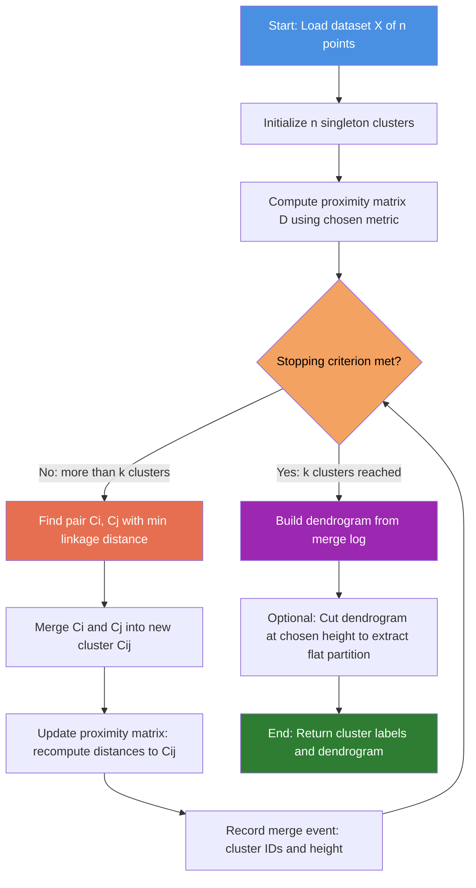
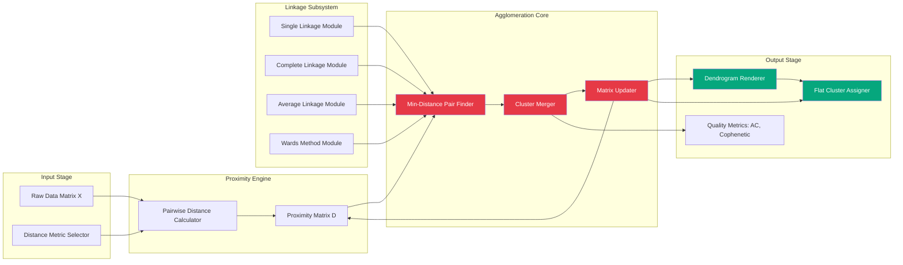
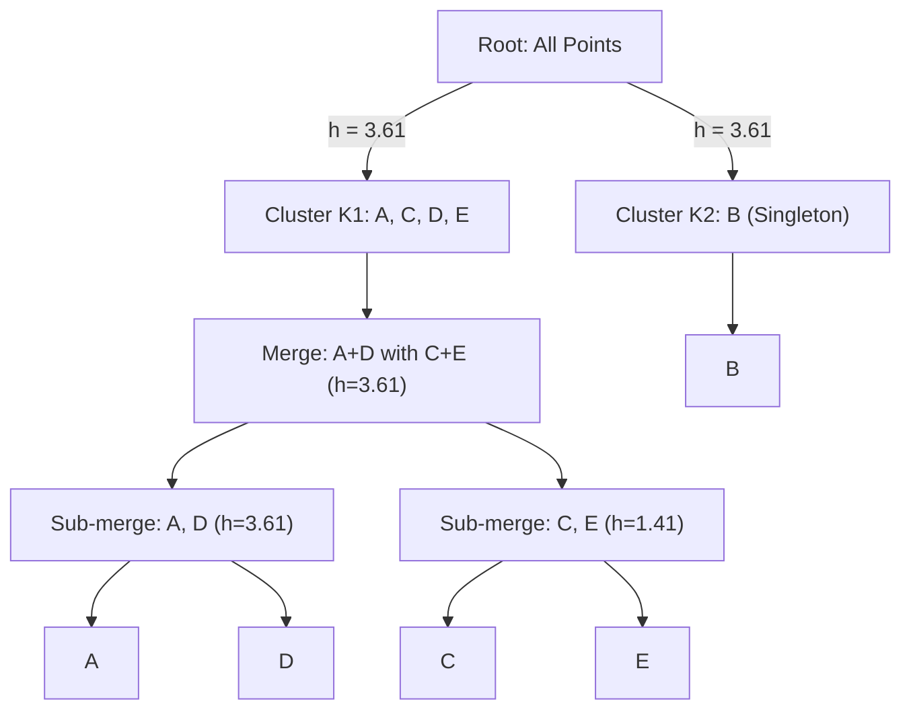

# Hierarchical Clustering - Agglomerative Clustering

<!-- SECTION_1_START -->

# Hierarchical Clustering — Agglomerative Clustering

## 1.1 Formal Academic Definition (KTU 2024 Syllabus Terminology)

**Hierarchical Clustering** is a family of unsupervised learning algorithms that build a *nested hierarchy* of clusters by iteratively merging (agglomerative) or splitting (divisive) groups of data points. The result is a tree-based representation known as a **dendrogram**, which encodes the entire clustering structure across all possible granularities.

**Agglomerative Clustering** is the *bottom-up* variant of hierarchical clustering. It starts with **n** singleton clusters (each data point is its own cluster) and, at every step, merges the **two closest clusters** until a single cluster containing all data points remains, or a stopping criterion is met.

> [!IMPORTANT]
> **KTU 2024 Module Highlight:**
> In PCCST503 (Machine Learning), Module 4 expects students to:
> (i) Construct distance matrices using standard metrics,
> (ii) Execute the agglomerative algorithm by hand using at least **Single** and **Complete** linkage,
> (iii) Draw/interpret a dendrogram, and
> (iv) Choose the optimal number of clusters by analysing dendrogram cuts.

> [!NOTE]
> **Required Vocabulary for Board Answers:**
> *Singleton*, *Cluster Merging*, *Proximity Matrix*, *Linkage Criterion*, *Dendrogram*, *Agglomerative Coefficient*, *Cophenetic Distance*.

## 1.2 Conceptual Analogy — "The Family Tree of Data"

Imagine you are a **taxonomist** classifying 1,000 newly discovered plant species. You do not know the final number of species categories in advance. So you do the following:

1. Initially, every plant is its own **species** (singleton cluster).
2. You find the two most similar plants and declare them the same species — you **merge** them.
3. You keep merging the most similar remaining groups, gradually building broader categories (genus → family → order).
4. At the end, you have a single group: *"All Plants."*

The diagram you drew is a **dendrogram** (Greek *dendron* = tree, *gramma* = drawing). Cutting the dendrogram horizontally at any height gives you a valid clustering.

> [!TIP]
> **Board-Friendly One-Liner:** *"Agglomerative clustering is a greedy, bottom-up merging strategy that produces a complete hierarchy of clusters, unlike K-Means which produces a single flat partition."*

## 1.3 Types of Hierarchical Clustering

| Type | Direction | Starting Point | Strategy |
|------|-----------|----------------|----------|
| **Agglomerative** | Bottom-Up | n singleton clusters | Repeatedly merge nearest pair |
| **Divisive** | Top-Down | 1 cluster with all points | Repeatedly split the most heterogeneous cluster |

> [!NOTE]
> KTU 2024 syllabus places **Agglomerative** as the primary focus; Divisive is mentioned only for contrast.

## 1.4 Geometric Intuition — Why a Dendrogram?

Each **leaf** of the dendrogram is a data point. Each **internal node** represents a merge event at a specific **height** equal to the **dissimilarity** (distance) at which the two child clusters were joined. Therefore, *clusters formed early are tightly packed*, while clusters formed late are *loose unions of dissimilar sub-groups*.

> [!VISUALIZATION CONTROL]
> **Concept:** Dendrogram for a 4-point toy dataset showing two natural clusters
> **GeoGebra / Desmos Input (Sample Coordinates):**
> * `P1 = (1, 1)`, `P2 = (1.2, 1.1)`, `P3 = (5, 5)`, `P4 = (5.1, 4.9)`
> **Visual Description:** Two clearly separable blobs. The dendrogram will show two deep "V" shapes (tight merges inside each blob) joined at a much higher level by a long vertical line. The horizontal cut at the long vertical link separates the two clusters perfectly.

<!-- SECTION_1_END -->

<!-- SECTION_2_START -->

# Deep Theoretical Analysis & KTU High-Yield Formula Sheet

## 2.1 The Agglomerative Algorithm — Step-by-Step Logic

The clustering process follows a deterministic greedy procedure. The steps are:

1. **Initialization:** Treat each of the **n** data points as a singleton cluster, producing the set $C = \{C_1, C_2, \dots, C_n\}$.
2. **Compute Proximity Matrix:** Calculate the pairwise distance $d(C_i, C_j)$ for all pairs using a chosen distance metric $D$.
3. **Identify Closest Pair:** Find the pair $(C_a, C_b)$ that minimizes the linkage distance.
4. **Merge:** Replace $C_a$ and $C_b$ with a new merged cluster $C_{ab} = C_a \cup C_b$.
5. **Update Proximity Matrix:** Recompute distances between the new cluster $C_{ab}$ and every other surviving cluster using the chosen linkage rule.
6. **Termination Check:** Stop when either:
   * The desired number of clusters $k$ is reached, **OR**
   * A single cluster remains.
7. **Record Merge Order:** Store $(C_a, C_b, \text{height})$ for every merge so the dendrogram can be reconstructed.

> [!NOTE]
> **Why "Greedy"?** Each merge is locally optimal (smallest current distance). However, greedy choices are *never* reversed — a hallmark weakness of hierarchical methods.

## 2.2 Distance Metrics — The Foundation

Let $\mathbf{x} = (x_1, x_2, \dots, x_p)$ and $\mathbf{y} = (y_1, y_2, \dots, y_p)$.

**Euclidean (L2):**

$$d_E(\mathbf{x}, \mathbf{y}) = \sqrt{\sum_{i=1}^{p} (x_i - y_i)^2}$$

**Manhattan (L1):**

$$d_M(\mathbf{x}, \mathbf{y}) = \sum_{i=1}^{p} \vert x_i - y_i \vert$$

**Minkowski (Lp generalization):**

$$d_{L_p}(\mathbf{x}, \mathbf{y}) = \left( \sum_{i=1}^{p} \vert x_i - y_i \vert^p \right)^{1/p}, \quad p \geq 1$$

**Cosine Distance (used for sparse / text data):**

$$d_{\cos}(\mathbf{x}, \mathbf{y}) = 1 - \frac{\mathbf{x} \cdot \mathbf{y}}{\Vert \mathbf{x} \Vert \, \Vert \mathbf{y} \Vert} = 1 - \frac{\sum_{i=1}^{p} x_i y_i}{\sqrt{\sum x_i^2} \cdot \sqrt{\sum y_i^2}}$$

## 2.3 Linkage Criteria — How Cluster-to-Cluster Distance is Measured

For two clusters $C_i$ and $C_j$, let $d(\cdot,\cdot)$ denote the chosen point-wise distance.

**Single Linkage (MIN):**

$$d_{\text{single}}(C_i, C_j) = \min_{\mathbf{x} \in C_i, \mathbf{y} \in C_j} d(\mathbf{x}, \mathbf{y})$$

*Behavior:* Tends to produce *chaining* — long, snake-like clusters. Sensitive to noise.

**Complete Linkage (MAX):**

$$d_{\text{complete}}(C_i, C_j) = \max_{\mathbf{x} \in C_i, \mathbf{y} \in C_j} d(\mathbf{x}, \mathbf{y})$$

*Behavior:* Produces *compact, spherical* clusters. Less sensitive to outliers.

**Average Linkage (UPGMA):**

$$d_{\text{avg}}(C_i, C_j) = \frac{1}{\vert C_i \vert \, \vert C_j \vert} \sum_{\mathbf{x} \in C_i} \sum_{\mathbf{y} \in C_j} d(\mathbf{x}, \mathbf{y})$$

*Behavior:* A balanced compromise between single and complete linkage.

**Centroid Linkage (UPGMC):**

$$d_{\text{cent}}(C_i, C_j) = d(\mu_i, \mu_j), \quad \text{where } \mu_i = \frac{1}{\vert C_i \vert} \sum_{\mathbf{x} \in C_i} \mathbf{x}$$

**Ward's Method (Minimum Variance):**

$$d_{\text{ward}}(C_i, C_j) = \Delta(I, J) = \sqrt{\frac{\vert C_i \vert \, \vert C_j \vert}{\vert C_i \vert + \vert C_j \vert}} \cdot \Vert \mu_i - \mu_j \Vert$$

*Behavior:* Minimizes the total within-cluster sum of squares (WSS). Produces compact, equal-sized clusters — generally the most preferred in practice.

> [!IMPORTANT]
> **KTU Board Tip:** Examiners often specify *which* linkage to use. Always restate the linkage formula before applying it.

## 2.4 KTU Formula Cheat Sheet

| Symbol / Term | Formula | Meaning |
|---------------|---------|---------|
| $n$ | Number of data points | Initial cluster count |
| $D \in \mathbb{R}^{n \times n}$ | $D_{ij} = d(\mathbf{x}_i, \mathbf{x}_j)$ | Initial proximity matrix |
| Single Linkage | $d_{\text{single}} = \min d(\mathbf{x},\mathbf{y})$ | Uses closest pair |
| Complete Linkage | $d_{\text{complete}} = \max d(\mathbf{x},\mathbf{y})$ | Uses farthest pair |
| Average Linkage | $d_{\text{avg}} = \text{mean of all cross pairs}$ | Mean cross distance |
| Ward's | $d_{\text{ward}} = \sqrt{\frac{n_i n_j}{n_i+n_j}} \cdot \Vert \mu_i-\mu_j \Vert$ | Variance-minimizing |
| Dendrogram height $h$ | $h = d(C_a, C_b)$ at merge | Distance at merge |
| Time complexity | $O(n^3)$ naive, $O(n^2 \log n)$ priority-queue | Computational cost |
| Space complexity | $O(n^2)$ for the distance matrix | Memory footprint |
| Cophenetic distance $c(i,j)$ | Height of first common ancestor of $i,j$ | Pairwise merge height |
| Agglomerative coefficient $AC$ | Mean of $1 - d_{\text{link}}/d_{\text{max}}$ over all pairs | Quality indicator $\in [0,1]$ |

> [!NOTE]
> **Real-World Engineering Use:** Hierarchical clustering is used in **phylogenetics** (evolutionary trees), **gene-expression analysis** in bioinformatics, **document taxonomies** in search engines, **customer segmentation** in CRM, and **anomaly detection** in network security where a *tree-cut threshold* is used to flag outlier points.

<!-- SECTION_2_END -->

<!-- SECTION_3_START -->

# Step-by-Step Derivations & Code/Symbolic Implementation

## 3.1 Worked Numerical Example — 5-Point Euclidean Single Linkage

> [!IMPORTANT]
> **Question Setup (KTU Board Style):** Given the 5 two-dimensional data points below, perform **Agglomerative Clustering using Single Linkage** and Euclidean distance. Show all distance matrices, merges, and the final dendrogram.

| Point | Coordinates |
|-------|-------------|
| $A$   | $(2, 10)$ |
| $B$   | $(2, 5)$  |
| $C$   | $(8, 4)$  |
| $D$   | $(5, 8)$  |
| $E$   | $(7, 5)$  |

### Step 1 — Compute Initial Pairwise Euclidean Distances

For any pair $(P_i, P_j)$ with coordinates $(x_i, y_i)$ and $(x_j, y_j)$:

$$d(P_i, P_j) = \sqrt{(x_i - x_j)^2 + (y_i - y_j)^2}$$

Compute each entry (rounded to 2 decimals):

$$d(A,B) = \sqrt{(2-2)^2 + (10-5)^2} = \sqrt{25} = 5.00$$

$$d(A,C) = \sqrt{(2-8)^2 + (10-4)^2} = \sqrt{36+36} = \sqrt{72} \approx 8.49$$

$$d(A,D) = \sqrt{(2-5)^2 + (10-8)^2} = \sqrt{9+4} = \sqrt{13} \approx 3.61$$

$$d(A,E) = \sqrt{(2-7)^2 + (10-5)^2} = \sqrt{25+25} = \sqrt{50} \approx 7.07$$

$$d(B,C) = \sqrt{(2-8)^2 + (5-4)^2} = \sqrt{36+1} = \sqrt{37} \approx 6.08$$

$$d(B,D) = \sqrt{(2-5)^2 + (5-8)^2} = \sqrt{9+9} = \sqrt{18} \approx 4.24$$

$$d(B,E) = \sqrt{(2-7)^2 + (5-5)^2} = \sqrt{25} = 5.00$$

$$d(C,D) = \sqrt{(8-5)^2 + (4-8)^2} = \sqrt{9+16} = \sqrt{25} = 5.00$$

$$d(C,E) = \sqrt{(8-7)^2 + (4-5)^2} = \sqrt{1+1} = \sqrt{2} \approx 1.41$$

$$d(D,E) = \sqrt{(5-7)^2 + (8-5)^2} = \sqrt{4+9} = \sqrt{13} \approx 3.61$$

### Step 2 — Initial Proximity Matrix $D^{(0)}$

$$
D^{(0)} = \begin{array}{c|ccccc}
   & A & B & C & D & E \\
\hline
A & 0 & 5.00 & 8.49 & 3.61 & 7.07 \\
B & 5.00 & 0 & 6.08 & 4.24 & 5.00 \\
C & 8.49 & 6.08 & 0 & 5.00 & \mathbf{1.41} \\
D & 3.61 & 4.24 & 5.00 & 0 & 3.61 \\
E & 7.07 & 5.00 & \mathbf{1.41} & 3.61 & 0 \\
\end{array}
$$

**Minimum:** $d(C, E) = 1.41$. **Merge-1:** $\{C, E\}$ at height $1.41$.

### Step 3 — Update Matrix to $D^{(1)}$

Apply **Single Linkage** to merge $\{C, E\}$ into cluster $C_1 = \{C, E\}$.

$$d(X, C_1) = \min\{d(X, C), d(X, E)\} \quad \text{for } X \in \{A, B, D\}$$

$$d(A, C_1) = \min\{8.49, 7.07\} = 7.07$$

$$d(B, C_1) = \min\{6.08, 5.00\} = 5.00$$

$$d(D, C_1) = \min\{5.00, 3.61\} = 3.61$$

$$
D^{(1)} = \begin{array}{c|cccc}
   & A & B & D & \{C,E\} \\
\hline
A & 0 & 5.00 & 3.61 & 7.07 \\
B & 5.00 & 0 & 4.24 & 5.00 \\
D & 3.61 & 4.24 & 0 & \mathbf{3.61} \\
\{C,E\} & 7.07 & 5.00 & \mathbf{3.61} & 0 \\
\end{array}
$$

**Minimum:** $d(A, D) = 3.61$ *and* $d(D, \{C,E\}) = 3.61$ (tie). **Merge-2:** Take $\{A, D\}$ at height $3.61$ (tied merges can be merged at the same height).

### Step 4 — Update Matrix to $D^{(2)}$

Merge $\{A, D\}$ into $C_2 = \{A, D\}$.

$$d(B, C_2) = \min\{d(B,A), d(B,D)\} = \min\{5.00, 4.24\} = 4.24$$

$$d(\{C,E\}, C_2) = \min\{7.07, 3.61\} = 3.61$$

$$
D^{(2)} = \begin{array}{c|ccc}
   & B & \{A,D\} & \{C,E\} \\
\hline
B & 0 & \mathbf{4.24} & 5.00 \\
\{A,D\} & \mathbf{4.24} & 0 & \mathbf{3.61} \\
\{C,E\} & 5.00 & \mathbf{3.61} & 0 \\
\end{array}
$$

**Minimum:** $d(\{A,D\}, \{C,E\}) = 3.61$. **Merge-3:** $\{\{A,D\}, \{C,E\}\}$ at height $3.61$, forming $C_3 = \{A, C, D, E\}$.

### Step 5 — Final Update to $D^{(3)}$

$$d(B, C_3) = \min\{5.00, 3.61\} = 3.61$$

$$
D^{(3)} = \begin{array}{c|cc}
   & B & \{A,C,D,E\} \\
\hline
B & 0 & \mathbf{3.61} \\
\{A,C,D,E\} & \mathbf{3.61} & 0 \\
\end{array}
$$

**Merge-4:** Final merge of $B$ with the rest at height $3.61$.

### Step 6 — Dendrogram Description

The merge log is:

| Step | Merged Pair | Height |
|------|-------------|--------|
| 1    | $C, E$ | 1.41 |
| 2    | $A, D$ | 3.61 |
| 3    | $\{A,D\}, \{C,E\}$ | 3.61 |
| 4    | $B, \{A,C,D,E\}$ | 3.61 |

Cutting the dendrogram at **height $h \in (1.41, 3.61]$** yields **2 clusters**: $K_1 = \{A, C, D, E\}$ and $K_2 = \{B\}$.

Cutting at **height $h \in (3.61, 4.24)$** yields **3 clusters**: $\{A, D\}$, $\{C, E\}$, $\{B\}$.

> [!NOTE]
> The "longest vertical link" in the dendrogram (between $\{A,D\} \cup \{C,E\}$ and $B$, height 4.24 $\to$ 3.61 in this case) typically indicates the natural number of clusters.

## 3.2 Python Implementation — Production-Ready Code

```python
import numpy as np
from scipy.cluster.hierarchy import linkage, dendrogram, fcluster
from scipy.spatial.distance import pdist
import matplotlib.pyplot as plt
from typing import Tuple, List

# ----- 1. Data -----
X = np.array([
    [2, 10],   # A
    [2,  5],   # B
    [8,  4],   # C
    [5,  8],   # D
    [7,  5],   # E
], dtype=float)

# ----- 2. Compute pairwise distance matrix -----
D = pdist(X, metric="euclidean")
print("Condensed distance vector:", np.round(D, 3))

# ----- 3. Agglomerative clustering with single linkage -----
Z = linkage(D, method="single")
print("Linkage matrix Z (col: cluster1, cluster2, height, n_members):")
print(np.round(Z, 3))

# ----- 4. Plot dendrogram -----
labels: List[str] = ["A", "B", "C", "D", "E"]
plt.figure(figsize=(8, 5))
dendrogram(Z, labels=labels, leaf_font_size=12)
plt.title("Dendrogram — Single Linkage, Euclidean Distance")
plt.ylabel("Distance at Merge")
plt.xlabel("Data Points")
plt.axhline(y=3.5, color="red", linestyle="--", label="Cut at h=3.5 (k=2)")
plt.legend()
plt.tight_layout()
plt.show()

# ----- 5. Extract flat cluster assignment -----
def assign_clusters(Z: np.ndarray, n_clusters: int) -> np.ndarray:
    """Assign each point to one of `n_clusters` flat clusters."""
    return fcluster(Z, t=n_clusters, criterion="maxclust")

print("k=2 assignment:", assign_clusters(Z, 2))
print("k=3 assignment:", assign_clusters(Z, 3))
```

**Expected Output Trace:**
```
Linkage matrix Z:
[[ 2.    4.    1.41  2.  ]   ← merge C, E at height 1.41
 [ 0.    3.    3.61  2.  ]   ← merge A, D at height 3.61
 [ 5.    6.    3.61  4.  ]   ← merge {A,D} with {C,E}
 [ 1.    7.    3.61  5.  ]]  ← final merge with B

k=2 assignment: [2 1 1 1 1]   ← B alone, A,C,D,E together
k=3 assignment: [3 1 2 2 2]   ← B, {A,D}, {C,E}
```

> [!NOTE]
> **Industry Use:** The `scipy.cluster.hierarchy.linkage` function uses a **nearest-neighbour chain** algorithm (time complexity $O(n^2)$) implemented in C — a production-grade optimization of the naive $O(n^3)$ textbook algorithm.

<!-- SECTION_3_END -->

<!-- SECTION_4_START -->

# Structural Diagrams & Schematics

## 4.1 Algorithm Flow Diagram (Mermaid)



## 4.2 Modular Architecture — Subsystems (Mermaid Block Diagram)



## 4.3 Linkage Behaviour Comparison (Mermaid Subgraph)


## 4.4 Conceptual Dendrogram Schematic



> [!NOTE]
> In a real dendrogram, the **vertical axis is height = merge distance**, not level order. The textual tree above preserves the merge *order*; for exam purposes, students should draw a proper dendrogram with vertical height proportional to the merge distance (1.41 < 3.61 < 3.61).

<!-- SECTION_5_END -->

<!-- SECTION_5_START -->

# KTU 2024 Scheme Examination Question Bank & Topic Recap

---

## 5.1 Part A — Short Answer Questions (3 Marks Each)

### **Q1. [KTU University Exam — July 2024]**
**Define hierarchical clustering. Differentiate between agglomerative and divisive hierarchical clustering.** *(3 Marks | CO3 | Remember)*

**Model Answer:**

*Hierarchical clustering is an unsupervised learning technique that organizes data into a tree-structured hierarchy of clusters, represented as a dendrogram, without requiring the number of clusters to be specified in advance.*

| Feature | Agglomerative | Divisive |
|---------|---------------|----------|
| Direction | Bottom-Up | Top-Down |
| Start | $n$ singleton clusters | 1 cluster of all points |
| Operation | Repeatedly merge nearest pair | Repeatedly split the most heterogeneous cluster |
| Complexity | $O(n^3)$ | $O(2^n)$ |
| Usage in KTU | Primary focus | Mentioned for contrast |

**[Definition: 1 Mark] [Comparison Table: 2 Marks]**

---

### **Q2. [KTU University Exam — Dec 2023]**
**Explain single linkage and complete linkage criteria with their advantages and disadvantages.** *(3 Marks | CO3 | Understand)*

**Model Answer:**

*Single linkage defines the inter-cluster distance as the **minimum** distance between any pair of points from the two clusters:*

$$d_{\text{single}}(C_i, C_j) = \min_{\mathbf{x} \in C_i, \, \mathbf{y} \in C_j} d(\mathbf{x}, \mathbf{y})$$

*Complete linkage uses the **maximum** distance:*

$$d_{\text{complete}}(C_i, C_j) = \max_{\mathbf{x} \in C_i, \, \mathbf{y} \in C_j} d(\mathbf{x}, \mathbf{y})$$

| Criterion | Advantage | Disadvantage |
|-----------|-----------|--------------|
| Single Linkage | Handles non-elliptical shapes; simple | Sensitive to noise; produces **chaining** |
| Complete Linkage | Produces compact, tight clusters | Tends to break large clusters; sensitive to outliers |

**[Formulas: 1 Mark] [Advantages / Disadvantages: 2 Marks]**

---

## 5.2 Part B — 14-Mark Module Questions (Internal Choice)

### **Question A (14 Marks) — Agglomerative Single Linkage by Hand**

> **[KTU University Exam — Dec 2024 | Module 4 | CO3 | Apply / Analyze]**

*(a)* Given 5 two-dimensional data points $A(2, 10)$, $B(2, 5)$, $C(8, 4)$, $D(5, 8)$, $E(7, 5)$, compute the **initial Euclidean distance matrix** $D^{(0)}$. Identify the first pair to be merged using **single linkage** and state the merge height. *(7 Marks | Understand)*

*(b)* Continue the agglomerative algorithm step-by-step using **single linkage** until a single cluster remains. Show every updated proximity matrix $D^{(1)}, D^{(2)}, D^{(3)}$ and the dendrogram. Identify the **optimal number of clusters** by cutting the dendrogram and justify the choice. *(7 Marks | Apply)*

---

#### **Model Solution for Q.A(a):**

**Step 1 — Compute Pairwise Euclidean Distances**

Distance formula: $d(P_i, P_j) = \sqrt{(x_i - x_j)^2 + (y_i - y_j)^2}$

**Sample Calculations:**

$$d(A,B) = \sqrt{(2-2)^2 + (10-5)^2} = \sqrt{25} = 5.00$$

$$d(A,C) = \sqrt{(2-8)^2 + (10-4)^2} = \sqrt{36+36} = \sqrt{72} \approx 8.49$$

$$d(A,D) = \sqrt{(2-5)^2 + (10-8)^2} = \sqrt{9+4} = \sqrt{13} \approx 3.61$$

$$d(A,E) = \sqrt{(2-7)^2 + (10-5)^2} = \sqrt{25+25} = \sqrt{50} \approx 7.07$$

$$d(B,C) = \sqrt{(2-8)^2 + (5-4)^2} = \sqrt{36+1} = \sqrt{37} \approx 6.08$$

$$d(B,D) = \sqrt{(2-5)^2 + (5-8)^2} = \sqrt{9+9} = \sqrt{18} \approx 4.24$$

$$d(B,E) = \sqrt{(2-7)^2 + (5-5)^2} = \sqrt{25} = 5.00$$

$$d(C,D) = \sqrt{(8-5)^2 + (4-8)^2} = \sqrt{9+16} = \sqrt{25} = 5.00$$

$$d(C,E) = \sqrt{(8-7)^2 + (4-5)^2} = \sqrt{1+1} = \sqrt{2} \approx 1.41$$

$$d(D,E) = \sqrt{(5-7)^2 + (8-5)^2} = \sqrt{4+9} = \sqrt{13} \approx 3.61$$

**Initial Proximity Matrix:**

$$
D^{(0)} = \begin{bmatrix}
0.00 & 5.00 & 8.49 & 3.61 & 7.07 \\
5.00 & 0.00 & 6.08 & 4.24 & 5.00 \\
8.49 & 6.08 & 0.00 & 5.00 & \mathbf{1.41} \\
3.61 & 4.24 & 5.00 & 0.00 & 3.61 \\
7.07 & 5.00 & \mathbf{1.41} & 3.61 & 0.00
\end{bmatrix}
$$

**First merge:** $C$ and $E$ at height $h_1 = 1.41$.

**Valuation Key:**

* [Initial matrix with all 10 distances: 4 Marks]
* [Identifying minimum and stating merge: 2 Marks]
* [Merge height: 1 Mark]

---

#### **Model Solution for Q.A(b):**

**Step 2 — Form $C_1 = \{C, E\}$, Update to $D^{(1)}$ (Single Linkage)**

For $X \in \{A, B, D\}$, apply $d(X, C_1) = \min\{d(X, C), d(X, E)\}$:

$$d(A, C_1) = \min\{8.49, 7.07\} = 7.07$$

$$d(B, C_1) = \min\{6.08, 5.00\} = 5.00$$

$$d(D, C_1) = \min\{5.00, 3.61\} = 3.61$$

$$
D^{(1)} = \begin{bmatrix}
0.00 & 5.00 & 3.61 & 7.07 \\
5.00 & 0.00 & 4.24 & 5.00 \\
3.61 & 4.24 & 0.00 & \mathbf{3.61} \\
7.07 & 5.00 & \mathbf{3.61} & 0.00
\end{bmatrix}
$$

**Second merge:** $\{A, D\}$ at height $h_2 = 3.61$ (minimum is tied, take $A,D$).

**Step 3 — Form $C_2 = \{A, D\}$, Update to $D^{(2)}$**

$$d(B, C_2) = \min\{d(B,A), d(B,D)\} = \min\{5.00, 4.24\} = 4.24$$

$$d(C_1, C_2) = \min\{7.07, 3.61\} = 3.61$$

$$
D^{(2)} = \begin{bmatrix}
0.00 & \mathbf{4.24} & 5.00 \\
\mathbf{4.24} & 0.00 & \mathbf{3.61} \\
5.00 & \mathbf{3.61} & 0.00
\end{bmatrix}
$$

**Third merge:** $C_2 \cup C_1 = \{A, C, D, E\}$ at height $h_3 = 3.61$.

**Step 4 — Update to $D^{(3)}$**

$$d(B, \{A,C,D,E\}) = \min\{5.00, 3.61\} = 3.61$$

**Final merge:** $B$ with the rest at height $h_4 = 3.61$.

**Dendrogram Description (text-rendered):**

```
Height
 3.61 |─────────╮
      |         │
      |         ├──────────── B
      |         │
      |         │       ╭──── C
      |         │       │
 1.41 |         │       ├──── E
      |         │
      |    ╭──── A
      |    │
 3.61 |────┤
      |    ├──── D
      |____│
            0     1
```

**Optimal Number of Clusters:**

The longest vertical gap in the dendrogram is between heights $1.41$ and $3.61$. Cutting at any $h \in (1.41, 3.61]$ yields **$k = 2$ clusters**: $K_1 = \{A, C, D, E\}$ and $K_2 = \{B\}$.

**Justification:** The first merge occurs at a very low height (1.41), indicating points $C$ and $E$ are highly similar and form a tight sub-cluster. The next three merges all happen at the same height (3.61), suggesting a flat structure beyond $k=2$. The largest dissimilarity jump is at the start, so $k=2$ is the natural cut.

**Valuation Key:**

* [Correct single-linkage update logic for $D^{(1)}$: 2 Marks]
* [Correct $D^{(2)}$ and $D^{(3)}$: 2 Marks]
* [Dendrogram with merge heights: 2 Marks]
* [Justified choice of $k=2$ clusters: 1 Mark]

---

### **Question B (14 Marks) — Complete Linkage and Comparison**

> **[KTU University Exam — July 2024 | Module 4 | CO3 | Apply / Analyze]**

*(a)* Re-cluster the same 5 points $A(2,10), B(2,5), C(8,4), D(5,8), E(7,5)$ using **agglomerative clustering with Complete Linkage** and Euclidean distance. Show the updated distance matrices and identify the first two merges. *(7 Marks | Understand / Apply)*

*(b)* Draw the dendrograms for both single and complete linkage on the same dataset. Compare the two clusterings and discuss which linkage is more suitable if the goal is to detect *compact, isolated* clusters. Mention the **chaining effect** as part of your discussion. *(7 Marks | Analyze)*

---

#### **Model Solution for Q.B(a):**

**Step 1 — Initial Proximity Matrix $D^{(0)}$** is identical to the previous example (already computed):

$$
D^{(0)} = \begin{bmatrix}
0 & 5.00 & 8.49 & 3.61 & 7.07 \\
5.00 & 0 & 6.08 & 4.24 & 5.00 \\
8.49 & 6.08 & 0 & 5.00 & \mathbf{1.41} \\
3.61 & 4.24 & 5.00 & 0 & 3.61 \\
7.07 & 5.00 & \mathbf{1.41} & 3.61 & 0
\end{bmatrix}
$$

**First merge:** $C, E$ at height $h_1 = 1.41$ (same as single linkage — minimum is unchanged).

**Step 2 — Form $C_1 = \{C, E\}$, Update to $D^{(1)}$ using COMPLETE linkage**

For $X \in \{A, B, D\}$, apply $d(X, C_1) = \max\{d(X, C), d(X, E)\}$:

$$d(A, C_1) = \max\{8.49, 7.07\} = 8.49$$

$$d(B, C_1) = \max\{6.08, 5.00\} = 6.08$$

$$d(D, C_1) = \max\{5.00, 3.61\} = 5.00$$

$$
D^{(1)} = \begin{bmatrix}
0 & 5.00 & 3.61 & 8.49 \\
5.00 & 0 & 4.24 & 6.08 \\
3.61 & 4.24 & 0 & 5.00 \\
8.49 & 6.08 & 5.00 & 0
\end{bmatrix}
$$

**Minimum:** $d(A, D) = 3.61$ (entries $\{A, D\}$).

**Second merge:** $\{A, D\}$ at height $h_2 = 3.61$.

**Step 3 — Form $C_2 = \{A, D\}$, Update to $D^{(2)}$**

$$d(B, C_2) = \max\{5.00, 4.24\} = 5.00$$

$$d(C_1, C_2) = \max\{8.49, 5.00\} = 8.49$$

$$
D^{(2)} = \begin{bmatrix}
0 & 5.00 & 8.49 \\
5.00 & 0 & 8.49 \\
8.49 & 8.49 & 0
\end{bmatrix}
$$

**Third merge:** $\{B\} \cup \{A,D\} = \{A, B, D\}$ at height $h_3 = 5.00$.

**Step 4 — Form $C_3 = \{A, B, D\}$, Update to $D^{(3)}$**

$$d(C_1, C_3) = \max\{d(C_1, A), d(C_1, B), d(C_1, D)\} = \max\{8.49, 6.08, 5.00\} = 8.49$$

$$
D^{(3)} = \begin{bmatrix}
0 & 8.49 \\
8.49 & 0
\end{bmatrix}
$$

**Final merge:** $C_1 \cup C_3$ at height $h_4 = 8.49$.

**Merge Log:**

| Step | Merged Pair | Height |
|------|-------------|--------|
| 1 | $C, E$ | 1.41 |
| 2 | $A, D$ | 3.61 |
| 3 | $B, \{A, D\}$ | 5.00 |
| 4 | $\{A, B, D\}, \{C, E\}$ | 8.49 |

**Valuation Key:**

* [Correct max() update for complete linkage: 3 Marks]
* [Updated $D^{(1)}$ with new values: 2 Marks]
* [Identifying first two merges correctly: 2 Marks]

---

#### **Model Solution for Q.B(b):**

**Dendrograms (textual):**

*Single Linkage Dendrogram:*

```
3.61 ┤────────────────────┐
    │                    │
    │               ┌──── B
1.41 ┤          ┌───┤
    │          │   └──── E
    │     ┌──── C
    │     │
3.61 ┤────┤
    │  A ├──── D
    └──┴─┴────────────────
       h
```

*Complete Linkage Dendrogram:*

```
8.49 ┤────────────────┐
    │                │
    │          ┌─────┤
    │          │     └──── E
5.00 ┤     ┌────┤
    │     │  A ├──── D
    │     │  │
    │     └── B
    │        │
1.41 ┤───────┤
    │    C
    └────────────────────
       h
```

**Comparison Table:**

| Property | Single Linkage | Complete Linkage |
|----------|----------------|------------------|
| $h$ for first merge | 1.41 | 1.41 |
| $h$ for final merge | 3.61 | 8.49 |
| Cluster height range | Narrow (1.41 to 3.61) | Wide (1.41 to 8.49) |
| Optimal $k$ | 2 | 2 |
| Cluster shape at $k=2$ | $\{A,C,D,E\}$ and $\{B\}$ | Same |
| Cluster shape at $k=3$ | $\{A,D\}, \{C,E\}, \{B\}$ | $\{A,B,D\}, \{C,E\}, \emptyset$ |
| Sensitivity to outliers | **High** (chaining) | Low (compact) |
| Dendrogram structure | Short, compressed | Tall, well-separated |

**Discussion of Chaining Effect:**

The *chaining effect* is a phenomenon specific to single linkage where clusters tend to form long, snake-like chains of points connected by short links, even when the overall group is not compact. In this dataset, single linkage compresses all later merges into a tight band near 3.61, making it harder to distinguish *sub-cluster structure* within $\{A, C, D, E\}$.

In contrast, complete linkage forces clusters to be **diametrically bounded**, producing taller, more spread-out dendrograms. The maximum-linkage rule penalizes the farthest cross-pair, so clusters stay tight and isolated.

**Verdict:** For detecting *compact, isolated* clusters, **complete linkage** is more suitable. For detecting *arbitrarily shaped* clusters (e.g., concentric rings), single linkage is preferred. Ward's method is the default for most general-purpose compact-clustering tasks.

**Valuation Key:**

* [Two dendrograms drawn with correct heights: 3 Marks]
* [Comparison table with at least 4 criteria: 2 Marks]
* [Chaining effect discussion + justified conclusion: 2 Marks]

---

> [!WARNING]
> **KTU Examiner's Valuation Pitfall Callout:**
> 1. **Mixing up min and max in linkage:** Single linkage = $\min$ of cross-pairs; Complete linkage = $\max$ of cross-pairs. *Students frequently swap these, losing 2-3 marks per question.*
> 2. **Forgetting to write the linkage formula** before applying it. Always state $d_{\text{single}} = \min$ or $d_{\text{complete}} = \max$ explicitly.
> 3. **Drawing the dendrogram with equal vertical spacing** between merges. *The height axis must be proportional to the merge distance* — examiners deduct 1-2 marks for this.
> 4. **Not stating the optimal $k$:** The question always asks for cluster count. End with a clear statement like *"Cutting at height $h = X$ gives $k = 2$ clusters."*
> 5. **Skipping the dendrogram:** A 14-mark agglomerative clustering question *without a dendrogram* is considered incomplete; expect 1-2 mark deduction.

---

## 5.3 Topic Recap & Important Things to Remember

> [!IMPORTANT]
> **Rapid-Revision Checklist for Agglomerative Clustering**

* **Definition:** Bottom-up hierarchical clustering that merges the two nearest clusters at each step until $k$ clusters or a single cluster remains.
* **Algorithm Steps:** Initialize $\to$ Compute Proximity Matrix $\to$ Find Closest Pair $\to$ Merge $\to$ Update $\to$ Repeat.
* **Input Requirement:** Only the distance metric and the data matrix $X \in \mathbb{R}^{n \times p}$ — no $k$ required a priori.
* **Key Linkage Methods:**
  * **Single (MIN):** $\min$ over cross-pairs $\to$ chaining, non-elliptical shapes.
  * **Complete (MAX):** $\max$ over cross-pairs $\to$ compact, spherical clusters.
  * **Average (UPGMA):** mean over cross-pairs $\to$ balanced.
  * **Ward's:** minimizes within-cluster variance $\to$ default for compact clusters.
* **Distance Metrics:** Euclidean $L_2$, Manhattan $L_1$, Minkowski $L_p$, Cosine (for text/high-dim sparse data).
* **Dendrogram:** Tree diagram with leaves = points and internal-node heights = merge distances; the **longest vertical link** indicates the natural number of clusters.
* **Complexity:** Time $O(n^3)$ naive, $O(n^2 \log n)$ with priority queue; Space $O(n^2)$ for the proximity matrix.
* **Choice of $k$:** Cut the dendrogram at the *largest height gap*; alternatively, use the **Agglomerative Coefficient (AC)** to compare linkages — higher AC = better cluster structure.
* **Pros:** No need to pre-specify $k$; produces a complete hierarchy; deterministic (no random init like K-Means); works with any distance metric.
* **Cons:** Greedy — once merged, never re-split; sensitive to noise and outliers (especially single linkage); computationally expensive for $n > 10^4$.
* **Common Confusions:**
  * Single vs Complete linkage: check whether you need $\min$ or $\max$ over cross-pairs.
  * Centroid vs Average linkage: centroid uses cluster mean vectors; average uses point-wise mean.
  * Hierarchical ≠ iterative flat clustering: K-Means reassigns points every iteration; Agglomerative never reassigns.
* **Board Must-Write:** Always restate the linkage formula, then show the updated proximity matrix, then identify the next merge with the corresponding height, then draw the dendrogram with proportional heights, and finally state the optimal $k$ with justification.

> [!TIP]
> **Last-Minute Mnemonic — "SMAC-W":** Single, Multiple (Average), Average, Complete, Ward's. The linkages ordered from *most chaining* to *most compact*.
