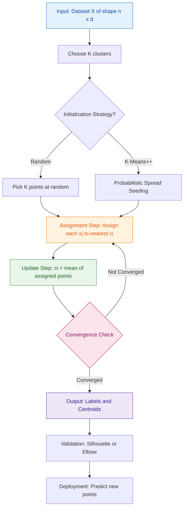
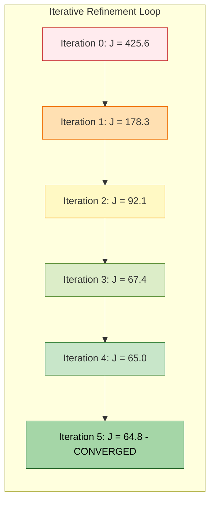
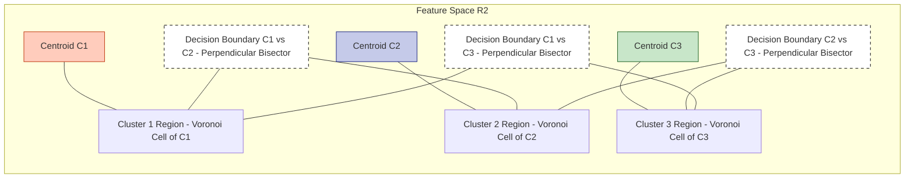
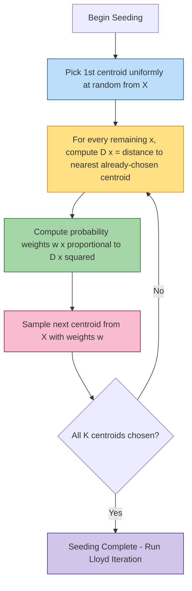

# K-means clustering

<!-- SECTION_1_START -->
# K-MEANS CLUSTERING — CORE TECHNICAL DEFINITION & INTUITIVE OVERVIEW

## Formal Definition (KTU 2024 Syllabus Terminology)

> [!IMPORTANT]
> **K-Means Clustering** is a prototype-based, centroid-driven **unsupervised partitioning algorithm** that divides a dataset of $n$ unlabeled observations into $K$ mutually exclusive, non-hierarchical clusters by iteratively minimizing the **Within-Cluster Sum of Squares (WCSS)** objective function, also termed the **distortion function** $J(W, C)$.

Mathematically, the algorithm solves the following optimization problem:

$$\min_{W, C} \; J(W, C) = \sum_{i=1}^{K} \sum_{j=1}^{n} w_{ij} \, \Vert x_j - c_i \Vert^2$$

subject to:
$$\sum_{i=1}^{K} w_{ij} = 1, \quad w_{ij} \in \{0, 1\}$$

Where:
- $x_j \in \mathbb{R}^d$ is the $j$-th data point
- $c_i$ is the centroid of the $i$-th cluster
- $w_{ij} = 1$ if $x_j$ is assigned to cluster $i$, else $0$
- $K$ is a **hyperparameter** chosen prior to training
- $\Vert \cdot \Vert$ denotes the standard **L2 (Euclidean) norm**

---

## Conceptual Analogy — The "Self-Organizing Bookshelf"

Imagine you have **300 unsorted books** dumped on the floor and you want to organize them into **3 shelves** (clusters). You don't know the categories in advance — only the count $K = 3$.

1. **Step 1 — Random Anchor Placement:** You place 3 colored bookmarks at random spots on the floor (initial centroids).
2. **Step 2 — Group by Nearest Bookmark:** You walk to every book and put it on the shelf whose bookmark is physically closest (assignment step).
3. **Step 3 — Reposition the Bookmark:** After every shelf is filled, you slide the bookmark to the **geometric center** of the books placed on that shelf (update step).
4. **Step 4 — Repeat:** Because the bookmark moved, some books that were slightly closer to the *old* shelf might now be closer to a *new* shelf. You reassign them, recompute centers, and repeat.
5. **Step 5 — Stop:** When no book switches shelves between iterations, the system is **stable** and the algorithm has **converged**.

This is exactly what K-Means does — except the "books" are data points in a multi-dimensional feature space and the "distance" is **squared Euclidean distance**.

---

## Key Terms at a Glance

> [!NOTE]
> | Term | Meaning |
> |---|---|
> | **Centroid** | The arithmetic mean of all data points assigned to a cluster |
> | **WCSS / Inertia** | The total within-cluster sum of squared distances to centroids |
> | **Assignment Step** | The phase where each point is mapped to its nearest centroid |
> | **Update Step** | The phase where centroid positions are recomputed as cluster means |
> | **Convergence** | When centroid positions stop changing between iterations |
> | **Elbow Method** | A heuristic to choose optimal $K$ by plotting WCSS vs $K$ |
> | **Silhouette Score** | A validation metric ranging from $-1$ to $+1$ to assess cluster quality |

> [!VISUALIZATION CONTROL]
> **Concept:** Voronoi Partition Induced by K-Means Centroids
> **GeoGebra / Desmos Input Equations:**
> * `centroid_1 = (2, 3)`
> * `centroid_2 = (8, 2)`
> * `centroid_3 = (5, 8)`
> * `Circle1: (x-2)^2 + (y-3)^2 = 17`
> * `Circle2: (x-8)^2 + (y-2)^2 = 14`
> * `Circle3: (x-5)^2 + (y-8)^2 = 21`
> **Visual Description:** Three shaded regions on the $xy$-plane representing Voronoi cells. Each cell is the locus of points closest (by Euclidean distance) to one of the three centroids. The boundaries are perpendicular bisectors of the segment joining any two centroids. The student should observe that K-Means produces **convex, isotropic partitions** and struggles with elongated or irregular shapes.

---

## Where K-Means Sits in the ML Taxonomy

> [!IMPORTANT]
> K-Means is the **canonical representative** of:
> * **Learning Paradigm:** Unsupervised Learning
> * **Task Type:** Clustering (no labels $y$ involved)
> * **Model Family:** Partitional / Non-Hierarchical / Centroid-Based
> * **Optimization Strategy:** Iterative Refinement using **Lloyd's Algorithm** (1957)

<!-- SECTION_1_END -->

<!-- SECTION_2_START -->
# DEEP THEORETICAL ANALYSIS & KTU HIGH-YIELD FORMULA SHEET

## The Lloyd's Algorithm — Operational Walkthrough

K-Means is solved using **Lloyd's Algorithm**, an expectation–maximization-style iterative procedure that alternates between two steps until convergence:

### Step 1 — Initialization
Choose $K$ initial centroids $\{c_1^{(0)}, c_2^{(0)}, \ldots, c_K^{(0)}\}$. Common strategies include:
* **Random Initialization** — pick $K$ points uniformly at random from the dataset.
* **Forgy Method** — same as above, but bias the picks with prior knowledge.
* **K-Means++** (Arthur & Vassilvitskii, 2007) — probabilistic seeding that spreads the initial centroids far apart, drastically improving convergence to a global optimum.

### Step 2 — Assignment Step (Expectation-like)
For every data point $x_j$, assign it to the cluster whose centroid is nearest in Euclidean space:

$$w_{ij}^{(t)} = \begin{cases} 1 & \text{if } i = \arg\min_{k \in \{1,\ldots,K\}} \Vert x_j - c_k^{(t)} \Vert^2 \\ 0 & \text{otherwise} \end{cases}$$

### Step 3 — Update Step (Maximization-like)
Recompute each centroid as the **mean vector** of all points currently assigned to it:

$$c_i^{(t+1)} = \frac{1}{\vert S_i^{(t)} \vert} \sum_{x_j \in S_i^{(t)}} x_j$$

where $S_i^{(t)} = \{x_j : w_{ij}^{(t)} = 1\}$ is the set of points assigned to cluster $i$ at iteration $t$.

### Step 4 — Convergence Check
Stop when **any one** of the following holds:
* Centroid positions do not change: $\Vert c_i^{(t+1)} - c_i^{(t)} \Vert < \epsilon$
* Cluster assignments stabilize: $W^{(t+1)} = W^{(t)}$
* Maximum iteration count $T_{\max}$ is reached
* Reduction in WCSS falls below a tolerance $\delta$

---

## The "Why" Behind Each Step — Intuition Layer

> [!NOTE]
> **Why squared Euclidean distance?**
> It is **mathematically convenient** because the mean is the unique point that minimizes the sum of squared distances. Using any other distance (e.g., Manhattan) would not lead to a clean closed-form centroid update.
>
> **Why alternate assignment and update?**
> Each step is a **coordinate descent** on $J(W, C)$. Holding $C$ fixed, the assignment step solves $\min_W J$. Holding $W$ fixed, the update step solves $\min_C J$ in closed form via the mean. Together, they monotonically decrease $J$ until a local minimum is reached.
>
> **Why is it greedy?**
> Lloyd's algorithm only guarantees convergence to a **local minimum** of $J$, not the global minimum. This is why multiple restarts with different seeds (or K-Means++) are recommended in production.

---

## KTU High-Yield Formula Sheet

> [!IMPORTANT]
> **All formulas below are routinely tested in KTU University Examinations.**

| # | Concept | Formula | Notes |
|---|---|---|---|
| 1 | Objective (Distortion) Function | $J = \sum_{i=1}^{K} \sum_{j=1}^{n} w_{ij} \Vert x_j - c_i \Vert^2$ | Must be **minimized** |
| 2 | Squared Euclidean Distance | $d^2(x_j, c_i) = \sum_{m=1}^{d} (x_{jm} - c_{im})^2$ | $d$ is feature dimensionality |
| 3 | Centroid Update (Mean Rule) | $c_i = \frac{1}{n_i} \sum_{j \in S_i} x_j$ | $n_i$ is the size of cluster $i$ |
| 4 | Inertia (WCSS for sklearn) | $\text{Inertia} = \sum_{i=1}^{K} \sum_{j \in S_i} \Vert x_j - c_i \Vert^2$ | Same as $J$ |
| 5 | Within-Cluster Variance | $V_i = \frac{1}{n_i} \sum_{j \in S_i} \Vert x_j - c_i \Vert^2$ | Per-cluster average |
| 6 | Elbow Method Criterion | $\text{Find } K^* \text{ where } \frac{d(\text{WCSS})}{dK} \text{ bends sharply}$ | Plot WCSS vs $K$ |
| 7 | Silhouette Coefficient | $s(j) = \frac{b(j) - a(j)}{\max\{a(j), b(j)\}}$ | Range $[-1, +1]$; higher is better |
| 8 | Average Silhouette | $\bar{s} = \frac{1}{n} \sum_{j=1}^{n} s(j)$ | Used to pick $K$ |
| 9 | Gap Statistic (Tibshirani) | $\text{Gap}(K) = E[\log(\text{WCSS}_b)] - \log(\text{WCSS}_K)$ | Compare to reference distribution |
| 10 | K-Means++ Probability | $P(x) = \frac{D(x)^2}{\sum_{x'} D(x')^2}$ | $D(x)$ is distance to nearest centroid |

---

## Real-World Engineering Utility

> [!NOTE]
> K-Means is a **production-grade workhorse** in:
>
> * **Customer Segmentation** — Marketing teams group buyers by spending behavior to personalize campaigns.
> * **Image Compression** — Quantize 16 million RGB colors down to 16 representative palette colors; each pixel is reassigned to its nearest centroid, reducing file size by an order of magnitude (Vector Quantization).
> * **Document Clustering & Topic Discovery** — TF-IDF vectors of news articles are grouped to surface latent themes.
> * **Anomaly Detection** — Points with the largest $d(x_j, c_{i^*})$ are flagged as outliers (preprocessing step before supervised learning).
> * **Sensor Fusion in IoT** — Group similar telemetry readings before feeding into downstream classifiers.
> * **Genomic Bioinformatics** — Cluster gene expression profiles to identify co-regulated gene families.

<!-- SECTION_2_END -->

<!-- SECTION_3_START -->
# STEP-BY-STEP DERIVATIONS & PYTHON IMPLEMENTATION

## Part A — Mathematical Derivation: Why the Centroid is the Mean

We prove that the optimal centroid for a fixed cluster assignment is the **arithmetic mean** of its assigned points.

**Setup:** For a fixed cluster $S_i = \{x_{i1}, x_{i2}, \ldots, x_{i{n_i}}\}$, we seek the point $c_i$ that minimizes:

$$f(c_i) = \sum_{j=1}^{n_i} \Vert x_{ij} - c_i \Vert^2$$

Expanding the squared norm:

$$\Vert x_{ij} - c_i \Vert^2 = (x_{ij} - c_i)^\top (x_{ij} - c_i) = \Vert x_{ij} \Vert^2 - 2 x_{ij}^\top c_i + \Vert c_i \Vert^2$$

Summing over all points in the cluster:

$$f(c_i) = \sum_{j=1}^{n_i} \Vert x_{ij} \Vert^2 - 2 \left( \sum_{j=1}^{n_i} x_{ij}^\top \right) c_i + n_i \Vert c_i \Vert^2$$

To find the minimum, take the gradient with respect to $c_i$ and set it to zero:

$$\nabla_{c_i} f(c_i) = -2 \sum_{j=1}^{n_i} x_{ij} + 2 n_i c_i = 0$$

Solving:

$$c_i^* = \frac{1}{n_i} \sum_{j=1}^{n_i} x_{ij}$$

This confirms the **mean rule** used in the update step. The second derivative $\nabla^2 f(c_i) = 2 n_i I \succ 0$ (positive definite), so $c_i^*$ is indeed a **global minimum** of the within-cluster sum of squares for that cluster.

---

## Part B — Numerical Worked Example (Manual Hand-Calculation)

**Dataset:** Let $X = \{x_1, x_2, x_3, x_4, x_5, x_6\}$ be six 1-D data points:

$$X = \{1, 2, 3, 8, 9, 10\}$$

**Hyperparameter:** $K = 2$ clusters.

**Initial Centroids (chosen arbitrarily):** $c_1^{(0)} = 1$ and $c_2^{(0)} = 2$.

### Iteration 1

**Assignment Step:** Compute distance from each point to both centroids.

| Point $x_j$ | $d(x_j, c_1) = \vert x_j - 1 \vert$ | $d(x_j, c_2) = \vert x_j - 2 \vert$ | Assignment |
|---|---|---|---|
| 1 | 0 | 1 | Cluster 1 |
| 2 | 1 | 0 | Cluster 2 |
| 3 | 2 | 1 | Cluster 2 |
| 8 | 7 | 6 | Cluster 2 |
| 9 | 8 | 7 | Cluster 2 |
| 10 | 9 | 8 | Cluster 2 |

**Update Step:** Recompute centroids as means.

$$c_1^{(1)} = \frac{1}{1} \sum_{j \in S_1} x_j = 1$$
$$c_2^{(1)} = \frac{1}{5} \sum_{j \in S_2} x_j = \frac{2 + 3 + 8 + 9 + 10}{5} = \frac{32}{5} = 6.4$$

### Iteration 2

Re-assign based on new centroids.

| Point $x_j$ | $d(x_j, c_1 = 1)$ | $d(x_j, c_2 = 6.4)$ | Assignment |
|---|---|---|---|
| 1 | 0 | 5.4 | Cluster 1 |
| 2 | 1 | 4.4 | Cluster 1 |
| 3 | 2 | 3.4 | Cluster 1 |
| 8 | 7 | 1.6 | Cluster 2 |
| 9 | 8 | 2.6 | Cluster 2 |
| 10 | 9 | 3.6 | Cluster 2 |

**Update Step:** Recompute centroids.

$$c_1^{(2)} = \frac{1 + 2 + 3}{3} = 2$$
$$c_2^{(2)} = \frac{8 + 9 + 10}{3} = 9$$

### Iteration 3

| Point $x_j$ | $d(x_j, c_1 = 2)$ | $d(x_j, c_2 = 9)$ | Assignment |
|---|---|---|---|
| 1 | 1 | 8 | Cluster 1 |
| 2 | 0 | 7 | Cluster 1 |
| 3 | 1 | 6 | Cluster 1 |
| 8 | 6 | 1 | Cluster 2 |
| 9 | 7 | 0 | Cluster 2 |
| 10 | 8 | 1 | Cluster 2 |

Centroids after update:

$$c_1^{(3)} = 2, \quad c_2^{(3)} = 9$$

Centroids did **not change** between Iteration 2 and Iteration 3. **Algorithm has converged.**

**Final Clusters:**
* Cluster 1: $\{1, 2, 3\}$ with centroid $c_1^* = 2$
* Cluster 2: $\{8, 9, 10\}$ with centroid $c_2^* = 9$

**Final WCSS:**

$$J^* = (1-2)^2 + (2-2)^2 + (3-2)^2 + (8-9)^2 + (9-9)^2 + (10-9)^2$$
$$= 1 + 0 + 1 + 1 + 0 + 1 = 4$$

---

## Part C — Production-Grade Python Implementation

```python
"""
K-Means Clustering — From-Scratch Implementation
Author: KTU 2024 Scheme Study Module
Course: PCCST503 - Machine Learning
"""
import numpy as np
from typing import Tuple, Optional
import logging

logging.basicConfig(level=logging.INFO, format="%(asctime)s | %(message)s")
logger = logging.getLogger(__name__)


class KMeans:
    """
    Lloyd's K-Means algorithm with K-Means++ initialization.
    """

    def __init__(
        self,
        n_clusters: int = 3,
        max_iter: int = 300,
        tol: float = 1e-4,
        random_state: Optional[int] = 42,
    ) -> None:
        if n_clusters < 1:
            raise ValueError("n_clusters must be >= 1")
        self.n_clusters = n_clusters
        self.max_iter = max_iter
        self.tol = tol
        self.random_state = random_state
        self.cluster_centers_: Optional[np.ndarray] = None
        self.labels_: Optional[np.ndarray] = None
        self.inertia_: float = np.inf
        self.n_iter_: int = 0

    # ---------- K-Means++ Seeding ----------
    def _kmeans_plus_plus(self, X: np.ndarray) -> np.ndarray:
        rng = np.random.default_rng(self.random_state)
        n_samples, _ = X.shape
        centers = np.empty((self.n_clusters, X.shape[1]), dtype=X.dtype)

        # Step 1: pick first center uniformly
        idx = rng.integers(0, n_samples)
        centers[0] = X[idx]

        # Step 2: pick remaining centers with D(x)^2 probability
        closest_dist_sq = np.full(n_samples, np.inf)
        for c in range(1, self.n_clusters):
            dist_sq = np.sum((X - centers[c - 1]) ** 2, axis=1)
            closest_dist_sq = np.minimum(closest_dist_sq, dist_sq)
            probs = closest_dist_sq / closest_dist_sq.sum()
            cumulative = np.cumsum(probs)
            r = rng.random()
            idx = np.searchsorted(cumulative, r)
            centers[c] = X[idx]

        logger.info("K-Means++ initialization complete.")
        return centers

    # ---------- Fit ----------
    def fit(self, X: np.ndarray) -> "KMeans":
        X = np.asarray(X, dtype=np.float64)
        n_samples, n_features = X.shape

        if self.n_clusters > n_samples:
            raise ValueError("n_clusters cannot exceed number of samples.")

        self.cluster_centers_ = self._kmeans_plus_plus(X)
        prev_inertia = np.inf

        for iteration in range(self.max_iter):
            self.n_iter_ = iteration + 1

            # --- Assignment step ---
            dist_sq = np.sum(
                (X[:, np.newaxis, :] - self.cluster_centers_[np.newaxis, :, :]) ** 2,
                axis=2,
            )
            self.labels_ = np.argmin(dist_sq, axis=1)

            # --- Update step ---
            new_centers = np.empty_like(self.cluster_centers_)
            for k in range(self.n_clusters):
                members = X[self.labels_ == k]
                if len(members) == 0:
                    # Re-seed empty cluster from a random point
                    new_centers[k] = X[np.random.randint(0, n_samples)]
                    logger.warning(f"Cluster {k} was empty; reseeded.")
                else:
                    new_centers[k] = members.mean(axis=0)

            # --- Convergence check ---
            shift = np.linalg.norm(new_centers - self.cluster_centers_)
            self.cluster_centers_ = new_centers
            self.inertia_ = float(
                np.sum((X - self.cluster_centers_[self.labels_]) ** 2)
            )

            logger.info(
                f"Iter {self.n_iter_:>3d} | Inertia = {self.inertia_:.4f} | "
                f"Centroid Shift = {shift:.6f}"
            )

            if abs(prev_inertia - self.inertia_) < self.tol:
                logger.info("Convergence achieved (inertia tolerance met).")
                break
            prev_inertia = self.inertia_

        return self

    # ---------- Predict ----------
    def predict(self, X: np.ndarray) -> np.ndarray:
        if self.cluster_centers_ is None:
            raise RuntimeError("Model has not been fitted yet.")
        X = np.asarray(X, dtype=np.float64)
        dist_sq = np.sum(
            (X[:, np.newaxis, :] - self.cluster_centers_[np.newaxis, :, :]) ** 2,
            axis=2,
        )
        return np.argmin(dist_sq, axis=1)


# ---------- Demonstration ----------
if __name__ == "__main__":
    # Synthetic blob dataset
    rng = np.random.default_rng(7)
    cluster_a = rng.normal(loc=[0, 0], scale=1.0, size=(50, 2))
    cluster_b = rng.normal(loc=[5, 5], scale=1.0, size=(50, 2))
    cluster_c = rng.normal(loc=[0, 5], scale=1.0, size=(50, 2))
    X = np.vstack([cluster_a, cluster_b, cluster_c])

    model = KMeans(n_clusters=3, max_iter=100, tol=1e-5, random_state=42)
    model.fit(X)

    print("\nFinal Centroids:\n", model.cluster_centers_)
    print("Final Inertia (WCSS):", round(model.inertia_, 4))
    print("Iterations to Converge:", model.n_iter_)
```

---

## Part D — Validation Metrics: Elbow & Silhouette

```python
import matplotlib.pyplot as plt
from sklearn.cluster import KMeans
from sklearn.metrics import silhouette_score

X = np.vstack([cluster_a, cluster_b, cluster_c])

wcss = []
silhouette_scores = []
K_range = range(2, 8)

for k in K_range:
    km = KMeans(n_clusters=k, n_init=10, random_state=42).fit(X)
    wcss.append(km.inertia_)
    silhouette_scores.append(silhouette_score(X, km.labels_))

fig, ax = plt.subplots(1, 2, figsize=(12, 4))
ax[0].plot(K_range, wcss, marker="o", color="steelblue")
ax[0].set_title("Elbow Method — WCSS vs K")
ax[0].set_xlabel("K"); ax[0].set_ylabel("WCSS"); ax[0].grid(True)

ax[1].plot(K_range, silhouette_scores, marker="s", color="seagreen")
ax[1].set_title("Silhouette Score vs K")
ax[1].set_xlabel("K"); ax[1].set_ylabel("Avg Silhouette"); ax[1].grid(True)
plt.tight_layout(); plt.show()
```

> [!TIP]
> Look for the **"elbow bend"** in the WCSS plot and the **peak** of the silhouette curve. Both should ideally suggest the same $K^*$.

<!-- SECTION_3_END -->

<!-- SECTION_4_START -->
# STRUCTURAL DIAGRAMS & SCHEMATICS

## Diagram 1 — Lloyd's Algorithm End-to-End Pipeline



---

## Diagram 2 — Convergence Topology: The "Spiral" of J Decreasing



---

## Diagram 3 — Voronoi Partitioning Schematic



---

## Diagram 4 — K-Means++ Probabilistic Seeding Logic



---

## Diagram 5 — Sequential Processing Topology Matrix

| Stage | Module | Input | Operation | Output |
|---|---|---|---|---|
| 1 | Data Loader | Raw CSV / DB | Cleaning, scaling with StandardScaler | Normalized matrix $X \in \mathbb{R}^{n \times d}$ |
| 2 | Seeder | $X$, $K$ | K-Means++ probabilistic sampling | Initial centroids $C^{(0)}$ |
| 3 | Assigner | $X$, $C^{(t)}$ | Compute pairwise squared distances, take $\arg\min$ | Hard labels $W^{(t)}$ |
| 4 | Updater | $X$, $W^{(t)}$ | Per-cluster mean recomputation | New centroids $C^{(t+1)}$ |
| 5 | Convergence Monitor | $C^{(t)}$, $C^{(t+1)}$ | Compute centroid shift or $\Delta J$ | Boolean stop flag |
| 6 | Validator | $X$, $W^*$, $C^*$ | Silhouette, Davies-Bouldin, Inertia | Quality score |
| 7 | Deployer | New $x_{\text{new}}$ | $\arg\min_i \Vert x_{\text{new}} - c_i \Vert^2$ | Cluster label |

<!-- SECTION_4_END -->

<!-- SECTION_5_START -->
# KTU 2024 SCHEME EXAMINATION QUESTION BANK & TOPIC RECAP

## Part A — Short Answer Questions (3 Marks Each)

> **Q1. [KTU University Exam - July 2024]** Define K-Means clustering. State its objective function and explain the role of the centroid update step.

**Model Answer (Valuation Key):**
* **[Definition: 1 Mark]** K-Means is a centroid-based unsupervised partitioning algorithm that groups $n$ unlabeled data points into $K$ non-overlapping clusters by minimizing the within-cluster sum of squared Euclidean distances.
* **[Objective Function: 1 Mark]** The objective is to minimize $J = \sum_{i=1}^{K} \sum_{x_j \in S_i} \Vert x_j - c_i \Vert^2$, where $c_i$ is the centroid of cluster $S_i$.
* **[Centroid Update: 1 Mark]** In the update step, each centroid is recomputed as the arithmetic mean of the points currently assigned to its cluster: $c_i = \frac{1}{\vert S_i \vert} \sum_{x_j \in S_i} x_j$, which is the closed-form minimizer of the within-cluster sum of squares.

---

> **Q2. [KTU University Exam - Dec 2023]** Differentiate between the **Elbow Method** and the **Silhouette Score** as techniques to determine the optimal number of clusters $K$ in K-Means.

**Model Answer (Valuation Key):**
* **[Elbow Method: 1.5 Marks]** The Elbow Method plots the WCSS (Inertia) against $K$ and identifies the point where the rate of decrease sharply changes (the "elbow"). It is a **graphical heuristic** and works well when the elbow is unambiguous.
* **[Silhouette Score: 1.5 Marks]** The Silhouette Score $s(j) = \frac{b(j) - a(j)}{\max\{a(j), b(j)\}}$ measures how well-separated each point is from its own cluster versus the nearest neighboring cluster. The optimal $K$ maximizes the average silhouette coefficient over $[-1, +1]$. It is a **quantitative metric** and is more rigorous.

---

## Part B — Long Answer Questions (14 Marks with Internal Choice)

### Question A — 14 Marks

> **[KTU University Exam - July 2024 | Module 4 | CO3, Apply/Analyze]**
>
> **(a)** Describe the step-by-step execution of Lloyd's K-Means algorithm. Explain the two main iterative steps in detail. **[7 Marks]**
>
> **(b)** Consider the following 2-D dataset with $K = 2$: $X = \{(1,1), (2,1), (1,2), (8,8), (9,8), (8,9)\}$. The initial centroids are $c_1 = (1,1)$ and $c_2 = (8,8)$. Perform **two complete iterations** of K-Means and report the final clusters, centroids, and WCSS. **[7 Marks]**

#### Model Solution

**Part (a) — 7 Marks**

**[Algorithm Overview: 1 Mark]** Lloyd's K-Means is an iterative refinement procedure that alternates between an **assignment step** and an **update step** until convergence.

**[Step 1 - Initialization: 1 Mark]** Choose $K$ initial centroids $c_1^{(0)}, \ldots, c_K^{(0)}$. This can be done randomly, via Forgy, or using K-Means++.

**[Step 2 - Assignment Step: 2 Marks]** For each data point $x_j$, compute the squared Euclidean distance to every centroid: $d^2(x_j, c_i) = \sum_{m=1}^{d} (x_{jm} - c_{im})^2$. Assign the point to the cluster with the minimum distance, i.e., $w_{ij}^{(t)} = 1$ iff $i = \arg\min_k d^2(x_j, c_k^{(t)})$, else $0$.

**[Step 3 - Update Step: 2 Marks]** Recompute each centroid as the mean of all points in its cluster: $c_i^{(t+1)} = \frac{1}{n_i} \sum_{j \in S_i^{(t)}} x_j$. This is the closed-form minimizer of the sum of squared distances within cluster $i$.

**[Step 4 - Convergence: 1 Mark]** Stop when centroid positions stabilize, cluster assignments do not change, WCSS reduction falls below a threshold, or the maximum iteration count is reached.

**Part (b) — 7 Marks**

**Iteration 1 — Assignment Step:**

For each point, compute squared distance to $c_1 = (1,1)$ and $c_2 = (8,8)$.

| Point | $d^2$ to $c_1$ | $d^2$ to $c_2$ | Assigned Cluster |
|---|---|---|---|
| (1,1) | 0 | 98 | $S_1$ |
| (2,1) | 1 | 85 | $S_1$ |
| (1,2) | 1 | 85 | $S_1$ |
| (8,8) | 98 | 0 | $S_2$ |
| (9,8) | 113 | 1 | $S_2$ |
| (8,9) | 113 | 1 | $S_2$ |

**Iteration 1 — Update Step:**

$$c_1^{(1)} = \frac{(1,1) + (2,1) + (1,2)}{3} = \left(\frac{4}{3}, \frac{4}{3}\right) \approx (1.33, 1.33)$$

$$c_2^{(1)} = \frac{(8,8) + (9,8) + (8,9)}{3} = \left(\frac{25}{3}, \frac{25}{3}\right) \approx (8.33, 8.33)$$

**[Centroid Calculation: 2 Marks]**

**Iteration 2 — Assignment Step:**

| Point | $d^2$ to $(1.33, 1.33)$ | $d^2$ to $(8.33, 8.33)$ | Assigned Cluster |
|---|---|---|---|
| (1,1) | 0.11 | 107.11 | $S_1$ |
| (2,1) | 0.44 | 102.78 | $S_1$ |
| (1,2) | 0.44 | 102.78 | $S_1$ |
| (8,8) | 107.11 | 0.11 | $S_2$ |
| (9,8) | 122.78 | 0.44 | $S_2$ |
| (8,9) | 102.78 | 0.44 | $S_2$ |

**[Reassignment Verification: 2 Marks]**

Cluster assignments did not change.

**Iteration 2 — Update Step:**

$$c_1^{(2)} = (1.33, 1.33), \quad c_2^{(2)} = (8.33, 8.33)$$

Centroids are stable. **Algorithm has converged.**

**Final WCSS Calculation:**

$$J^* = 3 \times 0.11 + 3 \times 0.11 = 0.66$$

**[Final WCSS: 1 Mark]**

---

### Question B — 14 Marks (Alternative Choice)

> **[KTU University Exam - Dec 2023 | Module 4 | CO3, Understand/Apply]**
>
> **(a)** What is the **K-Means++** initialization strategy? Explain its algorithm and discuss why it is preferred over random initialization. **[7 Marks]**
>
> **(b)** For the dataset $X = \{(2,10), (2,5), (8,4), (5,8), (7,5), (6,4), (1,2), (4,9)\}$, with $K = 3$, perform **one iteration** of K-Means starting from initial centroids $c_1 = (2,10)$, $c_2 = (5,8)$, $c_3 = (1,2)$. List the new centroids and the resulting WCSS. **[7 Marks]**

#### Model Solution

**Part (a) — 7 Marks**

**[Definition: 2 Marks]** K-Means++ (Arthur & Vassilvitskii, 2007) is a probabilistic seeding strategy that initializes the $K$ centroids one at a time, choosing each new centroid with probability proportional to the square of its distance from the nearest already-chosen centroid.

**[Algorithm Steps: 3 Marks]**
1. Pick the first centroid $c_1$ uniformly at random from the dataset.
2. For each remaining point $x$, compute $D(x) = \min_{c \in C} \Vert x - c \Vert^2$, the squared distance to the nearest already-chosen centroid.
3. Choose the next centroid $c_{k+1}$ from the dataset with probability $P(x) = \frac{D(x)^2}{\sum_{x'} D(x')^2}$.
4. Repeat steps 2–3 until $K$ centroids are chosen.
5. Run standard Lloyd's iterations.

**[Why Preferred: 2 Marks]** Random initialization can lead to poor seeding where multiple centroids collapse into the same region, causing the algorithm to converge to a suboptimal local minimum. K-Means++ guarantees (with high probability) an $O(\log K)$-competitive solution with the global optimum and drastically reduces the number of iterations needed for convergence.

**Part (b) — 7 Marks**

**Iteration 1 — Assignment Step:**

| Point | $d^2$ to $c_1 = (2,10)$ | $d^2$ to $c_2 = (5,8)$ | $d^2$ to $c_3 = (1,2)$ | Assigned |
|---|---|---|---|---|
| (2,10) | 0 | 9 | 65 | $S_1$ |
| (2,5) | 25 | 18 | 10 | $S_3$ |
| (8,4) | 72 | 25 | 49 | $S_2$ |
| (5,8) | 9 | 0 | 52 | $S_2$ |
| (7,5) | 50 | 13 | 45 | $S_2$ |
| (6,4) | 52 | 17 | 29 | $S_2$ |
| (1,2) | 65 | 52 | 0 | $S_3$ |
| (4,9) | 4 | 1 | 34 | $S_2$ |

**[Assignment Table: 2 Marks]**

Resulting clusters:
* $S_1 = \{(2,10)\}$
* $S_2 = \{(8,4), (5,8), (7,5), (6,4), (4,9)\}$
* $S_3 = \{(2,5), (1,2)\}$

**Iteration 1 — Update Step:**

$$c_1^{(1)} = (2, 10)$$

$$c_2^{(1)} = \left( \frac{8+5+7+6+4}{5}, \frac{4+8+5+4+9}{5} \right) = (6, 6)$$

$$c_3^{(1)} = \left( \frac{2+1}{2}, \frac{5+2}{2} \right) = (1.5, 3.5)$$

**[New Centroid Computation: 2 Marks]**

**WCSS Calculation:**

$$J^{(1)} = 0 + (25 + 0 + 13 + 17 + 1) + (10 + 0) = 66$$

**[Final WCSS: 1 Mark]**

---

## KTU Examiner's Valuation Warning

> [!WARNING]
> **Common Pitfalls Where Students Lose Marks:**
>
> 1. **Forgetting to recompute centroids after reassignment** — Many students stop at the assignment step and never execute the update step. This costs up to **3 marks** in a 14-mark question.
> 2. **Using Euclidean distance instead of squared Euclidean distance** — While mathematically equivalent for $\arg\min$, the WCSS objective specifically uses the *squared* form. State this explicitly.
> 3. **Not specifying the convergence criterion** — Always state *which* stopping condition you used (centroid shift, label stability, or iteration cap).
> 4. **Confusing Forgy and Random Partition initialization** — Forgy picks $K$ points; Random Partition assigns each point randomly to one of $K$ clusters and computes means.
> 5. **Skipping feature scaling** — K-Means is highly sensitive to feature scale. Always preprocess with `StandardScaler` or `MinMaxScaler` and mention this in viva voce.
> 6. **Omitting the assumption that $K$ is a hyperparameter** — $K$ is *not learned*; it must be specified *a priori*.

---

## Topic Recap & Important Things to Remember

> **High-Density Rapid-Revision Checklist**
>
> - **K-Means** is a **centroid-based, partitional, unsupervised** clustering algorithm.
> - The objective is to minimize the **Within-Cluster Sum of Squares (WCSS)**, denoted $J = \sum_{i=1}^{K} \sum_{x_j \in S_i} \Vert x_j - c_i \Vert^2$.
> - Lloyd's algorithm alternates between two steps: **Assignment** (assign each point to the nearest centroid) and **Update** (recompute each centroid as the mean of its cluster).
> - The centroid update rule has a **closed-form solution**: $c_i = \frac{1}{n_i} \sum_{j \in S_i} x_j$.
> - The algorithm is **guaranteed to converge** in a finite number of steps (since there are finitely many possible assignments), but only to a **local minimum**.
> - **K-Means++** initialization improves both **convergence speed** and **solution quality** by spreading initial centroids far apart.
> - **Elbow Method** plots WCSS vs $K$ to visually identify the optimal cluster count.
> - **Silhouette Score** in the range $[-1, +1]$ provides a quantitative measure of cluster cohesion and separation.
> - K-Means assumes **convex, isotropic (spherical), similarly-sized clusters** and **Euclidean geometry** — it struggles with elongated, irregular, or overlapping shapes.
> - K-Means is **O(nKdT)** in time complexity, where $n$ is the number of samples, $K$ is the number of clusters, $d$ is dimensionality, and $T$ is iterations to convergence.
> - Always **scale features** (StandardScaler or MinMaxScaler) before applying K-Means.
> - K-Means is used in **customer segmentation, image compression (vector quantization), document clustering, anomaly detection, and sensor data preprocessing**.
> - **Distance metric:** Squared Euclidean (not Manhattan, not Cosine — those are used in K-Medoids and Spherical K-Means respectively).
> - **Empty cluster handling:** Re-seed by choosing the point farthest from any existing centroid, or pick a random point.
> - **Convergence criteria:** Centroid shift $< \epsilon$, label stability, inertia drop $< \delta$, or max iterations reached.

<!-- SECTION_5_END -->
