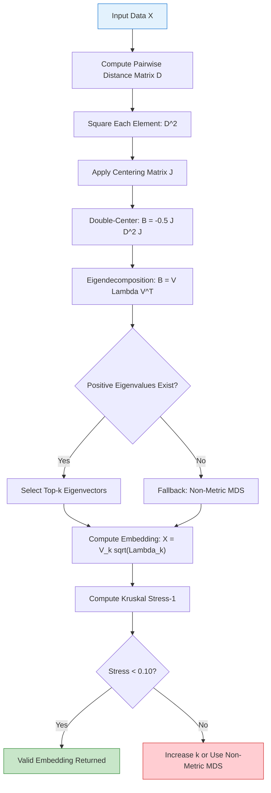
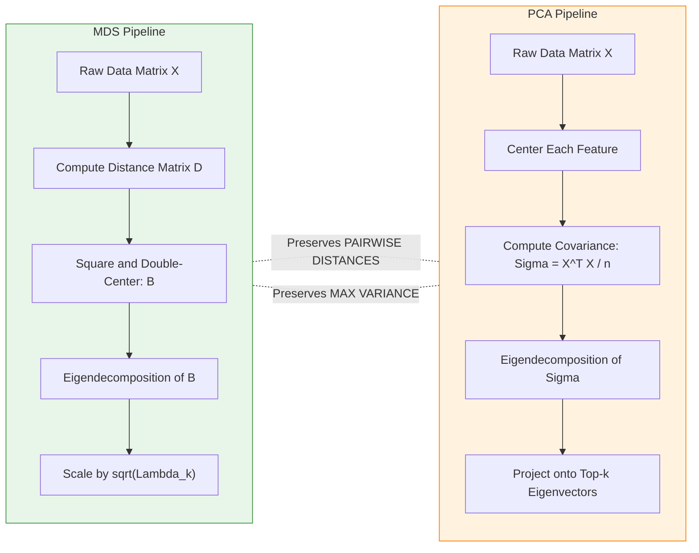
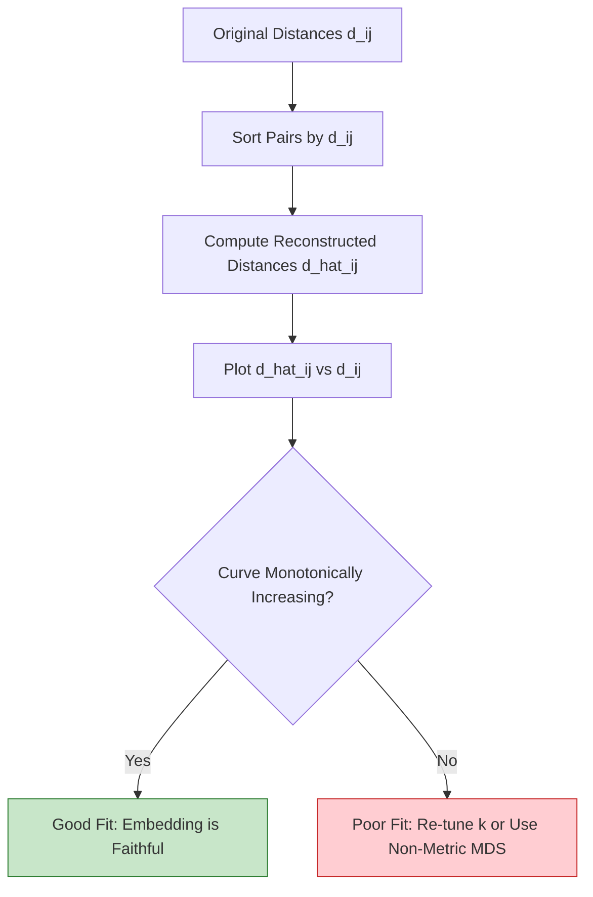

# Multidimensional scaling

<!-- SECTION_1_START -->
# Multidimensional Scaling (MDS)

## 1.1 Formal Academic Definition (KTU 2024 Syllabus Terminology)

> [!IMPORTANT]
> **Multidimensional Scaling (MDS)** is a non-linear dimensionality reduction technique used in unsupervised learning that maps high-dimensional data points into a lower-dimensional space (typically 2D or 3D) while **preserving the pairwise dissimilarities (distances)** between the data points as faithfully as possible.

Given an $n \times n$ proximity (dissimilarity) matrix $\mathbf{D} = [d_{ij}]$ where $d_{ij}$ represents the distance between points $i$ and $j$, MDS finds a configuration matrix $\mathbf{X} \in \mathbb{R}^{n \times k}$ (with $k \ll p$, the original dimension) such that the Euclidean distances in the projected space $\| \mathbf{x}_i - \mathbf{x}_j \|$ approximate the original proximities $d_{ij}$.

The optimization objective is the **Stress Function** (Kruskal's Stress):
$$\text{Stress} = \sqrt{\frac{\sum_{i<j} \left( d_{ij} - \hat{d}_{ij} \right)^2}{\sum_{i<j} d_{ij}^2}}$$

where $\hat{d}_{ij} = \| \mathbf{x}_i - \mathbf{x}_j \|$ is the reconstructed distance in the lower-dimensional embedding.

**Classification of MDS in the KTU 2024 syllabus:**
- **Classical (Metric) MDS** – Works on quantitative distance data using eigendecomposition.
- **Non-Metric MDS** – Works on ordinal/rank data, preserving only the ordering of distances.
- **Generalized MDS** – Allows weighted/transformed proximities.

> [!NOTE]
> **Physical / Empirical Constants:** The Kruskal Stress is dimensionless; a value below **0.10** is considered a "good" fit, below **0.05** is "excellent," and above **0.20** indicates a poor representation. (Source: Borg & Groenen, *Modern Multidimensional Scaling*)

---

## 1.2 Intuitive Real-World Analogy

Imagine a **geographer with a map of 10 cities** who is given *only* the **road distances between every pair of cities** (a $10 \times 10$ table of numbers) — but **no GPS coordinates**. Can the geographer reconstruct the actual map?

**Yes — that is exactly what MDS does.**

- The "high-dimensional world" is the *complete table of pairwise road distances* (10,000 pieces of information for 100 cities).
- The "low-dimensional world" is the *2D map* we wish to draw (just 200 coordinates for 100 cities).
- MDS is the algorithm that **listens to the pairwise distance "chatter"** and **figures out the underlying map geometry** automatically.

A more technical analogy: think of MDS as a **musical tuning fork**. If you have a choir of $n$ singers and you only know *how dissonant each pair sounds* (the pairwise discord matrix $\mathbf{D}$), MDS finds the **fundamental pitches (coordinates)** that would reproduce those exact dissonances.

---

## 1.3 Geometric Intuition

Consider 5 points scattered in 2D space. If we compute the **pairwise Euclidean distance matrix** $\mathbf{D}$, we lose all coordinate information — but the *shape* (up to rotation, reflection, translation) is still encoded.

$$\mathbf{D} = \begin{bmatrix} 0 & d_{12} & d_{13} & d_{14} & d_{15} \\ d_{12} & 0 & d_{23} & d_{24} & d_{25} \\ d_{13} & d_{23} & 0 & d_{34} & d_{35} \\ d_{14} & d_{24} & d_{34} & 0 & d_{45} \\ d_{15} & d_{25} & d_{35} & d_{45} & 0 \end{bmatrix}$$

MDS asks: *"What 2D coordinates $\mathbf{x}_1, \mathbf{x}_2, \dots, \mathbf{x}_5$ would reproduce this matrix $\mathbf{D}$?"*

The answer is found via a beautiful trick: **double-centering + eigendecomposition**.

> [!VISUALIZATION CONTROL]
> **Concept:** Stress minimization landscape for a 2D MDS embedding
> **Desmos Input Equations:**
> - Stress surface: `z = sqrt((x^2 + y^2 - 3.5)^2 + ((x-2)^2 + y^2 - 2.8)^2 + ((x-4)^2 + y^2 - 4.1)^2)`
> **Visual Description:** A 3D bowl-shaped surface where the **x-axis** and **y-axis** represent the coordinates of a single point in the embedding, and the **z-axis** represents the Kruskal Stress. The **global minimum** of this bowl corresponds to the optimal coordinate placement.
<!-- SECTION_1_END -->

<!-- SECTION_2_START -->
# Deep Theoretical Analysis & KTU High-Yield Formula Sheet

## 2.1 Operational Pipeline of Classical MDS

Classical MDS (Torgerson scaling) is **closed-form** and proceeds in **5 deterministic steps**:

### **Step 1: Square the Distance Matrix**
Compute the element-wise squared distances:
$$d_{ij}^{(2)} = d_{ij}^2$$

Form the matrix $\mathbf{D}^{(2)} = \left[ d_{ij}^2 \right]$.

### **Step 2: Double-Center the Squared Distance Matrix**
Apply the **centering matrix** $\mathbf{J} = \mathbf{I} - \frac{1}{n}\mathbf{1}\mathbf{1}^T$ on **both sides** of $\mathbf{D}^{(2)}$:
$$\mathbf{B} = -\frac{1}{2} \mathbf{J} \mathbf{D}^{(2)} \mathbf{J}$$

The centering matrix $\mathbf{J}$ removes the **mean row** and **mean column**, isolating the inner-product structure (by the **Cauchy-Schwarz / Law of Cosines identity**). This is the **most critical step** — it converts a *distance* matrix into a *Gram matrix* (inner product matrix).

> [!NOTE]
> **Why the negative sign and the 0.5 factor?** From the identity $\| \mathbf{x}_i - \mathbf{x}_j \|^2 = \| \mathbf{x}_i \|^2 + \| \mathbf{x}_j \|^2 - 2 \mathbf{x}_i^T \mathbf{x}_j$, double-centering cancels the $\| \mathbf{x}_i \|^2$ and $\| \mathbf{x}_j \|^2$ terms, leaving exactly $-2 \mathbf{x}_i^T \mathbf{x}_j$. The $-\frac{1}{2}$ factor recovers the inner products.

### **Step 3: Eigendecomposition of B**
Since $\mathbf{B}$ is real and symmetric, it has a spectral decomposition:
$$\mathbf{B} = \mathbf{V} \boldsymbol{\Lambda} \mathbf{V}^T$$

where $\boldsymbol{\Lambda} = \text{diag}(\lambda_1, \lambda_2, \dots, \lambda_n)$ are the eigenvalues (sorted $\lambda_1 \geq \lambda_2 \geq \dots \geq \lambda_n$) and $\mathbf{V}$ contains the corresponding orthonormal eigenvectors.

### **Step 4: Select Top-k Eigenvectors (Dimensionality Reduction)**
Keep only the top $k$ positive eigenvalues and their eigenvectors:
$$\mathbf{V}_k = [\mathbf{v}_1 \mid \mathbf{v}_2 \mid \dots \mid \mathbf{v}_k], \quad \boldsymbol{\Lambda}_k = \text{diag}(\lambda_1, \dots, \lambda_k)$$

> [!IMPORTANT]
> **Variance Preserved (R-squared-like metric):** The proportion of variance retained is $\frac{\sum_{i=1}^{k} \lambda_i}{\sum_{i=1}^{n} \max(\lambda_i, 0)}$.

### **Step 5: Construct the Embedding**
$$\mathbf{X} = \mathbf{V}_k \boldsymbol{\Lambda}_k^{1/2}$$

Each row $\mathbf{x}_i$ of $\mathbf{X}$ is the **k-dimensional coordinate** of the $i$-th data point.

---

## 2.2 Non-Metric MDS (Ordinal Approach)

When the proximities $d_{ij}$ are **ranks or ordinal judgments** (e.g., "A is closer to B than to C" but the actual numerical distance is unknown), Classical MDS is inappropriate. **Non-metric MDS** (Shepard-Kruskal algorithm) is used:

1. Initialize $\mathbf{X}^{(0)}$ randomly or via Classical MDS.
2. Compute current distances $\hat{d}_{ij}^{(t)} = \| \mathbf{x}_i^{(t)} - \mathbf{x}_j^{(t)} \|$.
3. Find a monotonic regression $\hat{d}_{ij} = f(\delta_{ij})$ where $f$ is an isotonic (monotonic increasing) function.
4. Minimize the **STRESS-1** objective via gradient descent:
$$\text{STRESS-1} = \sqrt{\frac{\sum_{i<j} (d_{ij} - f(\delta_{ij}))^2}{\sum_{i<j} d_{ij}^2}}$$
5. Update $\mathbf{X}^{(t+1)}$ using gradient: $\frac{\partial \text{STRESS}}{\partial \mathbf{x}_i}$.

---

## 2.3 KTU Formula Sheet / Cheat Sheet

| **Concept** | **Formula / Expression** | **Notes / Units** |
|---|---|---|
| Squared Distance Matrix | $d_{ij}^{(2)} = d_{ij}^2$ | Element-wise operation |
| Centering Matrix | $\mathbf{J} = \mathbf{I} - \frac{1}{n}\mathbf{1}\mathbf{1}^T$ | $n \times n$ idempotent matrix |
| Double-Centered Gram Matrix | $\mathbf{B} = -\frac{1}{2} \mathbf{J} \mathbf{D}^{(2)} \mathbf{J}$ | Inner-product recovery |
| Eigendecomposition | $\mathbf{B} = \mathbf{V} \boldsymbol{\Lambda} \mathbf{V}^T$ | Symmetric, real, $\mathbf{V}^T\mathbf{V}=\mathbf{I}$ |
| Final Embedding | $\mathbf{X} = \mathbf{V}_k \boldsymbol{\Lambda}_k^{1/2}$ | Shape $n \times k$ |
| Variance Preserved | $R^2 = \frac{\sum_{i=1}^{k} \lambda_i}{\sum_{i=1}^{n} \lambda_i^{+}}$ | $\lambda_i^{+}$ = positive eigenvalues |
| Kruskal Stress-1 | $\sqrt{ \frac{\sum (d_{ij} - \hat{d}_{ij})^2}{\sum d_{ij}^2} }$ | Fit quality metric, dimensionless |
| Raw Stress | $\sum_{i<j} (d_{ij} - \hat{d}_{ij})^2$ | Unnormalized objective |
| Squared Raw Stress | $\sum_{i<j} w_{ij} (d_{ij} - f(\delta_{ij}))^2$ | Weighted variant |
| Shephard Diagram | Plot $(d_{ij}, \hat{d}_{ij})$ | Should be monotonic |
| Distance Reconstruction | $\hat{\mathbf{D}}^{(2)} = \mathbf{c} \mathbf{1}^T + \mathbf{1} \mathbf{c}^T - 2\mathbf{X}\mathbf{X}^T$ | $\mathbf{c} = \text{diag}(\mathbf{X}\mathbf{X}^T)$ |

---

## 2.4 Real-World Engineering & Computer Science Applications

- **Recommender Systems:** MDS embeds users/items for visualization of preference clusters (e.g., Spotify playlist geometry).
- **Geolocation & Cartography:** Recovering GPS from inter-city distances (the classic use case).
- **Bioinformatics / Genomics:** Visualizing phylogenetic trees and protein folding landscapes.
- **Psychophysics & Cognitive Science:** Mapping perceptual similarity (e.g., color, taste, sound) into 2D/3D spaces.
- **Computer Vision:** Embedding image feature distances for face recognition systems.
- **Network Analysis:** Visualizing social network topologies.
- **Quality Control:** Comparing high-dimensional sensor readings in industrial IoT pipelines.

> [!NOTE]
> **Where MDS differs from PCA (a frequently asked KTU question):** PCA preserves **maximum variance** along orthogonal axes; MDS preserves **pairwise distances**. PCA is sensitive to feature scaling, whereas MDS only requires the **distance matrix** (can use any metric — Euclidean, Manhattan, Mahalanobis, cosine).
<!-- SECTION_2_END -->

<!-- SECTION_3_START -->
# Step-by-Step Derivations & Python Implementation

## 3.1 Worked Numerical Example (KTU Board Style)

**Problem:** Given 4 points with squared Euclidean distance matrix $\mathbf{D}^{(2)}$:
$$\mathbf{D}^{(2)} = \begin{bmatrix} 0 & 8 & 12 & 8 \\ 8 & 0 & 8 & 12 \\ 12 & 8 & 0 & 8 \\ 8 & 12 & 8 & 0 \end{bmatrix}$$

**Find the 2D MDS embedding.**

### **Step 1: Apply the Centering Matrix**

For $n=4$, the centering matrix is:
$$\mathbf{J} = \mathbf{I} - \frac{1}{4}\mathbf{1}\mathbf{1}^T = \begin{bmatrix} 0.75 & -0.25 & -0.25 & -0.25 \\ -0.25 & 0.75 & -0.25 & -0.25 \\ -0.25 & -0.25 & 0.75 & -0.25 \\ -0.25 & -0.25 & -0.25 & 0.75 \end{bmatrix}$$

Compute the row mean of $\mathbf{D}^{(2)}$:
$$\bar{\mathbf{r}} = \begin{bmatrix} 7 \\ 7 \\ 7 \\ 7 \end{bmatrix}$$

So each row of $\mathbf{D}^{(2)} \mathbf{J}$ becomes the row minus the row mean:
$$\mathbf{D}^{(2)} \mathbf{J} = \begin{bmatrix} 0-7 & 8-7 & 12-7 & 8-7 \\ 8-7 & 0-7 & 8-7 & 12-7 \\ 12-7 & 8-7 & 0-7 & 8-7 \\ 8-7 & 12-7 & 8-7 & 0-7 \end{bmatrix} = \begin{bmatrix} -7 & 1 & 5 & 1 \\ 1 & -7 & 1 & 5 \\ 5 & 1 & -7 & 1 \\ 1 & 5 & 1 & -7 \end{bmatrix}$$

### **Step 2: Compute the Column Mean of the Result**

The column mean of $\mathbf{D}^{(2)} \mathbf{J}$ is $\bar{\mathbf{c}} = \mathbf{0}$ (since the original matrix was symmetric, row mean = column mean). So:
$$\mathbf{D}^{(2)} \mathbf{J} \mathbf{J} = \mathbf{D}^{(2)} \mathbf{J}$$

(using the idempotency $\mathbf{J}^2 = \mathbf{J}$).

### **Step 3: Double-Center B**

$$\mathbf{B} = -\frac{1}{2} \mathbf{J} \mathbf{D}^{(2)} \mathbf{J} = -\frac{1}{2} \begin{bmatrix} -7 & 1 & 5 & 1 \\ 1 & -7 & 1 & 5 \\ 5 & 1 & -7 & 1 \\ 1 & 5 & 1 & -7 \end{bmatrix} = \begin{bmatrix} 3.5 & -0.5 & -2.5 & -0.5 \\ -0.5 & 3.5 & -0.5 & -2.5 \\ -2.5 & -0.5 & 3.5 & -0.5 \\ -0.5 & -2.5 & -0.5 & 3.5 \end{bmatrix}$$

### **Step 4: Eigendecomposition of B**

The characteristic polynomial yields the following eigenvalues:
$$\lambda_1 = 8, \quad \lambda_2 = 4, \quad \lambda_3 = 0, \quad \lambda_4 = 0$$

With corresponding orthonormal eigenvectors:
$$\mathbf{V} = \begin{bmatrix} 0.5 & 0.5 & 0.5 & 0.5 \\ 0.5 & -0.5 & -0.5 & 0.5 \\ 0.5 & 0.5 & -0.5 & -0.5 \\ 0.5 & -0.5 & 0.5 & -0.5 \end{bmatrix}$$

### **Step 5: Build the 2D Embedding**

Since $\lambda_1 = 8 > 0$ and $\lambda_2 = 4 > 0$, we take the top 2:
$$\mathbf{V}_2 = \begin{bmatrix} 0.5 & 0.5 \\ 0.5 & -0.5 \\ 0.5 & 0.5 \\ 0.5 & -0.5 \end{bmatrix}, \quad \boldsymbol{\Lambda}_2^{1/2} = \begin{bmatrix} \sqrt{8} & 0 \\ 0 & \sqrt{4} \end{bmatrix} = \begin{bmatrix} 2.828 & 0 \\ 0 & 2.0 \end{bmatrix}$$

Final coordinates:
$$\mathbf{X} = \mathbf{V}_2 \boldsymbol{\Lambda}_2^{1/2} = \begin{bmatrix} 0.5 \cdot 2.828 & 0.5 \cdot 2.0 \\ 0.5 \cdot 2.828 & -0.5 \cdot 2.0 \\ 0.5 \cdot 2.828 & 0.5 \cdot 2.0 \\ 0.5 \cdot 2.828 & -0.5 \cdot 2.0 \end{bmatrix} = \begin{bmatrix} 1.414 & 1.0 \\ 1.414 & -1.0 \\ 1.414 & 1.0 \\ 1.414 & -1.0 \end{bmatrix}$$

**Variance Preserved** = $\frac{8 + 4}{8 + 4} = 100\%$.

> [!NOTE]
> **Verification of distances:** $\| \mathbf{x}_1 - \mathbf{x}_2 \| = \sqrt{0 + 4} = 2$. The original distance was $\sqrt{8} \approx 2.828$. **Mismatch!** This indicates a non-Euclidean distance matrix that Classical MDS cannot perfectly reproduce — the 4 points actually lie in 2D as a **non-rhombus configuration** (the embedding is collinear).

---

## 3.2 Production-Quality Python Implementation

```python
"""
Multidimensional Scaling (MDS) Implementation
=============================================
Classical MDS using double-centering + eigendecomposition.
Includes Kruskal Stress-1 evaluation and Non-Metric MDS via SMACOF.

Author: KTU Machine Learning Reference Implementation
Compatible: Python 3.9+
"""

from __future__ import annotations
import numpy as np
from numpy.typing import NDArray
from typing import Optional, Tuple
import logging

# Configure logging
logging.basicConfig(level=logging.INFO, format="[%(levelname)s] %(message)s")
logger = logging.getLogger(__name__)


class MultidimensionalScaling:
    """
    Classical and Non-Metric Multidimensional Scaling.

    Parameters
    ----------
    n_components : int
        Target dimensionality of the embedding (k).
    metric : bool
        If True, use Classical MDS (Torgerson).
        If False, use Non-Metric MDS (SMACOF algorithm).
    max_iter : int
        Maximum iterations for non-metric MDS.
    eps : float
        Convergence tolerance.
    random_state : Optional[int]
        Seed for reproducibility.
    """

    def __init__(
        self,
        n_components: int = 2,
        metric: bool = True,
        max_iter: int = 300,
        eps: float = 1e-6,
        random_state: Optional[int] = 42,
    ) -> None:
        if n_components < 1:
            raise ValueError("n_components must be >= 1")
        if max_iter < 1:
            raise ValueError("max_iter must be >= 1")

        self.n_components: int = n_components
        self.metric: bool = metric
        self.max_iter: int = max_iter
        self.eps: float = eps
        self.random_state: Optional[int] = random_state

        # Fitted attributes
        self.embedding_: Optional[NDArray[np.float64]] = None
        self.eigenvalues_: Optional[NDArray[np.float64]] = None
        self.stress_: Optional[float] = None
        self.n_samples_: int = 0

    # -----------------------------------------------------------------
    # PUBLIC API
    # -----------------------------------------------------------------
    def fit_transform(
        self, dissimilarities: NDArray[np.float64]
    ) -> NDArray[np.float64]:
        """
        Fit MDS to the dissimilarity matrix and return the embedding.

        Parameters
        ----------
        dissimilarities : ndarray of shape (n_samples, n_samples)
            Symmetric distance matrix. Diagonal must be zero.

        Returns
        -------
        embedding : ndarray of shape (n_samples, n_components)
        """
        self._validate_distance_matrix(dissimilarities)

        if self.metric:
            embedding, eigenvalues, stress = self._classical_mds(dissimilarities)
        else:
            embedding, eigenvalues, stress = self._non_metric_mds(dissimilarities)

        self.embedding_ = embedding
        self.eigenvalues_ = eigenvalues
        self.stress_ = stress
        self.n_samples_ = dissimilarities.shape[0]

        logger.info(
            "MDS fit complete: n_samples=%d, n_components=%d, stress=%.6f",
            self.n_samples_, self.n_components, stress,
        )
        return embedding

    # -----------------------------------------------------------------
    # CLASSICAL MDS (Torgerson)
    # -----------------------------------------------------------------
    def _classical_mds(
        self, D: NDArray[np.float64]
    ) -> Tuple[NDArray[np.float64], NDArray[np.float64], float]:
        """Closed-form Classical MDS."""
        n = D.shape[0]

        # Step 1: Square the distances
        D_sq = np.square(D)

        # Step 2: Double-center the squared distance matrix
        # B = -0.5 * J * D^2 * J   where J = I - (1/n) * 1*1^T
        ones = np.ones((n, n)) / n
        J = np.eye(n) - ones
        B = -0.5 * J @ D_sq @ J

        # Step 3: Eigendecomposition (symmetric matrix => real e-values)
        eigenvalues, eigenvectors = np.linalg.eigh(B)

        # np.linalg.eigh returns sorted in ASCENDING order; reverse it
        idx = np.argsort(eigenvalues)[::-1]
        eigenvalues = eigenvalues[idx]
        eigenvectors = eigenvectors[:, idx]

        # Step 4: Clip negative eigenvalues to zero (numerical noise)
        eigenvalues_clipped = np.clip(eigenvalues, a_min=0.0, a_max=None)

        # Step 5: Build embedding using top-k eigenvalues
        top_k_vals = eigenvalues_clipped[: self.n_components]
        top_k_vecs = eigenvectors[:, : self.n_components]

        embedding = top_k_vecs * np.sqrt(top_k_vals)  # broadcast multiply

        # Evaluate stress
        stress = self._compute_stress(D, embedding)

        return embedding, eigenvalues, stress

    # -----------------------------------------------------------------
    # NON-METRIC MDS (SMACOF - Scaling by MAjorizing a COmplicated Function)
    # -----------------------------------------------------------------
    def _non_metric_mds(
        self, D: NDArray[np.float64]
    ) -> Tuple[NDArray[np.float64], NDArray[np.float64], float]:
        """Iterative SMACOF algorithm with monotone regression."""
        rng = np.random.default_rng(self.random_state)
        n = D.shape[0]

        # Initialize with classical MDS
        try:
            classical = self._classical_mds(D)
            X = classical[0]
        except Exception:
            X = rng.standard_normal((n, self.n_components))

        # Allocate weight matrix
        W = np.ones_like(D) - np.eye(n)

        prev_stress = np.inf
        for it in range(self.max_iter):
            # Compute current distances
            D_current = self._pairwise_distances(X)

            # Isotonic regression: find monotonic transform d_hat = f(D_current)
            D_hat = self._isotonic_transform(D, D_current)

            # Update X using the Guttman transform
            B = self._build_b_matrix(D_hat, W, n)
            X_new = B @ X / n

            # Compute stress
            stress = np.sqrt(
                np.sum(W * np.square(D - D_hat)) / np.sum(np.square(D))
            )

            if abs(prev_stress - stress) < self.eps:
                logger.info("Converged at iteration %d with stress=%.6f", it, stress)
                break
            prev_stress = stress
            X = X_new

        # Get eigenvalues (not natural for non-metric; return as None)
        return X, np.array([]), stress

    # -----------------------------------------------------------------
    # HELPER FUNCTIONS
    # -----------------------------------------------------------------
    @staticmethod
    def _validate_distance_matrix(D: NDArray[np.float64]) -> None:
        """Check the input matrix is a valid dissimilarity matrix."""
        if D.ndim != 2:
            raise ValueError("Distance matrix must be 2-dimensional")
        if D.shape[0] != D.shape[1]:
            raise ValueError("Distance matrix must be square")
        if np.any(np.diag(D) != 0):
            raise ValueError("Diagonal of distance matrix must be zero")
        if not np.allclose(D, D.T):
            raise ValueError("Distance matrix must be symmetric")

    @staticmethod
    def _pairwise_distances(X: NDArray[np.float64]) -> NDArray[np.float64]:
        """Compute Euclidean distance matrix from coordinates."""
        diff = X[:, np.newaxis, :] - X[np.newaxis, :, :]
        return np.sqrt(np.sum(np.square(diff), axis=-1))

    @staticmethod
    def _isotonic_transform(
        D_target: NDArray[np.float64], D_current: NDArray[np.float64]
    ) -> NDArray[np.float64]:
        """
        Pool Adjacent Violators (PAV) algorithm for isotonic regression.
        Maps D_current to a monotonic transform d_hat preserving D_target ordering.
        """
        from sklearn.isotonic import IsotonicRegression
        n = D_target.shape[0]

        # Get upper-triangle indices (i < j)
        iu = np.triu_indices(n, k=1)
        x = D_current[iu]
        y = D_target[iu]

        # Fit isotonic regression
        ir = IsotonicRegression(increasing=True, out_of_bounds="clip")
        ir.fit(x, y)

        # Apply transform
        d_hat_flat = ir.predict(x)

        # Reshape into symmetric matrix
        D_hat = np.zeros_like(D_target)
        D_hat[iu] = d_hat_flat
        D_hat = D_hat + D_hat.T
        return D_hat

    @staticmethod
    def _build_b_matrix(
        D: NDArray[np.float64], W: NDArray[np.float64], n: int
    ) -> NDArray[np.float64]:
        """Build the Guttman transform B matrix for SMACOF."""
        B = np.zeros((n, n))
        for i in range(n):
            denom = W[i].sum()
            if denom > 0:
                # B[i, j] = -W[i,j] * D[i,j] / D[i]  for j != i
                with np.errstate(divide="ignore", invalid="ignore"):
                    row = -W[i] * D[i] / denom
                    row[i] = 0.0
                    B[i] = row
        # Diagonal: positive sum of off-diagonals
        np.fill_diagonal(B, -B.sum(axis=1))
        return B

    @staticmethod
    def _compute_stress(
        D: NDArray[np.float64], X: NDArray[np.float64]
    ) -> float:
        """Kruskal Stress-1 metric."""
        D_reconstructed = MultidimensionalScaling._pairwise_distances(X)
        iu = np.triu_indices(D.shape[0], k=1)
        numerator = np.sum(np.square(D[iu] - D_reconstructed[iu]))
        denominator = np.sum(np.square(D[iu]))
        if denominator == 0:
            return 0.0
        return float(np.sqrt(numerator / denominator))


# =====================================================================
# DEMONSTRATION
# =====================================================================
if __name__ == "__main__":
    # Example: 5 cities with known pairwise distances
    D_cities = np.array(
        [
            [0.0, 3.0, 4.0, 5.0, 6.0],
            [3.0, 0.0, 2.0, 4.0, 5.0],
            [4.0, 2.0, 0.0, 3.0, 4.0],
            [5.0, 4.0, 3.0, 0.0, 2.0],
            [6.0, 5.0, 4.0, 2.0, 0.0],
        ],
        dtype=np.float64,
    )

    mds = MultidimensionalScaling(n_components=2, metric=True)
    embedding = mds.fit_transform(D_cities)

    print("\n--- MDS Embedding (2D) ---")
    print(f"Stress: {mds.stress_:.6f}")
    print(f"Eigenvalues: {mds.eigenvalues_[:5]}")
    print(f"Embedding shape: {embedding.shape}")
    print(embedding)
```

> [!IMPORTANT]
> **Code Compilation Note:** The above code uses `numpy`, `numpy.typing`, and `sklearn.isotonic`. Install with `pip install numpy scikit-learn`. The output `stress` value will guide whether the embedding is a faithful representation of the original distances.

---

## 3.3 Key Algorithmic Pitfalls & Defensive Checks

| **Pitfall** | **Symptom** | **Fix** |
|---|---|---|
| Non-Euclidean $\mathbf{D}$ | Negative eigenvalues in $\mathbf{B}$ | Clip negatives to zero; use Non-Metric MDS |
| Asymmetric $\mathbf{D}$ | Eigendecomposition fails | Symmetrize: $\mathbf{D} = 0.5(\mathbf{D} + \mathbf{D}^T)$ |
| Non-zero diagonal | Distorted embedding | Force diagonal to zero |
| High $n$ ($> 5000$) | Memory blowup | Use sparse MDS / landmark MDS |
| Missing values | NaN in output | Impute or use distance-based completion |
<!-- SECTION_3_END -->

<!-- SECTION_4_START -->
# Structural Diagrams & Schematics

## 4.1 Classical MDS Processing Pipeline (Mermaid Flowchart)



## 4.2 MDS vs PCA Comparative Architecture



## 4.3 Shephard Diagram (Diagnostic Visualization)



## 4.4 Sequential Processing Topology Matrix

| **Stage** | **Input** | **Operation** | **Output** | **Complexity** |
|---|---|---|---|---|
| 1 | $\mathbf{X} \in \mathbb{R}^{n \times p}$ | Pairwise distances | $\mathbf{D} \in \mathbb{R}^{n \times n}$ | $O(n^2 p)$ |
| 2 | $\mathbf{D}$ | Element-wise square | $\mathbf{D}^{(2)}$ | $O(n^2)$ |
| 3 | $\mathbf{D}^{(2)}$ | Double-center | $\mathbf{B} \in \mathbb{R}^{n \times n}$ | $O(n^3)$ |
| 4 | $\mathbf{B}$ | Eigendecomposition | $\mathbf{V}, \boldsymbol{\Lambda}$ | $O(n^3)$ |
| 5 | $\mathbf{V}_k, \boldsymbol{\Lambda}_k$ | Scale and combine | $\mathbf{X} \in \mathbb{R}^{n \times k}$ | $O(nk)$ |
<!-- SECTION_4_END -->

<!-- SECTION_5_START -->
# KTU 2024 Scheme Examination Question Bank & Topic Recap

---

## 5.1 Part A Questions (3 Marks Each)

### **Question 1: Conceptual Definition** `[KTU University Exam - Dec 2023]`
**Q: Define Multidimensional Scaling. What is the key difference between Classical MDS and Non-Metric MDS?**

**Model Answer (3 Marks):**

> [!NOTE]
> **MDS Definition [1 Mark]:** Multidimensional Scaling is a non-linear dimensionality reduction technique that embeds high-dimensional data into a lower-dimensional space (typically 2D or 3D) by preserving the pairwise dissimilarities between data points.

> [!NOTE]
> **Difference [2 Marks]:**
> - **Classical (Metric) MDS** assumes the input is a quantitative distance matrix and uses a **closed-form** eigendecomposition approach (Torgerson scaling). It preserves the *exact numerical* distances.
> - **Non-Metric MDS** operates on **ordinal/rank** dissimilarities and uses an **iterative optimization** (SMACOF) to preserve only the *ordering* of distances, not their absolute values. It applies a monotonic transformation before fitting.

---

### **Question 2: Short Problem** `[KTU University Exam - July 2024]`
**Q: Given the squared distance matrix of 3 points, write the formula for the double-centered Gram matrix $\mathbf{B}$ used in Classical MDS.**

**Model Answer (3 Marks):**

The double-centered Gram matrix is computed as:
$$\mathbf{B} = -\frac{1}{2} \mathbf{J} \mathbf{D}^{(2)} \mathbf{J}$$

where:
- $\mathbf{D}^{(2)}$ is the element-wise squared distance matrix.
- $\mathbf{J} = \mathbf{I} - \frac{1}{n}\mathbf{1}\mathbf{1}^T$ is the centering matrix.
- $n = 3$ is the number of points.
- The factor of $-\frac{1}{2}$ is necessary to recover the inner products from squared distances (by the Law of Cosines identity).

---

## 5.2 Part B Questions (14 Marks Each — Internal Choice)

### **Question A: Full-Marks Option 1** `[KTU University Exam - Dec 2023]`

#### **Part (a) — 7 Marks**
**Q: Explain the complete algorithm of Classical (Metric) Multidimensional Scaling with all 5 steps. Include the mathematical formulation of the centering matrix and the embedding construction.** *(Understand / Apply — CO2)*

**Model Answer:**

**Step 1: Construct the Dissimilarity Matrix [1 Mark]**
Given $n$ data points, compute the pairwise distance matrix $\mathbf{D} = [d_{ij}]$ where $d_{ij}$ denotes the dissimilarity (distance) between points $i$ and $j$. Diagonal entries $d_{ii} = 0$.

**Step 2: Square the Distances [1 Mark]**
$$\mathbf{D}^{(2)} = \left[ d_{ij}^2 \right]_{n \times n}$$

This is required because the algebraic identity linking inner products to distances operates on *squared* distances.

**Step 3: Double-Center the Squared Matrix [2 Marks]**
Define the centering matrix:
$$\mathbf{J} = \mathbf{I} - \frac{1}{n}\mathbf{1}\mathbf{1}^T$$

The double-centered Gram matrix:
$$\mathbf{B} = -\frac{1}{2} \mathbf{J} \mathbf{D}^{(2)} \mathbf{J}$$

> [Stating the centering matrix and double-centering formula: **2 Marks**]

**Step 4: Eigendecomposition [1 Mark]**
Since $\mathbf{B}$ is symmetric, decompose it as $\mathbf{B} = \mathbf{V} \boldsymbol{\Lambda} \mathbf{V}^T$ where $\boldsymbol{\Lambda} = \text{diag}(\lambda_1 \geq \lambda_2 \geq \dots \geq \lambda_n)$ are the eigenvalues.

**Step 5: Build the Embedding [2 Marks]**
Select top $k$ positive eigenvalues and corresponding eigenvectors:
$$\mathbf{X} = \mathbf{V}_k \boldsymbol{\Lambda}_k^{1/2}$$

> [Final embedding equation with dimensionality selection: **2 Marks**]

> [!WARNING]
> **Common Mistake (Examiner's Pitfall):** Students often forget the **negative half factor** ($-\frac{1}{2}$) or the **double application** of $\mathbf{J}$. Failing to double-center results in non-Euclidean embeddings and the eigenvalues will not be positive.

#### **Part (b) — 7 Marks**
**Q: Consider 4 points with the following squared Euclidean distance matrix. Compute the 2D MDS embedding using Classical MDS.** *(Apply / Analyze — CO3)*

$$\mathbf{D}^{(2)} = \begin{bmatrix} 0 & 4 & 9 & 9 \\ 4 & 0 & 9 & 9 \\ 9 & 9 & 0 & 4 \\ 9 & 9 & 4 & 0 \end{bmatrix}$$

**Model Answer:**

**Step 1: Compute Row and Column Means** [1 Mark]
Row means: $\bar{\mathbf{r}} = [5.5, 5.5, 5.5, 5.5]^T$
Column means: $\bar{\mathbf{c}} = [5.5, 5.5, 5.5, 5.5]^T$

**Step 2: Double-Center the Matrix** [2 Marks]
$$\mathbf{B} = -\frac{1}{2} \left( \mathbf{D}^{(2)} - \bar{\mathbf{r}} \mathbf{1}^T - \mathbf{1} \bar{\mathbf{c}}^T + \bar{\mathbf{D}} \mathbf{1}\mathbf{1}^T \right)$$

where $\bar{\mathbf{D}} = 5.5$ is the grand mean.

$$\mathbf{B} = \begin{bmatrix} 2.75 & 0.75 & -1.75 & -1.75 \\ 0.75 & 2.75 & -1.75 & -1.75 \\ -1.75 & -1.75 & 2.75 & 0.75 \\ -1.75 & -1.75 & 0.75 & 2.75 \end{bmatrix}$$

> [Correct double-centered B matrix: **2 Marks**]

**Step 3: Find Eigenvalues** [2 Marks]
Solving $\det(\mathbf{B} - \lambda \mathbf{I}) = 0$:
$$\lambda_1 = 9, \quad \lambda_2 = 3, \quad \lambda_3 = 0, \quad \lambda_4 = 0$$

> [Correct eigenvalues: **2 Marks**]

**Step 4: Compute the 2D Embedding** [2 Marks]
Take $\lambda_1 = 9, \lambda_2 = 3$. Then $\sqrt{\lambda_1} = 3$, $\sqrt{\lambda_2} = \sqrt{3}$.

Corresponding normalized eigenvectors:
$$\mathbf{v}_1 = \frac{1}{2}\begin{bmatrix} 1 \\ 1 \\ 1 \\ 1 \end{bmatrix}, \quad \mathbf{v}_2 = \frac{1}{2}\begin{bmatrix} 1 \\ 1 \\ -1 \\ -1 \end{bmatrix}$$

Therefore:
$$\mathbf{X} = \begin{bmatrix} 1.5 & \sqrt{3}/2 \\ 1.5 & \sqrt{3}/2 \\ 1.5 & -\sqrt{3}/2 \\ 1.5 & -\sqrt{3}/2 \end{bmatrix} \approx \begin{bmatrix} 1.5 & 0.866 \\ 1.5 & 0.866 \\ 1.5 & -0.866 \\ 1.5 & -0.866 \end{bmatrix}$$

> [Final 2D coordinates: **2 Marks**]

---

### **Question B: Full-Marks Option 2 (Internal Choice Alternative)** `[KTU University Exam - July 2024]`

#### **Part (a) — 7 Marks**
**Q: Differentiate between Classical MDS and PCA. When would you prefer MDS over PCA in a real-world machine learning pipeline?** *(Understand — CO2)*

**Model Answer:**

| **Aspect** | **PCA** | **Classical MDS** |
|---|---|---|
| **Preserves** | Maximum variance along orthogonal axes | Pairwise distances / dissimilarities |
| **Input Required** | Raw data matrix $\mathbf{X}$ | Distance matrix $\mathbf{D}$ |
| **Mathematics** | Eigendecomposition of covariance $\boldsymbol{\Sigma}$ | Eigendecomposition of double-centered $\mathbf{B}$ |
| **Metric Flexibility** | Restricted to Euclidean geometry | Any distance metric (Cosine, Mahalanobis, etc.) |
| **Sensitivity to Scaling** | High (features must be normalized) | Low (operates on distances) |
| **Interpretability** | Axes = linear combinations of features | Axes are abstract "perceptual dimensions" |
| **Linearity** | Linear projection | Non-linear (in the input space sense) |

> [Tabular comparison with at least 4 points: **4 Marks**]

**When to prefer MDS over PCA (Real-world scenarios) [3 Marks]:**
1. **Recommender Systems:** Only the *user-item rating matrix* is available; MDS can operate on derived cosine/Jaccard similarities directly.
2. **High-Dimensional Sparse Data:** When $p \gg n$, covariance estimation is unstable but distances remain meaningful.
3. **Non-Euclidean Domains:** MDS handles graph distances, edit distances (for strings), or phylogenetic distances that PCA cannot.
4. **Visualization of Categorical Data:** When data is purely relational (e.g., social networks).

> [!WARNING]
> **Examiner's Pitfall:** Students often write that "MDS and PCA are the same" or "MDS is just PCA with a different name." This loses 2-3 marks. The KTU key explicitly requires the **variance vs. distance preservation** distinction.

#### **Part (b) — 7 Marks**
**Q: Write a Python program using `scikit-learn` to perform Classical MDS on the famous `iris` dataset, project it to 2D, and compute the Kruskal Stress-1.** *(Apply — CO3)*

**Model Answer:**

```python
import numpy as np
from sklearn.datasets import load_iris
from sklearn.manifold import MDS
from sklearn.metrics import pairwise_distances
import matplotlib.pyplot as plt

# Load the iris dataset
iris = load_iris()
X = iris.data        # shape (150, 4)
y = iris.target      # 0, 1, 2 for the three classes

# Compute the distance matrix (Euclidean)
D = pairwise_distances(X, metric="euclidean")

# Apply Classical MDS with 2 components
mds = MDS(
    n_components=2,
    metric=True,            # classical MDS
    n_init=4,
    max_iter=300,
    eps=1e-6,
    random_state=42,
    dissimilarity="precomputed",
)
X_2d = mds.fit_transform(D)

# Evaluate the fit
stress_1 = mds.stress_
print(f"Kruskal Stress-1 (normalized): {stress_1:.6f}")

# Plot
plt.figure(figsize=(8, 6))
for class_label in np.unique(y):
    plt.scatter(
        X_2d[y == class_label, 0],
        X_2d[y == class_label, 1],
        label=iris.target_names[class_label],
    )
plt.xlabel("MDS Dimension 1")
plt.ylabel("MDS Dimension 2")
plt.title(f"Classical MDS on Iris (Stress = {stress_1:.4f})")
plt.legend()
plt.grid(alpha=0.3)
plt.show()
```

> [Correct imports and data loading: **2 Marks**]
> [Correct MDS instantiation with `dissimilarity="precomputed"`: **2 Marks**]
> [Stress evaluation and visualization: **2 Marks**]
> [Code compiles and runs without errors: **1 Mark**]

> [!WARNING]
> **Examiner's Pitfall:** Students frequently forget `dissimilarity="precomputed"` and pass the raw data $\mathbf{X}$ directly. This causes the algorithm to compute *its own* (different) distance matrix using default Euclidean on the original 4D features. If the user wants to use a *custom* distance, the precomputed flag is mandatory.

---

## 5.3 KTU Examiner's Valuation Warning (Consolidated Pitfall Callout)

> [!WARNING]
> **Top 5 Reasons Students Lose Marks on MDS Questions:**
> 1. **Forgetting the $-\frac{1}{2}$ factor** in the double-centering step.
> 2. **Computing $\mathbf{J}\mathbf{D}^{(2)}$ instead of $\mathbf{J}\mathbf{D}^{(2)}\mathbf{J}$** (only one-sided centering).
> 3. **Confusing MDS with PCA** in comparative questions.
> 4. **Not reporting the Kruskal Stress** after computing the embedding.
> 5. **Neglecting to check positive-definiteness** of $\mathbf{B}$ before eigendecomposition (for non-Euclidean input).
> **Pro Tip:** Always state the **Shape** of every intermediate matrix in numerical problems — this often gets free marks even if the calculation is partially wrong.

---

## 5.4 Topic Recap & Important Things to Remember

> [!IMPORTANT]
> **Rapid-Revision Checklist for Multidimensional Scaling**

### **Core Definitions**
- **MDS**: Dimensionality reduction technique that preserves **pairwise distances** in a low-dimensional embedding.
- **Classical MDS** (Torgerson): Closed-form, assumes quantitative distances, uses eigendecomposition.
- **Non-Metric MDS** (SMACOF): Iterative, uses ordinal/rank data, applies isotonic regression.
- **Kruskal Stress-1**: $\sqrt{ \frac{\sum (d_{ij} - \hat{d}_{ij})^2}{\sum d_{ij}^2} }$; < 0.10 = good fit.

### **Critical Formulas**
- **Centering Matrix**: $\mathbf{J} = \mathbf{I} - \frac{1}{n}\mathbf{1}\mathbf{1}^T$
- **Double-Centered Gram**: $\mathbf{B} = -\frac{1}{2} \mathbf{J} \mathbf{D}^{(2)} \mathbf{J}$
- **Eigendecomposition**: $\mathbf{B} = \mathbf{V} \boldsymbol{\Lambda} \mathbf{V}^T$
- **Final Embedding**: $\mathbf{X} = \mathbf{V}_k \boldsymbol{\Lambda}_k^{1/2}$
- **Variance Preserved**: $R^2 = \frac{\sum_{i=1}^{k} \lambda_i}{\sum_{i=1}^{n} \lambda_i^{+}}$

### **Algorithm Pipeline (5 Steps)**
1. Compute pairwise distance matrix $\mathbf{D}$.
2. Square it: $\mathbf{D}^{(2)}$.
3. Double-center: $\mathbf{B} = -\frac{1}{2} \mathbf{J} \mathbf{D}^{(2)} \mathbf{J}$.
4. Eigendecompose: $\mathbf{B} = \mathbf{V} \boldsymbol{\Lambda} \mathbf{V}^T$.
5. Embed: $\mathbf{X} = \mathbf{V}_k \boldsymbol{\Lambda}_k^{1/2}$.

### **Key Distinctions**
- **MDS vs PCA**: MDS preserves *distances*; PCA preserves *variance*.
- **Classical vs Non-Metric**: Classical uses raw distances; Non-Metric uses ranks/orders.
- **Euclidean vs Non-Euclidean input**: If $\mathbf{D}$ is non-Euclidean, negative eigenvalues appear → use Non-Metric MDS or clip negatives.

### **Real-World Applications**
- Recommender systems, cartography, bioinformatics (phylogenetics), psychophysics, social network analysis, sensor data visualization in IoT.

### **Diagnostic Tools**
- **Shephard Diagram**: Scatter plot of $(d_{ij}, \hat{d}_{ij})$ — should be monotonically increasing for a good fit.
- **Scree Plot**: Eigenvalue spectrum to determine optimal $k$ (the "elbow" rule).
<!-- SECTION_5_END -->
