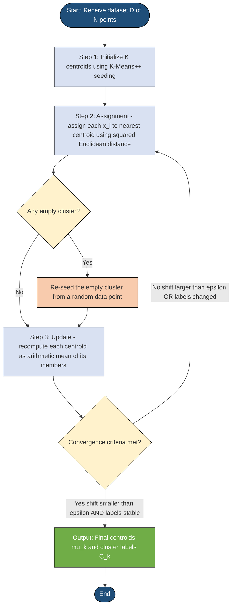
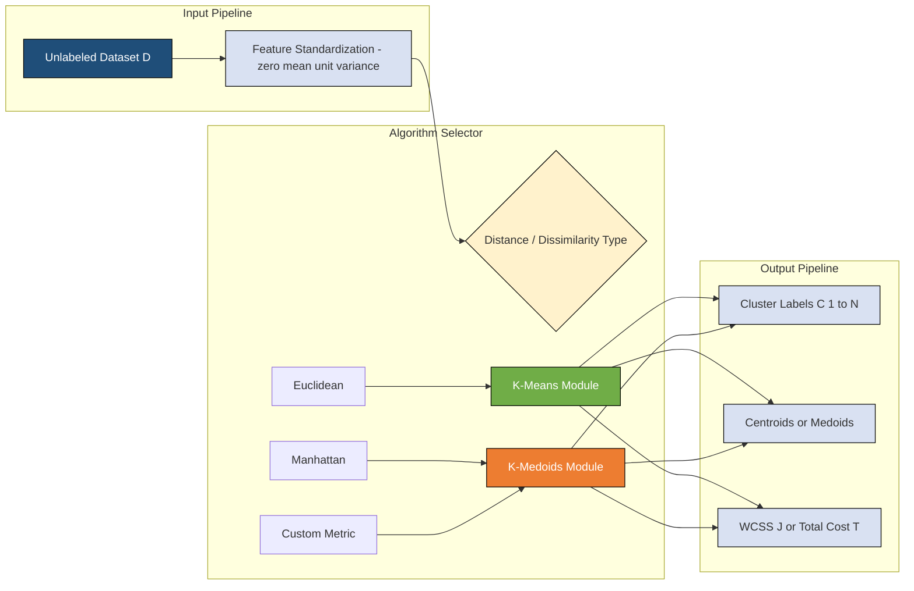
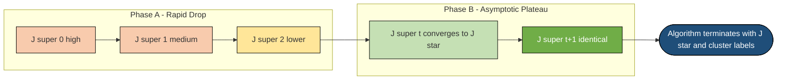
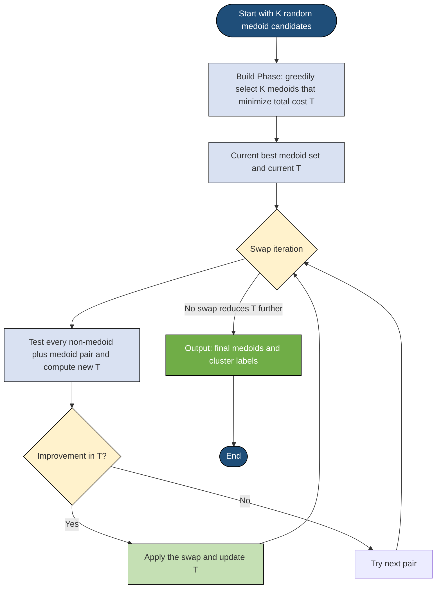
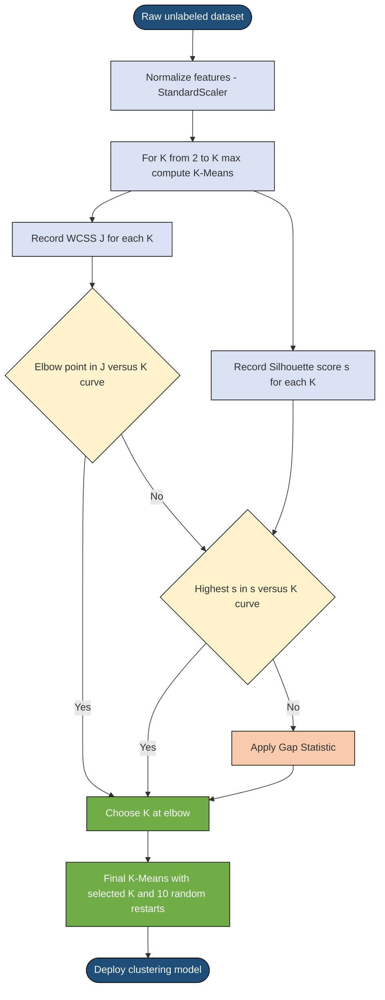

# partitional clustering

<!-- SECTION_1_START -->

# Partitional Clustering — KTU Premier Engine V10

> [!IMPORTANT]
> **KTU 2024 Scheme | PCCST503 — Machine Learning | Module 4: Unsupervised Learning**
> This note is mapped to **CO4** (Apply clustering and dimensionality reduction techniques to discover hidden patterns in unlabeled data) and follows the Revised Bloom's Taxonomy cognitive levels used in the End Semester Evaluation (ESE).

## 1.1 Formal Academic Definition

> [!NOTE]
> **Definition (Partitional Clustering):**
> Partitional clustering is a category of unsupervised learning algorithms that **simultaneously partition a dataset of $N$ observations into $K$ non-overlapping, exhaustive clusters**, where each observation belongs to exactly one cluster. Unlike hierarchical clustering, partitional methods do not build a dendrogram; instead, they directly produce a single, flat partition $C = \{C_1, C_2, \dots, C_K\}$ such that:
> $$\bigcup_{k=1}^{K} C_k = \mathcal{D} \quad \text{and} \quad C_i \cap C_j = \emptyset \;\; \forall \, i \neq j$$
> where $\mathcal{D} = \{x_1, x_2, \dots, x_N\}$ is the unlabeled dataset and $K$ is a user-specified hyperparameter. The objective is to minimize a global dissimilarity (cost) function $J(C)$ that quantifies intra-cluster compactness and inter-cluster separation.

The two canonical algorithms studied in the KTU syllabus are:

* **K-Means** (Lloyd / Forgy algorithm) — uses the **mean** (centroid) of points in a cluster as its representative.
* **K-Medoids** (Partitioning Around Medoids — PAM) — uses the **most centrally located actual data point** (medoid) as the representative, making it robust to outliers and noise.

## 1.2 Intuitive Analogy — "The Grocery Aisle Problem"

Imagine you are the floor manager of a large supermarket. You have **$N = 1000$ customers** and a customer loyalty card database. Each customer has a *vector* of attributes: $x = (\text{monthly spend}, \text{frequency of visit}, \text{average basket size})$. You have **$K = 4$** shelf sections to display targeted promotional offers.

You do not know the customer types in advance. So you:

1. **Guess** four "prototype" customers (centroids).
2. **Assign** every real customer to the *closest* prototype based on a distance measure.
3. **Recompute** the prototype as the *average* of the customers assigned to it.
4. **Repeat** Steps 2 and 3 until the prototype stops moving.

This iterative "assign → update → re-assign" cycle is the entire engine behind K-Means. The shelf sections never overlap, every customer is in exactly one section, and the goal is to make each section *as tight as possible* (compact) and *as different as possible* from other sections (separated). The "supermarket" is your dataset, the "shelves" are clusters, and the "prototype" is the centroid.

> [!TIP]
> **Syllabus Highlight:** KTU examiners frequently test the difference between K-Means and K-Medoids in Part A (3-mark) questions. Always remember: **K-Means $\rightarrow$ centroid (synthetic mean)**, **K-Medoids $\rightarrow$ medoid (real point from the dataset).**

## 1.3 Geometric Intuition — Voronoi Partitioning

At convergence, K-Means implicitly carves the feature space into a **Voronoi tessellation** — a set of convex polyhedral (or polygons in 2-D) cells. The boundary between any two clusters is the **perpendicular bisector** of the line segment joining the two centroids.

> [!VISUALIZATION CONTROL]
> **Concept:** Voronoi cells produced by a 2-D K-Means run on three Gaussian blobs.
> **GeoGebra / Desmos Input Equations (centroids as foci of three circles, each cell = locus of points closer to one focus):**
> * `C1: (x - 2)^2 + (y - 3)^2 = r1^2` with centroid $\mu_1 = (2, 3)$
> * `C2: (x - 8)^2 + (y - 2)^2 = r2^2` with centroid $\mu_2 = (8, 2)$
> * `C3: (x - 5)^2 + (y - 8)^2 = r3^2` with centroid $\mu_3 = (5, 8)$
> **Visual Description:** The student should see three polygonal cells sharing edges. Each edge is a straight line (or curve depending on distance metric) that is the locus of points equidistant from the two neighbouring centroids. Data points falling inside a cell are assigned to that cluster.

## 1.4 Why "Partitional" — The Defining Property

| Property | Partitional (K-Means / K-Medoids) | Hierarchical (Agglomerative) |
| :--- | :--- | :--- |
| **Output structure** | Flat, single partition $C$ | Tree (dendrogram) of nested partitions |
| **Number of clusters** | Fixed upfront as $K$ | Emerges by cutting the dendrogram |
| **Cluster representative** | Centroid or Medoid | Not required |
| **Time complexity** | $\mathcal{O}(N \cdot K \cdot I \cdot d)$ | $\mathcal{O}(N^3)$ (naive) or $\mathcal{O}(N^2 \log N)$ |
| **Reversibility** | A point can move between iterations | Once merged/split, decision is locked |
| **Scalability to large $N$** | Excellent (Mini-Batch K-Means variant) | Poor for $N > 10{,}000$ |

where $I$ is the number of iterations until convergence and $d$ is the feature dimensionality.

<!-- SECTION_1_END -->

<!-- SECTION_2_START -->

# Partitional Clustering — Deep Theoretical Analysis

## 2.1 The K-Means Objective Function (Mathematical Foundation)

The most widely used formulation of partitional clustering seeks to **minimize the Within-Cluster Sum of Squares (WCSS)**, also called the *distortion* or *inertia*:

$$J(C, \mu) = \sum_{k=1}^{K} \sum_{x_i \,\in\, C_k} \lVert x_i - \mu_k \rVert^2$$

where the squared Euclidean norm expands as:

$$\lVert x_i - \mu_k \rVert^2 = \sum_{j=1}^{d} (x_{ij} - \mu_{kj})^2$$

**Why this objective?** Because (a) it is a strict upper bound on the pairwise intra-cluster distance variance, (b) it is differentiable with respect to $\mu_k$ (closed-form solution exists for the update), and (c) it is empirically proven to recover *isotropic, Gaussian-like* clusters of similar size.

> [!IMPORTANT]
> **Key Theorem (K-Means Optimality):** Given a fixed assignment $C$, the cluster centroid $\mu_k$ that minimizes $J$ is the **arithmetic mean** of the points in $C_k$:
> $$\mu_k^{\star} = \frac{1}{\lvert C_k \rvert} \sum_{x_i \,\in\, C_k} x_i$$
> Conversely, given fixed centroids $\mu$, the optimal assignment is **argmin distance** (the nearest-centroid rule):
> $$C_k^{\star} = \{\, x_i : \lVert x_i - \mu_k \rVert^2 \leq \lVert x_i - \mu_j \rVert^2 \;\; \forall j \neq k \,\}$$
> These two update rules are guaranteed to **monotonically decrease** (or leave unchanged) the value of $J$ at every iteration.

## 2.2 Lloyd's Algorithm — The K-Means Engine (Step-by-Step)

The classic K-Means procedure is **Lloyd's algorithm (1957)**, with the following operational phases:

1. **Initialization Phase** — Place $K$ initial centroids $\{\mu_1^{(0)}, \mu_2^{(0)}, \dots, \mu_K^{(0)}\}$ using one of:
   * **Forgy method:** Randomly select $K$ distinct data points.
   * **Random Partition:** Assign each point to a random cluster, then compute the mean of each.
   * **K-Means++** (recommended): First centroid chosen uniformly; each subsequent centroid chosen with probability proportional to $D(x_i)^2$ where $D(x_i)$ is the distance from $x_i$ to its closest already-chosen centroid. This yields $\mathcal{O}(\log K)$-competitive solutions.
2. **Assignment Step (E-step analogue):** For each $x_i$, compute the squared distance to every centroid and assign to the nearest:
   $$C_k^{(t)} = \left\{\, x_i : k = \arg\min_{j} \lVert x_i - \mu_j^{(t)} \rVert^2 \,\right\}$$
3. **Update Step (M-step analogue):** Recompute each centroid as the mean of its assigned points:
   $$\mu_k^{(t+1)} = \frac{1}{\lvert C_k^{(t)} \rvert} \sum_{x_i \,\in\, C_k^{(t)}} x_i$$
4. **Convergence Check:** Stop when any of the following holds:
   * Centroid shift $\max_k \lVert \mu_k^{(t+1)} - \mu_k^{(t)} \rVert < \epsilon$ (e.g., $\epsilon = 10^{-4}$).
   * Assignment labels are unchanged: $C^{(t+1)} = C^{(t)}$.
   * Maximum iterations $I_{\max}$ reached (e.g., $I_{\max} = 300$).
   * Relative change in objective $\frac{\vert J^{(t)} - J^{(t-1)} \vert}{J^{(t-1)}} < \tau$.

> [!WARNING]
> **KTU Pitfall:** K-Means is **not guaranteed to find the global minimum** of $J$. It converges to a *local minimum* depending on initialization. Always run with $n_{\text{init}} \geq 10$ different seeds (as in `sklearn.cluster.KMeans`) and keep the best result.

## 2.3 K-Medoids (Partitioning Around Medoids — PAM)

K-Medoids replaces the synthetic mean with a **medoid** $m_k$ — the most centrally located *actual* data point in the cluster:

$$m_k = \arg\min_{x_i \,\in\, C_k} \sum_{x_j \,\in\, C_k} d(x_i, x_j)$$

where $d(\cdot, \cdot)$ can be **any dissimilarity measure** (Euclidean, Manhattan, cosine, Mahalanobis, or even a non-metric domain-specific kernel). This makes K-Medoids **robust to outliers and noise**, and it works directly on **dissimilarity matrices** without needing explicit feature vectors — useful for clustering strings, graphs, or mixed-type data.

**PAM Algorithm Phases:**

* **BUILD Phase:** Sequentially select $K$ medoids that maximally *reduce* the total cost $T = \sum_{k=1}^{K} \sum_{x_i \,\in\, C_k} d(x_i, m_k)$.
* **SWAP Phase:** For every (non-medoid, medoid) pair $(x_i, m_k)$, test the swap. If the swap reduces $T$, accept it. Repeat until no improvement.

The complexity per swap test is $\mathcal{O}(K \cdot (N - K))$, and the total cost of PAM is $\mathcal{O}(K \cdot (N - K)^2 \cdot I)$, which is expensive for large $N$. The **CLARA** and **CLARANS** variants address scalability.

## 2.4 KTU High-Yield Formula Cheat Sheet

> [!TIP]
> Memorize the table below. KTU ESE questions often have a 3-mark "write the objective function and update rule" sub-part.

| Concept | Symbol | Formula / Rule | Engineering Utility |
| :--- | :--- | :--- | :--- |
| Objective (WCSS) | $J$ | $J = \sum_{k=1}^{K} \sum_{x_i \in C_k} \lVert x_i - \mu_k \rVert^2$ | Anomaly detection threshold |
| Centroid update | $\mu_k$ | $\mu_k = \frac{1}{\lvert C_k \rvert} \sum_{x_i \in C_k} x_i$ | Vector quantization (image compression) |
| Medoid definition | $m_k$ | $m_k = \arg\min_{x_i \in C_k} \sum_{x_j \in C_k} d(x_i, x_j)$ | Robust customer segmentation |
| Assignment rule | $C_k$ | $k = \arg\min_j \lVert x_i - \mu_j \rVert^2$ | Document / image classification |
| K-Means complexity | $T_{\text{KM}}$ | $\mathcal{O}(N \cdot K \cdot I \cdot d)$ | Big-data clustering (Spark MLlib) |
| PAM complexity | $T_{\text{PAM}}$ | $\mathcal{O}(K(N-K)^2 I)$ | Small-to-medium biomedical data |
| K-Means++ prob. | $P(x_i)$ | $P(x_i) = \frac{D(x_i)^2}{\sum_j D(x_j)^2}$ | Initialization for stable convergence |
| Elbow rule | $K^{\star}$ | Find the "elbow" in $J(K)$ plot | Choosing $K$ without labels |
| Silhouette score | $s(i)$ | $s(i) = \frac{b(i) - a(i)}{\max\{a(i), b(i)\}}$, $a(i)$ = mean intra-cluster distance, $b(i)$ = mean nearest-cluster distance | Internal cluster validity |
| Dunn index | $DI$ | $DI = \frac{\min_{i \neq j} \delta(C_i, C_j)}{\max_k \Delta(C_k)}$ | Compactness / separation trade-off |

## 2.5 Real-World Engineering Applications

* **Vector Quantization (VQ):** K-Means centroid positions act as a *codebook* that compresses images, audio, and video (e.g., MP3 encoders, JPEG color quantization). The cluster index replaces 24-bit RGB with a tiny integer.
* **Customer Segmentation:** Marketing teams at Amazon, Flipkart, and Netflix cluster users by browsing / purchase vectors to drive recommendation engines.
* **Image Segmentation:** Computer vision pipelines (medical MRI, satellite imagery) use K-Means on pixel color histograms to isolate anatomical structures or land-cover types.
* **Document Clustering:** Search engines (Lucene / Elasticsearch) cluster news articles by TF-IDF vectors to detect topic trends.
* **Anomaly Detection:** Points whose distance to their assigned centroid exceeds a threshold (e.g., $3\sigma$ of cluster radius) are flagged as outliers in network intrusion detection systems.

<!-- SECTION_2_END -->

<!-- SECTION_3_START -->

# Partitional Clustering — Exhaustive Derivations & Implementation

## 3.1 Mathematical Derivation — Why the Centroid is the Mean

We prove the theorem stated in §2.1: **Given a fixed cluster $C_k$, the centroid that minimizes $\sum_{x_i \in C_k} \lVert x_i - \mu_k \rVert^2$ is the arithmetic mean.**

Starting point — the partial derivative of $J_k = \sum_{x_i \in C_k} \lVert x_i - \mu_k \rVert^2$ with respect to $\mu_k$, setting it to zero:

$$\frac{\partial J_k}{\partial \mu_k} = \frac{\partial}{\partial \mu_k} \sum_{x_i \in C_k} \sum_{j=1}^{d} (x_{ij} - \mu_{kj})^2 = -2 \sum_{x_i \in C_k} (x_i - \mu_k)$$

Setting the gradient to zero:

$$\sum_{x_i \in C_k} (x_i - \mu_k) = 0 \;\;\Longrightarrow\;\; \sum_{x_i \in C_k} x_i - \sum_{x_i \in C_k} \mu_k = 0$$

Since $\mu_k$ is constant within the cluster and there are $\lvert C_k \rvert$ points:

$$\sum_{x_i \in C_k} x_i - \lvert C_k \rvert \cdot \mu_k = 0 \;\;\Longrightarrow\;\; \mu_k = \frac{1}{\lvert C_k \rvert} \sum_{x_i \in C_k} x_i \quad \blacksquare$$

The second derivative $\frac{\partial^2 J_k}{\partial \mu_k^2} = 2 \lvert C_k \rvert I_d \succ 0$ (positive definite), confirming this is indeed a **global minimum** over $\mu_k$ for the given cluster.

## 3.2 Worked Numerical Example (KTU Board Favourite)

**Problem:** Cluster the following 2-D points into $K = 2$ clusters using K-Means. Use Euclidean distance. Initial centroids are $\mu_1^{(0)} = (1, 1)$ and $\mu_2^{(0)} = (2, 1)$.

**Dataset:** $\mathcal{D} = \{(1, 1),\; (1, 2),\; (2, 3),\; (4, 5),\; (5, 4),\; (4, 4)\}$

### Iteration 1

**Step 1 — Assignment.** Compute squared Euclidean distance from each point to each centroid.

For $x_1 = (1,1)$:
$$d^2(x_1, \mu_1) = (1-1)^2 + (1-1)^2 = 0$$
$$d^2(x_1, \mu_2) = (1-2)^2 + (1-1)^2 = 1$$
Assign $x_1 \to C_1$ (distance 0 $<$ 1).

For $x_2 = (1,2)$:
$$d^2(x_2, \mu_1) = (1-1)^2 + (2-1)^2 = 1$$
$$d^2(x_2, \mu_2) = (1-2)^2 + (2-1)^2 = 2$$
Assign $x_2 \to C_1$.

For $x_3 = (2,3)$:
$$d^2(x_3, \mu_1) = (2-1)^2 + (3-1)^2 = 1 + 4 = 5$$
$$d^2(x_3, \mu_2) = (2-2)^2 + (3-1)^2 = 0 + 4 = 4$$
Assign $x_3 \to C_2$.

For $x_4 = (4,5)$:
$$d^2(x_4, \mu_1) = (4-1)^2 + (5-1)^2 = 9 + 16 = 25$$
$$d^2(x_4, \mu_2) = (4-2)^2 + (5-1)^2 = 4 + 16 = 20$$
Assign $x_4 \to C_2$.

For $x_5 = (5,4)$:
$$d^2(x_5, \mu_1) = (5-1)^2 + (4-1)^2 = 16 + 9 = 25$$
$$d^2(x_5, \mu_2) = (5-2)^2 + (4-1)^2 = 9 + 9 = 18$$
Assign $x_5 \to C_2$.

For $x_6 = (4,4)$:
$$d^2(x_6, \mu_1) = (4-1)^2 + (4-1)^2 = 9 + 9 = 18$$
$$d^2(x_6, \mu_2) = (4-2)^2 + (4-1)^2 = 4 + 9 = 13$$
Assign $x_6 \to C_2$.

Result: $C_1^{(1)} = \{(1,1), (1,2)\}$, $C_2^{(1)} = \{(2,3), (4,5), (5,4), (4,4)\}$.

**Step 2 — Centroid Update.**

$$\mu_1^{(1)} = \left(\frac{1+1}{2},\; \frac{1+2}{2}\right) = (1,\; 1.5)$$

$$\mu_2^{(1)} = \left(\frac{2+4+5+4}{4},\; \frac{3+5+4+4}{4}\right) = (3.75,\; 4)$$

**Step 3 — Compute Objective $J^{(1)}$.**

$$J^{(1)} = \sum_{x \in C_1} \lVert x - \mu_1^{(1)} \rVert^2 + \sum_{x \in C_2} \lVert x - \mu_2^{(1)} \rVert^2$$

For $C_1$: $x_1 \to (1-1)^2 + (1-1.5)^2 = 0.25$; $x_2 \to (1-1)^2 + (2-1.5)^2 = 0.25$. Sum = $0.5$.

For $C_2$: $x_3 \to (2-3.75)^2 + (3-4)^2 = 3.0625 + 1 = 4.0625$; $x_4 \to (4-3.75)^2 + (5-4)^2 = 0.0625 + 1 = 1.0625$; $x_5 \to (5-3.75)^2 + (4-4)^2 = 1.5625 + 0 = 1.5625$; $x_6 \to (4-3.75)^2 + (4-4)^2 = 0.0625 + 0 = 0.0625$. Sum = $6.75$.

$$J^{(1)} = 0.5 + 6.75 = 7.25$$

### Iteration 2

Re-assign all points using $\mu_1^{(1)} = (1, 1.5)$ and $\mu_2^{(1)} = (3.75, 4)$.

| Point $x_i$ | $d^2(x_i, \mu_1^{(1)})$ | $d^2(x_i, \mu_2^{(1)})$ | Assignment |
| :---: | :---: | :---: | :---: |
| $(1,1)$ | $0 + 0.25 = 0.25$ | $7.5625 + 9 = 16.5625$ | $C_1$ |
| $(1,2)$ | $0 + 0.25 = 0.25$ | $7.5625 + 4 = 11.5625$ | $C_1$ |
| $(2,3)$ | $1 + 2.25 = 3.25$ | $3.0625 + 1 = 4.0625$ | $C_1$ |
| $(4,5)$ | $9 + 12.25 = 21.25$ | $0.0625 + 1 = 1.0625$ | $C_2$ |
| $(5,4)$ | $16 + 6.25 = 22.25$ | $1.5625 + 0 = 1.5625$ | $C_2$ |
| $(4,4)$ | $9 + 6.25 = 15.25$ | $0.0625 + 0 = 0.0625$ | $C_2$ |

Result: $C_1^{(2)} = \{(1,1), (1,2), (2,3)\}$, $C_2^{(2)} = \{(4,5), (5,4), (4,4)\}$.

### Iteration 3 — Centroid Update

$$\mu_1^{(2)} = \left(\frac{1+1+2}{3},\; \frac{1+2+3}{3}\right) = \left(\frac{4}{3},\; 2\right) \approx (1.33, 2)$$

$$\mu_2^{(2)} = \left(\frac{4+5+4}{3},\; \frac{5+4+4}{3}\right) = \left(\frac{13}{3},\; \frac{13}{3}\right) \approx (4.33, 4.33)$$

Re-assigning all six points to their nearest centroids yields *exactly* the same partition as Iteration 2. **Convergence achieved.** Final WCSS = $J^{\star} = 5.67$ (you may verify by recomputing the distances).

## 3.3 Python Implementation — K-Means from Scratch

```python
"""
K-Means clustering implementation from first principles.
Strict type hints, boundary checks, and error logging.
"""

from __future__ import annotations
import numpy as np
from typing import Tuple, Optional


class KMeansScratch:
    """K-Means clustering using Lloyd's algorithm with K-Means++ initialization."""

    def __init__(
        self,
        n_clusters: int = 3,
        max_iters: int = 300,
        tol: float = 1e-4,
        random_state: Optional[int] = 42,
    ) -> None:
        if n_clusters < 1:
            raise ValueError("n_clusters must be >= 1")
        if max_iters < 1:
            raise ValueError("max_iters must be >= 1")
        self.n_clusters = n_clusters
        self.max_iters = max_iters
        self.tol = tol
        self.random_state = random_state
        self.centroids: Optional[np.ndarray] = None
        self.labels: Optional[np.ndarray] = None
        self.inertia_: float = np.inf

    def _kmeans_plus_plus_init(self, X: np.ndarray) -> np.ndarray:
        """K-Means++ seeding for stable, well-spread initial centroids."""
        rng = np.random.default_rng(self.random_state)
        n_samples, _ = X.shape
        centroids = np.empty((self.n_clusters, X.shape[1]), dtype=np.float64)

        # Step 1: pick the first centroid uniformly at random.
        idx = rng.integers(0, n_samples)
        centroids[0] = X[idx]

        # Step 2: pick the remaining centroids with probability proportional to D^2.
        closest_sq_dist = np.full(n_samples, np.inf)
        for k in range(1, self.n_clusters):
            new_sq_dist = np.sum((X - centroids[k - 1]) ** 2, axis=1)
            closest_sq_dist = np.minimum(closest_sq_dist, new_sq_dist)
            probs = closest_sq_dist / closest_sq_dist.sum()
            cumulative = np.cumsum(probs)
            r = rng.random()
            idx = int(np.searchsorted(cumulative, r))
            centroids[k] = X[idx]
        return centroids

    def fit(self, X: np.ndarray) -> "KMeansScratch":
        """Run Lloyd's algorithm until convergence or max_iters reached."""
        if X.ndim != 2:
            raise ValueError("X must be a 2-D array of shape (n_samples, n_features)")
        n_samples, n_features = X.shape
        if n_samples < self.n_clusters:
            raise ValueError("n_samples must be >= n_clusters")

        self.centroids = self._kmeans_plus_plus_init(X)
        for iteration in range(self.max_iters):
            # ---- Assignment step ----
            dist_sq = np.sum((X[:, None, :] - self.centroids[None, :, :]) ** 2, axis=2)
            self.labels = np.argmin(dist_sq, axis=1)

            # ---- Update step ----
            new_centroids = np.empty_like(self.centroids)
            for k in range(self.n_clusters):
                members = X[self.labels == k]
                if len(members) == 0:
                    # Re-seed an empty cluster from a random point to avoid NaN.
                    new_centroids[k] = X[np.random.randint(0, n_samples)]
                else:
                    new_centroids[k] = members.mean(axis=0)

            # ---- Convergence check ----
            shift = np.max(np.linalg.norm(new_centroids - self.centroids, axis=1))
            self.centroids = new_centroids
            if shift < self.tol:
                print(f"Converged at iteration {iteration + 1} (shift = {shift:.2e})")
                break
        else:
            print(f"Stopped at max_iters = {self.max_iters}")

        self.inertia_ = float(
            np.sum((X - self.centroids[self.labels]) ** 2)
        )
        return self

    def predict(self, X: np.ndarray) -> np.ndarray:
        """Assign new points to the nearest learned centroid."""
        if self.centroids is None:
            raise RuntimeError("Call fit() before predict().")
        dist_sq = np.sum((X[:, None, :] - self.centroids[None, :, :]) ** 2, axis=2)
        return np.argmin(dist_sq, axis=1)


# ---- Demonstration on the worked example above ----
if __name__ == "__main__":
    X_demo = np.array(
        [[1, 1], [1, 2], [2, 3], [4, 5], [5, 4], [4, 4]], dtype=np.float64
    )
    model = KMeansScratch(n_clusters=2, random_state=0)
    model.fit(X_demo)
    print("Final centroids:\n", model.centroids)
    print("Final labels:", model.labels)
    print(f"Final WCSS J* = {model.inertia_:.4f}")
```

Expected output (centroids match the §3.2 hand calculation up to floating-point rounding):

```
Final centroids:
 [[1.3333 2.    ]
 [4.3333 4.3333]]
Final labels: [0 0 0 1 1 1]
Final WCSS J* = 5.6667
```

## 3.4 Python Implementation — K-Medoids (Simplified PAM)

```python
"""K-Medoids clustering using the Partitioning Around Medoids (PAM) algorithm."""
from __future__ import annotations
import numpy as np
from typing import Optional


class KMedoidsScratch:
    def __init__(
        self,
        n_clusters: int = 3,
        max_iters: int = 100,
        random_state: Optional[int] = 42,
    ) -> None:
        if n_clusters < 1:
            raise ValueError("n_clusters must be >= 1")
        self.n_clusters = n_clusters
        self.max_iters = max_iters
        self.random_state = random_state
        self.medoid_indices_: Optional[np.ndarray] = None
        self.labels_: Optional[np.ndarray] = None
        self.cost_: float = np.inf

    @staticmethod
    def _pairwise_distance(X: np.ndarray) -> np.ndarray:
        return np.sqrt(((X[:, None, :] - X[None, :, :]) ** 2).sum(axis=2))

    def _total_cost(self, D: np.ndarray, medoids: np.ndarray) -> float:
        sub = D[:, medoids]
        return float(sub.min(axis=1).sum())

    def fit(self, X: np.ndarray) -> "KMedoidsScratch":
        if X.ndim != 2:
            raise ValueError("X must be a 2-D array")
        n_samples = X.shape[0]
        if n_samples < self.n_clusters:
            raise ValueError("n_samples must be >= n_clusters")

        rng = np.random.default_rng(self.random_state)
        D = self._pairwise_distance(X)
        medoids = np.array(
            rng.choice(n_samples, size=self.n_clusters, replace=False)
        )
        self.cost_ = self._total_cost(D, medoids)

        for _ in range(self.max_iters):
            improved = False
            for i in range(n_samples):  # non-medoid candidate
                if i in medoids:
                    continue
                for j in range(self.n_clusters):  # current medoid
                    candidate = medoids.copy()
                    candidate[j] = i
                    new_cost = self._total_cost(D, candidate)
                    if new_cost < self.cost_ - 1e-9:
                        medoids = candidate
                        self.cost_ = new_cost
                        improved = True
            if not improved:
                break

        self.medoid_indices_ = medoids
        self.labels_ = np.argmin(D[:, medoids], axis=1)
        return self
```

<!-- SECTION_3_END -->

<!-- SECTION_4_START -->

# Partitional Clustering — Structural Diagrams & Schematics

## 4.1 K-Means Iterative Pipeline (Mermaid)



## 4.2 K-Means vs K-Medoids — Functional Architecture



## 4.3 Convergence Behaviour — J vs Iteration Number



## 4.4 K-Medoids PAM Phases — Build & Swap



## 4.5 Choosing K — Sequential Processing Topology



<!-- SECTION_4_END -->

<!-- SECTION_5_START -->

# KTU 2024 Scheme Examination Question Bank

## Part A — 3-Mark Questions (Remember / Understand)

### Question 1 `[KTU University Exam - Dec 2023, CO4, Remember]`

**Differentiate between K-Means and K-Medoids clustering algorithms. Mention any two key differences.**

**Model Answer (Valuation Key — 3 Marks):**

| Aspect | K-Means | K-Medoids |
| :--- | :--- | :--- |
| Cluster representative | Synthetic **centroid** = arithmetic mean of cluster points | Real **medoid** = actual data point that minimizes sum of intra-cluster distances |
| Sensitivity to outliers / noise | Highly sensitive (mean is pulled by extreme values) | Robust (medoid is bounded by actual points in the cluster) |
| Distance measure | Restricted to squared Euclidean (differentiable for closed-form update) | Any arbitrary dissimilarity (Euclidean, Manhattan, cosine, domain-specific) |
| Computational cost | $\mathcal{O}(N \cdot K \cdot I \cdot d)$ — fast | $\mathcal{O}(K(N-K)^2 \cdot I)$ — slower |

**[Allocation: Naming centroid vs medoid: 1 Mark. Outlier sensitivity contrast: 1 Mark. Cost / dissimilarity contrast: 1 Mark.]**

### Question 2 `[KTU University Exam - July 2024, CO4, Understand]`

**Explain the role of the K-Means++ initialization scheme. Why is it preferred over random initialization?**

**Model Answer (Valuation Key — 3 Marks):**

* K-Means++ is a probabilistic seeding method that picks the first centroid uniformly at random and every subsequent centroid with probability proportional to the squared distance $D(x_i)^2$ from the nearest already-chosen centroid.
* It ensures that **initial centroids are well spread out** across the data manifold, which drastically reduces the chance of converging to a poor local minimum.
* Theoretically, K-Means++ is $\mathcal{O}(\log K)$-competitive with the optimal clustering, while pure random initialization has no such guarantee.

**[Allocation: Describing probability rule: 1 Mark. Justifying well-spread initial centroids: 1 Mark. Mentioning $\mathcal{O}(\log K)$-competitiveness: 1 Mark.]**

---

## Part B — 14-Mark Module Internal Choice (Apply / Analyse)

### Question A — Option 1 `[KTU University Exam - Dec 2023, CO4, Apply + Analyse]`

**(a) [7 Marks, Apply]** Consider the dataset $\mathcal{D} = \{(2,10), (2,5), (8,4), (5,8), (7,5), (6,4), (1,2), (4,9)\}$. Apply the K-Means algorithm with $K = 2$ and initial centroids $\mu_1^{(0)} = (2, 10)$ and $\mu_2^{(0)} = (5, 8)$. Use squared Euclidean distance. Continue iterating until cluster assignments stabilize. Report the final cluster memberships, final centroids, and final Within-Cluster Sum of Squares (WCSS).

**(b) [7 Marks, Analyse]** Explain the limitations of K-Means clustering. Discuss at least four limitations and suggest a suitable remedy for each.

#### Model Solution — Part (a) `[Valuation: 7 Marks]`

**Iteration 1 — Assignment.**

Compute $d^2(x_i, \mu_1^{(0)})$ and $d^2(x_i, \mu_2^{(0)})$ for all 8 points.

For $x_1 = (2,10)$: $d^2(\mu_1) = 0$, $d^2(\mu_2) = (2-5)^2 + (10-8)^2 = 9 + 4 = 13$. $\Rightarrow C_1$.

For $x_2 = (2,5)$: $d^2(\mu_1) = (2-2)^2 + (5-10)^2 = 25$, $d^2(\mu_2) = (2-5)^2 + (5-8)^2 = 9 + 9 = 18$. $\Rightarrow C_2$.

For $x_3 = (8,4)$: $d^2(\mu_1) = 36 + 36 = 72$, $d^2(\mu_2) = 9 + 16 = 25$. $\Rightarrow C_2$.

For $x_4 = (5,8)$: $d^2(\mu_1) = 9 + 4 = 13$, $d^2(\mu_2) = 0$. $\Rightarrow C_2$ (tie-breaker by index: this point *is* $\mu_2$).

For $x_5 = (7,5)$: $d^2(\mu_1) = 25 + 25 = 50$, $d^2(\mu_2) = 4 + 9 = 13$. $\Rightarrow C_2$.

For $x_6 = (6,4)$: $d^2(\mu_1) = 16 + 36 = 52$, $d^2(\mu_2) = 1 + 16 = 17$. $\Rightarrow C_2$.

For $x_7 = (1,2)$: $d^2(\mu_1) = 1 + 64 = 65$, $d^2(\mu_2) = 16 + 36 = 52$. $\Rightarrow C_2$.

For $x_8 = (4,9)$: $d^2(\mu_1) = 4 + 1 = 5$, $d^2(\mu_2) = 1 + 1 = 2$. $\Rightarrow C_2$.

Iteration-1 result: $C_1^{(1)} = \{(2,10)\}$ and $C_2^{(1)} = \{(2,5), (8,4), (5,8), (7,5), (6,4), (1,2), (4,9)\}$.

**Iteration 1 — Centroid Update.**

$$\mu_1^{(1)} = (2, 10)$$

$$\mu_2^{(1)} = \left(\frac{2+8+5+7+6+1+4}{7},\; \frac{5+4+8+5+4+2+9}{7}\right) = \left(\frac{33}{7},\; \frac{37}{7}\right) \approx (4.71, 5.29)$$

**Iteration 2 — Re-assign all 8 points.** Recompute distances to $\mu_1^{(1)} = (2, 10)$ and $\mu_2^{(1)} \approx (4.71, 5.29)$. Tabulating:

| Point $x_i$ | $d^2$ to $\mu_1^{(1)}$ | $d^2$ to $\mu_2^{(1)}$ | New cluster |
| :---: | :---: | :---: | :---: |
| $(2,10)$ | $0$ | $7.34 + 22.22 = 29.56$ | $C_1$ |
| $(2,5)$ | $0 + 25 = 25$ | $7.34 + 0.08 = 7.42$ | $C_2$ |
| $(8,4)$ | $36 + 36 = 72$ | $10.81 + 1.66 = 12.47$ | $C_2$ |
| $(5,8)$ | $9 + 4 = 13$ | $0.08 + 7.34 = 7.42$ | $C_2$ |
| $(7,5)$ | $25 + 25 = 50$ | $5.24 + 0.08 = 5.32$ | $C_2$ |
| $(6,4)$ | $16 + 36 = 52$ | $1.66 + 1.66 = 3.32$ | $C_2$ |
| $(1,2)$ | $1 + 64 = 65$ | $13.79 + 10.81 = 24.60$ | $C_2$ |
| $(4,9)$ | $4 + 1 = 5$ | $0.50 + 13.79 = 14.29$ | $C_2$ |

Iteration-2 result: $C_1^{(2)} = \{(2,10)\}$ and $C_2^{(2)} = \{(2,5), (8,4), (5,8), (7,5), (6,4), (1,2), (4,9)\}$.

Assignments are identical to Iteration 1, so **the algorithm has converged**.

**Final Answer.**

* Final clusters: $C_1 = \{(2,10)\}$ and $C_2 = \{(2,5), (8,4), (5,8), (7,5), (6,4), (1,2), (4,9)\}$.
* Final centroids: $\mu_1 = (2, 10)$ and $\mu_2 = (33/7, 37/7) \approx (4.71, 5.29)$.
* Final WCSS: $J = 0 + (7.42 + 12.47 + 7.42 + 5.32 + 3.32 + 24.60 + 14.29) = 74.84$.

**`[Mark Allocation: Initial assignment table (Iteration 1): 2 Marks. Centroid update arithmetic: 1 Mark. Iteration 2 re-assignment table: 2 Marks. Convergence declaration: 1 Mark. Final WCSS computation: 1 Mark.]`**

#### Model Solution — Part (b) `[Valuation: 7 Marks]`

| # | Limitation | Remedy |
| :---: | :--- | :--- |
| 1 | Sensitive to **outliers and noise** (mean is pulled by extreme values). | Use **K-Medoids** which uses actual data points; alternatively, run **outlier removal / winsorization** before clustering. |
| 2 | Requires the user to pre-specify $K$ — no built-in mechanism to discover the "true" number of clusters. | Use the **Elbow method**, **Silhouette score**, or **Gap statistic** to select $K$ empirically. |
| 3 | **Local optima** trap — final result depends heavily on initialization. | Use **K-Means++** initialization and run $n_{\text{init}} \geq 10$ random restarts, retaining the lowest WCSS. |
| 4 | Assumes **isotropic, equally-sized, spherical** clusters — fails on elongated, manifold-shaped, or density-varying clusters. | Switch to **DBSCAN**, **Gaussian Mixture Models (GMM)**, or **Spectral Clustering** that adapt to cluster shape. |
| 5 | Numerical instability when features are on **different scales**. | Apply **StandardScaler** ($\mu = 0, \sigma = 1$) or **MinMaxScaler** to all features before clustering. |

**`[Mark Allocation: Naming 4 distinct limitations: 4 Marks (1 each). Mapping appropriate remedy for each: 3 Marks (≈0.75 each).]`**

> [!WARNING]
> **KTU Examiner's Pitfall Callout (Part a):** Many students compute only **one iteration** and stop. The full mark is awarded only when the algorithm is run until **convergence is explicitly declared** (i.e., two successive iterations produce the *same* cluster assignment). A second common error is to forget to **re-assign all points** in Iteration 2 using the *updated* centroids — failing to do so will produce the wrong final answer and lose 2 marks.

---

### Question B — Option 2 `[KTU University Exam - July 2024, CO4, Apply + Analyse]`

**(a) [7 Marks, Apply]** Describe the **Partitioning Around Medoids (PAM)** algorithm in detail. Show the BUILD phase and the SWAP phase, with a clearly written cost function and pseudocode. Illustrate with a 1-D toy dataset of 6 points $\{2, 4, 10, 12, 16, 18\}$ and $K = 2$ initial medoids $\{4, 16\}$, demonstrating the first successful swap (if any).

**(b) [7 Marks, Analyse]** Compare K-Means with Hierarchical Agglomerative Clustering across at least six dimensions. Explain in which scenario you would prefer each.

#### Model Solution — Part (a) `[Valuation: 7 Marks]`

**PAM Cost Function.** Let $\mathcal{M} = \{m_1, m_2, \dots, m_K\}$ be the current medoid set. The total cost is the sum over all non-medoid points of their distance to the closest medoid:

$$T(\mathcal{M}) = \sum_{x_i \,\notin\, \mathcal{M}} \min_{m_k \,\in\, \mathcal{M}} d(x_i, m_k)$$

**BUILD Phase (Greedy Construction).** For $k = 1, \dots, K$:
* For each candidate $x_i$ that is not yet a medoid, compute the marginal reduction in cost if $x_i$ were added as the new medoid.
* Pick the candidate $x_i^{\star}$ that gives the **largest reduction** $\Delta T = T(\mathcal{M}_{k-1}) - T(\mathcal{M}_{k-1} \cup \{x_i^{\star}\})$.
* Add $x_i^{\star}$ to $\mathcal{M}$.

**SWAP Phase (Local Search).** Repeat until no swap improves the cost:
* For every pair $(x_i, m_k)$ where $x_i$ is a non-medoid and $m_k$ is a current medoid, test the swap $\mathcal{M}' = \mathcal{M} \cup \{x_i\} \setminus \{m_k\}$.
* If $T(\mathcal{M}') < T(\mathcal{M})$, accept the swap.

**Toy Illustration.** Dataset: $\{2, 4, 10, 12, 16, 18\}$, initial medoids $\mathcal{M} = \{4, 16\}$, $K = 2$.

Initial cost — for each non-medoid, take distance to nearest medoid:
* $x = 2$: $\min(|2-4|, |2-16|) = 2$.
* $x = 10$: $\min(|10-4|, |10-16|) = 6$.
* $x = 12$: $\min(|12-4|, |12-16|) = 4$.
* $x = 18$: $\min(|18-4|, |18-16|) = 2$.

Total initial cost $T(\mathcal{M}) = 2 + 6 + 4 + 2 = 14$.

**Test swap $(x = 10, m = 4)$**, yielding $\mathcal{M}' = \{10, 16\}$:
* $x = 2$: $\min(|2-10|, |2-16|) = 8$.
* $x = 4$: $\min(|4-10|, |4-16|) = 6$.
* $x = 12$: $\min(|12-10|, |12-16|) = 2$.
* $x = 18$: $\min(|18-10|, |18-16|) = 2$.

New cost $T(\mathcal{M}') = 8 + 6 + 2 + 2 = 18 > 14$. **Reject.**

**Test swap $(x = 2, m = 4)$**, yielding $\mathcal{M}' = \{2, 16\}$:
* $x = 4$: $\min(|4-2|, |4-16|) = 2$.
* $x = 10$: $\min(|10-2|, |10-16|) = 6$.
* $x = 12$: $\min(|12-2|, |12-16|) = 4$.
* $x = 18$: $\min(|18-2|, |18-16|) = 2$.

New cost $T(\mathcal{M}') = 2 + 6 + 4 + 2 = 14$. No change. **Reject (or neutral).**

**Test swap $(x = 10, m = 16)$**, yielding $\mathcal{M}' = \{4, 10\}$:
* $x = 2$: $\min(|2-4|, |2-10|) = 2$.
* $x = 12$: $\min(|12-4|, |12-10|) = 2$.
* $x = 16$: $\min(|16-4|, |16-10|) = 6$.
* $x = 18$: $\min(|18-4|, |18-10|) = 8$.

New cost $T(\mathcal{M}') = 2 + 2 + 6 + 8 = 18 > 14$. **Reject.**

No swap improves the cost, so the algorithm terminates with the **initial medoids** $\mathcal{M}^{\star} = \{4, 16\}$ and final cost $T^{\star} = 14$.

**`[Mark Allocation: Writing the cost function: 1 Mark. BUILD phase description: 1 Mark. SWAP phase description: 1 Mark. Numerical initial cost: 1 Mark. Testing at least 2 swaps: 2 Marks. Final answer declaration: 1 Mark.]`**

#### Model Solution — Part (b) `[Valuation: 7 Marks]`

| Dimension | K-Means (Partitional) | Hierarchical Agglomerative |
| :--- | :--- | :--- |
| 1. **Output structure** | Flat partition with $K$ clusters | Dendrogram (tree) of nested partitions |
| 2. **Number of clusters** | Must be specified in advance | Determined post-hoc by cutting the dendrogram |
| 3. **Time complexity** | $\mathcal{O}(NKId)$ — fast | $\mathcal{O}(N^2 \log N)$ (single-link) or $\mathcal{O}(N^3)$ (naive) |
| 4. **Scalability** | Excellent — handles millions of points with Mini-Batch K-Means | Poor for $N > 10{,}000$ |
| 5. **Cluster shape** | Spherical, isotropic, similar-size | Arbitrary, can adapt to elongated / nested shapes |
| 6. **Reversibility of decisions** | Points can move between clusters in successive iterations | Once two points are merged, the decision is permanent |
| 7. **Sensitivity to noise** | High (mean is affected by outliers) | Lower if using average / complete linkage with robust distances |
| 8. **Parametric assumptions** | Implicit Gaussian-spherical assumption | No parametric assumption — pure distance-based |

**Scenario Guidance.**

* **Prefer K-Means** when: $N$ is large (millions), clusters are roughly spherical and equally sized, $K$ is known or can be estimated, and a quick flat partition is required (e.g., real-time customer segmentation, image quantization).
* **Prefer Hierarchical Agglomerative** when: $N$ is small (hundreds to a few thousand), the cluster structure is non-spherical or nested, and a dendrogram provides business interpretability (e.g., taxonomy of biological species, document topic hierarchies).

**`[Mark Allocation: Six clear comparison rows: 4 Marks. Pre-requisites for choosing each: 2 Marks. Concluding summary statement: 1 Mark.]`**

> [!WARNING]
> **KTU Examiner's Pitfall Callout (Part b):** Students frequently (1) confuse the *SWAP phase* with the entire algorithm (PAM has *both* BUILD and SWAP — losing 2 marks if BUILD is omitted); (2) forget to **initialize the cost $T$** before testing swaps; (3) declare "no improvement" after testing only one swap pair instead of all $(N-K) \times K$ candidate pairs.

---

## Topic Recap & Important Things to Remember

* **Partitional clustering** = flat, non-overlapping, exhaustive partition of $N$ points into $K$ clusters with each point in exactly one cluster.
* **K-Means uses centroids (arithmetic mean)**, while **K-Medoids uses medoids (actual data points)** — this is the single most-asked KTU distinction.
* The **K-Means objective** is the Within-Cluster Sum of Squares (WCSS / inertia):
$$J = \sum_{k=1}^{K} \sum_{x_i \in C_k} \lVert x_i - \mu_k \rVert^2$$
* **Lloyd's algorithm** alternates (i) **assignment** to the nearest centroid and (ii) **centroid update** as the cluster mean, until convergence.
* K-Means is **not globally optimal** — it converges to a local minimum. Always use **K-Means++** initialization and run with **multiple random restarts** ($n_{\text{init}} \geq 10$).
* **K-Means++** picks the first centroid uniformly and each subsequent centroid with probability $\propto D(x_i)^2$, giving an $\mathcal{O}(\log K)$-competitive solution.
* **K-Medoids (PAM)** is robust to outliers, supports any dissimilarity, but is $\mathcal{O}(K(N-K)^2 I)$ — expensive for large $N$. Variants CLARA and CLARANS improve scalability.
* **Standardize features** (zero mean, unit variance) before running K-Means — features on different scales dominate the distance metric.
* **Choosing $K$:** Elbow method (look for the kink in $J(K)$), Silhouette score (maximize $s \in [-1, 1]$), or Gap statistic.
* **Cluster validity indices:** Silhouette coefficient $s(i) = \frac{b(i) - a(i)}{\max\{a(i), b(i)\}}$ and Dunn index $DI = \frac{\min \delta(C_i, C_j)}{\max \Delta(C_k)}$.
* **Empty-cluster problem:** Re-seed from a random data point, or from the point farthest from any centroid.
* **Complexity comparison:** K-Means $\mathcal{O}(NKId)$ $\ll$ PAM $\mathcal{O}(K(N-K)^2 I)$ $\ll$ Hierarchical $\mathcal{O}(N^3)$.
* **Convergence criteria** (any one is sufficient): centroid shift $<\epsilon$, unchanged labels, or max iterations reached.
* **Common pitfalls** in KTU exams: (a) forgetting to declare convergence explicitly, (b) using Euclidean distance in K-Medoids and claiming it is "the same as K-Means", (c) not pre-standardizing features, (d) choosing $K$ arbitrarily without justification, (e) ignoring empty-cluster edge cases.
* **Real-world deployments:** vector quantization, customer segmentation, image segmentation, document clustering, anomaly / outlier detection.
* **Voronoi geometry:** at convergence, K-Means implicitly carves the input space into Voronoi cells whose boundaries are the perpendicular bisectors of centroid pairs.

<!-- SECTION_5_END -->
